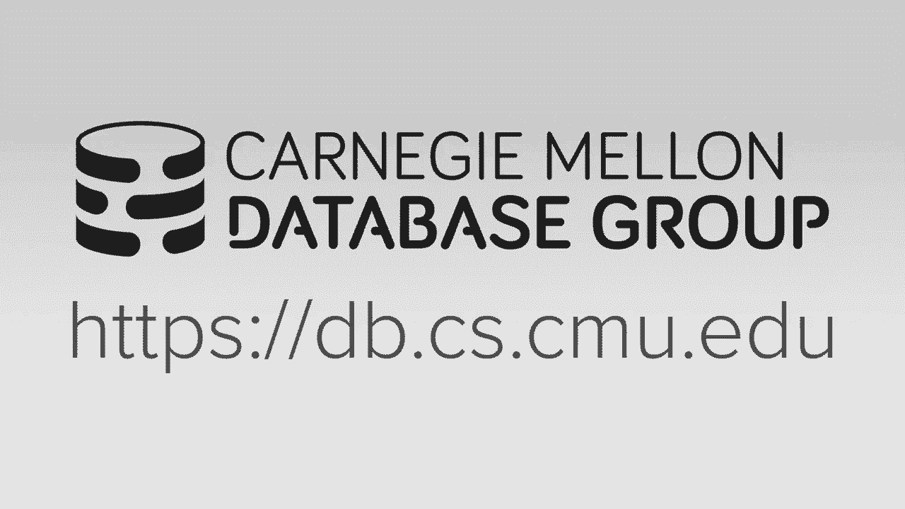
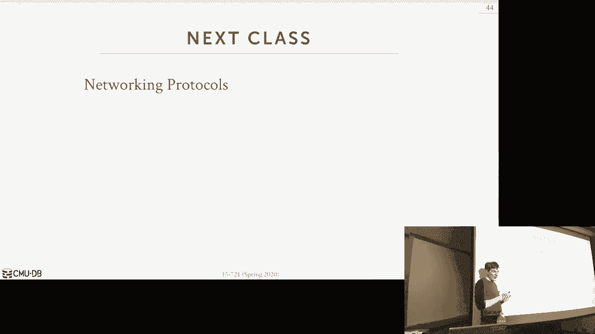

# 10：恢复协议 🔄

在本节课中，我们将要学习数据库恢复协议，特别是针对内存数据库的恢复机制。我们将探讨不同类型的日志记录方案、检查点协议以及如何利用多版本并发控制（MVCC）的特性来优化恢复过程。课程内容将涵盖物理日志与逻辑日志的区别、运行时日志刷新的策略，以及如何设计系统以实现快速恢复。

---

## 概述 📋

数据库系统在发生崩溃后，必须能够恢复到正确的状态，以保证事务的原子性、一致性和持久性。恢复算法通常包含两个部分：运行时记录额外信息，以及崩溃后根据这些信息恢复数据库。对于内存数据库，恢复协议相对简化，因为主存储位置在内存中，崩溃后内存内容会丢失，我们只需从检查点重新加载并重放日志即可。

上一节我们介绍了恢复的基本概念，本节中我们来看看具体的日志记录方案。

---

## 日志记录方案 📝

日志记录方案主要分为物理日志和逻辑日志。

### 物理日志

物理日志记录在字节级别对数据所做的更改。例如，如果使用Delta存储，则记录被修改的列及其新值。崩溃后，系统只需重放这些日志记录，并将更改重新应用到相应的列上。

**核心概念**：物理日志记录的是数据在存储层面的具体变更。

### 逻辑日志

逻辑日志记录的是应用程序请求执行的高级操作，例如SQL的`UPDATE`、`DELETE`语句。如果一个查询需要更新十亿条元组，物理日志需要十亿条记录，而逻辑日志只需记录一条更新语句。

**核心概念**：逻辑日志记录的是导致数据变更的操作本身。

逻辑日志的日志文件更小，提交速度可能更快，但恢复过程可能更耗时，因为需要重新执行这些操作。

---

## 日志刷新时机 ⏱️

日志记录生成后，需要决定何时将其刷新到磁盘。主要有两种策略。

以下是两种主要的刷新策略：

1.  **一次性刷新**：事务运行时，所有日志记录都缓存在内存的日志缓冲区中。只有当事务提交时，才将所有日志记录一次性交给日志线程刷新到磁盘。这简化了恢复过程，因为崩溃后很少能看到未提交事务的日志记录。
2.  **增量刷新**：当事务的本地日志缓冲区填满时，就将其交给写入线程刷新到磁盘，然后获取新的缓冲区。这意味着磁盘上可能存在未提交事务的日志记录，恢复时需要额外工作来识别并跳过它们。

大多数系统采用增量刷新策略，以避免内存耗尽，并提高运行时性能。

---

## 标准优化技术 ⚙️

在内存数据库系统中，我们仍然可以应用一些标准的优化技术来提高日志记录效率。

以下是两种关键的优化技术：

*   **组提交**：将多个事务的日志记录填充到同一个日志缓冲区中，然后一次性刷新到磁盘。这可以分摊I/O操作的成本，提高吞吐量。
*   **推测性锁释放**：在事务提交后，不必等待日志记录持久化到磁盘再释放锁。其他事务可以立即开始修改这些数据，但需要跟踪哪些读取操作依赖于尚未持久化的写入，并在必要时阻塞。

这些技术有助于减少日志记录带来的延迟。

---

## 利用MVCC进行恢复 🔄

在多版本并发控制系统中，为MVCC生成的增量记录与为日志文件生成的记录非常相似。我们可以将两者结合，避免重复工作。

SQL Server的“持久化版本存储”协议就是一个例子。它利用MVCC的时间旅行表（版本存储）来充当恢复日志。系统将更改写入版本存储，并定期将其刷新到日志文件。崩溃恢复时，只需将版本存储加载回内存，数据库就回到了崩溃时的状态。然后，系统利用MVCC的可见性规则，在后台清理未提交事务的版本。

这种方法的目标是实现“恒定时间恢复”，即恢复时间仅取决于日志文件的大小，而无需花费时间回滚未提交的更改。

---

## 内存数据库的日志协议：SiloR 🚀

Silo是一个使用OCC的单版本内存数据库引擎。其日志协议SiloR旨在最大化并行化日志记录、检查点和恢复过程。

SiloR的关键设计是将日志分散到多个文件，存储在不同的磁盘上，以实现并行读写。每个CPU插槽都有一个专用的日志线程和日志文件，这有助于将内存写入本地化，避免跨插槽通信的开销。

由于日志分散在多个文件，一个事务的日志记录可能分布在不同的磁盘上。Silo使用**持久化纪元**机制来协调所有日志线程，确保一个事务的所有更新都安全刷新后，才认为该事务已持久化。

Silo的日志记录包含事务ID、表、键和值（可以是增量记录）。由于Silo提供可串行化隔离级别，仅凭事务ID就足以保证重放日志时能恢复到正确状态，无需额外的日志序列号。

在恢复时，Silo采用了一种独特的方法：**从日志文件末尾开始，逆向重放日志记录**。因为内存数据库没有脏页问题，我们只需确定每个元组的最终状态。如果遇到时间戳早于当前元组时间戳的日志记录（意味着该元组已被之后的事务更新过），则忽略该记录。这可以显著加快恢复速度，尤其是当少量元组被反复更新时。

---

## 检查点协议 📌

为了防止日志文件无限增长，并加速恢复，我们需要定期创建检查点。

### 检查点属性

一个理想的检查点协议应具备以下属性：

*   **低运行时开销**：对正常事务处理的影响应控制在10%-15%以内。
*   **无巨大延迟尖峰**：不应采用阻塞式检查点，导致事务排队。
*   **低内存开销**：尽量避免在内存中创建完整的数据库副本。

### 检查点类型

以下是检查点的几种分类：

*   **一致性检查点 vs. 模糊检查点**：
    *   **一致性检查点**：快照只包含在检查点开始前已提交事务的更新。这对于MVCC系统很容易实现，只需扫描并写出对检查点事务可见的数据版本即可。
    *   **模糊检查点**：快照可能包含检查点开始后提交事务的部分更新。恢复时需要额外工作来协调。
*   **完整检查点 vs. 增量检查点**：
    *   **完整检查点**：写出数据库的完整快照。
    *   **增量检查点**：只写出自上次检查点以来的更改。这可以节省存储空间，但管理更复杂（需要合并多个增量文件）。
*   **触发频率**：
    *   **基于时间**：例如每5分钟触发一次。
    *   **基于日志大小**：例如每写入100MB日志后触发。这有助于限制恢复时需要处理的日志量。

大多数内存数据库系统采用完整的一致性检查点。恢复时，加载检查点文件并重建索引。

---

## 快速重启技术 ⚡

有时我们需要有计划地重启数据库（例如升级软件），而非应对崩溃。Facebook的Scuba系统提出了一种利用共享内存实现快速重启的技术。

当需要重启Scuba进程时，系统会停止所有更新，将数据库的完整状态写入共享内存区域，然后关闭旧进程。新进程启动后，发现共享内存中存在数据库状态，便直接将其加载进来，而无需从磁盘读取检查点文件。这相当于将共享内存用作一个“RAM磁盘”，使得数据库状态能够跨越进程的生命周期。

这种方法可以极大缩短有计划重启的停机时间，特别是对于大型内存数据库。

---

## 总结 🎯

本节课我们一起学习了数据库恢复协议，重点探讨了内存数据库环境下的特殊考虑和优化技术。

*   我们比较了**物理日志**和**逻辑日志**的优劣，物理日志因其恢复简单直接而更受青睐。
*   我们分析了日志**刷新策略**（一次性 vs. 增量）及其对恢复的影响。
*   我们探讨了如何利用**MVCC**的版本存储来简化日志记录和恢复过程，实现接近恒定时间的恢复。
*   我们深入研究了**SiloR**日志协议，其通过分散日志、使用持久化纪元和逆向日志重放等设计，实现了高度并行化和快速的恢复。
*   我们介绍了**检查点协议**的不同类型和目标，强调了一致性检查点在MVCC系统中的优势。
*   最后，我们了解了利用**共享内存**实现有计划快速重启的创新技术。

关键要点是，对于内存数据库，我们可以专注于记录重做信息，利用其存储特性简化恢复逻辑，并通过巧妙的系统架构（如并行日志、MVCC集成、共享内存）来极大提升恢复性能。随着非易失性内存的普及，未来的恢复协议可能会进一步演变，但核心思想将保持不变。