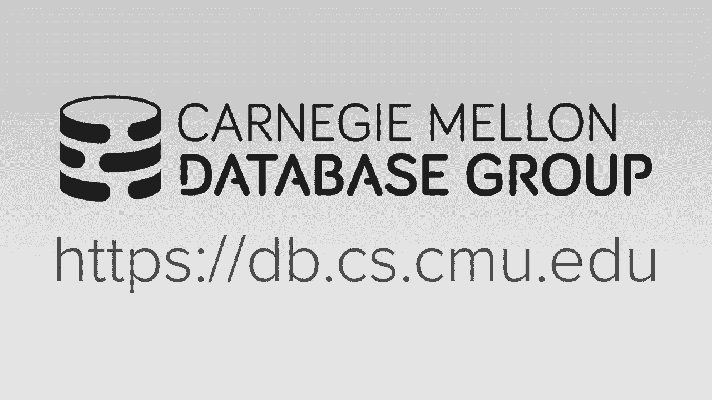
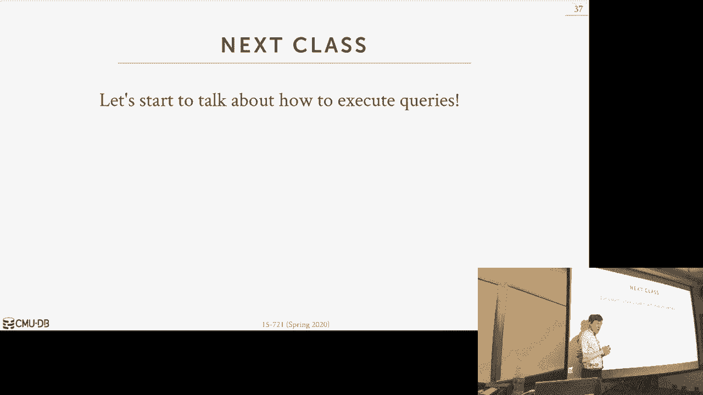

# 数据库系统进阶：L11：网络协议

## 概述

在本节课中，我们将学习数据库系统中的网络协议。我们将探讨客户端如何与数据库服务器通信、数据传输的优化方法，以及一些绕过操作系统以提升性能的高级技术。

## 课程内容概览

在开始深入网络协议之前，我们先回顾一下本课程的整体架构。我们构建的数据库系统可以概念化地分为几个层次：应用层发送SQL查询，查询首先到达网络层，然后经过查询优化器生成物理计划，再通过编译器转换为机器码，最后由执行引擎在存储管理器之上执行查询。本节课，我们将聚焦于最顶层的网络层。

上一节我们介绍了存储和索引，本节中我们来看看客户端与数据库服务器之间的通信机制。

## 客户端访问方法

在真实的应用程序中，我们不会通过终端手动输入SQL来与数据库交互。相反，我们会使用编程接口（API）来发送查询并接收二进制格式的结果，以避免在应用层进行繁琐的文本解析和类型转换。

以下是两种主要的标准化数据库访问API：

*   **ODBC**：一种早期的、主要用于C/C++应用的数据库访问标准。它采用“设备驱动”模型，数据库厂商提供特定的ODBC驱动，该驱动负责将标准的API调用转换为数据库专有的网络协议（即“有线协议”），并将结果转换回ODBC指定的格式。
*   **JDBC**：专为Java应用程序设计的数据库访问API。JDBC驱动可以通过多种方式与数据库通信，包括通过ODBC桥接、调用数据库原生API、通过中间件转换，或者最理想的是，直接实现数据库的有线协议。

## 有线协议

几乎所有主要的数据库系统都实现了自己专有的有线协议，并且通常基于TCP/IP。客户端连接数据库的典型流程包括：建立连接、身份验证、发送查询、服务器执行并序列化结果，最后将结果返回给客户端。

然而，许多较新的数据库系统选择兼容现有的流行协议（如PostgreSQL或MySQL的协议），而不是从头开发。这样做的好处是可以直接利用现有的、成熟的客户端驱动生态，降低开发成本。但需要注意的是，“协议兼容”并不等同于“完全兼容”，可能在SQL方言、系统目录等方面存在差异。

查询本身通常不是性能瓶颈，因为大多数查询语句较小。真正的优化机会在于**结果数据的序列化与传输**。

## 数据传输优化

我们阅读的论文重点讨论了如何优化大量数据的导出。其核心思想借鉴了我们在存储层讨论过的技术。

首先，我们需要在行格式和列格式之间做出选择。传统的ODBC/JDBC API本质上是行导向的，服务器按行组织结果并发送。但对于分析型或机器学习工作负载，列格式更为高效。

论文提出的方法是：将多个元组组织成一个数据块，在块内使用列式存储（即PAX模型）。这样做的优势在于，可以对同一列中的相似数据应用高效的压缩算法。

关于数据压缩，有两种主要策略：
*   **通用压缩**：对整个数据块使用如Snappy或gzip等算法。这种方法简单，与数据类型无关。
*   **列特定编码**：使用如RLE、字典编码或增量编码等方法。这种方法压缩率可能更高，但需要在客户端实现相应的解码逻辑。

论文的实验表明，在网络延迟较低时，不压缩的二进制传输最快；而当网络变慢时，进行压缩（即使有CPU开销）能带来更好的整体性能。

数据的序列化格式也影响性能：
*   **二进制编码**：直接传输数据的原生二进制表示，效率最高。但需要注意字节序等问题，通常由客户端驱动处理。
*   **文本编码**：将数据转换为字符串（如JSON）传输。这种方式更灵活但体积更大、解析更慢，通常不是高性能场景的首选。

对于字符串的处理，常见方法有：空终止符、长度前缀和固定长度字符域。选择哪种方式取决于数据特征和是否启用压缩。

## 内核旁路技术

操作系统网络栈（TCP/IP）本身可能成为高吞吐量场景的瓶颈，因为涉及系统调用、上下文切换和数据拷贝。内核旁路技术旨在绕过OS，让应用程序直接与网卡交互。

以下是两种主要的内核旁路方法：
*   **DPDK**：一个软件库，允许应用程序直接访问网卡，在网卡缓冲区中准备数据包，从而避免数据拷贝和系统调用。目前使用此技术的数据库系统较少，ScaliaDB是一个例子。
*   **RDMA**：允许一台机器直接读写另一台机器的内存。这对于数据库集群内部通信非常高效（如Oracle RAC），但由于需要精确控制内存布局和一致性，很难用于通用的客户端-服务器通信。

实验表明，通过精心设计的内存直接访问，数据导出性能可以比经过传统数据库协议高出数个数量级。

## 总结

本节课我们一起学习了数据库网络协议的关键内容。我们了解了客户端如何通过ODBC/JDBC等标准API访问数据库，以及底层专有有线协议的作用。我们重点探讨了优化结果数据传输的技术，包括采用列式存储、数据压缩和高效的序列化格式。最后，我们简要介绍了DPDK和RDMA这两种绕过操作系统以追求极致性能的内核旁路技术。尽管优化网络协议存在巨大潜力，但由于需要考虑客户端驱动的兼容性，在实际系统中进行重大变更往往面临挑战。