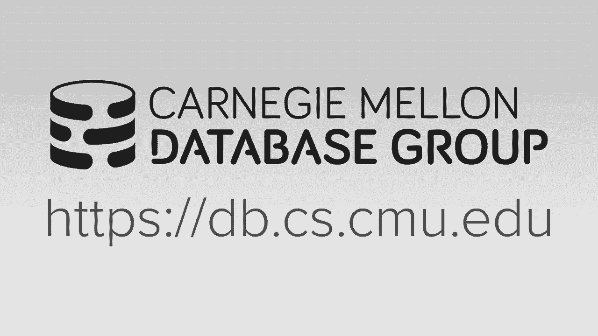
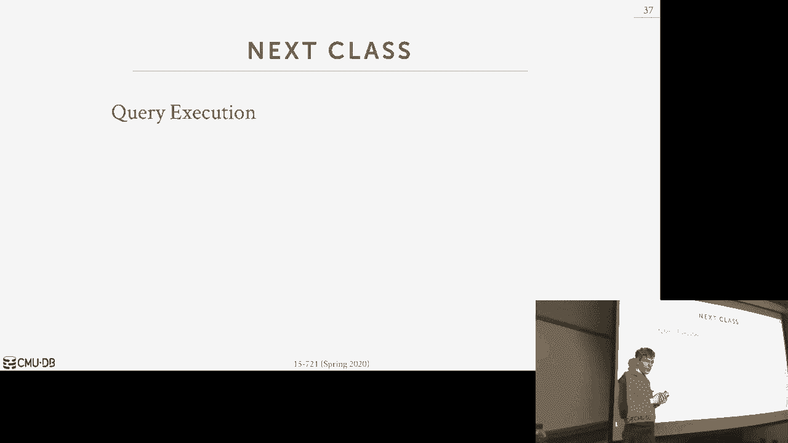

# 12：调度规划 🧠



在本节课中，我们将要学习数据库系统中查询执行的调度规划。我们将探讨如何将查询计划分解为任务，如何根据硬件架构（特别是NUMA）高效地分配这些任务，以及不同的调度模型（如静态调度、动态工作窃取）如何影响系统性能。核心目标是理解数据库系统如何绕过操作系统，自主做出最优的资源调度决策，以实现最高效的查询执行。

## 进程模型 🏗️

上一节我们介绍了查询计划的基本概念，本节中我们来看看数据库系统支持并发请求的底层架构，即进程模型。它定义了系统如何将计算单元（工作者）分配给任务。

以下是三种主要的进程模型：

*   **进程/工作者模型**：每个数据库工作者是一个独立的操作系统进程。调度由操作系统管理（例如，通过`fork`）。优点是工作者崩溃不会导致整个系统宕机（例如，PostgreSQL, Oracle, DB2）。缺点是需要进程间通信（IPC）或共享内存来协调，且调度控制权交给了操作系统。
*   **进程池模型**：系统维护一个预分配的进程池来处理请求，而非为每个请求创建新进程。这减少了进程创建的开销，并可能支持查询内并行。但如果不精心设计，可能破坏缓存局部性（例如，PostgreSQL在2015年后支持查询内并行）。
*   **线程/工作者模型**：在单个进程内使用多个线程作为工作者。这是现代数据库系统（如Peloton）最常用的模型。优点是上下文切换开销低，所有线程共享同一地址空间，通信简单。缺点是需要处理线程同步（锁、闩锁）问题。POSIX线程（pthreads）的标准化使其成为可行选择。

**核心概念**：在代码中，工作者通常被实现为线程。
```cpp
std::thread worker_thread(execute_task, task_queue);
```

## 数据放置与NUMA架构 🧩

在决定了工作者模型后，我们需要确保工作者操作的数据是“本地”的。在现代多插槽（多CPU）服务器中，内存访问并非均匀，这引出了非统一内存访问（NUMA）架构的概念。

*   **统一内存访问（UMA/SMP）**：所有CPU通过一个共享系统总线访问内存，访问任何内存地址的成本相同。这是较旧的架构。
*   **非统一内存访问（NUMA）**：每个CPU插槽有本地连接的内存（本地NUMA节点）。访问本地内存速度很快，而通过互联（如Intel的QPI）访问远程插槽的内存则可能慢50%以上。现代多插槽系统普遍采用此架构。

对于数据库系统，这意味着我们需要有意识地控制数据放置和任务调度：

1.  **数据放置**：当数据加载到内存时，我们希望将其分配到与将要处理它的线程相同的NUMA节点上。可以使用`first-touch`策略（操作系统将内存页分配在首次访问它的线程所在的NUMA节点）或事后使用如`move_pages`的系统调用来迁移数据。
2.  **任务调度**：调度器需要知道数据的位置，并尽量将任务分配给与该数据位于同一NUMA节点的线程上执行。

研究表明，与让操作系统随意放置数据相比，精心设计的数据放置和任务调度能带来显著的性能提升（在某些OLTP和OLAP工作负载中可达30%至2倍以上）。

**核心概念**：访问远程NUMA节点的内存比访问本地内存慢得多。
```
本地内存访问延迟 < 远程内存访问延迟（可能慢50%+）
```

## 调度方法 ⚙️

现在我们已经有了工作者（线程）并了解了数据布局，接下来看看如何调度查询任务。调度决定了任务如何被创建、分配给工作者以及如何执行。

### 静态调度

静态调度是最简单的方法。系统在查询执行前就确定好任务数量（通常与核心数一致）和分配方案，然后开始执行。这种方法实现简单，但缺乏灵活性，无法处理运行时数据倾斜导致的负载不均问题（例如，某个核心上的任务需要处理更多符合谓词条件的元组）。

### 动态调度（工作窃取）

动态调度允许系统在运行时根据负载情况调整任务分配。Hyper论文中提出的**Morsel-Driven并行**是一个典型例子。

*   **Morsel（数据块）**：将数据表水平分割成小块（例如，每块10万行），称为Morsel。这些Morsel被轮询分配到不同NUMA节点。
*   **任务与队列**：查询计划被分解为任务，放入一个全局任务队列。每个工作者线程（通常每核心一个）从队列中拉取任务。
*   **工作窃取**：工作者优先处理其本地NUMA节点上的Morsel。如果某个工作者完成任务后队列中仍有任务，而其他工作者（可能因数据倾斜而变慢）还在忙碌，空闲工作者可以“窃取”属于其他NUMA节点的任务来执行。这有助于平衡负载，避免出现拖后腿者。
*   **局部性保持**：处理结果通常写入线程本地缓冲区，减少同步开销。

这种方法通过共享队列和工作窃取实现了灵活的负载均衡，特别适合OLAP查询。

### 混合调度（HANA模型）

SAP HANA的研究提出了一种更复杂的混合模型，结合了工作窃取和资源动态调整。

*   **多级任务队列**：每个`调度组`（一组共享本地内存的工作者）维护两个队列：
    *   **硬队列**：包含必须在本组内执行的任务，不允许被窃取。
    *   **软队列**：包含可以被其他组工作者窃取的任务。
*   **工作者状态池**：工作者被分为不同状态池（运行中、非活跃、空闲、暂停），便于管理。
*   **看门狗线程**：一个全局监控线程观察所有组的负载。它可以动态地“暂停”或“唤醒”工作者线程，甚至在不同组间迁移线程资源，以实现更精细的资源分配和流控。

这种模型提供了极高的调度灵活性和资源控制能力，但实现复杂度也更高。

### 用户态调度（SQL Server SQLOS）

微软SQL Server采用了一种极端且独特的方案：在数据库引擎内实现了一个名为**SQLOS**的轻量级用户态操作系统。

*   **抽象硬件**：SQLOS抽象了底层硬件细节（如NUMA），使上层查询执行引擎无需关注这些复杂性。
*   **协作式非抢占调度**：SQLOS实现自己的线程调度器。它要求数据库引擎代码在长时间运行的操作中主动**让出（yield）**控制权（例如，在扫描循环中检查耗时）。调度量子（如4毫秒）由SQLOS管理。
*   **优势**：这使得SQL Server能够实现跨查询的公平调度、资源治理（如为不同租户分配不同CPU份额），并简化了向新平台（如Linux）的移植，因为只需修改SQLOS与操作系统的接口层。

## 流控制 🚦

当查询请求到达的速度超过系统处理能力时，系统会过载。数据库系统需要实现流控制机制来应对，而不是依赖操作系统。

以下是两种主要策略：

*   **准入控制**：当系统检测到资源（CPU、内存）不足时，直接拒绝新的查询请求。这是最常见的方法。
*   **节流**：不对请求立即拒绝，而是引入人工延迟后再开始处理或执行，以平滑负载，避免系统瞬间被压垮。

高级系统还可以结合优先级队列，确保高优先级用户（或管理员）的查询即使在过载时也能获得资源。

## 总结 📚

本节课我们一起学习了数据库查询执行中的调度规划。我们从底层的**进程模型**（线程 vs 进程）出发，探讨了现代硬件**NUMA架构**对数据放置和任务本地性的关键影响。接着，我们深入分析了多种**调度方法**：从简单的静态调度，到灵活的基于Morsel的动态工作窃取（Hyper），再到复杂的混合资源管理（HANA），最后了解了将调度推向极致的用户态操作系统方法（SQL Server SQLOS）。最后，我们讨论了防止系统过载的**流控制**机制。




贯穿始终的核心思想是：**数据库系统掌握着查询语义、数据布局和系统资源的完整信息，因此应该（并且能够）比通用操作系统做出更优的调度决策，以最大化性能。** 从数据局部性利用到细粒度的任务调度，现代数据库系统正越来越多地将操作系统视为一个需要谨慎管理的“伙伴”，而非全权委托的“管家”。