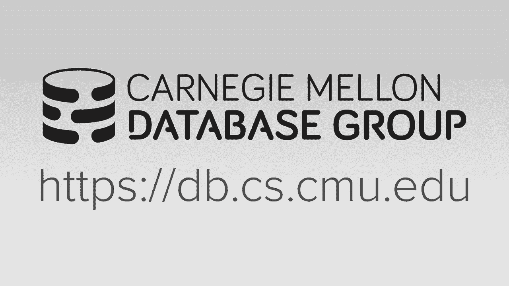
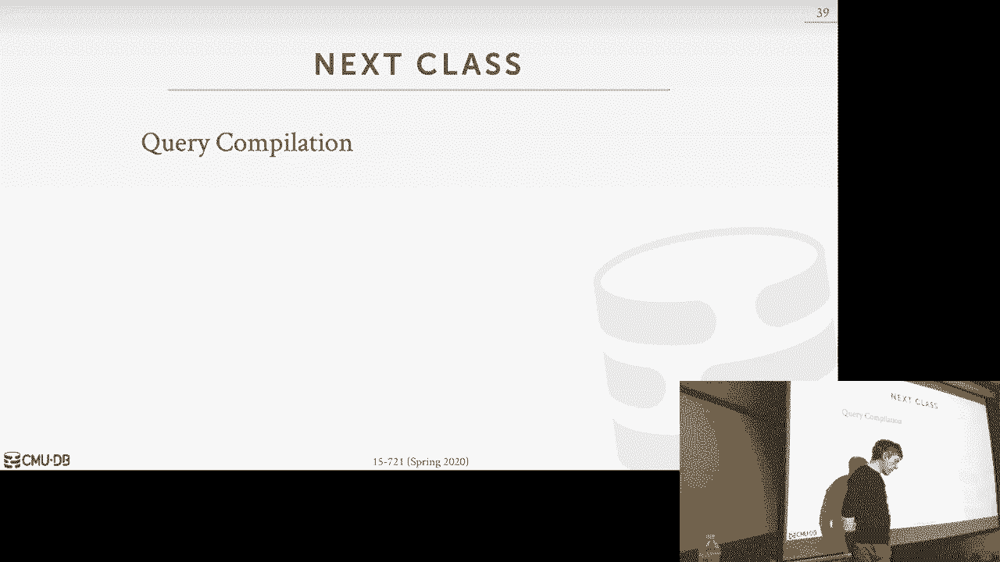

# 数据库系统进阶：L13：查询执行与处理 🚀



在本节课中，我们将要学习如何高效地执行查询。我们将探讨现代CPU架构如何影响数据库系统的设计，并介绍不同的查询处理模型，包括迭代器模型、物化模型和向量化模型。最后，我们会讨论如何通过并行执行来进一步提升查询性能。

---

## CPU架构与数据库性能 ⚙️

上一节我们概述了课程内容，本节中我们来看看现代CPU架构对数据库系统设计的影响。在内存数据库系统中，磁盘I/O不再是主要瓶颈，因此我们需要关注CPU如何高效地执行指令。

现代CPU是**超标量**处理器，它们通过流水线阶段并行执行指令。CPU会尝试预测分支路径（分支预测）并提前执行指令，如果预测错误，则需要清空流水线，这会导致性能损失。对于数据库系统，尤其是在扫描元组和评估谓词时，会产生大量分支，可能引发**分支预测错误**。

此外，我们希望减少指令执行周期，这意味着需要最大化数据局部性，减少缓存未命中。CPU缓存层次结构（L1、L2、L3）的访问速度远快于主内存（DRAM），因此优化数据访问模式至关重要。

以下是影响数据库性能的CPU关键特性：
*   **流水线**：允许指令重叠执行以隐藏延迟。
*   **乱序执行**：CPU动态重新排序指令以保持执行单元繁忙。
*   **分支预测**：预测条件分支的走向，预测错误代价高昂。
*   **缓存层次结构**：快速但容量小的缓存，未命中会导致停滞。

---

## 查询处理模型 🔄

了解了CPU特性后，我们来看看如何组织数据库系统来处理包含多个操作符的查询。根据工作负载类型（如OLTP或OLAP），可以选择不同的处理模型。

### 迭代器模型（火山模型）

这是最常见的模型，也被称为**火山模型**或拉取模型。每个操作符都实现一个 `Next()` 函数，每次调用返回一个元组。查询计划树从根节点开始，通过递归调用子节点的 `Next()` 来获取并处理数据。

**优点**：
*   易于实现输出控制（例如 `LIMIT` 子句）。
*   支持**流水线执行**，元组在处理后可以立即传递给下一个操作符。

**缺点**：
*   每个元组都需要一次函数调用，开销较大。
*   大量虚函数调用可能阻碍编译器优化。

使用此模型的数据库系统包括：SQLite、MySQL、PostgreSQL。

---

### 物化模型

在物化模型中，每个操作符一次处理并生成其所有输出元组（或列），然后将整个结果集传递给父操作符。这可以是自顶向下或自底向上的。

**优点**：
*   减少函数调用开销。
*   更适合OLTP工作负载，这类查询通常只涉及少量元组。

**缺点**：
*   对于需要处理大量数据的OLAP查询，中间结果集可能非常庞大，消耗大量内存。
*   可能阻碍流水线执行。

使用此模型的系统包括：MonetDB、VoltDB/H-Store、Hyper（旧版本）。

---

### 向量化模型

向量化模型是迭代器模型的扩展。操作符的 `Next()` 函数返回一批元组（一个向量），而不是单个元组。操作符内部可以使用**SIMD指令**并行处理这批数据。

**公式**：`Next() -> Vector<Tuple>`

**优点**：
*   大幅减少函数调用开销。
*   能够利用SIMD指令进行数据级并行，显著提升扫描、过滤等操作的性能。
*   非常适合分析型（OLAP）查询。

**缺点**：
*   实现更复杂。
*   需要仔细选择向量大小以匹配CPU的SIMD寄存器。

使用此模型的现代分析型数据库系统包括：Snowflake（源自VectorWise）、Amazon Redshift、ClickHouse以及我们正在开发的新系统。

---

## 并行查询执行 ⚡

最后，我们探讨如何利用多核CPU并行执行查询。并行性可以在两个维度上实现：**操作符内并行**和**操作符间并行**。

### 操作符内并行（水平并行）

将输入数据水平分区，每个工作线程在数据的一个分区上执行相同的操作符实例。这通常用于扫描、过滤等操作。

**代码示例**（概念）：
```python
# 假设将表R水平分为N个分区
partitions = partition_table(R, num_partitions=N)
for partition in partitions:
    execute_scan_operator(partition) # 在并行线程中执行
```

需要使用**交换操作符**来协调多个工作线程的结果，它作为一个同步点，确保所有子任务完成后再进入下一阶段。

---

### 操作符间并行（垂直并行）

允许查询计划中不同管道（pipeline）的操作符同时执行。例如，在构建哈希表的同时，可以开始扫描另一张表。

**优点**：
*   更好地利用多核资源，重叠不同操作符的执行。
*   可以减少总体查询延迟。

**挑战**：
*   需要仔细管理操作符之间的数据依赖关系。
*   执行计划更复杂。

在实际系统中，通常会结合使用水平并行和垂直并行来最大化性能。

---

## 总结 📚



本节课中我们一起学习了构建高效查询执行引擎的关键知识。我们首先了解了现代CPU的特性（如流水线、分支预测、缓存），并认识到为人类易读而编写的代码可能对CPU执行并不友好。

接着，我们探讨了三种主要的查询处理模型：
1.  **迭代器模型**：通用性强，但函数调用开销大。
2.  **物化模型**：适合处理少量元组的OLTP负载。
3.  **向量化模型**：通过批处理和SIMD指令，为OLAP查询提供了最佳性能，是现代分析型数据库的首选。


最后，我们讨论了如何通过操作符内并行和操作符间并行来利用多核架构，从而进一步提升查询执行速度。理解这些底层原理和设计权衡，对于构建或优化高性能数据库系统至关重要。