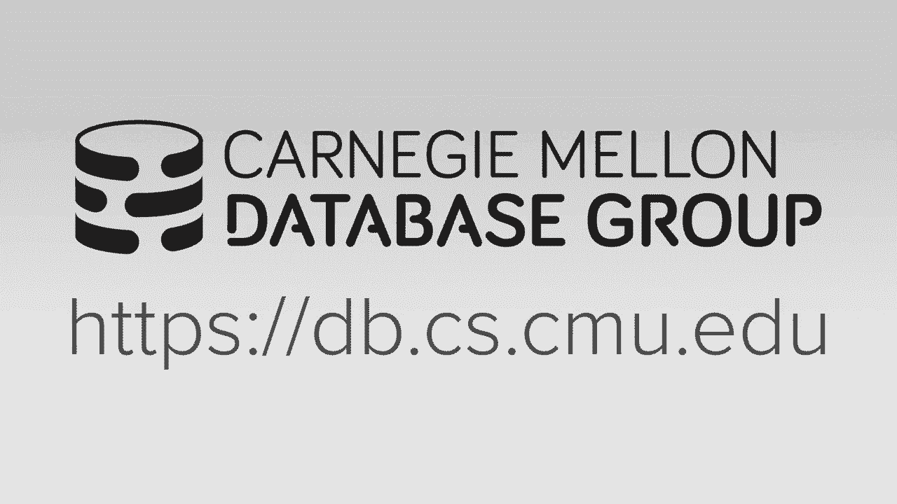
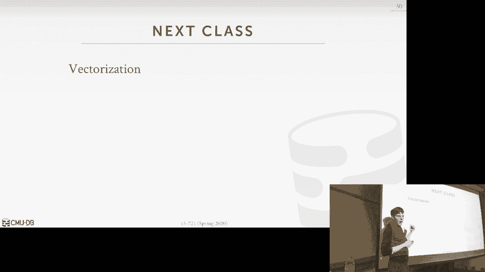

# 14：查询编译与代码生成

## 概述

在本节课中，我们将学习查询编译与代码生成的核心概念。这是现代数据库系统用于获取最佳性能的主要技术之一。我们将探讨为什么需要代码生成，以及两种主要的技术：源码到源码编译（Transpilation）和即时编译（JIT Compilation）。课程内容将涵盖从背景知识到实际系统实现的各个方面，并通过具体示例帮助初学者理解。

---

## 背景：为什么需要查询编译？

上一节我们讨论了如何让系统运行得更快，关键在于减少需要执行的指令数量，并提高每个时钟周期执行的指令数。然而，仅仅通过优化指令来获得显著的性能提升是非常困难的。

例如，如果想让数据处理速度提升10倍，就需要减少90%的指令执行。这虽然困难，但通过精心设计的数据库架构是可以实现的。但如果想提升100倍，就需要减少99%的指令，这变得极其困难。

因此，今天的课程以及后续关于向量化的课程，将介绍如何通过执行更少的指令来完成相同的工作量，从而尝试实现100倍的性能提升。英特尔不再单纯提高时钟速度，而是提供更宽的SIMD寄存器和更专业的指令。作为数据库系统开发者，我们需要设计系统来利用这些硬件特性。

**公式**：性能提升倍数 ≈ (1 / (1 - 指令减少百分比))。例如，减少90%指令，性能提升约10倍。

---

## 代码专门化（Code Specialization）的概念

代码专门化的核心思想是：与其在数据库系统中使用通用代码来处理查询或执行任务，不如生成专门针对特定任务（通常是查询）的代码。

这样做的性能优势在于，通用系统中存在大量的间接调用（如`if`条件判断或`switch`语句），用于处理各种可能的数据类型、操作数、谓词或聚合函数。而专门化的代码则去除了所有这些间接性，只包含执行该特定查询所需的确切指令。

当然，人们编写通用系统代码并非因为愚蠢，而是出于软件工程的考虑：代码可重用、易于维护。但问题在于，对人类来说易于理解的代码编写方式，对CPU来说往往效率低下。

---

## 解释执行模型的局限性

为了理解编译的优势，我们先看一个解释执行的例子。假设有一个简单的三表连接查询。

使用之前讨论过的迭代器模型（火山模型）执行此查询，会涉及大量的`Next()`函数调用和数据在操作符间的复制。每个元组都需要通过函数调用链向上传递，这会产生巨大的开销。

此外，谓词求值本身也很昂贵。谓词通常表示为表达式树，系统需要从根节点开始遍历这棵树，为每个正在处理的元组求值。对于一个有十亿个元组的表，这意味着要进行十亿次的树遍历和函数调用。

**核心问题**：
1.  查询计划解释执行带来的操作符间间接调用开销。
2.  谓词表达式树求值带来的间接开销。

代码生成的目标正是消除这两种开销。

---

## 查询编译流程总览

在一个真实的数据库系统中，查询处理管道大致如下：

1.  **解析**：SQL查询进入，被解析成抽象语法树（AST）。
2.  **绑定**：绑定器查阅目录，将数据库对象名称（字符串）替换为内部标识符。
3.  **优化**：查询优化器接收注解后的AST，生成物理查询计划。
4.  **编译/代码生成**：编译器（或转换器、代码生成引擎）接收物理查询计划（操作符树），并输出某种本地代码或字节码。

本课程重点在于最后一步：将物理计划转换为直接执行、无任何间接性的源代码或本地代码。

由于这个转换步骤由数据库开发者控制，我们无需担心安全沙盒问题，生成的代码可以直接在数据库进程内安全执行。

---

## 两种代码生成方法

主要有两种实现查询编译的方法：

### 1. 源码到源码编译（Transpilation）

这种方法中，数据库系统拥有能生成新源代码（如C++代码）的专门化代码。然后，通过常规编译器（如GCC）编译此新源代码，链接到数据库进程，并执行。

**优点**：
*   调试相对容易，可以使用GDB等标准工具。
*   生成的代码可以像普通数据库系统代码一样，调用系统内部的其他函数（通过暴露的API）。

**缺点**：
*   **编译成本高**：需要调用外部编译器进程，对于短查询，编译时间可能超过执行时间。
*   早期的HyPer系统论文中比较了这种方法与LLVM JIT，显示其编译耗时显著更长。

### 2. 即时编译（JIT Compilation）

这种方法不生成高级源代码，而是直接生成低级或中间表示（IR），例如LLVM IR或JVM字节码。然后可以即时编译或解释执行这些IR。

**优点**：
*   **编译速度快**：省去了调用完整C++编译器的开销，编译过程在进程内完成，速度比调用GCC快一个数量级。
*   同样可以获得消除间接性的所有性能优势。

**缺点**：
*   调试生成的机器码更困难。
*   需要处理C++函数名修饰等问题以调用系统其他部分。

两种方法的最终结果相同：生成针对特定查询计划的、无间接性的可执行代码。选择哪种取决于编译时间、软件工程复杂性和调试便利性的权衡。

---

## 深入源码到源码编译：以HyPer早期工作为例

早期的HyPer系统采用了类似“HighQ”思想的源码到源码编译。它会为给定的查询计划生成实现该计划的C++代码，其中所有谓词和类型转换都根据表模式硬编码。

**工作流程**：
1.  系统接收查询计划。
2.  使用C++模板生成对应的C++源文件。
3.  `fork/exec`调用GCC编译该源文件为共享对象（`.so`）。
4.  将共享对象动态链接到数据库进程。
5.  调用该共享对象中的特定函数来执行查询。

**性能对比实验**：
HighQ论文中比较了五种执行模型：
1.  通用迭代器（教科书式火山模型）。
2.  优化迭代器（针对特定列类型的迭代器，谓词下推）。
3.  硬编码实现（手工优化版，对应通用迭代器）。
4.  硬编码实现（手工优化版，对应优化迭代器）。
5.  HighQ的源码到源码编译器。

实验表明，通用迭代器性能最差。而HighQ生成的代码与手工硬编码优化版本的性能相当，这证明了自动代码生成的有效性。性能提升主要来自于消除了循环内核中的函数调用和间接内存访问，使得CPU能够快速连续处理数据。

**主要缺点**：编译延迟。对于短查询，调用GCC的耗时可能远超查询执行本身。

---

## 即时编译与流水线执行：以HyPer的LLVM方案为例

现代HyPer系统的关键创新之一是将即时编译与**基于推送的流水线执行模型**相结合。

### 流水线（Pipeline）概念

查询计划可以被划分为多个流水线。一个流水线是查询计划的一部分，能够获取单个元组并将其在计划中尽可能远地向上推送，直到遇到一个“流水线中断器”（例如哈希聚合，需要收集所有元组后才能继续）。

这种模型的优势在于，它允许数据更长时间地保留在CPU高速缓存甚至寄存器中，从而极大地提高了处理速度。

### LLVM即时编译

HyPer使用LLVM进行即时编译：
1.  系统将物理查询计划转换为LLVM中间表示（IR）。
2.  使用LLVM的JIT编译器将IR编译为机器码。
3.  执行生成的机器码。

与源码到源码编译相比，LLVM JIT省去了生成C++代码和调用外部编译器的步骤，编译速度更快。

**性能结果**：在TPC-H查询上，启用完全流水线的LLVM JIT版本比不流水线的版本性能更好，也优于传统的解释执行（如Oracle）。

**编译成本问题**：即使使用LLVM，编译耗时（约37毫秒）对于亚毫秒级执行的短查询来说仍然显著。为此，HyPer提出了**阶梯式编译**方案。

---

## 应对编译延迟：阶梯式编译（Staged Compilation）

为了解决编译延迟影响短查询的问题，HyPer在2018年提出了阶梯式编译。

**核心思想**：立即开始执行查询，同时在后台进行越来越优化的编译，并在编译完成后无缝切换。

**三个阶段**：
1.  **字节码解释器**：首先将生成的LLVM IR转换为自定义字节码，并立即开始解释执行。这几乎零延迟。
2.  **未优化的LLVM编译**：将IR发送给LLVM，但关闭所有优化通道，快速生成未优化的机器码。完成后替换解释器。
3.  **优化的LLVM编译**：同时，在另一个线程进行完整的LLVM优化编译。完成后替换未优化的版本。

这种方法确保了查询总能立即开始执行，并且执行性能会随着时间的推移自动提升到最优水平。同时，字节码解释器也为调试生成的查询逻辑提供了便利。

---

## 现实世界中的查询编译

查询编译已成为现代数据库系统的标配，各种系统有不同的实现方式：

以下是不同系统的实现方式概览：

*   **IBM System R (1970s)**：最早的查询编译实践，生成汇编代码，但因维护困难后被放弃。
*   **Oracle**：在其高端产品（如内存列存储）中使用编译技术，存储过程会编译为原生代码。
*   **Microsoft Hekaton**：为内存OLTP编译存储过程和查询，生成C代码并编译为DLL。
*   **Vectorwise**：采用“预编译原语”方式。将低级操作（如比较、加法）针对特定数据类型预先编译好。查询执行时，计划将这些原语像拼图一样组合起来调用，结合向量化处理以获得高性能。
*   **Spark**：通过Tungsten引擎，将查询谓词转换为Scala AST，再生成JVM字节码执行。
*   **MemSQL (早期)**：类似HighQ，生成C++代码并调用GCC编译，依赖缓存来分摊编译开销。
*   **MemSQL (现代) / 我们的新系统**：采用更优架构：先将查询计划转换为高级领域特定语言（DSL），再将DSL编译为操作码（OpCode）。可以立即解释执行操作码，同时在后台将DSL编译为优化后的机器码。这平衡了即时执行和最终性能，也降低了工程复杂度。
*   **PostgreSQL (v11+)**：增加了对表达式和部分查询计划的JIT编译支持，默认使用成本模型决定是否编译。
*   **Impala**：使用LLVM编译谓词和特定文件格式（如Parquet）的解析器，以加速数据读取。

---

## 总结

本节课我们一起学习了查询编译与代码生成的核心技术。

*   **目标**：通过生成专门化的、无间接性的代码来最大化查询执行性能。
*   **关键问题**：消除解释执行模型中的操作符调用开销和谓词求值开销。
*   **两种主要方法**：
    *   **源码到源码编译**：易调试，但编译延迟高。
    *   **即时编译（JIT）**：编译快，是当前主流方向，常与LLVM结合。
*   **高级优化**：
    *   **流水线执行**：提升缓存利用率，是HyPer等系统高性能的关键。
    *   **阶梯式编译**：HyPer提出的创新，通过即时解释执行和后台编译来隐藏编译延迟，兼顾了响应时间和最终性能。
*   **业界实践**：从早期的探索到现代，查询编译已成为高性能数据库系统的核心组件，并有多种成功的实现模式。

掌握查询编译技术，对于理解现代数据库系统如何突破性能瓶颈至关重要。