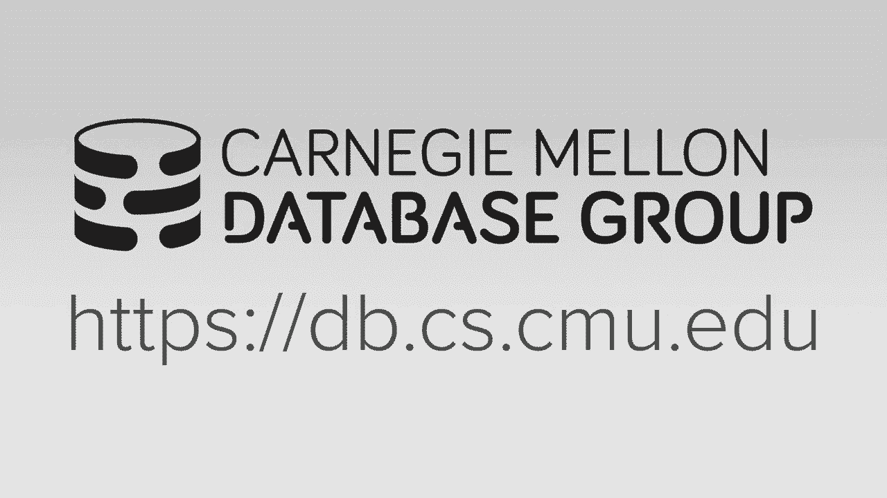

# 数据库系统进阶：L15：矢量化执行 🚀



## 概述
在本节课中，我们将要学习数据库系统中用于提升查询性能的两种主要方法之一：**矢量化执行**。我们将探讨什么是矢量化，如何利用SIMD指令实现它，并分析其在现代数据库算法中的应用与局限性。

---

## 什么是矢量化执行？🧠
矢量化执行是一种将原本按标量（一次处理一个数据项）设计的算法，转换为能够同时处理一个数据向量（多个数据项）的方法。通过使用单条SIMD指令，我们可以对向量中的所有数据项应用相同的操作，从而显著提升计算效率。

### 核心概念
在标量执行中，我们使用循环逐个处理数据：
```c
for (int i = 0; i < N; i++) {
    z[i] = x[i] + y[i];
}
```
而在矢量化执行中，我们可以使用SIMD指令一次性处理多个数据（例如4个）：
```c
// 伪代码，表示SIMD向量加法
vector_x = SIMD_LOAD(&x[i]);
vector_y = SIMD_LOAD(&y[i]);
vector_z = SIMD_ADD(vector_x, vector_y);
SIMD_STORE(&z[i], vector_z);
```

---

## SIMD指令集简介 🖥️
SIMD代表**单指令多数据**，是现代CPU提供的一类特殊指令，允许在单个指令周期内对多个数据执行相同操作。不同的CPU架构有其特定的SIMD扩展：
*   **Intel/AMD x86:** SSE, AVX, AVX2, AVX-512
*   **ARM:** NEON
*   **PowerPC:** AltiVec
*   **RISC-V:** 向量扩展

上一节我们介绍了矢量化的基本概念，本节中我们来看看实现矢量化的关键技术——SIMD。

---

## 实现矢量化的方法 🛠️
在代码中实现矢量化主要有三种途径，从易到难分别是：

### 1. 编译器自动矢量化
编译器会尝试分析代码（特别是循环），自动将标量操作转换为SIMD指令。然而，对于复杂的数据库操作，编译器通常难以自动完成优化。

### 2. 编译器提示
我们可以通过向编译器提供提示，来引导其进行矢量化优化。
*   **`restrict` 关键字**：向编译器保证指针指向的内存区域不重叠。
*   **编译制导语句**：如 `#pragma ivdep`，指示编译器忽略潜在的向量依赖关系。

### 3. 显式向量化（使用内部函数）
这是最复杂但控制力最强的方法。开发者直接使用CPU提供的特定内部函数来编写SIMD指令。虽然性能最佳，但代码可移植性差。
以下是使用SSE内部函数实现向量加法的示例：
```c
__m128i vec_x = _mm_load_si128((__m128i*) &x[i]);
__m128i vec_y = _mm_load_si128((__m128i*) &y[i]);
__m128i vec_z = _mm_add_epi32(vec_x, vec_y);
_mm_store_si128((__m128i*) &z[i], vec_z);
```

---

## 矢量化原语操作 ⚙️
为了构建更复杂的数据库操作，我们首先需要定义一些基础的矢量化原语。以下是几个关键操作：

### 选择性加载/存储
*   **选择性加载**：根据一个位掩码，从内存中只加载需要的元素到SIMD寄存器。
*   **选择性存储**：根据一个位掩码，将SIMD寄存器中的特定元素写回内存。
这些操作在x86架构中通常需要多条指令来模拟。

### 聚集/散落
*   **聚集**：根据一个索引向量，从内存中非连续的位置收集数据到一个连续的SIMD寄存器中。
*   **散落**：将SIMD寄存器中的数据根据一个索引向量，分散存储到内存中的非连续位置。
AVX2及更高指令集支持这些操作，但可能无法在一个周期内完成。

---

## 数据库算法矢量化案例 📊
掌握了基础原语后，我们可以将其应用于具体的数据库操作中。

### 1. 矢量化选择扫描
在传统的选择扫描中，我们需要逐行检查谓词条件。矢量化版本可以同时检查一个向量中的多个元组。
**算法简述**：
1.  从表中加载一个向量大小的键值。
2.  使用SIMD比较指令，一次性将所有键与谓词条件进行比较，生成一个位掩码。
3.  根据位掩码，使用选择性存储将匹配的元组位置（或元组本身）写入输出缓冲区。

### 2. 矢量化哈希表探测
哈希表探测的矢量化有两种思路：
*   **水平向量化**：扩展每个哈希槽，使其包含多个键值对。探测时，用单个键同时与一个槽内的多个键比较。
*   **垂直向量化**：同时处理多个探测键。为每个键计算哈希值，然后使用聚集指令从哈希表的不同位置获取对应的槽，再进行批量比较。
需要注意的是，这些方法在数据无法完全放入CPU缓存时，性能提升有限。

### 3. 矢量化直方图构建
在分区或聚合操作中需要构建直方图。我们可以：
1.  使用SIMD指令同时处理多个输入键，通过一个简单的哈希函数（如取键的某个字节）得到分区索引。
2.  使用散落指令，将每个键的“计数1”添加到对应分区计数器的向量中。
3.  如果多个键映射到同一个分区，可能会发生写冲突，需要通过多个临时向量来解决，最后再进行横向求和。

---

## 性能考量与局限性 ⚠️
尽管矢量化潜力巨大，但在实际数据库系统中应用时需注意以下几点：
1.  **数据移动开销**：将数据移入/移出SIMD寄存器存在开销，难以达到理论最大加速比。
2.  **缓存重要性**：讨论的许多优化算法都假设数据完全驻留在CPU高速缓存中。一旦数据超出缓存，内存带宽将成为主要瓶颈，矢量化收益可能大幅降低。
3.  **车道利用率**：要确保SIMD寄存器中的每个“车道”都在做有用功，避免处理无效数据。
4.  **数据特性**：算法通常针对均匀的数据类型（如32位键）进行优化，对于变长或复合键支持不佳。

---


## 总结
本节课中我们一起学习了**矢量化执行**的核心原理。我们了解到，通过使用SIMD指令，可以显著提升数据库查询处理中计算密集型操作的性能。我们探讨了实现矢量化的不同方法，从编译器自动优化到显式使用内部函数。接着，我们分析了几种关键的矢量化原语操作，如选择性加载和聚集操作，并展示了如何将这些原语应用于**选择扫描**、**哈希表探测**和**直方图构建**等具体的数据库算法中。最后，我们指出了在实际应用中需要考虑的**性能局限性和挑战**，特别是数据缓存和移动开销的影响。矢量化是构建高性能现代数据库系统的重要工具之一，但与查询编译、并行查询处理等技术结合使用时，才能发挥最大效力。