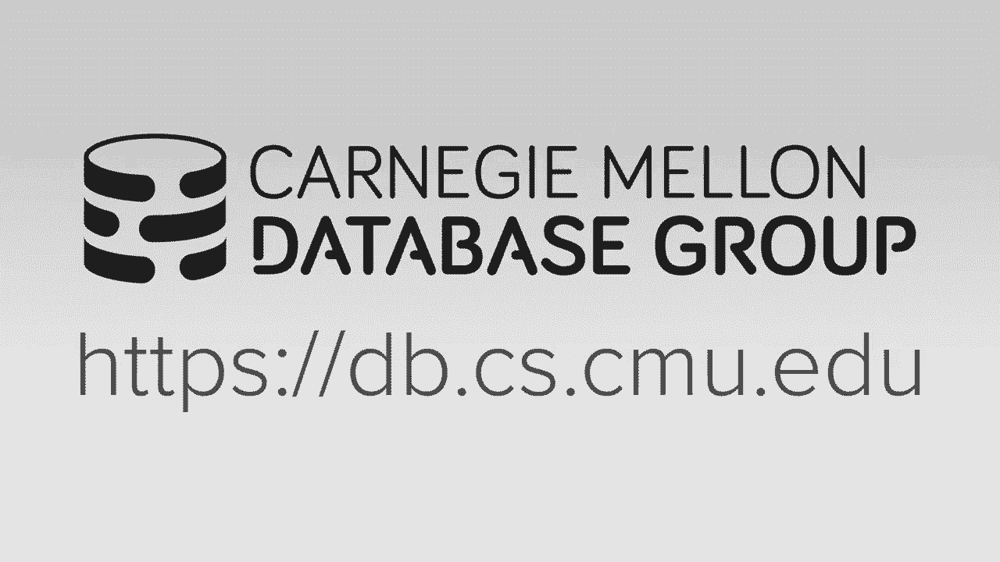
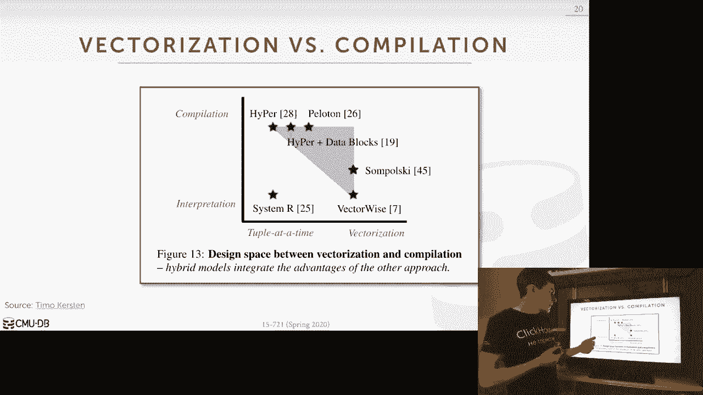

# 16：矢量化与编译



## 概述
在本节课中，我们将深入探讨两种加速查询性能的主要方法：矢量化执行与查询编译。我们将分析这两种方法各自的优缺点，并探讨在何种场景下一种方法会优于另一种。最后，我们将介绍一种结合两者优势的混合查询处理模型。

## 矢量化执行模型回顾
上一节我们介绍了矢量化执行的基本概念。本节中，我们来看看它的具体实现方式。

矢量化执行模型的核心思想是使用一系列预编译的原语函数。每个原语负责处理查询计划中的一个特定操作，例如评估谓词或进行聚合。这些原语被编译到数据库系统二进制文件中。在运行时，查询计划通过“拼接”这些原语来执行，每个原语调用会处理一批数据（一个向量），从而分摊函数调用的开销。

以下是一个简单的矢量化过滤操作的伪代码示例：
```cpp
// 原语：对整型列进行等值过滤
void filter_int_vector(int* column_data, int constant, int* output_offsets, int batch_size) {
    int output_idx = 0;
    for (int i = 0; i < batch_size; i++) {
        if (column_data[i] == constant) {
            output_offsets[output_idx++] = i; // 记录匹配元组的位置
        }
    }
}
```

## 查询编译模型回顾
与矢量化不同，查询编译模型（以Hyper为代表）采用了一种不同的策略。

查询编译模型在运行时为每个具体的查询计划即时生成并编译专用的机器码。它采用自底向上的推送式处理模型。在一个流水线中，系统从底部（如扫描表）获取一个元组，然后立即将其向上推送，经过流水线中的所有操作符，直到遇到一个“流水线中断器”。这种方式旨在最大化缓存局部性，甚至可能将元组保留在CPU寄存器中。

以下是一个编译后查询代码的简化示例：
```cpp
// 为特定查询编译的代码：扫描并过滤
void compiled_scan_and_filter(Table* table, int constant_val) {
    for (Tuple& tuple : table->tuples) {
        if (tuple.int_column == constant_val) { // 所有操作融合在一个循环中
            process(tuple);
        }
    }
}
```

## 两种模型的比较分析
为了公平地比较矢量化与编译模型，研究人员构建了一个统一的测试平台，确保算法高层逻辑一致，仅在与架构相关的实现细节上有所不同。

以下是用于比较的TPC-H查询及其特点：
*   **Q1**：简单扫描后进行定点运算和低基数聚合。
*   **Q6**：带过滤条件的扫描。
*   **Q3**：连接操作，构建端远小于探测端。
*   **Q9**：连接操作，构建端与探测端大小差异不显著。
*   **Q18**：高基数聚合（分组键唯一值很多）。

性能对比结果显示，没有一种模型在所有查询上都占优。例如，在计算密集型的Q1和Q18中，编译模型（Hyper）因指令数更少而表现更好。而在涉及哈希连接且可能发生缓存缺失的Q3和Q9中，矢量化模型（Vectorwise）能更好地分摊内存访问延迟，从而表现更佳。

核心结论是：两种模型都非常高效，其性能差异取决于具体的查询特征。编译模型更适合计算密集型、缓存缺失少的查询；而矢量化模型则更擅长隐藏哈希连接等操作中的缓存访问延迟。

## SIMD指令集的作用评估
矢量化执行常与SIMD指令集的使用相关联。我们评估了在矢量化原语中使用SIMD（特别是AVX-512）带来的收益。

在孤立地测试原语（如哈希、数据收集、连接）时，使用SIMD能带来显著的性能提升（例如哈希原语提升2.3倍）。然而，当将这些原语放入完整的查询执行上下文中时，由于需要协调数据在不同缓冲区间的移动以及处理缓存未命中，SIMD带来的整体加速比会大幅降低（例如在完整查询中可能仅提升1.1倍）。

因此，虽然SIMD在微观层面能极大提升原语速度，但在宏观的查询执行中，其收益受到系统整体开销的限制。

## 编译器自动矢量化能力
除了手动编写SIMD内在函数，另一种途径是依赖编译器的自动矢量化功能。




我们测试了GCC、Clang和ICC编译器对矢量化友好代码的自动矢量化能力。其中，ICC（Intel编译器）最为激进，能成功将哈希、选择、投影等原语向量化为AVX-512指令。然而，自动生成的代码并不总是更快。例如，在某些查询中，ICC生成的矢量化代码反而比简单的标量实现慢14%，原因在于复杂的循环结构加剧了缓存缺失。

这表明，虽然编译器自动矢量化可以减少指令数量，但若不仔细考虑内存访问模式，可能无法转化为实际的性能提升，甚至可能导致性能下降。

## 混合模型：松弛操作符融合
前面的讨论似乎将矢量化与编译视为二选一的设计。然而，一种称为“松弛操作符融合”的技术可以将两者的优势结合起来。

RF的核心思想是将一个编译后的流水线分解为多个“阶段”。在阶段内部，我们仍然进行多个操作符的融合，并在CPU寄存器或高速缓存中处理数据。但在阶段之间，我们引入小的缓冲区来暂存一批元组（形成一个向量）。这样，我们可以在一个阶段内以矢量化方式处理一批数据，然后批量传递给下一个阶段。

这种方法的关键是结合了软件预取技术。在当前阶段处理一批数据时，我们可以预取下一批需要处理的数据，从而将计算与内存访问重叠，隐藏延迟。

以下是一个RF的简化代码结构示例：
```cpp
// 第一阶段：矢量化扫描和过滤
void stage1_scan_filter(Table* table, int* stage_buffer) {
    for (int chunk_start = 0; chunk_start < table->size; chunk_start += VECTOR_SIZE) {
        prefetch(&table->data[chunk_start + VECTOR_SIZE]); // 软件预取下一批数据
        // 使用SIMD指令处理当前chunk的数据
        simd_filter(table->data + chunk_start, stage_buffer);
    }
}
// 第二阶段：标量聚合
void stage2_aggregate(int* stage_buffer) {
    for (int i = 0; i < BUFFER_SIZE; i++) {
        update_hash_table(stage_buffer[i]); // 标量处理
    }
}
```

实验表明，在Peloton数据库系统中，RF模型结合SIMD和预取技术，能够超越纯矢量化或纯编译模型，在连接等查询上获得最佳性能。这证明了将两种范式融合是可行且高效的。


## 总结
本节课中，我们一起学习了矢量化执行与查询编译这两种现代数据库查询加速技术。通过对比分析，我们了解到两者各有优势，其性能表现依赖于具体的查询负载。矢量化擅长分摊内存访问开销，而编译模型在计算密集型任务上更高效。更重要的是，我们看到了通过“松弛操作符融合”技术，可以将两者的优点结合，构建出性能更优的混合查询处理引擎。这为数据库系统的架构设计提供了新的思路。