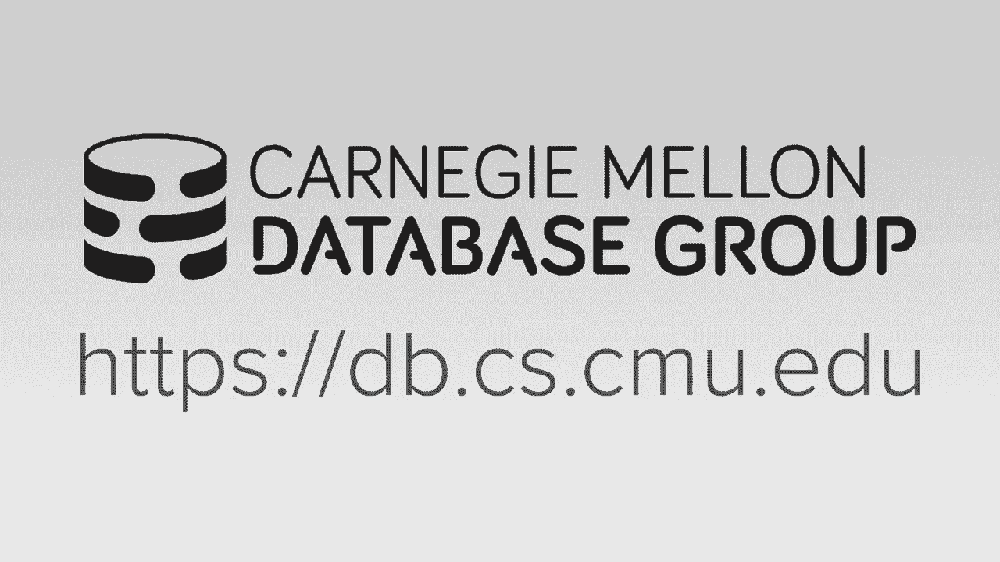

# 数据库系统进阶：P17：哈希连接算法 🚀

在本节课中，我们将学习哈希连接算法。哈希连接是分析型数据库系统中执行等值连接最常用的算法之一。我们将探讨其工作原理、并行化策略、哈希表设计以及性能评估，帮助初学者理解如何高效地实现这一核心操作。

---

## 背景与重要性

上一节我们介绍了连接操作在分析型负载中的普遍性。本节中，我们来看看为什么哈希连接如此重要。

连接操作是分析型工作负载中常见的操作。哈希连接与排序合并连接是两种主要方法。在OLAP系统中，我们通常不会看到嵌套循环连接，除非表非常小。在OLTP系统中，由于经常进行基于索引的外键查找，可能会使用索引嵌套循环连接。哈希连接会为查询临时构建哈希表，查询完成后即丢弃；而索引嵌套循环连接则利用已存在的索引。

关于排序合并连接与哈希连接孰优孰劣的争论，在数据库领域已有数十年历史：
*   **1970年代**：由于内存有限且外部归并排序算法成熟，传统观点认为排序合并连接更优。
*   **1980年代**：随着专用数据库机器的出现，哈希连接被认为在特定硬件支持下更优。
*   **1990年代**：研究表明在当时的硬件上，两种算法性能基本等价。
*   **2000年代至今**：在分析型数据库兴起的背景下，哈希连接被证明在大多数情况下性能更优，成为主流选择。

---

## 并行连接的目标与挑战

上一节我们回顾了哈希连接的历史地位。本节中，我们来看看在现代内存数据库系统中并行执行连接的目标。

在内存系统中，我们不再受磁盘I/O限制，目标是最大化CPU的并行化利用率。并行连接算法需要最小化线程间的争用和同步开销。两个主要目标是：
1.  **最小化同步**：避免使用锁存器保护关键部分，减少线程间等待。
2.  **优化内存访问**：确保工作线程访问的数据尽可能位于同一核心的缓存中，以减少缓存未命中和跨套接字流量。

实现良好缓存行为的关键在于利用**时间局部性**和**空间局部性**。我们应确保在短时间内集中访问少量数据，并让这些数据在内存中彼此靠近。

---

## 并行哈希连接的三阶段

哈希连接是OLAP系统中最常见的连接算法。一个并行哈希连接算法包含三个阶段，以下是其概述：

1.  **分区阶段**：此阶段是可选的。目标是根据连接键的哈希值，将待连接的表划分为更小的块，以便后续阶段中线程可以独立处理各自分区。
2.  **构建阶段**：扫描外表，根据连接键构建哈希表。
3.  **探测阶段**：扫描内表，对每个元组的连接键进行哈希，并探测哈希表以查找匹配项。如果找到匹配，则组合元组并输出。

在真实系统中，探测到匹配后，需要将组合后的元组物化到输出缓冲区中，这会影响性能。

---

### 分区阶段详解

上一节我们概述了哈希连接的三个阶段。本节中，我们深入探讨第一个可选阶段：分区。

分区阶段的目标是通过一次额外的数据扫描和复制，换取后续构建和探测阶段更少的缓存未命中和更高的局部性，从而提升整体性能。这在文献中有时被称为 **Grace哈希连接**、**混合哈希连接** 或 **基数哈希连接**。

物化策略取决于存储模型：
*   **行存储**：通常将整个元组复制到分区缓冲区。
*   **列存储**：通常只复制连接所需的键值以及用于查找其他列的偏移量，这更高效。

分区主要有两种方法：**非阻塞分区** 和 **基数分区**。

---

#### 非阻塞分区

非阻塞分区允许一组线程进行分区的同时，另一组线程即可开始处理已分区的数据。它有两种实现方式：

**共享分区**
*   所有线程写入全局的共享分区桶。
*   需要使用锁存器来同步对桶的访问，以防止数据损坏。
*   优点：只需单次数据传递。
*   缺点：存在同步开销。

**私有分区**
*   每个线程拥有自己的一组私有分区桶，无需锁存器。
*   优点：无同步开销，写入速度快。
*   缺点：需要第二次传递来合并所有线程的私有分区，形成全局分区。

---

#### 基数分区

基数分区采用多步传递的方法，所有线程完成分区后，才能进入下一阶段。

**步骤**
1.  **计算直方图**：线程扫描数据，基于键值的某个基数位计算每个分区的元组数量直方图。
2.  **计算前缀和**：根据直方图计算前缀和，确定每个线程在全局分区数组中的写入起始偏移量。
    *   前缀和计算公式：`prefix_sum[i] = prefix_sum[i-1] + histogram[i-1]`
3.  **重分布数据**：线程再次扫描数据，根据前缀和确定的偏移量，将元组复制到全局分区数组的相应位置。

基数分区可以实现无锁写入，并且通过多轮分区，可以确保每个分区的数据量适应CPU缓存行大小。但在实践中，大多数系统只进行一轮分区。

---

### 构建阶段与哈希表设计

无论是否经过分区，接下来都会进入构建阶段。此阶段扫描外表并构建哈希表。哈希表的设计至关重要，它主要包含两个部分：**哈希函数** 和 **冲突解决机制**。

---

#### 哈希函数

哈希函数将任意长度的键映射到固定范围的整数，用于定位哈希表中的槽位。我们需要在**计算速度**和**低碰撞率**之间取得平衡。

以下是一些常见的哈希函数：
*   **CRC32/CRC64**：早期用于网络错误检测，现代CPU有专用指令。
*   **MurmurHash**：一种通用的非加密哈希函数。
*   **CityHash/FarmHash**：Google基于MurmurHash改进，针对短键或长键优化。
*   **xxHash**：目前被认为是性能最好的通用哈希函数之一。

在数据库系统中，通常选择一种哈希函数并持续优化，而不会根据负载动态切换。

---

#### 冲突解决机制

当两个键哈希到同一槽位时，需要冲突解决机制。以下是几种常见方案：

**链式哈希**
*   每个槽位是一个指向链表（桶）的指针。
*   冲突的键被放入同一个链表中。
*   链表可以无限增长，但极端情况下会退化为线性扫描。
*   一种优化是在链表头存储布隆过滤器，以快速判断键是否不存在于链中。

**线性探测**
*   使用一个巨大的槽位数组。
*   插入时，如果目标槽位被占用，则顺序向下查找第一个空槽。
*   查找时，从哈希到的槽位开始顺序扫描，直到找到键或遇到空槽。
*   实现简单，在许多情况下性能表现良好。

**罗宾汉哈希**
*   线性探测的变种。插入时，比较当前键与占用键的“富余程度”（即距离其理想位置的偏移量）。
*   如果新键更“穷”（偏移量更小），则驱逐占用键并插入自己，被驱逐的键重新寻找位置。
*   目标是平衡所有键的查找距离，但研究显示其移动成本可能抵消查找收益。

**跳房子哈希**
*   为每个槽位定义一个“邻域”（如连续的几个槽位）。
*   键必须插入其理想槽位所在的邻域内。
*   如果邻域已满，则在更远的地方找到空槽后，通过交换将空槽移入邻域，再将键插入。
*   限制了查找范围，但维护开销较大。

**布谷鸟哈希**
*   维护多个哈希表，每个表使用不同的哈希函数。
*   插入时，检查所有表对应的槽位，选择空槽插入。若无空槽，则随机驱逐一个现有键，并递归地为被驱逐键寻找新位置。
*   查找时，只需检查所有表中对应的一个槽位，保证O(1)查找复杂度，但插入过程可能复杂。

对于哈希连接这种临时性哈希表，**线性探测** 因其简单性和良好的综合性能而被广泛采用。

---

## 总结

本节课中，我们一起学习了哈希连接算法。我们从其背景和重要性开始，讨论了并行连接的目标。然后，我们详细剖析了并行哈希连接的三个核心阶段：分区、构建和探测。在分区阶段，我们比较了非阻塞分区和基数分区策略。在构建阶段，我们深入探讨了哈希表的设计关键，包括哈希函数的选择和多种冲突解决机制（如链式哈希、线性探测、罗宾汉哈希等）的优缺点。理解这些设计决策对于实现高性能的内存数据库连接操作至关重要。