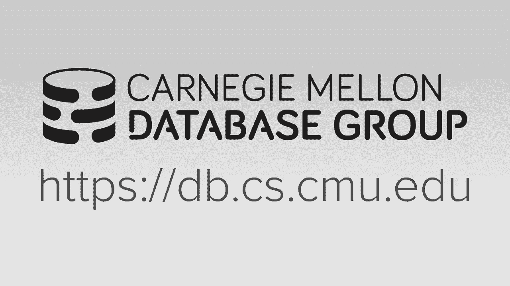

# 18：并行排序-归并排序算法 🧠



在本节课中，我们将要学习并行排序-归并连接算法。我们将从排序-归并连接的基础概念开始，然后深入探讨如何利用现代硬件特性（如SIMD指令和多核架构）来并行化和向量化排序算法，最后比较几种不同的并行排序-归并连接实现方案的性能。

## 概述

排序-归并连接是数据库系统中执行连接操作的两种主要算法之一（另一种是哈希连接）。它包含两个主要阶段：首先，根据连接键对两个输入关系进行排序；然后，对排序后的关系进行归并扫描以找到匹配的元组。在内存数据库和现代多核CPU的背景下，优化排序阶段的性能至关重要。本节课将重点介绍如何设计高效的并行排序算法，并将其整合到排序-归并连接中。

## 排序-归并连接基础

排序-归并连接算法分为两个阶段。第一阶段是排序阶段，根据连接键对两个输入表（R和S）的元组进行排序。第二阶段是归并阶段，使用两个迭代器同步扫描已排序的表，比较连接键并输出匹配的元组对。

这种算法的核心优势在于，由于数据已预先排序，在归并扫描时无需回溯或进行暴力搜索，从而提高了效率。其高级概念流程如下：
1.  **排序阶段**：对表R和表S按连接键排序。
2.  **归并阶段**：同时扫描两个已排序的表，比较当前元组的连接键。若匹配，则组合输出；若不匹配，则移动具有较小键的迭代器。

## 并行化与硬件意识

在现代数据库系统中，我们需要利用多核CPU和向量化指令（SIMD）来加速计算。对于排序-归并连接，这意味着需要并行化排序阶段（最耗时的部分），并在可能的情况下对归并阶段进行向量化处理。

为了获得最佳性能，算法设计应遵循以下原则：
*   **利用多核**：尽可能使用数据库系统分配的所有CPU核心。
*   **NUMA感知**：注意非统一内存访问架构的边界，尽量避免跨NUMA节点的内存访问，以减少延迟。
*   **向量化**：尽可能使用SIMD指令，以便在每个CPU周期内处理多个数据元素。

## 并行排序-归并连接的阶段

一个完整的并行排序-归并连接通常包含三个阶段，类似于并行哈希连接：
1.  **分区阶段**：将数据分布到不同的工作线程或核心上。可以采用范围分区或基数分区。
2.  **排序阶段**：每个线程对其本地分区的数据进行排序。这是本节课的重点。
3.  **归并连接阶段**：扫描已排序的分区，执行连接操作。

本节课将主要关注排序阶段和归并连接阶段。

## 分区策略：隐式与显式

在连接算法中，分区可以分为隐式和显式两种：
*   **隐式分区**：数据在加载到数据库时已经按照连接键进行了分区。如果查询的连接键与预分区键一致，则可以跳过显式分区步骤。
*   **显式分区**：在执行连接时，根据连接键动态地将数据重新分布到不同的处理单元。对于排序-归并连接，通常采用范围分区，因为它能明确每个分区的键值边界。

## 缓存感知排序算法

在内存数据库中，排序的瓶颈从磁盘I/O转移到了内存层次结构（如CPU缓存）。因此，我们需要针对CPU缓存进行优化的排序算法。本节将介绍Intel提出的缓存感知排序方法，它根据数据运行的大小，采用不同的算法以适应不同的缓存层级。

该算法分为三个层级：
*   **层级1：寄存器内排序**：对能完全放入CPU寄存器的小数据块进行排序，使用**排序网络**实现，无分支且可向量化。
*   **层级2：缓存内排序**：将层级1产生的有序序列合并成更大的序列，使其能放入最后一级缓存。使用**双调归并网络**，同样可向量化。
*   **层级3：缓存外排序**：当数据运行超过缓存容量时，采用并行执行策略，协调多个线程工作，尽量让数据驻留在缓存中。

### 层级1：寄存器内排序与排序网络

排序网络是一种确定性的比较-交换网络，无论输入顺序如何，都执行固定序列的比较操作。这使得它没有条件分支，非常适合用SIMD指令进行向量化。

例如，对一个包含4个元素的序列进行排序，可以通过一系列固定的`min`/`max`比较和交换操作来完成。利用512位SIMD寄存器，我们可以同时处理多个这样的4元素序列，实现高效的向量化排序。

**代码示例：向量化比较操作**
```cpp
// 假设我们有四个SIMD寄存器，每个包含4个待排序的键值
__m512i reg1, reg2, reg3, reg4;
// 通过一系列跨寄存器的min/max操作进行排序
__m512i min1 = _mm512_min_epi32(reg1, reg2);
__m512i max1 = _mm512_max_epi32(reg1, reg2);
// ... 更多比较和交换步骤
// 最后进行转置操作，将列优先的排序结果转换为行优先的有序序列
```

### 层级2：缓存内排序与双调归并网络

双调归并网络用于将多个小的有序序列合并为更大的有序序列。它也是由一系列固定的比较器组成，可以进行向量化。目标是将合并后的序列大小控制在最后一级缓存的一半容量以内，以避免溢出到主存。

### 层级3：缓存外排序

当数据运行过大，无法完全放入缓存时，算法进入层级3。此时采用一种复杂的并行策略，线程会动态地在归并网络的不同阶段“跳跃”工作，优先处理那些数据已驻留在缓存中的任务，以减少缓存未命中带来的停顿。这种方法假设系统能完全控制所有CPU核心，在实际复杂的数据库环境中较难实现。

## 归并连接阶段

排序完成后，进入归并连接阶段。多个线程并行扫描已排序的数据分区，比较内外表的元组。每个线程写入自己独立的输出缓冲区，以避免同步开销。如果连接键有重复值，可能需要进行回溯。

以下是三种不同的并行归并连接实现方案：

### 1. 多路排序-归并连接

此方案在排序阶段结束时，通过范围分区将数据重新分布，使得每个核心最终只包含全局有序数据的一个连续分区。在连接阶段，每个核心只需扫描本地对应的内外表分区，无需远程内存访问。

**执行步骤：**
1.  本地排序（L1/L2）。
2.  多路归并排序（L3），将数据按范围重新分布到目标核心。
3.  每个核心对本地分区执行最终的归并连接。

### 2. 多趟排序-归并连接

此方案在排序后不进行数据重分布。在连接阶段，每个核心为了处理其本地外表分区，可能需要多次扫描整个内表（或内表的所有分区），可能导致大量的跨NUMA内存访问。

### 3. 大规模并行排序-归并连接

此方案仅对外表进行范围分区和重分布，内表则只在本地排序。连接时，每个核心需要扫描整个外表分区，但只扫描内表分区中相关的部分。论文作者认为顺序访问模式会触发硬件预取，从而掩盖跨NUMA访问的延迟，但实际效果不佳。

## 算法性能评估

根据ETH论文的实验结果，我们可以得出以下结论：

*   **向量化排序的有效性**：使用SIMD的缓存感知排序算法比非向量化实现（如STL的快速排序/堆排序混合算法）快约3倍。
*   **多路方案优势**：在多核环境下，**多路排序-归并连接**性能最佳。因为它将昂贵的跨NUMA内存访问提前到了排序阶段的数据重分布过程，而在最终的连接阶段，每个核心都只进行本地内存访问，从而获得了更好的扩展性。
*   **与哈希连接对比**：对于大多数OLAP场景，**基数分区哈希连接**的性能仍然优于排序-归并连接，尤其是在表的大小适中时。排序-归并连接的主要优势在于，如果查询本身需要按连接键进行`ORDER BY`排序，那么它可以避免额外的排序开销。

**性能对比图示：**
*   **多路方案**：连接阶段极快（本地访问），总体性能高，且线程扩展性接近线性。
*   **Hyper方案**：连接阶段涉及大量远程访问，性能随线程数增加而下降，扩展性差。
*   **哈希连接**：在多数情况下吞吐量更高，但随着表增大，分区成本增加，性能优势会缩小。

## 总结

本节课我们一起学习了并行排序-归并连接算法。我们回顾了算法的基础流程，重点探讨了如何利用缓存感知的排序技术（特别是向量化的排序网络和双调归并网络）来优化内存中的排序性能。我们还分析比较了三种不同的并行归并连接策略，其中**多路排序-归并连接**通过将数据重分布以本地化连接阶段的访问，获得了最佳的性能和扩展性。


尽管经过高度优化，但在典型的OLAP工作负载中，哈希连接通常仍是更优的选择。然而，排序-归并连接在查询本身需要有序输出时具有独特优势。因此，一个成熟的数据库系统通常会同时实现这两种算法，并由查询优化器根据具体情况选择最佳执行计划。