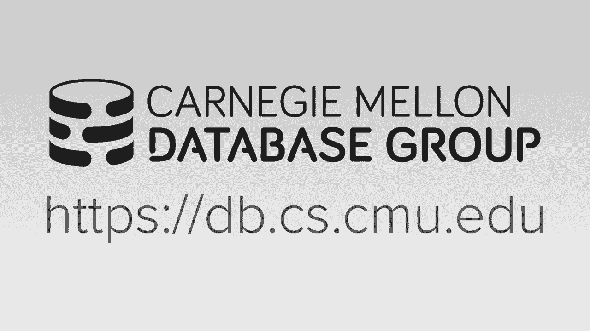
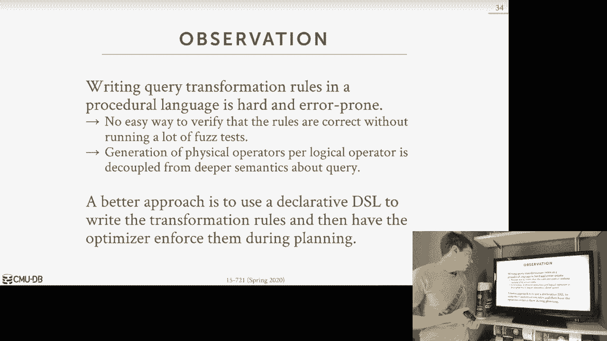
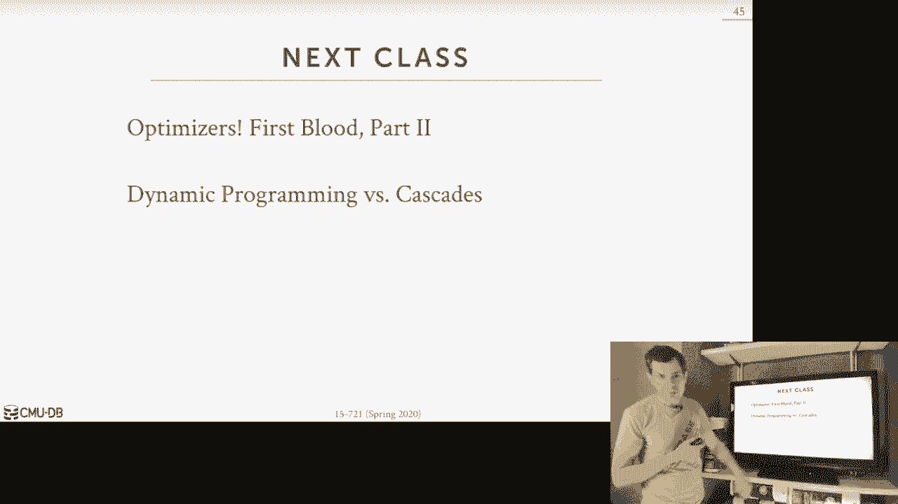

# 19：查询优化器实现 1

## 概述

在本节课中，我们将学习数据库系统中一个至关重要的组件——查询优化器。查询优化器的核心任务是将用户用声明式语言（如SQL）编写的查询，转换为数据库系统可以执行的高效执行计划。我们将探讨其基本概念、设计决策以及不同的实现策略。

---

## 查询优化器简介

查询优化器的目标是找到一个**正确**且**成本最低**的执行计划。这里的“正确”意味着计划必须能计算出查询的正确结果。“成本”则是一个内部相对度量标准，用于比较不同计划的优劣，它可能代表执行时间、内存使用量或I/O开销等。

由于查询优化问题被证明是NP完全问题，我们无法在合理时间内穷举所有可能的计划来找到绝对最优解。因此，查询优化器采用各种技术来**缩小搜索空间**，并使用**成本模型**来估算计划成本，而无需实际执行。

---

## 查询处理流程

一个典型的查询处理流程如下：

1.  **SQL重写器**（可选）：接收SQL查询字符串，可能进行改写（例如，在分片系统中重定向查询）。
2.  **SQL解析器**：将SQL字符串解析为抽象语法树。
3.  **绑定器**：查询系统目录，将查询中的表名、列名等标识符映射为内部ID和类型信息，输出**逻辑计划**。
4.  **树重写器**（可选）：对逻辑计划应用基于启发式的规则进行优化（如谓词下推）。
5.  **优化器**（核心）：基于成本模型，枚举多个可能的**物理计划**，并选择估算成本最低的一个。
6.  **执行**：将选定的物理计划交给执行引擎（可能通过解释执行或编译为机器码）。

本节课及后续课程将主要关注**树重写器**和**优化器**这两个部分。

---

## 逻辑计划与物理计划

理解逻辑计划与物理计划的区别对掌握优化器至关重要。

*   **逻辑计划**：描述了查询要完成的**高级别操作**（例如，“扫描表Foo”），但不指定具体执行方法。它关注关系代数操作。
*   **物理计划**：描述了**如何具体执行**这些操作（例如，“使用索引XYZ扫描表Foo”或“对表Foo进行顺序扫描”）。它包含底层细节，如数据访问方法、算法选择，以及数据在处理过程中需要满足的**物理属性**（例如，数据是否按某列排序）。

两者之间并非总是一一对应。一个逻辑操作可能对应多个物理操作，多个逻辑操作也可能合并为一个物理操作。

---

## 关系代数等价性

查询优化的基础是关系代数的等价变换规则。利用结合律、交换律等性质，我们可以在保证结果正确的前提下，改变查询计划的形状。

例如，对于自然连接 `(A ⋈ B) ⋈ C`，等价于 `A ⋈ (B ⋈ C)`。优化器可以利用成本模型来估算不同连接顺序的成本，从而选择最优顺序。

---

## 优化器设计决策

在构建优化器之前，我们需要考虑几个关键的设计决策：

### 1. 优化粒度
*   **单查询优化**：最常见的方式。每次优化只针对一个查询，搜索空间较小，但无法跨查询复用结果。
*   **多查询优化**：同时优化一批查询，考虑查询间的资源共享。这在流处理或持续查询系统中更常见。

### 2. 优化时机
*   **静态优化**：查询到达后，优化器生成一个计划，然后始终执行该计划。计划质量完全依赖于优化时的成本模型准确性。
*   **动态优化/自适应优化**：执行过程中，如果发现实际数据与估算偏差很大，可以中断执行，返回优化器重新生成计划。

### 3. 预处理语句
对于需要反复执行的查询，可以使用预处理语句来分摊优化开销。系统可以缓存生成的计划。挑战在于，当查询参数变化时，一个固定的计划可能不是最优的。解决方案包括：始终使用上次的计划、基于参数值选择不同计划、或使用统计信息的平均值进行优化。

### 4. 计划稳定性
DBA希望查询性能稳定，避免因优化器选择不同计划而导致性能波动。保证稳定性的方法包括：
*   提供**优化器提示**，强制使用特定索引或连接顺序。
*   指定使用的**优化器版本**。
*   支持**向后兼容的计划**，从旧版本导入并强制使用已知的计划。

### 5. 搜索终止
优化器不能无限搜索。终止条件可以是：
*   **时间阈值**：运行超过指定时间后停止。
*   **成本阈值**：找到成本低于某个阈值的计划后停止。
*   **改进阈值**：一段时间内未找到显著优于当前最佳计划的方案后停止。
*   **穷举完成**：搜索完所有可能的排列（通常仅适用于简单查询）。

---

## 优化器搜索策略

接下来，我们按历史发展顺序，探讨几种主要的优化器实现策略。

### 启发式优化器（1970年代）

早期的系统（如INGRES、Oracle初版）使用基于规则的启发式方法。
*   **原理**：在代码中硬编码一系列转换规则（例如，“如果存在匹配的索引，就使用索引扫描”、“总是进行谓词下推”）。
*   **优点**：实现和调试相对简单，适合新系统快速起步。
*   **缺点**：没有成本模型，规则基于静态假设，难以处理复杂的、相互依赖的优化。随着系统复杂化，代码会变得难以维护。

**INGRES示例**：由于早期不支持连接操作，INGRES会将多表连接查询重写为一系列单表查询，通过临时表传递中间结果。这可以看作一种早期的“自适应”优化，因为它根据中间结果的值来规划后续查询。

### System R 与动态规划（1970年代）

IBM System R首次引入了基于成本的优化和动态规划方法。
*   **原理**：采用**自底向上**的规划。对于N个表的连接，它从单个表开始，逐步计算连接2个表、3个表……直到N个表的最优方案，并记录每个子集的最优成本和计划。
*   **左深树**：为了减少搜索空间，System R只考虑左深连接树（形状像左侧一直加深的链表），而不考虑浓密树。
*   **流程**：
    1.  为每个基表选择最佳访问路径（索引扫描或全表扫描）。
    2.  枚举所有可能的连接顺序（排列）。
    3.  使用动态规划，自底向上计算每个子连接集的最优成本和实现算法（哈希连接、排序合并连接等）。
*   **局限性**：物理属性（如排序要求）没有被集成到搜索过程中，而是事后通过成本模型来考虑，这可能导致错失更好的计划（例如，能用排序合并连接同时完成连接和排序，却选择了哈希连接加额外排序）。

### 随机化算法

为了跳出局部最优解，一些优化器采用随机化算法。
*   **模拟退火**：从初始计划开始，随机扰动（如交换连接顺序），以一定概率接受更差的计划，从而有机会找到全局更优解。
*   **遗传算法**：PostgreSQL在连接表超过一定数量（默认12）时使用。它维护一个“种群”（多个计划），通过评估成本、选择“优秀个体”、进行“交叉”和“变异”来迭代进化出更好的计划。
*   **优点**：可能找到全局更优解，内存开销低。
*   **缺点**：需要确保随机性的可重复性以利于调试，仍需保证变换规则的正确性。

### 优化器生成器与统一搜索

为了更优雅、可维护地定义优化规则，研究者提出了优化器生成器框架。
*   **核心思想**：使用声明式的规则语言来描述逻辑到逻辑、逻辑到物理的转换。开发者定义规则，由框架引擎负责应用规则并进行搜索。
*   **分层搜索**：先应用所有基于规则的逻辑重写（无成本模型），再进行基于成本的物理计划搜索。IBM的Starburst系统是代表。
*   **统一搜索**：将逻辑和物理转换规则统一到一个搜索空间中处理。**Volcano优化器**是早期代表，它采用**自顶向下**的搜索方式。
    *   **自顶向下搜索**：从查询的最终逻辑目标开始，应用规则向下展开，逐步用物理操作符替换逻辑操作符，同时考虑并维护所需的物理属性。在搜索过程中进行剪枝。

Volcano优化器的优势在于规则声明清晰、易于扩展，并且物理属性是搜索中的一等公民。但它需要记忆化表来避免重复计算，内存开销较大。

---

## 总结

本节课我们一起学习了查询优化器的基础知识和多种实现策略。我们从查询优化器的核心目标出发，了解了逻辑计划与物理计划的区别，以及关系代数等价性的重要性。然后，我们探讨了构建优化器时需要考虑的关键设计决策，包括优化粒度、时机、预处理语句处理、稳定性和搜索终止。

最后，我们回顾了优化器的发展历程：从简单的启发式方法，到System R开创性的基于成本的动态规划方法，再到采用随机化算法（如遗传算法）来探索更大搜索空间，最后介绍了使用声明式规则的优化器生成器框架（如Volcano），它为现代优化器（如Cascades）奠定了基础。

下一节课，我们将深入探讨更现代的优化器实现，特别是Cascades框架，并对比自底向上动态规划与自顶向下统一搜索这两种主流范式的优劣。