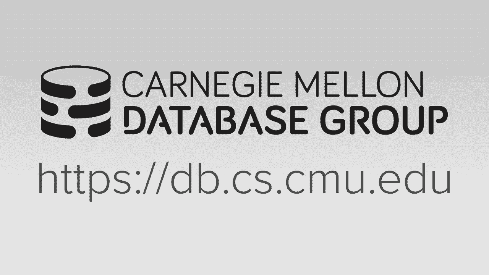
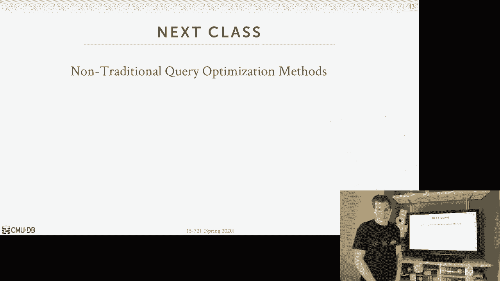

# CMU 15-721 数据库系统进阶：L20：查询优化器实现 2

## 📋 概述

在本节课中，我们将继续深入学习查询优化器的实现。我们将探讨逻辑查询优化、Cascades优化器框架的核心概念，并了解其他现代优化器实现。课程的重点在于理解如何将逻辑查询计划转换为高效的物理执行计划。

---

## 🔍 逻辑查询优化

上一节我们介绍了查询优化的基本概念和不同搜索方法。本节中，我们来看看逻辑查询优化的具体技术。逻辑优化是在不考虑成本模型的情况下，对查询计划进行基于规则的等价转换，旨在为后续的物理优化创造更好的起点。

以下是四种常见的逻辑优化技术：

1.  **拆分合取谓词**：将包含多个`AND`条件的单个`Filter`操作符拆分为多个独立的`Filter`操作符，每个只包含一个条件。这使得后续的谓词下推等优化更容易进行。
2.  **谓词下推**：将`Filter`操作符尽可能移动到查询计划树中靠近数据源的位置。这样可以尽早过滤掉无关数据，减少后续操作的处理量。
3.  **用连接替换笛卡尔积**：识别出`Cartesian Product`操作符后紧跟一个包含等值连接条件的`Filter`操作符的模式，并将其合并为一个`Join`操作符。这通常是更高效的选择。
4.  **投影下推**：识别查询计划中每个阶段真正需要的属性（列），并尽早通过`Projection`操作符过滤掉不需要的列，减少数据在管道中传递的体积。

这些转换都基于关系代数的等价规则，确保转换后的计划在逻辑上与原始计划等价。

---

## 🏗️ Cascades 优化器框架

逻辑优化为我们准备了更好的查询计划结构。接下来，我们将深入探讨一种名为Cascades的、采用统一搜索和自顶向下策略的优化器框架。Cascades的核心思想是**按需生成转换**，而非预先枚举所有可能性，从而更高效地管理搜索空间。

### 核心概念

为了理解Cascades，我们需要掌握几个关键概念：

*   **表达式**：指查询计划树中的一个操作符节点及其子节点。它可以是逻辑的（如 `Join`），也可以是物理的（如 `HashJoin`）。
    *   逻辑表达式示例：`Join(Scan(A), Scan(B))`
    *   物理表达式示例：`HashJoin(SeqScan(A), IndexScan(B))`
*   **组**：一个组包含所有能产生相同输出结果的**逻辑等价表达式**的集合。组是Cascades中组织和管理等价计划的核心数据结构。
*   **多表达式**：是一种占位符表达式，它代表一个子计划，但其具体的实现细节由下层另一个组决定。这避免了过早实例化所有可能的子计划，减少了状态存储。
*   **规则**：定义了如何将一个表达式模式转换为另一个逻辑等价的表达式。主要分为两类：
    *   **转换规则**：将一个逻辑（或物理）表达式转换为另一个逻辑表达式（例如，改变连接顺序）。
    *   **实现规则**：将一个逻辑表达式转换为一个或多个物理表达式（例如，将逻辑`Join`转换为物理`HashJoin`或`MergeJoin`）。

### 记忆表与最优性原理

为了避免重复工作和无限循环，Cascades使用**记忆表**来缓存已探索过的组及其最优成本。这类似于动态规划中的记忆化技术。

搜索过程遵循**贝尔曼最优性原理**：如果一个整体计划是最优的，那么构成它的各个子计划也必须对于其各自的子目标是最优的。基于此，优化器可以进行剪枝：如果发现当前部分计划的成本已经高于已知的全局最优成本，则可以停止探索该分支。

### 搜索过程示例

假设我们需要优化一个三表连接查询 `A ⋈ B ⋈ C`。

1.  **初始化**：创建根组，目标输出是 `A, B, C` 的连接结果。
2.  **应用规则**：应用转换规则，生成一个逻辑多表达式，例如 `Join(Group(A,B), Scan(C))`。其中 `Group(A,B)` 是一个占位符，指向一个负责计算 `A⋈B` 的新组。
3.  **递归探索**：
    *   进入 `Group(A,B)`，应用规则生成如 `Join(Get(A), Get(B))` 的逻辑表达式。
    *   对 `Get(A)` 和 `Get(B)` 应用实现规则，生成如 `SeqScan(A)`（成本=10）和 `SeqScan(B)`（成本=20）的物理表达式，并将最优选择存入记忆表。
    *   回到 `Join(Get(A), Get(B))`，应用实现规则生成物理连接方案，例如 `HashJoin(SeqScan(A), SeqScan(B))`，并计算其总成本（10+20+50=80），更新 `Group(A,B)` 的记忆表。
4.  **回溯与组合**：将下层组的最优成本传递回上层。在根组中，结合 `Group(A,B)` 的最优成本和 `Scan(C)` 的成本，评估不同的连接顺序和物理实现，最终选择总成本最低的完整物理计划。

这个过程通过记忆表避免了对相同子问题的重复计算，并利用最优性原理进行有效剪枝。

---

## 🌐 其他优化器实现

除了经典的动态规划和Cascades，业界还有许多其他优秀的优化器实现。

以下是几个值得关注的现代优化器框架：

1.  **Pivotal Orca**：一个独立的、基于Cascades的优化器服务。它不绑定特定数据库，通过XML文件接收元数据和查询。其特点是支持**多线程并行搜索**，并拥有先进的远程调试和成本模型准确性测试框架（TACO）。
2.  **Apache Calcite**：一个流行的、用Java编写的开源查询优化框架。它提供了完整的SQL解析、优化和查询生成能力。许多大数据系统（如Hive, Flink, Phoenix）都采用或集成了Calcite作为其优化器。
3.  **CockroachDB 优化器**：这个分布式数据库的优化器采用分层策略，但有一个独特步骤：在生成分布式执行计划后，会将计划**转换回带注释的SQL语句**，下发给各个存储节点。每个节点再本地重新优化其负责的片段，从而更好地利用本地数据分布信息。

这些实现展示了查询优化器在不同架构（单机/分布式、嵌入/独立）和不同需求下的灵活设计。

---

## ⚠️ 优化器的共同挑战与依赖

无论采用动态规划还是Cascades，或是其他高级框架，优化器的有效性都极度依赖于一个**准确的成本模型**。成本模型负责估算每个操作符的CPU、I/O和内存开销。如果基数估计（对中间结果大小的预测）或成本计算公式不准确，优化器很可能选择次优甚至性能很差的执行计划。

下一讲我们将深入探讨成本模型中最为棘手的问题之一：连接操作的基数估计。

---

## 📝 总结

本节课我们一起深入学习了查询优化器的核心实现技术。我们首先回顾了逻辑查询优化的几种基本转换方法。然后，我们重点剖析了Cascades优化器框架，理解了其按需生成、自顶向下搜索的核心机制，以及组、多表达式、规则和记忆表等关键概念。最后，我们概览了Orca、Calcite等现代优化器实现，并强调了准确成本模型对于任何优化器的基础性作用。优化器是数据库系统的“大脑”，其设计需要在搜索效率、计划质量和灵活性之间做出精妙的权衡。