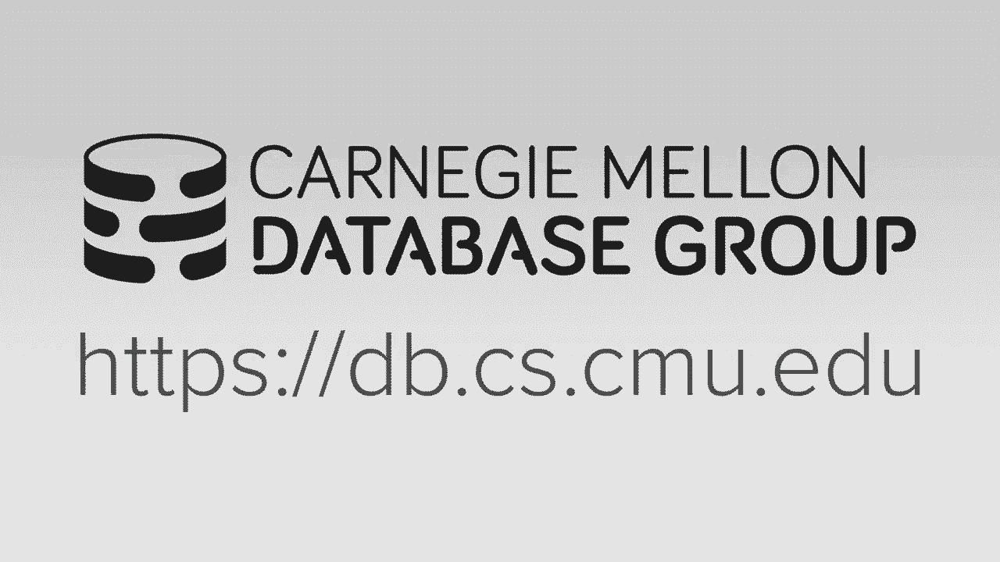
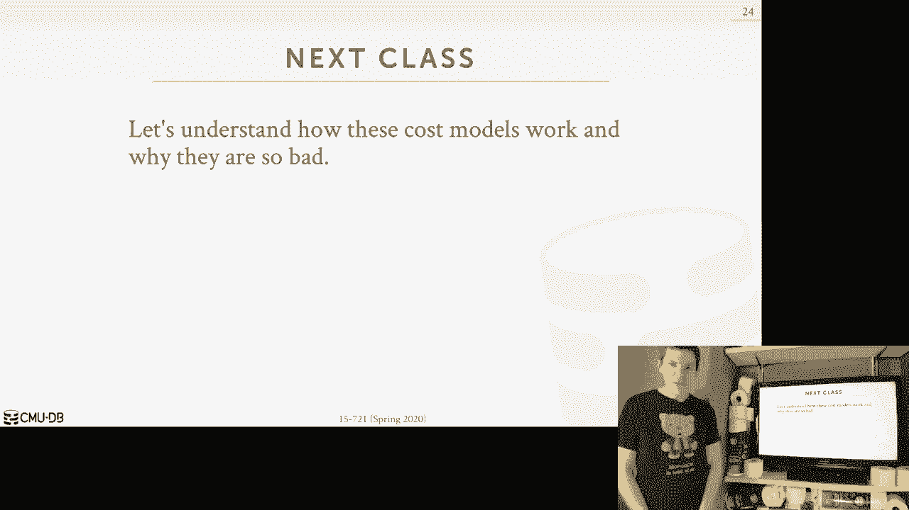

# 21：查询优化器实现 3 🛠️



在本节课中，我们将要学习查询优化器的第三部分内容，重点探讨**自适应查询优化**技术。我们将了解传统优化器在生成计划后即开始执行的局限性，并学习如何通过运行时信息来动态调整和优化查询计划，以获得更好的性能。

## 概述

传统查询优化器在查询执行前生成一个固定的计划。然而，由于数据库状态（如数据分布、索引、统计信息）可能发生变化，预先生成的计划可能并非最优。自适应查询优化技术允许数据库系统在执行过程中，根据实际观察到的数据特性来修改查询计划，从而提升性能。

## 自适应查询优化简介

上一节我们介绍了传统优化器的工作流程。本节中我们来看看如何让优化过程更具适应性。

自适应查询优化（Adaptive Query Optimization, AQO），有时在文献中也称为自适应查询处理（Adaptive Query Processing），其核心思想是允许数据库系统修改查询计划，以更好地适应底层数据的真实情况。修改方式可以是生成一个全新的计划，也可以是在查询计划中引入可切换的子计划。

这种方法的关键在于，它不仅仅依赖于优化前基于统计模型的**估算**，而是尝试利用查询**实际执行时收集到的数据**来帮助我们为当前查询做出更正确的计划决策。收集到的数据既可用于改善当前查询，也可以合并回系统的全局目录中，供未来查询使用。

## 自适应优化的三大类别

以下是自适应查询优化的三种主要实现思路：

1.  **优化未来查询**：在执行当前查询时收集信息，用于改进未来相同或类似查询的计划。
2.  **优化当前查询（重规划）**：在发现当前执行计划不佳时，中止或暂停执行，返回优化器重新生成（部分）新计划。
3.  **优化当前查询（计划切换点）**：在查询计划中预先嵌入多个备选子计划，并在执行时根据实时数据动态选择最优路径。

接下来，我们将逐一探讨这些类别。

## 1. 优化未来查询

这种方法的目的是利用本次执行获得的知识，让下一次执行变得更好。其最简单的形式是基于回归的计划修正。

### 基于回归的计划修正

其思路是：每次执行查询时，都记录下生成的计划、成本估算值以及实际的运行时指标（如输出的元组数、CPU/内存使用量）。数据库系统内部维护一个所有查询的历史信息库。

当同一个查询（例如一个预编译语句）被反复调用时，系统会使用缓存的查询计划。如果数据库的物理设计或统计信息发生变化，系统可能会为该查询重新生成一个新计划。但如果新计划的实际性能比旧计划更差（即出现性能“回归”），系统就会回退到已知性能更好的旧计划。

**示例**：
假设一个四表连接查询的原始计划使用哈希连接和顺序扫描，估算成本为1000，实际成本也为1000。系统将此记录在历史中。
随后，管理员在B表和D表上创建了索引。当再次执行相同查询时，优化器可能会生成一个使用索引嵌套循环连接和索引扫描的新计划，估算成本为800。
然而，实际执行时，由于某些原因（如估算错误），新计划的**实际成本**为1200，比旧计划更差。
此时，系统会记录新计划的糟糕表现。下次调用该查询时，它将选择回退到性能更优的原始计划。

### 计划缝合

基于回归的修正是比较粗粒度的“全有或全无”策略。更精细的方法是“计划缝合”，它允许从不同查询计划中“借用”逻辑上等效的、性能更优的子计划片段，组合成一个新的、“缝合”而成的计划。

**核心思想**：即使整个新计划无效或性能不佳，其中的某些子计划片段可能仍然是高效且可用的。我们可以将这些片段与当前可用的其他片段组合，形成一个总体成本更低的计划。

**实现步骤**：
1.  **识别逻辑等效的子计划**：利用关系代数的交换律、结合律等规则，判断不同查询中的子计划是否输出相同的结果集。这是一个具有启发性的过程。
2.  **构建搜索空间**：引入一个特殊的 **`OR` 运算符**（仅用于搜索，不用于执行），表示其下的子计划是逻辑等效的，可以任选其一。这样就将所有可能的子计划组合编码成了一棵搜索树。
3.  **执行动态规划搜索**：采用自底向上的动态规划方法，从叶节点开始，为每一层计算并保留到达该点的最优子计划及其成本，最终在根节点得到全局最优的“缝合”计划。

亚马逊 Redshift 的代码生成引擎也采用了类似思想，它在编译后的代码片段级别进行缓存和复用，跨查询甚至跨用户共享高效的执行代码片段。

## 2. 优化当前查询（重规划）

这类技术旨在修复**正在运行**的查询。如果发现查询计划的**实际观测行为**与优化器的**估算行为**严重偏离，系统可以决定中途停止，并重新进行规划。

### 重新规划当前调用

基本思路是：当执行过程中发现基数估算等严重错误时，权衡“继续执行现有糟糕计划”和“抛弃已做工作、重新开始”的成本。如果重新规划并执行的预期收益更高，则触发重优化。

**关键决策**：
*   是否抛弃所有已处理的中间结果，完全从头开始？
*   是否可以保留部分已完成的、代价高昂的操作结果（例如一个大的连接），只对查询的剩余部分重新规划？

### 前瞻信息传递

这是一个来自 Apache Quickstep 系统的有趣技术，特别适用于星型模式查询。

**工作流程**：
1.  在执行事实表与维度表的连接前，先扫描维度表并构建布隆过滤器。
2.  将布隆过滤器传递给事实表扫描端。
3.  在扫描事实表时，利用布隆过滤器进行采样，估算不同维度表连接的**实际选择性**。
4.  根据采样得到的实际选择性，**动态调整连接顺序**，将选择性更高的连接（能过滤掉更多元组）提前执行。

这种方法在真正开始主要的连接操作前，利用少量预处理工作获得了关键的数据分布信息，从而做出更优的决策。

## 3. 优化当前查询（计划切换点）

这类方法不在执行时返回优化器，而是在初始优化阶段就为可能产生重大性能差异的操作点生成多个备选子计划，并在执行时通过一个“开关”运算符动态选择。

### 参数化优化

这是 Volcano 项目在 1980 年代末提出的早期技术。其思想是：对于查询中的每个流水线阶段，如果不同执行策略的性能差异很大，就为其生成不同的子计划。

在查询计划中插入一个 **`ChoosePlan`** 运算符。该运算符包含一个条件判断，例如：
```sql
IF (input_cardinality < threshold) THEN
    USE Plan_A (e.g., Nested Loop Join)
ELSE
    USE Plan_B (e.g., Hash Join)
```
这样，执行时会根据上游操作符输出的实际数据量（基数）实时决定采用哪种连接算法。

### 主动重优化

这是更近期的、更复杂的技术，它结合了“重规划”和“计划切换”的思想。

**工作流程**：
1.  **初始优化**：生成带有多个可切换子计划的查询计划，并为每个决策点设定一个“边界框”，用于量化估算的不确定性。
2.  **执行与监控**：开始执行查询，并收集实时统计信息。
3.  **动态切换**：如果数据落在某个边界框内，则根据条件在预置的子计划间切换。
4.  **触发重优化**：如果观测数据严重超出所有边界框（即估算完全错误），则触发一次“中途重优化”，返回优化器重新生成（部分）计划，并决定是否保留已完成的中间结果。

## 总结

本节课中我们一起学习了**自适应查询优化**的各种技术。我们了解到，传统的“优化后执行”模式存在局限，而通过引入运行时反馈机制，可以显著提升查询计划的健壮性和性能。主要技术包括：
*   利用历史信息**优化未来查询**（回归修正、计划缝合）。
*   通过中途**重规划**来**优化当前查询**。
*   在计划中预设**切换点**，实现**动态算法选择**。

这些技术的有效实现需要优化器与执行引擎紧密协作，形成共生关系。目前，主流商业数据库系统已广泛采用自适应优化技术，而许多开源系统在此方面仍有发展空间。




下一节课，我们将深入探讨**成本模型**，了解为什么成本估算如此困难，以及它为何是优化器面临的核心挑战。