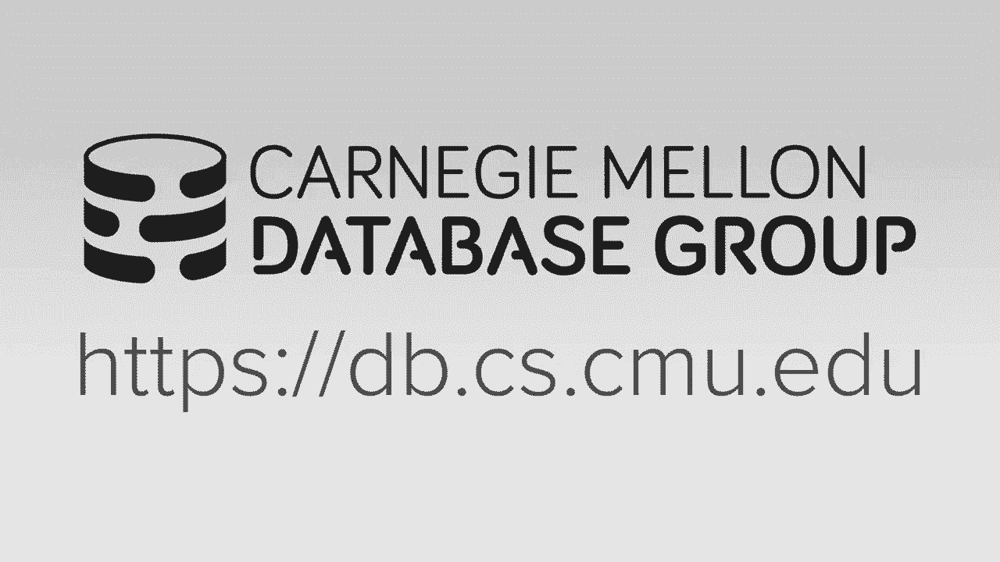
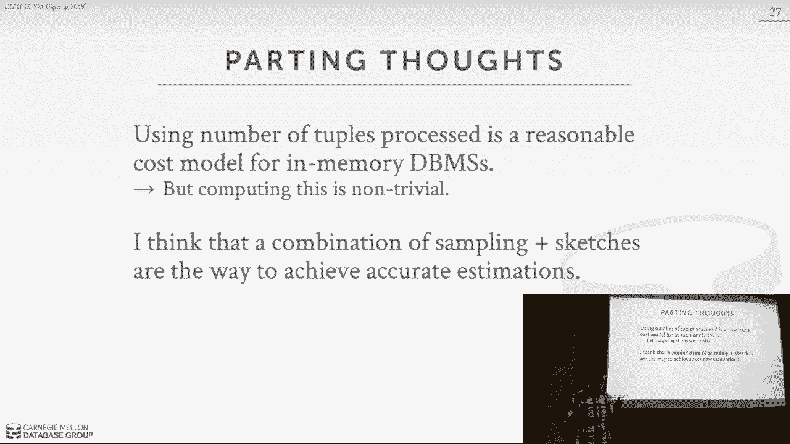

# 数据库系统进阶：L22：查询优化器成本模型 📊

在本节课中，我们将学习查询优化器成本模型的核心概念。成本模型是优化器的关键组件，用于估算执行特定查询计划所需的“代价”。这个代价是数据库系统内部的度量，用于比较不同查询计划的优劣，而不是一个跨系统可比较的绝对数值。

## 成本模型的构成

上一节我们介绍了查询优化器的整体架构，本节中我们来看看成本模型的具体构成。成本估算可以基于以下几种方式：

以下是三种主要的成本估算方法：

1.  **物理成本**：估算硬件实际执行的操作，例如CPU周期数、缓存未命中次数、磁盘I/O量。这种方法高度依赖于具体的硬件配置，实现起来较为复杂。
2.  **逻辑成本**：基于查询计划中逻辑操作符的行为进行估算，例如读取的元组数、连接操作输出的元组数。这种方法独立于具体的物理算法（如哈希连接 vs. 嵌套循环连接）。
3.  **算法复杂度**：考虑操作符的渐进时间复杂度，为不同算法（如索引扫描 vs. 全表扫描）分配权重。

对于内存数据库，通常结合使用逻辑成本和算法复杂度进行估算。

## 磁盘与内存数据库的成本考量

对于基于磁盘的数据库系统，磁盘I/O通常是成本中最关键的部分。系统可以完全控制其缓冲池管理，因此可以在成本模型中精确计算顺序I/O与随机I/O的影响。

在内存数据库中，磁盘I/O不再是主要考量（除了日志写入）。成本模型主要关注每个操作符处理的**元组数量**，并结合一些基本权重（例如，认为哈希连接优于嵌套循环连接）。由于CPU缓存由硬件管理，数据库难以精确控制，因此通常不将其纳入精细的成本模型。

## 实际系统的成本模型示例

让我们看看一些实际数据库系统是如何实现成本模型的。

**PostgreSQL** 结合了CPU和I/O成本，并通过一些“魔法常数”因子进行加权。例如，默认配置可能设定内存访问比磁盘顺序I/O快400倍。管理员可以调整这些权重，但通常不建议。

**IBM DB2** 的成本模型更为复杂和成熟。它会：
*   收集表、列和索引的统计信息。
*   在系统启动时运行微基准测试，以确定特定硬件的性能权重。
*   考虑并发查询对资源（如内存）的竞争影响。

## 选择性估算：成本模型的核心

成本模型中最关键、也最具挑战性的部分是估算操作符的**选择性**。选择性决定了输入操作符的元组中有多少比例会作为输出。

以下是估算选择性的主要技术：

1.  **域约束**：利用已知的属性值范围（如枚举类型）。
2.  **预计算统计信息**：例如区块内的区域地图（Zone Maps），记录数据块内列的最小/最大值。
3.  **直方图**：通过 `ANALYZE` 操作生成，是传统教科书方法。
4.  **草图**：使用近似数据结构（如各种 Sketch）来估计数据分布，近年来被认为可能比直方图更有效。
5.  **采样**：在查询优化时或后台对数据子集运行查询片段，以估算选择性。

## 基数估算的假设与问题

传统的基数估算方法将选择性建模为概率，并通常做出三个假设，但这些假设在实际中常常不成立：

1.  **均匀分布假设**：假设属性值均匀分布。现实中数据通常是倾斜的（例如，更多人在纽约市）。
2.  **谓词独立性假设**：假设不同过滤条件是独立的，可以简单相乘得到总选择性。现实中属性常常相关（例如，车型“Accord”必然对应制造商“Honda”）。
3.  **包含性假设**：假设连接键总是存在于连接关系中。在外连接中这不成立。

这些假设的违背会导致基数估算错误，并且错误会在查询计划树中自底向上被放大。

## 估算错误的影响与应对策略

研究（如Hyper团队发表的论文）表明，随着查询中连接表数量的增加，所有数据库系统的基数估算误差都会显著增大，通常表现为低估。这会导致优化器做出错误决策，例如：
*   选择嵌套循环连接而非哈希连接。
*   哈希表尺寸分配不当，导致性能下降。

因此，现代系统的设计原则是：
*   承认估算总会存在错误。
*   让查询执行操作符具备**自适应性**，例如能够动态调整哈希表大小、重新排序谓词。
*   将研发重点放在提高基数估算的准确性上（更好的统计信息、草图），而非过度追求硬件层面的微调。

## 学习型优化器

一个早期的创新想法是“学习型优化器”（如IBM的LEO）。其核心思想是：执行查询后，将实际观察到的基数与优化器的估算值进行比较，并将这些反馈信息用于优化后续查询的估算。尽管概念很有吸引力，但由于工程实现上的挑战，这类系统在实践中并未被广泛采纳。不过，这为后来利用机器学习进行数据库自动调优的研究奠定了基础。

本节课中我们一起学习了查询优化器成本模型的构建方法。我们了解到，对于内存数据库，估算操作符处理的元组数量是成本模型的核心。然而，由于数据分布的复杂性和关联性，准确的基数估算极具挑战性。常见的直方图等方法在简单情况下有效，但在复杂查询中误差会放大。因此，现代设计更倾向于使用草图、采样等高级技术来提高估算精度，并让执行引擎具备自适应性以容忍估算错误。理解成本模型的原理与局限，对于设计高性能的数据库系统至关重要。