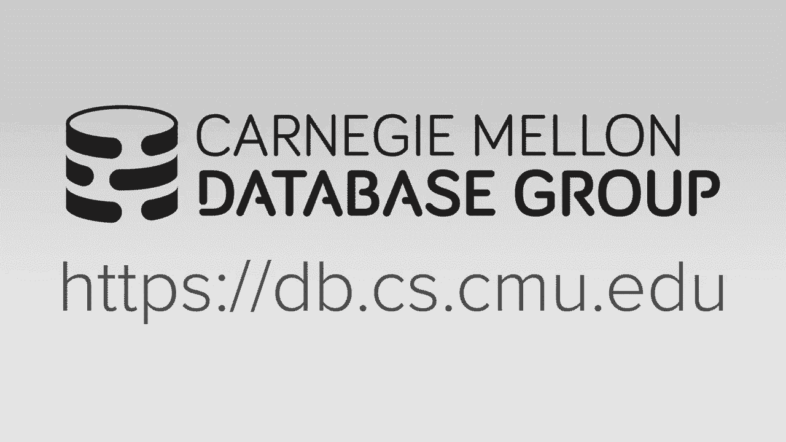
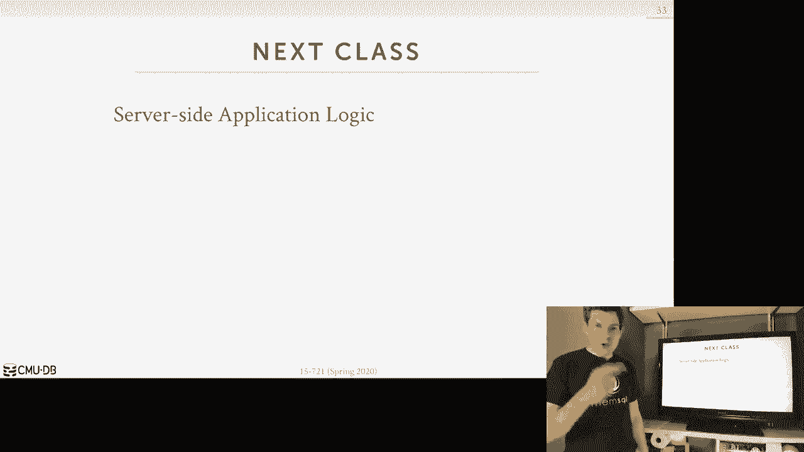

# 数据库系统进阶：L23：超内存数据库体系架构 🗄️

在本节课中，我们将学习如何让一个内存数据库系统能够存储和访问超出其可用内存容量的数据。核心目标是引入磁盘等非易失性存储设备，同时避免将系统架构退回到传统的、较慢的磁盘导向型设计。

## 概述

我们整个学期都在讨论内存数据库，其所有算法和架构决策都基于一个核心假设：整个数据库都驻留在主内存中。这带来了极高的效率，因为我们无需考虑磁盘I/O。然而，DRAM价格昂贵且功耗高，而SSD和机械硬盘在性价比上仍有优势。因此，我们希望能在内存数据库系统中引入磁盘存储，用于存放“冷数据”（不常访问的数据），同时保持“热数据”（频繁访问的数据）在内存中，从而在不牺牲太多性能的前提下支持更大的数据库。

上一节我们介绍了内存数据库的优势，本节中我们来看看如何扩展它以支持超内存数据库。

## 背景与目标

内存数据库的访问是**面向元组**和**字节可寻址**的。相比之下，磁盘存储是**面向块/页**的，这意味着即使我们只需要一个字节，也必须读取整个数据块（例如4KB）。我们的设计挑战在于，如何在引入磁盘存储时，避免重新引入复杂的缓冲区管理器和相应的算法重写。

我们将主要关注OLTP（在线事务处理）工作负载。对于OLAP（在线分析处理）查询，由于其通常涉及大规模扫描，我们无法通过内存数据库架构获得特别的优势。OLTP工作负载的特点是存在明显的“热数据”和“冷数据”模式。例如，在社交媒体应用中，最近发布的帖子（热数据）被频繁访问和更新，而数月前的旧帖子（冷数据）则很少被触及。我们的目标是将冷数据移出内存，存放到磁盘上。

## 核心设计问题与决策

要实现超内存数据库，我们需要解决一系列设计问题。以下是关键决策点：

### 1. 冷热数据识别 ❄️🔥

首先，系统需要能够识别哪些数据是“冷”的，适合被移出内存。

*   **在线识别**：在查询/事务运行时，直接在元组或页面中维护访问元数据（例如，在元组头中存储一个指向最近访问链表的指针）。这种方法开销较大，因为每个元组都需要额外的存储空间来记录访问信息。
*   **离线识别**：系统在后台记录所有数据访问日志。一个独立的后台线程定期分析这些日志，计算访问频率直方图，从而识别冷数据。这种方法运行时开销较低。

### 2. 触发驱逐的时机 ⏰

系统需要知道何时开始将数据驱逐到磁盘。

*   **管理员定义阈值**：当数据库内存使用量达到预设阈值（例如80%）时，触发驱逐策略。
*   **按需驱逐**：当需要从磁盘读入新数据但内存已满时，运行替换算法（如LRU或其近似算法）来腾出空间。

### 3. 驱逐后的元数据管理 🗺️

数据被驱逐到磁盘后，系统必须在内存中保留一些信息，以避免“假阴性”（即查询找不到实际存在于磁盘上的数据）。

*   **墓碑**：在内存中原元组的位置放置一个特殊的“墓碑”元组。它不包含实际数据，但存储了该元组在磁盘上的位置信息（块ID和偏移量）。所有索引需要更新，以指向这个墓碑元组。
*   **布隆过滤器**：从内存索引中移除被驱逐元组的键。同时，为每个索引维护一个布隆过滤器。当内存索引查找失败时，查询布隆过滤器。如果布隆过滤器说“不存在”，则数据确实不存在；如果它说“可能存在”，则需查询一个磁盘上的二级索引来定位数据。
*   **数据库系统管理的页表 / OS虚拟内存**：在页级别跟踪哪些页在内存中，哪些已被换出到磁盘。这通常涉及更粗粒度的管理。

### 4. 数据读回策略 🔄

当查询需要访问已驱逐到磁盘的数据时，我们需要决定如何将其读回内存。

*   **块粒度合并**：将整个磁盘块读入内存，并将其中的所有元组合并回主表堆，并更新所有相关索引。缺点是可能读入大量不需要的“冷”元组，导致索引更新开销大，且这些元组可能很快又被驱逐，造成“乒乓效应”。
*   **元组粒度合并**：只读回查询真正需要的那些元组。这避免了不必要的索引更新，但需要在磁盘块中记录“空洞”，并可能需要后台进程进行压缩合并。
*   **合并阈值**：可以设置策略，例如仅在数据被更新时才将其合并回内存；或者根据磁盘块的访问频率决定是否将其提升回内存。

### 5. 查询执行策略 ⚙️

当事务或查询试图访问不在内存中的数据时，系统如何响应？

*   **中止并重启**：中止当前事务，由后台线程获取所需数据，待数据就绪后重启事务。这对于支持快照隔离等强隔离级别的事务比较棘手。
*   **同步获取**（更常见）：暂停或阻塞查询，同步地从磁盘获取所需数据到内存，然后让查询继续执行。可以优化为预先收集查询所需的所有磁盘数据，然后批量获取，以减少停顿次数。

## 实际系统实现案例

接下来，我们看看几种研究或商业系统中实现超内存支持的具体方法。

### 1. 基于元组的早期系统

这些系统采用我们前面讨论的细粒度元组管理方法。

*   **H-Store / VoltDB (Anti-Caching)**：使用**在线识别**（LRU链）、**管理员阈值**、**墓碑元组**、**中止并重启**事务以及**块粒度合并**。实现复杂，开销较大。
*   **Microsoft Hekaton (Project Siberia)**：使用**离线识别**、**管理员阈值**、**布隆过滤器**、**同步获取**和**元组粒度合并**。该项目最终未投入生产。
*   **EPFL 方法 (使用 `mlock`)**：将表堆分为热区和冷区。热区页面用 `mlock` 锁定在内存中。冷区页面交给操作系统通过虚拟内存管理换出。使用**离线识别**和**同步获取**。
*   **Apache Geode**：基于 H-Store 思路，但数据存储在 HDFS 上。它只在数据被**更新**时才将其合并回内存，因为 HDFS 是追加写的。

### 2. 基于页面的现代方法

这些方法在页面级别进行管理，更为统一和高效。

*   **LeanStore**：这是一个开创性的研究原型。其核心思想是：
    *   **页面层次结构**：将数据（包括表和索引）组织成树形结构，确保每个子页面只有一个父页面引用它。
    *   **指针交换**：利用指针的高位来标记该指针是指向内存地址（`0`）还是指向磁盘上的页面ID（`1`）。当页面在内存时，指针是“交换过”的内存地址；当页面被驱逐，指针被“反交换”为磁盘页面ID。
    *   **随机化驱逐**：随机选择一些页面进入“冷却”阶段（仍在内存，但指针已反交换）。通过一个哈希表跟踪这些“冷却”页面的访问情况。当需要空间时，驱逐那些在冷却期间未被访问的页面。
    *   这种方法避免了为所有数据维护访问元数据的开销，且能统一处理表和索引。

*   **Umbra**：可以看作是 Hyper 的下一代，采用了 LeanStore 的思想，但引入了关键创新：
    *   **可变大小页面**：像 `jemalloc` 这样的 slab 分配器一样，分配不同大小类别（如 64KB, 128KB, ...）的内存块。这特别有利于存储大文本字段或压缩字典等变长数据。
    *   它同样使用**页面层次结构**和**指针交换**，但指针中除了页面ID，还编码了大小类别信息。
    *   其设计哲学是：构建一个复杂但高效的缓冲区管理器，可以简化系统其他部分的设计。

*   **MemSQL (SingleStore)**：其最新架构统一了行存和列存，声称可以在列存上支持事务。它可能使用基本的 LRU/Clock 算法管理页面换出，采用**同步获取**和**完全合并**策略。

## 总结

本节课中我们一起学习了如何为内存数据库系统添加支持超内存数据库的能力。我们探讨了核心的设计挑战，包括冷热数据识别、驱逐时机、元数据管理、数据读回和查询执行策略。我们回顾了从早期基于元组的系统（如 H-Store、Project Siberia）到现代基于页面的系统（如 LeanStore、Umbra）的演进。

现代的研究表明，像 **LeanStore** 和 **Umbra** 这样基于**页面层次结构**、**指针交换**和**智能驱逐策略**的方法，很可能是构建高效超内存数据库系统的正确方向。它们以统一的、开销较低的方式管理内存和磁盘数据，避免了早期细粒度方法带来的复杂性和性能开销。

最后需要指出，随着**字节可寻址的非易失性内存**（如 Intel Optane PMem）技术的成熟，未来我们可能不再需要如此复杂的内存-磁盘分层管理，数据可以持久地驻留在类似内存的介质中，届时今天讨论的许多技术可能会变得过时。