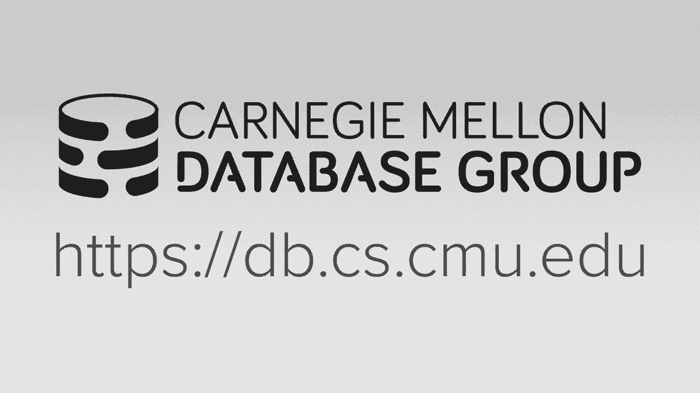
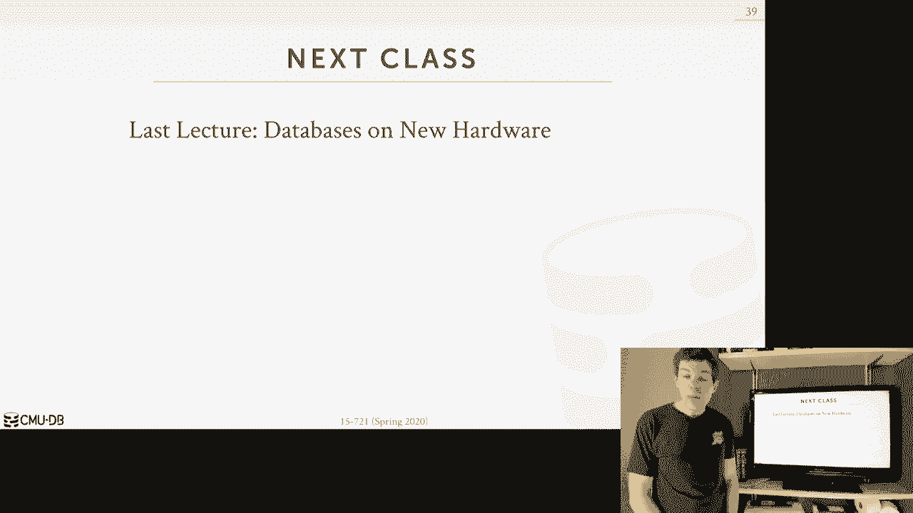

# 数据库系统进阶：L24：服务器端逻辑执行 🚀



在本节课中，我们将要学习服务器端逻辑执行，特别是如何优化用户定义函数的性能。我们将探讨两种主要方法：微软提出的内联方法和将UDF转换为公共表表达式的新方法。这些技术旨在让UDF运行得更快，同时保持数据库系统的可扩展性。

---

## 背景介绍

到目前为止，我们假设应用程序栈和数据库系统之间存在清晰的划分。数据库系统只看到通过JDBC或ODBC等对话式API发送的查询。这种方法的缺点是，它是一个“啰嗦”的API：发送查询、获取结果、处理、再发送下一个查询。

应用程序服务器上的程序逻辑与数据库查询执行交替进行，导致网络往返频繁。在事务中，这可能导致数据库服务器在等待下一个命令时持有锁，造成资源空闲。

服务器端逻辑执行的目标是将部分应用程序逻辑移入数据库系统内部，避免这些网络往返，将多个操作合并为一次数据库调用。

## 服务器端逻辑的类型

有多种方式可以将逻辑嵌入数据库系统：

*   **存储过程**：将事务逻辑封装成可调用的过程。
*   **用户定义函数**：附加在查询上的函数，是**最常见**的类型。
*   **触发器**：在特定事件发生时自动触发的函数。
*   **用户定义类型**：扩展数据库内部类型系统。
*   **用户定义聚合**：定义更复杂的聚合函数。

本节课我们将重点讨论**用户定义函数**。

## 用户定义函数简介

UDF是应用程序开发者编写的函数，用于扩展系统功能。它接受标量值作为输入，执行计算（可能包含循环、条件判断等），并返回标量值或关系。

以下是一个T-SQL的UDF示例，它根据客户的总消费金额计算服务等级：

```sql
CREATE FUNCTION customer_level(@ck int)
RETURNS CHAR(10)
AS
BEGIN
    DECLARE @level CHAR(10)
    DECLARE @total NUMERIC(12,2)
    SELECT @total = SUM(o_totalprice)
    FROM orders
    WHERE o_custkey = @ck
    IF @total > 1000000
        SET @level = ‘Platinum’
    ELSE
        SET @level = ‘Regular’
    RETURN @level
END
```

在查询中，可以这样调用它：
```sql
SELECT c_name, customer_level(c_custkey)
FROM customer
```

### UDF的优势
1.  **模块化与重用**：复杂逻辑可以集中定义，多处使用。
2.  **减少网络往返**：逻辑在数据库内部执行，降低了延迟。
3.  **表达更灵活**：某些逻辑用UDF比用纯SQL更易于编写。

## UDF的性能问题

尽管UDF很有用，但它们会带来严重的性能问题：

1.  **查询优化器将其视为黑盒**：优化器不知道UDF内部做了什么，因此无法估计谓词的选择性或基数，通常只能采用最坏情况的假设。
2.  **顺序执行，难以并行化**：UDF是命令式代码，必须逐行执行，限制了并行优化。
3.  **可能包含动态SQL**：UDF可以在运行时构建并执行SQL字符串，使得优化器无法提前准备。
4.  **行式调用**：对于复杂的UDF，数据库系统通常需要为每一行数据单独调用一次UDF，无法进行批处理或向量化执行。这被称为 **“Row-by-Agonizing-Row”** 执行模式。
5.  **缺乏跨语句优化**：UDF内部的多个SQL语句无法被整体优化。

一个简单的UDF可能导致查询从800毫秒暴增至13小时。

## 解决方案概述

为了解决UDF的性能瓶颈，研究人员提出了两种主要思路：
1.  **FRODO（内联方法）**：将命令式UDF代码转换为关系代数表达式，然后内联到查询计划中。
2.  **CTE转换方法**：将UDF（特别是包含循环的UDF）转换为递归公共表表达式。

接下来，我们将详细探讨这两种方法。

---

## 方法一：FRODO - 内联优化 🧠

FRODO是微软提出的一种技术，用于将命令式UDF代码转换为可内联的关系代数表达式，从而使查询优化器能够理解并优化它。

### FRODO的工作原理

FRODO的转换过程分为五个步骤：

1.  **将T-SQL语句转换为SQL查询**：将UDF中的命令式语句（如变量赋值、IF条件）映射成等价的SQL查询片段。
2.  **将UDF划分为区域并构建关系表达式**：根据控制流将UDF代码划分为不同区域，并为每个区域构建一个关系表达式（或SQL查询），使用合成表来存储变量值。
3.  **合并区域表达式**：使用 **`CROSS APPLY`** （横向连接）操作符，将各个区域的查询合并成一个单一的SQL语句。`CROSS APPLY`允许内部查询引用外部查询的列，这对于组合顺序执行的逻辑至关重要。
4.  **内联到调用查询中**：将上一步生成的庞大SQL语句替换掉原始查询中对UDF的调用。
5.  **交由查询优化器处理**：现在，这个包含了内联逻辑的完整SQL语句可以被标准的查询优化器处理，进行子查询扁平化、选择连接顺序等优化。

### 优化示例

经过FRODO转换和内联后，之前那个计算客户等级的UDF，可能被优化器重写为一个先按客户分组聚合，再进行左外连接的高效计划。UDF不再是黑盒，可以并行执行，并且优化器可以准确估算成本。

### 获得的编译器式优化

通过将UDF转换为关系代数并利用现有优化器，FRODO间接获得了传统编译器的优化能力，例如：
*   **动态切片**：根据已知输入值，消除不可能执行到的代码路径。
*   **常量传播与折叠**：将常量表达式在编译时计算出来。
*   **死代码消除**：移除永远不会被执行的代码。

### FRODO的支持范围与效果

截至SQL Server 2019，FRODO支持大多数T-SQL结构，但不支持循环、动态查询和异常处理。对真实世界数据库的分析表明，约60%的标量UDF可以被FRODO内联。性能提升非常显著，在某些案例中可达**800倍的加速**，且无需修改任何应用程序代码。

---

上一节我们介绍了通过内联来优化UDF的FRODO方法，本节中我们来看看另一种不同的思路，它特别擅长处理包含循环的UDF。

## 方法二：转换为公共表表达式 🔄

这种方法来自一篇较新的论文，核心思想是将UDF（特别是包含迭代控制流的UDF）转换为递归的公共表表达式。

### CTE转换方法的步骤

该方法也包含五个关键步骤：

1.  **转换为SSA形式**：将UDF转换为静态单赋值形式，这是一种编译器中间表示，每个变量只被赋值一次，并用goto语句表示控制流。
2.  **转换为管理范式**：将SSA形式的程序进一步转换为一种“相互尾递归”的形式，即递归调用只发生在函数块的尾部。
3.  **转换为直接尾递归**：将上一步的相互递归合并为单一函数的直接尾递归。
4.  **转换为递归CTE**：利用SQL的 **`WITH RECURSIVE`** 语法，将尾递归函数逻辑转换成一个递归CTE查询。递归CTE能够模拟循环行为。
5.  **交由查询优化器处理**：将生成的递归CTE查询交给数据库优化器执行。

### 示例：计算幂函数

考虑一个计算幂的UDF（例如 `power(x, n)` 计算 `x^n`）。它内部包含一个while循环。通过上述转换过程，这个循环逻辑可以被表达为一个递归CTE。虽然生成的SQL语句看起来复杂，但它允许数据库引擎更高效地执行原本需要逐行迭代的逻辑。

### 优势与特点

*   **支持循环**：这是相比早期FRODO的一个主要优势。
*   **可作为中间件实现**：该转换层可以不紧密耦合到数据库内核，理论上可以作为中间件为多种数据库（如PostgreSQL、Oracle）提供UDF优化。
*   **性能提升**：在PostgreSQL上的初步实验显示，对于包含迭代的UDF，采用CTE方法能获得约40-50%的性能提升，主要避免了原生UDF中每条指令都被当作独立查询执行的巨大开销。

---

## 总结与展望 🎯

本节课中我们一起学习了服务器端逻辑执行，特别是优化用户定义函数性能的两种先进技术：

1.  **FRODO（内联）**：通过将UDF转换为可内联的关系代数表达式，使优化器能充分发挥作用，适用于大量标量UDF，能带来数百倍的性能提升。
2.  **CTE转换**：通过将UDF（尤其是含循环的UDF）转换为递归公共表表达式，在数据库层面实现迭代逻辑，为FRODO无法处理的UDF提供了优化途径。

这两种方法都无需修改应用程序代码，体现了数据库系统在提供扩展性的同时追求极致性能的设计思想。未来的研究方向可能是混合方法，根据UDF的特性动态选择内联、编译（如LLVM编译）或其他执行策略，以达到最佳性能。




服务器端逻辑执行的优化，是让数据库系统更智能、更强大，从而更好地服务于现代复杂应用的关键一步。