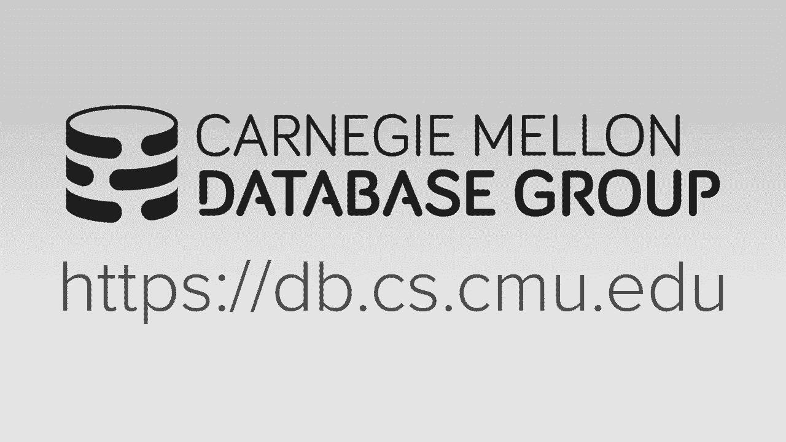

# 数据库系统进阶：L25：新硬件上的数据库 🚀

## 概述
在本节课中，我们将探讨数据库系统如何运行在新兴或非传统硬件上，特别是持久内存和GPU。我们将了解这些硬件如何改变数据库系统的设计，并讨论相关的优化技术和挑战。

---

## 课程安排与反馈 📅

上一节我们介绍了课程的整体结构，本节中我们来看看本学期的剩余安排和课程反馈的重要性。

本学期剩余安排如下：
*   周三将有来自亚马逊的客座讲师，介绍Redshift相关工作。
*   5月4日将发布第二次代码评审提交的详细信息。
*   5月5日将进行最终项目演示。
*   5月13日是上周发布的期末考试截止日期。
*   5月16日将举行额外的黑客马拉松活动。

课程反馈对于改进课程至关重要。请通过指定URL填写课程评估。反馈是匿名的，有助于调整项目、阅读作业和课程节奏。

---

## 硬件加速数据库的历史回顾 📜

上一节我们了解了课程安排，本节中我们来看看数据库硬件加速的历史背景。

自数据库诞生之初，人们就一直在寻求使用专用或新硬件来加速数据系统。
*   **1980年代：数据库机器**：使用定制硬件（ASIC）来高效执行数据库操作（如哈希连接）。由于摩尔定律，通用CPU性能快速提升，导致此方案回报递减。
*   **1990年代：商品硬件**：大多数数据库运行在商品硬件上。
*   **2000年代：FPGA与设备数据库**：早期尝试使用FPGA构建数据库（如Teaser）。出现了设备数据库（在调优过的硬件上运行数据库软件）。云计算的兴起使得在亚马逊等云服务上购买商品硬件更具成本效益。
*   **2010年代：GPU数据库**：由于机器学习对GPU计算的兴趣，人们开始利用GPU进行数据库操作。

在当前十年，硬件领域可能出现新的变革，持久内存等新技术可能被纳入数据库系统。

---

## 持久内存介绍 💾

上一节我们回顾了硬件加速的历史，本节中我们重点探讨持久内存。

传统数据库设计需要区分易失性（DRAM）和非易失性（磁盘/SSD）存储。持久内存旨在提供接近DRAM的速度和字节可寻址的访问接口，同时能在断电后保持数据。

**持久内存**、**非易失性内存**和**存储级内存**通常指代相同概念。

### 底层技术
持久内存的实现基于几种技术：
1.  **相变内存**：通过施加不同脉冲改变材料的电阻状态来表示0或1。**Intel Optane DC持久内存**即采用此技术。
2.  **忆阻器/电阻式RAM**：基于Leon Chua在1971年假设的第四种电路元件。HP实验室在2000年代初期偶然制造出来。其特点是利用二氧化钛层间电阻变化存储数据，具有高密度、低能耗潜力，甚至支持“内存内计算”。
3.  **磁阻RAM/自旋电子学**：利用磁性改变电子自旋来存储数据。具有能耗低、尺寸小、速度接近CPU缓存的潜力。

### 持久内存成为现实的原因
以下是持久内存如今值得关注的原因：
*   **行业标准**：JEDEC等联盟制定了持久内存的技术规范和外形标准。
*   **操作系统支持**：自2017/2018年起，Linux和Windows内核通过DAX（直接访问扩展）支持持久内存。
*   **指令集支持**：Intel更新了Xeon指令集，添加了显式的缓存行刷写到持久内存的指令（如`CLFLUSHOPT`, `CLWB`）。
*   **产品上市**：Intel已推出Optane DC持久内存模组，外形类似DRAM，但具备非易失性。

---

## 持久内存的使用模式 ⚙️

上一节我们介绍了持久内存的技术背景，本节中我们来看看数据库系统如何使用它。

从数据库视角，主要有两种使用模式：
1.  **内存模式**：DRAM作为持久内存的硬件管理缓存。数据库系统无需感知持久内存，将其视为更大、更便宜的DRAM。性能较好，但未利用其持久性。
2.  **应用直接模式**：应用程序（数据库系统）明确知晓并管理DRAM和持久内存的边界。可以将关键数据结构和日志放在持久内存区域，并通过特定指令确保数据持久化。这要求重新设计数据库系统以利用字节可寻址的持久化特性。

**预测**：当持久内存普及时，内存数据库可能更容易适配，因为它们已假设可对内存进行快速随机访问。而基于磁盘的系统可能最初仅将持久内存用作更大容量的内存池。

---

## 面向持久内存的存储与恢复 🛠️

上一节我们了解了持久内存的使用模式，本节中我们探讨如何为持久内存重新设计数据库存储和恢复机制。

我们假设一个只有持久内存（无DRAM）的环境，并分析三种经典存储架构的改造：

### 1. 就地更新引擎（如B+树）
*   **传统问题**：一次逻辑更新（如更新元组）可能产生多次物理写入（WAL日志、表堆、快照），导致写放大。
*   **持久内存优化**：利用持久内存字节可寻址和指针持久化的特性。可以只记录更改的元组指针到日志中，而非完整数据。恢复时，只需处理日志中的指针元数据，无需重做（Redo）操作，因为数据更改已持久化在表堆中。

### 2. 写时复制引擎（如LMDB）
*   **传统问题**：即使只更新一个元组，也需要复制整个页，并更新多层目录指针，写放大严重。
*   **持久内存优化**：由于支持字节寻址，可以仅复制被修改的元组指针，而非整个页，从而大幅减少复制开销。

### 3. 日志结构引擎（如LevelDB/RocksDB）
*   **传统问题**：存在内存表（MemTable）和磁盘SSTable的转换，以及昂贵的压缩操作。
*   **持久内存优化**：可以消除MemTable和SSTable的区分，所有数据都以持久化形式存在。但压缩操作可能仍然需要。

---

## 写后日志：一种持久内存优化协议 📝

上一节我们讨论了存储引擎的优化，本节中我们介绍一种专为持久内存设计的日志协议——写后日志。

在同时具有DRAM和持久内存的混合系统中，写后日志旨在加速性能并实现快速恢复。

### 传统写前日志的瓶颈
WAL顺序写入是为了避免磁盘随机写。但在持久内存中，随机写入速度很快，顺序写优势减弱。

### 写后日志原理
写后日志结合了多版本并发控制：
1.  **数据布局**：表堆主副本在DRAM中，其持久化副本在持久内存中。日志也放在持久内存。
2.  **写入流程**：事务更新DRAM中的元组，同时将更改同步到持久内存中的副本，并在日志中记录被修改元组在持久内存中的**指针**及事务时间戳信息。
3.  **恢复机制**：崩溃恢复时，无需重做。只需分析日志，确定崩溃时未提交事务的时间戳范围。系统恢复后，新事务或后台清理线程会忽略或回收属于该时间戳范围的元组版本，实现协同垃圾回收。

### 性能优势
*   **恢复时间**：相比WAL，写后日志的恢复时间快数千倍，因为它只需读取日志中的元数据范围。
*   **运行时性能**：在持久内存上，写后日志能获得约1.2倍的性能提升，因为它利用了持- 久内存快速的随机写入能力。但在SSD或HDD上，由于其随机写入性能差，写后日志性能会下降。

**总结**：写后日志与持久内存结合，能同时优化运行时性能和恢复时间。

---

## GPU加速数据库 ⚡

上一节我们深入探讨了持久内存，本节中我们简要看看如何使用GPU加速数据库。

GPU包含数千个核心，适合对大数据流执行简单、重复、无复杂分支的操作。

### 适用与不适用场景
*   **适用**：顺序扫描、某些连接和聚合操作（有对应实现）。
*   **不适用**：事务处理、B+树遍历（因涉及分支决策）。

### 系统架构挑战
*   **内存非一致性**：GPU显存与CPU内存不缓存一致，数据需要显式拷贝。
*   **带宽瓶颈**：PCIe总线带宽（约16 GB/s）低于CPU内存带宽（约40 GB/s），可能成为瓶颈。NVLink技术可提供更高带宽，但通常限于PowerPC平台。
*   **容量限制**：GPU显存容量（目前最高约100GB）远小于CPU可支持的内存容量（TB级）。

### 数据组织模式
以下是使用GPU的三种方式：
1.  **全驻留模式**：将整个数据库复制到GPU显存。受限于显存大小。
2.  **部分列驻留模式**：仅将频繁查询的列复制到GPU。需要手动或自动选择列。
3.  **流处理模式**：将数据分批流式传输到GPU处理，保持GPU持续忙碌。适用于超出显存大小的数据集。

目前已有多个GPU数据库产品（如Kinetica, BlazingSQL, OmniSci等），主要用于OLAP场景。

---

## 硬件事务内存 ⚙️

上一节我们讨论了GPU加速，本节中我们最后了解一下硬件事务内存。

硬件事务内存是CPU提供的一种机制，允许将代码块标记为事务，由硬件跟踪内存访问并自动检测冲突，类似于乐观并发控制。

### 工作原理
HTM利用缓存一致性协议来跟踪事务的读写集。如果发现冲突，则中止并回滚事务。读写集必须能放入L1缓存，因此不适合大型事务。

### 编程模型
1.  **硬件锁省略**：首次以事务方式执行临界区。若冲突，则中止并重新以传统锁方式执行。
2.  **受限事务内存**：事务中止后，跳转到程序员提供的备用代码路径执行，而非简单重试。

### 在数据库中的应用示例
例如，在B+树插入时，可以用HTM事务包裹从根节点到叶节点的遍历和加锁过程。如果成功，则仿佛自动获得了所有必要锁；如果因冲突中止，则回退到传统的锁遍历算法。

**现状与挑战**：Intel的TSX实现曾因安全漏洞被禁用多次。其稳定性和安全性尚存疑问，目前未在数据库中得到广泛应用。它可能更适用于简化并发编程，而非替代数据库中的完整事务管理。

---

## 总结与展望 🎯

本节课我们一起学习了在新硬件上运行数据库的关键知识。

### 核心要点总结
1.  **持久内存**：是一种具有DRAM般速度、字节可寻址且非易失性的存储介质。它可能改变数据库架构，减少对复杂缓冲池和WAL机制的依赖。
2.  **存储优化**：针对持久内存，可以重新设计存储引擎（就地更新、写时复制、日志结构），减少写放大和数据冗余。
3.  **写后日志**：一种利用持久内存特性的日志协议，能极大加快恢复速度，并与多版本控制结合实现高效恢复。
4.  **GPU加速**：适用于大规模并行、无复杂分支的OLAP操作（如扫描）。面临内存一致性、带宽和容量挑战。
5.  **硬件事务内存**：由CPU提供的事务支持，目前因稳定性和容量限制，在数据库中应用有限。

### 未来展望
*   持久内存的普及可能简化数据库内核设计，内存数据库可能率先受益。
*   GPU和FPGA加速可能在特定领域（如OLAP、矩阵计算）继续发展。
*   未来可能出现更多专用加速器（如可配置空间加速器、TPU），数据库系统需要思考如何集成这些异构计算资源。

完成本课程后，你应能理解现代单节点数据库系统的核心原理，并具备评估新兴数据库技术声称的能力，区分真正的创新与市场宣传。