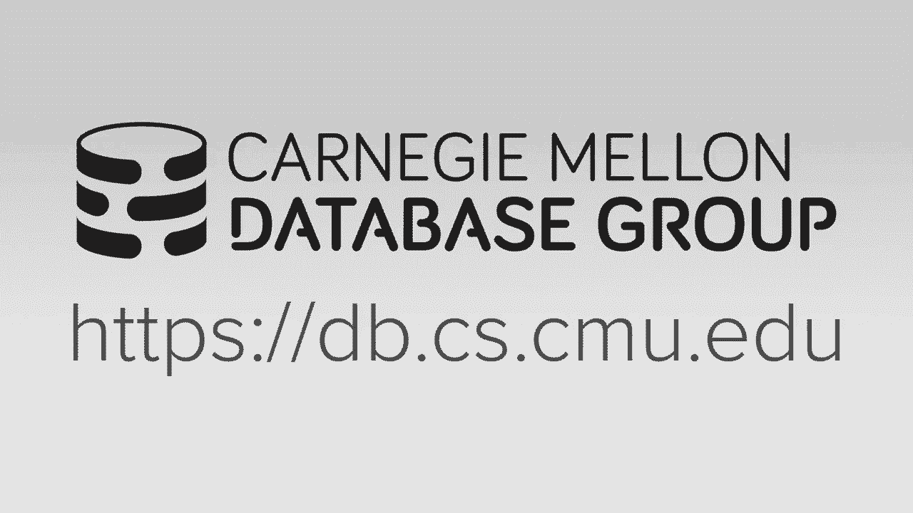
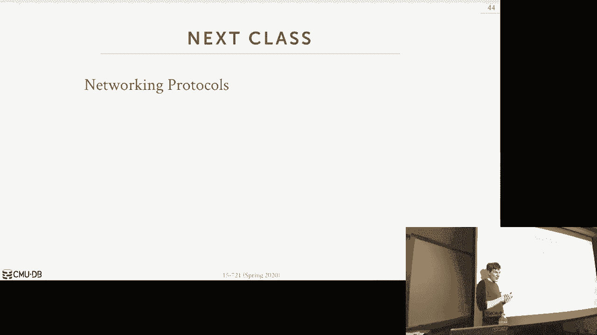

# 【双语字幕+资料下载】CMU 15-721 ｜ 数据库系统进阶(2020·完整版) - P10：L10- 恢复协议 - ShowMeAI - BV1wv411w7Ko

。

🎼All right， so。Today we're talking about recovery protocols and so there'll be some you know in the introduction class。

 we talk about areas， we talk about how to we want to restore the database after crash and in the AMory database。

 we're going to do the exact same thing right obviously that if the database，😊，You know。

 if database shuts down or crashes， we want to be able to restart the system and put the database back into the correct state such that we guarantee the asset admissity and durability guarantees it would have in asset system right so aacity means that we can't have any partial transactions。

 consistency means that we don't put the database in like a funky state where like data could be actually incorrect and then durability just means that we write changes to the database we tell committed a transaction。

 The outside world heres that that transaction is committed when we come back then all our changes are still there。

So every recovery algorithm is going to have two parts。

 there's the part we're going to do at runtime where as we process transactions and they update the database。

 we're going to take some extra steps to record some extra information so that if we crash and come back。

 we can look at extra extra information and figure out what was going on in the system to put us back in the correct state。

 and then there's the recovery protocol you actually do after the crash or after a failure。

 where you look at all the information you've collected that you generate doing the normal processing and then you figure out what do I need to do to go back。

So we'll talk a little bit about when you spent time talking about in memorymory database recovery or logging protocols and recovery protocols。

 the paper I had you guys read was not in an memoryory database。

 and I'll explain why I signed it there's actually not a lot not many papers about inmemory database log recovery When you look back at the early ones from the 1980s。

 they all make this big assumption that the log or the database itself will be backed by what is called nonvolunt memory or persistent memory。

Back in the 1980s， this just meant battery back of DRA。

 so you had a little battery on the motherboard that could be triggered anytime you recognize that the power was going to go down and you use the battery to actually gracely shut down the memory。

 write it out the disk。 and so when you came back， all your contents or DRAM was still there。😡。

So battery back DRA has been around for a long time。

 it's not widely used because it takes up space on the motherboard。

 they're great until you try to use them and they don't work because you have to make sure the battery is always functioning correctly so you don't see that too often in the while you certainly can't go to Amazon and get an AWS instance that has this。

😡，So the other kind of persistent memory though instead of bang battery back to DRAM is to use what is called true nonvault memory or true persistent memory。

 And so for years and years and years， every time I taught this class， I would say。

 oh real nonvault memory is coming out one year from now， one year from now， and finally last year。

 Intel stepped up and released true nonvault memory called the opt team and again。

 the idea that goes into a dim slot like you normally would with DRA。

 but this has magic inside of it that says， you know if if I lose power， I still maintain everything。

 it's going to be slightly slower than DRA， but it's gonna be way faster than than SSDs。

 So we're not going to talk about and theM stuff or persistent memory right now will cover this at the end of the semester yes。

The question is it really expensive。 What's that， What you say oh。

Yes and no's not like it's not like outlandish， it's like maybe a couple thousand for like 128 gigs or something like that。

 I don't know the exact prices I don't think until publishes them。

 you can maybe altogether get from OEM， but yeah it's more expensive in the DRAM more expensive than SSDs。

 but it has certain properties that you can't get out an SSD。

You can also get it in a form factor that goes down on the PCX。

 so that looks like a flash drive even though it's the special basically it's not NFlash。

 it's not DRA， it's a special storage medium called phase change memory。

 you can get it in other form factors and that one though the prices are close to what SSDs are。

 but for the dim stuff it's more pricey。we'll cover this later in the semester the point I'm have to make is like if you go read the early papers on logging protocols for MMory databases。

 they all assume this， but back then they didn even have it。

 so we still have to design our protocols using relying on SSDs or spinning disk hard drives。

So the good thing though， for us in an M database is that our recovery protocol is going to be slightly easier than what we have to do in a discordant system。

 and this is just due to the fact that since the primary storage location of the database is in memory。

 when we crash， or there's a failure， that memory is wiped。So when we come back。

 all we need to do is load in the last checkpoint and replay the log from disk。

 and we don't have to worry about any dirty pages from transactions that may be lingering around on disk that we had to reverse。

 as we would in a discordient system。So we don't have to track dirty pages。Right as we run。

 like if a transaction makes some changes and then it doesn't commit and we crash。

 all those memory pages get wiped。 So that's fine。 All。

 So this means now we don't have to story in undo records to reverse these things because there's nothing to reverse。

 The only thing we need to write out the disk is just redo information。

The other big difference is going to be that we're not going to log any changes that we make to indexes。

So in a disk based system， as I update my table and that causes updates to the indexes。

 I'm also going to create log records that record the changes to the index。😡，But in my database。

 I don't do any of that， and so when I crash， I have to load the database back in from the checkpointt file anyway。

 so the disk is way more expensive than doing the computation。

 so I'm just going to rebuild the indexes on the fly as I load the checkpoint in。😡。

And in a dis based system， you don't do that。So we still have to deal with the fact that dis is gonna to be slow。

 And so we still want to take advantage of all the optimizations we would do in in a discordance system。

 like group commit， batchshing things， doing speculative locked releases， things like that。

 All those optimizations are still going to apply for us here， even though we're in memory。

So today I'm gonna talk about first about different types of logging schemes。 And again。

 the paper you had you guys read was for a disk orient system， but it's relying on multiverging。

 So I think that's really interesting。 and we'll see how that works。

 And then we'll talk about checkpoint protocols。 And these two here are what you need for to guarantee your database will actually this is all you really need to guarantee your database is durable。

 This is a way to speed things up after a crash。 and this is a way to speed things up if you're going to do a restart and you know that it's gonna be scheduled at a certain time。

 So this one you have to have。 This one is an optimization to make this go faster and this is an optimization to avoid having to do all of this okay。

はい。So at a high level， there's two types of logging schemes。😡。

It physical logging and logical logging， physical logging is like taking a diff as you wouldn't and get。

 the idea is that we're going to record the changes that we're making to a record at the byte level。

😡，If you think of also in NBCC， if you're using a Delta store， I'm just recording。

 here's the column that I modified， and here's the new value。Right。So then after a crash。

 or essentially you just going to replay these log records and reapply the changes to the columns。

The other approach is do logical logging， and this is where instead of storing again the low level bytes were modifying within a tuple。

We're it going to store the high level operation that the application invoked requested on the data system to make that change？

So it would be like recording the actual SQL statements that they would send us。

 the answer update delete queries。So the idea here is if I have a database。

 but the table has 1000 tuples， big， maybe a billion tuples。

If I'm doing physical logging with one query that needs to update all 1 billion tuples。

 then I need 1 billion log records that correspond to every single tu that I've modified。

 but if I'm doing logical logging， then I only need to record that single update statement and that's enough for my system have to restart to replay that update and put back in the correct state。

😡，So logical logging is going to be much smaller log files and potentially much faster to commit at runtime。

 but the recovery processes could potentially be more expensive because there's no magic I can do to make this update go faster during recovery so if I have to update a billion twoupples and it takes an hour the first time I run it after I crash and restart and replay this update query。

 it might take an hour again。So it might delayed the amount of time it takes for me for my database to come back online。

So for this reason， those systems are going to choose physical logging。

 and this is only used in certain specialized systems。Okay。Now， the question is。

 when do we actually flush the log records that a transaction generates？

So the first approach is to do all at once， meaning as a transaction runs and they're making changes。

 they're executing queries that update the database。

 doesn't matter whether it's physical logging or logical logging。

 I'm just going to record in memory in this log buffer for my transaction here's all the log records。

 and only when the transaction says go ahead and commit if we pass our validation。

 then we hand out those log records to some our logger thread who then flushes it out to disk。

Of course， we have to wait until all those law recordss are written to the disk before we can tell the outside world that our transaction committed。

So it could be， you know， if I've updated a billion2 of a billion wall records at the rate Wait for those 1 billion log records to get rid to disk。

The other approach is do incremental flushing。And this is as transactions run and they'reccumulating these log records。

 when their local log buffer gets full， they can hand that off to some writer thread who can then start writing that out the disk and then they get a new log buffer to start filling up with new log records。

 so that means that if there's a crash now in the log。

 there may be log records from transactions that did not commit yet。

Because we're allowing things to get written out before everything is finished。

So in this approach here for all at once， this makes recovery easier because I know if I crash and come back。

 I'm almost never going to see log records from transactions that did not commit。😡。

I may see a transaction did commit and they start writing out all their log records。

 but we crash before we write the rest of it and the commit message。

 in that case I certainly have to undo it， but most of the times I'll have all the log records。😡。

In the case of incremental flushing， I had to do some extra work to go figure out。

 here's a bunch of transactions that that have been finished。

 Let me go ahead and make sure I don't reapply their changes。

So this is not that big of a deal because again， we don't write out any dirty pages。

 We're reloading from the checkpoint anyway。 it's just we have to douce extra processing in the log to make sure we skip things that shouldn't committed。

 Yes the thing if a transaction is let say searching 10 billion yes and。

Inserted them and sorry you changed them。 And then it did something。 Yes。

 and those 5 billion things got stored。 Yes， and last 5 billion things did not get stored。 correct。

 and then it like crashed also Yes， so now how do you undo these last 5 billion things because again。

 there's nothing to undo。 Nobody updated But updated what updated in memory pages。

 we crash that memory is gone。So when we come back online， we're loading the checkpoint。

 there's no dirty pages。Right。It's just in this case here。

 like we'll talk about replication next class， but it's sort of like when do I send the outside world to a replica。

 hey， here's here's all my updates for my transaction in this case also too if I update 10 billion Tupples。

 I had to have a log buffer that can handle 10 billion twos。And I may run out of memory。

 So for this reason， most systems are going to do this approach。

 but there are some advantages to doing this。All right。

 these are the standard techniques we talked about before in the introduction class that would still apply for us in a Iory system。

 So we' do group commit。 It just means that we had this log buffer that we can fill in with log record from different transactions and that we can then flush them out whenever that log buffer is full and then have a log buffer another log buffer start getting filled up by other transactions the idea here is we want to amortize the E calls across multiple transactions。

 So if you're the first guy getting added of this queue， then yes。

 you wait in the longest because you's wait for the log buffer to get full。

 but if you're the last guy then you're basically running with a dedicated E call right。

So this is a really old technique， as I said， it is used in pretty much every system today。

 It was originally developed for this thing called Fast path。

 which was a specialized in memorymory engine for IBM's IMS from the early 1980s， but like I said。

 everyone pretty much does this today。The other thing we can do now。

 which is related to the speculative lock release or speculative res we saw under Heathton and NVCC is that。

When a transaction goes ahead and commits， we don't have to wait for the updates to become durable on disk before we release all our locks。

 We can let other transactions start modifying the tus that we've modified。

 assuming those log records will get will get written our loggrs will get written out of the disk。

 or they read things that we' modified before the log recordss get flushed to disk。

 And we have to sort to keep track of that we did these speckative reads。

 even though the transaction it's logically committed physically it hasn't got made the disk gap。

 So we know that if any transaction reads something that we wrote they have to get stall until until we actually flushed a disk。

 So that means that my read only transaction that it reads an update from your transaction but your transaction has been written in the disk app。

 I have to wait for you to get flushed before I can get committed。Again。

 this is our standard technique and our MVCC， know we would know this information because we can maintain the state map that says this transactions law of records have not been flushed yet。

 so therefore you can't commit right away if you read something from them。Okay。

So I sort of allludeed this a little bit now in the last couple of slides where。

If we have a multiversion system， then the deelta records we're going to generate for MVCC are more or less the same thing we're going to generate for in our log it's not exactly the same because depending how we're doing oldestus and newest or newest oldesttius we could be generating redo records or undo records for our tus are're modifying whereas database log file wants to have redo records at least for MM databasease so the idea is that what if we can combine all the metadata we're generating for NVCC with all the metadata we're generating with the log file and that way we're not duplicating this effort。

😡，So that was the paper I had you guys read for today。

 it came out just this year or last year in the to be 2019， so as I said， it's not inmemory system。

 but it's a multiversion system， and I think it's a good description of how you can piggyback off of the MVCC metadata you're generating to make logging work better。

So this protocol is going be a physical logging protocol that's going to rely on the database systems's time travel table。

 which they call the version store， the TTB， so we're going to rely on that time travel table to act almost as a recovery log。

So what will happen is we'll start writing out the changes we make to this version store to a log file。

 but they're only going to contain essentially the redo records of the versions we've generated。

And then when we crash and come back， all we need to do now is just suck in this version store into disk or sorry alpha disk into memory。

😡，And we don't need to undo anything right away。 We just bring those pages back in。

 Then the database is now at the state it was at the moment of the crash。

And then we just needed to do some background extra work to do this logical work to make sure that we don't read things。

 we don't persist versions from transactions that did not commit at the crash。

So the problem they were trying to solve that they mentioned in the paper is that。

They had certain customers running on Azure in the cloud or SQL server in the cloud where they would have these really long transactions that when there was a crash。

 now I need to undo all the changes。 So this 10 billion table update we just mentioned like Vi crash before I finished updating all those tus When I come back now I got to spend a long time undoing everything。

So what they wanted to do is have what they call constant time recovery。

 which was saying that the time it's going to take for me to restore the database back to the correct state is only contingent on the size of the log file because I just need to be able to read that in the redo phase and I don't to worry about how much time I'm going to spend going reverse direction to undo things。

That makes sense。So let's go to many examples and then we'll see how it works。 So again。

 this is with SQL server， Azure SQL is the name the cloud version of it。 But as I said。

 for this feature， they're putting out in the onprem version， which includes the Linux 1。

So they're doing time travel version storage。 but they just call it a versionin store。

 And so the idea here is that you have the main table and this has the latest version and they're doing newsest to oldest。

 So this version has a pointer now to another tuple that's the next oldest tuple。

 and then there's a versionin chain allowed how to go back in time to find previous versions。

 So now if a transaction comes along and wants to update this tuple here。

 we first make a copy of the current version into our version store update the pointer to connect the chain。

 and then we can overwrite the old version with our new one here， right。😊。

So the idea here is that they want to leverage this thing， which is basically redo information。

To then allow them to restore the state of the database just by loading this thing back in。😡。

So theres going be two variants of how they're going to do this persistent version store。

 So the first one is that they're going to do in row versioning where this is actually。

 you're not going to use the version store。 This is going to look like that cicada inlining where。

Instead of making a whole copy of the tuple and putting into the Virgin store。

 they're going to pack it in in the special field inside the tuple of just the Delta record of what got what was modified。

 And then that gets written out to the right ahead log， just as it would any other tuple update。

And that's enough information to how recreate the database state。AndI'll show this in the next slide。

And then for the off versioning， which is actually using the time travel table。

Instead of having a time travel table for every single logical table in your database。

 they're going to have one giant time travel table for every single table。

This is way different I've never seen this used before。 And so the way it works is that in here。

 like instead of having discrete columns or attributes，That represent the columns in the table。

 they're just going to have one column and then just store a blob or by string of the serialized data for that tuple and that way you can store any tables tus inside there because there's no we're sort of we're not doing any processing on looking at the actual columns in this we're almost using it as a in- memorymory log and that then gets flushed。

😡，So they're also going to modify the data table data structure itself so that you can do fast andcurrent inserts so that means that they're going to partition the database in memory so that or sorry the table in memory so that different threads right to different regions of the table and then this allows you to you sort of write them out very quickly to the right ahead log and you never can allowed to go back and update any other tuple it's only append only and can now you do sequential rights out to the log which is efficient。

So this is the in row versioning。 This is the same thing we talked about with Cicada。 Basically。

 they， when I do it updated this tu， instead of making this copy of this old version and putting into the time travel table。

 those embed Delta record inside of here。And then that just gets written out to a redhead log just as you normally would。

So an important distinction here about why they can do this and why we can't do this very easily in an Emory database system is that in a disk orient database。

 the twoos can be very very length。In in a immeory database。

 we said we had the primary location of a tuL has to be fixed length。

 so we either have to allocate this delta space for every single tuple it can only be a certain size if for an inmeory。

 but in a disbased database I can leave this thing empty and then if I decide to use it when I insert the new Tple then I just grab a new slot in my page and can write everything out。

Right。So that's one important distinction between what they're doing and what how you do this in every database。

Okay。So let's see how they're going to do recovery so this almost looks like standard Aries。

 except that under Aries， the database is not available until you complete the undo phase in their world。

 it's immediately available after the redo phase。😡。

Because all they're doing is they're loading back in that version store and then all the versions。

 the old versions that are around are now available。

 and then we just piggyback of all that same version detection or identification that we do under MVCC to identify which tuples are actually visible to our transaction。

😡，So analysis phase， again， we just scan through the log up to the last checkpoint to figure out what transactions are running。

 and then in the redo phase， we're going to replay the right ahead log to put us back in the correct state for the most main table in the Virgin store but as I said。

 the Virgin store is it's going to contain versions from transactions that did not commit as well as in the main table but because we're NVCC we know what the timestamps were for those versions and then when we come back online start running regular transactions。

 we would know to skip over things that were uncommitted。

Because we're going to maintain this global state map that says。

 here's all the transactions that are around。 and here's what their status is。Then in the undo phase。

 we select transactions to start execute， and when they find things that are aborted。

 they can go ahead， either clean them up， or there would be a separate background process to clean them up asynchronously。

And they refer to this thing as a logical revert， for my purpose。

 it just sounds like garbage collection， although the fact that transactions can do slightly different when they find aboard of versions is not exactly garbage collection。

So this is already what it says said， so you have separate threads they're going to scan through the blocks。

 find all theC versions， and then if you recognize that the latest version of a Tupple is in the version store。

😡，Then you just move it back， know， into the main table。 right， And again。

 that's the same thing we would see and regularal GC that we've already talked about。

The only one optimization they do that's slightly different is if a transaction recognizes that， oh。

 in the main table， I see the current version， the master version of the TupL is from an aborted transaction。

 then instead of copying that out and making new version in the time travel。

 that is completely overwrite it。Right。So again， like I said。

 I think this is interesting because this is， although it's a disb system。

 it's showing how you can use the NPPCC metadata to do a ti or tablet logging scheme and potentially get better performance。

Any questions about this。 There's this other bit about the cis log where they would store changes for nonversion data structures like page tables and people Street layouts that again。

 all we can ignore all of that in our image system because we're not going to maintain that information。

Yes。Cme away extra cost when they reading from。Yeah， so he'sing it and he's correct。

 like does this mean at runtime， if I need to go read an old version。

 I had to go to the versionin store？And everything just serializes a blob。

 Do I pay a penalty for having to read that， Yes， but I think they measured it， It's kind of small。

 same thing with the Delta record。 I at the inro Delta record。

 I have to replay it and they pay computational costs for that。

If it is inro then you don't have much say that Yeah， but it's not as free as like going。

 reading and having everything there， I agree with you yes。

And that's why we use Delta store in our our own system。Most transactions。

I I don't remember that if they say this in paper， most transactions don't update all columns。

 It's right。 The Delta store is the in row version is usually gonna to be enough。

So this idea of what they're doing is not new， this is actually very similar to how PostG was originally designed back in like 1986。

😡，Again， Postgres， if there's a paper called the design of Postgres， and Stmaker talks about how， oh。

 well the log is not really a log file， it's a log table and everything it's getting appended to that and that gets flushed out so at a high level this is very similar and they claim the difference here is that this paper is about taking a system that was not designed to be multiversion in this way and adding after the fact whereas Postgres was designed from the very beginning to be like this。

Again， process is an NCC system。你看。So again， this is a protocol that takes advantage of the fact that we're multiversioned。

So now let's look at another blogging protocol that is for MM datas。

 That's more about how you could architect the system。

To be aware of what the the CPUs actually work and and how they operate。

So silo is a memory OTP embedded database engine that was developed out of Harvard by Eddie Kohler。

 so it's not going to be multiversion， it's going to be a single version system that uses OCC。

 and they're going to use an epoCbased garbage collection protocol to keep track of when you actually commit transactions and flushings out the disk。

So this is silo is the same people that developed the mastery， they wrote Ma Street first。

 and they built silo around it。So this paper here proposes a physical logging technique called silo R。

Is going to try to paralyze as much as possible all the logging checkpoint and recovery processes so that we get the best best performance and the way they're going to do this is that they're going to disaggregate the log across multiple files。

😡，which could be stored on multiple disk allow them to be read in parallel at the same time。

So the way this works is that for every single CPUU socket in my system。

 I'm going to have a dedicated logger threat， and dedicated log file。And the idea here is that。

We want to localize all the memory rights we have to do to our local socket。

 So we're never going over shared memory to to another another socket of interconnect。

 And then that way， that log thread can be just pumping data out as fast as possible to the log file。

So now as transactions run， they're going to get a log buffer from their local logger thread and then write out just redo information because we're in memory。

 we don't have to do any undo。 And in this case here， they are。To make it simple。

 assume that all the log records for a transaction will be written out。I actually know in this case。

 you can do incremental， but in most cases it could be done all at once。All right so again。

 I've already saved some of this so every logger threads going to pull log buffers。

 we hand them out to our local worker threads that are on the same socket as us when my buffer gets full。

 I hand it back to my logger thread， the logger thread can then start writing it out the disk which means you can do incremental flushes and then the worker thread tries to get a new log buffer。

 if there's no more log buffers available， then the worker thread has to stall until the logger thread comes back and says I flush out enough here's a new log thread。

A log buffer。So now what is going to happen， though。

 is that because now our log file is broken up across multiple files on different disks。

 it may be the case our transaction might modify data thats managed by different CPU sockets。

 and therefore the log records for that transaction might be broken up across different disks。😡。

So I need a way to coordinate all of them so that I don't have， you know， if I touch two log files。

 my transaction commits the first log log gets flushed， but the second one doesn't。

 and then I tell the outside world that I crashed。😡，And I come back。 And now that， you know。

 half the updates from the other log file never made it to disk。

So you need a way to coordinate all of them。That so that you know that all the updates for a transaction have been safely flushed。

So this is what the epochC is going to do for us， so what's going to happen is every so often all this epoch will get incremented and that forces every log thread to write out the current content of the log buffer。

And then we record what was the epoch everyone wrote at。

 and now we know that any transaction that has been committed and flushed disk。

Prior to that epoch is now durable， and we can tell the outside world that we've committed。

They're going to use this epoch and other ways of the system to minimize， again。

 coordination across different CPU sockets， but for our purposes here we can just focus on how we do it for logging。

So our log records is contain the idea of the transaction that modified a given tuple and silo is going to be doiz serializable isolation or serializable scheduling So that means that the transaction ID will be enough to guarantee the ordering the correct ordering of the updates to the database So if we just replay the log and the order of the transaction Is then thatll put us back into the correct state at lower isolation levels you can't do this because I may update something and you may read something and update something else unless we have a log sequence number to order those things。

 we may come back and replay things in a different order So by being serialerizable we can guarantee that this will put it back to the correct state。

😊，だからそれですね。The sign。What I do at this start of here？Sa， isn't the snap isolation。

 if you guarantee that the。It's not necessarily。Yeah， if your first writer wins。

 then then it also solves that too。The main takeaway is that the transactionity is enough to guarantee the ordering to put you back in the correct state and you don't need a separate log seamless number because with a log sequence number。

 if an I deco that across multiple sockets， then that's， that's a bottleneck。

So the log file is going to be a triplet， just the table， the key and the value that gets modified。

 and the value can just be the Dlta record of what the change actually was。So again。

 if I'm doing a simple query to update all the people that are lame with Matt and myself。

 then the log record would be we'll have a separate log record for every single tool that this thing modified。

 right？so here's the high level architecture of the system。 And again。

 the idea here is that I'm going to expose to you or show you that。You know。

 this is just physical logging。 So there's nothing really novel being done here。

 It's how they organize the system that I think is actually quite interesting。 And is， is。

 is I don't see that。 I haven't seen in any other system。So again。

 the transactions are going to update their work ethics are going to execute transactions。

 So they're only going to execute these things as store procedures。

 They call them onetop transactions。 But the basic idea is that we do request like an RC。

 say execute this transaction and all the program logic what that transaction is going to do is embed inside the system。

 So we never go back to the client。 Everything is done in one invocation。

So when a transaction starts running， the worker Thr has to go to the logger and get a log buffer。

 and once it has that， it can start filling up the changes that it starts making to the database。

And at some point， this log buffer will get full， so we hand it back to the logger thread and sayy this thing's full。

 please flush it for us and we'll go ahead and get another log buffer。So then now at this point here。

 say that transaction is still running。This other epoch thread wakes up and says， all right。

 now the new epoch is 200。So that's going to force all the logar threads in the system to now flush whatever buffers that they have。

 including any ones that were handed off before， so now the worker thread has to hand back the log buffer to the logging thread。

And then it could keep on running。 It could say now， give me another log buffer start filling up。

 But in this case here， there aren't anymore more。 So it's going to have to stall and wait。

So now the logger thread can start flushing things out the disk right and as it flushes them。

 it frees up log space， and then we can hand back the log buffers and let the guy keep it running。

So in the most simplest world I assume every transaction will be finished within EpoC。

 if it spans multiple epochs， then you basically have to keep track of like this transaction was around。

 it spans multiple epochs， so you have to go back further in the log just trying to figure out what actually happened to it。

But the main idea here is that by having this backpack pressure mechanism where if we run out of log buffers。

 we don't allocate more memory， we make this guy stall。

 that prevents us from generating log records faster than we can actually write them out the disk。

Because otherwise the long buffers just grow infinitely and we'll run out of space。

So let's talk about what this persistent eboch thing actually does。So。

Everyer every logger threads can have the zone file where records all the Delta records that transactions are generating when they run。

 but then there's going to be a special log file where we keep track of the highs epoC that all logger threads have flushed out successfully to disk Now everyone is flushing at the same time when the e increments。

 you tell everyone to flush。But then they may not all happen exactly with the same speed。

 And only when everyone says， all right， I flushed it。

 then you go update and update the persistent epoch。Now， you don't need this for correctness。

 this is actually just an optimization so that when you crash and come back。

 you can just look at this one file and say， all right， what's the epoch you need to start with？😡。

Otherwise， you'd have to go look at every， every single file to figure out what's the， you know。

 the intersection of the epoch across all of them。 This is just an optimization。 It's a nice to have。

 And the overhead of it is。😊，It's somewhat small other than an E sync。Okay。

 so we know that if this thing gets written up with this。

 then we know that any transaction that executed in an epoch that's than less than or equal to our persistent epoch。

 we know is durable。So it looks like that， say we have now three logger threads and they each have their own log file running out the disk and they each have a bunch of worker threads and again these guys are just going and getting the log buffers from the logger threads。

And then you have this now the special precision epoC thread that's going to update the file and disk。

Every so often now， the epoch changes。 So everyone has then flush out all the changes they have up to that epoch。

 Once they all then confirm with this epoch thread。

The persistent e thread that they've written out to disk。

 then were're allowed to go ahead and write out the persistent ebox file。So for this one。

 like I said， you don't need this for correctness。 This is just optimization。

 So I don't think you actually need this to be。Another Sy。

 like these you want Sync They know you actually made the disk。 I think for this one。哎。

If you crash into Sync， now， you have the S sync， if you're going rely on this to figure out what the intersection is of the epoch across all of them。

 you have the Sync。Right。That could be just another5 milliseconds， yes。And every like 20030。

 are we also writing the pages out。What pages？The in memory pages， right， we， we are writing them。

 These are not checkpoints。 They're not checkpoints。 These are just the log records。

 And we have to start from like the starting thing three more slides。 We'll get the checkpoints。 Yes。

 but yes。This switch checkpoint solves， yes。This is just again。

 the architecture here is how to do disk aggregateated log files across multiple disks。

And you just have some sort of centralized location that you only update whenever this thing gets changed in the side of the paper。

 they do this every 40 milliseconds。 So in a real system。

 this is problematic because if you need like submisecond latency of your transactions。

 you're not going be able to get that with this， you have to crank this thing down when I asked them why they pick 40 milliseconds that he said this seemed like a decent number right So you could ratchet it down so this thing gets updated every 10 milliseconds or 5 milliseconds。

But now you're flushing a lot， and this thing is getting written out a lot。

 And you now potentially have transactions that spanm multiple epochs。

And you have to do more stuff in recovery to handle this。All right。

 so now next slide we get to your question。So。We'll talk about checkpoints in a few more slides in more detail。

As he said， if you don't have checkpoints， then these log files grow forever。

 and when I crash and restart， I got to go back and potentially look at the entire log file。

So every so often they're going to take a checkpoint and then when after a recovery。

 you load the last checkpoint in and that sort of balances how much log file you have to look at。

 and they're going to rebuild the indexes based on the checkpoint， as I already said。

 because we're not going to make any log records for the indexes。Now。

 what is going to be different though than a disk space system。

 which is super interesting is that when they do recovery。

Instead of doing in the redo phase we saw with S server。

 where they start at some point in the past and they process log records going forward in time。

Sillos actually can start at the end of the log file and go in reverse order。😡。

And start playing ball records from， from newest to oldest。And again。

 we can do this because we're in memory because we know that there's no dirty pages sitting around that got loaded in from the last checkpoint。

So as we replay the log， we just need to know that what should be the final state of the database of a twoole？

😡，In order for me to say the data has been restored。

 so if I have a tool that's updated been updated 20 times， if I'm going in reverse order。

 I don't need to replay that log record for all those 20 updates， I need to find the last update。😡。

And apply that。Right， that's totally different than than as you would do this in a discing system。

 because， again， dirty pages may have written a disk。 So at some point， I need。

 I need I have to replay everything and then undo everything that shouldn't be around。 right。

 So what they're gonna again， they're gonna keep track of the。

Transaction IDs in every tuupple to keep track of what was the timestamp of when this tuup got updated So as I'm replaying the log in reverse order。

 if I find a log record that has a timestamp that's smaller than the current tuple's timestamp。

 meaning it was updated by a transaction in the future that I replayed earlier in the log。

 then I just ignore that log record and I don't have to apply it。😡，So may be the case。

 if I'm only updating a small number of tus over and over again， my log。

I may be able to realize that， you know， within， you know。

 maybe the the first megabyte of log record data， I can ignore everything else after that。

I still want to look at it， but I still， I don't have to replay it。 Yes。

 This question is this won't work if it's not single versioned。If you don't need the old versions。😡。

Then I think this is okay。And so you could say， all right， well， if I don't need the old versions。Am。

We kind of sayです。Well， one is no transaction。 It's not like after our restart。

 any transaction that was running prior to the restart。

 it's not magically reappear when you come back。 So there's no active time transactions of timestamps that could possibly read those things。

So I could just ignore them。 Now， if I'm trying to do audit logs or retain things and do time travel queries。

 then yes， I got to replay everything， then yes， this won't work。 I still need to redo it。

But if I don't care about it，s car what is the latest version， then this works。

The reason why most systems don't do this is that when you do replication。

 which we'll talk about next class。The replicas are essentially like in recovery mode。

 and they're just replaying the log。 So if you do it from oldest and newest。

 then the same mechanism you would do to do log replays is the same thing you can do for on the replicas。

If now I have a specialized recovery mode where I can go reverse order， but only on the single node。

 then I have to have basically reim this twice。😡，So silo is the only system I know that does this。

 It's just's an interesting way to think about it， though， which I like。Okay。

 this one I think we've already talked about right so we go look in the persistent epoC file。

 figure out the most recent persistent epoch that was flushed to disk。

 then as our logger threads start replaying the log。

 they just ignore anything that's greater than the persistent epoC。And actually。

 I already said this all before that because we're going newest to Otis。

 if I recognize that the tuL has already to be modified by a transaction that came later in the log that I've already processed。

 then I don't need to replay that log record。你看。So now we also get to and check going into more detail。

 as we already said， the log file can grow forever。

 so that means that I potentially get to replay the entire log every single time at the restart。😡。

If I have a one year's worth of log without a checkpoint。

 then it potentially take me at one year to restore to the database， which is nonsense。

 like nobody could do this。So for an MMory checkpoint。

 the different approaches we're going to choose are going to be tightly coupled with our concurrential scheme and in some ways。

 if we're focusing on amongst the emerge systems， NPCC。

 then checkpoints essentially can become easy depending on how what we want the consistency level to be in our checkpoint。

Because it could just be we just have start a transaction that takes a snapshot。

 scans through a table， and we just write out all the versions of the TL that were visible to our snapshot。

 and anything that's not visible to us， meaning it came in the future。

 we'll have the law records and we just replay those。Right。So there's a paper written by Dan Boddy。

 who did some early work on Com So a few years ago in SIGBOD。

 where he basically lays out what are the ideal properties you'd want for a checkpointing schema and memory database system。

 and these sort of seem obvious， it's important to just keep these back of our mind。

So obviously we don't want to slow down the regular transaction processing because it's not good if we can run really fast and also we take a checkpoint and now the speed of our system is cut in by half。

So the conventional wisdom for checkpointing schemes is that about a 10% to 15% overhead is considered acceptable。

So every so often， if I'm taking a checkpoint， if I get 10% slower， then people are okay with that。

Likewise， you don't want any sort of huge latency spikes meaning I don't want a blocking checkpoint scheme。

 I don't want to lock the system or lock a table while I take the checkpoint and have all these transactions queue behind this。

 and then finally I release the lock and then they're allowed to run because that's gonna to be a huge spike in our latency and people would pay attention to this。

And the last one also too is that we don't want to require any excess of memory overhead。

 meaning ideally we don't have to take a complete copy of the database in memory as we write down on a checkpoint。

 we want to be able to minimize that overhead because that puts pressure on our dims our memory bandwidth and our caches so we to reduce this as much as possible。

So let's talk about the different properties you can have for a checkpoint for an MMR database。

So looks this one here is this idea here is very similar to what we talked about for dis systems last semester。

😡，So you have this notion of fuzzy versus consistent checkpoints。

So a consistent checkpoint is when the snapshot of the database that's written at disk only contains updates from transactions that committed it。

Again， thing of just like under NVCC with Sap isolation。

 the file I write the disc only contains the updates from transactions that committed before the transaction started。

 So now when I crash and restart， when I load the checkpoint in。

 I don't have to worry about does my checkpoint contain changes from uncommitted transactions。

 it only contains changes for committed transactions。So again， this is easy to do with NVCC。

 I run my query that scans the entire table and write it out。

The other approach to do fuzzy checkpoints， this is where the snapshot could contain updates from transactions that committed after my checkpoint started。

So my checkpoint starts running and I have a transaction that updates to two tuples and say I scan through half the table。

Then the transaction updates a tu I've already passed through。

 but a tool I haven't passed through yet。 my checkpoint now get half the updates of that transaction。

 So now I have to do some extra stuff when I come back and recognize that oh。

 there's an update that I may have missed because this guy was running when I was running and I make sure I find the log records to reapply things correctly。

So this is the easiest to do with NVCC， this one could potentially be faster and have less memory overhead because now I don't have to worry about maintaining old versions and pas into the garbage collector。

 most of them choose this， this one has advantages for storage overhead。

The next is how we're actually going to do the checkpoint， so as already said。

 do it yourself implementation of this would be just a sequential scan on the table and write out every single tu that I find that's visible to me。

 right。Another approach is to do an OS fork。So this idea is interesting because of an MME database。

 when we call fork in the operating system， what happens？We have a child process。

 what's in that child process memory？It's exact same thing， as the parent process。Right。

 yes questions on on don' correct Yes so the way it works is does's copy on right。

 So I call fork the child process now has mapped in in its virtual memory table。

 all the same pages as the parent process， but if the parent process updates any of those pages or if my child process updates into these pages。

 then the OS will make a copy of it and remap it for your process。

 So as the parent process starts modifying in memory that the database。

 the child process won't see this。So the only sort of wellknown database system that actually does this approach is Redis。

 so this is how Redis takes checkpoints and they can do this because they're single threaded engine。

 so it is Paul's transactions do the fork and then now the chart process can has a consistent snapshot that it can start writing out the disk right。

😡，If you don't， if you're allowed， if you're not going to pause all transactions or updates while you do this。

 then in the trial process， you not need to reconcile the database to remove any uncommitted changes from transactions that are running at the time you you forked。

😡，So hyper actually did this back in the day。 So this is the paper from 2011。

 This is the first version of hyper。 It was actually influenced by a system that I was working on or help build H store。

 which then became Voltb。 So they basically sort of built their own version of Volb。

 but they also wanted to do analytical queries。 So they would do OS fork。

 and then on the child process， they could run analytical queries without slowing down the the parent process that was running transactions。

 But then they also could then take the child process and write out that checkpoint to disk without slowing down the。

Slowing down the parent process execution。 But because now when they took the checkpoint or did the fork。

 there might have been some inf transactions that were running at the same time。

They then in the child process， you need to look at the undue logs for those transactions。

 which are in memory and make sure you reverse the database。

 reverse those changes so that again you have a consistent snapshot。

And then after some period of time， either when the checkpoint was written in a disk or when you're finished processing you analytical queries。

 they would kill the child process， all the memory gets cleaned up。

 and then the parent would fork it again。So again， Redis is the only one that does this it's easy to do because they're single threaded。

 I don't know of any other system other than hyper that has attempted this。 Well。

 we try to do this in each store， but we were based on the JVM。

 if you read the manual for the JVM that says don't fork it。

 We said screw that and we forked it anyway。 but it has also of problems because you have much of zombie threats because the garbage collector doesnt doesn't start keep running again。

 other background things don't run。 So it would work， it was a bad idea。Okay。

The next issue is that what are we actually going to store in our checkpoint。

 the two approaches are do complete checkpoints， the Delta checkpoints。

 complete checkpoints is taking whatever to my snapshot of my table or my tables in my database and just write that them out entirely out the disk。

The Delta checkpoint is where you try to recognize， well。

 what has changed since the last time I took a checkpoint and only write out those updates。

So most systems do this。The only system that I know that does Delta checkpoints is heka Tom。

Because the issue is that with a complete checkpoint from a sort of sort of administrative management standpoint。

 I have this file now on disk。 I can say， oh， this is my checkpoint。

 This is the exact snapshot of the database at this given time。 With the Delta checkpoint。

 I need to retain a bunch of Dltas。Because there may be some updates that were in this snapshot。

 but not the next snapshot。 And in order for me to make sure I put the database back into the correct state。

 I need to have all of them。So when hackathton does this。

 they have a background thread that will start coalescing combining these vector checkpoints to make it basically one giant complete checkpoint。

 but you need to be mindful of this with the file is that with the file contains that you're looking at So this is easier to implement a waste more space but from engineering and management point。

 this ones better one way to also to make this not have a huge storage overhead like if my database is one terabyte and then in the since the last checkpoint only update one megabyte。

 this thing stores one megabyte this stores one terabyte over and over again if I store the data uncompressed on a file system that supports deduplication。

Then the the pages of memory that I write out are going to be duplicated over and over again。

 and the file system could cut could compress them down for me。

So you can rely on things outside the database to make this thing actually tenable。All right。

 the last one is gonna to be the frequency of how often we're going to take a checkpoint。 Again。

 we couldn't take a checkpoint all the time， but that could slow down the regular transaction workload。

 And so typically what you do is either say I'm going to fire off the checkpoint every at a fixed interval like every five minutes or I fire off a checkpoint after I've written a certain amount of data to my log file。

So in this case here， like this one， you can bound how much time it's going take for you to recover。

 like say if I crash， I want my database to come back within five minutes so I can take a checkpoint every every four minutes。

 So I know that when I crash， I only have at most four minutes of log I need to replay to put me back in the correct state。

This one， you can sort of do the math and figure out， oh， if I can， you know。

 if I can replay the log at1 megaby per second， then if I set it so that you know。

 I take a checkpoint after 100 megabytes， then I know I can recover in 100 seconds。

 So they're essentially the same thing is just sort of different way to think about the problem。

And again， some applications were you know。Some applications where you maybe don't care about things being super highly available within a single node。

 They can use replicas to hle this。 So maybe you take a checkpoint at you know。

 at longer intervals or longer fall buffer sizes。And so that way， if you have a replica。

 if the master crashes， the replica can come up without having to recover the log。

We'll cover that on Wednesday。The the other thing， though， we need to do。

 which every system has to do is that if the data system is told， hey， we're going to shut down。

Then we want to take a checkpoint at that moment of time。

 we acquiesce or stop all the worker threads， let them finish whatever transactions they're running and then take a。

 complete snapshot， a complete checkpoint in the database。This is why you want to tell the database。

 hey， I want to shut down， just don't pass it kill D9 into do a hard sick term。

 You want the database to be able to write things out gracefully。Because otherwise， if you do this。

 then you don't have to replay the law because you know the database is in the correct state。

So this is just a quick summary of what other what some in memory data systems actually do。

 And as I said， most systems， in terms of what they're actually going to store。

 are going to do complete complete checkpoints。 only Heathton is doing the is doing the Delta 1。

And then what's sort of interesting too is like some of the MVCC systems like Heathton and MemsqL are doing consistent checkpoints game。

 which is just like snap isolation doing scamwriting thing out。 both Db is not an MVCC system。

 but they still new consistent checkpoints because what happens is when you say I want to take a checkpoint。

 they switch to this sort of specialized two version or multiversion system where you just have the version of a twobo that existed at the checkpoint。

 And then you just have another version that's always the latest version。

 you can' you don't really have version changes other than you only have two versions。

 So that's how they able do consistent checkpoints。

 Albase can actually do fuzzy and consistent checkpoints。

 I think they do the same thing under times 10 where like if I'm shutting down。

 I'll do a consistent blocking checkpoint， but otherwise I normally take a fuzzy checkpoint And the hana does fuzzy with timebased。

😊，Again， different database systems do different things。 If you're doing NBCC， then my opinion。

 doing the consistent checkpoint。And taking a complete snapshot is the way to go because there's less engineering overhead of figuring out what they actually write out。

 You just scan through and write everything。So any questions about checkpoints？Again， after restart。

 I load the checkpoint in。And as I scan the checkpoint。

 I'm copying data into my tables and as I do that， it's essentially like an insert。

 I update any indexes that are on that table so that they they get populated correctly。😡。

And then once that all that's done， now that Davis is back online。 Yes。

 the question is with the fourth thing to the index already to get copied depends on implementation。

 You don't have to。 so fork， yes， all the indexes get copied。 but， you don't have to write it。はい。

It's pi， again， it's a waste of space。 My indexs are huge。

 It's not worth the dis guyo to write that out。 If I'm gonna to rep populate it anyway on recovery。

To trade up computation and storage。All right， so the last thing I want to talk about very quickly is。

How to do fast restarts？So。Everything I've talked about so far。

 the crash recovery for silo and SQL Ser and all the checkpoint stuff。This is assumed that， oh， well。

 our system was operating， or our system was running， something happens。

 when he took over the power cord， lightstruct the data center， and we did a hard crash。

 It was unexpected。But there's other times we actually may need to restart the database system what it's not going to be from a crash。

Very commonly， maybe we have to update our OS libraries。

 there's a technique in Linux called CaseP that allows you to update kernels without having to restart the system。

 but let's say you can't always do that， sometimes you have to restart the whole OS。Certainly。

 if you're going to upgrade the hardware， some disks are swappable， but dims。

 I don't think are like you have to turn the system。

 I'll put the new dims in or certainly if you're moving to another AWS instance。

 that's a whole other piece of hardware。And then sometimes you just want to update the data system software。

 again， Oracle has techniques that allow you to do patching without taking everything offline。

 but most systems don't have that。So。Let's say we want to do this one here all assume these ones here。

 we have to restart， there's no way to get around this。Re the entire box。For this one here， though。

 we don't have to restart the US。 We don't have to restart the hardware。

 So be interesting to see way if we can restart the system for an imageory database and not have to flush a checkpoint at the disk and then load it all back in over and over again。

So this is what Facebook can do in their scuba system。

 so I'll briefly talk about what scuba is in a second。

 but like if you remember from the introduction class。

 we spent you know this is what the students voted for the most interesting system that they wanted to talk about so。

Scuuba is a， its a distributed in memoryory of that system developed at Facebook to do event log processing。

 So whenever you load a page in Facebook， they're going keep track of what every single stage。

 every single service it touches for that request。 record all that information and then dump it up to scuba。

 so you can do analytics and say， find me the， you know。

Explain to me why my page request went 20% slower than than yesterday。

And because they're pushing out updates all the time for their web apps。

 they want to know whether things are regressing。So what they're going to do though。

 is that when they want to update the database system software。

That instead of shutting it down and taking checkpoint and loading all back in。

 they're going to write out the contents of the database。

 essentially the checkpoint to shared memory。Restart the process， come back up。

 see that my database state is now in shared memory and suck it all back in。

 They're essentially using shared memory as like a Ram disk。Which is kind of interesting。So again。

 I've already said this， it's a distributed MRI system。

 it has a heterogeneous architecture with leaf nodes and aggregator nodes。

 this is not too interesting for us， but just the thing to be mindful is the state of the database is only at these leaf nodes here。

Right， the aggregator nodes and the root node up above。 These are stateless。

 And there's combining results of queries that these guys are they generate。

 So all the updates of inserting new data goes to these leaf nodes。

 So this is the primary source location。 So if we want to restart these guys， we need a way to。So。

 try this out the shared memory so we don't have to load the checkpoint from disk。As a high level。

 the way it works is that if I have a query like this。

 they're going pick up to plan fragments and say this guy goes down。

 these guys are all going to send their updates up。

 and then we just combine it together to produce the final answer。

This is actually basically how Memsql works up well， because the story goes。

 The guy that founded MmsqL， he was at Microsoft saw the Hexton project。

 barred some of their hours inspired by their ideas， went to Facebook， I don't think he saw scuba。

 but he saw patterns used in other systems at Facebook。

 saw this idea and then combined together to makemsql。😊，All right。

 so there's two approaches to do this， so we've already said this。

We could just do the shared memory heaps so that we could just。In our system。

 we modify the memory allocator so that whenever we call malloc for the data we're storing in the table。

 instead of being local to my process now it's sitting in shared memory and as far as I know。

 there's no overhead in the OS of saying something is in shared memory because it's just getting back a memory address in the OS knows that that memory should should last beyond the process lifetime。

So to do this though， again， you have to modify J Mal or TC Mal or whatever mal implementation you're using to be able to write things out to shared memory and be able to divide things up efficiently so that multiple threads can be writing in the same location。

So in the paper， they talk about how they can't do lazy allocation of backing pages and shared memory。

 meaning if I call malic and something in shared memory。

The OS is actually going need to have that back by physical memory。So they claim this in the paper。

 Facebook bought the guy or they hired the guy that created JE Maloc。

 so in the paper you about how they talk to the JE Malick guy he says you can't do this。

 I posted this on Twitter or at least the slides or this on Twitter and then some dude reached out to me and says you actually could do this like he actually tried it and at least in the newer version of Linux that you could you could allocate memory shared memory and not have it backed by physical memory right away so this part is actually not true anymore so you actually could still do it this way so you could have your memory allocateocator allocate pages on the heap and shared memory and not worry about any thread safety issues or backing it right away。

But instead， what they're going to do in this version of scuba is that when I'm told my process is going to shut down。

 I stop all updates from any transactions， any queries， write everything out to share memory。

 and then I can go ahead and restart。And so they do some extra stuff where they keep track of what's the layout of that memory。

That they're writing out the shared memory。 Like， what's the version of the database that wrote it out so that if you restart and come back and you recognize。

 oh， I have some shared memory contents of the of the database from what it was before I've restarted。

 then you make sure that the layout is still correct。

 So they basically maintain some extra metadata when they write out the shared memory to say， oh。

 by the way， my layout looks like this because I' on this version。

 So if I come back and it's incompatible， then I just load it back from disk。

So scuba is an interesting system because in their world， this， this is not high value data， right。

 It's not like your timeline or all your whatever your friend messaging crap。

 like they it's data that they could potentially lose。 They don't want to。

But it's not like they lose money if this goes away。Ideally。

 if they say a node comes back and there's nothing on disk， but the shared memory。

 sorry the database system comes back， there's nothing on disk， everything's in shared memory。

 but the shared memory data is not compatible with our new version of our software。

 then they'll just backfill it from another disk from some results in their world， that's okay。

So I like this idea。 I don't know if anybody else does this with shared memory。

 The most famous shared memory system is Postgres， but they're obviously not in memory。

 And they're doing this to coordinate across different processes。 This is like this is now。😊。

This is an interesting idea to think about， because it's， it's。

Passing data from one instance of the process to the next。

 even though they don't actually overlap in time。They're allowing the memory of the database。

Go beyond the lifetime of the data decision process itself， which I find super fascinating。

Any questions about this？Again， if my database is one terabyte。

 if I don't have this technique and I restart the database。

 then I got to suck in one terabyte off a disk， which could be slow。😡，But in this case here。

 I could come back and instantaneously have everything that I that I need。你看。All right。

 so just to finish up the。The main takeaways from this is that physical logging is probably the best approach you would want to use for an MMmeory database and it's going support all possible contractual schemes。

 there are some advantages we take things we can take advantage of if we're using NPPCC like doing the copy on updates to get consistent checkpoints by just relying on the idea of Snashot isolation to only see changes from transactions that have already committed and as I'll talk about at the end of the semester。

 nonvatal memory is here。It is going to change how we'd want to do some of these logging checkpoint protocols。

 but the high level idea will still roughly be the same that we don't need to maybe restore or don't need to log any undo information if we're careful about where we store our data。

 that we only need to keep tracker redo information， and that makes the log replay much faster。你看。😊。

Al right， so next class， we'll talk about networking protocols。 And I I don't have to listed here。

 but we'll also introduce Project 2。 I'll post this on Piaz。

 you guys should start thinking about how to form groups of three because that's project Project  two will be a group project。

 Okay， if you can't find a a group to be in， send me an email and we'll figure out something for you。

 okay。😊，I forget how many students are in the class， I don't think many of here are dropped。

 so we should have enough to do exactly three， I think 13 groups or three or something like that。

 Okay， Yes， so right it is like this there are  six groups， all of them are two people SB3。O。

So make friends。And again， and whoever is in your group for Project3'm sorry。

 Project two will also be in the same group for Project 3。

 so someone is like an has hygiene problems。You know， if you can't stand when in project 2。

 then you have to deal with the Project 3， and that's not going to be good， okay。

And if I had to break up fights， I done a before and I can do it again。

 I ideally don't want to do this， okay。

Any questions？Bnk it in the side park， what is this？

I took a sip and had to sp his ain。Here called the OECustom O G IQ down with the STI。

 you look and it was going。G me a just to get my paws on because I needed just a little more cake。

W a fish I the just one sip， put it to my lips and。just the as。And my hood boom feet is saying。

 after ice cube， take a say a to the brain。