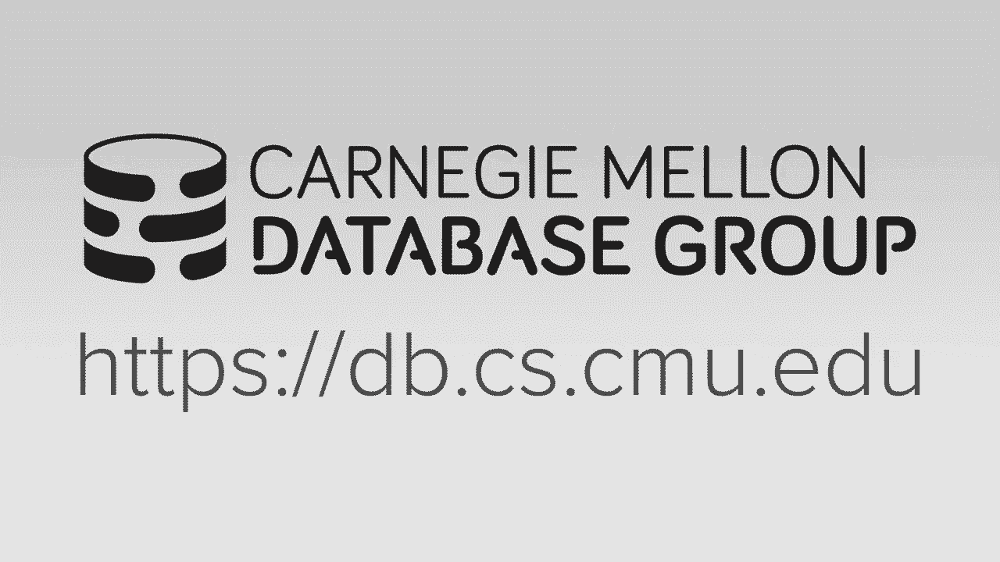
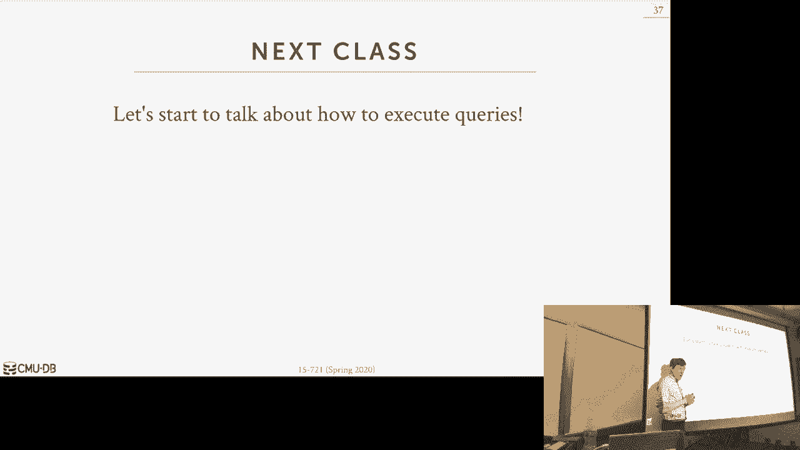

# 【双语字幕+资料下载】CMU 15-721 ｜ 数据库系统进阶(2020·完整版) - P11：L11- 网络 - ShowMeAI - BV1wv411w7Ko

[Applause]，[Music]。

[Applause]，[Music]，we're starting all right today we're，starting with networking protocols so。

we're at the point in the semester where，I now want to do like a high-level。

overview of what we've talked about and，what we plan on talking about it's kind。

of difficult to show this at the very，beginning because the topics we talked。

about we're a bit scattered let's，Kearney tall with indexes it's it's some。

storage stuff but this is sort of，conceptual illustration of what the。

system that were sort of envisioning in，our mind that we're talking about。

discussing the various topics that how，to build what it looks like so this is。

our application they send a sequel query，this is gonna land in our networking。

layer and this what we're going to talk，about today then we hit the query。

optimizer or the planner so the reports，the sequel bind to the catalog objects。

do any rewriting we want to do and then，run it through our query optimizer to。

generate a physical plan then we're，gonna pass now this through a compiler。

which won't make sense now but we'll，talk about this in a few weeks basically。

we're gonna take of that physical plan，and convert it into machine code instead。

of actually interpreting it then we have，our execution engine where actually。

we'll execute the query in threads and，then we have a storage meander down。

below so this one we've already talked，about a bunch of stuff already this one。

we already talked a bunch of stuff，already so these are the sort of the。

parts we've already covered we've，covered how to do convergent role，indexes Gorge models and logging。

checkpoints so now again today we're，going back to the top and then going。

forward we'll sort of jump around and，start here and then work our way back up。

this part though like for opera，execution we'll cover this all basically。

throughout the rest of the semester like，we'll talk about how to do parallel or。

vectorize hash joins vectorize sorting，and the nvcc stuff sort of covers all of。

this like at least up to the planner，like in the back of your mind to think。

about oh I'm working on multi Verte on，multi version database what are the。

implications of that as I design my，system alright so this is sort of out。

for the rest of the semester and then at，the very end the last two lectures would。

be like the potpourri things we have a，learning method，to the stack okay so as I said today。

we're gonna talk about the networking，protocol and this is either the data。

coming into the database from the client，or how we send data out to our replicas。

for high availability but the paper how，do you guys read was all about ingesting。

Gator and taking queries in and getting，data out so let's talk about basically。

how you would write in your application，the different methods for accessing the。

database and running queries then we'll，talk about what the actual never wider。

protocol looks like that you're sending，back responses over the network。

then we'll briefly talk about the，different replication protocols that are。

out there what are the sort of setup you，can have and then we'll finish up with。

sort of a two different techniques to，bypass the operating system as much as。

possible called kernel bypass methods so，for all these consumer going over the TC。

IP stack and for simplicity we're just，assume we're going through the OS this。

is a way to work around that and then，we'll finish off briefly talking about，right。

so up until now all the demos that I've，given in class about you know using。

Postgres or interruption class we showed，my sequel we showed Oracle all of those。

were opening up the terminal over SSH，me typing in some queries hitting Enter。

and then getting back a text response so，in a real application that's not how it。

actually works because what I'm getting，back is showing the terminal is is like。

is text it's it's characters and so if I，was writing an application where I would。

go through the terminal like that I，basically have to now parse the text。

field extract out what the values I'm，looking for and convert them to the。

right type of my avocation and that，would be super slow and nobody would。

actually ever do that right so what，we're really gonna do in a real program。

is that we're gonna have a an API that a，programming interface that we can then。

write queries against on our database，and then what we're exposed to in our。

application is is binary values for the，most part if it's you for getting back。

JSON then not always but like in real，applications or if you really cut out。

performance then you want to get binary，dated back to application。

then you don't have to do any of that，conversion yourself in your application。

like oh I know I'm looking at an integer，but I have a string representation of，an end。

so all these the API is the way to get，best performances to go through certain。

standard programming interfaces so well，first talk about direct access these are。

going to be a papaya type api's or，libraries that each database vendor。

could provide and then we'll talk about，ways to actually now have a more generic。

or generalized access methods or api's，that potentially would not have the。

requires to rewrite our application to，use if we switch woman one day to this。

vendor to another we may have to change，the sequel query dialect but if we。

program against these things then this，will be standardized okay where was I。

started right again the idea of these，guys is that if I read my application。

using either ODBC or JDBC then if I'm，using my sequel today that I side to。

give IBM money and I'll switch to my，application over at db2 I don't have to。

rewrite any my application code because，these things are the API for that you。

would use for my sequel and and and db2，would be standardized on these things I。

can sequel my head change but like the，actual code itself won't change so the。

actually just go back real quickly this，one we're not gonna talk about too much。

there's nothing for there to say about，this other than like okay like everybody。

has their own thing and ideally should，not programming us these api's right you。

should always have either like a some，kind of one of these things in front of。

it so that so that you make your thing，more portable and some applications like。

if you know you're gonna be running on a，phone you're only gonna be you know。

executing a sequel light you could，program it that way but even then like。

Apple or Android or provide you with a，database wrapper or API that hides the。

fact that you actually using sequel Lite，all right so the first sort of。

standardized API for dat sesemann was，called ODBC and this wasn't actually。

it's it's not the first exit II that was，implemented like Sybase actually tried。

this back in the late 1980s where they，got together with some other database，vendors and some。

application programming frameworks and，they took this Sybase api stripped out。

all the side basis if ik logic in it and，tried to propose this as a standard API。

called DB library that ever can use for，whatever reason that never took off。

Microsoft then hooked up with this other，company called Simo technologies and。

then they proposed in the early 1990s，today，every major database vendor actually。

whether your relation or non-relational，is chances out there they're gonna have。

a toady BC library like MongoDB has won，even though Hmong enemy doesn't support。

sequel it's just you give them longer to，be you know queries and you write mommy。

to be queries in their syntax but it，still supports their API so the way it。

basically works is OTP they're gonna，follow what's called a device driver。

model and the idea is that in the on the，client side the ODBC driver is this is。

something that the vendor provides and，underneath the covers they'll have all。

the logic that you need to communicate，with the database server over the。

proprietary protocol look if I sent a，query request here this request is going。

to be specific to my database system and，then when I get back to result it's up。

to this driver now to then convert it，into the format that the ODBC API。

specifies alright so the parlance we're，going to use with this class is that I'm。

going to refer to this part here this is，the part that we care about this is the。

wire protocol and again every database，system is going to do something，different。

unless you're following what you know，copying with my Segel and Postgres tier。

which is very common but this is not，gonna have anything like this doesn't，that。

here are some Seco queries and here's a，result now the ODBC API does have。

additional things or it has certain，features that not every database system。

is going to be a little support but you，can essentially emulate that through on。

the client side in the driver so for，example if your database system doesn't。

support cursors so cursor is like if I，run a sequel query instead of getting。

back all the results on once I can get a，handle a cursor handle to that result。

like an iterator and I'm called get next，get next get next and that'll send a。

message over the network to get back the，next query you would do this it's like。

if your if your result is huge and you，don't want to ship everything all at，once。

so not every database systems supports，cursors so you can fake that through DC。

library so you can still call through to，be seen your application and hey give me。

a cursor underneath the covers they'll，send the sequel query to get back all。

the results but then expose to you like，the iterator API to walk through the。

cursor that's sort of nice that you，could you can hide all that complexity。

if you don't support everything you need，for ODBC in the driver itself all right。

so the other important thing to，understand too is that the the ODBC。

standard specifies what the you know a，fixed specifies what the data types are。

that you're gonna get when you say like，give me an integer from this you know。

from this from this result set and so，it's up for the driver to make sure that。

whatever the the ODBC driver API，specifies as a data type that it has to。

give that to you in your application so，that way you don't have an unexpected。

result and it makes it more portable so，for example if we store every integer as。

64 bits for whatever reason and then the，ODBC API says give me a 32-bit integer。

when I get back to 64 energy from the，server again that to convert that to 32。

bits because that's what the API，specifies，so again that's all trying to hide the。

the specifics or the nuances of every，single database system right bite。

all right so the other more common one，too is JDBC and the way to think about。

this is like ODBC it's not specific to，Windows anymore but it sort of came out。

of the environment and so that's sort of，designed for C or C++ applications JDBC。

is designed for Java based applications，for applications that are designed to。

run on the JVM so this was developed by，sun in 1997 when a few years after they。

released the the Java Runtime in the，java language and again the idea was。

that they recognized that they wanted，java applications to run in the。

enterprise those things enterprise，applications need to talk to relational。

databases or sequel databases so you，JDBC was their attempt to standardize an。

API for this and again like I said like，you think it'll be C is for C and JDBC。

is obviously for Java and so we，to be slightly different though in in。

JDBC is that because they're running the，Java Runtime they're not always going to。

have a driver written in Java it's more，common now but back in the day not so。

much right for for ODBC yes if you，released your driver，if you driver it spot it's going to be。

in C right and that would be universal，not so sort of as a way to bridge people。

to be able to use JDBC before there were，enough drivers written in Java then they。

have a bunch of different levels or，connectivity methods you can use to。

communicate with the database system so，the first one is exactly as I was saying。

so instead of having the the JDBC driver，communicate directly with the database。

system you have a little bridge，middleware sitting in front of it that。

converts JDBC commands into ODBC，commands and then ODBC then communicates。

to the database system over its，proprietary wire protocol so this is。

actually not supported anymore as of，like I think JDK 1。8 but and this is。

actually was a pain in the ass to set up，I had to do this four times ten when we。

do some testing here it's a nightmare，it was really finicky but like again。

this was a stopgap solution in case GBC，didn't have exactly what you wanted for。

your particular database system the next，approach is to have the JDBC calls just。

invoke the proprietary native API of the，database system right again so sequel。

Lite would be the best way to think，about this because Seco lights in a。

better database system so it's gonna be，running inside your same process as your。

application so you could have the JDBC，driver invoke through J and I to the C。

commands to execute queries or open up，cursors or tables on the database system。

but I don't think this would work if，you're going over the network this is。

only for the bit embedded embedded，databases running on in the same process。

the next approach is to have a the JDBC，driver communicate with some other。

middleware system that then knows how to，then speak the wire protocol of the of。

the database system so it's sort of like，the first one but the idea here is that。

the the commands coming out of the of，JDBC are shouldn't generic，for JDBC but then when they land on。

those middleware that the dated，assistant would have to provide it then。

know how to convert and convert that，into the wire protocol that you expected。

right whereas this thing is is sort of，the JDBC is invoking ODBC commands the。

last one which I my opinion is the best，one is where the database so that the。

the JDBC implementation itself can，invoke or send the packets that you need。

for the wire protocol or the database，system so this is not wasn't that common。

so much in the early days but it's more，common now like you can download a。

Postgres implementation or Postgres JDBC，driver purely written in Java and you。

don't need to worry about any of the the，C stuff and this will run the fastest。

cuz again you just go natively in Java，over the network to get the packets and。

get everything back right so this one，this one I think not actually this one。

you sort of see in in other languages，like if you want to have like if you。

have some obscure programming like rust，or go aren't secure or obscure but like。

in the early days there weren't a lot of，drivers written for for different。

databases and go and rust and whatever，language you want to use so you a。

stopgap solution would be this thing，would wrap around like ODBC you would。

have a go wrapper around the ODBC driver，which is written in C and but that means。

again you have to then go out of the，could go runtime into the C program to。

send these commands whereas if you have，a native go implementation yeah that's。

me way faster because it's less copying，a packets or less copy my buffers so。

this this was always gonna be better way，to do this so as I said all of the。

database systems are going to implement，their own proprietary wire protocol and。

these are as far as I know I don't know，of any other system that doesn't do this。

everything is going to go over tcp/ip I，don't know of any database system that。

goes over UDP and we tough to do if you，want to support transactions because you。

don't know whether your packers are，actually gonna show up and you need to。

send back aknowledge mints so for that，reason everyone's going over tcp/ip now。

above that they could have additional，confirmation messages in back。

but you know to say look did you get，this packet yes I got this packet like。

at the application level but of course，TCP is gonna do that for you on the。

covers as well so the typically way the，way the clients gonna interact with our。

database server is that they're going to，connect to the database system they'll。

go through some kind of authentication，process like username passwords Kerberos。

can use things like that if most systems，also now support SSL by default so you。

go through that process to encrypt the，the the channel then you send over a。

query the database has executed that，query sterilizes the results it sends。

that back over the wire protocol to the，client and the client can then hand that。

off to to the application code so what，we're gonna focus on today and the paper。

you had you guys read was focusing on，this problem here how do you actually。

sterilize the data and get out of it，because this is actually where the。

opportunity for optimization is actually，available or there are things that we。

can improve right there's not much we，can do for this there's not much there's。

not really much optimization we can do，for this because most sequel queries are。

gonna be short rather there's strings we，send over you can then maybe say I run。

these as prepared statements or stored，procedures but that's just really。

reducing the size of the message most，queries aren't that big there's some。

applications I've seen or heard from，people in the wild where like the sequel。

query could be like 10 megabytes you see，this like big big corporations where。

they have like this eaten internal，dashboards to do like reporting and you。

click a bunch of options to like you，know just get all the people from a zip。

code or some you know some geographical，region and then you you sort of you。

click all the options you want for the，query you click go and then that。

converts whatever you clicked on the，dashboard into a sequel query and。

sometimes you can have these really long，in clauses like where zip code in and。

then you know list of every single zip，code and in that case the sequel where。

it can get really big but the only，optimization you really can do for that。

it's just you compress it with like，snappy or gzip whatever you want to use。

all right so there's not really any，techniques we can do in a database。

system to make this go faster so we're，gonna be focus on this one here right so。

I say all major Davis systems implement，their own proprietary waterfall protocol。

that's not entirely true question good，question so the question is are there。

are there any database systems where the，client can actually be somewhat。

intelligent and maybe I mean do，compression maybe do some query。

rewriting before it sends it to you I，was also gonna think you know she made。

not really for a couple reasons，the so the example you gave is like can。

I do query rewriting I don't know if，anybody does that in the client driver。

because like convert you know one equals，want you know two equals one plus one。

can I convert that just to be true，because you basically would need to。

implement that logic to parse the sequel，statement understand the semantics of。

what the where clause is actually doing，on the client side then now you also。

need to if you're supporting a bunch of，different programming languages and。

you're using having a native drivers for，those things now you got to rewrite all。

that in every single language for that，reason nobody I don't think anybody does。

that I there is there was a system，called foundation DB which is a。

distributed key-value store that Apple，bought it is now open-source snowflake。

uses it internal for the metadata but，they only use it as a key value store。

when put for pound eight before Apple，bought foundation BB BB what they would。

do is they added a sequel glare and all，that would do was in the client they。

would convert your sequel statement into，individual get get queries get command。

to is send for the key value store so，that's one that's the only tip I can。

think of offhand they do this kind of，stuff other things like caching query。

results well if you don't know what's in，the database server on the client side。

how do you know that like you have the，latest version so you so for this routes。

and everyone always goes always go to，this，we haven't pursued it yet but like I。

there was some research done up in，Waterloo where like you could provide。

hints about like hey I'm sending you，this query but oh by the way I'm gonna。

actually these other queries pretty soon，as well but I don't think any that makes。

it any commercialism the client drivers，are usually pretty brain-dead there's。

like give me this query here's a result，then what's a like a me to use an。

existing protocol what do you mean like，like I want like tcp/ip so I think we're。

you saying are you when you say existing，protocols do you mean it like at the。

lower level in the stack like at tcp/ip，level or do you mean like at the。

application level right so - what with，an existing protocol that's tcpip but。

that's that's a layer below we're above，and we're in the data server so 221 of。

those existing protocols so some eight，my question is what's an existing one。

it's a leading question because it's the，next slide okay so right so as I was。

saying like all the major database，vendors like Postgres the my sequel the。

other big three Oracle db2 sequel server，pretty much everyone implements their。

own wire protocol from scratch but where，I thought you were gonna go is that most。

of the newer systems however don't do，this and they need to be implemented in。

an existing one in particular Postgres，on my sequel right and the benefit of。

doing this is that and we do the same，thing in our system of building here is。

that now I don't have to worry about，supporting a bunch of different。

programming languages for my drivers，right for JDBC and ODBC，I guess if I speak the post s wire。

protocol then anybody that comes along，with a you know the the Postgres driver。

in rust they can just use that first，ghost driver and communicate in my。

database system now these aren't going，to be the best protocols and we can talk。

offline to the troubles we've been，having with the Postgres one but if you。

think about it if your database startup，or your like your your research project。

like AWS do you want to be spending your，time on writing client drivers for every。

single programming language in order，people to user your database or can use。

piggyback of what's already been done，and a large ecosystem and happy will。

just you know use what's already there，so that's why this is actually very very。

common so but I will say though，sometimes you'll see in the，documentation that oh we are Postgres。

compatible you see in this application，of these different database systems or。

Postgres compatible or my sequel，compatible but just because they speak。

the wire protocol it doesn't mean，actually truly compatible but they're。

not always gonna be an exact drop-in，replacement because there's a bunch of。

other stuff that are specific to that，you know Postgres of my sequel that you。

may not actually be emulating in your，server or in your new system and。

therefore it's not going to work you，know your application code using GBC。

ODBC may start sending sequel queries in，a dialect that your server doesn't。

support and it's not gonna work，right so this will get you that sort of。

it by following their protocol you'll，get the transport to go from the client。

to the server correct but then this，query shows up and now what do you do。

right it's not going exactly the same，other times - they'll be queries that。

like if you don't support the same，catalog structure as post customize。

sequel a lot of these like visualization，tools the first thing you do when they。

turn them on is that go look in the，catalog sit and figure out what tables。

you have what Commons you have but you，don't speak that if you're not formatted。

the same way that post goes my sequel，are then that's going to break then。

there's other things too were like the，tools may go at the the database server。

in sort of a physical level like looking，at files on disk look there's a lot of。

extensions and tools or Postgres that，can manipulate the actual files of the。

database without actually having to go，through the the database system itself。

no no that's going to work because，underneath the coverage your system is。

going to be completely different，yes the drivers especially this just。

like write a string of sequel into some，function that magically like writes that。

over a network into like I saw it and，then like get some result back in some。

form in so this question is what are，these drivers actually look like is it。

at the bare bones are they just like，here's a sequel string you say go run。

this for me and then that goes it gets，converted into the the packets to send。

to the Davis system you get a result and，you get back data on some binary form in。

the most simplest form yes but he start，doing like prepared statements or。

cursors like you can specify like here's，the query template I want to use and。

then the first values in second that is，a double like there's the API is。

actually kind of big and all that won't，be you know passing everything just。

through a sequel string there are ways，to construct queries programmatically。

through the API that isn't just hey，here's the sequel string and then the。

again the API specifies says you know，when you get back a result and you call。

next row the you know when you say you，know for this current row give me the。

the third tuple or give me the third，field as an integer it needs to know。

that I'm gonna get back a third you，Pittenger not some other thing that your。

your your davis administering internally，so like sequel light stores everything。

that's varchars to meet the covers and，it's only when it gets exposed outside。

the database system then it gets，converted to the correct binary form so。

the driver have to handle that yes front，row yes sequel or sequel server sure all。

right so that's that's the，what does the different client-side。

caching and server-side caching question，is is I made a comment about the。

client-side caching versus server-side，caching server side query result caching。

would be I I sent a sequel query it does，some some complex calculation I send。

back the result to the client but then I，also remember that I actually that VAT。

sequel query with the result，so now someone comes along execute the。

same sequel query I don't have to，recompute it I just get back the same。

result so an alternative could be that，the client could do this so the client。

says I exited the same sequel query you，know a few seconds ago here's a result。

just reuse that the pom is if you if you，care about having the data be fresh and。

up-to-date on the client-side I don't，know if somebody else came in and。

modified the tables and therefore，invalidated my cache result so you'd。

have to think about how do you actually，implement this you could then say like。

the client could go to the database，server say hey has the state of this of。

this has this cache result been，invalidated yes or no，then if yes then you react security if。

no then you just reuse what you've done，I don't think anybody actually does that。

though because it's sort of 1x turn it，round trip oh it's a huge quarter can。

make a difference absolutely if my query，takes an albacore run and I can cache it。

fantastic right so we're not gonna talk，about it this semester it's also another。

area that I fully understand myself you，can kind of get this on the database。

service side so queries alt caching，isn't always good because it's like core。

spring it's like you have their cache，result for the entire sequel query so。

like if I say you know if the giant，select query has has a predicate or say。

where name equals Andy my cache that，then your query shows up with your name。

I can't reuse any things that I computed，even though maybe one piece has change。

so a very common thing to do is what's，called materialized views where you can。

actually materialize pieces of that，query and so like maybe you Prima。

sterilize some expensive join and then，the predicate this comes in and is how。

to do a filter on that materialized，query and the high-end servers like。

sequel server in particular can know how，to like reuse materialized views across。

different queries right but again for，your table you would need an explicit。

cache invalidation message and I don't，alright so yeah so a question is why。

would I ever want to have a cursor where，I return one tuple at a time versus like。

descending everything all the ones so I，think cursors I think I don't know the。

exact details like I think they vary per，system they don't mean it's not just one。

quick it'll be one be one packet one，message to get one result they sent a。

batch with the question is do I send you，know five million results I sent all 1。

correct same is if your davis ism，doesn't support support cursors you have。

to send one my results yes and then，think about like think about like think。

about what a database server would look，like versus what an application server。

would look like a database server is，usually going to be running on high-end。

software now distributed database the，world is different but like fingers like。

you know a big heavy expensive machine，it's kind of a lot of memory fastest the。

application servers can be these you，know off-brand ec2 instances they're not。

gonna have as much memory so maybe I，don't want to blast it with all 1。

million tuples that's sort of a thinking，of it right I don't know I I don't know。

what difference it I actually don't know，what difference how different it is to。

do two different things right cuz also，to like you could imagine the the way。

you implement cursors could be different，query，I now buffer the result and you call get。

next on the cursor I'm miss feeding，through that or I could have it be set。

up where I have a pipeline breaker where，I say here's the final result of a query。

and called get next get next inside the，execution engine get a bunch of tuples。

but one time you've reached my cursor，limit then I hand that back to the。

client because maybe they're not gonna，come back and ask for more if they do。

come ask for more then I'll just now s，cute the rest of the query could stage，it that way。

I think everyone buffers it and then，gives you a handle to the cursor of the。

buffer but you could implement it the，other way I think that's how it was。

originally envisioned back but this like，the 1980s in the pipeline not the。

pipeline model but like the the volcano，model wait is the pipeline it's about。

you volcano iterator pipeline model yes，same thing okay so this is just a table。

showing what you know what other systems，are actually using the Mexico's wire。

protocol I thought they're actually more，system using hive but the only one I。

could find that speaks the high wire，protocol is spark so my sequel is very。

common a bunch of these though are，hacked up versions of my sequel like mem。

sequel in the very beginning actually，wasn't a it was not a full-fledged。

database system it was a storage engine，like in ODB or rocks DB that sat。

underneath my sequel so they got to my，sequel you know compatibility and wire。

protocol for free eventually with all，that out and they wrote everything。

themselves because they otherwise you'd，violate the GPL and their proprietary。

but so they basically speak the my，sequel protocol now so they are my。

secret peddled cluster is based on my，sequel but it had sort of a layer above。

that that was distributed so there's a，there's a framework called my sequel。

proxy that gives you like a gives you，like a middleware front-end。

implementation of the my sequel wire，protocol and a bunch of these other ones。

are sort of again speaking the wire，different，I'll talk about in a second here's a。

bunch of these ones that are basement，Postgres so a couple of these are。

written from scratch like hyper copy HDD，our old system Umbra these are systems。

where like we look the specification of，the purpose wire protocol and read。

implemented it just in our system things，like redshift greenplum Vertica。

and I think maybe you could bite these，are they the original code they started。

with Postgres and they ripped out the，parts they didn't want and then rewrote。

it for to do whatever they wanted to do，so they kept that front end piece of。

code the networking layer for for，Postgres so the reason why Aurora is。

different is because because Amazon，controls the whole stack of like if。

you're running in in in in their cloud，center they collude to control the。

networking layer excuse you layer and，the storage layer so what they do is。

actually super interesting at least from，my sequel I don't know if they do this。

for Postgres they actually take out some，of the networking logic for the wire。

protocol for my sequel and shove it up，into the Amazon like load balancing。

networking layer right so now when you，hit like when your application speaks to。

your database instance and running an，Aurora you may not actually be hitting。

up the actual Aurora system itself，you're running up and there's networking。

there's never a cool there's never pink，layer up above that doesn't load。

balancing for you which is really，fascinating and what they can do is they。

can switch over sort of transparently，from one instance to another like if say。

I'm running on a small machine I'm gonna，upgrade Amazon to a my Aurora instance。

or a bigger machine in the networking，layer because it's now decoupled from。

the actual database server they can copy，over your session variables from from。

you know form all your clients from one，server to the other then it's had the。

networking layer switch over to the the，new instance and it looks like you。

magically just got more more more you，know more RAM more CPUs without actually。

you know closing any of your connections，so that's crazy，I think only Amazon can do that because。

it's Amazon right so we take this，offline implementing this has been a。

huge pain taxes been awful you talk to，Matt about it this is our third attempt。

trying to read them the post goes wire，protocol and it's it's really ugly。

because they have two different modes，which is a mess okay all right so let's。

talk about the paper you guys read today，for this class so as I said the where we。

can have opportunity to get better，performance in it and improve the wire。

protocol is when we serialize the data，back to the，client right we can ignore the cursor。

stuffed assume that they ran a query and，they want to they want a bunch of。

results and the papery how do you guys，read came from the same authors that are。

building dub DB or bridge of people are，also working on Monet DB at a CWI and。

what they were focused on was doing，these large data exports so not so much，up。

you know aggregated results but I have，my Python or data science application。

running some results and I have all my，database my data in my sequel database。

how quickly can I get that data out and，put it into my machine learning pipeline。

so a lot of things were talked about，today look like all the stores stuff we。

talked about before right how to do，compression how to do the row versus。

calm stuff because that's essentially，what it is right we have some giant。

chunk and data what's the optimal way，that we should organize it to send it。

over the wire and it's basically the，same thing we want to store a bunch of。

data on disk or in memory what's the，optimal way to do that right so the。

other thing I'll say to you also is that，everything we're to talk about here。

whatever however we organize the data on，the server side and then send it over to。

the client the client has to be able to，interpret that and reverse it so that's。

gonna somewhat limit what we can，actually do because we don't want to。

burden the client with actually doing a，ton of work now again they're focusing。

on doing these bulk exports of the data，but a lot of times the same client。

driver you would use in other systems，like the same client driver you would。

use for your Android application would，be the same client driver you would use。

for whatever your applications are，running on a you know giant xeon box so。

now no one's downloading a terabyte of，data to their cell phone that's stupid。

right but like it just means that we，need a little support whatever the。

optimizations we have apply here for the，data we have to ever be able to reverse。

them and to interpret them so that that，means that we can't be too heavy weight。

and because we don't want have to，duplicate that that that logic in a。

bunch of locations right like again if i，want to support all the different。

programming languages and i have native，drivers for each of these program。

languages whatever i need to do to，decompress data in one language I got to。

do for another one right so sort of like，the lowest common denominator which。

which is somewhat limiting but it is，what it is all right so the first thing。

is going to be talked about is the row，versus column so the odbc jdbc are。

inherently row oriented api's we we're，gonna the servers are always gonna。

package up the tuples and results one，tuple at a time and sort of package that。

as a single message that sends it gets，sent over the network，now with these stream a bunch of。

messages all at once but the way these，these the servers are mostly written is。

that it assumes that I'm gonna iterate，on the server side over one tuple at a。

time I'll construct a message that says，here's what's actually in this tuple and。

I put as many of those messages up I，guess I can to my packet ship that over。

and then the client has to reverse that，so back in the 1990s when they first。

started building to be seen JDBC this，made sense because it was you you were。

either running all three applications，where the result sets are small like go。

get Andes account record go get all the，orders that Annie bought from Amazon。

that that's not a lot of data and it's，not not a lot of tuples if you're doing。

analytics oftentimes would just be you，know computing the the the sales totals。

of you know on a quarterly basis and，then you do something aggregations on。

that so like the query the query is a，bit more complex and a little to be。

decided but the amount of the end you're，getting back is not it's not a lot but。

again as I said the duck TB guys are，focused on exposing the database。

contents to these modern machine，learning software and in this world we。

want things as as columns or matrices so，this row oriented approach is is as。

limiting so what they propose to do is，that instead of sending over in a row or。

engine format we could actually send it，over as vectors and in particular the。

way they're gonna do this is they're，gonna organize a bunch of tuples。

together and within a block and then it，within that block they'll be organized。

as columns so it's not like I'm gonna，stream over one column at a time in a。

bunch of messages and then when I'm done，with that column switch over to the next。

next column and do that they're gonna，say here's a bunch of tuples convert it，as a as a。

I'm store within that block and then，ship that block over and then for the。

next batch of tuples on the server side，you do the same thing so we didn't talk。

about this exactly when we we talk about，stores layouts but this is called the，packs model。

I was actually invented not here at CMU，but by a professor who used to be here。

at CMU and now she's at EPFL and this is，actually what we do in our day to be。

system now we organize our data as one，megabyte blocks and then within that。

block we have all the attributes or，fields for a single tuple but each of。

those fields will be organized as a，column store because we follow what we。

follow the arrow does and this is used，in park' agent or yes the question is is。

is sorry is is this approach to，effective or ODBC so again he doesn't。

know about any of us he doesn't know，that I got a batch of two blows back and。

their own as as columns it just because，they now the programming interface is。

that is definitely row oriented right I，get a cursor a call get next and then I。

do whatever need to do on that on that，single column or that single tuple I。

can't tell it would we see gave me the，vector of a to give me the vector of。

column vector of values for a single，column across all tuples so I think what。

the proposing here is that you could，you'd have to rewrite or have your own。

API at the application server level，application side API to support getting。

these vectors I actually don't know，whether I don't know whether it would be。

C as a way to say give me my results，that and just dump it out all at once I。

all the code I've written using G a B C，or D C has always been like you know a。

while can't get next okay so the benefit，we're gonna get from this is that if we。

have everything as as a column store，then we apply all the techniques that we。

talked about last week of compressing，our data because we know all the values。

are going to be within the same domain，and we're gonna get a better compression。

ratio so it's the same thing that we，talked about before right we can do the。

naive compression approach where we just，take take，our bites that we have in our block that。

we're sending over and we just run gzip，on it or snappy send that over to the。

why the wire and the climb didn't just，just calls the same you know using the。

same correction algorithm to decompress，it the other approach to do the column。

not specific encoding like our le or the，dictionary encoding or the Delta。

encoding as far as I know no system，actually does this this does show up in。

in some systems like my secret weapon，use gzip of all things took a press data。

so as they talked about in the paper，this is obviously you're gonna get a。

better compression ratio if you have the，more data you have and what's also nice。

about too for larger blocks this is，actually gonna work even better。

and they say that this is the better way，to do this because the the approach is。

agnostic to what the actual data is so，there's no logic on the client server。

side to say oh I'm looking at this，column and it's dealt on coding so I。

need to now basically replay the Delta，to give me back the original values if。

I'm just using snappy I just take my，byte stream or byte array and just run。

it through that and I get everything out，but I want the other thing they tell us。

to talk about in the paper is that if，the network is slow then a more。

heavyweight algorithm like gzip will be，preferable over something like snappy。

because you're paying you know you're，paying a higher CPU overhead cost to get。

to get a better compression ratio and，that's usually going to be a good。

trade-off again this what is it sound，like it sounds like a disc right it's。

which it is it's essentially a slow，piece of hardware that we need to get。

data through like a straw from one side，to the other so again if we know it's。

gonna be slow we're gonna have low，bandwidth then we want to do as much。

work we can on the on the on the the，ingestion and reading of the data to。

minimize that overhead so for this，reason they claimed that this is better。

and like I said nobody I don't know of，any system that does this now we get in。

the question of how we're actually going，to represent the data or how are you。

going to serialize it so the first，approach is to do binary encoding where。

again it's just like as we talked about，when we took like alignment and and。

layout we would represent the data in，its binary form and that's typically。

native to whatever like C or super ball，so what the hard it gives us if we're。

following the the I Triple E 754，standard so what will happen is the。

client-side I'll be responsible for，handing any ns because the server。

doesn't know what you actually want so，the server will send it out in you know。

in one in DNS and the client says oh，well I was told I you know the servers。

running x86 and therefore he gave me，little endian but at mine running on my。

cell phone I need big-endian to the，clients responsible for reversing that。

but that's not too expensive，other than this happen having to copy。

data the other thing that's be important，too is that if we can have whatever the。

format is that the data system uses to，store data right in the actual columns。

itself where the rows themselves if our，wire protocol can match this what we're。

actually storing then it's gonna be，super cheap or have low overhead for us。

to go take data out from a result of a，query and then put that into a packet so。

send that over the wire so what I mean，that if using my our old system as an。

example and our old system we built our，execution engine and Storage Manager。

separately and then we sort of grafted，it onto Postgres and then when we。

actually want to go put the the results，of queries into a packet and send it。

over the process wire protocol how it，represented strings was different than。

how we represented strings so we would，then have to convert it right and。

basically it means copying the data you，know into our original format and copied。

it into into and converted to post，business format so that extra copying。

starts to add up because if you're doing，this for every single query and every。

single tuple and every and every single，result then that you're spending all。

your time to do in copying and，serializing deserializing，sucks right I mean with peloton we had。

another mistake like we had like three，copies of updated just to get over the。

wire protocol two of them you needed one，of them was was was was superfluous but。

it probably reason why we killed that，system the other thing you can do too is。

instead of implementing your own you，know binary format for sending over the。

messages that you represent in getting，messages you actually can rely on these。

serial serialization open source，stabilization formats that are out there。

two most famous ones are Google's，protocol buffers or Facebook thrift。

right think about this as you define in，a DSL what a packet looks like what the。

types are and so forth and then they，have a way to then to compile and。

generate you code that you can then use，to build struck sand fill out these。

these buffers and then they'll sterilize，it for you so that you can send over the。

network I don't know of any system that，actually does uses protocol buffers or。

flatbuffers is the new version of，protocol buffers I think it's zero。

copying so it's faster heíd uses thrift，thrift brings you a bunch of other stuff。

like RPC you know and like other，networking communication protocol stuff。

which is more than maybe you actually，want but faith hive is the only one that。

know that uses this so I would not，recommend these things because these are。

actually gonna be a bit verbose right，like they would have to record all this。

extra metadata to tell you what the type，actually of the data actually storing in。

our networking protocol if we if we if，we do it ourselves，maybe just in the header of the packets。

we send over to say hey we're about to，send you a bunch of tuples that have。

these types here they are rather than，these things I think they have to they。

make multiple copies of that metadata，right for every single message so for。

this reason I I don't recommend that，this you want to you want to roll your。

own all right the image so in addition，your the metadata about what my types。

are we got to keep track of like how do，we actually represent nulls the sizes。

are our data right all that gets gets，expensive and some systems do it better。

than others the alternate is that the，server just sends over all your data as。

plain text right and so the advantage of，this is that you don't have to worry。

about in these Indian Asst it's up to，now the clients responsibility to figure。

out how to actually interpret what what，it is it you're actually looking at。

right so yeah think of it this way so，say I have my server side I my my query。

result has one was as one two boy has，one attribute the number of one two。

three four five six so there's a 32-bit，integer I can represent in four bytes so。

if I send this over in binary form，just say hey I have a four byte integer。

on alternative could be I could convert，one two three four five six into the。

string of characters one two three four，five six and send that over now in that。

case assuming I'm asking in coded I need，one byte for every single character I。

have six numbers so I need six bytes for，those but then depending on how I'm。

representing either the length or say，help you know how long the thing。

actually is I would need an extra byte，potentially to say here's a null。

terminator or here's the length of the，string and then now on the client side。

is called a 2 I if you're using C to，convert this string into the correct。

form that we can then hand off to ODBC，or JDBC so this seems kind of crazy why。

would actually one ever want to do this，you see it as in systems that support。

essentially JSON types or JSON result，sets as like the output of a query Monay。

DB we're seeing a second actually，supports this as well I forget why I。

think it's just for historical reasons，they did this but as we'll see in the。

results you know storing in the binary，format is the better way to do this。

always okay all right all right the last，time you got talked about is how we。

actually handle strings and I sort of，mentioned this just now so the three。

approaches again the same thing but，actually we want to do in our database。

system do we just do the standard C way，and have a null byte at the end of the。

string to denote the end of the string，so now if I'm parsing the packet that。

I'm getting over the network，as soon as I see this is no Terminator。

character I know that that this is the，end of the string and then the manage of。

this is I use all my clients I can use，all the sturby standard C API。

strings string functions because they，know how to operate on strings with，we do this。

natively in our database system where we，just add the length of the string to the。

beginning of the pipes of the string so，we know the client knows how far needs。

to jump ahead to find everything you，need the last one would be like a char。

field instead of a varchar' where you，just use you have a fixed size the bytes。

that you use just represent every every，string for every tuple well for every，size。

and then you just Pat out whatever the，value is for each individual to pool to。

fill out the rest of the the rest of，that size the rest of that that that。

allocated space so this seems kind of，also wasteful as well but like if most。

of my strings are say you know assessed，by my chart field to be 16 16 characters。

and most my strings are eight characters，or nine characters I'm a bunch of zeros。

and if I'm using gzip or snappy that's a，good opportunity for get good。

compression because you can see repeated，byte sequences over and over again I。

think though in the in the paper they，discussed that this only really makes。

sense think it's the best performance if，like all your streams are like one。

character right and then the paper also，talks about how sometimes this is faster。

or sometimes this is faster right it，just depends on what your strengths look。

like and as far as they know no system，is actually gonna implement both you。

just pick one and stick with it，because it'd be too much engineering。

overhead both on the server side and the，client side to have missed support both。

of these right the other thing to point，point out too as well is that the。

performance are gonna get depending on，how you represent strings is not going。

to be it's not in a you know independent，of just what the approach you're using。

if I'm doing compression then sometimes，this would be really good and the other。

ones could be bad so again there's a，multiplicative effect of based on how。

we're designing all and what compression，scheme we're going to use and what the。

put the we're doing Road services，counselor all these things combined will。

you know affect what the performance is，gonna be all right so let's just show。

two quick quick graphs so they did two，experiments on the paper the first one。

is we're gonna go measure the time it，takes to send one tuple and time it。

takes to send a million tuples and so，they're gonna compare against my sequel。

both width without gzip and enabled own，a DVD Oracle MongoDB db2 and hive so。

again although MongoDB doesn't support，sequel，they still support an OTP ODBC driver so。

this works so what you see is going，across is that hive is actually can do。

the worst here followed by db2 but then，these other ones here are roughly all，about the same。

what's in the，though is that Moni to be is the only，one of these ones doing text encoding。

where everything else is doing binary，encoding and it still outperforms the。

other ones that doing binary encoding，has a case of of dB - I don't know why。

this is slow we'll see in the next slide，it's more pronounced but at least his。

oracle and db2 they have their own，confirmation message that the client。

sends to the server and say hey i got，what you just sent me send me more and。

think that's sort of redundant over top，of TCP tcp but you know maybes from a。

day where you in one of that kind of，extra extra security right extra safe。

teenis and then hive I said just sending，way more data so for this one again。

this is only one tuple at a time so the，way to avoid all the overhead of like。

parsing the sequel statement and and，running him the optimizer and running。

the query they're gonna run the query，multiple times and then had the。

babysittin cache at least the query plan，not that was all belief the query plan。

so this is just saying what's the，overhead of constructing the packet that。

we sent over the wire protocol in the，next experiment they're gonna then send。

back a million tuples and so the first，two results to point out though is with。

my sequel so this is my so this is when，the the along the x-axis we're gonna。

vary the latency of these Network，messages so when your network is really。

fast up into this point here the regular，my sequel protocol without any。

compression is is gonna be better but，once obviously the network gets slower。

then you know doing that extra CPU work，to compress the data actually pays off。

in this case here my secret with，compression it always gets the same。

performance because the dominant cost，here is it's calling gzip for all the。

other ones in the the curves look all，about the same right obviously when。

they're faster when the network is，faster they do better but it hasn't。

network gets slower they do worse which，engine you point out though over here is。

that Oracle is is the second fastest one，after my sequel here when the network is。

fast but then up here it actually ends，up being one of the slowest ones I don't。

remember what the paper said that why，this was the case I mean db2 here is an。

order magnitude off of like propose，graphs right the db2 is like doing like，five。

is that 500 up there and Oracle or so，postcards right below it is around 1050。

seconds so that's just an example of，like how that confirmation message that。

they're sending over is super，inefficient with a network of slow they。

can't send the next batch of tuples to，the client until you get that second。

round trip and say hey send me warm，sorry this like this one here why is。

this faster than this because I'm，standing back a million two bullets and。

I'm gonna think exact size of that but，like when the networks really fast I。

don't want to pay the penalty to，compress it I just want to shove it over。

the wire as fast as possible and this，one here the dominant cost is the CPU。

overhead of compressing and，decompressing so that's why again it's。

basically flatline so no matter how slow，they never get gets the benefit you're。

getting from sending less data over a，slower Network is negated by the。

computational cost miss now they could，have used snappy and that might that。

might change the curves a bit but it，basically this is basically saying and。

why I highlighted this one first is that，when the network is fast you don't want。

to do any compression these ones shove，data out fast as possible but as they。

never get slower you do want to do this，soon a say alright well in what case。

would the network get be the hunter，milliseconds well if I'm running in。

different data centers the application，servers running one data center the data。

servers running another one then you，know I can get up to hundred millisecond。

your statement is should they be，shouldn't they be varying the bandwidth。

and not the latency because I'm gonna，related it to each other but I think。

like the like in the case of like db2，like sending those confirmation messages。

that's not a bandwidth issue that's a，week yeah you statement is that let's。

take this offline but good cuz I don't，know exactly like I remember the exact。

setup was in terms of like I think the，the client has to get the result and。

immediately throw it away but in this，case here the client so that the cost of。

decompressing on the client side is，being measured in this as well。

so I think that's why the leave the you，can't hide it I think that's why the。

latency matters wait a min bandwidth but，that one offline okay we have 20 minutes。

um I'm actually gonna skip replication，protocols I think we covered this in the。

we basically covered this in the intro，class already the only got to say too is。

like that the sort of relating to what，we talked about last class with like。

logging and recovery sometimes you do，logical logging sometimes you do。

physical logging right and that's an，internal protocol that the data system。

uses that's can be separate than the，client protocol you would use to。

communicate with it to be seen a JDBC，and some of the optimizations you can do。

again for doing compression and other，things or how you batch up the the log。

records depends on what the consistency，guarantees you want for your your your。

your systems so that one will，there's not much more to say other than。

other than that but when you tell me，that offline if you want as well all。

right so just to finish up real quick，because this is something I think I do。

won't expose you guys to um，the in the experiments with with with。

from the the duck TV guys paper like as，it was showing like their merit their。

varying the network latency but that's，not the only bottleneck you're gonna。

have their network layer itself is not，the only bottom like you're gonna have。

in your in your app and your database，server to communicate with the client。

oftentimes the the OS is gonna cause，problems especially if you're doing oak。

tree applications where you're sending a，lot of small packets instead of you know。

giant giant buffers of things the reason，why it could be expensive is because。

communicating with the OS is always，gonna be a nightmare for us as the data。

system right it's our frenemy we need it，to survive but it always gets in our way。

so if we were gonna lie on the OS TCP，excuse me tcp/ip stack then we have to。

have context switches handle through，inner area through interrupts in order。

to get you know to be notified that we，have now a packet that we want to get。

copying data out from our buffers and，the database server down into the tcp/ip。

buffers that we send into the kernel，that's to me expensive and of course the。

OS is gonna maintain its own latches to，protect its internal data structures and。

those are gonna get in our way if we，have a lot of threads trying to write to。

date at the same time so one way to，avoid all this is to what's called it。

kernel bypass methods the idea here is，that we're gonna have the database。

system we're gonna implement it so that，we're gonna be able to write data。

directly to the NIC to the actual you，know the harbor the network device by。

going around the OS right and so the，idea is that we can now have a buffer of。

data that we can fill in with with the，results of a query or the packets we。

want to send over using our wire，protocol but that buffer actually now。

lives down in the NIC so we don't have，to do any copying to tan it off to the。

hardware the harbor can get fill up a，buffer and we say all right we're done。

with it and then now we can meet Lee go，over the wire and send over our messages。

so the OS doesn't get in the way at all，so there's two ways to do this there's。

the the data plane development kit and，the DP DK and then there's through。

through our DMA or remote direct memory，access so they're not exactly it's not。

true apples to apples can，Harrison because like the DB DK is a。

library you can download originally from，Intel that provides this kernel bypass。

method our DMA is sort of a category of，hardware and software libraries that you。

can get for your system so there's a，bunch of because there's a specific。

thing you can download called the DB DK，but that is a library there's no like。

single library called already may you，can download it's a broader contact ok。

so with the DVD K the idea here is that，it's it's just live where the Intel。

originally developed in order to help，them sell their Intel's hardware but。

they eventually donated the software to，the Linux Foundation and the idea here。

is that it's a bunch of libraries that，are API calls that allows us to access。

the NIC directly we can say give us a，buffer that's on the NIC we can then。

fill it up and then we can then tell the，the NIC to go ahead and write write our。

data to this location so ron was，treating like the the nick is like a。

bare metal device yes this question，where's the buffer actually live I。

actually don't know I mean the NIC has，its own memory buffer I I think you can。

I think when you say give me a 2d PK，when you get a buffer for it I mean when。

you Josh - you're right I think it lives，in the CPU cache because it has to。

because that's when you write everything，but then when it gets flushed it does。

get flushed 2d Ram it gets flushed to，like does the NIC nice question oh yeah。

so if i if i'm if my process is writing，to this the cache lines that are backed。

by the NIC if I get a context which does，that then get flushed I think so yes。

like the OS the OS doesn't control any，of this data movement it's it's the。

harbor's actually providing this，functionality for us right and Intel and。

they're in their world they're trying to，sell hardware so that they're making it。

easier for you to write to their，hardware I for the DVD K I don't mean。

until you know it came out of Intel but，now it's opposed to be this there's this。

broader thing that other vendors can，implement I don't know whether you can。

get this with other anything else that's，not our Intel Nick，so again there's no data copying because。

we can write them into the buffers that，are on the neck and there's no system。

calls to send any messages we're，basically going directly from our。

database over to the harbor and saying，send our messages to this location OS。

doesn't get involved at all it's awesome，so for as amazing as this sounds there's。

only one database system that I'm aware，of that actually uses this and it's。

called Scalia D beam so they implemented，this framework called C star which is a。

networking framework that uses the DB D，it，Scalia DB is a steep applause free。

implementation of Cassandra Cassandra is，really visually written in Java this is。

really now written in C++ and using DB，DK to get faster messages right so。

amazing as it sounds as I said this is，not that common if you you can get。

instances on ec2 that do support the DB，DK but it's not like you know the the。

cheapo ones that we were running on this，class they don't support this the other。

tricky thing too is like this sounds，amazing and it's constitutive but。

someone tweeted at me once about the by，using SPD k is the storage one this is。

the data one like this comment I think，it's fantastic like it seems like it's。

gonna be a really good idea but then，when you really start pushing it then。

it's all these nuances of it that trip，you up all right it's not something you。

can just like pop in like link in a，library and you automatically get it you。

have to rewrite your database server，application or database server to use。

this right and that could be a major，change change in case of Scalia TB。

they're built top of C star so all the，employee the complexities of the DVD K。

are hidden under covers so for this，server，I don't not many David subsection use。

this the other one is the RDMA and the，idea here is that the if I have multiple。

machines I can have the I can have the，client or the server write and read and。

write the memory location of that remote，machine so the way you think about this。

is like if my application server if my，room，new of the memory layout of the of the。

data and on the database server then，instead of sending now siegel query to。

go have that be parsed executed and and，then presented results that I could if I。

know how the data's laid out I could，just read directly into memory and get。

the date get the result I want back，that's actually super hard right because。

now if I start moving them around and，everything everything is gonna get。

messed up so the only two systems that，I'm aware of that actually use our DMA。

the most famous one is Oracle RAC right，or it's basically you know a。

multi-million dollar cabinet of high-end，servers that use already May just to。

talk to each other within the rack right，in that case all okhla has designed this。

system specifically do to do shared，memory buffers using our DMA farm is a。

distributed transactional system at a，Microsoft Research I don't think it's。

actually running production but the，tricky thing about our DMA is like you。

don't know whether someone's accessing，your memory or you know or writing your。

memory right because it's all handled，through the hardware it's all hidden。

from you it from the OS so it's not like，I get interrupt to say oh someone wrote。

to memory at this location I don't know，so in order to do transactions correctly。

and farm when you have we know one，server running into a memory or another。

server they basically have to do four，phase commit over our DMA which is。

faster but it's four phase commit to be，it'll say all right I've made these。

changes are you okay with that right so，again for this reason you won't think。

you would you only use our DMA，internally to communicate between。

servers of the same database instance I，don't know no I，there's been no work as far as I know of。

about doing our DMA from the client to，the through the server because if memory。

gets moved around it then then you're，screwed so I want you one quick raffled。

s so this is an experiment that a former，student of mine did on the honor system。

where we just want to see how how fast，we can get seven gigabytes of tuples out。

of our TPC from TPC see the，the protocol is that the client is，actually reading into memory it knows。

where the layout starting and starting，and stopping justice for all the blocks。

of data that it wants to read it's sort，of how fast can we get everything out so。

that's a low end you have if you have，post graphs where you actually iterating。

and going through the post plus quite a，protocol if you then do what the duck DB。

guy supposed in the paper you read about，vectorizing the Polacks you send back。

you can do a little bit better aero，flight is a G RPC implementation or RPC。

implementation of getting roll plots of，data out from the Aero guys but the RTA。

is like the bare-bones like if I know，exactly the memory address that I want。

and I can jump to that location on the，row machine and get all the data back I。

need so this shows you again your your，you can get about an order magnitude。

performance improvement if you don't，worry about going through any of that。

sort of any other davis server software，okay，alright so this is a bit rushed at the。

end but and I've covered most of this，already right so that the network。

protocol is is something that we sort of，take advantage of but I think there's a。

lot of opportunity for performance，improvements and this is what the duck。

TB guys showed the problem is though you，have all these drivers out in the wild。

and in some ways now the protocol is，sort of set in stone maybe a major。

change to go back and and have everyone，linking new libraries that's never gonna。

happen but now if you want to be to，update your protocol and support more。

some of these optimizations you you，essentially need to support both because。

you never know when a client's going to，show up and connect with the old。

protocol the some external breaker told，me that when they were building vertical。

one of the things that big things they，spent a lot of time alone because they。

want to be Postgres compatible is that，they basically found every single jar。

file they could of the Postgres wire，protocol that was out there and just ran。

every single test over and over again，and like because there's so many just a。

one-off variances although them they，spend a lot of time making it just be。

post cut JDBC compatible because it's，super hard and the kernel bypassed。

methods we saw again these are the，optimizations to avoid the OS avoid。

having go through the front end layer，but it's more it's usually more work。

than it's actually worth okay all right，so quickly project two so the plan for。

project two is that everyone's going to，implement and the team，your own B+ tree in memory B+ tree it。

has to be thread safe the means you have，to support splits and merges and have。

multiple threads accessing the index at，the same time so the basic API you're at。

the implement is insert get delete ring，and range scans you also have two。

conditional inserts in a way that works，is I call insert with the key but I also。

pass you a lambda function that says，that you need to evaluate on the key and。

if that land up function evaluates to，true then you're allowed to insert。

otherwise you can't write that's，basically how you do like I don't think。

a parent swap I'd like to to replace a，value at a replace a key value pair。

without having to do multiple traversals，or lock the whole thing you need to。

support forward reverse range scans that，means you need sibling pointers and you。

guys support unique and non unique keys，so that's all we're going to tell you。

you have to do delete will be some some，some stuff api's or sub files class。

files will give you how you actually，want to implement this is love up to。

left up entirely to you right you can't，do something stupid like go take STL map。

put a latch in front of it and just have，that you know be your tree it has to be。

a real B+ tree but all whatever，optimizations you want to do for like。

compression if you want to do make a，latch free or not latch free or how you。

actually implement the traversal itself，and and do the search within the node。

that's up to entirely to you yes the key，that for you，so it's templatized alright so there'll。

be there's two types is compacting ski，and generic a generic key is just say a。

byte array so you don't the writing the，code to do the evaluation of keys we。

handled all that for you and the key，type is you'll know the size of it so。

you just you just pack that in to how，you want to sorting each node I thought。

what's all that staying car and you're，basically just building the data。

structure okay is it already what I said，so we'll provide you with the header。

file and the API you have to build and，then all this other crap will do for you。

so you don't to worry about how to，sterilize the keys or gonna mount。

actually comparisons all that is handled，so as I said there's a bunch of design。

decisions you're going to make and，there's no right answer sometimes。

they'll be wrong answers like if I know，should I write everything the dev know。

no that's wrong but like you don't need，to come and ask us like can I do this。

can I do this at every single step it's，up for you guys to decide how you。

actually want implement this and I can，point you to you know a couple there's a。

book on B plus trees it's not specific，to in Mary P Plus trees but there's a。

books and some papers I could show you，like here's some other things you can do。

to potentially make this go faster okay，so we'll provide you with a basic C plus。

unit test for implementation it's，basically the same unit test we have for。

the BW tree and we just did a search in，replace and replace it with P plus tree。

right but it's not gonna be that，exhaustive it's certainly not going to。

test the internal data structure，correctness or integrity that that you。

wanted want to have right it's done at a，logical level like if I insert this key。

do I get that key back but how do I know，that my you know that I don't have any。

empty nose hanging around right well，trouble check for memory leaks and。

things like that but like I you're gonna，want to write your own test that。

actually tests at the low level data，structure right because we don't know。

how your thing is implemented so we，can't provide you with things we will。

also do a will do a leaderboard to see，who has the fastest one it's gonna run。

on grey scope which is not ideal because，it's single-threaded but at least we see。

how how fast you are compared to that，and then we'll give extra bonus points。

for the top three implementations the，other thing you have to do is also write。

documentation about what your code is，actually doing and explain what you did。

in all the different parts of the system，so for this there is a basic check in。

doxygen we use the opportunity to make，sure that you actually have like。

comments for every single function but，obviously doxygen you can't read the。

comments and see what what you're saying，is actually correct so Matt and I would。

go through and inspect all of these，manually so again we will plan is to run。

some additional stress tests for for，your your your implementation beyond。

what we're gonna give you already and，then it will give you extra points for。

whoever is the fastest and didn't make，sure again all your code has to follow。

the the formatter and linter stuff one，of the things we did actually do in and。

another student actually made the linter，go faster so now you don't think you。

know take all the course your machine，and look at every single file the Lynch。

are only looks at what to put files you，change so that should run faster as well，okay。

I posted this on Piazza last night，everyone it's a group project so be with。

35 students there to be three groups or，there are 12 groups or three people and。

then one two-person group project，don't assume you will be that two-person。

project but we only have one so so，please start finding a form a group and。

then on the on the sign up there's that，list for free agents if you don't have a。

group to be in add yourself there and，then you know teams can reach out to you。

and try to get you to join them okay so，of that today，I think Matt push the stub files to to。

github so you can pull down the latest，version of our new project branch and。

then this will be due on on March 15 the，goal is obviously have great scoop up as。

soon as possible so you know it's not，like a week or two before the deadline。

okay any questions about this alright，this might be fun right it's for you。

guys to be a creative and do whatever，you want to do and see who see who has。

the fastest one okay alright so next，week we'll start talking about actually。

now I start executing queries and this，is where I actually spend a lot of our。

time for the rest of the semester we'll，talk a little bit how we're gonna。

organize and schedule threads and then，our processing models for queries then。

we'll talk about coding compilation but，at this point it's really we're focusing。

on now we know that how to index things，and stored things and send things over。

the network how do we actually execute，query so that's the whole point of a。

database system you want to get sequel，queries and maybe I'll run them in。

produce answers okay all right guys，enjoy your weekend see ya Bank it in the，side park。

what is this some fools，[Music]，especially with that here called the Oh。

it cuz I mochi ice you down with the，testy my you look and it was go grab me。

a forty just to get my buzz Oh cuz I，needed just a little more kick to my。

lips and blow the truck the same as hot，and my heart wants me to say I've nice。

