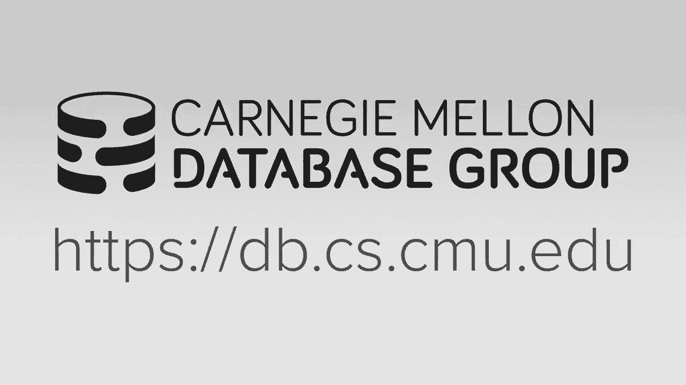
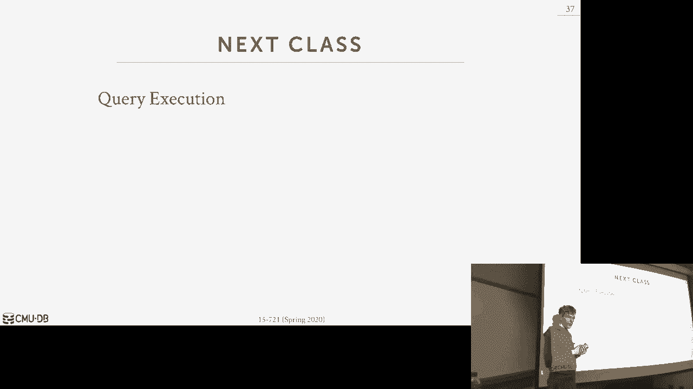

# 【双语字幕+资料下载】CMU 15-721 ｜ 数据库系统进阶(2020·完整版) - P12：L12- 调度规划 - ShowMeAI - BV1wv411w7Ko

[Applause]，[Music]。

[Applause]，[Music]，alright let's get started so real，quickly about project 2 if you haven't。

signed up yet for a group please go do，that the other thing we're gonna change。

is that we felt that the number of，submissions of people submitting their。

project one at the very end was higher，than I wanted and it sort of partly my。

fault for not warning you guys ahead of，time hey don't wait till last minute and。

so to avoid this same issue for project，two what we're gonna have is we'll have。

a check point half way where you just，have to do inserts and reads so if they。

do splits and then so that'll be like 25，or 30 percent of the grade and then。

we'll have the regular submission，deadline that'll still be the same and I。

thought that the support the fool the，full test suite okay，again it's just a 14 function for you。

guys start looking at this sooner rather，than later through not like trying to。

write a thread safe in memory index one，day before it's due that's gonna be a。

bad idea okay all right so today we're，going to talk about scheduling so last。

class was about how to take a query，request from the client put into our。

system run it somehow we didn't say how，all getting there and then we would take。

a response from the result from the，query and shove it back over the wire to。

the client so now today's class we start，the next chapter of how we're actually。

going to execute those queries and so，we're gonna focus on scheduling so we're。

still not actually executing the the the，scans yet and reading our indexes but。

we're getting we're getting closer，closer to that so we need on just need。

to define some terms we're gonna use，going forward，describe what query execution looks like。

so a query plan is going to be comprised，of operators and you can think of these。

as sort of like a relational algebra，operators and so we'll talk about how we。

do query planning and if you more，lectures the basic ideas we get the。

sequel query like this and we have，represented as a as a directed tree，structure of operators and。

the lowest level we have these access，methods were they're going to scan。

tuples or scan to index and feed them up，into the next operator and then the。

results percolate to the top so we're，gonna define now a an invocation of an。

operator in our query plan a specific，invocation of it will be defined as an。

operator instance so for a given，operator in our query plan like scan。

table a we can have multiple instances，of this operator that allow us to。

execute this scan in in parallel and now，the idea is the way we're going to group。

up group group together the the，operators instances that we're going to。

execute in our system alright were to，call these groups as tasks right and the。

idea is that sort of like in the，pipeline model we wanted to have string。

it together as many tests as we can，within a single task or pipeline so。

though we don't have a context switch，going from you know from one task to the。

other so for a scan on a I can do the，filter and then depending on join。

algorithm I'm doing like if I'm doing a，hash join then I can have the pipeline。

also build the hash table for me so I'm，just passing her up intermediate results。

from one operator instance to the next，so again at a high level our job today。

is to figure out how we're going to，schedule these tasks right and where。

they're going to execute and what，they're actually going to do so for。

every single query plan that shows up we，got a side now where when and how to。

execute it and so this case one of these，decisions will have any task so we。

actually use for our query plan like if，we say we have this number of cores when。

we have we could assign one task for our，query plan for each core remain when it。

over subscribe have more tests and we，have cores and that way we can have more。

flexible scheduling then this question，of how many cores we actually want to。

use right so we can have a X number of，tasks and Y number of threads and or。

cores and we can decide how many cores，we want to use then we had to spec。

decide on what course should tasks，actually execute on and then when that。

task completes and it produces some，output we need to decide where that。

output is going to go all right even Bay，about this so far are we saying are we。

actually this query we get back result，but now as we are starting executing the。

tasks that are comprised in that query，we had to make decision of where we。

should tickets output and and as we see，as we talk about different sort of。

memory architectures we need to be aware，of where that memory is actually located。

what we're reading writing to so that we，get the best performance right so the。

reason why we're gonna do all of this is，that the database system is knows。

exactly what the query is knows exactly，what the tasks are it knows what what。

threats has available to it and knows，where the memory or the data is actually。

located so we're in the position to make，the best decision about how to execute。

this query planning efficiently the OS，doesn't know this question this question。

is how do we find what a pipeline is，will come to that next class but the。

basic way to think about this is how far，can I take a single tuple or batch of。

tuples and write it up the query plan，before I have to before I get to a point。

where I can't go farther so in this case，here scan a filter and do say you're。

doing a hash join I can build the hash，table on this side of the join but I。

can't actually produce any result to do，the projection because I need to do the。

probe side so this is called a pipeline，breaker yes so state question is is it。

is this truly a pipeline breaker because，if I had if the pipeline breaker was。

here and I might II realized the output，from both of these guys then shove it to。

my hash table right like the basic，things I can't go higher and to treat。

until I have all the data from one side，right so there's a pipeline here for。

this side but the pipeline for B can go，all the way up what doesn't make more。

sense next class but the main idea what，I care about is like you understand it's。

like oh well a task is what we're gonna，schedule on the task and B cries of。

multiple operators and we're roughly，gonna base it on pipelines and the the。

the main takeaway again from all this is，that we're not gonna rely on the OS to。

do any of this for us we're Network the，so it，can make the best decision so to begin I。

want to first talk about different，process models we can have in our。

databases in architecture it basically，tells us you know what is it it's gonna。

find what a worker actually is is it a，thread is it a process then we'll talk。

about the problem of data placement in，for in memory databases we need to be。

aware of the layout of memory or the，physical location of addresses in memory。

so that we can have our threads try to，or workers try to act to operate on。

local data and then we'll talk about the，different techniques for doing AI Namek。

scheduling in a database system okay so，the the paper had you guys read on hyper。

you know that's an example of doing，their dynamic scheduling and we'll。

contrast this with something like Hana，which is gonna be doing you know having。

different types of worker pools a，different kind of stealing versus no。

stealing policies right so that's sort，of what our focus is on today but for。

this part here but to make this decision，about how we're gonna design our。

databases and your scheduling here we，need be aware of what we're how we built。

the system up here okay all right so，let's first talk about how we're going。

to assign workers to computation on，units in our database system so the the。

the process model is gonna find whether，the system is how the sip is going to。

support concurrent requests from a，multi-user application meaning our。

application could send multiple queries，at the same time or multiple transaction。

invocations at the same time and we，needed a way to decide how we're going。

to interleave them at the sort of，low-level hardware level all right so。

we're not talking about how do we decide，a logical level like what what。

transactions lottery what pieces of data，this is like how do we take a task and。

actually assign it to some worker and，term worker，I'm cajon gonna slip up and say thread。

but and and for the systems we're，talking about it is going to be a thread。

but the way to think about this is like，it doesn't the data says doesn't know。

technically doesn't need to know whether，it's a and it doesn't need to know take。

that it's it's a sort of high-level term，to describe again a a component in the。

system that can execute tasks and this，could be either a process or。

read the reason why I'm saying I take，back what I said would the adenosine。

doesn't need to know but certainly if，it's a process I need to know how to。

communicate with with other processes，because they're not going to technically。

be in my same address space so it's just，basically a way for us to execute tasks。

and then return results to the，application so there's a great book。

written over a decade ago from Mike，Stonebraker Joe Hellerstein at Berkeley。

and the guy that runs most AWS James，Hamilton I called architecture of a。

database system so this is in the，context of a of a dis coordinate system。

but this book really lays out at a nice，sort of clean abstraction you know how。

you actually design the system at that's，sort of this low level education level。

here all right so the three approaches，we're talking about a process per。

database worker process pool and a，thread per Davis worker and again we've。

covered this in the introduction class，but I just want to go over this again。

and the spoiler would be that for all，the systems we're gonna talk about today。

and going forward breath of the semester，it's gonna be the last one here because。

this one is the most common one in in，modern systems so process per worker is。

where every single worker in our system，is going to be a separate OS process so。

that means that when a request shows up，say goes through some kind of dispatcher。

it can then handoff the connection to，another worker that that will then read。

the socket and allow and take any，requests that it gets from the from the。

from the client and executed on the，database system and so the all the。

scheduling that's being done here is is，managed by the operating system because。

we're just calling fork to start off a，new process and we have no direct。

control to say whether you know it，should when it when it shouldn't it。

should run so the tricky thing is，sometimes often is that what this is。

like I may not know my dispatcher，exactly you know how much work these。

workers are doing and I have to rely on，the OS that do sort of throttling and。

and and flow control because these guys，can just do whatever they want or need。

to write extra extra code and they have，them communicate some way back to the。

dispatcher to have a centralized view，about what's happening but in systems。

like Postgres as far as I know they，don't do this all those systems that do。

the approach is db2 and Oracle db2 is a，weird one because，there is a you know there's when people。

say oh I'm running db2 there's actually，four versions of db2 that are completely。

separate code bases like one for z/os，ones for some other mainframe system and。

then there's like the Linux UNIX windows，one and there's a fourth one I forget。

right and they're all completely，separate so we'll see in the next two。

slides db2 is gonna support all these，approaches because they have to run in。

all these different environments but it，may not be the exact same codebase every。

single time okay one advantage you get，from this is that if the worker if。

there's mistake in the software and the，worker crashes you don't take down the。

whole system because workers dies and，then you can fork a new one and bring it。

back up so this makes the system，slightly more resilient than you would。

have in a and a threading based model，because if one thread has a seg fault。

then the whole process dies the next，post is just an extension of the worker。

a single process per worker，we have a process pool and rather than。

forking off the dispatcher of forking，off a new process for every single。

request that shows up it knows it has a，bunch of workers that are available to。

it that can hand off the request and，have that you know run the query for us。

and in some cases to say if I want to，support intro query parallelism I can。

take a single query and run across，multiple processes of metalworkers this。

one worker could identify that there's，other workers available to it in the。

same pool that are idle and start，handing off work to that right the bad。

bad thing about this approach is that，it's gonna ruin our locality unless we。

have extra logic in the dispatcher to be，mindful of what worker executed our。

query the last time right because say，these guys are all running on separate。

sockets and if for this one request the，first query shows up I run on this。

worker the next query shows up for the，same connection but it runs a noun or。

another worker running on another socket，all the cache locality I had for。

bringing in data into memory or that the，local cache for this worker is now gone。

because now I'm not running on a，complete different socket so this often。

times me bad for in memory systems is，because the overhead of keeping track of。

what work I ran on last，and either pause until that workers，freed up if it's in running another。

query before connects you my next query，or you know basically holding it until。

the next query shows up which is just，the same thing as the previous slide all。

that sort of orchestration can slow，things down and Postgres added this in。

2015 all right they can have intro query，parallelism and as I said db2 tries to。

support everything what's the most，common one is the thread per worker。

right a multi-threaded application，question assume you're running on a。

thing for this assume for this semester，it's all single machine sockets few more。

slides would make more sense if they're，on the same socket you have local cache。

and l1 l2 is not shared but l3 shared so，if you run on the same socket the。

penalty of a cache miss depend of the，cache misses it was the same for like。

the likelihood that the data I need that，like if I have a query they execute some。

recent data the next pretty shows up，wants to read that same data right。

you see used all the time I read after，write or read modify write then if I'm。

running on the same socket then the data，is read could be hanging on l3 cache and。

that'll go fast if I'm known another，socket which doesn't have to share that。

l3 cache I pay another cache miss so the，previous one is like for this connection。

right this worker is now dedicated to，the connection to this client so any。

query that shows up is always going to，go to this worker right because it。

basically takes over listening like，basically what happens is the bluee。

Postgres works if this is called the，postmaster the the connection shows up。

the postmaster says great I can hand you，off to a worker go now right to this。

socket or this port number here and so，this comes back now and this thing's。

listening on this port and now has，direct access to write 10 queries here。

yes you're bypassing the dispatcher this，one is like I'm always going to this new。

dispatcher I think of this as a，sectionalized scheduler and it's now。

making this kitchen how to hand handle，things off in different processes。

threat poor workers is is it's a single，process and we have inside that process。

we have multiple threads you may or may，not have a dispatcher a thread you still。

can do the same approach where you have，one thread listens on a socket that all。

incremental quests have to go to and，then you hand it off to an another。

socket on another thread so it can，process things or you can just have a。

dedicated thread per your connection or，you just have a sort of a。

general-purpose networking layer that，his hands off work to anybody that has。

has idle cycles as I said every single，database systems written in the last 10。

years is follows this approach so you，may be thinking well this is clearly。

better you know you know pay a penny for，context switches everything's in the。

same address base so any thread can read，any any you know memory location of。

another thread yes you have to do the，the current suite of stuff to make sure。

you don't have any issues or or the，latching to make sure that you don't。

clobber each other when you access，critical sections so but this is clearly。

gonna have the lower overhead than the，process process approach and we take a。

guess why nobody built databases this，way in the 1980s 1990s correctly says。

POSIX threads or P threads were not，standardized so all the different。

operating systems you know son or，Solaris H parks for Linux even came。

around but the limits came out in the，early 90s there wasn't a POSIX standard。

to say here's a threading API everyone，had their own API and they had semantics。

of how they you know could spawn threads，and and you know do join from them was。

slightly different wasn't dramatically，different but like the API was certainly。

different so if I want to support a，bunch of operating systems for my。

database ism then I would have to have a，sort of wrapper layer to make sure that。

that that I had it sort of the lowest，common denominator of what the thread。

API was so it made it more portable now，a P threads this is this is not an issue。

so one thing also say to well one of，things we did when we serve first。

started building peloton was we took the，Postgres source code forked it like。

everyone else does we then converted it，to be multi-threaded if you go google。

Postgres multi-threaded you'll see a，mailing list post from i'm former PhD。

student saying hey look we did，afraid why we did it was a bad whatever。

ah but it turns out the way we actually，got it to convert convert it was wasn't。

like we took the in the Postgres source，code it's a single code base but they。

have all these pound of fines that says，if you know if Linux do this if when 32。

do that if you go take the windows code，you can actually convert that to。

pthreads much more easily then you could，convert the the Linux code anyway and we。

also converted this tipo plus 11 which，again for for historical reasons I don't。

remember but in our new system we threw，all that away we don't have any we don't。

inherit any Postgres code anymore so，again the multi-threaded approach is。

better you have lower overhead context，switch and then you don't the manage。

shared memory in the multi process case，you're either sending I pcs to each。

other or you have shared memory to so，that everyone can read and write into。

the same location the important thing，else to point out too is just because we。

may be using a multi-threaded process，model doesn't necessarily mean we're。

gonna get intro query parallelism in our，database system so Maltin my sequel is a。

multi-threaded database system but it's，one thread per query request right they。

can't divide it up the tasks across，multiple workers and in their。

environment doing OTP that's that's，that's fine and as I said I'm not aware。

of anybody any other system in the last，built in the last ten years and the last。

their forked from from post graphs which，is a process pool model approach and。

let's they're based on post grass every，new system is gonna be using both multi。

threads okay and that's we're gonna，that's what we use in our system alright。

so now let's get to his question was，about this this issue of of whether this。

core running same corn same socket or a，different socket so regardless of how。

we're gonna do our worker allocation or，task assignment policy in our system we。

want to make sure that all the workers，are going to operate on local data so in。

a distributed system this is like a，no-brainer if I have two machines and my。

data is you know my machines on the west，coast one machine was the East Coast my。

query shows up and wants to touch data，on the west coast I send the query to。

the west coast and process it there that，way its operating on local data well a。

multi socket multi-core data or，but socket multi-core system even though。

it's running on on in a one box still is，sort of like a distributor database。

system so the same rules the same same，concepts apply here so we want to make。

sure that we always have our tasks，operate on local data for where the。

thread the worker is actually running so，this means now that our scheduler needs。

me aware of what the memory layout is，for our underlying hardware and at a。

high level there's two approaches this，is a uniform and and then the。

non-uniform memory access so this is，also the acronym is Numa so you're here。

meet a multiple times numeral region，Numa this noon with that that's that's。

this one this is the most common one we，have in a most eSATA system today back。

in the day we had what was called，uniform memory access this is sometimes。

called symmetric multiprocessors SMP and，it's basically the same thing and the。

idea is that the the tasks of the，workers are running down here in the。

cores they do have some local CPU caches，l1 l2 l3 but all memory is managed。

through this system bus so for any task，running on any socket the cost of。

accessing a chunk of memory is the same，no matter where I'm running on right so。

if I'm down here and I want to access，memory that's in in this this damn here。

the cost of retrieving that is the same，if I was running here or the other ones。

because there's overhead of going over，there this system bus so we still need。

to do cache invalidation in this world，right the the the the hardware is aware。

of I read this region of memory and now，it's in my CPU cache somebody else reads。

the same thing and rights to it the，system boss has to take can handle of。

invalidating our cache every you know，our cache entry up here all that sort of。

handle for you so they said this is how，they built up until maybe like 2005 ish。

2006 this is how Intel and AMD we're，designing their multi socket CPU systems。

but now we have have the Numa stuff and，in this world there's not really any。

from a database system perspective，there's no intelligence intelligence we。

need to embed in our scheduler because I，said it does we don't know we don't care。

this looks like one John address base，and the access cost is the same。

what modern systems look like is in the，new model is that you still you now have。

memory that's local to each socket so，you again you always have your your。

local CPU cache and then you're gonna，have dims that are there gonna be。

physically closer to your socket and，have a direct path to go read and write。

to it so on on Intel chips the CPU cache，for every core the l1 l2 will be。

specific to that core but then they're，also share share l3 and then obviously。

they share the dim here and then now if，I need to have my my tasks running here。

if it needs to access memory that's not，in my local dim and I got to go over to。

this other CPU here I'm going to go over，this interconnect to send my message in。

the hardware to say hey go read this，thing for me then the CPU knows how to。

go out to the dim and then bring it back，down into me，so the the performance difference here。

for just pure like read/write speed is，about 50 percent slower so if I have to。

read data around here roughly it's could，be 50 percent slower than if I was。

reading data locally yes like for the，here to here no look at the bus is。

basically like this bus is basically，saying like alright I want access memory。

address and you basically translate that，into some dim slot right yeah look。

locally is yeah so if I have to read，here as 50% slower than reading local。

here like think of this as like as the，fast path yeah so again like that means。

now in our database system when we start，loading in our data we want to be aware。

we're actually gonna put it then when，queries show up and they want to start。

executing we need to be aware of what，data they want to touch right in our。

task and make sure our tasks are on here，then OS doesn't know anything right the。

OS sees a bunch of threads that want to，do some kind of work but it doesn't know。

you know doesn't know your Bitcoin，mining thread from your database to some。

thread so we have to tell it hey we want，to make sure that we run things locally。

here right so the this interconnect if，it's you know it's a high speed high，speed。

not really I don't think though I，wouldn't call it a bus but they say it's，a high speed connect。

between these different sockets that's，multiplex you can go both directions and。

talk to anybody in television we call，this the quickpath interconnect of the。

qpi then that wasn't good enough so now，they call it the ultra path interconnect，in 2017。

AMD has their own version it's now，called the infinity fabric power has，their own thing an arm。

I think has their own thing as well but，it's at a high level they're all it's。

all doing the same thing right，okay so now if I called Malick question。

is where's my memory going to show up，all right so the way to think about this。

is that we're going to take the the，tables that we have in memory and we're。

going to partition them or break them up，into two chunks of data blocks and then。

now we want to assign them each of these，blocks to a specific CPU core right and。

in a more high CPU socket or Numa region，so if we're aware of where we're putting。

our data where that data is being，located when a query shows up and we。

make decisions about how to break it up，into tasks and what those tasks what。

pieces of data those tasks of an operate，on we can make sure that we schedule our。

operators to execute on data its local，to this so this is an old problem in。

distribute data this is called data，placement so think of partitioning is。

deciding like how do I break it up and，what boundaries and then data placement。

is saying where do I put those actual，partitions that I've generated so in。

Linux you can control this through the，the move pages syscall or the noumic。

control command-line option or command，line tool so basically what happens with。

new it would move pages that if you just，invoke it with a memory address it'll。

come back and tell you what numeration，and it's on but if you invoke it with a。

memory address a size and a numeration，it'll it'll move that data to to that。

location and I think that's a blocking，syscall so if you think about this if I。

have a one terabyte database and I can，load it into memory and then sort of get。

randomly scattered across different，different sockets then I can go back and。

call move pages and start putting things，in and what you know where I want them。

all right so let's talk about now what，happens when you call malloc so let's。

say our data system calls malloc cuz，we're gonna load into one terabyte，database。

the question I have for you guys is what，happens what happens in that Cisco。

assume that my allocator as already，handed out all the the the pages that I。

have that's already pre allocated what，does it actually do yes。

he says calls s break yes sort of well，yeah that's this right so as break will。

extend the process data segment but，that's just getting moving it to be。

larger but after that it's actually not，doing anything it's like all a day was。

update the internal bookkeeping data，structures it has for for this boundary。

but all the virtual memory just，allocated with the S break is not。

actually physically allocated in memory，because no one's access to debt it's。

only when we touch the data does is，they're paid fault and then the OS says。

oh it looks like you're actually gonna，use this memory let me go may have and。

be backed by physical memory right so，now though let's say after the page。

fault so after call s break and then，someone tries to access this memory。

where are we actually gonna put this，let me take a guess is it to thread that。

allocate of it or is the thread that，touched it touch it，good。

fantastic okay yes so there is a policy，that to tell the OS that whatever thread。

touches that memory that's where I，wanted to be allocated so when there's。

so I can allocate it it adult calls s，break extends virtual memory from light。

for my process but only one no threat，touches it then there's the page fault。

and then we put it in that physical，location yes this question is the OS。

cannot promise virtual memory unless it，has physical memory what do you I。

think big I I want I want one terabyte，of memory what happens oh you can't you。

yes phosphates yes so that's the way so，actually you can see this now if you run。

some of the tests with a SAN from our，database system it'll say the virtual。

memory size of the database process is，12 terabytes we obviously don't have 12。

terabytes on any machine right so the，the OS is making the decision here that。

like most people are gonna allocate more，memory than they actually need so I'll。

to let you have it and if you actually，end up needing it then you yes you you。

have to start swapping out pages to to，the swap space on disk and that makes it。

look that's virtual memory it makes it，look like you have more memory than you，actually have。

all right but in our in a database world，for the things we talk about here we。

actually talk about that the the data，the inside tables the tools themselves。

we're gonna use that space so seeing of，this is like alright well I I'm not。

gonna allocate I'm not gonna turn to，anybody says mourn and have pre-allocate。

you know one gigabyte of memory it's，only as I start inserting data that I've。

recognized oh well I'm running out of，space for my pre allocated memory that I。

have now let me go grab another you know，100 megabytes break it up to block start。

filling data in so the question is we're，trying to get here is like when I do。

that where's that M memory actually be，stored by default you get this where the。

OS does round-robin to start just，writing out pages to lean in one socket。

at a time and goes around over and over，again what he said as he pointed out the。

paper that you can tell the OS I want to，use the first touch policy so that I'll。

allocate the memory and then when the，task actually starts inserting into that。

into that block there'll be the page，fault and then that's when it updates。

the the virtual memory table to now be，back by physical memory and then I can。

that data into the to the table and that，physical memory will be wherever my。

threat is actually running right again，you can do this you can modify the。

location after the fact you can call，that move pages sis call to say alright。

well I've loaded my table and let me go，start moving things around accordingly。

but that's actually obviously stupid，because like if I'm loading a one。

terabyte data is I don't want to load it，all in first and just have it be。

scattered around randomly then go back，and do sequential scan and then actually。

start you know moving things to the，right location I want to use this policy。

ahead of time be aware where I'm，scheduling my schedule might might my my。

tasks so that I have an even，distribution of the data across all all。

threads or close all sockets right so，let's see the impact of this when we。

have fine grained control of where we're，putting data so I'm gonna show to slides。

here the first will be LTP and the first，of the OLAP so this is from a paper a。

few years ago from a natasa Telemachus，group at EPFL and so this is running an。

in-memory database on a four socket，machine eight cores per six cores per。

socket and they're just gonna run the，TPCC payment transaction and what。

they're gonna do is they're going to put，the different warehouses or the blocks。

of data for the for the for the database，on different configurations across the。

the sockets so spread will be every，every socket has has you know an equal。

portion of one quarter of the total，table group was where you're gonna shove。

everything when to a single socket mix，is where you split it 50/50 and the OS。

is just letting the OS do whatever at，once and I'm putting question marks in。

here because like we don't know so，whatever the policy that the OS decides。

to do is what it gets and so what you，can see here obviously that if our。

threads can access data that are all，running on the same socket you'll get。

about a 30% improvement over what the OS，will do because the OS is gonna do。

something looks like it's doing，something a little bit smarter than。

spread but not that you know much，smarter than mix or group so we this is。

just showing you if you let the let the，OS be in charge of deciding where。

they're gonna place data and also where，it's gonna schedule our threads is you。

have a bad time and you get 30% better，by doing it yourself，right and when I think of the students。

like all the feds are running on some，Woonsocket so you may be thinking all。

right well wouldn't be better for me to，spread across multiple sockets so that。

our threads have you know a larger，portion of the CPU caches to themselves。

well no because going over that，interconnect to transfer data from one。

thread to the next is gonna be，problematic because this payment，transaction will update data at。

different partitions so you may have to，go crawl socket the next slide I want。

show you is a micro benchmark experiment，that some former students of mine ran a。

few years ago so this is running a sort，of a simple execution engine that they。

wrote for I think for taking 618 and all，it's going to do is just a sequential。

scan over 10 million tuples and they're，gonna run this on a beast machine we had。

in the PTL or PDL there was eight，sockets at the time ago 2008 machine。

it's a bit old but like there's the only，a socket machine we had access to and。

every every socket has 10 cores plus，hyper threading and so the what along。

the x-axis you can see is they're gonna，add more threads to do the sequential。

scan in parallel so the the size of the，table has always been the same and now。

we're just adding more threads so that，we can you know do do do execute the。

scan in parallel so what you see is that，at the lower core counts or thread。

counts the performance difference，between the the so the raina partition。

is like you just let the OS decide where，wants to put it，the local partition is where you you。

assign threads to execute the scan on，data that's local to its its numeration。

so at the lower thread counts because，the the table is spread across multiple。

sockets the probability that a thread is，going to have to access data at a remote。

socket and go over the interconnect is，higher so therefore it doesn't really。

matter if you're dividing up，intelligently or not but as we now。

increase the number of threads then the，amount of cross socket traffic we have。

for our scan threads goes down，significantly for for when we do the。

local partition local partitioning and，that's why you get better performance。

and then this division point here is，when hyper threading kicks in so up into，80 cores。

it's all you know，Harbor chorus but then in the，hyper-threading you get the virtual。

course and at that point here we're，bound by memory bandwidth so throwing。

more cores and more threads at us that，doesn't help us anything because it's。

not like you know one thread stolen，waiting for like disk i/o another thread。

it can run everybody just waiting for，get stuff at it out of the memory。

controller so that's why the performance，plateaus so this case here I forget the。

exact numbers but it's almost about a 2x，performance difference between or over。

2x performance difference between being，intelligent at how we do or you know。

place our data on run time on our，operators versus letting the OS and the。

hardware manager for us okay so as I，said briefly the is this notion of。

partitioning and data placement we're，not gonna talk about partitioning here。

but think about partitioning scheme is，again it's some policy we're to use to。

decide how we divide our data up into，chunks and the placement decides the。

placement policy decides where we're，gonna put those partitions so the。

placement policy is sort of agnostic to，what's actually in our partitions and。

you saw this in the morsel paper right，in the morsel paper that said all the。

threats care about is that they're，operating on data that's local to it and。

they just pull it out of queue and this，process it in a partitioning scheme you。

can have some higher-level logical，meaning or semantics to how you're。

dividing up the data that you can then，exploit in your query execution and this。

is what we'll cover this in future，lectures like if I know that my my quick。

might workload is always going to be，doing hash joins on a given partition or。

starting I want to give an attribute，then I could decide the hash partition。

my data all in that joint attribute so，that now when I run the joint algorithm。

all the data that that every operator，needs to operate to do the join is is。

local to it and the query optimizer is，aware of this partitioning scheme all。

that is sort of above us when we do data，placement scheduling here okay all right。

so at this point what we have we have a，process model we have a task assignment。

pilot model basically how we're gonna，decide you know where should where。

should tests actually run its where the，memory is local to it and we decided how。

we're gonna saw it you know，determine what mechanism we're going to。

use to pin chunks of memory or chunks of，data to memory locations so now we need。

to talk about how we're actually to，create a bunch of tasks that we want to。

then execute for our for our logical，query plan and then once we have those。

we can get aside how we're actually，going to going to to schedule them so。

402 B queries this is super simple，because most of the time there's not。

really any opportunities for parallelism，in a single old to be query I could have。

multiple OTP queries running at the same，time across different transactions and。

certainly I want to have them run on，separate threads and they want to run on。

on you know on the the sockets that have，the memory that's local to it but for。

the data they want to access but within，a single or to be query I can't really。

divide that up into sub chunks right，like go get andis account record that's。

like a single and next probe to go get，my one record，I can't paralyze that so this is gonna。

be this what we care about this for is，for the OLAP queries and then we can。

still apply now the same techniques，we're gonna do to schedule OLAP queries。

to schedule multiple ultimately queries，at the same time right okay that are。

running on behalf of different，transactions so the easiest way to do。

scheduling is called static segment and，that's where the data doesn't decide。

before it even starts exceeding the，query I know the number threads that I。

have a number of course that I have it，can decide like I'll just say I have one。

task for every core and then shove them，off to the hardware and let them execute。

right so this is the easiest thing to do，because I don't worry about monitoring。

the behavior of the task while they're，running I just say this is my plan I'm。

sticking with it and I don't care about，alternatives so this is the if you're。

building a data system for the first，time this is probably what you end up。

building because it's the easiest thing，to do so again this is not the same。

thing as is the placement policy stuff，right we we have a place in policy into。

us to have that we use to assign the，tasks to threads basically the data。

location this just sort of saying how do，we divide up our tasks and and and at。

runtime how do we actually schedule them，so the approach that I had you guys the。

reason why this is me Paulo Matic for，OLAP queries especially is that。

it doesn't take into account the the you，know the the runtime of these individual。

tasks only different courts so if I have，that one terabyte database and I have a。

sim I'm doing a scan on it with a，predicate and for whatever reason on one。

socket the data at that socket that，predicate evaluates to true for more。

tuples where every other socket that the，predicate is very selective so I should。

end up throwing most of the data away，and so that means now for my task runs。

on my one socket it's gonna spend much，longer than the other sock has to finish。

that one task because more tuples are，getting put into its output buffer as。

it's doing more memory copying and if I，static scheduling approach I can't。

dynamically adjust the system and say，alright well I see this guy's going slow。

and there's much more data than that it，could possibly execute the heck bet。

we're waiting on let me go bring in，other threads to help it out to speed。

things up so statics - you can't do that，but this is what dynamic scheduling can。

can handle and this is the problem that，the hyper guys are trying to solve what。

their approach so the more so driven，scheduling is the idea is that we're。

going to process our tasks in parallel，over these horizontal partitions that。

they call morsels so morsel is a hyper，term it's not like a standard term in。

database systems I think they picked it，because they didn't want to use word。

term block because that's uses a bunch，of places they didn't use a term。

partition because that's already bunch，of you can use as much places like a。

morsel is larger than a block but，smaller than a partition it's a way to。

think about it as far as you know no，other system actually uses in this term。

this is specific to hyper so they're，gonna have one worker per core and so。

you have a multi-core socket you can，have multiple cores per support for that。

socket there can be a pool based tasks，einman meaning the the workers are gonna。

run they're gonna check some centralized，data structure and say what work is。

available available to me and then when，they load the data in they'll just do。

round-robin data placement so they'll，have you know say I'm doing a bulk。

insert and I'll say well some portion of，that ball concerned goes to this socket。

some portion goes this office I got the，morsels so it's gonna be interesting。

about their approach is that the，implementation of the actual database。

system is going to be entirely Numa，aware meaning they'll have，implementations of operators that。

recognize whether they're accessing data，on a local numeral region or a remote。

Numa region and they'll do they'll have，different strategies of where they put。

they put the output data or what what，album they actually may want to use。

right and they'll use this when they，make decisions about how to pull things。

out of the task task queue so as I said，they're using a pull model so that means。

that there's no separate dispatcher，thread there's no single thread in。

charge of having a global view of what's，going on in the entire system and the。

threads are doing the workers arguing，cooperative scheduling because。

everyone's looking at the same queue so，what's gonna happen is that when they。

pull tasks out of this queue each worker，thread is going to going to prefer。

threat of tasks that aren't gonna，operate data local to it but it also can。

recognize that there are there no tests，available to it that's that's operating。

on with local data and go try to steal，work or steal tasks from another worker。

thread that may be operating data that，that's that's remote to my worker thread。

but because this other worker thread is，is going slow for some reason we'll pick。

up the slack and take some of their work，and then their approach also - I'm not。

actually I'm a slide for this but in，their model they only execute one query。

at a time so a query shows up they're，gonna break it up to a bunch of tasks。

and you don't move on to the next query，until all the tasks for that for that，one query are finished。

alright so it's either the query is，completely done and there's no more。

tasks available to it I move on to the，next one or a worker thread can go steal。

tasks that the straggler worker can't，yeah so his question is what is actually。

dividing up of query into tasks and，putting them into the queue I would call。

that a dispatcher that's like a that's，sort of like the the front-end layer the。

query shows up you parse it you know，parts the sequel front of the query。

optimizer and then at that point you，have a you divide them into tasks and。

then a certain to the queue and whether，that's a dedicated thread that's that's。

separate from the networking thread or，the networking thread itself it doesn't。

it doesn't matter at this point I，actually don't know what they do in our。

current system we the same thread that，takes the the sequel query off the。

network socket parses it binds it not，buys it well then it divides it up but。

you could hand it off to another queue，only work，give me two slides we'll get there all。

right so first thing we need to do is，divide our data up into into morsels so。

say this is our data table we have four，columns so morsels are just horizontal。

partitioning where we're gonna say，within some strive all right this is。

this is the boundary of a morsel in the，in the paper they talk about they use a。

hundred thousand two pools per most，morsel and they say they pick this。

number because it provides the right，amount of parallelism versus the。

overhead of putting stuff in a queue so，for every task I get and pull out of the。

queue I'm gonna least operate on at most，100，000 tuples in peloton our block。

sizes were a thousand tuples in aged，order the system I helped build before I。

came to see him you we did ten megabytes，as far as I remember from the。

discussions of those systems we just，picked those numbers out of her ass like。

it's not like there was any magic to it，I think in the case of hyper they said。

they actually did some you know some，internal micro benchmark to determine。

that a hundred thousand one actually was，actually reasonable in our new system as。

I said a few more few lectures ago our，block sizes are 1 megabytes because this。

allows to have the 20 bit offsets that，we use the line as command in c + 11 i。

didn't look to align our blocks of 1，megabyte chunks in memory right and。

again so for each of these muscles we'll，just order to assign them to different。

CPU sockets so now getting to his，question how how we're actually going to。

do work-stealing so say now we take our，query plan，and then we're gonna chop it up into。

different tasks then we're gonna put in，this global queue and then now down here。

for every single socket it's gonna have，its local memory and then it'll have a。

buffer that the control results but it，also have all the morsels that it's。

aware of that are local to it and so the，buffers will be as you process a task we。

want to write data to our local buffer，it's sort of the same way we talked。

about doing the Delta store in the hyper，approach where as I was generating new，versions。

I put the old versions in thread local，memory and that means that I didn't have。

to have a coronation of a global shared，memory space that that multiple threads。

be ready and ready to at the same time I，know that no the threat writing to my。

buffer at this time so I don't take a，latch on it so now all the threads are。

gonna go look in the queue and pull down，the first bunch of tests that it must。

execute so in this task you you maintain，information about the dependency between。

these between the between the tasks so，it would know that I can't actually。

execute the probe until I do the build，the hash table and do partitioning for。

on the other side here so it knows that，these are the tasks I can execute first。

so again so as the each each thread runs，a worker runs the task it's pulling data。

out of its local memory which is gonna，be fast and then as a you know actually。

X use the operators and produces some，output result it writes it now to its。

local buffer yes question is is the，global task queue in some sort of socket。

or is it distributed I think they let，the OS manage this one because there's。

not really anything everybody if，everyone has to read and write to it。

there's not any magic you can do and，yeah so his point is like well well。

we'll see this in Hana wait his damn it，is this global task queue is a shared。

shared memory space right so I need so，they're going to use a lot free your lat。

tree hash table to avoid having to，synchronize on on this or have a heavy。

synchronization synchronization，primitive but you could partition the。

memory of this global task queue such，that these guys look in their local。

memory first find tasks that are，specific to him and if not gonna look at。

other ones Hana would do this as far as，I know hyper Hana does this was seen a。

few more times yes there's this quote I，think yes for what everything they。

didn't do this so but the point the plan，is gonna make is like the morsel size is。

100 100 thousand tuples that's where the，big the bottleneck is gonna be if I'm。

going over the inter connect to a remote，socket like the bottleneck is reading。

this going fetching one task that's，gonna be maybe a kilobyte of a size it's。

not me that big so going getting，fetching one thing from a memory region。

it's not a big deal that's not what the，bottleneck is so again you want to add。

is I'm knows law we want to optimize，where the big overhead is or spending。

all our time it's with this and that's，what the Optima is all right so say now。

these first two threads make sure the，sister won't good the first two threads。

are finish up the first three workers，finished up their tasks but the third。

guy is running slower as I said so maybe，this filter is is unselective so we're。

generating a lot of output and running，into our buffers and that means we're。

doing copying and wrong slower so now，the other two workers can go grab the。

next two tasks or to execute，same thing but say now this first one，though finishes up this task more。

quickly it can then recognize that oh，well the b3 is waiting，also needs the executed before we can。

exit the the next task in our in our，pipeline or in a query plan so let me go。

ahead and steal this guy bring it down，and and and operate on it so that means。

now I'm at the copy data or move data，we're not moving data you're copying。

data from the memory of the morsels for，this socket here you're putting into。

your CPU cache over here so that's going，over an interconnect but as I produce。

output then I'm gonna write this in my，local buffer and there's some metadata。

that maintaining to say for this task，the location of the enemy result that。

the next operator would need in our task，queue is located here so there's some。

internal bookkeeping the third Natur，they're keeping track up to know this。

task output got written to this location，yes the same I think they mean by that。

is like they're not the because，everything is in memory the amount of。

time like say here for this one when，they were all A's because everything's。

in memory they're gonna be close enough，it's not like this thing's gonna be。

waiting on disk and therefore be minutes，slower right it's just like the idea is。

again because they only excute one query，at a time rather than have this guy be。

idle waiting for b2 to finish then a3，has to finish and then has to actually。

be three before you connect to the next，task in go ahead and just go ahead and。

steal it yes this question is for this，one here when I had to copy the more。

soul into my CPU cache running the sake，here do I then do I then physically you。

know permanently move it to be over here，no right because again the net score you。

might show up and now maybe this this，socket is it's the slow one right and，from me，memory。

once it's all ready once it's already，placed in locations you may want to。

report it repartition it may be split up，on a different attribute but that seemed。

rare and many said that in those systems，as well okay，so again because they only have one work。

uh procore hyper has used that work，stealing because otherwise they're gonna。

be they have threads waiting for for，stragglers and as we already said they。

use a lot free hash able to maintain，global work use so that means that the。

overhead of going grabbing things from，the work queue is not that significant。

relevant relative to the actual cost of，processing the morsel so now let's talk。

about another approach from Hannam and，it sort of gets into what he was saying。

about how you want to organize the queue，so Hana is gonna be using a I should be。

very clear this is from a research paper，that a PhD student wrote while employed。

at sa P so in in in in Germany they have，a model for PhDs where a a student can。

go work full-time at the company they，still do research they still write。

papers they get paid by that company you，like a regular salary like I'm not like。

a PhD stipend but then they get they get，the degree from an institution so as far。

as you know what I'm describing here，never actually made it into the real。

Hana system although the student was，actually physically working on the real。

Hana source code when they implemented，this but this is sort of a a different。

approach of how to do scheduling that，than when Hana actually really does so。

his statement is does that mean whatever，they describe here did not work out and。

therefore they did not want to put it in，the real Hana system there's like yes。

this is a good idea we should do that，and then there's like the engineering。

overhead of taking this research code，and putting to the real system that's。

oftentimes why this stuff doesn't，materialize right but it's not not like。

it's wasted work right certainly like if，now ACP decides to build a new system。

which they actually end up rewriting a，lot of Hana you know they now know。

something about you know some of the way，different alternatives way to organize。

that's the schedule mechanisms so they，could have done this，so as you don't know since the 2019。

rewrite of Hana that came out last year，I don't know whether they do this I。

suspect not but I just don't know，all right so what they're gonna do is。

they're gonna it's a pool based cue but，they're going to have multiple workers。

per socket so it's not gonna be the same，thing in Hana where you have one worker。

for a core every core could have，multiple workers and there being。

different different they're gonna have，different statuses and so each group now。

also is gonna have a soft and a hard，priority queue so that's what he was。

saying so couldn't I have a cue where I，know that's local to me and I go check。

that first and if nothing's there then I，go check another cue that's the global。

one that's this so the soft key would be，local to my group it's gonna be some。

number of workers running on the same，socket I sorry take it back that's the。

hard cue the hard cue is local to my，group and hard means that nobody can。

steal for me and the soft one means that，someone is allowed to go ahead and steal。

this so I still want to execute both，tasks this just says that this thing has。

to run in my socket or my group no one，can take it and these are things that。

are eligible to be stolen from other，other things so now they're gonna have。

have a separate watchdog thread that's，going to have a global view of what's。

going on at every single group on every，single socket and then they can decide。

that whether some group is being，oversubscribed and has more tasks that。

they can actually process and then it，can take threads away from one group and。

then allocate additional threads or，allow additional threads to run in。

another group so so it's really you're，getting births cut the balancing you're。

having the work-stealing that you have，under hyper but you also have the。

ability to crank up the number of thread，you want to be executing tasks as well。

so you sort of get that you're using，both approaches so as I said we have a。

soft queue and a hard queue so fred's，are allowed to steal tasks from other。

soft cues and the Hark you how to do，that and then for the different pools。

for within a group would have four，different pools that'll keep track of。

what types of threads we have running so，working thread is when we have one。

that's actually running a task that it，pulled from some queue it doesn't matter。

what queue came from because we know，that it's processing something we have。

an inactive thread where we know we're，blocked in the kernel give you some，latch and。

it's some later point it'll get woken up，a free thread is one where it's gonna。

sleep a little wake up check its queue，to see whether anything for to execute。

in the software the other or the hard，queue local to it if if so then it go。

ahead and execute it and now becomes a，working thread if not then it goes back。

to sleep and then we have part threads，where the thread the sleeps and it。

doesn't get woken up until the wash dog，thread comes comes along says hey we。

need you you know wake up and actually，start doing stuff and so again what this。

isn't allow us to do is we can now scale，up the number of threads we have like in。

the park thread queue case cuz like or，the pool case cuz if I recognize that my。

group cannot all my threads are working，or they're inactive there's no free。

threads because they're all they're all，working on things if I don't have enough。

resources to process the work I need to，have for my group I can now release。

these Park threads or unpark them and，have them start processing things as。

well and then maybe on another group，I'll park their threads so there's a lot。

of work right this is this sounds like，an operating system because it sort of。

is and we'll see this from from from，sequel server and a few more slides but。

they actually did build an operating，system that runs inside the database。

system do they even call it that，so with this they're gonna again they're。

gonna they're gonna adjust the threads，from the pinning of the threads where。

they're actually running based on，whether the task is CPU bound or memory。

bound so like if my task is if for my，for my group if my task says that I know。

I I have a bunch of tasks and I can't，process in the fast enough。

I can allow threads to well I couldn't，part them if I have to not enough work。

if I could unpark bam if I have two of，more than actually need and I have to do。

that for other socket because I don't，want to saturate the memory bandwidth。

over the all system because the maybe，those tasks are pulling data over the。

interconnect right what was interesting，about this is that they found that when。

they looked at the really large socket，machines that khana can run on they。

found that the hyper approach of long，the work stealing was actually a bad。

idea so in the hyper paper they were，looking I think at two to four socket。

machines the Hana guys are looking at，like sixty-four socket r128 socket，machines。

so in that environment what you want to，do is you don't have any soft cues you。

put everything in the hard queue and you，can then scale up the number of threads。

you're running on every single on every，single group on every single socket but。

you don't allow threads to to take work，from another socket and go over the。

interconnect everybody always process，things things locally right yes the task。

of the Softee in the heart here like，what would be an example so the question。

is what what how do I know what to put，in a hard humour soft ass could be like。

well we'll see in the next slide so in，Hana for this example they have the。

entire system architecture is running on，these these whirlpools so that means。

like never requests will be running on，the whirlpool so if I have a if I have a。

task that says you know read the next，message next packet from this socket。

I want to run that you know at the at，the thread or at the socket were at the。

CPU socket on the network swear that，never sock is located and I don't want。

somebody else to go go take that from me，yeah I mean this is the next slide so。

again like there thread groups are，running everything so in the hyper case。

the the the pools were only doing，processing queries they're putting。

everything in the system so now you can，do things like if my if I have I'm over。

subscribed on the number of queries I'm，executing rather than accepting new。

never requests I'll take some networking，threads from their pool and spin up new。

threads or unpark threads in my，execution pool and so that sort of gets。

the natural flow control of not you know，taking more queries than you actually。

can execute so here's that same query we，had before right and so save these tasks。

here we can put into the soft queue and，then for whatever reason we put these。

other tasks in the hard queue right for，my purpose here it just doesn't actually。

matter and shown this registration，purposes so now again all the worker。

queues the worker the worker threads are，threads，are just waiting on something in the OS。

the free threads are just spinning on，the soft Q or the heart of Q looking for。

work to do and the park threads are just，blocked by the watchdog thread so I。

can't say here that I recognize that I，can't keep up with my demands so say now。

my free thread pulls out something from，the heart Q then it gets migrated now。

and now it is considered to be a working，thread and the watchdog thread above。

that all this knows how many threads，were actually running on every single。

group and can make scheduling decisions，about about our resource allocation，decisions up above yes。

parts that are like threads in reserve，so like instead of calling spawn I just。

hadn't there right so they are I，actually don't know what the true。

difference I think in actual thread，would be like I'm blocked waiting to get，to the latch or a mutex。

and the OS but if I come back then I，become become working this is like I。

think you're parked in the OS you're，blocking me West on some mutex and it's。

like it's the conditional variable where，like some other threat has to come and。

say now you're allowed to wake up and，the idea is that I can dynamically have。

these guys get released and execute，without having to call call spawn。

because that's a contact switch or a sis，call and the context switch okay so the。

last scheduling thing I'm gonna talk，about is which i think is the most。

fascinating one out of all of these it's，not for an in memory system but again。

it's it's so it's so different than，everything else we've talked about so。

far but I think I think it's amazing，so in sequel server in 2005 they。

released in the new version of sequel，server they now released that in bundle。

inside the dated system this basically a，user mode operating system called sequel。

OS and the idea is that this is a layer，that sits above the real operating。

system with the Windows kernel and the，actual the database system engine itself。

that manages and provisions hardware，resources and the original motivation of。

this was that rather than the the you，know as new moon was coming more。

prevalent as there was hardware changes，rather than having all the different。

implementations or of the different，operators inside the database system。

execution engine rather than have to all，be aware of of Numa and，and memory look memory layouts and。

things like that they would have，abstract all that away through the。

sequel West layer and have it makes，decisions about you know where to。

actually run tasks and how to actually，run things in parallel so it's things。

amazing because it's more than just like，scheduling threads they do a bunch of。

other stuff like IO scheduling they，actually manage up the buffer pool。

inside that cos they they do lock，scheduling and unlock management inside。

this as well again the idea here is that，rather than us having to to have these。

ad hoc invitations of specialized Lodge，to deal with like oh this threads ready。

for this lock and therefore might my，join Alvin can run this way or whatever。

like all that is taken care of in the，sequel West layer and you just implement。

your basic operators up above and this，thing handles all that for you right。

again when you think of like if you took，the intro class we talked about。

disscourn and database systems right we，talked about the buffer pool manager the。

role manager is basically replicating，the same logic for the OS does for。

virtual memory allocate some pages or，III can allocate more memory than。

actually available to me and I know how，to swap things out on disk so so。

Microsoft basically went all-in so let's，do everything the OS is doing and put it。

inside our database system right it's，it's pretty amazing so but for this。

lecture what we talk about is they are，doing for thread scheduling they're。

gonna do non-preemptive thread，scheduling by modifying the the database。

system code itself to be able to yield，back to some to the scheduler so before。

we get to that I also say to is like，this sequel OS layer is part of the。

reason why Microsoft was able to port，sequel server over to to Linux so。

there's announcement was in 2017 and the，this TechCrunch article they talked。

about how when they had to take C Co OS，and instead of talking to win32 they now。

talk to the Linux kernel that wasn't a，major change for them I mean was not it。

was not insignificant but it's not like，we need to change all other aspects of。

the database system because all of this，low-level，management of OS resources and hardware。

resources is all done by these OS layer，so you just change the sequel last part。

to make its talk to Linux and not touch，anything else，so the same codebase for doing other。

joint algorithms doing all the X，shishun flow control or control or the。

indexes all that sits above C go s and，then have to modify any of that going。

back to my example of db2 before db2 did，not have that abstraction layer so。

that's why they have four different，distinct code bases right they've。

attempted I think to try to have a，unified code base but it never you know。

it's never happened it's never gonna，happen，Microsoft was able to do it through the。

sequel OS so I think it's really，fascinating okay so what is pre-emptive，world。

so in CIOs the quantum is gonna be for，every thread it's gonna be for。

milliseconds and I know what the quantum，size is in default Linux these questions。

what's the quantum quantum is like so，you haven't so you have a thread it gets。

scheduled on the OS schedules it for，execution it's gonna run for a certain。

mount of time called the quantum and，then it's some point when the quantum is，up there's interrupt。

they take your thread away and handle it，and I have a context or another thread。

right time slice would be another term，right so Freight for those you've taken。

OS or OS class what what is that what is，the quantum size and Linux nobody knows。

go to the vague answer because it's，actually dynamic right it can it can。

vary I you know depending on the clock，speed depending on what else is running。

right if it knows that there's no other，threads running that are you know taking。

demand from this from the CPU it can，then make your quantum slightly larger。

all right to avoid a context switch to，some other task that that's not needed。

right if you switch into real time mode，for Linux then the quantum is fixed to。

be I think a hundred milliseconds now，the idea there is like again the context。

switches are not cheap because you're，taking all the registers putting out you。

know into GPU caches changing the the，program counter like all that's not。

cheap and so in the real time at last，they let your quantum long for a longer。

time so in in cos the quantum time is，gonna be four milliseconds but they have。

no way to enforce this because this is，all done in user level in user mode。

meaning we hand a task off to a thread，it runs there's no way for us in our，inner because we're。

the same process and we're not the OS，there's no way for us to say thread。

you're done give us give us back control，of the core and you can't do that。

because that's what the OS does because，they can do it through hardware so what。

they're gonna do now is modify they went，modified the the source code of sequel。

server itself to introduce yield calls，to cause the thread to go back and you。

know return the control back to the，schedule so let's say this is a simple。

query here a select star from a where a，value equals some parameter so a really。

simple implementation of this would be a，for loop where we get a bunch of tuples。

evaluate a predicate and then if they，match our predicate we admit it。

so what basically what Microsoft had to，do was go back and modify the source。

code to keep track of the amount of time，that they spent at each different part。

and recognize that if the if the times，it's the last the last time I called。

yield to the scheduler was boys you know，more than four milliseconds ago then I。

go ahead and yield back puts control，back now to the scheduler guys you can。

decide whether to run your tasks again，or whether they hand it off to another。

task and so this is amazing this is like，pseudocode they're obviously not calling。

you know get current timestamp over，would be stupid，I I think the way they did it was they。

sort of knew like in the code itself，like if I'm doing a for loop you know。

they know the cost of going and maybe，retrieving the tuple and whether it's in。

disk or it's in memory the worth the，time that is and they can then use some。

in built-in calculations to decide very，cheaply has my form four milliseconds。

gone up yes so his question is how do I，control with the next thread the OS is。

going to schedule right you can't arrest，yield or sequel or yield so dizzy this。

is this is not a versus mode this is the，they can control what secret summer task。

is running yes right and since a bunch，of banners does this so one is your。

right eye like I can't prevent the OS，from swapping out the scheduler right so。

what your best practices we're setting，up any database system is run the data。

system on a machine by itself and so you，know you're not doing Bitcoin mining or。

you know encoding a video or watching，YouTube at the same time you're trying。

to run transactions right so the the，contention for the CPU will be lower and。

with cooperative scheduling or the the，fair scheduling approach in Linux if I。

know know the thread is trying to access，you know trying to do stuff I'll come。

back to Mike the thread right away so，yes I could be in the middle of this the。

correct so this to this this quantum，yeah yes，another interesting advantage you get。

from this as well as like now I can do，sort of fair scheduling and provisioning。

for between maybe different tenants of，the same money on the same database so I。

have two customers running my same，sequel server instance one is I could。

just divide them up to run on different，sockets but I could also now just use。

these Quantum's to enforce that they，both could equal time or like if I now。

have a budget for how many Quantum's are，going to get from one tenant versus。

another the quantum times still gonna be，4 milliseconds but maybe I give more。

Quantum's to this other guy because，they're giving me more money than the。

first tenant so this is allows you to，search all sorts of amazing things you。

can't easily do with the hyper approach，or the or the Haan approach because they。

they don't know what what the actual，tasks are actually trying to do right so。

I don't know whether as far as you know，nobody else does this with this sequel。

West layer this is something I want to，do in our system because I think it'll。

benefit the self-driving stuff，the only other system that I know that。

does something similar is fauna DB and，so they're not doing the same kind of。

like fixed quantum size or not again，it's not fixed，to make it be always for milliseconds。

but but the way Hana does this is that，they only yield back to the in database。

scheduler whenever you do i oh so in in，cos i could do all this in memory and。

I'm still gonna yield back after my，quantum is is it's roughly up in fauna。

DB they basically say oh I'm gonna read，something from disk or over the network。

let me go back to my schedule and say，hey I'm gonna pause for a bit。

schedule somebody else if you can and if，this guy says oh you're fine go and then。

you get back control otherwise to，schedule something else yes is it a good。

project read yes we can talk about this，yes and right now we don't really have。

anything I don't have slides with us we，use for query execution we use intel's。

thread building blocks which i don't，like because it's basically it's almost。

like a black box you basically basically，for the query plan you divide it up into。

a dag you hand it off to the to thread，to TV TVB library and it's scheduler it。

does its thing and a better you get back，response but you can't send in or。

something else at the same time at least，I don't think okay alright so the last。

thing I'm gonna talk about is how to do，flow control I sort of briefly talked。

about this about with the hard and soft，queues approach like if I recognize that。

I can't process queries fast enough then，I can take away networking threads and。

assign unpark query processing threads，but basically like if query share。

showing off faster than we can handle，them then we're going to become。

overloaded so once again the OS is not，gonna help us because if for cpu-bound。

then it just does nothing right if for，memory bound and actually what his。

question is like if I allocate one，terabyte of memory and I don't have one。

terabyte of memory and I don't have one，happen，well the OS called has this special。

thing called the out of out of memory，killer om and basically says oh I'm。

running out of memory I'm running out of，swap days let me pick a random process。

and just kill it right and you get a sig，term it you you know it just kills you。

what sir what is cowlick sorry Oh，cowlick sorry yes um what would say what。

would that do I feel like if I try to，malloc and initialize one terabyte of。

memory it's gonna start running up the，swap space and again like if I don't saw。

spaces I think the policy is for om I，think it picks whatever the one has the。

most memory because again from the，operating system world like Linux job is。

not to die right and if and if so nor it，survived it's got to kill your database。

system it's gonna do it right um so you，know in it so from the obvious。

perspective this is the right thing to，do instead of me crack grinding to a。

halt and never doing anything right I'll，I'll kill the data system and then that。

way you can still know what YouTube yeah，so from a again from the Davis isn't。

that's the same thing in this crash but，we knew something that's smarter and。

they're basically two concepts here，emission control and throttling and。

basically the idea is where do we，recognize where our bottleneck is that。

we can't process things fasten off and，then how do we then expose that out to。

the to the outside world so that new，queries don't show up and we get。

overwhelmed so Mission Control is，basically we recognize that a query。

shows up and then we don't have enough，resources to actually - right now。

because we're CPU bound or we're running，out of memory we go ahead and say we we。

reject the request and I think in the，post ghost protocol I I don't think you。

can send back it's the rejection request，but you can send back a like query fail。

or it's close connection throttling，would be you just introduced some。

artificial delay for queries as they，show up so that the idea is that I sleep。

a little bit for us maybe start，processing the query or as I'm running。

the query maybe sleep a little as well，and that way the for the system overall。

because now queries are not trying to，all do you know do work at the same time。

this is sort of smooth things out and I，can I can you know I can actually。

process things that make forward，progress so I'm not saying one is better。

than other different systems do，different things this one is probably。

the most common one but again this needs，you need to now be aware of what's going。

on in the in the in the in the actual，worker pools we're to actually exceeded。

queries in order to make this decision，for this one you don't need any。

centralized control you just say you，know well other than like I need to。

recognize that I'm going slower or my，queue is getting a lot of certainty I。

can't it's getting larger than it is，smaller as I process things then I just。

introduced these things but I don't，really make a global decision every。

threat could make its own decision about，about introducing to sleep okay so the。

high-end systems can do this this is，sort of like a approach one approach to。

sorry it's a backwards but like this is，the easiest one to do the high-end。

systems can do this because you can do，other things like I can have I can have。

priority queues to say like if a someone，connects with this username let their。

queries always run even though I'm，oversaturated whereas like if someone。

else is like a low low paying customer，they can run slower and certainly if I'm。

the admin like a lot of these systems，always maintain one open port for it for。

the admin view it'll connect to the，system and actually queries start。

killing things and in you know free up，resources so in that case here that's。

you know this is very common alright so，we covered a lot today。

the main takeaway again throughout the，entire semester and especially today is。

that what is a database system well it's，a beautiful piece of software that we。

don't want the OS to ruin for us so，we're trying to do as much as we can as。

possible sequel West is sort of one，extreme but at the very least we need to。

be aware of the layout of memory where，threads are be running so that we we。

minimize that that traffic over to，interconnect right and the amount of。

metadata mean you maintain about where a，morsel is locator where a block of date。

is located is pretty low right it's not，like we need you know anything inside。

this is need to know if you want this，address here's where it's located or we。

could also do the cisco on the fly and，say well I know there's black located。

here what neumann region is it located，in and then assign a task to it after。

that but typically that's that you don't，want to do that because that's a syscall。

and so we wouldn't track everything，ourselves and the OS again it's a。

frenemy we need it to live but we don't，want to actually have to talk to as much。

as possible we don't want it to do，anything ok any questions all right so。

next class now we're going into more，detail about what are these tasks。

actually could look like and how we're。

actually gonna execute them okay and，then we'll post on Piazza for the update。

of the the checkpoint for for project，two and if you don't have a group I will。

email you today and force you to make，friends and pick a group okay。

and my hood won't be the same I've diced。