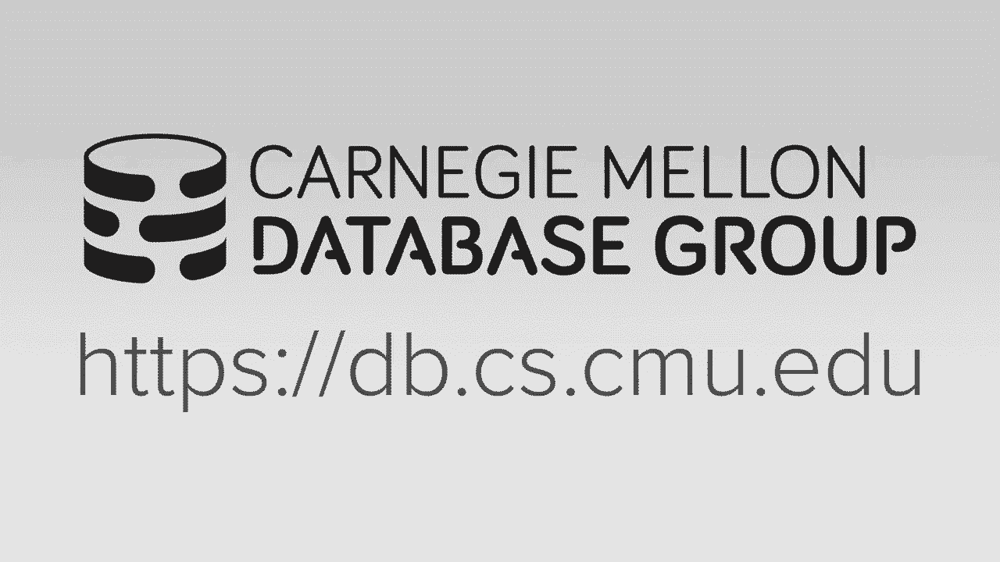

# 【双语字幕+资料下载】CMU 15-721 ｜ 数据库系统进阶(2020·完整版) - P13：L13- 查询执行与处理 - ShowMeAI - BV1wv411w7Ko

[Applause]，[Music]。

[Applause]，[Music]，so today we're gonna get we're，continuing our discussion on now。

actually how to start executing queries，so this is what I showed a few few。

lectures ago just the overview of what a，hypothetical database system will look。

like a high-performance modern database，system and so we've covered you know。

some of the parts down here and the，networking layer and now we're at this。

point here and we're going up in this，direction we're start you know talk，about execution。

Cori execution today next week we talked，about compilation then we'll come back。

and do more query execution and then，after midterm or after the spring break。

will then talk about code optimization，query planning okay so the idea what we。

talked about today is and going forward，for the semester is how to do a build an。

efficient query execution engine and，we're differ this between some of the。

techniques we talked about in a，discounted system because if we're。

entirely in memory then we don't have to，worry about the main bottleneck that the。

disk oriented system had to worry about，right in a disk learning system the goal。

was always to produce disk i/o because，that was always the most expensive thing。

and so now if we don't have stalls，because we're going to fetch disk to run。

our queries now we have on to other，things we got to worry about and those。

that there's the the the bottlenecks，we'll discuss throughout the semester。

and then the techniques I'll be，describing will show you how to actually。

overcome them or mitigate their effects，on on the performance of the system and。

so the we obviously still need disk for，logging so that doesn't go away but it's。

really like when I actually do a query I，can assume that I'm gonna read a tuple。

or read a column we need a block of data，and that's in memory alright so at the。

way it essentially think about what，we're talking about here is it's gonna。

be there's not any one technique we're，gonna do that's gonna be there's make。

everything go better it's going to be，sort of an orchestration or coordination。

across multiple optimizations，and the by combining them together then。

we'll get the efficient execution，performance that we need so the spoiler。

would be just as a heads up compilation，parallelization and vectorization those。

are going to be the big three but，there's a penalty about other things we。

could talk about as we go along，so what are our optimization goals in。

our system so the disk goes away what do，we actually want to care about now to。

get a query actuation performance to be，to be good so the the first one is。

obvious right we are going to be we want，to just reduce what we do when we。

execute queries and we can do this I，predict count that the davison prosecute。

in order to to process the query so we，want to execute fewer instructions to do。

the same amount of work and that's you，know then we'll get better performance。

that way right so the compiler will help，us a little bit like we can pass in Oh。

to typically don't ship database systems，with oh three compiled binaries because。

that it it's not that none that it's，experimental it just there might be some。

anomalies that you may not be prepared，for or can consider Oh two is typically。

people ship software with so the，compiler doesn't help a little bit but。

what we're gonna end up wanting to do is，specialize our database system for the。

cific queries that we're executing again，that'll be query compilation on Monday。

next week but we'll see a flavor of what，it looks like today the next one is to。

reduce the cycles we have to incur when，we execute these instructions so we've。

already done this we've already reduced，our instruction count and so for the。

remaining instructions we do have to，execute we want to reduce the number of。

cycles it takes to process them then I，know how we actually want to do that yes。

she said parallelization not quite，that's the same thing as well that's。

vectorization that's paralyzation but，mmm，cindy will give us this it won't。

necessarily give us this Yassir branch，misprediction is one but also cat。

reducing them our cache misses right we，if we have an instruction that needs to。

touch a piece of data and that piece of，data is not in our CPU caches it has to。

stall and in spend more cycles to go up，to DRAM to bring it into our CPU caches。

so we want to maximize the locality of，the data as we're processing to them as。

well as being intelligent about how we，do our how we have branches in the four。

loops as you process tuples to reduce，the amount of misprediction and then the。

last one is sort of what you guys you，two said here the parallel is 8 and the。

rector ization this is just gonna allow，us to now use the additional cores that。

we're getting on our own our CPUs to to，process queries in parallel right and。

we'll talk about those different schemes，look like today like Moore's law is。

essentially ending a Intel really can't，crank up the clock speed anymore thing。

there are alternative materials we could，use to build our processors laughing。

that don't have that melting point but，we're that's way way in the future。

so what Intel and ambi are giving us，it's just Boris，we wanna execute our query is on on as。

many scores as possible and that's，really tricky because now when you。

potentially coordinator cross done so，paper I have you guys read um with a bit。

more I'm gonna say analytical then what，we'll talk about today but it was what I。

reason why I picked it is because at，FIR，they went through a lot of the。

techniques that we'll talk about today，and just showing you that there's a。

bunch of difference you could do to you，know how to design the system to execute。

queries that was still an OLAP and，that'll primarily be what we'll focus on。

for today's lecture but again they，talked about this difference between。

should I do an in X probe which is，random i/o or，special scan and there's no one answer。

to say when you want to use one versus，the other the main thing that I want to。

get you to get out of it was that，typically in a Discordian system it was。

always the it would always make this，decision about whether dude Enix can。

respond to scan based on the selectivity，of the predicate if I haven't index and，the index。

how many tuples do I think I'm gonna get，back from the index in an in-memory。

world we actually do care about what the，performance of the harbor is gonna look。

like like what the CPU will actually do，when they we execute our database system。

as well as what other queries are，running at the same time and this one。

bit tricky because this one needs to be，you know now we need have the optimizer。

be aware of what else is running at the，based on that，so do you only see this applying this。

technique in the high-end commercial，database systems，like I don't Postgres doesn't look to。

see what other queries are running at，the same time because it's hard to do。

this right because it's like here's my，query I run through the optimizer I'm。

gonna pick what could be running the，same by the time my query comes out of。

the optimizer and starts running those，other queries might be wrong so my。

decisions might be incorrect so this one，is hard to do this one you can you can。

compute in the beginning although it can，vary if you're running on Amazon because。

and you know the even though you get the，same instance type the performance can。

change by I think about up to like 20%，because again somebody else might be。

running on the same box as you all right，so the type of optimizations we're gonna。

apply that they talked about in that，paper as well as some additional ones。

we'll talk about today are just how，we're gonna actually go process the。

query how we're gonna move data from one，operator to the next or where they're。

gonna put you a push or a pull scan，sharing is a technique where you allow。

to two or more queries that are running，the same accessing the same data to。

piggyback off the iterators and instead，of having each of them read the same day。

at the same time you combine it together，materialized views is a way to。

pre-compute some portion of a query，ahead of time and can maintain it as the。

table gets updated so you can use that，for query execution so for these two。

we're not gonna talk about much this，semester I'll try to talk a little bit。

later on but it's these other ones here，that we'll spend most of our time。

because as I said these three here are，when you get the biggest bang for the，buck。

most workloads obviously in some cases，materialized using screen sharing could。

be very beneficial if you have queries，that have a high opportunities to take。

advantage of these things but typically，these things are general-purpose enough。

what we want to do again query，compilation is it's Co specialization。

vectorization what he talked about using，Cynthia instructions parallel algorithms。

Lucia she mentioned is running the，operator in parallel and then we'll。

finish up the animist er talking about，how to embed or how people use yes or。

user-defined functions in queries and，there's big opportunities actually。

basically merge these into the query，plan itself instead of treating as the。

UDF as a black box and you get way，better performance as well so we'll cut。

that that'll be at the end of semester，again these are the big 31 that we want。

to discuss alright so today's agenda，that we're going to first talk about。

what sir modern CPUs look like in the，context of database systems that what。

aspects of databases what about a，diffuse do we need to care about when we。

build our database system then we'll，talk about different processing models。

to how to move data between between，operators and then we'll finish up。

talking about different parallel，execution models the idea here is。

basically how we're gonna architect the，system to support pale execution of。

multiple operators at the same time all，right all right so the over 15 years old。

and 2005 proposing a improved version of，Monet TV which is one of the original。

open-source academic columnstore systems，are in memory Thomas or systems it was。

an improved version of Monet DB where，they showed how existing database system。

implementations were insufficient or not，targeting what modern superscalar CPUs。

look like and that if you redesign the，architecture of the database system you。

can get much better performance if you，write it in such a way that is is ideal。

or amenable to how the CPU actually，processes instructions so the way to。

think about this is most times when，people tell database systems and。

certainly you know that's coming now but，this is very common in this paper they。

look like my sequel and post，showed an orbiter this was the case a。

lot of times when people build software，they build it in such a way that makes。

it easier for humans to reason about，that software of what the actual code is。

actually doing but it turns out the way，that's easier for humans is actually bad。

for what CPUs actually want and so what，they're proposing here is if you design。

the system in such a way that may be，more complicated for mere mortal humans。

to reason about but it's actually better，than for the CPU you already get much。

much better performance，so Mon ADB X 100 was the name of their。

prototype this later got renamed in and，and commercialized as vector wise and。

then act in it's a holding company for，old software they bought vector wise，renamed it to a vector。

they then like killed it off for a，couple years or they hit it on the。

webpage and then every time I taught，this class I would always say vector。

wise is great too bad acne and killed it，off and then like some dude emailed me。

last year or two years ago and said hey，no no it's still around here's the。

webpage where it actually was like they，like the website went out of its way to。

hide where you could actually download，the software it was really bizarre but。

then they sort of came out and rebranded，it now as Avalanche but they're selling。

this as like a that oh that in-memory，OLAP cloud system in the AI runs in you。

know AWS or Azure so previous years the，heavy paper the first part is really。

good the second part is not so much and，it's a bit dated right it's 15 years ago。

so they spend a lot of time talking，about like Itanium CPUs we don't exist。

anymore and they talk about how you know，on Pentium 4s pipelines with like 31。

stages but obviously in in modern CPUs，the stages are much smaller like on like。

as of like 2015 or when husband，Broadwell came out it was like 14 stages。

even up the latest one like copper lake，from intel's like I think nineteen。

stages or no copper like it's 14 stages，the AMD Rison is 19 stages so building。

your system such a way to deal with，these really long pipelines and the way。

they describe is not it still matters，but not to the same extent of it they。

did back before the other reason why，this paper is also super interesting is。

that multi-year bonds and Marcin，Szarkowski Peter bonds went back to CWI。

and he's working on duck TB now Marcin，basically went off off and co-founded。

snowflake and a lot of snowflakes，designed is based on what what how dr。

Weis laid out the system right so it is，although vector wise is not that。

well-known certainly snowflake is super，well-known now and it's it's you know。

it's it's the rightful successor of dr。wise okay so this is gonna be a crash。

course on in two slides of like，everything you know about CPUs that。

matter for for databases right so as I，said a CPU as wheat is v is going to。

execute instructions in terms of these，pipeline stages I and look as I said the。

Intel CPUs have 14 pipelines or 14，stages and the AMD has has 19 right so。

they're not in the hundreds it's it's，pretty short but the end the idea is of。

these pipelines is that it's gonna allow，the CPU to try to be busy at all times。

but I type line on different parts of，the CPU so that way if one instruction。

is it has a catchment it has to go out，to D Ram to get some data that needs to。

process but at that same cycle to see，you can actually get an instruction that。

maybe has data already in the registers，that it can execute efficiently so it's。

gonna allow us to execute to hide all，the delays from these from these cache。

misses and but it's and it's gonna do，this by executing the instructions out。

of the order in which they were it into，the pipeline so what that means is like。

when you write your code the compiler，turns it into CPU instructions the。

machine code it processes that stream of，instructions allows them to the pipeline。

the CPU may not actually execute them in，the same order that they were defined in。

that stream and that they're gonna track，unreal things like dependencies to know。

that the output of one instruction is，used as the input for the next。

instruction it has to make sure it，executes in the correct order so the。

again these are called super superscalar，CPUs and so because we are aware what，gonna。

try to build our database system，execution engine where we actually。

process tuples cuz that's the most，expensive part in such a way to to。

mitigate problems that can occur when，there's mistakes in visions that the。

that the harbors gonna make so the first，problem is going to be dependencies and。

this is what I said like if you have a，instruction that that the input of that。

instruction depends on the output of，another instruction the CPU can't。

execute the second one first it has to，wait to the first one finished it before。

it exits the next one so there really，isn't that much we can do in our。

database system to avoid this right when，you think about it like you know if I。

need to go scan a tuple and the output，of that tuple is then fed and put into a。

buffer I can't put that data into the，buffer until I actually do that scan on。

the two ball all right so can we there's，not that much we can do to avoid this。

problem the one that we are gonna try to，avoid is is when we have branch。

mispredictions so in addition to，executing instructions in a part of，executing and you know multiple。

structions in the same in a single cycle，when it sees a jump statement rat like。

to jump to a branch based on some，conditional rather than waiting to see。

what that condition will actually，evaluates to and then determine whether。

you go you know inside the if clause or，go go around it it will actually try to。

predict what what path you're gonna take，and start executing those instructions。

that that are followed in that and that，conditional and then if it gets it wrong。

then it has to throw back throw away，everything it's already done and then go。

back and refill the pipeline with the，correct path that it should have gone。

down if it gets it right and this is，fantastic right we basically did。

speculative execution and assume that，you know we were to go down this branch。

and we got it right and all the work we，did ahead of time is actually useful for。

us all right and again this is law it's，gonna reduce the number of cycles that。

take to as we process queries so how the，CPU actually does branch misprediction。

from our perspective if people build in，the day to day system we don't know we。

don't care and actually unless you're，like working at Intel AMD you're also。

not gonna know because this is like one，of those secretive parts of the database。

system or the CPU right the simplest，thing you could think of is like if you。

recognize you see a branch and you've，been down that branch before you just。

take the path at the last，you ever took right that's the easiest。

dumbest thing to do but obviously in，these in Intel AMD AMD they're doing way。

more complicated things and what we're，actually doing is is is a trade secret。

all right but we don't care what，actually is we just we know that there。

is something that's doing branch，prediction and we can design our code。

around it yes yeah so this question is，like is this part of the problem people。

were hitting with like that in the，specter or the meltdown stuff this is。

part of it yeah yeah okay as they said，because they have long pipelines the。

CPUs can start executing specular，branches for us and again the reason why。

we want to do this is gonna hide the，stall okay we think we're gonna execute。

this let's go ahead if I get it then，things are fantastic and that'll reduce。

my cycle count per instruction so we're，we're gonna hit this the most is for。

analytical queries is as we start，scanning tuples we have to evaluate。

predicates and our where clause to，decide whether to put something in our。

buffer right as the output for this，operator and that's just an if clause。

right so now if I have a billion tuples，in my table and I'm doing a complete。

sequential scan on that table I'm gonna，have a billion branches I have to。

protect potentially predict on in my CPU，and now when you think about it too。

unless I'm pre sorting my data like，Vertica the data could be completely。

random as I do my predicate you know for，all my attributes when I do my predicate。

evaluation so the c2 is happening have，no way to actually predict what branch。

are actually going to take because the，the probability that you're gonna take。

the same branch as you did the last time，depends on what the data actually looks。

like and the selectivity of your，predicate so in a modern c++ you can。

actually so we'll see in the next slide，how to design our data system to to。

avoid this in super those twenty you can，pass a hint to the compiler called。

likely and unlikely when you have like，if calls are a case statement we even。

say that I'm not likely to go down this，branch or I am likely to go down this。

branch so you could imagine if you're，doing koujun which again we'll talk，about it on Monday。

you could start inserting these things，if you know your predicate is not going。

to be selective and that's what most two，boys are I'm not gonna get put you know。

I get satisfy the predicate and put me，up a buffer you can inject these things，not gonna happen。

but even then the cpu actually can do a，pretty good job in that case if you're。

not very selective log it can still do，really well just do some of this this。

came up with project project one，somebody was asking about this about。

branch mispredictions I just want to say，there's a way to do this in school those。

20 to make this happen I think modern，GCC and there's a intrinsic we make this。

happen in modern C not in GCC and clang，they don't have exact keyword but you。

can force it to do this as well all，compiler then I think gives there's an。

instruction I think in x86 to tell，before the conditional in the actual。

assembly or the instruction stream to，say like I'm not gonna I'm not like any。

great down this path it's a hint right，all I said was likely I'm not saying。

like what for some probability the CPU，may or may not take that into。

consideration and what it actually does，when it sees this hint only in tonot。

right all right let's say yes let query，us when we have two predicates where key。

greater than equal some low value and，key less than equal to some high value。

so normally I tell my PhD students don't，show code and slides but for this for。

this example we have to see some code，but it should be pretty simple to to。

understand so a really simple way to，implement this that select query is just。

a for loop on every single tuple in the，table go grab the key you want to bow it。

over we're calls and then apply our，predicate right if he's graduating too。

low and key less than equal to high then，we're going to copy that tuple into our。

output buffer increment are all set in，the output buffer so that was we come。

back around you know we can sort the，next table right so the the bad part of。

this about this query is obviously this，if clause，because as I said the unless the key is。

you know gonna be almost always the same，value then then like it could be。

completely random whether I'm gonna go，down this path or not and and the CPU is。

gonna have a hard time actually，predicting whether to do this or not。

alright and if I you know I could put，likely or unlikely but again that's just。

a hint and it's and it may not be，represented what the actual data is so。

this is how to do this scan using，branching we can rewrite it though to do。

a branchless scan where we're still，going to iterate over every single tuple。

but the very first thing we do is copy，the tuple into the output buffer we。

don't evaluate the keys we just say we，just copy it and then we have a little。

two ternary operations here where we go，do a comparison of the keys。

based on our where clause predicate and，what's happening is if the predicate。

matches then we at we have a one if it，doesn't matter zero，and the two things together and that。

then tells us whether it's a one or，based on that that's gonna tell us。

whether we increment our counter or not，so that if these both therefore zero。

then the offset will be zero when I loop，back around when I come I'm just watchin。

it and then I need some code down here，to make sure that goodness that last one。

didn't match that I don't include that，my offer right but for simplicity I'm。

not doing that here so what's gonna，happen is even those look like these。

conditionals pause the beam operating on，energy directly the time and write the。

arithmetic operation right what is that，I turned this into like keep my you，check but it's。

check the actual bits using bit，operators to see whether it's zero or。

not like we can rewrite all the more，instructions that do just just do the。

math right so this seems like this would，be terrible because for a billion t。

blows I'm copying all 1 billion of them，and in this case here I'm only copying。

the ones that actually match but again，depending on the selectivity of the。

predicate and what our data looks like，this actually might be the better。

approach the graph later perfect and a，scan on a table with the branching and。

the branchless version of that scan as I，showed before and then the x-axis is。

varying the selectivity of that，predicate so over here when the。

selectivity is low meaning most tuples，are not gonna match like when no tuples。

match the branching one actually，performs the best because again I'm。

checked my conditional and it doesn't，match so I'm not wasting instructions。

doing the copying furthermore the CPU is，gonna predict like the last you know。

this almost every single tuple is never，gonna match that if calls so it's gonna。

predict to go around it and not do the，copy as well but opt around 5% then it。

actually starts doing worse than the，branch list case so the branchless one。

is a flat line because no matter what，what whether the predicate evaluates are。

true or not I'm always paying that，penalty to do the copying right so。

that's why it's almost a plateau，straight across and as you can see up in。

here when it's like 50% selectivity 50%，of the tuples are matching 50% of them。

aren't matching that's the worst case，scenario because that's the CPU just。

can't predict this at all and only when，you get down here 100 matches that does。

the question is so you're saying this，this graph would look different if you。

change the memory bandwidth speed or，that well I mean like leave the memory。

of what for the scan yeah so like I have，yeah but think about it like coming back。

here like I do this copy right，if I come back around if this does I do。

a copy the tuple doesn't match I come，back around when I do the next copy I'm。

overriding the last place I copied into，memory and that's gonna be sitting my。

CPU caches anyway the transfer what do，this copy is this is give me a CPU，caches right。

I've read the two but I got to bring in，my cache right I got to do that for both。

of them now I do this copy that's，running from one cache location to。

another cache location probably gonna be，an l1 right I mean it's it's the next。

instruction after this I bring the tuple，my cache then I copy it and that's。

running to another cache location then I，loop back around and the the yes by the。

time I come I do this and come back，around and I do another copy it may be。

the case that the like if I'm，overwriting the last one I copied that。

location got flushed my CPU cache maybe，gets flushed from l1 but I think I'm。

lucky to get flushed from l2 l3 right，this is a tight loop there's nothing。

else we're doing we just evaluate this，one predicate there's no guarantee。

because we can't control how the caching，policy of the CPU x86 you can give it。

yes this point which I agree with him is，that I I don't know what other。

optimizations the CPU could be doing，here sorry the compiler could be doing。

like it could unroll the loop so it's，like four copies and then a bunch of。

these things and come back around but so，again so this is what sisters research。

and we see so the hypothesis is that，when branching when most tuples don't。

match the penalty of paying that copying，is it's not worth it because you're。

you're doing the second instruction，maybe didn't need to write so I so I。

agree with you that there's a lot，there's a lot of other things that could。

be happening here that the compiler，could be doing but we leave like we can。

verify that this is actually working out，correctly we think it is based on these。

results yes yeah so his question is this，works fine if if you're doing a table。

scan because you've just been a rip，through continuous regions of memory。

there's a memory prefetcher that if he，knows were accessing things that are。

squinch alyttle bring those things and，reach out cache misses so we get a lot。

of benefits from scanning columns if，it's an index scan there's not much I。

can do as I probe down other than maybe，prefetch in memory but once I get down。

the leaf nodes and now I start scanning，along the leaf nodes am I gonna get the。

same kind of benefit if I do something，like this for data in the same node like。

if I'm very cheap was in the same node，and I don't have to go maybe look at the。

at the the the remaining parts of the，tuple like if so if I have my key my。

index is based on this key but then，there's also another part in the where。

clause that touches another attribute，where I gotta then go look at the tuple。

then this probably is a bad idea or this，probably was not gonna be as a big of a。

win but if I'm just looking at what I，need exactly in that node then then I。

for what Claus yes your question is if，you use the likely in this case here so。

like if our selectivity is 50% so likely，and unlike he doesn't help us here so in。

that case could the compiler then，rewrite the code or do what it's。

basically like if I had if then else，you're saying like do I get any benefit。

from say the else clause is the one，that's most likely to happen should I。

should I flip them I do whatever the the，the boolean logic to reverse this so。

that the first thing that comes out of，the if Clause is the likely one I。

yeah yeah I see your point yeah yeah III，actually don't know yeah actually a good。

wellyes applies to a statement to allow，the compiler to optimize with the case。

were passed that execution including a，statement I'm more looking to more。

likely an alternate path action that is，not in such a statement so yeah maybe I。

mean this is not very documented but，maybe just maybe this is how they this。

is what is actually doing correct yeah，yeah so his point is if you know whether。

you're gonna go down one branch or not，you can make a decision about whether in。

line or not yeah I mean compilers are，hold another beast it's not yeah what。

about a magazine article pilot expert，will talk about compilers in the context。

of databases in the next class like，things that we that's a good point。

okay so the other thing we want to try，to also avoid it which is the first part。

we talked about of having a lot of，instructions you you know use more。

instructions maybe that mean necessary，the x-rays again if the if we design the。

system to be sort of general purpose a，lot of times what you'll see in these。

databases are these giant switch clauses，that that as you start evaluating。

predicates or evaluating tuples for，every single type of data your your。

dailies can support you have these which，call switch calls listen I have an。

integer and I'm adding it with integer，do this if I'm adding it to a float and。

do that all that at inches all that adds，you know misprediction that's gonna slow。

us down and it's just you know it's more，instructions to actually you know。

evaluate the conditionals and decide，whether what our type of data is and so。

I we need to share this a table before，but this was an intro class if you go。

look at the Postgres source code of how，they handle numerics like the fixed。

point decimals this is just the function，to do add write to add to numerix。

together and you see there's all these，if causes like if it's if it's negative，it's positive。

if one you know if we're taking the，absolute value of something break all。

this is problematic because this is a，lot of instructions and a lot of chances。

for the CPU to get this wrong so we'll，see this again on on Monday next week of。

how to specialize our specialized code，Oh for what you need for that one quick。

and this is called cogeneration or，just-in-time compilation all right so。

now we said we know how to we know what，the CP is going to look like and we want。

to know how we want to design our，operator implementations to be mindful。

of it now we're going to talk about how，we're going to organize the system to。

process the queries which comprise on，multiple operators so last class was。

talking about how we actually scheduled，but the tasks that that X P of these。

operators but now we're just talk about，a sort of a higher level con so they're。

gonna be different trade-offs we're，gonna make depending on what type of。

workload we're gonna want to want to，support like OLTP transactions there's a。

left analytical queries so there's the，most common one the general-purpose one。

the iterator model materialisation model，oh and a vectorized model so again the。

spoiler would be that the in a modern，analytical system we're gonna want to。

use the vectorized model because it in，pass comment being we can pass you know。

chunks of columns between operators and，then use cindy instructions inside the。

this is some of the volcano model or the，that came out in like the late 1980s。

early 1990s in addition to defining the，exchange operator which I'll talk about。

in a second there's also the volcano，query optimizer，which we'll cover in a later in the。

semester which then was the the，precursor to Cascades which is another。

optimizer optimization scheme and I'll，talk about like this the the Gertz graph。

II was also the guy that that did the，the wrote the the modern be B plus tree。

book that I sent you guys for the first，project that's the guy's does amaze me。

stuff it's very influential so in the，iterator model the way we're gonna。

implement it is that every single，operator is gonna implement this this。

next function and what happened when，someone calls neck on that operator it。

has to then return back one tuple and it，could and since we organized tree that。

that operator needs data from its，children it，next on children and that sort of。

cascades to the bottom or you have the，access methods where you're retrieving。

the data from the table or an index and，then we we move the tuples up all right。

and essentially just we're gonna keep，calling next next next next at the at。

the root and keep getting tuples and we，get output for it for for our cursor。

until at some point we get it a good，response and say there's no multiples。

available to us so at a high level it，looks like this so say we have a two-way。

joint on table R and s and so for every，single operator we're going to have this。

little for loop that typically it's，gonna iterate over some some input data。

that it's getting either from the table，or from its children and then admit them。

up so again think of these is just the，next function so will my child up here。

the first the route we call next on our，own a child we come down to this next。

block and it wants to do the join so，it's gonna iterate over its left child。

come down here and say give me you mean，the next two but you have and this will。

send back up a single tuple and we keep，doing this until this is finished till。

we get all the tuples and we build our，for loop，call next on this child and then it's。

just the same thing it starts moving，tuples up to from the s table then do。

our probe in the hash table and then，anything that matches gets shoved up，okay yes。

so so we're not that's we're not there，yet so this is like that would be like。

how do we one of the CPUs doing when the，processing think of this is like there's。

some place that you think a one thread，calls next on the route that calls next。

on this child right and there's one，instance that's iterating with this。

tuple but I said it's a blocking call so，when I call next this is not processing，this is waiting。

okay so fusion almost every single debut，system you've ever heard about the。

advantage of this is that we're gonna be，able to do pipelining meaning like in。

this case here for as we emit a to best，ride that way all the way because。

everything we need to nor the process a，single tuple is available to us at that。

point of time when we do it we're，calling next right I can take this to。

chuck here or the predicate put the，probe for the hash table and that that。

matches then I show up here and do the，projection and then I can produce that。

two boys my output so that's considered，a pipeline the fact we take one tuple。

and ride it all the way up into in this，case here the output of the query or if。

there's a pipeline breaker or we can't，go any farther then it gets buffered up。

there so that's the rest area so some，operators are out the block until they。

get all the Cho to emit all their tuples，and the other finish you get from the。

iterator model is that output control is，really easy because we don't the push。

down any logic to do limits necessarily，because if I know I only want to get 10。

to poles as for my query then I just，call stop calling next on the route once。

I get 10 to poles I've seen everything，and so down here this is just this is。

just a sample of the of the of the，databases that use this approach like。

these are ones I can confirm by looking，at the documentation or looking at the，source code but。

[Laughter]，the iterator model it's the canonical，way yes compilation this is again this。

is different than compilation this is，orthogonal this is like you just do do。

compilation right I could still take all，these four loops，pop and run it and that would still be。

using the iterator model in the case of，hyper they're doing they're still doing。

this and that's another thing we need to，talk about as well like this is a this。

is a top-down approach meaning I start，at the top and I sort of pull tuples up。

the reverse of this would be a push，approach we start at the bottom and you。

have this for loop and start here rather，than here and you start emitting tuples。

up hyper does that most systems do the，top-down iterator model that's in those。

common one yet that's next next awesome，yeah，I realize it's like it's like kind of。

lame for me to give this lecture and，like oh yeah here's something cool next。

alright so the other one here is that，rather than having an X where that only。

gives back a single tuple I'm gonna have，every operator all the tuples that is。

ever going to produce all at once and，then shove that to the next operator and。

again I could be either doing this down，like you call you know get nax or next。

and then instead of getting one tuple，you get a you get everything all once or。

I could push it from the bottom up like，run run the operator get the output and。

then put shove it up to the next guy，alright so in the materialization model。

you can either do material as an entire，row or a single column like if you're。

doing analytics it doesn't make sense to，materialize the entire all the。

attributes of a tuple in your output，buffer if you know that you know most of。

the most of the table most of the query，is not gonna need those at columns at。

all or all the rest of the queries that，means the comments at all。

and so this big same thing you need to，be a comm store or a row store and do，this so going。

instead of having the next function we，just have this in every single operator。

now we're gonna allocate an output，buffer and then we just keep filling it。

up with tuples that match and then when，we're done we shove it up。

so again super Mike from the top down I，call output function on this guy he。

calls the epitope function this guy he，puts all the two plus if he has in a。

buffer puts it on this thing now he can，iterate over this this output buffer and。

build out his hash table and then we do，the same thing for this other one here。

and we shove data up alright so in this，example here this is this is this is。

like the this is a naive implementation，this is obviously really stupid because。

for some of these things I actually can，combine together what the operator is。

actually doing right so in this case，here what am i doing up I'm scanning the。

table s putting all the tuples in table，s into my output buffer then passing。

that output buffer now to this operator，which is just going to iterate over that。

and if I with my predicate so a better，idea was obviously just combine these。

two operators together so I do that one，scan as you just do scan the table。

evaluate the predicate and if I see the，match then I put in my output buffer I。

and you could do the branch this one or，you could do the the branching one and。

it depends on the implementation so，although this seems like in the naive。

example this seems really stupid you，don't want to do this like there are。

optimizations you can do to make this go，faster and you do other things like if I。

know I've have a limit clause of above，and I only want two n-tuples I could。

push that down and eat it as well all，right so is my opinion that the。

materialization model is the best for，for quality workloads because these。

operators are these queries only want to，touch a small number of tuples at a time。

so the size of the output buffer that，I'm shoving up to the next operator is。

it not going to be that big go get an，ease account record on as Amazon you。

know Amazon's website that's one tuple，that I mean need to move from one hopper。

to the next right and we're gonna，benefits because we call the operator。

once we call that output function once，we get all the tuples we're ever going。

to need for the operator we never go，back to it again，and we shove the data long and that。

reduces the number of function calls，which are going to be expensive because。

those are jumps in our instruction，stream that the see us execute so for。

only I think this is this is the right，way to go and then when we built H door。

which was then commercialized volte B，this is how we how we did it Monay DB。

did it as well although they're trying，to do this for analytics and so there。

was a bunch of papers that they had to，come up with to actually overcome this。

issue of like trying to materialize all，the data at once in memory high-rise。

originally does as well there's a German，academic system the old version of this。

approach the new version does not they，rewrote it to do the vectorize model and。

then surprisingly I think this is true，Teradata does the same thing but they're。

like a massive scale you know parallel，data warehouse so they're running OLAP。

queries so they have a bunch of crap，they have to do to do bunch of push。

downs as much as possible and basically，inlining operators within each other to。

avoid having to you know move data in，wholesale from one you know one no to。

the next I need to double check this but，well，surprising because you know well tear。

data was designed in 1979 so it's before，sort of the vectorized model came along。

alright so the last one is this，vectorize model so this seems sort of。

obvious to us now but like before the，x100 paper from from peter bouncing and。

marcin marcin people just didn't build，database systems this way they either。

did the materialization model or the or，the the iterator model so with the。

vector prize model is basically like，iterator where you have this next。

function and put obviously instead of，sitting sending a single tuple which。

would be expense to do if we have to，scan a lot of tuples all at once we can。

send a batch of tuples and the size of，the batch is going to depend on what the。

harbor is gonna look like depending on，like whether we can be operator we're。

gonna feed it into is gonna be able to，do vectorize execution right on sim DS。

so if you know the size of our senior，editors we can then make decisions of。

how big our batches shouldn't be so，going back to our example here now。

slightly more complicated we still have，our next function but now when we call。

next instead of getting back，a single tuple we're gonna get back a。

batch of tuples and then inside the，kernel here when we do our for loop we。

could do you know vectorize instructions，to execute those things and in parallel。

efficiently take that batch apply all，the predicates with a single sim you。

look at the same thing now for the other，side so this is ideal for OLAP queries。

again because we reducing the number，invocations per operator for moving。

tuples around from one Operator to the，next in such a way that we can execute。

vectorize instructions very efficiently，most date and a little database systems。

built in the last 10 years are gonna，follow follow this approach so see both。

server and db2 and Oracle if you just，get the regular general-purpose row。

store version of these database systems，it's all gonna be using the iterator。

model but then they have the specialized，execution engine is like the fractured。

mirror stuff we talked about for Oracle，db2 has this accelerator called blue。

right these are all sort of these，standalone copies of data that have。

vectorize execution models and they get，better performance cockroach DB is。

actually not and surprisingly they have，a blog article that shows that they have。

a vector engine and then in our new，system that we're working on here。

everything's effect threads as well ok，yes question is is the size of the。

vector aligned to the same knee size in，our system it's a line to the seamy size。

but it's not going exactly the same knee，register size so like if you're if。

you're simi registers are 512 512 bits，it's not like you want to pass around。

only five and twelve bits you would pass，around maybe like like ten chunks that。

are each five and twelve bits so they，like you can take a chunk within that。

vector and then do the vectors execution，on it and typically the way that works。

is and that's what we do in our system，when it when you turn on the database。

system they go read information from，from the CPU like would your assembly。

register sizes where your cache size and，then you can make a decision how。

had a had a size things up that way it's，usually just heuristics okay so I。

already said this before right there's，yeah I'm sure all my examples I was。

showing top to bottom but you can，actually go bottom the top all right。

this one is the most common because this，to people you know this is like the。

textbook implementation of how people，vote database systems the paper you'll。

read for next week from hyper shows that，you actually want to use a bottom-to-top。

approach because now you can be very，careful about how you organize the code。

for the extra queries so that within，your pipeline you're not just riding up。

values from tuples within your CPU，caches they can go even more lower-level。

and try to control things like so they，remain the CPU registers because that's。

gonna be even faster than then the cache，l1 cache in our old system which was。

that we have this technique called relax，operator fusion which I'll cover in。

later lectures but this is actually now，in our new system as well the idea here。

is that we're trying to combine the the，bottom-to-top approach with vector is。

execution and we're trying to get the，best of both worlds as hyper in vector。

wise so we're trying to pass vectors and，do bottom bottom to top and need to be。

careful about where you sort of put your，your buffer boundaries so that you can。

stage things in a certain size so that，you can pass things along and that can。

fit in steeply registers sort of what he，was saying and it may not always be the。

pipeline breaker point it may be points，within within a pipeline I think I will。

cover that more later on this buster，all right so now let's talk about。

regardless of whether we're doing a，materialization you know what processing。

model were using we can talk about how，we actually run parallel queries so。

we've already talked about how to do，inner query pedals in before but that。

was the scheduling stuff we talked about，last class or we talked about well the。

idea here is this we're gonna allow，multiple queries to run at the same time。

and so you basically have a you know a，scheduling mechanism to decide you know。

what tasks for what query runs hyper，original just had it we can only run one，query at a time。

when that query is done then you switch，to the next one in the new system they。

don't do that and most，you don't do that right because you you。

want to have the system be responsible，as possible so sometimes you have like a。

fast Q fast query Q and a slow query Q，so the different techniques and then we。

use concurrent role to protect the the，data if queries are updating things so。

this is a conjecture of mine I can't，prove it but it's after I thought about。

for a little bit I don't think that，there is any difference in in the。

complexity of implementing a different，query processing model the complexity。

doesn't change if you're using different，control schemes meaning like if I'm。

doing two-phase locking or OCC it，doesn't matter whether I'm using the。

materialization model or the the，vectorize model I I think they're。

they're they're isolated from me from，each other enough that it doesn't。

actually really matter because a my，access method want to go that's tuple。

that's when it goes and check to see，whether I can actually read something or。

not whether it's being held you know，something else lock on it and all that。

doesn't matter if it for this alright，well we care about though though is。

intro query parallelism and that's how，we take a single query and now X key to。

all its operators in parallel again the，scheduling stuff was last week this is。

how we assign these tasks to cores now，it's basically how do we then organize。

the flow of data within our query plan，so that we we can determine whether one。

task is allowed to run yeah run yet or，horizontally crossing the crepe and，vertical pair。

I can have different parts of the query，plan execute at the same time again I。

need to be mindful about what data，dependencies I have between these。

different tasks to determine whether I'm，okay and again although I'm laying out。

as he approaches it's not like either or，you can actually combine these these two。

things together you can do parallelism，and vertical piles and together as。

within the same query there also be，within every single operator there also。

be a parallel version that we can use，execute the query，all right do that operator and that's。

what books aren't covering next week or，they're my parallel joins in sorting but。

Twitter's our operators then are，instantiated into or as separate。

instances and they're all good they're，gonna perform all the instances of the。

operate are gonna form the same function，just on different pieces of data this is。

the more some of it last time break my，table up into horizontal motions and。

then the different instances are gonna，run through different different。

partitions at the same time so to，coordinate now these different instances。

running the same time is they basically，another way a breakpoint in our query。

plan so that we can recognize that we，can't proceed up into the query plan。

until all the operator instances below，us produce all the tuples that they're。

supposed to produce there's a wait again，for us to organize the query plan and。

keep track of internally whether you，know whether one set of tasks of。

operations are allowed to run or not so，say we have simple query on beam so we。

can take this scan on a and we can break，that up into different operator。

instances and each of these guys are，gonna run on us and in a separate worker。

and then now because I want to do I want，to find other operators within my。

pipeline I can also do the the filter as，well so take the output of each of these。

scans and feed that immediately into，this filter operator to then remove。

anything that shouldn't be there but now，also I can do other organizations like。

if I have this projection up here that，shows me that i only need。

I only need eight hid for my query and，say this a stable a has a thousand two。

pools so rather than me copying a，thousand tuples up from one operative。

annex I can actually push down now make，a copy of the projection here to filter。

out everything just the except for a I，do I need here so then now they're gonna。

do the for the join they need to build，the hash table and I'm not declaring。

whether this hash table is a single hash，table or whether this partition it。

doesn't matter but I know I can't now do，anything on this side I can't start。

scanning B and doing the program in the，hash table until the hash table is。

actually built otherwise I could get，false negatives right ID look up and say。

it is my hash table contain this key it，should but I just haven't gotten yet I。

wait these brought before proceeding，with the next one so this is what the。

exchange operator is doing for us it's，basically now a way to coalesce the。

results from running from these，different tasks running on different。

workers and keep track of I can't，proceed until this is done then now for。

for this on this side right I'm doing，the scan on B same thing also do the。

filter do my push down my projection now，I probe my hash table in parallel right。

and each of these guys are gonna produce，an output but to make sure that I don't。

produce the final result of the query，until they've all finished I add another。

exchange operator up here just knows，that I'm waiting for three threads to。

give me all the results and then once I，have everything then I can show up the。

output to the two up above right so now，my example here I put the exchange。

operator up after we build the hash，table this is on a bottle we definitely。

we definitely need this but I could have，set the query up such that I have a I。

have an exchange operator here where I，do the scan do the filter do the。

projection and then all my my my，operator instance tasks start filling in。

an output buffer in this exchange，operator and then once they're all done。

and that's all done then now I can flat，have the theory the queries blast the or。

do the join and produce results so，there's different alternatives to doing，on。

what the dista tends on the selectivity，of the predicate attends the selectivity。

of the join clause the datum could try，to figure out what the right way to do。

this is or there's not one plan that，works for everyone all right so now for。

inter operator parallelism the vertical，parallelism the idea here is that we can。

overlap now different operators running，at the same time we can still have to。

use an exchange operator to keep track，of whether you know a operator instance。

a set of operator instances have，produced all the results or so to。

produce but instead of you know doing，one and then you know a bunch of work。

and then switching over to the next one，I could have a thread start processing。

data as it arrives from the query plan，below it and do it in parallel right so。

this is sometimes cut line parallel，meaning I'm running the pipeline's in。

parallel so say I'm doing a Cartesian，product across four tables I join a B。

and C and D with no no--don't calls，right but you wouldn't actually do this。

but here it is right and so the query，would look like this where I can now run。

the a and then B and do that in parallel，but it says I know I can't do the the。

remaining join on on the scene D output，until that until this is all done then I。

put my exchange operator so what will，happen is I could have one thread do the。

join on a and B fill up some output，buffer here right and then which mean。

building out the hash table as well then，another thing I can do that join and C。

and D but then once and then as these，guys are and for the person the join。

result got this thing nap time，right，because in this case here there's no，where clause。

there's no join clause to determine，whether something to match or not so I'm。

doing Cartesian product so I want to，take any tuple that comes out of C and D。

and mashed-up fit any tuple that matches，with a and B so I don't need to wait for。

these guys technically the fairness they，can search shoving all the data out in。

parallel and have it you know certain，start computing the rest of the joint as。

well right okay so to finish it real，quickly the theme we can really talk。

about too is also like how to determine，the number of workers we're going to use。

we talked a little bit of a little bit，about the last time of how we want to。

organize the sort of the sketching，mechanism but we never really decided。

okay well I had this number of cores，haven't and this number tasks how many。

workers should actually use and as I，already sort of alluded to in that one。

example with the with the horizontal，parallelism it depends on what the the。

data looks like what the selectivity of，the predicate is and how much output。

data I'm gonna generate so one simple，way to do this you can in the case of。

hyper you just have one worker per core，and you just pin them to the core that。

they're actually running and then，another approach is you have multiple。

workers per core which is the Hana，approach and the idea here is that if。

one one worker ever blocks then we just，you know we let other cores run run。

threads run in the cores at the same，time right the last thing to talk about。

again is this that is is I think we，already cover this last class actually。

the push versus pull yeah actually we，ignore this this is just the sketching。

stuff I don't know why this is here，sorry this is just saying that like in。

the case of hyper I was pulling from a，from a global queue whereas in the case。

of Hana I was pushing things into the，queue and then the threads had to take。

down right all right so to finish up so，the as I said today it was seen as more。

on Monday the easiest way for us as，humans to implement parts of our。

database system may turn out be the，worst way for the CPU to actually。

execute this and so if we're aware and，what the harbor looks like how it's。

going to behave we may not know exactly，how that's gonna be but we at least be，mindful of it'll look。

we can design the execution code for our，data system to be optimal for with the。

Harvard with the CPU actually once and，then as we see in today throughout the。

rest of the semester the it's my opinion，that vectorize the bottom of execution。

approach will be the best way to always，exit olaf lab queries for OLTP it'll be。

bottom-up materialization but most，systems that a lot of times like you。

think like Postgres my siegel db2 oracle，all of these are sort of designed to be。

general-purpose systems and that's what，the iterator tries to be like instead of。

why is it matter of Bodmin for the，top-down fewer of function calls right。

so like for bottom up in the，channelization model i I called the。

operator the execution function for that，operator it runs produces some output。

take that output now call the next，function on on and so forth right if。

you're going top down it's like call，this call this call this I guess this。

stuff is still the same for，materialization it doesn't matter for。

vectorization yes yes he's right it's，its inner execution is that of a crisp。

execution and then when you have like，the the as far as my understanding is。

the best code you can have for compiler，if it's just a bunch of no conditionals。

everything's sort of one instruction，after another because that the hot the。

compiler can look event holistically and，make better decisions okay you have a。

smaller cross leg as well yes that，typically is not gonna be an issue。

query plans but it's like put like like，the call stack you know it's not I mean。

yeah but I can't imagine is gonna be，like a million function calls okay like。

even operators in query plan that that's，the onion door I can't even example like。

that that's a the query can't be big but，like the theme no one's doing 1 million。

table joints I think the the highest，number solve was from I saw a talk from。

Hana people recently where they had one，query that was doing a join of 1，500。

tables it's a lot but it's not a million，so it's it's a it's not gonna be the。

call stack I don't think it's me bad bit，alright so again I I realized again I。

keep saying oh well cover this on Monday，we'll cover this in one day so the。

compilation stuff which is stuff on，Monday I that is is the paper meeting is。

from the hyper guy and I'm saying god I，finger ler like Thomas Newman he that。

system and wrote the paper by himself，which is crazy and it's it's a bit dense。

because it shows little of all L of M，bar which you don't need it for yeah。

there's any idea what they're doing，organize the query plan is such a way。

that it's ideal for the compiler to then，generate CPU efficient code is what the。

main takeaway should be okay question，this question is should those data。

points for Cindy instructions again will，cover Cindy in way more detail we'll。

have to do two lectures on it question，is for Cindy instructions do the data。

points you want to put into the same，instruction do they need to be。

contiguous so the way it works is，there's there's a there's a vectorized。

register and you have to do loads into，that the the data you're loading in。

doesn't have to be all you have to put，it in application it actually continues。

memories he PU cache and then write that，in I don't think you can do like load。

multiple times from like different，locations so if now the data is in。

different locations in memory you have，been copying into a single location then。

copied it but I think about if I'm，trying to do a scan on a column and。

apply a predicate into the vectra's，instruction it will all be contiguous。

for me yes yes so he said there's a，scatter and gather CP instruction for。

this I don't know one of them is，implement where I forget which one I。

think it's the gather a might like as，I'd like to 2019 2020 maybe it is there。

was a period where like gather had to be，implemented through multiple。

instructions and it did that for you，yeah we'll cover all that as well yes。

yes yes so I don't know what share，screens so a shared scan is if I have。

two queries show up at the exact same，time and the boat accessing the same。

table it's it's a bit more tricky and in，memory system this is why they want to。

cover it like for disk based system but，most expensive thing is going fetching。

the page so even if you and I are，running the same time but we have。

completely different predicates if we，can share that disk i/o to go fetch that。

in and then we take a copy of the table，or the block and do our predicates。

separately then that's a huge win for an，in-memory system，oh I'll still get some benefit of maybe。

having locality bring it into my CPU，cache like that'll still matter。

put the overhead of coordinating the the，different predicate at the same time I。

think is tricky like sometimes you can，do things like I think the Hana guys do。

something look like this like if my my，query is like we're we're a equals。

equals one and your queries where a，equals two they would then convert that。

to where a in 1 comma 2 and apply that，predicate at once and then the output of。

that we both get and then we have both，have to then apply our additional。

predicate to get what we really want so，there's tricks like that you can do I I。

don't think it's that common for enemy，systems because it really requires that。

was like pinpoint precision of a query，showing up at exact same time that can。

right yeah yeah so his question is so in，a disk based system for scan sharing or。

one technique to do is if if I need to，do scan on the table but I have a limit。

clause so I only need you know maybe 10，to poles rather than just opening up a。

cursor or scanning the the table，can I go peek in my buffer pool figure。

out what I already have from that table，and if I have enough tuples then I just。

process based on that I don't think，anybody actually does that I think。

everyone always just does the scan，because if it's already in your buffer。

pool when you go do the lookup on that，page you'll get a hit in the buffer pool。

I don't think anybody actually does what，you're proposing we should do that for。

me for a project an intro class um the，the other more common thing that would。

be the covering queries for for indexes，where if，I have all the answers I need to process。

the query in the index itself it's a，minimally scan sharing that's it's just。

avoiding having to go look at look at，look at the actual scan on the table so。

that that's probably more common I don't，know of anybody peeking into the buff。

ball see what's around there and see if，there's enough for me right because you。

would need to maintain some heuristics，to say like I think what you're doing。

right it's it's a needle in the haystack，search so my query shows up it's on。

table a but most of the queries are on，table be so but every single time I go。

look at my brother pool and I'm all you，time，mm I'll just go scan a so you'd have the。

maintain some heuristics and maintain，some kind of quick lookup to say like oh。

if you're looking for table a like go，you know find some stuff you know you'll。

find some stuff in the buffer pool，there's probability，and I don't know if there'll be enough。

queries acted to want to do that right，for ol OTP go get Andy's record I'm。

gonna follow the index it's gonna take，me to the page I want to get and I fetch。

that in for OLAP it's usually like scan，the entire table things with limit calls。

would be like think of like loading a，web page look like of like like hacker。

news you see the top ten posts wherever，they're for the most recent ten toes。

there's a limit call as to make that，work right but it's sorting based on the。

on the on the timestamp and those tuples，may or may not be all in the same page。

so I I don't think it's actually I don't，know if queries actually make that。

affected worthwhile and the other head，are doing it it would be too high yeah。

there's a good thought experiment though，anything else any other random queries。

about databases cool awesome guys all，right my new class will be will be a。

compilation and then get started on the，on the ii project as soon as possible。

and then we will we will announce what，what machine you should test your，concurrency stuff on okay。

so his question early to be in the class，was the first check point we will not。

check for concurrency we're only check，for correctness so if you wanted to you，the thing。

and this proved that you can do inserts，and lookups correct correctly okay。

because in grey scoop only gives us a，single thread so we really can't Hammer。

