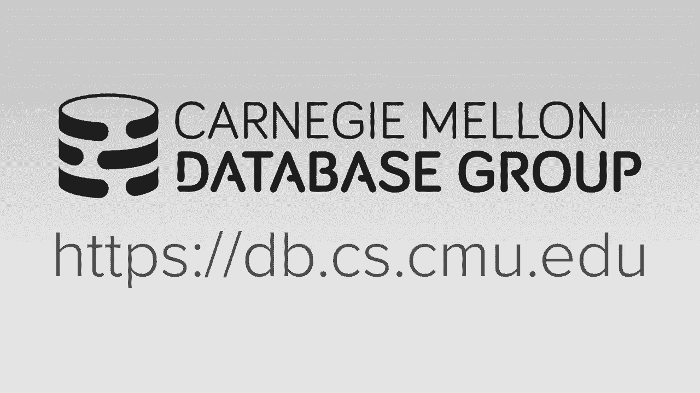
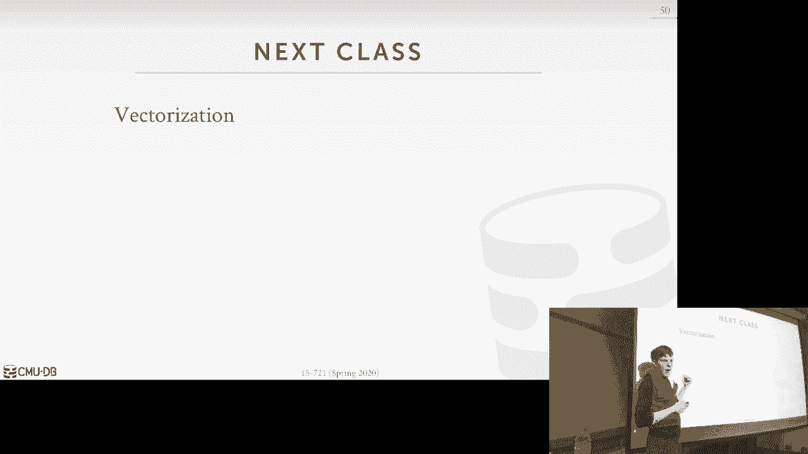

# 【双语字幕+资料下载】CMU 15-721 ｜ 数据库系统进阶(2020·完整版) - P14：L14- 查询编译代码生成 - ShowMeAI - BV1wv411w7Ko

[Applause]，[Music]。

[Applause]，[Music]，let's get started compilation is an，awesome topic there's a lot to discuss。

alright so this is just what's on the，docket for everyone here project to，checkpoint。

I think he's he'll post it on great，scope I think it's not already up it。

posted today we're trying to figure out，we looked at to see ways to make the。

accomplish and go faster，it wasn't anything obvious but like when。

you submit this it won't it run like，clang format and clanked ID but it won't。

run the the full linter so it'll be so，you make sure you run that yourself。

because when we run it from this has to，pass that so again the first checkpoint。

just be insert will figure out the，delete and then scan key and then this。

one will be has to be full concurrency，and again this one he's not checking for。

concurrency because great skip only，gives you a single thread will do more。

exhaustive tests in the final final，analysis okay and then on Wednesdays。

class all now announced what's but what，about our sort discussing project three。

and I'll propose some topics that you，guys can look at certainly some things。

we've talked about so far so things，we'll talk about today are Jemaine or。

applicable topics you could explore but，then with the first class after Spring。

Break on that first Monday we'll have in，class presentations where every group。

will come out and spend five minutes to，say hey this is what we're gonna do okay。

so you should least I mean I realize you，stopped the bill to beat the the B+ tree。

to start thinking about what it is that，you actually want to want to possibly。

build for project three okay and if，you're not sure about potential topics。

and want some further clarification you，know I'll be around spring break and we。

can meet necessary okay all right query，compilation is super important it is the。

one of the main techniques that our，people are using in modern systems。

database systems today to get best，performance so you know this is why we，spend the entire lecture。

on illness so we'll first talk about，some background about what is it what。

what you know cogeneration why we，actually wanna do this do the。

compilation then we'll talk about the，the two techniques the cogeneration of。

transformation basically source the，source compilation and then we'll talk。

about the JIT compilation using the LLVM，because that was in the hyper paper that。

you guys read but certainly this is not，the only way to compilation so we'll。

look at some real work techniques，including popping of post graphs and our。

own database system and seeing what the，the cogent quiet looks like for for。

these different systems okay so last，class or a couple classes ago we've been。

talking about how we're gonna get our，system to run as fast as possible and we。

said that the you know the way we could，do this is is is reduce the number。

instructions we have to execute alright，and also get more instructions per cycle。

so if you start to talk about how hard，this is this is to really get you know。

good speed-up just based on own，instructions this is a back of the。

napkin calculation that the hackathon，got hackathon guys did for their paper。

when they were explaining why they were，doing cogeneration compilation in their。

system and it basically says that if you，want to have your data and go 10x faster。

then you need to execute 90% fewer，instructions this is doable right this。

is something you know not just you know，maybe turning compile optimization flag。

to get you know better better better，binaries but through careful redesign of。

a databases architecture we can achieve，this but if we want to get a hundred X。

faster now we have 2x X 99% few，instructions now this starts to get。

really really hard and so what today's，class and then Wednesday's class and。

then after after the Spring Break when，we start about a vectorization these are。

the techniques we're going to use to，allow us to execute a few instructions。

to do the same amount of work so that we，can try to achieve this this 100x right。

because Intel it's not graduating up the，clock speed anymore they're giving us。

wider seamy registers more specialized，instructions there's more things Intel。

is gonna give us this noon clock speed，so we have the designer system in order。

to try to achieve this and there's not，going to be a magic，in GCC and clang like Oh 100 that we can。

use to make this happen again it's us as，the data system developers have to。

design the system and again for 20，people pay us a lot of money to do this。

well that's good so this is why we want，to do code specialization or query。

compilation so the idea of code，specialization is that instead of having。

general purpose code in our database，system to process queries or do whatever。

task we want in our system we're gonna，generate code that is specific to the。

one task we're trying to process or，complete and for our purposes today it's。

always gonna be a query so we have a，query and Retin rather than running this。

through a general-purpose system we will，then generate code that is hard coded or。

baked just to execute that one query the，reason why this is gonna be better for。

it for for performances because in the，general purpose system you're gonna have。

all this indirection we're gonna have，all these if causes or switch statements。

to deal with all the little impossible，datatypes or operands or predicates or。

aggregations you could be executing why，you process the query and that means。

that as I look at every single tuple and，I call my a great function there's me a。

switch statement that says if my data，type is this do this and my data type is。

that do that we don't avoid all that we，strip it down to be just the exact。

instructions I need in order to execute，that query so this is gonna be tricky to。

do and it's not to say that people when，they when we write general-purpose data。

system code they're not doing this just，because they're dumb they're doing it。

for mostly software engineering reasons，right you're making it so the code is。

reusable so you don't have to have this，you know duplicate operations over and。

over again you know adding two numbers，we're adding to two floats and we also。

write code in such a way that's easier，for people to maintain and support but。

the problem is gonna be as I said before，is the way we write code that's easier。

for humans to understand we're actually，gonna be the worst way you can actually。

write code for for the CPU so I'm gonna，show a bunch of examples I'm going to。

use this simple three table schema ABC，write a B have primary key integers and，some value。

and then see just has to foreign key，references to the primary key at a and。

the primary key and B so I show a bunch，of examples doing three bay joins on。

this table on the foreign keys so let's，see now how we could process this query。

here a three-way join with with a nested，query learned ester aggregation using。

the interpretation model the iterator，model that we talked about before right。

so again we have a group I or，aggregation or a group I for B inside。

this this inner query and then we're，gonna do a join on on a B and C so the。

query plan would look like this right，this is for our purposes here this is。

just the logical plan we're not saying，what the joint album actually is but we。

can this assume that it's a hash table，we're not saying how we're doing the。

aggregation assume and also it's a hash，table so if we go back and use the for。

loop iterator model approach that we saw，last class the way we'd execute this。

query is in just a bunch of for loops，where and one operator they iterate over。

the the target input in this case here，we're scanning B for every tuple in B。

then we shove it up into the next，operator to do the filter and this。

shoves it up to do the join right so，again this is gonna be slow for an enemy。

database it's still gonna be slow for a，displaced database because we're copying。

a lot of you know all the data from one，to the next yes we can combine these but。

you know we're having all these next，calls and these MIT calls like all these。

function calls are gonna be expensive，for us right and we have to do this。

right we have this general-purpose，evaluation or value eight predicate。

functions because the we don't know，actually know what the predicate。

actually looks like we just know we're，gonna have the source sort of this。

expression tree that we want to evaluate，and all this code here the do that do。

the iteration over the next over that，every tuple from the child it just calls。

this function it's it's not doing，anything special it's not doing anything。

in line right so again there's a lot of，overhead from all these next calls。

because we could have there are，different types of indirection but the。

expression itself is also going to be，expensive as well right so we just take。

this inner part here right where B dot，Val equals question mark meaning it's an。

input parameter this is a prepared，statement so at runtime someone's gonna。

pass in the value for this parameter，and then we're going to add one to it so。

typically you a you you you represent，these predicates is through these。

expression trees and the way to think，about this is that the the day to day。

system will enter the root and invoke，whatever this operator is and say hey I。

want to evaluate this expression tree，from the root and then it and then has。

to now traverse down into the tree and，evaluate all its two children and start。

pushing results up so say we come down，here we look at the equal operator we。

start going to the left child we see，that expression here is a tuple。

attribute on P dot Val so we do look up，at the current tubule we're looking at。

because we're calling this you know，value eight predicate function for every。

single tuple as we scan along so we say，alright I want B dot Val so now I gotta。

look at my table schema and say alright，well the the Bao attribute is the second。

one or the second attribute so I need I，know how to jump over here to get get。

one thousand and then I produce that as，my output now I have to first down to。

this this side of the tree this says I，want parameter 0 so I go look up my my。

parameter array find the first one and，that's 99 so I get that there then this。

is just evaluating it constant so I just，take one shove it up here add these。

together I get a thousand then now I can，do my I can do my comparison and the。

result is true so again I had to，traverse this tree for every single。

tuple that I evaluate so have a billion，tuples I'm making one billion times you。

know whatever for for jumps for for all，these different expressions you know。

function calls and we're doing this，because again as humans it's easy for us。

to reason about how to represent the，where clause through this tree but again。

that's gonna be slow because because you，know all this indirection so this is。

what again just these two things of oida，ng that that the interpretation of the。

query plan to deal with all the in，direction of the different operators as。

well as the predicate so we're at the，value eight inside those operators are。

the main two things we're gonna try to，all right so again the idea is that。

anytime we have a CPU intensive task in，our database we want to then convert it。

or compile it into machine code that can，then we can exude directly so it's like，again。

roll the switch demons would get rolling，if clauses other than you know checking。

where the predicate evaluates to true，and it comes down we stripped down to be。

exactly what the the query wants with，minimal lookups in in directions so I've。

already shown how to do this for access，methods or evaluate predicates or。

operated execution we can also do it for，store procedures or prepared statements。

right with the logic appeal sequel we，can then convert into machine code only。

Oracle really does this predicate，valuation we also solve other parts of。

the system like logging operations like，on recovery if I had to replay these log。

records rather than me looking at the，schema and then having indirection to。

say oh my schema my log record has these，types and these values therefore I'd。

know how to apply them to the database I，could compile or coach but I have Co。

specialization methods applied to making，recovery work faster no Davison actually。

does this one predicate evaluation is in，is probably the most common followed by。

a Pareto access methods operatic，extrusion and then it's only a few。

number systems actually do this and this，is actually something we're exploring it。

in our own system right so I've already，said this before but why we want to do。

this well we can do this because we know，what the attributes are in our in our。

database ahead of time right and the，relational model you get to declare a。

schema so it's not like we're looking at，files，we know exactly what the schema looks。

like we know exactly what the size of，the data is that varchars have to be。

treated differently but at least we know，that we have a fixed size pointer to。

that large arm so therefore we can，instead of having all these function。

calls to do lookups and say you know，give me the you know I want this。

attribute from this tuple and therefore，I jump into this function that knows how。

to do the arithmetic to find the value，I'm looking for I guess in line directly。

the address math to go get exactly the，data that I'm looking for likewise we。

all that predicates are known ahead of，time because we're given the where。

clauses or we're given whatever whatever，is in our projection list so we know。

exactly how to then instead of，representing it as a tree we can，represent exactly to be the the。

you know the predicate that we're，actually trying to apply and then。

likewise we want to get rid of all the，function calls we have inside loops so。

that we have this tight kernel that we，don't then doing any branching inside of。

it we iterate very quickly over and over，again and this with some benefits from。

the compiler in this case because you，can do some unrolling and in some cases。

it could can do some auto vectorization，which we'll cover on on Wednesday all。

right all right so at a high level of，the DAT a system that we're talking。

right now looks like this so I haven't，shared this picture before but this is。

basically the pipeline within a real，database system of when a query shows up。

right so say there's a networking layer，here at sequel query shows up first。

thing we're to parse the sequel and from，the part sequel we get an abstract。

syntax tree this is just the tokens like，to select the names by all the strings。

that are inside the the Siebel itself，then we run this into our binder and the。

binder does a lookup in the catalog to，replace the the string tokens of the。

names of objects in the database with，internal identifiers like so if my table。

is called foo the abstracts index tree，we'll see Oh someone's doing lookup on。

something called foo I do look up my，catalogue say well foo corresponds to。

this table and here's an internal，identifier to allow you to find it more。

quickly in the future so then you pass，along now this annotated ast into our。

query optimizer which then is going to，come generate a physical plan but there。

could be more steps we'll see this later，in the semester but for our purposes。

today we only care about that the，optimizer generates a physical plan。

which we then now feed in some to some，compiler or the trance flyer or the the。

cogent engine whatever you want to call，this that's going to take the physical。

plan which is going to be those of that，operator tree and then it's gonna spit。

out some kind of native code or byte，code that we can then interpret all。

right so now the idea is that we take，the physical plan we've gotten from this。

and we convert it into source code or，native code that does exactly what that。

query wants to do without any，indirection，ok so now how you actually run this。

compiler it's gonna vary between the，different systems and what this actually。

is coming out of this thing，can vary to the different approaches。

that we'll talk about today as well all，right so one thing I also say too is。

like the in the cases where we are going，to actually compile the。

the the physical plan into like machine，code that we can then link you know or。

execute in a saturated system process，because we're the as us as the database。

available where the wrongs writing this，this translation step we don't have to。

have any security concerns because it's，not like we're taking arbitrary C code。

from the user and running inside our，data system which would be stupid right。

so because we control this step we don't，have to do extra security checks to make。

sure that like we're not gonna have like，buffer overruns or malicious code and。

things like that this is code that else，as the davison developers will spit out。

so we we can assume it's sanitize unless，you know somebody on the inside tries to。

take us down right we can assume that，this is safe for us to run directly。

inside our database process and we don't，have to sandbox it at all we'll see when。

we talk about UDS like in some，commercial systems like in Oracle for。

example you can write UDS in NC which，always easy super dangerous because you。

can jump to any address base uh you know，in your process so in that case they'll。

fork off a sandbox and run it there so，you can't hurt the real database system。

but again in our code we don't worry，about this yes question is how do I know。

with the if I have a global data，structure how do I know where the global。

data structures are in the compiled code，the compiled code can invoke anything in。

the it'll get linked in with anything，that's running a setter data system so。

you wouldn't want to have it like you，know had this arbitrary memory address。

that has the object that you want you，would have a way to link it and say well。

here's the function I could call commit，that can again give me access to the。

object that I can do what I want yes，it's the same thing is like if it's like。

arbitration of his boss like I can link，it with an existing library and be able。

to evoke into that library it works the，same way like the avi of Linux or。

whatever property system you doing，handles all that for you alright so。

there's two approaches this there's，transpilation and and the JIT。

compilation so translation also call it，source to source compilation the idea，here is that the day。

a system will have specialized code that，admits new source code so like it'll。

have C++ code that spits out C++ code，then you then run that people that that。

new source code through a regular，compiler link that in and then that and。

run that and that's that's your your，database that's your query and you're。

gonna execute all right the other post，is a compilation where instead of。

generating a you know direct like you，know higher-level source code we're。

gonna want to generate this low-level I，or medium in intermediate representation。

thing to like the LLVM ir or the JVM，bytecode we're gonna MIT that directly。

and then we can then invoke that inside，of our data recently you can either。

compile it or interpret it so I had a，high-level the end result is still gonna。

be the same that we're going to take our，physical query plan and generate。

executable code that is you know baked，just for that query plan whether we're。

doing that because we generate you know，C++ code first or generate this little I。

our first the the compilation time is，gonna differ between these two and。

there's also software engineering，difference as well but at end the day it。

still be the same thing this I mean this，is no interpretation of or having these。

different lookups for for the different，types of indirection we could have。

working on arbitrary data types that the，the query plan we're generating or it。

comes out of a compiler is baked just，for that one query okay so we'll go。

through these one by one so the one of，the first database systems in the modern。

era and I'll explain what that is when，we talk about system are when the first。

data system in the modern era that's，doing cogeneration was this thing called。

high Q out of the university Edinboro，and like I said what do we do is like。

for a given query plan that the，optimizer gave it it would write out a。

C+ code that implements the X cubed plan，for that query and all our predicates。

and all our type conversions are all，baked exactly into the query plan based。

on what the schema is for that given，table and then maybe do a fork exact on，GCC。

have-have GC spit out a shared object，the link that into our database doesn't。

process and then we just invoke that to，execute the query so the way to think。

about this is the the source code were，generating here it's gonna have a like a。

main function but suppose that we called，name it's gonna have a function that。

that the name is known and has the the，parameter signature is known to the。

database system so when you get the，shared object and want to invoke the。

query you know you just call that one，function then it spits back whatever。

whatever the result is right so as well，seems to go along you're obviously gonna。

pay a big penalty for in performance for，having to fork exact GCC because that's。

firing up another process there's a，context which GCC wants to read its own。

config files and if you're doing this，for every single query over never again。

it's gonna be slow and this is what the，JIT compilation is gonna solve。

let's see roughly how this works so we，have our query here select star from a。

where a dot Val equals question mark，plus one so for the interpreted plan。

it's that you know the sort of for loop，that I showed before in the first。

example right we're gonna warn as，iterate over every single tuple for the。

new tuples we have gave it to one I give，an offset of that way in our private。

predicate and then admit its output so，in the first step here when we invoke。

this function what it has to do is go，look in the catalog and figure out what。

the the schema looks like for the table，then you got to calculate the offset。

based on the tuple size so I know that，jump to the block and up to the fixed。

like offset and then I return the，pointer to the tuple now you can cash。

this first one here you can try to avoid，having to go get the schema every single。

time but these other ones here you still，have to do but now the big cost is gonna。

be an hour and when we valid our，predicate because now we've got to。

traverse that expression tree and pull，all the values up and see whether it。

returns true or false and then if so，then we made our tuple all right so what。

haiku is gonna do is have a template a，plan where the this is all Python but。

they're doing this they're doing their，temples in C++ where they know that they。

have to do an iteration or scan over a，over a table and，that's really gonna be different is what。

are the the predicates are there，different values you're gonna have to。

substitute you know when you want to，evaluate the scan right so the tuple。

size the predicates offset and the，parameter value like these are the。

things that are going to be told to us，when we invoke the query but everything。

else the predicate will change you know，could change from one core to the next。

but everything else is with me always，the same from one scan the next so now。

all I need to do is take these values，and take this template and just the cat。

one time it'll fill these things in for，me this one here I just check to see。

where that values are true or not the，same thing I just get it from here and。

then I can evaluate this so again I got，rid of the look up for the for the to。

get the tuple and I got rid of the look，up to evaluate the predicate so I。

removed the two functions that were，gonna cause us to have jumps inside of。

our for loop and now the the the the CPU，can can iterate through this for that。

very quickly yes how how were using the，credit the predicate offset so it's。

we're the so we have to get the，predicate offset is what attribute in。

the and the tuple do I want to evaluate，so I would have to know I want I went。

before was a B dot value so so this will，tell me and what offset the two boys。

beat yes oh yeah this predicate because，correct so it's quite here it's question。

is how did I convert a bow into question，mark plus one how do I convert that into。

this so the I had to make a pass through，the query plan that comes out of the。

optimizer and figure out what what is，the predicate is that it's actually。

doing and I convert the expression tree，into this line here so you may think，well isn't that doing。

look up you'll have a billion two bowls，I only do that once right whereas this。

case here you have to do it a billion，times right so it should be obvious why。

again why does this is gonna be a big，win for us because everything's baked in。

there's no additional lookups and we can，just iterate very quickly over every。

single tuple evaluate our predicate and，produce the output yes so this question。

is how is this like for the predicate，the whole thing yeah correct。

we'll get there so his question is in my，example here when the query shows up。

it's gonna generate this this this，structure every single time so if I。

actually in theory if I know doning，query plan cashing it back to the same。

query over again it's gonna pre generate，this thing open over again。

compile it over and over again and so，couldn't you recognize that oh well I。

only have to do so many things in a，database of some light like there's only。

so many predicates sigh you know equals，less than greater than there's only in。

the forum's there's only so many things，I'm gonna do execute a query could I。

need to pre generate all those，primitives is the word I'll actually use。

and in that way at runtime I don't have，functions directly，that's what vector wise does we'll see。

that in later in the class，yes that's actual what we do in our，system especially the number of。

predicates dependent on the depth of the，tree but I think his point is like say。

like what am I doing here，Val equals something right and so，instead of having again having a。

function instead of having this if calls，here to do this I could have a function。

says take two integers check to see，whether they're equal and pre-compiled。

nobody but you decompose them right to，like just like the conjunction clauses。

no now it's an array it's not a tree a，equals one and B equals two and C equals。

three each of those ones could be a，function called you know something。

equals something and I invoke them in an，array one after another I don't want to。

traverse any tree one we the，vectorization was about when we have a。

better wise but like well gets in a，second the compilation cost is what's。

gonna kill this approach it right so if，you don't have to now compile something。

equals something every single time you，execute a query and his example can you。

catch that or the copilot wants in this，link it yes yes this what vector buys。

does all right right so related his，question is well how can my generate。

query code invoke and touch other parts，of the system if I don't know where the。

memory addresses is again well this is，just Cephas loss code we're gonna link。

it in with our database system shared，object so if we expose an API it allow。

you to go get access to the internal，components of our database system then。

our our you know our cogent query plan，well，I said like if I need to access that。

like transaction manager I have a，function that says you know for my。

current execution contact give me my，transaction manager and now my my on the。

on the fly code can invoke that and you，know check to see whether it's a lot of。

commit or not things like that so it's，almost as if like it's just the same。

thing as the coab you'd write in our，database system but we're writing this。

and compiling it on the fly at runtime，so us as the data system developers we。

don't know exactly whatever query is，going to show up but we can still do you。

know we can still invoke the pieces of，the system and actually make it。

happen right so this this is this this，can be problematic in a and a JIT system。

LLVM because of its c++ then you have，these mangled pass to the functions like。

if you ever looked at else people plus，what the functions actually look like。

when you when you look at their names，like in gdb unless they do on mangling。

you know these long strings with like，the class name and like the function。

name and things like that if that can，get a bit gnarly so you need to you need。

a way to bridge in to do the Davison to，do that in in their world because。

they're generating C code it's it's not，an issue or steeples cuz it's not an。

issue because they just vote the other，functions as if it was all being。

compiled at the same time right the，other nice thing you get about this。

translation approach is that it makes，debugging a lot easier because now if I。

crash in my my my generated code I can，just use gdb and all my standard。

debugging tools to figure out why I，crashed and that's actually a big gonna。

be a big problem for the LLVM stuff how，you do it you do have to have do a。

little extra work to figure out like，well what is the simplest code that。

generated this T plus code that crashed，yeah that you have to make that jump in。

at debug symbols or hints about how that，happened but again it's it's not as bad。

as it is in LLVM all right so let's look，at some experiments that they did for。

haiku to understand the the benefits for，their approach so this paper is big old。

I think it's 2010 now but I like it a，lot because they they generate all。

different variations the way you could，do translation or you could build a。

davis system and they put it all in a，single engine and compare against all。

them so they're gonna have five，different approaches so the generic。

iterators would be like the textbook，implementation of a database system。

where you have like the volcano model，and you're calling these functions。

inside the four loops two by eight，things calling next 10x over again then。

they're gonna have a slightly more，optimized version where now you have。

iterators that are specific to the，different types of columns you could be。

accessing or a trees you'd be accessing，in your database and you you can。

evaluate the the predicate before you，pass it up to the next operator。

the tree they are basically doing，predicate push down then you have these。

hard-coded implementations where like，they had a grad student implement like a。

best-effort approach with like the，generic iterates and predicates。

equivalent to this one and then a more，optimized version that's equivalent to。

this one but again it's like hard-coded，just for the query and not like a。

general-purpose engine and then the last，one is what they're they're you know。

they're source-to-source compiler code，generator engines gonna spit out for。

queries the way to think about this the，optimist heart could one is what he was。

asking about like can i pre compile all，the predicates and types ahead of time。

and now I'm just sort of linking，together these different functions so。

that's one that's what this one is so，for this one，they are running I think it's just a。

scan or join query over to 10，000 tuple，tables to produce 10 million and so what。

you see is that for the case of the，generic iterators the surprise it。

performs the worst and then as you get，over here the the different thing about。

my is hard-coded one of the Haiku one，are they're about the same because the。

the the Haiku like engine is spitting，out C++ code that is roughly equivalent。

to what the hard-coded one can do so the，idea now again for any arbitrary query。

instead of me time to write code by hand，over and over again I can have the。

engine generate that code directly write，the the other thing you point out to is。

like we have a lot more memory stalls，here in the generic one just because。

there's so much like indirection and，we're doing these jumps and we don't。

know exactly what what piece of memory，are gonna read ahead you know ahead of。

time whereas in these cases again the，for loop is super tight we can rip。

through things very quickly and then the，hardware prefetcher could bring things。

in a memory ahead of time for us yeah，so it's great shame it is this basically。

says that this argues for the case that，you almost never want to inline small。

functions are not inline them for the，inside the for-loop kernels yes。

how did agree with that yes yeah I think，for small functions yes yeah I think。

alike if there's predicates that are，really expensive or really large or like。

functions you really large but I，actually I think the compilers these。

days actually do a pretty good job for，figuring out what the in line so in the。

case of like haiku when is when it's，cogentiva source code I don't think you。

want to put explicit like inline hints I，think you want the compiler do whatever。

wants to do I think that's the sort of，the conventional wisdom now for C++ you。

don't add in mine anywhere you let the，compiler favorite things out okay what's。

the downside of this approach well it's，gonna be the compilation cost now right。

so for this one they're gonna compile，with o 0 + o - o 0 basically as no。

optimization so 2 is with the most，aggressive optimizations that are。

considered to be safe and obviously，there's more passes when you do o - so。

therefore the compilation time goes up，so this is 40 PCH right ISM this is not。

the query execution time this is just，the compilation time all right so now。

you're trying to get into problems，because in the case of Q 3 it's gonna。

take me 600 milliseconds to to compile，it for some cases the query can be done。

in maybe 100 milliseconds so I'm，spending more time doing compilation。

than hi I'm actually you know when I'm，spending on actually actually didn't。

query right so this is the this is me a，problem with this approach and we'll see。

mem sequel later in this in in the class，but like mem Seco actually their first。

implementation actually did this and，when he looked some of the early blog。

articles which they've since from Ruby，you look on the archive you can still。

find them right they would have examples，where like you run a query and it takes。

one second to run even though it doesn't，know work because they're a fork。

exacting GCC from there there's there's，the C++ code there Jen。

for that query compiling it then linking，back in and run it but they did a good。

job caching everything so that when you，execute the same query again and they're。

in their examples they would show the，company action each time would be now。

zero because they can just reuse that，binary over and over again okay so the。

as I said the beginning the operators，that the way we can organize our query。

plan tree is useful for us to reason，about as humans makes the code reusable。

makes the code easily extensible but，it's again it's not gonna be the most。

efficient way to executors and in case，the haiku stuff again even though we。

could execute see puzzles code that，would be a more efficient way to execute。

these queries it's going to be slow for，us to compile right a big issue also too。

with high q-- is that they're not gonna，support full pipelining they're still。

gonna generate on a per operator the，drink of the for loop for that one。

operator still having a MIT function to，shove it up to the next operator who's。

then is gonna have its own for loop to，process things now make a new predicate。

push down so that when you do the scan，on the table though evaluate the。

predicate but everything else up in the，query plan again it's gonna be like that。

next call you have you know you have to，run your own for loop as well so to。

understand what how we can get better，performance with pipelining we'll go。

back to this three-way join query and，now we're gonna divide it up into lists。

of pipelines and again a pipeline is a，portion of the query plan where I can。

take a single tuple and ride it up as，far as I can up into the query plan。

until I reach some point where I can't，continue up in the query plan until I go。

get get the next two will get all the，tuples that are coming within my。

pipeline so the easiest one to，understand here is a pipeline to I'm，scanning B then I'm applying my。

predicate but now I want to do my，aggregation on the group I but I can't I。

can't go past this this operator until I，get all the tuples into my hash table。

for my aggregation because I'm computing，the count so I need you know what is the。

count another more tools that I have for，the you know the group by clause before。

I can pass anything up over here in the，case of pipeline for over here I geeks，the hash。

able to do the joins on a and B I can，take a single tuple write it up here。

check to see whether it if I do the join，it matches yes so then I can run it up。

here and check to see whether I can do，the join a and whether it matches has。

the idea is again we can have the，pipeline go look cuba go far as account。

and you know up in the [ __ ] and until，we had a pipeline breaker right so this。

is what hyper does so hyper actually has，two main ideas and the paper do you guys。

you guys read so the first is that，they're gonna do this push based query。

plant or processing model but then，they're also going to do just in time。

compilation of the query plan using LLVM，right and so when you read the paper。

hopefully didn't read the appendix I，should have warned you ahead of time。

because there's all this ll Mir I don't，understand it like it's not really。

useful the core material what's actually，going on in the paper was was the the。

front body of it so again what the，reason why they're gonna do this push。

based model is that more than is keeping，things in your CPU caches now you can。

keep tuples and values in your CPU，registers which is even faster than l1。

cache so now as I as I go up the query，plan in my pipeline if I'm just having。

the same tuple in my CP registers then，that can rip through it very very。

the for those who don't know actually，who here has heard of El Elyon before or。

here is not heard about him before，ok perfect so LLVM is originally stance。

with a low-level virtual machine，although you shouldn't think of it as a。

virtual machine like not like VirtualBox，to vmware originally started at UIUC in。

like like 2000 or 1999 and they were，trying to build a tool to investigate。

like dynamic compilation techniques for，programming languages and they ended up。

building this like toolkit that's gonna，have all these different that components。

you would need to been a full fledged，compiler the idea is that rather than。

having a you know being compiled in，filament one programming language it。

would sort of have different front-end，plugins you can then take different。

programming languages build a front-end，for it that can then convert it to the。

LMI r and then from there you can then，compile the，the into machine code so Apple is。

invested heavily in this they hired one，of the main guys at a UIUC in like。

2004-2005 and he basically runs their，you know they're all the work they do。

I'm clang and LLB I'm based on this all，right so again what's gonna happen is we。

can take any arbitrary language and，convert it down to this low-level IR。

that's gonna sort of look like assembly，but it's designed specifically for the。

sort of the virtual machine that that，that LLVM provides and then on the back。

end they can then compile that IR into，whatever your target target is a is so。

that it supports x86 or support arm so，you can take any arbitrary language。

convert it to the IR and then have it，spit out to any CPU I say that uh that L。

of M supports right so important thing，to understand though is that in the case。

of hyper hyper is gonna have C++ code，admit L of him ir directly so haiku was。

tabbing seamless code generate seamless，code Piper is having Steve of Cisco。

generate IR but the rest of the system，just like in haiku does not need to be。

written in the same language that the，that the query plan is generated in so。

the rest of hyper is written in C++ and，it can still make also C++ code but you。

have to mangle the the function names，the class names as I said there's you。

know LM doesn't do that for you were，free but you can still have the IR code。

call in to your simplest code you still，get the same benefit of everything。

running in the same dress base right so，now let's go back to this query plan and。

see how we would generate a source code，that would do the the push the the the。

push up approach in hyper so now for for，these think of these of these different。

for loops as the different pipelines and，again the idea of a pipeline is it's。

it's a for loop or a bunch of for loops，that can take a single tuple and keep。

processing it as far as I can up into，the query plan first so if we're doing。

the scale on a is just a fourth open a，and then we evaluate a predicate and。

then we can materialize it into into our，hash table right then now we do this we。

jump over to pipeline B we can then do，scan through that ply up right。

get a hash-table then we can then，materialize the output of the of the of。

the aggregation table on being but that，now here in pipeline see we have three，nested for-loops。

so we're going to take a tuple in C and，then try to do a join against it in on。

against B and if that matches we try to，do the join against it on on a and then。

then that that's is correct then we can，we can spit it up as our output so for。

one tuple and C we can do the the join，and a of joining B and then produce an。

output if necessary we don't have any，switch turn up to another tuple yes his。

question is is is there multiple ways to，generate these pipelines and if so is。

there always going to be an a optimal，the typical optimization strategy is。

that you you well there's two things one，is are there different ways to generate，this query plan yes。

right cuz that's the quarry optimizer，does and so from our perspective in this。

class we're just rying to say well the，optimizer gave us a query plan how can。

we generate pipelines for it and in that，case it's a pretty simple heuristic to。

decide where these pipelines that it，should look like and the typically way。

you do this is the you start with like，the left side of the tree they have any。

join that's a pipeline feeding to the，join and then on the right side you try。

to have the pipeline go all the way up，until you hit a head a pipeline breaker。

so the conversion process to introduce，your question yes there's different ways。

I can generate get pipeline from cilium，fiscal plan like I could have a pipeline。

in here that have a new pipeline it'd be，stupid but I could do that but the。

heuristic to find the optimal one for a，given physical plan is it's pretty。

straight forward the harder decision is，like should I join a b or b a like all，that before okay。

so again what hyper is doing hyper is，gonna take instead of generating the。

pseudocode they're gonna generate the ll，than ir that does exactly these steps。

compile this as one giant function all，the pipelines to，and then now it's just stages all right。

I'll run this for loop and when that's，done now I jump to this part or just。

it's actually not a jump it's just you，know just executing sequentially then I。

do the this for loop then I do that for，loop and then I do this last for loop。

for the pipeline right so in our new，system we can actually compile these。

pipelines separately in this version of，hyper everything was compiled all at。

once so you had to have all the IR，generated for the for the entire query。

plan for all your pipelines generated，together and this giant function then。

you fire it off to two LLVM so let's，look at some before Midsummer's。

comparing two different versions of，hyper one is doing the LLM IR and then。

one is doing the the high Q approach，where you're spitting out so Fusco and。

then for quiz second GCC then we have，the vector wise approach which is using。

his precompiled predicate method that he，mentioned Monet DB would generate it。

generates what looks like an IR but then，they have an interpreter for it they。

don't actually compiling into machine，code and then Oracle does does nothing。

it's just interpreting the query plan，and the same way we always do it right。

so this is also not measuring the，compilation time this is just saying。

like assuming I have everything compiled，ahead of time how fast can I go and so。

because the in the case that lol M，version of hyper they're doing more。

aggressive more pipelining right they're，making sure that the pipeline is as long。

as possible that they can do selecting，slightly better than this version and。

the Oracle is always going to lose again，because it's always doing the。

interpretation right for the case of，like for q1 q1 is it's it's there's no。

join it's a single table it's just a，bunch of aggregations so that one you。

can do more efficiently if you coach and，everything q5 is a is like five or six。

joins and the output is pretty simple so，you don't get as much big of a benefit。

because the major cost in executing this，query is always going to be the join。

that's gonna be precompiled anyway you，know to probe a hash table for example。

invoke the hash function so in that case，you're not gonna get that big of a。

benefit for for the gun cogent side of，things，all right so let's now look at the。

compilation cost so now this is not a，true like apples to apples comparison。

because I'm tea I'm like taking the，numbers from the haiku paper and mashing。

it together with the the hyper results，so they're not running on the same。

hardware I think like the hyper guys are，running on like a Z on this is running。

on a Core 2 Duo from like you know，2008-2009 the scale factor is still the。

same they're still compiling the same TP，CH queries it's sort of the relative。

difference is what matters right just，because they have a slightly newer CPU。

you know it's not going to magically get，faster so that is just showing you that。

not having to then parse the C++ code，run through your you know your a ste and。

your tokenizer and then compile it as，you would and GCC or clang but is。

emitting the IR directly then being able，to run your operation pisses on that。

inside the LLVM that's gonna be you know，orders of magnitude faster or these one。

order magnitude faster than then GCC so，for this reason I think the the element。

compilation approach is the right way to，go if you have a sleepless loss based。

engine well seem examples some Java，based database systems they'll do this。

sort of the same thing they'll MIT Java，bytecode directly instead of me know。

emitting Java code then compiling that，ok so where is this compilation cost。

coming from so you know 37 milliseconds，it's not as bad as 400 milliseconds but。

it's still a lot right my mic my query，some queries can run in less than a。

millisecond but I takes me 37，milliseconds to compile it assuming I。

can't cash it ahead of time then I'm not，really getting any benefit so what's。

happening here so the issue is gonna be，the compilation time is going to depend。

on the query size so this means the，number joins we have then I'm rheticus。

that we have number of aggregates I just，saw how complex the query is the more。

things we're trying to do then the，compilation time is gonna go up and now。

it's sort of this trade-off between like，well if my queries gonna run for 30。

seconds who cares if it took it maybe an，extra second to compile because I'm。

still gonna get a big win in terms of，performance numbers that we saw over。

/ Oracle but for other queries that are，really fast maybe the the amount of data。

they need to process you can rip through，very quickly because it's a calm store。

you know the accomplish in time could，start eat eat into the extrusion time so。

for all to be applications this won't be，an issue，imma take a guess why why would we care。

less roll the TP says less joins yes，that's one of it yes yes but as you were。

saying the same thing so he's saying the，execute the complexity of the query is。

relatively easy compared to or lab it，means they have less joints right so yes。

the oat any queries gonna be way less，complex you're not gonna do a hundred。

table join it's gonna be like knee look，up Andes record thumb from the index and。

go get you know some basic information，and maybe do a join with a foreign key。

table there's another reason as well，caching exactly and all the T。

applications weren't actually the same，queries over and over again like I load。

the web page and Amazon they do a query，lookup and the index to get my record he。

goes business Amazon it's the same query，just a different key so you can cache。

that either as prepared statement or，like you know pre compiled code and。

we've invoked that over and over again，right for OLAP this this is gonna be an。

issue but where that trade-off is when，you know if you know haven't decide oh。

this is good enough to compile which is，just interpreting that's hard to figure。

out right because at the compiler level，one more generate and we're doing code。

gen we have a rough idea how much data，we're gonna access but those estimations。

can always be very wrong yes sorry get，over him what's her and with in memory。

if it's in memory then it can be really，fast right we can run like so the I。

think I think this is like scale factor，one so this is like doing you know this。

is reading one gigabyte data in 35，milliseconds so multiply it by you know。

and memory this is an issue for disk，based system the distance always going。

to crush you so it matters less which is，part of the reason why Oracle probably。

is never done this at least for for the，traditional and is based system correct。

yes in memory the the compilation time，or the you know all that function。

would say also to like so Postgres is a，system we'll see this in a second they。

do compilation too as well now as of，like 2018 but the end they have this。

little parameter you can set to make，decisions about should I actually。

compile or not based on what the extra，should cost the query it's actually。

gonna be so let me get actual give it，what I'm gonna talk about what hyper。

does the motivation for what Hyper's，gonna do here was they were trying to。

just like us they were trying to support，the post that's wire protocol and post。

has catalog and so there's this contrary，a commonly used tool call PG admin which。

is like a PHP interface to configure，your Postgres installation so the way。

all these like these these you know，visual database tools work is that when。

you turn them on they connect to the，database it immediately run a query a。

bunch of queries against the catalog and，figure out what tables do I have what。

columns do I have what indexes do I have，so they can expose that to the DBA to。

manage the database so when you turn，that when you would in hyper case when。

you would turn PGM and on point at hyper，it would be this long pause at the very。

beginning right we're talking like maybe，10 seconds because the PG admin fire of。

all these queries that then had to run，through the elevate and compiler just to。

figure out what tables you would have，whereas the key around was regular post。

rest it doesn't do any of that，compilation so when you turn on PG admin。

it would be much more quick you know，boot up more quickly so to solve that so。

let's do so those queries aren't that，complex but there was just a lot of them。

and the compilation cost was eating，eating all your time so this is a paper。

that came out in 2018 from the hyper，guys at won best paper in ICD I think。

this is actually a this is actually a，really good idea，we tried doing this in peloton but when。

we killed off peloton we didn't we do，something differently now we we do。

something slightly different in what，they're doing but the idea here is it's。

a really good one so what they're gonna，do is when a query shows up they're。

still gonna generate the IR just as you，normally would but then rather than。

firing off the LLVM compiler waiting for，that to finish and then start executing。

the query they're gonna have a IR，interpreter think of this is like a VM。

that's can then interpret that IR and，start executing it so they have the。

German guide Thomas wrote it in parently，in two weeks you basically take the the。

the byte codes that LVM spits out and，it's IR and you just implement a virtual。

machine to execute it so now it's gonna，make all the same function calls to the。

rest of the system make all the same，invoke all the same operands and。

predicates as you normally would in the，cop-out engine but it's running it as an。

interpreted as an interpreter so it's，not like you have to build two separate。

engines completely you just have the，interpreter execute the same。

instructions that the compiled version，stuff well so now the interpreter is。

running then in the background you start，compiling the query and then when the。

compiled query is ready you just slide，it in if the query still running to。

replace the the interpreter execution so，again they're using morsels though so。

what would happen is every single time a，a thread a worker thread would complete。

a morsel it would check some flag and，say is my compiled version ready if yes。

then invoke that if no then I just keep，running might might in the interpreter。

so now for those queries that could take，a long time to compile but will execute。

very quickly in those cases the you，could finish them off just do the。

interpreter and not wait for the long，compilation stuff to finish so they're。

actually going to do have usually three，stages of different different types of。

compilation can do based on what type of，optimizations are going to do so again。

the sequel query shows up and so in，their case their optimizer maybe takes，you know 0。

2 milliseconds then they have，this cochon engine and that's taken 0。7，milliseconds。

all right because you're traversing the，tree spitting out the IR and then the。

first thing that'll do is they'll，they'll pass off the IR to the。

this bytecode compiler or interpreter，and execute that and so some cases that，could finish up in 0。

4 milliseconds，sorry sorry it's compiler so you're，taking the IR and converting it to a。

bytecode that they can then interpret，that takes four milliseconds then the IR。

also goes to the Allium compiler but，they turn off all the the optimization。

passes like unrolling loops and peephole，optimizations all that's turned off so。

that complete in six milliseconds so now，that's gonna be a little bit faster than。

this one so when this one finishes then，you can replace this with this but then。

they're also gonna then if it runs even，longer then they'll run it through all。

the optimization passes of the hello and，provides by now you're doing like dead。

code elimination and sub-expression，elimination and the peephole stuff that。

then they can then run it through the，compiler and then this picks out the x86。

code so the idea is that I start，interpreting right away on the byte code。

if it finishes before you know right，away then I'm done if this thing。

finishes before this excuse execution，finishes then I just start executing。

this but then I also fire off this this，this pass and then if this is if this is。

done if this is not done by the time I，get this then I replace it with that so。

you're sort of staging how fast the the，execution engines gonna get and the idea。

is that rather waiting for this thing to，finish which in this particular example。

here 25 milliseconds plus 70，milliseconds rather not executing any。

work during this time I think these get，some work done it's not gonna as if it。

as efficient but it's better than，nothing so they have some some numbers。

about cpc-h for those three stages again，this is going to show you the relative。

difference from performance between the，between the the bytecode interpreter or。

the unoptimized LVM and the optimized，LLVM so again you're getting an。

automatic two difference between the，optimized compiled version and the。

interpreter so that that's reasons why，you want to have both the other benefit。

you do get which they don't talk about，so much in the paper is that since again。

these it's the same eye are the same，through the the bytecode is executing。

the same query that were executed here，if now there's a bug in how I generate，that IR rather than。

you know looking at the compiled version，of the query plan which in this case。

here you're not gonna have debug symbols，you're not going to have a stack trace。

when you crash is you're just gonna land，in an assembly you can least step。

through the interpreter with this and，figure out why your query is breaking。

right yes team is if there's a pack here，if there's a bug in this applying the IR。

into the bytecode or bug in the，interpreter itself then yes you like you。

have to figure out what's going on here，but the idea would be that the that LLVM。

so like yes the compiler could be wrong，there's a there's a hierarchy of like。

what could be wrong like it's always，like like the first thing the blame is。

your code then next thing the blame is，maybe the library you're using then。

maybe you next blame the the compiler，and then maybe they're very unlikely。

blame the hardware so the high，probability your code is wrong like this。

thing's not gonna be wrong so but the，point I'm trying to make is like we。

don't have to write this this is not，gonna be that difficult to write and。

it's not something has to be modified，all the time as we expand your。

functionality right if we design the，system such that it's it's sort of。

general enough you know every time we，add a new sequel functions not like we。

need to modify this so only a you know a，small number of smart people think about。

this there's a small number of small，people that can write a Devi system。

there's even smaller number of smart，smart people that can write this piece。

right and so we pay that person a lot of，money get this right and assume it's。

all right we have 15 minutes I want to，rip through very quickly a bunch of。

different real-world implications of，this so as I said at the very beginning。

I said oh the high Q was the first，example in the modern era and the reason。

I use that as that phrasing is because，IBM did this as many things and。

databases as it did in the 1970s but，then they abandoned it but now pretty。

much a lot of the systems today are，using this approach so IBM had a。

primitive form of cogent and cording，compilation back in the nineteen。

seventies for system R Roberts the，system our project was they took Ted。

cots paper handle off to researchers at，San Jose got him in a room a bunch。

people with brand new PCs and said hey，build a database system build a。

relational database system every one，card we know every person with a PC。

carved off one piece of it one guy did，storage one guy invented sequel another。

woman did query optimization and then，somebody did this cogeneration thing。

right and then what would happen is they，would take a sequel statement and they。

we have it spit out assembly that would，then in just like a haiku or the IR for。

LLVM be exactly the the bacon execution，plan for for that query and they would。

have a bunch of templates and sort of，splice things together so it turned out。

though that this was a huge panting ass，maintained engineer because back in the。

day in the 1970s IBM had a whole these，different mainframes that all these。

different ISAs and instruction sets they，had the support so in order to get。

system R to work on you know you know，360 or some some other system you had to。

make sure you poured all this assembly，stuff which is error-prone so when they。

went and started building db2 some，pieces of system are made it into。

whatever the version of db2 they built，first like the sequel stuff but all this。

cogeneration stuff and abandoned the，other big issue too was anytime that the。

other parts of the system changed like，the layout of pages for for tuples or。

the indexes you had to go change all of，this assembly code which is a huge you。

know nightmare because every time there，was a change you got to change this part。

and test it so there's this great，there's a retrospective came out in 1981。

that talks about the history of system R，but then the the main developers that。

worked at IBM at the time they did like，a panel or，interviews in the late or early 1990s。

that talked about you know what was like，building your Davis system in the 1970s。

where nobody knew how to build a，database system and one of the things。

when you read those interviews they talk，about how this thing was a huge。

nightmare and that when they built db2，they got rid of it right so Oracle for。

their high end things like the fracture，mirror in memory column store and then。

for like Exadata they do something，similar but like if you just download。

regular Oracle the disk based version it，doesn't do any compilation for queries。

they might do predicates but again that，might only be for the for the high-end。

versions of it the one thing they do，compile though is store procedures so。

they're going to take your PL sequel，store procedures and convert them into。

pro C or prostar C which is their，specialized dialect of C and then。

they'll compile that into native and C，C++ code and the the the reason why。

they're gonna do this is because this is，gonna have a bunch of security checks to。

make sure that your store procedure is，not doing something weird with address。

space so they don't they don't run this，in the sandbox thing and run this。

directly inside the database system，system process the one thing that。

horrible can do that nobody else can do，that's super insane is like actually put。

the database operations directly on，hardware，now FPGAs are a thing that you can do。

and people have done this from database，systems but those are skin those are。

still slightly more general-purpose this，is like they're actually manufacturing。

the CPU and they'll put specialized，instructions or with the Aqua database，on the CPU。

they bought son 15 years ago someone's，making the spark chips so some of the。

new version of spark chips have like，support for or host compression。

algorithm or Oracles bitmap stuff，directly on on hardware so that avoids。

you know that blows out anything you can，do with cojan because instead of you。

know compiling code that does the what，your dailies wants to do you just invoke。

the operations on the hardware itself，doesn't get any faster than that I don't。

think they do this anymore because I，don't think they make sparks anymore but。

this is maybe like four or five years，ago they were touting this that you。

could buy Oracle RAC machine from，had son Sons hardware and they would。

make your Oracle debase go faster we'll，talk about FPGA is it at the end the。

semester for hackathon we've already，talked about Bakic a pal but store。

procedures and sequel what was kind of，cool is that they would have they would。

pre compile a bunch of these operators，that allow you to have non hackathon。

queries touch Hecate on data I can run，those efficiently and the way they would。

do this is they would generate C code，from the syntax tree of the query plan。

compile that using you know the whatever，the the Microsoft compiler generate a。

DLL then link that in at runtime the，same way that the Haiku actually did。

this and make sure that anybody was，doing something clunky they would have a。

bunch of extra checks to make sure that，you you know you didn't have a weird。

predicate that try to do a cup offer，overflow to take control of the systems。

now Actium vector is what he was asking，about before so they're not really doing。

cogent they're pre compiling these，primitives and this is why I use the。

term and thinking about primitive as，some low-level operation you'd want to。

do on a piece of data repeatedly but，it's gonna all going to be written for a。

specific type so how about primitive did，you a comparison between two numbers or。

and one will be for 32-bit 64-bit 16-bit，floats right I'll pre compile all these。

primitives then now at runtime what my，query plan is basically doing is。

stitching together all these precalc，primitives as if it was a bunch of C++。

code that was that was generated on the，fly and now I'm just making calls into。

these functions that are pre compiled，and that's gonna be almost as fast or。

some cases faster so looking at one，example here right so here's L a。

primitive do do it take a take a pointer，to a bunch of in 32 call values inside。

of a column take the value I want to，compare against and then I just do do a。

less than and if it matches then I，produce in my output buffer and here's。

the same function but now I'm comparing，a double so my input column is a as a。

32-bit integer but my comparison value，is a double so I just you know I add。

that piece in there the copilot will，generate the right Caston code for me，right。

so we'll see this next class we'll talk，a little bit the next guys NL so after。

Spring Break but you would think all，right well isn't this gonna be slow now。

if I'm invoking this function for every，single tuple well that's why they're。

passing in a kind of appointed to a，column it's sort of in the name of。

vector wise are they're passing in a，vector of tuples that this can then be。

vectorized by the compiler using seemed，instructions so now I'm not doing a。

comparison between a single scalar and，another scalar I'm taking on batch of。

values invoking a single instruction to，execute that more efficiently。

all right so again we'll see this we'll，see how to do vectorization neck the。

next class but this is this is one of，the reasons why although vector Y is not。

a full cogent engine you can still match，the performance of a cogent engine。

because you get this benefit here，whereas Viper can't do vectorize。

execution it's only tuple at a time all，right so now there's a bunch of database。

systems that are based on the JVM that，run on the JVM so spark in 2015。

announced they had this new tungsten，execution engine sparks written entirely，in Scala。

so inside those source code they have a，way to take the predicates of a inside。

of your query because spark supports，sequel and then they'll convert that。

directly into Scala ast S which then can，be generated into bytecode and they can。

invoke that and execute that natively，inside of the engine how it's running so。

SPARC is doing this for Scala again it's，just running the JVM there's a bunch of。

other JVM databases that are more or，less all doing the same thing neo4j。

spliced machine presto and Derby splice，machine uses Derby so these these two。

are kind of the same I was looking at，the neo4j source code last night it's。

not very good because there's no，documentation but from what I can tell。

it looks like that you can actually，generate the you generate the bytecode。

for your query they can also then，reverse it and put it back into Java。

source code so if you won the end now，run it through a debugger and figure out。

you know why your query isn't actually，working，they can actually support that I don't。

know whether these other guys can do the，same thing all right，the others do think about you about。

using the JVM because it's doing，just-in-time compilation，I can omit the bytecode。

I don't have to run any compiler passes，on it right away then the the hot spot。

VM will recognize if I'm extremely this，this this bytecode over now over again。

in my for them as I'm accessing every，single tuple it'll then do the compiler。

compilation stuff for me so I don't need，to do that multiple stages that we did。

in the LLVM the JVM takes care of this，for me but I think it's kind of cool。

alright so mem Seco is a interesting one，because they have two versions of their。

engine so as I said before the mem steep，one Memphis goes co-founder was at was。

that Microsoft when they were building，hackathon saw the early talks from and。

you know internally from at Microsoft he，wasn't working on hackathon so talk from。

the researchers to talk to how they were，new cogent for hackathon using C so when。

you went off in Belton MC call he did，more that's the same thing which is the。

same thing as haiku so they would have，code that would generate this the the C。

source code for a query plan then fork，exec GCC link in that shared object and。

then run that query and as I said in the，early versions of mem Siegel when you。

look at their blog articles they would，show examples were like the first time。

you run a query be one second because，that's all the compilation overhead but。

then second times would be much faster，then raid they were able to make it go。

faster is through caching by taking any，query that showed up extracting out the。

constants and then recognizing if the，query same query shows up again just。

with different input parameters I can，reuse my cache shirt shared object so my。

query shows up select star from a where，egg a ID equals one two three I。

recognize I have one two three here rip，that out to be a parameter compile that。

cache it and then now for another query，shows up with a ID equals four five six。

I could recognize that I could reuse the，same query plan and run that and don't。

pay that compilation overhead，now we asked them and they told us that。

the only thing they were doing here was，just string matching so if my predicate。

was like where a ID equals 1 and n be ID，equals 2 I cashed that one but now if I。

show up with reverse of like B ID equals，1 and a ID equals 2 then they couldn't。

reuse that even though semantically it's，the same query that the string won't。

match right so then what happened was，and actually the the，mm single guy Nikita told me that like。

had in the earliest of mmm seagull had，they had to do it all over again they。

would have not added this compilation，stuff at the beginning because it was a。

huge pain for them to maintain I think，they were going to a lot of the same。

pains that the the IBM guys were having，yes he said you say - this compilation。

is expensive but like how much is it how，much is the overhead of the compilation。

versus the execution time the query and，how much can we actually cash things yes。

right so like but if we query runs from，one millisecond like if if you ran the。

interpreter and it took ten milliseconds，but my compiled version runs from one。

millisecond but it takes me 20，milliseconds to compile it then I'm。

better off just running the interpreter，mem sequel to avoid engineering overhead。

you don't want have to build two，separate engines right so they would。

compile every query so to avoid and they，were sort of focusing all that things so。

you could hope that most the queries，show up with the same pattern you can。

reuse the cache plan over and over again，the question is though how much benefit。

it provides or depends on what the query，is actually going to do if I'm gonna。

read one tuple then then caching could，help a lot because the queries gonna be。

so shortened anyway if I'm reading you，know a petabyte of data caching is。

probably not gonna make a difference who，cares right for in memory you know most。

you don't have databases running in one，petabyte of memory because that's be。

super expensive so most memory databases，gigabytes，I think Memphis Eagles that they had。

somebody who was like 14 terabytes or，something like that still a lot like。

most squares aren't gonna have to rip，the repeting so as I said if they the。

mem sequel guide told me they had the，noose over again they would not started。

with up with the compilation stuff but，then they got a bunch of money which。

always makes things easier and they，hired the guy from from Facebook that。

built the hip hop VM for Facebook so，Facebook famously runs on PHP。

PHP is an interpreted language language，and the the default least because when I。

do PHP develop a con the day like the，default PHP interpreter is super slow so。

Facebook nor get better scalability they，built their own B end that can compile。

PHP so mem Seco hired the guy that，invented her that worked on that hip-hop。

VM to let that project to go read write，the execution engine to be entirely。

based on LLVM so now they're gonna do，when what is in my opinion the right way。

to do a LM a query execution engine and，this is basically what we're doing now。

in our own system so what they're gonna，do is they're gonna take the physical。

query plan the optimizer spits out and，then they're to first convert it into a。

an imperative plan that that is written，in a high-level domain-specific language。

of DSL that they call MPL the mem sequel，programming language it basically looks。

like C++ and we'll see our example in a，second then you take that DSL and now。

you compile into a bunch of op codes and，then now you can have these op code the。

and either interpreted or compiled now，mmm sequels case I think they always。

went straight and did compilation but，you could still have an interpreter the。

way that the hyper guys did for for，their IR right and now the benefit you。

get from this is if I'm a database，engineer we actually people actually。

building the system it's way easier for，hire new people to work on this part and。

not worry about this part down here，because I'm gonna I'm gonna assume that。

my really expensive really smart people，wrote this part correctly and the。

everyone else you know I can I can come，work on this part here so you guys will。

be the same thing for your project 3 if，you end up working on the execution。

engine most of you if you want to add，new features like new string functions。

and your sequel functions or date，functions you don't have to touch this。

part here you just need to modify this，part up here right all right。

Postgres add support for the elevation，in 2018 first came out in version 11 but。

it was turned off by default，and then now version 12 I think as of。

last year it's turned on by default so，every query and they have an internal。

cost model to decide whether I should do，compilation or not and they're gonna do。

accomplishment predicates and tuple do，serialization and basically get removed。

reduce the number of get next calls you，think，and in the iterator model so I'm gonna。

try to inline everything as much as，possible all right and the way they did。

is super interesting is that they took，all the backend Postgres code like the。

actual the server itself that they have，written see and they can then convert。

that same source code into LEM C++ and，then through that they can then remove。

these iterator calls so you sort of take，the function to take you know add two。

numbers together and they can pre，compile that in LMC pulse code so now as，I do cojan for queries。

I invoke that C++ code and not the，regular Postgres C code right。

I overtime I could give a demo but let's，give it we'll do it at the end of a on。

more time cloud or impalas in double，images using LLVM so they only do。

predicates just like in Postgres but，interesting，so Impala doesn't have their own like。

proprietary storage format like post，cast my seagull there's always。

proprietary you know wrote column layout，of data you know they run a parquet。

they've run an Avro they run on all the，Hadoop or cloud-based file formats so。

what they're gonna do is in order in，order to parse these these records more。

more quickly they're gonna precompile a，bunch of these parsers ahead of time or。

if my query shows up and operating on，some CSV file so I know what the schema。

is I can then pre-compile the CSV parser，so I don't have to have this interpreter。

to look at like you know fine columns or，commas and things like that。

I'm gonna skip Vitesse DB I want to，quickly talk about hours so the first。

version of peloton we did what L Piper，did we would have our C plus coats but I。

are directly we weren't doing full，pipelining they were doing we actually。

can do we actually introduced these，these pipeline breakers at different。

parts of the query plan because now we，can pass around，vectors R to pool to get the benefits we。

have in vector wise this will make more，sense next class and when you solve our。

pet you need to hide this so just to，show some numbers this number this is。

what my patient Prashant ran so this is，like the interpreted version of peloton。

versus like the compiled version with，and without this relax operator fusion。

technique and so this is not a good，example of what the benefit you can get。

from compilation like this is like if，you're [ __ ] versus not [ __ ] like。

the Graybar he repelled town that was a，it was a bad engine right it wasn't good。

at all and so I don't get the idea that，you're gonna get a hunter X benefit。

performance improvement through，compilation is usually like from any。

from 2 to 25 X right but this showing，you here that again we can go from this。

is like 88 8 seconds to 800 milliseconds，like that that's a pretty significant。

drop by doing compilation here right but，we abandon this because it was a huge。

pain because now you need to be an，expert in ela Mir in order to debug。

anything or make any changes to the，execution engine because when the query。

crashed you land an assembly and don't，have a stack trace and only like 2 or 3。

students could actually work on it now，our new system which is currently。

unnamed but we have a name we haven't，announced it is we do what mem Siegel。

does where we take the query plan，convert it into a high-level DSL that's。

specific to our database system，basically looks like C then we compile，that DSL into opcodes。

and then we can interpret that off codes，while the compilation occurs in the。

background looks like this my query plan，shows up I can then convert this into。

some some dialect which again looks like，C like this is doing a scan on foo and。

then has this predicate on column a，column B well inside of my my my DSL I'm。

doing that operation directly now I'm，gonna convert this into op codes the。

exact details doesn't don't matter but，like this is actually human readable。

right like we have things like table，vectors to iterate over to polls and get。

next and have function calls to to get，integers and things like that so now I。

can then take this OP code start，interpreting it at me lean start means I。

can start executing without having to，run the compiler then in the background。

I run my LM optimized compiler I，generate C++ I gentlemen my shared。

object I can then link that in and and，fire it off right，again that was bit rushed I can show。

down with this next class all right so，the main takeaway from this is that。

query compilation is super important any，every modern data system is going to，want to do this。

the column is gonna be it's gonna be not，easy to implement but you need to know。

something about compilers and political，systems the Mystique approach as of 2016，is the way to go。

