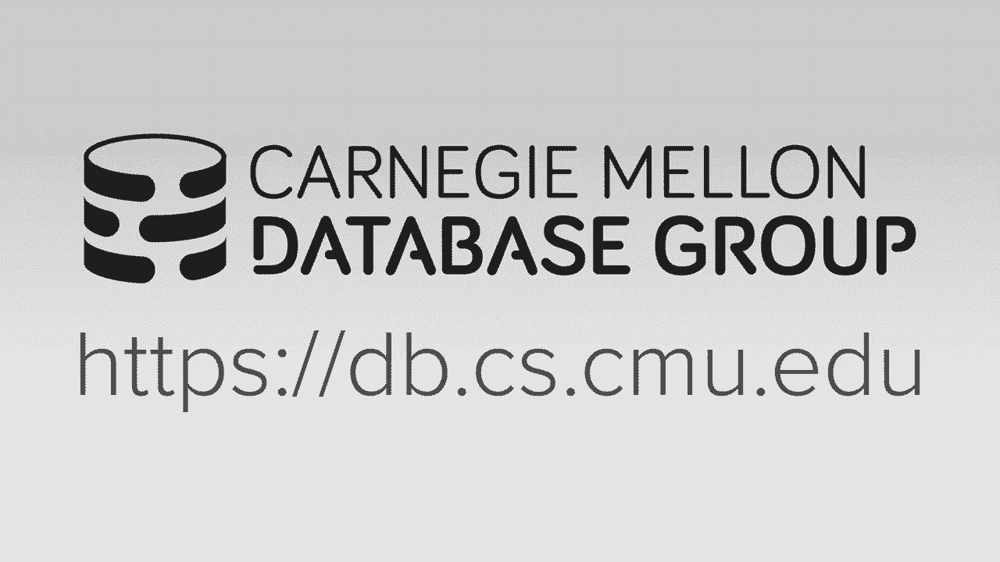
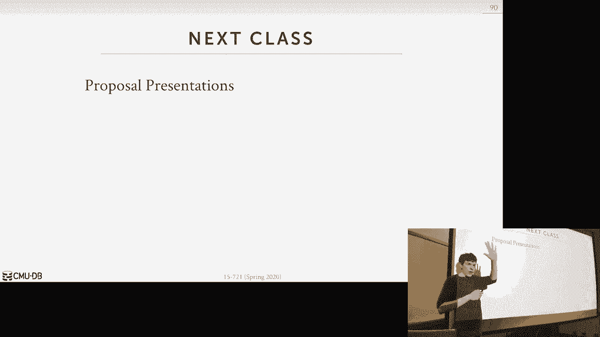

# 【双语字幕+资料下载】CMU 15-721 ｜ 数据库系统进阶(2020·完整版) - P15：L15- 矢量化执行 - ShowMeAI - BV1wv411w7Ko

[Applause]，[Music]。

[Applause]，[Music]，today we thought that Constitution and，as I said compilation and QWERTY。

compilation from glass class and vectors，vectorization are sort of the two main。

methods we can apply in a modern，database system to improve query。

performance so I'm gonna first start，talk about what vector a vector ization。

is what however actually gonna use Sim D，and then the paper you guys were signed。

to read was this sort of recipe book or，guide from these the guys at Columbia on。

how to take sort of classic database，algorithms to do various things we need。

in Saturday to system and implement them，using the Cindy and I like it because。

again it covers like you know all the，various things would actually need in a。

database system to run analytical，queries the spoiler would be is that。

I'll just say upfront that none of it，actually works with some exception。

because they're gonna make this big，assumption about their operating。

environment which I'll cover when we get，to that and then we'll finish up talking。

about project three topics okay all，right so vectorization is the process or。

the the method we're going to apply in，our database system to take an algorithm。

that was originally implemented assuming，scale or operations and we're you're。

gonna take you know one piece of data，and apply one change or modification or。

operation to it and the I and then we're，gonna convert that to now being able to。

take a vector of data items whether，they're tuple values tuple pointers。

it depends on the algorithm and then now，we can invoke a simpie instruction that。

it's gonna allow us to apply the same，modification apply the same operation on。

those vector of items within a single，instruction right and so we'll see this。

though it's not always going to be there，are there is some prep work where we。

have to put things into these special，registers and then apply to vectorize。

instruction so it's not like we，magically magically can make anything in。

our code become vectorize so again the，paper you guys that we're reading was。

about how to take very specialized or，take very specific algorithms or。

components of the dating system，and and being able to run them in。

parallel so it's sort of obvious why，we'd want to do this right because now。

we can do more work with your，instructions but one of the big。

advantages we're also going to get from，this is that this is gonna be。

independent of all the things we talked，about before we when we talk about。

parallel query processing because that，was all about how to take a query or。

whatever you wanted in our database，system and divide the world cup across。

multiple threads now we're saying in，this lecture here how do we take a。

single thread and make what it's doing，actually being run in parallel right and。

again the speed up you can get，potentially is massive because its。

multiplicative right so say I have a，Algrim that I can run on 32 cores at 32。

threads so I get a 32x speed-up if I do，a fight you know if I paralyze that but。

then now if I'm doing vectorization from，what the work each thread is actually。

doing and say I have a four-lane Cindy，register meaning for a piece of work I。

can run I can operate on four data items，in parallel with one seen the。

instruction so now I'm gonna get also 4x，speed up there so 32 times 4 is 128 so。

potentially I could go from a single，threaded scalar implementation of an。

algorithm to something that I can run，with 128 2128 X speed-up。

now the problems gonna be as as I said，to him earlier before class started we。

are never ever gonna cheat thee that the，maximum speed-up like this is our upper。

bound and we'll see what why when we go，along again as we have a pair of things。

get in registers and out of registers，why we're never actually going to either。

cheapest but like this is a good target，this is something that we definitely。

want to achieve or try to treat to，achieve so who here is taken in 16 for。

18 all right little a little over 1/2，all right who here has never seen Cindy。

before ok that's fine all right，so Cindy is a as the classes heap。

instructions that the processor is gonna，provide for us that allows us to came to。

do these vectorized operations if we do，trash this with sisty which is single。

structure and single data a data item，Cindy is going to be single instruction，sort of。

this notion of Cindy versus sisty comes，from flynn's taxonomy of parallel。

databases or started parallel systems，from like the 1960s and so every。

instruction set for every CPU nowadays，is gonna have and support for Cindy。

operations just the name of what they're，gonna call the class of these extensions。

or instructions is gonna be different，paper you guys read us all about Intel。

stuff and in their world it's SSE or ADX，and paper you guys were deemed favored。

it's 2015 I think so they were dealing，with avx2，which is 250 256-bit registers the state。

of the art now is 200 and sorry 512 12，bits power from IBM has this thing。

called altivec arm has their thing，called neon and then a few years ago the。

action proposed something called SPE the，scalable vector instructions。

so what's guy should be really cool，about this and I don't know if anybody。

actually implements this yet is the way，these they sort of set up the。

instructions is that they're not gonna，be specific to any register size meaning。

they'll have a sort of a sort of generic，class of vectorized instructions and。

then depending on how it's implemented，in the actual CPU you you can then。

operate on like you know 1024 bits or，512 bits at a time right when all this。

Intel stuff like avx2 or instructions to，do 256 bit simply instructions then 512。

soar 5 in 12a and you can't just like，you you can't just take these run it on。

a newer CPU and think you're gonna run，on these ones you have to rewrite your。

your code to actually be aware that I'm，running on a larger larger size。

registers so let's look at a really，simple example of a simpie operation so。

say we have two vectors x and y and we，just want to add together the elements。

of X with the elements of Y at each each，all set so the way we would implement。

this you know in intro to CS class range，or database class it's just we have a。

for loop where we know the size of the，vector assuming the same size and then。

for every element X and the，corresponding element of Y we add them。

together and we write them into to the，output vector Z and so the way we would。

this would get implemented or executed，with sisty instructions is just again。

taking the for loop ripping through and，taking you know one element from x one。

from why invoking one instruction to do，that do the addition and then writing it。

to a upper buffer now with Cindy what we，can do is we're gonna take a vector of。

elements from these two arrays and then，combine them together in a single。

register and then invoke one cindy，instruction to add them together and。

print and produce our output buffer all，right so we're gonna take four elements。

here so we would say this is a 4-lane，register and assuming we have 32-bit。

integers we'll say this is a 128-bit，Simbi register so once we populate this。

register we then invoke the simpie，instruction on those two registers and。

then it's gonna write out some output，result to another cindy register that's。

going to be the same size do the same，thing for the next four elements evoke。

the sim D and now we produce our output，yes this question is this question is。

loading into a cindy register just as，fast is loading into a like a regular。

you know single data item right sure it，depends on where the data is located。

like if you're doing that selectively，store thing we talked about that Stefan。

can be slower is Miss pans multiple，cache lines it's more work I think the。

way I think the way x86 works is you can，only do one or two loads and stores per。

cycle so if this thing's really wide you，may have to do multiple loads and like。

across multiple cycles whereas like，writing one thing into the to a single。

data register is super fast and that's，what I'm saying you're never going to。

achieve the theoretical maximum speed-up，just because there's there's overhead of。

putting things in here right but，certainly in the case of this you know。

it this would be a really good trade-off，because we went from eight instructions。

to do it to do the addition to two two，instructions that probably give me a win。

so this question is if we go to 512-bit，registers in avx-512 that's going to hit。

our cache line limit does that mean now，the loads into it are gonna be more。

expensive and they started the stores，getting the data out with that and it'd。

be more expensive than this because I，can't beat the spammable cache lines if。

you're not if you say if you're not，cache a line yet like depends where this。

data is also like think of this is like，this is hanging out in l1 so l1 is in。

Exodus 32 kilobytes so we could take all，the data you want to store and keep that。

in l1 and then it's not like we're going，out then then when you go get it all。

right all right so what can we do with，Cindy well I showed some basic。

arithmetic operators and again under the，at least for x86 for the sve I think。

they start the same issue like like the，register side the size of the register。

will be will be fixed but like it，doesn't necessarily mean that the the。

size of the Lane has to be fixed so my，example here I had at 128 bits and。

therefore I had a simile instruction，that could take 4 integers and add them。

together but if I had 16-bit integers，there might be another instruction they。

provide to know how to take eight 16-bit，integers and add them together right so。

typically the way you when you when you，write Sindhi code you specify like I。

know what what with the data type sizes，that I'm operating on we talked about。

how to move data in and out and then，there's all these logical instructions。

to do comparisons on you know a bit，manipulation we can do comparison。

instructions and that will need this to，do predicates to say we know whether。

something equals something in our where，clause shuffle instructions is the。

ability to take the output of or take，one sim you register and write it into。

another simony register all right and，this is give me a big win for us cuz now。

we don't have to take the output put it，in l1 and then write it back out into。

another register we know directly from，one register to the next and then the。

other random things like we'll see in a，second like the the take the data that's。

sitting in l1 and then，revert it into the form that the same，deregister ones or if now we have。

something in our simply register maybe，we want to write it out to memory but we。

don't want to pollute our CPU cache so，these these these streaming instructions。

allow us to take the output directly，from this Indy register and put it put。

it right into memory without going，through the normal cash in hierarchy all。

right so the Bay I main idea what we're，trying to achieve here is by having all。

these different instructions you know we，can try to do it as pack as much useful。

data we want into our semi instructions，and do as much processing as we can all。

in that data while that they're in our，semi registers before we have to go。

shove it out into memory right and these，like especially this these these。

conversion up or so that the shuffling，operators this is gonna allow us to do。

this will change some operations，together you never have to touch CPU。

cache and then we can produce the，results that we want right because last。

one here is also super important to，because especially for joins like if I。

know that I'm doing the join the tuple，matches but there's a pipeline breaker。

above me and I can't I can't do anything，with the output of the join I could then。

shove it out the memory because I know，I'm not gonna need it again until I come。

back and go to the next pipeline so this，these streaming functions allowed me。

your streaming instructions allow me to，like use the data that's in the seamy。

red shirt and then you know put it out，into memory before going back to it。

alright so we'll see after this after，the spring break and after the the。

project proposals next class how we can，use some of these techniques and in our。

joint operation as well yes the question，is these these seeming structure。

streaming structures sound very nice are，they available for non non semi。

operations yes I think so I yes I think，if you streaming writes I think that's。

what they're called in in x86 yeah ok so，again we're going to focus on x86。

because that's the dominant CPU，architecture and this is just showing。

you a history of over time how the the，Intel is expand this of course。

poor for for you know for Cindy the very，beginning it was called MMX and this was。

like it's like super primitive but this，is like I got a Pentium 3 days or。

pending two days until we have this big，marketing pitch about hubby's I think。

MMX actually didn't stand for anything，Intel's afraid of getting sued so like。

they just took three letters put it，together I think now people think of。

these as like multimedia extensions but，at the time I think there was a lawsuit。

where someone claimed that an intel，stole their MMX name from some other。

company but then they found all this，internal documentation that showed like。

oh it's three land random letters it，means nothing all right，today I lost that lawsuit but it very。

beginning was super permanent right it，could only do some basic operations on。

32 or 16-bit integers and this early，version as well it would it would be。

this the the CPU wouldn't be normally，executing system instructions but then。

when you executed assembly instructions，you had to pause the syste stuff do the。

sim D and then start back up the the，sistine after that after MMX when SSE。

came out then you can actually do these，in parallel that's what I was saying。

before about how with an atom or a tall，order CPU architecture we can have。

different parts of the CPU doing，different things at the same time right。

you could have executing some similar，instructions on on the city registers。

what while we do you know stuff on，regular CP registers what's the MMX you。

couldn't do that and in the modern era，it started when AVX came out I don't。

think there's any I think this was just，a naming change because they went from。

120 bits to 256 bits and then instead of，calling this a vx5 which would make。

sense when they called a bx 2 or a VX，whatever like they call it 512 and i've。

looked online and as far as I can tell，they have no plans to put out 1024 bits。

so this is sort of the where we're at，right right now，and this link here will take you to this。

awesome video from the sky James randhir，who was a like a Sindhi designer or。

evangelist at Intel and he basically，shows all the awesome things you can do。

is Cindy not it's not a database person，it's just like it's showing you how to。

actually flex the heart ring get the，best you know get the best bang for the。

buck and I highly recommend this video，like it's I think it's like an hour so，long。

all right so uh so there's me trade-offs，obviously using Cindy it seems like it's。

a magical thing or we're not always want，to use and of course yes in some cases。

we will see will get a significant，performance gains if we use them but the。

tricky thing is gonna be is actually，implementing an algorithm to use。

vectorized instructions is is not gonna，be trivial and as I said in some cases。

it's actually gonna because in the，Columbia paper that make certain。

assumptions about the environment in a，real database system their assumptions。

don't hold and actually Cindy will hurt，you so what we'll cover what that is。

okay and again this is this is the issue，we're gonna have of getting things in。

and out of the registers are the reason，why we may not always get the speed-up。

we we want to achieve okay so now part，of the reason why it's gonna be tricky。

is that there's no magic flag and the，compiler that's gonna match take all our。

database in from you know database，system all the source code and be able。

to paralyze everything right for for，simple things maybe but for the more。

complex things we're doing with the，process queries it's just not gonna。

happen so again if we want to have，vectorization in our database system。

people pay you know people pay you money，to go do this right because it's hard。

let's see how we can actually achieve，this so the three ways are the automatic。

vectorization from the compiler and then，we can then pass hints to the compiler。

and tell us what what we actually want，and then there's also writing our source。

code with explicit vectorization using，cpu intrinsics okay so the way to think。

about this is like the easiest one to，use is the one at the top because that's。

just hoping the compiler figures it out，the more in the bottom is the hardest to。

use but we'll have complete control of，what's going into our registers what's。

command what instructions were executing，so again easy to use that better better。

control but harder to write okay all，right so automatic vectorization is just。

saying that where the compiler can，identify when we have chunks of source。

code that inside of a loop where the，kernel of the main operation inside that。

loop could then be converted into a，vectorized instruction and so for free。

loop's this is gonna be easy to do but，the problem is simple loops are not。

going to be very common in the the main，thing we want to speed up which is query，execution all right。

so in obviously this requires your，Harvard to have the support experience。

in the instructions but pretty much，every you know every modern intelligent。

net today whether you have 256 or 512，it's actually I don't know the laptops。

have probably avx2 but any modern Xeon，you know you buy today will have 512 all。

right so let's look an example here so，here we have a for loop here and this is。

sort of like the the vector wise，primitives we talked about before where。

they were going to have the predefined，source code to do the the basic。

operations you would need to execute a，query to process you know process data。

so what is this doing this is taking，three pointers x y&z the same thing we。

showed in the very beginning and then，we're just going to iterate over every。

element X and every element of Y and，write them to an alpha but buffer Z so。

my question to you guys is is this，something the compiler can automatically。

vectorize your shaking head yes why，what's that he's saying bleep own。

rolling but that's not that's not but，that's not that's not in using Sindhi。

instructions right so he said after you，loop yeah say yeah you would recognize I。

have four lanes in the instruction or，send me registers so I unroll it four。

times and then I and then you know then，I can vectorize that who agrees or。

disagrees bingo that's it yes so it's，not legal to automatically vectorize。

this because he's exactly right that you，don't know what these are at compile。

time right and it may be the case that，these are actually pointing to the same。

chunks of memory so now you have，unpredictable side effects of when you。

actually start doing your computation，yes he said he could do global analysis。

that's not a static you can't do that a，static statically at compile time you。

knew that word sure you can run it and，go you can run your database system with。

this function check it right and like，you may never see the case where these。

are actually pointing to the same thing，but you don't know that because you。

don't know you have you know nobody，you've seen all possible inputs to the，database system。

yes you're basically claiming can you do，optimistic vectorization where the。

compiler could insert some kind of magic，here，do the vectorized version or somehow do。

some an analysis on what these guys are，and see whether this would have gotten。

stomped on inside the vectorized version，and then if if if no go ahead and keep。

my result if yes go back into the scalar，version I think tom is like well if you。

pass like what you're saying so I'm just，showing this global variable but you'd。

have to pass that in right to this to，this to this function so that you would。

then know and then you have to know that，all right I'm gonna loop through from。

zero to two max for each of these things，then check that yeah I that sounds like。

if you do what sorry if he announce if，you know all possible inputs Haley's。

analysis I let's let's talk with that，efforts III don't actually what you're。

planning but I mean the really simple，issue is like if my if Z is just the off。

the the memory location of X plus one，what's gonna happen here now I take X x。

and y and I write that into Z but now，when I come back I'm clobbering for the。

second loop now I'm clobbering the the，second element of X and that's gonna。

produce completely incorrect results，right we want to be able to vectorize。

this such that the output of the，vectorized version has been exactly the。

same as the as the scalar version right，so reason why this is difficult to do。

for a compiler the handle is it's just，the nature of how we write c c++ right。

we're writing this code in a way，describing this algorithm with this，computation we want to do in in。

sequential terms and write over one，element at a time take two numbers add。

together right into this to this buffer，so that's again that's that's seeds are。

sort of not set up to provide the，correct hints to the compiler to。

recognize that they could do this you，have to do whatever he's proposed me to。

do or the next things that I'm，describing the compiler wins okay。

again the main takeaway from this is GCC，and clang are not gonna be able to。

vectorize that much ICC from from Intel，their proprietary compiler is much more。

better at this but even then in many，cases it's not gonna be it'll do because。

it's not gonna know what's going on here，all right so what can we do against we。

can provide compiler hints to tell the，compiler that we know that there's this。

piece of code that's safe for it to，operate on in a vectorized manner right。

and so the two basic ways we can do this，is either tell the compiler something up。

that we know about the memory locations，that can we could be ever be passing。

into this function or we just tell the，compiler hey you know to take you know。

unbuckle your seat belt take the safety，off your gun like like just go buckwild。

and do whatever you want I don't care，right so the first one is the restrict，keyword and。

this is a flag we can add to in our C，code or sleep a pulse code that。

basically says that we know that these，are distinct memory locations and。

therefore it's safe for it to vectorize，and anything that comes below this so。

this is in the C standard I don't know，whether it's I don't think it's in the。

C++ standard but as far as you know as，I've tested before it's like GCC and，clang whoa。

we'll handle this right so again it's，basically saying that we're allowing the。

programmer to declare that these，pointers are will will never share the。

same data or you know the same memory，locations and therefore anything that we。

do under here will not have weird side，effects that was unexpected right but of。

course it's gonna be up to us as the，programmer to make sure that we know。

what we're doing when we when we tell it，hey don't check these things because you。

know after it's already compiled then we，have no way to protect you know enforce。

that the other approach are these -，these pragma hints and this is just。

basically saying that within this，function you don't do any of those。

memory checks this is like sort of a，more sort of brute force but a more。

coarse grain definition that it's okay，to do vectorization here whereas in a。

restrictive or you know it's more，fine-grain on individual elements right。

so this one is saying IV depth saying，ignore vector vectorization dependencies。

there's other ones I think other，languages like symbiote on Cindy off，okay。

I don't know how I don't know how，portable this one is I think this might。

be working for GCC I don't know what a，clang or ICC do something different。

right or like we're using these other，like libraries like OpenMP they have。

their own own Flags it's they're all，they're all I test be doing the same，thing all right okay。

so again the main takeaway from this is，that we can we can tell the compiler we。

can what we can do what it can do but，it's still all frosted the Davis。

developers - to protect ourselves，the last one is through explicit。

vectorization we're going to write the，exact same be instructions that we want。

to execute and again we have to know，what the register size is we have to。

know what the datatype are operating on，and then now there's there's no question。

about what to actually do because these，intrinsics are essentially syntactic。

sugar that the compiler replaces with，the exact，instruction to do whatever is ever asked。

me to do the downside of intrinsic is，that they're not portable meaning if my。

code if I compile I write all the x86，intrinsics but I'm not running now I'm。

compiling my data system to arm they may，not support that or if I'm compiling my。

code and it operates on the avx-512 and，then I try to compile it on a machine。

that doesn't have those registers it's，gonna fail or it might actually replace。

them with the scalar version of the，operation if it's nice and I may not get。

into the vectorization that I'm，expecting so here's the here's the SSE。

implementation of the actually this MMX，the EPI this is a Symbian tation of the。

same same the same folder and then，adding together two vectors and now you。

see what I have to do is there I have to，take my sort of C C++ vectors of numbers。

and then convert them into the expected，sim deregister vectors right and then。

this operation here is now doing the，addition or loading things in you're。

just doing the addition on 32-bit，integers and then loading it into this。

the simply vector here right，it's ugly the the double underscore is。

is is what is how we do how these GCC，defines intrinsics I think clang does。

the same thing and so you you can hide，this with like a library that has a。

bunch of macro tricks to make you do，this but there's no sort of one vibrate。

everyone uses you looking to get help，you see a lot of times you see explicit。

instructions like this okay so for our，purposes in our own system and in the。

company of you guys read they're gonna，do this explicit vector vectorization。

because they won't have again，fine-grained control exactly what the。

CPU is doing alright so now that we know，how to write Cindy instructions what are。

the kind of Cindy operations we could to，do so the first thing we need to talk。

about is like what direction are we，applying our vectorization so the。

difference is horizontal versus vertical，so with horizontal the idea is that。

we're gonna apply some operation on all，the elements together that are within a。

single vector and then produce some some，single output or scalar output。

so like say I want to take my register，has the number zero one two three and。

then I can evoke a Sindhi horizontal，instruction that just takes all the。

elements in my vector and then produce a，single scalar output that's the sum of。

all of them so this one is only found in，the new instructions that support as his。

SSE for and avx2 so that's roughly，2015-2016 anything or anything newer。

than that should have it the next one is，the vertical one and the idea here is。

that we're gonna take two vectors apply，some steam the instruction on them and。

we're going to match up based on the，offsets when the in each vector so this。

is offset 0 this is also 0 and then，we'll add them together and then we'll。

write that out to offset 0 in our output，vector so the Columbia paper is gonna。

kind of do everything based on this I，forget why they said they didn't do this。

I think at the time I think they，actually the CP they looked on we didn't，have it all right。

this once again this this is the more，common approach all right so now so。

going forward we're gonna assume that we，have these intrinsics then we're gonna。

do these divert the vertical，vectorization and now we want to do a。

bunch of different things and our in our，in our database system to construct。

primitive operations that are vectorized，and then we'll build up from those。

primitives and do the more complex，things like the joins and the scans and。

the other stuff that you would want na i，know you know what i have to do when you。

process queries so again I like this，paper because it's just it's like。

everything like here's all these，different techniques that we have。

actually the source code implementations，I have you have you how you design all。

these algorithms and data structures to，take advantage of vectorization all of。

them we're not gonna need but I want to，cover like sort of the main the main。

primitives ok so again I've already just，said this so this is all about how can。

we can do primitive operations that are，vectorized then do more events。

algorithms and functionality in our，database system the system they're gonna。

run on is actually not a full-fledged，database system it's just like a little。

testbed prototype that does you know，it's too，hand-coded to do the one operation that。

they're trying to measure said means，there's no sequel parser there's new。

transactions VOC query processing and it，also means that they're not going to。

materialize the output in those cases，which oftentimes is is a big overhead in。

in implementations the other big thing，and this is the big assumption that I。

was saying before is that in their，operating environment they're gonna。

assume that the database fits entirely，in the CPU cache that is not realistic。

right because like l1 is like 32，kilobytes l3 is like maybe 64 megabytes。

if you have a lot of money like there's，no database that's gonna fit you know。

your CPU caches and what you'll see in，the next paper you read after the spring。

break is that if everything now does not，fit in the CPU cache this Cindy stuff。

actually doesn't doesn't matter at all，right unless you start doing the the the。

relaxed operator fusion stuff that that，will read about next like how to。

actually you know sort of stage your，operations so that you can operate on。

vectors within your CPU caches and then，you can prefetch the next piece of the。

next vector you're going to operate on，to hide that latency of the memory stall。

and they're all they don't do any of，that it's just like everything's might，quickly。

okay the other big thing that they're，gonna have in their design decision for。

their algorithms is that they want to，maximize the Lane utilization so that。

for every single time you invoke an，instruction you're always doing useful。

work for all the data items in your，vectors all right this will make more。

sense when we talk about how they do the，hash table probing but the idea is that。

I don't want to say I could put four，elements into my vector but only two of。

them are I are one of them I actually，need you have the rest were actually。

garbage I can throw away they want to，pack in all you know all unique data or。

useful data and every single register，for every single instruction so that。

they're maximizing the utilization all，right so let's start with the。

fundamentals that they're gonna define，select a low slept of stores and then。

the gather and scatter and then we'll，see how we can then use these to do the。

scans and hash tables and and the，histograms okay so with selective load。

the idea here is that we want to take，some，some some chunk of memory we have in our。

in our l1 cache and then we want to，write them out to a register but we want。

to provide this mask to tell us what，elements we actually want to store。

because without this we do have to take，everything and write it out like all。

continuously which means that if we only，want certain items，we'd have to copy it then you know and。

in all in our CPU cache then align，things the way we want and then right。

into our register so the idea is like we，can take a chunk of memory that has some。

things we don't want and don't want，provide this mask and this tells us how。

to populate the register all right so，again the lane is like this the mask。

offset here corresponds to an offset and，the vector so the first thing we do is。

look at the first element the mask the，bit is set to zero so we're gonna skip。

what's what's in here right there's，nothing else we want to write out into。

this Lane then we get into the one here，and that's gonna tell us at the first。

offset that we've been writing into so，sort of thinking like this every time we。

have a one there's some cursor here，that's gonna copy out what's in the。

memory address of the memory location，and then when we move to the next bit if。

there's another one we would move the，cursor over by one so even though this。

is offset too or I'll offset one in our，vector we're starting at offset zero。

from memory because we didn't knew we，didn't write anything for all set zero。

so now this would get mapped into that，and we write it up in here and then the。

same thing for the next one there's a，zero so we skip that now we have a 1 and。

then the cursor moves over here for this，V and we write it to offset 3 up and up。

in the vector right the Selective store，is the opposite of this as where we have。

our vector and we want to take its，contents of its elements and write it。

out to 2 to memory so again the lanes，match up just as before so we can start。

here with a zero and this is saying we，don't want to copy anything then we get。

here to the 1 and then it's gonna take，the same offset in the mass for the。

offset and the vector then we're gonna，write it to the first location in memory。

and then same thing for this skip from 0，the 1 then read it up there right so is。

another this is another spoiler of this，of this paper is that。

there are no Cindy instructions no Zeon，does not currently support doing this。

like like with a single instruction it，has to be emulated doing other semi。

operations and every year I always，google to see whether check out Google。

to see whether select the stores like，this load has been implemented in in in。

x86 and the only thing ever shows up or，free things either the Columbia paper。

that describes that the technique my，slides from this class or people in。

Korea or Wisconsin stole my slides and，talked about the same thing I will see。

what they look like in a second um so，again and this means that you also know。

you can't do this atomically this to be，multiple instructions to make this work。

and the idea of what they're doing is，the reason why you'd actually want this。

again is that I don't want to have to，you know take the chunk of memory and in。

and copy things over over never again to，line at the way I want before I load it。

and write and load it and take it out，ideally if I could do this in the single。

struction that'd be great but it doesn't，exist all right the next is gonna be。

this the the scatter and gather right so，with gather the idea is that again we。

have our index vector that lines up with，our value vector and we want to take we。

want to take elements that are in memory，and then write them out in two different。

locations in in our vector right so，think of these as all set from zero to。

five so when I look at this thing here，the index vector says at all set to。

right which is here right it into the，first lane of my register then I get。

here offset one take take you know take，offset one in memory write it out the to。

the the the second lane or the first，lane anyone I'll say you're looking at。

do this and so far for all the other，ones and again like I don't think。

actually I think Xeon now supports both，of these the the selectively gather and。

the selectively gather there's a，selectively gather and scatter so you，can do this it'll be a single。

instruction but it won't be done in a，single cycle because again l1 can only。

do a one or two loads and stores per，cycle so if I have a bunch of stuff that。

if I'm populating a large register it，may took a bunch of cycles。

know I I don't think Emily does I think，it actually supports this yeah。

could you use can you use selective，gathering to emulate the selective。

loading store from last yeah yes I I，don't think that ketose like the paper。

describes it but it's there's again the，main takeaway so it's not one。

instruction like this is okay scatter，again is the opposite we're going to。

take elements in an a register and then，write them out to different locations。

here so for the first element here at，index vector to that I'm writing into。

memory location too and I do the same，thing for everything else okay so I've。

already said this law before the the，gather scatters are not really executed。

parallel because we can only load so，many things in a single cycle the。

gathers are only supported in the the，newer words since 2014 was when avx2。

came out in the house well prior to that，it wasn't supportive and then again。

these are you have to implement these or，emulate them using multiple multiple CPU。

instructions okay all right so that's，good to forget stuff all right so we had。

these printers now and let's talk about，how we do scans hash tables and your。

partitioning for histograms the paper，also talks about how to you join sorting。

and bloom filters I don't think of it I，don't whether they talk about how to do。

cindy hash functions but we'll cover，that later too as well but we will cover。

these after the spring break we'll talk，about how to do this in the part of the。

radix partitioning hash join or the，photonic sorting techniques let me talk。

about sort merge join so we'll cover，these in more detail after after spring。

break and I think we'll also talk about，this but this one's pretty easy to。

figure out as well okay so again，nothing's gonna work because they're，gonna soon well because assume。

everything is to fit in CPU cache，they're also gonna make this other big。

assumption I should mention this earlier，is that they're gonna operate there to。

assume all their keys or 32 bits and all，their pointers to tuples are 32 bits。

because again they're operating on 201，six bit registers and so for a key and。

value pair that has to be 64 bits in a，real data in memory database system the。

values are sorry the batteries are gonna，be the to post laws of the tuple。

pointers those are gonna be 64 bits and，then keys are often not just gonna be，you know 32 or 64 bits。

sometimes you can have a composite keys，and if you have those then then many of。

these techniques don't work because now，you can't align things nicely in two。

lanes in the semi register right all，right so let's how did you vector I。

selected scans so we solved these two，examples before when we talked about。

query processing this is how we can do a，branching version and a branchless。

version of doing the scan right for the，branching version you have an if clause。

will you check the predicate first and，then if it matches then you then you。

copy the tuple and in the output buffer，and then the branch left version you。

always copy it and then you then check，this you check it by using this you know。

bitwise everything you know comparison，operations so it's not really a branch。

and then based based on the output of，this comparison that tells you whether。

you you increment the offset of the，output vector by 1 or 0 which then。

determines whether if you come back，around you overwrite the last one you。

you you cop it into because you don't，want it there all right and we solve。

this this graph from the vector buys，people where the the branchless version。

of the algorithm always has almost a，fixed cost because you're doing the same。

amount of work no matter what the，selectivity is of the predicate and in。

in the the branching case when you have，low selectivity or very high selectivity。

then it'll do better than the branchless，one but in this middle part here you。

know the the branch misprediction，penalty we're paying in our cpu becomes。

higher and higher and therefore you know，there's cash dolls or the pipeline。

flushes of having to you know undo our，mispredicted branch starts you know。

comes a big bottleneck alright so in a，vectorized selection scan operation we。

can't do the branching version because，there is no notion or no concept of if。

clauses in our in our sending，structions so they're going to do a。

vectorized branchless version so this is，a gross approximation of what the。

algorithm is but now we're gonna scan，through our table and whereas before I。

would get one back one tuple at a time，now I'm gonna get back a vector tuples。

not saying what that with the register，size is whether it's four four elements。

or sixteen elements or eight whatever it，doesn't matter we get a vector and then。

we're gonna load the key we want to do a，comparison on again assuming we only。

need to look at one key well load this，into a key vector and in Tsim deem and。

you know this is just again syntactic，sugar this is not actually really really。

how you to write this code there's no，cindy-lou function then we do our the。

same comparison we did and the，branchless scan where we're doing the。

bit manipulation to see whether we match，or not but then we're writing our mask。

out of to our to our register here then，this is saying if the tuple at the。

offset in our and our vector we got from，the table if that satisfies our。

predicate and we set the one if it，doesn't satisfy a predicate it's set to。

zero then now we take that mask and now，do the Select of a store to the copy the。

tuples we want that match our match to，our predicate enter in our mask to our。

output buffer and then we just take the，we take the cardinality of the number of。

ones we have in our mask vector and that，tells us what our offset should be and。

again there's more loop out there's more，work if you do outside the for look to。

make sure that we don't keep around，things that didn't match in the last。

iteration but I'm ignoring that for now，so again this would be a Sindhi load。

this would be a Sindhi comparison，there's to be two instructions because。

you have to the vector is greater than，equal to and the vector is less than。

equal to but again that's just hanging，out in our Sidney registers that's not a。

big deal and then this is a sim D store，to now take the the selective store mask。

from Deb reproduce from this take our，two bolts I'm ready to our output buffer。

all set in the output buffer right so，here this sells again this is telling。

but this we had this output buffer here，and we keep track of I in eyes where the。

the starting location of where we should，write tuples that match。

right it's actually easier to understand，if you go back to the the scalar version。

right [ __ ] there we go，right so I equals zero I always copied。

into the current offset I if the tuple，matches then this M flag will be set to。

1 so therefore I want to keep whatever I，copied in here so I add add M to I which。

is plus 1 so that when I come back，around now I'm writing at the next。

offset and I'm not clobbering with the，last thing I copied in if this doesn't。

match then 0 then I overwrite the next，time to come around because I didn't。

wanna keep the last thing I wrote so in，the vectorized case this operation here。

you want to count the number of ones you，have that's gonna tell us how to move。

the offset forward and you can actually，do this there's a it's called the rank。

instruction you can do this in the CPU，actually very efficiently if you take a。

vector of things and say get count the，number ones in it that's a sort of。

example of horizontal vectorization，alright so let's look let's look at a，real example of this。

ok let's say now we replace our query，put in real values we want to find all。

the matching tuples where the key is，greater than equal to 0 and the key is。

less than the letter U so let's say now，our table looks like this right we have。

the key Jo y su X and so the in order to，use comparison we're gonna first copy。

this into our key vector right and，that's this this this step here then now。

we do our sim to compare right and，that's this part here and we're gonna。

bad our met but get out our mask and，this is gonna tell us which of these。

keys actually matched and then now we，have this pre computed all set map right。

this is just something we can predefined，and our source code at a time and this。

is just saying the offset at at you know，the implicit offset here corresponds to。

the offset 0 in memory right and up to，you know 1 2 3 4 5 so then now we use。

this to do our sim D selective store and，that skin is what this is saying here if。

I have a 1 here and I would know that，the offset I'm matching here should go。

into the first location here so now，these are just offsets here so I'm。

matching that like alright the tuple，that the vaquita match my cindy compare。

at this offset can be found you know I'm，writing what that offset is so now and。

then I gotta go back now and say whoa I，have offsets 134 if I need to。

materialize the keys up above in my，micro plan tree I'll go back in here and。

jump to that offset to copy out the，actual key right is this clear。

so in my opinion this this is like the，most useful thing you'll probably get。

out of this lecture in terms of like，here's something actually you can do in。

in do something could we actually do，this now in our own system and the magic。

is this offset a pre-computer off that，thing so again as I said if you go。

Google selectively store you'll find the，Columbia paper of my slides and the。

people I've copied my slides and the，reason why I know that copying my slides。

is they don't know what this is they，always include this ju y su x joy was my。

first PG student right that's why his，names in here so you go look at a bunch。

of other slides and sure enough like joy，sucks right，joy suck a geek they copy the entire。

yeah all right all right I don't care，it's fine all right so let's see what。

you performers benefit you can actually，get from this so for this one they're。

gonna do four lanes to me registers and，they're gonna actually compare against。

two CPU architectures so this one here，the xeon phi who here has ever heard of。

the xeon phi well your dad worked at，Intel buddy very few people write Xeon。

Phi with a coprocessor that Intel used，to sell that sort of look comes in a。

bunch of different form factors the，easiest way to think about it was like。

it was like their version of a GPU that，was meant for highly parallel。

computation so it wasn't like you，wouldn't get a you know you know。

thousands of cores as you would from you，know from from from Nvidia and their。

GPUs you get maybe like 60 or 70 cores，but these cores were actually more。

complex than a GPU core they're，basically like the Intel Pentium 4，architecture or like the atom。

architecture later on so like the low，powered very simple but you'll get more。

than you know more of course and then，you get on loozy on so you could have a。

sit down so you'd have it by one you，could have a sit down on the the PCI。

Express bus like look at GPU but they，had did have ones that could sit up。

on the motherboard and a socket like，this one here you could actually have。

run the operating system based on you，know own the Zeon 5 didn't need like a。

busy on to drive everything and this one，here just has this little Omni path。

connector so that you can do like remote，remote memory access to a to another。

another machine right Intel killed this，they were roughly around than a five。

thousand dollars or so high it was an，interesting experiment but for machine。

learning the the GPUs already better，alright so the main thing though I want。

to point out though is the Xeon Phi，they're going to run here is going to be。

a it's an older version of the xeon phi，so it's going to be do in order。

execution so you can't do the，out-of-order stuff that the xeon can and。

it can't do spec it of execution right，so it's gonna take your your your，after another。

all right and and it can't do the just a，to me yeah it doesn't do it doesn't do。

branch prediction and you spec of，execution so if you have a jump and if。

the flush your des pipeline then you，know that that gets expensive so we're。

gonna have four variants of the，selection scan so gonna do the scalar。

version with sixty instructions the，branching versus the branchless and then。

they'll have that vectorized version，which is always going to be branchless。

but they'll do one with an early，mutilation and late materialization this。

just means do i need to copy the the，tuple effort i Matt to the offsets do I。

need to copy materialize it into a，buffer to pass it up to the next the。

next operator in the query plan but，again it's not a full-fledged database。

system so there is no other nothing else，after they do the scan right alright so。

the first thing here you see is that，this the Xeon Phi is going to outperform。

the the Xeon for the the branch in case，and the branch list case because this is。

the the scan up is actually it's a，pretty simple instructions we're doing。

in our for loop and this thing just has，way more cores but I always think this。

is a typo right like it's this thing has，61 course I don't know why I said that。

weird number it's not 60 or 62 or 64，right it's 61 whatever right and then。

this Z on here I think has it's four，cores with hyper-threading so this has，way more cores the。

for this is pretty straightforward so it，can rip through thinking more quickly。

but this now shows you a portent，difference between with the benefit get。

from branchless versus branching when，you can do in order versus out order。

execution so again the the Xeon CPU has，the outer board execution it has the the。

spec of execution and the branch，prediction so in that case the the the。

the branch list one is is it's gonna do，much better right for this as you scale。

up the selectivity all right sorry as，the second biggest lower I don't know。

why this doesn't arc like the other one，oh yeah because in this case here you。

you run out of CPU cache alright so，think of this is like zero one two five。

ten this is like that first part of the，graph I showed from vector wise and then。

when you go beyond 20 or 50 that's when，it crosses so that's why that's why you。

know they converge there in the case，again the Xeon Phi they don't have that。

branch misprediction respected execution，so like copying everything every single。

time sucks in their world because it's a，lot of ways to work when your。

selectivity is really low alright so，here again when you have the selectivity。

at 100% the memory bandwidth on both of，these is what you're paying the penalty。

for trying to get the data in and off of，your CPU caches so it doesn't make a。

difference in either algorithm for the，vectorize one what you see is that the。

in the case of the with late，materialization for both of these it's。

gonna perform the best it's no surprise，because I I'm not copying tuples that。

match like I'm just doing less work but，you have a more pronounced difference。

between the early materialization and，the late winter and versus late。

materialization on the two architectures，again for this one because in this world。

the because the CPU is it's quite simple，the copy instructions become expensive。

and like you know you're just doing a，lot the cost of doing wasted work。

becomes more expensive and then，everything converges down to the same。

performance when you start maxing out，the memory bandwidth right so here's a。

good example also to of like as I was，saying like doesn't matter whether。

you're fanciest indie or not like if the，query in the data，are not amenable to doing vectra's。

operations it doesn't help you alright，this is also another good example of。

what I was saying the beginning about，how you never achieved that the。

theoretical and performance improvement，you could possibly get with vectorized。

instructions so in this case here the on，the Z on this is doing on roughy 2。5 2。6。

billion tuples per second but the semi，version is doing you know rounding up 6。

so it's getting less than a 3x，improvement but we said we had a 4x。

Sidney registers so this should really，be if we're actually achieving that full。

full paralyzation we should have been 4x，faster and we're not because again it's。

that cost of moving things in and out of，the registers that we pay a penalty for。

just because we vectorized maybe one，piece of it doesn't and the rest of it's。

not vectorized that that's going to be a，bottleneck for us ok all right so let's。

look at some other things we do hash，tables is another one I think it's。

really interesting that they talk about，this and they come up some interesting。

techniques again this one we definitely，evaluated and it definitely does not。

work once you're at a CPU cache alright，so say we want to do do a probe in our。

hash table and we're doing linear，probing so we have and the scale version。

we have a single input key well do well，hash it produce some offset for a slot。

number in our hash table well go jump to，that all set can take whatever keys。

inside of it compare it with our keys，see we match if we find a match we're。

done if not then we just keep scanning，down until we keep till we find a slot。

that's either empty meaning mean we know，our keys not in there or we find the one。

that we're looking for right so the only，thing you can really vectorize in this。

particular example you can vectorize，this right there are the the hyper guys。

have a vectorized hash function which，I'll talk about when we talk about joins。

but like that's not the expensive part，the expensive part is is doing this。

comparison and jumping through memory in，the hash table so let's see how we can。

vectorize this using vertical or start，horizontal vectorization so what we're。

going to do now in our hash table，we're gonna expand out the number。

Ellen's restoring purse law so within，each slot we'll have four keys and then。

they'll have we'll have four values，so now we'll meet when we take a single。

key we hash it we get our hash index we，jump to that location we're gonna get。

back four keys then we can do our sim D，compare get get back our match mask and。

then we check to see if any one of them，is one then we know we know we have a。

match we know how to find the offset of，our matching key if there are all 0 then。

we know that there's nothing in this，slot that we have and we just jump down。

to the next location and then do the，same vectorized comparison all right so，for this one。

this one to me this seems like actually，a really good idea turns out not to be。

not to work because they're just there's，so much extra overhead of the cost of。

going getting these things and scanning，and ripping through them you know。

copying this into the Sidney Bechet errs，like that that's the penalty you're。

paying yes so we seem is did we try，software prefetching on this where I'm。

here and then I'm gonna assume that I'm，not gonna match and therefore I'm gonna。

prefetch the next thing but what if I，match then I did prefetch some crap and。

I flew to my CPU cache and then it，doesn't work like this is the cache。

servers are so random that it's like，it's hard to say what you actually。

should do it doesn't in our experience，it doesn't work confession doesn't help。

yeah yeah all right so let's see how to，do this with vertical vectorization so。

before we were taking one key and then，looking for that key in you know you。

know in the needle the single needle in，our haystack now with vertical。

vectorization we're going to take，multiple keys at the same time and do。

our search in parallel for them so we'll，take four keys here，we'll run four hash functions and so。

this you have to do scaler and there's，no Cindy instruction that do。

a four lane hash can we can vectorize，the hash function itself the operations。

women have something like there's no，like humor hash or，xxx hash that can be run entirely in Sim。

d4 multiple elements so we're gonna run，this as a four lips rip through this we。

can unroll the loop if we wanted to and，we'll get four locations in our hash。

function or hash table we'd I'll jump to，those locations and then do it the Cindy。

gather to put them into a single vector，and then now we can do our Cindy compare。

and check to see whether we have a match，and that's gonna produce an offset sorry。

produces a bit mass that is me one if，their keys match or zero if our keys。

don't match but now what's the problem，well so in my last case when I'm looking。

at one key at a time it took if that one，key matches I'm done that key doesn't。

match then I jumped down to the next one，but now I have two of them match to them。

doesn't don't match yes yeah so he said，like and this this is this this notion。

of them they always wanted to have full，utilization of all the lanes so these。

guys match so I don't need to go look，anymore else in the and the hash of a。

seat to find a match for them these guys，don't match so I have to go look for。

them so one thing I could do is just，keep these guys or keep you know keep。

these keys in my register everybody，jumps down to one offset in and they're。

in a corresponding location in the hash，table bring those new keys in and do。

comparison and no matter what the first，key and the last key produce as the。

comparison I ignored that because I know，that I already found them but now that's。

in that I'm getting 50% utilization，because I'm doing useless computation on。

those keys because I already knew I，found a match so I'm just I'm doing。

unnecessary work again so the other，other thing could be say 3 out of 4。

match and so I keep scanning yeah I loop，through the entire thing to find that。

that the key the last key doesn't never，matches and now I just wasted all this。

work so what they're gonna do is they're，gonna maintain，internal bookkeeping to keep track of。

all right well these guys matched and，therefore now I need to go get two new。

keys to replace them they're gonna go，back over here replace the input key。

vector with the next two elements that，are in our column near on our hash。

function and for the this the second and，third key I the hash function is really。

just saying take the last location add，one to it cuz I'm moving down to the。

next location in the slot array but I，get a new starting location for the the。

first in the last key and then do this，all over again jump to those locations。

fill up my vectors and then do my Cindy，compare oh right yes just can you go can。

don't know the answer uh we have to，check like yeah I don't know because I。

think you know there's a trade-off of，like collisions versus speed I I think。

the collision rate might be kind of high，on that we could try alright um so this。

is also not gonna work too when you we，know you don't fit your seat the caches。

because getting all this bookkeeping，overhead to go back to get your keys and。

fill them in it's gonna be expensive，there's another issue with this this。

implementation that is a bit more，nuanced on the engineering side and if。

anybody caught that when they read the，paper like what's one problem you'd have。

at this if you're like the person，building a database system and when you，use this algorithm yes。

the cookery show now is ignore all that，the issue is gonna be that the the。

probic algorithm is not gonna be stable，meaning for the same data set and the。

same query we we could get different，ordered results every single time you。

run that query now okay well，relational model is unordered right so。

so this is we're not supposed to really，care about the order but like if I'm。

trying to actually debug stuff and try，to understand it well somehow the the。

data I'm writing to one register gets，you know one location gets clobber but。

another one doesn't like if every single，time I'm getting completely different。

random results depending on what order，had these things matching my hash table。

then it could be hard to debug things I，I somewhat agree with that i i i don't。

know how much that that is actually in，issue but this is something they said in。

the paper that of all the algorithms，this is the only one that they had this。

particular issue like the selective scan，stuff we talked about doesn't have this。

problem yeah all right let's look at，some performance results so again we're。

gonna roll on the Phi and the Xeon so，they're gonna have the scalar hash probe。

and then the vector ax is vertical and，horizontal the along the x axis they're。

going to crease the hash table size so，with the scalar version the performance。

looks like this and notice that the y，axis scales are different because the。

the xeon phi has more cores than the，other one，the when okay and we're gonna see that。

again the difference though is that the，vertical vectorization will be much。

better for the for the xeon phi because，it doesn't have the it doesn't have the。

the branch misprediction error like it's，always gonna sort of programmatically go。

through and do the you know the checks，in the right the same order whereas in。

the horizontal case your you know you，may have to check you know in direction。

or different non-determinism in how you，evaluate the keys in the case of the and。

the xeon I forget why there's is the，crossing point here where the vertical。

sub got back to got better than the the，horizontal，to point out here is that same before。

once everything is not in your CPU cache，all this doesn't matter right so the the。

Xeon Phi has a smaller cache than the，than the regular Xeon so you hit this。

this sort of convergence point much more，much much sooner so again this is what I。

was saying I I doubts over P fetching，would happen in this case and Xeon Phi。

least the older version stuff they，definitely not have prefix up or。

prefetching that's only in sort of，modern Zeon's，modern last ten years yeah alright the。

last thing I'm gonna talk about is have，you partitioning with histograms and。

basically the idea here is we can use，scatter and gather to do our histogram。

computation in parallel so they say this，is our input key vector we're gonna use。

a sim the latest instruction think of，this or like in the same thing as a。

radix tree where I just go grab one，digit or one byte of each key and I'm。

using that essentially as the hash，function to tell me what my offset。

should be in like it's a it's a cheap，poor-man's hash function and then now。

what I'm gonna do is I take these，locations and then I'm gonna map them to。

some histogram and I'll just do a，Symbian where I take whatever value was。

in the vector I'm writing into and I and，I add one to it alright for everything。

ever it for every matching element，within that location in the vector I'm。

writing to the problems gonna be though，is that I have two keys mapping to the。

same location and again with Cindy it's，going to be atomic so the the。

instruction is add one to this location，based on the previous value is I can't I，can't。

it's not there's no foil to say add one，first time and add one again it's like。

add one based on the old value is so，we're losing one of these one of these。

updates so our counts are gonna be wrong，so the way they can handle that is you。

do a Cindy scatter now to have each of，these guys writing two different vectors。

right so this is the first vector for，the first keep for the first element。

this is the next vector for the next，element and now they're doing the same。

thing we had before with the writing，into the offset of the vector but then。

now they're not clobbering each other，because they're only one you know one。

lane can write into one vector at a time，so now the only thing I if I need to do。

is what the final histogram it is，I just do a Simba had to do the，computation across across this way。

horizontally to produce the final result，all right so I think I think this is。

kind of cool okay all right there's a，finish up quickly vectorization is super。

important for OLAP queries we've already，covered this nothing works when your CPU。

cache and then all the inner query，panels and stuff that we talked about so。

far plus the stuff we'll talk about when，we start to turn my joins vectorization。

is just another tool we can add to speed，things up so in an ideal case an ideal。

system you can do query compilation with，vectorization that also supports。

parallel queries and in our system we're，almost there hyper actually could not do。

vectorization they can only do，compilation and parallel queries right，dr。

 wise can only do I sort of pre，compiled yeah some cases it helps。

sometimes it doesn't help but they could，they could do better ization yes that's。

for rights the rights they have only on，a single thread but for OLAP queries or。

read-only queries they can run those in，parallel that's the mortal stuff we。

talked about wouldn't for the schedulers，okay any question that vectorization all。

right let's finish up with Patrick 3 ok，so the project 3 the pot the goal is for。

you in your group to implement some，substantial or large piece of software。

component or feature in the data system，we've been working on for the first two。

projects and the idea is that these，products should incorporate the various。

topics and techniques and methods and，optimizations that we've talked about so。

far in the course as well as whatever，you interested in your own sort of line。

of work or research or your hobby if you，want to bring that in as well then I'm。

totally fine with that all right because，I certainly I don't know everything that。

you know and think outside databases I'm，very limited knowledge so if you come。

along with something that I don't know，about it would be kind of cool to play。

with I'm totally down with that the，important thing though is that whatever。

you pick for your project has to be，unique from every other group so I can't。

have two people two groups also，implementing constraints because the。

goal is we want to have your software be，able to be merge back into the full。

system so that you know that you know，you go off and，in real-world ago in the and the job。

where I couldn't be able to say look you，know here's this piece of our database。

system that that I helped implement so，what do you have to do well there's me，proposal。

that'll be due after the spring break，then later on before the end semester。

via satis update with design documents，will also do code reviews with each。

other alright so you talk about this in，a second but you mean you have to look。

over other people's code and see whether，they're doing stupid things and a look。

at your code to see whether your do，you're doing stupid things。

and there'll be a final presentation and，then the code drop which is submitting a。

PR on us on github it has a cleanly，merge into our master branch so let's go。

through each of these so for the first，Monday after Spring Break everyone every。

group will come up here and they'll，spend five minutes to talk about what。

you're what you're proposing to build so，this is not just like at a high level。

here's what I want to do you actually，should spend time looking at the source。

code and try to come up with a good，approximation of what will actually take。

for you to implement that particular，feature or component so you should know。

what files you need to modify or add，Hydra acts you're gonna test whether。

your implementation is working correctly，and then this is why I have you guys。

list and every single paper you read，what workloads they used to evaluate。

their their their research you should，know about what workload you want to use。

for your project so right now we can，support some basic ot workloads TATP。

small bank and why says be and we can，support some queries in TP CH but it is。

something else you want to evaluate let，me know we can figure something out then。

we'll have a checkpoint in April where，again you come back up spend five。

minutes and tell everyone what you've，done what you've worked on what the。

current status is of your project if，there's any change in your plans because。

there's something in the system that，like was broken or not implemented or。

you found something else that was super，interesting then you talk about what。

those differences are and this is always，fun to you people who discuss like what。

are some some prizes they found when，they would start looking into the bowels。

of the system like oh I thought it was，gonna work this way but it did this way。

I would the be derek she has a memory，leak right well that's not a surprise at。

this point but like like things like，that right and it was also super useful。

but this is and you'll see this this，definite is happening previous semesters。

is that sometimes one group will need，you know sort of one feature like like。

we need a settings manager or a locked，away to lock tables in a certain way and。

another group might need the same thing，so then rather than you know the two。

groups both implementing the same，redundant piece of software you guys。

could potentially work together or maybe，one group finished or the other group。

and the other group could take their，take their code so this is meant to be。

like a collaborative process it's not，like project one or project you or。

you're in competition with each other，it's meant to say I we should all be。

working together and trying to make the，thing better the design document I'll。

provide you guys with the template and，it's just written in markdown it's。

basically it's a description of what the，what your feature is or what your。

component actually is why you designed，it a certain way you know what are the。

different trade-offs that you have to，consider for this implementation and。

then future work for if anybody wants to，come along and continue with with your。

project you know what could it actually，do if you had more time what would you。

actually do and for those of you that，are considering doing like a capstone。

and a pen study in the fall semester，this is also a useful point for you to。

write down what your state of mind was，at the end of the semester because you'd。

go off in the summer and come back in，the fall and you're like what the hell。

was actually thinking back in the April，May and this is a good you know a good。

reminder for yourself for the code，review again you'll be two rounds of。

code reviews again I'll pair up，different groups so to look at each。

other's code and we'll just use the the，pull request review process through。

through github and I'll spend time in，class to talk about what does it mean to。

actually do a code view you know it's，not like things like you know you you。

misspelled this word like it's actually，spending time to look at the code and。

try to figure out you know are they，making reasonable assumptions or in。

their implementation and what I'll say，also too is this is meant to be。

everyone's mentor can contribute so I，don't want for the like the first。

recurred review one person does it and，the second code review the next person。

does it everyone should be contributing，equally and how we divide up the source。

code for what you want to look at right，that'll vary based on the project like。

certainly sometimes this if you're doing，a I'm gonna file basis sometimes clearly。

some from files on War they more，modified than other files and that may。

not be a good way to divide things up，but well we will discuss ways to handle。

this final presentations will be，whenever we're scheduled for the final。

exam I think some Monday at like 8：30 or，5：30 p。m。 we're not，we're not at the night where we're not。

in the morning with the night so we'll，get Pete so we'll get food but they。

think you just show up spend 10 minutes，to say here's what we've actually done。

and in previous years a few I'm given，demos if you can do a demo for the。

status update that's awesome - like to，show it like hey this thing actually。

does do what we say it does and now we，actually support sequel in our system so。

doing demos should be much easier for，people not project you project 3 so the。

way it's gonna work though is it's not，like other classes where you can write。

some code that's sitting in your private，github repo or your laptop and then no。

one ever sees that nobody ever cares you，have to make sure your code actually can。

merge into the master branch right to，get a final grade the reason why we do。

this is just because one you know it，gives you visibility about what you're。

doing because if you want to go get a，honestly，email me say hey do you know the student。

what do they do and I can point to your，project and here's the actual source。

code so we wanted some cases we want to，merge some code sometimes we don't but。

at least there's a PR that can cleanly，merge passes all the tests and then we。

can point to is like the final body of，work okay we're not a company we're not。

you know we're not trying to sell this，software but we're still trying to do。

high quality software engineering to the，extent that we can in academia and I。

think this is you know actually I had a，student come back he's doing an。

internship at a dangerous company now，and was surprised at how messy the。

commercial source code they were looking，at versus versus our source code and so。

I like to think that like you know going，through this process you get at least。

you know appreciate what is it what does，it take to actually write you know clean。

and reasonable source code so it has，emergent it's a mess branch and they。

have that you know we do all the clang，tidy clang format and the doxygen checks。

as well now the tricky thing is gonna be，of course if there's conflicts between。

different groups so they modify the same，file how we determine if we're going to。

merge things who gets to merge first，this one want to do at random or we're。

taking our case-by-case basis our，success rate has been about 50% so 50%。

of the student projects in previous，years have merged into the master branch。

okay well in terms of resources again，we'll get you more credits for Amazon if。

you submit a PR to our main repo battle，fire off builds and Travis and Jenkins。

we're probably gonna drop Travis because，we're running the，taking too long but the Jenkins one will。

cover like you know OSX and Ubuntu um if，you think you need special hardware。

which I think this year there shouldn't，be anything let me know and we can see。

what we can do okay all right and yeah，you've already guys know this story it's。

a work in progress bunch of things，aren't gonna work some things are made。

me broken but we'll fix it as we go，along all right let's see what potential。

topics so let's go there's a bunch of，these let's go but want one me one so。

the first one is for a query the query，optimizer so we have a full Cascades。

query optimizer you'll learn with the，Cascades actually means and a few more。

lectures so this project would actually，working on the internals of the。

optimizer to add support for more，complex queries more complex。

transformations things like outer joins，which I think we this might be fixed but。

nested queries we need to potentially，improve our cost model actually be defi。

we know we need to improve our cost，model for how we can determine whether。

one plan is better than another but I，would say like I can go more details。

later on about what kind of things you，could do with this but if you do work on。

the query optimizer then you have to the，very first thing you have to do is also。

send me your CV because a resume because，this is the one thing all the database。

companies want to hire you saw if you，were an intro class last year or last。

semester the guy from Oracle came and，he's like yeah we don't JavaScript。

programmers we went from one query，optimizer people alright and I also get。

emails like this like this is from a，pretty famous database person at a day。

startup and he's like emailing a bunch，of people and I was on the list although。

I'm not a senior database person，whatever but he's like hey does anybody。

know there's like any loose query，optimizer people we could hire and。

because they're super hard because like，query optimization was a big thing in。

the 80s and 90s and it's like these old，white dudes that are you know that like。

you know not very likely to leave leave，companies and go join startups so people。

cannot hire these these places fast，enough and like all the nocebo database。

companies that were like oh we don't，need a query optimizer we're just gonna。

do you know get them sets and JSON like，they then soon realized oh we do need a，query optimization。

query optimizer and so people are，struggling to find them so again this。

guy was a bit more vulgar with his，request but same thing he wanted to hire。

people to do to find query optimizer，query ah people can work at the quarry。

optimizer related this for the cost，we don't have any good way to maintain。

statistics information about what the，data looks like so then we can feed that。

into our cost model to make estimations，of the quality of a query so we would。

need a way to collect statistics about，that we didn't feed into the system we。

could also do sampling which is another，technique that Microsoft uses where you。

just make a small little mini table and，copy something data in and then do your。

estimations based on that if that's this，then also been used for a new cost model。

that we can hook it to the quarry，optimizer that would be amazing as well。

if you're more interested in sort of，like like how do you actually queries we。

want to support common table expressions，so right now again we support TPC HT PCH。

is from the 90s it doesn't have CT es is，pretty straightforward CPC des is a more。

complex to sit the DSN sort decision，support say more complex OLAP workload。

analytical work on the NT PCH and this，has a bunch of CT ease but we don't。

support any of that so this would be，modifying our parser extending the。

parser to support the width and union，clauses modify the optimizer to reason。

about you know the the wif clause and，potentially rewriting that to joins in。

some cases and then I don't know whether，it's true or not but you may have to。

also modify the execution engine to，actually support CTS depending on how。

what the queries actually looked like，and I will fully admit I don't know full。

I don't know all the ways you can unroll，or D correlate or rewrite CT es there's。

a there's a actually a really good，textbook from not the hyper guide in。

Germany but his other German adviser so，another German wrote a book about query。

optimizers then we have access to that，describe all the various techniques for。

this so this is something we could do as，well we also use a port for add/drop。

indexes so right now we can call create，index when you create the table and then。

as you insert tuples into a table we，will populate it but if the table。

already exists with a bunch of data in，it and you call create an index it can't。

go back and populate it easiest way to，do that as you pause the execution of。

all transactions do they then populate，it and then turn transactions back on。

but obviously that that's bad because，you're blocking everything so being able。

to do to build the index while you still，up cake up the up，the tables is super interesting a bunch。

of systems are just adding like PostGIS，just add this in the last couple years。

so this would be really awesome to do be，awesome to do this also with parallel。

threads think of this as doing the，sequential scan with multiple threads。

and they're all inserting into the index，related this would be multiple T。

threaded queries the current the current，version we have that you guys working on。

and the system only supports single，threaded queries but there is my PhD。

student per shot has a branch that，supports parallel queries but hey he。

only has the only heads over the，execution engine side of things if the。

idea would be porting over his parallel，query implementation but then been。

modifying the rest of the infrastructure，of the system to recognize oh I can run。

queries in parallel make sure that you，know plan your plans come out the right。

way so they can be paralyzed we could，also start adding support for like the。

pneuma where of data placement，techniques that the hyper guys are doing。

with morsels once we get to the basic，the basic that in parallel engine。

working prepared statements are also，super important we currently don't。

support this so again prepared statement，is a pair of statement it says I'm gonna。

cue this query over never again here's，some placeholders for some parameters so。

you need to like cache that and then you，can invoke it and and and and we use the。

plan over and over again so there's a，bunch of different design decisions you。

have to consider to when you want to do，prepared statements like when you。

actually run it through the optimizer，when you actually decide to replan。

things all the various data systems do，different things and this would be sort。

of an evaluation of the different，techniques so you'd have to modify the。

the wire protocol to handle this and，then make sure and we actually would be。

super awesome to is if instead of having，a prepared statement cache and then a。

compiled query cache if we can unify，them all together that would be a big。

win so my PhD student matt is actually，looking into this now so if we。

interested in pursuing this you know let，me know we can start talking next week。

or this week we compare these support，the write out log which I think we can。

replay the log upon restart this is not，true I think we can reuse to all the。

catalogs but as I said you want to also，be able to take checkpoints we don't the。

replay the entire log so this would be，added support to do checkpoints so the。

I think the simplest way to do this，would be the snapshot isolation。

possession checkpoint and you just pick，you back up with this Winchell scan。

implementation that's available in the，day system now and again this nagra's。

here to see an example where if you can，work in tandem with another team if。

another team is doing parallel queries，and they support a parallel scruncho。

scans you could then support that in，your checkpoint algorithm and now do。

special scans and parallel to write the，checkpoint out and then we want to be。

able to load the checkpoint in after we，start then replay the log all right so。

it sounds I take a checkpoint I'm done，integrating the full sentiment this is。

tricky we want to support constraints，like the Czech uniqueness foreign keys。

and so this is this is modifying the，catalogue modifying the the modifying。

like that the front of the system David，hand this information modifying the。

stores are the excuse change to enforce，these constraints so if I have a check。

clause that says like where value is not，you know not negative I have to know。

that when I'm inserting something I，complied that predicate and see whether，that was true or not。

same thing with foreign keys to，additional things you could do is do。

online constraint changes with alter，mean if I add a constraint that says。

this key can't be null I've to scan，through and make sure nothing is null。

because therefore I would you know if I，try to plug your sharing that would。

already be violated at the beginning，that's bad another cool thing to。

actually be able to do is extend the，query optimizer to be aware of some of。

these constraints like I know that，something can't be negative so therefore。

I may want to change how I do my join or，do a scan alright that's the high end。

systems that can do this that would，actually be super cool sequences are the。

auto increment keys so this would be，added support that we can store。

sequences in the catalog and supply，support the next valve function or the。

serial type so that we can do easily do，auto increment keys this one is a bit。

more tricky because when you caching in，the catalog so that everybody everybody。

everybody calling next valve doesn't，always update the catalog you could have。

something sitting around in memory that，you hand out in batches。

the tricky thing though is you have to，then alright out in the right ahead log。

how that that value got incremented so，if I crash come back the counter doesn't。

start at zero again I don't I don't have，duplicate values different types are be。

interesting to do as well，so we talked about how the numeric type。

from the Germans they claim is faster，than the floating-point numbers and then。

they claim that there's this book called，hackers delight which is Google you can。

find that describes the the sort of the，underlying method for doing low little。

bit operations on fixed point decimals，it doesn't describe exactly how to do in。

the concept of a database like there's，much other stuff we have to do but the，in this book。

so I'm actually super interested this as，well I don't know how to do it but we。

could sit down and learn it together if，you're injured in types I want to do。

something more easy enum type would be，another one you could do and this is。

just like enum you have in C++ or Java，same thing in the idea what you have to。

do is that you would support the at the，cattle will keep track all the enums as。

the array modifying the binder to be，able to enforce those enum constraints。

so someone gives us a value that doesn't，exist you know we throw an error and。

then we have to be able to support this，in the execution engine to know that I'm。

operating on an enum and then，materialize the correct value of when it，produces the result to to the。

application I'm gonna do this quickly，but you know all the slides are online I。

don't have to talk about about this，afterwards so we haven't any talk about。

views but I think of them as like a，virtual table like an define a view on a。

select query and I give it a name and it，looks like a table then now I can run a。

query on that view and treat it as if it，was a table and typically the way it is。

the data some handles this is that it'll，rewrite your query into the the to be。

doing a look-up on on the actual，underlying you know view query so we'd。

have to support the extend the catalog，to put these things we have to modify。

the binder to transform the view into，the original query and as far as you。

know I don't think we're have to modify，this you stream engine you can rewrite。

the views as a nested query and I think，just work and then the optimizer can。

just you know D correlate or optimize as，necessary，alright last two concurrent schema。

changes would be if I add a drop a，column can I do that without having to。

lock everything this is actually super，tricky this is the the second year we've。

tried this we have we think now we have，the infrastructure to be able to do this。

in a very interesting way because now we，can do like this lazy method where you。

say at a column we tell you we added，but we don't actually go through it and。

and you know shuffled at around to add，that that memory location it's only when。

you insert new things or you try to read，back old stuff then we can materialize，it on the fly。

the last one is data compression so we，support Apache arrow and we have support。

for the their dictionary compression，scheme which is very straightforward but。

it's not turned on meaning we can't take，hot data and convert it into a。

compressed cold data block we used to，have that infrastructure but we don't。

anymore so this would be adding support，for convert doing this conversion the。

reason why we don't have it cuz we，because you have to also update indexes。

because you're moving tuples from one，location to another，but then the tricky thing is going to be。

is now modified the execution engine in，some way to be able to process the。

compressed data directly because right，now we can't do that we would have to。

have the data table decompress it before，we can do scans on it which defeats the。

whole purpose to compression all right，so how do I get started。

form a team which is already sorted done，with project two you should meet your。

team discuss your potential topics，potentially look over the source code or。

contact me to sort of point you at what，parts of the source code you want to。

look at I'm around all next week or send，me an email and have a discuss you know。

what are some potential stoppers you can，look up okay all right sorry for going。

over time next class I'll post this on，Piazza with more details but you have。

your prose or presentations five minutes。

and it's a hard limit okay，all right guys awesome thank you see you。

cranked it in the side park what is this，some fools say you're here，[Music]。

[ __ ] ain't dead here called the hawk，it cuz I mochi ice cube down with the，testy。

hi you look and it was go grab me a 40，just to get my buzz song cuz I need it。

just a little more kick like a fish to，just one simple just drop them say nice。

and my hood wants me to say I'm nice。