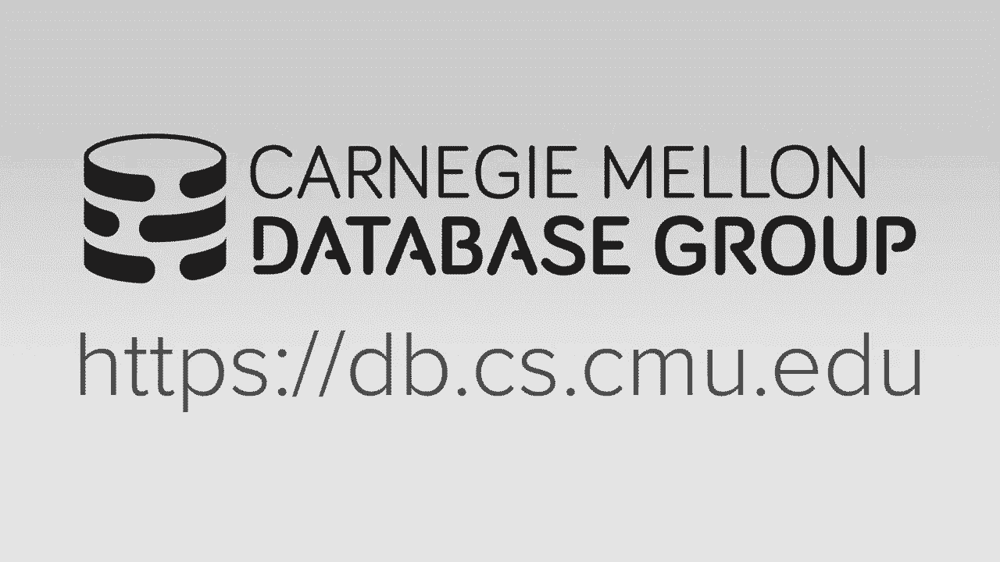
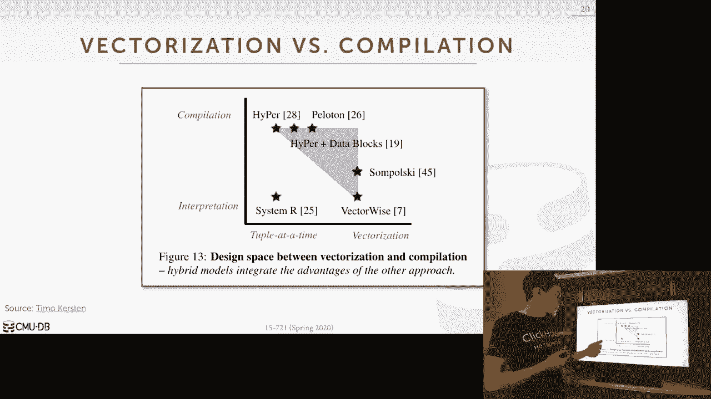
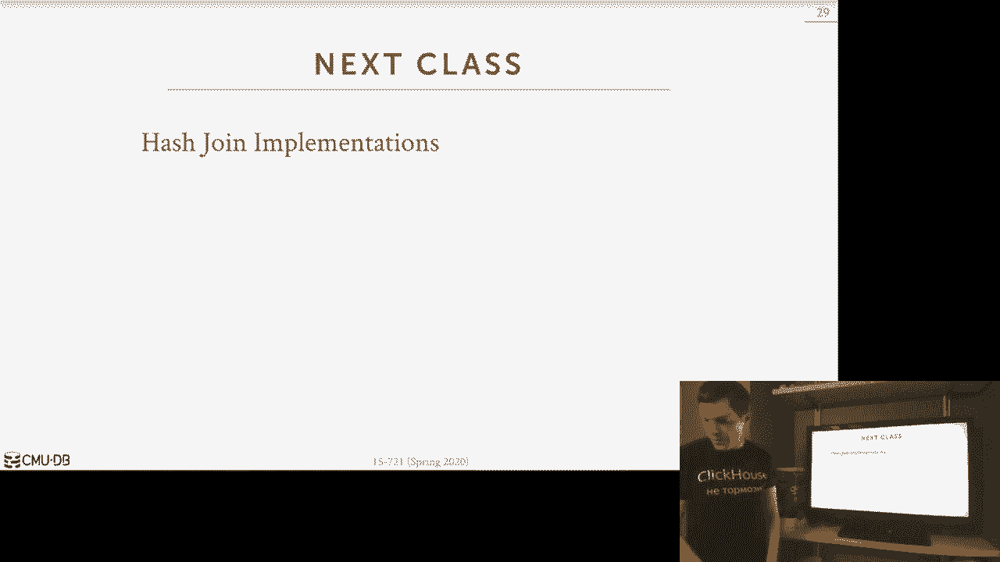

# 【双语字幕+资料下载】CMU 15-721 ｜ 数据库系统进阶(2020·完整版) - P16：L16- 矢量化与编译 - ShowMeAI - BV1wv411w7Ko

[Applause]，[Music]。

[Applause]，[Music]，welcome to lecture 16 I am obviously not，on campus Carnegie Mellon shut down all。

in-class lectures and I can't even go，into classrooms anymore camps to shut。

down I can't even go in there to my，office so I'm here at home recording。

this in my own office it's just me and，then I have the material over here。

sitting in the audience that's watching，this the entire time so just you know。

the two of us are gonna get through this，together okay so today's lecture is now。

going to be a follow-up on where we left，off before the spring break discussing。

the two different main methods to spirit，speed-up query performance and that was。

the vectorization and compilation so in，both cases we saw that you can get。

better query performance execution，performance in out of these approaches。

but we mostly looked at them in，isolation of each other and so now。

today's lecturer and today's paper you，guys were assigned to read is about now。

to understand that the the in what，circumstances would want to approach be。

better than another and the reason why，we want to we want to discuss this the。

TV to these things together is the these，are major architectural decisions you。

have to make about the design of a，database system and whether you're going。

to accomplish or not or the，vectorization route and so it's，important for us to understand what are。

the trade-offs for each of them so that，you know if we're building a brand new。

system we can make this decision early，on because it'd be very difficult to go。

back and retrofit an existing database，system to either introduce you know。

these different concepts I will say on，time typically I think adding in。

vectorization to an existing would be，easier to do than compilation but either。

they either way that both of them are，you know pretty pretty significant。

changes so the today's lecture is that，today's pay，burr was consider comparing this the。

vector wise approach which is the hyper，approach now the they sort of claim that。

it's that the two are mutually exclusive，and well so see something at the end。

that we've done here at CMU that shows，that you can actually blend the two。

together but for at least for initially，let's assume that it's it's either one。

or the other so let's go back now and，let's sort of do a quick refresher of。

what vector wise looks like or what you，know vector lies execution model looks。

like and what is the compilation，actually model look like in hyper so。

again the the vector wise approach was，that they were gonna have all these。

primitives written in the database，system that would do a small portion of。

a the execution of a query so primitive，might be like evaluating a predicate。

with the you know quality less than，greater than right you have separate。

primitives for all of these but and then，you have one for each each type your。

database system supported so the idea is，that the database developers would write。

all these primitives and then make a，compiled into the binary the database。

system binary that shipped to any，customers or users and then at runtime。

when a query shows up the way they're，going to execute the query plan is that。

they're essentially kind of stitched，together all these primitives in a plan。

overall that's it that's interpreted，that can allow them to invoke these。

primitives at the right time in order to，execute the query it produces the crap。

result so now you'd be thinking all，these primitives are just all function。

calls isn't this gonna get expensive，well yes because again that's like a。

jump in your in your execution code and，you know that that's that can be。

expensive for for modern superscalar，CPUs but the way they're going to avoid。

having these function calls slow that，slow them down is that they're going to。

amortize their cost because for each，function call to a primitive they're。

gonna be passing in a vector of values，that they can then process in batches so。

you wouldn't be doing this for every，single tuple I mean building a primitive。

so the output of all the primitives are，just going to be now all sets of the，tuples that match。

or whatever that satisfy whatever the，the primitive is actually trying to do。

so let's look at a high-level example，like this say that we have a select。

statement select star from foo on a，string column equals ABC and integer。

column equals 4 so the query plan for，this is super simple right it's just the。

sequential scan on the table and then I，have my predicate operator my filter。

operator that can apply the the，conjunction clauses of these two so wave。

vector wise would work is that for each，of these predicates I want to evaluate。

they would be a separate primitive based，on the the column type so this first one。

here it's a string column so I would，have a separate primitive that would be。

able to process a vector of strings from，from my from the column I'm scanning。

passing in the value that I'm looking，for then now I can just do a for the。

over that column and check to see，whether my my-my-my，value in passing in matches and if so。

then I and I append the offset of the，tube of that mesh in my output vector。

and then calling this the output vector，of all sets right that's a synthetic。

thing just usually just integers but，here's just a way to indicate that it's。

an offset not a regular integer so then，now for the second predicate I have。

another primitive but in this case here，instead of actually taking in just the。

column and the value that I'm looking，for we also have to be provided a vector。

of the offset positions that satisfy my，first predicate so then now in my for。

loop I'm scanning over those positions，rather than just the the opposite of the。

columns ok what was that was that okay，all right so the Terry asked the。

question do I exercise these vectors，ahead of time because like in this case。

here I don't know how many how many how，many two boys are gonna match in my。

offset vector you know should that be a，fixed size should be variable length。

size again we are doing this on batches，of tuples so you could just allocate。

this to this just to be the size of the，the max size of the output and then you。

just record you know where you left off，I'm sort of this is a simplified view so。

I'm not really showing that it's a good，question Terry thank you all right so。

the hyper approach again the is to，compile queries so instead of having。

these precompiled primitives you're，going to generate on the fly at runtime。

for every query the code that you would，then need to compile for that particular。

query plan so no longer do you have to，do any interpretation to know like yeah。

I'm accessing this column in this，columns this type therefore I need to。

vote this primitive you're just begging，into directly into the query plan。

exactly what it's be doing based on what，you know this schema of the table is。

spent from the catalog so it's the hyper，poche is sort of more than this。

compilation and this paper sort of gets，into that right they're doing this。

bottom-up or push-based model where the，bottom every single pipeline they're。

gonna be there your scan over the input，the input table or whatever the the。

output the pipeline below you you're，scanning over the tuples one by one and。

then what happens is instead of scanning，one tuple doing one operation and then。

going to the next to pull in for that，pipeline you're actually gonna ride that。

tuple up the pipeline all the way as far，as you can until you get to the top with。

a pipeline breaker and then you loop，bloom，the idea here because we're pushing that。

tuple all the way up we can maximize the，cache locality in some cases were able。

to actually guarantee that the tuples，reside in the CPU registers which are。

faster than in CPU caches and that's how，that's how they're getting better。

performance so the as written or as，described in the 2011 paper with hyper。

and with the newer version Umbra that，the Germans have been building the the。

this compilation model is not assuming，that you're doing any vectorization。

right it's that push based model is，getting is grabbing one tuple writing it。

up the pipeline but we'll see at the end，of this lecture we'll see a technique。

we've not redeveloped that can it can，combine both of them，so this is just an example of what the。

that's that squiddy would look like an，hyper just to do the scam again so now。

instead of having two separate functions，for each predicate I'm just gonna have。

sort of one function that I would cojan，that would take in the string column。

taking the integer column and the two，constant values I'm trying to compare。

against them with Adventist iterate over，one tuple at a time and then I do all。

the predicate evaluation for that one，tuple before I go go on to the next one。

right okay so again the good paper that，you guys were signed to read is sort of。

ant trying to answer this question of is，it better to stitch together those。

pre-compile primitives as in vector wise，or should we do the holistic compilation。

like in hyper and with that that，push-based processing model so again the。

first part of lecture is trying to，understand these two distinct design。

approaches and then the second part will，be finishing up with how the way first。

sort of blended them together into a，hybrid query processing model okay。

all right so the paper you guys design，to read was about evaluating these。

different approaches and the way they，went ahead the way they did this was。

that they built a single testbed system，that would allow us to do a true apples。

to apples comparison of the two，approaches without having the results。

encumbered or affected by all their，features or other implementation aspects。

of the database systems so what I mean，that that is the this they're going to。

implement all the algorithms for the，queries that we're going to evaluate。

exactly the same at a high level for the，two different approaches in this in sort。

of the single test system and then we，don't worry about other things like how。

how are they doing thread scheduling how，they representing integers or numerix or。

floating-point numbers how they're，actually prepared from the strings all。

those things like that are the same，across all systems and so that way we。

can just sort of focus on exactly what，the how the two different approaches are。

going to perform so again all the high，level algorithms are the same but then，the。

we'll be some variations in the，implementation details that are specific。

to each system for these albums so again，the threading approach is going to be。

the same how they represent numbers are，going to be the same but certain aspects。

of the operator implementations that，we're evaluating will be slightly。

different so in the case of the hash，joints it's a good example the。

high-level hash joint algorithms mean，exactly the same you're gonna build a。

hash table and then probe it and they're，gonna use linear probing hashing for。

both of them but the systems are ended，up using different hash hash functions。

for these hash table because there's，certain characteristics so there's hash。

functions that are more amenable or，better make better utilization of the。

two different architectures so in the，case of vector wise they're gonna use。

murmur too because this is an X here，there's twice as many instructions as。

crc32 but they're gonna get better，throughput which is better for a。

vectorized architecture in the case of，hyper since they want to have since。

they're looking at a single tuple at a，time when they do a hash and a hatchet。

and then put into the the hash table do，the probe they want a really really fast。

hashing option that can operate on one，tuple at a time so that that's what CRC。

is gonna do right because it'll execute，40 percent your instructions that。

remember - and this would be better for，the again that these sort of simple。

loops that that hyper is going to try to，support okay so the two systems are。

going to implement our variations or，they are simplified versions of vector。

wise and hyper so the first one b12，Tector wise that one's called typer。

what's that so that the Terry's question，is why is it why didn't just wise to。

call it Tector wise they're typing with，the teens that a vector wiser hyper with。

original names so the the name of the，first author was Timo，so he just put the T in front of both of。

these names Thank You terior okay，so that in the case of vector wise again。

what they're gonna do is gonna break up，all the operations we can have when we。

exit queries into these pre-compile，perimeters and then they're gonna stitch。

together the Cori plan in this sort of，interpreted model where I I know what。

function I am ative I needed invoke an，order to execute the query based on the。

type of type of a column that I passes，in so they're also going to need to。

materialize the output of all the，primitives at each step so like if I。

looked at primitive and then I generates，me a vector of offsets I have to write。

that somewhere and then I've been then，feed that as input into my other。

primitives that taken previously，matching all sets in the caso typer。

or hyper alright they're going to do，LLVM JIT compilation the push base query。

pastas model where you gonna take a，single tuple and write it up as far as。

you can in the pipeline as far as，possible alright，and for each sort of step within the。

pipeline you don't need to materialize，results and a separate buffer right you。

just take the output immediately of the，whatever step you're doing and then。

that's used as the input the next one，without having to do a mem copy so for。

this one they're gonna evaluate five，queries in T PCH T PCH is a widely use。

analytical workload and they picked，these five queries because they've。

they've selected them based on having a，they would cover each sort of the。

different aspects the query would cover，enough about me that we then of the。

emblematic of what real world real work，those look like so this is great paper。

written by Thomas Norman and Peter bonds，the vector wise and hyper guy where they。

evaluate the different type of th CPV，age queries compare them against what。

real work will look like and they sort，of come up with sort of five categories。

of like hey here's the your standard，things or common patterns we see in。

inquiries and here's one's an NT PCH，that that's a recovery each category so。

these are just picked at random these，are selected for for a very specific。

reason so q1 will be a really simple，ones just a scam of the fixed point。

protec and and then doing a five group a，gradation and a group i 6 will be query。

six will be just a scan with some some，filters q3 commune i nor being doing。

joins but they're gonna vary in the，build side of the join right and the。

ratio between the probe and the build，right in this case here of q3 the the。

build side is much smaller than the，probe side and this one here although。

it's still smaller it's not the，difference is it's not a significant。

between as in q3 and finally QQ eighteen，we're doing a high card at high。

cardinality aggregation just means an，aggregation where there's a lot of。

unique keys that are in the hash table，for their group by clause since i have，1。

5 million groups which is pretty，massive alright so the first graph we're。

going to look at is just the raw，performance difference between the the。

the different approaches so the first，thing to point out is for Q 1 and Q 18。

hyper is actually doing the best my，hyper is actually Apple forming vector。

wise but for Q 6 Q 3 and Q 9 the the，predicate scan look the selective。

filtering and then the 2 joins vector，wise is actually doing better so these。

graphs are interesting like they sort of，tell us which one is better but they。

don't really explain why right and so to，understand why these are doing better。

tend to understand what these different，models are actually doing as the X week。

these queries we need to look at the low，level performance counters that the。

harbor is going to provide us for you，know during during query execution so。

for this table here right this is，running this with collecting the in the。

harbor performance counters from from，Linux so you have cycles instructions。

per cycle Total Immersion structure，sorry cycles trips per cycle。

instructions l1 cache misses last level，cache misses and branch misses and then。

the little star here just indicates for，that from which of these two systems。

from the previous graph actually had the，the best performance so this is me。

running in at the TPC edge queries on a，scale factor of 1 so it's a。

the database with with one gigabyte with，total data and then for all of these。

these results here are gonna be，normalized based on the number of tuples。

that were processed per query so in the，case of like this one up here hyper does。

34 cycles so this means that for every，tuple that the babies that the database。

system had to process in order to answer，the execute this query each tuple 1234。

cycles to actually complete do whatever，processing it needed to do so the third。

thing to point out here though is that，we see in the case of Q 1 and Q 18 where。

hyper was actually performed the best，the we see a clear indication that these。

two systems that they're executing it's，tuple，so in the case of Q one right this is。

executing 162 substance per tipple，this is 68 46 to one or two so this is。

sort of explaining why hyper is actually，perform better well it's because it's。

just executing simply fewer number，instructions then then then then vector。

wise and this is the expected because，these queries are computationally more。

heavy than the other queries so the，hyper is getting better performance for。

the fixed point arithmetic and the has a，higher utilization in cash aggregation。

so therefore because you know because it，doesn't have the material as any any of。

the values as it's going along where，vector wise does it end up executing。

much fewer instructions so and you see，this also this is also interesting to。

point out too is that the instruction，count is lower but the instructions per。

cycle is actually worse for a hyper so，so just per cycle the higher the better。

means for every cycle I can actually，more things so in the case of hyper it's。

ask you need two instructions per cycle，whereas vector wise is doing 2。8 so you。

would think again that vector wise would，be better here because it's doing more。

work for every single cycle but，differences that it's just actually way。

more instructions to actually process，the query so that that's why it's it's。

you know it's getting that's why it，loses the high permit all right so。

that's what we're gonna look at or the，two joins Q 3 and Q 9 so again if we。

look at the instructions per cycle and，the number instructions in total just。

like in Q 1 and Q 18 hyper is executing，fewer instructions and is doing fewer。

instructions per cycle but we saw that，vector wise was actually doing the best。

here so this is showing you now but you，just can't look at instructions per。

cycle or instruction count to understand，why performance is bad right in this。

case here if we'd assumed that oh if，there are instructions is less as we saw。

with with hyper and Q 1 it's less here，therefore it should be faster it's。

actually not right vector wise is doing，faster here so there's something else we。

need to look at now to explain why we're，seeing this this performance difference。

so if we go now and look at the branch，misprediction from the cpu we see that。

the the number the difference between，these two queries or two systems is。

actually quite significant right so you，would think all right this is now。

explaining why there's such a difference，between performance for between for。

doing these joins but this also now，doesn't neither this same the same。

observation cannot be then applied for，the other join q9 because now if we go。

look at its joint you know it's a，prediction it's actually they're bad but。

not the same and the the difference，instructions per cycle and the and the。

total Roman structions is about the same，for q3 so there's something else going，do better I'm dr。

 Weis so the difference，now though is that just the total more。

cycles per tuple is much higher than the，other ones and so what's going on here。

well vector wise is going to have，when you're doing the hash probe on the。

for the join because there's way more to，pose than this one and q9 in q3 those。

all those probes are always gonna be，cash dolls because our cash my cash。

dolls okay yeah cash misses because，you're going out to a random location。

that may not be in your CPU cache if，your hash table is really large and。

therefore you have a stall from the cpu，because you're gonna have to go fetch。

things from the memory and there's not，really any way to have speculative。

execution speed that up because you know，you're trying to exit this tuple in in。

in hyper there's nothing really else to，speculate execute like I can't proceed。

until I go get the that next memory，location to put it for the hash table to。

put the to boil and I'm trying to kind，of probe of trying to insert right so in。

the case of hyper the probe loop is way，more complex than it is and vector wise。

even though it's using a more more，efficient hash function but for this。

reason the way that sort of setup at，these vectorize processing these vectors。

of data it's able to sort of amortize，those memory stalls across across you。

know every single vector so again the，main takeaway from from this table is。

just saying that there isn't one，approach or this isn't one metric we。

could look at to explain why one，database system is gonna perform better。

than another in these for these，different queries we have to sort of。

take it on a case-by-case basis to，understand what's going on so the main。

findings again as I said both of these，models are actually going to be actually。

quite efficient and the the difference，to explain their the performers。

discrepancies or one might be better，than another can vary from one query to。

the next so I should also point out so，you're going back here the the。

difference in performance for these，these different engines is actually。

quite small like in this case here this，is probably the largest gap this is what。

so say hyper is doing 50 milliseconds，over，80 milliseconds so we're really only。

talking about a 30 millisecond，difference in this case here it's a。

hunter 50 mil it's a 50 millisecond，difference grand scale of things。

compared to existing or traditional，database systems this is a drop in the。

bucket as the paper mentions the，performance difference you're gonna have。

between you know either STIs approaches，for in-memory databases it's gonna be。

two orders of magnitude faster than，traditional and database system。

approaches like with post grass using，the volcano model things like that so。

we're really starting to like split，hairs here but the you know the。

difference so the difference between，these two systems in absolute numbers is。

not that great although in the relative，numbers could be actually quite。

significant but the main takeaway is，that maybe it actually doesn't matter。

that much again wouldn't you start start，counting cycles it things things don't。

don't matter that much to give an，example also to my PG student Bashan。

after he finished the rof paper which，I'll talk about next，he then spent maybe like a half a year。

trying to make hash joins go faster for，him every databases and it got to the。

point where we were like saying oh well，the state of the art can do 12 cycles。

per to pool and we can do with 11 cycles，per tuple and at that point you don't。

really see that significant of，difference so the other two main。

takeaways from this as well is that the，data centric approach from like an hyper。

was better for the calculation heavy，queries where you had fewer cache misses。

because I can just sort of have these，type loops processing the same two。

boards and I register over over again，and that was really fast and the。

vectorization model was a bit better for，hiding the catchment。

cache misses problems when you're doing，the hash drawing the bill aside of the。

probe side okay all right so now the，next thing we want to talk about is how。

much is Cindy actually helping us in the，case of vector wise but they make a big。

deal about oh because we're doing，vectorize primitives or，in columns of data therefore we should。

be able to take advantage of Cindy to，get better performance and use more。

efficient instructions execute you know，execute our primitives so now we want to。

understand what was you know what is，actually the benefit we're getting from。

using me using Cindy so for this they're，going to be doing all the algorithms。

using avx-512 so 512 bit registers，contrast this with the columbia paper we。

read that was using everything that's，250 256 bit registers avx2。

because avx2 came out or avx-512 came，out in 2017 we did this paper in 2018 of。

2017 2018 and the columbia paper was in，2016 so it's become apparent didn't have。

8 X 512 at that time the other thing you，point out too is that because now we。

have 512 in addition to having a larger，registers Intel added item additional。

instructions that are gonna make it，easier for us to do more vertical。

vectorization in in our implementations，of our operator of our primitives so。

we're going a little bit farther beyond，and what the Clement guys were actually。

able able to do as well so there's，really only two graphs to look at the。

first is breaking down the performance，benefit you're gonna get four for a。

vectorized source in D primitive，compared to the scalar one so this is。

taking the printers do hashing gather，and the join and we have one。

implementation that's the scaler the，scalar code and then one that's doing。

explicit vectorization with Cindy using，intrinsics and for this we're gonna run。

a you're gonna run on one gigabyte，database and process these tuples of。

each if it approaches in a single thread，and then see what the differences。

performance and so just like in the，columbia paper you can actually get a。

quite a bit of significant improvement，in performance when you use cindy so in。

the case of the hashing primitive you，get a 2。3 x improvement that's actually。

a lot over the scalar version for the，gather not so much but for the join case。

you get one point four X again that's，roughly about what the columbia paper。

was talking about and that's actually，quite you know that's a pretty good，number for just changing。

is one primitive that you're using all，the time the problem is gonna be though。

is now once you put this into a full，system and the data you're processing no。

longer fits in your CPU caches just like，I'm again we said in the coaming paper，apart。

so this graph here is showing the，performance of executing q3 q9 the full。

and the full Cori plan now with invoking，all the different primitives and now you。

see if you incorporate the vectorize，primitives that we've shown here you're。

not getting this up to you know over 2x，performance improvement you're getting，at most 1。

1 X because again once things，no longer fit in the CPU caches once you。

have you have to incorporate the，overhead of materializing the output。

copying it from one buffer to the next，one symmetry register to the next and。

over and over again that all that sort，of coordination to use sim D and execute。

the query becomes the main bottleneck，and you don't get that great performance。

benefit you get from just looking as the，semi primitives by themselves all right。

so again the main takeaway here is that，yes shim D is going to help certainly。

when you look at the perimeters by，themselves but when you look at the。

holistically an entire query it's not a，significant all right so the last thing。

we're to look at now is in for this，paper is how well can the compiler。

support Auto vectorization so remember，we talked about before when we talked。

about vectorization we said there was，three ways to get it right you could do。

explicit vectorization and we're using，intrinsics in your code you could do。

compiler hints like the pragmas the p+，directors to say hey for this function。

you know don't worry about the memory，overlapping you can go ahead and vectors。

everything or you can rely on the，compiler try to figure out that a。

certain function or primitive in case of，vector wise could be vectorized and hope。

that it does it for you，so we evaluated three different，compilers GCC clang and ICC turns out。

that the，I see see from Intel Intel compiler，turns out it was actually the best at。

Auto vectorizing the different，primitives in the vectorizable notation。

and they were actually in vector table，effect rides everything in avx-512。

instructions so they were getting the，the widest for the the look you know。

using registers with the most lanes to，do your cindy evaluation so you're。

getting it the meaning the amount of，useful work you're doing per instruction。

of per cycle is in the maximal case here，so we were able to vectorize the hashing。

of the selection and the projection we，weren't able to automatically vector。

buys the hash table per being or the，aggregation because again these are。

random lookups into the hash table and，it's hard to vectorize that so wasn't。

able to do that so the for this graph，here what we're showing is the the。

reduction in number instructions we，would execute for for running these。

different queries relative to a，implementation that doesn't have any。

vectorization so auto vectorization is，turned off it's no manual。

instrumentation instrumentation of the，source code it's just like the scalar。

implication of each primitive and so，what you see is that for with exception。

for q6 in the manual notation you're，getting quite a significant reduction in。

the number of instructions that you're，going to actually execute all right all。

right in some case here for q9 you're，getting 82 percent reduction in。

instructions and today is also - this is，the auto vectorization this is mainly。

written with intrinsics and this is sort，of a hybrid approach that tries them you。

know for the some cases where the the，the compiler couldn't figure things out。

we would use our they would use the，intrinsic implementation so again across。

all the board especially in q9 should be，your protection in the number。

instructions but now the problem is，gonna be when we actually run the。

queries there's because we do some of，our instructions doesn't mean we're。

gonna get better performance again so，the reduction in performance here is，relative to。

the scalar implementation and so the，reduction in time would be higher is。

better so if I'm above 0% anything above，this this this is the middle line here。

means I'm getting better performance so，in the case of Q 6 and Q 3 4 and Q not。

actually Q 18 as well for a bunch of，these you're actually getting worse。

performance so in the case of Auto，vectorization with q 9 the Intel。

compiler generated code that end up，being 14% slower than what the the。

non-scalar implantation actually was，right and the reason is because you're。

you're gonna pay this penalty of having，more do you have more complex you have。

more complex implications and you're，trying to you're you're trying to do a。

bunch more work inside every single loop，the cache misses are just gonna are。

going to crush you and so it's sort of，more simplistic implementation of his。

iterating over one tuple at a time it，actually turns out to be better than。

what Intel can generate for their code，again mainly written code for，vectorization。

is always gonna be better in this case，here for these other queries but for。

this reason the ICC actually generates，bad code for us for databases and I。

don't remember what the papers said，about clang and GC I think those cases。

they it couldn't also automatically，vectorize it so it'd be the equivalent。

to the scalar implementation alright so，the next thing I wanna talk about though。

is again as this paper sort of this，paper made the big assumption somewhat。

until you get to the very end they make，this assumption that vectorization and。

and accomplished or mutually exclusive，so I'm going to build a database system。

I either go vectorize or go compilation，and I can't have the two together。

there's a little blurb though at the end，that says oh well you could combine them。

together peloton Carnegie Mellon's old，database system does actually do this，but they claimed。

the engineering overhead of trying to do，this it's actually quite significant and。

so they have this graph here that shows，sort of this these different design。

decisions over the spectrum here on this，quad chart about look you know whether。

you're doing two but a time or，vectorization or interpretation of risk。

compilation and Hyper's over here，because it's doing compilation but it's。

tuple at a time vector wise is over here，because they're doing vectorization but。

it's all through interpretation and then，in peloton are sort of in the middle。

here it's sort of true yes because you，we are doing compilation and we do get。

some vectorization maybe not to the full，extent that that that vector wise does。

because they try to vectorize everything。

but it's just showing that you can，actually do this you can sort of combine。

the two of them together alright so，let's look at what sort of how hyper。

views use views pipelines so again，they're doing operator fusion which。

means that within a pipeline they want，to fuse together or combine together a a。

bunch of the different operators are，going to have in that pipeline so that。

within one iteration of a for loop in，the pipeline we're gonna exclude as many。

steps on that tuple before we go back to，the next tuple alright an idea again。

that just means we're writing it up the，query plan as far as possible so this。

hair lee means that the pipeline itself，it's a to prototype process because。

again from one tuple would have much the，operative fuse together we execute it。

and then go to the next tuple，so a really simple query here we do a。

scan a filter probably an aggregation，and then we omit the two plus the output。

so hypo could generate code that，essentially looks like this where we're。

gonna scan through the tuple a and then，we evaluate the predicate only age and。

then we update our counter for or，aggregation so the first pipeline is。

here right the first for loop is going，to scan through every to point a and。

then check do the filter and then update，the aggregation as needed the second。

pipeline is just to integrate now over，all the tuples in our aggregation hash。

table or dictionary and they produce，that as our output，so what are some problems with this。

approach right if you want to try to，vectorize it well the first problem is。

that we're not able to look ahead in any，anything in our tubule stream and they。

were not able to overlap the computation，work we're doing with the memory access。

that we want to do so again here's our，scan filter and aggregation steps the in。

the case of the filter what's happening，is that because we're looking at a。

single tuple in our for loop we can't，vectorize this right because we have one。

tuple for each invocation before the and，we go get a bunch of stuff the next。

issues that for the aggregation here，this is going to be a you know a random。

lookup in our memory address and for，this hash table to update the counter。

and then when we're done then we loop，back and go get now in the next table so。

there's actually two places we could，have cache misses here right we could。

have one here when we do with the probe，and update the hash table and we have。

another one when come back around and go，get the next tuple so what we could。

potentially want to do is this may be，unavoidable because we meant we don't。

know what this address is until we，actually go and and do the lookup but。

certainly we could potentially pre fetch，the next - Bolin app in our vector that。

we're trying to process so that we do，all this work computational work here at。

by the time we come back around the next，tuple that we're looking for is is。

available to us so this is what the goal，is we're trying to do with a relaxed。

operator Fusion we're trying to get the，best of both worlds we're trying to。

vectorize processing as we did in vector，wise but we're doing this in a system。

that is that is is using the query，compilation and the push based model。

that that hyper is doing so the way this，is going to work is that we are going to。

now take a pipeline and actually，decompose it into stages in the right。

locations that it allow us to build，buffers of tuples or vectors of tuples。

in our intermediate output and then we，can then process that vector within the。

stage potentially prefetch the next，vector we need for that stage，why we go ahead and processing the。

current one right so it's just like，we're doing an operator fusion we're。

gonna combine together multiple，operators when they within a stage we're。

gonna have past data from one stage to，the next through our CPU cache by having。

these these buffers reside in our CPU，caches so we're not worrying about。

stalling out the memory so our vectors，are gonna be too large that they have to。

go out the memory and then the idea is，that the stages will be our Sorel。

boundaries of how we do vectorization，and how we're going to do fusion so we。

go back to our example for right of our，two stages this is the part we can。

actually vectorize because we know we，had a vector by the filters because we。

saw that in the in the in the columbia，paper it's all in the vector lies from。

the the the evaluation paper from today，so this is what we want to vectorize so。

now we make this work we're going to，introduce a stage buffer here that。

allows us to process the tuples in stage，one in a vectorized manner and then。

we're gonna write out the the tuples，that we collect from the filter into。

this stage buffer so that then because，we're processing multiple multiple。

tuples at a time and maybe we could take，this buffer now and then invoke the next。

stage in our pipeline to do the，aggregation we can either do this in。

vectorized manner or on vectorized，manner in this case here would be。

unvectorized because it's it's a you，know doing a hash it hash table look up。

hat probe so if we go back now to our，query code here we see that the in the。

first stage we're doing were iterating，over a table a in chunks of 1024 tuples。

and then we're doing a Sindhi comparison，across that that vector but then we're。

writing it out into the stage buffer and，then in the next step is when we just。

iterate over the state buffer produced，in the previous stage to then update our。

aggregation in this case here this is a，scalar implementation and then the last。

the last pipeline it only has one stage，we're just iterating over the dictionary。

produced in the or dagger addition table，produced in the previous pipeline and。

emitting it as our output，so the magic that's going to make this。

work to avoid the cache miss tools that，we saw in vector wise for for this you。

know for this stage here is that really，you software prefetching。

so a software prefetching the idea is，that we're in x86 we we can explicitly。

tell the CPU hey we're probably gonna，need this next chunk of memory go ahead。

and prefetch it for us this is a，different harbor prefetching harbor。

prefetching is where the harbor tries to，recognize oh I see you doing a scan or。

some strata memory so maybe you access，you know this chunk right now and it's。

very likely you're an access to the next，chunk and you know because it infers。

that you're in some kind of loop so，therefore it's gonna go ahead and。

prefetch that for you this is where，we're actually explicitly telling the。

CPU hey we want this this chunk of，memory go ahead and prefetch it for us。

now this doesn't come for free the next，86 there's there's a limit of the number。

of prefetch instructions or prefetch，yeah，outstanding professional vocation you're。

allowed to have before it starts，dropping them or ignoring them and。

certainly you can do this incorrectly so，that you start prefetching things you。

don't actually need prefetch them too，soon or too late so by the time you get。

around in you're full of to go actually，process that next chunk of data。

it's either was there and I got evicted，or it hasn't arrived yet so it's not。

this magic thing you just invoke the you，should've have to be mindful of the。

amount of work you're gonna do before，you do need the next data and you to。

make sure you actually time this，correctly but in a database system we。

know what works you know when we know，what the query is you know what the。

query is trying to execute you know what，the data looks like you know what the。

harbor looks like so you can actually，code Jen you know these the the prefetch。

sizes and the the timing just right on，you know per query basis or persistent。

basis so the idea is that the in our for，loops will go ahead and prefetch the the。

start of the next stage so that when，they come back or so，yeah prefetch the the next chunk of data。

we're going to access for them in a，stage so that we do that work for a few。

operators write it to our output buffer，for the for the the stage and we come。

back around and the data we're looking，for is available for us so there's。

different types of software prefetching，techniques you can use we're in the case。

x86 we're just gonna do a group，retouching cuz that's the simplest right，data。

go fetch a professional for us alright，so now let's go look at performance we。

can get in our system when we just do，the regular push based approach。

implementation like in hyper versus，introducing the reflect operator fusion。

with the prefetching so we're doing q1，q3 q thirteen fourteen nineteen on a 10k。

gabite database so in q1 you don't，actually see that big of a difference，because this query is just。

computationally heavy and I'm just，trying to do as much work as I can。

within a within a single for loop so，prefetching and the fusion stuff doesn't。

actually help you here but in case of q3，where there's joins this actually does。

happen same for all these these other，ones here alright so again so this is。

just saying prefetch doesn't help in，this game here here's a bore or。

profession does help HP also clear to，the east here could be just taking。

advantage of sim D it may not as a cell，using prefetching this is an example。

where you actually know you are using，sim deep with prefetching so let's look。

now of across all the different things，you can do and I'm gonna compilation。

base engine between sim D the rof and，the RF with prefetching and we're you。

know how how these things can accumulate，and get better performance so again this。

is running in peloton which is the old，system so in this column here is just。

saying if you don't do any compilation，it's just the interpretative engine how。

much you know what's the sort of the，upper bound of how worse this system。

actually can be so this is actually，terrible right this is running in twenty。

1000 milliseconds so this is running in，twenty one seconds like this is like。

stupidly slow for a 10 gigabyte a 10，gigabyte database that's all in memory，and so when you go now。

together one compilation you forget，reduced performance by 97% over the。

interpretive one so this is not a I mean，this this result is real it's it。

actually just happened but I would say，that don't get the impression that this。

is indicative of if you take an，interpretative engine and you go out of。

compilation you'll get this performance，benefit this is like a crappie。

interpreted engine and then a really，well-written compilation engine in。

actual reality it's usually about a 50%，reduction but now within the compilation。

engine we can see as we add these new，techniques together how much how much。

better you're getting so for for 219，this is just one query when you add in。

the RAF with the sim Dean so the stage，golfers and using vector heads execution。

for some stages you can reduce，performance by 65% and then when now you。

add in the software prefetching this can，produce it further by 3。5% so again like，this doesn't 3。

5% compared to getting，65% drop a 97 percent drop doesn't sound。

that significant but at this low level，of the you know such a short query。

exchanging time you're getting just，shaving off milliseconds you're [ __ ]。

those cycles there isn't that much more，room of how to strip it down the query。

actuation down further and get better，performance okay so just to finish up。

the we saw that in the case of vector，wise and hyper you know no one approach。

was sniffing better than any other one，and that there was the difference in。

performance you did see was attributable，to you know what it was doing。

paying penalty for branch mispredictions，cache misses the number instructions per。

cycle but varies per query and so what I，would say is that the you know these。

results show that either one is actually，is actually reasonable but with rof this。

is lodged you get the best of both，worlds you can get that push based。

compilation approach he's gone hyper and，also the semi vectorization stuff that。

saw with infected eyes and it blends the，two of them nicely and I disagree with。

their conjecture that they made in the，paper even though I was a co-author on。

it that the implementing something like，rof is just would be too difficult for。

to try to do and certainly in the case，of the paper that they were that we。

wrote like yeah sure maybe was too maybe，too hard at that but if you're building。

a new Davida system to use RF it's not，something you have to sort of have。

everyone be able to reason about and，read little bit over and over again。

won't you sort of have implemented as，part of the cogent engine did you've。

built it sort of it sort of takes care，of itself so in our new system that。

we're building you know currently，temporarily named it named the dog you。

know we already we support this now all，right so again this is this has been。

awkward this has been tough hopefully，everybody is safe and feeling healthy。

and taking care of everything for the，class again we will have office hours，today at 1：

30 over unzoom and then but，if you need to meet me further just send。

me an email and we try to try to find，time to get together and then post any。

of your questions about the projects on，Piazza so next class on Wednesday we'll。

discuss hash joins this piece or a，two-part lecture well do hash joins on。

Wednesday and the following equal do，sort merge drawings or how to do。

parallel sorting so now we'll go a，little bit further now and say alright。

well how do you actually implement sort，of modern join algorithms using either。

the vectorized or the the compilation。

approach okay all right hopefully we're，going to take care of and you have。

enough food and toilet paper and，everything's fine okay，see you guys faint get in the side park。

what is this some old fools say yo，[Music]，I spent the night here called the okay。

cuz i mochi ice cube down with the test，team hi you look and it was go grab me a。

40 just to get my buzz song cuz i needed，just a little more kick like a fish。

after just one slipped up put it to my，lips and rip the top off，April just drop them say nice and my。

heart wants me to say I've diced you。