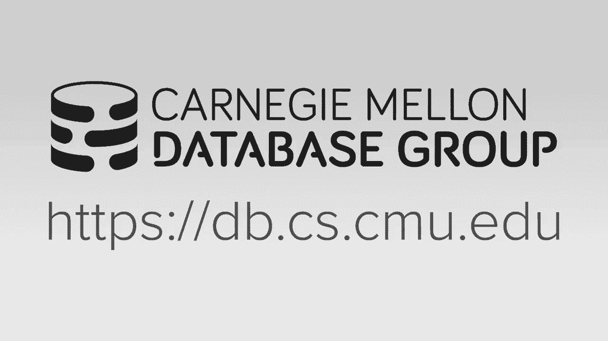

# 【双语字幕+资料下载】CMU 15-721 ｜ 数据库系统进阶(2020·完整版) - P17：L17- 哈希连接算法 - ShowMeAI - BV1wv411w7Ko

[Applause]，[Music]。

[Applause]，[Music]，today we're going to talk about hash，joins again I'm just here my home office。

it's me up here with the terrier in，attendance so it'll be asking questions。

as we go along today so why are hash，coins important well it's joined in。

general are important because that's one，of those common things operated with an。

execute in analytical workloads so for，today we're gonna start talked about in。

the background of what it means for to，do a joint algorithm，I had a high-level and in some of the。

history of the back and forth between，the performance trade-offs of a hash。

joint versus the sort merge join that，we'll talk about have you a parallel。

house join and in the different ways to，do the three phases and then we talked。

about how did you build a hash table the，hashing scheme the hashing function and。

then we'll finish off with a discussion，of the evaluation of the based on some。

of the results and in the paper you guys，were assigned to me so the in the。

introduction class last semester when we，talked about joint albums we didn't。

really talk about how to set execute，them in terms of multiple threads at in。

parallel we mostly focused on trying to，assess you know how much disk IO we were。

going to incur for the different，algorithms but now in an in-memory。

system we don't have disk and now we，want to maximize the amount of。

parallelization we can get across on our，course on our CPUs and now we need to。

focus on how we're actually gonna use，our hardware efficiently to do the joint。

so parallel joint is just taking two，tables two relations that we want to。

join together but we're gonna do this，joint across multiple threads I'm going。

to try to minimize the amount of，contention and synchronization as，possible so that we get the best。

performance so the two main approaches，we're going to do the view joins in an。

OLAP system are going to be either，hashing or server or sorting these are。

there's no other sort of way to，magically be able to identify when you。

have matching tuples right it's either，one or the other and so for this class。

also the means we're not going to，discuss national loop joins because。

that's like the worst case scenario in，in an OLAP system because it's just。

doing a brute-force search of scruncho，scans over the tables to try to find，matching tuples。

so in OLAP systems you're not gonna see，nested loop joins except for some rare。

cases when the tables are super small，and so for that reason they're also you。

know running those in parallel is the，same way you would just sort of run a。

scan in parallel so there's not that，much we talked about here the other。

thing I'll say also - though in OTP，systems you will see initially joins。

because awesome talk oftentimes these，database systems that are designed for。

transaction processing workloads don't，need to do hash joins or don't even need。

to do sort merge joins because they're，not doing large joints between different。

tables it's always doing foreign key，lookups or small number key lookups to。

go get data that you would then give out，to the application or like render a web。

page let's think of like Amazon when you，log in there could be a nested loop join。

for taking Amy's account and getting all，andis orders so there'll be a foreign。

key reference from the the order，customer ID to the customer table right。

and then that case is just an index，nested loop joint which will be super。

fashion way more efficient than you，would do a hash drawing because you。

don't need to build the hash table to do，the join you just use that that existing。

index so for this reason an index in，this loop join at a high level is going。

to look a lot like a hash join it's just，that the the data structure you use to。

find matching tuples already exists，because the OGB application already。

defined the index that you're gonna do a，join on I said again the high-level。

differences here is that a hash join，builds a data structure like an index。

that allow you to find the matching，tuples but when that query finishes it。

throws away the hash table and an x，squared comes along and just really。

about the hash table again in a index，mmm as a loop join the index already。

exists so you don't need to build it on，the fly you just use that in order to。

find the matches for your tuples but a，big difference is that in ocean settings。

this index is most likely going to be a，tree based data structure so either be。

plus tree or a radix tree that we talked，about before and and so that means，you'll get login。

Gups when you do the join but for a hash，join you using a hatchet we'll give you。

on average oh one lookups which is way，more faster so that's why nobody builds。

a B+ Trading when you do a join with，some rare exceptions when you're doing。

like you know range range predicates and，things like that on the joint but we're。

focusing on equi-join，so perhaps on we're gonna use a hash，table because that's gonna be more。

efficient so the debate of whether sort，merge-join is faster than hash join is。

one of these classic problems in in，databases that over the last 50 years。

it's gone back and forth of which which，approach is actually better so in the。

1970s the conventional wisdom was that，sort vers join with superior because the。

amount of memory that was available to，these early date early computers early。

systems back then was was quite limited，and they had algorithms to do external。

merge sort so you could spilled a disk，and still sort the data and so I it's。

unclear whether they knew they could do，a hash joint that could spilt a desk or。

not but the conventional wisdom was the，sort MERS joined was better because they。

already had that external more short，algorithm then the 1980s came along and。

then there was this movement called sort，of database machines where they've。

identified that hash twins could be，superior if you had a specialized。

hardware support to do the hashing and，do the hash join and so in the 1980s the。

potential wisdom was that hashing，patterns were superior because they had。

because they had hardware that could do，it more efficiently than you could do。

sorting so we we don't really talk about，davison machines anymore the idea I。

think of this is like it's a custom，appliance that has special instructions。

or special hardware specifically for a，particular database system they sort of。

went out of vogue in the 1980s because，Intel and all the other chip。

manufacturers were putting out new，things new CPUs all the time and even。

voted with Moore's law things got faster，and faster because you had more。

transistors so by the time if you were a，database company the time it took you to。

fabricate or design and fabricate your，database machine with specialized。

hardware and then actually put it in，production and start selling it。

Intel or whoever put out already new，CPUs that were that negated any。

performance gains you had in your custom，hardware you don't really see this。

anymore aw that's kind of coming back in，vogue not so much with specialized。

Harvard like they didn't data's machines，but more like FPGAs GPUs and and other。

types of hardware accelerators that it's，there's still commodity base but you can。

design custom kernels for the database，on them then in the 1990s there was this。

paper from gertz graphi the same guy，that did volcano the same guy that did。

the BP plus tree stuff we talked about，before with latching he came out with a。

paper that said that the algorithms are，basically equivalent that for all。

different real world scenarios on the，marver that existed at the time you。

wouldn't really see a noticeable，performance difference between being。

short version hashing so they were Dean，equivalent but then in the 2000s as。

there was more and more analytical，databases being created like Vertica。

greenplum aster data things like that it，was shown that hash joins were。

considered to be superior on the horror，that was available at the time and。

really since then that's that's been the，case right in the 2010s it wasn't so。

much a debate about whether certain，bursts join was better than hash join if。

the debate was whether you want to do a，partition hash join or non partition。

hash join which is what we'll talk about，today and in the in the current decade。

again unless there's some unless there's，some major breakthrough in the hardware。

I don't think that certain version will，ever come up on top again I think。

hashing is it's been proven to be，superior in many cases now obviously if。

your data is already sorted on the join，key then you don't need to do the sort。

at all and just doing the merge phase，then you know that's the best-case。

scenario and that that certainly will be，the beta hash joint algorithm but。

databases normally don't keep things，sorted all the time all right so let's。

talk about now what the last decade，looked like sort of how we got to where，we are today and why。

I signed the paper you guys were reading，so again the 2000 and the early 2000s at。

the turn of the century it was deemed，that the research showed that hash join。

was superior so the one of the key，papers in this came out from Intel when。

Oracle in 2009 where they showed that，hashing was indeed superior than the。

sword merge but they speculated that if，we now had larger Cindy registers in。

particular 512-bit Cindy registers like，avx-512 for Intel then sort MERS join。

would actually be faster now as far as，they know I there hasn't been a paper。

since 2017 when a tx5 spell came out，that has actually tested this theory but。

the ancient you can see whether that，that's actually you know what this is。

actually true or not but again still now，everyone's still just doing a hashed。

joins then in 2011 researchers at，Wisconsin put out a paper that started。

the debate of whether you went to a，partition has joined versus a non。

partition has shown and will discuss，these results later later in this。

lecture but then the the Germans with，hyper came out and said Oh Intel is。

actually wrong and Wisconsin was wrong，certain was joined is already fast or。

even without the larger Cindy registers，and they showed how how you could do。

this in hyper but then they came out a，year later with another paper that said。

ignore what we just said in the previous，year we were wrong hashing is actually。

superior and here's and here's a better，implementation for it then in 2013 there。

was another paper from researchers in，Switzerland from ETH where they have a。

bunch of ways to make a radix hash，drawing perform more efficiently so a。

radix hash drawing radix partitioning，join we'll discuss this and few more。

lectures they just showed how you can，you can do this more efficiently than an。

on partition join but then another group，of Germans in 2016 came out and said。

everyone needs to hold out but and stop，publishing these papers that say you。

know here's my hash going back look how，much better it is they actually then did。

a an exhaustive evaluation of，the different design decisions you could。

have in your in your joint algorithm to，better understand what the trade-offs。

are and which one is actually going to，be better than another so again that's。

why I signed you guys this paper because，I get rather than just saying here's。

this one-off implementation that we did，as Wisconsin did or hyper dated or ETH。

did they just sorta did a complete sweep，over all their possible parameters in。

these implications and showed you know，in what scenarios would one be better。

than another so the so now if you want，to design our joint algorithm but that's。

sort vers joint or hash join what are，some things you should think about to。

make this thing run efficiently and it，could give performance so at a high。

level of the two goals that we're gonna，have is that we want to minimize stick。

Rinna's ation and minimize the cost of，accessing memory while we do the joint。

so the first ones are obvious right we，talked about this before it basically。

means that we want to avoid having to，take latches to protect critical。

sections of the data structure of our，join so that you don't have any。

contention or complex between threads so，that every thread is basically running。

at full speed and they're not waiting，for another thread to give up some some。

resource okay so I'll step to this this，doesn't necessarily we need to make our。

algorithm latch free and there are latch，free techniques to do sorting and and。

and merge or sorting and hash joins it，just means we need to get smarter about。

how we're we're taking our latches for，the second one here the idea is that we。

want to make sure that any time we have，a worker thread that's computing a join。

any time they have to touch data access，it to do a check or write something we。

want to make sure that that data is is，local to that core and this could be。

either in the same numeration or ideally，in the same CPU cache right we want to。

minimize the memory cache misses and，never minimize a number of cross。

interconnect traffic between between，sockets so the way we can do this does。

this last one improve our cache behavior，is twofold，so the things are going to matter for。

most for us when we when we when we have，have cache，is is we need to account for the size of。

our cash and our TLD translation，lookaside buffer so that we're not。

trying to access a large number of pages，at the same time so think about this if。

I now need to touch ten to 'pls，if those ten to poles are in 10。

different pages I only have five entries，in my TLD that's mapping the virtual。

memory address to the physical memory，address then in order for me to actually。

do my operations on those ten things I'm，gonna have to start addicting things for。

my TLB and therefore of a cache miss on，the data that I want plus a cache miss。

in the TLB II said I big my access go，twice as slow so ideally I want a brave。

it'll bring a small amount of data or，the middle amount of data I need to do。

whatever operations I think it need to，do and complete all those operations。

before I move on to the to the next name，and that's sort of called locality the。

temple and spatial locality so I'm just，making sure that I'm accessing that fie。

access this thing multiple times I want，to do this within the same short time。

window so that it's always in the cache，and I'm accessing multiple things I'll。

make sure that they're close together，either in the same cache line all right。

ideally in the same cache line so that，I'm not paying the penalty of multiple。

cache misses and polluting my TLB so the，way we can achieve this is is is we need。

be the way to achieve this we need to be，aware of the what kind of accesses we're。

going to do and the two type of excesses，are either essential scans or random。

lookups so with with non-random access，where I'm just reading a sequence of。

bytes in order then again I want to make，sure that that data it will fit into a。

single cache line so that's one you know，cache miss and one memory stole to go。

fetch it and bring it bring it into to，the CPU and then for everything I bring。

in to my CPU caches I want to execute as，many operations because I can't on them。

if I do have to do random lookups though，I want to make sure that those random。

lookups are getting clustered together，within the same cache line so that I。

again I ever do Stan umber of lookups，that I have to do，to memory so this is this classic。

trade-off between the number，instructions we're gonna have or the。

cycle Grantham incur versus the amount，of memory and so the will see this you。

know in a second but like the way we can，achieve all these things is through sort。

of careful partitioning and being aware，of what data exists and in what location。

so that our threads are always accessing，data that's that's it's close to it okay。

so for the parallel hash drawing again，hash join is super important for us。

because it it's gonna be the most common，joint algorithm that's implemented in。

systems and a lot of OLAP queries are，going to contain joins we want this form。

efficiently as possible in the paper you，guys read though you saw that the the。

join portion of one particular TP CH，query actually was not the the bulk of。

the execution time I've actually seen，numbers that go in both ways I've seen。

numbers from Impala that shows the the，joins are like 45% of the time of the。

system in the case of the sort of the，testbed system you guys read about from。

from Germany or Saarland it was maybe，like less than ten to fifteen percent of。

the total time so just how much of the，time the system is going to spend doing。

hash coins you can vary from system to，system but certainly there's gonna be a。

lot of joins and these joins are almost，always gonna be executed as as hash。

joins so we're gonna run that as fast as，possible so at a high level the goal is。

where the parallel hash one album is，that we want all our cores to be busy at。

all times that nobody should be stalled，winning get data no should be nobody。

should be stalled waiting for another，thread to complete some operation before。

they can proceed ideally you want，everyone just running full blast all the。

time and of course this is easier said，than done so a hash join is comprised of，three phases。

partitioning build the partition build，and probe so we're gonna go through each，of these one by one。

but it's one show this as it as an，outline for well where we're going to go。

in this lecture so in the first phase is，it's entirely optional the partition。

phase and the idea here is that we want，to divide our table tables that were，joining together。

into smaller chunks based on the hash，key so that in the subsequent phases we。

can have threads operate on on just data，in their partition they don't need to go。

look at data and other partitions so if，your member for an intro class we talked。

about this doing partitioning and，spilling buckets at disk this is also。

called sometimes the grace hash join，right the grace hash join just means。

you're at a high level you're doing this，this partitioning phase but how you do。

the partition can vary from from one，implementation of the next and then once。

whether or not we do the partitioning，the next phase well do the we'll build a。

hash table so this is where we're，scanning through the outer table our and。

then we're just gonna build a hash table，on the fly for the for the join key that。

that our query is asking for then in the，second fit or that sort of the final。

phase for the probe we're gonna do a，scruncher scan on the inner table s and。

we're gonna look up as join key hash it，do a probe into the hash table see。

whether we have a match and if so then，we'll produce will combine the tuples。

and produces as the output of the，operator that's then fed up into the。

query plan so the important thing to，point out though is in this probe phase。

and the paper you guys are assigned to，read in a real system after you if。

you've a match on the probe you actually，need to materialize this combined tuple。

and then and then copy it into an output，buffer for the operator and a lot of the。

hash drawn papers that I showed of，beginning or the join papers Dutch in。

the beginning they actually don't do，this last step just because you know。

then one of the numbers to look really，really good or they sort of they didn't。

really sort of think about it but in a，real system and in the Saarland paper。

they actually do this last step which is，important because that can affect the。

performance of the rest of the system，we'll talk about the implications of，this with a limited early。

materialization and late materialization，in a few more slides all right so let's。

go to each of these phases separately，and we'll talk about the different ways。

to implement them so again the the，partition phase is we're gonna take the。

both relations the inner one and the，outer one we're going to scan through。

them look at the join key hash them and，then assign them to some output buffer。

the partition buffer and so the whole，idea of this is that although we're。

paying an extra an extra cost of having，to scan through the data and copy it。

once the idea is that if we're，intelligent about how we do this we can。

write the data out in such a way that，when we do the buildin probe will。

minimize the number of a reduced number，of cycles we have to execute those。

instructions because we'll minimize the，number of cache misses I will make sure。

that the the threads are operating on，one data that's that that's a local to。

them I so again the idea is we pay this，upfront cost to make other stuff go。

faster later on so sometimes in this，literature as I said sometimes can be。

called a queries hash Dorn sometimes，called the hybrid hash drawing or the。

radix hash join right whenever you see，those sort of these qualifiers in front。

of the hash join just means that they're，doing some kind of partitioning step in。

front of it so as I said in the last，slide we need be aware of what we're。

actually putting into our buffers，because that's gonna greatly affect the。

performance well it turns out the what，you etching you put in your buffers is。

gonna depend on what the storage model，is that we talked about before so if。

it's a row store usually they put the，entire tuple in the upload buffer。

because even though I only need maybe，need a subset of the attributes to do。

the join or X be the rest of the query，it's just either to copy some contiguous。

chunk of memory and write in to my，output buffer Hertz my partition buffer。

in a column store oftentimes what you do，is you only store the keys that you need。

to do the join and then the offset to，where to find the rest the to posts if。

you needed it stitch it together and the，reason why you can do this is because。

you want to do this is because you're，minimizing the amount of data that。

you're actually copying copying from you，know and making these partitions and you。

don't have to worry about chopping it up，as you would in a row store because it's。

already divided or partitioned for you，as a column store so the more efficient。

approach to do again is just the bare，minimum number a bare minimum。

information you need in order to compute，the join and then if another part of the。

query up above and the plan needs，additional columns are additional。

attributes you use the offset to go find，so for partitioning there's two。

approaches there's the non-blocking and，the blocking partitioning or the radix。

partitioning and so with the non，blocking approach the idea is that you。

have a set of threads that are going to，go through and partition the data so。

scan the adder at our inner table start，producing these partitions and then as。

it's generating is output you can have，another set of threads we'll read that。

data and start start the next phase to，start populating the hash table right。

and you can do this because you're not，worried about any false positive false，negatives。

I'm sorry false negatives like as the，data is partitioned you can then。

immediately populate the hash table it，depends on whether you're doing one pass。

to pass but in general for the non，blocking one people do people do one。

pass right in the second approach when，you're doing the the radix partitioning。

the way it works is that you can have，all the threads will scan through the。

the table once and the tables once and，produce the partitions and because you。

don't know exactly how far each thread，it's gone and you know whether since。

everything's already broken into buckets，you can't be guaranteed that you have。

all the data you need to fill the hash，table so all the threads were doing this。

but this partitioning at the same time，and then when that completes then you。

switch over and do the the build phase，so let's go through each of these one by。

one so in case a non-blocking，partitioning there's actually a two sort。

of subsets or the two additional ways，you can actually implement this again。

this is this we're gonna scan the，relation and then once and then build。

the output on the fly so with shared，partitions you're gonna have all the。

threads try to write into the same，memory locations at the same time or the。

same buckets for your partitions and，that means that you have to use a latch。

to synchronize the buckets to make sure，that one thread doesn't doesn't。

overwrite something that another thread，wrote it wrote into incorrectly in the。

second post you used to have private，partitions where each thread now has its。

own set of buckets that they can，populate there's no other thread writing。

to this bucket so you don't need a latch，to protect anything and then once the，once this。

first phase is done with first pass it，down with the private partitions。

then you can go through a with another，set of threads and then populate the。

global partitioning buckets that you're，doing the first one so again a classic。

classic commuter science here there's no，free lunch right on one hand in this。

case here we're using latches to protect，the data structure but we only have to。

go through the partition every pass once，in this one it's latch free but that now。

means that we have to then take a second，pass through the data to consolidate。

consolidate all the information that's，spread out or divided amongst the。

different threads so we'll go through，let's go through each of these so here's。

the the share partition approach alright，so we have our data table we have three。

columns and the first thing we're gonna，do is just divide up the data into。

different chunks or morsels like we did，before and these are just ranges of data。

we don't know actually what's in them，yet we just say you know the first。

hundred two blows goes this thread the，next hundred - blows goes this other。

thread so now say we wanted you to do a，join on column B so we'll take the value。

of B and every single tuple and we're，gonna hash it with the same hash。

function we're gonna use for the the，buildin probe phase so the we have to do。

this because you have to make sure that，if we hash a key in one in one phase。

that if we hashed that same key later on，we end up in the same location or in our。

hash table or in our bucket to make sure，we can find the information that we're。

looking for so we're gonna hash that and，we know that our patient's we're gonna。

we're specified ahead of time so we're，just gonna mod that by the hash value by。

the number of partitions and that'll，tell us what partition chain we're gonna。

go into so now every thread is going to，write into for every single value of the。

hash it and mod and that tell you which，one they go right into them。

and so again this is a global - set of，buckets so every thread can be writing。

into any any bucket at any time so we，just have to use a latch to protect the。

the last place where you want to do an，insert I want you quite a lot then you。

can insert a new value in there the，other approach again is with private。

partitions same set up we revive the，data up amongst different threads and，they're just。

threw a hatchet and then modify the，number petitions that we want to have。

but what's gonna happen is each thread，has its own sort of group of buckets。

that we saw in a previous slide so now，when I do my write into these different。

buckets at each thread I'm the only，thread writing in there I don't need to。

protect me two latches so this is gonna，go really really fast now once all the。

threads are done then I have to do，combine everything together to create。

that global partition of the space that，I had in the last slide so to do this I。

can just have a bunch of the threads，each pick a separate you know partition。

group of calls to different threads and，be responsible for populating this thing。

so I in this case here I don't need，acquire latches when I do this。

consolidation but I still have to take a，second path so thread two we'll go do。

partition two and thread three do，Parchin three and so forth alright so。

again this is also a good example of，where materialization issues can be are。

important because I'm copying the data，twice at the copy the data once out of。

the data table into my partition and，then out of the the private partition。

into the combined partition so if I'm a，row store and I'm copying the entire。

tuple of my two bolts very large then，this copy is expensive if it's a column。

store and I'm all in copying the middle，amount of data they need to do to join。

plus the offset well that can be much，smaller than the full size of the tuple。

and therefore this copy can be you know，less pressure on the CPU caches and。

memory and certainly potentially you，know less instructions okay so so that。

was an example of the sort of the，non-blocking partition scheme let's talk。

about now with the radix partitioning，approach and the idea here is that we're。

doing the same kind of partitioning that，we saw before but we are being more。

careful or more careful we are doing the，partition in such a way that we can we。

can have the threads write two separate，locations in memory without how to take。

latches but we have to wait，everyone finishes before we can move on。

to the next phase because we don't know，what what else is missing and that'll。

make more sense when we talk about I'm，gonna show the diagram so with the rate。

of partitioning we're gonna take，multiple steps to go the multi step pass。

over the each of the relation and so in，the first step we're going to scan。

through and compute a histogram that's，going to tell us the number of tuples。

we're gonna have her hand then we can，use that histogram to compute what is。

called a Pixum that'll tell us at what，offset in our partition space should we。

write a particular tuple then now we're，gonna go through and scan our again and。

now do the hashing and based on where，we've defined where we turn to our。

writes with a previous column then we，write into that the partition space so。

again we'll go through each is one by，one so the first thing to point out to。

also is that the term greatest，partitioning is is just means the digit。

or a byte of the total key it's the same，rate X term that we saw when we talk。

about radix treaties before right，instead of having the entire key I just。

gonna hash or partition basement on a，chunk of it the prefix column is just a。

way to do a again that determine what's，the starting location that we want to。

write into our global global partition，buffer for each thread so let's let's。

let's first understand what a prefix um，is so again the raid X is just the is。

just a value of some digit within the，key all right so my keys are 89 12 2300。

841 and 64 so the raid X at this first，position here for each of these keys。

would be nine two three eight one four，and then the raid X for the next key is。

just eight one two and so forth like，that so that's all that means with the。

raid X partitioning we're going to look，at one digit within the key at a time。

hash that figure that where that goes to，and then if you want to do additional。

passes we could look at we could look at，Malton people get subsequent digits so，radix。

pretty efficiently with this，multiplication instruction so this is。

not it's not an expensive operation to，do this，so now with this radix the radix is of。

these the keys we can compute what's，called the P Pixum and that's just a。

running summation a running count of the，numbers and the position of the of the。

prefix um in the output determined is，based on what keys came before it so I。

have the keys 1 2 3 4 5 6 so for my，prefix um in the first position the。

previous time was just 1 because it's，just there's no nothing that came before。

it so it's just a value 1 but now for，the next position I'm gonna take the。

value of the previous prefix some，computation and then the value of this。

key and add them together and that's now，my prefix um for this position so 1 plus。

2 is 3 same thing now I take this，position here 3 3 6 10 15 20 and 21 and。

so forth like that and the reason why we，learn to do this is because now we can。

use these these pick some to tell us，again what offset we want to write into。

because we say like if I have one tuple，before me then I should start writing my。

like my tuples that after position 1 but，then now this guy says I want to write。

tuples in and he knows he just started，offset 3 these are essentially gonna be。

used offsets within the partition array，so let's look at a dues rate of。

partition so again the first step we，need to do is inspect the input keys and。

crater histograms so say the output the，input keys that we're dealing with here。

are already the that we've already，hashed it we've already modded by the。

number of partitions that we have I just，a goodbye we haven't mired by number of。

partitions we've we've hashed it and now，we want to look at the digits of the。

hashes so what we're gonna do is look at，look at the the first digit here and for。

each each thread you're just you're，going to stand through your assigned。

range and compute what the histogram is，right so it's the number of values that。

will appear at a particular partition so，in this case here for CPU 0 at partition。

0 it had 2 entries 1 2 at partition 1 it，had 2 entries 1 2 like down here it has。

at partition 0 it has one because，there's 1 0 there and then for partition，1 it has 3 1 2 3。

I think we just compute this histogram，by scanning through the data efficiently。

then now we're gonna do is compute the，offsets in our partition array that the。

threads can all right into so we have to，block and wait until all the threads。

complete their partition and then we now，compute the prefix um based on the。

histograms that tell us where we're，gonna start writing in to where every。

thread can write into this partition，array all right so be like this so。

partition 0 for CPU 0 is right here and，the partition 0 for CPU 1 can write here。

right so position 0 starts at position 0，because with the previous um petition 0。

at CPU 1 but right here because it's，this value was 2 because the previous。

column will be 3 so 1 2 3 and so forth，for the other one so now what does this。

do for us this is now gonna give us a，giant array or giant buffer that the。

threads can start writing into and they，don't need a coordinator acquire latches。

to protect any any location in memory，when it does this right because it's。

already computed the prefix own we，already know that nobody else will be。

writing into our location so we can just，write into it just fine and we have to。

maintain an internal counter in our CPU，to say oh 4 partitions 0 I've already。

inserted you know one thing or two，things or 3 thing so using my starting。

point I can then decide quickly at what，all set should I write my my new my next。

piece of data into alright so now with，this this we've computed this this。

partition output and the starting，location is where we do our rights now。

we go back and do our scan again and now，we do our partitioning and now we're。

copying in the values of the the keys，that we've hashed into our partition of。

writing and again we can do this without，applying latches so now at a high level。

the way to think about this is that，we've have we have partition 0 and。

partition 1 and so at this point we can，then hand that off to the build phase or。

and and start the computing the hash，table or if we wanted to we could start。

dividing this up even further sub，partitioning again so that our chunk of。

data in these partition can now fit into，a cache line or a small number of cache。

lines all right and so to do that we，just go back now and do jump to the next。

next radix right within this the next，radix value and this do this you know。

partitioning all over again all right，but I would say in the in practice well。

in practice most people don't do rate，partitioning although it is shown to be。

superior and then the other few systems，that I knew that do this they're mostly。

academic prototypes they almost never do，two passes is usually one pass and。

you're done all right so now we have our，whether or not we done partitioning now。

we enter the build phase and again the，idea here is that we're going to scan。

the outer table either just in the，original table itself or if we partition。

and then the partitions and then for，every single tuple we're gonna have。

we're gonna hash it on the same key we，use in the partitioning phase and then。

we're gonna store it into a hash table，right and ideally we wanted to design。

our hash table such that the the size，every bucket that we're writing into is。

going to be you know just a few cache，lines in size right because that's gonna。

last a good go through things more，efficiently so we now need to discuss。

what this actually hash tables gonna，look like right sort of said like oh。

great the buckets we write into a hash，table will be a few cache lines well。

what does that actually mean right what，what is what does our hash table，actually look like so。

to understand what a hash table is we，need there's two main design decisions。

typically when people say they have a，hash table it's sort of used colloquy。

just to mean like the data structure，itself but in in in practices actually。

commits a combination of these two，things the the hash function the hashing。

scheme so the hash function is a way，we're going to take it take our key。

that's in a larger domain alergic space，and we want to map it to a specific。

location or slot in our in our hash，table data structure but it says like。

you take all possible strings and you，want to have a hash function that can。

then convert it into some integer that，we can then say you know within one to。

ten or something some smaller range you，know what slot we're going to write into。

so let's see in a second B we have this，contention between，having a hash algorithm that is fast and。

also having a hash algorithm that has a，low collision rate because we want to。

make sure that if we take two keys that，are distinct we don't want them to hash。

to the same location but we want to be，able to compute that hash very quickly。

the the second design decision is the，hashing scheme and this basically says。

that after you've done the hashing if，now you have two keys that hash to the。

same location meaning you have a，collision on that key how do you。

actually deal with that and so again，there's trade-off between allocating a。

ton of memory for a hash table so that，every possible cache P I ever see it's。

guaranteed not to collide with any other，key but that would take a lot of memory。

and so if I want to support collisions I，want to have my collision reconciliation。

you know method or procedure being，efficient as possible so I don't you。

know I'm not spending a lot of，computation time to find or insert a new。

key again we'll cover each of these one，might want I will say though although。

I'll present a bunch of different，approaches to doing hash tables or hash。

functions every single database system，that I've ever talked to every company。

that ever talked to they usually just，pick one they'll have a reason why they。

picked it like oh we ran some benchmarks，and it seemed you know seemed to work。

well and although in some cases some，hashing scheme might be better another。

for different workloads of different，query types nobody as far as I know is。

actually tries to be adaptive everyone，sort of picks one hash table or one hash。

function and tries to make that be as，efficient as possible they don't try to。

automatically adapt the hashing scheme，they're using based on what the query。

the dataset looks like everyone just，sort of picks one and runs with it all。

right so for hash functions again the，idea is that we want to take an。

arbitrary key of any possible length an，impossible domain and then map it to a。

smaller domain that we can then you know，use that to find a location in our hash。

table so this means that although those，those hash functions out there that。

provides security guarantees a，cryptographic hash functions or two-way。

hash functions like I can encrypt，something and decrypt it we don't care。

about any of that right we all the care，about is having an efficient one-way。

hash with a locally generate and we'll，see what some examples are in the next，slide。

so the the best way to understand this，trade-off between collision and。

performance is think of the two extremes，so the fastest hash function you could。

ever have is one where no matter what，key you give it you always return the。

value one right that's like there's，there's no computation it's just you。

know writing one to the staff or the the，output of the function and then you're。

done but of course this means that the，collision rates can be terrible because。

no matter what key I give it it always，comes back with value one so it's super。

efficient but my collision rate will be，is bad on the other end of the spectrum。

I can have what is called perfect，hashing where it's a magic hash function。

that no matter what key you give it it's，guaranteed to always produce a unique。

hash key so again these exist in the，literature or in theory in practice and。

nobody actually implements them because，typically the way you actually implement。

them is do you need to know all the keys，ahead of time and you you would then。

build it with it the mapping function，with a with a hash table itself so you。

would need a hash table to in order to，have a hash table which sort of defeats。

the purpose of having you know an，efficient hash table so again these are。

the two extremes we want something in，between so the you know this is sort of。

active development area for both，research and for companies and startups。

and sort of hackers in general so，there's this benchmark created by the。

murmur to hash guy call it SM hasher and，this is sort of a benchmark suite that。

has measurements to determine the，performance and collision rate of a。

bunch of hash functions so if you're，interesting this kind of stuff you can。

go check out his blog or the game page，for this but I want to focus quickly on。

just sort of five high level hash，functions that you see often in the wild。

CRC was originally developed in the，1970s to do error code detection for in。

networking there's now on on modern CPUs，there's there's built-in instructions to。

do CRC very efficiently I think in the，slides I'll show the next slide，I don't think I'm using those。

instructions actually I'm pretty sure，I'm not so if you just use the algorithm。

you get a software-based here I see it's，gonna be really slow you use the。

instructions it'll go faster murmur hash，was this random dude on the internet who。

said hey here's this hash function，I developed that's general-purpose that。

well as fast a bunch of people seem to，like it they picked up picked it up and。

sort of expanded upon it or modified it，and in particular which Google City hash。

was based on member hash but they，designed it for their for their。

environment where they wanted to do how，efficient hashing for short keys。

there's the Facebook xx hash which is，considered to be the state of the art。

now I this is from the same guy at，Facebook that inveteracy standard of the。

compression again this is sort of doing，it's just you know the mathematical。

variation of the of the methods being，used in member hash and then farm hash。

is a newer version of City hash that's，designed to have better collision rates。

for larger keys so there's also in 2016，there was a highway hash from Google but。

that that has like guarantees for sort，of the encrypted you know cryptographic。

analysis and you can't leak any data，from from the hash functions again we。

don't care about that in our hash table，because is it this we're using this hash。

function internally it's not exposed to，the outside world so this is just a。

benchmark that I run every year where，it's it's not SM hasher it's it's a。

different type of workload we're just，trying to measure the throughput rate，functions。

so again CRC 64 I think this is just all，software based actually I should rewrite。

that to be use the harbor instructions，but that the main takeaway here is a。

common common thing you'll see is that，you have key sizes of either 32 or 64 64。

bits that it's 30 32 and 64 bytes you，don't see like super large keys and this。

just sure just showing that there's if，you have if you have key sizes that are。

aligned to cache lines then these，algorithms can form more efficiently so。

the sort of the salt to the patterns is，when you have，is when you start going through the next。

cache line you pay that penalty so the，main takeaway here is that again X X。

hash 3 is considered to be the fastest，and then followed by by city has some。

farm hash I think this is an older，version of murmur hash 3 I think there。

might be a newer version that would be，it would could perform better but again。

in our own system we use excess hash 3，because that pin this determines that，things are。

this shows that thing it's it's much，better ok so let's talk about now。

hashing schemes again the hashing scheme，is is what we handled collision so where。

our hash function says this key should，hash to this bucket or this slot in our。

in our data structure and something's，are being there how do we deal with it。

right so what's up well and so I was，I'll say - these are also for the most。

part except for chain hashing these are，static hashing schemes meaning I'm gonna。

size the hash table before I actually do，anything with it so I sort of have a。

rough approximation of how many keys I'm，gonna have to store in my hash pump or。

hash table and if now I have a collision，that I can't reconcile because there's。

no free space based on on the protocol，I'm using I then have to resize it and。

the way you typically resize it is just，you double the size and rehash。

everything and put it back in chain，hashing you can just extend the hash。

chain which I'll show in the next slide，indefinitely but but this can then。

generate to a to ask when to scan when，you do lookups if everything hashes to。

the same chain so chain hash tables，people think about when they think about。

a hash table I think this is what you，get in in Java when you say you want a。

hash map class and the idea is that，there's a there's an array of pointers。

to chains and I take my key I hash it，that tells me what offset I want to look。

at in my my chain and then I can I can，jump to that location right and so the。

way we're going to resolve collisions is，that if two keys map to the same chain。

we're just gonna sort them into the same，bucket and if my bucket gets full then I。

just extend it allocate a new bucket and，I added to my linked list so again the，chain can grow。

infinitely and if everything hashes at，the same location then doing any look of。

a sasquatch will scan all right so let's，look at a quick example so ignore this。

for now but like here's our buckets，again so within each bucket we have two。

slots so I take my first key I'm gonna，hash it and the it's gonna match this。

bucket here this bucket is empty so I，can insert my key into the first slot so。

the thing to point out here though is，that we want to store both the hash of。

the key as well as the original key and，the reason why we want to store the hash。

is because now if we're gonna do a，comparison to see does a exist if we。

already have the hash we can do that，comparison very quickly with just。

integers but if this key is like a bar，chart or something larger then we。

obviously need to make sure that this，thing we have this original key so we。

can determine what wave of people false，positive but we keep this one as well so。

that we can do that lookup more，efficiently so a goes here we can write。

to that first location B B goes here I，can write to that location C goes here。

right match to the same bucket this slot，is empty so can write into there but now。

D wants to write into this bucket but，the two slots are full so all we need to。

do is now allocate a new bucket add a，pointer from the first bucket to the。

second bucket in our linked list and now，we can add in D same thing for E this。

bucket is full we follow the chain and，go here and now we can write E and then。

F gets written down here so again now if，I want to do a lookup say find me key D。

D would would hash to this bucket I，would do a sequential scan within the。

bucket looking in every single key，typically you do with the hash first cuz。

that'll be more efficient if I don't，find a match then I know I need to and。

there's there's if I don't find a match，in the bucket I'm at and there's a。

pointer to it the next bucket they，didn't need to jump over here and，continue my special scan。

so one interesting optimization you can，do with the slot array is instead of。

throwing these as 64-bit pointers or you，store the store pointers at 64 bits。

because that's what Intel hardware tells，you you have to do but Intel action。

doesn't use all 64 bits for every，address you know actually，uses 48 bits so in the case of hyper。

what they do is they actually store for，all these pointers they store a bitmap。

I'm sorry a bloom filter that says，here's all the keys that exist in my。

chain so now what I can do is when I do，a hash and I say I should go to this。

bucket and I look at this point in to，tell me where I need to go there's。

actually gonna be a bloom filter inside，of it that we then check to see whether。

the key I'm looking for is actually，gonna exist in my blue footer because。

the bloom filter will give you it won't，give you false negatives but it could。

give me false positives so could tell，you this key exists and when it actually。

doesn't you have to go scan and find it，just to see that it doesn't exist but if。

it doesn't exist in your key then this，thing would be guaranteed to say it。

doesn't exist so you don't actually need，to follow the chain you just need to。

look at this bloom filter so I think for，this reason the the hyper guys say that。

the hash chain hash table is to peer to，all other hash tables if you do this one。

trick the problem though is although I，can agree with that the problem is that。

the Intel's not guaranteed to only use，60 48 bits for all pointers in the。

future right it's some late appointment，may say all right well now use all 64。

bits and then this thing doesn't work so，then maybe they could just store the 16。

bit bloom filter and Pat it out sort of，like the the Judi fat pointers we saw。

with the Judea Ray's you could store，that on the slot array well alright the。

so chain hashing is pretty common in，data structure used in database systems。

for joins though most of the time you，see a linear probe hash table because。

it's so simple and just ends up being，more efficient so with leaner probe hash。

table I think it's a giant table of，slots and I'm gonna hash my key and I'm。

gonna mod it by the number of slots that，I have and that's when tell me where to。

jump to find the memory address of the，slot that I want so when I want to do an。

insert if nothing exists in that slot，then I can just go ahead and write into。

it if something does exist then I need，to scan down in going from the top to。

the bottom from that slot location and，look at all the slauson's wife。

one that is empty and then I can go，ahead and insert my value in it now this。

means that when I wanted to do a lookup，to find my key I'm gonna slaughter jump。

to that same location and I have to，start looking to see whether the key I'm。

looking for is actually there that's，because I don't know if it's got if it's。

not actually in a slot that it should，hash to it maybe below that I need to。

scan through until I find it，or I find the empty slot which tells me。

that the key doesn't exist so this is，look an example does say again I want to。

put these keys in here first one we hash，a we modded by the number of slots and。

that tells us we want to write into here，that's fine nothing was already in there。

we can go ahead and do that now I want，to do hash on B I can write this slot。

nothing's there so we're done now I want，to do an insert on C C hashes to this。

slot location but a already exists so I，can't store it here I'm gonna store it。

at the next empty slot I can find which，is just the one below it so again now if。

I want to do a lookup on C I would hatch，here C a and that I would see the key a。

that's not the one I'm looking for，so then I scan down till I find either。

an empty slot or the key that I want in，this case here I would find see in the。

next location now with DD hashes in this，location again we can't write it because。

into there because C's are two here so，we write it the next one he wants to。

write to a we can't do that，we can't write to the next one Karen do。

the next one and keep going till we find，our empty slot like that F like likewise。

Wright State what's right here but it，can't so goes go to the next one so the。

thing you got to keep track of with this，is if I do a lookup or an insert I need。

to keep track of what was my starting，location into the slot array of for this。

table because if I loop back around，trying to find the thing I'm looking for。

or empty slot and I and I come back to，my starting point then I know my hash。

table is full and there's no more free，spaces for me to insert something all。

right the key I'm looking for is not，there then I have to again rehash。

everything and by doubling the size or，buildin hash table doubling the size and。

rehashing everything so again trying to，pick out the right hash table size can。

be tricky and we'll see and a few more，lectures how this can be problematic if。

you don't get the if you don't estimate，things correctly in the first。

so the other interesting thing about，this data structure and we'll see some。

variations in in the next slides is that，it's gonna penalize the the collision。

scheme who's going to penalize both，inserts and lookups in the same way so。

in the case of this one here I want to，insert E and I had to jump down to four。

slots into stored here if now I want to，do a look-up on e I'm gonna pay that。

same penalty because I'm gonna hash here，and I have to scan down until I find an。

empty slot of the key that I'm looking，for so there's nothing in this collision。

scheme or this hashing scheme that，prefers making inserts be faster or。

making different buffers making lookups，be faster in a hash join depending on。

whether the the the the size of the of，the inner table versus the average of。

depending on that ratio you may want to，choose a different collision scheme that。

makes inserts go faster if the the outer，table is bigger or loves lookups go。

faster if the inner table is larger but，again as I said as far as I know most。

energy systems don't don't switch up，it's always pick one scheme and。

oftentimes this one is the simplest one，and important in that feature shows that。

this performs the best okay so the we've，already talked about this you know in。

order to reduce the number of wasteful，comparisons we have to do we want to。

avoid collisions on hash keys of course，that entirely depends on how good our。

collision rate is per hash function and，one way to avoid it entirely is that we。

can just have a huge hash table with two，EPs a number of slots we expect to have。

so that every single time you hash your，key and put it into the data structure。

it's there's nothing going to be in the，slot that is trying to write too but。

again you pay that penalty of allocating，more memory for your hash table so how。

do I get balanced this correctly is not，trivial so let's look at some variations。

of linear probe hashing that do try to，switch the dynamic or switch the penalty，between insert。

and lookups by changing how the，collision the collision protocol we're。

going to use so one approach is called，Robin Hood hashing and the idea here is。

that when we do an insert if we find，that the slot we want to insert into is。

already occupied then we look to see，whether the key that exists in the slot。

we want to write to is farther away from，its home slaughter it's not where it。

should be then where our key is and if，it isn't then we're gonna steal it slot。

and force it that other key we just we，just evicted to go to a new location。

so it's called Robin Hood hashing，because the idea is that we're gonna。

have Porky's steal from that we're gonna，steal from the rich keys and give the。

slots to the poor keys and again this，the the wealth of a key is based on how。

many hops you are you are away from your，your big the position the optin position。

for you where you should be in the table，all right so this is an old technique it。

was virtually published in a tech report，in or in a public paper in 1985 it sort。

of was lost or not lost or like really，didn't get any attention until recent。

years and particularly this showed up on，Hacker News a couple years ago and now。

sort of this is there are a few systems，that actually using this although I will。

say the research shows that this is，actually a bad idea，because you pay a penalty of just。

copying and moving is expensive all，right so let's say it's the same skin。

keys we want to have before again Robin，hashing is an a variation on lunar probe。

hashing so it's just a giant slot array，we start off by hashing a that goes here。

just like before but now in addition，just drawing the hash in the original。

key we're also going to store the number，of jumps that this key is from its。

optimal position and the optimal，position is determined by where it。

should have been or what was the first，location that we jumped to when we did。

our initial hash right like if you were，looking for this key and used this hash，you。

hash function where could you find it，immediately assuming there wasn't any。

other collisions saying they would be，now bu hashes up here it sits in this。

optima position so it's the number hops，it is from away from its where it should。

be zero but now we're gonna hash C C's，gonna land in the same position where a。

is so now we need to look at to see，whether we should evict whatever is in。

the slot we want to go into or should we，leave it alone and and jump down to the。

next slot just like a linear program so，this first jump here the a is a is zero。

hops away from its its optimal position，and C is zero hops from its original。

position so C will leave a alone all，right because they're considered。

equivalent so then now it'll jump down，here this flop is empty so now we'll。

store C in here so now this is saying，that C is one hop away from where it。

should have been originally D comes，along here D wants to go where C is。

located C as a has a hop cost of or a，hop distance of one therefore 1 is。

greater than 0 for D because D of D is 0，steps if we could go here so in this。

case here C is considered more poor than，D so D will leave C alone and then we。

jump down here and we write D now we，write e egh wants to go where a is you。

can't do that a a 0 is equal to e 0 so，we leave it alone then we come down here。

and at this point E is now one hop away，from where it should be but oh so is C。

so they're also equivalent so we leave，those alone but then we get here and now。

he is two hops away from where it should，be and D is only one hop away so so D。

considered more rich or more wealthy，than e so easily slot insert its key in。

and then now the thread continues on and，figures out the next location to put D。

which is the next empty slot and then，now D is two hops away foam from where。

it should be and then now we get to F F，go where where D is but it can't do that。

so then it goes down here so again the，idea here is that we're amortize ingush。

stealing the slots and reinserting key，that are already in the table the ideas，that were amortized。

of any given key by having each key be，closer to the where they should have。

been originally so going going back here，problem，II what it ends up here and do you。

everyone left alone here so II would，have been three three hops away from。

from its original location and D would，have been left left knowing with with at。

one hop away but on a Robin Hood they，both end up being two hops away so who。

on average you're saying the lookups are，roughly equivalent across all keys so。

that you don't have one key you know，take take much longer than other ones so。

this seems like a decent idea alright，see if this seems kind of interesting。

but the research literature shows that，it is bad because this was stealing the。

keys is terrible for you know cache，performance and so it makes the inserts。

so much more expensive that any benefit，you get from doing the the lookup for。

making the fines go faster is completely，negated now for a hash join you know。

we're building these ephemeral hash，tables where we insert them do our。

probes and in the bill phase or so the，pro phase and then throw it away if your。

data structure might be longer living，like you build the hash table and then。

you keep doing the lookups over to again，then this approach actually might might。

be preferable for perhaps joins it won't，be another technique is called hopscotch。

hashing which came out in 2008 from，Maurice Hurley who used to be factor。

here at CMU and now he's a professor at，Brown and so the idea here is that。

rather than letting a rather than，letting a key change position like in。

Robin Hood nashing to any possible，location in the in the in the slot array。

we're going to bound how far they can go，into what's called a neighborhood so。

neighborhood we defined as a a，contiguous range of slots that a key is，allowed to it。

and it can exist anywhere in in that in，this neighborhood so if you're looking。

for a key and you look at this where it，should be in this neighborhood and it's。

not there then you know the key doesn't，exist so you bound how far you actually。

have to scan through so the size the，neighborhood is being configurable I。

forget what the ritual paper says but in，for this example here we'll use a key。

size our neighborhood size of three so，again it's just linear probing so we。

haven't we have our slot array and so，the first neighborhood for this first。

position here will be size of three so，one two three，but the neighbourhoods are overlapping。

so for the next one and the next one so，forth right there they have a portion of。

the previous neighborhood in their，neighborhood and you would do this all。

the way down so now let's say I want to，start and start inserting these keys so。

just like before I want to start a it's，it would go in here and its neighborhood。

is it's three three slots so I can sort，it anywhere that I want and practice。

though you've just inserted it into the，first location if it's empty right and。

we're done then we do an insert for B，same thing we go to the first location。

in this neighborhood and we're done but，now we want to start at C C should go。

where a is but it can because a is，occupying so we say we need to find the。

next empty slot in our neighborhood to，insert into into all right so we just do。

it now sequential scan down till we find，up for empty slot let me go ahead and。

serve ourselves like that's so far this，is the same thing as linear program now。

I want to start D D you should go where，C is against crunch we'll scan down to I。

find that and then I got certain there，but now I want to start e ninis going in。

this neighborhood but as I do my，sequential scan I would find that all。

these these slots in my neighborhood are，occupied so now I need to go outside my。

neighborhood and find the first free，slot which happens to be here and so now。

what I want to do is I wanted to，determine whether I can swap in reverse。

order any key or any key my previous，neighborhood that I'm trying to get into。

with the this empty slot and that way I，could then insert my key into my。

neighborhood and the idea here is it to，make sure that we bound whatever key，we're moving。

to make sure that it is in our slot here，so in case of D ID should belong here。

so it's neighborhood are these two，things one two three so it's okay for D。

to them get moved down here and then we，can hash e and put it into our。

neighborhood and then we're done it now，I insert F F should go where D is its。

neighborhood or these two and this one，could be wraparound and in this case。

here I can just scan down I find a the，free slot and I get started alright so。

how this works is that you have to，maintain some metadata about in every。

neighborhood about what keys are in them，or what what neighborhood I belong to so。

you can make make a determination of if，all my keys in my neighborhood that I'm。

trying to get into Perl occupied are all，belong in my neighborhood then I have to。

I have to double the size the hashing on，the Builder and rebuild it so the idea。

here is we're bounding how much we have，to look to find a free slot to just be。

local in my neighborhood and if I can't，in turn anything in my neighborhood or。

not finding a I'm looking for in my，neighborhood then I don't need。

potentially scan the entire thing so，just so it's a variation I think a robin。

hood hashing where you're bounding how，much you know how you bounded the。

insertion search space and they look up，space alright，the last hash to mean what about our。

cuckoo hashing and this is me different，than all the other ones where we are if。

we hash something we you know you're not，guarantee that the slot you jump first。

lot you jump into it's gonna be exactly，the thing you know it will be exactly。

where your key can be found in the case，of hopscotch hashing it would be in the。

neighborhood in the case of linear，probing or Robin Hood hashing you have。

to keep scanning down till you find the，key looking for odie find empty space。

but with cuckoo hashing when you hash，you deal with lookup and you're。

guaranteed either the key doesn't exist，or the first place that you jump into。

will be the key that you want this is，the way they can achieve this is that。

they're gonna maintain multiple hash，tables simultaneously each of their own。

hash function so now when I want to do，an insert I hash it multiple times and I。

see whether I can insert it into any，free slot and any my tables if now that，slot is being on。

then I'm gonna steal that slot take that，key out and then have that that key I。

Vic tada rehash that and put that into，another table the idea is that you could。

have this thing changing changing one，hash table a key you could have a key。

that already been inserted change its。

