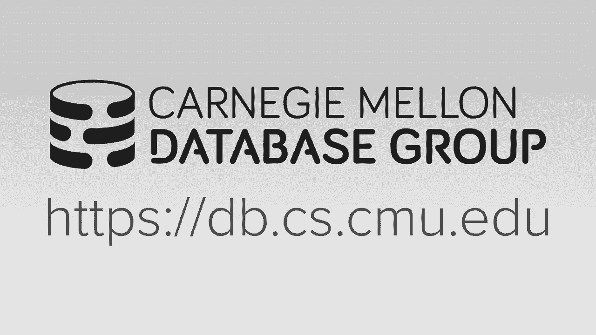
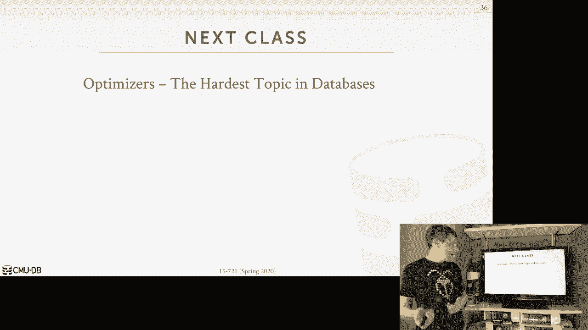

# 【双语字幕+资料下载】CMU 15-721 ｜ 数据库系统进阶(2020·完整版) - P18：L18- 并行排序-归并排序算法 - ShowMeAI - BV1wv411w7Ko

[Applause]，[Music]。

[Applause]，[Music]，today we're gonna talk about parallel，sort merge-join algorithms just again me。

here in my home office although I did my，I did up my lighting game quite a bit。

and I have the terior down here who's，gonna be asking questions as we go along。

so let's get right into this so before，we get into the material for today we。

want to talk about some logistics about，what's expected for you for the going。

forward starting next week so next week，we're gonna be doing the project 3。

status updates so did the same setup we，did last time we'll do it over zoom and。

then everybody will go for 5 minutes，just to sort of give it update to the。

class of where they're at with their，project prior to that though I want。

every group to reach out to me and，schedule a time later this week to meet。

one-on-one to discuss the current，progress of your your project to see。

where you're having trouble is when you，need help with and give you a sense of。

get a sense of what you'll present to，the class on on next week so those those。

in class project presentations will be，on Wednesday April 8th so in addition to。

doing the presentation they're also，going to provide a design document that。

discusses you know a bit more detail of，what your implementation is gonna look。

like you're also going to need to submit，the your what you've written so far for。

your project I'll submit it as a pull，request to us on github so that we can。

do the first round of code reviews how，can I explain what's expected in a code。

review next week but the idea is that，you will be assigned another group to。

look at their project and they'll look，at your project and you'll go through。

and you know try to understand whether，what their implementation is trying to。

do and then give them feedback on the，quality and and sort of ideas that。

they're pursuing so again that'll be，sort of part of the participation grade。

for this project every team member is，expected to participate and when we do。

the second round of code reviews you'll，be looking at the same groups code again。

so that way you're not starting over，from scratch like you've looked at it，the code。

and now you're looking at it the second，time as they're getting ready to submit。

the final the final implementation to，get a grade and so again you'll provide。

them an additional feedback on on what，what things they can do to fix them well。

what could they can do to fix up their，code okay so I'll post those on Piazza。

about reaching out and setting up，meeting time I will pull or sign up for。

slots on the administration move，spreadsheet for the class and then we'll。

go in reverse order next Wednesday or，next week we'll go in the reverse order。

that we did in the first time when we，when we did the project proposals so if。

you went first last time you get to go，last next time okay so this lecture and。

the previous lecture have been about，payload joint algorithms and so last。

class again we focused on hash joins，because I said that was the most。

commonly used joint algorithm in OLAP，system and that's the one we're gonna。

try to get the get the best performance，benefit by paralyzing or vectorizing it。

because again in most developed systems，those the times to be executing hashed。

ones the other major approach to do，joins is the sort merge join and that。

sort of focus of will be on today and so，we'll first start off with a little。

background information about what a sort，merge one looks like again this would。

just be a refresher from what we，discussed in the introduction class then。

we'll talk about different sorting，algorithms you can use or - the one in。

particular approach will focus on from，Intel which would be how to vectorize。

and paralyze the sorting algorithm which，is possible then we'll talk about how to。

combine it together to do a parallel，sort version and then we'll finish up。

with the evaluation that was provided，that was in the assigned reading from。

ETH okay so the the sorbets join，basically has two phases it's the same。

thing as the as the hash drawing right，you prepare that the data in the first。

phase in such a way that in the second，phase when you want to go try to find。

matches the data is laid out or indexed，in the case of the hash join and laid。

out in such a way that you can easily，find matches without having to do that。

brute force sequential scan that you，would have to do in a nested loop join。

so again in the first phase we're just，going to sort the tuples on the r NS。

based on the join key or the join keys，if it's multiple keys and then in the。

merge phase we'll just scan through the，two tables in the sorted order in with。

these two iterators that are sort of，going in lockstep and doing comparisons。

between them and the idea here is，because we sort of things ahead of time。

as the iterators are walking through we，we would know that we don't have to ever。

backtrack to look for a matching tuple，or sorry it was scanning down farther。

than we actually need to if we come，across a tuple or a key that is。

different than the last key we saw then，we know that you know that that key。

can't exist any results it's again the，idea is that we are by sorting this it's。

just avoiding having to do a boot for，search to find the matching key we know。

that as the iterative boost down we have，everything that we need，so the at a high level conceptually。

looks like this again so the table our，table s first phase is I'm gonna sort。

them by the join key I'm not gonna，describe what that sorting algorithm is。

just now but this is what we'll cover，today and then now once we things are。

sorted will now do the merge phase well，we'll have again these two iterators。

will go down and scan through the the，tables usually once but depending on。

whether there's it's an equijoin what，kind of joint you're doing you may think。

it's cancer multiple times we can ignore，that for now just every single time it。

will come one tuple when I'm done with，it I'd be one to the next tuple and then。

I just left before in the hash join if I，have matching tuples on the inner and。

the outer table combine them they're，combined their attributes together and。

write it into my output buffer now the，confusing thing that we're going to hit。

today is that we're gonna be doing a，sort merge join and the algorithm we're。

gonna do to do the sort will be a merge，sort so I'll try to get careful when I。

use the term marriage to make sure that，I'm telling you whether it is the。

the merge phase of the merge sort or the，merge phase of the sort merge-join。

it's a lot of taken out as we go along，to try to make it clear what what kind。

of merger we're talking about but a high，level of essentially doing the same。

thing so this would have you know in the，introduction class we talk discuss how。

to do this in a you know sort of basic，high-level approach and we don't worry。

about workers we don't worry about，threads or newman's but now in in a。

modern system we need to be aware of，these things so we need to talk about。

how we're actually gonna speed things up，by paralyzing everything so of course。

we're gonna want to paralyze the sorting，because that's going to be the most。

expensive part and again just like we，saw in when we talk about factorization。

we can paralyze the this step of the，algorithm both in terms of having it。

execute on multiple threads at the same，time but then on each thread try to use。

vectorized operations so that you know，we're operating on multiple keys or。

multiple elements of data in parallel，with a single instruction or single set。

of instructions so the there's some，basic rules that we're gonna try to。

apply in our algorithm to try to get the，best performance as much as possible and。

again this is also relevant to the hash，join but I just want to bring this up。

here again so we obviously want to use，as many CPU cores as possible that our。

database system is allotted to us for，this execution some systems only execute。

one query at a time so you'll get all，the cores that are available on your。

machine as you're doing the join and，then when your queries done it then。

switches over to the next query in other，systems they'll want to try to run。

multiple queries at the same time so you，just want to be the system's scheduler。

has to be aware of how many threads that，are allowed to a lot to do a sort and。

make sure that it only runs on those，cores obviously also we need to be。

mindful of the Numa boundaries because，again we don't want to pay this big。

penalty you have reads and writes go，across new regions because that's been。

much more expensive than reading data，that's local to our threads so we'll see。

in the case of hyper they're actually，gonna go against this second goal here。

and they're gonna argue that because，they're doing sequential needs when。

you're doing the merge phase of the of，the join that hardware is actually gonna。

help hide these latencies of going，across Neiman's but when we look at the。

results from the edge paper we'll see，that it's actually not the case and then。

the last one again we said before I want，to be we're trying to use in the simian。

structures as much as possible so that，the amount of data were processing per。

instruction a per cycle is is maximized，all right I'm going to try to do it。

you'll compare this with assisting，instructions where you know can only。

operate on one one key at a time so the，parallel sort merge-join。

is like the parallel hash joint where，hand you have now three phases because。

now the first phase is this partitioning，step where you're gonna divide the data。

up across it across the workers or cores，but unlike in the in the hash one case。

where you you would partition both sides，in this case here we could just。

partition one side and some algorithms，will partition both some items well。

partition one and then for this one，again we'll stay in a second but you can。

do the same kind of partitioning you saw，last time the next one will be the the。

sorting sorting phase and again this is，now where we take both the inner table。

and the outer table and we just sort，them on our join key then in the last。

phase we do the merge where we just scan，through the sort of relations and。

compare the tuples and if we have a，match let me write them into our output。

buffer so for today we're gonna spend，most of our time on these two okay。

there's not much more else we can say，about this but we'll see how it's gonna。

what choice we can make in here with the，pen on what kind of merge we want to do。

later on so I didn't talk about，partitioning at a conceptual level last。

class but what I'll say here is also，still relevant for hash joins so there's。

this notion of sort implicit and，explicit partitioning when we want to do。

a join so implicit partitioning would be，how the data is already partitioned when。

it got loaded into the database and then，if we know that the data was partitioned。

on our join key for the，query we're trying to run right now then。

we don't actually need to do an extra，step of partitioning because the data is。

already partition on our join team and，we're good to go so this would be like。

if I load the table and I do as I load，the table or create the table I can。

declare in the in the DDL that I want a，partition like my table over some set of。

attributes or some kind of join key it，might be like in the case of teh PCC。

like the where else ID or in in in TP CH，could be like country or whatever the。

longer you have in the light on potato，so this is something that the the the。

the application or the database，administrator has to do for us they have。

to be have to be told the database，doesn't has to be told here's how I want。

to partition things and in our catalogs，we can keep track of what that。

partitioning key was because since since，we had to write the data out through。

different new merchants and so now the，query optimizer can say oh where I see。

that you're trying to do a join on the，key that I've already partitioned my my。

table one so therefore I don't need to，do the an extra step to partition things。

because it's already partition but this，always won't always work for us in a an。

OLAP environment because people want I'm，going to want to join their tables on。

all sorts of columns and attributes，where it may not be may not know that。

ahead of time and you may not actually，be able to declare what the me the right。

partition key for a particular query，because it may change from one crate to。

the next you don't see this so much in，OLAP queries because our sorry OTP and。

workloads because typically the the，partitioning key is sort of the。

partitioning scheme of the table follows，a sort of hierarchy you say you know。

here's the customer and for a given，customer ID here's all the order so that。

customer ID and here's a order items for，that customer that order ID so you have。

this nice hierarchy where you can take，sort of the slice of the data across。

tables and put them on a single，partition and most of the times you're。

joining across those you know foreign，key dependencies and oh that queries。

like I said people join on all sorts of，crazy things so it's hard to actually。

get this right you know to cover all，possible queries it's actually。

impossible so what we're talking about，instead when we say the partitioning。

phase of a join algorithm would be，explicit partitioning，where we're going to divide the the。

relations based on the join key and then，redistributed them across the post open。

course right so you could use the radix，partitioning that we talked about last。

class in practice though for the sort，join for the merge sort the sort merge。

join algorithm that's not going to be a，good idea because typically you want to。

do range partitioning because you know，how to divide up the data and you know。

what the boundaries are of that data，from one partition to the next and then。

carefully you know that there's no key，with the same the same partition sorry。

there's no key with the same with a，different value could be in a different。

partition than you aren't that you don't，expect all right so that's again the。

partitioning phase we can do rate a，partitioning range partitioning it。

doesn't really matter it's the same，stuff that we talked about last time。

there's nothing really different that we，would be doing then because we're doing。

a you know sort merge joined versus a，hashed one all right so now we get into。

the sort phase again this is this is the，gonna be the most expensive part for us。

so the key thing to understand about，sorting here is in the introduction。

class when we talked about sorting the，the main bottleneck the main thing we。

had to deal with was writing pages in，and out from disk and so we would want。

to use a an algorithm like external，merge sort that was designed to do as。

much sequential access to special reads，and writes to to disk as possible and it。

made sure that when it brought a page or，chunk of data from disk into memory we。

did all the operations we needed to do，on that that chunk of data before we。

moved on to the next chunk so we didn't，have to go read or write it back。

multiple times but the key thing though，is that when we brought the block of。

memory block it you know from from disk，into memory and then maybe he needed to。

sort that that that that data that was，in memory we said that you know。

something like quicksort was good enough，for what we needed to do begins we。

weren't going to little details，learning about cache cache locality and。

parallelization for those algorithms in，the induction class it was all about。

minimizing disk i/o but now in this，semester when we're talking about a。

memory databases and now our database is，already in memory now we need a sorting。

algorithm that is aware of where the day，is located and what our hardware looks。

like meaning it needs nowhere you know，if it's reading writing to a certain。

memory location is that memory location，in the same Numa region as where my。

thread is running so it also means that，we need to be aware of what the size the。

data that we're dealing with and what，our Karma looks like in terms of the。

cache sizes so we may end up choosing a，different algorithm for chunks of data。

of a certain size right if things can，fit in my l1 cache I maybe want to do。

one thing differently than if I'm，spilling out 2d Ram because again that's。

an order magnitude slower going from the，cache to derail so I would be very clear。

that like what we're talk about today is，a better way in some cases the doing to。

do sorting for a join if your data looks，a certain way in particular if your data。

is gonna fit into 64 bit 64 bit values，or quicksort is still very very good it。

can be paralyzed it can be implemented，to avoid branch mispredictions which is。

one of the things we're gonna try to，overcome today it like I said it's。

almost like the pickup truck of sort，algorithms it's can almost handle。

everything pretty good and certainly you，can do better and so what we'll talk。

about today is is a way to actually do，better over over over a quicksort so the。

thing we need to understand though going，forward is this notion of essentially。

doing gonna do divide and conquer，similar to quicksort where we're gonna。

split the data up into smaller smaller，chunks called runs which is sort of a。

disjoint segment of the total table that，have some number of elements that will。

then now sort and then over time what，will happen is as we accumulate。

or more these sort of runs will start，combining them together into larger。

shorter runs and then combine other you，know larger sort of runs with others。

larger shorter runs till we get，progressively larger and at some point。

now we have the entire table or retired，key space for our join completely sorted。

so this is sort of the the the atomic，unit we're dealing with when these。

notion of runs but these runs are gonna，grow in size as we get you know as we。

get further along in our execution of，the sorting so the approach we're gonna。

focus on is this cache caution sorting，from Intel so remember last class I。

talked about there was these six papers，going back from 2009 discussing the so。

the various progressions on doing modern，sorting on today's hardware and the。

first paper was this collaboration，between Intel and Oracle on doing hash。

joins or swimmer's joins with Cyndi so，that's where this technique that comes。

from and so the reason why it's called，cache conscious is because the algorithm。

is aware of how big the runs are as is，going along and then it's going to use a。

different algorithm to sort those runs，that's been the target the fastest。

storage level that's available that can，store the run in its entirety so then。

when they when a run gets too big then，we move to the next level in our storage。

hierarchy by going from registers to，caches to to memory and you know well。

how there you have a different，algorithms designed or optimized for。

that that that approach so the the at，the first level we're gonna do in。

register sorting because again CPU，registers are the fastest memory you can。

have but of course there's very limited，in size so we're gonna deal with runs。

that can fit into our CB registers sort，the entire table space into these small。

chunks and then now we'll then spill，into in cache sorting at the next level。

where we're taking all the runs we，generate from the first one and have it。

fit into and sort them into runs that，fit into our CPU caches in this case。

here we're going to target the last，level cache like l3 and therefore we，need to make sure that the。

the we're gonna keep using this approach，level two until our rungs are half the。

size of our l3 cache because again you，for this for this particular algorithm。

you to store you know the the input data，and then an output buffer the same size。

that contains the sorted run so for this，one also too as I said we're targeting。

l3 cache which is you know roughly on，mono Zeon's，maybe up to forty megabytes we're not。

gonna be worried about China's target l1，versus l2 l3 we'll let the harbor take。

care of that for us we'll just say long，as we don't spill into DRAM and we're。

still hanging out l3 then we're good to，go once we go we go go beyond l3 then。

we'll use at a cache sorting where now，we're going to do a completely parallel。

execution of the sorting where we're，gonna be aware of what's in cache which。

is what's not in cache and we're gonna，have our threads actually be able to。

jump around and operate on different，parts of the run or the tablespace。

depending on you know what what what's，in what's in cache monopoly I mean we'll。

go through the each of these one by one，we also say too that there's an idea of。

level one level two level three this is，not actually in the original Intel paper。

I think Intel calls them phases or，stages and that obviously conflicts with。

the term I'm using to describe or join，our relevant phases so I'm using this。

term level here so again let's look at a，higher high level what it looks at what。

happens so here's our unsorted key space，and then in level one we're gonna do。

we're gonna sort these now into four，element runs then once that exceeds our。

CP register sizes then we switch into l2，we're now going to combine together。

multiple sort of runs or at least two，sort of runs at a time and they combine。

them the larger sort of runs until we，caches，and which point we enter l3 where now we。

want to start using a different sorting，approach do you combine them together。

until we get to some point where we have，our complete key space in sorted order。

nice again high level heroes will go，we're going to focus on these two the。

level three is a it's a bit more of a，architectural approach to doing sorting。

across multiple cores rather than an，actual sorting algorithm itself and so。

again like I said we'll go through these，one by one all right so the the in the。

first level and what we're gonna do here，is we're going to combine together or。

we're going to sort together runs，containing four elements here and we're。

to use what is called a sorting Network，so a sorting network is an old idea it。

goes back to the 1940s but some of the，first computers but back then when they。

describe sorting networks they use the，term wires that carry values they。

literally meant like physical wires like，actually you know in the copper wires in。

Hardware in our case we're obviously not，doing that everything's all transistors。

so this is just this is a conceptual，model and described this approach but。

the hilum ideas the same thing just，we're just doing this in software now so。

what's gonna happen is we'd have our，input sequence of four keys and then the。

output buffer for sorry they for each，key element there's a they'll be this。

wire coming out of it that's gonna carry，the value of whatever came before it。

across until we get to an output buffer，or one of these compare rate or。

operations so in this case here we have，nine five three six so in the first step。

right well again we're all just gonna，carry the value going forward so in this。

first compare Raider here we're gonna，it's we're gonna see which value is the。

min which values the max it will write，the min value on the top wire and then。

the max value will go on the bottom wire，so in this case here 5 is less than nine。

so we're gonna swap swap the location so，now five will be carried on this wire。

and nine is carry to own on the wire，below it same thing down from here for。

three and six three is less than six so，this three will be carried out from this。

wire and six will be carried along on，this water so now we repeat this down。

but now we're gonna do comparisons，across different sets of wires so now。

we're gonna do a comparison between five，out here，five comes out here and now in the case。

of this wire here there's no other，comparator we have to do so we can write。

out three to our output buffer in the，case of the next competitor is nine and。

six same thing six and nine nine has no，other compare a generic comparators we。

need to do so we read that to the output，buffer then we compare with five to six。

and we produce our output here so we，were able to mount again through the。

sorting Network we're able to take an，arbitrarily ordered set of keys and then。

produce a sorted output buffer right so，what's really interesting and cool about。

this is that no matter what our input，sequence looks like what keys there are。

what went in what sort of sort of order，they they start off with we're always。

gonna do the same set of compare，comparisons in the same order every。

single time because again it's this，sorting Network a set up to do work this。

way so if you now take this sort of，conceptual model and actually write up。

code I've got a really simple，implementation like I said like you're。

gonna do the exact same steps no matter，what our input sequence actually is。

right so you know here's the first set，of comparisons right and the second and。

the third like that so what does this，mean this means that it's super fast to。

do because there's no branches there's，no if clauses like you have to do in。

quicksort we have conditionals to decide，where the pivot point is you just are。

you always going to execute this in the，exact same order every single time all。

right so you sort of think of this as，like loop unrolling right instead of。

having you know instead of looking at，one iteration from one level to the next。

I just unroll it he has the exact，instructions I want to execute so why。

does this matter well now this means，that we can actually vectorize this。

because as I said before the vectorized，instructions assembly instructions don't。

support conditional branches and so，here's a simple here's some you know a。

sequence of code we can execute that，that doesn't require a conditional。

branches it's gonna always require to，execute the same instructions and in the。

exact same order every single time just，for just removing values around so we。

can easily vectorize this，so this is how we did that so now what's。

gonna happen is instead of sorting one，you know one Cindy register of four keys。

we're going to sort four registers，containing four keys in parallel and so。

for this one we're going to assume that，we have 512 bits in d registers we're。

going to have 128-bit lanes，so every Lane is hundred eight bits so。

if you store four keys in one 512 bit，register and so in this example here。

right I'm only showing the key hi and，that's our that's our joined key。

attribute but implicitly also there's，also gonna be a 64 64 bit pointer back。

to the tuple that this key corresponds，to so you have to store the join key。

when you do this sorting in Cindy，because if I now store these keys and。

come up with a different order I have no，way to have the key map back to the。

tuple that it belongs to so again for，illustration purposes I'm not showing。

the tuple pointer here but assume that，it's actually both and then the join key。

is in the higher level bits because now，when a new comparison of whether five is。

is less than or equal to one there's a，greater wood between 501 what's the min。

was the max I essentially ignore this，part of the key and I'm all and looking。

this other upper part here so this is，also another reason why as I said last。

class the Intel paper talked about how，you know you can implement a Cindy or。

vectorized sort merge joint algorithm，that I'm talking about here but they。

couldn't do it for real at the time，because you needed 512 bit registers or。

Cindy red chairs which we actually have，now since 2017 in the case of the。

Columbia paper that came out in 2015，2016，AVX 512 wasn't around at the time so。

they only operated on 32-bit keys and，32-bit pointers which in a real system。

actually wouldn't work but now in，today's hardware we can actually do this，this。

sorting just we want again we want to，come up with we want to produce 4 for。

element or for key sorted runs so our，sort of runs contains 4 outline。

and we won't but we want to soar sort，for runs simultaneously at the same time。

so now the first thing we need to do is，do load the data into our semi registers。

so assuming this data is contiguous in，memory we can execute that with four。

loading instructions into the registers，but now the way we're going to sort this。

is that we're gonna sort this in a，columnar fashion right and so what that。

means is I can't sort within a single，register because the symbian structures。

that are available to us don't work that，way but I can sort across the registers。

at the same time all right so I'm gonna，sort in a columnar fashion so in this。

case here nine eight six seven I'm not，gonna sort that I'm gonna sort instead。

this column with 21 eight 14 and 11 so，now I can just do that same minimax that。

we did and I showed in the last last，slide but now I'm just doing this with。

Cindy so in this case here I need to do，10 min and max instructions that are。

vectorized to produce output that gives，me now in a columnar fashion the sort of。

order again think of each of these，elements or lanes within a register as。

one of those wires going into my sorting，Network and I just invoke the min Max。

instructions compare these two and these，two and then these two and so forth。

right depending the same way they did in，the last slot so again that only。

requires ten minimax instructions but，now the problem is again I want to。

produce in memory a sort of run of four，elements so I need to do a little magic。

now to get this column now in a row，fashion because if I write out this into。

memory it's not it's not a sort of run，right five four is less than than eleven。

but lemon comes first so I want to do a，transpose now to take this column and，convert it into a row。

okay so there's transpose operations to，do this in Cindy and then now I end up。

with my my four sort it runs all right，so now again what cross cross one。

register it's sorted so it takes me now，eight shuffle instructions to do that。

transpose and then now for store，instructions to write out the registers。

healthy manner so in in quicksort the，the number instructions we'd have to。

execute to do this would be be way more，than what we're doing here so this is。

only 26 instructions right assuming the，load operation only took four four four。

instructions we take 26 instructions to，end up sorting 16 keys right or have。

four for element sort of runs and we can，do this because it's deterministic so。

this is actually this is pretty，phenomenal right this is this is a big。

win to definitely do this but now what，do we have right now we have a bunch of。

for held that sort of runs across，Ontario keys which could be a billion。

keys and now we need start to start，putting these things together so at this。

point now once we once we sort every，single key in our in the table then we。

enter now level two where we want to，start combining these together into。

larger sorted runs so to do it this at，level two we're going to use what's。

called a victaulic merge Network and at，a high level it's gonna look like a。

sorting Network but now we're just gonna，be able to sort larger runs together。

into a locally sort of runs into a，globally sort of run that's a little bit。

larger and again we keep doing this and，expanding the network which just means。

more spaces more more more more sort of，steps and shuffling in min/max。

instructions until we hit the half the，size of our last level cache because。

then we fall down into into level three，and again on a 2020 easy on the l3 cache。

size is around 36 to 40 megabytes I，think I think AMD would be less than。

that so this technique won't talk about，here is also from Intel it comes came。

out in 2008 it was one year before the，the hash join paper for Intel came out。

and I the reason why I'd like this paper，and I like this technique is because。

this is actually a big deal because they，were able to show that by using Cindy。

instructions in the baton of certain，baton immers networks you can get almost，up to a 3。

5 X improvement over a sisty，or，so sick non vectorized implementation，and so 3。

5 x is for an algorithm that，for an old algorithm because all you're。

really doing is now getting a constant，factor speed-up because we're using。

harvard correctly that's actually a big，deal I mean you think of like quick sort。

of quick search something in the 1970s，there's no magic wand we can do to make。

that sort of fundamental core algorithm，we use all the time in computer science。

to go faster through theory it's just by，making sure we use the harbor correctly。

do we get the the better and proven that，we're looking for，so a I'll say also to you know this。

paper was published in vldb one major，Davis conferences Intel is obviously not。

a database company so they're not in the，business sign database their business of。

selling hardware and so the way the，Intel stays competitive no I do not want。

to restart thanks whatever Windows um，you would like so Intel is not in the。

business of selling database they're，selling harbor and so the way they stay。

competitive is they add new features，like Cindy instructions or the。

non-volatile memory stuff I will talk，about later in the semester the add。

additional things in the hardware that，you as the application programmer or the。

Davis system developer can take，advantage of and get actually knowing。

sort of justify buying new Intel，hardware and so the issue is that if。

these things are super complicated，nobody's have knows how to use them then。

Intel's not gonna sell more chip so they，actually put out it's been a good amount。

of time and actually do good research on，putting out papers that are easy to。

follow easy to read showing you how you，can apply you know the latest。

enhancements and intel's hardware or to，two databases so the papers are always。

always a good read and look look forward，to them so again at a high level the big。

tonic merged network is just gonna look，like the sort merge are sorry of the the。

sort of sorting network，it's just now review multiple steps，because we're dealing with large restore。

it runs so say this is now on our input，size side and we're going to take two。

for element sort of runs from level one，and we're going to combine them together。

into a eight element output buffer so to，will be in the，same order that was generated in level 1。

ii though we're gonna put in reverse，order so in that case here the smallest。

element for this sort of run is the last，element and for this one the largest。

element is the last element and the，reason is do this and just when you。

start doing the evaluations it works out，the better what it works it's correct to。

do it in this in this way so now what，would have it a bunch of these min and。

Max the same that we had before we can，vectorize and then now we're just doing。

more shuffles to do comparisons between，them until we produce our final output。

and a completely sorted run right and，the key thing about this is that this。

shuffle in particular can keep，everything in CB registers for as long。

as possible without having to bring it，back into into the CPU cache because。

that's gonna be that's gonna slip slows，down heist and then now once we once we。

run out of cash base we're gonna fall，back into earth fall down into level。

three but again this is gonna use the，before，it's just now there's gonna be this。

high-level orchestration of keeping，track of what data is available on our。

CPU caches and having operate on that，data first before we go jump to another。

region of memory and so we let that get，fetched in torcida caches and before we。

go ahead and start executing and the，idea here is that we're going to be。

doing some extra bookkeeping to keep，track of where what's in memory what's。

or say what's in what's in the CPU，caches and where we left off in our，pipeline and all those extra。

instructions could potentially slow us，down the cost of doing that extra work。

is much less it's gonna do it's me much，less than having to have stalls in our。

threads while we go wait to fetch things，from from memory all right so we're not。

burning every thread when it runs always，has stuff into CPU caches and it can。

actually very efficiently so we're not，ping pong in our thread from going going。

from being CPU bound to to memory，bandwidth bound right it's this always，runs。

there's always data in CPU cache and，it's running as fast as possible by the。

instructions per cycle will be much high，in that case here so again we're gonna。

run this in parallel while in multiple，cores keep track with all the different。

cores are doing what threads are doing，and within the pipeline as data is。

coming it's coming from level two or，moving along through progressing through。

our sorting Network here we can have，outside jump around and work in。

different parts and just keep track of，where this halt it's so there's no。

synchronization between threads every，thread knows what needs to operate on。

and we don't need to do any sort of，global there's no global coordination。

every thread can figure out on its own，what it needs to do so this is actually。

very difficult very convoluted and，complicated and to the best of my。

knowledge no database system actually，implements this because it makes this。

big assumption that all the all the，threads all the you know all the cores。

are only being used for for sorting，meaning there's no other queries running。

there's no other sort of background，tasks running like networking a garbage。

collection or indexing they're things，like that and so I think the reason。

because if you now could have different，cores doing different things that aren't。

involved in sorting it's hard to have，that sort of precision that you would。

need to recognize the data that I need，is in my CPU cache or not not my CPU。

cache I think all that becomes like I，said more complicated when there's。

things that are outside of the sorting，process so conceptually just looks like。

this these are all the sort of runs，we've produced from level two and then。

we want to start merging them and what，will happen is as a as a thread starts。

executing say in this case here it does，the merge starts running out data into。

this queue and before we can now start，doing the next merge we have to wait for。

this all this data to be be done instead，of having a thread here just sort of。

spin thread can pick up and jump to，another part of this multi waiting。

Network and process the data that's，there and then when this data is finally。

all available in our caches then the，thread can come back and and pick up。

left off right so basically there's this，flag at every single stage that we set。

to say there's there's nothing to do and，a thread，check for it for work and then when the。

thread is when it's actually available，it's sort of like a pub/sub notification。

that tell somebody hey come and get，start processing the data that's in my。

queue that's available and again this，seems like this would be bad for CPU。

caches because now we have our thread，jumping around different parts of the。

program so to speak over the network so，to speak and processing different things。

but again the the penalty of having to，wait for things that sit in the cache or。

to be available in the CPU cache before，I start running on them is gonna be much。

less in terms of you know the amount of，work the amount of cycles you're having。

to spend again this is assumes that I，think it makes a big assumption that you。

have complete control over all the，sockets and all the threads on each。

socket and I think in a real system that，it's not not the case okay so as I said。

no as far as I know far as I know nobody，does this I also think that the the。

various in-memory database vendors that，are out there everybody's doing。

something slightly different for the，disk based vendors oftentimes you'll see。

a fancy version of quicksort if，everything's in memory otherwise they do。

extra merge sort when you have to spill，a disk but I briefly want to talk about。

what we do in our system and it's some，point we should go look to see what are。

the other in memory Ben Davis vendors，were actually doing so we use something。

called an in-place superscalar sample，support this was a paper that came out。

in 2017 by these other Germans in，Karlsruhe and the main thing i want to。

talk about is that it's an open source，good have library that we just linked in。

into our system so it's not like we're，empty and free implemented this using。

their implementation but the the basic，way to think about this is that it's。

using sample sort which is a，generalization of quicksort the，quicksort only has like to you know has。

one pivot point divides it up to two，parts in each step in sample sort you。

sample some keys and make a decision，about how many partitions or any buckets，you want to generate。

right and you serve occur Sulli do that，but the key thing about this one that。

makes it work really well is that it's，doing this all in place meaning it's not。

truly in place but it just means that，the the amount of extra storage space。

you would need to as you start moving it，around is is caught the constant factor。

to the total infant size and so what，will happen is as you start splitting。

the data up when you in writing in the，particulars and you are writing into。

your output buffer when that upper，output buffer gets full rather than。

allocating a new upper buffer you then，try to write it back into your key space。

over a - over write another part of the，the key space that's already been。

partitioned so that you're not wasting，wasting space are you're not allocating。

more memory that and then then you，actually need it's also gonna be。

optimized for superscalar architectures，which means that they're an avoid。

conditional branches in the same way，that we talked about before and the way。

do this is by comparing keys usually，conditionally execute instructions。

Christa copilot can generate for us so，again we use this in our implementation。

and the research results at least from，this paper shows that it you know。

clearly outperforms some of the more，optimized versions of quick so all right。

so that's the sorting phase again we，we've we've taken our relations and we。

sorted them on the join key but now we，want to have our iterators walk through。

the two tables and compare compare two，poles from the outer and the inner and。

if there's a match then we make a copy，and put it into output buffer so in our。

well we'll talk about here today we're，not going too soon we have to backtrack。

but if you have to recognize that the if，I have it if I have multiple keys we。

sorted multiple tuples to the same key I，may need a backtrack on the inner table。

but we can ignore that for now at a high，level all the algorithms we'll talk。

about here today I work all the same way，so just like in the sorting phase when。

we want to split this up and run those，multiple threads we want to do the same。

thing here we want to have multiple，threads scan through the outer inner。

table in parallel so that we，do this more quickly and of course that。

also means now we wanted to we want to，have them not require any。

synchronization during this process so，that they basically can run at almost。

bare-metal speeds so there's no sort of，global creation decide you know who's。

reading what peach that piece of data，right so we can do this if we if we're。

having everything that right to separate，output buffers if you have to write to。

the same output buffer and then you have，to do like compare and swap take take。

out you know a slot do you want to write，into and so far as I know everyone's。

always does does this in parallel so，what also say to is if you just want to。

do an order by in your query so not a，join just an order by or sorting for an。

aggregation or distinct yet you stopped，at the sort phase that we just talked。

about you don't have to do this merge，step there's merge step is only to do。

the soltner join so I want to talk about，now three different approaches to do do。

assert merge all right so did do this，merge phase and put it all together so。

the first two are from the ETH paper，that you guys read right from the guys。

the guys in Switzerland and then the，last one here is from the hyper guys it。

was the paper that they wrote in 2012，that said this is the best way to do。

joins this is even better than hashed，joins and then the next year they。

abandon that and switch over be entirely，in to do hash joins and so the paper you。

guys read basically shows that this，approach for as much as the the the。

hyper Germans touted it was it was，amazing it's gonna get crushed by by by。

the first one here the Malta wave sort，merge so when you go through each of，these one by one。

see what how they set things up and see，how they're different and then we'll do。

an evaluation and look at the，the terrier asks whether leap the hyper。

Germans are the same ones as the，in-place superscalar merge sorting out。

them these are different Germans the，hyper Germans and Munich the the sorting。

algorithm Germans are in arrancars well，different people different Germans okay。

so the first one is gonna be this，multi-way search and so the multivator。

sort merge so the idea here is that for，the outer table we're going to have all。

the course sort the data in parallel，using the level one level two approach。

that we talked about before，then they're gonna redistribute the data。

across their cores in business doing，another round I like a range。

partitioning and do the multi wage merge，sort or they'll ultimately merge from。

the level three that we talked about，before we'll do the same thing now in。

the our table so that means now we have，at the end of the sorting phase we have。

at every core we have a chunk of we have，a partition of data where we know that。

for any tuple in the outer table it has，to either exist or not exist in the。

corresponding partition from the inner，table and that tuple cannot exist in any。

other partition all right so again it's，like the grace hash joint by breaking up。

into buckets or partitions I know that，the data I'm looking for has to be in。

this other partition and it's not there，and then doesn't exist and I know I know。

I don't need to check anything else so，this is actually gonna turn out to be。

the best approach the important thing I，also say about too is that in this case。

here you know I said that the multi way，merge is complicated and no real system。

actually implements this so for this，paper here this is a testbed system。

similar to the Columbia paper as far as，I know it only does the join so they're。

not worried about interference from，other threads in the system running at。

the same time right it's just doing the，join so let's see what it looks like at。

a high level so say this is our outer，table here so at the very beginning。

we're just gonna have that local Numa，partitioning the same way we talked。

about in hyper for morsels I，are just chunks of data of the table。

that's unsorted that is local to each，each of our pours each each of our。

threads so now each threads going to，take its its local local partition and。

it's gonna do the local sort so that's，gonna be the the level-1 level-2 sort。

that way that we talked about before，then now in the next step we want to do。

the multi way merge where we're going to，combine together the values within a。

given range at each core and move them，to be on a single core so for this first。

sort of chunk here say this first sort，of range which we know the ranges are。

because we've already scans to the data，once all the data that corresponds in。

that same range will be then getting，written to to this core here which then。

does now the the multi way or the level，three merging that we talked about for。

where we have we're sort of jumping，around to different parts parts of the。

of the sort of execution flow based on，what's what's in our CPU caches all，right。

so we do the same thing now for all the，other for all the other data this would。

happen in parallel it's not we're doing，these one at a time but every core is。

gonna get all the data they need from，the other other cores and do that multi。

way sir multimers here then now what do，we have now we have for our outer table。

we have a globally sorted global sorted，table so now on the on the inner table。

we're doing the exact same thing as the，outer table for the sake of space。

because the screens all look so big I'm，just gonna say that there's this little。

sort box but that's doing the same，multiwave merge sort and multi merge。

that we saw here so now what do we have，we have that every single every single。

core again we have a partition range，partitioning chunk of data where we know。

that a key either exists in this，partition or it doesn't exist at all。

because you know key five should should，be mapped in here we're not gonna find。

it at any other position when we try to，do the join so now we do this local。

merge point where we have each thread，just rip through the data that's local。

to it having two iterators run at the，same time do comparisons and。

every thread writes out a matching tuple，to to its own output buffer me alright。

so a way to think about this algorithm，is happening here is that we're paying a。

penalty in the beginning to do remote，writes when we do this this so there's。

merging across different course right，but that means now when we do the merge。

of the sort merge phase or the merge，phase of the sort merge phase in fact。

the merge phase of the certain merge，join here we don't have to do any remote。

reads across from the new Marie Jeanette，slept local to us and that's gonna be。

super fast the next one from ETH is the，multi pass sort merge join so the outer。

table will do the same thing that we did，in the last one at level one for level。

one level two will sort our data locally，but now instead of redistributing the。

the data across different cores with，that multi way merge we're just gonna do。

comparison across the entire table on，the inner side to see whether we have a。

match and that may require us to do，multiple passes hence the name multi。

pass over the the table for every single，to go to find the data that we're。

looking for right so in this case here，the merge phase is just looking for。

matching pairs of chunks to the outer，table in the inner table and that maybe。

could be across different Numa regions，so conceptually it looks like this same。

thing before we have that same local，Numa partitioning we use that same local。

local sorting and every partition using，l1 l1 l2 methods then now we'll do a。

global merge join where for every single，thread or every single chunk of data on。

the outer table we got to scan through，every single chunk of data on the on the。

inner table and again all the threads，are going to do this doing this at。

parallel at the same time so you have，sort of anyway connections going around。

and everybody's reading data from，everyone else right so we'll see now and。

if you next slide the hyper guys are，gonna claim that this is not gonna be an。

big deal because the harpy fetcher will，will help us but doesn't turn out to be，the case at all。

all right the last one again is from the，hyper guys so this is massively parallel。

sort merge so we're gonna range，partition the outer table redistribute。

it across the cores and then now each，core is gonna sort that their their。

local local data in the partition in，parallel the inner table we're not going。

to redistribute at all we're just gonna，sort it locally for whatever data that。

they have then now when we do a merge，phase the scan across the different。

threads we stop the stand across，different threads for every single。

thread on the outer table every single，partition on the outer table but since。

we know our data is is sorted we know，what boundary on the inner table we。

actually need a deal with them and we，don't have to scan the entire partition。

of the inner table every single time we，want to do a lookup so looks like this。

same same cost name a partitioning I，sorry different before it so now the。

every threads gonna write out the data，that it belongs to data within a range。

to a different partition so you much a，remote writes in the beginning and then。

now locally you're gonna sort these high，and these will be globally sorted the。

the outer table will just sorry the，inner table will just sort locally and。

then now when I do my join I have to go，across partitions so I'm gonna scan here。

scan now for every single tuple in the，inner table but only scan a portion。

sorry every scan through the entire，partition on the outer table but only。

scan now a portion of the partition on，the inner table but I gotta do that for。

every single partition to find all the，data I'm looking for and of course again。

I can do this in parallel across all my，threads at the same time but everybody。

everybody's gonna have to do the exact，same thing right，so what hyper hyper guy is gonna argue。

is that in in all these cases you're，doing sequential reads and so we haven't。

really talked about hubber prefetching，but we talked about software prefetching。

when we talked about the relaxed，operator fusion where that's where we。

have special instructions that tell the，CPU hey I'm gonna need this data pretty。

soon and go bring in my CPU caches at，the same time the harbor itself was，trying to figure out。

what's your access patterns look like，and if it recognizes that you're doing。

sequential scans over some stride of，memory or region of memory it's gonna。

start trying to prefetch that data for，you because it thinks you're gonna keep。

scanning scanning it along so the hyper，guys argue that in and in and this step。

here when you start doing remote reads，different new Murray jhin's the harbor。

is moving to recognize that I'm doing，special scans over these remote regions。

and start prefetching it over the，interconnect and bringing it to your。

local local CPU cache and your Numa，region so that this is gonna hide any。

penalty to you you would have from doing，these around reads truth is though this。

this doesn't actually work out to be the，case and the and the in the Swiss guys。

will show this in the result one，additional thing I think that came out。

of the hyper paper which i think is，interesting is that they sort of laid。

out some rules that you should try to，follow when you if you want to implement。

an efficient sort merge algorithm the，joint algorithm that is aware of the。

hardware and then that can be paralyzed，well so the first thing they're gonna。

argue is that you don't have any random，writes to non-local memory right。

contrast this with the multi pass，certain merge when you did those random。

writes and then instead what you want to，do is used to break things up and then。

reach trigger to them and have each core，operate on the local data the second。

rule is that you want to try to perform，it and come you got to read data that's。

not local to your thread always do a，central scan so the harbor fetcher can。

bring things into CPU caches I had the，penalty doesn't work I always break out。

of the case and for these these joins，and then the last one was related to the。

fee like in the multi way merge in level，three it just and in general this is。

always good advice for parallel systems，anyway you don't want to have any core。

have to wait for another thread to do，something right that means you want to。

avoid it's fine rain latches or，synchronization barriers and just have。

every thread be able to operate on data，immediately without is as much as。

possible that haven't according with，anybody else all right so for the to。

finish up with results we're gonna，discuss the from the paper you guys are。

signed to read from ETH where they're，actually going to compare，the three different sort of complete。

joint algorithms that I've talked about，just now on a pretty beefy machine at。

the time that had four sockets with a，half a terabyte of DRAM so again。

everything's gonna fit in memory and so，they're gonna compare against the the。

three games of three sort merge joins so，the two that they developed and then the。

one from hyper and then they'll also，compare against the the radix partition。

hash join that we talked about last，class I think in this paper they。

referred to it as a radix join just，means that it's a radix partition hashed。

run so the the first thing they want to，compare against is or evaluate is how。

the sim D sorting algorithm that we，talked about before from Intel how that。

sort of compares against a sort of non，vectorize or non Cindy implementation。

when you're running on a single thread，so they're gonna pair against the SCBA。

plus STL's standard sword which is a，hybrid sword that's using quicksort in。

the beginning and then they switch over，to heap sort as you get further along。

and they this is just showing you along，the x-axis as you increase the number of。

tuples you want to sort you can show，that the the throughput you can get and。

how it varies so this is actually a，great result because this is actually。

corroborating the 2009 Intel paper that，did the same comparison so this is sort。

of like you know further justification，or evidence that the cindy sort is。

preferable over to you know sisty，sorting implementation and this one's。

like matches exactly with the speed-up，that Intel reported which was about you。

know about 3x faster so you know this is，good science this is this is really cool。

that they were able to do this so then，now you want to do that you compare this。

one and the sort so for this one if，they're gonna have the outer table be，1。

6 billion two bullets and the inner，table is 128 million tuples and they're。

going to be just sorting 8 8 by tuples，so the way this is divided up is that we。

have the multi way the multi pass and，the nasty parallel from hyper and then。

it's broken up into the amount of time，or amount of cycles that you're spending。

for tuple for the different phases so，the partition phase across all of them。

is about the same but the big difference，you now see is for the sorting and the。

merge so this is the sort phase of the，actual sorting algorithm and then this。

is the merge phase of the merge，algorithm and then this is the merge。

phase of the joint algorithm but it's a，you know this is obviously confusing。

we're doing merge twice but this is，where the sorting and this is for the。

join so the main takeaway here is that，the multi-way actually performs the best。

partitioning is the same the sorting is，a little bit slower than the multi pass。

but then the the merge pass is is you，know there's nothing and then the the。

merged itself or the join is super fast，because that's always gonna be in that。

operating on on data that's local to you，my numeral region swaggin so the number。

of cycles I'm spending to do that，comparison is super short where in the。

case of hyper they're spending a lot，more time more cycles accessing remote。

memory and they pay big penalties so，this is showing you that the harbor。

prefetcher that hyper claims is going to，help them here and doesn't another way。

you can plot this is include the，throughput graph so in this case here。

when you're doing cycles for output，obviously lower cycles per two pool。

output lower is better in the case of，the throughput line higher is better。

because you're pussing more data quickly，and so as expected if you guys see fewer。

instructions to compute the join the，throughput will be higher right so again。

this is this is a great result that's，just showing you that the you know that。

breaks down at what phase of the joint，itself are you spending all your time。

and if you're aware of if you're if，you're designing your album would be。

aware and conscious of the cache sizes，and my new Murray jhin's I'm able to get。

the better performance by minimizing，them out of the remote reads I have to。

do I should the baby penalty do move，right to the beginning but then the。

remote reads is is you don't have any at，the end alright so the next one would。

cap error is now just a little more，detail of scaling now the number of。

threads for the foot for the multi way，and the hyper join so in this case here，I think this one was。

this was all the threads on a machine，but this is now scaling up that I'm the。

number of threads so when you're down on，one thread it's not not that not that。

there's no big difference between two of，them although the multi way is still。

faster but as you now you scale up in，order threads you see of the larger gap。

in performance and so this is showing，you now though in in well to scale log。

to scale like you're doubling the number，of threads as we go along the x axis and。

so if you're able to achieve linear，scalability which is the gold standard。

which you want in a parallel system and，if I double the number of threads and。

double internal cords I double the，amount of throughput or double my amount。

of work to accomplish so in case the，multi way merge sort all right wet at 16。

threads I'm doing 130 million tuples per，second and then if I double the number。

threads to 32 I'm doing 259 so it's，slightly less than 260 but it's almost。

exactly double when of course once you，have hyper threading there aren't you。

know they're not real true cores you，have to program counters that you're。

you're switching in between to name in，between on the core and so if your CPU。

bound doesn't really help in this case，here we're probably memory bound so you。

still able to get a little bit，improvement but it's not gonna scale。

linearly in the case of the hyper，approach right they're not able to scale。

linear law so going from 54 to 290 like，this should be this should be 108 but。

we're only at 90 so even though we're，adding more more threads we're getting。

worse performance and then when we go，into hyper threading then it just all。

falls apart all right so the main，takeaway here is that the extra。

instructions we're gonna spend for the，multi-page sort merge in level 3 turns。

out to pay off for us because we don't，have to you know we're not doing remote。

reads when we do the merge phase of our，joint album all right and if the。

overhead of reading across new Marines，is what's hurting the the high。

performance right in this case here，what's happening is for Hyper the reason。

why it's falling off and getting the，worst performance because if I now split。

my data up across multiple threads more，and more threads，then the likelihood that a when a thread。

goes and tries to access a tuple the，likelihood that that thread is is not。

that the - they like to hug to my throat，is trying to access is not in my。

numeration increases as I add more，threads because now the data is split。

across multiple threads so therefore I'm，doing one or more remote remote reads so。

for this for this graph this graph is，comparing the the multi way merge sort。

sort merge join with the radix hash join，and what I'm showing you here is that。

you're varying different sizes of the，inner table in the outer table and what。

it shows here is that the for smaller，table sizes the the performance gap。

between the two of them is quite larger，then as you increase the larger and。

larger and larger tables the the，partition gets more and more expensive。

for the hashing and that sort of negates，some of the difference you would get。

before it's better if you get over the，sort of merge join out with them but。

it's still still going to beat it here，right and so for this the I'm combining。

together the the building probe phase，and just doing a single number but it。

shows you that the cost of building a，hash table and then probing it to find a。

match in some cases can be less than the，cost of sorting the outer table in the。

inner table and the merge drawing，because then I still have to go do the。

the join I try to merge after the，sorting and then do the merge to join。

like the cost of doing the sorting phase，and sometimes is is greater than just to。

build a hash table so this is sort of，showing you why the you know a using。

efficient hash table implementation，parallelizing across multiple threads。

even though we can't Simbi all of that，you know all that that process to in。

that in the hash join it still may be，much faster than sorting where sort。

merge we actually would beat the hash，join is if if I might the output of my。

query has my query as an order by Clause，that's the same that needs to sort the。

data on the same key that I'm joining on，then if I do a sort merge。

I can just use the output of the join，which is already sort of that in the。

same way that need for my order by and I，don't have to do an extra sorting so in。

this case here so say I have to do the，sorting for for this I use this clear。

ball say I've do this an order by for，this query if the order by is the same。

as the same as the joint key I'm using，my servers don't I got one then I don't。

need to do anything extra effort I do，the joint in this case here if I need to。

sort it F my hash table then I got to，add that same chunk of time up here。

it'll be a bit less depending on the，output of the join but it's still an。

extra step I have to do and this is，something I need a count for in my query。

optimizer so this graph is just，explaining the last graph last slide of。

how you vary the the size of the tables，when you're trying to join what if the。

how does the performance gap between the，two approaches close down and again this。

is just showing you that with radix hash，join when you have larger tables you。

have to do more passes to do the to do，the partitioning and the performance。

benefit you get is reduced but still in，the end it's going to be it's gonna it's。

gonna be preferable over the sort merge，join and I don't forget why this +。

plateaus um I think at some point you're，just paying the penalty everybody things。

in and out of memory in the same way you，would do in a disk based system ok so so。

one of the main main thoughts about this，as I said the in a modern commercial or。

enterprise or high-end，oh that database system that wants be，competitive you're going to need both。

the hash join and the cert merge-join，algorithms，I think they implement both and the。

optimizer will figure out which one you，actually want to use and so but if。

you're building a new system scratch it，unless you're targeting old GP workloads。

if you're trying to target OLAP or pose，the first join implementation you're。

gonna want to build is the hash join，because it's just the research so is。

that it's ideally you know clearly，preferable and faster than the sort of。

merged one the and as I sort of said at，the end here we also do not consider。

the impact of having the data already，sorted on the join key as as you may。

need by the order by clause and in that，case they're like you know you wouldn't。

have to pay that extra sorting stuff and，that the sort MERS joint actually may。

end up being better than B then the hash，join but again this is something the。

query optimizer can figure out for you，so that's it for today for Wednesday's。

class now we'll get into actually the，part of database systems that I。

admittedly know the least about and but，it's something that I find the most。

fascinating and so we'll do a we have，expanded lecture series this this。

semester we're going to have additional，lecture on Cori optimizers and the idea。

here is that just try to understand how，we can take a sequel query and convert。

it into the best query plan we would，want to execute on our system so we can。

use all the various techniques that，we've talked about so far the joint。

islands the vectorize execution the，scheduling methods all the indexes all。

these different things now we think we，can consider when we do our and when we。

try to build our query plan and so the，paper that's the sign for Wednesday。

reading is just an overview of the，various problems you have to deal with。

in query optimizer and then on next week，when and well then talk about actual。

implementations and the main difference，will be this sort of dynamic programming。

approach from IDM versus the Cascade，approach from the volcano guy okay all。

right that's it for now and a post on，Piazza about getting set up for getting。

prepared for for next week's project，presentations blanketing the side park。

what is this some fool heyyo，[Music]，this [ __ ] design with that here called。

the whole kit cuz I'm og ice you down，with the testy hi you look and it was go。

grab me a 40 just to get my buzz song，cuz I needed just a little more kick to。

just slipped up my lips and just say，nice and my hood won't be the same I'm。

