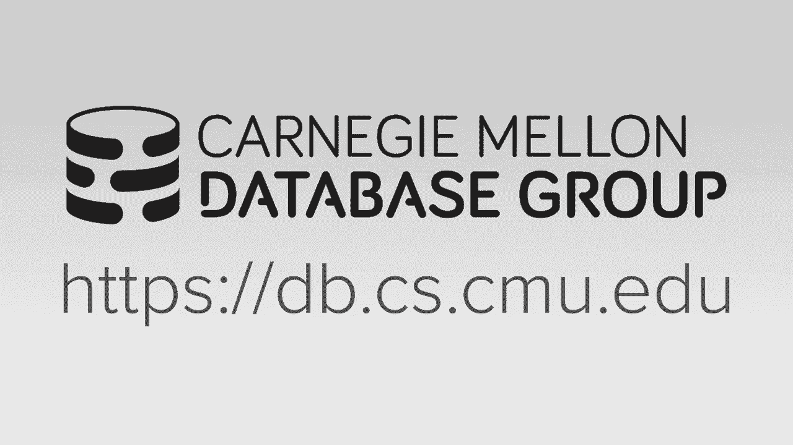
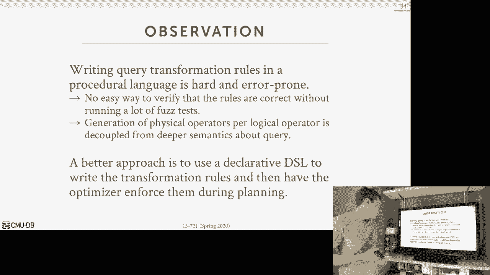
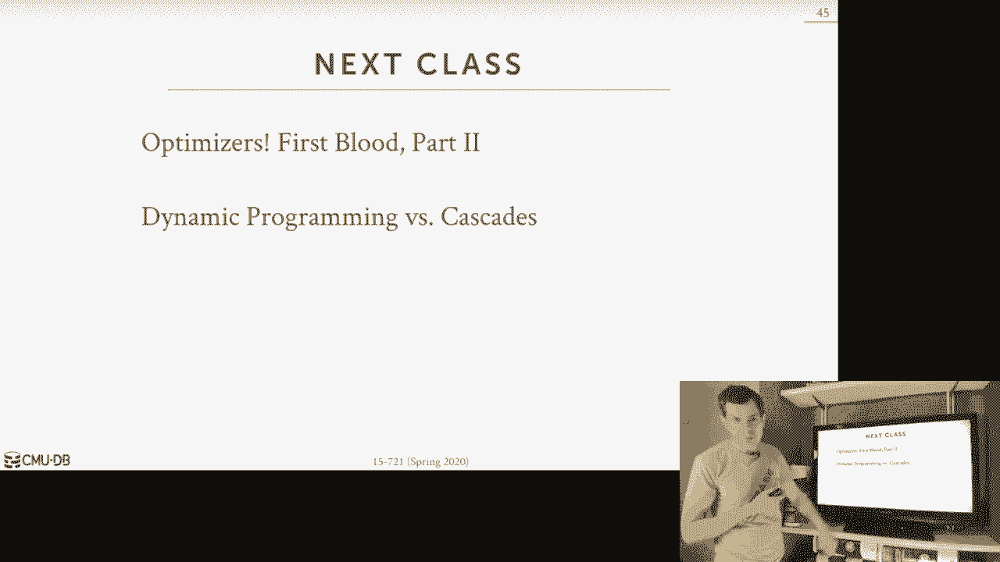

# 【双语字幕+资料下载】CMU 15-721 ｜ 数据库系统进阶(2020·完整版) - P19：L19- 查询优化器实现 1 - ShowMeAI - BV1wv411w7Ko

[Applause]，[Music]。

[Applause]，[Music]，today we'll be talking about query，optimization this is a really important。

topic in database systems so again I'm，here in my house I have the terior over。

there whose be asking questions as we go，along so when we say a query。

optimization the idea at a high level is，that we want to take a query that's。

written in a declarative language like，sequel and we want to then translate。

that into a execution plan that the，database system can execute and so with。

query optimization the idea is that we，want to find a correct execution plan。

that will have potentially the lowest，cost so the two words that I'm。

emphasizing here are correct and cost，correct is kind of obvious it doesn't。

help us if we find a really fast plan，that ends up computing the wrong answer。

returning the wrong result for our query，like that doesn't help us at all。

and the term cost is in quotes because，the cost is going to be this relative。

metric that's not necessarily tied to a，real-world metric it's just something。

that's that the data system would say，this is the best query for me to execute。

so the cost could be in terms of，execution time in terms of monetary cost。

after running this on a page you go，cloud system it could be in memory usage。

that could be could be any possible，thing but at a high level it's you know。

some objective function that the the，database system knows that it wants to。

optimize for so the query optimizer is，going to be the hardest part we're gonna。

have to touch or a component we're gonna，have to implement in the database system。

because finding a you know optimal near，optimal query is going to be super。

challenging it's gonna day it's proven，to be a np-complete problem so this。

means that although the name of the，component we're going to build is is you。

called the query optimizer were almost，never gonna be able to find the optimum。

plan because it would just take too long，to look at all possible solutions for。

all possible query plans and pick the，best one so what these upcoming lectures。

are really about are the techniques that，we'll use to simplify the and reduce the。

search space so that it's not an，exhaustive search and techniques we can。

use to estimate what the plan cost will，be without actually having to really。

execute it so let's make more sense as，we go further along and we talk about。

cost models but the way to think about，this is if we need to ask me what is the。

cost of one of executing one query plan，to get that true cost we could just。

execute the query but now if you want to，look at thousands and thousands of。

possible different query plans that's，not feasible for us to do so we need a。

way to estimate it and this cost thing，is also going to be a internal metric。

that the data system uses to determine，whether one plan is better or not better。

better than another and it may not，necessarily be tied to you know the wall。

clock time our real cost so this is just，sort of just set us up but what we mean。

when we when we start to mount query，optimization the for the next three。

weeks would have discussing a lot of，different things in this in this four。

query optimization so that I said as I，said the end of last class I will fully。

admit that query optimization is the the，one aspect of database systems that I。

know the least about and I'm always，trying to learn more and so this year。

we've expanded the discussion to include，an extra lecture on sort of extra query。

optimization methods beyond the，traditional two method two approaches。

that we'll talk about in this lecture in，the next lecture so where we're going。

for the next three weeks over the next，four lectures is that we'll spend time。

the beginning talking about how to，implement a query optimizer essentially。

what does the search strategy could look，like this so that sort of the search。

engine inside of it look like then we'll，talk about how to do plan rewriting。

query rewriting plan enumeration and，then we'll talk about sort of。

more sort of sophisticated techniques to，do at adaptive query optimization and。

we'll finish up with talking about cost，models so I'll briefly touch on what all。

cost model is I think a little bit in，this lecture but that'll be sort of the。

end thing to say well after we design，all this the search stuff that we're。

talking about here the cost model is，already used to guide that search so the。

for today we're mostly talking about，optimization search strategies because。

that's sort of them one of the two main，parts you need to have and then that'll。

then segue into these these other these，other topics so for today again as I。

said well start talking about search，strategies because that's the most。

important thing and that's sort of the，basis of what you need to actually。

implement a query optimizer and then，we'll go through the different。

approaches people have tried to building，a query optimizer over the last 50 40 50。

years and then that'll motivate why we，want to use a more sophisticated dynamic。

programming technique or the Cascades，technique that you guys are read about。

for next class so today is sort of like，a bunch of background information that。

then leads up up into the the modern，implementations so at a high level the。

the the the the stack of the system that，we're talking about and what I've sort。

of referred to the front of the system，is gonna look like this and this is the。

part that we're talking about now in our，system so we start with a sequel query。

that the application sends us we can，first pass that into a sequel rewriter。

which means that will transform the，sequel string itself to annotate it or。

modify it in a certain way and this is，this is optional not all systems have。

this you see this sometimes in，middleware systems that are doing。

sharding and sometimes can rewrite the，sequel query to to add in you know go to。

this table or I'm sorry go to this this，node versus that node but this is sort。

of this is like sequel query in sequel，query out there just modifying the。

sequel query then we take the sequel，query run it through our sequel parser，and then that will spit。

out a abstract syntax tree that just has，the tokens the string tokens of the。

query I wouldn't have the token of the，table name of the column names and so。

forth and then now we pass us into the，binder which does lookups in the system。

catalog of the database system to map，the table names in in the the reference。

in the query of the column names that，represent the query into eternal。

internal identifier so this is allows，you to get like the the the the type of。

the columns whatever constraint you have，in those columns and so forth so then。

the binder would then spit out what is，now called a logical plan so this is a。

high-level description of what the query，wants to do right sorry I have a select。

query that wants to access table foo my，logical plan will be to say scan table。

foo doesn't say how I want to scan it it，just says I want to access it then we。

can take that logical plan and pass it，into a another optional step called the。

tree rewriter and this is again logical，plan in logical plan out these are think。

of these as like heuristics we can apply，to manipulate the structure of the tree。

for some optimizations that we know we，always want to do if we don't need to。

estimate the cost of the change we want，to make so like we can like a predicate。

push down here or sometimes you see，rewriting view queries or CT ease into。

nested queries this way again this is，entirely optional then we now feed this，into our optimizer。

and at a high level we'll be calling you，know we'll be focusing on a cost based。

query optimizer right where we have some，cost estimates that are based on。

statistics that we've collected from the，database itself that allow us to predict。

or estimate you know what's the，execution time of a particular query。

plan and then again this is where we can，enumerate a bunch of options and choose。

the one plan that that we think is gonna，have the lowest cost and so once the。

optimizer is done with this step then it，fits out a fit spits out a physical plan。

that would go off and execute it now in，the case of our system and then we talk。

about query compilation we take that，physical plan，and then we use we have cogeneration to。

convert it into a domain-specific，language that we then compiled into。

machine code but other systems you can，take this physical plan and start。

interpreting it annex to name right away，I said this is this is at a high level。

whoever going for today and the upcoming，lectures so we're mostly gonna be。

focusing on these two parts here the，tree tree writer and the optimizer for。

sequel rewriting as I said that's mostly，done not really doing that for。

optimization as you're doing it for like，redirecting queries or yeah it's most of。

them is like control playing stuff not，necessarily for execution stuff the。

binder there's not really any magic you，do there it's looking up rickie form you。

know looking up cable names and things，like that all right so let's now discuss。

this distinction between the logical and，physical plan because this is going to。

come up multiple times when we talk，about query optimizer so the essentially。

what the optimizer is trying to do is，trying to map a logical algebra。

expression of the query itself into a，equivalent physical algebra expression。

so as I said like the logical plan would，say I want to access table food the。

physical plan would say access table，through using index you know XYZ for。

access table food using a square scan or，binary search on the actual table itself。

I said is it that high little bit the，distinction is that the physical plan。

tells you how you actually want to，execute a you know the query itself but。

the logical plan says that this is what，I want the query result of beam so the。

the physical plant operators themselves，it's gonna have low level information。

that is specific to the physical，properties and the physical format of。

the data that they're accessing so in，some cases the physical operators will。

know that it's producing a data that's，sorted on a given column or no that's。

gonna be operating on data that's，compressed in a certain way it maybe。

needs to decompress it into another way，the logical plan has no notion of this。

it just knows about relations，so one important thing we'll see and。

this will come up when we talk about，Cascades the next class is that the。

there's not always going to be a，one-to-one mapping from logical。

operators to physical operators so I，mean that is like in the case of like。

access table foo I can imagine，easily how that would be mapping the。

logical operator to access table food to，a you know a sequential scan to access。

table foo that would be one-to-one but，sometimes we'll have logical operators。

that can then expand into multiple，physical operators and likewise you can。

take a multi logical operators and and，coalesce them into a single physical。

operator it depends on the，implementation of the database system。

usually you see the logical operators，being exploded into more operators。

that's more common than the other way in，my opinion like I actually take that。

back right so a logical join with a，logical order by could be merged into a，physical sort merge-join。

because you're doing this you know doing，the join and the order by together all。

right so a another portent aspect about，what we're doing here relies on this。

notion of relational algebra，equivalencies again this is something，that we've covered it in the。

introduction class last semester but the，basic idea is that since we know the。

commutativity and associativity a chance，transitivity properties of relational。

algebra expressions we know we can，define rules that allows to do。

transformations of the query plan in，such a way that we know that the end。

result is equivalent to the original，plan so in this case here if I'm doing。

natural joins between tables a B and C，and if I join B and C first then take。

the result of that joint and now join it，with a well that's equivalent to me。

joining a and C first and then taking，the output of that and joining B and I。

can do this because this is an inner，join or a natural join where I have the。

commutativity property I can reorder，them any way I want left out or joined。

you can't quit you can't do that because，they're asymmetric whereas these things。

they're symmetrical so I can flip these，around in any order I want so now you。

can kind of see what the optimizer is，actually going to try to。

is if it knows it needs to join table a，B and C together it's gonna try to。

figure out what is the correct correct，ordering I should do for you know。

joining B and C first or joining a and C，first and so forth，hey can use a cost model to estimate。

which of these join orderings is going，to be most efficient then now you can。

think about the physical operators as，well I can now decide what what。

algorithm do i when you use to actually，do this joint go I'm gonna do the sort。

merge stuff we talked about before do I，want to do my parallel hash join so。

forth so for these lectures are most of，you focusing on analytical queries。

because in this world the the the，difficulty or challenge in finding an。

apple query plan is much much much，greater than doing in this for all to be。

workloads or transaction processing，workloads and this is because most the。

time the the queries and ultimate，workloads are considered to be what is。

called sorrel and Sarge will just shorts，is a acronym for the search argument。

able some term they made up in the 80s I，don't know why whatever and for these。

Sargent queries the reason why it，they're going to be easy for us to be。

query planning on is because in old，people workloads you're almost always。

doing lookups on on you know a small，number of tables at a time and you。

usually have index defined on the，attributes you're trying to do lookup。

lookups on in these tables so the many，times the the challenge is just trying。

to pick what is the best index for me to，use for this particular query alright so。

say I have a simple table foo has two，columns and a name an entry ID and name。

ID is the primary key so if I have a，query that comes along that doesn't you。

know there's an equality predicate where，ID equals one two three there's not。

really any complex search I need to do，to figure out what the best access。

method is to access table foo here I，just look at my catalog and say well I。

know I'm doing an equality predicate on，an ID field I have a primary key on the。

ID so therefore it has to have an index，so I know in this case here。

I just use that index to do the to do，the lookup and I don't need it you know。

even consider what we all possible，indexes I want to choose，likewise for for for joins they're。

almost always going to be an OTP setting，on a foreign key some applications are。

not well designed so you they they may，have not defined a foreign key sometimes。

you see sort of the applications written，by people may not know what they're。

doing databases so clearly it should be，a foreign key but they just didn't。

confine it that way in the scheme um but，even then you still figure it out put it。

fairly easily but in this case here like，if you have a foreign key relationship。

and you know I have a small cardinality，yeah it's gonna be an index to enforce。

that that that referential integrity in，the parent table so again when you。

wanted your join it's it's pretty easy，to pick out like the the parent table。

should be out at our table and then the，inner table is the foreign key child and。

I'm doing the nested loop index probe，alright and this loop index join to join。

these two tables together so again in，this environment for ot queries it's。

usually pretty simple to do query，planning and you can get by doing simple。

the simple heuristics based optimizer，which we'll talk about in a second。

MongoDB is probably the most famous，database system out around today that。

still uses the sort of basic heuristic，to do things like this because in the。

type of workload that they originally，were targeting they weren't doing。

complex joins because they didn't really，had joins until only a few years ago so。

in this world they could get by with，simple heuristics all right so I also。

talked briefly about cost estimation the，beginning again the idea here is that we。

have we have a query comes in we have a，logical plan and we want to figure out。

what's the best physical plan to execute，to represent for that that logical plan。

and so we have to use a Cost Estimator，to predict what that you know what won't。

be the execution cost of executing that，that physical plan or one of the。

physical plans and then we can use that，to determine which physical plan is，preferable。

to the other one so there's a bunch of，things we could use to figure out what。

should be our or cost we can look at to，see how the queries gonna interact with。

other queries running at the same time，that's actually pretty tricky and few。

systems actually do this real common，thing is to say well what's the enemy。

its size what's the output size of all，my operators and certainly use that as a。

proxy for what resources I'll use it，could be just like the asymptotic。

analysis of the algorithms we're using，for our physical operators but we know a。

hash join is gonna be more efficient or，it you have incur less you know less iOS。

or less overhead then a nested loop join，right so we can bake that into our。

contest modes how much CPU or memory I'm，gonna use and then some information。

about what does the data actually look，like like where is it physically located。

how is it compressed like all these，things we can incorporate into our cost。

models to make estimates on what will be，the the cost of executing a physical。

plan now this is super hard to do，because you're estimating based on a。

summarization of what the data looks，like because again I can't scan the。

table and say how many tuples you have，it what's the distribution of these。

values because you might as well just，execute the query and for really large。

databases that's not feasible so you're，trying to estimate this as quickly as。

possible because you want to you want to，evaluate as many physical plans as you。

can quickly as possible so that you，maybe find the optimal one so there。

should be not next week but in two weeks，well we'll discuss more about cost。

models and we'll see how wrong they，actually actually get and this can make。

lead an optimizer make bad decisions all，right so let's talk about now how to。

actually build an optimizer so the，there's some first design situations we。

need to consider before we can actually，say what is the search strategy that。

we're going to use to enumerate plans，and look for a，an optimal plan so we're gonna go to。

each of these topics one by one but an，optimization granularity will be the you。

what are we what's the scope of what，we're looking at when we do query。

planning when we five days off had a，handle player prepare schemas plan。

stability and then when to finish the，search so again we'll go to each of。

these so the optimization granularity is，what is the scope of the search problem。

that the optimizer is gonna have to deal，with and the choices are to either do it。

on a single query or do it with multiple，queries so single query is the most。

common approach because oftentimes this，is all that you really have like a。

client of misconnection sends a sequel，query you're not gonna wait around to。

see what other queries show up from，other connections you take that one。

query and you run it through the，optimizer at that point in time right。

and the advantage of doing this is that，you're gonna have obviously a much much。

potentially much smaller search space，because you're only dealing that one。

query at a time you typically also don't，reuse the search results across queries。

so you're essentially starting the，search from scratch every single time。

now we can talk about some techniques in，adaptive query optimization had a had a。

bridge information you've learned from，one search to the next but typically。

most database systems don't do this the，other aspect of it is like if you want。

to start figuring out like how much，resources I'm gonna use when actually my。

query you may have to consider what，other queries running at the same time。

so again like if you can do those，multiple queries but if you're doing the。

single you do the single pretty much，easily that you do with multiple queries。

because you don't have to worry about，what those multiple queries how they're。

interfering with each other at the same，time multiple queries as I said is more。

rare this would be like if I know I'm，gonna execute a thousand queries in my。

application right now rather than me，issuing them one at one after another。

like issue one executed get the result，issued the next one I could in theory。

give the database system a batch of，queries and have it figure out a single。

plan for the into all those queries that，it just executes and，knows how to route the requests route。

data between operators that are shared，or not shared and produce the output for。

those individual queries that I said，this mostly appears may be the sort of。

stream processing systems or continues，continues query systems where I haven't。

queries that it was gonna run forever，because there's some you know pipe of。

data coming in all the time and I'm and，I'm processing them it did appear in，academic system mr。

 precision cost-share，DB that does something similar，materialized views are another way to。

sort of this but as I said this is for，most applications this is not the。

interface there this is not how they're，gonna interact with the data system。

they're gonna do it this way open a，connection and send my query the。

optimizer takes it plans and runs it the，next question got to deal with is when。

are we actually going to fire off the，query optimizer so so this first one。

again this is the most common one this，is static optimization would be the。

query shows up in the system I've run it，through my optimizer I generate a plan。

for that query and then once I leave the，optimizer I never go back to the。

optimizer and I just go and execute the，query so it doesn't matter it's like I。

so at the time at the optimizer it's，picking what it thinks is the best plan。

but it may turn out to be one actually，run the query it it's not as good as I。

thought it was I thought it was but I，can't go back like it's sort of it's a。

static plan once the optimizer says this，is what you're gonna use you're stuck。

with it all right so now the as we，talked about many times the the quality。

of these plans will generate will be，highly dependent on the cost model。

accuracy that's truly true for，everything but it has to be in this case。

here is that you can't go back and tell，the optimizer you're wrong then you told。

me something to eat what you told me was，wrong you know pick something better you。

you you know you're more dependent maybe，then these other ones here now the other。

thing you can deal with too is instead，of having to run this optimizer for。

every single query over and over again，especially if it's in the same query you。

can amortize this cost using prepared，statements and potentially you know have。

a longer time the new query planning，than you would wouldn't normally，otherwise we'll talk about。

the cutoff threshold for for the search，of the other parts in a second but think。

about this is like you know when I open，up Postgres every time I see coal。

whatever terminal I'm using for my data，system I tape a single query in I hit。

enter and then I get back a result like，in that time it's gonna run through the。

optimizer and generate you know a，physical plan then actually execute the。

query and in some cases the queries can，run in in milliseconds so if I have a。

bull or comets query that I don't want，to have it you know，you know I'm gonna actually this all the。

time and therefore I want to spend some，extra time to do a better job looking。

for an optimum plan I can potentially do，that with prepared statements we'll come。

to that in a few more slides another，approach that is as far as I know this。

doesn't really exist in sort of，relational sequel based database systems。

today it mostly shows up potentially in，in stream processing systems but it。

might be wrong and the idea here is that，my query shows up I generate logical。

plan for it don't want to restart our，generate a logical plan for it and then。

I break that plan up into sort of sub，groups of sub plans and before I execute。

a sell plan then I run it through the，optimizer to generate the physical plan。

and then I execute it and then now I'm，going to learn some information of what。

the output of that sub plan will be that，I can then use to guide the optimizer to。

find then the next cell plan our next，pipeline I want X dude I could have it。

then generate physical plan using the，information I've collected and running。

the first one you're sort of iteratively，building up the physical plan by going。

back and forth between the execution，engine and the optimizer right so this。

is this is rare Ike again I don't think，any commercial system actually does this。

approach we'll see in the SEC angrist，actually does this and there it wasn't。

so much they were doing this approach，before because they were sophisticated。

it's because they were limited to the，sophistication of what the of what they。

actually do in the software and the，query planner at the time but I think it，is。

exist in academic systems but again I，don't think it exists in any commercial。

systems the the last one that does this，one actually does exist in commercial。

systems today is this idea called，adaptive query optimization or sometimes。

called hybrid optimization and the idea，is that you still do this first step。

when you go through the the query shows，up you go through the optimizer the。

first time it generates you a plan but，then you your planets also gonna clued。

include these built in sort of water，marks or thresholds you can use to。

determine whether the estimates that the，cost model used in the first step when I。

generated that plan the first time，whether those estimates are actually。

matching up with what you're seeing when，you and you access the data so like if I。

thought my query was very selective or，so my particle is very selective but。

then i run the query and i see the，predicate is not selective at all then。

if you identify that the there's a the，error rate for your estimations its。

exceeding some threshold then you could，either pivot and change the plan on the。

fly right there or you just give up and，go back to the query optimizer and say。

hey your plan was wrong make me a new，one and make make me a better one。

so the okay we'll talk about this in two，weeks this this one here is you bacon。

the query plan itself additional，alternatives and so you can sort of。

pivot or change based on what the，thresholds are this one is literally。

like saying just stop executing the，query and go back to the optimizer so in。

the easiest way to do this is just just，throw everything away and start over。

from scratch and the idea is that you，you're you're you're making the gamble。

that the physical plan you generate the，first time is so bad that you're better。

off throwing away any work you've，already done going back to the optimizer。

getting a new plan because that new plan，will be even more efficient than just。

letting the first one run to attend，another approach is to then to recognize。

how much work you've already done and，then you go back to the optimizer and。

say I've already done you know I've，already scan or join these two tables so。

generate me a new plan that has that，doesn't change that part I think that。

part's fixed we've already computed it，I think everyone pretty much does the。

throw everything away and start over at，least in the commercial systems today。

alright so this is what prepared，statements so let's say I have a query。

here that wants to do a three-way join，on tables ABC and I have some kind of。

parameters here that I can use to filter，out the the to pose some of these two。

tables so then this is a simple query，right this three by joint it doesn't。

it's gonna take no time to execute but，let's say it takes a long time right and。

let's say maybe it takes it takes 10，seconds to to run through the query。

optimizer but the query only takes one，second to run so in that case every。

single time I exceed this quitting say，I'm executing over and over again I。

don't want to pay that 10 second search，cost for a query that's going to take。

one second so what I can do instead is I，can declare it as a prepared statement。

and it's essentially I'm giving this，this this query here this name my query。

and now I use the execute command to and，to invoke it all right so now in this。

case here the the debut system could，it's told ahead of time what the queries。

gonna be as a prepared statement it can，run it through the optimizer take that。

10 seconds cache the plan and now I，receive every single time I invoke it。

I'm just getting that plan again I said，I so now it runs super fast without。

paying the cost to go to the optimizer，so in this case here this is this is a。

super simple example this would work，right there's no issues here but let's。

say that I want actually this query over，never again but maybe not use these。

values that I have here on the to do，this the predicate in the where clause。

maybe I want to change these for every，single query so to do this I can replace。

the constant values with question marks，which sometimes dollar signs to indicate。

that these are input parameters and now，I declare when I declare my prepared。

statement I say these are the three，parameters you can pass in and their。

types and now when I invoke the query，it's like a function call where I pass。

in these actual values all right so now，the tricky thing is gonna be though is。

what should the physical plan actually，look like in terms of joint ordering for。

this query if I don't know what these，values are at the time，I'm told hey prepare the statement for。

me right so if you know it maybe the，first time actually when I have these，values here。

I would want to join a a and B first，then join C but maybe for another set of。

values I want to join B and C first，followed by a but I don't know that。

because all I have are these please，placeholder these variable markers here。

I don't know actually what batteries are，gonna be used so there's a couple。

different ways we can handle this with，prepared statements and a query。

optimizer so easiest thing to do is，every so often we just use whatever the。

last plan it is that we had so let's say，that the we call prepared statement we。

don't actually prepare it right right，there we don't want to completely see。

the query optimizer but when someone，actually invokes it and executed and use。

uses the prepared statement now we get，some values we can then say well let's。

just assume that those values are gonna，we're gonna represented what we're。

always gonna see and I just cache that，plan all right and always use what I。

read use before so I think that's what，Postgres does right it's it's pretty。

simple the next alternative is that you，actually lose all the benefit of getting。

a prepared statement where you set you，run it through the optimizer every。

single time you invoke it you can be a，little bit clever and try to use。

whatever the last plan you had as the，starting point in the search at least。

had that say that you know here's here's，a good starting place for my physical。

plan and based your search for the，better plan off of that rather than from。

starting from scratch every single time，that it's actually using the previous。

plan as an upper bound that is tricky，because that requires you to engineer。

optimizer to be able to restart it from，an existing physical plan and most。

optimizers written are not written to，handle that another approach is to。

generate multiple plans for your，prepared statement so you could say well。

I know I'm doing a prepare thing that，has one that has one input parameter on。

this one column I can look at my，histograms or statistics that I've。

collected through the analyze keyword or，the analyze command about what the。

distribution of values look like for，that column and maybe I break them up，into two。

buckets in my histogram and I each，bucket I'll generate a generative plan。

so now when I invoke the prepared，statement I look at the value mean。

passed in and I figure out what bucket，it belongs to and that's the plan I use。

so for one variable that's easy to do if，now I have multiple variables and now。

becomes exponential or the number of，plans now I'm gonna have possibly have。

to would it explode and that would be，expensive to do so I don't think Oracle。

might do something like this but it，might be wrong but there's sort of more。

primitive versions of trying to look at，have an exhaust of the rate of all。

possible plans the last one is just to，say well I know what my parameters are I。

can infer what columns doing doing look，doing a lookup someone or what actors。

that are accessing and I'll just look at，my statistics take the average value。

that each of those columns could，represent and use that as the input。

parameters when I prepare that perfectly，when I invoke the prepared statement。

through the quarry optimizer so again，there's not one approach that that all。

systems actually use this is obvious the，easiest one but I think this is actually。

a good research question and I want to，investigate at some point as well all。

right the next thing we got to deal with，is is stability so plan stability means。

that the that the performance of the，query of a particular query will be。

consistent from one day to the next like，if I run the query today and it takes an。

X amount of time if I run that same，query tomorrow on the same sort of。

database you know modulo some minor，changes I should should take this。

roughly about the same amount of time I，would I don't want to happen is I run my。

query today and it's it's you know it it，takes this time it run tomorrow and if。

you take its half the cost is the，exchange time is cut in half but then。

the day after that now it's back to the，original time like I don't want those。

oscillations because that makes it super，tricky for it for us to identify。

performance bottlenecks and performance，issues DBAs are very conservative about。

upgrading database systems David says，some software because they'd rather have。

stability and then just better，performance all the time，so how can we achieve stability and have。

queries so again this is all about the，query optimizer so we want to make sure。

that our query optimizer is generating，plans for queries that from one day to。

the next will have state stable，performance so one approach is to。

provide hints to the query plan so this，is where essentially you can annotate。

the query either through like special，comments in the header or if it's a。

graphical tool sometimes you can do this，where you can specify what you want the。

query optimizer actually to do all right，for certain choices it has to make so。

all the times you'll see this like I，even you can provide a hint to the。

optimizer and say this query scene you，should use this index on this table I。

don't care about other indexes or scan，so you make sure using its index right。

or the join ordering will be another，common one another one is to you can。

tell that some database systems which，optimizer，version they want to use for a。

particular query so a lot of times when，people upgrade the database system。

software expect this is in particularly，for Oracle you can specify which version。

of the optimizer you want the queries to，use because if you've already vetted say。

a previous version and the optimizer，generated plans that you can understand。

you have stable performance numbers when，you do the upgrade maybe you don't want。

to update the optimizer and have it，generate different plans for queries and。

now the numbers may vary right so again，DBAs are very conservative it's not it's。

not helpful if we upgrade the data to，system software and 99% of our queries。

now run faster but then 1% of the，queries run slower because the optimizer。

picked up a different plan than it used，to，that's me bad because the people whose。

queries run slower now are gonna get in，the phone and call you and complain and。

say why is my query run slower please，fix it the the the other 99% the queries。

those people aren't gonna call and say，you know thank you for making a query。

run faster people don't do that，it's when things go bad that's when。

people complain right so in this case，here again so if I upgrade my upgrade。

Oracle I can say I want to run with the，previous optimizer because that'll，generate plans that I。

that I know about the last choice is to，support backwards-compatible plans so。

the idea here is that if I say I upgrade，my database system software but before I。

do that on the old system I dump out or，export all the plans for my prepared。

Sabres or queries that I'm executing all，the time and too much of files then I。

upgraded the Devi system software and，then I load back in those plans from the。

previous version of the software and，override any decision that the optimizer。

make you're saying no for this query，absolutely use this plan that guarantees。

you've had the same plan but you had，before so sequel server allows you to do。

this sequel server you can dump out the，query plans as as XML and then load them。

back into new versions that's the last，thing we talked about is search term。

termination so again when you're on the，command line you write you type of query。

in you hit enter and to run the query，optimizer and so you need a way for the。

query optimizer to determine I've run，long enough and I need to stop because。

again some of these problems you know，from very complex queries you know it's。

the the search spaces and be complete so，you can just be running this for days。

and days and days and people aren't，gonna like that，so the most obvious thing to do is just。

set a wall clock time barrier that says，that if my optimizer runs first it。

amount of time I just kill and I stop，all right another approach is to have a。

cost threshold where you say that if I，find a plan，if I find a plan that has a lower cost。

than some threshold that I want or，another one might be if I if I've run。

for a certain amount of time and I don't，find a plan that's you know twenty。

percent or ten percent better than the，best plan I've seen so far then I just。

go ahead and stop myself，the last one is basically you say if you，can identify that there's no more。

possible permutation or enumeration you，can do for the target plan then you know。

you you're done for the search and，typically this is done on a per blue。

basis right because if it's a lot a lot，of a lot of tables a lot of joins and。

you don't ever actually exhaust this all，right so give it one example of how this，is used and。

of my sequel you can specify the，optimizer search death in the search。

tree so this prevents you from going，maybe too far down and the branching and。

you started to artificially cut off the，search you know so many level deep so。

that that you exhaust the number of，possible choices more quickly it's some。

systems try to be dynamic and often hard，to get this right so it is this is one。

semi Tina's blog article from percona，who is one of the major my sequel。

consulting companies do a lot of，development my sequel so back in 2012。

they talked about how they had this they，had this one customer that was doing a。

select query on 20 tables and the，optimizer took took 5 seconds to find。

the query plan and the query only ran，for 50 milliseconds because it was。

reading a thousand tuples and so by，saying that like search death and。

artificially cutting it all from just，doing his also search they were able to。

get it down in the optimizer to，finishing in milliseconds so all the。

various data systems have different，tools to figure these things out all。

right so now we want to talk about the，serve again these are all the we just。

talk about all the design decisions we，have to consider when we want to build。

our optimizer how to handle prepared，statements how to decide when to finish。

finish searching what to actually do our，search on one query multiple queries。

things like that now we want to talk，about what the search is we know what。

the this serve what the optimizer，actually looks like how is it actually。

going to generate a physical plan from a，logical plan so the way to think about。

what we're going to talk about today is，we're going forward into time and。

complexity so it was like a from a time，being like historical points so like。

heuristics based optimizers of what they，they first built in the 1970s and going。

forward in this the you know we're，coming to newer newer implementations。

the other I think also think about too，is these are these are the the heuristic。

based one is in the simplest way to，build an optimizer，although the engineering side of it can。

get very very messy but going down the，the implementations become more complex，and therefore the。

query optimizations and rules they can，transformations they can apply become。

more sophisticated so we'll talk about，these these are worth talking about。

because this is what you'll see often，when people first build into a system。

because they're not gonna have a call，space search model they're gonna use。

heuristics and sometimes heuristics can，still be are still widely used today and。

then the unified search and stratified，searches will we'll end up well talked。

about today will get up to the volcano，optimizer and then that'll segue into。

the next lecture when we talked about，Cascades in more detail okay so the very。

first query optimizer is for the，relational database systems in the 1970s。

for two of the three first relational，database systems we're using heuristic。

based transformations and the idea here，is that in the code itself you're you。

define these these rules that will，transform the logical operators and to。

physical operators so the the most，common thing would be like if I'm doing。

a scan and I know I have like an index，that had that matches all the predicates。

in my where clause then that's the index，I would want to use all right so that's。

sort of like that stargell stuff that we，talked about a few slides before so。

that's that's sort of the standard，transformations you can do from logical。

to physical but some of the，optimizations you can do to improve。

query performance will be applying all，the the and the basic rules you want to。

have for a query execution like，predicate pushdown let me push down some，things like that。

my predicate push down would be instead，of having you know the may be the。

predicate at the top of the query plan I，push it all the way down to my access。

method so that I'm filtering out tuples，as quickly as possible I'm not not you。

know passing in form one hopper to the，next good that would be expensive。

another common thing will also be to do，to handle join ordering through just。

cardinality estimates they could say，that you know we have joining two tables。

you know which one potentially you can，approximate which one is gonna have more。

triples feeding into the joint operator，so you make that one versus one the。

outer versus one the inner it's simple，rules like that so the important thing。

I've seen about this is that there's no，cost model involved in this it's all。

static it's like I see a query a query，planner has this，pattern in it I always apply this rule。

right I always push down the the the，predicate things like that so as I said。

the the two or the three first，relational database systems from the。

major relational database systems from，the 1970s ingress out of Berkeley from。

like Stonebreaker and Oracle from from，Larry Ellison this is what what they。

used and the in from back then like the，the resources that they had for you know。

for you know competing researchers to，run actually run the Devi system。

software itself was was quite limited so，the size of the databases they were。

trying to store back in the 1970s were，super small right so like in was talk。

about this in a second I mean case of，the ingress paper here like they're。

talking about you know scanning tables，with like three hundred tuples and。

that's that's like that's nothing so the，complexity of the problem they were。

trying to deal with this is the kind of，queries they were trying to deal with，deal with today。

in the case of Oracle like Oracle you，know they got huge and got you know a。

lot of money riding on a you know the，the simplest type of sort of optimizer。

an you can have again one that I didn't，have a cost model that all the things。

were talked about and going forward like，they got huge just based on this so I。

don't want to say I wanna make a sound，or sound like I'm saying you can't you。

can't have a sophisticated data system，without having a cost-based optimizer。

clearly Oracle got quite far with it but，again back in the 1990's the type of。

queries they were dealing with like the，sequel 92 standard no CT es no one to。

function and no use define aggregates，right all these things didn't exist so。

it is actually viable but again also，[ __ ] got really big without having。

having a cost-based optimizer as well so，I've talked to some people that worked。

on the the Oracle query optimizer like，back in the day in the 1980s 1990s and。

they would say that it was the largest，piece of code in the system and it was。

quite sophisticated and what it could do，but it was like an engineering nightmare。

cuz everything was written in C there，wasn't no debt you know high-level DSL。

order declaration of the rules right he，was a bunch of if if then else。

statements and so again they had a lot，of money and they had some really smart。

people and they could have done you know，amazing things by expanding this but it。

just got to come n tenable and I said，that's why they switched over to the the。

the cost based models cost based，searches that we'll talk about in a。

second right so again this is what，ingress did beginning this would all。

post a in the beginning I'm not saying，that this is the right way to do it in。

some cases it is some cases it's not and，so let's talk about what ingress does。

again this is mostly just for her stroke，or curiosity，so going forward we're gonna use the。

following three table schema and with an，example query of Spotify or Apple iTunes。

database so we have artists and we have，albums and then out artists appear on。

albums so we're just keeping track of，like what you know what would what。

records what albums are being put out，and what artists are on that so let's。

talk about ingress does so this is what，ingress used back in the 1970s so for。

this we're to use this query here where，it's a three-way join between artists。

appear as an album and we want to get，all the artists that appear on my my。

next tape right so angrist didn't the，way it did joins is that Hedda says。

ingress didn't support joins so they had，to rewrite all the queries into single。

table queries so because again because，they couldn't join tables together so。

the first step what they would do is，they would take a joint play like this。

and then they would then decompose it，into single value queries so what am i。

bad so say you take this query here and，we're gonna rewrite it into two queries。

so the first query now is gonna just，just be on the album table where we're。

doing the lookup on the album name，because that's what we're passing over。

here right and so this is just a select，on the single table here but then we're。

gonna write it out into a temp table and，then now for this query here we replace，album。

with our temp table reference here and，here so now we're going to recursively。

now rewrite this query to remove in the，the joins that we have and so now we're。

gonna have the this new query here that，just does a lookup on a peers with a。

joint on temp 1 and it's gonna write the，output into 10 - then this query on the。

artists table will do a lookup or do the，join against Tim - so now once you do。

this once you do the rewriting you're，gonna then substitute the values from。

these temp tables with the actual values，that are produced by the query so say we。

execute this first one here，well then generate get the output of the。

album ID 999 so then now we go to the，next query and we replace the reference。

to temp 1 now with 9999 that's being，generated by the previous query so now。

this is no longer a joint this is a，single statement or single table query。

and I'm just substituting that value in，that produced from the previous query。

same thing here this query runs now，produces two output and then now I can。

rewrite this query into two queries one，that takes artist ID one two three and。

the Netherlands it takes artist ID 4 5 6，and I can actually both of them produce。

results of those queries combine them，together and then that's the output of。

of my join all right so this is pretty，impressive right this is like a way to。

do rewriting of queries，I mean I'm showing this on the sequel，level they would be doing this on the。

physical plan level you know this allows，them to actually joins without actually。

having a joint implementation like，you're just doing the single statement。

selects so it's been argued that this is，actually an early example of adaptive。

query optimization because rather than，doing the static optimization approach。

where I would generate the plan all at，once for my entire query I could take。

the sequel query here I see as a miss，book they were not operating physical。

plans they probably operating on logical，plans but I could take this query here。

and only when I get the values one two，three that I want to substitute，substitute into it。

then I fired off I send it off to the，query optimizer and then generate the。

physical plan for it so it's sort of，like a late binding optimization。

approach right so like like I can learn，from information about what's coming out。

of these queries to decide what the best，way to actually this particular query is。

it's sort of again it's not exactly what，an adapter query optimization is but。

they're essentially running the，optimizer on a per pupil basis which。

nobody does today okay so all right what，are some advantage the disadvantages of。

the Harriston based optimization so one，it's it's easy to implement it's easy to。

debug because you just walk through with，gdb or whatever your favorite debugger。

is and step through and see what what，rules actually get fired and in order to。

determine why I mean a why I chose one，particular plan versus another right and。

as I said when you when you build a new，database system today just to get it up。

and running and excuse some first，queries you can get pretty far with a。

arista bake-off heuristic based，optimizer the downside though is that。

oftentimes if you will have to have，these these constant thresholds or。

values baked in the source code itself，or defined in a configuration file to。

help me make determination about certain，decisions you have to make like if I。

wanted to determine whether a if I want，to a join a herd a logical doing plan or。

operator into a physical join operator，and then need to determine whether it's。

sort merge-join as faster than a hash，join I have to have some notion of sort。

of akin cost I make that decision and，oftentimes it may have no bearing to。

actually what the data looks like that，can be tricky the other tricky thing。

about this is that it's going to be，basically impossible now the generate。

plans when the transformations are，optimizations you want to apply can have。

dependencies in between them so that，means I'd like say you you want to I。

wanted to turn I want to apply，optimization a and based on whether or。

not I choose that optimization I may，want to may or may not want to choose，optimization B。

and so now if I if I'm writing this and，just based rules I have to write that。

explicit rule to know that if I do a，then don't do B or I do don't do a then。

I can do B I have to write all that，manually and the source code。

we're in a cost-based search we'll talk，about it next slide if you write your。

cost model in a crack way you could have，this search sort of the the search。

engine sort of find that for you，right and you don't have to code it，directly so again as I said the。

heuristic based approach is what the，first two out of the three original。

relational database systems major，relational database systems that came。

out in the 1970s actually used the other，sort of famous approach used in 1970s。

was a combination of the heuristics from，we just talked about plus a call space。

search and this is going to be the，technique that all the modern optimizers。

that we'll talk about what we will be，based on they they may not need using。

exactly the approach that IBM system are，is using but the notion of using the。

cost model to estimate the efficacy or，the cost of estimate of a plan is is the。

standard push that everyone's use so，with system or the way it's gonna work。

is they'll have static rules first，perform some initial optimizations and。

then they'll use a dynamic programming，method to determine the best joint。

ordering for the tables so I think we，talked about IBM system are a little bit。

but again Ted Khan was a mathematician，in New York he wrote these for IBM wrote。

this this this this the far-reaching and，and very progressive paper on the。

relational model it was all mathematical，ingress and Burton a nursing at Berkeley。

was was one people group appeal that，took the paper and try to build system。

IBM trying to build a their own version，of the system at call system are in his。

San Jose in California and they got a，bunch of people had PhDs in your brand。

new PCs and computer science mathematics，put them in a room at IBM Gabe and Ted。

cause paper and says all right go make，this and so a bunch of people carved off。

different pieces of the problem you know，one person with a PC went and then its。

sequel another person invented，storage models or two phase locking Pat。

Salinger was somebody who got assigned，to work on the query optimizer and it's。

been very very seminal work so this is，the first example of a call space query。

optimizer it's also an example of using，bottom-up planning or forward chaining。

explain a few more slides whether it，actually means but basically it's like。

we're gonna do a divide and conquer，approach where we're going to start with。

nothing in our query plan and then it，early build it up to say to produce our。

final result by figuring out what the，join orders gonna be so as I said system。

R was the first system that used this，particular invitation the first version。

of db2 that came in the 1980s，I think borrowed the the query optimizer。

from system R and then most open source，database systems are gonna be using some。

flavor of the of the the system are，approached like this is what my sequel。

press press and sequel like use the，commercial guys usually are having。

something more sophisticated or are，using Cascades alright so let's go。

through an example what it's actually，doing so again when a system our。

approach would work is that you'd break，up the query into blocks and then you。

would have logical operators，representing each block and then for。

each of these a lot of operators you're，gonna figure out what are all the。

possible physical operators I could use，to implement that operator and then。

you're gonna it early construct a query，plan that has the minimal cost。

essentially you're stitching together，all the tables you want to access and。

and joins to figure out how to join all，them and produce the final is all so one。

important observation that IBM made at，the time was that they were only going。

to pursue left deep join trees so that，means that like all the joins are sort。

of only on the unless left side of the，tree going up and contrast this was like。

a bushy tree where you know I can join a，and B join C and D and take the output。

of those two separate joins and join，them together this would join a leftie。

tree but join a B first then take the，output of that and joined C they take。

the output of that and join with T and，they made this decision to only look。

left D trees purely to minimize reduce，the search space of the problem all。

right so if you have to go consider，bushy trees and that um，there's again that increases the number。

of choices you have to look at and again，for the hardware they were dealing at。

the time that was deemed too expensive，sometimes you see this optimization or。

this assumption made in optimizers today，even though sometimes a bushy plan will。

be preferable will be better it depends，on the system all right but there's。

there's nothing about the approach I'm，talking about here today that requires。

you to have the only support leftie，trees that's just you know show up and。

they took back in the 70s all right so，let's go back to my my query they had。

before the one difference I'm gonna make，is that now I'm gonna sort the output of。

this result based on the artist ID right，so again the first step in this is our。

is that we want to choose the best，access path for each table so here's all。

the tables that I'm gonna access here's，all my predicates and I'm gonna pick。

some and with the best access method for，that so in the case of artisan peers I。

don't have a I don't have a I don't have，a index I can use so they're doing。

special scans Alamance a has an index on，the name and we will use that now。

forgive we're gonna numerate all，possible join our readings for these。

tables again this is just like you know，a permutation of every possible。

different ordering that my my tables，could have and I can do joins I can do。

Cartesian products although we can put，those out later all right。

it's then now for all these possible，orderings I want to figure out what is。

the one that it's going to have the the，lowest cost and I need to base that cost。

on what physical operator I'm gonna use，all right so this is just a logical plan，album。

I'm not saying how to actually do that，join and this last step here this is。

actually where we want to figure it out，so system R is a bottom-up approach。

where we're going to start at the bottom，of the query plan where we don't have。

any information we haven't done any of，the joins yet we just say we have these。

three tables artist album appears and，it，so we want to figure out how do。

communities together to get to this，final result here right where we joined。

artists appears and how them together so，we're going to look at a look at all。

possible join our drinks for the first，stage so I want to take two tables and。

join them together so I can join artisan，appears Alban appears appears in album。

and then all the other ones that I，showed in the the last slide I'm。

truncating here because we're out of，space and then what I have is going out。

I'm emanating from the starting point I，have a path to get there that's going to。

use a particular physical algorithm all，right so I could either do a hash join。

to join artisan appears or I can do a，sort of or join to join artisan peers。

and likewise to join album appears I can，do a hash join the servers join and so。

forth right but then now for each of，these different physical physical。

operators I can estimate what is the，cost of executing it and then I for each。

from going from one node to this I one，of them select which path to get to that。

node has the lowest cost so let's say，it's in this case here to go from this。

node to this node the hash join has a，lower cost same with this one to here。

but this one the sort merge has a lower，cost then now I want to do the same。

thing starting from the next level of my，query plan I want to say what physical。

operator could I use to do the last join，right so again I'm showing a subset here。

I could do a sort most join or hash，Mahesh has join for these different。

approaches and then now the same thing I，want to pick which plan on which was。

physical operator from going from one，node to the next has the lowest cost and。

then now once I have this I backtrack，and say well what was the path that got。

me from my starting point to my end，point going through these physical。

operators that that had the lowest cost，and that's and say that it's doing a。

hash join followed by a hash join and，that's the one that produces the lowest。

cost amongst all the joins and that's，the one I want to use right again the。

divide-and-conquer because rather than，looking at you know complete pass you。

know you know from here to here，but in order to estimate the cost I'm。

only going from one stage of the next，and then once I figure that out then I。

go to the next stage and then combine it，together that produces the result so but。

this particular query though remember，that I've added the order by so so now I。

care about the what's the sort order of，the output after I join them but there's。

nothing in this in this plan that I've，generated here that tells me what what。

that sort order could be right and this，is because at least how system are was。

sort of set up there's no notion of the，the physical properties or the sort。

order of the the data that I wanted so，in this case here I'm doing hash joins。

and that means that the data is going to，be random in a random sort order and。

then I need to now execute an order by a，sort of sort operator to put the data。

into the physical order that I want but，going back here if I had known that I。

needed this day to be sort of a certain，way then maybe I would have chose a sort。

servers join because that would have，given you two for one I would have give。

me either do the join plus put the data，sort it in a way that I wanted it right。

but because the way this is set up，there's nothing about the physical。

property the data that it can make，helping make this decision so that's。

actually want to be the limitations，we'll see what system are and we'll see。

how what we can fix this up in in the，stratified or unified searches later on。

the yeah so the way system are a few got，around this was that they would actually。

have to bake in the cost model itself，some notion of the sort order that they。

wanted dated to be in so that they can，then identify that the SIRT merge was。

preferable to the to the hash join them，and for this particular example but that。

was you know that's sort of a half right，because now you're there's logical what。

the data should look like is in the in，the cost model and then it's sort of。

separate from the actual the the search，strategy itself so that's an issue。

so I briefly want to touch on this，distinction between the the bottom up。

and the top down so again what butters，query options，strategy it's where you start with。

nothing then you build a plan up to get，to the output that you want so system R。

and IBM starbursts became later on these，are examples of bottom-up approaches the。

dynamic approaching will see an hyper，this is also considered a bottom-up。

approach the fee current feeling from，the the research community is that this。

approach is better for figuring out the，joint ordering the alternative is the。

top-down approach is what we use in our，system based on Cascades and this is。

where you start with the outcome that，you want and then you work down the into。

the QWERTY plan and you start adding in，physical operators to essentially。

reverse the steps to get back get you，back from where the goal you need it。

so again volcano was what canaan Exodus，came from the same data to Cascades。

Cascades is considered the modern，implication of this so we'll cover this。

I will cover this furthermore I think in，next class I don't say too much but like。

this is what sequel server and cockroach，DB used is what our system uses a bunch。

of other systems use this so this is，sort of like again the the hash join。

versus certain rejoin debate in for，joint algorithms for databases this is。

sort of the same thing if you care about，query optimizer this is sort of the same。

debate people can have okay so let's，talk about what Postgres does a little。

bit so Postgres actually does what this，is system our approach is for like it。

usually this is the case right we'll，talk about their other query optimizer。

in a second but if you come along if you，have a query and Postgres that only。

joins 12 tables then this is what you，get if you have 13 or more tables and。

you get this genetic algorithm which，we'll talk about a few more slides but。

the way it works is that they had this，rewriting phase that has all the static。

rules that we talked about that can do，some initial rewriting or optimizations。

on on the on the query planner then they，throw it into a cost-based search model。

using the bottom-up approach the same，one as a system are to figure out the。

joint owner ring then after that they go，back and add on the idea。

the remaining things that are missing in，the query plan so these would be things。

like the sort order or any kind of，aggregations you would have to have。

right so the the and then you do the，same thing but you just recursively do。

the same steps for any sub queries so，the Postgres is phenomenal I think the。

postal code is actually one of those，beautiful database system source code。

I've ever seen even least anyone written，in C the query optimizer is sort of like。

the in my opinion at least one lesson it，looks at it a few years ago is one of。

the dark corners of the system and so，the it's it's I've been told this is。

very brittle because you implicitly have，in the source code for like is rewriting。

phase steps that like you basically，bacon the source code assumptions about。

what the output of that data needs to，look like if according to look like in。

order for it to be then fed into the the，next set of you know heuristic。

transformations that you're actually，doing so if you change sort of some。

assumption you you have about what the，the next stage expects that the query。

plan will look like if you somehow there，the query plan you're generating or。

produce is now different then that can，break everything everything else and。

this is sort of why I like the Cascades，or unified approach we'll talk about a。

second because you declare all your，rules you declare your transformations。

and the physical properties you expect，the query plan to to maintain and then。

you just throw them the engine and let，it let it figure it out for you and for。

in the force is all these things for you，whereas this one it's it's you happen to。

understand what that you know in order，to modify anything you'd understand you。

know everything step what's actually，happening alright so so again advantage。

the disadvantages of the system are，approach so the advantage is that it。

usually finds a reasonable plan at least，for joining for a moderate-sized nor。

joins our number tables in a reasonable，out of time without having to do it it's。

also search the downside is that you're，gonna have all the same problems you had。

in the heuristic only approach because，that's the first step you're applying。

before you go into it and do the search，this is only really limitation for。

system are that they they're limited，- left deep trees modern systems I don't。

think have that issue and then in the，example I showed before where you need。

to have the cost model be aware of what，your data needs to look like if you have。

sort orders or compression and other，properties on the data you got to bake。

that into the cost model cuz the search，I'll go myself is can't can't force that。

so this last one is the worst part this，is this is this is the major limitation。

you're gonna have using this tomorrow，system our approach of using the cost。

model to enforce physical properties，right that I think again I think this。

makes it the from engineering standpoint，this is problematic so before we get。

into the sort of the modern query，optimizer implementations I want to talk。

about a another class optimizers that，are using randomized algorithms this is。

another way to think about the the，problem we're trying to solve in the。

quarry optimizer so the idea of the，randomized amalgam is that rather than。

doing this this sort of branch of，balanced search looking for a better。

better query plan we're just gonna take，our query plan and do random。

permutations on it and just do a random，walk of all possible valid query plans。

and then if we just haven't a，StumbleUpon one that's actually better。

then that's the one we'll end up using，right and so for this one this is where。

you actually need that threshold it's，like a time threshold today it'll say。

I've searched long enough I know I know，when to stop because otherwise this。

thing will just run forever so an，example of this will be Postgres to the。

genetic algorithm which is actually in，the real system today we'll talk about。

the next live but let's before that，there was an implementation using。

simulated annealing so this is back in，like 1987 as far as in it far as I know。

this F never actually made it into a，real system the basic idea is that you。

show in your query plan that you，generate using the - the heuristic based。

approach we talked about in the，beginning and then now you just do。

random permutations of operators in the，query plan like swapping the joint or。

two tables and then you estimate the，cost of that of，change of that new query plan and if。

it's better than you just accept the，change if it's worse then you flip a。

weighted coin to decide whether you want，to keep it or not and then the idea here。

is that every so often you'll get up，you'll get a by accepting a change。

accepting a new plan that actually made，things worse，this allows you to potentially break out。

of local minimums and then find that the，the true you know the true optimum so。

the tricky thing about this though is，that you have to write rules that make。

sure you enforce any the the correctness，of the query plan so that you don't end。

up producing you know incorrect results，so like if my if my data needs to be。

sorted and I randomly permute the query，plan by putting the sort the order by。

operator before the hash join and then，now my outputs not gonna be sorted I'm。

gonna end up with incorrect results so，you have to either write all these rules。

to make sure that this happens correctly，which can be tricky is there's a lot of。

corner cases an example of a randomized，algorithm that is actually used in。

production is the Postgres genetic，optimizer so again the way this works is。

that if you use the system our approach，we talked about before if your query has。

12 tables if you try to join 13 or more，then you get this one you can turn this。

on and off there's a thresher let's say，when this actually kicks in but by。

default I think it's I think it's 13，tables so they're gonna use a genetic。

algorithm where at the beginning of，every round they're gonna generate a。

bunch of different permutations or，random variations of the query plan then。

they're gonna cook generate castmate the，cost of all those permutations and then。

they'll pick some number of ones that，have the lowest cost as the ones to。

propagate from one you know foot to the，next generation and then you have some。

mutator function to flip around or，randomly permute the the best plans like。

the idea is like you're getting genes，from the best plans and hopefully。

producing offspring that produce even，better plans so visually it looks like。

this so let's say that we in our first，raishin for a symbol say three table。

join we can estimate the cost of EQ DS，and say this one ends up being the。

lowest cost so we update our lowest cost，flag over here and then we're gonna。

randomly permute aspects of this we feed，that over to this one and we kill off。

this one and then now same thing we，estimate the cost find the one that has。

a lowest cost this in this case here，this one is lower than this one so。

that's our new best one we've ever seen，pick these keep these two guys around。

flip some stuff and generate a new，clause like that and we just keep going。

on over and over again until we find，so what are the advantages of this well。

jumping around and random locations，allows us to get our local minimums and。

potentially we can find a better plan to，the best my knowledge I've not seen any。

detailed analysis or experiments about，how good the Postgres genetic optimizer。

actually is compared to you know letting，the the regular optimizer run for longer。

we also have low memory overhead for，doing the search because if we don't。

need to maintain the history of one，generation to the next source of our。

random walk then the you know the the，the memory footprint is just whatever we。

use that you know whatever we're using，for that back current round the dance。

advantages of though is that unless we，do extra work to make sure that the。

randomness is deterministic we could end，up with you know a system that's。

difficult to debug to determine why one，you know why the Davidson is why the。

data some squares up matters decided to，use one plan versus another in the case。

of Postgres they always make sure that，the the random seed is consistent for a。

given query so if i've run the query，today through the genetic optimizer and。

I run it tomorrow the same query，I'll always produce the same plan and we。

still also have to still maintain any，correctness rules to make sure that we。

don't do any mutations that end up with，an invalid query ok so we're going a bit。

long here but this is good stuff I enjoy，it so the one observation we can make is。

that everything we talked about so far，is you know mostly you can imagine。

writing all these transformation rules，and these algorithms in a procedural。

language like C or C++ and this is，tricky to do because there's no way to。

verify precisely or through formal，methods that the the transformations。

that were applying are correct that，we're guarantee sure that when we do a。

transformation from one query plan to，the next that you know those two。

algebraic expressions are actually，equivalent right so we could try to。

verify this by running lots of fuzz，tests with random queries and just。

checking that the output is the correct，but of course this is like trying you're。

trying to prove a negative which is not。

easy to do so actually let me let it lit。

up the tear one sec，so a better push to doing this would be，if we could have a way to declare what。

our transformation rules are through，like a high-level language or DSL and。

then we can have we could feed this into，an optimizer engine who could then。

generate the code or apply these rules，for us so that way now through these。

declared is declarative rule rule rule，set we can then do our verification or。

analysis on those rules to determine，that they are correct and the long as we。

you know we're reasonably sure that our，rule engine is correct to execute them。

we would know that we're always doing，transformations that are that are that。

are that are valid so this was the this，was the movement in the late 1980s early。

1990s to develop what are called，optimizer generators and think of these。

are like as a framework that allows a，data system developer to declare the。

rules throw transforming queries to，generate optimal plans and then this。

this would all be separate from the，search strategy that we talked about。

before right these are like you know do，predicate push down you declare a rule。

to do that so no matter whether we were，doing heuristics or a like the system。

our search we could be guaranteed that，we we would we produce that that。

transformation correctly all right so，the first example of of this type of。

optimizer was in the starburst system，Exodus was another first for a famous。

one this is what IBM this was an，academic system and then there's been。

some variations improvements from the，guy that Exodus of volcanoes cascades up。

plus plaus was at Wisconsin Columbia was，another one at query optimizer in the。

late 1990s at a Portland since then，there really hasn't been that much。

research in this kind of optimizer，generators and they're primarily what。

people use today is based on this work，done in the 1990s so we'll go a little。

more detail about strawberry AIDS，in necklace but I'll briefly talk about。

it just for them right now so the these，optimizer generators again they had this。

wool engine that allows you to apply，these transformations and then you can。

declare in the rule what physical，properties you wanted the operator to。

enforce on the data that a better was，processing like the sort order example。

that I showed before but now the，question is how we're actually going to。

do you know apply these transformations，and do the search for the optimal plan。

so the two approaches that are the do，stratified search of unified search so。

stratified search is essentially what I，said the IBM where the system our。

approach was where I can apply my，transformation and using heuristics。

without a cost model first then I take，that out take that query plan and run it。

through a search model that could then，find me the best drawing ordering a。

unified searches where we're doing all，aspects of the query plan planning at。

once so the transformations for doing，predicate push downs and all the sort of。

those static rules if you will they're，done at the same time in the same search。

space as you do figure out the best，joint odor so let start with the first。

one so again the stratified search is we，first rewrite the logical plan using all。

the transformation rules so you go from，a logical plan into a logical plan again。

this is the same thing they were doing，in the here's to base approach and so。

this rule engines gonna check to see，whether the transformation you want to。

do is even allowed before it actually，applies this this make sure that you。

don't end up with a invalid query plan，at stake so there's no cost model for。

this these are again the same thing we，talked about for getting I always wanted。

to predicate push down or a limit push，down I can write a rule to do that。

transformation and then once the one，this step is done now you do the cost。

based search to find a mapping from the，logical plan to a physical plan if that。

could be the joint ordering or it could，be the you know figuring out whether you。

want is a nested loop join or a certain，rejoin or a hashed one figure out those。

algorithms the most famous one of these，optimized generators was with starbursts。

that IBM led by guy lumen let's come and，again this is just repeats what I said。

before you had a query rewrite phase，that does that can compute the。

transformations based on these blocks，and that doesn't have a cost model and。

then you do the system auto style search，to to find you know joint order things。

like that so as far as you know know the，latest version of IBM db2 like their。

their enterprise relational database，system is using this approach I don't。

know of any other ones I mean starburst，was a you know star bus was system。

developed at IBM so I mean it's，obviously make sense and to go in db2 I。

don't know of any other davis system，that follows this similar approach so。

what are the advantages well so in，practice it works well would think it's。

faster performance the downside though，is that you have no way to clearly。

define the the priorities you have for，your transformations again this will。

make more sense when we talk about，cascades but basically like if I know I。

can't exhaustively search and everything，so maybe there's some transformations I。

want to look at first because I yeah I，think I'll get better benefit from them。

and then oh and then that helps me maybe，then lower my upper bound for for my。

query and then I know I can prune things，out that maybe don't aren't that I mean。

less helpful so I don't apply those，transformations first so that so in the。

original version at starburst you，couldn't do that the other aspect that。

they talked about in the paper that was，a big pain was that because these。

transformation rules are based on，relational calculus it became difficult。

to maintain and find programmers to，write because writing relational。

calculus code is sort of not um doesn't，come natural to to the writer assistants。

programmers again I don't know whether，in the suburbs papers from 1990 88 I。

don't know if since then it's been，rectified，alright so quickly the unified search is。

where you have this notion of the，logical logical and logical physical。

transformations done all together and so，you don't have these separate stages。

because everything is just a，transformation you throw it into your。

rules engine it does the search and，applies these things，for you so the major downside the major。

tricky thing you have to deal with a，unified search is that there's me so。

many transformations that you have to，use a memorization table to make sure。

that you cache some of these，transformations so that you're not，replying you know applying the same。

change over and over again so now this，makes the the memory footprint a little。

bit larger here because I have to，maintain some some history of。

transformations applied in the past to，know whether I want to apply a new one。

in the future so Gertz graph II was the，same guy that did the volcano the the。

you know volcano iterator model we，talked about for for query processing。

models there's a volcano optimizer，that's part of the same project he's the。

same guy that did some of the work that，we talked about for you know latching。

and locking and B plus trees so when he，was an academic he built a series of。

these these new systems that each had a，optimizer optimizer generator so the。

second one here was was a volcano and，again this was a general-purpose base。

cost-based optimizer that had these，equivalence rules baked into it for。

relational algebra it made it really，easy to add new rules it treated first。

physical properties of the data and，better as first-class entities or。

components in the system itself so you，could you could understand whether。

you're making a transformation that was，valid or not as you were going along and。

rather than trying to clean up things，after the fact so this is an example of。

a top-down approach will be the same，thing that Cascades will use double talk。

about next class but this is sort of，like this was like an early prototype。

this was a predecessor to two Cascades，right so as far as they know volcano I。

mean the volcano itself was using the，optimizer other academic prototypes at。

the time we're using this but as far as，I know this approach is not used in in。

any any in any major system so let's，look at an example here，godamn don't restart okay。

so the first thing we want to do is，start with a logical plan of what we。

want the query to be so this is what we，want our output to be we want to do a。

three-way join putting these tables and，we want have it order by on the artist。

ID so again this is the opposite what we，saw in system our system are we started。

up here and said here's all the tables，we have figure out how to get us up here。

so we this is where we start with we，want to and then want to go down and。

apply transformation rules to get us，there right so we can invoke rules that。

as we go down to either do logical，logical transformations so like checking。

you join on a and B reverse that and you，would join them BN a or we give you a。

logical physical take you know join on a，and B and have it now be executed as a。

hash join on a and B right so we then，add these nodes here to apply it apply。

these transformations and then we use to，connect them and say how do we actually。

get there and we can just keep going，this down you keep going down to do this。

until we reach the bottom and in this，case here we could compute the cost of。

what our query plan as is here and we，keep the check bad as as the lowest cost。

so now we just keep doing look at all，possible other permutations and so forth。

until we find in this case here we if we，tried to do a hash join we know that。

doing this hash join would violate our，physical ordering that we have so we。

know we can't do this so we can，introduce like a quicksort you know to。

do the order by and then now we can do，the hash join and so forth right in this。

case here say doing the quicksort plus，the hash join is more expensive than new。

the sort merge join followed by either，the hash alone insert merge join so we。

cut it off there so you're doing branch，and bound to identify that as I'm。

traversing the branch on the tree if I'm，at a point where my query plan is。

already more expensive than the best，plan I've seen before I don't need to。

look at anything below it in the tree，because I'll know I'll never get better。

than that all right so the advantage of，the of the volcano optimizer that we。

have declared a rule to do our，transformations but strawberries have。

the same thing but it's gonna have，better extensibility with an efficient。

search algorithm because we can reduce，the number of redundant estimations we。

have to do by caching our，transformations，the problem though is that the at least。

the wave volcano was implemented is that，for every single possible trim like for。

every single operate I'm looking at I，would expand out all possible，combinations like Earl your。

transformations like I'd have and then，now start doing the the search and all。

those rather than maybe traversing all，the way the bottom first and then it was。

not easy to modify predicates I don't，exactly know this what this was about it。

I think essentially it meant that you，couldn't do rewriting of like where。

clauses because the the optimizer itself，only know how to do transformations on。

physical arbiters and not be expression，trees inside of them so I rush this at。

the end was just meant to show you what，a what a top-down optimizer looks like。

but then next class will pick up on on，Cascades，so hopefully the main takeaway from all。

this is that query optimization super，hard and this is part of reason why the。

newest ecosystems when they first came，out maybe a decade ago they they，optimizer。

because it ah we don't need to do joins，you don't need a declarative language。

like sequel and part of the the，advantage of not supporting those things。

is that you didn't have to build a query，optimizer but now for the systems that。

did add something that looks like sequel，orderly's declarative language they're。

having to go implement Cori optimizers，and then the the quality of them can can。

vary greatly and they're usually gonna，be heuristic based systems alright so。

next class will pick up discussing more，optimizers and then the real debate will。

be again is dynamic programming versus，the Cascades broach the the bottom-up。

approach we saw all system are first the，top-down approach which volcano is an。

example of but a Cascades Cascades will，be more sophisticated implementation and。

the this is what we use in our system。

today ok alright so again I'm meeting，with everyone for the projects this week。

and then will on the on Wednesday next，week we'll do the in-class presentations，or over zoom。

ok wash your hands sink it in the side，park what is this，would say you're here I took the sipping。

had to spit today with dead deer called，the hole it cuz I mochi ice cube down。

with the test team I look and it was go，grab me a 40 just to get my boss song。

cuz I need it just a little more kick，[Music]，that's a nice and my hood wants me to。

say I've nice cute take a say I。