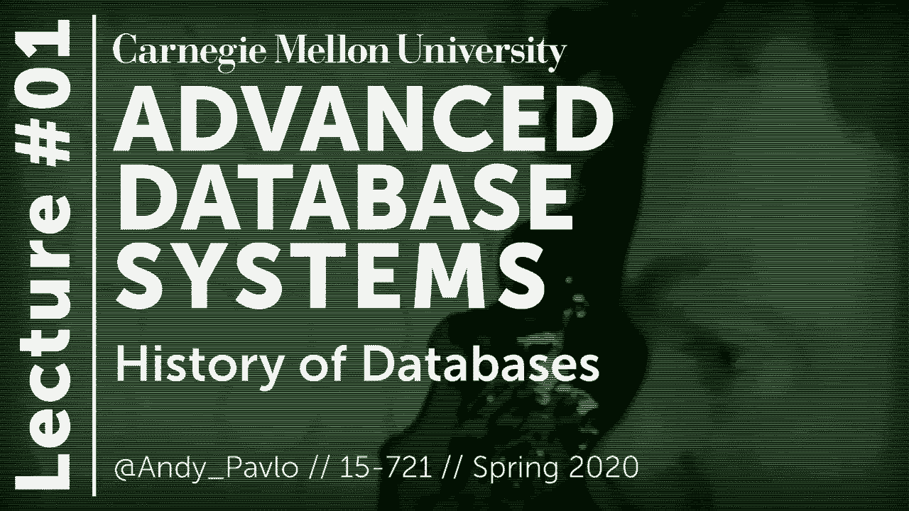
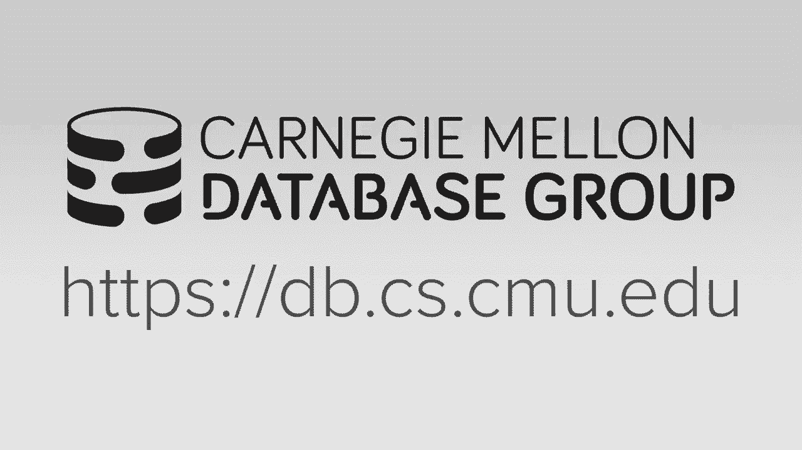
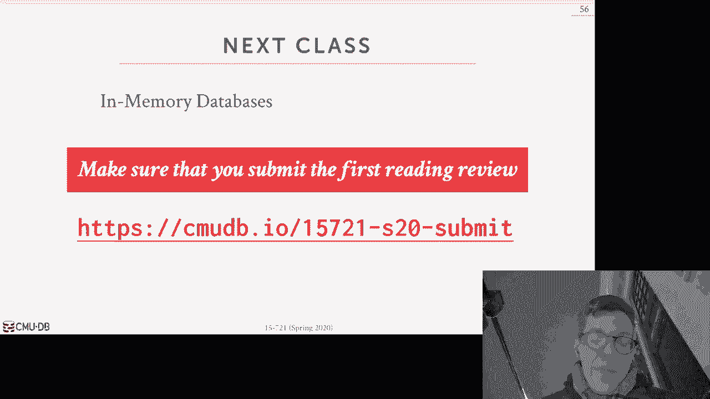
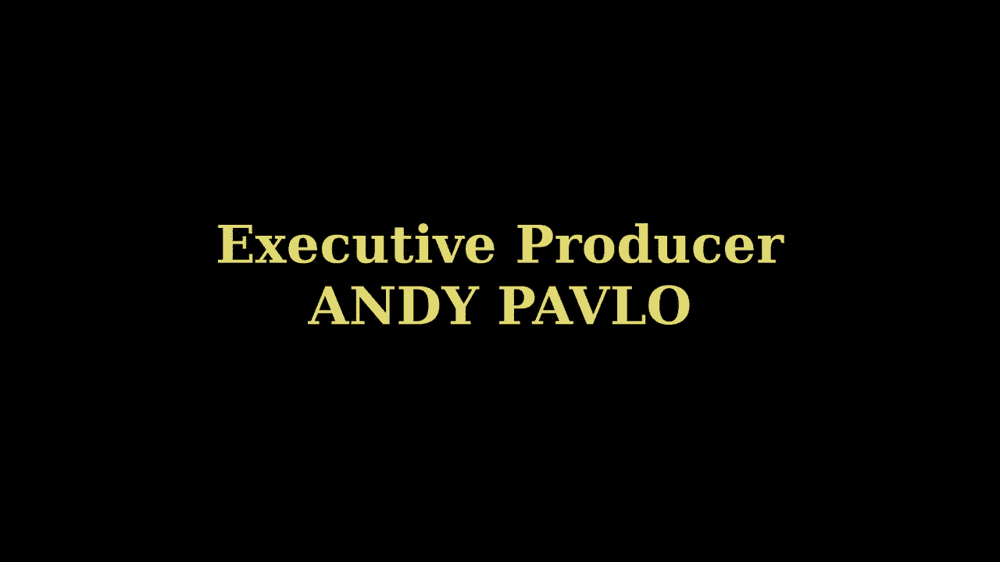

# 【双语字幕+资料下载】CMU 15-721 ｜ 数据库系统进阶(2020·完整版) - P1：L1- 数据库历史 - ShowMeAI - BV1wv411w7Ko

[Applause]，[Music]。

[Applause]，[Music]，welcome to 57：21，I'm the instructor for this course Indy。

Pablo as I posted on Piazza I in，Pittsburgh right now I'm actually in。

Amsterdam with my friend 187 Owen the，problem is that a 187 booked us a hotel。

but it's actually not the kind of hotel，we'd want to stay at so right now we're。

just kind of hanging out here in the，red-light district trying to figure out。

what we need to do next but Owen lost，all his money and I don't have my credit。

card with me right now so we're kind of，homeless so I figured now would be a。

good time to sit down and cover the，first lecture for everyone so before we。

get started I just wanna give a shout，out to everyone who's been down with us。

since the very beginning Jael in Seattle，MC in California and Eazy E in Brooklyn。

these people over understand truth for，us since the very beginning I also want。

to acknowledge that this semester we are，being sponsored by two foundations or。

two groups the first is the Amazon，database group Amazon is actually。

surprisingly one of the largest database，vendors everything they do is on the。

cloud and a lot of topics we'll be，talking about and the semester are。

relevant to the kind of systems that，they are building and and so they are。

helping out with course development，we're also being funded by a nonprofit。

called the Steve Moya foundation for，keeping it real and again they are。

helping out with paying for TAS and，lecture notes and other things so we。

appreciate both of them with helping us，out and for Amazon they will become。

giving a guest lecture later in the，semester sorry - today's agenda the。

things we want to discuss are first the，overview of what the course and the。

semester will look like if you're a，student at Carnegie Mellon and then I。

just want to do sort of a fun lecture，about the history of databases just to。

provide some context about what the you，know what the kind of modern systems we。

talked about today what thing you know，what things that people tried in the。

past so if you're not enrolled in the，course and you want to skip ahead to。

this video you should skip ahead to hit，your databases everything else is just，people that。

that are here at CMU so the first thing，I want to get discussed is why should，you take 15 7：

21 why should you take，this course so I say this every semester，and every semester I continues to be。

true right now database system，developers are in huge demand not just。

in Silicon Valley not just in the United，States all over the world and it's。

because that there's a lot of unsolved，problems in databases data management。

processing and these companies can't，hire people fast enough so you know if。

you take this course you'll be you know，any do well on it you'll be immediately。

hireable or immediately employable and，that's that's a good thing all right the。

other thing I'll say also too is that if，you even if you don't go off and end up。

spending your career writing database，systems or building database systems the。

things that you'll come across or learn，throughout the semester are are going to。

be applicable to almost every other，aspect of computer science or。

information technology and what will，happen is that you'll see is that the。

the people that are you know good enough，to write code for database merit systems。

in addition to operating systems or，embedded systems you know you can get。

pretty much a job in any other，application domain you know if you if。

your database doesn't program and you，wanna write JavaScript code people will。

hire you but if your JavaScript，programmer and you want a day to write a。

database system you know that may be a，harder harder sell right so the kind of。

systems background you'll get out of，this course you know goes beyond just。

database systems but we're going to，discuss these things in the context of。

databases because that's all I really，care about I can just give you sort of。

the brief alumni role of the students，I've taken this class and where they've。

gone to but this is just a subset of the，students that have taken 7：21 and then。

hung out with us and working our system，even further at CMU and they're all。

everyone's gone off either to grad，school or are now building database。

systems that you know either companies，that build databases or you know。

startups that are physically just，building database systems so I'm pretty。

happy about that and then the companies，can't hire our students fast enough。

all right so the goal of this course is，to you know give you the background and。

understand about the bonding practices，and been building database systems and。

as part of that you'll become better at，at doing is sort of low-level systems。

programming so the goal is that by the，end of the semester you'll learn what it。

means to write correct and performance，system code in the context of databases。

we we can't we need both right you you，don't want to lose data so you want your。

system to be correct and I'll show you，what to process the data as fast as。

possible weird fast as possible so you，want to be you know have support high。

performance so I'm sort of in my ivory，tower in academia and I like to say like。

Oh correctness matters first performance，comes second and that's how I'll teach。

things in practice in the real world，that's not always followed you。

definitely you look at examples like，MongoDB or bi sequel you know wildly。

successful database systems that are，used all over the world and they started。

off with going for performance first and，then correct in a second so the other。

thing you'll learn about in this course，is that will teach you proper。

documentation and testing for your，database system you also learn how to do。

code abuse and you work in a larger code，base right so these are things just。

beyond the university these are things，that you know that will help you out to。

your career no matter where you go and，that the major tech firm is when I ask。

them what are they interested in my，students taking this course what kind of。

you know do what they want them to learn，B plus trees or locking code they always。

tell me they want students that are able，to work independently on a large code。

base so that's not something I would，take lightly that's something that I。

think doesn't come easy for a lot of，people especially me and this is。

something you'll get exposure to during，the semester alright so the sort of core。

umbrella topic for this semester will be，single node in memory database systems。

and so that means that we're going to，ignore a look for the most part writing。

data at the disk as part of like a disk，or dida base system it now fluid that is。

later on and we're also going to nor the，problems and challenges when you have a。

distributed database system so it's not，to say distributed databases。

are not important it's just to say that，for this course we're gonna focus on。

getting the single node system working，as fast as possible and it's correct and。

correct correctly and what we don't，worry about going to stripping it right。

it's in my opinion it's better to have a，database system that works well on a。

single node and try to scale that，vertically before you go to a distribute。

environment and try to scale，horizontally because that brings in a。

whole bunch of other challenges so this，means that we're not going to cover。

things like a census protocol or fault，tolerance at a wide scale we care about。

the things but not just here and so this，course is also not gonna be on classical。

database minute systems so that means，that we're not gonna cover you know that。

the basics as we did in the introduction，class about two-phase locking or B plus。

trees and things like that I'm gonna，assume you know those things and instead。

what we're gonna cover our，state-of-the-art implementations and。

other topics that that modern systems，aren't using today I said this is going。

beyond what we cover in the Indian Show，class so the kind of things that we'll。

talk about during the semester are，concurrency control indexing data。

structures storage models database，compression pad actually joins in，parallel or VanFleet vectorized。

execution models networking protocols，logging recovery and then we'll spend a。

lot of time at the end the semester，talking about query compilation in query。

optimization all right these are sort of，the so the more modern things that you。

don't we don't really get the chance to，cover in the in the introduction class。

so as I said already I'm gonna assume if，you're taking this course that you。

already have taken another database，course whether it's 15 for 45 645。

Carnegie Mellon or at your undergraduate，institution some kind of intro to。

databases so and the reason why I'm，gonna assume this is because we're gonna。

discuss modern variations of the，classical algorithms that are designed。

for what today is however it looks like，so I'm not going to teach you what how。

to do a hash join I'm going to teach you，how to do a vectorized parallel hash。

join I think and run multiple cores with，simply instructions I said this is。

shorter you need to understand the basic，way of hash joint work so in order to，understand how to do。

through the modern implementation of it，so the core background that I'm assuming。

you already have would obviously be，sequel because we're gonna focus on。

relational databases serializable theory，of concurrent control theory relation。

odd and then the basic algorithms and，data structures for sort of classical。

databases again P plus trees Ares two，phase locking it and so forth。

things like that so the course policies，and the schedule is all available on the。

course web page right there's a syllabus，there's a schedule and I'll cover what。

the schedule means in a few more slides，but any questions you have about what of。

course sort of have a course will be，held and how be graded you always refer。

to the course webpage now in terms of，academic honesty I encourage you to go。

look at what seems policy is on their on，their webpage about what plagiarism and。

what cheating means if you're doing，something like copying a piece of code。

that you're not sure whether that's okay，or not I encourage you to please ask me。

I'd rather you have asked me and we and，you and I discuss it and see whether。

you're doing the right thing and what，you're doing is okay，rather than me catch you cheating and I。

have to go you know over pulled you to，point all right so you know let's not。

plagiarize let's not be stupid if you，have questions just ask me all right so。

I'm holding office hours on Mondays and，Wednesdays at 1：30 2：30 immediately。

after this class in my office and gates，that time is not good for you then。

please email me and we can make an，arrangement for another time so if you。

come to office hours what can we talk，about well a lot of times students want。

to come talk about implementing their，projects or if they read the paper and。

not sure about what you know if they，fully understand it but there's other。

sort of life things you want to talk，about I'm happy to do that as well like。

how to get a job as a database to，engineer a database database developer。

if you want to introduction to a，database company in a certain state or。

region I can definitely do that for you，and then because of my background I。

think I'm qualified to talked about how，to handle police you know if you're in a。

situation where you know because you do，databases you may end up in a bad place。

and you know you need some help getting，that out of it so by all means come talk。

to me I'm happy to do so，we have 1ta the semester，he's trillest Matt boo trovich is a。

second year peachy or second one and a，half it's not clear what he actually is。

PC student with me in the CS department，he's actually a student that took 721。

crushed it and I encouraged him to hang，out and be a PG student and now he's。

here so he is currently the lead，architect or developer helping build our。

database system at CMU and this is what，you'll be using for all the projects。

before actually coming to CMU he was，he's from LA so he was like an ex-gang。

member of this you know so he's，ridiculous but actually right now since。

I've sort of got him on the right path，as being a PG student he is now I'm。

training him as a licensed boxing，manager so he's gonna be a cage fighter。

he's currently undefeated and you know，through our training we hope that it。

will continue to be his way so any，development questions that I can't。

answer I encourage you to go ask Matt，because he will know more things about。

the internals of our database system，tonight all right so the breakdown for。

which expected for you this semester is，the following so there's reading。

assignments programming projects final，exam and extra credit so one change we。

made this year than previous years is，that I dropped the midterm exam in。

brought along a brought back the second，programming project because I think。

students got more out of it the last，year than the midterm exam so I'll。

explain what that is as we go along and，there's two additional reading。

assignments than previous years so the，if you go to the course that schedule on。

the web page you will see that for every，single day there's a broad topic what。

will be discussed for that lecture and，then there's a list of readings and one。

of the readings will have this orange or，yellow star next to it and that's the。

mandatory reading for that class I，should sort of be the primary paper that。

we will cover in the lecture so before，each class you're required to submit a。

review of our synopsis of this paper，that just discusses like the overview or。

the min the main take away of what the，per the system actually does and and you。

have to spit this to this form on lines，which is just a Google Form and so in。

addition in the synopsis it also include，you know what system they use for their。

evaluation and whether they modify it，and how they modified him and then what。

work Liz they did to evaluate their the，proposed method and this last one is。

actually really important because when，you do the final project and you want to。

measure how your system or whether the，system actually improved or got faster。

or or whatever you're modifying you want，to go see what the workloads are that。

people are using in these other papers，and you know apply the same and apply。

the same experiments to your own，implementation so the reviews are the，synopsis sort of due at 11：

59 a。m。 right，before a class stinks that's harsh，that's sticky the reviews are a few。

right before class and there's no late，days but you're allowed to skip four。

readings throughout the entire semester，and then your final grade will be based。

on you know the ones that you do submit，all right so again please don't。

plagiarize these writings I think other，people fall along in the course on。

YouTube or I looked at the previous，years and sometimes you can find the。

synopsis on on github don't plagiarize，don't copy from each other。

I've run everything the moss and if we，catch you then we have to report you。

again I said again don't be stupid all，right so now the ball kaduk really。

prized basically the program projects so，we are building a new database。

measurement system here at Carnegie，Mellon it doesn't have a name yet it。

doesn't have a public name yet，the repository is currently named that。

for my dog which is just Terrier that's，not gonna be the name of the system。

because that's not a good name for a，database system so we all announced the。

name later in the semester and post the，website published website once once we。

get the first version out the things you，care about is that it's gonna be a。

modern codebase that's written in C++ 11，per station plus 17 it's multi-threaded。

we use LLVM to do query compilation，again I'll explain what that is。

and throughout the semester everything's，open source it's designed to be Postgres。

compatible so the easier for you to，actually enter and you know interact。

with this thing using the terminal so，all the program projects be based on。

this and we're going to use github to，manage everything so that we'll be。

running a recitation later early next，week to give you an overview of how the。

system source code is laid out and gives，sort of pointers on how to get started。

on the first project so we'll announce，that where that's going to be on Piazza。

later this week so all the development，you gonna do is on your local machine。

the data system currently builds on，Linux and OS X I think somebody has。

tried to build it on Windows with the，Ubuntu packages I haven't tried this I。

don't know whether it works but we're，also provide you with a vagrant PM file。

that you just downloaded you want to run，run this in a Linux VM on your phone。

your Windows machine so you do all the，development on your local machine but。

for the first first and second project，and potentially for the third project。

you'll want to do all your benchmarking，consider performance tests using Amazon。

because they'll on an ECG machine，because you can get a machine that has。

more cores than your local laptop does，so will provide everyone with coupons or。

credit codes you can use on Amazon to，get you know a couple bucks to get these。

machines so you're not paying out of，pocket and so we'll send that。

information out a little later later，this later of the semester so the first。

two projects will provide you with the，test cases and the scripts and provide。

you clear instructions on what you need，to Mon to modify in the system for you。

for your project however also to teach，you how to profile the system like using。

perfect call brine but this is，presumably something not something that。

most students have experience with so，the first project will be completed。

individually the second project we've，done in a group of three so currently。

the class has roughly 36 people also be，about twelve or thirteen groups of three。

people I like to keep it three people，because that's sort of a it's not too。

few and not too many the with some，exceptions or taken a case-by-case basis。

if we have actual people we could do a，four or three or four or two-person，group。

but again most everyone else would，should be in a three-person crew it's。

okay for you start thinking about what，group you want to join to get right now。

the third project will be will be the，group project and this will be something。

that you get to choose to build in our，system and so it has to be something。

that's relevant to the materials of，topics we discuss in the class it has to。

be require a significant program effort，from everyone that's on your team and。

has to be unique you can't have two，groups work on the same project and。

obviously as to be approved by me so，don't freak out about this now you don't。

have to pick a project until the we come，after after Spring Break and then I'm。

also going to provide some sample，project topics that you can choose from。

to build in our system so again for the，first and second project please don't。

plagiarize please don't copy from each，other if you're borrowing a library for。

project two that's probably not，necessarily a project three again come。

talk to me but again don't be stupid，don't copy and nobody will have any。

problems all right so the final exam，will be a take home exam and that'll be。

long-form questions based on the menus，where any reading through stopped seems，tests in the class。

I'll give it out in class on April 22nd，is winter if there's also the same day。

that the guest speaker will be come and，give a lecture and then it'll be due。

potentially the last day of class a week，later or when we do the final project。

presentations I haven't decided yet，all right and the extra credit for this。

semester is the same as we did in the，intro class so we are writing an。

encyclopedia of database systems at，Carnegie Mellon I currently know about I。

think the numbers like six hundred and，eighty-three database systems now that。

we know about and so you can get extra，credit if you write a Wikipedia style。

article about one particular database，system so there's a ton of them in there。

I pick one then you know you find，interesting and you're right about how。

it's actually implemented and you've got，provide citations and attributions at。

your attributions for where you found，this information it's not just saying。

this is what it does because I read I，watched a video you got to actually have。

citations because you're trying to for，this trying to have this thing being。

scientific so this is entirely optional，you don't have to do this but if you。

won't do the option is there，so again for the for the extra credit。

articles this happens every year it，drives me crazy do not plagiarize do not。

you know even those extra credit you can，still get in trouble，we still report people to Warner Hall。

that that that plagiarize for the extra，credit right like the reason why I'm。

saying this over and over again in these，videos is because I'm telling you don't。

plagiarize so then if you do plagiarize，I go to Warner Hall and sit and show。

them this video and say look here's what，I told the class not to plagiarize and。

they plagiarize and then so don't do，that either break down for the grades。

this year is that the reading views are，worth 15% project one is worth 10% again。

that's mostly designed to get you，familiar with working in the codebase。

project you is 20% project 3 is 45%，final exam is 10% and then you can order。

you can earn extra 10% for your extra，credit so the all the discussion。

throughout the course we don't a Piazza，and that's the link there everyone。

should already been sign up signed up，before this must have started if that。

hasn't happened and please email me and，we can fix this if you have a technical。

question about the projects like I tried，running this in a VM and it didn't work。

I tried compiling it didn't work or what，is this piece of the code do please。

don't email me or Matt directly please，post on Piazza because again it's a。

group discussion if you have questions，that other people have similar questions。

so Piazza is the right place to do that，anything that's not about projects or。

homeworks or assignments or other things，please you email you know directly like。

you're sick or your dog died email me，okay，all right so that's it for the you know。

forth before the background what the，course will be about logistics so now I。

want to do sort of enough sort of fun，mini lecture on the history of databases。

so this this lecture is actually come，based on two papers one was written by。

Mike Stormbreaker called what goes，around comes around and that was。

published in 2006 and that's sort of a，retrospective of you know the history of。

databases up to to that point and then，the second paper is one that I wrote。

with a industry analyst out of London，what's really new a new sequel and that。

sort of picks up where Mike left off in，2006 and talks about the rise of the new。

sequel systems and how they sort of fit，into the history of databases so again。

there's databases are a super old topic，today，I love databases so it's good to。

understand where you know how do we get，to the point we're at right now so the。

main takeaway from from those two papers，is that a lot of the issues that in the。

early database systems were facing back，in email all the way back to 1960s and。

1970s are actually still relevant today，you know how do you run transactions。

correctly how do you Patti maintain，indexes all these things are still。

matter it's just what's different is the，hardware landscape is different so the。

one thing in particular that's that's，really fascinating about all this is。

that was sort of how history repeats，itself is the you know it's been a。

decade now but this idea of sequel，versus no sequel you know which one was。

better for you know for different，workloads，that's that debate was basically the。

same debate that they had in the 1970s，about the relational model versus。

codasyl or the network data model and if，you've never heard of codasyl it's it's。

no surprise because it lost right the，relational model one that's why we this。

whole courses on relational databases so，you know the the relational data model。

has proven to be resilient and robust，and，you know useful for almost every。

possible database workload the only，exception I would say is is potentially。

machine learning because those are，arrays and although you can model them。

in a relational database it's not you，know not that in this awful way so many。

of the ideas that were talked about，throughout this entire semester are not。

new again we're just discussing the，modern implementations are incarnations。

of them and all the times you're hear me，say throughout the entire semester or。

that you know when we talk about，particular topic I'll say oh actually。

IBM did the same thing in the 1970s with，system or or ingress did the same thing。

at Berkeley in the 1970s right these a，lot of these techniques are not new it's。

just there now some of them are back in，fashion because the the harbor can。

actually support this so that's I think，that's super interesting and it's a part。

of the reason why databases are you know，still relevant still hot topic and still。

in demand today so let's go back to the，very beginning one of the very first。

database systems was developed in the，1960s called IDs the integrated data。

store and so this was developed at GE，General Electric internally for some。

customer I think it was doing a timber，service or timber company out of like。

Seattle so they built this database，system and for this one customer and it。

helped them with you know get a hold on，their large organization so you may be。

thinking well Andy I've ever heard of GE，selling computers or selling databases。

how can GE be responsible for building，the first database system what happened。

to them well it turns out that GE at the，time had this this business philosophy。

where they said if they can't be in the，number one company in a particular。

sector of the marketplace then they，didn't want to be in that market at all。

so they said well we're not number one，computing let's just sell it all off we。

don't want to be involved in that so，they sold the entire computing division。

to Honeywell in 1969 and as part of that，they also sold IDs I actually don't know。

whether IDs is still around around today，I mean it could potentially yes but this。

is usually demoness that one of the，first date of the systems so the two key。

things about IDs that are relevant to us，are they're going to use what is called。

a network data modelling which I'll，explain in a few slides and that when。

you execute queries you're going to，basically be writing a bunch of for。

loops that operate on a single tuple at，a time and we'll contrast with that with。

their relational model which can operate，on bags or sets so the guy it actually。

ege that helped build IDs was this early，computer scientist named Charlie Barkin。

at Charles Bachman who's actually still，alive today and he ended up leaving。

Honeywell in the early 1970s and went，off to this this other computer company。

called cool lane database systems which，still exists today and he helped build a。

new network data model system called ID，8i DMS or an integrated management。

system integrated data management system，and that's actually still around today。

so Bachman and a bunch of other people，that were involved in COBOL programming。

got together in the late 1960s and，proposed a standard called codasyl on。

for how programs written in COBOL should，access the database think of us they。

were trying to define a standard API，that every database system that written。

in COBOL could could could could support，so again based on his experience at。

Honeywell this codasyl was based on the，never data model and therefore it。

operated on one tuple at a time during，query execution so Bachman is he was an。

early database pioneer and he won that，he won the Turing Award for this work in。

there in the early nineteen seventies he，said one of the first people actually。

win the Turing Award for databases so，here's what the network data model looks。

like so for this is sample application，say we're like a large engineering。

company and we're trying to model how，the keep track of all the different。

parts we have to buy from different，suppliers to build some you know large。

rocket which is actually a true example，we'll see in a few more slides but so I。

have in my database I want to keep track，of suppliers parts and the。

which supplier supplies each part so the，way the network data model set up is。

that you have these collections of data，like a supplier a part and supply but。

then you're also going to have to define，these membership sets that that say。

whether a you know a and a record from，one set is a member of a you know owned。

by another set so to show and I can，instance what this would look like so。

say these are my use my collections of，data or my records supplier part and。

supply so I would have now these，membership set call supplies and。

supplied by that would have pointers to，say 4 8 4 you know for a given。

membership between a parent and a child，here's all the parent pointers to the。

parent records and here's all the child，pointers to the child records so now。

let's say I went do a query and say find，me all the parts that are supplied by a。

particular supplier I'd have to write，these bunch of nested for-loops that。

finds the the supplier that I want，iterates over the supplies set then。

iterates her with the supply set then，iterate you know with the supplied by。

then I and then I reach my my my part，record our part collection of data and I。

can find the thing that I'm looking for，so the first obvious thing to point out。

here is that the network data model，requires you to have to write complex。

queries you're essentially writing low，level for loops to traverse this the vs。

never have to find the data that you're，looking for the other issue is more of。

an implementation aspect but the these，these these databases turn out to be。

easily corruptible because AB see back，then in 1916 1970s disks were expensive。

they weren't as reliable as they are，today and people weren't you know。

maintaining multiple copies of data so，what would happen is if one of these。

these membership sets got corrupted you，said you lost the whole database because。

now you had no way to know how things，so the the networked data model and the。

IDs came first but the another database，is though is sort of built around the。

same time in the late 1960s what's this，thing called IMS for information，management system at IBM。

so IMS is super super well known it's，widely used still in today if you ever。

used at atm chances are you've，interacted with an application that。

talks to an IMS database it's still，around so IMS was actually a database。

and IBM that IBM built to keep track of，the purchase orders the part supplies。

and the supplied information for the，Apollo moon mission for NASA before was。

called NASA but unlike codasyl it didn't，use a network data model they used what。

is called as a hierarchal data model the，other interesting aspect about IMS was。

that they had programmer defined，physical storage formats so when you。

declared you know I have a collection of，data like a table you also had to define。

what was the underlying data structure，you would use to physically store that。

data on disk right whether you want a，hash table or something to order。

preserving tree and so it also like the，network data model though you you would。

try these four loops to traverse the，hierarchy and do queries that up you。

know write queries and operate on a，single tuple at a time so again now。

inserted simple supplier information an，example now we just have sort of two。

collections we have supplier and a part，but in the instance we actually see a，information。

so we'd have this supplier collection of，data with our records and then each of。

these records would have now a pointer，to some other data structure that would。

have all their part information so the，obvious problem we would have here is。

that or duplicating data because if，multiple suppliers provide the same part。

I have to have different instances of，that you know that record in this case。

large batteries over and over again，right for every single supplier that。

that sells that part and that means now，if the name of the part ever changes I。

have to write extra code to go find all，instances of the batteries the large。

batteries and make sure that their names，all get changed together at the same，time and that。

they're there in sync the other big，problem in addition to sort of the tuple。

at a time for queries is that there was，no independence between the physical。

data structure of the databases of the，database and the logical abstraction。

that programmers interacted with so for，example if you know if I declared that。

my table was gonna be or you use a hash，table as this underlying physical data。

structure but then I read earlier later，realize oh I I want to actually execute。

range queries well now I gotta dump the，table out and load it back in as a B+。

tree and then now the API that I'm，exposed to for that table changes method。

rewrite all my application code right so，so now in the late 1960s early 1970s。

there was this mathematician named Ted，Cod who was working at IBM Research in。

New York and he saw all these，programmers at IBM rewriting their IMS。

and codasyl programs every single time，the database schema change or the layout。

changed and he saw this as being，wasteful right because every single time。

the schema change the you know you have，to go rewrite your application code now。

back then computers were way more，expensive than humans and so he was sort。

of prescient in this in this goal of，removing this burden because now human。

two way more expensive than machines，machines are cheap right so back then。

this wasn't you know maybe that big of，an issue of it was hard to find。

programmers but Italy now may be a big，cost problem and so what he came up with。

in the relational model was this this，high level of abstraction of databases。

to avoid all this sort of maintenance，burden on humans so the relational model。

is has sort of three key ideas that that，are widely used in databases today so。

the first is that instead of storing the，databases hierarchy or this network with。

with image it'll crash structures we're，instead store the database is just these。

simple data structures as relations or，tables right and now we're gonna then。

write our program in TOR to access the，data through some high-level language。

that can operate on these on these，you know he didn't actually propose。

language I said this is the first paper，he wrote in 69 but this is the more。

common one that everyone cites is the，relational model of for the facial model。

of data for large large shared data，banks so M B's in these seminal papers。

he actually didn't find what this，high-level language would be of course。

now we know this is sequel at the time，sequel didn't exist all right so the。

paper strictly you expect，strictly describing the relational model。

from a mathematical perspective quele，was actually the first programming。

language query language that people came，up with for ingress that followed the。

relational model the IBM later came out，with sequel which is the sequel to quell，to play on words。

Ted Cod actually proposed his own，language called alpha in a paper I think。

in like 1975 but no one no one ever，actually uses that the other key thing。

that he came out with that goes beyond，what ims was doing was the physical。

storage representation of every relation，was actually left up to the，implementation of the database。

management system so what that means is，that I just declare that I want a table。

I want a relation that has these，attributes I don't say how I actually。

want it stored physically and now the，database system could decide on its own。

how it actually wants to store things，right if it wants to use the hash table。

wants to use a B+ tree it could do，whatever at once and no matter how the。

data changes physically underneath the，correctly，I shouldn't have to change any of my。

query any any queries in in my，application because they're only。

operating on the database at a logical，level so these ideas sort of seem。

obvious today but back then this is，actually kind of controversial right the。

idea of having a database system to be，able to support a high level language。

that can generate query plans as，efficiently as what humans can write was。

considered a far-fetched idea it sort of，back panels do you gotta understand。

people didn't think a high level，language like C and having compiler for。

C could ever produce you know machine，code as efficient as some。

writing assembly and of course nowadays，nobody you know very few people actually。

don't write assembly we write in even，higher level languages right it's again。

in our modern world these don't seem，that controversial ideas but back then。

back then it was so the just to go back，to our simple example before with。

relational model the now we have three，relations supplier part and supply and。

these gonna have foreign key，relationships between between each other。

so now in my installation or instance of，this database Estonia I can just do。

joins now between either supplier number，or the part number to find the to find。

the the parent the parent record for my，supplier record so now to do a lookup to。

find all the parts applied by giving，supplier I can just do a join between。

these three tables and find exactly what，I want and this also means that in a。

high-level language I'm operating on the，database as through sets right I just。

say this is what I want you to find for，me and I don't specify you know how to。

iterate through you know to pose moment，form I want to find what you're looking。

for again this is a very powerful，construct that is the basis of what we。

talked about for the entire semester，alright so this is now so the relational。

model sort of sort of in the 1970s when，it came out as I said it was。

controversial so would it mediate right，away that this is the right way to build。

database systems so there was a couple，other relational database systems being。

built at the time but the three that，most people talked about so today our。

system are at IBM ingress at berkeley，and oracle by oracle so system are was。

at IBM research in san jose and it，wasn't led by jim gray but he was。

probably one of those famous people that，came out of that group ingress was。

developed by one of my advisers mike，snow breaker if you've never heard it。

ingress before you may have heard of，Postgres right so snow breaker is built。

ingress and then he built Postgres after，ingress like Postgres stands for post。

ingress right so again we'll talk about，this both of the system's self entire。

semester and then oracle is there's a，commercial system that both Larry，Ellison and now he's like。

one was richest people in the world so，this this listing is amazing right you。

look at Jim Gray you look at Mike，Stonebraker both of those guys won the。

touring award for databases Larry，Ellison as I said he's like the seventh。

or eighth richest man in the world，this is all because of databases like。

this is crazy this is awesome right so，this is why I just why I love databases。

because it's you know now only can you，do do research that has been an impact。

you can make you know you make some，decent money now you can buy your own。

Hawaiian island it's awesome all right，so there's the debate going on between。

the relational model and Kota so in，1970s but eventually the relational。

model one algorithms clear that this is，the right way to build database systems。

so ingress and Oracle were，commercialized but IBM actually never，released system are as as as a。

commercial product what they ended up，releasing what in their first relation。

Davison they did release was this thing，called db2 which is still around today。

and that came out in 1983 so there's，some bits and pieces of system are that。

made it into the first implementation of，db2 but I don't know how much of that。

code still exists today and so because，for system are they were using sequel。

IBM used sequel in db2 and because IBM，was sort of the computer juggernaut at。

the time that essentially became the，standard they had to change the name。

though so set of spelled out seq you，yell it just got shortened to become。

sequel and I think that's because，there's somebody somebody sue them over。

a naming issue so sequel became the，dominant dominant programming language。

used for databases ingress was，supporting Quell at the time they，eventually had a sports sequel put。

Oracle supported sequel from the very，beginning because they copied what IBM。

did and you know when I didn't keep me，outside if we have a sequel database。

Oracle is like oh look we already have，one too and then they essentially won。

the marketplace so the other thing that，happened in 1980 is were in addition to。

IBM putting on the first database，there's actually a lot of other startups。

that came out at the time it also built，relational databases for enterprise。

market or in a commercial market，Informix Sybase tandem non-stop sequel。

Teradata was late 70s inter bases，another famous one but all these。

database systems are still around today，not in the exact form that they existed。

back back in the 1980s but these are，still a billion dollar billion dollar。

products that still make a lot of money，for these companies，the other cool thing is that Stonebraker。

after running the ingress company for a，while he goes back to Berkeley and he。

starts a new database system built on，the you know his lessons that he learned。

from from running ingress and he put，that into a new system called Postgres。

and this is actually I don't know how，and obviously not much of the same code。

is still there but this is the same，person using today is it's a direct line。

to this exactly the same Postgres code，or menina derived from the postcard code。

that mike developed with his students at，Berkeley in the 1980s so now we get in。

the late 1980s and now we start to see，this idea of people repeating sort of。

not the same mistakes but trying to you，know fight the same battle that maybe。

people that they had in the 1970s so in，the 1980s object or new programming。

languages became more prevalent and，people people recognized that well if。

I'm writing all my application code in，an object or in a programming language。

like small talk or C++ but now I used to，store things my database mode my。

database is storing things as relations，so I have to take my objects which may。

have nested arrays and other objects，inside of them I've got to break them up。

and then put them into relations or，single records or tuples and put them to。

my database and so people recognize that，observe that this was a potential。

bottleneck this is called the relational，object impedance mismatch so a bunch of。

people said that well rather than taking，my objects in my probing language and。

then splitting all of them up into two，poles from our relational database what。

if I just could have a database system，could store objects directly so then I。

don't have to do that translation，and you know did Eli's or DC Eliza break。

things up and put it back together，anytime I need to access them so the。

couple of database companies that came，out with what are called object or any。

databases force on an object store，probably two most famous ones they still。

exist today but they're essentially in，maintenance mode this this sort of。

category databases never they took off，because there was no sort of standard。

way to interact with you know the，program these systems and just you know。

because you have to use a proprietary，programming language that made you you。

know tightly coupled with the databases，of where sequel is potentially a you。

know an open standard that anyone can，implement you know these are the program。

these other databases were proprietary，market logic is an XML database that。

came out in the late 1990s but it's it，was similar to these things there was。

sort of an XML database so although，these systems aren't really around today。

and people aren't widely using them a，lot of the technologies that they。

developed to store data in these in，these object when a databases actually。

exists today and the commercial relation，databases or open source ones right。

anytime you store data as a JSON file or，XML field that's essentially doing the。

same thing that the object or any，davises guys did back in the 1980s so。

again so as Mike said what goes around，comes around so let's all get a quick。

example here so I say I have an，application that I want to store Student。

Information so every student has an ID a，name and email address and then an array。

of phone numbers so if I want store that，in a relational database since a student。

could have multiple phone numbers I need，to have a foreign key relationship。

between a student phone relation and a，student table and so now when I want to。

do a lookup to get all the information I，need for a given student I either have。

to do two queries on these two relations，or do a join between them to get the。

data that I need I said this again this，is the this would be called the。

object-relational impedance mismatch so，what a object warning database would say。

is that well instead of storing this as，two simulations，what if I de stored the all the。

information for a single student in a as，a JSON field and inside that I could。

have my nested array and so now to go，get all the information to instantiate。

that object in my application code，as one fetch into the database so this，seems nice。

right but now this is gonna cause，problems because for a simple example。

like go get one student that's easy to，do but now if I want to start doing。

aggregations across multiple students，and start tuning things together not。

only to have to have traversed the，hierarchy of the every single record in。

my query but now I need make sure I can，join across these multiple records so。

the queries to do complex things end up，being more difficult than what you would。

have written in using sequel the other，issue is that as I said before there's。

no standard API even today for JSON，databases there's no standard。

programming language that people use to，interact with these objects on the。

databases MongoDB or Redis are sort of，becoming the sort of de facto standard。

but there's enough there's enough，document databases or object databases。

out there that do something completely，different whereas sequel again the。

dialects are slightly different but，they're still similar or not that you。

know you can understand it pretty easily，all right so now we get to the 1990s I。

typically call this the boring days of，databases and it's not to say that。

people weren't putting out new database，systems it's just that there wasn't any。

major advancement a major change and how，people are going to design database。

systems that help people are going to，kind of applications people are limited。

on yes the internet was coming around，but you know in the early days that。

weren't that many people on the internet，and the complexity of the applications。

that people were building and exposing，through the web or not as sophisticated。

as they are now so existing databases，were sort of sufficient the sort of four。

major events that I was like to say，during this period were that Microsoft。

bought a license to the Sybase source，code they forked it and ported it to。

Windows NT and that became sequel server，secret server today still is。

state-of-the-art database system and you，know I know how much I don't think of。

that much of the site this code is still，there but that was their starting point。

and Sybase is sort of in maintenance，mode now that still makes a lot of money。

where a single server I consider to be a，state of the art system。

the next major trend was that sequel，server or so my sequel was what came。

about in the 1990s as a replacement for，M sequel and that's why they use today。

Postgres added support for sequel，and that was a based on the academic。

code that was developed at Berkeley in，the 1980s most of us actually got was。

forked and then there was a commercial，version called a lustrum，that I think supported sequel was。

eventually bought by Informix and sort，of died off but two grad students at。

Berkeley in the 1990s took their，academic version of Postgres that only。

supported quell and add as a porphyrin，sequel and that's why the official name。

of post-arrest is PostgreSQL because you，know it was the added sequel after the。

original Postgres code was written and，then sequel light was started by one。

dude down in North Carolina and it's，most widely used，noxee that's why they use embedded。

database and was widely used is data in，general because it's used everywhere all。

right so now the big change to happen in，the 2000s was as the internet so the。

number of users online grew，significantly and the size of the，databases and the number of concurrent。

operations that these systems need to，support was way larger than what you。

know what what existed before，so the problem was that all of the。

majors of enterprise database systems，the Oracles the SCI basis the the db2。

these are all very heavyweight and they，were expensive and the open source。

systems like my sequel Postgres at the，time were sort of missing important。

features that you would want and，databases that you couldn't use them in。

production safely you know so for，example my sequel didn't support。

transactions correctly until you know to，enter DB came along in the early 2000s。

so any what happening was doing to，support these larger doctor workloads a。

bunch of companies like Facebook Google，and eBay and Amazon they end up writing。

their own custom middleware that would，sit in front of multiple single node。

database instances to loud them to shard，out scale and so that would allow them。

to support a larger number of concurrent，users and ingest data more quickly but。

now if you have a lot more data anyone，do analytics on it you need a。

specialized database system to actually，support these kind of workloads so this。

was the rise of data warehouses so these，were the special-purpose data systems。

that were built in the mid 2000s that，were designed for these large alergic。

data sets it's not to say that the the，existing David's at the time couldn't do。

analytics they were you know they were，sort of jack-of-all-trades and not。

designed specifically for him whereas，these newer systems were designed just。

to do analytics efficiently so the six，most famous ones who at the time were in。

a teaser Park Salomone DB Green Pond 8，Allegro Vertica of these mateesah parks。

L Vertica and Green Pond were all Forks，and Postgres like they took the。

Foursquare source code hacked it up to，make a sport analytics Morton more。

efficiently the I don't think about，these systems that was different than。

the existing ones is that they were，primarily distributed and shared nothing。

because that's you wanna be able to，scale out to do large-scale analytics。

and unfortunately they were most of them，were also closed source so the key thing。

about them that makes them different，than what was done before is that these。

were all columnstore databases all right，so comma stores that has existed since。

the 1970s but it wasn't until this time，now these special-purpose data。

warehouses that people recognize that，the colony，you know the decomposition model that。

come a column store was superior for，so now we get into the late 2000s and。

the no sequel movement so how this all，sort of started is this my take on it。

was that the companies like Google，recognized that for the kind of。

applications that they want to support，on the web they cared more about making。

sure that the data system was always，available and the that they could scale。

to port a large number of users so they，end up foregoing traditional things like。

the Davis provides like transactions and，joints and seco support in exchange for。

these sort of other data models or，proprietary languages programming。

languages access api's so there's a，bunch of these systems that were sort of。

cloned based on what Amazon had done or，what Google had done but other ones keep。

sort of came out from just somebody was，putting data system at a company and。

recognized that you know it solved a，particular problem that it's useful for。

other people so obvious the most famous，ones were probably MongoDB Cassandra and。

dynamodb mostly these are open source，except for Dino DB Oracle no sequel and。

and BigTable but again the main thing is，that they were called no sequel because。

they weren't supporting sequel at the，time although a lot of these Jews do now。

today because they were focusing on high，availability more than and correctness。

so as a responsive to the no sequel，movement there was a certain other--。

database maybe that I was involved in，called new sequel and this is where。

we're trying to build databases for，transactional workloads that could have。

the same performance of scalability as a，no sequel system but without having to。

give up transactions without giving up，the relational model or sequel because。

these are useful things to have in the，databases and database so unfortunately。

most of these at least when the new，sequel system originally started most of。

these were a closed source clinical，thing now is in recent years with like。

copper cbt-i DB and you gabite，some of the newer newer new single。

systems are actually open source so that，that's pretty exciting spanner is。

probably the most famous one at gu，out of all these and they do。

transactions using the special proper，clocks which we're not gonna specify。

this semester all right so now the 2010，and 2014 so these are where now instead。

of this building to a single purpose，daily sitting that could try to do。

everything you try to build these you，know one of the new transactions or one。

that could do analytics efficiently but，not the other one but then in the later。

mm mm mm tens was these H tab systems or，hybrid systems where it was trying to。

get the best of both worlds it was like，and it was trying to be a new single。

student system where he could do，transactions very quickly but you also。

want to support some of the analytics，that you would only be able to run on it。

on a data warehouse and the idea here，was that instead of it could have。

maintained two server databases one for，transactions on for analytics you could。

push some of those analytical operations，directly to the front end system and you。

know extrapolate new knowledge new，information all in the data as it。

arrives in the database system so of，these HANA splice machine and MC co-op。

probably the two most famous ones hyper，is originally started as an academic。

system but it got bought by tableau a，few years ago and is now a commercial。

system that comes with tableau software，hyper is actually an amazing system we。

are actually going to discuss it both，times throughout the entire semester and。

next class or later this week I'm，actually going down to the hyper。

headquarters to try to get you know go，through like a German seance or get some。

German influence in my life to help me，build a better database system so look。

forward to that in the next class so，some of these are open source some of。

these are closed source again but all，these are going to support the。

relational model and sequel is that sort，of the the main thing people want，especially for analytics。

the other big thing happened in 2010 was，the the advent of cloud systems so these。

are now database systems that are，designed specifically to run in the。

cloud environment and so how these first，started were like the major cloud。

vendors would sell you a database as a，service that were just taking an。

existing database system like Oracle or，my sequel or Postgres and running band。

inside a container or VM for you but，since then there's been new database。

systems that are designed specifically，for running in a cloud environment or。

shared disk combine which I'll show in，the next slide all right so these are。

data i/o systems and not necessarily，govern the ground up but they're the。

system's assumes that's running in a，cloud environment and therefore it takes。

into account the latency of accessing，disk that may not be local to the。

machine I would compute is actually，running so of these snowflake redshift。

roared and everything Amazon span or，BigTable & Kosmos DVR Poly most famous。

ones ziran was a cloud version on my，sequel that went under it's based out of。

Israel they failed a few years ago fauna，DB is a it's a serverless OTP system and。

slicing dice is a I think a cloud cloud，service from my sequel based out of。

South America so there's a bunch of，other ones but these are the one of the。

main ones that I'm showing so as part of，it in cloud database you had these new。

architecture that was assuming a shared，disk shared disk environment so that。

means that instead of having to write a，custom storage manager in your database。

system the accesses like a local disk，you would use the existing，you know interfaces or API that the。

cloud vendor provided you or a，distributed file system will provide you。

and use that as the underlying datastore，I said think of this instead of writing。

to you know a proprietary you know a，local file that you know manage on the。

disk I would write my data out to HDFS，or Amazon says to reread EBS so in these。

environments the storage layer is，usually append-only and so these are。

going to favor or you're gonna typically，use a log structured approach because。

you just need to keep depending to the，law so this is what most people think。

about when they talk about building a，data Lake it's usually something like。

this where they have a bunch of files，under you should be a file system or。

distributed object store and you just，build it you have this you point the。

data system at it and you suck at the，data in and do rent you to run your。

queries on it so again although we're，not gonna talk about shared disk systems。

or tribute databases you know you have，to bring the data from the shared disk。

into a compute node and at that point，it's in memory and so you're gonna do。

all the things that were talked about，throughout the entire semester right so。

even though we're not talking about，explicitly disagree to databases our。

techniques that we'll talk about here，are still used in them the other cool。

thing about shared disk systems is that，because now we separated the compute。

layer with the storage layer I can scale，them out independently because the。

execution layer is essentially stateless，by the final state of the database is。

always on the shared disk so if now I，can't process queries fast enough then I。

can just keep adding new you know in，your compute nodes and start you know。

running more queries in parallel，likewise if I need to start scaling out。

more machines I can just add a new disk，of the shared shared disk layer all。

right so I briefly want to talk about，graph databases although it's starting。

to rain here the every year people so，ask me why don't I cover craft databases。

in the class and the answer is I have，not really seen a from the low-level。

systems perspective that I care about，I've not seen a compelling argument for。

why you want to use a graph database the，only really main image that they have。

over existing systems is that they're，gonna abide you a graph tential query。

API so that means it's like if I wanna，do a graphical traversal instead of you。

know as I walk the graph going back，before doing the application and and。

this and the database back and forth to，do that traversal I have a single。

command that does two traversal and then，it all runs on the server side so but。

there's nothing specific about that that，makes this as you know you couldn't do。

that in a relational database that's，storing a graph and in fact there's a。

recent research it's a few years ago，2015 insider that shows that it's。

actually not clear that using a graph，Center specialized graph central。

database system it's going to do，any better over a existing relational。

database system with a graph API so for，that reason we're just not going to walk。

graph databases this entire semester the，other major trend this this this decade。

in 2010s is the the advent of these time，series databases so again these are more。

specialized database systems that are，system designed to store time series。

event data think of like a modern，service where you're collecting the the。

CPU utilization from every machine in a，data center you know once a second so。

all these events get sucked into a time，series database and they can do you know。

analytics or do analysis on them to find，whether you know there's any issues so。

the reason why I bring up the time，series databases is that this is。

actually a good example about how if you，make assumptions about what the data。

looks like and the worklet pattern，you're trying to execute on then you can。

actually apply some additional，opposition's at the storage layer and。

the and the execution layer for them so，you could make the same argument about。

graph databases I just at the X you'll，there may be or the planning level but。

at the low level storage level it's the，relational model could still do this so。

a time series databases they're still，relational it's just there are they know。

the queries that patterns are going to，look like and so they can optimize for。

so of these the ones that's probably the，most interesting to us in the semester。

is clique house at a Russia I'll spend a，little time talk about how they do。

things because it's actually it's super，stable system that does a lot of the。

things that we're going to talk about，this entire semester and it's open。

source that's that's very cool all right，so again the the the major trend I would。

say the last decade is the rise these，specialized systems no longer it's it's。

you know Oracle or sequel server db2，that tries to do everything for everyone。

there's enough Daly system out there，that that can better for different。

classes of workloads again a lot of，these that still be relational。

it's just how they actually put my，things and can be tailored towards a。

particular application environment，domain so there's a bunch of embedded，we're not going to。

talk about multimodal databases or，mostly model databases are systems that。

try to do you know graphs and documents，and key value stores all within a single。

database blockchain databases are thing，apparently again I don't find them very。

interesting or compelling these may be I，just don't understand it enough to say。

that they're good reason for them so，we're not talk about them and there's。

also a hardware accelerated basis we'll，talk a little bit at the end of the。

semester basic databases that not just，running on the CPU but could you run on。

FPGAs GPUs or new non-volatile memory so，the main takeaway once you get from all。

of this is that there are a ton of，database systems out there that all do。

things differently and sometimes they，make a decision sometimes they don't。

they don't make good decisions and so，the goal of this semester so to。

understand these trade-offs of all the，different design points of building a。

database system so that you know when，you go out in the real world and someone。

comes along says hey I have this great，new database that you should give me。

money money for you should start using，you you can now make an uneducated。

valuation about whether that's actually，a good idea or not all right so here's。

what I think is gonna happen in the，future I think that the specialized。

databases that start off very，specialized over time as they get more。

users and see adoption they will sort of，expand the scope and which the type of。

problems that label support so the time，series databases maybe don't do。

transactions very well but eventually，what a transaction there may be they。

they don't do analytics very well and a，doc need base but eventually they do。

analytics water eventually some，databases will just people stop using。

and be go in a maintenance mode and then，die off but the ones that that do you。

thrive I think will just begin notice，get better over over time it is also my。

opinion that the relational model and，declarative programming languages are a。

boon for doing high-quality engineering，data engineering in an organization。

right so instead of is having a bunch of，Python scripts that are hacking up the。

data if you have a way to sort of，programmatically define what the data，looks like and。

and operate venom on in sort of，structured manner then that makes it。

easier you know for other people to，reuse what you're doing it may not be。

the fastest way for you to do it in，terms of engine you know you actually。

writing the software but for an，organization that has a lot of people。

touching data I think this is actually，the better approach that's a sort of。

just my opinion all right so next class，we will do the introduction on in-memory。

databases I just sort of to contrast，them with disparate databases and try to。

understand why they're different how，they're different and you know that'll。

be the underlying assumption we make，throughout the entire semester and for。

Wednesday's class you also have to，submit your first reading with you so go。

check this course schedule and see what，paper you have to read and then submit。

that with a link below okay so like，10：30 at night it's getting smoky here。

let me go figure out where or when a 701，is and forgot we're staying and then。

hopefully I can record the next class，when I'm down in Germany at the hyper。

headquarters all right guys take it easy。

Bank it in the side part what is，[Music]，called the okay cuz I'm og ice you down。

with the testy hi you look and it was go，grab me a forty just to get my boss song。

cuz I needed just a little more kick and。