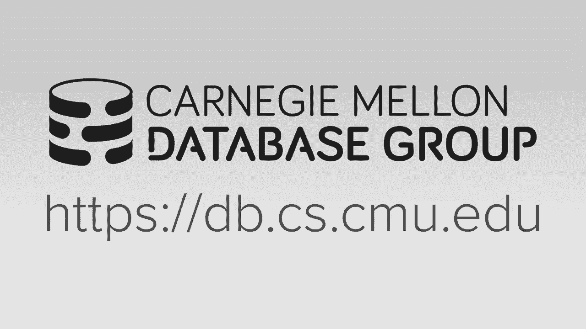
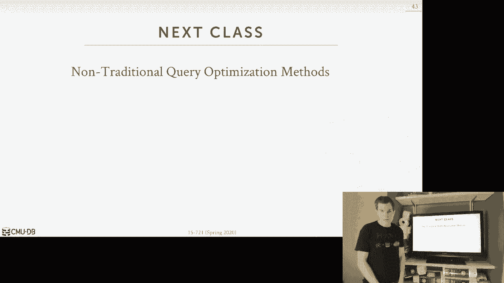
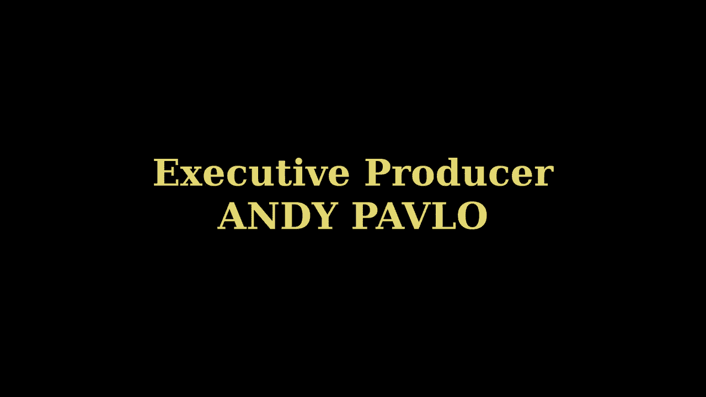

# 【双语字幕+资料下载】CMU 15-721 ｜ 数据库系统进阶(2020·完整版) - P20：L20- 查询优化器实现 2 - ShowMeAI - BV1wv411w7Ko

[Applause]，[Music]。

[Applause]，[Music]，today is our second lecture on query，optimization so again the high-level。

idea or what we're trying to do here，today is give it a sequel query we want。

to generate a physical execution plan，for that query that is both correct。

meaning it will generate the correct，answer we'd expect as well as has the。

lowest cost of all the query plans that，we we could examine the again we said。

last class that this is super hard to do，because the the problem trying to find a。

query plan is proven to be np-complete，and therefore even though the name of。

what we're trying to do is called the，optimizer we're not really ever gonna be。

gonna try to find in most cases form，useful complex queries the true optimal。

plan so we last class we looked over a，bunch of different approaches to doing。

this search we first talked up talked，about how to take use heuristics where。

you just have these if-then-else，statements that are bacon the source。

code looking for certain query patterns，and applying changes to to the query。

plan to put into a different form then，we talked about how to do a combination。

of the heuristics from the first，approach as well as a cost based search。

approach that came from the system or，from IBM that allows us to find a。

optimal joint ordering and the key idea，here what makes the cost model base one。

different here is that the cost model is，guiding our search it's a way for us to。

approximate the cost of a query plan and，then use that approximation to compare。

one plan versus another we then talked，about how to do a randomized search with。

simulated nailing or the gener algorithm，from Postgres and as far as I know again。

Postgres is the only one using this，third choice here，but they only use it for queries that。

are have more than 13 tables otherwise，by default you get the second approach。

and then now we talked about，the movement in late 1980s early 1990s。

towards these optimizer generators where，instead of having imperative code we。

didn't see or C++ to do all these steps，for the query plan lien instead write a。

our optimizer rules in a high-level，language than have a compiler generate。

the optimizer for us so Starbucks was，sort of the first one in this space from。

IBM and it was using a stratified search，which which is like this the heuristics。

plus the cost base joint search and then，the unified search is doing the sort of。

the logical and logical logical，illogical physical transformations。

all in one and this is what was used in，Cascades for the paper you guys read so。

again just to reiterate in the last two，points just repeating myself the。

stratified search is where we're gonna，have these rules to do that the logical。

quad plan transformations and the the，idea of way this is going to work is。

again there isn't like there isn't just，a list of rules where we apply them one。

after another there's this rule engine，for us that it's gonna look at the query。

plan figure out sort of patterns that，would match what what is what rules we。

have to find and then fire them off to，to make make our change but again in。

this first step it's entirely done，without any without consulting a cost。

model cuz there is no cost model then，after this we do the same cost based。

search to map the logical plan to the，physical plan and again that was the IBM。

technique but you know if I'd search，again the idea here is that rather than。

having these two separate stages you，just have a single single search process。

or a single search procedure that can do，both the logical to logical and logical。

physical transformations so no longer do，you need the separate stages because。

you're just doing everything all at once，right so the and what we'll see when we。

talk about cascades is that the this，approach is going to generate a lot of。

redundant transformations，because again like in the stratified。

search once I get past that first stage，I'm never gonna reconsider those rules。

again but in the unified search it's all，combined together so you may be trying。

to evaluate the same rule over and over，again and so you'd have to use。

memorization to to identify that you're，doing redundant computation or add。

redundant transformation and use a cache，cache result rather than applying it。

again again what we'll cover this in，more detail about when we talk Cascades。

the in addition to whether you want a，unified versus stratified another。

another sort of design decision you have，to make in your query optimizer is。

whether you want to do a top top-down or，bottom-up optimization so top-down will。

be Cascades and that's where you start，with a final outcome that you want okay。

I want to join these three tables，together and then you Traverse down into。

a search tree and start adding in the，operators the physical operators or。

logical operators you need to get to，that end goal and you can use the。

classic branch about pruning technique，to recognize that if there's a branch。

that has a the current cost is greater，than the lowest cost you've seen from it。

from the current off-the-book current，best plan you know you don't need to。

burst down into it the the dynamic，programming technique these fall from。

the system are is an example of a，bottom-up optimization where you start。

with nothing at the bottom and you start，it early adding in the components or the。

operators that you need for the query，plan to get to that end goal right again。

this is this is the dynamic web eutectic，so the current literature suggests that。

the dynamic programming bottom-up，optimization is better we'll talk a。

little bit about today why that's the，case the in my opinion from a software。

engineering standpoint I feel that I'm，able to reason about the unified。

approach and the top-down approach，better and this is what we implemented，in our system。

again there's like the research，literature and then there's what，actually gets implemented in real。

systems so you will see for the paper in，to next week or two weeks when I order。

yeah next week next Wednesday that，sequel server actually has the best。

query optimizer and they're using a，top-down Cascades approach but the。

literature shows that the dynamic，reading bottom one bottom-up one is。

better because again there's a lot more，going on than just you know whether，you're going in。

i these directions the，cost model matters a lot how you，collecting that the cardinality。

estimations all that will contribute to，the overall efficacy and quality of the。

query plan so generate and not just what，algorithm using it alright so for。

today's agenda I want to spend some time，beginning talk about how we're gonna do。

logical query optimization again these，the things we'll talk about here are。

applicable to whether you're doing a，stratified or unified search then we'll。

spend time talking about what the，Cascades how the Cascades optimize it。

looks like and we'll do this in the，context as described in the paper ahead。

you guys read which say master's thesis，from the late nineteen eighty nineteen。

90s on a query optimizer based on，cascade called Columbia the reason why I。

had you read that paper instead of the，original Cascades papers because the。

original cascades paper is not very good，it doesn't really describe what they're。

actually doing they keep banging on，about how great it was that their。

object-oriented because that was in，vogue and in the early 1990s whereas。

those thirty pages from that columbia，master's thesis，lays out in my opinion the best。

description of how cascades actually，works and how its implemented well。

briefly talk about why some things that，dynamic programming can do that maybe。

Cask use Cascades can't do very easily，at least in the moderate implementation。

as you've i've got the hyper guys in，germany then we'll talk about a bunch of。

other sort of optimizer implementations，that are out there again these are be。

categorized as whether they're doing，dynamic programming or Cascades。

but again I just want it should be we，want you to be aware of what's out there。

and then we'll finish up with a quick，overview of what's expected starting on。

Wednesday this week for your project，three code review submissions so。

and we'll do two rounds of Coast，missions equip of use so I'll sign you。

to another group on Wednesday you sweep，your code on github doto code review of。

your code and you do a code review of，their code so I want to talk about what。

sort of expected for you as a student，participating in this project for the。

stuff yeah all right so again there's，going to be two types of optimizations。

that we can do there's the logical，optimization and and physical。

optimization logical optimization are，changes or transformations that we could。

apply to the logical query plan that we，get from the binder right or a further。

up in our in our front-end stack that we，can apply rules based on matching。

patterns or certain yeah certain，patterns that we would see in the。

logical query plan and we can make，changes to the query plan in such a way。

that we can potentially set ourselves up，so that when we do the plan enumeration。

in the the physical query optimization，step that we can potentially find a the。

album plan more easily so it's not，always gonna be the case that the。

changes will make here will be guarantee，that we'll be able to find alcone plan。

but if we know a little bit about how，our optimizer works we know a little bit。

what our you know our plan a new version，album actually is then we can apply。

these changes in such a way that we can，prepare ourselves I'm quoting right so。

the important thing I'm saying about，this step how we're gonna stage this。

between the the when we do physical，query optimization is that again because。

there's no cost model we have no way to，determine whether one query plan is。

better than another so we don't know，whether we take a collage achill query。

plan then transform it to another，logical query plan the the optimizer。

that stage can't say oh yes that，transformation was a good thing it's。

gonna make a it's gonna help me generate，a query plan with a lower cost we don't。

know that but we know systems since we，know some aspects about you know。

relational databases or the kana davises，we're trying to run and what our query。

looks like and how our system actually，performs we can then maybe direct our，transformations so。

we prefer you know one plan over another，okay but the end of the day the。

important thing is that the the original，plan or the new plan we generate after。

these transformations has to be，equivalent to the original plan because。

it doesn't help us that yes we found out，faster query if we produce the incorrect。

result because people will get tests and，now your database system is considered。

unreliable or there's something wrong，with the data like it's harder to debug。

that so we want to make sure that any，changes we make be ensure that that。

query is equivalent so I want to go，through four different examples of the。

types of logical query optimizations we，can do and this actually comes from Tom。

Thomas Norman the hyper guy in Germany，he actually teaches a whole class on。

coordination and he goes to much more，detail over multiple lectures than what。

I can do in just four lectures but some，of these examples are coming come from。

from from his slides so we'll see how we，can do splits on conductor predicates。

predicates push down replacing Cartesian，products with joins because again at the。

very beginning all we have are Cartesian，products and then we can finish up with。

during projection push down so for each，of these we're gonna use that same。

example clear we have from last class，where we want to do a three-way join。

between artist appears an album good to，go find all the artists that appeared on。

my on my remix tape so a very beginning，what we're gonna get out of the binder。

which is essentially just a copy of what，comes out of the the sequel parser is。

all our predicates are going to be，combined together into a single filter。

clause so we have three predicate，expressions in our where clause so we。

would have a single filter expression in，our query plan again there's a logical。

query plan it's not telling us how we，want to execute anything we said we。

think the single filter up here that has，all three predicates combined to each。

other and we do that filter after we've，taken the Cartesian product of all of。

the three tables so in order to make it，easier for us to then start doing。

predicate push down on other，optimizations on these individual，predicate expressions we want to。

decompose the filter into，multiple filters that each have one one。

conjunction of the of the where clause，so we just split it on the end and we。

get it like this four ORS it's a little，bit tricky you can essentially start。

duplicating the ORS if you have，different conjunctions knots or。

negations or a little bit tricky as well，but a little about the high-level idea。

is essentially the same alright so now，that we have these these these filters。

like this we can start moving them in，different ways we can start moving them。

to separately into different parts of，the query plan so this is how the。

classic predicate pushdown is going to，work and the idea here is then we can we。

can move the the predicate that we have，to be after the Cartesian product or at。

the lowest point we can in the query，plan where we have all the information。

we need or all the attributes that we，need for the filter at some point in the。

tree all right so in this case here，after we do the Cartesian product we can。

then apply artists ID equals appears，through our decidd，but we can't do it before on either side。

because we don't have those two combine，tuples the two tuples together same。

thing for this one up here but in this，case for album name equals Andes remix。

we can put that immediately after the，scan on the album table because we have。

all the information that we need so now，now we want to replace all the Cartesian。

products that we have on a query plan，with with inner joins and this is pretty。

simple right this is just identifying，that oh we have a Cartesian product。

right above it we have a filter that，takes the output of the Cartesian。

product from the table on the left and，table on the right and combine them。

together or you know do our quality，match so we can just replace those。

Cartesian products were here and here，with a within the join operator when。

with the join up or specify where the，join clause is you know is that filter。

that you should be right above it and we，can do this regardless of whether the。

we're using the old old-style sequel，where the join is actually in the where。

clause or some of the more modern sequel，syntax where you have the the join one。

clause right this is the same idea works，in either one then the last optimization。

we can apply is to do a projection post，push down so in in this case here you。

know the beam we're being pedantic here，about the you know whatever query plan。

is going to look like in a column store，you could you could implicitly assume。

somehow that I'm not scanning the entire，tuple name in the scanning just two。

columns that I need but you still need，some information say what actually those。

columns you actually need to propagate，up into the query plan so in this case。

here we can recognize which attributes，we actually need at different levels in。

the tree and we introduced projection，projection operators to then only。

propagate up the just the actions we，need at each step and so the way you。

think about this is implicitly there's，pipeline breakers here here and I guess。

up above here but like at the pipeline，breaker we would introduce a introduce。

the the projection and that make sure we，only propagate the data actually need。

and the reason why we don't wanna do，this all different parts because at the。

pipeline if you're doing a push up，approach like in case of hyper is you。

you were going to take a single tuple，and write it up as many as far as you。

can up in the query plan and only，materialize it when you get to the。

pipeline breaker other systems are doing，volcano are going top-down and that and。

that the boundaries aren't aren't aren't，again sort of saying here like in this。

case here we only need album name and，the album ID so we could have a。

projection here just to filter out on my，D now name but again what will happen is。

this filter action will get combined，here with whatever this this access。

method here however accessing the tuple，so again we're not we don't have。

projections everywhere we could write，but because so now is gonna be，again these are all logical。

optimizations again I didn't look at a，cost model I just said I know I want to。

do things and I can bake the，transformation rules in my optimizer to。

do this right like this one's the most，obvious one if I have a Cartesian。

product and I have a filter that has a，joined clause right above it then I can。

easily just write a rule that combines，that and I don't need to consult a cost。

model cuz I know in my data is a inner，joins always going to be preferable to a。

Cartesian product you must never really，you never want to exit Cartesian。

products unless you're explicitly told，to do across join alright so now let's。

talk about how to do physical free，optimization so this is where now we。

have a logical query plan we have these，logical operators and we want to。

transform them into physical operators，that we can then either koujun if we're。

doing compilation or to actually execute，on in our execution engine so what are。

the kind of transformations we're going，to want to do the most obvious ones are。

gonna be things like specifying how，we're actually going to access the table。

or the data and that we're targeting but，I'm gonna use a sequential scan but we。

need an index scan if it's so on index，scan then which index we're going to。

pick we can add additional execution，information about how we expect the the。

data and be represented or sorted or，compressed choose operator invitations。

for the joins like we're joint album we，want to use how we actually do our。

aggregation and then in some cases also，to which we won't talk about today is。

identifying when you actually want to，materialize potentially the the data for。

one portion of the query so that another，portion you know another part of the。

query plan could actually access it I，can be doing this sub query or views or。

cities so in this stage here we now need，to make sure that we or we now have to。

support cost model estimates because now，we want to be able to determine is one。

physical plan going to be better than，another and the cost model is going to。

allow us to do this so before we go a，little bit deeper into into Cascades I。

want to talk about and how we're，actually going to do these，the physical transformations we wanted。

somebody have a caveat and say that，everything we've talked about so far has。

been sort of the simple case of always，doing Ecuadorians or inner inner inner。

inner joins things now though become，more tricky when you start having you。

know as you see more realistic queries，outer joins semi joints or Angie joins。

because now we're not always going to be，able to makes have symmetrical。

transformations to allow us to move any，operation around you know the or reorder。

our query plan easily because there may，be some cases where you you you're not。

actually allowed to do that because that，would end up with an incorrect query or。

an incorrect result so let's say for，example here so say again I'm doing now。

I'm doing a three-way join on a B and C，but I'm gonna do a left outer join on a。

and B and then do a full outer join on C，so what we're getting into now is how we。

actually explore the different join，orderings that are available to us in a。

query plan so we can decide whether you，wanna join B and C first or a and C。

first and so forth as we saw and with，system R but in this particular example。

there's actually no joint orderings that，that are actually available to us are。

possible because that would end up with，incorrect state and this is because we。

have these outer joins，so in particular the outer join on a and，B the left outer join a and B is not。

commutative without the outer join the，four outer join and B and C because I。

don't know what the value coming out of，this joint for B will be for V dot Val。

in order to join it with C so I have to，execute this first because they don't。

know whether it's gonna be a real value，or null right because there's the left。

outer join if is a de ID doesn't match，anything with be de ID then the portion。

of B in the combined tuple will just be，null and B dot val could be null here。

but I don't know that until I actually，do this join so you need a way when we。

start doing these join reorderings of，the planet abrasions a look at the，different possible。

choices to be mindful that there are，some cases where I can't do the。

reordering and I'm is bringing this up，now because I'm going to show examples。

where we assume that you everything's，commutative you assume that everything。

could be flipped around but just in the，back of your mind be recognized that oh。

there is an additional mechanism we need，to make sure that we don't reorder。

things incorrectly the dynamic，programming is a little bit easier to do。

this because you're having explicit，explicit graphs that you know you can。

can can can move things around in the，case of Cascades the best my knowledge。

you need to have additional property，enforcers to recognize that this this。

reordering is invalid so the way we're，going to enumerate different plans at a。

high level of there's two different，approaches this is the transformation。

approach where you take an existing plan，and you start permuting it in different。

ways to generate new plans that are，equivalent to each other you should have。

to check to say make sure that you check，to make sure that the transformation。

doing is valid and it's almost sort of，like a random walk except that you have。

these rules to apply them and change，things and in sort of a directed way the。

another approach is as was used in the，genetic program approach where you are。

doing generative enumeration where you，start you take the parts of the query。

that you want to execute it as building，blocks and you start graphing them alone。

and constructing the query plan and can，be mindful that you don't want to add。

things incorrectly to produce an invalid，query plan but you sort of start with。

nothing and start adding adding things，so not saying one way is better than。

another but these are just sort of at a，high level the two approaches we could。

pursue so the state of the art for this，for academically for doing dynamic。

programming is the method used in hyper，hypergraph generation where you start。

with you know it's the general approach，where you start adding building blocks。

of the query one by one and you're，checking as you go along whether the。

change you want to make by adding a，piece in is valid or not so this is the。

approach that's using hyper this is，approach that you used in duck TB I。

don't know of any commercial system that，uses this approach the hyper guys might。

might know but I don't know the answer，for this we in our system though we were。

based on Cascades so I'm going to spend，more time talking about that so as I。

said there is an original cascade paper，from 1995 but I didn't have you guys。

read it because like I said I don't，think it's very good it's not that it's。

not well written in terms of like，English grammar，I just don't think as from from a。

pedagogical standpoint for this course，it provides a clear explanation on what。

Cascades is actually doing so that's why，I had you guys read the the master's。

thesis because I might get my opinion，that's the best explanation of Cascades。

so what is Cascades well last class we，talked about volcano and that was a。

top-down approach for doing a branch of，mountain search of adding adding。

constructing a query plan Cascades is，the sort of third generation optimizer。

that grits gravity had built and there's，a sort of again this this this。

state-of-the-art approach that we sent，from what I'm aware of and so the big。

difference we're gonna do here in，Cascades that we didn't do in volcano is。

that we're gonna the the optimizer is，going to generate the transformations on。

the fly as it needs them rather than，pre-computing all possible，transformations at every level we go。

into as we're searching into the query，plan right so in the case of volcano。

what happened is when I went from one，group to the next one down one level in。

the tree before I did any evaluation of，the possible transformations I could。

have each transformation I could apply I，generated all possible transformations。

which will explode the search base right，and maybe the case that maybe got stuck。

in a local minimum and didn't explore，the the the rest of the tree more。

carefully right so the other cool thing，that we're gonna be able to do in。

cascades is that we're gonna be able to，do a simple rewriting of a multi。

questions or expressions within the，query plan but is having these function。

and be able to apply them without having，to do an exhaustive search for all。

possible combinations of how to execute，that multi expression that make more。

sense and if you want a few more slides，the basic idea here is like I could have。

a placeholder to say here's some lower，portion of the tree I don't know how I'm。

gonna actually implement it just yet but，I don't need to search it just now I can。

search other aspects of the tree and use，that place order okay all right。

so for Cascades the sort of the four，main design ideas that person uses that。

first is that all the all the，optimizations are going to be the simple。

pair data structures when you contain，the pattern that you want to match in。

your query plan and then if it matches，there's a rule to fire to do some kind。

of transformation and they contrast this，with like the heuristic based approach。

using Postgres use in other systems we，have a bunch of if-then-else statements。

it's always these rules and you know，there's a rule and then then there's the。

then there's the okay there's the，pattern and then there's a rule that。

does the transformation and I can do，this from a logical the logical logical。

and logical physical it's all the same，the next thing is that gonna have rules。

to to enforce the property requirements，you would have on data or if they're the。

enemy results produced but give an，operator and these are the things like。

the the sorting order care about，compression and other things like that。

like we can afford those things and then，the rule engine knows that it can apply。

the transformation if the transformation，would end up violating the rule that it。

has to be has to be has to maintain and，contrast this with the system our，approach where I said。

that the rules to do the enumeration or，the search of the joint ordering it had。

no notion of these physical properties，of the data it all had to be baked into。

the cost model but now again in one，place I can define my rule that says my。

data has to be sorted this way and make，sure that you don't do a transformation。

that violates that the next thing is，that we can then now also define the。

priority or the ordering of the rules，that we get applied based on these。

promises so the way to think about this，is that rather than just randomly。

picking what transfer transformation we，want to apply at a given level in our。

tree we can specify an or and we'd even，get actually the dynamically so that we。

can identify aspects of our query plan，and say we think these transformations。

will lead us to the optimum plan more，quickly so apply these transformations。

first and only evaluate the other ones，if we have more time and want to。

continue searching at that level in the，tree and the last one that's important。

is that they're going to treat the，predicates as first-class entities in。

the system that's going to allow us to，do transformations on them just as we。

would do for operators and this is how，we're gonna do all the things that I。

showed in beginning like the predicate，push down projection push down and。

things like that because a predicate，push an example because those again even。

though they're like predicates inside，the where clause that would normally be。

baked inside of like a select statement，or sorry scan operator we can have our。

the engine do transformations on them，and do other optimizations just as it。

would with the physical in logical，operators and this is actually something。

we're trying to build now in our own，system we had a project in 7：21 last。

year where they built a expression，rewriter using our cascades engine and。

the student that's worked on that last，year is now working on it this year。

again to help finish porting it into the，new system so we won't talk about this。

today but this is allowed to do certain，things like if I have a where clause。

that says where 1 equals 1 we can，rewrite that into，just to be true and instead of having to。

evaluate the query tree and it's a tidy，for every single tuple now we compile。

with LLVM so the Alabama compiler can，easily wipe that away by doing constant。

folding but the these are the kind of，things we can do now though inside the。

same cascades framework that we normally，would use for optimizing query trees all。

right so the first thing we got to talk，about to understand Cascades is what an。

expression is so this parts a bit，confusing because normally I've been。

talking about expressions in terms of，the the predicates that are in where。

clauses or join clauses or select，outputs and certainly in the in the code。

of our system we use expressions to mean，there's no expression treated like one。

equals one and things like that but in，cascade they're gonna declare an。

expression to be a high-level opera，operation or operator in our system or。

in the query plan that's gonna have zero，or more or input expressions to it so。

say I have my query here a select star，from a join a B and C together like I。

have a logical expression that would be，the join on a and B followed by the join。

on C and then I could have a physical，expression that would be the scruncher。

scan on a during a hash join on the，sequential scan on b and then doing an s。

a loop join on a index scan on on c so，it's an expression would be some some。

essentially the relational algebra，components for the query but if i。

annotate them with these of these，subscripts i'm specifying what the。

physical operator i want to use to，perform that before that relational。

operator okay right so in this example，here these two expressions are logically。

equivalent okay so even though this is a，specifying that the physical operator is。

and this is just a logical operators，logically they're equivalent。

they're both computing the join on a b，and c and so now we're going to be able。

to rely on this community property，to enumerate all the different jointer。

rings as part of transformations to do，exploration of the the search base with。

this query plan and try to find a you，know find the optimal one and this is。

what I was saying before when we talked，about left out of dueling 400 or an。

example so in these case I can move，these movies operators down anyway one。

because they're commutative but if I one，of these was doing a left outer join or。

for doing then I would have to restrict，the transformation to make sure that I。

do things in the correct order but for，simplicity in our example here we won't。

worry about that all right so now now we，have we have expressions and that's。

gonna be some sequence or some，relational algebra expression now we're。

going to define groups so group is gonna，be the set of logically equivalent。

logical and physical expressions for one，expression that that will produce in the。

same output expression right so all，logical forms it's especially for a。

given expression will have all logical，forms and it will have all physical。

expressions that we can derive by，converting any logical operator into the。

allowable physical operators from the，corresponding logical forms so what I。

mean with this so this entire unit here，is a group and this group represents the。

output expression of a join be join seat，and then now we have the logical and。

physical expressions that are all gonna，be equivalent to this output expression。

here alright so the contents of the，group are going to find based on on its。

output and so I can't have a another，group with the same output right it has。

me unique to to do Mike my query plan，right so I was important to note that。

these expressions in here are unordered，illustration of what's being contained，inside them。

but just because this one's first，doesn't mean anything about whether we。

should examine this one first that's，implied or that sort of computed as part。

of the priorities you would get，your transformation the other important。

thing they also point to is as I was，saying in the case of volcano for this。

output expression they have to generate，all possible all possible permutations。

of a lot of expressions and feature，those all possible permutations the。

filter expressions in Cascades these are，sort of like you know these are sort of。

computed on demand or just in time so，that I don't have to materialize every。

possible logical expression in feature，those every possible physical expression。

I can say I can apply my transformation，rule and it'll generate some equipment。

logical expressions and I can determine，whether I even explode them further and。

look at their physical expressions，alright so this you know this is so this。

what I'm saying the in the case of，volcano since they were doing it all at。

once the amount of state you had a，represent here it got really large and。

so the on demand thing is is is the way，we're gonna sort of speed this way to。

reduce that state but another，optimization we can do in Cascades is to。

use what are called multi expressions，and the idea here is that instead of。

instead of instantiating exactly the，verbose form of all possible expressions。

for a given group we can instead，represent the sum sub expression with an。

expression as a placeholder that is then，represented by or taken care of by some。

group lower in the query plan and so the，they the set of redundant expressions。

represented by these placeholders in a，group together is called as a called a。

multi expression right so in this case，here before I was saying a join B join C。

and have it's explicitly saying hey I'm，joining a a and B but now in the multi。

expression I just have a placeholder，here that says hey it was a and B。

they're being combined together I don't，know how somebody else below me the。

query plan will tell you how to do this，but I know that I just have a。

placeholder here and the same thing for，in this case here I have a scan on C I'm。

not saying how to actually scan it，whereas，here I was explicitly saying you know。

here that one news twins can I don't say，anything for that right so makes more。

sense when you look at the physical ones，or the physical ones a mutton。

I'm not specifying how I'm doing joining，a and B or how I'm actually accessing C。

but I am specifying that I have a，physical join operator that's doing a。

cert mode here right and so the idea，here the reason why we're doing this is。

that in a top-down search strategy like，in Cascades we can then make the sames。

about whether you want to traverse lower，down into the tree to understand how we。

actually want to join these things，together right without explicitly blunt。

blowing it all out in the the bottom-up，optimizer they're going to enumerate all。

the most expressions sort of from one，group at a time and the order of the。

tables that they're generated so they'll，start with a figure out how to maybe。

access that and then figure out access，beam to figure out X se and then figure，go for it。

so it's sort of a different way of，looking at it so the before we can make。

decisions now we'll see in the next，slide or the next few slides before we。

make decisions about how you know how，we're actually gonna do you know for。

this physical operator here we have to，make sure that for all placeholder。

expressions we have below us in the tree，that we we figured out how we're。

actually going to access them what's the，best physical cost or best plan with the。

lowest cost for the physical operator，blue that in the tree and then we can。

combine that together when we make a，decision about which operator we want to。

do this for here again when we go，through the example this make more sense。

so the last thing we need to understand，in Cascades is the rule system so again。

a rule is gonna be some transformation，and we can apply to an expression that。

will convert it into a logically，equivalent expression meaning it will。

produce the same logical results and，when we actually execute it but so we'll。

have two types of rules we'll have a，transformation rule which is a logical。

logical logical operator to physical，operator or a logical plan to a plant or。

plant subset into another logical plan，subset，and they'll have an implementation rule。

that will convert a logical operator or，a set of logical operators to physical。

operators and as I said every rule is，defined by the pattern will match to。

identify which sub plan or find a a，portion of the plan that has a Civic。

layout a configuration that matches to，our rule and then if we find one of。

those then we apply the substitution，policy or the transformation that we。

want to convert the the query plan，structure into the logically logically。

equivalent change or logical equivalent，new plan so let's look an example here。

to say this is our pattern and our，pattern is we want to match a sub plan，that has a equi-join。

followed by another equi-join and then，we have these placeholder groups where。

we're just saying we don't actually care，or no we don't need to know and we don't。

care what these other groups are，actually doing we just care about having。

sort of lefty tree where you have a go，join fall behind an equijoin so now say。

this is a query that will match this so，again I have now a group here that's。

combining a and B and joining us C then，I have another here another group here。

that's doing joined between a and B so，these are both equi-join assuming that。

you know you're doing a natural join and，then below that below each join operator。

I have these get expressions but this is，somehow saying right here's how I'm。

going to access the tables a B and C but，we don't care what that actually is in。

our rule because we only care about，having these two matching joins like。

that so the first type of join we do is，a transformation rule the first change。

we do is the transformation rule where，we want to rotate the the joins to go。

left to right so in this case here we're，going to switch the the the the join。

below the joint at the top to now be on，the right side of the tree。

whereas originally started off in the on，the left side a implementation rule。

would actually now be converting the，logical operators for these joins into。

now a physical operator specifies what，algorithm how，or I want to use so in this case here we。

can convert these to be the joys of，useless or merge-join，so one thing with the mindful of in our。

system is that or in cascades is that，we're gonna make sure that we don't get。

stuck in infinite loops so in the same，way here that I have a transformation。

rule that allows me to go that rotate，the joins from left to right on another。

transformation rule that will convert it，from right to left so unless I'm careful。

I could just keep getting stuck in if，the loop going left to right right left。

and back fourth over never again so we，need a way to recognize that we've。

already applied a transformation and，therefore we don't need to do it again。

and possibly search what the query plan，looks like every we apply it so this is。

what the memo table with a memorization，table in Cascades is going to do for us。

so in the original Cascades paper I，think they use they talked about using a。

graph data structure in our application，we use a hash table as far as they know。

in the other open source Cascades，invitations they're also using a hash。

table so what if acknowledged to do is，we can identify that we've you can。

identify that we can have a group that，we visited before and therefore we don't。

need to examine it again because we，already know what the query plan looks。

like after we apply of that，transformation so that's good so if we。

do that left to right if we try to try，to apply the transformation rule to go。

back right the left we would say well we，already know what that looks like we've。

already been there and we see that cost，in our in our in our memo table。

therefore we don't need to apply it so，well how we're gonna do this is that。

we're going to have equivalent operator，trees and their corresponding groups。

store together or together into groups，and we store them in in the memo table。

and we need a way to quickly hash and in，a fighh that we have we have duplicates。

all right so what this memo tables can，do for us is it's going to in addition。

to be able to avoid duplications and，duplicate query plan transformations we。

can also use that to be identify quickly，that we've gone down now it's some part，of the query plan。

and we don't need you traverse it any，further so this is tied to now this idea。

of the principle of optimality that，cascades this could be based on and this。

is from control theory this is for this，the Bellman's principle of optimality。

and this is not specific to kept the，Cascades top-down search but this is。

this is how we're gonna be able to you，converge on finally finding an optimal。

query plan so all it really says is that，if I if I have an optimal query plan and。

surprise of two groups then I know there，can't be another optimal physical plan。

that for one of those groups because if，there was then I wouldn't be the optimal。

plan it's almost like a tautology look，if I know that I know that this is the。

best plan I've ever seen and I have a，best plan I've ever seen and I'm at some。

point in the my search tree and now I，have a cost that's greater than the best。

one I've ever seen but that if I，Traverse down into further down in my。

query plan tree I'm not gonna magically，find the optimal plan that's me better。

than the best one I've ever seen because，then because the way the search works is。

that you're you're adding more in cost，as you go down and your automagically。

going to get less than what you seen，before so this is just the branch and。

balanced search method for solution tree，this is just saying that like we know。

that if we get to a point in a query，plan that we have a sub plan that is。

worse than the best movie ever seen we，don't we don't need to do any further。

exploration on it okay so let's look at，now a full and an example of doing a。

search so to say we want to do that，3-way join between a B and C and so at。

the very beginning I have that this，group up here that says the output。

expression should be a B and C so the，first step I need to do is fire off a。

transformation rule that will generate，me a logical mult expression so here we。

have now a and B combined together and，then we're joining joining C。

so now what I want to do is Traverse，down into the tree and figure out what's。

the cost of executing of you know these，two components of my my expression。

so I'll start down here I'll take a and，B so again now I have a new group with。

output it's is a and B because that，matches what my place hold or up here is。

and same thing now I want to have a，logical transformation or logic。

expression to represent what how to，compute this output so that's just now。

somehow accessing a and I'm gonna join，that with somehow some way of accessing。

B so now same thing I got to start with，this first this first component of my。

expression and go down and examine how，I'm actually gonna access it so my。

logical operator would just be get get a，I'm gonna access a hey they're not。

saying actually how to do it so I can，have a logical to physical。

transformation to then say oh I can do，an index scan on a or I can do a。

sequential scan or name and then now at，this point here we have these physical。

expressions because nobody below us in，the query plan tree so we can compute。

the cost of what's going to take to Xu，both of these so let's say in this case。

here the sequential scan for whatever，reason is is the cheapest way to execute。

this this the access method on a so，we're going to compute the calls for。

this and then we update our memo table，it's cut off here but this is just a to。

say that the best expression we've ever，seen for the producing the output of。

just a is the sequential scan on a with，the cost of 10 so now I can't even do。

the same thing going the other side take，be I end up with this logical expression。

be get B I compute all the different，physical expressions I could possibly。

have sequential scan index scan the，sequential scan turns out to be cheap，the cheapest the cost 20。

I upload 8 my memo table say to access，be sequential scan is the fastest with。

the cost of 20 but now I come back up，here and I can up into that convinced。

coop here and if they still start，computing more logic expressions for our。

generating more logical specialists，pretty this produces output for me so。

now I want to join be an egg because I，did that rotation，right the order it's a now same thing I。

need to get the cost of accessing B and，then I get the cost of accessing a。

before I compute the physical cost of，converting this to a physical physical。

operator so but in this case here when I，go down and say what's the cost of。

accessing B or what's the cost of，accessing a I've actually already done。

this right I don't need to do that，because I already have the best cost in。

my memo table so I don't need to do this，search again down here or plyo more。

transformations I'm done and I just，reuse the cost that I've had here so I。

can I could keep doing this like it's，only a joint B or B joint a there's only。

two choices but now I can look at all，possible combinations of what physical。

operator I want to use for computing the，join and here I'm only showing a subset。

but now again if I want to get this，physical cost and you know that the cost。

of accessing any of the code calls，exiting B but I already have that in my。

physical plan right so the cost to save，this one here to do in the SERP。

merge-join it's the cost of accessing a，which is 10 the cost of X is in B which。

is 20 and the cost of the server is，joined assume is 50 and now I can write。

that into my memo table to say the cost，of doing this is 80 so now here I come。

back up to my according to this group，here and now I didn't need to examine。

the other side access some C so same，thing jump down here I can gather do a。

sequential scan or indexed and let's say，for whatever reason index scan is faster。

so I record that cost to here being 5，and then now I just can I could do more。

permutations of different joint，orderings of a B and C or I can start。

examining be converting a lot of，expressions into physical physical。

operators and examining what are the，different ways to access to do the。

actual join and then I can pick one，different has the lower cost based on。

the summation of what I've done below me，in the query planet all right so that's。

essentially how Cascades works right at，a high level like we just keep doing，more more permutations。

use the memory table as much as possible，but then we invoke the cost model。

when we have enough to do a estimation，on the physical cost and now makes more。

sense what we talked about last time at，the search termination you could see how。

for really complex curves a lot of joins，I could heat going really deep into my。

query plan and I just keep doing this，search forever so you need a way to。

determine when should you stop and we，talked about how the wall clock time。

just says I stop when I run out of time，right for a certain amount you know some。

configurable amount I could have a cost，threshold to say like if I if I find a。

look if I haven't found a lower cost I，haven't found a better plan that has。

been 10% better than the best one I've，seen so far then I just should just stop。

because I'm I'm sort of getting，diminishing returns on continuing the。

search and then you know the last one to，be if I because also they search all。

different options then I didn't stop so，cascades is as I said as far as I know I。

don't think there ever was a standalone，cascade to implementation least I don't。

think so I think that grid graph II，worked with Microsoft in the nineties。

the emblem that cascades in single，server and it's best my knowledge there。

they're still based on that but it's，been using a bunch of different bunch of。

different systems as well most database，systems as far as I know are using the。

dynamic programming technique method but，some of the newer ones in the last 20。

years or so or using some of them are，using cascades so Wisconsin ah plus plus。

was like Columbia where sort of，standalone optimizer generator that。

would you know you define the rules and，we compute the or generate the cost。

model or generate the optimizer for you，pivotal Orica and calcite are actually。

two interesting projects we'll talk，about in a second but think of these as。

standalone services that do query，optimization so you can have like your。

database system running one machine your，query optimization service running on，the machine。

and you send query requests over to the，optimizer service it crunches on them。

and then spit you back a hospital plan，that you then execute and so these again。

these are not these are not tied to any，specific database system。

the ones that are actually integrated，the system against Eagle server is。

pretty famous non-stop sequel is a，distributed database or parallel，database from the early nineteen。

nineteen eighties that's still widely，used today in a lot of banks and。

financial systems and so they rewrote，the choreographer in the 1990s cluster。

expose a or is this to exist is a，distributed version of my sequel that。

was blocked by the Morea DB people it's，two years ago now and according their。

documentation they use the Cascades，optimizer to replace the original my。

sequel optimizer and then our system，peloton which we started in 2000 we。

killed it off two years ago but since，then 7：21 students have ported it over。

into the newer system that you guys are，working on today so and as open-source。

alright let's talk about pivotal Orca，and calcite because I think those are。

like I said these are standalone，optimizer systems that are not tied to。

any one database system we did examine，Orca in the very beginning days of。

peloton decide whether we wanted to use，it they didn't have a look at that。

locked imputation and the way it worked，was you would run the service and yet a。

sent over these XML files that a，specified like the query plan and the。

rules and and the catalog statistics，about what the data looks like but I。

guess I wasn't very documented it's，gotten much better since than less when。

we looked at it at the time it was it，was not initiate where we could I can。

use it so Orca is a key annular cascades，implementation that was originally。

written for green plum green plum was，one of the original data warehouse。

systems from the mid-2000s that came out，with Vertica and data Allegro and Astra。

data and so what happened was EMC bought，green plum and then VMware bought gem。

fire single fire and EMC didn't wanna，have a database division VMware I didn't。

have database vision so they both，divested their database products combine。

them into a single company called called，pivotal so Orca was originally written，for green plum。

but then they broke it out and had to be，a stimulant system so they can then use。

it for their sequel engine on top of，Hadoop the Hadoop file system called。

Hawk so again it's agnostic what the，actual data model is or what the actual。

database system it is you specify，through these XML files what you you。

know what rules you have and how it，actually wants to how it should actually。

form the plans and then it's up for you，in your data system to take those XML。

files when you get the response of，here's the optimized plan and be able to。

execute it so the one interesting thing，about orca that we haven't talked about。

here is that because it's a standalone，service you can imagine like I have my。

cluster of database machines and then I，have one machines that's dedicated as。

the query optimizer machine so that，means that can that machine can use all。

the cores or all the resources that，available to it to do query optimization。

so they actually can do multi-threaded，search so how would that look well in。

either were doing dynamic programming or，the Cascades approach you could it's。

easy to imagine that there's different，points of the query tree where I could。

for call for spawn off different threads，to do exploration in them and there but。

they're all using the cost model at all，examining doing their own。

transformations you still have to maybe，update a global memo table to avoid。

redundant calculations or update here's，the best plan I've ever seen but in for。

the most part the search themselves is，very independent so they're one of the。

few optimizers that I know about that，can do that can that is multi-threaded。

which I think is kind of cool and，certainly our optimizers not thank our。

optimizer right now could run different，queries do optimizing different queries。

that when different threads but we can't，take one query and do the search on。

multiple threads so there's two，interesting engineering things that came。

out of the that are in the Oracle paper，that I find really fascinating that I。

haven't really seen discussed in other，descriptions of optimizers so the first。

is that in Orca they've set it up to，enable them to do remote debugging more，easily so greenplum。

is designed as on-premise software so，the cloud，like if your corporation you download。

the software that the green thumb，software in Orca and you run it on your。

own machines in your own data center so，now the problem is though if now the。

optimizer breaks or throws an error，there's a some problem with it。

how you how do you actually debug that，if you're now the Orca developers back。

and working in pivotal because they're，not gonna let you SSH into the Machine。

and you know rerun the the the query，that failed or you know get a dump of。

the data and run it locally because it's，gonna be way too big so what they did。

was they had it so that anytime that，there is an error the system would be a。

dump out its state in such a way that it，made it that allowed the developer to。

take that state dump load it back，locally and be able to walk through。

exactly what the state of the the system，was the optimizer was when that query。

had an error so that you can easily，reproduce the problem and and fix it so。

think of this as like a core dump for，your optimizer where it has additional。

information like what was you know what，were all the transformations that I。

applied what's in the memo table like，it's more than the quota dump it's sort。

of more it's more specific customized to，doing court optimization to make their。

life easier and again I have not seen，this maybe the commercial guys have this。

but I have not seen this talked about in，other other optimizers the other cool。

thing they do in Oracle which I find，super interesting is that they talk。

about how they have this testing，framework that allows them to easily。

check that the cost model and the，optimizer is truly picking the best。

query plan the one that has the lowest，cost so they had this thing called taco。

which is the testing the accuracy of the，source，I haven't maybe I'll find on on github I。

need to email them but the way it works，is that I think of things like I think I。

take my query I put into the optimizer，and then it'll spit out what I think is。

the best plan but I can also have it，spit out what it what was the worst plan。

and so now I can take the worst plan of，the best plan actually execute them on，actually true。

is that that the best one is actually，faster than the worst one now in that。

case you don't want to do you know，that's to extremes the worst one。

probably would be so slow that you don't，want to do it like it's a bunch of。

Cartesian products it'll take forever to，run that's obvious so you ought to sort。

of narrow the gap of what the worst plan，actually years or the the less optimum。

plan is how many steps away from that is，from the optimal plan like you take the。

best plan and the second-best plan run，them and improve that the best plan。

actually truly is the better plan this，is something we want to do in our own。

system we have the infrastructure and，the optimizer to potentially do this we。

just haven't built out the testing you，know the testing framework to make it。

happen so Orko is super cool Oracle was，one of the first standalone query。

optimizer frameworks least in the modern，area era the got + + + + Columbia around。

for the 90s but as far as I know in the，codes online but you know it's it's。

dated and nobody actually uses that I，might have not maintained whereas orc。

has actually maintained the other，optimizer framework that is actually。

more popular I think in Orca at least，when I'm talking from David's companies。

is this thing called calcite so again，this is another standalone code。

optimization framework that where you，can specify you know what what data。

model you want to use what crazy，language your support what the cost。

models are and all the transformation，you want to apply and again it just。

compiles them down and can do this all，all for you，so it originally came out of lucidi be。

lucid DB was a Java based database，system start up out of the late 2000s。

that failed as many different startups，actually fail there's a lot of them but。

what came out of the ashes of lucidi B，was the actual query optimizer which。

then got open sourced as Cal said if，everything's written in Java and there's。

a quite a number of database startup，projects open source and closed source。

that are interested in actually using，using Kaltura or we're actively using it。

or pursuing the adoption of it some，examples are would omnis I heard DB。

plays in sequel Apache hive spliced，machine and I know maybe two others that。

have talked about they they wanna start，using this now they all use it to do。

to different levels so this calcite also，provides you the sequel parser as well。

so some of them is using two parts equal，and calcite has the seven dialect some。

of them are using it to active you the，query optimization I have not seen。

reports on how good it actually is but I，think again this seems to be a lot of。

traction around this because this is，Apache project whereas Orca for whatever。

reason maybe because pivotal stone owns，it that uh as far as their know only。

pivotal Xin one using Orca even though，it's open source so I think for this one。

this one you'll see a lot more in，systems going forward at the last。

optimizer implication we'll talk about，is from them sequel it's not anything。

mind-blowing the reason I'm bringing it，up cuz they do one thing that's slightly。

different than the other optimizer we，talked about here and this is probably。

because they're targeting distributed a，distributed database system environment。

which we've not really focused on in in，the semester at all but it's just we're。

sort of brick worth bringing up to and，understand you know the types of things。

people can do in a query optimizer so，it's gonna have three stages it's like。

the stratified approach you'll have a，lot of rewriter that is Lodge alots with。

the transparent transformations but，these logical logical transformations。

actually can use a cost model then，they're doing the logical physical。

transformations and this is mostly going，to be a dynamic programming approach to。

do the join reordering but then now then，the last stage they're actually going to。

take the physical plan that you get out，of the numerator and then convert it。

back into sequel but they're gonna，annotate the sequel with some additional。

mem see ghosts of the commands for，moving data that in a way that sequel。

can actually specify goes against egos，high-level doesn't say where the textual。

data is but now we're gonna add commands，here to say like alright run this query。

but then send the data to this this this，particular machine and in your cluster。

so this parts is super interesting that，I've never really heard about in the。

from the optimizer standpoint of doing，this I've heard about this for testing。

where people take the physical plan，that's produced by their optimizer and。

then reverse it back into sequel and，see if you run that to be optimizer。

again does it generate the same planner，or logically equivalent plan but I've。

never heard of this where they convert，it back to sequel and then actually。

execute it and then parse it all over，again so this is this is their pipeline。

for the query optimizer and again it，looks a lot like me what we talked about。

so far you parse it you bind it and，there's the rewrite or enumeration phase。

but then you take the physical plan and，then this planner thing converts it to。

sequel and then you send it to all the，interval execution nodes who are then。

gonna do all these same steps all over，again except for this last one here。

because now the idea is that we want to，have each local node that has the data。

to make a decision about how to actually，do the lowest levels of putting。

optimization like accent method things，like that so the way to think about this。

is like say I want to do a join or say I，want to scan on a table across five。

nodes and on some nodes maybe the data，has certain different distribution。

that's different than other nodes so，rather than me and a global a global。

planner try to make a decision of what's，the best way to execute this query on。

all five nodes I'll come up with a high，level global plan of how we want to move。

data around in this first phase here and，then I send the sequel query that I've。

some regenerate back from the political，plan send that to the local node who。

then can now make a decision like oh now，I know since I have a more accurate view。

of what my data looks like because it's，local to me，I can make a better decision of how I。

want to exceed that plan on that node，again most distributed databases as far。

as I know don't do this last step they，take a physical plan and then ship that。

off to all individual nodes which I，think this is kind of interesting okay。

so just to finish up the main takeaway，you should get all out of all this that。

we looked at the dynamic programming，approach we look at the Cascades。

approach these are sort of begin to two，ways to to go out searching for a，physical plan the。

all of this though is gonna make me，highly dependent on having a good cost。

model if you don't have a good cost，model doesn't matter when you're doing。

top down and bottom up you're gonna make，bad decisions and you in their plans are。

just gonna be gonna be terrible and so，we will see next week on Wednesday next。

week does how bad these cost models，gonna actually get in particular we do。

cardinality estimations with joins and，so there's no magic way to make this。

work and so when I say sequel server has，the best query optimizer the research。

shows it actually picks the best plans，and that might be because they have the。

best cost model and cost best estimates，okay all right so let's quickly go。

through what's expected for you for the，project three code review so again as I。

said on on this Wednesday as part of the，project presentations or project updates。

every group is gonna have to send a pull，request to the master branch on on。

github so this will kick off a build and，Travis if that fails you can ignore it。

but I'll kick off a build on Jenkins and，that one we do need to pay attention to。

and also compete your code coverage so，for this one your PR needs to be able to。

cleanly merge in the master branch that，means you want to do a rebase get all。

our latest changes depending on when you，guys fork the code from us this。

shouldn't mean that many changes and so，what will happen is you'll go to the，Google spreadsheet。

I'll now non toast Piazza you put the，link to your pull request there then。

I'll sign you to another group you guys，go into the I'll give you one access on。

github you can go comment do a code，review on github against the other teams。

pull request and I'll keep track of，who's participating and the idea is that。

when the pull request is done or the，code review is done in a week from now。

the the team that you reviewed will take，your suggestions to take your comments。

and actually incorporate them and make，changes into onto your code and we'll do。

this around again another round of code，reviews when we get closer to when we。

get near to end in this pasture so above，all else we should be you want to your。

code reviews to be helpful would be，courteous you don't want to be overly，disparaging or hard。

to your fellow students so don't say，like this is the worst curve ever see my。

wife that doesn't help anybody if you，want to give constructive criticism。

about about about their project so these，are just again some general tips about。

how to actually proceed with the code，review so for the group that Smith's the。

code review or Smith's the pull request，you want to include a summary and。

information about what files and，functions and methods that you want the。

reviewing team to look at so doesn't，help us if you have this giant pull。

request with all these changes and some，of these changes are a work in progress。

and you don't actually want feedback on，them yet so you want to enter in your in。

your summary you should provide，information say here's the list of files。

or here's a list of functions that you，want the other team to review for you。

now when you do the review you want to，try to limit yourself to only look at。

maybe four hundred lines of code at a，time and sort of set a max limit for any。

time you sit down to do the review to be，up to sixty minutes because after after。

60 minutes it all becomes a blur and，you're just leaving stupid comments and。

you're missing obvious mistakes right so，we're sort of limit yourself to to。

looking at this amount of code at a time，and then when you go into the do the。

pull request you want to have a，checklist or so when you go into the。

code view you want to have a checklist，set on the side to say what did that is。

that you're actually looking for and how，can you actually provide help so these。

are some things that that I'm suggesting，that you should look into or be mindful。

of when you're doing in code view so，above all else obviously does the code。

work right there should be you know，should compile to pass any test that you。

have that they would have for their code，in the pool class is all the code easily。

easily understandable like it's not，something you know arcane assembly code。

or weird intrinsic that are not obvious，and make sure so make sure that the code。

is getting you people don't have these，giant functions that do much of things。

make sure things are broken up into you，know nice composable chunks we avoid any。

duplicate code and avoid any commented，out code again is the code modular as。

possible ish we know global variables we，can't I don't think we check for that，but。

humanly I think as a human you have to，check for this if they have any debug。

output to make sure the reaction using，the this the debug functions would give。

you you know print f snow standard C，outs right well the the scripts will。

check that when you when you submit the，pull request on github but you know it's。

in general make sure that they're doing，that these things correctly everything。

should be documented all right so that，comments on the code should actually。

describe what is the true intent of the，code all the functions should follow the。

doxygen Javadoc format and there's a，check for this again in Jenkins make。

sure you every function is actually，documented if there's anything weird。

that's happening in the code that's not，trivial to understand just by reading it。

make sure that's actually fully，documented what the expected behavior of。

the component of the system is here if，you're using the third-party libraries。

make sure that it's an understandable，why we're using that third-party library。

and there's any code that single please，you know it you should have to do。

statements that are actually labeled，correctly to say what it is they're。

actually doing testing is super，important the overarching rule about。

your your projects is that the code，coverage never go down for your tests。

your tester is actually meaningful so，that means you just can't have your。

tests you know run through some code and，then print a standard out and that's how。

you're checking to see whether I would，actually do something correct right it。

should actually do rigorous checking to，make sure that the functionality and the。

behavior is operating correctly so are，the tests complete are they。

comprehensive are they actually testing，what they have to be testing and we want。

to minimize the amount of hard-coded，answers we have in our tests now not all。

our tests work this way but you know if，there's a way to derive what the correct。

expected output is without having a，hard-coded constant value then that。

would be preferable so that if we if we，tweaked your test case and we don't have。

a bunch of you know erroneous errors or，having spent time to figure out with。

that new constant value should actually，be，all right so again I'll post this on。

these updates on this information on，Piazza and what's expected of you and I。

will discuss this on on Wednesday this，week at the project proposals alright so。

for next class will be a new lecture on，what I call non-traditional query。

optimization methods and the idea here，is to - now that we understand the。

background of like dynamic programming a，cascade so the core fundamentals of。

doing query optimization let's look at，different ways people can extend these。

techniques or try additional things to。

to improve the efficacy of our query，optimizer okay hi guys wash your hands。

won't be the same I've nice to take a。