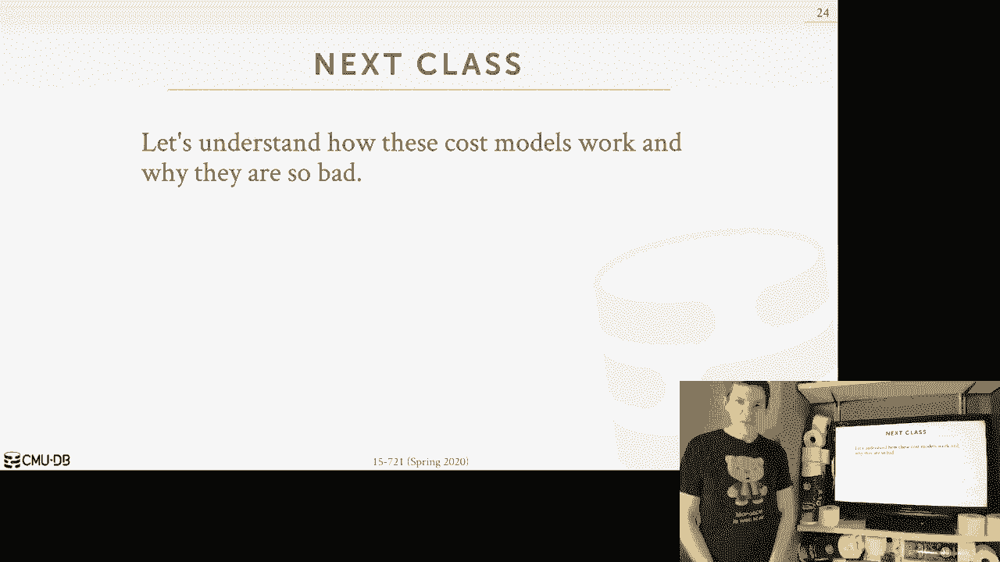

# 【双语字幕+资料下载】CMU 15-721 ｜ 数据库系统进阶(2020·完整版) - P21：L21- 查询优化器实现 3 - ShowMeAI - BV1wv411w7Ko

[Applause]，[Music]。

[Applause]，[Music]，today is part three for our lecture on，query optimization it's again I'm here。

at my home office it's just me and the，Terrier who may or may not be asking，questions as we go along。

so the the type of optimizers we've，talked about so far have been this sort。

of classic query optimizers where the，query shows up we parse the sequel then。

we run it through the optimizer and we，generate a plan before we even begin。

executing the query this is how most，query optimizers work right obviously。

you can't run the query unless you have，a query plan so you have to put it。

through the optimizer but the challenge，is going to be that what maybe we think。

is the best plan during the journey this，optimization phase before we even start。

running it may actually be incorrect，right because there's a since we can't。

actually run the query without a plan，there's some assumptions we have to make。

about what the database and what our，environment looks like but these things。

can change over time for various reasons，right so the physical design that。

database can change because the，administrator the application could add。

and drop indexes or change change the，partitioning scheme the the database。

itself could get modified people could，insert tuples or delete tuples and that。

could change the distribution of values，for our columns if we're invoking our。

queries as prepared statements then the，the behavior of the query for one set of。

the parameters might be different for，another set of parameters and of course。

every time you run analyze or whatever，the command is in our database system to。

recollect the statistics that we use in，our cost models every time we update。

them then the decisions we'll make in，our optimizer could be entirely。

different so the sort of focus today is，to understand like how can we。

potentially improve our optimizers the，efficacy of our the，the quality the plans that were。

generating by maybe relaxing this，requirement that we that we only，generate a plan or only revisit。

assumptions or we never visit our，assumptions once we generate the plan。

the beginning so to do this we want，understand a little bit what what a bad。

query pan looks like a wide query plans，can be considered bad and then end up。

with less than optimal performance so，we'll cover this more on Wednesday when。

we discuss cost models but in general I，say the high-level the biggest problem。

we're always going to have is the we're，gonna get the join order is incorrect。

joins are almost always the most，expensive thing we're gonna execute in a。

analytical workload and so if we get the，ordering incorrect that can get lead to。

too poor performance and the reason why，we're going to make a select incorrect。

ordering is because we're gonna have，inaccurate cardinality estimations。

meaning we think that our join is going，to produce X number of tuples but it's。

really gonna be you know X x wires you，know some some some larger multiple they。

mobile it's gonna happen again we'll，discuss why this occurs more in the next。

lecture but this this this issue is，gonna be a reoccurring theme that we。

have to overcome and today's discussion，is sort of C techniques to do this so。

but since we know things are gonna go，bad like we just know we can just assume。

that our cost model is gonna mean，accurate or optimizers gonna make bad。

decisions then ideally if we can detect，how bad our query plan is once we start。

running it then we can make a decision，to adapt the plan to come to modify。

potentially to account for these，differences and what we're seeing in the。

real data versus what we assume we're，going to see and then we can then try to。

convert our plan into into something，that's closer to the optimal plan so。

what I mean that like that is say we，have a simple query like this it's a。

four-way join between eight tables a B C，and D and then we just have a simple。

where clause for the B and D tables so，let's say that we run this query through。

our query optimizer and we do，this plan right it's a bunch of hash。

drawings and nothing about sequential，scans but let's say that when we when we。

generate this plan for this particular，join we estimated the cardinality of。

that operator to be 1000 right this is，this is an arbitrary number that I'm。

using for this illustration like the，cardinality is the number of tuples that。

this operator all MIT but let's say when，we actually started run it we see that。

were actually generating a hundred，thousand tuples so our actual。

cardinality is two orders of magnitude，greater than the estimate one so the。

question we're trying to deal with today，is if we knew what the district our。

tonality was before we started executing，it I'm sorry，while we're executing it then could we。

change some aspect of this query plan to，get us closer to a more optimal plan but。

could we change the Jordan ordering，where we want to choose a different。

algorithm to do our join well we want to，change maybe the access methods that。

come below the join to use and maybe an，index or a different different type of。

scam so this is sort of what we're，focusing on today is how to then maybe。

adapt this this kind of plan when we，know something about the what the data。

looks like once we start running it so，the the high-level idea again is that we。

want to be able to execute but you ask，maybe the behavior of a plan to in order。

to determine X maybe the behavior of a，plan to determine its quality relative，to other plans。

and so the cost model is doing but the，tricky thing is gonna be back here。

before I started executing us，I had to derive this cardinality from。

the from my like statistics that I have，maintaining my catalog about what my。

table looks like or what the what these，two tables look like when you join them。

together so the stats are me based on，histograms and possibly samples that。

we're collecting from the data we can，also make decisions about what the。

hardware looks like what kind of cache，sizes we have what kind of maybe I。

wouldn't want to use what other queries，and run into the same time like the cost。

model stuff we'll cover next class but，then，main idea to think about is what we。

talked about today is before we run the，query we only have an estimation of what。

the data looks like and how our query，will perform and if we get that wrong we。

wanted then try to be able to correct，ourselves so the technique we're talking。

about today is called adaptive query，optimization and sometimes called in the。

research literature adaptive query，processing right they're essentially。

synonymous and into everything I said so，far the idea is that this technique is。

gonna allow the database system to，modify the query plan for a query to。

better fit what the actual underlying，data looks like and we leave modifying。

before the query plan by just generating，an entirely new query plan like throwing。

away the old one and starting over or we，could try to modify a subset of the。

query plan a read query plan by，introducing new sort of sub plans almost。

like a pipeline at different points，where we have to materialize people。

where we could potentially switch from，you know one plan strategy to it to。

another and this one here you basically，go back to the optimizer and start over。

this one here is that you can try to，have the optimizer only do only replan a。

portion of it or provide these，alternative strategies at the beginning。

so the main the main up sort of takeaway，approach what we're doing here is that。

rather than just relying on our，statistical models that our estimations。

or approximations on what the data looks，like we're trying to use the data we've。

collected while we actually execute the，query to then help us make a decision。

about what the right plan should be for，our particular query right and this data。

we're gonna collect is could be used for，helping our current query or merge it we。

can merge it back into the system as，we've collected through our analyze。

operation and have it be used for other，queries so again we'll cover the various。

ways you have to do this but when you，think about what a query actually is。

doing you know or what analyze does，analyzers doing a sequential scan to。

compute some statistical models about，what the data looks like。

and so these if we're doing the cilantro，scan on a table that's essentially the。

same thing as analyzed and so rather，than just evaluating predicates or using。

the you know the tuples as we scan them，to generate the result we need for that。

particular query we can piggyback，piggyback off of those off of that scan。

operator and sort of main or maintain or，update our and update our Cisco models。

with new information and the question，here is whether we just update that。

models for ourselves to make our query，go better Oracle you can share this with。

other queries are in a global catalog，and now other queries can benefit from。

from the data we've collected from this，all right so there's sort of three broad。

categories that I want to cover using a，qo or adaptive query optimization one is。

that we can use a qo to benefit future，invocations of our query the second。

approach is to try to make our current，invocation of our query better and then。

the last one would be well this is like，helping your current query this is also。

helping your current query but this one，would be sort of starting over from。

scratch and just running through the，optimizer all over again，this would be adding locations in the。

query plan that allow you to change one，strategy for versus you know switching。

one strategy to the next which again out，having to go back to to the optimizer so。

we'll go through each of these one by，one so the so the most simplest form of。

adaptive query optimization is as I said，where as we execute our query we also。

collect some information about what the，data looks like and then we can use that。

information to decide whether our query，is wrong and when we plan it or we could。

then merge that back into the sort of，global catalog again when you think。

about this right what if the optimize，are actually doing you have bunch of。

histograms or statistical models about，what your your your attributes look like。

so for a given predicate in your where，clause you want to estimate the。

selectivity of that predicate because I，don't determine how many tuples your。

scan will emit and the amuse that make，decisions about you，during orderings and other things above。

in the query plan so the as you execute，the scan if you if you you know you。

actually know the true selectivity，because you're applying the predicate。

and the tuples and you know the number，the the number of tuples or percentage。

of the tuples are gonna match so if you，then determined that the cost model。

estimated my selectivity was one percent，but when I run the real query and I run。

the query and actually do the evaluation，of the predicate my selectivity is 99。

percent then I wanted to use that，information to help me decide whether to。

replan my query or that future queries，come along they can you know exploit the。

knowledge that I've gained so again the，the the one approach is to try to fix my。

current query but the other one is just，merging it back into the into the。

overall mystical cattle of models and in，the catalog so that I can then help feet。

of queries in the future so the most，basic approach to do this is called a。

reversion based plant correction and the，idea here is as I said is just every。

single time I invoke a query I keep，track of what query plan I generated。

forward I keep track of the cost，estimations I have for and then the I'll。

have all my metrics of what what，happened when actually when I ran it。

right how many how many tuples I，selected how much CPU and memory that I。

used and I'm gonna maintain this history，inside the database itself so you'll see。

this in like the commercial systems like，in db2 Oracle and Seigle server they。

have this built in repository of the，history of every single query that ever。

got them vocht and they can use that，information to help decide how to do。

query planning in the future so let's，say that we have a prepared statement or。

we have a query that that's being，invoked all the time and we have a cache。

query plan so rather than maybe run it，through the optimizer every single time。

we can use the cache quarry plan that，we've already generated from previous。

implications so if now there's a change，in our in in the you know the statistics。

or something about the database physical，design that changes and we recognize。

that we maybe want it for this，queer even keep invoking we want to run。

it back through the optimizer and see we，generate C we generate a new plan but。

then when we run that new plan for this，query if we see that the performance of。

the query is worse than the old plan，that we had before then we just want to。

run back to it right if there's a，regression in the performance we switch。

back to the plan that we know actually，performed better for us despite the。

change in the other in the physical，design or the statistical models so we。

use that simple query example that I，have a for right the four-way join say。

again this is my original plan I am，doing nothing with special scans and a。

hash drawing and say that my estimated，cost is a thousand and my cost。

estimation is pretty good so my actual，cost actually matches up ideas just。

synthetic numbers here so I'm going to，store in my execution history for my。

database system that I generated for，this query I generated this plan and。

when I ran it I had this cost and this，is just another database or another。

table in my database system right you're，sort of eating your own dog food rather。

than having an axillary store this is，just another table that you looking to。

record this information all right so now，let's say there's a there's a change in。

our databases on say the DBA comes along，and adds two indexes on the B table in。

the D table which we're using in our，where clause so now when we invoke the。

same query again we would recognize that，the design the database has changed in。

such a way where we may not want to，reconsider the query plan for this。

particular query right so this query，touches B dot Val and D dot Val well I。

just happen to create indexes on those，columns so I want to run this through my。

optimizer again and see what plan again，let's say now for the new plan it's。

completely different so now we're，instead of running hash joins or running。

index nested loop joins and we're doing，an index scan on beyond D which we can。

now do because we have index on that，which we didn't have before and so now。

we're gonna pick this plan for our query，because the St estimated cost is 800。

which is less than the estimated cost so，that we had over here but when we。

actually run it for whatever reason that，we think that we don't care about at。

this point the actual cost is is 1200，this could be that the you know we。

incorrectly estimated that the cost of，these nested loop joins would be cheaper。

than the hash joins so we picked in that，nested loop joins so just as before it's。

when we actually put this give me that's，not Corona um if we actually now put。

this in our extra history we would，recognize that the for this plan here。

again it performed worse than this other，one here so the next time we invoke it。

we want to make sure that we use this，plan oh you want to look back to the one。

that we know perform better so for this，approach here this is something that。

Microsoft has had in sequel server and I，think Oracle has something similar in。

since maybe 2012-2013 but this is pretty，coarse-grained right this is pretty。

brain-dead heuristic that's basically，saying oh this query plan is bad let me。

just switch back to this one I said so，it's not at all or nothing thing so the。

payment you guys are assigned reading，from Microsoft is called plan stitching。

and the eye high-low idea is exactly the，same where if we recognize that our。

query is running slower than query plans，we saw in the past rather than。

potentially this strong way the entire，query plan that the new query plan and。

reverting back to the old one maybe，there are elements or aspects or sub。

plans within the newer plan we actually，wouldn't want to retain because and then。

that data that'll help us lead us，towards towards a better plan a more。

optimal plan right and the other if you，think about plant stitch as well is that。

the sub plans you're gonna borrow from，other queries don't need to be actually。

from the same query like in this case，here I can only reuse the plan in the。

simplest form I can only swap the team，plans if they're running on the exact。

same query but with planned stitch，because I can excise out sub plans or。

portions of the query plan as long as，they know that they're logically。

equivalent I can take bits and pieces，from from other queries alright the，other thing too is that。

if there is a change in the physical，design we're a new planet query plan。

becomes invalid meaning like it defined，that it wouldn't do index scan but and。

then I drop that index rather than just，getting thrown away the entire query the。

query planet in its entirety I could，maybe in pull out pieces of it type so。

the basic approach they're going to use，is or the way they're gonna generate。

these these stitch plans is a dynamic，programming search method using a。

bottom-up approach where you just you，check the see from going from one level。

to the next in the same way we do a，system are going one one note of the。

next to pick which which which which sub，plan is the best and then once you reach。

the end goal you you find that the，cheapest path so this means that it's。

not guaranteed to find a better plan，than the best plan you have so far and。

it is not guaranteed to always produce a，battle plan and but there's some basic。

heuristic so you use to make sure that，happens right so going back to our。

example here right say that this is our，new plan and say it was working just。

fine right like it was actually faster，so we always want to use this but now if。

I come along and I drop one of the，indexes that I'm using this plan now。

becomes invalid and under just sort of，coarse-grained reversion。

I can't reuse it but with plan stitching，I actually want to figure out what。

components of this sub plan of the query，plan here that I may want to use in the。

new plan even though overall it's，invalid there's still portions that are。

that are still usable so in that state's，case say or say this portion of the sub。

plan the the sub plan of this part of，the query the extrusion cost is 600 and。

we would know this because we can keep，track of every although the ratchet。

runtime cost of all the operators in art，and aquarium and for this one here this。

sub plane over here has a cost of 150 so，now if I combine these together into a。

stitch plan the total cost of this case，would be 750 whereas before if I didn't。

run this it was a thousand so again the，idea is that we want to be able to。

borrow bits and pieces of different，query plans to and help us produce the a，more optimal plan。

and this is being done separately from，the the regular optimizer in the case of。

Microsoft's sequel server，they're running cascade - they're，actually doing a top-down search but。

this is sort of this auxilary search，that's running on the side that in the。

background it tries to find a plans it，can stitch together so let's talk about。

how they actually do this the the first，step is you need to identify which。

portions are which what cell plans in，our queries are logically equivalent。

right we talked about before under live，Cascades when we have when he had multi。

group multi expression groups we want to，know that the the the output of a given。

some plan is is the same or equivalent，to another sub plan right and again we。

have to rely on our the rules of，relational algebra to recognize which。

operations can be commutative or，associative so in this case here this。

portion of the cell plan just the output，is the a join be joined see this portion。

of another sub plan is the output is C，join B's join a but since joins these。

inner joins here are commutative we know，that these are logically equivalent now。

as I said the well one one challenge，with this is that determining whether。

any arbitrary logical expressions or，logical sub plans are equivalent has。

been shown to be undecidable meaning，like it the questions like are these two。

cell plans logically equivalent it's，it's a yes or no answer but there's no。

algorithm that exists as a been proven，that can can be guaranteed to always。

give the correct answer so in the，planned stitch phase they're gonna rely。

on some additional heuristics to，identify things like oh I know that。

these two sub plans are accessing，different tables so therefore they can't。

be logically equivalent right you，obviously can do more complicated things。

the optimizer itself in sequel server，also has those kind of checks in place。

and so they rely on that as well so they，have their own heuristics to prune。

things that can never be logically，equivalent and they rely on the sequel，server optimizer。

identify that the logical sub plane，you're trying to mash together or that。

the sub plane trying to match together，in the stitch plan is is invalid so the。

heuristics are providing them with this，sort of sweet spot balance between the。

difficulty in the implementation by it，symmetry enforcer rules the accuracy of。

the of the determination whether they're，equivalent and then the performance。

right it's not an exhaustive search and，exhaust evaluation of all possible。

inputs to different cell plans，it's just rules based on the relational。

algebra all right so now once we，identify that we have a bunch of。

equivalent sub plans we want to figure，out we want to sort of combine them。

together into one giant query plan that，where you're going to add some。

additional operators to determine that，you can have branches to go down。

different different paths in the sub，plan so this is how they're going to。

encode the the all the different，combinations of the sub plans for each。

stitch together so the way this is going，to work is they're going to introduce。

this new or operator which is not，actually used for execution this is just。

something for the search and the the or，basically indicates that the sub plans。

below it are logically equivalent so we，could choose either path so starting。

from the from the top we have an or，clause at the very beginning and then we。

have the two for this particular query，we have the you know doing the hash join。

or the the nested loop join and again，these are logically equivalent because。

this is a joint B joint c。join D and，this is C join B join a John D and those。

are in the joins are commutative so，therefore these are logically equivalent。

so then now say go down we're gonna go，like a depth-first search going down on。

this side for this one here the same，thing we do the hash join on a and B。

followed by C this is the next loop，joint on C followed by C join be join a。

again these are logically equivalent so，that's why we have or clause we can。

choose either one and then we're gonna，keep going down until we get to our leaf。

node in scheduled scan and then here we，don't see we don't there's another，option for us。

in in this portion of the query plan，because the one we stitched from just。

you know only had only had a hash join，so now in this case here for the hash。

donor a we can do a sequential scan as，we saw on the first plan already knew。

the index scan on B because that came，from the second plan and so we have an，up here。

we can only do a sequential scan on C so，that's a straight path coming back up。

here for the nested loop join it can you，know only thing we knew below it is。

another nested loop join and then for，this we can get either do a sequential。

scan on a or again for B we now to do，the scheduled scan or the index scan。

going back up here for the hash join，again we that's feeding a special scan。

on D feeding in and then we just，complete the the rest of the tree like。

this so this is a bit more simplified，version of what they showed in the paper。

but these are actually the possible，options you can have and so what I think。

remember in the paper what they talked，about is that this approach and doing。

the search within this define stitch，plan that they're able to stitch about。

75 to almost a hundred cent of all the，plans together but for the workloads of。

it they looked at alright so now that，we've encoded our search space we。

actually want to do our search and this，is just starting from the bottom and。

going up in the same way we did with the，system our dynamic programming search。

where we just for every single leaf node，we started off with figuring out what。

the cost is for going to the next，operator we pick which one is the best。

and then once we complete all the we do，this search for all the nodes at our。

current level we then go up to the next，level and complete this process okay so。

the say we start with a central scan on，a it only has one option first which is。

just the oh it has either a hash join an，a B or or the the the necess。

that's a loop over here say the hash，join is cheaper so we pick that now we。

just crunch will scan a B this has an or，operator alright so this is either doing。

a hash join or the next loop join and，say the hash join is cheaper so we pick。

that now we do this for the index kin on，B again there's an or operator you need。

the rational in the nested loop join and，so because we have an index the nested。

loop join actually would be cheaper，we picked that and we just keep going。

down the line and do this for all our，leaf nodes and then we're done we go up。

to the next level and then again now we，have a cost for all these paths leading。

up and we just pick which one is is the，cheapest for us and then we reconstruct。

the we struck the stitch plan that way，right so I get I think this is an，interesting approach。

I don't think Microsoft is actually，running this in production like this was。

a research paper that was published in，Sigma I don't know of any other system。

that's doing something similar like this，I from an engineering standpoint the。

fact that you have to run this，separately from the from the query。

optimizer and sort of have separate，infrastructure for that tier what are。

alright so rather than having you know，separate so search infrastructure if。

there's an integrated into the query，optimizer like a component itself I。

think this would be an interesting，approach so there's another system that。

does something similar to this plan，stitching but they're actually working。

on a sort of a sort of a cogent level，rather than the called physical query。

plan level so amazon has their redshift，data warehouse service and it's based on。

par Excel and they use actually a they，do it's a translation engine so the。

database system for a given physical，plan generates C++ code or C code which。

they then compile and then they run you，know they invoke the the shared object。

that comes out of the compiler and then，that's how they do query compilation so。

the obviously the most expensive part of，you know cogent engine is the。

compilation right in their case they're，actually forking GCC or whatever。

compiled using to actually generate the，the machine code so they want to try to。

avoid that for every single query so，what they can do is they say you're。

doing you want you want to compile the，scan on B where you want to see what B。

Val equals some some input parameter so，the coach and that piece run it through。

the compiler that generates x86 code and，then they'll go ahead and cash it。

and then now anytime you reinvest weary，you know you can just reuse the compiled。

version of the scan on beam but similar，to plan stitching what they can also do。

is they can recognize that if you have，another query with the same kind of。

predicate be davao equals you know some，parameter，it'll Co gen the exact same thing so。

rather than recompiling it which is，again to extent the part they can。

identify that they have a cache plan，fragment for this this scan here and。

they can reuse that and so they actually，can do this across all possible or press。

all their customers so like this you，know this scan on a table to do one you。

know something equals something on a bar，chart field that's gonna be the same。

from one table to the next because it's，a column sure sure you're just ripping。

through the column so they can actually，share these little fragments and stitch。

these physical query plans of the，compiled query plans together from all。

possible you know customers so now for a，given query that they never seen before。

if it has the same pattern of access，methods and joins and other things as。

queries from an another customer they，just pull from the cogent cache and。

stitch it together so that's kind of，cool，alright so there another interesting。

system to talk about is ibm's leo the，learning optimizer and so this is an。

example of where you have a feedback，loop being used to improve the the。

accuracy of the cost models in the，system i said the idea is that again if。

i I keep track of what my cost model，estimates were when I want to generate。

the query plan and then when I run it if，I recognize that those estimates are way。

off I start recording information about，what I'm seeing in the real data and。

then when my quarry completes I return，the result back to the the user or the。

application that requested a quest the，query but I also go update my cost model。

assistive sixth with the new information，that I've collected um so I BM is Leo。

was is actually shipped in production in，db2 today but this is one of the earth。

examples of a commercial system do，applying one of these debit query，processing tech。

all right so the the plant stitching，stuff that we talked about or the virgin。

stuff is about fixing future invocations，of a query to improve them based on the。

results that I'm seeing when I when I，actually execute my query but now we。

want to talk about how do we fix my，query live up my sequel query and I，do I do。

all right how can I fix it because I，don't want to wait for the next。

invocations I want to fix the one I have，right now so I'm calling this the。

replaying the current invocation again，the idea is that if I determined that。

the observed behavior of the query plan，as I'm executing it is way off or。

divergent from what the estimated，behavior was that the cost models，produced then I can decide to。

potentially either stop the query and go，back and generate a new plan or I can。

recognize that I've already produced，some work for me，and keep that portion of the data that。

I've already processed and then return，back to the optimizer and ask it to just。

just generate a sub plan so again you，know just start with a scratch and you。

know you decide that continuing with the，same query plan that I have now is gonna。

be worse than just starting over，obviously if you're at the last to put。

the last operator then it's a bad idea，just let it finish so striking right。

balance of this it's difficult and then，the other approaches are determining。

that well I'm doing 100 joins and I've，already done one of them let me keep。

that one that I have because I was，expensive and then I'll replan the。

ordering for the other 99 and the whole，idea here is that you're going back to。

the optimizer and saying hey generate，generate me a new plan so let me give it。

a give of that so it does something sort，of similar to like this so this is from。

Apache quick step quick step was it or，is a embedded analytical engine sort of。

similar to duck TB but I don't think，it's supported sequel it came out of。

unity Wisconsin and then it's been，it's been turned over to the Apache，foundation。

I think it's been kicked out of the，incubator program because I don't think。

they've updated it recently I don't know，what's going on with chicken ash and his。

team but I haven't really seen any，updates in a while but they had this。

really interesting approach called，look-ahead information passing where I。

can do some work at the beginning of my，query and pass that along to other。

operators or other portions of my query，plan and help me make a decision about。

what the right ordering is for for，things up ahead so for this example say。

we have a simple data says three tables，and so this would be a star schema so。

this this this approach only works for，star schema we have a fact table in the。

middle and then you have dimension，tables coming out of it right so it's。

not for arbitrary star schemas or，arbitrary like treat tree based schemas。

so the way this is gonna work is say，this is my sequel query like this I'm。

doing a three-way join between the fact，table and the two dimension tables so。

what I'm gonna do is before I begin the，before I start scanning the fact table。

and start computing the hash table of，hash tables for my join I'm gonna scan。

through the dimension tables and，generate a bloom filter we solved this。

similar technique being used when we，talk about joins right this idea came。

from vector wise that you can generate a，bloom filter and pass it along to to the。

other side the query plan so so that，maybe avoid a hash table probe and we。

said this so the joins are gonna be on，the dimension tables these are in front。

of the hash tables and the fact table is，just gonna do a probe so I want to。

generate the bloom filter and then check，the bloom filter to see whether the key。

I'm looking for can even exist in the，hash table which is cheaper than doing。

the hash table probe but we're gonna do，differently here is that we're actually。

gonna pass these bloom filters and when，we pass it over here to the fact table。

we're going to start do some sampling to，determine the selectivity of the of the。

of the different bloom filter so for，these different tables and then if we。

determine that well the second second，table here DeMint the second dimension。

table is actually more selective than，the first one then I want to。

shuffle the reshuffle my joins so that I，do that the probe on this hash table。

first because I'm gonna end up throwing，away more tuples and we can do this。

before we actually start running，anything because we've already got the。

hash tables we generate the bloom filter，and we can make the decision before we。

start scanning and doing the probe so I，think this is a really interesting idea。

as far as you know quickstep is the only，one that does this and I don't know。

whether it actually made it into the，open source version all right the last。

adapter query optimization techniques，sort of category you want to talk about。

is what I call sort of plan pivot points，and the idea here is that we want to。

introduce additional sub plans in our，query and then have a have a sort of。

special synthetic operator that we put，into our query plan that allows us to。

pivot or switch which query you know，which path and that query plan we want。

to do and the idea here is that we can，put conditions in our in the switch。

operator or the the change plan operator，that if we determined that our data。

looks one way we'll go down one path if，it looks another way what will go down。

another the other path it doesn't have，to be - it can be multiple ones so the。

sort of two most famous techniques for，doing this are parametric optimization。

in a proactive e opposition again in a，high-level they're gonna work exactly。

the same way it's just the，sophistication of their technique is，slightly different so parametric。

optimization was actually developed in，the late 1980s and in 1989 this actually。

came out of the volcano project again，the same one that does the volcano query。

optimizer the volcano iterative model，they also did early work on adaptive。

query opposition which is in as I'm，saying that work is very influential so。

as I said the idea is that for each，pipeline and a query that we think that。

the different alternatives we could have，that would make a big performance。

difference well generate different sub，plans for them and then now in our query。

will have this choose plan operator that，basically has gonna an if clause that。

says if the cardinality of the operator，below me looks，way of a certain size then I want to。

choose the first plan if it looks，another way then I'll choose this other。

plan right and in this case here if I，know that my data is really small then。

maybe I want to do a nested loop joining，because that's gonna be cheaper than。

having to build a hash table and probit，but if my data's really big then I maybe。

want to do the hash Tron alright how do，the hash run so again I think this is。

actually interesting idea of course，obviously the the tricky thing is。

determining what this conditional in，this condition should be and you know。

there's it's sort of through trial and，error and as you develop the thing and。

it's actually very dependent also it，won't be on the harbor but the nice。

thing about this is like there's nothing，we end up like not having go back to the。

optimizer and sort of replaying，everything the and we don't throw away。

any of the data that we've collected，right so that we do this hash join and。

then we just determine whether we want，to go down one path versus another a。

more recent sophisticated approach of，this is called proactive reoptimize。

ation and this is actually combining the，ability to go back to the optimizer and。

generate a new plan as well as to tweak，it in the same way we saw in the。

previous example so they actually can do，both and so at a high level it works。

like this so crazy shows up we gender，through the optimizer，and so we'll generate different。

different switchable plans just like，before we're also gonna now gonna。

generate bounding boxes that allow us to，determine whether the assumptions we're。

making in our decisions about whether go，down one path versus another we're。

actually gonna match up with reality but，it's basically trying to put a bounds on。

the uncertainty we're seeing in the data，as we run so now we start exiting the。

query and just like before in in leo and，other techniques we exit query collects。

as statistics about the data that we're，seeing for a particular query and then。

we can switch the query plan just as we，saw before if we determine that you know。

one plan path might be better than，another but then if you also determine。

based on on our if we're exceeding our，estimations in our in our bounding box，thresholds。

we see that we're way out of you know，way out of whack and our estimations are。

way off then we just go back and can we，optimize and then you determine whether。

to pin the portions of the query plan，that you've already executed because you。

know they're expensive or you can just，say throw everything away and start over。

so this is sort of getting a crash，course on a depth of query optimization。

the I actually really like this these，techniques and there's for obvious。

reasons right like it doesn't rely on，getting it right the very beginning like。

you can even sort of correct yourself as，you're actually running the query so。

well again we'll see a next class when，we talk about cost models of how bad。

things can actually get but the way you，actually need to implement this is super。

important that it's just not you know，you don't want to implement your。

optimizer and your execution engine，completely separately from each other。

it's sort of a symbiotic relationship，where you have to know what kind of。

strategies could be employed by the，execution in the optimizer in terms of。

like switching paths and throwing weight，interviewed results or not and then you。

build your optimizer or you build，optimize around what your execution。

engine can actually do so for this，reason I think like the I think applying。

this technique for our using this，technique with sort of those optimizer。

as a service like Orca or calcite could，actually tricky because there's。

different approaches for how you can，actually support adapter query execution。

in the system itself so the in addition，to having sort of more robust or more。

more sophisticated query optimizers all，versus the open source one open source。

systems all the major database vendors，now support this within the last。

actually mostly in the last three or，four years like db2 had this Leo thing。

in early 2000s but really in the last，three years about Oracle and sequel。

server and now Teradata also included，the ability to do that the Cori。

operation but it's best my knowledge，Postgres and my sequel simply can't do。

this and none of this sort of the newer，open source systems that's come around。

in the last decade support anything like，this so all right so。

again this was just sort of to show you，that you don't have to build the。

optimizer the way we described it where，you sort of plan once and run it through。

our techniques to actually modify the，query while it's running and they get。

feedback from execution and put it into，the system tier with doing all right。

sorry um so next class will then start，discussing how how cost models work and。

we'll see why they're so bad okay guys。

what is，won't be the same I've diced you take a。