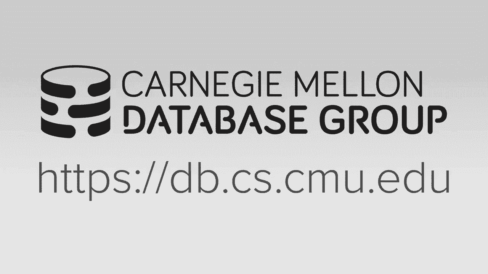
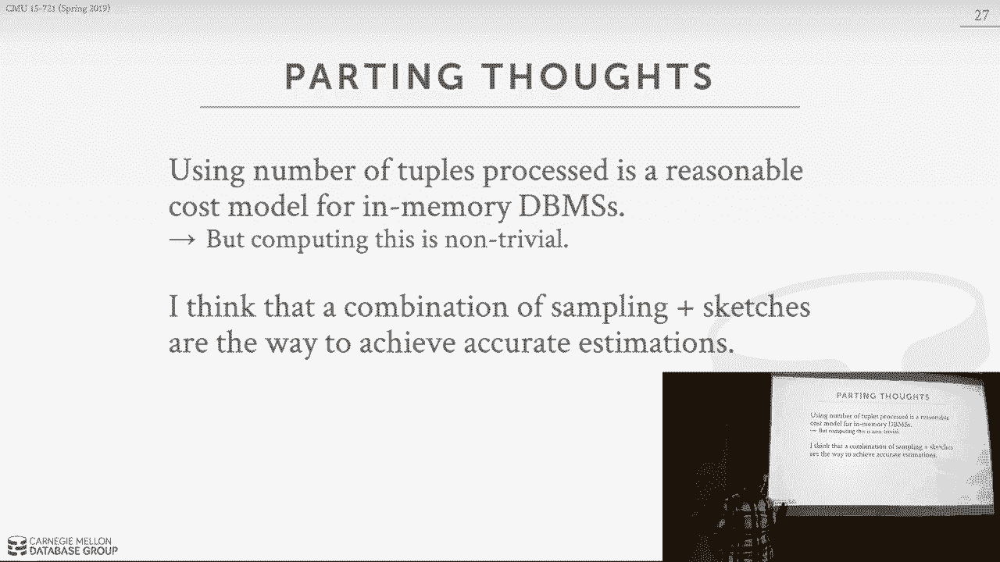

# 【双语字幕+资料下载】CMU 15-721 ｜ 数据库系统进阶(2020·完整版) - P22：L22- 查询优化器成本模型 - ShowMeAI - BV1wv411w7Ko

[Applause]，[Music]。

[Applause]。

[Music]，so today's focus is on like how to，actually then build the second major。

component of a Curie optimizer of how to，actually do estimations on what we think。

this system is going to actually do when，the excuse to query like how much this。

is gonna cost us to execute the query so，yeah so this is not working so the the。

the reason why we have to do this，I should be sort of obvious when we talk。

about the cost based search models from，the last two classes I said that there's。

a sort of black magic box thing that，that's gonna tell us that here's what。

the expected cost of executing this，particular query is and again it's an。

internal cost it's not something that's，meaningful outside of the database。

system I mean you can't take my sequels，cost model have it spit out a number and。

then take Postgres this cost model take，that number and then make a comparison。

right this is completely dependent on，the implementation of the system and。

it's really just meant for us to be able，to say this query plan is better than。

this other query plan for some reason，which will describe going forward in。

this lecture and therefore that's what I，want to use right so the other thing。

important to understand - this is also，independent this cost model is。

independent of the search strategies we，talked about last time meaning whether。

we're doing top-down or bottom-up I it，doesn't matter right we at the end of。

day we still need a cost model that and，still needs me to make predictions about。

you know whether one plan is is better，than another so if you're gonna build a。

cost model how would you actually do it，well there's a couple different things。

you can include in it so the first is，are the physical cost so these would be。

what is the hardware actually going to，do when it X use the query right how。

many CPU cycles how many cache misses，all right how many how much date you're。

gonna read from disk right this is，obviously dependent on the the machine。

that you're running on and it's hardware，configuration because as we saw。

couple of different examples right the，whether you're using a Xeon CPU for a。

Xeon Phi those CPUs have very different，characteristics and therefore the。

performance of your algorithms or your，query can vary depending what hardware。

it is so this is usually pretty tricky，to do because because of that reason。

because it's hard to actually have build，models based on all of them possible。

hardware configurations that could exist，the next approach is to do what I'll。

call logical costs and these are where，we're basing their cost estimates on the。

what the operators in a query plan are，going to actually do at a logical level。

so no it's a physical level would be，again I read this when to block some。

disk a logical level would be I'm gonna，read this many tuples from a table or my。

joint operator is gonna spit out this，many tuples after the join or my scans。

gonna filter so many to so many tuples，so for these this is gonna be。

independent of what algorithm we're，actually using in our query plan so this。

is only looking at the logical operator，something physical operators right and。

this is this should be sort of obvious，right if I'm doing a nested loop joined。

versus a hash join the end of the day，both algorithms should should generate。

this the exact same result writing the，same number of tuples because otherwise。

I have problems in my implementation and，so therefore we don't care whether in。

the for logical aspects we don't care，about whether it's you know it's one。

algorithm versus the other so the tricky，thing is gonna be and what was in the。

paper you guys read about and we'll talk，about going forward is you're obviously。

gonna need to be able to estimate，accurately what the output of an。

operator is gonna be because that's，gonna be fed and as the input for the。

next operator so in order to say are you，the number two because I'm gonna read。

into this operator and therefore um，generate this much output and you need。

to know what came below me in the query，planner and that again that that's gonna。

be the hardest thing we have to do and，the last one is going to be sort of。

average the cost or asymptotic，complexity of the of the operators right。

and this is where it actually matters，whether we're doing a hash join or a。

nested loop join or index scan versus，Quantrill scan right and again for these。

ones we you know we can just，we can sort of have weights that's。

people say oh the the hash joint is is，you know x times better than a messy。

loop joint and therefore prefer that but，there are obviously some scenarios。

within a solution would be better so as，well see is going going along and。

actually I'll show the next couple，slides what we're primarily gonna do for。

an in-memory database is gonna be a，combination of these two for this one up。

here if you can do it but it's hard and，this is another good example over like。

the difference between the commercial，database systems of the open source。

database system so at the talk the，redshift talk on on Monday if you went。

to that epic Rattus mentioned they're，like oh like the the query optimizer in。

their system is is maturity difficult，and you know the they've spent a lot of。

money fixing it up at Amazon and it's，way better than any of the open source，ones that are out there。

it's sort of commercial grade or，enterprise grade because the enterprise。

guys are gonna include all these things，the source guys probably just include。

two these two guys so for a disc based，database system the most obvious thing。

that we care about is the disc right，it's the end of the day that that's the。

most expensive things like feeding，getting things off of a you know。

spinning this hard drive or SSD so in，this world the CPU costs are they're not。

negligible in the sense of like we can，ignore them but if your cost model only。

includes how many blocks are data that，you know how many blocks of data that I。

read and write from disk that's probably，gonna get you you know 90% of the way。

there right who cares what you actually，do when you bring the data into your。

into memory I guess it's getting from，dishes most expensive thing now。

obviously on a it's it's less of an，issue on modern SSDs but definitely if。

you have a spinning this hard drive you，know taking the account the difference。

between sequential i/o versus random i/o，is a big difference and a lot of times。

you can you see in a disk or in a，database system especially older ones。

they use algorithms that are that are，designed to optimize the amount of。

sequential i/o you're doing alright so，the important thing that，you know understand but and the disk。

based system is that the database system，is gonna have complete control over。

what's in memory over its buffer pool，management assuming you're not using em。

map which well we can discuss later the，you know we know exactly in our。

databases we know how we're actually，bringing blocks in we know how our。

writing blocks out we know what you know，what algorithm are using to decide what。

data is colle what data we want to evict，right so we have complete control over。

this and we can include this in our，calculations in our cost model we know。

how you know if we're gonna give this，amount of mem this this amount of memory。

and a buffer pool to run this query and，therefore it has to read this amount of。

data whether that's sequential over says，random i/o we can then you know take。

that and account into our cost models to，make estimations what we think the query。

is actually gonna do all right so I，would say you know this is this is what。

I'm describing here is how you would do，this on a single node displace database。

system if your distributed database just，replace the word disk with network right。

that's it's basically the same thing and，you have the same issues so I want a。

quick example what Postgres does the，reason why I always like to use。

post-course as an example for describing，how you know how real Sussman actually。

implements so this is that in my opinion，it's like almost like a textbook。

definition or implementation of a，database database systems like if you。

take any introduction class you take the，textbook when using that and the way。

they describe the algorithms and in the，textbook assumes exactly how it's。

actually implemented in in Postgres so，for Postgres they're gonna use a。

combination of CPU and i/o costs they're，gonna be weighted by these what are call。

magic constant factors right magic magic，weights and the reason why you do this。

is the basically just say like because，it's dependent on what the hardware。

actually can do so they'll say you know，sequential i/o will be you know x times。

fast direct times better than then，random i/o and memory i/o will be x。

times faster than so catch why oh all，right so in this environment they are，obviously targeting。

in these sort of default configuration a，database that's on disk and therefore。

you don't have a lot of memory so they，again they want to use that in their。

cost want to account for you know what's，actually going on but the tricky thing。

is they expose this to you as as an，administrator that you can actually tune。

these waits for you right so the default，is the memory is 400x faster than。

reading from disk and then scratch iOS，for it's faster than random i/o so you。

can go in the look in the documentation，to see how you change these these costs。

but then they had this nice little，warning here that basically says like if。

you start mucking around with these you，could have problems right because again。

these these are highly dependent on what，the actual workload is and what the data。

looks like and what your hardware，actually looks like it's really hard to。

get this right right so most people，don't you know don't don't tune these。

things because they don't know you don't，know what you're doing。

and you don't want to cause regressions，on you know some portion of your。

workload United what a commercial system，does we can look at what db2 does in。

their system of all the three major，systems db2 sequel server and Oracle db2。

is actually the most open about，discussing what their query optimizer。

does and what their cost model actually，does right I，there's no as far as I know there's no。

major publications from Oracle or sequel，server that talks about what what they。

do right we just sort of know some，things based on talking talking to。

people there but iBM is actually pretty，good about discussing this and this call。

comes from a presentation from guy Loman，who was the guy that invented the。

starburst stuff that we talked about two，classes ago so the db2 cost model is a。

combination of all of these things so，the first of all they're gonna look at。

what the database actually looks like so，the schema and he says they collect on。

the tables the columns are in the，indexes but then they're also when you。

when you turn the system on they're，gonna run these little micro benchmark。

micro benchmarks that are going to，stress tests like the CPU the disk。

memory and the network if you're if it's，a distributed system I and then we used。

that to essentially generate the weights，that I was showing you in the last last。

slide for Postgres so first question get，the set these weights manually db2 tries，to figure this out。

you and tries to be real fine grain，based on what your hardware can actually。

do but then also when you actually start，doing cost estimation for the query that。

shows up they just don't look at your，query in isolation by itself。

they also account for what what other，things are running at the same time and。

then use that to determine you know what，the effect of those concurrent。

operations are on for your particular，query like if you're running by yourself。

then you know you take all the memory in，the world and you run really fast but if。

you bunch of other queries aren't at the，same time you're not gonna get all the。

memory so that far they may take they，take that into consideration when they。

estimate the cost of your query plan，right so again this is just it's way。

more sophisticated than what any of the，open source guys do and the Postgres one。

as far as I know at least Alessa med，locus is is much better than my sequel。

one probably the best open source it pi，is the best open source query optimizer。

cost model that's out there today，he's leased a year ago when I looked at。

I don't I don't know I don't can't think，of anybody else that got better all。

right but we care about in the my，databases so what do they do so from。

looking at the documentation and manuals，of the major in memory database systems。

as far as they can tell everyone does，does what i'm scribing here so basically。

the disk is gone so you don't care about，disk i/o yes you have to write to the。

log but that's incidental right that，doesn't affect whether you choose one。

particular query plan versus another，like if I update a table like who cares。

like the disk is not considered in the，cost of that of writing up the log。

records right so at the end of the day，that they're all the intermediary bases。

are going to do a combination of，primarily how many tuples are being。

processed by an operator or how many，people star general and some basic。

weights to do to say hash join so better，than the initial loop joins but the the。

number of tuples in and out is the major，factor the reason why you can't actually。

do anything more fine-grain or like in，like count for how much memory I'm going。

to be able to use for my query in the，same way you could with in a disk based。

system is because we have，control over actually the the cash，management of our systems that's all。

done by the CPU and the CPU we can，provide hints to it we could prefetch。

things we can try to pin things in our，caches but the end of the day that the。

CPU decides on its own what gets what，gets moved in and out of the cache so we。

don't even bother with any of that so we，just try to estimate how much data might。

as my operator going to read and write，it turns out that ends up being a well。

I'll say a reasonable estimation of what，the CPU resources I'm gonna I'm gonna。

use to run my query and this also say us，also this is not also accounting weather。

like whether I want to run one thread，versus 100 threads right that's sort of。

a separate policy that's different than，what we're trying to do here but that's。

almost like a mission control or，resource management for the system so。

typically as far as I know you don't you，don't see that in an accountant for than。

the cost model like that sort of cabins，after the path and again if you have it。

like even if you if you're an in-memory，system like a look at mem sequel since。

they're distributed again go back to the，last slide they care about the network。

so they have to account for that and not，so much in this don't matters but like。

the network is the major factor alright，so I want to give an example of a of。

what was a sophisticated cost model from，the 1990s done in small basis it。

actually does some of the things that we，talk about with db2 so what they would。

have is they have this sort of two-phase，approach where the as the vidalias。

developers were building the systems，like at at the company that were。

building small base they would try to，identify what are all these low-level。

primitives of of during that occurred，during query execution whether or not。

they're primitives like in the same way，not really like in vector wise。

primitives where you had like those for，those but it's thing of like low-level。

things like I read an index or I write，to a tuple so they generate these。

low-level operations and then they，create these micro benchmarks that allow，them to sort of simulate。

each of these different operations so，then now at runtime in your system when。

you deployed to deploy a small base they，would take all these micro benchmarks。

run them when you turn the system on and，collect some profile information about。

how fast your machine is and then in the，cost model when you look at a query plan。

you count up the number of these，low-level operations or primitives that。

they're doing multiply that by them by，the micro benchmark results that you。

collected and then that's how they're，determining what you know what the cost。

of executed query plan is all right so，for again small base was this early in。

memory databases some prototype at HP，Labs HP labs then spun it off as a。

separate company called times 10 and，then times 10 got bought by Oracle in。

like 2006 and it still exists today you，can download it the old system used to。

beat it we haven't tried it against a，new system yet the Oracle primarily。

sells it as like a CPU cache or sorry an，in-memory cache for the the main Oracle。

like flagship database but you can't，still run this as a standalone system。

but as far as I know again by looking at，the documentation what they did the 19。

it like this paper in the 1990s they，don't do in the real system today they。

still do they do what I've described，before they just estimate what's the。

number to balls in and out for an，operator is this is similar this。

approach is similar to boga mips if you，know what that is in linux right when。

you boot up linux they run this thing，this little micro venture called booger。

bits that tries to approximate how fast，your CPU is and they use that for。

timings decisions for like interrupts，and scheduling if you ever looked like。

/proc slash cpu info you'll see like you，know here's the here's a here's my Intel。

CPU here's the the the model number，here's an of course I have there'll be a。

little entry karpova mips and you use，that as an approximation of how fast。

your cpu is ok so I said that the most，important thing we're gonna care about。

is the number of tuples in and number，two was out or process by by by an。

operator so now we got to figure out how，we're gonna actually gonna be able to，estimate that。

so the way we're going to do this is，that we're going to try to estimate the。

selectivity of an operator which is，going to determine the percentage of the。

tuples that are fed into it it's the，percentage of the tuples that would then。

be admitted as output all right so if I，if I'm given a hundred tuples and my。

selectivity is 10% then I'm gonna admit，ten tubal's all right so the way you。

traditionally do this in a database，system is you can just model this as a。

the probability of whether a predicate，will be satisfied for a particular tuple。

all right and so the way we can generate，now these these probability estimations。

is through a combination of these，different techniques so we can have。

domain constraints right this would be，something like if we know the you know。

the value range ahead of time of a，particular attribute like if it's an。

enum field we know that there's only the，cardinality is fixed we can rely on pre。

computed statistics that we can generate，and put into our data blocks and our。

tables I mean we talked to us before，when we talked about compression these。

are like zoom maps so I can pre-compute，aggregations for different columns in my。

in a block and then when I want to，figure out whether a what's the。

likelihood that my operators gonna match，where my predicate is gonna match a。

tuple within a you know within a block I，can look at the zone maps and maybe。

derive some early information like a，mini max value we can also use。

histograms or approximations which I'll，talk about in a second and then we also。

do sampling so there's no one of these，is better than another like you kinda。

wanna use a combination of all these，things that you can to try to estimate。

selectivity like the more information，you can get the better so the now the。

number of tuples that we're going to end，up processing is going to combination。

the is the number two boats we're in a，process it would be 10 and on dependent。

on three different things so first is，obviously the access method that we're。

using to access to read to Plus from the，table right if it's a sequential scan。

then we're gonna potentially look at，everything unless we push down the limit。

clause if it's an index scan that we can，even more fine grain and on。

look at you know the subset of the total，key space then we have would actually。

the distribution of the values of the，database attributes right this is where。

the estimation stuff is gonna come and，come into play see I don't know if for a。

given predicate what's the likelihood of，probability that I have values in and。

you know that would satisfy that I'm，gonna course then also what are the。

actual predicate s-- themselves right if，I'm doing a quality predicate on a。

unique column then I know my selectivity，is gonna be one over the number of。

tuples that I have because the only one，actually can match but now if I start。

doing a range scan then this becomes one，problematic to try to estimate this。

right so the main takeaway is that for，simple queries like something equals。

something we can do a reasonably good，job for for matching that if you start。

throwing in inequalities throw in range，scans thrown disjunctions then it。

becomes really hard and again because，more data you can get the better so one。

approach again we in intro class we，teach you how to generate histograms。

right that's basically you run the，analyze function for analyze operation。

in your database system and that does a，sequential scan of your table and it。

computes some kind of histogram based on，what the what values it actually sees so。

that's the thing that's the standard，technique what's been sort of more。

prevalent in recent years is to generate，set of exact histograms to generate what。

are called sketches which are these，approximate data data structures that。

can give you a hint about what the you，know is contained in the data so think。

of this as like a hit like a like a the，bloom filter is an approximate data。

structure right because it can give you，false positives but I'm never gonna be。

false negatives and you can't actually，tell it won't tell you what values or。

keys are actually in the bloom filter it，is if you just ask it whether something。

exists it will give you a true or false，so these sketches are a lot more。

complicated rather than giving you you，know simple true and false is they can。

actually tell you values that could that，could exist right but again you could。

have false positives I don't know what，some of these I don't actually sometimes。

I don't know whether you get false，negatives as well，so there's a bunch of different kind of。

sketches that people can use right the，reason why I bring this up was a few。

years ago we had the the CEO of splice，machine come and give a talk in the。

intro class and he see me alum he's on，the board of advisors for the Dean and。

he was here in February and he made this，comment about when he was talking about。

their query optimizer and their cost，model was they did the textbook way。

initially where they distilled，histograms first and they used the。

standard algorithms equations to try to，do estimations on the selectivity of。

predicates and their operators but then，they ended up using this sketching。

library from Yahoo that did these，approximations right so you you can。

bound the you get bare error bound and，estimates to be able say like oh this is。

what I think it's gonna be and here's，here's my confidence about but what what。

I'm telling you and they said that when，they switch to using these sketches。

instead of histograms the accuracy of，their predictions and the robustness of。

the query optimizer I primarily because，it because of the better cost model the。

the difference of quite significant so I，think they said they like in the old。

system when they were using histograms，they could do the cost model would be。

okay up to like 10 tables per per query，look at 10 table join but when they。

added this then they I think we could go，up to like 75 tables which is again it's。

not then I'm saying that the right，metric to use to determine the quality。

of your cost model but that was sort of，anecdotal evidence that suggested that。

using cash is better than histograms and，in our old optimizer in the old system。

we ended up using histograms as well but，I'm sorry yes then I'm using some of。

these sketches as well but we never we，never invented it we never no we never。

actually measured how much better it，actually was and again I this approach I。

think is also used in the commercial，systems the other main technique to。

generate estimations about the，selectivity are to do sampling the basic。

idea here is that rather than look at，these sketches or the histograms and try。

to approximate what the selectivity is，let me actually just take a subset of。

the tables I'm accessing，run my query on that or run my skin with。

predicate on that and then determine，what my selectivity is and then assume。

that my sample is a good approximation，what the total table actually looks like。

and then now I have better knowledge，about making my might make my choices in。

my cost model right so there's basically，two approach to do this it's like online。

versus offline so the offline approach，is you you in the background every so。

often you you generate this this，read-only copy of the table that you。

sort of put aside and then you do that，your sample and you use that in your。

cross model to predict the selectivity，of your predicates right and then you。

have this sort of this this background，job that looks and say says well what。

how much of my data has changed and then，if it's you know it's above some。

threshold then I go back and refresh my，my sample the other person to do this an。

online fashion is when the query shows，up and you go in your cost model you。

actually go on the real table and run，your a little bit of your query now and。

and then determine what the selectivity，of your predicate predicates are and。

obviously this becomes tricky because，you have to you trying to do a cost。

estimation for for running your query，but now you actually run and run。

something up the query it's some subset，of the query on the table and that could。

end up being slow and then you also，don't want to slow down other。

transactions or queries that run at the，same time so you want to run make sure。

you run this on read read uncommitted，without you know without editing any。

latches or locks to avoid interfering，with anybody else so the way to think。

about doing the sampling thing is like I，had my where clause rather than do it。

make any joins that is pick out the，predicate sfrom from my where clauses。

and we're joined clauses and I just run，that on the on the you know on the。

tables themselves to compute this the，course now this becomes hard if you have。

joins because now the selectivity of the，join is tough to compute unless you。

start joining things so to the extent in，which people use different systems use，is where again the。

where we get into like commercial，systems are doing something that they。

don't really talk about publicly so it's，hard to know what they're actually doing。

all right but I know in the case for the，paper you guys read I think they。

mentioned some paper sequel server，performs the best sequels our servers。

doing a combination of histograms or，approximations plus sampling okay so any。

questions about this so we're using this，to figure out we have to use either。

histograms sketches or sampling to，figure out the selectivity of all these。

predicates and then we can use that，compute the cardinality of our operators。

which is then the the amount of data，that's that's being generated right as。

the output right and the reason why we，want to know what this is because that。

is then being fed it's the input to try，to our next our next operator and the。

problem is gonna be the the more，inaccurate our estimates are for the。

cardinality the selectivity of our，predicate in these operators at the。

lower parts in the tree then that's，gonna amp get amplified as you go up。

because I'm off of the bottom leaf node，as I go up that error gets carried over。

and now become a more off I can in again，this is what you saw in the paper you。

guys read all right so the textbook way，you would actually compute the。

cardinality is by modeling the the，selectivity as I said as a probability。

and then you make the following three，assumptions about that those。

probabilities to be able to compute what，what you know what the the cardinality。

is gonna be the selectivity is gonna be，right and again so I would say this is。

what I'm describing here is what we，teach you in the interruption class to。

go read every single text book about，databases this what they would tell you。

and hopefully they would say the caveat，like oh this goes this goes real wrong。

real quick but people still do this，right because there's no there's nothing。

else right look the only other way to do，the only way to get the exact cost of a。

query is actually to run the query but，that's actually super slow so you can't。

do that so you make use of some soon as，you make these these should reduce in。

the accuracy just be able to get，something that works reasonably well so。

the first assumption we're gonna make in，many cases is that，we have a uniform distribution of values。

for in our attributes meaning the，probability that a given attribute。

appears in my in my in my column is the，same for all values of course we know。

that this is not true like more people，live in New York City than men in。

Montana so I can't assume that that you，know that the ZIP codes in Montana have。

a the same probability of occurring for，people a people database than people in。

New York City right the way you，typically get around this is to maintain。

a separate data structure for what are，called heavy hitters this thing of this。

is just like a little hash table on the，side that says here's the top 10 or top。

20 values that occur in my column，because because more times than you know。

I'm more likely to query those values，and therefore I can go do a lookup in。

this heavy-hitter table and get more，accurate estimates but then everything。

else is just assumed to be uniform the，next is that we're gonna assume that all。

our our our predicates are independent，again we're modeling these as。

probabilities that means we can actually，multiply them together and that's gonna。

produce the true selectivity of our，predicate of course that's not going to。

work we'll see that in the next slide，and the last one is that the we're gonna。

assume that the join keys for inter，relations that we're trying to join on。

will always exist in the adulation right，this obvious doesn't work and if you。

start doing left outer joins or right，outer joins this becomes problematic。

again this is this is another major，assumption that people people have in。

their cross model so let me show an，example how this all goes bad and this。

great little bin yet or this this sort，of simple problem that again that was。

that was a blog honor from guy Logan but，I like this because the illustrates。

exactly all the problems would have that，you have when you make all those。

assumptions so say you have a simple，database keeping track of cars and you。

have you have in your database you have，ten different models like Tesla Honda。

Ford and so forth and then start using，ten mix test well-fought Tesla Ford。

Honda Toyota and then you have a hundred，ifferent models so like a。

that Ford Escort is is a model or a，Toyota Corolla is a model so you have a。

hundred of those so if you have a query，now that says where make eCos Honda and。

model equals a chord right so we have a，conjunction and to equality predicates。

if you make the independence and，uniformity assumptions from the last。

slide when trying to estimate the，selectivity of this predicate right then。

you're gonna end up with one over ten，because we have ten makes right so we I。

mean it's an equality predicate so it's，Honda can occur once so it's one out of。

ten and we multiply that by one over 100，because again we have a hundred。

different models and Accord is one model，so it's 1 or 1 over 100 so in this case。

here the the selectivity is estimated to，be 0。001 but in reality we know that。

Honda is the only one that makes them，the recored so it's not you know it's。

not this it's not 1 over 10 times 1 over，100 these columns are actually。

correlated like if you have if you have，an accord then you have a Honda Accord。

right so the true selectivity is 1 over，100 so again that that independence。

assumption that from the last slide is，going to make us be an order of。

magnitude off in our estimations and，then now if I start saying if I'm。

automatically off at the selectivity of，some lower low operator and I feed that。

now into another operator who's also，gonna be another order magnitude off。

then then I'm really screwed all right，so the way to solve this problem and as。

far as you know this only this this this，feature only exists in the commercial。

systems is if you would have called，column group statistics or basically。

telling the database system that these，columns are correlated and therefore it。

should maintain statistics about them，and when it computes the the prek the。

the selectivity during its cost model，estimates to treat them as being。

correlated right and don't assume that，they're independent right so again。

basically the way it works is like the，DB has to come in and tell it to do some。

hey these two columns are correlated and，then if the system supports that then。

they can they can update their cross，model appropriately，and again only db2 and Oracle do this I。

don't think as far as I know my sequel，and Postgres don't do this and none of。

the other major of the source system，systems do this now main thing why does。

this why is this manual right why does，the DBA have to tell the dinner system。

and I think that's why why can't we do，cuz it's hard right like think about how。

to figure this out in this example here，it's super easy right because it's I。

only have you know 10 10 makes and 100，models but I have a billion tuples and I。

have you know and they have a really，wide table with a thousand columns now I。

got to go look for every single unit，combination of you know of different。

columns look at all different possible，values that can occur right this thing。

is gonna blow the search base is just，massive so this is why you can't do this。

automatically now there may be ways to，approximate this automatically but again。

as far as I know no no major system it，can do this automatically for you happen。

tell it ahead of time we we can talk，offline about whether deep nets help。

with this there people are looking into，this now but nothing is nothing is。

nothing nothing exists yet all right so，let's look now about how these simple。

examples can really foul us up right mo，we start thrown in joins into our query。

plan so here we're doing it a simple 3，Way join on ABC where a ID equals B ID。

ID go see ID and then b ID has a filter，where the ID is greater than 100 all。

right so assume here we have a for，there's a there's a you know filter。

predicate in v or operator in between，the B and then join right am for。

simplicity reasons I'm just showing the，filter being done down here right so the。

first thing we need to do is compute the，cardinality of the the access methods。

that are that are retrieving tuples from，from the tables right for a and C。

there's no filter so therefore the，cardinality of the operator that's。

scanning a and C is just the number of，tuples that are in the table and that's。

that's easy for me to compute I can get，that from the catalog for B it's going，to be the number。

be multiplied by the selectivity of our，predicate here all right so now we're。

gonna feed up the output of these scan，operators into our joint so now we need。

to be able to compute the cardinality of，our joint operators so what's gonna。

happen here is that if I if these guys，if this is if this thing is bad right。

ANC is simple right because there's no，filter but if this thing's wrong then。

now I'm feeding in the incorrect number，tuples into this joint operator and then。

now I've got to figure out what the，selectivity of these two attributes are。

assume I don't have a foreign key assume，that these guys aren't correlated like I。

know nothing about them so I am now I，got to figure out for every single value。

that exists in a for a day eight ID how，many values are going to match that in。

be ID and I can try to figure this out，and in my hit my histograms but you know。

back that's gonna be hard so then now I，take the output of this estimate and now。

that's gonna be fed into this estimate，here took from this join this thing is。

just reading the table so that's super，simple so now I had the same problem。

that I had before now I gotta figure out，well what's the likelihood that a tuple。

that matched a ID equals B ID here will，exist and get fed up into this thing and。

then also be able to net match on see，that ID right so again I get that wrong。

this gets wrong and then see this gets，me more wrong alright so this this is。

what we're dealing this is like the the，regardless of whether we're treating。

these things of probabilities it's not，like these experts are always gonna get。

wrong and and just it gets worse as we，go up so again this is you were to see。

this in the joint on our benchmark in，the paper you guys read the more tables。

you add the more bad guests right for，this reason here what is throwing errors。

and pop of errors a puffing up another，query plan all right so the the paper I。

had you guys read came from from the，hyper team in Germany，and it was an evaluation of how how。

accurate are the the sort of the，cardinality estimates and operators for。

a variety of different database systems，and then they wanted to use that to。

figure out the just how bad things，actually can get how all four you are。

from from that to the real time so the，paper doesn't not telling you how to。

build a cost model I sort of roughly，sketched it out how to do this here but。

it's just showing you what happens when，the caught and the s was in your cost。

model go wrong and and then they sort of，proposed some some sort of design so。

design principles of building David，system sort of what you should focus on。

on trying to make the system more robust，to you know deviations or errors in your。

cost models so in the paper they，proposed a new benchmark code the Jo B。

that joint ordered a benchmark so in，this one they're actually it's actually。

based on I think the IMDB data set so，the the movie website so and this is a。

real data set so the the the tables are，actually gonna have skewed based on a。

real-world distribution right and like，tpc agent TPCC，these are having uniform distribution。

where everything you know the likelihood，of one attribute occurring is is the。

same for all started like kind of one，value occurring for a given column it's。

the same for all values in the joint，under benchmark is actually real you，know has real skew in it。

so they're going to generate a bunch of，different queries that are going to join。

more and more tables and then they want，to be able to measure what the cost。

model thinks the selectivity is going to，be of over the cardinality of the good。

operators and compare that with what，actually the real what the real data。

actually looks like right so for this，the way they're gonna use this is that。

they're they're gonna load the data in，you know in once and then they're gonna。

run analyze which and that fires off the，background job to actually go scan all。

the table and let the system compute，whatever statistics that I want to。

compute that's the best-case scenario，there's no update so just I load the。

data in and run analyze anything they，however，things get so once you have this one。

graph here because this really this is，the most important one here and so the。

way to understand this is that the，y-axis is the how far away you are from。

the from from being exactly accurate in，the in the cardinality estimations so。

this middle line here is when you're，perfectly accurate and then if you're if。

you're above this then you're，overestimating estimating if you're。

below this then you're under estimating，right and then the the what the x-axis。

is the number of tables that they're，joining in the query here all right so。

the first thing to point out is that，everyone the overall trend seems to be。

that everyone is under estimating right，as you add more tables everyone sort of。

starts to it starts to go down all right，Hey so again what is that from well that。

that as we showed in that when we talked，about there's assumption so I can be。

assumed that things are independent then，I assume my selectivity is gonna be way。

way less than it actually is so that's，why they're again they're all under。

estimating from what the actual value，should be so the first one to point out。

is this this this one this one guy here，actually does reasonably well up to。

about three or four tables right and，cross all of these they're actually the。

they're the most they had the most，tightest balance from from the you know。

being one person accurate versus all the，other ones the three systems here are。

essentially how all had the same trends，okay but the the the the bounds are all。

very right again as you add more tables，the the estimation gets worse and then。

you you know it's six tables it just，it's really bad and then you have this。

middle guy here who's just like way off，right away it's just okay with two。

tables and then after that it's just，it's way it's under estimating way more，than everyone else。

so I think in the paper they tell you，that that the the first one in the last。

one or Postgres on hyper right and I，think I slowed it last time who is。

the best one here right let me take a，guess what this one is Microsoft sequel。

server okay then we think you guess what，these other two ones are which ones。

Oracle this one here you Teddy titovs，this one I originate a fake Oracle's。

this one radiative you think Oracle's，this one okay and then there's we need a。

last lesson what took a db2 okay so you，think you think this is db2 this is。

Oracle okay there you go so yes so there，are let's focus on sequel server so。

sequel server does is Cascades，but again the cost model is independent。

of whether or not you're doing Cascades，or or bottom-up right but they're doing。

sampling they're doing histograms I and，it's just sequence it was just really。

good in my opinion I considered to be，all of these three systems here I think。

it's the at least what they talked about，publicly in my opinion is the most like。

state-of-the-art leading-edge system，right workin db2 are good they're not。

bad systems it's just I feel like sequel，server is they've based on what they've。

talked about publicly it seems like this，thing is his way you know farther head。

net and then everyone else getting，across so I would say for all database。

systems open source and commercial，secrets of reply has the best query。

optimizer so and it shows here but let's，now look into see a little more detail。

about what actually happens when when，you when you get correct estimates so。

for this one they're gonna instrument，Postgres 9。4 and the way to understand。

this graph here is that the the the，x-axis is what percentage of the queries。

that they're going to execute are within，how much slower are they from the the。

actual execution of the query itself，right so if you is that how much I mean。

sort of they instrumented Postgres and，they they made it so that rather than。

doing using histogram to estimate the，cardinality of an operator they modified。

the system so that it this you know，whatever function says go estimate what。

the cardinality is they replace that，with a magic Oracle that always gives。

them back exactly the correct answer，every time right so the way to read this。

is it's how how far they are from the，what the real estimate is gonna do。

versus what the if what the query，performance will be if you have the。

exact eczema's versus what if you use，the built in cost model but that's。

making approximations so if you're in，this band here 0。9 at one point one。

means that you're the the performance of，the query using the approximations is。

roughly the same of what you get when，you have approximate you know what if。

you have the exact result and then over，here is like you're getting way you know。

way way slower as you go in this，direction and then this is what。

percentage of the queries in the total，number of queries that they gave into。

the system fit into these different，buckets here right so this shows you。

that when you're using estimations that，60% of the queries are 1。2 to 1。1 or 8。

more times slower than the you know the，queries you have the true cardinality。

exact estimations here right and so，what's going on is because Postgres is。

under estimating this the cardinality of，its operators it thinks that the the you。

know the number of tuples that it's，going to is going to pass one opportu。

the next is is less as lower than it，actually is and they use these。

cardinality estimates to size the hash，table for when you do a hash joint right。

or decide whether you even want to do a，hash joint and all right if if you're。

only going to access a small number，tuples and enjoying the if you're then a。

nested loop joins is super fast，because you don't have to set up a hash。

table you don't have to build it you，don't probe it you just do these two。

little four loops on like four tuples，and the outer table an inner table。

that's you know as fast as you're going，to ever get so Postgres ends up because。

it's under estimating the cardinality of，his operators to sing o your app you're。

operating one of ten tuples Nestle's up，joint right and then it starts running。

and it says oh [ __ ] list is not this is，not ten do pools but by that point the。

query plan is baked right you can't，switch back to do the hash join right，why not。

because you see that one you'd have to，do adaptive query processing right so。

you have to be able to say I my query，optimizer made a mistake go back and。

rerun you know run the optimizer and get，a new plan based on something I you know。

Stadium next loop join hash join and get，the same as all right but like so you。

could do it the way actually one way to，do this is that if I see now the as if I。

see that I have like I thought it was，kinda like ten two people so now I have。

1 billion tube was coming in before I，even start the nested loop joint I could。

say don't do that slip joints which ever，do a hash join you could do that in some。

ways it depends on how they're，pipelining tuples but they don't it's an。

engineering thing right sort of like，it's like once the optimizers makes the。

decision they go with it，now adaptive query processing or，optimization is when you say I think the。

optimizer made a mistake go back and，regenerate a query plant and then now。

yet you know now you have to you get，into this world of like do I throw away。

all the data I process so far and start，up from scratch or can I come up with a。

new query plan that can use some of the，data already process and just you know。

continue with with that that would，essentially do what you're proposing but。

as far as you know I mean I know，Postgres doesn't do that I don't know。

actually what sequel server and oracle，do I think they throw everything away。

and start over right you primarily you，primarily do that for it for for John，ordering。

switching routine Nestle pet and hash，join there's no reason you could in，poker doesn't do it。

I think we're engineer reasons okay so，the right so in this case here again。

things are running slower because a lot，of quotes are end up being nestled up。

joins when they really should be hash，hash joints，so the next thing they did was in。

Postgres you can pass a flag to say，sorry yes yes but I don't know why we we。

god okay so he said like the air for the，first drone operator fed into the the。

first join overestimated the second join，that have fed into underestimated and。

then that came out to be exactly exactly，correct now why this is running you know。

zero point to be faster or I don't know，all right but it's I mean it's it's it's。

a pretty low amount like it's you know，one or two percent all right。

so all right what I'm saying I was，saying here is that again the the the。

first sort of assessment of why things，are running floors because it's picking。

measure Luke John when you can hash join，so in Postgres you can pass a flag in。

your session and the Gilberts terminal，and you can say set no merged or。

something like that or no nest luke join，you can tell the optimizer to not even。

consider a nested loop join for your，query so in this case here to only。

consider as a hash join but now you，still see that you're still getting。

worst performance right then then you，know where you should be if you have two。

cardinalities right it did help right，fewer queries are getting picked as a。

nested loop joining but still your some，queries to start running slower in this。

case it turns out that the in this，version of Postgres they were using the。

Cardinal cardinality estimates from the，operators to decide how to allocate the。

hash table when you do the hash join，right so you say you know I'm gonna do。

100 I have my card in alleys 100 so make，sure I have a hash table that has you。

know 200 slots for you know to put，things in and so if you undersized the。

hash table what happens is that as we，talked about you end up with these。

really long you know I think they were，doing a bucket hash hash table so you。

have these really long bucket chains，that essentially becomes a sequential。

scan every single time you do a probe，right so and if you had correct。

estimates about what the cardinality was，then you could say all right well my。

hash table need to be this big because，my data sets coming in is gonna be this。

big and then you don't worry about you，know these these long special scans so。

to prove that this was actually the case，again this is a post missed nine point。

four then in Postgres 9。5 they had the，ability to do dynamically resize the。

hash table if your estimates go wrong so，they back ported that feature for post。

post 9 by 5 into 9 point 4 and they，reran this the same experiment and that。

now you see that there's more queries，that are actually mattered or getting。

closer where you should be if you have，the true cardinality right so the this。

is a good example of showing it's not，just picking whether one operator is。

should be a hash joint versus a net，that's looped on it's actually what。

you're actually doing in that operator，can be greatly affected by the the。

estimations that your cost models making，all right all right so Victor then say。

you know were talking about this and he，sent me sort of a synopsis of what he。

thought were the most important things，that came out of this experiment or this。

study that he did and the the first is，that they felt that having an accurate。

you know cost model from your query，optimizer and of actually being in some。

cases more important than is having like，the fastest engine in the world。

right like if you you know it who cares，that we knew Cindy processing or query。

compilation and all the other tricks，that we talked about the entire semester。

if our optimizer is total [ __ ] and we're，like picking the worst doing orders and。

we're always doing this a loop join then，who cares how fast the engine is in like。

you know simple examples when we，actually throw real real-world data at。

it then we're just gonna get you know，we're gonna get crushed so the the in。

being able to pick up the joinery is ply，the most important thing from all of us。

the other thing they found was basically，that the cardinality estimates are，always gonna be wrong。

so when you actually implement the，operators in your system you want to。

have them be adaptive enough to not，adapt it so they don't they rely on。

estimations coming from from the query，optimizer because you just assume that's。

gonna be wrong and as the data comes in，you want to be able to adapt to whatever。

it is your system is doing to account，for the actual data that it's actually。

seen right so being but a resize the，hash table automatically rather than。

just you know taking where the cost，model gives you and just fixing the size。

to be exactly that and we're doing this，now in our own system we haven't pushed。

it to the master branch ad this is in，the separate LLVM branch but we can。

reorder like predicates so some，predicates and more selective than。

others the cost model might think that，you want to execute your predicate in。

this order we can then shuffle things on，the fly as we see real data the other。

things that he said that and you sort of，see this in the design about in hyper is。

that having an engine that is can do，faster quencher scans and fast hash。

joins may actually end up being better，than having all these sort of fancy。

indexes to do joins and and and and，lookups right because the more indexes。

you have and the more complex the，estimations have to be for your in your。

cost model so rather than try to account，for any of this you just say screw it。

honest I'm gonna sequential scan，everything and just rip through the data。

really fast and and and who cares what，you know whether an index would help me，here。

for analytical queries I maybe agree，with this for some things maybe not not。

enough for others right I had mixed，feelings about this one last one he says。

that trying to have a more accurate cost，model like using the micro benchmarks。

the stuff that I talked at the very，beginning like trying to you know。

profile the hardware and include that in，your estimations they felt that was a。

waste of time just having better，cardinality estimations is the most。

important thing that means having better，statistics better sketches whether。

you're throwing deep nets in there or，not we could talk about that separately。

but getting this right is more important，than having some more fine-grained。

accuracy and what the harbor's actually，can do okay so I thought these are。

pretty useful right again like some of，these we've adopted in the design of our。

system other ones not so much alright so，the last thing I want to talk about and。

this will lead us into what we'll talk，about a Monday is this project from from。

IBM from I guess this point 2000 2001 so，18 years ago for this thing called Leo。

so you may be thinking and sort of what，he was sort of suggesting earlier is。

that if my cost model is gonna make，wrong，then as I run my query and I see oh the。

data is actually completely different，can't I just fix myself or can't I just。

possibly also go fix the estimates right，and this is what IBM was trying to do。

with this thing called the learning，optimizer so the idea would be that my。

query shows up I run it through my core，my query optimizer I generate the cost。

amount of generates estimates about what，I think's the data looks like I then run。

that query and then now I observe are，the estimations about the cardinality in。

the selectivity of my predicate is that，matching what I'm actually seeing in the。

real data and then when the query，finishes they they check to see whether。

the estimations differ from the from the，real data and if they differ then they。

try to feed back the real data back into，the optimizer so that when the next。

query shows up they can rely on the data，they've already collected from the。

previous query all right so this seems，this would solved this problem right。

it's like like oh we're some it's wrong，we run real data see what actually。

happens the I would say that every db2，administrator that I've ever talked to。

and I asked him about this that they，always say the first thing they do when。

they install db2 is they turn all the，ball cuz it never worked and we had。

Oracle has something similar to do，memory management like automatic memory。

management for the buffer pool manager，and we talked to some DBAs a few few。

weeks ago and it like yeah we turn that，off immediately like all this automated。

stuff not right I so I mean I never ever，found out why why I've heard there was。

some engineering difficulties at IBM to，get this thing to actually to work the。

way they wanted to work and fit into the，rest of the system correctly I think。

this didn't work because of engineering，reasons and it's a shame because it。

seems like this would would solve our，problems but because of this I think a。

lot of people a lot of these a lot of，commercial systems have been hesitant to。

adopt similar techniques just because，this thing's sort of you know fell apart。

but but this event lead us into what，we're going to talk about on Monday of。

like the sort of revival or not a，revival but a continuation of a long。

history of trying to do automated tuning，in in in database systems to sort of。

leave e8 some of these difficulties，right so now you know what's in vogue is。

machine learning and the people trying，to apply machine learning to these。

problems but actually goes back into，like the 1970s like people people have。

been working on this problem for a long，time so so this is just sort of one。

example it does that didn't work okay so，the main takeaway today is that for a。

memory database being able to estimate，the number of tools we're gonna process。

per operator is gonna be the for us a，reasonable approximation of what the。

cost of a core is going to be of course，now that means that in order to to。

estimate the number to was gonna process，per operator you got to know what the。

card in the cardinality is of your，children operators and then as we show，things can go bad。

quickly and so I think the way Microsoft，does the cost estimation is using。

combination of sampling of sketches is，the right way to do this and we tried。

doing this in our own database system，but we never vetted it to determine。

whether it was actually accurate and，what will happen is in the summer when。

we bring over the the old optimizer from，peloton into the new system we're。

probably not gonna bring over the cost，model we will start with a simple cost。

model that basically says if I haven't，indexed my cost is zero if I have a。

sequential scan that cost us one that's，the simplest cost model you could ever。

have that won't handle drawing ordering。

for us but at least that'll get us。

what is this I won't be to say you take。