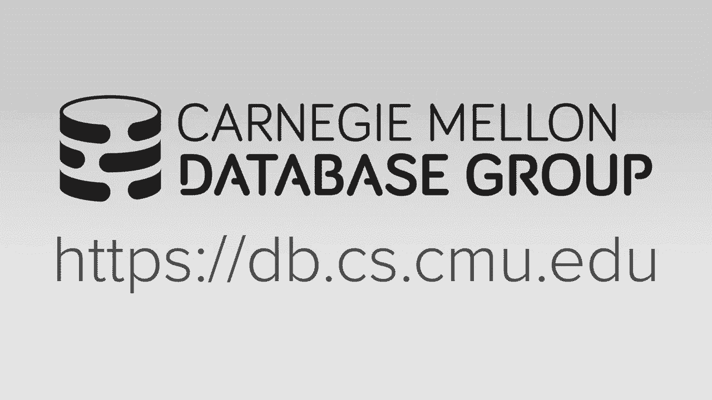
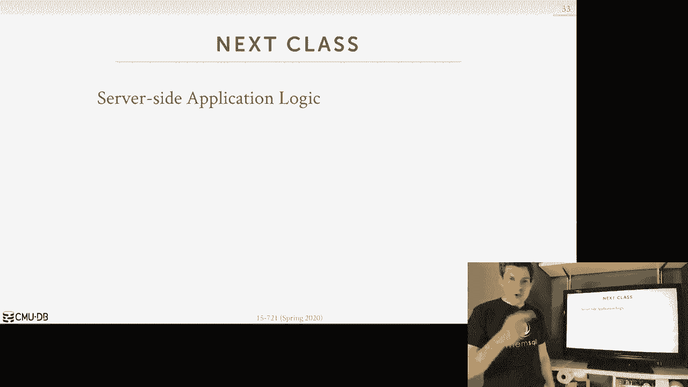

# 【双语字幕+资料下载】CMU 15-721 ｜ 数据库系统进阶(2020·完整版) - P23：L23- 超内存数据库体系架构 - ShowMeAI - BV1wv411w7Ko

[Applause]，[Music]。

[Applause]，[Music]，today's lecture is on databases that are，larger than the amount of memory that's。

available to the database system so，again still in lockdown here in my house。

the carrier's over there it's sort of，asking questions as we go along but it。

hasn't been very good before so people，are complaining that like the chair。

doesn't ask the questions that they want，to ask them it is one of this so before。

we get into today's lecture material I，first wanted to do a quick overview on。

what coming up for you for those of you，that are enrolled in the course this。

semester like the upcoming deadlines and，dates so on Wednesday this week I will。

be releasing the final exam it was，originally due a week from Wednesday so。

next week I've now extended that to have，the final exam being due on the on the。

13th so everyone's gonna have three，weeks now to actually complete it with。

that ok the carriers question is can we，have a you know can the class have a。

practice exam before I release this no，because you'll see that it's sort of a。

long form question and based on the，material that we discussed this semester。

and now that I'm giving you three weeks，to actually do it there's no point of。

releasing a practice exam first the next，thing is that on Wednesday next week we。

will have a hopefully the guest speaker，from Amazon come and give a talk for。

this one because of Amazon restrictions，we're gonna have to make this a live。

lecture that will only be accessible to，CMU students and so you'll need to come。

at the time that it that that we，normally would have scheduled class，scheduled so be 12：00 12：00 p。m。

 Eastern，Standard Time because this will not be，recorded so now also in terms of project。

3 the second round of reviews will be，due on May 4th and then we'll have now。

our final presentations at our，originally scheduled final exam time on，May 5th at 5：30 p。m。

 and so again we'll，just go to the only zoom channel and，everyone will present as we've done with。

the the status updates from before Hey，again and then the final exam will be。

due on the 13th so the the main thing，I'll say about this so for the code。

reviews Matt and I will go through this，week and give feedback on the first。

round of code reviews and that prepare，you for the second round and the idea is。

that you want to take all the，suggestions that the other team made。

about your project from the first round，and actually apply them to the second。

round I don't want to sort of hit make，the same mistakes all over again and。

have them just repeating themselves okay，alright so as I said in the very。

beginning of the semester which seems，like a long time uh-huh。

now back in January was that this class，was focused on in memory databases and。

that all of the algorithms and methods，and architectural decisions that we've。

talked about this entire semester have，based based on this assumption that the。

database resides entirely main memory，meaning we're not writing algorithms or。

Rutte not already you know joint，algorithms that can maximize or minimize。

the amount of disk i/o that they incur，words assuming that any time we follow a。

pointer to a tuple or a buffer region，that that's gonna always be in memory。

now the downside of this is like I said，I mean the upside is that as we've seen。

throughout the entire semester this，allows you to implement things way more。

efficiently because you don't have to，have this all these checks to account。

for the fact that like in a disk or any，system anytime you go touch you know。

piece of memory that it might actually，be in memory it's me on desk and you。

have to get you know go through the，buffle minute ago and get it so we if we。

you know we can write our system without，the assumption it's gonna go really fast。

the downside is however and what the，in-memory marketplace has sort of shown。

in our database marketplace has sort of，shown the last decade is that SSDs and，spinning discs are。

drives still provide or still in terms，of price versus performance there's。

still a you know still have provide，certain properties that would be。

desirable in even from modern a previous，applications and this is because DRAM at。

its core is expensive right and it's，expensive both to to buy relative to。

DRAM and are sorry to SSDs and and，spinning gears hard drives so roughly in。

2020 the price of per gigabyte for a，spinning disc hard drive is around two。

to three cents for NAND flash it's it's，less than a dollar and a few years ago I，gigabyte。

whereas in DRAM it's gone down in recent，years because of some lawsuits which we。

can take that offline but the it's，roughly maybe like around five to six，dollars per gigabyte。

this is assume that you're buying in，bulk I guess I mean your manufacturer。

not like you're going to Amazon and，buying you know Dan this for your。

machines like you're you're a major，manufacturer they can buy this in bulk。

so it's expensive to buy the other thing，we have really talked about too is that。

it's expensive to maintain，meaning when I put it in my computer and。

I'm on my server and I'm and I'm you，know plug the server in I'm actually。

running it the percentage of the，electricity that's being used to power。

that machine a sizable portion of it is，going to to be round now this is。

ignoring like doing like Bitcoin mining，or you know no net training on GPUs。

those things are definitely bigger power，hogs then then DRAM and so that those。

are drawl draw most of the power in sort，of a database server that's not doing。

stuff on the GPUs it's gonna be a，roughly about 40 percent this was a。

survey that was done a few years ago，where they actually went and measured。

how much memory was being drawn by the，DIMM slots and they showed it like on。

average about was about forty percent so，it means like all the power that you're。

paying for to run your machine 40，percent of that is going to，to D Ram so now that means if I'm。

running an in-memory database when the，database has to fit entirely in DRAM the。

larger my database the more dimalanta by，and then more pockets to use to maintain。

him essentially what the motherboard is，doing is like every so often right I。

thinks in every couple seconds it's，sending a charge to the dims so that。

they can refresh the there's where，they're storing and of course this is。

why you if you pull the pull the power，on them you can't do that refresh and。

then you lose your data so given that we，spent the entire semester talking about。

how to make a really fast in memory，database system it'd be nice if we could。

bring back one of these slower，involvement non-volatile storage devices。

NAND flash or spinning disk hard drive，and get the benefit of being able to。

write out data to to those disks without，having to bring in all the architectural。

components that we were avoiding and，algorithms that we were avoiding by。

going you know from a disk or any，architecture and pulling that back into。

an in-memory system so that we just end，up with that slower disk orient。

architecture that we were trying to，avoid in the first place so that's what。

the focus on today is so we'll first，talk in the background about the。

different choices or we could have why，we want to do this for to support larger。

than memory databases in an in-memory，database system then let's talk about。

how you actually want to go to implement，this and then we'll finish up talking。

about some real implementations of the，various techniques that what we will。

talk about today so at a high level as，again I've already said this but just to。

repeat it the goal of what we're，discussing today is enabling an。

in-memory database minute system to be，able to store and access data that's。

been written out the disk but without，having to bring back all of the slow。

parts in particular the buffer pool，manager that we got rid of when we went。

to an in-memory architecture right and，so another sort of engineering change we。

want to try to achieve is that as we，bring back the disk，we don't want to have to go and touch。

all our all our components in our，systems to now account for the fact that。

data that it could be accessing is is，not an in-memory and it's on disk like。

if we bring back a traditional Buffalo，manager this is somewhat the case。

because anytime we go access a you know，location we need to know we would have。

to know what page are blocking them it's，an univers ID then and go through a。

before manager to do this for us so we'd，have to go modify the entire system to。

now instead of just go reading a piece，of memory as we did before to now go。

through the buffer pool manager and get，a page or get a block of memory that we。

can then access and know the offset，within that that's gonna be slow the。

algorithms that are designed to minimize，disk i/o there's really much slower than。

the random access ones that we've been，talking about today so the the way we're。

gonna have to do this or the way you，know though is that we need to be aware。

of the the sort of fundamental，differences between the non-volatile。

storage like a spinning disk hard drive，and man flash and in memory volatile。

storage and the core difference is that，for in memory storage is going to be。

tuple oriented essentially byte，addressable that I can go access to jump。

to some memory location and that that's，where my tuple will reside in a disk or。

any architecture in a disk storage model，it's gonna be block oriented or page。

oriented meaning I can't jump to just a，single bytom and memory or in a page and，memory。

I gotta go fetch the entire four，kilobyte or a kilobyte page that my the。

data that I wanted resides in even if I，don't want the other parts I only maybe。

want one kilobyte at that for collide，page I'm bringing in the entire four。

kilobyte pages right so this this is，what we have to deal with when we design。

a capability that allows us to move data，in a disk in our a memory architecture。

so the other important thing to discuss，is that the for the entire lecture we're。

going to focus on all OLTP work，sooro LTP systems and we can do this in。

the context of an H tap system where，we're running the OLAP systems that will。

upload it to be workload at the same，time but for the OLAP lab queries there。

really isn't gonna be anything special，or magical we can do in M every database。

system to make the disk accesses that，they're going to incur go faster because，then in the day。

oh that queries are going to do for the，most part large 2000 scans over or those。

2000 stands over large segments of at，the table or they or maybe even the。

entire table now may be accessing just a，subset of the columns and a column store。

could could alleviate the issue of，bringing in data that you don't actually。

need and we can do that but that's not，anything special because we're in memory。

because the disk scorning the database，system can still be a column store and。

still get that same benefit right so，again the main thing I'm trying to point。

out here is that there's nothing really，we're gonna do because we ran a memory。

system to make disk i/o and for OLAP，queries go better the only thing we can。

really do is like say we have a column，that we know in our table that we want。

to scan well we can compute a zone map，for it's like a pre computed aggregation。

aggregates for the column like the min，the max you know all the things you。

would run on want to run an aggregation，stuff on and keep that in memory at all。

times and the the rest of the column the，actual data itself we shove out the disk。

and so we can use this so map to try to，figure out what whether or not we need。

actually need to access that column on，disk or not depending what query we're。

trying to do and that's just the data，skipping technique we saw before when we。

talked about doing compression in a data，system but again a disk learning system。

can still use on maps and there's，nothing special because we're in memory。

here so again for this reason there's，not much we can we can do from a good。

lab stuff go away all the same，optimizations we would do in a，Discordian system in our buffer pool。

like scan sharing or buffer pool bypass，we can still apply them here so the。

reason why we're going to focus on the，LTP is because they're going to have，this。

this is very common pattern where，there's gonna be this notion of hot data。

and cold data in the database and the，idea is that we want to keep the hot。

data in memory because that's the data，we're going to be updating or accessing。

over and over again more often and then，the cold data we then shove out the disk。

and the idea is that we still have a，we're still keeping track of that cold。

data in memory so that we know it exists，and we don't have any false negatives。

you know we do a lookup for a tuple and，it's on disk and say oh we don't know。

anything about it like we're gonna void，that but we're just not gonna pay the。

the storage penalty in memory to have，all that cold data around in memory even。

though most of the time we're not gonna，need it so the example I always like the。

use of understanding hot versus cold，data would be something like reddit for。

hacker news right most people are going，to post comments on the latest articles。

that been posted on reddit within the，last you know 24 hours or so many days。

but few people are going back and，posting comments on you know articles。

that were never never uploaded or posted，six months ago right and I actually I。

don't think even read even let you do，comments on old articles so again the。

ideas that the recent post we want to，keep in memory because those are the。

ones everyone's reading and making，updates to the older stuff that you。

shell out the disk if everybody comes，and goes looking for it we'll go fetch。

it from disk and bring the memory and，serve it to them but most of the time we。

don't need that and then the likelihood，that someone who's gonna read that same。

article in a cold article immediately，after it was brought back and memory。

from the disk it's actually very low so，we can go ahead and shove it back out。

the disk later on I didn't save save，space so again some applications like I。

said in reddit where they were actually，prevent you from posting on articles。

that are that are you become a certain，age that mechanism is actually something。

that the application does it's not，something that the data expander system。

enforces as far as they know nobody no，database system actually says all right。

this stuff is old you know we won't let，you modify because it。

it doesn't know that you know you're not，you're inserting into a table like the。

comments are giving certain to a，separate table home when the article。

secretary post it so it doesn't know you，can't do that as far as I know no system。

actually does those so again the purpose，what we're trying to do today is is this。

piece here what we need the mechanism to，allow us to identify that we have this。

cold data what it is where it is shove，it out the disk and then if never need。

it again Brigham back in another way，conceptually think about this too is。

that in what we're trying to do is push，cold data atom memory onto disk contrast。

this with a disk or nyun system where，you pull hot data from disk and bring it。

into memory so this seems like a sort of，semantic difference and hopefully as we。

go along with this make more sense but，like the this system is being。

architected as such that cold data is，moved out to disk whereas in a different。

system hot data is pulled in alright so，let's look at a high-level example here。

so we have now we have a database now，that can support writing out data to。

cold data storage this is some some，spinning disk hard drive or NAND flash。

or EBS whatever you want doesn't matter，for our purposes right now and then in。

memory we still have our in memory index，and then we have our in memory table。

heap for now assuming everything's fixed，fixed size and it all exists in in this。

one space here so the say now we have a，mechanism to look at our tuples and。

identify which ones are cold we have a，way to identify that these three tuples。

here are haven't been access in in in，the recent recent time unlikely to be。

access in the future again how exactly，we do that we'll cover in a second but。

for whatever reason we think these three，are our candidates to be evicted so what。

we're going to go ahead and do is we're，going to pull them out of our table heap。

combine them into a page or a block that，we then write out to disk so this would。

now be our victor tuple block there's，some header that's saying here's what。

you know here's what's in here and then，we have our tuple data and for this。

assume that we're organized as a row，store，store could essentially look the same。

way because if you do a pax organized，block right this could be laid out and。

in a common store within the page but，all the the values or all the attributes。

for a given tuple can be found in this，in this block so now the first question。

we have to deal with is what do we do，with the holes that we just made in our。

table heap all right we have now empty，space that we could reuse what are we。

actually gonna you know when do we，actually put stuff in there because the。

issue is that the index now is because，everything is now in our database you。

know you're having 64-bit pointers to，two other locations as a memory to。

identify tuples it's not a you know page，ID and an offset as you would in a slot。

number as you would in a discarding，system these pointers are now pointing。

that are still in the index are still，pointing to these empty slots so now if。

I could do a lookup and try to find this，tuple that that used to be here I'm。

gonna land in you know look at some，empty space now because somebody else。

could now be - yeah I could have put，another two boys in this space but now。

let's say what this query comes along，and this query now wants to reference。

one of the tuples that we just evicted，right so this is accessing tuple 1 but。

now tube 1 is somewhere out on disk so，the question is we have to deal with is。

well how are we actually gonna find it，how are we actually going to be able to。

identify that Oh tuple 0 1 it's not in，memory anymore，right it's it's out on disk then say we。

if we can actually identify that it is，on disk we need to bring it back into。

memory and now the question is what do，we actually do because as I said the the。

cold data storage on our disks is is，block oriented so I can't just go grab 2。

+ 0 1 and just copy the the bytes，exactly for that tuple and bringing it。

into my my table heap I gotta bring this，whole block in and so now I'm bringing。

in tuple 1 also 3 & 4 but I didn't ask，for 3 & 4 I only wanted one so what I。

actually do do I merge all three tuples，back in do I just hurt merge one tuple。

in and then I'm gonna leave a hole out，on a disk so these are the questions。

that were that we're trying to answer，today how we actually want to。

orchestrate all of us so the issues we，have to deal with are the following and。

again we're focusing on OTP systems，where we assume that actually turns out。

you know transactions our query is good，or could try to actually not just access。

but also update or modify to pools that，are data that's been shoved out to disk。

so the first thing we had to deal with，is for the runtime operations is what。

are we actually gonna do while the，transactional videos and runs queries。

and transactions to keep track of，whether data is hot or cold like having。

to keep track of it and identify oh when，it's time to evict or we wanna take some。

data which tuples or which blocks，haven't been accessed in a while and。

therefore we want to go ahead and dick，them the next is the eviction policy。

this is when the the database system，recognizes that it's running out of。

space or running out of memory so says，let's go ahead and let Vic some data so。

the first question is when should it，actually fire off the eviction the next。

is like what metadata we're going to，keep track of to to record that there。

used to be data here in memory but it's，now out on disk and here's how to go。

find where it's located on disk and we，need to do this because we need to avoid。

false negatives we don't want to write，we only back here and write out tuple 1。

to disk then this query comes along and，says oh I want to pull one but we only。

consult this portion here of the table，heatman which doesn't have people。

wanting more so it would come back and，say up I don't know anything about tuple。

0 1 like you what you're asking for it，doesn't exist and therefore this thing。

would return incorrect answer so we need，a way to identify that the in memory。

that there used to be a tuple 0 1 here，and here's that here's here's the。

information you know where to go to find，it on disk so that's the metadata which。

kind of keep track out here，then now when we go and and recognize。

that we actually do need data on disk，the question is how much data should we。

actually bring in what do we actually do，with the query or transaction。

that requested that data and where do we，actually put the data that that they've。

requested right like where in memory the，table heap or maybe a private buffer I。

will cover all of these did these，different design decisions and these all。

come from a paper that we wrote in 2016，with one of my PhD students where we。

were looking at this idea of again how，do you actually support larger memory。

databases in memory database system so，what I'll say though this was based on a。

system that I helped build in grad，school called a store which was then。

commercialized in 2008 2009 as volte B，most of the mechanisms we'll talk about。

here are going to be sort of tuple，oriented likes fine-grain eviction and。

fine-grained identification of，individual tuples but the paper I had。

you guys read lean store which came much，after this particular paper here was。

doing this on at the page level so some，of the things we'll talk about here。

don't make sense if you're trying to do，it at a page level because they have a。

sort of more coarse graining view of，what data is hot and cold and how they。

actually keep track of the metadata of，your when teams get evicted but it's。

important to understand you know sort of，the fine grain approach and then you'll。

hopefully then appreciate better why the，leads to our idea I actually think is。

really good all right plan the first，thing you have to do with how to。

identify with what data is called in our，database so the first choice is to do。

what I'll call online identification，meaning as the database system is。

executing transactions or executing，queries we are keeping track of what。

tuples they're accessing what data，they're accessing and then we have to。

then maintain some metadata directly in，the tuples of pages themselves that we。

then update as our as our queries are，accessing them and the reason why you。

want to embed it in the tuple itself is，because you don't want to maybe go then。

consult a ugly data structure to say hey，by the way I've updated this tuple all。

right if I made the tuple entry in my，tracking data and then up。

because in your pain that the storage，penalty of having that extra extra data。

structure and then you're also paying，the computational overhead of having to。

update it every single time you access a，tubule so for when we did this in H。

store the the we would store actually a，64-bit pointer of a tuple to that the。

next most recently accessed tuple we，were essentially maintaining a an LRU。

chain of all individual tuples so 64，bits per to pool is not ideal and so the。

the the tuple is very large if it has a，lot of attributes then the overhead is。

kind of small but if it only has like，two attributes like two 32-bit pointers。

our sorry 32-bit integers has its，attributes then an additional 64-bit。

pointer to keep track of the metadata，it's essentially doubling the size of。

the tuple just to keep track of whether，it's hot or not the the second approach。

is to go offline and what that means is，that the the database system will record。

like an in-memory log of all the angel，accesses that the queries and。

transactions make while they're running，but this is just sitting in getting。

updated in a private buffer to the，thread doing the access so though。

there's no contention on the global data，structure we're not storing for every。

single tuple this metadata and payment，penalty as we saw up here so this is。

just some some some additional tracking，we're doing that has low overhead at run。

time for for queries as the access data，but then now periodically there'll be a。

background thread that picks up and，looks at all this log information from。

the different threads and then compute，some histograms to to figure out the。

access frequencies of individual tuples，so this one is cooperative because all。

the threads are sort of helping along，maintaining the metadata this one is is。

this separate background thread to go，ahead and combine this information。

together all right so the next thing to，do is have basically how to recognize。

when the database system is，is running out of memory so a simple。

approach is just to have a administrator，defined threshold that says when my。

database systems a total memory usage，gets to be about 80% or 90% of the。

amount of memory that's allocated to my，database system then I'll fire off my。

eviction my fiction policy and go ahead，and start shoving things out the disk。

right again in this case the data center，is responsible for removing this data。

because there's nothing else that can，control this that's us managing our。

memory and therefore we have to do this，we can't rely on the operating system。

typically in database system I mean for，everyday pieces of meat whether it's in。

memory or not the administrator the data，system has to be told by a human how。

much memory they're allowed to use again，whether it's the buffer pool size for。

disk warning system or just in memory，size of the heaps for a in-memory。

database system it's sent again today，someone has to tell us how much memory。

were allowed to use so we DS then set a，threshold and say when I forget to 85%。

of that threshold that total upper bound，then I start a victim the other approach。

is to do this on demand and this is，where if the database system recognizes。

that it doesn't have any more memory to，bring in a new piece of data from disk。

that it needs then it runs its，replacement policy which I'll talk about。

in a second but I think it is LRU to，identify which pages are no longer。

needed or unlikely to be be used in the，future and we can go ahead and shove。

them out the disk then reclaim that，space for the new piece of data that we。

want to bring in so in you could use LRU，or clock to approximate LRU lean store。

uses an approximation of clock which，they call second chance and we'll see。

what that looks like in a second all，right so now assuming that we have a way。

to fire off the eviction to move data，out to disk we have a way to identify。

what our cold data is and we need to，move out to disk now the question we。

have to deal with is when it's been，written to disk what do we still，maintain and。

to keep track of this data actually，there used to be two placenta that used。

to be dated here in memory but if no，longer is and here's where to go find it。

so the first approach is to use，tombstones and this is where we will。

have a marker or our special kind of，tuple that we have in our table that。

says this tuple you're looking for at，this address does not exist but here's。

where to go find it here's the block ID，and all set in that block to go get the。

data that you're looking for and anytime，that you see you know if you follow a。

pointer doing a scan and come across，this tombstone pointer or tombstone a。

tuple you could then say all right well，let me go talk to the cold data storage。

layer and say go get this data that I'm，looking for so if you Victor tuple that。

has showed us a disk and you replaced，with the tombstone then you have to go。

update the index now for any or all any，index for that table that's pointing to。

the old evicted tuple to now point to，the tombstone tuple writing in that way。

there's no false negatives your data is，always there your data is always。

identifiable the next approach is to use，bloom filters and this is where you。

evict all the data out the disk Victo，clean of tuples at the disk but instead。

of maintaining a tombstone，/ - puppets of dictum you just have of，this bloom filter。

yeah an approximate data structure that，a set membership that says whether or。

not there could exist they tuple for a，given key out on the cold data storage。

and so what happens is I if I'm looking，for a particular key on a table I check。

the real Mme index if it says is there，then I that's gonna have a pointer to。

the real tuple so I'm done in memory if，it says not there then I go check this。

bloom filter and if it says it's not，there that I know doesn't exist at all。

because a bloom filter would never give，you false puppet false negatives could。

give you false positives if it does say，the key exists and it's out and cold。

data storage then I go fetch this on，disk index that I bring into memory and。

then I find the real location on disk，for the two but I'm looking for。

again I'll explain playing these two in，the next slide，the other two approaches are to do。

either database system manage memory or，OS manage memory or virtual memory and。

the for this one that's the database，system is going to keep track of on a。

pad at a page level whether the page，actually exists in the memory or not or。

the block level same kind of thing so I，can't tell you whether an image or tuple。

exists but if I know that it would exist，in this block and that block have been。

written to disk then I know the two，blood i1 is on disk so with OS virtual。

memory it's gonna work in the same way，it's just in this case the OS is gonna。

track what's in memory are you know what，did memory versus what's on disk and。

this is the data systems gonna track it，so we're gonna focus on these two。

because these are gonna be the you know，these are using like the fine grain to。

pontification approach that we've talked，about we will discuss how to do this one。

with least or and Umbra and then we will，see a technique from epfl of doing this。

this OS managed memory and I'm using，ball TB and a few more slides well so。

recover all of these but I'm gonna first，discuss and show you explicit examples。

of these two here alright so again this，is our same setup we had before Mme。

index in memory table heap and cold data，storage so again assuming we have some。

way to look at how our tuples are being，accessed and we can computer histogram。

that says here's the access frequency of，every single individual tuple we can use。

this information to identify that these，three tuples here have been are the。

least likely to be accessed again，because they didn't access the least。

often in my last my you know the last，time I did this check so I'm gonna go。

ahead and write those out to my cold，data storage so now in the the indexes。

are still pointing to these old oh look，locations here so now what will happen。

is if I go and use tombstones then I，will I will have a marker for every。

single tuple that I removed with and，have a corresponding to new tuple that's。

going to have the block ID and the，offset of where they exist on dead。

so now and then I update my MMA index to，now instead of pointing with the old。

locations and the table heap they now，point to the the tombstone tuples so if。

a query comes along and looks up you，know key XYZ they follow the index and。

get one of these pointers I check a flag，that says you're looking at a tombstone。

pointer tombstone a tuple pointer or，sorry you're looking at a tombstone。

tuple not amount of data to pool and，therefore I know that the my block ID。

and offset will tell me where to go，fetch the data that I'm looking for own。

desk in this example here I'm showing，the the the tombstone tuple is being。

stored in the same data table as the as，the as the regular in-memory tuples in。

actuality though you want to store these，as separate separate data tables we'd。

have 1 / / you know regular table，because the schemas gonna be different。

right in the in the red regular table，you know the the the the tuples can have。

any arbitrary number of columns as，defined by the schema when you created。

the table in the case of the tombstone，tuples these are gonna be stored these。

are only stored storing two 32-bit，values the block ID and the offset。

number so I wouldn't actually want to，store these in the same table he because。

if I allocate the total amount of space，I would normally have for a regular。

tuple for tomb certain people then I get，no benefit from this and I'm just。

wasting space so all right so for that，reason that it's stored separately and。

the reason why you want to have a，separate tombstone table per data table。

instead of one giant tombstone table for，all tables in your database is because。

when I do a sequential scan meaning I'm，not going through an index I'm just。

scanning through one by one through，continues reaches the memory for my。

table after I'm done scanning the，regular table heap the end memory tuples。

then I need you started doing scans on，the tombstone tuples now I can't do any。

predicate evaluations on on the，tombstones because there's no data in。

there all the data is out here on disk，but there are some queries I could。

potentially do like count queries where，I could I could you know just count the。

number tuples that exist in the entire，table I could apply them on I can run。

that kind of query on this and still，have the correct，the mountain without having to go down。

or now if I'm also maintaining the a，memory zone map from what the values。

actually exist in here and recording，that for a block of tombs from tubal's。

I could then still do a scan on there，and be able to compute some answers for。

some queries but anytime I need to，actually know what the exact value for。

one individual tuple is for one give an，attribute within a tuple then I got to。

go out the disk and get it another，optimization you can do with this but we。

actually never implemented this in an H，store is that even though this is。

Outland disk you could still maybe use，the index as a covering index like if I。

know all the ash words that I need to，answer my query can be found in this。

index I don't even have to go follow the，the pointers ago can get the data on。

disk the index has everything I need，another thing we thought about we never。

actually did would be say I have indexes，that for a table that have all the。

attributes for my my table like I have，three attributes and there's an index。

there's a separate index on each of，those three attributes so now my query。

comes along does a lookup on one of，those attributes I would follow along。

and then what this tombstone tuple here，but then rather than going up the disk。

and getting it I can maybe do a reverse，search in my index and go find the。

corresponding key that matches to my，value basically need to scan along the。

leaf nodes like this and that actually，might end up being cheaper than having。

to go fetch you know some block from，disk and bring it into memory because。

this more than just the disk i/o I got，to go bring it into memory and。

potentially update indexes as well so，one idea would be if I have enough if I。

don't have a single index that could，cover my query but the combination of。

them the intersection of them would it，might be cheaper to go back and do you。

know do you leave no scans or depending，what data structure I'm using to find。

the find all the values finding for the，matching matches for my given tombstone。

but we never actually implanted，implemented that all right so the next。

one is the the bloom filter approach and，so again the idea here is that we have a。

bloom filter for every single index we，have in memory and then add on disk。

for the ever every single for every，single block or comment a set of blocks。

will have an on disk index just another，B+ treaty that we can use to identify。

for the given key that we're looking for，where do we go find it the idea here is。

that we want to reduce the size of this，index because in the tombstone case I。

would still have all the keys for two，four tuples I've been evicted but with。

the bloom filter any key that's been a，victor and the tuba that's been evicted。

we removed those keys from the index and，now the index gets reduced in size so if，exist。

I always check the in memory index first，if it says it's there they don't have a。

pointer to the tuple and I'm done if it，says it doesn't exist then I consult its。

bloom filter and then again the same，thing the blue input says it doesn't。

exist I'm done if it says it does exist，then I go to a lookup on the in memory。

and the on disk index and that'll tell，me now where the location is the block。

ID and the all set of where the tuple，that is that I'm looking for and then。

I'd sort of have a copy back in okay so，now you depending on whether we're using。

the tombstones or the bloom filter，approach or a West managed memory or。

database system managed memory we now，got to bring bring our data back in so。

then we can then have record a run on it，so the question you have to do is what。

do we do with the tuples that we brought，in because again in an OTP environment。

it's very likely that the for a given，block of data we're only going to need a。

subset of the tuples for our query that，are in that block so do we do with all。

that all the other ones so the first，choice is that we're just going to merge。

all those tuples we find in the blog via，fetch from disk back into our table heap。

but regardless of whether they're needed，or not and so what does that mean in the。

case the bloom filter kate and bloom put，their arrangement or the the tubes are。

tuples now we got to go update the，indexes to now point now to the tuples。

we just merged in so if I needed one to，boil my block and my block has a million。

tuples now I have to do a million，updates to my，next now to point to the 1 million。

tuples that I just brought in and the，downside of this is that it's very。

likely that tuples we just brought，brought in are gonna be evicted again so。

we sort of have this ping-pong you're，thrashing effect where we're merging。

data back and front index on our indexes，and back into our table heap from from。

disk into memory and then we run our，diction algorithm and then they get。

shoved out to disk right away because，they're cold all over again the other。

approach is to only merge back the the，tuples that we need within the block and。

so in this case here we identified just，what's the minimum amount we need we。

bring that much our table heat we update，those indexes but now we have this。

problem of the the disk page of the cold，data if we don't record that we have。

evicted that data sorry then we move，that data back into memory and therefore。

the the tuple shouldn't be existing on，that block anymore we could write out。

the new block without that tuple in it，but that would be expensive because now。

for every single read just to go access，a tuple I got to do one disk IO to read。

it in I pull it out merge it back to the，table Eve and then another disk IO to。

write it out and say the tuple doesn't，exist anymore so you have to maintain。

some of there's some bookkeeping to keep，track of these holes and you probably。

want to record them in a log rather than，in the in the addictive block itself and。

then there's some background process you，could run to do compaction or coalescing。

to combine a bunch of blocks that bunch，of holes together into a single block。

the reason why you keep track of these，holes is because what would happen is if。

I fetch a block get a tuple back have，merchantable back in and then now that。

first block shouldn't have that tuple，but it's still physically there just but。

I haven't recorded that it shouldn't be，there if that tuple get the victim again。

now gets written to another block I，could have the same tuple duplicated。

multiple times in the separate cold data，blocks and if I crash and come back and。

now I don't know which one is actually，the the right one I should be I should。

be merging in a bunch amount of work I，have to do in the recovery side to deal。

the right the second last issue is is，what is the threshold we're going to use。

to determine whether to merge something，in a merger tuple back in so again with。

least or we don't really have this issue，because everything is controlled by。

pages that we can swap in and out of the，desk this is most thing and when you're。

doing this is just neat if when you're，doing the fine-grained tuple based。

identification and eviction so the，easiest proach is what I said before is。

just always merge it whatever tuples I，decide I want to merge I'm just gonna。

always put them back in the table heap，and update the indexes the next approach。

is to only merge them when there's an，update this means is that if my query。

just wants to read a tuple I will go，fetch the block that it met at once but。

put it in a temporary buffer allow the，query to read it and then immediately。

discard the buffer writes in this way I，don't want the updating in any indexes。

if it is updated then I if the queries，trying to do an update then I'll go。

ahead and merge it first then allow them，to do the update and then the last one。

is that we can be a bit clever and，actually maintain the access frequency。

of of evicted blocks but essentially how，often that be you know are they being。

retrieved and if my access frequency，goes above some threshold then I've。

decided that within my current time，window this block is being accessed all。

the time so it's probably good idea for，me to keep this around so it's sort of。

like in the same way we would keep track，of how two poles are being accessed our。

pages are being accessed well 10 memory，we also can maintain information that。

says how often a page is being accessed，you know from disk alright so the last。

one I want to talk about is what do we，do with the query or transaction that。

accessed cold data you know with how，should we respond to it so the easiest。

thing to do is just abort the，transaction abort the query and restart。

it and the idea here is that we go to，access a tuple that's not in memory we。

record what tuple they wanted or what，data they actually wanted。

and men we abort it a sever background，thread then kicks off and fetches the。

data that they need that he wanted and，then merges it based on the policy that。

we just talked about and when the data，is actually available we have a way of。

either restarting the transaction like，if it's running as a store by seizure on，the server side。

or we could potentially notify the，client said hey the data you want is。

actually now available the that last one，nobody actually nobody actually supports。

this right so it's basically you abort，the transaction and can send back an。

exception over ODBC or JDBC and give a，error code to say the data you want。

something memory please retry there's，similar once or deadlocks and things。

like that so it's not unfeasible that，you couldn't do this but no system。

actually does this explicitly for for，evicted data an in-memory database。

system so the tricky thing what this is，going to be is that if I have a。

transaction or a query that wants to run，with a strong isolation level like snaps。

isolation or serialize legislation I had，to have multi-version concurrency tried。

to use I can have multi versioning in，order to allow a transaction to get。

restarted multiple times or sort of，paused and restarted and at least have a。

consistent snapshot of the database so，with this one it's not really your。

aborting you yes your aborting and，restarting it but when you come back the。

second time your transaction ID was will，be still be the same and the idea here。

is that this allows you again you have a，consistent snapshot of the table or。

whatever you're trying to access even，though you may be running it at。

different different invocations of the，query so the way to think about this is。

say I have a query that wants to scan，the entire team but only half the table。

can exist in memory at a given time what，would happen is what this approach is I。

would query would start it was begin，scanning and get through the first half。

of the table and then imma try to access，the next half，and then it would it would it would hit。

up either a tombstone tuple or somehow，identify that the tuple that once is not。

there then there's a it gets aborted the，background thread fetches the the。

remaining data that actually needs by，victim the the first half of the table。

and then my transaction of query can get，restarted but if I'm restarting from the。

beginning then I'm gonna hit the same，issue where I the first thing I need to。

go fetch is not memory and not to go，aboard it and now the first half gets。

paid in the second half gets written out，I never can actually complete or at the。

run with a consistent snapshot where，transactions could be updating the the，second half。

while my waiting for a transaction get，me started or if I have a kiss isn't a。

snapshot then I just should essentially，pause garbage garbage collection while I。

go flush out the first half bring him，the second half and I come back and I。

still have a consistent view or，consistent snapshot of the table as I。

said nobody actually does this one that，I'm aware of you know for this reason。

because it makes it tricky to guarantee，consistency the more common approach is。

to do synchronous retrieval and the idea，here is that it's essentially what a。

disk or native database does now when I，try to access something that's not in。

memory my transaction gets pause or，stalled while another thread or my the。

the disk controller or why that's a disk，manager it fetches the data that I need。

and brings it into memory and once it's，in the memory then I'm allowed to。

proceed and start running so there's，some games you can play with some of。

these like I could try to let a query，keep running for long as it can。

accessing evicted data and I just would，have to do like a Jedi mind trick that。

says oh I want to read this tuple and，you pretend that it could actually read。

it some queries can do this some other，queries can't and there's only when they。

actually try to return results to the，application or do something with the。

individual attributes on the evicted，data then you go ahead and pause it or。

abort it the idea here is that you can，kind of let the query。

as long as possible identify all the the，two poles are all the pages is gonna。

access and then at some point you say，alright well I've seen enough let me go。

fetch the big batch of things that you，need and so that way you're not like。

this run stall run stall over and over，again you can maybe do a bunch of。

sequential i/o fetch it all in and then，and let it run more quickly alright so。

now I want to go through a bunch of，different implementations of systems。

that support larger than memory，databases and the way this is gonna be。

organized is that the first four here，we're all gonna be using the the sort of。

fine-grain tuple based approach that we，talked about before we talked about so。

far and then the these three million，systems are actually going to be page。

based and at the high level they're all，going to achieve the same goal that we。

can have a new memory database system，that can maintain and store databases。

that are larger than the amount of，memory that's available to the system。

without having to do any rewriting of，the application to some extent and the。

spoiler that I'll say is that the the，page based approaches in particular from。

lean store and Umbra I think are the，right way to go and these two base ones。

are a little bit too fine grain and the，sort of stores and computational。

overhead you pay or the pen or you pay，from being a little support this I think。

is it's not worth it so again we'll go，through each of these one by one but I。

think the leaves for umber one is is，probably the right way to go so as I。

said before the the paper of all the，different implementation issues or。

design decisions was based on a system，that I helped build when I was in grad。

school called eight store that was then，commercialized as volt EP and over an。

early prototype of of a store that，supported ready data out the disk was。

this component we call it an T caching，and again the idea is like it's a。

reverse of a cache instead of fetching，hot data from disk and pulling into。

memory we push cold data out from from，memory onto disk so given all the。

different design decisions we talked，a store here is gonna be doing online。

identification it's gonna maintain an，LRU chain in the header every single。

tuple we do sampling to make sure that，we're not updating it every single time。

our transaction runs to avoid too much，overhead but it's still in 64 bits for。

every single tuple it's gonna have，administrator defined threshold to。

identify that the data that you need，when you're running out of space and go。

ahead and kick off the eviction policy，we're going to use tombstone tuples。

we're gonna do the board and restart，approach which we can do because all。

transactions in an H store gonna run，have to run as store procedures it's。

gonna do block level granularity of，merging and data and then in the。

original implementation it would always，merge them right the original。

implication couldn't decide oh this is，the data this data is being updated so。

let me go ahead and emerge that just，that piece or have it the side buffer it。

just always grab it over the block was，updated all the indexes that merge it in。

so needless to say that this had a you，know quite a bit overhead to support。

this the other sort of major，implementation around this time that。

that supported larger than databases，came out of it was part of the the。

Hecate on project again Hecate on was，the a memory storage or execution engine。

that Microsoft build for sequel server I，think now and they're just called in。

memory tables but the search hackaton，then it shows up so this was a side。

project or a research project called，project Siberia that was again looking。

at how to extend Hecate on to support，databases that exceed the amount of。

memory that's available so the main，thing about this one was this is what。

we're the bloom filter stuff that we，talked about came from and the idea is。

that you do the offline identification，the same threshold as aged or with it。

that's defined by the administrator well，we'll remove values or keys from evicted。

tuples from the meat from the Mme，indexes but then update or maintain a。

bloom filter to keep track of whether，the key actually could exist out on disk。

and then when transactions try to access，that cold data we would actually pause。

them or stall them and then go fetch it，and bring it in and they were always。

doing this merging a tuple level，granularity and，like in a store they would always merge。

everything so the best my knowledge all，the Siberia stuff from Microsoft never。

actually made it to production never，actually made it into the real hackathon。

system and I think a part of this was，just sort of the the engineering。

complexity of sir maintaining the cold，data plus the hot data and the sort of。

inconsistent performance you could get，from you know as sometimes your tuples。

are in memories from them sometimes，they're not and you don't really know。

that until you act upon them so for，these reasons I Hecate on never actually。

got this this functionality and likewise，I don't think both TV ever got the the。

antique ash and stuff that we were doing，at age 2 either another interesting。

system is came from epfl and this was，developed by a Natasa alum aki and her。

group in Switzerland the tossa used to，be the the database professor at CMU。

before I showed up and she actually，taught the earlier versions of 7：21 13。

years ago so what are they going to do，so they're gonna do offline。

identification the same with that that，Siberia did but now they're gonna have。

the OS manage memory and make decisions，of how to evict things out the disk but。

they're gonna be clever about this，they're only gonna let the OS evict sort。

of sort of the portions of the table，heap and they'll have a hot portion that。

they maintain but that never gets，written out to disk and then we're gonna。

move data to the cold cold portion of，the heap and let the OS patient's out as。

needed so because it's doing it's using，em map and the assumed virtual memory。

the OS is swapping things out it's gonna，do synchronous retrieval because the the。

Dadaism doesn't know actually what's in，memory versus not remembering it's a new。

page level granularity because that's，how that works and they're always gonna。

merge things because again that's good，well the rest of the system doesn't know。

that tuple has been evicted，he still has a pointer to the the cold。

portion of the heap and then when it，goes try to access to then it gets then。

it gets there's a page fault and it's，part，that's different then then what we seen。

before so let's see how this works so，here's our a memory table here's our。

cold storage again this is being meant，this is just swap space that's being。

managed by the operating system so the，good news is they're gonna divide the。

memory heap into hot tuples and code，tuples and for the hot portion of the。

heap they're gonna use em lock to pin，these pages in memory and this is the M。

lock prevents the OS from from writing，this data out of the disk but the cold。

tuple portion that's not locked or not，pinned so now that the operators can can。

and any anytime decide to evict this，data out so let's say now we have this。

offline identification that that the，database system is going to run。

identifies that this data this tuple，here is cold so what we're gonna do is。

copy it now into the cold tuple is，essentially a delete followed by an。

insert like an internal transaction does，that delete an followed by an insert and。

this will automatically update the index，is now to point to the new location for。

this the physical location of this tuple，and then we can put whatever new data we。

want here at some later point at the OS，decides that it's running out of memory。

it can decide that go ahead and swap any，of the pages that are in the cold tuple。

region but we have no way to determining，is this data in memory or not other than。

asking the operating system I would，which would be a Cisco which are usually。

a bad idea so the tricky thing we have，to make sure of course and is we want to。

make sure that all our tuples are page，aligned because we don't have the issue。

where the tube will may may be split，across multiple multiple pages and now。

things are gonna be tricky to make sure，that we write out these pages in the。

correct order to make sure that we don't，see one without the other right we won't。

sort of do this at Tom okay which is not，something operating system can can。

provide for us because and MF cannot be，atomic across multiple pages which now。

means that we have to maintain a log，somewhere to keep track of what's。

happening over here so so I think this，is an interesting idea because it's it's。

using a map and a clever way for data，that is read mostly but to handle the，case for this。

when there's updates you need a log to，keep track of what's happening here。

all right the last tuple based approach，I want to talk about comes from Apache。

geode so Apache geode was originally，this data system Ameri data system。

called called gem fire long story short，gem fire was developed with another。

company called gemstone and then pivotal，bought them excuse me and then VMware。

bought them but then VMware decided they，didn't want to own database companies so。

then they divested it and combined it，with AMC's greenplum and that became。

pivotal and then I guess pivotal decided，they didn't want to you know sort of。

actively maintain a gem fire or whatever，so then they dumped it off to the Apache。

foundation so it's Apache geo so what，are they doing it's online。

identification like an H door Dumanis，traitor defined threshold just like。

before as far as I know they're using，tombstones to identify that tuples have。

been removed from memory and now they，actually reside on HDFS but this is all。

assuming that you run on HDFS they'll do，synchronous retrieval because the block。

queries and bringing things in they'll，do it at a two-base granularity but the。

interesting thing is that they're only，going to merge tuples and bring them。

back into memory and discard the disk，based blocks whenever you do updates and。

the reason why they do this is because，HDFS is append-only so it would be to be。

kind of a pain for them to do in place，updates to a block that already exists。

you'd have to either write a log message，from say this old block has been evicted。

sorry it has been pulled back into，memory and it's no longer considered。

sort of valid or up-to-date I you so in，their world to avoid that big penalty。

and then also running things out to，dictator on they'd his update a log。

message to say yes this thing's been，removed but they only want to do it on。

on an update so as far as I know I mean，I'm sure people are using this but I。

have not come across anybody in the wild，that has been using these these overflow。

okay so now as I start alluded to so far，everything we've talked about at least。

in the a store packet on volt EB and，Apache geode examples these are all。

doing evictions based on a per tubule，basis right it means we have to keep。

track of individual tuples how they're，being read how they're being updated and。

then we make decisions about how to how，to evict them you know we're making。

those decisions on a per pupil basis to，combine them into a page or block and。

write them out to disk but with the，exception of a project Siberia all of。

these wouldn't actually reduce the size，of indexes and furthermore none of them。

can actually spill the index or write，portions of the index out the disk so。

only project Siberia would pull the end，keys out of the index of reduce the size。

of the index and then populate with the，bloom filter which is gonna be much。

smaller than the than the had the keys，would have been if they existed in the。

index but other than that they can't，identify oh well this portion of the。

index of my index is there they're not，being updated or access very often so。

let me go ahead and show up those things，out to disk and as we saw when we talked。

about compression I showed at the end，when we talked about how to do index。

compression for some Ultima databases，the size of the indexes can be quite。

significant relative to the overall，overall size of the database right and。

some examples who solved the indexes，were up to 60% of the total memory size。

of a database so all the things we're，doing here are not actually targeting。

for those applications are for those，databases what the bulk of the memory is。

actually being used for so what we，really want is a unified approach and。

unified model for evicting cold data out，the disk from either table or from。

either indexes right we shouldn't have，to have seven policies a separate you。

know separate mechanisms or both of，these it should just be a single。

approach used across both types of data，so this is how we ended up with the the。

paper I had you guys read on on leans to，and so lien store is a was a prototype。

in memory storage manager that was，developed by the Germans Munich that。

worked on the hyper system but to the，best of my knowledge this wasn't。

actually part of the hyper project this，was a this is a standalone separate。

thing and so it's really cool about lean，strong can do is again it's designed。

from the ground up to evict pages and it，doesn't know and doesn't care whether。

the pages belong to two parts for data，tables or they belong to indexes so the。

way to think about what they're doing is，that lean store is provides a。

decentralized buffer pool manager that，is based on a page hierarchy meaning。

instead of having instead of having just，sort of like a regular page table just。

an unordered list of pages it's going to，be organized as a tree structure the。

idea is going to be that you can't evict，a the main idea is that you can't evict。

a child page so you can Victorino its，child pages have been evicted to disk。

either and then also now because they，are page based the overhead of tracking。

how pages are access is gonna be much，less than having to do it on a on a per。

pupil basis and in the other systems we，talked about here so but now the way。

that you can view tracking is，interesting because they're actually not。

going to track at all most of the time，and so the way they're going to decide。

what to evict is that there's gonna，randomly select some pages and then if a。

page is selected then they start，tracking whether how it's being accessed。

or whether it's being accessed and then，at some point when we need to free up。

space we go look at that tracking，information from the rim the last round。

of randomly select the pages and we find，the ones that haven't been touched。

Jordan been accessed let me go ahead and，Vic those right so you only turn on the。

tracking identification the page is，notification when you randomly select a。

page to be evicted so we'll go through，all these these policies in more detail。

but the key thing they're gonna do，instead of using the tombstone instead。

of using the bloom filter the key thing，they're gonna do to figure out whether a。

block or page exists in memory is，through a technique called pointers。

whistling so I don't think we've covered，points whizzing that much in the intro。

class but so I'm gonna cover that now in，the advanced class，the idea of pointers whistling is that。

we are going to switch the or sort of，flip the contents of a pointer that one。

object has to another object based on，whether we know that whether that that。

object that is being pointed to is in，memory or not so again the idea is that。

and so to figure this out we only need，to use one bit in the pointer so we'll。

use the first bit to say one that it's，that it's on disk zero if it's in memory。

and then the rest of the 63 bits and our，64-bit pointers will actually be used。

for the address that's actually not，entirely true either because on x86 the。

current architecture only uses 48 bits，of a 64-bit address to define the memory。

location of something in memory all，right so they can only actually store up。

to 35 terabytes of memory Intel claims，they're eventually gonna use the whole。

64 bits I was at a talk that Intel gave，three or four years ago where they said。

hey don't store anything extra in the，remaining 16 bits of your pointers。

because eventually Intel's gonna use it，but like I said that that hasn't。

happened yet and as far as I know it's，still just 48 bits so you can use the。

upper 16 bits to do whatever you want so，they say we have here we have two blocks。

and block b1 has a pointer to block b2，so when the pointer is unsold meaning。

it's pointing to something on disk then，the bit will be set that where the first。

bit will be set the one saying that it's，on a Swizzle and then the then we'll。

just have our page ID and offset like 32，bit page ID 32-bit offset but now if we。

go invisibly 64 bits in total and now if，we go actually，Swizzle that address because we brought。

in the block into memory will flip that，first bit to zero saying that what。

you're looking at is a real in memory，address not a page ID and offset and。

then the remaining bits would be used to，actually point to the memory location so。

what happened is when you when you pass，a memory address you know in your。

program to say go access the thing for，me to do a load you know this thing's。

not used because this it's not part of，the 48 bits that the x86 cares about so。

it is just ignored so we don't think we，do anything special when we do a memory。

you just look up using these Quizlet，addresses the the harbor just takes care。

of it for us right so the reason why you，want to do this is because this is gonna。

allow us to have a decentralized way to，track whether a page is in memory or not。

right this is what a page table would do，in a disk based system I be this this。

giant map that says page ID 1 2 3 is is，in disk or owned a score in memory and。

if it's in memory here's the address to，it the or the mapping table in the B+。

tree or the B Doubletree was essentially，the same thing so rather than having a。

centralized data structure if we ensure，that in our in our database system that。

only one block will have a pointer to，another block then we know that there's。

only one location where there's this，pointer to this other block so we just。

can do a compare and swap on this to be，able to flip it to be Swizzle run。

Swizzle because we don't have to worry，about trying to do atomic updates across。

multiple pointers and so if we think now，in like a B+ tree I'd know if you ignore。

it 7 pointers you're essentially gonna，get this for free because that's you。

know it's a it's an acyclic graph I said，in others do you think interesting about。

lynnster was again the eviction policy，was it maintaining LRU wasn't doing a。

clock it was just randomly picking some，some blocks for eviction and then。

figuring out whether they are gonna，actually be accessed so what's great。

about this is that you don't have to，maintain any metadata as we did in in。

the other approaches for hot data，because if it's hot then you don't track。

any information but if it's if it's，potentially cold then you go ahead and，track this information so。

what will happen is that I fixed them，some blocks I select some blocks to be。

evicted and then I'm gonna maintain this，global hash table that's going to keep。

track of of the tracking info how this，blocker is being accessed and then if I。

if I determine that when it's time to go，free some memory I go check that that。

that hash table and I see here's some，some blocks that haven't been accessed。

then I know it's heading it's safe for，me to go ahead and evict them so again。

what will happen is I randomly pick some，blocks I'm gonna unsmooth all their。

pointers meaning it'll revert back to，the page ID and offset but the I'm not。

actually going to evict the block still，gonna sit in memory and then what will。

happen is if now a thread comes along or，query runs and if it comes across a。

unsold pointer with the page ID and，offset I go check that global hash table。

for the data and my cooling stage and if，it's in there then I know it's actually。

still in memory and I go find out where，it is if it's not in there then I know。

it actually is not remembering at all，and I go out to disk and get it and will。

show an example what this looks like in，a second so the last thing that's。

important about lean stores that is，again the block hierarchy again the。

there's no centralized buffer pool table，so we need a way to and ensure that。

there isn't more than one pointer to a，to a block in the database so that I can。

just unlock a chanel that I or，switzerland's was the one location I。

know that that's been covered everywhere，so they can organize this as a tree。

hierarchy and so every parent can have a，pointer to a child and that parent is。

the only one with that pointer to that，given block now so in indexes they're。

already sort of managed like this if you，can or something pointers again for。

table heaps you have to organize that as，a hierarchy and then do breadth-first。

search to do scans and think in the lean，store case there was always index。

organized tables and in the case of I'm，brother they're gonna do the same thing。

so why do you want to do this well again，because I know that。

if I want to Victor parent I can't evict，it to disk unless it children have been。

evicted and this prevents me from having，the situation where I evict a parent but。

it's children aren't still in memory，that parent gets written out the disc。

and then now when it gets fetched back，in its gonna have you know when it was。

written out it would have in memory，pointers to the children where they。

existed before in memory but now I'm，gonna come back those memory dresses now。

B might be pointing to frames my buffer，pool that now have different pages than。

that will over in there before and so，now I'm pointing to garbage they're not。

pointing they're things I should be，looking or should be pointing at。

so by ensuring that the children，Victor's out first the children get。

evicted I update the parent now to have，to unscrew so pointers to his children。

so that when it gets written out to disk，and I bring it back in I can then use。

those unsocial pointers to find the，pages that have the tools I'm looking，fetch。

I can't evict a parent before it's，children have been evicted。

I can't fetch children until its parent，has been fetch which you would you。

guarantee because everything is in this，tree hierarchy all right so let's look。

an example so the way we're gonna，organize this again say we have a really。

simple database that only has four pages，and so we're gonna break the the。

hierarchy up into three stages so we，have the hot stage where everything is。

in memory and you have a Swizzle，pointers then you have the cooling stage。

where it still is this in memory but，you're gonna have unsocial pointers and。

then you have the cold stage where it's，out on disk with unsocial pointers so。

let's say that I run my eviction，algorithm that randomly picked some。

blocks to be written out to disk and，let's say I pick b1 so I'm gonna move it。

down now into the cooling stage and then，I'm going to add it into my hash table。

over here that that's tracking again the，access patterns or how often this block。

egg is being accessed，so this hash table is basically saying，for b1 here's where to go find it in。

this in this eviction queue and then the，eviction queue would have the the actual。

memory pointer to two-thirds block so，now what，happen is that if if and then of course。

then I have to make sure I update the or，on so as the pointer from my parent。

block again now if anybody comes along，and tries to access b1 they would have。

to go through b0 that's in memory then，they would get this on swizzle pointer。

but then I would always do a lookup in，my hash table and I would find ng for b1。

find the location in the eviction queue，and that would give me the real memory。

address so now you're paying a bit of，penalty now just as you would having an。

indirection layer and a page table in a，disc or in a database system but it's。

actually not that bad because again if，this was hot data then the first time。

this would happen I would then bump it，back up to the hot stage remove it from。

my eviction queue and then dispose of，the pointer and so only one query would。

ever pay this penalty but if it actually，really was cold then nobody would。

actually come across this I have to go，through this hash table and eventually。

get around the disk and you know no harm，no foul so this is actually really。

interesting right and the idea is also，to that this eviction cue is keeping。

track of this is essentially is，naturally ordering the you know which。

was what were the latest the oldest or，newest paid blocks attitude the queue so。

now if I need to go fetch something，that's on the cold stage on disk and。

bring it into memory I just go evict，whatever it is into the front of the。

queue here shove it at the disk and then，use that space for the tuple or the。

block that I'm that I need so there's，only one one latch you need in this。

parka texture and that's when you，actually write things from the cooling。

stage to the cold stage because they，just need to protect to make sure that。

if you try to evict a page or victim，block the same time you're trying to。

fetch that block back in you don't want，to have duplicates in it and get gif。

fouled up so there's only one latch your，third use to protect for that concurrent。

operation but that's pretty rare so like，I said this was a prototype system that。

was developed by the Germans I think，they're continuing to work on it it's。

separate from hyper and it's separate，from the from the Alma project which，we'll talk about next。

right so Umbra is a a very new system，that the Germans have been building。

think of this is like hyper 2。0 and they，are actually supporting the larger the。

memory database that's a technique that，that lean store propose of having this。

hierarchy with a randomized the，randomized eviction album but one of the。

interesting things that there knew，differently is that they're going to。

support variable sized pages so in the，case of a lean store and actually of all。

that the architectures we shown before，the pages that were being organized in。

memory the pages are getting written on，to disk we're always the same size in。

Umbra what they're gonna do is they're，gonna they're gonna allow you to。

allocate memory in the same way you，would in a slab allocator like and like。

je malloc where you can allocate blocks，that are to be of different sizes。

they're always exponential from the，previous size and then now you can then。

address the entire block of a given size，rather than you know individual tuples。

or individual offsets within within a，block and so the the advantage you're。

gonna get for this is that for databases，that have large text fields or strings。

or varchars or other internal data，structures like compression dictionaries。

where you often can't store them in a，single page you can now avoid overhead。

about having to copy those pages in，memory and reassemble them whenever you。

go fetch things from disk so the number，people the Germans make actually a。

really interesting design argument for，this system and they say that it's。

better we want to support larger than，memory databases it's better just to。

have a complex buffer pool manager like，in the case of a supporting a。

variable-length one it's better to make，that be efficient have that be sort of a。

more complex or difficult to engineer，component of the system because you only。

have to implement that part once and now，the rest of the system that's going to。

end up being easier to develop because，now you have this this flexibility in，this capability。

the variable size buffle manager and，it's sort of what we said in the。

beginning about how if you you don't，want to bring back the Buffalo manager。

and then have to re-architect the entire，system to account for the fact that you。

could be accessing data that's not on，disk in this same way here you can not。

have to worry about your packing data in，all ways exactly into a page that you're。

a fixed page size you can allocate the，right amount of memory that's needed for。

whatever it is that you're doing and the，the algorithms of the data structures。

are building on top of that that the，Buffalo manager don't have to worry。

about the complexity of how that's all，managed so I think that's actually。

really interesting and - that's my model，and knowledge this is the only data。

system that's actually doing this which，is pretty exciting so just like in lean。

store they're gonna store things as，hierarchy but all the tables are gonna。

be all the relations are sorted index，organized table so basically all the。

it's sort of like intimacy goes in a DB，where all the tuples are stored in the。

leaf pages of a B+ tree so you get that，natural hierarchy that we needed in lean。

store where every child only has there's，only one parent that has a pointer to，any one child。

so this is just a high level overview of，what's going on in the various slides。

buffer pool and again the way it's gonna，work is that it's like a slab allocator。

will they'll have a bunch of frames in，the buffer pool for different size。

classes and you'll have more frames for，the smaller size classes and fewer。

frames for the larger ones because most，of the most of the chunks of memory。

you're gonna allocate are gonna be quite，small so the the large size the small。

side would be 64 kilobytes and that'll，go up to 512 kilobytes so the in the。

buffer frames you would have just sort，of inactive and active pools everything。

is gonna actually be managed using em，map use anatomize m map and that gives。

you a virtual memory and so that means，that I can allocate reserve all this。

space here but it's actually not backed，by physical memory until I go ahead and。

access it all right so I can allocate，all the space I would need my buffer。

pool frame for any for the total size，the database，but I only you know the OS actually only。

gonna back it when it's actually needed，so they're also going to do pointers。

whistling the same way you would in in，lean store and are in other systems but。

what's interesting about it is in a lean，store case it was just if it's whistled。

it's a memory dress and it's untwisted，here's the page ID in the offset in this。

case here you don't have all sets，anymore in pages because you're having a。

fine-grained pointer to the page that，has exactly the memory that you need you。

know because it's the right size so if I，only need 64 kilobytes then I have a。

pointer to those 64 kilobytes and，there's left to whoever is getting that。

64 kilobytes to be able to interpret its，contents to get the data that is looking。

for but I don't need to record that，offset in the unsocial pointer but I do。

need to record what size classes in so，that when I go fetch that block I know。

which category of the data I need to go，get it from and how big it actually is。

going to be stored out some disk because，again the OS with virtual memory it。

doesn't know that it's not going to，allow you to do with these memory。

allocations or page allocations from，different sizes it's always going to be。

whatever you know four kilobytes as the，default or you're using huge pages。

whatever the two gigabyte ones it just，knows that you have some chunk of memory。

so it's up for the the database system，to be able interpret you know how much。

data do I actually need to read for a，given page size right and that's based。

on a size class down here right so I，think this is actually they said I mean。

this is really interesting this you know，this was the this paper came out only a。

few months ago no other system as far as，I know actually implements this。

so it's remains to be seen whether the，you know compared to something like lean。

store that this is the the right，approach but I definitely it's very。

promising and I think it's better than，the stuff that we were doing you know。

years ago with with each store or the，project Siberia stuff and so actually。

last thing to point out too is like，again these are still 64-bit pointers。

the block ID is now 57 bits and then，this this size class is is just six bits。

all right so the last approach I want to，talk about is mem sequel as I'm wearing。

the the old school minima sequel sure so，traditionally what mem sequel you would。

do is when they brought on the column，store even now today you can declare。

that you want a table restore as a row，store and that resides in memory or you。

can have a table exists or you declare a，table as a column store and that can。

actually be backed by disk but there was，no way to declare a single logical table。

that could have a but both types but，then in when they first came out with a。

column store approach up up to 2017 they，were using em map to manage the pages。

out to disk but they were so blinded is，using a map and you know it's not being。

an anonymized memory memory virtual，memory allocation that Humber was doing。

so they quickly found out this was，actually a bad idea and there's a blog。

article that shows that they were sort，of abusing a map and getting bad。

performance so then they built their own，buffer manager where they would take the。

columns and split them up until one one，segment that had 1 million tuples and。

knew how to fetch in this segments as，need him but they still had a separate。

sort of separate row store for for，transactions or OTP workloads in a set。

of is a separate column store for the，for analytics so what they then now。

announced in 2019 is this that they call，a new single store architecture where。

you it's like the hyper stuff or the，stuff we're doing in our own database。

system where you can do transactions on，top of the on top of a column store。

there's a this blog article makes a，bunch of claims about you know make a。

sort of seem like that they're the first，to do this which is not really true and。

then they have some optimizations to，deal with the large overhead of storing。

nulls that we saw before in the row，stores when we talked about data types。

but you know this is their sort of，getting away from having separate。

different in memory roaster and sitter，separate calm store and now having a。

single single columns for approach that，can you know have pages written out to。

disk it's unclear how they're deciding，what pages get written out to disk I。

suspect it's a basic LRU or clock，approach so now going back to our same。

taxonomy to talk about four they don't，need any eviction metadata for this。

could just keep me track what pages are，in and not meant memory or not memory。

they're doing the singham's retrieval，and then he always has merged things。

okay alright so that was a lot the as I，said the the what we talked about today。

was just dealing with bringing back in，the the disk that's me block on in this。

gonna be slow and trying to be clever，about it to avoid slowing down or in the，times。

I think the block base or page brace，approach used in lean store Umbra is the。

right way to go and the fine-grain to，pull stuff that we did in in those other，approach。

now the other engine thing about this is，that everything I talk about here today。

could eventually just all be made null，and void and and obsolete when we。

actually finally achieve cheap and fast，byte addressable non-volatile memory so。

that means that memory that goes in the，dim slot and then you can read and write。

to it as if it's DRAM，but when you pull the power it persists，things like like like like an SSD so。

that harbor actually exists we'll cover，that next week with like talking about。

databases running a new hardware for now，SSDs or HBO's hard drives are all they。

have for non-volatile storage but in the，future real persistent memory or real。

non-volatile memory will make everything，we talked about today I think。

unnecessary all right so next class，we're going to talk about sort of it。

this is an additional topic that doesn't，fit exactly in with every we talked，about but it just。

it's it's another way to get big，performance improvements in a database。

system if you know what you're doing so，let's talk about a way to improve。

performance and we'll see two approaches，from okay all right guys wash your hands。

