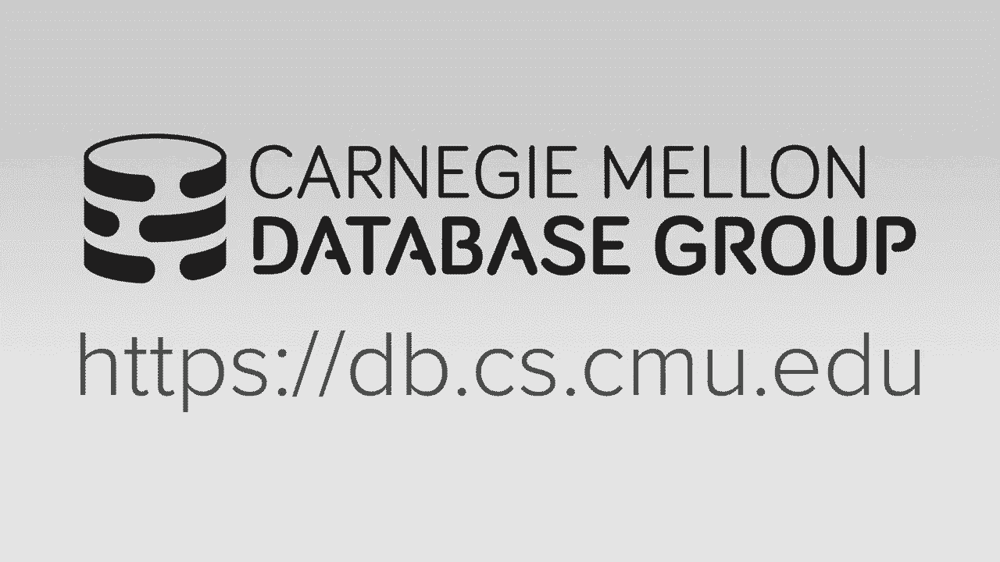
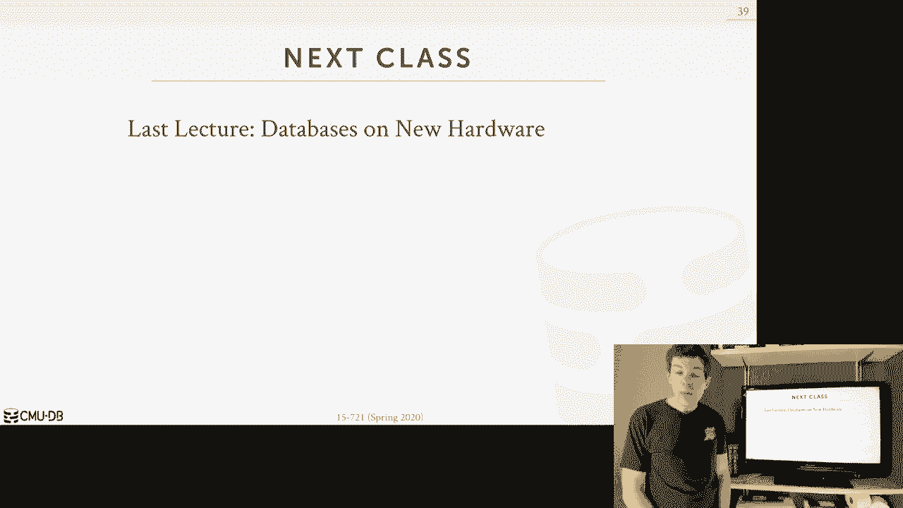

# 【双语字幕+资料下载】CMU 15-721 ｜ 数据库系统进阶(2020·完整版) - P24：L24- 服务器端逻辑执行 - ShowMeAI - BV1wv411w7Ko

[Applause]，[Music]。

[Applause]，[Music]，so in today's class we're going to talk，about server-side logic execution again。

I'm at my house here with the Terrier，who for some reason smells like onions。

I'm not sure what that what that's about，um so for today's lecture this is a。

topic that I find very interesting and，it's not something I would say that is。

critical for building a sort of modern，high-performance inmate database that。

we've been talking about the entire，semester this is now making it so that。

people can you know extend your database，system and have it integrate with more。

different types applications so again，this is not something we're going to do。

try to support because we want you know，you absolutely need to get the best。

performance although it's gonna help in，the way we're gonna exclude our UDS are。

gonna help this is more about sort of，extensibility of the database system but。

we want to do it in a really smart way，so for today's lecture we're going to。

first start talk about the background of，this what I mean by server-side logic。

execution and then we'll focus on how to，optimize the performance of user data。

user defined functions the one way would，be the the inlining approach that was。

used by Microsoft and the fraud paper，that you were assigned to read and then。

the other approach would be a newer，method at a Germany on converting UDF's。

into common table expressions again both，of these are about making UDS run faster。

so as I said server-side logic execution，I think is an interesting topic I used。

to teach it in the introduction class，the last night audit I think was maybe。

2018 and unfortunately last mr。 we had，to cut it out so this is not something。

that maybe if you've been here at CMU，that you may be familiar with so it's。

been a little time discussing you know，what it is you know we're actually。

trying to do on our database system so，the key observation you have to make。

about what server-side logic execution，is going to do for us is that up until。

now we've assumed that there's，then this clean division or dichotomy in。

our application stack between the logic，that's in the application server and the。

logic that we execute in the database，system and the database system would。

only see queries that were being sent，over from a like what I'll call a。

conversational API like JDBC or ODBC，like what we talked about early in the。

semester and the downside though with，this approach is that it's going to be。

you know it's it's a chatty API like，hypocenter query get resolved and then。

process it and send result back all，right so we saw this a diagram sort of。

like this before when we talk about JDBC，or ODBC right on the application side。

this is where our essentially our，program lives right whether it's written。

in nodejs or a PHP or Django you know，Python application right here's all the。

business logic or of our of our program，and so when we started transaction we。

would call begin and then we would，execute a gift to a Segal save and。

execute something that would then go，over the wire again throw through ABC or。

JDBC and that'll run through the full，stack that we've talked about like the。

sequel parser the plan of the optimizer，and eventually due to the query executor。

now you can use prepared statements，maybe skip the first fresh two or three。

steps but in the end you're still going，to execute the query so then now the。

data system X uses the query and the，sends the result back and then now the。

application server can proceed with the，program write this the sequel call is a。

blocking call on the application side so，now while goes off and execute some or。

program logic to process whatever the，results that it got from the sequel。

query our database system is idle for，this particular connection now again。

it's a multi-threaded system or multi，process system so therefore we could be。

processing queries from other，transactions or other you know from。

other connections at the same time but，for the the context handle we're going。

to maintain for this particular，connection it's essentially idle so that。

means that it for running is in a，transaction if we're using something。

like two-phase locking as a concurrent，you to a protocol whether locks that we。

acquired for this sequel statement are，now just being held on the servers。

side because it's waiting for the next，command to be told what's gonna happen。

for this particular transaction and this，network round-trip is not cheap but you。

know best-case scenario we're running on，the same machine but that's not very。

common it's usually you have a service，reapplication a separate server for the。

database system as you can sort of scale，them independently and so maybe you're。

on the on the on the rack unit right，above you know the application server is。

one unit below the database server and，the same rack but again that's pretty。

uncommon too high so this could be a，couple milliseconds to send this you。

know these back and forth and who knows，how long this program log just gonna。

take to execute so then now after we，complete the program logic here maybe we。

do the same thing we exit another sequel，query send it over get a result send it。

back we do some more processing and then，we wait and then eventually our。

application says okay we're done we send，a commit message and then we can release。

whatever locks or whatever memory we've，allocated for this transaction whatever。

we did to maintain the state that we had，this connection open and they were。

exiting transaction when we get the，commitment we can finally finally start。

to clean things up so the things we're，going to talk about today are。

essentially how to take that application，logic on this side and now move this。

inside the database system to avoid，these round trips and have the you know。

have transactions take longer or，whatever the query we were executing。

take a longer try to combine everything，into a single vacation invocation that。

we can send just one request to the，database server and not go back and。

forth to the application we're also，going to bed logic that allow us to。

extend the functionality of the database，system so in some cases we'll be able to。

do certain types of manipulation or，filtering or other types of steps we do。

when we process queries we're able to do，that in a way that the original。

developers of the database system may，have not anticipated or may not you know。

offered to support so again so the，benefit will get from this is that。

because we're going over we could make，fewer round trips that'll improve the。

efficiency and of our system，because now transactions can take we're。

gonna execute in less time we're also，going to get some reuse because now if I。

have some functionality inside a bed in，my bed it's on my database system with。

now I have my my web application now is，to be ported over to a mobile phone。

application instead of rewriting the PHP，code my web application to now be swift。

or whatever I'm using on my cell phone，like whatever that application logic I。

had to use to interactive a database，system and the website I got to ported。

over to the web to the mobile phone，application but if I can embed it inside。

the database system then now potentially，the same logic that would be executed on。

the on the web site could be executed on，the mobile phone again depends on your。

application stack a setup I did it，assume that there's a logic running it。

and button both in both of them so what，does that look like so one example a。

simple table that I just showed here，that we could take this entire。

transaction logic and somehow send that，over to the database system it'll get。

installed and then it will the ability，to call it will get exposed through some。

kind of function handle like what's，called as proc and then it takes an。

input argument of whatever you want so，now if I want to invoke this transaction。

in my application I don't do that back，and forth that I had before now I just。

use this invocation or this command，called call so I call the function and。

pass in whatever argument I want to that，function I send that one request over，like an RPC。

it executes commits and then I get back，the result so the benefit about this is。

that it's one round trip over and to，execute all this complex logic where。

before it was multiple round trips now，in this case here I'm invoking with call。

other this might be the in the seagull，stander and other databases systems。

might support exact or execute I but the，basic idea is the same so this is what。

is called a strop a seizure with the，idea is that we can take a chunk of。

logic and wrap that into to the，procedure call that we can then just，invoke independently。

of a query the other types of embedded，logic can you do the ones we focus on。

today are user-defined functions where，it's UDF is attached to a query so you。

can't invoke a UDF independent of a，query it has to be part of a select。

insert update or delete where storage，procedures can be separate triggers are。

a way to have functions get invoked when，when a certain event occurs like if I。

update a tuple in a table I can have，that fire fire off a trigger actually。

before an update or after update update，and then invoke some function to do to。

do something so let's say that I wanted，to every time somebody up to the table I。

want to insert an audit record in，another table so I could put a trigger。

on that table to say anytime it's，updated keep track of what that change。

was in another table a user-defined，types are a way to extend the the。

internal type system of the database，system and allow you to support again。

some more complex object types that go，beyond maybe within what the base scalar。

values of the primitive values that the，data supports user defined aggregates。

are a way to have some more complex，aggregation functions other than you。

know minimax count and some things like，that so I can't prove this but it is my。

is it my intuition based when I play and，what I've seen out there in programs and。

talking to people the prevalence of，these different applications that are。

using these these types of embedded，logic is that the top would be the most。

common going down to the least common so，user-defined functions are very very。

very common you see these all over the，time all over the place and then。

user-defined aggregates are a little，less common triggers and stored，procedures they're probably。

interchangeable but again like the way，you implement a trigger is through a。

user-defined function the other thing to，about I think in the in the Microsoft。

paper they talked about how well，user-defined functions cannot update。

update tuples or update tables they can，there they're the read-only where store。

procedures you can update things that I，think is a，is specific to sequel server I don't。

think the sequel standard specifies one，way or the other，so you could have user-defined functions。

that actually do update update tables，okay so the what we're going to focus on。

today though is user-defined functions，because again this is this is the the。

most common one and you know it's it，could be used in combination of at least。

for the store procedures and triggers，you tud keys and you da's are sort of a。

severed Beast okay so use defined，function UDF is gonna be a function that。

is written by the application developer，that allows them to extend the system。

functionality beyond what its built-in，operations provide I said the sequel。

standard defines some basic sequel，functions string length string upper you。

know casting functions things like that，but there's also now to go beyond what。

what the sequel standard says or even，with the proprietary functions that the。

database system supports you can write，user blind functions that that you would。

invoke just as if they were a built-in，function and so the setup is that you're。

always gonna be given as a scalar input，arguments so like single primitive。

values or even arrays of scalars but but，but not like you know table sets or row。

sets then you perform some kind of，computation in them and this computation。

is going to be the the standard，imperative language constructs that。

you're familiar with for loops while，loops if clauses things like that and。

can also be invocations of other sequel，statements or other UDF's within the。

this UDF and then you get to return a，result that's either going to be more。

scalar values or a relation or a set of，rows right so that's the basic idea what。

we're trying to here so let's look an，example so this is going to be written。

in for all the examples in this first，part for Freud we're gonna show examples。

in a programming language called T，sequel or transact sequel so this is the。

UDF language that microsoft sequel，server supports and fraud was was，that's why we。

using this so TC who comes from Sybase，because Seco server originally started。

off as a licensed licensed Fork of，Sybase in the 1990s they ported it to。

Windows NT since then the forks have，diverged significantly Sybase got bought。

by sa p and it's kind of more or less in，maintenance mode at this point we're a。

sequel server is still very，state-of-the-art and still being active。

actively developed another way think，about this is like there's a lot of。

major major corporations and major，applications running them on Sybase but。

you know no startup with a you know，bunch of like 20 20 year old kids are。

gonna say you know I'm gonna build my，startup on sideways the PI doesn't，happen anymore。

we're siegel server actually still was a，is a still is a good choice for from。

many applications okay so i'll say also，to the the sequel standard Divine's。

defines a language called a sequel PGM，as far as I know nobody actually。

supports that to the exact specification，in the sequel standard they all the。

things that look close enough to sequel，PGM still deviate from it so Oracle has。

PL sequel Postgres has PL PG sequel，which is a slight variant or is a。

variant of the local one usually PL，sequel again PL sequel looks close。

enough to sequel PGM but it's not，exactly the same but at a high level it。

all looks like Pascal it all looks like，sort of like ADA so other than the more。

complex things that the the going from，you know record up press is it a major。

change transact sequel it's a little bit，different but it still at a high level，looks the same。

alright so here we have a function that，we really fine that's going to get all。

the custom IDs from the customer table，and offset from the orders table and。

it's gonna compute what customer service，level that they're supposed to have。

based on the amount of money they have，spent and the total number orders that。

they've they've submitted so our，function is gonna take in a integer。

that's the customer key and it's gonna，return a 10 character or string so in。

the beginning we will have to declare，all our variables again this is a this，is a remnant of peski。

or $1 worth sinking PGM is based on so，in Pasco you define all your your your。

variables at the beginning and then we，have now a select statement that again。

looks like just like a regular stick，select am except we've added this little。

at sign total equals where we're taking，the output of this summation and storing。

it and this variable here that we，defined up above then now we have some。

if clauses to say if the total order is，greater than a million then there at the。

Platinum level otherwise there at the，the regular level and then we just。

return the level value which is a 10，character string so the way we would。

invoke this for in a query would be a，scam like this on the customer table。

where we begin for each customer key，will invoke this function to get the。

computer service level okay so the as I，said before the there's some important。

advantages of UDF's that sort of explain，why they're actually very very common。

again the first one be that they，supporting modularity and reuse because。

again if I have a complex function or，complex logic that I need to reuse，database。

I don't want have to re-implement that，logic over and over again，I can instead and bed it inside the。

database system and have all instances，of the application no matter how many。

times I refactor or change it all rely，on that using that same centralized。

location of that logic the we talked，about before having fewer network round。

trips again that makes the the queries，run faster because the database has。

doesn't have to go back for that never，to say what should you know to find out。

what to do next all the logic can run，inside the data system and this one is a。

bit subjective but there's been some，arguments that say that the for certain。

application domains the sort of the，logic you need to write in your。

application is easier to express in，UDF's in the sequel i prefer so then for。

some things yes it still makes sense for，other things you know with CT ease。

things have gotten a little bit better，but yeah it's certainly some things I'd。

like you just don't want to do in sequel，and UDF's are better way to do this by。

simply ml gait analysis things sometimes，are better and something that looks like。

UDF all right so this sounds amazing，right this sounds like UDS or a big win。

we totally want to use this what's the，problem why are we actually spending。

time today to talk about how to make，these run faster well the first issue is。

going to be that when our query，optimizer encounters in UDF it doesn't。

know anything about them and essentially，has to treat them as a black box。

because it doesn't know what the，functionality it's going to be right。

this is because a UDF's are written in，an imperative language like you know PL。

sequel or single PL and we're a sequel，is a declarative language that means the。

uploads can reason about what it is if，there's queries actually wants to do and。

it also knows something about the data，although as we saw the estimations are。

easily wildly inaccurate but Headley，says some some sense of what's what's。

happening and so when you encountered，UTF you basically say I don't know what。

this is gonna do for me and so if now，you have like a UDF being using the。

where clause we're like you know some，value you know just some column equal。

another column after it's been churned，through or run through a UDF you have no。

idea what their transformation that UDF，is gonna do so therefore you don't know。

what the cardinality of the selectivity，of that predicate is going to be so you。

basically throw your hands up and you，know you use some I know I don't know。

what you do and sometimes the ultimen，time you just say it's the worst case。

scenario you say it's the worst，selectively you could ever have like。

everything 300 sent selectively or did，the other end could be 0% selectivity or。

just take the average you could do a，little bit like the adaptive query。

optimization stuff we talked about where，you can run it for a little bit see what。

happens and make a decision but as I，said till very recently most systems。

didn't actually support those least，commercial systems and none of the open。

source systems to support this and when，they do support UDF's all right so the。

next one is a bit more nuanced but it's，basically says that the next problem is。

that the because the the，is an imperative code we essentially，have to exit them sequentially line by。

line and so that means that we're not，going to be able to paralyze any of the。

operations on the inside because the，output of one line could be used as the。

input for the next line so we can't，execute it to eat so we X Q what came。

before it so that sort of lends itself，to Sara execution now it doesn't mean。

that if we're doing a scan in parallel，and parallel across multiple threads。

that each of those things could invoke，the UDF sequentially but we're not。

getting any of the benefits of，recognizing that you know maybe there's。

a bunch of sequel queries in the in the，in the UDF that we could run combined。

together maybe playing them at the same，time or optimizing at the same time and。

instead of invoking all the individual，queries one by one we can combine them。

to one one giant query with joins and，make that run fast we don't know。

anything about what's going inside so we，can't do those kind of optimizations。

that we normally could do and if we had，regular queries the other really tricky。

thing is gonna be also is that some，UDF's，actually can contort UDS can create。

dynamic sequel statements so essentially，you can declare a string variable and it。

incrementally construct the string like，you concatenate strings together say。

select star from table things like that，and therefore like you have no idea what。

the queries gonna be and to actually，execute that code and then once you have。

the string then you invoke that string，as a sequel statement and then that runs。

as it you know as a query so you have no，idea how to even prepare for this。

because you don't know what the queries，gonna be ahead of time all right some。

more problems you have is that the for，complex UDF's the when you have being。

there selects tables or where clauses，the database system is gonna have to。

execute these things execute the UDF on，each each each each row or each tuple。

one by one because again I don't know，what the UDF's gonna do therefore I。

don't know whether the logic inside of，it could change from one tuple to the。

next because you know I don't know，whether you're just gonna access you，know attribute foo or actual。

you know bar in my in my in my to pole，so therefore I don't know how to then。

maybe combine multiple in vacations or，vectorize multiple indicators。

invocations of the UDF within a batch，you throw your hands up and basically。

have to do one by one so Microsoft's，world they have they coined this sort of。

the the the term Rho by agonizing bro，are more to represent like how bad you。

have to execute why things are bad we，execute UDS so then the last one is that。

you know so related all this because，you're executing the the commands or。

instructions in the UDF moment one it's，hard to do the cross statement，optimizations for the the for。

invocations within the same the same UDF，okay so how do we solve this well one。

approach would be to have that people，tried is Microsoft actually tried to，convert the UDF's。

into machine code the same way we talked，about we did Co gen for for queries we。

could do the same thing for our for，annuity yes but and this may speed up。

the invocation of the instructions or，the in the UDF but it still doesn't。

solve our paralyzation or a cost，estimation problems or the cross。

optimization problems again it just，makes it makes the clapping you di run。

faster the the opposite end of the，spectrum tied the worst type of。

invocation of the UDF it's not the worse，but it's like the probably the slowest。

in the type of invocation would be what，Postgres does which actually converts。

each line into a separate query itself，then it invokes that means clever from。

the engineering standpoint but from a，performance team point I think it's。

pretty abysmal alright so let's see how，bit the bad things can actually get so。

this is a curry 12 from TPC H using the，scale factor 1 and so they've modified。

the the query to introduce this this，artificial predicate here that have that。

invokes a invokes that UDF we saw before，but we're gonna compute the customer。

rank all right so we're just gonna get，the customer name，for for each each customer we're looking。

at and we just check to see whether it's，it's not null，and so this UDF would just looks like。

this all it does is taken the customer，key and it does a single select。

statement to do a lookup to get the，customer name and so this this predicate。

is essentially useless because in TPCC，for this column the the sorry for the。

customer name column it's never going to，be null right but the the optimizer。

doesn't know what this is doing here，because this is just a black box now you。

could say all right why couldn't try to，interpret what this is you know this。

query here and try to inline it but it，doesn't do that because it's not gonna。

know not all queries they're gonna not，all you guys are gonna be this simple。

so the optimizer doesn't know that this，that no customer name will ever evaluate。

to not null or to ever value eight to no，therefore this predicate is always true。

so this is just wasted work right we're，invoking this function for something to。

check something that will never be false，so if you execute this just the original。

query in sequel server you can without，the UDF you can invoke it in in eight。

hundred milliseconds but if you just add，this this this simple UDF the same query。

now takes 13 hours alright because again，it's for every single for every single。

for every single tuple its invoking the，this function over never again now to me。

this seems super surprising because it's，like alright well if I if my scale。

factors one and how many customers or，line numbers are actually gonna have how。

bad that could actually be but for，whatever reason again secret over chokes。

on this and getting that goes thirteen，hours so what we'll see today is a。

technique called Freud is how to in line，this inside the function to avoid this。

you know all the bad things we talked，about and the spoiler D if you write the。

same function have the same code and ran，this and Freud you can get it down to。

900 milliseconds so it's a hundred，milliseconds slower than then what the。

original query was but it's certainly，not the you know，it's not going up to 13 hours like in。

orders of magnitude for all right so，let's look at this in shooting history。

from how we got to to Freud in single，server and so the in 2001 Microsoft。

added support for the scalar UDF's again，computing or taking in scalar values and。

producing scaling scalar results in，around 2008 people start to realize that。

oh these UDF's are actually kind of bad，they're making things really really slow。

like they're great for programmability，and extents extending the the。

capabilities of the database system but，it's just crushing performance and so。

there's this blog article from an on，Microsoft employee where he basically。

says that oh these these UDF's are evil，they write they're making everything。

really slow then in 2010 Microsoft，actually publicly acknowledges that。

UDF's are evil and they come up with，this blog article that says oh yeah you，do DSR evil here's why。

and they actually actively encourage，their developers using sequel server to。

not use UTS again and they explain why，and this is when they also introduced。

the the native compilation to machine，code of the UTS but even then it doesn't。

solve that problem of invoking the UDF，one by one for each tube or each row so。

now at this round 2014 there is research，being done at IIT Bombay which is。

probably you know it is the best，database school in all of India and they。

were doing research on UDF correlations，so it was like early work before Freud。

that showed that you can actually do in，lining of UTS and this work was being。

done by Karthik Rama Krotz Rama Rama，Rama Chandra who was a PhD student at。

IIT Bombay so then he graduates kartha，graduates and then he joins the the Jim，Gray lab in。

in Madison Wisconsin she started，exploring how to go further with this as。

part of Freud um and so the but by 2018，Microsoft announced that Freud was going。

becoming generally available in sequel，server 2019 and last year Microsoft。

released the version of secret server，that actually includes Freud and if you。

can look in the documentation and Sherin，office says here's here's how to do the。

the the in lining of the UDS using the，Freud ticket now they don't call it。

Freud because that's like the research，name from a product name no one would。

understand that it's just called scale，you know you definitely name but it's。

sorta like hackaton Microsoft doesn't，call the the in-memory engine for a，sequel server。

Hecate on the researchers know what that，is the researchers know what Freud is。

but maybe if you search for a fried in，their documentation it's not going to。

show up it's called in mining so this is，say this every year the second year of。

talk dick taught us this is very，impressive to go from like starting a。

project in 2015 and then getting it，actually in production in in in you know。

a major major piece of software that，makes markets all billions of dollars。

that will have a lot of impact cause I，mean a lot of people were to get exposed。

to this can UDS or use all over the，place but this is a short amount of time。

to do some of this this is very，impressive so one it shows you how you。

know how significant the gains that，Freud are gonna is going to achieve。

because Microsoft put a big engineering，effort to get this in production get。

this in the you know the real version of，sequel server and this is rare because。

most the time database companies least，the the major ones in Oracle IBM and。

Microsoft they are quite conservative，about pushing out new features very。

quickly because people rely on these，things and if you know if your product。

is seemed especially a database system，it's seen unreliable or kind of flaky or。

you're not taking the engineering，process seriously that can seriously。

hurt you know sales and your reputation，so to go into this short amount of time。

to get this in production is it，is is a big deal all right so what is。

Freud so as I said Freud is a is a，technique for converting imperative UDF。

code into relational out for expressions，that we can then embed inside of a query。

plan inside of a query plan that we're，invoking that UDF right and the reason。

why we want to do this is because this，is gonna enable the query optimizer and。

the rest of the system to reason about，what the UDF is doing and optimize it。

just as it would a regular query but，it's good basically you're converting。

imperative code into declared or sequel，declarative relational algebra。

expressions all right and the advantage，you're gonna get from this is that from。

the application developers perspective，you don't have to do anything you're。

just taking your UDS you already have，and you flip a switch to say I want to。

use Freud and it'll do that inlining for，you it's it's not like you need to even。

touch your application again this this，is super rare think about this anytime。

you know there's a new secret say，there's a new magic sequel function。

that's gonna be that can make your，application faster they oftentimes。

they'll keep the old one in place and，then you have to go change your。

application to use the new one or change，how you're instead of the queries there。

something like that you don't have to do，any of that Freud it just it just works。

so what's gonna happen is that the，queries gonna show up that's gonna。

invoke an EDF and then Freud would do，the conversion in the sort of binder。

rewriter phase before you get to the，cost base clear your query optimizer so。

all the rules that we're gonna do to do，this inlining are just don't require a。

cost model like they're sort of static，heuristic to say the static。

transformation rules to say here's the，minute here's the how to manipulate the。

UDF to make the to convert it to，something that i can inline the only。

sort of thing you need to consider is，sort of parameter or flag that would。

specify how deep you want to go and，instead of doing the in linings for like。

nested UDF calls like you can have UDS，called UDS call you do yes。

and if you try to inline all of that，then that becomes it becomes you know。

more difficult now for the optimizer to，try to to plan and optimize because now。

you have this giant giant query whereas，before it was just all bunch of UDF。

calls so there's only there's it's far，as you know there's only one parameter。

that says how how deep you want to go，and so essentially what's going to do is。

it's going to try to do this inlining by，creating sub queries and the reason why。

we want to do this is because all the，major database systems especially sequel。

server have very sophisticated，constructs or transformations for。

unnecessaries and converting them into，either joins or or temp table。

invocations right so we're going to burn，all our UDS into sub queries and then。

let the optimizer rewrite them those sub，queries into a more optimized form so we。

didn't we didn't get the talk about sub，queries too much but I didn't want to。

talk about them and lateral joins or the，apply operator because these are these。

sort of the set up to understand what，we're gonna do so with the sub query。

it's basically when you have us a select，query inside of another query and the。

idea is that the the daily system，conditioner to treat these the sub query。

the nested query as almost like a，function that will can return a single。

by or set of values so so conceptually，the sub query is almost the same thing。

as the UF or it's like something inside，of us and you can get back values so as。

I said the way the optimizer is going to，handle this is two approaches you either。

rewrite them to be correlative flatten，the queries so that they're doing joins。

or in some cases you can rewrite them，into a single table query or are you。

gonna break out the nested query store，its result in a temporary table or sort。

of run that separately first why they're，not attached to the same query plan or。

it's broken out the separate query plan，that depends on the implementation。

ideas that we run the the inner queries，first materialize it to a temporary。

table and then we run the outer query，and then they can do is read that joins。

against that temp table and the temp，table is thrown away when the query。

finishes so let's look at a simple，example of doing a rewrite so say you。

have a query here where I want to get，the name of the sailors that reserved a。

boat from the made a reservation for a，boat on this particular day so I just。

have give me all the you know I have a，where clauses that exists a tuple where。

there's a reference to the the sailor ID，from the outer table and a reserve ID on。

the inner table so when a database，system sees this and if it can do。

rewriting it could rewrite this as a，simple join like this right because the。

alternative would be I run this query，for every single tuple I have in the。

sailors table but that's going to be，super slow so I can just rewrite it to。

this and then I then I do whatever the，hash join of additional join that I want。

to do all right so again we're not gonna，talk about this so much the there's a。

group in the in the course is doing this，for the final project and as they talked。

about when they do the proposal and，status update the different types of sub。

queries that they're going to try to，support in our system the thing another。

thing we haven't talked about is lateral，join and the way I think about a lateral。

join is when I have nested queries I can，have the inner query reference the the。

outer query right so inside my inner，query here I can reference the sailor ID。

from the outer table here but if I had，the two queries not nested but sort of。

executed one after another like my from，clause I can have a bunch of select。

statements inside of that a lateral，joint is gonna allow me to reference the。

the attributes or from tuples from，queries being executed sort of。

sequentially or executed at the same，nesting level all right so the。

without this lateral keyword you and you，would execute each sub-query。

independently and you wouldn't be able，to refer to the items of each other。

attributes of each other in the from，clause but when this we allow ourselves。

to reference the other attributes right，so the this will make more sense when we。

see examples in a second but just know，that like in the Freud paper they're。

using what is called the apply operator，to do these lateral joins I think that's。

within the sequel standard but other，systems like postgis and Oracle you。

explicitly call this as a lateral joint，okay so let's go through a Freudian。

so it's gonna have five steps so in the，first step we want to transform the。

sortie seco statements in our UDF into，sequel queries and then now we're going。

to convert the UDF into regions that are，going to allow us to then reason about。

the sequel queries within that region，and then we'll combine all the。

expressions from each region now weather，gets the individual sequel statements。

within a region into a single sequel，statement and then now we can inline the。

the UDF expressions that from the，combined the combined giant query into。

the query that invoked our UDF and then，we just run this through our query。

optimizer to do the optimization that，right，so what I'll say is that for this。

example with Freud I'm gonna show an，illustration that I'm going to show you。

these steps using sequel queries but the，real implementation of Freud in sequel。

server doesn't operate on sequel queries，and instead operates on relational。

algebra operators but I'm using sequel，because it it's easier to read this way。

the second technique will to do inlining，I'll show you actually does operate on。

sequel queries ok connects going to，convert them into comment expressions。

viii immediate forms aren't to be，exactly sequel queries but the end。

result is is what it in lines are sequel，queries whereas what this is inlining。

is relational algebra expressions all，right so our first step is assuming we。

had that example from before where we're，getting given a customer key we'll tell。

you what service level your app in the，first step we have going to break up our。

all of our imperative statements that，are in our query but we have the you。

know setting a level the Select，statement here or doing the if Clause。

here we can convert all of these into，into sequel statements we have to do。

this because this is t sequel commands，this is not sequel this is not relate。

your algebra things right so we have to，convert them to sequel statements so。

that we can then combine them together，so it's almost always gonna be a 1：1。

mapping so from one sort of statement，within the UDF will produce one query。

it's not always the case but for our，example will be right so for this。

setting the variable level to Platinum，that's the same thing as doing a select。

when you take the constant string，platinum and project it into the。

attribute level in the output the Apple，result for the query by this table is。

query which is valid sequel then for，this one here computing the sum well。

that's the same thing is just using the，same query as before computing the sum。

but then again projecting it out to the，total the total attribute and the last。

one here if total is greater than 1，million that's just a case demon I bunch。

of in an estimate if clauses but to then，produce prettiest applets and then since。

we don't have an else statement here we，don't know what else to do we end up。

putting a null all right so now the next，step is again we says we know how to do。

this conversion now what will break up，our UDF into regions and then construct。

a relational algebra expression or a，sequel query for for each of those so。

for this first part here we're going to，quote me where we declare some variables。

and we then take the compute the sum，total price for the customer starting。

and the total key we're gonna create for，each region a synthetic table where we。

can assign again the values that，needed to store in variables to be。

projected output attributes alright so，in this case here we initialize the。

level attribute sorry the level，attribute - - - nothing here so we'll。

just you know send that out to be Nome，and then in here we compute that sum we。

had before and we'll sign it to the，total variable and then we'll store this。

in a synthetic table for our temporary，table for for this portion of the query。

as you are one now for this next one，here our second region is going to cover。

this portion of the if clause and again，it's that same case statement that I saw。

in the previous slide right and then，we'll destroy this in let's gonna store。

the result of this into the level，attribute and then we'll store this in。

the ER PR - er - table so then the third，one here will be just the other port。

part of the if statement and this would，just be the the opposite of what exists。

or if the total is less than equal to 1，million then we'll set it to regular but。

notice actually for both of these here，the on this case here the the if I don't。

have a if if my if if the total that's，presented from from this this guy up。

here if this is greater than a million，set at the Platinum otherwise use。

whatever the level value that was a sign，up in here right so I'm referencing this。

table I'm referencing you are one down，inside here because I'm sort of again。

going from top to bottom if I didn't set，level here that I wanna make sure that I。

did propagating what the level was up，before I don't know whether was set up。

above me in our example here it's at the，null but it could have been set by some。

some other computation and so I'm just，saying that I don't know what it is so。

just and I'm not I'm not modifying it so，just pass down whatever it was in the in。

the region up above me the other thing，I'll point out too is for this example。

although it's cut off this is one two，three I could have a single region for。

my if statement that included the F else，because then the the else portion of of。

this case statement up here could could，have just been the regular thing and，then I don't need to do。

you know total lesson Eagle million for，for this example you could do this in。

other examples you cannot because the，you could have like return statements。

inside of us again like this is easy，because this is like this is like for。

inside be of calls I set one variable，but I think again I can do anything I。

want inside of this this if calls like，if I fall into it I can call another。

function I can return statement actually，a query and if that's the case it'd be。

hard it may be dirt to declare that，inside of this I and have an else。

statement so for this reason for sort of，simplicity we're breaking it up into two。

separate regions alright the last one is，the return statement this one will be，easy to handle。

we'll just see this on the next on the，next slide，it's just producing whatever the output。

of level is when I combine these these，the queries for the different regions。

together again for this one it's super，easy because inside my function there's。

only one return statement the paper，talks about how for statements you could。

have returned for some UDS you could，have return statements in all different。

parts of the program at the end of the，day you always kind of need one return。

statement at the bottom and so the way，they handled that is they look they'll。

create a synthetic variable called，called return value and instead of。

calling return and try to return the，result there you'll set return value。

inside of where it wherever it was，invoked and then just returned that as。

the output at the bottom alright alright，so now we have our regions that we。

defined the queries we define for the，regions that we broke up our UDF into。

the next step is now to start merging，these into two to one one select。

statement so that's what this is here，and this is where the the lateral。

joining or the cross apply comes into，play alright so the first thing to point。

out through is like here's our return，function here's the return value that we，had before right。

er ER 3 dot level right cuz that's the，last thing we're gonna look at the。

bottom of the UDF and then we want，whatever the level was set to and。

because that's the output but now you，can see why we need to use these cross。

joins because I have my from calls from，the top and then I have three sub。

queries that aren't nested inside of，each other right there they're executed，has。

your service siblings for a lack of a，better term so in order for this sub。

query to reference a attributes in this，sub query up here I gotta use the cross。

apply or I gotta use the lateral join so，that I can reference er one here because。

without this I can't I can't do that，it'll say undefined attribute alright so。

this also shows you that the output or，they the computation of each each of。

these sort of sort of regions depends on，the previous one and then I'm gonna as。

I'm setting up a modifying level as I go，down and then I the last one whatever。

gets set up down here is what I produce，as my output alright so this is it so。

this is this is the seagull clear we，would generate for that original UDF。

that we saw in the beginning written in，T sequel like this will produce a。

computation that is a produced result，that is equivalent for an e for any。

given key so now we need to inline this，we need to put this inside of our。

original query so if we go back the，original query was that we're invoking。

the customer level function for each，customer key in the the select output。

clause so all we need to do now is just，replace customer level here with our。

with our combined together applied，operator query from the from the last。

slide and then here's again all the same，regions that we have before okay so now。

with this giant sequel statement we will，now want we want to inline this into our。

we've inline this into our query and now，we can run it through the optimizer and。

let it let it do its thing to produce a，more efficient query plan by rewriting。

and and breaking up our run nesting or，sub queries here，so what sequel server optimizer will。

generate is is an equipment plan like，this where it no longer does all these。

these sort of these sort of sub selects，I'm just doing a left outer join。

inside this where I compute the you know，I get the total total amount I。

compute the total amount of orders，placed for each single customer you're。

doing the group I on the customer key，then I do is join against that and now I。

pushed Mike Mike a statement up here in，the Select output just to look whatever。

the output is from this aggregation and，then produced the right output level。

right so what what went from a blackbox，invocation of this this computation but。

to get some customer level thing I just，completely rewrote it into a a simple。

aggregation followed by a left outer，join this is amazing right this is think。

about it it's like you're doing this for，any UDF almost any UDF they can do this。

on so it's not like I had a like you，know I had to pay someone a lot of money。

to sit down and look at my UDS and，figure out oh how can I actually rewrite。

this into a query because not every you，know well it's gonna be invoked it's。

gonna be different from you know，sometimes it'll be in the phone calls。

even though we're close like it could be，invoked differently every single time。

but and then rather than having to，rewrite every single see coke where to。

use it by doing this conversion into，this this giant seagulls inline sequel。

statement I produced a more efficient，query plan him know change the。

application code didn't have to hire a，man do that no changes to the query。

optimizer the query optimizer can，already handle this there's nothing。

specific about Freud in this in this，query it's all you know vanilla sequel。

servers sequel syntax so this is amazing，so now also to the benefit is that UDF。

is no longer our black box and the，optimizer in terms of from a cost model。

perspective so we know how to do you，know search for the most efficient。

physical plan for for this sequel，statement you know the logical plan if。

we can now invoke this in parallel as，well is I can have a parallel threaded。

compute the the group I I can now have a，parallel and then parallel thread do the。

do the you know produce the output every，single query in the you do after you。

couldn't do that so again I'm super you，know excited about this because I think。

that this is a huge win okay so now，let's talk about what are some。

additional optimizations the query，optimizer can do that we can get because，we've in mind。

single statement so let's look at really，simple UDF like this so-called get vowel。

where you input some value to this，function and some may be some integer。

and then it's gonna tell you that if it，turns back a string that says if the。

value is greater than a thousand and for，turn hi if the gret the value is greater。

than or less than a less than you go to，a thousand return low and then just。

concatenate whatever that value is to，the to the string die so you get high。

value low value based on the input，alright so say that we had this。

invocation so we know what the value of，this this number is I said we can。

substitute 5000 of X to be 5000 wherever，you need to so what we would get it with。

Freud is a is a select statement it，looks like this right where I have a。

lateral join where I'm taking the output，of this case statement depending what my。

input is and I'll get high value and low，value so now let's go across and see。

what kind of optimizations the well you，know the the rewriting the operators are。

gonna do to cut down the complexity of，this program and it's gonna look a lot。

like what a traditional compiler，optimizer will do but you know for a。

pair of languages like C or C++ like，this is something the optimizer can do。

its query optimizer video so the first，thing is that we can you dynamic slicing。

right we can recognize that we know the，exact value that that's been given to us。

so we can throw out the the low，conditional low path in our in our in a。

program because we know what the content，is for the X so we know that we're never。

even gonna execute this so we just we，just remove it entirely then we could do。

propagation constant propagation and，folding again recognizing here that we。

have a select query that all it does is，produced the output hi and then there's。

a select query that takes whatever this，thing produced and produces that as the。

output so and then you know do the same，thing over here or take take append。

these two things together，so rather than invoking all these these。

these sub queries with the with the，lateral join eigen is evoke that as。

they sort of combine that together into，a single constant that I produce right。

and then the equivalent in the UDF will，be up here and the last step would be。

dead code elimination again recognizing，that I don't need to even set the value。

to high or set it and clear available，produces the output I can just return。

the value directly I say the same thing，in the PDF the same thing as a has as in。

the relational address so Freud is，essentially achieving the same thing by。

using the the query optimizer to do this，to do these rewriting steps we're。

getting all the same benefits you would，get from a traditional like GCC client。

query optimizer so again but they didn't，have to write that because they got the。

UDF into relational algebra form they，got all that for free from Microsoft's。

you know very expensive and very good，query optimizer so what can fluid。

support so as of twine the 2019 in，sequel server and the paper you guys。

read Freud can support most of the，constructs in T sequel so declare and。

set select statements if-then-else，returns exists and other set operators。

they can handle recursive calls or，nested calls to other UTS they can。

handle all the possible sequel types as，of this this you know this paper here。

and in in in production sequence over，2019 they don't support loops they don't。

sort for loops while loops they don't，support dynamic queries because again。

you don't know what the query is gonna，be before it runs and you doesn't。

support exceptions which are，surprisingly common in UDF's，so alright so you say well there are。

some limitations but how how prevalent，are these things in in in in sort of。

real world applications so in the paper，what they did is they looked at the top。

100 sequel as your databases running and，running the cloud for them and they just。

sort of look at all the scalar UDS the，people are using and there's like it's，over 85。

000 of them and，of those 85，000 UDF's they they found，out about about 60% of them could be。

inline with the technique using Freud，and then in the paper they evaluate。

three different customer workloads and，they're showing here again what。

percentage of the yes that they're using，our Freud compatible right so again。

there are you know they're argue that's，out there using for loops and dynamic。

reconstruction that fraud can't support，but for our large percentage of them。

this is this is quite significant and so，the benefit the speed-up you're going to。

get for some of these customers are very，impressive so there are some cases where。

Floyd actually makes things worse I，forget why the paper said this was the。

case I I don't remember just because it，I don't remember whether because he may。

be optimized and run longer or maybe，because it picked up a wave on that I。

don't remember but there's still a you，know large there's a so this is long the。

the x-axis is just a unique invocation，of one particular UDF and then it's。

sorted based on the speed-up they're，getting so again for these cases here。

they're getting you know up to 800 X，improvement in performance for for UDF's。

without having to change any application，code this and this is unheard of because。

all of them in like you know the money，if you buy new Hager unless your hugger。

like you're running on like you know，computers from like nineteen nineteen。

then you buy brand new computers maybe，you know you would see the speed-up。

but you know where does it ever the case，that there's something that you can get。

a huge speed up like this for these，queries without having to modify your。

application code at all and again I，think this is telling about why。

Microsoft got this in production very，quickly because the performance benefit。

you can get from this is so massive the，coach and stuff we talked about today。

like in certainly in that case if you're，going from an interpreted engine to a。

compiled engine you're gonna get a huge，speed up but when you know so that one。

would be it's an example of something，similar to this where you can just you。

could run the same sequel queries and，get the same kind of speed up um but。

like the vectorized stuff that we talked，about sure like in the columbia paper，getting。

big speed-up but that only happened when，everything sat in in CPU cache but when。

you actually put things in and things，exceed the cache and you actually got a。

you know spilled and DRAM you know maybe，the best you're seeing like a twenty。

five twenty percent fifteen percent，improvement like this this is 800 X。

that's massive so this is again this is，why I teach this paper because I think。

it's actually it's a huge huge deal okay，so as you can imagine。

Microsoft has patents on this so it sort，of limits you know at this point I'm not。

a patent lawyer but I imagine the you，know using the Freud technique and other。

database systems would be well good you，know could cause some legal problems but。

the good news is there's other ways to，do this inlining without going through。

the same kind of transformation steps，that Freud does and so this came from a。

paper published actually this year in，January at cider on how to convert UDF's。

into common table expressions so rather，than rewriting the UDS into relational。

object sessions that you then inline，into the query plan where instead of。

gonna rewrite them into siegel queries，using recursive CTE recursive comment。

expressions and what this is also going，to get us is that other than you're not。

doing exactly weighted fluid does it it，also gets you supporting iterations and。

loops and other control flow concepts，our constructs that were not possible in。

that version of freud now i will say，there is a newer version of freud freud。

tupelo know if you want to call it that，being published this year in sigmod i。

was given an early preview of the paper，a few days ago so and hans time to。

discuss here and in that version they do，support loops but up until now this。

particular purchase i'm showing you here，is the only one that can do this so the。

other interesting thing about this，approach from another set of Germans is。

that the the rewriting technique that，they're proposing can actually。

and as a middleware layer that does not，need to be intrinsically tied or tightly。

coupled with the after database system，implication so in there in this paper。

they show that they're doing this on，Postgres but you could do it for Oracle。

you could do it for for any any gaming，system that supporting you yes and also。

supported recursive comic expressions，all right so let's see how they're gonna。

do it and how it has to be different，than fluid so it also is gonna have five。

steps where the last step is again，running it through the query optimizer。

but they're gonna take a more I can't，comment on like whether this is more ple。

or overall principle I this is not my，area it it just seems it's a different。

approach to end up with sort of a，similar end result that you can in line。

these UDS so we're gonna go through each，of these one by one but basically we're。

start off with our PL sequel or PL PG，sequel UDS that's gonna have some kind。

of arbitrary iterative control flow in，them more so you know going beyond what。

before I can do and then in the first，step we're going to do is convert them。

into SSA which is going to convert it，into a program that uses go-to based。

control flow then we're gonna hand this，off and now convert the SSA form into an。

administrative normal form that will，give us a mutually tail recursive。

function then we'll convert that will，convert the type recursion we're doing。

here into with the tail recursion and，actually we can then rewrite that into。

the CTE using with the with recursive，command and again now we have a giant。

sequel statement as we did with Freud，and then we shove that off to our。

optimizer alright so for this one we're，going to show an example in NP OPG。

sequel so again it's it's different than，T Seagle but as you can see it roughly。

looks the same like the difference is I，declare my variables separately outside。

the begin where T sequel you give us all，you declare them after the begin right。

so it's like minor differences like that，but at a high level is still the same。

thing so this is going to be the power，function where we given，a base value and then we gave an。

exponent and then we're going to take it，to the nth power so forgive an axe。

ticking to the nth power so and the way，we do that is just do a while loop for。

the number of iterations that are less，than the nth power and we're going to。

multiply the the value by itself and，then we return it so let me record it。

convert it into SSA form again this is，now the control flow of the function。

expressed with go-to statements and the，other aspect of SSA is that each。

variable within a within the block other，than the program can only be assigned。

once so I'm not a compilers person but，my understanding yet this is what this。

is what compilers are doing on the，inside when they when they convert their。

programming languages so in this case，here write the same thing as a power。

function I assign my variables and then，I use a go to is to jump other to the。

exit to return values or loop through，and with the body of the loop there。

alright so now that we have our UDF in，it SSA form we want to convert it to the。

a normal form and for this one here this，is being mutually recursive calls where。

we were just doing the the recursive，call to another function is always at。

the tail at the bottom of the of the，whatever the function block so we call。

power we set up some variables then call，our while loop and then this spins。

through and in this case here this is，our exit exit clause right if we if。

you've added enough that were greater，and greater than equal to n which is the。

the number times when it you want to，multiply the value by itself if we。

satisfy this constraint then we break，out so this is essentially the return。

statement here otherwise we jump in here，and actually do the computation but then。

loop back all right so now with the in，the a normal form we can then convert it。

into using direct recursion so I'm sort，of simplifying the step here but now I'm。

combining now the while the wild block，and the body block in tow stable run。

block where I do all that same，computation yeah but before，so now this is a single recursive。

function that is only using the tail，recursive calls right there's no。

recursive calls somewhere arbitrarily in，the query so then now with this I can。

take this imperative code and convert，that into a giant secret single。

statement would see with CT ease so this，is a bit gnarly to look at but briefly。

the way to think about this here's the，first part of the function that does。

some initialization so I'm setting up my，my I vow to keep track of enum times。

I've looped setting up the P bio to keep，track of you know the running total as I。

do my my my reason I think to the power，and that's just the Select statement。

here which is just setting up some，variables as the initialization Clause。

of the CTE but then the Union all it，allow me to invoke the same same query。

over and over again and get that gift of，recursive the recursive calls that we。

need so all of this here is combined，into this sequel statement here which。

does the logic that that we need right，so the if I've gone past my number。

iterations then I this thing evaluates，this thing would evaluate to false would。

and then I can break out and then all of，this down here like so this is sort of。

confusing but this call thing here this，is the name of a of an attribute that。

we're defining as but the name is call，question mark when you put the quote。

double quotation marks around it to make，sure that it's sheena treated this。

ballots equals syntax so we're using，that variable to decide that the false。

or true whether to keep calling myself，and then when this thing evaluates to。

false then I my program breaks wrap，breaks out I unwind from all my。

recursive calls and produce the output，to the Select statement here so again。

this is widely different than what Freud，is doing but a conception you end up。

with the same result where you have the，ability to now inline in arbitrary UDF。

with actually four loops and you get the，four loops with using recursive。

recursion and be one of oak them in a，query so at this point it is unclear，whether。

produces more optimal plans than Freud，that spearmint of that evaluation has。

not been done this also does not support，the dynamically structure sequel queries。

and that doesn't support exceptions but，this is something back to you we are。

talking with now with Karthik and，Torsten the the other friendly German。

that made this paper that I wrote this，work we're looking at sort of sort of。

comparing all these together along with，the the compilation stuff of the UTS。

effect for the for the UDS you can't，actually inline if you compile them with。

the LLVM what happens so this is sort of，ongoing research what we're exploring。

here at carnagie mom alright so one，graph to show the benefit you can。

actually get so this is running this is，running that same pal function on on。

Postgres 11 and the x-axis is scaling，the the number times you want to iterate。

the call and keep producing you know，raising the the base value so the black。

line is with the original UDF and then，the red line is with the CTE and so you。

you're getting about a roughly forty，forty to fifty percent performance。

benefit over the UDF call and again from，this case here the for this particular。

example there is no you know there's no，issues of the optimizer choosing bad。

plans cuz because you know not knowing，the cardinality UDF's this is just。

showing you the from a pure performance，benefit which you can get from using。

recursive calls versus the using the UDF，and so where you're getting the benefit。

is because in the case of post rest as i，said all the the individual lines are。

the the commands within a UDF get，convert into select statements there。

that are then sent to the parser or the，binder and the optimizer the core planet。

and executed you know for every single，line so there's essentially for every。

single line the UDF there are voting a，query and so this is showing that。

avoiding all that overhead by being able，to do as a recursive CTE is a big win，okay。

so as I said the these results are huge，in case the Freud the the Florence gains。

are quite significant the CTE approach，is still very new so it's unclear how。

much how much benefit you want to go，from that's polluted the early results。

are very promising and as I said like，show me another example where unless。

somebody was doing something stupid and，like Bitcoin mining in the middle of。

your XP of your query engine while you，run queries like showing you is。

something you can do well you'll have to，change anything your application and you。

get a 500x improvement like this this is，quite significant and as I said the。

another approach that we're exploring is，to how to compile the the UDF into。

machine code the same way you would for，a query this doesn't solve the optimizer。

cost model problem like you still need，to use the CTE or the Freud push to get。

that benefit but for some computations，that you can't inline that actually may。

be a better way to go but I think the，real end up the solution is gonna be a。

sort of hybrid approach where sometimes，some Porsche me some portion of you do。

you have to be in line another portion，could be cogent and how you balance all。

that and where you make sort of the cut，points is is the interesting direction。

that I want to explore okay all right，guys so the next week will be the last。

lecture we have for the semester and，this will be sort of a reoccurring theme。

of in databases of like what happens，when new harbor comes out and how can。

you have your database system take，advantage of it often times when new。

harbor comes out the now it's it's，machine learnings probably the hot thing。

so there's a lot of are tailored for，machine learning but traditionally you。

know as Intel or disk manufacturers or，whoever puts out new hardware one of the。

the obvious targets it's gonna be，database systems because no one ever。

complains that you make your data so，faster so for next class we want to see。

you some of the newer this or the newer，data base hardware，sorry that's coming out in the past the。

