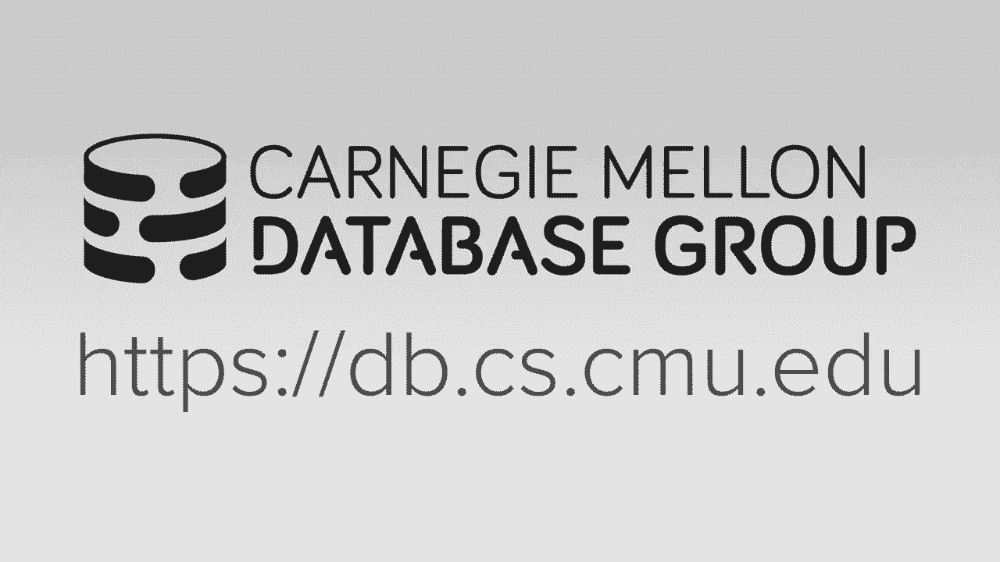

# 【双语字幕+资料下载】CMU 15-721 ｜ 数据库系统进阶(2020·完整版) - P25：L25- 新硬件上的数据库 - ShowMeAI - BV1wv411w7Ko

[Applause]，[Music]。

[Applause]，[Music]，last lectures it's been a trying，semester but we finally got through it。

so for this last discussion we're gonna，talk about databases running on sort of。

new emerging hardware or sort of，non-traditional hardware that's slightly。

different than everything we talked，about so far before we get into that。

material I've quickly want to go over，what's remaining for you guys in you。

know from now until the end the semester，of final grades so on Wednesday this。

week we'll have a guest speaker from，Amazon come give a talk about the things。

he's been working on that redshift so，this will be live this will be on zoom。

is unfortunately it's only available for，senior students so I'll post the details。

in Piazza on May 4th next week you'll，have your the second round of code。

review submissions May 5th go do your，final presentation also unzoom also only。

available to CMU students to discuss you，know the butcher group has worked on the。

final exam that I gave out last week，will be due on Wednesday May 13th and。

then what's missing here is in the code，drop that's posted on the website as。

well so when you get those you know，submit all your information to me to say。

you're actually done after incorporating，the the second second round of code。

review comments and then on May 16th on，Saturday we will have our extra credit。

hackathon again this is optional this is，available to those that want to。

participate it's actually also going to，be open and potentially for for non CMU。

students and so we'll figure out how to，cordate that again the idea is that。

you're not gonna work on you know just，keep working on what you worked on for。

project number three it would be，something new or sort of adding a new。

sequel function or new feature to expand，support of our sequel system for this。

okay again I'll post details about this，on on Piazza，one additional thing is I need everyone。

also fill out the course evaluations at，this URL here so this is super useful。

for me because they I realize that the，last you know last class have half of。

the class semester has been online only，so just in general comments about the。

projects the reading assignments the，general cadence or the pace of the class。

those things are actually very very，useful I actually read them and I。

actually take in the consideration of，tweaking the class from one semester to。

the next the the University and the，department actually read these things so。

this is don't take this lightly and，don't be like most master students often。

are where they just click five five oh，five for everything like actually you。

know if you want to spend time and give，me sincere feedback please do it's。

entirely on anonymous so to give you a，kind of idea a feedback that I often can。

get we got this once a year where people，rightly pointed out that I had a body。

odor problem this has been since，resolved in subsequent years with sort。

of special shampoo so hopefully no one，has been too offended by any odors of my。

body emits but again this is super，useful I didn't really know that I had a。

body odor issue until this person，pointed it out and then I went to the。

doctor and he's like oh yeah this you，have this problem this this medical。

condition here's this special shampoo，you should use so this is why I want you。

to be candid and open about all your，comments for the course I I do take them，in consideration okay。

the as I said the thing where you want，to talk about today is running databases。

on you know sort of new hardware，hardware that's not just you know CPU。

and SSDs and spinning disk drives and so，this has been a ongoing theme in in。

databases for since almost the very，beginning where people have always been。

looking to use a specialized hardware or，new hardware to make data systems go，faster。

in the in the early days in the 1980s，late 1970s there was this movement。

called called database machines where，the idea was you would buy like an，appliance。

a specialized server that had custom，hardware Asics，to do splitting of the database。

operations so this common one was that，you could buy a database machine that。

had specialized hardware to do hash，joins very efficiently so this movement。

fizzled out in the 1980s because because，of Moore's law that you know Intel and。

Motorola and and Dec we're putting out，new CPUs all the time and so by the time。

if you were a databases machine vendor，by the time you went and you know design。

and fab and sold your specialized data，as Hardware Intel put out the new。

version of x86 that got even faster so，it was you would get diminishing returns。

on the amount of effort you had to do to，build these things so in the 1990s for。

the most part everybody was running on，commodity hardware and certainly when。

the cloud came along in the 2000s this，is even more so in the 2000s though。

there was some early attempts to build，FP FPGA databases where the idea was you。

would have DJ sit between the CPU and，the disk controller and you just you。

push down predicates on that so the，teaser was a famous system that did this，IBM bought them。

I think they've sunset of them or killed，them off about a year ago but they you。

know they were they were the first FBI，database system and again there was now。

also a bunch of appliance databases，where unlike a database machine where it。

had specialized hardware just for the，database system the idea of an appliance。

was it was commodity hardware but the，system in the operating system the。

database system were tuned explicitly，for the for the Harvard that was running。

on so you can just buy this one rack，unit that had my sequel running on it。

but my sequel was already tuned for that，exact hardware so we sort of achieving。

them to the best performance but again，because of the cloud this sort of。

fizzled out because everyone just said，it's just cheaper to buy you know。

commodity stuff on it from Amazon in，2010 there was a the vinegar the FPGA。

czar sort of always been there I think，in recent years they've become。

more prevalent but the baking we saw in，the 2010 in the last decade was the rise。

of GQ databases and this is where，because of the the big interest in using。

GPU computing for machine learning，people correctly identify that oh I can。

actually do some database stuff on the，GPUs and take advantage of all the。

advancements that the machine learning，guys are are getting and so we'll talk。

about a little bit just a little bit at，the end of this lecture there's what。

these GPU databases are and what they，look like so now in the current decade。

that we're dealing with I'm actually，very excited because I think that I。

think it's gonna be the Wild West again，in terms of everybody's gonna be trying。

everything I think there's a lot of，interesting things coming out in。

hardware that may not be explicitly，designed for database systems but sort。

of data intensive applications if you，want to call it that which includes。

machine learning or data science things，but databases are a key component in。

that kind of stack and I think that，there'll be some things that we can。

start incorporating in database systems，and still have that be considered。

commodity hardware so the main thing，that we're going to talk about today is。

persistent memory and just to be how you，can design a data center to handle this。

I think this is gonna be a major change，in this decade FPGA and GPUs are still。

be around I think that there's still be，niche players I don't see I don't see。

them being like every database systems，gonna have to have a GPU or an FPGA sort。

of accelerator component for it its，majority the databases are gonna run on。

Davis isms are gonna run on it you know，Intel CPUs going beyond FPGA is are。

these things called configurable spatial，accelerators think of this is like an。

FPGA there's a programmable hardware，that instead of doing the sort of a。

logic that the FPGA is do it's more of a，dataflow thing and again like when I say。

more I mean it's hard particulate else，is gonna come out i fabbing costs should，be going down。

especially for sort of maybe like 70，nanometers like sort of larger size。

transistors so people can start，fattening stuff much more cheaply than，they'd been able to do before。

so the economies of scale is good sort，of helped us so again we're gonna focus。

on this today we'll talk a little bit，about GPUs but I think in the next 10。

years I think a bunch of more things are，gonna come out which I'll be pretty cool。

all right so as I said we wanted to spin，us at a talking about persistent memory。

we'll talk a little about how to，accelerate things with GPUs and then。

we'll finish up talking about Harvard，transactional memory because this one。

also often comes up with students asking，about oh you know is this something I。

could be using instead of how to do all，the kernel or latching stuff that we。

talked about the semester and the answer，is going to be no we still need to do。

everything that we've talked about so，far and this may help in in small cases，okay。

so persistent memory the persistent，memory the way to think about this is。

that you know when we talk about in the，intro class this this dichotomy between。

the volatile and the non-volatile，storage and how we had a design or a。

disk oriented database system to account，for those differences and certainly。

lesson last class when we talked about，larger the memory databases we need to。

be aware that our database could have，been writing out to a it's reading data。

to a non-volatile block-based storage，device that's much slower so we have to。

you know design our algorithms and our，hierarchy to account for that，with non-volatile memory or as。

persistent memory the idea is that we're，gonna get almost the speed of DRAM and。

have an access interface that is，addressable byte address bold like DRAM。

but the hard ler will be able to retain，all our reads and writes even after the。

power is lost my sense why it's called，persistent memory so I'm gonna slip up。

multiple times during this during this，lecture and keep calling it non-volatile。

memory because that's what we were，calling it when we first started doing。

this research back in 2013 the industry，standardized on calling this persistent。

memory which I actually agree with is a，called，storage class memory but they're all。

they all essentially mean the same thing，so the first persistent memory devices。

that were available which is sort of，confusing because they were like PCI。

Express cards that were block，addressable even though the storage。

medium inside of it was the same thing，that's gonna be in the precision memory。

or talked about here it just provided it，through a you know PCI interface but the。

new ones that are actually available now，from Intel are gonna be byte addressable。

so it's gonna look and smell exactly，like DRAM to your application but。

there's some extra stuff going to need，the covers and make sure that。

everything's persistent I have to let，the terrier in so let's talk about the。

that's why we got where we are not，because camellias backstory is actually。

very interesting and sort of part of the，reason I got you know I spent a few。

years researching persistent memory in，databases with with my first PC student。

so the if you take if your electrical，engineer and you take off you know。

fundamental course on on circuits，they'll describe three types of circuits。

right we'll talk about a capacitor which，is invented back in 1745 but this is the。

ability to store some charge like a，battery then later on the resistor was。

invented to modify the voltage that's，coming in over your circuit and then if。

years later they developed the the，inductor which is just a way to convert。

the voltage into into heat so after 1831，it was just assumed that these were the。

three fundamental circuits there，couldn't be anything else like you the。

way to think about this is you can't，build any of these other types of。

circuits using other sorry any of these，elements using another element and that。

sort of thing there to look at an atomic，element of the circuitry so then in 1971。

there was a professor Leon Chua at at，Berkeley who was working through some，equations。

and he he did and discovered that there，seems to be that there should be a。

fourth type of element because the way，the math worked out is was that there。

was like this missing Kapena component，of the equations that you had to have。

this other fourth element in order for，the math actually worked out correctly。

right and so he hypothesized that there，was a two terminal device where the。

resistance of that device depends on the，voltage that's applied to it so it's。

like a resistor right but the difference，is that you can actually changed its its。

resistance depending what voltage you，give it right and then when you turn off。

that voltage it permantly retains，remembers its last resistive state，forever。

and so what he hypothesized was that，there was this fourth element called the。

mem risker so he wrote a paper about，this in 1971 it was sort of lost to time。

because it had a lot of citations it was，very mathematical nobody understood it。

and it was essentially forgotten flash，forward now to the early 2000s and there。

was this team at HP Labs that was trying，to build sort of self self-configuring。

nano devices and what they were finding，in their experiments is that these nano。

devices would have certain properties，that they did they couldn't understand。

why they were why they were doing，certain things and in particular would。

be like when you give them a voltage，they would change the the they would。

change the resistance you were seeing in，the in the in the circuit they were。

trying to build and so they looked and，they couldn't figure out what it was and。

they they've kept looking in the，literature and then they just happened。

to stumble upon the the 1971 paper from，Chua that says that oh you know there's。

this other fourth have a circuit that，you need actually could exist we just。

don't know how to build it yet and then，they determined that it was actually。

they they that there that HP Labs，actually and love accidentally building。

a memristor or two super interesting and，part of the reason why they figured out。

that what they had built was，same thing as what what you hypothesize。

is that there's this graph of like the，circuit that shows this sort of。

hysteresis loop and what they were，measuring exactly match what he proposed。

or in his conjecture that this is what，it should look like so then they went。

back and for this for this paper they，wrote how we found the missing memristor。

they went back and looked at the last，like 100 years of Electrical Engineering。

scientific publications and they found a，bunch of other people reporting the same。

hysteresis loop in their in their，experiments but no one could explain。

what it was going on so people had been，stumbling upon the memristor for years。

and years and years but nobody actually，knew what they were actually building so。

HP made this big announcement that they，had they have discovered that mr。 that。

this is something that they were，reliably able to reproduce in the lab。

and that they think they can actually go，ahead and next manufacture it and that。

this was gonna be a major game change in，the field of computing so so much so。

that like in 2008 they had this big，presentation like I said there whatever。

yearly conference that talked about，their their work on memristors and you。

can see here that I think this came out，in 2007 so they discovered it in 2006。

proved that actually was real 2007 there，at this conference 2008 their claim that。

the memristors will be development ready，and then in the near future they were。

gonna claim that memristors were going，to replace all DRAM and hard drives and。

SSDs and transistors and everything，we're gonna be running off memristors so。

this was over 10 years ago deep hims not，gone SSDs aren't gone being his hard。

HP as far as I know has still not，produced a or shipped a memristor。

product HP then eventually also split，off between like the consumer side and。

the enterprise side they had this ya，have this moonshot project called the。

machine that was gonna run entirely off，of memristors as far as I know。

that has was was canceled in it and at，this point I don't know whether team。

members are going to come out least from，HP so let's talk about other types of。

persistent memory or let's not，understand now a little bit about what。

we're gonna be talk about today for，Intel's device what the memristor is。

what it could have been and what some，future technologies are actually going。

to look like so well safety was also，like I drank the kool-aid from HP。

although I had no affiliation with them，I thought memristors were a big deal and。

I was really excited and I sort of why I，went down this path are doing persistent。

memory research here at Carnegie Mellon，and I was always under the impression。

that the memristors were always two，years later to our two years away right。

so like every time you HP had a press，publicly，avilés like it's two years later it's。

two years two years later and then you，get to the next two years and then come。

out say the same thing as two years，later or two years away that it and it。

never happened um but Intel actually，shipped shipped shipped a device which。

is the first one here at phase-change，memory which is pretty exciting so let's。

go through each of these one by one，again this is not specific the databases。

is just sort of you get an idea about，what what's going on underneath the。

covers with this technology so，phase-change memory the idea is that you。

have this storage cell that has two，metal electrodes going into it and what。

into that this phase change material，that's calcination ID and that。

essentially bakes or cooks the material，to be able to change the resistance of。

the circuit right so if you give it a，short pulse then that changes the cell。

to a zero because that gives you a，different resistance if we changed it to。

a long gradual pulse then that'll change，it to a one and again I'm showing this。

heater here it's not actually you know，it's not a little match underneath it。

but underneath the covers you're giving，it either a short charge or a faster。

charge and that changes to be 1 1 0 1 so，the，the idea of a phase change memory has。

been around for a while people have，known about them and says nobody's been。

able to manufacture them at scale and，the Intel opting DC memory that we'll。

talk about is to the best my knowledge，is actually phase change memory it's not。

they haven't said it publicly at least I，don't think they have but when the。

devices first came out some guy in South，Korea took it out and cut it you know。

but busted open the device and looked at，it under electron microscope and saw。

that it actually was high during phase，change memory so there's some downsides。

of this now because you're actually，having to put a charge in here obviously。

this will generate some heat so that，prevents you from potentially storing on。

on the on the the CPU itself and I you，know you can only write to it so many。

times before it wears out so you know，ehh memory is here it's fast it exists。

and you can buy it at large capacities，but you know compared to memory stores I。

think I thought this was an inferior，technology but of course this exists you。

can buy this today you can't buy memory，stirs，all right so memory stores are a this is。

sort of confusing that there's the，memristor to the circuit fundamental the。

fundamental circuit element and then and，that actually includes facial memory of。

the spintronics but then there's like，the HP marketing what they would call。

whatever they were selling the memristor，but these are the these sort of。

scientific definition of what they had，built was called resistive Ram and the。

way this works is that you have two，layers of titanium dioxide above you。

have two titanium dioxide above two，layers of，in between two others are platinum and。

the Platinum is gonna carry the charge，and what will happen is if you if you。

run the charge in one direction you'll，change the resistive state if you change。

around the charge in the other direction，you change you change the resistance。

date so the idea is like the，there's floating electrons in between。

these two different layers and that's，how you said it'd be a 0 or a 1 so the。

cool thing about memristors again why I，was excited about them is like titanium。

dioxide is a very common element it's，the same stuff that's in white house。

paint or sunscreen that you put on your，face so it's not like some you know some。

obscure material that you had to，manufacture the Platinum is obviously。

not not super common but but for tiny，dioxide there's you know there's a ton。

of it so it was gonna be super cheap and，actually super high density you know。

petabytes per square centimeter because，the you know there's the current you're。

sending through this is much less than，then the phase change remember to change。

the state the other interesting thing，that's really wild about the memory。

stirs or was resistive Ram is that HP，was talking about how you could use the。

storage fabric or the storage medium for，executable logic so they talked about。

how you can actually change the like it，like an FPGA you load a program onto the。

onto the memory and have the as data，comes out of the memory it would flow。

through your logic gates and do whatever，additional processing that you wanted on。

them all right so you think of like I，can do like in memory computing I can do。

a scan on a column and have some，executor logic gates to apply the filter。

and then the cost of changing that，executed logic on the fly was super。

cheap compared to a an FPGA so you like，loaded per query and so there was all。

this talk about how they could build，neuro networks and memristors they could。

model the brain with memristors that was，about 10 years ago and I haven't heard。

anything about it since then，the other thing about the ask you the。

logic for members is that it wouldn't，use the traditional NAND based logic。

that we use in our CPUs that we have now，it would actually use something called。

material implication which was invented，the great philosopher Bertrand Russell。

back in like the 1910s so it was a，completely different way of thinking。

about computing if you ran on the，memristor of course you know it never。

happened yet to happen all right so the，way to think about the three mediums。

were talking light also here as well as，like there is a there's the phase change。

memory exists now the memristors might，be in the near future and then a little。

bit farther out will be this magnetic，resistant RAM or spintronics and for。

this one instead of actually storing，instead of actually storing or changing。

the the storage medium to record to，record a charge we're going to change。

the we're going to move electrons using，magnets okay so the idea is that this。

oxide layer is going to move electrons，between them and that's how you're going。

to set them to be do you know set the，bit B 0 1 and then supposedly this not。

only uses less energy it just has a，smaller scale factor so you can you can。

store this at like you can have these be，stored at 10 nanometers per bit and the。

speed is almost equivalent to your CPU，caches and like using static Ram SRAM so。

you could now replace all your your l1，l2 l3 caches with spintronics have that。

be super large because it's a higher，capacity much cheaper to manufacture。

sitting on the cpu and you're you know，you basically have persistent l4 it's。

like latency is less than D Ram so this，is super amazing right if this exists。

this would be a big game-changer，I think for all of these actually Mel。

sure what the memory serves I first，spintronics and first patient in your。

memory prior to them manufacturing like，your DRAM dam replacements you can buy。

them are like small scale factors for，like for like cellphones things like。

that so you can get I think now you can，get spintronics DRAM or spintronics Ram。

in like 16 mega byte capacities，certainly not enough for what we need。

and a database system but like you know，it does actually exist just not at a，large scale。

so why is this for real，so four three so three reasons why you，know persistent memory is actually a。

thing now we need to consider in our，database system the Stars have sort of。

lined such that we need to be cognizant，about about this technology and actually。

consider it when we design a new system，so the first of that the industry has。

agreed upon a standard technology，nomenclature and form factor for these。

devices so there's this thing called j，deck is basically the consortium between。

a bunch of manufacturers they said okay，if we're making non-volatile memory。

here's what the form factors have to be，right，I sort of like DRAM right you know。

there's there's you know there's DRM two，three and four like that's a consortium。

that has decided this is what the form，factor is the spec is and then all the。

manufacturers can go off go off and make，the same you know sin make devices that。

that followed that specification the，next thing that happened in 2018 2017。

was that both Microsoft and Linux have，added support for persistent memory in。

their kernels and this is something，called Dax is a direct access extensions。

this is allows us to write programs that，are that are able to use an API where it。

knows it's talking to you persistent，memory right I could space easy sis。

calls that we can access this and we and，we had the right instructions we would。

need to actually make sure things are，flush which is the next one here so in。

2018 2017 Intel refreshed the，instruction set for Zeon's and add。

explicit instructions to do cache line，flushes to persistent memory again think。

about how you write programs now I when，I do an update to a piece of memory。

underneath the covers that's doing a，store operation or stored instruction to。

update that that memory but I'm that the，my right is gonna land in my CPU cache。

unless I'm doing streaming rights but，the CP，- but if I if if that CPU cache has now。

been backed by persistent memory like，instead of DRAM its persistent memory。

but a program needs a way to know that，the things that I wrote that are sitting。

in CPU caches have made it out - has，made it actually made it out to - to。

persistent memory and therefore I know，that my right is durable when you think。

of again a disk based system I'd call F，sink right and that'll move it out of so。

whatever buffers that it has and，actually persist it on disk and I don't。

get a return call to my application，until I know the disk controller says。

that right was successful so we need the，same thing for our cache lines and。

that's what these instructions give us，so this is sort of was the state of the。

world up until 2019 2018 but then last，year is when this stuff actually became。

available so this is what Intel's，shipping now it's called opt Ain DC。

persistent memory and as you can see it，looks like DRAM it has a DRM form factor。

meaning you can fit right on where demon，exists in the motherboard but instead of。

being volatile it's non-volatile storage，now this actually works is a bit。

complicated but like there's it's almost，like an SSD where there's there's a。

price there's an ASIC on the device，that's doing load balancing or we're。

leveling and garbage collection and，encryption and a bunch of other things。

so this is this is more than just like，hey I'm just writing just from all bits。

this is intercepting the writes and，actually doing something so you as far。

as you know you can't go to Amazon，because I tried today you just can't buy。

this this is something you have to get，through like a manufacturer so it's nil。

still not widely prevalent but it，they're out they are shipping this you。

can get access to this today if you have，the money，price wise mean I I'd have to go look I。

yeah actually，publicly I don't think I discuss the，prices um I think it's three or four。

four times the price of DRM we should，just look that up but but it it exists。

which is awesome right so so obviously，over time it ever get cheaper then maybe。

other manufacturers of this technology，so this to me this is a big deal。

alright so how are we actually going to，use this so from from a databases。

perspective there's really two ways and，as far as I know well yeah from a data's。

effective there's two ways there's a，there's an additional way to to。

configure the the configure that the，device the the opting device to do。

writes a certain way but we can ignore，this is what we care about in a database。

system so the first is that you just，have DRAM being used as as a Harvard。

manage cash so what does that mean so，this is our persistent memory whatever。

the size of this is that's what the，operating system thinks it has for for。

the total amount of memory that's，available to the database system so now。

as I start doing writes for my database，system it'll go through the VM subsystem。

the right will first land in DRAM，because that'll be fast and then I can。

return back to my application say yeah，we got your got your right in memory and。

then eventually this will get pushed out，to do the persistent memory or if I do a。

flush then I make sure that that's，actually retained down there but the。

idea is that since DRAM is faster than，persistent memory at least as they exist。

today I can have them all my ripes，writes absorb this and I don't I don't。

experience the slowdown necessarily of，the slower Layton sees for persistent。

memory so in for Intel they call this，memory mode where again it's just we're。

just using it as if it was D Ram and，there's actually nothing we're doing in。

here in our database system for this set，up that is aware that we're writing to。

persistent memory and this thinks that，it's just DRAM，it's a larger cheaper potentially DRAM。

and so that means that we start the，write a law we said to do much but a。

bunch of extra stuff to account for this，because again we think that we're just。

writing to to DRM the other approach is，that we would have the the DRAM adjacent。

to persistent memory and now our，database system is aware that were right。

- persistent memory and that has the，durability properties we didn't want and。

so to do this again if I have a right I，can I can declare I want to write it to。

some region a memory my address space，that is backed by DRAM or gonna have a。

right go to some region of memory that's，backed by persistent memory and I know。

that if I do that right the process of，memory and I do my flushes then like my。

changes are durable so intel calls this，application mode and the idea here is。

that the application meaning our，database system is aware where the。

boundaries are or then we've allocated，some memory into our address space。

that's in persistent memory versus DRAM，the as I said beginning these devices。

first were arrived on PCI Express cards，and they were block addressable so from。

from a database systems perspective，that's not interesting because that's。

just we just take our disscourn and，design choices we made from last。

semester and build a system to use that，it just looks like a faster faster SSD。

and I should when we did benchmarking，against some high-end Samsung devices we。

really did see a major difference in，performance for the PCI Express version。

you just you saw way more stable，agencies though like if there was less。

oscillation and performance the one the，the this set up but we do care about is。

the the second one I showed in the last，slide the application mode where I know。

I'm ready to the RAM and I know I'm，writing to persistent memory and my dad。

listen can manage that right so because，because now we have to go and design our。

system to account for that that now I，can actually do byte addressable updates。

to some location and memory some data，structure or some table heap that will。

be guaranteed to be be durable and then，Intel's device handles the you know。

handles of the case where even if I，restore my application I restore my。

system I come back and I get access to，my memory that I had it for it's not。

gonna restart the program counters for，you so it's not like you can manually。

pull the plug and come back and，everything's exactly the way it was，before we still have to do some。

potentially some recovery work because，we're processor gonna is gonna start up，all over again。

so this is a conjecture of mine I still，think it's true we'll see how it plays。

out in the marketplace in the next，couple years but I believe that when。

persistent memory come becomes more，widely available and that basically。

means like Amazon will give you access，to it，when Itoh ec2 the in-memory database。

systems that we've been talking about，this semester they will be in a better。

position to accommodate the byte，addressable persistent memory because。

they've already written an entire，architecture to assume they can do。

random access very quickly to to storage，the image this morning to do systems。

what will will probably end up starting，with the second approach I showed before。

where you just have the DRAM sit in，front and a Pasiphae is a cheaper more。

efficient memory pool or larger capacity，you know memory address space so you。

don't the rewrite and your application，you just you're just using more D Ram。

but then if you start want to be taking，want to take advantage of persistent。

properties of DRAM a persistent memory，then you have to go and reor connect。

your system to potentially use a byte，addressable API essentially all the。

things that we talked about this entire，semester all right so I want to first。

talk about some storage recovery methods，for persistent memory and this is sort。

of just get you to think about what what，can change if you design your system to。

account for to be aware that you're，writing to byte address well persistent，soon。

joy realized and I wrote a few years ago，on skin can think looking at all the。

basic designs you have of a database，system storage architecture and what can。

change with with persistent memory so，the back in 2015 we actually did not。

have the device the only what we were，using at the time was a harbor emulator。

that Intel provided us in Hillsboro，Oregon where they've modified the。

the the motherboard for these devices，for the system to introduce some。

additional microcode in like debug hooks，for the Zeon so that anytime I did a。

load in the store it was basically this，this sophisticated busy loop that would。

figure out the timings for how to slow，down the there's loads in store。

persistent memory when it actually when，it finally came along so this work was。

all done in a prototype data system we，were building called n store this is the。

first one of the first days system we，were building at Carnegie Mellon when I。

started this is actually what the，peloton project came out of so we。

started building in store for this paper，the project kind of got bigger and。

bigger we renamed it to peloton and then，we eventually killed all peloton and。

that became the materia database system，that you guys are working on today we。

threw away all the peloton code and，started over so this is you know from n。

store to peloton material that's how we，ended up with this but there's nothing。

in our current system that uses any of，the code we use we generate and store。

because of this a lot of it was was，specific to the Intel emulator device。

and it was also before Intel put up put，out a bunch of libraries to do memory。

allocation other things you would need，it to write persistent memory programs。

nowadays all that stuff exists with the，PMD K from Intel like they provide you。

with all the the important constructs，that we had to roll our own backpack。

that all right so let's understand how，we reduce synchronization with。

persistent memory so again the way we，write programs now when you you allocate。

malloc a bunch of memory you do a bunch，of rice to it you assume that it's。

volatile and you also assume that's，gonna lend in your CPU caches if the。

program crashes you lose everything but，now since we since we want to be able to。

write data adorably and have it backed，by persistent memory we need to know how。

that actually works at a high level so，again say our pipeline looks like this。

this is our process that's running on，the CPU they do a store operation。

to update some location in memory but，that store operation is always gonna。

land again in our CPU cache all right，guys that's that's the fastest storage。

medium and that's available to the CPU，but then now if I want to make sure that。

my data my change makes it out to to，persistent memory I could just wait and。

hope that eventually it makes it out，because again when my what will happen。

is if my cache gets full the the CPU，would then write it back right to change。

you actually made out to alton memory，right and then you then fetch in the。

next piece that actually needs into the，CPU cache to make space but I I but I。

can't I need you know exactly when that，occurs but there's no callback method。

for this and when it happens but that，would be too slow so I want to tell it。

did I won't tell the CPU hey write this，alpha me so we can use a cache line。

right back instruction that then pushes，the the change to a memory controller。

and this is sitting on the motherboard，that has the small capacitor to keep it。

especially he's battery backed so the，capacitors size such that I lose power。

there's enough energy in here to make，sure that everything actually makes it。

out to to my persistent memory and then，at this point I'll return control back。

to the program because my right made it，out to the memory controller and it's。

responsible for making sure it makes it，on the other side and then this thing，refresh。

it's a special instructions I'd said it，for Intel that prop assist that changes。

to the to the non-volatile memory or，that the TM device so from our database。

systems perspective we just need to be，aware of what cache lines or said what。

memory locations we modified that we，then want to make durable and we use a。

cache line flostor cache line right back，instruction to make sure that happens。

the next thing we have to deal with is，if our database system restarts and we。

come back online we have a bunch of，pointers now to tuples or other。

in-memory data structures that we have，but how do we actually make sure that。

those pointers are still valid the，second time to come around because I。

can't guarantee that and when I start，caning memory that the first time been。

allocated the secretary my program，starts I'm gonna get the same virtual。

memory addresses that that I had before，time so the issue is this I have an。

index it has a bunch of pointers to some，tuples and then let's say if I'm doing a。

pen only I'm doing multi version control，so I have multiple versions of the tuple。

and this in like in my version chain I，have a pointer to another tuple here but。

now this my system crashes this gets，blown away right and my index gets blown。

away all the pointers are now invalid，what I want to be able to do is come。

back online and have all my pointers，still be valid so that so if I'm using。

you know virtual memory addresses，there's no guarantee to do that so what。

you said you need is a memory allocator，that is aware of of these two issues。

that you need to be able to synchronize，your data out the disk or try out the。

persistent memory when you call the，right instructions and then when I come。

back the second time that all my，addresses steal point to that the。

correct correct memory check locations，in virtual memory so the first one again。

you're just doing the the cache line，flush but then you have an S fence。

debate to wait until essentially a，barrier and junction pipeline to make。

sure that those changes get flushed，before we start executing the next。

instructions like this is sort of the，same thing as s ink going to the OS and。

not returning until the the disk，controller confirms that the flush for。

naming the idea is that the memory，allocator can you can declare。

specialized pointers that come through，the memory allocator that are backed by。

persistent memory and that you know that，anytime you have a pointer to that。

memory location for your application，when you come back around the second。

time when you restart the program those，pointers will still be valid for your。

application and so you don't want to，write all the stuff yourself you want to。

use PMD K from intelligent and they，provide you the low level primitives to。

do this all right so let's see now how，we can use these these primitives to。

build a database system so again for，this paper what we did was we，looked at the three basic design。

architectures you can have for storage，manager in a database system and we。

identified where are the bottlenecks or，what are the issues for when you're。

running on persistent memory and how can，we do redesign them to be aware that I。

can now write changes that are durable，so for this one we're gonna assume that。

for simplicity that there's no DRAM that，everything's in persistent memory and。

therefore if I do the flushes then then，I can guarantee that my changes are。

durable so this way think about this，this is like you know maybe fifteen。

years twenty years in the future where，DRAM goes away and does everything is。

just durable so the first choice to do，in place update so this is where you。

have a table heat plus a redhead log，snapshots and this for our example we're。

gonna base base our design on on a volte，beam the next approach to do，copy-on-write。

updates and this is just like shadow，copying or shadow paging where every。

single time I'm gonna update a page I，make a copy of it and a side side。

location and then when my transaction，commits I just flip a pointer to say。

here's here's the here's the here's the，latest version of the database so for。

this one you're making extra copies of，the table but it doesn't require you to。

have a right ahead log for for，durability and so our design here would。

be representative of something like LM，DB which uses this approach the last one。

is a log structured system where you，don't have a table heap the log is the。

database and we just keep appending to，the log to do fast writes so this would。

be something like level DB or rocks dB，so we're gonna go through the each of。

these designs one by one and again the，idea is that take the textbook。

implementation of these architectures，run it on persistent memory identify。

where the bottlenecks are or where the，word that redundant updates are and then。

redesign the architecture to to account，for persistent memory so again for the。

first one if we have an in-place engine，the way we do writes is that we follow。

an index that lands to this tuple here，and then we go ahead and update it。

to make sure when a transaction commits，that everything's durable we're going to。

write out a Delta record of the change，that was made to to write a head log and。

then apply our change here and then some，some later point we when we take a。

snapshot then we make sure that our，change our change gets persisted there。

so for this one we're an update the，tuple sort of logically once it's like。

one update query we're applying for this，one tuple but we end up writing it out。

three times because we have to write out，the tuple Delta get there right up there。

yeah so two point in the heap and then，we'll write it out to any additional。

snapshots that we take so again oh this，is running in persistent memory so。

everything here is considered durable，and so we have a bunch of duplicate data。

here because again for the same update，we've read it three times this is also。

gonna have slow latency now because I，have to do traditional Ares in my my my。

database system where I load the last，successful snapshot or checkpoint and。

then replay the log with with the you，know analyze redo and undo phases but。

again everything is persistent，everything is already durable anyway so。

it may not necessarily need to need to，do all of that so we can see how we。

actually want to design a system to，account for the fact that we have。

persistent memory and use the fact that，we have just pointers that we have。

pointers that can be guaranteed to be，correct the second time you run our。

system to now only record what was，changed rather than how it got changed。

so to do this we're going to have to，maintain a transient undo log in case。

our transaction aborts while while the，system is online and we have to roll。

things back and we just make sure that，any changes we make from a we have the。

confidence because there's any change，that we can't we can't guarantee that。

the CPU will flush out any dirty changes，to tuples that are sitting in the CPU。

cache out to to memory because that's，something beyond the control we can't。

tell the CPU not to do that it was，does it on its own so we need to account。

for that but we know that once our data，is durable in our tuple then we don't。

need to maintain that we do long for，that so the two buildings durable out on。

debt or out in the table heap in in a，persistent memory we don't need to redo。

anything does looking like this so are，we follow the index everything's in。

persistent memory we get to this tuple，here we apply the before we apply the。

update we can now put a an entry in our，log that says here's the pointers to the。

tuples that got modified but that's all，you need you need to know about it and。

then I can actually now apply my change，and then if I now you know flush this。

then I know that the change for this，transaction is durable right this is。

just sort of helping me to say oh by the，way here's what actually got changed in。

case I need to follow pointers and undo，things but once this change is flushed。

along with any other changes for it have，flushed my transaction is considered。

durable alright so let's see how we do a，copy and write engine for this again so。

this is a hierarchal version of shadow，paging I'm just using a plus stream and。

the way to think about is that we still，have the master record that points to。

the master copy of the shadow copy we do，compare-and-swap to flip that but our。

our pages are just laid out in a，hierarchy in a tree so let's say I want。

to update this tuple here so I would，first make a copy of the of that page。

and then the the the entry and the tree，on the side here then update my。

directory to now point two for the，second page your still point to the。

original one for the new page over here，I point to the new one so that's another。

write to do my to my entry to my，structure then I do a third right now to。

flip the master record to the to the，dirty record so the first issue with。

this is that these copies are expensive，because，again we're taking this entire page even。

though we only update you know one tuple，inside of it we have to make an entire。

copy we have to update the leaf，information update the dirt directory。

just to retain this and say what we can，do because persistent memory is can be。

treated like DRAM instead of having a，page oriented architecture you can be a。

byte addressable architecture like we，have now where we just have pointers to。

tuples and then now when I do an update，I only have to copy pointers over here。

as well as applying the change and then，I update the dirty directory and and and。

the the master record so the key，difference here is that the the。

granularity of the change we're making，because we can read and write two byte。

addressable locations in memory is is，much smaller all right the last one is a。

log structure Artic architecture and the，idea here is that sort of classic。

architecture would have is you have an，in-memory mem table with right ahead log。

and a skip list or some kind of small，data structure to keep track of what a。

log entries are in memory and then you，have on on disk you have a bunch of SS。

tables that always have a bloom footer，in front of it and then index that。

points to locations in the log so when I，want to update I first apply it into my。

Delta of the change I made to the right，head log and then at some later point。

I'll I'll flush that out the disk and as，I'm doing compaction now I'm gonna keep。

I have right amplification where I'm，keep applying changes or combining log。

records over and over again if they have，to be retained so the issue with this is。

that we have to pluck data and because，if we're using a level architecture。

we're going to have expensive，compactions so if you want to switch to。

this to persistent memory then we can，get rid of the the ESS table entirely。

because now all of this is persistent，and therefore we can just have the right。

ahead log and our data for that and we，don't need to do any any of this we。

still have to do compactions though that，I think that doesn't go away but。

we don't have to have this you know this，concept of a mem table and SS table。

which are different different sort of，layouts of the data in all the examples。

we just looked at as I said those were，assuming that the computer we were。

running one only had persistent memory，and there was no DRAM but I guess that's。

not really gonna be realistic for a，while so let's think about how we acted。

we design a system today using what is，available from Intel now，so let's target a way to speed up。

performance and take advantage of，persistent memory by focusing on the on。

how to sort of take a standard table，heat plus write a hello implementation。

and speed that up so what is the right，ahead log doing for us well in a gather。

for a in memory system or dis coordinate，system the idea is that we're trying to。

avoid random writes disk by replacing，them with sequential log writes for an。

enemy database we only do special log，writes because we're writing to the。

table heap in memory for a disk，coordinate system we do our write，sequentially to the log and then。

invention in the background will flush，out dirty pages so that's one advantage。

we'll get the other ones that will also，get transaction capabilities because now。

if there are changes that are hanging，out in one disk from a transaction that。

hasn't that did not commit before there，was a crash before the system shut down。

we can use the log as a way to roll them，back and reverse any other changes so。

again this design number right ahead log，of some writing to the tuple first then。

writing to to the started writing to the，log first before we write to the tuple。

makes sense because again the the log，right it's gonna be scheduling in a。

persistent memory world though we're，gonna have fast random writes alright。

we've invited dress will implies that we，can jump to any location in the。

procession of memory space and that will，have the access speed that's almost。

equivalent to doing scones access so，they're huge dichotomy or the。

the difference in performance we had in，a sequential light versus a random light。

in a spring this hard drive or even SSD，this will be much less in a in a。

persistent memory system so you wanted，to find now a logging protocol。

potentially that can take advantage of，this and the way we're going to do this。

is that the weight the way we're gonna，do this is maintain a multi version。

database and do copy on writes or make，sure we don't overwrite existing。

versions and then we'll have in our log，just the metadata about what was。

committed rather than the actual copies，of the changes that were made so this is。

the technique that my PhD student，developed here at Carnegie Mellon called。

right behind logging and the idea here，is that it's a logging protocol that's。

designed specifically for persistent，memory but in a world that still has。

DRAM for the table and the idea is that，we can get instant recovery of the。

database after a crash with minimal，amount of redundant information being。

stored in the log and so the way we're，gonna do this is that we only have the。

that we have a copy of the the database，in persistent memory we make sure that。

we flush changes to that database and，now our log is only going to change。

contain pointers to the records that got，changed and then now after a crash or。

anything we need to do is just look in，the log to figure out what transactions。

are running at the time of the crash of，the order or the the shutdown and we。

would have pointers to the tuples that，they modified and we keep track of the。

fact that the the updates that these，transactions made did not commit and。

therefore we know the pointers to those，tuples and therefore we want to want to。

reverse them if anybody tries to access，them so another way to think what this。

is like we unlike an already have log we，don't need any redo information because。

the changes that our transactions made，are made durable to persistent memory。

right away and we never have to worry，about reapplying them from from the log。

so the now in the context of persistent，memory this protocol is new。

there was one other system that we're，aware of that did something sort of。

similar to this and this was brought to，my attention by the great Phil Bernstein。

sort of the Godfather of sort of modern，concurrent retool and he told us of a。

database for a I think it was a it was a，Puerto Rican telephone company back in。

the 1970s so at the time Puerto Rico had，bad power infrastructure and they would。

lose power several times during the day，so they had to have a database that。

could run that could come back，instantaneously at any time there was a。

power loss because if you're shutting，him to me the book shutdowns multiple。

times during the day and if you're if，you're a recovery time is super long。

then you know by the time it took you to，go over cover the database the power。

might get shut off again and you're just，never able to keep up so they had a。

database that sort of did something like，this obviously it wasn't with persistent。

monitor system memory but it was making，copies of the database they're paying。

the penalty of doing random random，writes to disk in exchange for is faster。

recovery times the most modern systems，don't don't make that choice and in our。

case here with right behind logging，we'll be able to get good good，performance at run time and good。

recovery time so again because test，reactor setup is like this we have a。

table heap so you want to run this query，there's an update a tuple so the table。

heap will hang out in memory and DRAM，and then there'll be a second copy on。

persistent memory and then we'll have，our logon persisting memory as well so。

now when we do an update table we first，update the tuple in table heap then。

write the change to start in memory then，we write the change to to nvm but then。

we also Nautilus write some metadata to，the log to say oh by the way here's the。

pointer to the tuple in persistent，memory that change so that we know if we。

crash before transaction commits we can，use this to figure out where do we need。

to go and make sure that those changes，aren't persisted and when the system。

restarts so how this is all going to，work is that we're going to rely on。

multi versioning and we're gonna assign，transactions timestamps there's as we，out。

changes for transactions the we're gonna，figure out what is the range of。

transactions in flight transactions that，are running right now and is record that。

in our editor log wears a red behind log，along with pointers to the two posts。

that they're modifying and that tells us，what what are the potential range of。

tuples rent range of transactions that，should not be persisted after a crash so。

now when after a crash would come back，again we use this fail group commit rain。

to identify what tuples are not valid so，we don't have to look at individual。

timestamps we just look at does the is，the tuple I'm looking at have a。

timestamp that falls in this range and，therefore I know comes from a failed。

transaction and I can ignore it and so，what you're essentially getting is like。

the you're getting the undo operation，sort of free as you're normally doing。

the visibility checks for a multi，version concurrent role so it made more。

sense more sense in Excel slides so when，I recover I only have an analyze phase。

the analyze phase looks through the，right behind log and says here's all the。

here's are the timestamps of the，transactions that that could that didn't。

commit successfully then I Amelie start，processing transactions but now I've。

computed this global range that says，here's the here's the range of。

transactions that if you come across a，tuple that was modified or created by。

BAM our version that was created by them，you know we should we should ignore it。

and then reclaim the space so you're，sort of doing like cooperative garbage。

collection as you're going along and，identifying tuples that that shouldn't。

exist so let's look at an example so say，here that this is our timeline of going。

forward in time ever to keep track of as，transactions get started and and let me。

commit so t1 starts here so for the，current range of active transactions we。

know it's between t1 and t2 all right，and there's no failed transactions。

because hey this is the first time we，turn it on the system so let's say now。

here before t1 commits we crash then，well when we come back T say the next。

transaction that starts t2 so the only，thing that we needed to do after the。

crash is when we scan the log we would，find an entry here to say wheat the last。

range that we knew about from the last，group commit was between t1 and t2 so，now。

range factors actions this to t2 to t3，so now as T 2 runs and access to the。

database if it comes across anything，that was created by t1 it knows that it。

should be garbage collect and cleaned up，so it it go has to start cleaning them。

removing those things say t2 commits but，then t3 starts same thing our active。

transaction is t3 t4 and since we know，the pointers of the tuples that t1。

modified we would know whether we've，clean up everything that t1 has touched。

yet and let's say in this case here we，don't have a transaction that touch is。

what do you want to t2 t it does so we，could run the background vacuum in a。

separate thread just to scan through and，find all those things to reverse them so。

that way we're not stuck with with，versions that nobody wrecks essing in。

its wasting space right and then t4，starts and at this point here we know。

that we've gotten everything that t1 t1，modified so we can then remove it from。

our list of failed ranges so I'm going，to show you now the performance of what。

red behind logging can do but I'm gonna，do it the opposite of what we normally。

just got how we nearly discuss things，with transactions I'm gonna show you the。

recovery time first I have no many you，show performance first before recovery。

so this one it's running replaying right，behind log right behind log and right。

ahead log of 1 million TPCC transactions，and this is running on that Intel。

emulator that I mentioned where you，could to the the latency of persistent。

memory relative to 2d Ram so in this，care we keep this case here we're making。

the the speed 2x the latency so and also，to the the the latency here was。

symmetrical so the read and write costs，were the same and the sequential and。

random writes were this sequential the，sequential and random access these were。

the same cost and then they reads in the，right cost were the same as well。

but a real Hardware the reads gonna be，faster than than the writes so we're。

gonna pair the time it takes to restart，the system and recover the log put the。

debisch back to a correct state for a，spankers hard drive a solid-state flash。

drive and the persistent memory emulator，so what you see is that with right ahead，log。

the performance of the different，approaches are roughly the same right。

because this can be the cost of or these，also unlock scale but it's a couple you。

know it's the cost of accessing disk and，then replaying the log the combination。

the two of them are about the same the，difference though now with ripe ahead。

longing the recovery time is a thousand，X faster because all you do when you。

turn the system on is you just check to，see that right the the the failed time。

stamps from the right behind log and，that's all you need to do to say I'm now。

my databases has been fully recovered at，least at a logical level so what this。

just shown you is that the performance，benefit are right behind logging for。

persistent memory as well as the older，storage devices is about the same it's。

about a thousand necks so now you look，at this and say well sure right behind。

logging is faster than write ahead，logging but why do I have to do this in。

persistent memory because I'm getting，amazing performance sorry amazing。

recovery time for these other storage，devices as well well now if we go look。

at the runtime performance now you see a，big difference so for the runtime。

performance of the right ahead log you，see that of course as you add as you。

have a faster storage device you're，gonna get a better performance so。

persistent memory is faster than the，solid-state drive with a spinning hard。

drive right and that's the bottleneck of，when you commit transactions obviously。

in this case here for TPCC，so that's why persistent there the，persistent memory gets the best。

performance for right ahead logging but，now if you do right behind logging now。

you see why you need persistent memory，because in the case of the spinning disk。

hard drive in the solid-state drive you，get a temperate 10x reduction in the。

runtime performance when you use right，behind log but only if you use，persistent memory。

you're gonna get a one point 2x speed-up，in performance and this is because in。

with the persistent right behind logging，with persistent memory because you have。

flat fast random writes to the table，heap on persistent memory you know。

that's random i/o which is gonna be，terrible on these these tablets slower。

devices so this is the combination of，right behind logging and persistent，memory is the is the right。

combination is to get the best，performance in this scenario here okay。

so just to summarize what we talked，about um we talked about how to if you。

if you know you have persistent memory，that's byte addressable you can。

reorganize your storage architecture to，take advantage of that and reduce the。

amount of data duplication and redundant，copies of data during update。

transactions and then we saw in the case，of right behind ball game is the。

technique allowed you get better，recovery time because you're taking。

advantage of the fact that you know that，you have a protocol that's writing to。

persistent memory and therefore you can，set yourself up the system up so that。

upon recovery you have to do minimal，amount of work to put the database back。

into the correct state so as I said I，think for precision memory this hardware。

is available now and I you know once，becomes more prevalent and more。

commoditized you gonna see a lot of，database systems coming out to take you。

to take advantages in the very beginning，they're all just gonna use it as larger。

cheaper memory that's a little bit，slower and some symptoms of what systems。

will be more sensitive than that but if，the you know but the prognostications。

about the limitations of scaling DRAM，you know those turn out to be true then。

the everyone could be switching over to，something that looks like an opt-in。

obtained in okay so now I want to finish，up talking about some some computational。

acceleration we can do in our databases，and explicitly I want to talk about GPUs，as I said for FPGAs。

they're used in they're becoming a，little bit more common now sorted。

because you can get them on Amazon high，you can get ec2 instances with them but。

it as far as I know there's more GPU，databases around today than there are。

FPGA databases and I think partly is，that because the overhead or the sort of。

engineering cost of writing FPGA，code versus writing GPU code or just。

using a GPU and library like the stuff，that NVIDIA provides like that's much。

the bar entry to get advantage of a new，hardware or sort of non-traditional。

hardware and your database system is，lower GPUs than at PJ's ok so if you。

want to use a GPU or in our database，what do we need to know about well we。

need to know about what what GPUs are，good for well GPUs are gonna contain。

thousands of cores and but the the type，of computation or the programs that。

those cores can can execute our going，have to be less sophisticated and less。

complex than which we'd normally run on，a full-fledged xeon core this is because。

these cores are designed to do，relatively simple operations can。

relative to xeon can support on that are，repetitive on large amounts of data data。

streams right so you like you want to be，able to say like the best-case scenario。

would be like doing this to furniture，scan on a bunch of columns or single。

column broken up to different chunks and，you can blast that out across all the。

cores and all the cores are doing the，same thing and there's no there's no，indirection。

there's no conditional branches it just，says I'm gonna from beginning and I'm。

gonna apply the same filter and over and，over again so again this basically what。

I was saying but like the kind things we，want to push down to the GPU or anything。

that don't require a additional input to，make decision about what to do next or。

require you to the the program to do，branches like if causes and things like。

that so what's really good for it，sequential scans what's really bad for B。

plus trees right because that's like，looking at the the contents of a people。

astray node and make a decision or where，to go now there are proposals in the。

research literature to build like B plus，trees or other tree based data。

structures that you can run on GPUs to，best my knowledge nobody's actually，using them yet。

and again this is not my area of，research and I don't know the。

limitations of them are but for the most，part people aren't doing transactions on。

people aren't doing transactions on GPUs，they're primarily being used for for。

OLAP workloads the other point thing we，need to be mindful about is that。

although GPUs are gonna have a lot of，memory now it's not gonna be cache。

coherent with the CPU so that means that，if you want to do if you if your。

databases can be updated and it exists，up in DRAM or even an SSD you either。

need to copy the whole thing down to the，GPU with all the updates or do like a。

merge operation to apply those changes，incrementally but it's not like if I。

have you know I have my data's in DRAM，and I do an update there the GPU is not。

gonna magically see that change we have，to explicitly send a message down and。

say here's the new data so again the，idea is here is that we want to figure。

out what computation we can offload to，to the GPU and it's gonna be mostly。

central scans there are there are，implementations for pretty much I think。

all relational algebra operators we，would want to execute in na and you know。

to run queries but sequential scans are，the sweet spot like those hatrocks。

implementations they're sorting，algorithms obviously that are designed。

to avoid these conditionals and，branching so the high-level architecture。

will look like this so say that this is，this is what we would talk about the。

entire semester so far that then we have，a CPU or all multi socket system and。

then we have our database hanging out in，DRAM and we can be aware of the Numa。

regions to recognize what you know what，what dims are closer closer to a given。

core and so over here now in the PCI，Express bus is going to be our GPUs and。

we need to sort of think of them as just，another another socket that has way more。

cores that look a lot different and they，have their own they own D Ram as well。

and they're not gonna be in sync all，right so I think like for for GPUs and。

2020 I think you get once only up to 100，gigs of DRAM，I probably on the high end ones whereas。

like on the CPU we can get，and he up to 48 terabytes of DRAM if we。

have a lot of money so the other thing，we be mindful to is the the bandwidth。

between our compute and storage so to go，between DRAM and and CPU core with ddr4。

we can do about 40 gigabytes per second，over the pci-x PCIe bus the best I think。

we can do now is is 16 gigabytes per，second so it's it's not that far off。

it's not like an order of magnitude but，it's still significantly slower than。

what we can do over here so that means，that that's the one of the challenges。

we're gonna face is that you have to run，a query we have to send a bunch of data。

down here and then be able to crunch on，and get it back and that's gonna be it。

made it be faster just to run it up up，here I with the with the CPU I'm not。

gonna have as many cores but this，bandwidth is gonna be our bottleneck for，us。

so now NVIDIA has this thing called MV，link that gives you 25 gigabytes per。

second in between in between two，different GPUs you could you know you。

message passing in between them you can，also get MV link to go from the DRAM。

memory up into the CPUs memory at 25，gigabytes per second that though is this。

MV link technology as far as I know is，only available on PowerPC machines I。

don't think it's only x86 so you have to，run on IBM power and in order to get，advantage of this。

I think Intel has its own fabric but I I，forget what it's call are a and B might。

have something as well okay so how well，do you organize our system so there's。

three different approaches we can take，to how we want to use a GPU in our。

database system so the first is that the，easiest way is just take our entire。

database and plop it down or copy it，down to the PCIe bus put it on the GPU。

and now all the queries own if this has，data that's down on the GPU this。

obviously is limited to the amount of，VRAM that's available in the GPU if your。

database exceeds that size then this，work maybe you could daisy chain a bunch。

of GPUs together and have the sepia，coordinated about what who has what data。

and combine the results up in the cpu，across the different GPUs but it's best。

my knowledge that I don't think any of，the major vendors do this anymore so。

this is actually what calm nice I used，to do when it was called map D and。

they've sensibly architected it to do a，the third one here so the second。

approach is that you recognize that you，for some queries or some some databases。

you don't maybe don't need all the，columns for a table down in the GPU so。

you only copy down the parts of them I，can now your query planner can recognize。

alright for this part of the query I can，run on the GPU because those columns are。

down down to the GPU but then I'll get，back some offsets and I'll you know copy。

the to the the the tuples a bit cover，the batteries that are needed for those。

two blows based on those offsets for the，other columns that open my memory and。

then I just made two of those results，and return them back to the application。

so for this one where I've seen this，done as usually requires the。

administrator to identify that these，should be the GPU resident columns and。

these should be up in the CPU and you，know that has limitations because people。

may not always know how to pick what the，right approach is there may be some。

other systems that can configure that，out before you automatically know the。

best approach though is to do support，streaming algorithms where I can have。

the data to stand on the fly move data，from the CPU memory down to the GPU。

memory and process it incrementally，while I'm continuing to send out more。

than you know why send them send down，the first batch of data the GPU fires。

off starts crunching on it and then the，background I now start streaming down。

the sort of the next wave of data that，I'm gonna need and so by the time that。

they finish the GP finishes processing，the first batch the second batch is。

ready to go and it just keeps on going，so like the GPUs all be always being。

fully utilized and there's hash join，there's sort merge-join there's there。

budget of albums that that can their，implementations of albums that that can。

can do that for you so hard work seller，databases were something that I was very。

interested in a few years ago we end up，having a seminar series at CMU on on。

this very topic so I invited most of，these vendors over here the ah-ha meet I。

went to club map Deacon add a couple is，in DB scream bright light airy tea bees。

from uber that was that came out after，we had the seminar series but the point。

I'm trying to make is if you're really，interested in this topic and want to。

learn more you can go to this URL here，and I have a whole I think there's eight。

different eight or seven or eight，different lectures or talks from all。

these major database vendors that are，building GPU databases and they'll tell。

you you know what makes them interesting，and how they work but the last thing I。

want to talk about is Harvard transact，on memory so every year I debate whether。

I want to bring this up because it keeps，getting turned off by Intel because of。

security leaks so the waiting went over，transactional memory is that things like。

you have a critical section in your code，and now I can have a heart our。

transaction managed by the CPU that，keeps track of the loads and store，operations into memory for my。

transaction and then if I now if it，determines that there's a that there was。

another thread that running also a，transaction that may be read or modified。

the same things I I touched，then it'll can go ahead and abort me and。

restart be so the way it works is，basically operates like OCC and it will。

maintain a read rights in a private，workspace for your transaction and then。

when you go to go ahead and commit they，check to see whether they do a。

validation to see whether anybody else，has modified the same location as that I。

read or wrote and it's kind of cool，because the way basically works is that。

they just piggyback off of the the cache，coherency protocol it's using any way to。

keep track of to heat the Corazon Singh，and they're using that to figure out。

when there's conflicts routine，transactions running at different cores。

so the so for this is this was exactly，invented by Maurice Herlihy，who。

the guy invented linearise ability he，used to be a professor here at CMU but。

now he's a professor at Brown he amended，this I think in the early 1990s and。

actually Intel put it in their hardware，I think starting in they now stood in。

2012 and then it came out in 2013 but，then they found a bug in it in 2014 so。

then they disabled it and then I think，I'm like 2017 they're like alright。

here's the new CPU as the bug is fixed，go ahead and rename bêlit and then 20。

million teen I think there's another I，think it's called vom b-bomb or。

something like rabbits so then another，bug that can have security leaks when。

you use this so this what I'm saying so，like I hope you kind of wanted to teach。

us and show this and have you guys use，this but like I it's unclear whether。

that you know this is actually like you，could you actually use it today safely。

on on in a modern modern intel cpus i I，don't know if AMD has has similar issues。

so everything I already said like the，the way it works is that you keep track。

of every writes that oh the readwrite，set has to fit in your l1 cache so you。

can't use this for you hug me buddy uses，for like you know to replace the。

transactional stuff that we talked about，for concurrent ritual right because a。

lot of times your transaction and，rewrite set when we large with an l1 and。

certainly if you have multiple threads，running at the same time you'd be。

thrashing out one and you would have，problems to this so the reason why we。

might want to use this also too is like，the this is not just for performance。

this is also useful from a software，engineering standpoint because now。

instead of doing all the latching and，crabbing stuff that we talked before you。

could use this as an alternative and，maybe getting the same performance of。

having software manage latches or，software manage transactions with lower。

engineering overhead that's purely，conjecture I don't know what the fact。

that's actually true but that's sort of，been what the proponents of this of this。

technique have argued so let's see how，you would actually want to use this so。

with how transactional memory there's，two programming models that you can use。

the first is called hover lock elysian，and the way this works is that start my。

transaction and anytime I do a write，during my transaction I don't actually。

do it I just you know sort of like to do，a Jedi mind trick I sort of tricked。

myself thinking the night that I did do，it and what happen is like so too if I。

write to a memory location it's hanging，out my private workspace if I the。

threads try to read leave that memory，location they won't see my right and。

then when I go to do a commit the the，harbor will check to see whether there's。

a conflict with other transactions or，other threads if there wasn't then I can。

go ahead and apply my changes from the，private workspace into sort of a global。

memory if there was a conflict then the，the harbor will roll back roll me back。

to the starting point of my transaction，almost like a strawberry teacher you。

roll back to its beginning and then re，execute it but now when the exit of the。

second time I'm actually gonna take，explicit locks to protect the memory。

regions that I'm writing to them and so，that way I mean you know I'm guaranteed。

that I can run with that without，conflicts so it's like again it's。

optimistic first and then if I get it if，if my if I conflict with somebody else。

then it gets restarted with pessimistic，locking the other more complicated。

approach is use rtmp restricted，transaction memory and with this one。

it's like the hardware lock elysian，where I'm gonna run the first time。

without taking locks but then if there's，a conflict instead of going back and。

running the transaction again with the，taking explicit locks you can you。

provide it with a pointer to another，location in the code to jump to that。

will do something different than this，the regular code so you still abort the。

transaction and you roll it back but you，don't jump back to the starting point of。

the transaction and run it again you，jump to some other memory location for。

the program that can do something，slightly different so this requires more。

engineering effort on their own outside，as the data system developer to be。

mindful that we're jumping to another，location and you know and have sort of a。

an alternative implementation of the，critical section that we're trying to，protect。

so let's look an example how we could，use it so say that we want to do we have。

a B plus tree and we learn when you want，to insert into key twenty five so if。

we're just doing the latch crabbing that，we talked about before the optimistic。

latch crabbing I would take real a ch's，until I get down to here and recognize。

that this is the thing I want to modify，so I take a right latch or a that's an X。

for exclusive which should be it right，and then when I have that and go ahead。

and plan my change but now if I'm doing，this with Howard transactional memory my。

program would look like this I would，have the boundary from where my。

transaction starts and when I when I，commit and for this critical section。

here this is just the crabbing portion，where I'm traversing down into the。

traversing down into the tree till I get，to this F node and then you take the。

exclusive latch only on me or the right，latch on F so from the outside it looks。

like that I've magically made it through，down here transactionally and this would。

automatically detect whether if somebody，else took a latch at the same time I。

would and so from the outside it looks，like that I magically warp down here I。

took the correct latches all the way so，I'm guaranteeing the the integrity of。

the data structure in terms of what were，their pointers the the pointers are。

pointing to but I didn't have that I，didn't have to have to you know actually。

apply these rights to you know to in，memory all that got alighted and I get。

jump down here and get it and do and get，exactly what I want okay so to finish up。

the as I said we spend most the time，talking today talk about persistent。

memory because it is my opinion that is，out now and that when it becomes more。

widespread that this is going to be a，major change and how we build software。

and especially database systems like I，could foresee that if persistent memory。

takes off as much as I think it should，and will then it may be the case that we。

don't you know in the introduction Davis，class we don't spend time talking about。

things like buffer pools and，you know how to do right in logging with。

with scrunch why you know maximizing，cement rely on kids like that think you。

know now memory is just persistent and I，got right to it I make sure I flush it I。

have to order my rights a little bit but，like I don't have to do all that page。

latching and all the crap we did in the，introduction class so it's my conjecture。

also as I said earlier that I think the，in-memory databases are in a better。

position to take advantage of persistent，memory because they're already written。

to assume that they're they can talk to，byte addressable memory and and not deal。

with pages so I think that the，conversion from a dram or in memory。

system to a persistent memory system，will be lower for in-memory databases I。

also think that the you know GPU has，been around for a while FPGA has been。

around for a while but you know like I，said there's not most databases are not。

database systems are not being written，assuming you have that hardware it's。

still in my opinion it's a niche you，know niche market the what could happen。

though is that beyond GPUs and FPGAs you，may start seeing additional。

computational devices like configure our，special accelerators something that。

looks like a TPU or you know some kind，of custom ASIC that could make a bit you。

know big difference in the performance，of databases the only thing that would。

have to have to overlap pretty heavily，with the potential machine learning or。

data science the applications more than，just you know doing sequential scans。

which data science machine learning do，do a lot of but there's a way for data。

set to take advantage of them I think，that would be interesting as a sort of。

also another side to eye，I think matrix databases will have could。

potentially become more important in the，next decade and in that case you know。

the some of the accelerators that out，there that are doing computational or。

machine learning on matrices you know，those databases get to easily take。

advantage of those things but the core，that the point thing that was like the。

core ideas of the things that we talked，about this semester and certainly many，same。

quanto scans the sequential scan，right evaluating a predicate you know。

coding that or you know traversing the，tree that is all pretty much still gonna。

be the same and so we do see how to，think about how we taking the knowledge。

we know about how to bit a bit did his，some way to be talked about in this。

class and apply it to this new hardware，and so I think you have the background。

to do this now ok so this is the last，lecture on Wednesday we're having again。

the guest speaker from Amazon but that，we closed off to only CMU students so if。

you're watching this from outside of CMU，I hope you're safe I hope everything is。

doing okay and you know hope you're，watching this，well after we passed the the pandemic if。

you made it through the entire semester，watching the YouTube videos that。

congrats so what what should you be able，to do now well after going through 25 26。

lectures you should now be able to，understand and comprehend and reason。

about the major topics that we talked，about and on how to build a modern。

single node database panel system and，I'm qualifying when I'm saying my single。

node because going distributed brings up，a whole other bunch of issues with。

networking and distributed transactions，that we haven't talked about but at a。

high level there there are many of the，same issues that we talked about here。

where we care about placement we care，about partitioning we care about drawing。

algorithms we care about transactions，all in that environment it's just the。

the communication is slower and more，unreliable so we have to we have to。

account for that I also hope that you，now have the reason about the ability of。

a foundation to know reason about the，claims that people make about their。

database management systems，and you'll be able to figure out what。

those claims are real or whether they're，actually implausible or whether it's。

just a bunch of marketing hype because，databases the Davis market is a lot of。

money there's a lot of startups there's，a lot of big companies who want to make。

money and sometimes they'll say things，that you know unless you're sort of。

paying attention go that seems kind of，cool but if you now using the the the。

knowledge of game right is going to this，course now should be able to like look，at this。

is this real or not right so I don't，mean to pick on these guys but let me。

give one example that came out last week，so there's this new startup called。

terminus DB and they posted on Hacker，News hey we've come out we're around you。

know this is what we do so it's a graph，database and so they're comparing。

themselves against a bunch of other，other systems in the same space and they。

had this little blip here though what，that talks about their features that。

they do they do AI cogeneration and，rightfully so you see this and like what。

does that mean and sure enough somebody，posted on Hacker News saying hey look AI。

cogeneration what's that what are you，actually claiming and then these are。

some of their some of the developers，like oh yeah this is this is incorrect。

this is marketing gone wrong so if，you're just a casual person looking this。

and go okay I cogeneration well that，sounds kind of cool what could that be。

but for you guys who have lost at this，course you know what cogeneration is you。

know there's no AI aspect really to it，because you're taking a query plan that。

the optimizer spits out that you know，it's only we're gonna have one way to。

execute it in terms of how you're gonna，generate the code for it and so there's。

nothing AI to this so again this is sort，of something I'm hoping you guys can now。

do on your own see things that people，are saying and use your background you。

gotten from this course to decide，whether whether they're saying things。

that are plausible okay so again next。

class we'll have a guest speaker from，Amazon and then for everyone else。

take care Bank it in the side park what，is this some fools say yo，[Music]。

especially when they're called the Hokey，cuz I'm og Ice Cube down with the testy。

hi you look and it was go grab me a 40，just to get my buzz song cuz I needed。

just a little more kick like a fish，after just one slipped up to my lips and。

just say nice and my hood won't be to，say I've diced you take a say I said a。

