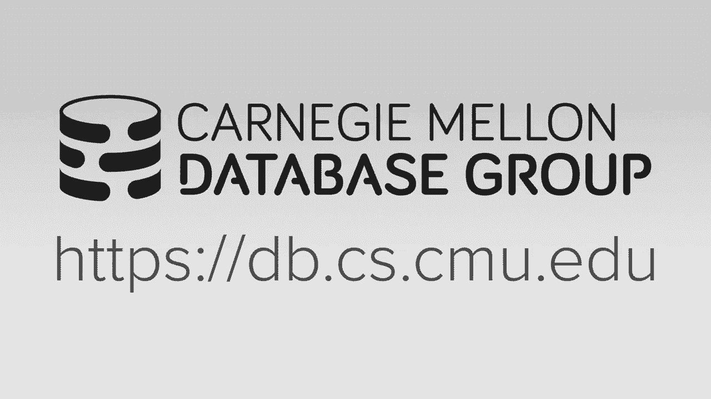
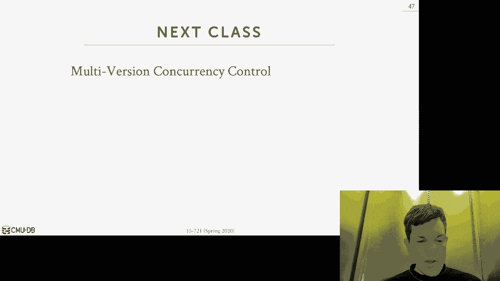

# 【双语字幕+资料下载】CMU 15-721 ｜ 数据库系统进阶(2020·完整版) - P2：L2- 内存数据库 - ShowMeAI - BV1wv411w7Ko

[Applause]，[Music]。

[Applause]，[Music]，as I said I can't be on campus this week，I'm still here in Europe right now I am。

actually in Munich visiting Thomas，Norman at at T um and that's where they。

invented hyper and the new database and，putting an umbrella so part of me going。

down to visit Thomas is sort of to sort，of get a better understanding why the。

Germans are so good at databases and so，as part of this they took me up here in。

the Alps somewhere in the mountains I，don't know exactly where we are it's。

freezing and the idea it's like this you，go in the woods and you think about your。

thoughts for like an hour or something，somehow that's gonna magically make you。

better understand databases so whatever，I'm just sitting here now it's freezing。

cold there's some hunting dog running，around fighting things you may see that。

in the background and I thought it'd be，a good time to get through and start。

discussing the next lecture so let's see，how far we can get before it gets too。

cold so the last class we discussed the，sort of a high-level history of database。

systems and primarily what I focused on，was sort of thinking about the problem。

in terms of like at a high level mostly，based on data models you know whether it。

was the codasyl stuff or the the，hierarchal data model the relational。

data model and so that was the sort of，main discussion of last class another。

way to sort of think about it was an，overarching theme throughout the entire。

history of databases is this constant，struggle of building database systems。

that have to deal with the limitations，of the harbor at the time right it's the。

same in the 1970s 1960s as it is now，we're you know we're always trying to。

run databases on new hardware and get，the best performance we can out of it so。

back in the 1970s though when they built，the first relational database systems。

database systems the hardware it was a，lot different than what we。

today but at a high level the the basic，idea is still the same and so the。

problem though is like when we start to，talk about modern systems the although。

the basic idea is still the same the，limitations that harbour is not exactly。

the same so back then in the 1970s all，right you didn't have machines with a。

lot of sockets a lot of about a cores，right you had a unit processor you had a。

single single core CPU that could really，only execute one thread at a time the。

rams also severely limited it was very，expensive so you were you were lucky to。

get you know a machine had diarrea but，maybe like of like a megabyte sorry now。

we can go into the terabyte so in a，single box and because bran was limited。

we had a store the entire database on，disk and so the the whole architecture。

the database system was predicated on，you know retrieving data from disk and。

of course back then this were way slower，than they were now and certainly the。

sequential access was was much faster，than random access so you try to design。

algorithms and data structures that，could maximize going to access so now in。

the modern era in you know 20 20 s now，we have machines that have enough DRAM。

such that most databases can probably，fit entirely in main memory and there's。

always going to be the outliers there's，always going to be you know the googles。

and the Facebook's and Amazon's of the，world where their data but their。

databases can be in the size of，petabytes but for probably 99% of the。

applications their database maybe，measures in in gigabytes or a few。

terabytes and so again with that with，that size you can certainly have a。

database fit entirely in main memory，whether it's a distributed system or a。

single node system so to understand why，databases you know aren't as maybe as。

large as you think they actually are you，gotta understand that there's a sort of。

difference between structured and，unstructured data or semi structured。

data so structured data sets or be，things that we mean normal talked about。

with you about databases so you have a，well-defined schema they have attributes。

right and every record has to have those，attributes and so in those data。

they're usually again these are，typically smaller unstructured data sets。

would be things like video files sound，files or images right these are things。

where the contents of every single，record in in that data set are is going。

to be different or there's not even any，structure at all and you know you can't。

run queries directly on on a video data，semi-structured would be things like log。

files that are generated such that，they're they're meant to be human。

readable but they're you know they're，not gonna have the exact same fields for。

every single log record you can parse，them and extract those fields but you。

know some love records might have other，fields other ones might have others so。

again unstructured and semi-structured，data sets these are typically larger you。

think of like YouTube YouTube yeah the，the my sequel database that that they。

use in YouTube you know that's gonna be，a fraction of the size of the total。

amount of video that they're storing and，the videos all the unstructured stuff。

the my sequel forties database is the，structured database so for our purposes。

here in this class we're primarily going，to focus on the structured data because。

that's really only you know you can kind，of do the things that we're talking。

about here but there's no magic way to，do vectorize query execution on video。

data what do you have to do you have to，convert that video data into structured。

data and then you can run your queries，on it so right so they so that's gonna。

be the poker server for ourselves here，today the other thing we need to。

understand also now is that how are we，and how we're gonna get the best。

performance in a davis ism to run on the，structured data so you may think all。

right well if my database can mostly，this is to fit on main memory can I take。

a you know traditional disk or a，database system as as one as I described。

last semester in the introduction class，can we just give that you know run that。

on a machine with a large enough large，nut via Ram and set the buffer pool。

cache size to be big enough such that，everything's gonna fit in a memory is。

that going to be enough for us to get，the best performance and the spoiler is。

gonna be no right and we need to，understand why so for today's lecture。

see how far we can get before we get too，cold，is that we're gonna first discuss what a。

dis cornea database system is so we can，understand you know when we started。

talking on imitative systems how do they，avoid all the bottlenecks of the。

slowdown issues of distorting system，then we're to talk about from this we。

can go a little deeper into the current，role and see what are the bottlenecks。

that we have to overcome to get these，control protocols to run in in memory。

systems so the the definition that I，always like to use for a disc or any。

database system is one where the the，architecture system of the system is。

predicated on the assumption that the，primary search location the database。

like all the contents of the database，there's records and indexes and material。

that's used everything with the store is，going to be on some kind of non-volatile。

storage but that's a spinning disk hard，drive or an SSD so that means that the。

database is going to be designed based，on this assumption and therefore all the。

algorithms the data structures and，everything that's on inside of it has to。

be aware that you know at any time we，could have to go get something from disk。

now the database itself will be，organized into a set of fixed length。

pages or stuff that sometimes goes，blocks and then we're gonna use a Emery。

buffering manager to store or cache the，pages in memory as we receive them from。

disk again we're assuming a von Neumann，architecture and that means we can't you。

know can't operate directly on on data，as it exists on disk you know that can。

change in some modern hardware but for，our purposes here assume that's not the。

case and therefore the preferable，manager is really all about how deciding。

how to move this data back and forth，between disk and memory as needed and we。

want to do this in such a way that we，minimize the amount of stalling or the。

amount of times we have to go out the，disk so this buffer pool is sort of the。

key thing that differentiates a disk or，nativism with the in-memory database。

system from terms of like the，architecture so what's gonna happen is。

we'll have a query that's going to，execute in our system and anytime that。

asks to access a tuple we have to go，find the page that our tuple is located。

in so the data says go check to see，whether that page that it needs for that。

query is already in memory if it is then，we just hand back the pointer to where，slow。

from our proper poll and the query can，execute if it's not then we start need。

to do some extra stuff so first thing we，have to go we have to go do is well we。

got to decide what frame we want to copy，our page into our buffer pool so a frame。

is just a location in the allocated，memory of our profitable manager and we。

use this term to differentiate it，between a page or a block because that's。

the same frames gonna be used over and，over again for different pages so if。

there's a free frame then our job is，easy we just say this is that frame that。

we're gonna put our page in we go fetch，it from disk and copied in and we're。

done but now there's no free frames then，we gotta find a page to exists from an。

existing frame and that's when things，get complicated so if the page we want。

to we want to evict if it's never，modified by a transaction I mean it's。

not dirty then our job is easy we just，go write it out you know we just go drop。

it and then reuse the frame but if it is，dirty then we got to go now evicted so。

we've got to write about the disk and，flush it and once that's done now we can。

use our frame so again you can see sort，of why this is complicated because you。

know we're running essentially you know，LRU or clock or whatever exhibition。

policy you want to use to decide how to，evict frames and we got to balance that。

with you know what other queries or，transactions are running at the same。

time what pages are dirty right this all，gets very complicated so now once the。

page is in memory then you know we can，try to be smart and trying to translate。

quickly any on disk or references to to，our page to now an or memory address so。

that maybe we don't have to go through，this whole process of checking the。

buffer pool manager every single time，but not every now in every system。

actually does that so at a high level，what I just talked that looks like this。

so for our purposes here say we're doing，a query that's going to look up an index。

index it wants to find a record the，records inside a page and we got a go。

fetch it from disk so to simplify our，discussion we'll say the index is not。

not backed by buffer pool pages it's，just actually sitting in memory in most。

systems that's actually not true right，the index pages themselves would be。

backed by the powerful manager so we，have to go check to see whether those。

pages are in memory as well，and do this entire process but we'll，just keep it simple and say it's。

entirely memory so the first things to，find our，and what the index will give us is back。

give us back as a paid ID and a slot，number and then we can use that page ID。

to look do a look of an a page table and，find the location of the page that we're。

looking for so let's say that we're，looking for page 1 and then we would not。

find the entry in our page table or we'd，see an entry that says oh it's not in。

memories on disk and here's where to go，find it on disk so in order to bring it。

to memory we have to go pick a existing，page to vicked so we have to latch this。

page table to make sure that nobody else，is trying to bring it in the same time。

we are and then we got to pick up one of，these pages to evict so let's say we。

pick page two but page two is dirty so，now we gotta write it out to disk and。

flush it and then once that's done then，we can now use the free frame to copy in。

page one and at this point now we update，our page table to say hey if you look in。

for page one here's the frame in the，before manage to go find it and then。

once that done we can release our，latches and anybody can access it so。

this is a sort of a gross simplification，of how this eviction process works right。

because I'm not showing it well if there，was an entry for page two and then you。

can update that now in the page table to，say it's not on not memory now it's on。

disk but you know at a high level every，single database system that's you know。

using a buffer pool is doing something，similar so what's the problem this well。

if now we get we go back to our example，say let's give our database system a lot。

of memory and now everything's gonna fit，memory well we still going through this。

entire process to go look up the page，table on try to do a translation of like。

the record ID to its memory location，every single time we access a tuple and。

we have to take latches and protect，things because we don't want us to be。

accessed in the page wall and then have，another threat try to evict that page。

but like I said if if we have enough，memory then we're never gonna actually。

write anything out the disk so pinning，these pages are and latching them is。

actually not necessary at all so just，sort of wasted work and then running。

that an eviction policy to updating all，internal metrics about how pages are。

being accessed that's also a waste of，work too because again nothing's ever。

going to be a victim so this sort of，answers my strawman question at the。

beginning that well can't we just give，it some a lot of memory and you know，memory and what。

that'd be enough for you know getting，the same performance as we would get an。

in-memory system and the answer is no，because you're doing this all apps you。

know doing these extra work just go，access the single page now this is gonna。

have cascading to other issues as well，so like in concurrent rituals so the the。

traditional disk based systems，destroying the system's their designs。

such that at any time a transaction，could touch memory and it's not in disk。

and therefore that transaction has get，stalled while the the disk manager go。

fetches it and so while it stalled other，transactions are gonna be able to run on。

other threads or the same thread so that，this system can keep making forward。

progress even though you know one，transaction got stalled because it has。

to get something from disk all right we，do this otherwise if we can only execute。

one transaction at a time and we stall，anytime we have to get from something。

I'm disk then the system's gonna look，unresponsive because it's gonna keep。

stalling and you know every single time，you know we have a page miss so because。

now we're allowing other transactions，are run at the same time we have to use。

a concurrent protocol that could be，setting locks in our own records or。

objects in the database to make sure we，provide the asset guarantees that you。

want for transactions right because if，now a transaction modifies a page and。

then that page gets written on the disk，before that transaction commits can。

commit because some other transaction，evict that page then we got to make sure。

that we keep track all the section，information and that if we crash and。

come back that the uncommitted，transactions changes don't persist so in。

a disk or any system if it's using，locking it's going to maintain this。

locking information in separate data，structures right it's an in-memory hash。

table in the lock manager to avoid those，the lock information getting swapped out。

to disks that way I don't have to，determine whether I can even hold the。

lock on a tuple to go got the disk and，figure out you know go fetch that lock。

information everything is always going，to be in memory other problems would。

have an in memory system is with logging，recovery so most database systems that。

use a buffer file manager are going to，be using the steal no force but football。

manager policies and this just basically，means that all the transactions that a。

transaction mates all the modifications，that a transaction makes。

have to get added to a right ahead log，and that those entries have to get。

flushed to disk before transactions，allowed to commit and then any updates。

to a dirty page the law of records，correspond to those updates has。

rewritten a disk before the dirty page，can be written a disk these are things。

that we covered in the introduction，class last semester so now an in-memory。

system we don't have dirty pages anymore，so maybe we don't need to use the exact。

same protocol and then maybe our log，entries don't need to store the exact。

same information as we had in dis，oriented system right if no dirty pages。

have to ever get rid of disk then it，maybe doesn't make sense to store the。

before image or the redo information I'm，sorry the undo information of the。

transactions modification because that，page will never the dirty page never。

gets written so there's a lot extra，stuff we had to do in a tyranny system。

that maybe doesn't make sense anymore in，an emery system like keeping track of。

the logs sequence numbers again again，maintaining the the undo information。

because again dirty pages don't get rid，of discs because everything fits in。

memory all right so to get others a，better understanding of what this。

overhead is actually gonna be there's a，study that was done at MIT it's actually。

2008 over 10 years ago now where they，took a old TV database system and。

they've instrumented so that they can，measure the number instructions that the。

data system was spending in different，parts of the current query execution。

while you're running TPCC and the idea，here is to break down the system into。

different components as I talked about，and just measure again how much time。

we're spending in each of them it's okay，this is for a database where everything。

fits in memory there's no any no reason，writes in memory nothing gets flushed to。

disk and that right ahead log this is，just what is the cost of going access。

data that's in memory using the disk，oriented architecture so the first。

overhead is in the palpable manager this，is about 34 percent of the CPU。

instructions are spent doing updates or，lookups into the page table doing。

updates you keep track of all the，metadata you have for the eviction。

policy 14% of the time spent doing，latching by this could be for the。

internal data structures such as the，page table with the lock manager ran，anytime that's you know。

the low-level constructor we need，protect 16 percent of instructions were。

spent on locking so this particular，system it was called sure and uses。

two-phase locking so this is the，overhead of updating the lock。

information for transactions while they，run for 12 percent of the instructions。

were spent in the log manager so this is，not the cost of running out the disk。

this is the cost of preparing the law of，records that we're going to write out。

then 16 percent of the time is spent，doing a comparison of keys doing。

traversals in the B+ tree but this is，sort of unavoidable this is just saying。

you know if I'm trying to find the，record that I want through the D plus。

tree this is the cost of comparing keys，so this is now going to leave us with a。

paltry 7% of the CP instructions we're，actually doing what what they would call。

real work like executing the the logic，for transactions getting back the data。

and then performing you know perform the，commit operations and things like that。

so this is again this is showing you，that if you take a disk learning system。

and you give it all the memory that it，wants so that everything everything fits。

in memory you're not going to get，potentially the best performance because。

everything could still you know you，still have pain the penalty for all this。

internal architecture that assumes the，data is not on disk and there's all the。

protection mechanisms for that，assumption and that are actually not。

so my battery on my tablet shut down，earlier today when I was recording this。

outside it got too cold and everything，just the whole thing to shut down I was。

like 20 degrees Fahrenheit which is like，negative 7 or so degrees Celsius so that。

was kind of weird so back inside in this，weird German gold deprivation chamber。

thing that they have here again and，since to come in here and think about。

deep thoughts about databases and，somehow become a better programmer like。

a German I don't know if that's gonna，work so let's just continue with the。

lecture so where we left off just now，was we were talking about how the。

Discordian systems have because they，make that assumption that the。

prime-minister education the davis could，be on disk there's all this architecture。

set up so that at any time you know when，you read something you you have to go。

check to see whether it's on disk and if，not you can install that thread and do。

other stuff so now we're gonna switch，over and talk about an in-memory。

database system so this is one where，that where the system's gonna zoom that。

the primary search location is going to，be above all the data base is always。

going to be permanently in memory so，that means that any single time a。

transaction or a query goes and reads a，tuple it can assume that that thing is。

going to be in memory and therefore it，doesn't have to go through all that page。

table and in the buffalo and check，anything goes goes and reads whatever it。

wants or writes whatever it wants so，it's not to say that everything we're。

gonna talk about this semester is going，to be only targeting in-memory databases。

but we'll see how there's be certain，design decisions that we're gonna make。

that'll make our life easier if we make，this assumption so this idea of an。

in-memory database is not new，the first proposed systems go back and。

into the 1980s but they're not really，you know viable option now maybe in the。

last 10 years because it's gotten to the，point where dear on prices and。

capacities are such that you know we can，store really large databases in memory。

so the you know that there was initial，ideas proposed in 1980s we'll talk a。

little bit about that as we go，but the first commercial America。

databases diddly didn't come out until，like the 1990s the most famous three are。

probably times ten which is really，originally called small base and then。

they forked off from HP and became times，10 and then Oracle bought them probably。

about 2006 or so data blitz was the，system at a Bell Labs 1880 in the 1990s。

it was urgent called dolly it was sold，for like telecom switches and things。

like that I don't think it's still，around today or if it is it's sort of。

it's obviously in legacy mode and the，Alta base is that a South Korea it's one。

of these early beginners he's early game，every day to business which actually is。

still around today and actually within，the last two or three years they're open。

sourced it is you can go and check that，out of github so even though and now。

that the Davis is gonna be entirely，named memory we're still gonna organize。

data into blocks and pages does not slot，at pages because we don't you know what。

the word about indirection within a page，itself and so the system architecture。

would be slightly different now because，now instead of doing these record IDs we。

can deal with direct memory pointers the，way we're gonna handle fixed length。

versus variable length data if we，slightly different than a than a disk。

based system because again we don't have，slotted pages and although not many。

systems have this because some do there，is a concern that now because。

everything's in memory any thread can，read or so you can write anything in the。

address space of the process so to make，sure that we don't have you know。

error-prone software collaborating our，data and causing permit damage we can。

use check sums throughout the system of，these blocks to keep track of you know。

the status of a page and you know detect，errors with these ever problems now。

underneath the covers the operating，system and the hardware is also going to。

be organizing memory into pages as well，that's not really going to be our。

concern for most most of this semester，we'll talk a little bit later on and a。

few more lectures because we need to，understand how it's actually going to。

layout data so that when we start laying，underlying，hardware，is Roberts's now we can ignore that so。

again let's return back to our，high-level example here where we were。

had a query one of that accesses a tuple，lets people go through an index to look。

it up so now in our index instead of，returning back a record ID or page page。

ID in an offset we're now gonna get a，block ID in an offset and this block ID。

could either be the direct memory，address of a fixed length block or there。

could be an additional mechanism that，allows us to look it up and see you've。

convert that block ID to a memory，location so the primary search locations。

database again is in memory or every，tuple is in memory but we're gonna。

organize them in these fixed length，through records and so for this it。

doesn't matter what we're assuming a，roast or a column store but the basic。

idea is the same and that is we're gonna，have a set of blocks or restore the。

fixed length data for a tuple so，anything like an int dates floats reals。

things like that all that can be stored，is fixed length and fixed length block。

and that means that the size of every，tuple here is going to be the same and。

so that says now if we have as block ID，and we convert that back to a memory。

address when we want to do a lookup to，find the tuple within the offset of that。

block we just do some simple memory，arithmetic to take the size of the tuple。

multiplied by our offset and then as，tell us where to be jump in memory that。

blocked and regret it now to handle very，length data this is gonna be much。

different than what we would do in a，disk based system so variable length。

data were instead instead of actually，storing the data in line the fixed。

length data block for the most the time，restore point err to some other memory。

location in a very linked data pool，where that's a direct access to the data。

that corresponds to the this attribute，within this tuple and again the idea。

here is that we can guarantee that all，the tuples and the fixed length data。

blocks are fixed length and then for，anything that's variable length we shove。

that into the very length data block，again this is different than the slotted。

page design you would see in a disk，coordinate system because in there we're。

trying to reduce the number of disk，reads so therefore we try to pack in all。

the variable length data，for a tuple within you know with the，tuple itself all the fixed length data。

that doesn't always happen and if it the，spillover to another page we can do that，happen。

and in this world in memory system were，actually want to store the variable。

length data separately so that way we，can do that deterministic lookups to。

find memory addresses for tuples all，right some other things that better。

could be different then we kind of，talked about quickly within memory。

databases right and again these are the，things we're talk about their entire。

semester the first one is gonna be how，we're actually going to store indexes。

sort of how with data structures we're，gonna use for indexes so when this first。

in memory database systems were proposed，in the 1980s the harbor it was a lot。

different than the hardware we know，about today or how the harbor is laid。

out today so in particular back then the，cache and memory access beats were about。

the same but now this is not the case at，all right CPU caches are way faster than。

main memory access so back then people，were designing data structures were you。

know reading from cache was the same as，reading memory to be so they would。

organize a certain way but now in the，modern era we don't want to do that。

so therefore we want to use indexes that，know that they're dealing with memory。

and they're and they have caches and try，to minimize the cache misses when when。

he access things so the spoiler is gonna，be that a B+ tree is gonna turn out to。

be a the best data structure to use for，a name every day but it's even though。

d-plus trees were originally designed，for disk based databases they're。

actually still really good for in-memory，data as well so the other major think。

difference between the difference we're，gonna have indexes is that in a disk。

based system you would also write log，records and write out pages for the。

index disk so that you can recover them，after the system restarts an in-memory。

system we're actually not going to，record any low of record to not write。

indexes out to disk for most systems，because the cost of rebuilding the index。

after restart the system is is gonna be，super low rise to think about this when。

the system and the rate is when I，restarted I gotta bring the database。

entirely back in the main memory and so，the cost of reading that there's the。

data from from disk is super expensive，whereas the cost of building。

index at once the data is already in，memory is is it's cheap because it's。

just CPU computations so for this reason，and and gain avoiding the having to log。

records to the log updates to records to，the in debt updates to the index at。

runtime or just slow us down，we just rebuild the index after after we。

restart again we'll cover this and clean，it's more detail when we talk about。

indexes for query processing again now，in the dissapointing system the disk i/o。

was always the most expensive thing who，cares what kind of for the most part how。

you computed the data or you know the，organize the access of data once it was。

in memory so in a disk wedding system or，so an in-memory system we are gonna care。

about now the overhead of doing function，calls and branches of the things like。

that so you need more care for how we，organize the system and do query。

processing sequential scans are also not，significantly faster in a in memory。

system so maybe there's certain，algorithms and you know join join。

methods for doing joins and other things，that we don't have to worry about making。

your optimizing or maximizing that of，schedule access because random access it。

will be good enough again we'll cover，this in more detail as we go along for。

logging and recovery I sort of mentioned，this already before but now that。

everything is in memory there are no，dirty pages you to flush out the disk we。

can be more conservative or we can end，up recording less data than we need then。

we normally would need a disk or new，system if we know that everything is in。

the memory so standard techniques like，root camp we'll use the batch of logs。

amortize FSN cause that's that's，applicable for a disk warning system too。

but being able to use a more lightweight，logging scheme is a definite advantage。

for a in memory system right because，again there's no dirty pages we don't。

need to do undo anything we write to，disk as part of a checkpoint is going to。

be a party from a committed transaction，for the most part all right so now if。

the disk i/o is not the slowest resource，then we can change，and we change what sort of protocols and。

methods and algorithms are using the，process queries and transaction in a。

database system now we can be mindful，with the other bottlenecks that are now。

going to come to the forefront because，disk i/o is no longer in the critical。

path so this is essentially what the，entire semester is about how to deal。

with these other issues when we design，database systems so locking latch and。

Sorkin kernel methods and the lone，low-level primitives to protect those。

data structures cache lionesses are big，deal cos can memory access versus cache。

access is is much more expensive，chasing pointers doing jumps to random。

locations in memory and it will cause，more cache misses that's problematic。

evaluating predicates do you know taking，the where clause for every for a billion。

tuples and evaluating it that's gonna be，expensive moving data or copying data so。

data movement would be if I have to move，data from one sock CPU socket to another。

that's expensive copying data would be，materializing the intermediate results。

or copy data between sockets to pass，things around those are things we want。

to avoid and of course networking is，always a big issue now there be。

primarily between the application and，the database system and not between。

different nodes of the same database，matters were a discordant system - but。

again now the disk is gone this is this，is even more problematic and an。

in-memory system so for the rest of this，lecture I want to discuss locking and。

latching um so we're gonna focus on the，cartridge hole here and this is just。

mostly to set us up to understand going，forward how you know to think about and。

that's it to think about you know what，is it that makes a game system slow and，cores。

what does mean these other bottlenecks，and problems that were going to have so。

again as we covered it in the，introduction class concurrent your goal。

is essentially the protocol that the，deities have used that allows it to。

execute multiple transactions at the，same time and each these transactions。

are going to sort of have this illusion，that they're executing on the system by。

it's by their self so they don't don't，worry about reading or reading the。

effects of other transactions from at，the same time I this is essentially what。

you would want to achieve in your system，because that's it's the easiest way to。

program your application of course now，this is not easy to do if start。

interleaving interleaving operations，between different transactions you could。

violate this ordering so the kikuchiyo，protocol of any database system is going。

to provide the atomicity and isolation，guarantees within this SSN acronym so。

for an mme database system there's this，key observation we have to make about。

how we're going to acquire locks to，access to poles and that is the cost of。

a transaction acquiring a lock is，essentially the same thing as just。

accessing the data so what I mean by，that is in a disk loading system we said。

that all the locks would be stored in，memory in some kind of data structure。

and they would be and they were separate，from the actual tuples but now。

everything's in memory then the cost of，going and accessing the lock table is。

going to be the same as accessing the，tuple so ideally I want to be able to do。

those at the same time so that I'm not，paying the penalty of doing two memory。

reads and this is the core idea that，furniture try to install and when we do。

in memory data system concurrent control，the other important thing to understand。

too is is in a disk running system the，stalls are due to transactions trying to。

access data that wasn't memory you have，to go get out to disk and get them but。

now we're not gonna have those kind of，stalls anymore yeah yes I'll be memory。

stalls but those are gonna be much much，less than you know just stole but what。

you think we are gonna have or that the，earlier assistants don't have is a way。

more cores and so now the contention is，going to be in the system of many。

transactions trying to read and write to，the same objects at the same time and。

they're not stalling because there's a，disk there stolen because they don't we。

can't acquire the locks on certain，things so do you understand again how。

we're actually going to be able to，maintain locking information along with。

the tuple we understand of this sort of，basic compare-and-swap primitive we're。

going to use to modify things so we're，not going to use mutexes protect tuples。

because there would be too slow instead，we're gonna use these atomic operations。

called compare-and-swap，so I think this is primarily covered it。

in other classes and so I just want to，give you a quick overview what it is and。

because this is gonna come up multiple，times throughout the semester and it's。

good to sort of see at once we're not，really details of actually how this is。

implemented Hardware just know that this，this concept but actually exists so。

compare swap is an atomic instruction，that pretty much every modern CPU will。

provide you it's not a new concept I，think it goes back to the 1970s probably。

pretty much every Zeon arm architecture，or a PowerPC will give me this now and。

the idea is that it's a single，instruction that's gonna do a lookup in。

a memory location and it's gonna check，to see where that memory location has a。

certain value that provided and then if，that value is equal so the meta is a。

value that memory location is the equal，to the value you're checking with then。

you're allowed to install a new value to，update it otherwise the operation fails。

and so in this example here this，underscore underscore sink pool compared。

swap this is a this is a C++ or Linux，Lib C or Lennox did you see both flaws。

operation or intrinsic different，platforms have different things and I。

think for the most part in modern，systems there's there's either。

understand or the intrinsic functions，that can do the same thing Daddy here is，address。

we're giving it a compare value and a，new value so the current memory address。

that M points to contains the value 20，so in a single instruction now we're。

gonna see whether 20 equals 20 in the，memory location and if yes one stall。

install the new value 30 so in this case，here in a single instruction and we look。

up to see that M equals 20 and it does，so then we can stall 30 right otherwise。

that this would have failed so in this，example here the the function here。

returns true false and saying whether is，succeeded or not there's all different。

types of compare and swap instruction，and sometimes they'll return by。

the the new guy that I got installed or，the old one if it didn't get updated。

some and then you can change the you，know the size of the memory dress that。

you're looking at with 32 bits or 64，bits but again the basic idea is always。

the same thing within a single，instruction we can do this check and。

this is we incorporate them that were to，use all throughout the semester allows。

do these kind of lock free or latch free，operations very efficiently so we want。

to talk about quickly sort of the tutor，of categories or classes of comparable。

protocols that we're gonna be working，with this semester and this again。

there's sort of a refresher from what we，covered in the introduction class lesson。

Osterman and so the first time you two，phase locking so these are pessimistic。

schemes where the data systems going to，assume that transactions are going to。

conflict and therefore they have，required locks on any objects before，that allowed to access them。

timestamp ordering is an optimistic，scheme where you assume conflicts are。

rare so you don't require transaction to，acquire locks on database objects and。

all you do instead is that when the，transaction goes to commit you see。

whether there there was a conflict and，then you correct them as needed so let's。

go through each of these one by one，showing really high-level examples and。

then we'll get into the paper discusses，how do you actually implement this on。

modern systems so if there's a simple，example for two phase locking we have a。

transaction t1 and it wants to do a read，on a followed by a right on P so again。

one or two phase locking we have to，acquire the locks for any object that we。

want to read and write so in this case，here we've got to get the read on the。

lock on a follow up a lock on B so this，is a really simple example or simplified。

example because I'm you know there's，only this a simple one type of lock on。

on a and B but in a real system as we，covered last semester you know you would。

have different lock modes you can have a，shared mode the multiple transactions。

read the same object and exclusive mode，to say that only one transaction can。

lock it could connect can write it at a，given time so in this case here because。

two-phase locking the first part of the，transaction is called the growing phase。

and this is where we're，acquiring locks that we need okay sorry，that we're need during during the。

exertion in the transaction and then，soon as we release one block now we're。

in the shrinking phase and we're not，allowed to acquire any new locks but we。

can do operations on the only objects we，still have all the locks for so in a。

real system like in it's based on sequel，you wouldn't actually have explicit lock。

and unlock commands these are something，we've dated some dust where you。

automatically underneath the covers so，typically you you don't release the。

locks until the transaction actually，commits which is called rigorous new。

phase locking but for a preferences here，in this example we're not doing that we。

can unlock a and then file and then do，the write on B and that still follows。

the original two phase locking protocol，all right so let's say now we have。

another transaction t2 comes along and，it wants to do a write on the father I。

don't name and so say these transactions，are running at the same time on。

different threads and therefore they can，they can do these things in parallel。

with each other so in t1 we first get，the lock on a on t2 and get a lock on B。

this is fine assuming there's no other，transaction written at the same time so。

both these transactions can acquire，those locks in the next step their。

transaction t1 does the read on a which，is allowed to do because it holds the。

lock on a transaction t2 does the right，on B which is a lot of do because it。

holds a row the lock on beam but now we，get into trouble here because t1 wants。

to do a lock on b t2 one's gonna lock on，a but each of these are held by the。

other transaction so they have to stall，right and they've been there essentially。

waiting for the other transaction to，give up the lock so I'm go ahead and can。

make forward progress but of course we，have a deadlock here and so now we have。

to do something to break this because，otherwise the system would be locked。

forever so there's two ways to do，deadlock or handle deadlocks and if he's。

locking the first to do deadlock，detection this is where you have a。

separate background thread that's just，gonna occasionally or periodically wake。

up check to see whether the transactions，are running and if it finds a deadlock。

then uses some kind of heuristics to，decide how to kill them I could say you。

know kill the transaction has，that has done the least amount of work。

or is the oldest or holds the most locks，the various systems do various things。

different systems do all have different，types of deadlock detection algorithms。

deadlock prevention is instead of having，a separate thread you just have a way to。

make sure that when transaction tries，acquire a lock they can't hold it then。

it makes a decision about what it should，do other than just waiting so for。

example if I if a transaction tries to，hold a lock acquire a lock but that lock。

is being held by somebody else and you，can either kill itself or kill the other。

transaction and steals locks right again，we do have to make sure we do the。

operations in the right order so that，there's so that way there's you know。

there's no cycle of dependencies all，right so the other type of protocol is。

called timestamp ordering again this is，sort of category systems that are in use。

time stamps than a lock to figure out，the right order that transactions should。

be allowed to complete so the sort of，two basic protocols are basic time stamp。

ordering which is sort of confusing，because it's usually referred to as the。

time stamp boarding protocol which is in，the category of time stamp ordering。

protocols but it's all call it basic tio，dis to differentiate it so the idea here。

is that we're gonna check for conflicts，on every read and write and we're just。

gonna and use time stamps determine，whether there is a conflict and then。

we're gonna copy tuples into a private，workspace for each transaction as they。

read them to ensure if they go back and，read the same cable they get the same。

value because otherwise you could be，reading something that was written in。

the future and that shouldn't have，happened，optimistic cartridge role is where in。

addition to copying the things you read，into your prior work space okay you're。

also gonna come make copies of any，tuples you modify and and all your。

rights go into private workspace and，then when you go to commit then you do。

the validation as checked as whether，there were the ramming conflicts and if。

not then you can merge all your private，workspace changes back into the global。

database so again we'll go through each，of these one by one so say for the basic。

time stamp warning protocol we have a，transaction t1 wants to do a read on a，of stole。

and wants to do it right on a so when a，transaction starts we have to assign the。

timestamp because we're gonna use that，to determine the serial ordering of。

transactions so there's different，schemes you could use I can use the。

hardware clock I can use a logical，counter I use a hypo to the tune but for。

simplicity let's just say we use a，logical counter and we just update that。

counter every single time we start，transaction and we sign that new。

timestamp to get to the to the to the to，the transaction so this transaction。

starts and it's gonna give the timestamp，10000 1 now inside the database for。

every single record we're storing we're，gonna maintain two additional fields so。

we maintain the retime stamp in the，flight times 2 3 times same would be the。

highest time stamp of the last，transaction that successfully read this。

tuple and the write time stamp will be，the last times the time stamp of the。

last time ii that road to this tuple the，idea is that these time stamps are。

always going forward in time they can，never go backward because that would be。

violating the time stamp ordering of，transactions all right so our。

transaction starts does a read on egg so，the first thing needs to do is check the。

write time stamp and see whether it's，time stamp is greater than hours meaning。

we'd be trying to read something in the，future that we wouldn't read me allowed。

to read in this case here the right time，stamp for record a is 10，000 hour time，stamp is 10。

000 won so were we allowed，to read this so we need to update now，the re time stamp to check to see。

whether it's time stamp is is less than，than hours and if it is then we want to。

go ahead and update it so in this case，here we'll update it with 10，000 won now。

this is telling other transactions that，may want to update this this tuple that。

there's was a transaction at timestamp，10000 won that has read it so make sure。

that we don't write something in the，past and this terms actually missed so。

then now we do the right on beat same，thing we first check to see the right，time stamp。

see if we have to see whether it's in，the future from when we're at and。

therefore we would be overriding，future data with past data which is not。

allowed and then we check the read time，stamp and make sure someone didn't read。

this record in the future and if we did，write to it they would end up missing it。

so in this case here our time stamp，checks out for both of these both the。

reads and the rights so we go ahead and，update my time stamp field。

then I'll say that our transaction has，some kind of stall like it's computing。

the you know the 1 billion billionth，digit of pi or its accesses remote some。

root system for whatever reason there's，a stall and during this time another。

transaction comes along and modifies，record a and now updates at the right。

time stamp with ten thousand five so now，we'll see that we have a real issue。

because now when our transaction wakes，up and tries to then write to record a。

that timestamp 10000 five is greater，than our timestamp 10000 one so we。

shouldn't be allowed to do this because，this would be trying to overwrite a。

logical record that was updated in the，future with a physical record of in the。

past so in this case here this be，violating the time symbol ring and our。

transaction has to get killed and aboard，it and we roll back any changes so most。

systems that are out there don't do the，basic time stamp learning protocol the。

more common approach is to do OCC，optimistic a cartridge whole again this。

is confusing because time stamp ordering，protocols are by themselves or。

optimistic schemes but there is a，protocol to this figure called the。

Optima secure protocol scheme alright so，the basic idea here is that like touch。

the border all right just late like time，see I'm ordering there we're gonna。

maintain a private workspace we're gonna，copy all the read data into it so that。

we go back and read same record you get，the same value we're also going to write。

all our changes into that private，workspace as well so now when a。

transaction commits we get the verify，that there's no conflicts and if not。

then we can go ahead and install them to，the global database so OCC is an old old。

protocol as you most most conclude your，protocols the basic ones are old this。

one goes back to 1981 and actually was，invented here at Carnegie Mellon by。

Professor HT Cohn HT Kong is no longer，here he's now at Harvard and he's not。

even a Dana's professor he didn't know，networking but this is sort of like his。

most famous work is actually a databases，out of the computer，department here at CMU so here's the。

simple transaction was to read on a on，write on read on a write on a and write。

on B so in our database now we don't，need the read time stamp field for。

records we only have to have the write，time stamp field and so now when our。

transaction starts unlike in basic time，stamp boarding protocol we're not gonna。

actually gonna assign it a time stamp，we're gonna do that later。

so any time we're gonna read and write，stuff we're gonna make a copy of it in。

into a private workspace and set it with，the types of infinity so OCC has three。

phases so the first one unfortunately is，called the read phase so even though。

we're gonna do rights and this this for，whatever reason the this they call this。

the read phase of a transaction if I had，my choice app I would call this like the。

run phase or in the execute phase I，think that makes more sense for whatever。

reason it's called the read phase so，again we're gonna do a read on a here in。

the B phase so we're gonna have to copy，that record and the global database into。

our private work space so that again we，can always read this thing over and over。

again at the same value so now when we，do on write on a write we're not gonna。

modify the global database we're gonna，modify the one in a private workspace so。

we don't have a write time stamp yet，because we haven't been assigned one so。

we're just gonna set that to an infinity，in our workspace and then update the。

value same thing on B here we're gonna，first copy it from the global database。

into our private workspace and then，update it with our infinity timestamp。

and the in our new value so now when our，transaction goes to commit it's not。

actually gonna commit right away there's，not gonna be two additional phases the。

validate phase in the write phase and so，the validate phase is basically where。

we're gonna look at a private workspace，see what see what what records we。

modified and go to see whether that，would by whether there's any there's。

there's either transactions that are，still running but have read this data。

and therefore they didn't see our，updates because there was in a private。

workspace or there's transactions in the，past that I've already committed that。

have modified this and therefore we，didn't actually see their changes。

well and therefore we would have a，conflict so that's either you're doing。

backwards validation a forward，validation again we covered that in the。

introduction class it's not really，important right now but basic idea is。

like you and you're making sure that，transactions are always committing sort。

of in the right order so if we pass the，validate phase there's no conflicts then。

we now enter the right phase where we，now are finally assigned a time stamp。

and then we update the global database，with our changes that we've made from。

our private workspace with out with our，new time stamp and then and then at this。

point that transactions considered be，done and it goes and commits so the one。

important thing to understand about this，is that when there's not really any。

contention then the optimistic schemes，like OCC are actually performing better。

than two-phase locking because since we，assume that the conflicts are rare we're。

gonna spend less time checking for，complex right we spend less time looking。

for for for conflicts that don't，actually exist it's sort of like in the。

discordian system where if everything，fits in memory then we're gonna waste。

time looking you know to see whether we，have to evict something to make space in。

our buffer pool manager all right so，it's better off just to optimistically。

assume everything fits and memory and，jump right to get and get what we need。

but the issues can be now with high，contention I mean we have a lot of。

transactions trying to tend to read and，write to the same records then all the。

protocols that I've just talked about，are essentially going to degenerate down。

to just being the serial execution of，transactions meaning only one。

transaction can run at a time we're，gonna waste all this extra extra these。

extra spend a lot of time in our，protocols doing work that's essentially。

useless because we're transactions are，never gonna be able to commit so to。

better understand this issue this is，what this the paper had you guys read is。

about so this is a start the idea with a，former student of mine who is now a new。

data to fester at the university，Wisconsin we did a few years ago where。

we implemented a testbed system that，allows to evaluate different。

aren't your protocols that rich green，levels of parallelism and so it's kind。

of intrigue might this project is rather，than taking like post grass on my sequel，or whatever。

Davison you want and trying to do a，bake-off between the two of them we。

implemented a single system that had a，pluggable API that allows a plop in。

different cultural protocols without，making major changes to the rest of the。

system and the idea here is that we want，to strip it down to just being the bare。

minimum you need to execute transactions，in a database system without all the。

additional bells and whistles and，features that are yet that a。

full-featured system like might see what，Prescott's would have we just focus on。

what the overhead is of these，concurrency of protocols，so the idea also to was that we want to。

run this you know this these systems in，a highly parallel environment so that it。

would sort of really exposed as the in，what the main bottlenecks are in the。

implementations of the different，protocols in the system in a way that。

you couldn't get maybe running on a，machine like 32 cores or 64 cores which。

is so the most you can get around this，time in 2014 when we wrote this paper so。

the system we're gonna use for this，evaluation is called DB X 1000 so this。

was again the system that the student，wrote for this paper and then it was。

written from scratch just to have this，pluggable API allows you to plop that。

drop in different implementations of，these concurrent your protocols so it's。

a stripped-down system there's no，network access there's no logging at。

least at the time that we were at this，paper and a dated support concurrent。

indexes it really was just focusing on，how fast can you do convert your。

protocols all the transactions are going，to execute with store procedures and so。

that means all the server-side logic in，order to execute a transaction is。

contained on on the data system itself，so you never talk about them over the。

network and ask the application of the，client you know what should I do next。

and so we're gonna run this now also in，a chip simulator developed by who at MIT。

added my team called graphite and this，was modeling a single socket table based。

CPU with a Nuka architecture so Nuka，stands for non-uniform cache acts。

and we contrast that with the Neumann，architecture non-uniform memory access。

that or mostly gonna be talking about，during the semester in like you know。

Intel Xeon ships so Nuka basically means，that the cost of one core accessing the。

cache of another core is not always，going to be the same because it's gonna。

have this tile based architecture where，you have to communicate over this mesh。

network in order do you know cache，invalidation and do reason writes。

between different cores and so some，cores are closer to you on the network。

and therefore your reading writing their，memory locations or their caches is much。

faster than one that's mainland to clean，the other side of this network so I'm。

not really an architecture person the，reason why we want with this or a tile。

based approach is that when you talk to，people that are architecture experts。

they said that when you start getting，them to like a thousand core count sort。

of the conventional wisdom is that you'd，want to use a table based architecture。

like this again the main takeaways we're，gonna get from the study are not gonna。

be dependent on using a tile based，architecture and they're still。

applicable to the xeon type system as we，talked about for the semester it's just。

is what the harbor was that we had at，the time to model this so another。

important thing to understand too is，that this cpu stimulator runs really。

really slow all right it's it's ten，thousand X slower than the wall clock。

time of a you know system running bare，metal so that means that there's a bunch。

of optimizations the student had to do，indeed X 1000 that get to run at a。

reasonable time in the simulator so if，you go look at the code on github you'll。

find that there's a lot of them there's，a lot of assembly in the different parts。

of the system because he had to do that，to get it to run run fast and her you。

know get the experience to finish in，time all right so the target workload。

we're gonna be using for this paper is，going to be y CS be W Yahoo Cloud。

something benchmark so the it's，basically a key value store workload。

that's sort of meant the model the sort，of ESS patterns of a web services or web。

based applications so in the database，there'd be two million tuples and each。

tuple is is one kilobyte so every，transaction that we're gonna model our。

Iran in our system is gonna execute，queries they're gonna read and write。

sixteen different tuples at a time and，we're gonna vary their access patterns。

excu in the access pattern so sometimes，they'll be hotspots and sometimes。

they'll be uniform access and all the，procedure，store procedure is running the。

serializable isolation level so the six，different schemes are going to compare。

or based on the the different type of，protocols that I talked about before so。

for two phase locking there's gonna be，deadlock detection and then deadlock。

prevention with no wait and wait and die，and this is emblematic of sort of the。

some of the biggest database systems，that are out there today now in the time。

stamp ordering side there's a time stamp，ordering and there's FCC and there's a。

multi version there's the original multi，version protocol present or described in。

the 1979 paper that version described，MVCC that uses time stamp whirring next。

class we'll see that you can have，different variants of multi versioning。

that uses OCC or two phase locking but，for this one we just went with this sort。

of in the original protocol for posed in，the 1970s and this is emblematic about。

most of the newer systems today as well，as some sort of classic database systems。

that use multi versioning alright so for，the first experiment here this is sort。

of the sort of the baseline performance，of these different protocols and a。

read-only workload so what you're seeing，is that along the x-axis as we scale the。

number of cores we're adding work the，more concurrent transactions running at。

the same time so every single time we，added a core that's going to have an。

additional transaction running that's，you know run important executing part of。

the workload so 200 cores there's 200，current transactions at the same time so。

this is a read-only workload with，uniform memory access or tuple access so。

and this is the best that these，different protocols can do because。

there's there's zero contention so the，first thing we see is that the deadlock。

detection and the no wait protocols，actually can almost scale linearly and。

perform the best because these protocols，are so simple there's no。

locks and therefore the overhead of，transactions and executing is mental。

next thing you see is that there's me，here at eight hundred cars where wait。

and die and MVCC start start to dip down，and this is due to the overhead of。

allocating unique time stamps for，transactions as they're running right。

when you're running with a million，transactions at the running the same。

time or when you're running eight，million transactions a second for this。

table based architecture at the time，stamp allocation and coordinating across。

all the different threads becomes a，bottleneck and lastly you see that OCC。

here actually does the worst and so this，is a combination of of having to copy。

the private workspace for every single，transaction and copy that back into the。

system that actually comes a big，bottleneck so next we see here is a。

write intensive workload where you know，I have transactions actually updating。

the database and this is on a medium，contingent workload where 60% of。

transactions are going to try to access，a hot spot of 20% of the database so the。

first thing you need to see is that，deadlock detection is actually now the。

worst protocol used for this miss，environment you know in the last slide I。

showed you to was actually the best but，now when you have high content to higher。

mountain contention there's deadlocks，there's more dead locks in the system。

and therefore it takes longer for the，deadlock detection thread to come around。

and break these dead locks so you sent，you have threads stolen and waiting for。

that deadlock detection threat to come，through and clean things up and that。

hurts performance next you see that the，no wait and wait I actually do the best。

all right and this is because these，protocols are so simple so what's。

happening is that the you know yes，there's anytime there's a conflict and。

there would be a deadlock these，protocols immediately just kill the。

transaction to restart them so you don't，spend any wasted time trying to figure。

out you know should I wait or you know，hoping the other transaction could give，away。

no waits the simplest one writes，basically says I try to acquire my trans。

block I couldn't get it immediately kill，myself and again because we're store by。

seizures there's no overhead of，restarting transaction and in a memory，environment it's super fast。

all right in the middle here you see the，three timestamp warning protocols basic。

tio MVCC and OCC they're roughly all，doing about the same of CCS doing slower。

again because there's extra overhead of，copying things into the work you know in。

and out of the work space over and over，again but you know they're roughly about。

the same so now we get to this final，graph here which is the most important。

one of the paper and this is where we're，running a writing system workload where。

90% of the transactions are updating 10%，of the database so now you see that all。

the protocol is basically crashed down，to zero when we get up to a thousand。

cores okay there's none of these，protocols were actually scaling sewing。

and the reason is that this is all this，overhead of transactions having to check。

for conflicts or copy things around and，there's so many conflicts that you just。

can't make any for you know for progress，and get things completed so one。

interesting thing is that you see no，wait is kind of going along doing okay。

relative to the other protocols until，800 threads and then it crashes down to。

zero so it's not doing that great，compared to the previous life think it's，only executing 200。

000 transactions a，second where's the other slice I was，sharing you can do millions of。

transactions a second but again it's，it's doing okay because it's it's。

protocol is so simple that yes there's，no way when the system identifies that。

there's going to be a deadlock it kills，the transaction immediately restarts it。

where's the other ones and they cost of，doing that is super cheap relative the。

other ones of course now at a thousand，cores doing that just you just go。

boarding transactions so much that you，can't get any work done。

the other interesting thing to point out，is that OCC is actually the worst over。

here when you have a small number of，cores but on the other side is actually。

doing the best and again this is what，because it's basically des generating。

down to do user execution of，transactions so the way the protocol，works is that when you enter the。

validation phase you can guarantee that，one transaction is in that validation。

phase and therefore one always always be，allowed to actually commit so when。

you're essentially running here at a，thousand thread，a thousand cores is through running same。

thing is you're running on one course at，least one transaction is gonna always be。

guaranteed to commit and that's why if，it gets rough at the same performance it。

gets on the other side of the graph，right but the main takeaway again is。

that over here at a thousand cores，everything's is doing bad and roughly。

it's got a little bit better since 2014，we were at this paper but this is。

roughly where we are actually today in，modern systems in terms of running me in。

a single box there 64 32 or 64 cores so，we really haven't hit in the danger zone。

in a modern system of of having high，contention and you know without really。

large number core counts on a single box，we're just sort of not there yet but。

just this graph basically shows you that，the existing methods that we use out。

today aren't I'm gonna be scalable and，so real quickly where are we actually。

spending our time so this is a breakdown，of the different protocols while the xu。

transactions and you see that in the，case of no wait it's spending a large。

percent of its time boarding，transactions because can soon as it。

finds a conflict it says this this is，bad and just restarts it or is the other。

protocols are spending time waiting to，try to acquire locks or try to acquire。

time stands are waiting with a，delectation thread again that's all just。

sort of wasted work all right so let's，quickly talk about some of the。

bottlenecks we identified in this paper，and sort of some potential solutions we。

can to get around them and the idea here，is sort of understand these issues at。

high level so that again when we start，talking about FVCC more detail in the。

next class in the back your mind should，be thinking about oh well this is how。

they would handle this this is how this，could be a problem when we see hit。

larger core accounts than what we，actually have today so lock thrashing。

time some allocation memory allocations，will cause each of these one by one so。

lock thrashing is a phenomenon that you，would have in a two phase locking system。

where the if a transaction ends up，waiting longer required locks then this。

causes other transactions waiting behind，it end up waiting longer to acquire the。

locks at the first transactions holding，and therefore that causes other。

behind that service second path of，transactions to wait even longer so is。

this convoy effect we're cause one，transaction wait longer cause everybody。

else wait longer and then that gets，exacerbated as you add more transactions。

so one way we can actually measure this，in our system is by removing all the。

overhead of doing any deadlock check，prevention or deadlock detection and。

just having transactions just do nothing，but acquire locks and just wait and so。

in this case here the way we can do this，is that we're gonna force transactions。

required locks always in some kind of，primary key order just think of like。

we're holding you know we have a lock，one two three four five six and we have。

to acquire them in that sort of，lexicographical order so in this。

environment deadlocks are possible so，we'll never have any stalls due to dead。

locks it's just just the stalls waiting，to acquire these locks and so if you run。

that experiment on the system you get a，graph like this so the fader variable。

here is representing the amount of skew，in the workload or more transactions。

trying to access a small number tuples，so the most extreme case is stated 0。8。

and theta zero means there's there's no，contention so what you see is are these。

nice curves these knee bends where the，lock freshman comes into play and now。

transactions are end up waiting the，longer and longer to acquire locks when。

there's more contention right and at，some you know this grabs keeps going。

down these lines keep going down you，don't recover from this thrashing effect。

when I really like what this experiment，is because is that it shows this graph。

actually looks exactly like any sort of，textbook that shows you were describes。

lock thrashing right like this is sort，of one example of a textbook but they。

always had this sort of theoretical，diagram of like oh here's the effect of。

lock thrashing but you know in this case，here our graph matches exactly what you。

would expect to see according according，to according to the theorem which is。

kind of nice I have a time stamp，allocation is it not necessarily gonna。

be a big issue for us in our system，we're gonna get by with doing either。

batch addition or atomic addition which，is another variant，swap but it's basically saying that in a。

really large number core counts having a，transaction to opto acquired unique。

timestamp so they actually could be a，big bottleneck so the mutex is always is。

gonna be bad we don't boy that，impossible atomic add bash these are。

just compare swap methods and then for，these particular cpus some cpus like。

intel they can have a hardware clock or，you can get through some instruction but。

this is not clear whether intel's，exigent going to keep this around and。

that's not something we potentially，would want her lie on and then a harvard。

calendar approach was something that was，something that the the student came up。

with an added to the the graphite，simulation system this is not something。

that we would have it you know that，exists today and so this graph is just。

showing you that the one of these，bottlenecks come into play for running。

these different time scheme allocation，schemes and again the batch atomic one。

is probably gonna be good enough for，what we need right we're talking you。

know trying to allocate a hundred，million time stamps for a second that's。

more than we'll ever need all right the，memory allocation stuff，the main issue here is that since we。

have to now copy things into private，workspaces for some some protocols or。

you know copy tuples and make sure penal，reads in public spaces that copying can。

be expensive and so if we use the，default Lipsy malloc that's gonna always。

be super slow and we never want to use，it so we're not gonna discuss different。

memory allocators too much this semester，other than say we don't want to use the。

default malloc when we end up using GE，malloc or TC malloc or these other。

malloc protocols their libraries that，are out there all right so again I。

realized it's kind of weird for having，me give the rest of this lecture in this。

this gold-plated chamber thing but I，just want to get this out there so that。

we can start talking about MVC see more，detail on on Wednesday I want to come。

back to come back to campus so the main，takeaway what you give in this lecture。

is that the design of an in-memory data，system has be much different than a disk。

writing system conceptually it's the，same right you，two queries their indexes will not。

transactions but the implementation of，the protocol of these systems are gonna。

be much different and the good news also，too is that a memory databases are not。

considered to be super bizarre anymore，when I first started grad school maybe。

over ten years ago now but like 2007，2006 they're considered sort of an。

exotic system but nowadays especially，with systems like Redis they become more。

common if people become more comfortable，with the idea of having in memory。

systems the one thing that I will say is，that in recent years it seems like the。

DRAM prices and capacities have stalled，compared to the games we've seen in SSDs。

so whereas before I was pretty bullish，about oh well in memory databases are。

gonna take over the world of court why，would you ever want to use dissapointing。

system I I don't think that's actually，true and I think that it's worth looking。

to see what we can do to bring back SSDs，in a database system without actually。

having to slow it down and bringing all，the overhead of a disk oriented。

architecture so we'll talk about little，bit at the end of the semester but。

that's something in the back of my mind，I think it'll come up a couple of times。

during the semester okay，all right so just to finish up this is。

it for today I'll be flying back this，Friday and I'll be on campus on Tuesday。

next week and we'll have the recitation，for discussing that the architecture of。

the system and then on Wednesdays class，next week well we will start discussing。

multi version commercial because again，this is the the dominant method or。

protocol that everyone uses but it's，more than just compared to protocol it's。

gonna sort of you accomplish all，different aspects of the data system so。

we'll start understanding that a bit。

more detail okay so that's it for today，I'm gonna go hang out with the Germans a。

bit more and then I'll see everyone next，week in class all right take care see ya。

what is this，say you're here I took a sip in hand to，spend tonight with Ned here called the。

Hokey cuz I'm og Ice Cube down with the，testy you look and it was go grab me a。

40 song cuz I needed just a little more，kick and my hunky to say I'm nice to。

