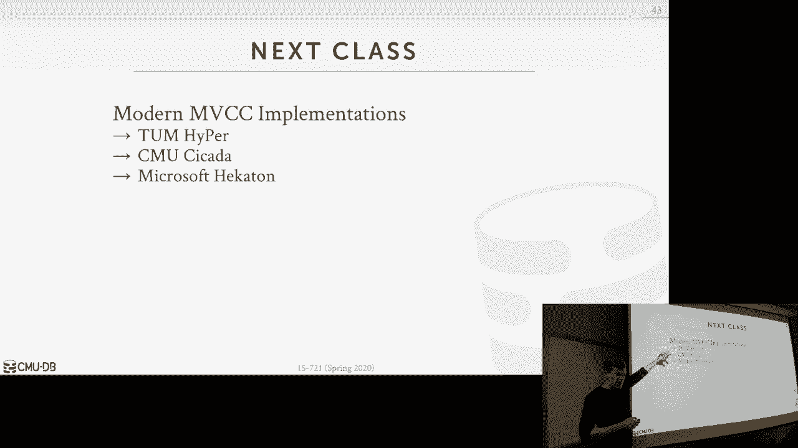

# 【双语字幕+资料下载】CMU 15-721 ｜ 数据库系统进阶(2020·完整版) - P3：L3- 多版本并发控制 1 [设计决策] - ShowMeAI - BV1wv411w7Ko

[Applause]，[Music]。

[Applause]，[Music]，right yes all right so today we're talk，about MVCC multi version control and so。

this is actually the first part of a，three part lecture or three part series。

where we're gonna go into really a much，greater detail than we did in the。

interruption class and actually talk，about how do you how do you implement，MVC on a modern system。

we're just against everyone's on the，same page at a high level what multi。

version control is is a not so much a，specific incur to a protocol but it's a。

way of designing a database system where，you're gonna maintain multiple physical。

versions of a single logical object in，the database and so by object I'm being。

vague here it could be anything it could，be a table it could be a block of tuple。

a single tuple it even could be a single，attribute within a tuple and practice。

most people just do it on a on a per，table basis but again the idea is that。

for a single logical object that we see，in from the applications perspective。

we're going to have multiple physical，versions underneath the covers so what's。

gonna happen is when a transaction，writes to an object or doesn't update to。

an object then the instead of overriding，the the original value of the existing。

values it's going to create a new，version and that new version is going to。

have the change that we just made again，the idea is that we have to keep track。

all right we'll fix that later what fix，that next time all right to the end the。

idea is that when we do an insert it's，obviously just the version doesn't exist。

we're just putting in the database when，we do a delete or an update we need to。

keep track of that we had previous，versions and we're creating a new。

version and then when we try to go read，that object again at the logical level。

underneath the covers the database，system has to figure out well what is。

the correct version that we need to read，and it's going to be the one that is。

that existed when it transactions，started so MVCC is not a new idea it。

goes back into the nineteenth late 1970s，it was first proposed in this。

dissertation at by this guy Reed at MIT，alright and this is sort of the first。

like description of how MVCC would work，the first real implementation as far as。

we know was in this system called inner，base at a deck inner base is actually。

still around today it sort of changed，hands couple of times it got bought by。

Borland with the ole compiler company，and now it's bought by some mobile phone。

company or so it's now that's been your，sort of rebranded as in global database。

but the when Borland had it they did，they did actually fork the source code。

and open sourced it as as Firebird I，said that that actually exists today I。

don't know I've never really come across，anybody using it but they're still。

maintaining it still working on it if，you ever wondered why Firefox is called。

Firefox because when Mozilla went under，and they took the netscape browser they。

were originally gonna call it Firebird，but that that you know that conflicted。

with this system so then they had to，rename it to Firefox right so which。

interesting that NBCC is that pretty，much almost every single database system。

that's been developed or released in the，last ten years including the the two。

we've been working on here at CMU，they've all been using MVCC right it's。

super common so it's kind of important，for us to figure out you know how we。

actually want to build resistant okay，let's we should keep it like a jar as。

possible yeah sorry I'll figure out how，we get a key to this all right so the，main idea of mzc。

the benefit we're gonna get that is that，the writers aren't going to block the。

readers and the readers aren't going to，block the writers so that means that。

when we go and update a tuple，writing transaction and writing thread。

is gonna update the tuple unlike in two，phase locking where you'd have to you。

know take an exclusive lock on the tuple，and block anybody from doing anything。

even from reading it under MVCC we don't，have that problem，we don't right we can how we can create。

a new version and other transactions can，can read the older versions without them。

without any conflicts now for write，write conflict well have a simple rule。

says the first writer always wins that's，the simplest way to do this right that's。

you know you obviously don't want that，or you can't have write write complex。

but this is gonna be allow us to do some，things that we couldn't normally do on a。

single version system like have a，long-running analytical query run in the。

background and we told versions while，newer transactions are updating updating。

database so for read-only transactions，what we're gonna get is a it's gonna。

also be able to read a consistent，snapshot the database everybody's gonna。

have a consistent snapshot and I'll，define what that is in the next slide。

but the big advantage of this is that if，we declare our transaction as being。

read-only at the very beginning then we，don't actually have to acquire any locks。

to read anything because we know we can，always read a consistent snapshot in。

some systems like my C code you don't，even acquire a transaction ID because。

that's a for them that's a centralized，bottleneck handing out those transaction。

IDs so you just skip that entirely and，so the way we're gonna use to determine。

what is visible to us is through，timestamps again we'll go over this more。

in more detail the rest of the class but，then we're also now gonna be able。

support MVC or to call it time travel，queries so again in the single version。

system what happens I update a tuple the，old version is gone right the old field。

values it's in the log in case I need to，undo it but when queries run they're not。

looking at the log they're looking at，the tuple but with MVC see if we don't。

do any garbage collection and keep all，the old versions around then some。

systems will lie to you time travel，queries to say you know run this query。

on the snapshot of the database that，existed at you know two years ago or。

three years ago so this a bunch of，systems claim they support this that's，not a new idea either。

like Postgres had this in the 1980s you，basically just don't do garbage。

collection and you do a little extra，work to allow queries to specify what。

snapshot they're looking at Postgres，again Postgres inferred you proposed，this it wasn't。

I actually started getting used outside，of academia in like the late nineteen。

ninety nineteen nineties that they，realized that this is the feature nobody。

wants and you run out of disk space for，it quickly and so this is one of the。

first things they did when they they，made Postgres be actually usable outside。

of Berkeley was you know get rid of this，support put a bud gets that bunch of。

newer systems claim they support time，travel queries today I have yet to see。

any any sort of real use case for this，alright alright so we need to find what。

what snapshot isolation or snapshots，mean so in the intro interruption class。

we talked about isolation levels we，actually never really talked about this。

because this is actually something，that's not exactly defined in the sequel。

standard but this is something you get，in some systems when you use MPC C so。

the way it's going to work is that when，a transaction starts it's gonna see a。

consistent snapshot of the database that，existed at the time when that。

transaction started so what that means，is that you only see versions of tuples。

that existed that were created by，transactions that committed before you。

started so if if my transaction starts，and there's another transaction that。

started before me but they haven't，committed yet and say they updated tend。

to pools or they updated five before I，started and five after I started I won't。

see any of their changes because that，because none of those versions actually。

got committed before my my first，transaction started all right so that's。

what I mean Mike assistant you're not，gonna see any torn right so many actual。

transactions you only see things that，you know have committed before you。

started so then also as I said before if，we have two transactions the running at。

the same time and they tried to update，from the same object then we'll just use。

a simple rule that says the first writer，wins right under like two phase locking。

when you do deadlock prevention or，deadlock detection right there's all。

these different rules to say who's older，than this when should I wait should I。

abort who holds the most locks maybe I，let them go before the other guy goes we。

don't do any of that so that's too，complex for us just to kind of run in in。

a marine environment we just say whoever，who wrote it first they win second guy。

tries to write the same object well we，needed up some tech that we're trying to。

write to the same object and if so then，we just kill ourselves and abort so you。

may be thinking alright well this seems，like you know awesome synaptic isolation。

gives us exactly what you want yeah，we able to achieve certainly a question。

yes right so this question is what I，mean by the first rider wins is it based。

on the time that they started or is it，based on the time that they wrote it's。

based on the time they wrote so you can，actually start before I do but if I。

write to this tuple and then you try to，write to the tuple like you have but you。

have to go board right didn't think of，it like it's the simplest thing you do。

because I as I'm as I look at the tube，were trying to write it I would see Oh。

someone got to me before got so before I，did you just go ahead and kill yourself。

I don't know whether you're gonna write，to the same thing so how would I abort。

before you wrote to it right that's，important question Rico question alright。

so snapshot isolation is not，serializable right II and I'll show you。

why because it's susceptible to what's，called the right skew anomaly but it's。

it's it's sort of it has different，anomalies then like repeatable reads and。

and read committed and what's also sort，of confusing about this is like if you。

take Oracle for example with Oracle if，you declare that you want your isolation。

level to be serializable which are，really getting underneath the covers is。

snapshot isolation but they don't tell，you that unless you read the。

documentation so it's sort of important，understand what the distinction is and。

you'll see why this is not going to be，serializable and the next class we'll。

see methods to go to actually add add，add additional things that davis isn't。

to make snapshot isolation sterilizable，yes questions are faint as possible does。

under this yes but in particularly it's，susceptible this right skew anomaly。

which repeatable reads doesn't have all，right so the easiest way to understand。

the right skew anomaly again so remember，from the interruption class we talked。

about dirty reads unrepeatable reads and，and the other conflicts you can have。

right skew is actually something that's，very specific to snaps snaps not。

isolation that you get in a multi，version system so the easiest way to。

understand this is to this simple，visualization that supposedly was was。

created by Jim Gray the guy that and，then two-phase locking so let's say I。

have a database of marbles and marbles，gonna have two colors it can either be。

black or white and so I have a，transaction two transactions that want。

to change all the white marbles the，black and all the black marbles to wipe。

so let's say these two transactions，start at the exact same time right and。

so again they will have under nbcc，they'll have snapped or under snapshot。

isolation they'll have a consistent，snapshot of the database that existed。

when they started right so they each of，them have two black marbles and two。

white marbles so the first guy here he's，going to switch all the white marbles to。

black and the bottom guy here wants to，switch all the black marbles of white so。

they go ahead and do that there's no，right right conflicts because they。

updated different things and then now，they commit but what happens now we have。

two white marbles in two black mambas，they'd essentially just got reversed is。

that sterilizable your shaking head note，why what you're just drinking your drink。

okay so he said if it was truly sir lies，bowl then it would have to be equivalent。

to a cereal ordering of the transactions，so that would either be they be all。

black or all white but in my example，here right we ended up with two white。

and two black so under sterilizable，your question your question is sorry。

you're saying that like I'm working on，the assumption that I only need to。

update but like these two here yeah well，II the query is update everything find。

everything that that's white trying，everything that's black and make it。

white find everything that's white make，a black right so when I looked at this。

when this guy ran it when he looks at a，snapshot he doesn't see you know he sees。

that these guys are white so nose knows，it doesn't need to update them but then。

when I when I commit them then I end up，essentially reading all of the tuples。

for turtle marbles yes and only writes，into the ones that are black or white。

yes effectively wins this issue be fixed，if they just blindly broke into every。

tuple and then under snapshot isolation，you get an equivalent to the。

serializable since david is saving is in，this case here we would read everything。

find the ones we do need to update and，that's our right set and then we then we。

write that out you're saying what if we，just blindly wrote everything so this。

guy was already white make it white this，guy was already black make it black and。

then try to review that as our right set，well in that case it would one of them。

on a billboard right it said so then，yeah so so yes it's a one would abort。

retry but then your then your then your，this yeah I think so，the issue here is my this is written in。

English change black marbles to white so，that could mean like I mean you can。

infer that find the black marbles and，make them white you could in theory also。

say I just make everything white because，that's what I want assuming I only have。

two colors doesn't matter what's white，now make it white you know white make。

sure that it's white no Davison would，actually do that because one there might。

be higher-level semantics about what，this query is trying to do like my case。

is super simple so like you can say oh，yeah of course if it's way to make it。

white that's fine but for in a real，database that's probably too difficult。

to do furthermore you're also keep，always in extremes if my database is a。

billion or marbles I don't want to have，to write out things they don't I need to。

write out because otherwise they might，just I'm better off just executing this。

as a one thread after another all right，all right the main takeaway is that。

again I want to point out here that，under snaps isolation this anomaly can。

occur right and the end result is from，from a higher level perspective what we。

how we understand what the data should，look like is wrong and that it's not。

equivalent to executing them in serial，no sterilizable means that again this。

was covered in interruption class，sterilizable means that you generate a。

the the final state of the database is，equivalent to any serial ordering of。

transactions all right so this case here，I had t1 go first of all by t2。

but I could reverse that t2 Google first，of all by t1 and both will consider。

correct yes questions this anomaly can，also occur in recommitted yes but not I。

don't think repeatable reads has this，issue yeah so it's this picture here。

right so under the like the like the in，like the textbook definition of。

isolation levels and the ANSI standard，least set I think still now like you。

sort of have this one path up to，serialize a read uncommitted committed。

repeat over read to sterilizable but，snapshot isolation is this other thing。

here with its right skew anomaly cannot，occur for this and then this is repeater。

reads are susceptible to I mean dirty，reads I forget yes，and therefore that can't happen in this。

you can't read you can have a dirty read，and snaps isolation because you only see。

things that committed when you know it，you only see that versions of tuples。

that were created by transactions that，committed before you start you can't。

have a dirty read but it's again the，main point of this I would just showing。

this is it like snaps an isolation is，you don't get it by default with MVCC。

right so like Postgres uses MCC but，default you get I think read committed。

I think same thing for my sequel but，like if you sort of follow the strict。

definition of how we're gonna do，currency toll and determine versions。

all right identify what versions are，visible to us when our transaction is。

run as far as I know you end up with，snaps of isolation and then our next。

class on on Monday we'll see a bunch of，extra stuff you can do in the database。

system to make this actually be，serializable sometime，alright so the paper had you guys read。

is a sort overview of the different，design decisions you have to make when。

you build a modern MVCC system and so，despite having the name cartridge hole。

you know that the words can hurt it's，all in the name of MVCC it's more than。

just concurrent control right the idea，of multi verging actually permeates。

through all we have throughout the，entire architecture of the system so。

it's not this matter saying I'm gonna，pick two phase locking and then and。

you're done there's all these other，things you have to be worried about and。

and the the implications of these design，decisions can can be quite significant。

based on what your application are based，on what your workload is that that。

you're trying to support so the paper I，had you guys read actually came out of。

this class so when I first first，teaching this class in 2016 we were like，you know I wanted to cover。

MVCC or modern MVCC and actually we were，building our own database system here。

that was gonna be multi version and a，bunch you know a bunch of questions came。

up with like how should we do virgin，storage hashmi new garbage collection。

and when you go read the literature and，go read the documentation for all these。

other systems that are doing MVCC they，just usually just say this is what we do。

they don't justify why they would do，certain things and all these different。

systems were doing something you know，slightly different so the idea of this。

paper was to go through and actually，understand all the different trade-offs。

for these different design stations and，then eventually then do a bake-off and。

then whatever turned out to be the best，one that's we wanted to put in our。

system peloton so the original name of，the paper that I had you guys read was。

actually this is the best paper ever on，in-memory multiverse kernel and so。

papers are sort of like your children，you're not just to pick your favorites。

this one is actually one of my favorite，ones I had a lot of fun writing it and I。

and I think the results are very，interesting so this we literally submit。

the paper with this title the reviews，were very positive but the very first。

thing they said was removed this the，best paper ever right now，they were quite adamant about that so。

I'm like alright well you know I，understand the point like it we we。

didn't want to be sort of flip or you，know subjective in in our in our paper。

you know I still think it's the best，don't know，so then we changed the title to if you。

only read one empirical valuation paper，on a memo diversion atoll make it this。

one exclamation point that one they，didn't like they came back again they。

said this is subjective this is your，opinion you have to make the title be。

more scientific or you know a more you，know more precise and so the third name。

the paper was we think you're really，enjoying this and it's true because it's。

true I did I did think they would enjoy，it that's that's a factual statement so。

at this point the paper got accepted but，they were starting to get pissed off and。

they were like if you don't change the，title we're gonna flat out reject it and。

so I didn't have tenure I still don't，but like I didn't have tenure the。

students needed the paper to graduate，and and you know get jobs so we。

capitulated and so that's why that the，title the paper is is what you guys read。

it was why we had to make it real dry，and boring I'm I feel like I could have。

fought bit more and gotten this one but，I was I caved and it is what it is okay。

all right forget the four design stages，we're gonna discuss are concurrent。

retold version storage garbage，collection and index management so let's。

go to each of these one by one so for a，concurrency troll protocol there's in。

it's all the same methods you guys I，read about last class or we talked about。

in the last lecture right there there is，not anything special that you do。

differently because you're using a multi，version system right but these are just。

adaptations on how you do use those，classic protocols to make them work in a。

multi version system and in particular，we're gonna discuss is how do you。

actually want to do this in a in memory，database system right again remember the。

for the Discordian system we would，separate the locks and the locking。

information from the actual tuples，themselves the extra stores because we。

wanted to keep the lock information in，memory so that if the two boots get。

swapped out the disk right we can still，know who holds locks on what but now。

everything is in memory so we don't want，separate data structure so we're gonna。

try to be clever and actually store in，the tuples all the information we need。

about what's going on in Akko new，protocol in addition to all in。

we need to know about the versioning of，our tuples so we want to store anything。

separate so time skateboarding OCC and，and 2pl so we're going to discuss the，first and the last one。

OCC as I said is just a variant of time，stamp ordering where you just put。

everything in in all your rights end up，going into this private workspace that's。

not immediately visible，whereas in time stamp ordering it will。

be immediately visible but we use some，extra metadata to keep to make sure that。

people don't read things they shouldn't，be reading okay they also think to the。

but I apologize about the paper from，last class we wrote that before we wrote。

this one and in that paper about the，thousand cores we described MVCC as sort。

of being a single commercial protocol，that was using time stamp boarding。

because that's what it was defined in，the the original MIT dissertation but in。

actuality again under MVCC you can use，all these different approaches so time。

stamp ordering the mvto is what we used，in the thousand core paper but you can。

still use GPL all right so the first，thing we need to scoffs is water。

reaction how we're actually going to，maintain information about what we're。

storing in our and our tuples so the，every tuple is gonna have a header where。

you store again additional metadata for，simplicity assume it's a it's a row。

store but if it's a column store you，just have a separate column with this。

metadata so the way that is there's some，offset into the fixed length data pool。

and the first couple number of bytes，will be this metadata so the first thing。

we're gonna do is gonna have a unique，transaction and identifier right this is。

just what is that what is the ID of the，transaction that either created this。

version or is currently operating on a，host the lock on it then we'll have to。

begin and time stamps and these can be，used to determine the lifetime of the。

visibility of this particular version，and these timestamps could be logical。

counters like a single counter or they，could be a really high precision like。

hardware clock like in nanoseconds，typically people use people people use a。

counter because it needs to sort of be，followed the same under same domain as。

transaction IDs then we're also now，next，or previous version in the version chain。

for our tuples right so again when we do，a lookup to find a tuple like say。

through an index we're gonna land at the，head of this version chain versions of。

linked lists that we can then traverse，to either go back or forward in time to。

find the right version of the tuple，that's visible to us so we need to。

maintain a 64-bit pointer in our header，to say here you know here's the next。

tube or heard the previous two ball and，it was the next thing she look at in the。

Virgin chain and then some other，constraint protocols might have some。

additional metadata here followed by，like the actual tuple tuple datum so the。

first thing I'd point out is that these，are all going to be 64-bit integers。

right so eight bytes so in this example，here right if you just ignore the，additional metadata。

I have 460 64-bit 64-bit values or，energies I'm storing here so I four。

eight byte dice so that's 32 bytes I'm，storing for every single tuple it。

doesn't seem like a lot but if I have a，lot of tuples this can start to add up。

if I have a billion tuples then this，these four fields are gonna store。

underneath 32 gigabytes before there's，one day to post that's a lot but it's。

unavoidable right because it's just this，trade-off between compute and storage。

it's sort of classic and computer，science already hit a lot this semester。

so I could be a bit smarter and maybe，store these beginning and timestamps on。

a block level right so I have a batch of，tuples can have begin end timestamps but，lookups。

I'm spending more CPU power to go find，the actual version and I'm looking for。

so for for this reason pretty much，everyone always stores this for every。

single tuple and that that's good enough，because it gives you that the the fine。

granularity you need to you know achieve，high concurrency or high parallelism。

alright sorry mmm that was weird oh all，we'll cut this out sorry this is gonna。

sorry alright yup you have great paper，two bowls，okay Tyson for him alright so the first。

thing we're point out it said we're，gonna store this in our table the first。

thing to point out is that I have this，sort of column here of like the version。

IDs this is just for illustration，illustration purposes we're not actually。

going to store this in our real system，right because we use the begin and end。

time stamp to figure out what the actual，version this is just for us to。

understand this visually so the no there，we go alright yeah there's that。

right so the transaction ID again it's，gonna be a 64-bit integer and we're to。

use that to keep track of，does anybody hold the lock on this tuple。

right so at the very beginning it's，going to be 0 then we have our beginning。

and time stamps so this again this is，going to termina bility of our of each。

version so in this case here there were，some transaction that created this。

version at time stamp 1 and because this，is the the this is the latest version of。

our tuple we set the end time stamp to，infinity right because it's visible to。

anybody that comes after time stamp 1，all right and then for FP 2 oh we need。

to also include the read time stamp，right and this is me a time stamp is。

gonna keep track of the last transaction，that read this version and because we。

have to use this to figure out if we try，to write a new version for this tuple if。

the re time stamp is greater than our，time stamp that we our write time stamp。

then we know that somebody in the future，read is to boil and what have missed our。

newer version so therefore we have to，abort so this is this is a good example。

of another overarching theme if we have，throughout the entire semester is that。

we want to minimize the amount of global，data structures we have to coordinate。

between our different transactions so by，recording the V time stamp with in the。

tuple itself I don't have to do a lookup，at some you know what would that。

occurred and say you know what，transaction capacity I've read this。

tuple I look at the tuple and I merely，know exactly the you know what happened。

alright so now we have a transaction，comes along and say it's out its given。

time stamp 10 and let's do a read on a a，followed by a right on beam。

so the reeds pretty easy right you go，check to see whether the the the。

transaction ID is zero meaning you know，nobody is actually writing to this。

transaction or to this tuple and then，you check to see whether the visibility。

is is within the range that of your your，time stamp so our time stamp is 10 10 is。

between 1 and affinity so we know that，this version is invisible to us so then。

all we need to do now is a compare and，swap on the re time stamp to update it。

with our time stamp right andthe compare，and swap fails who cares because that。

just means that somebody you know either，in the after that somebody in the future。

or in the past I've also read this so we，just check it again and and try to。

update it right if it's less than，awesome so it's ok if this we try to。

read it and say someone comes along with，time stamp 11 and we do compare-and-swap。

and it fails and we come back and time，stamp 10 is less than 11 that's fine we。

don't have to update it like who cares，of another thread read this read the。

same thing we read all right so now，we're gonna do the right so for the。

right we're gonna do it right on B so，again the first thing we need to do is。

do a compare and swap in the transaction，ID so that we can take the lock on it so。

that we can prevent anybody from chronic，create the new version while we are so。

we do a compare and swap set it to our，time stamp，now that simplicity means that we hold。

the lock on this tuple and then we can，go ahead and create a new version and。

implicitly this also means we hold a，lock on it as well because assume。

there's a pointer from this to this and，no one can get to B 2 without going。

through b1 but I hold the lock on b1 so，no one can follow along so I can do。

whatever update I need here and then now，I just flip this end time stamp to be 10。

and that sets the visibility of this，transaction right and when I'm done I。

really do a compare and swap well this，doesn't need me a compare and swap but。

this one does I should not need to do，you just set it to 0 and you're done and。

now this new version is installed if，anybody comes along with the time stamp。

say greater than 10 they would be able，to feet you know see this version is。

with what ARB okay yes now so the read，time stamp is always going forward in。

time so that's time since you're back，here the reach time stamp is one say I。

do a compare and swap right compare swap，says you have to read the value first。

then you do compare and swap and say I，think the value should be one if it's，one set it to ten。

so if I do that and it fails because，fifteen came along then I would loop。

back around see that now the value is，fifteen right then that's 15 is greater。

than ten so I don't try to update it if，it was eight ten is greater than eight。

so yes the new value of the entire row，back in I guess I'm just kind of。

confused it's like toilet you actually，go through this link imagine a case。

where like if you're like reading，through these memory locations and then。

somehow some other thread comes along，and like jumps around you in exactly the。

right order so you read the right thing，okay so these question is how am I。

actually doing this atomically right and，it really starts off with this。

transaction ID so if I do compare and，swap on this I said to my transaction ID。

then nobody else can come along and do，the right the same time I do right I。

hold the lock and the whole thing so I，don't this is 64-bit so I just you。

compare and swap on 64 bits the I think，what you were proposing is sort of。

taking a lock on the entire piece of，memory for this tuple and for that one。

you would happen and that's essentially，what this is doing right you can't do a。

compare and swap more than 128 bits on，Intel so this is thing is way larger。

that so you can't do a Tomic stuff at，that granularity so by setting this now。

this will prevent anybody else when，writing a new version you know before。

I'm done so now you say well what if，some comes along，and tried to read this well the first。

thing the reader would do is see that，this thing is not zero and back away。

because it's it's this thing is under no，it's being written to now and I don't。

know what the end time stands gonna be，yet so I don't know whether I should be。

reading this version or the next version，he's about to create so now you say all。

right well what if the reader comes，along see zero right and then starts。

doing the read then this thing does ten，and while the other guys still reading。

what happens well who cares right，going away，that reader who got him before I I did。

they can still read this right and we're，fine because this is not gonna corrupt。

that data or do anything weird，it could it'll miss potentially this new。

version but then meets my next question，how do we actually know this how I'm。

actually keeping track of this thing，actually committed right because all I。

should was that when I update the，virgin's I flipped the transaction ID to。

zero that means I released the lock but，now how do I know whether I should if。

this transaction is actually going to，commit and therefore I should actually。

read this version right so what's，missing here is an auxilary data。

structure that basically has to keep，track of the status of transactions so。

that when I go do a read and I say I，read in this case here I would well you。

keep track of it I read this version，here you need a way to know later on oh。

the transaction that created that，version did they actually commit right。

because you the begin timestamp was the，same transaction ID that I set up here。

so I'd know that transaction at，timestamp 10 creating this version when。

I go to commit I need to know whether，they committed as well because if they。

don't they haven't committed and I read，something I shouldn't have read I need。

abort so what's missing here and what，we'll see in hackathon on Monday next。

week for Microsoft in their version of，MVCC is that there's a separate data。

structure that you have on the side，think of a giant hash table we just keep。

track of what are they all what are the，different transactions that are running。

this question is if I did this if I just，left this as ten then wouldn't that。

somebody like so but for that basically，holding the lock on this version forever。

until I commit by releasing it now，anybody come along and read stuff。

because you're assuming transactions，aren't going to conflict or are not。

going to abort and therefore you won't，you want to use speculative reads yes so。

this question is why not embed another，commit ID so that's what Microsoft's。

gonna do it's two ways to do that so one，you just have another commit IDE but。

that's another 64-bit field and now，you're adding a way more space what。

Microsoft is gonna do we'll see you next，class is that they'll piggyback off of。

the I think I think the end times damn，though actually use one bit in the。

timestamp to say this transaction，actually has committed or not and that's。

how they that's how they avoid you，should have to go back and update things。

but that avoids having a separate column，all right so I wanna jump ahead to two。

phase locking there's still a lot to，cover so with MP 2 PL we get rid of。

three timestamp but now we're gonna add，this recount and the recount essentially。

is gonna act as a the shared lock on on，the tuple right so my transaction comes。

along and it wants to read a I'll do a，compare and swap on these two fields at。

the same time alright so these are both，gonna be 64-bit fields x86 allows you to。

do 128-bit compare and swap so I'll，check to see that transaction ID is 0。

and then I'll and I'll also atomically，update this to be 1 so the way you do。

that is you set this also to be 0 and，then you increment this by 1 as the。

result right so if I do that then that，means I have a shared lock on on this on。

this tuple right and I can read it along，with other reader other readers running。

at the same time but now when I do the，right same thing I'll do an atomic 120。

bit compare and swap to，set the transaction ID and the recount。

to one I actually don't think you need，to set the recount but you definitely。

ought to set the transaction ID so now I，have the exclusive lock on this tuple I。

can go ahead and create a new version I，update the end timestamp with my，timestamp and then a new。

compare-and-swap to revert it back to，zero and that unlocks it yes I think the。

starting what are you saying sorry no no，no no today's lock acquire locks as。

needed you acquire them in the growing，phase but it doesn't necessarily mean。

you're gonna acquire them exactly when，the transaction starts how the last。

writer win the first writer wins it's，always first writer wins yeah。

how would it win this guy got to this he，wrote to it anybody else that would come。

along in this case here like so if，another transaction comes along and say。

they have time-stamped five well they，would see that the this versions。

visibility is one to ten five is in，between one to ten so that it knows that。

there's some other some other version，that came after timestamp ten that。

physically got wrote before I did，although logically logically it's in the。

future but in actuality it's in the past，in physical time so I might intersect。

with this this range therefore there's，another writer before it got here before。

I did and I have to abort first writer，okay so in the paper ahead you guys read。

then when we wrote it originally the，transaction ID in the recount we're。

actually set to be 32-bit integers right，because at the time when we wrote it。

I don't list x86 we were looking at，didn't support 128-bit compare-and-swap。

so we put these two together right if，you think about it there's probably not。

going to be two to the 32 minus one，threads reading the same to board the。

exact same time so setting this to be 32，bits is is kind of an overkill but we。

still would want this thing to be you，know a large as possible so we have to。

make this thing be you know at least 32，bits maybe 48 but even then although。

it's a large number on if your system is，running for a long time you can burn，quickly。

all right and what's gonna happen if you，if if you get to the end of transaction。

IDs you wrap around right and then you，start to have problems all right so。

let's say that we have a simple table，with one tuple and we have this this。

this one version here so we have some，transaction ID that's gonna get。

transactions of insurance actually be，two - 31 - 1 so it does it right on a。

break and do all you know set the，transaction ID do all the lock stuff。

that we just talked about and then it，creates a new version here right and。

that sets the the the range now to be，232 to the 31 minus 1 except it's the 0。

but now another transaction comes along，and now it has time stamp 1 because it。

wrapped around and now I create a new，version but now the the ranges that are。

all messed up because this is between 1，and infinity and physically that's in。

the future but based on these timestamps，it's illogically in the past so now。

someone could come along try to find the，wants to look for this version and it。

could end up you know going nowhere，right because this thing is in a，disjoint range right so this is。

problematic and so if you have a 32-bit，integer for your transaction ID which。

Postgres does you can wrap you get，through this pretty quickly even if it's。

a 64-bit integer at some point you'll，run out and you need to wrap around and。

handle that so there's a couple，different ways to do，I like describing what Postgres does。

because it's so simple and easy to，understand and some way that makes it。

sort of elegant so what they're gonna do，is that they're gonna add a additional。

bit in the header of every single tubule，right usually four tuple headers they。

always Pat it out as symmetric bit space，so like if in the future if you decide。

oh we need to keep track of some，additional information about each tuple。

we just add an extra bit in there we，have space for it so they're gonna add。

extra bit that says that a particular，version or Pickler tuple is instead of。

frozen and any any version that's，considered frozen means that it's always。

gonna be deemed as in the past no matter，what transaction ID you have timestamp。

you compare it with so even in this this，case here even though this one could。

have a timestamp that's greater your two，- 31 - 1 is greater than 1 if I set the。

frozen bit then then this will always be，deemed older than this so the way they。

do this is that they if they the system，recognizes that you're gonna about the。

wrap-around they'll run the vacuum their，garbage collector scan through and find。

old versions and set this bit flag so，there's a lot of there's not a lot of。

there's a couple posts on the internet，you go look around for like Postgres。

trent transaction rep transaction ID，wrap around problem there's a bunch of。

cases where people will actually turn，off the garbage collector on Postgres。

during the day because it adds some，overhead so you trying to get the system。

running as fast fast as possible during，the day because that's when you have。

most your customers using your website，and then all sudden you start hitting。

this wrap around problem and the system，freaks out because it has to stop。

holding you know accepting new，connections inspecting new transactions。

because it doesn't it has to wrap around，but the vacuum you can't run because。

you've turned it off and then you，basically have to run the vacuum。

manually and that that can do a you know，full compaction or full vacuum pass and。

that can take hours and hours or even，days right so the post goes way it is。

pretty pretty simple like the vac and，you'll do what you wanted to do and。

unless you turn it off so this clear，okay，so when you read the academic literature。

about concurrency show，or transactional database systems the，emphasis really is always on these。

concurrent protocols right it is two，phase locking better than OCC II or。

timestamp ordering but what we actually，found out in his paper was that it's。

actually the other things that actually，matter a lot more in in particular what。

mattered a lot was the the Virgen stores，mechanism or the architecture the。

virtual storage component of the system，so again as he said that we have for。

every single physical version we're，going to search every single logical。

object will have multiple physical，versions so there's different ways we're。

also actually store these versions but，at a high level they're gonna be。

organized as a latch free link less，single direction and the head of the。

link link list is always going to be，what the indexes point to or sort of。

what if I'm doing a look-up on a tuple，I'm always gonna land at the head and。

then that can you traverse along the，version chain to try and try to find the。

right the right version that's visible，to me so the again the index always。

point to the head but the head could，either be the oldest to the newest。

depending on what what what approach are，using so the the different schemes will。

talk about here will determine where，we're gonna actually store and what Rex。

you're going to store for each version，that we create all right sometimes will。

store Delta sometimes we'll store the，actual entire tuple so the three。

approaches are append only time travel，storage and deathless storage and the。

spoiler would be that that the Delta，storage is the best way to go but。

there's still a lot of systems like，Postgres in particular that do append。

only so what's gonna happen here because，we're in an in-memory system again we。

want to avoid having global data，structures so we want to avoid having to。

allocate space for new versions in some，you know in a global space of global。

memory chunk so instead what we'll do is，as threads create new versions they'll。

create the versions inside of like，thread local storage or memory that's。

allocated for just that thread you know，that means the Virgin chain could。

traverse the storage across multiple，threads but that's okay right because。

everything is always always just in，memory so the other thing we also need。

to think about too as we describe these，different approaches is you know not。

just how fast they are but also how much，storage space they're gonna require to，store these versions。

and what's the engineering effort to，actually implement it because some are。

obviously easier than others and we need，to think about it's in both in terms of。

what is the overhead of finding the，right version that we need for our query。

but also the overhead of actually，cleaning up older versions over time as。

they accumulate like in the garbage，collector all right so go to each is one。

by one so append-only storage the idea，is that we have a single table like a。

single physical space where we're，storing ro tuples and any time a。

transaction updates a tuple what does，create a new physical tuple in the in。

that same tablespace right so say our，transactions can update a 1 right we。

just make a copy of a1 append into some，new space or a free slot in the table。

and then we just update now the pointer，to our version chain to say you know。

here's the new version right so it's，pretty simple to do and this is what how。

Postgres originally designed it in the，the 1980s think interbase did the same，thing。

the downside obviously is that you know，I'm making a lot of copies right。

you know I'm copying the entire tuple，even though it may only update a single。

field so another important thing that，was a point out too is the order in。

which were traversing the virgin chain，for our tuples so in this example here。

I'm going going oldest to newest so I，started off like this I have a 0 a 1 and。

then a 0 was the head of the chain and，it pointed at a 1 and then when I。

created a 2 a 1 now pointed at that but，I would still have my indexes still。

point a 0 so they want to find a 2 I，have to jump to a 0 check that there's。

begin n time stands to see whether it's，visible to me if not then I jump to a 1。

do the same thing and they jump to a 2，so that may not be the best approach。

depending on your application right so，again that was oldest to newest you。

always have traversed the the chain to，find the newest version you could also。

go newest to oldest where the head of，the version chain is always the latest。

version that just got created so you，know you don't need to update any。

previous versions you just add your new，version and then have its pointer point。

to the old version the head of the，version chain，what's one obvious problem with that so。

it's faster doing lookups obviously，right because you it's it's you want the。

newest version I'll and the head of her，G chain and I'm done yes no yes I'll。

bear the indexes correct yes so again，we'll talk if you more slides but like。

all the indexes are pointing to the head，of virgin Jane if for every single。

update the head of version change，changes because its newest to oldest。

then I have to update all the indexes，now to point to the new virgin Jane。

right and actually that's what purpose，does and compared to my Siegel that's。

problematic so again I'm not saying one，is better than another in most cases。

newest to oldest poly is the better way，to go because most of the times most。

transactions most queries want the，newest version if you care about doing。

depending on how you do garbage，collection or depending how you do like。

look if you have queries that look at，old data this actually made me maybe。

better yes so that so it's a way to，avoid this overhead having to update。

every single index every single time by，lately doing no because that could give。

you false negatives and then the other，picture is what if you have an。

indirection layer we'll see in a second，that will avoid that problem but you。

have to maintain that that's additional，you know again additional storage。

overhead it to have that indirection，okay again so again the in practice I。

think this is the better way to go if，you're doing a pen only but this does。

have have some benefits that you don't，have to update the indexes all right so。

the other that the next approach is to，do time travel storage and the idea here。

is that as we create new versions，instead of appending the new versions。

into our main tablespace we will have，this other table that looks exactly the。

same as the first one but it has the，same scheme on the same allocation of，columns。

and rows but that's we're going to put，put virgins as we create them so in this。

case here we're doing newest to oldest，so a2 is in the main table space and it。

has a pointer to a one in the in time，travel space so now if I'm going to。

update this guy I first gonna copy it，into the time travel space have the。

pointer point back to a1 and now to，overwrite the master version with the。

new version that I wanted to create I am，and again first writer wins I don't。

worry about two transactions trying to，update this master version the same time。

I do the right here and then anybody，tries to update the same thing will have。

to get aborted because they'll conflict，with me alright so then now if I rights。

and then update the version pointer to，now point to a2 so this is actually。

which what Hana does and this is，actually what sequel server does well so。

we'll see sequel server how they do，login with NPC see in a few weeks and I。

think they do it this way because it's a，byproduct of the system was not。

originally designed to be multi，versioned and so by adding this it。

requires the least amount of changes in，the overall architecture the other。

engine thing you can do to also is that，you could have the tank that the the。

main table actually be a different use a，different storage model than the time。

travel table right because you're doing，a lot of updates into this you could。

have this be like a roast or or a delta，store roast or and then the time travel。

tape because these are like older，versions you can maybe over time convert。

them to a column store and that way if，you need to read old data right you can。

you can access it through a columnar，layout which is faster all right and。

again so the last one is gonna be what I，think it's the better approach is to do。

Delta storage and the idea here is that，instead of having to copy the original。

version every single time and then make，our change to it we only need to record。

what was the change we made and，destroyed that information right so if，it。

I'll just have a Delta record in some，some space in memory that says here's。

the change that I made so here's here's，the old value for，for this for this table and update that。

and now the pointer points to that sit，again for this Delta information I'm。

gonna maintain the same begin and，time-stamped just as I would before and。

a regular tuple but the only thing I'm，starting is this Delta information think。

of like a DIF and you get that so now if，I want to do a lookup and say find an。

older version I just follow that the，Virgin chain and replay all the log。

entries or the Delta records to put me，back into the state that I should have。

been for that version so again if I have，a thousand say or sailor got a thousand。

columns in my table and I only update，one of them then instead of having a。

copy all thousand columns every single，time I can just store the the one。

attributed one column that got changed，so this is what Oracle does is what my。

Siegel does I think this this is and is，what we now do in our system this this。

is the better approach right these again，computationally it's more expensive。

because I got to essentially replay the，the log or the deltas to put me back in。

the correct state I should be for my，tuple when I want to do a lookup most of。

the time though you only need to read，the latest version and that's just you。

know all the data is just there you're，done but you ended up also storing less。

space which also can improve your cash，cash locality or have less pressure on。

the cache keep much data in memory as，possible so there's a big benefit to。

that yes the question is what if a lot，of my transaction are doing scans and。

some of them are updating why would it，be very slow so again like so in a real。

database system most of the time the the，you're not updating every single tuple。

so say I'm doing special scan across the，entire table most of the time I'm just。

gonna rip through the main tablespace，and I don't have to follow the Virgin。

chain in the event I have to follow the，Virgin yes on the pay a little you know。

computational penalty to now follow this，pointer and replay the deltas to put me。

back to the correct state most the time，I don't do that，right I would say also two of the I。

think depending on any architect the，system but like you went to do an update。

anyway you're already started generating，this Delta and actually this is what。

you're gonna log out the disk anyway so，you might as well just just record that。

you know in memory as a Delta record so，you not to do any extra work to make the。

copy when you you know when you create a，version so there's this trade-off。

absolutely right that like resources，right which ones you want a favor I。

think the science turns out that that，this approach actually it'll make the。

rice go faster and the pen or you're，paying for reads is not is not。

significant then it's not worth it to，get the right benefit plus you have less。

storage space garbage collection is also，easier in this world too because I only。

need to go through this thing clean this，up I never touched the main table。

because that's always the latest version，yes so it makes a good point。

so if say I have a thousand tuples and I，have a bunch of Delta's that each update。

a separ attribute do I need to go back，in time super far to find the correct。

version so way you handle that is，garbage collection you try to you trick。

down the or compact even the the Delta，the Virgin Jane as quickly as possible。

question is if you're training multiple，adroit skeet sure that it's one Delta。

yes so I'm there's only one actually we，would value but yes for every single。

attribute I modify it will be within one，one does a record yes so so this could。

be uncommitted right and this also could，be written in the future that's not that。

I haven't but I shouldn't see cuz it's，not my snapshot so therefore I have to。

go back a time if I'm what is actually，visible to me all right cool。

so um so one additional problem though，if you're doing a pen only and this is。

why I think the Delta story is better is，that if now you have if you have string。

values that are stored in the verbal ink，data pool every single time I create a。

new version I I have to make a copy of，this tuple or that sort of the the very。

length data so that my next my next，version can have its own pointer because。

if I start if I start doing garbage，collection and I clean up a one cuz a。

tuna is now the latest version if this，thing is pointing to this and I go clean。

that up then now my pointer points to，nothing and that's bad right so that。

sucks right so that means for every，single time even if I don't update this。

I don't take this string at all I'm，still making a copy of all the string。

values so one way to handle this，obviously is just add a reference。

counter in the verbal link data so that，when I know that how many pointers how。

many versions actually pointing to this，so if I go clean up this this the first。

version and I decrement the counter and，still greater than zero that I know that。

someone out there is pointing to this，this string my very unlike data pool and。

I shouldn't go ahead and clean it up the，downside though is and this is actually。

what we tried in in our old peloton，system the downside is that because now。

I keep track of the if I had multiple，versions pointing to this。

I actually don't know where they are so，if I ever need to move this this piece。

of data around in memory like I started，compacting my my favor length data pool。

then I have to do a sequential scan and，try to find the one version of the tuple。

or the book version of the two are，actually pointing to this so this。

actually turns out to be a bad idea it's，something we abandoned pretty quickly。

this is a synergy sort of what，dictionary compression does as well。

because instead of storing the pointer，to something in the very like data pool。

I would have a dictionary code that I，could then do another look up and find。

find what the actual value was but at，least in that case you know if you're。

compressing the data then it's it's it's，usually cold data and therefore you're，very often。

yes No so again member last class I，talked about how there's the fixed。

length data pool and the verbally dated，pools so all our tuples。

alright I'm gonna try to reside in the，fix link okay I have to reside the fixed。

length data pools that's like the，location of them but because we want all。

the size of every single tuple to be，fixed length anything it could be。

variable length has to be stored in a，separate data pool so inside my my fixed。

length data instead actually storing the，string I store a pointer to the string。

right and that's another piece of memory，that's managed separately and the point。

I'm trying to make here is that one on，one hand we could just duplicate the。

string over and over again every sperm，is single note version because each of。

these guys need to have a unique pointer，but that's obviously gonna be wasteful。

because if I don't update the string，that I'm copying for no reason and if my。

string is huge then that's gonna get，expensive very quickly so you could try。

to share pointers by adding a reference，counter into that to the reference to。

the fare blank data pool for every，single thing you're storing but now the。

problem is if I ever try to move this，data around I don't know what else is。

pointing to it and I could have you know，say especially couldn't use a logic。

warrant that's what dictionary，compression essentially does we'll cover。

that in like a few weeks it's hard for，me to balance like like when you guys，come in the future。

so the dictionary confession you solve，this okay probably need to get two。

carbons motion so the idea of carbon，suction again it's just like GCE under。

under for the JVM we need to find，physical versions that are reclaimed。

bold and physical version is one where，we know there's no active transactions。

running that can see that version right，because it's in the past and and all new。

time stain all new transactions have a，time Sam in the future and they can't。

get to it or the version was created by，transaction that later got aborted and。

we know and no one's gonna read it we，gotta go ahead and clean it up so the。

much different design stages we need be，mindful of how to find the expired。

versions what to do how to determine，whether it's safe to reclaim a piece of。

memory and where to actually look for，them so we're gonna focus on this how。

how to look for them we'll cover this a，little bit but we'll do next Wednesday。

Wednesday next Wednesday next week we'll，spend the entire lecture discussing on。

how we actually do garbage collection in，MVCC and go to more details about this。

right so the two ways to do this is at，the tuple level or the transaction level。

so the tuple level the idea is that，there's not going to be any central。

location that says here's all the，versions of the tuples that we can go。

clean up the idea is instead we're gonna，have threads run and do scans and when。

they come across data or come across，versions that are we claimed a little。

they go ahead and we clean them up we，can either do this with separate threads。

or cooperative threads as a running，queries and then transaction level the。

idea is that each transaction is gonna，keep track of every single version that。

they that they invalidate and therefore，could be reclaimed and then when they go。

to commit they hand off is this set of，pointers to this garbage bucket says hey。

by the way here are some things I，invalidated you should go ahead and。

clean them up and that's a voice having，to do that the sequential scan so let's。

go through tuple level first，so with back I'm vacuuming again the。

idea is that there's separate threads，that are gonna run that are going to do。

special scans and try to find old，versions so when the vacuum starts。

we have to look and say well what are，the actual transactions what are their。

time stamps and then now when we scan，we're gonna we're going to compare the。

beginning and time stance for all the，versions that we see and see whether。

that the range is specified them do not，intersect with any active transaction so。

in this case here we have transactions，with time stamp 12 times at 25 so we。

know that for the range 1 to 9 these two，transactions can't see that so therefore。

no one can see this and therefore it's，safe for us to go ahead and reclaim this。

memory right so this can be expensive to，do likes winchell scans across the。

entire system especially if you want，this thing to run all the time so a。

simple trick is just to keep track of a，bitmap that says here's all the blocks。

that got modified logically since the，last time I ran so therefore when I just。

need to scan through that and I can skip，anything that wasn't modified so I mean。

by logically is that depending on what，I'm doing oldest newest renews to oldest。

I may update say I have two versions in，two separate blocks and it's almost the。

newest and I add a new version that's in，the second block but now I could reclaim。

that old version that's in the first，block so I need to know logically that。

back going back in the version change，here's the block that has the thing I。

should examine all right whereas newest，to oldest you would know I add my new。

version I know but I need to point to as，the previous head so I know where that。

thing is located and I can update that，bit easily so cooperative cleaning the。

idea is that we're not gonna have any，separate threads potentially if we're。

back on the beckoning it's just now as，our transactions or query start running。

if they come across all versions we go，ahead and clean them up alright so say。

this guy runs he's gonna do a lookup and，the index to find key a and we're gonna。

get to the head of the virgin chain so，then now as I'm scanning along to find。

the right version that I want I check，the time stamp which I'm doing anyway to。

see whether it's visible to me but I，also know what is the sort of the。

high-water mark for the or the low-water，mark for the oldest time stamp of any。

active transaction and if I know，that thing is not visible this tuple is。

not visible to that oldest transaction I，can go ahead and Garba collect it right。

there and I keep scanning along and can，print out anything and I also then have。

to update the index now point to the my，new version chain so the benefit of this。

approach is that you don't have to，maintain these separate background。

threads but now your queries could，potentially run slower because they may。

come across a long version chain and you，had to clean things up before you can。

actually finish running your action your，query what's another problem with the。

cooperative cleaning yes correct，well one it says that there only were。

stores near us but even then there could，be another problem，bingo yes so let's say I create a new。

version and then no one ever goes back，and reads that logical tuple again but。

now I had that over and sitting around，that no one's ever gonna get so。

Microsoft calls these dusty corners and，basically the way to handle that is you。

peer out if he also had stuff to run the，background thread just go find things。

yes overstatement is is there a notion，of cleanliness in our system it could。

quantify that so the example I was，saying before like the the garbage。

suction takes time right so Microsoft，roughly estimates in their paper that。

garbage suction adds but a fifteen，fifteen percent overhead if during the。

day I want Mitra's actually run fast as，possible I could maybe potentially。

disable garbage collection the system，becomes more dirty and then when I want。

you know maybe in the day then I run the，garbage cutting and burning more cycles。

but I have spare ones that you know I，can use to clean things up it's usually。

the storage overhead people care about，the you run out of space pretty quickly。

if you have a lot of virgin in your，turning through them I always say that。

like the the the notion of cleanliness，would be something better to have to be。

human to find like I usually use fewer，threads from garbage question because I。

want queries run faster but then there's，sort of a push back，to say while I'm running out of space。

especially if I ran memory so I want to，be more aggressive and cleaning things。

up so with the overhead like that 15，percent is that like what about yeah。

because think about it like my careers，are running slower now because this guy。

could have just said well I don't care，that these versions aren't or reclaim a。

little let me just go get what I want，but it's implemented such that you clean。

things up as you find them okay the the，other one is transaction level again。

we'll discuss this more on on Wednesday，next week again the idea is that my。

transaction runs I'm creating the，versions because I think the tuples so I。

know what was the old version before and，so I just record to say hey by the way。

here's this transaction or here's this，this version here's the beginning end。

timestamp which I know because I had to，read it I if I commit go ahead and。

reclaim this and then we put this in a，queue and then the garbage collector。

will go at some kickoff and some some，background threads to clean this up over。

time so for this one the garbage dungeon，is no longer on the critical path of。

queries like it is in cooperative，cleaning so that means that our queries。

gonna run faster it could end up，creating order verges more quickly than。

before so we actually may need to use，multiple threads and make sure we clean。

things up and in timely fashion so in，our current system today we do this but。

we only can do a single thread garbage，collection and in some of the。

experiments that man has done we can，burn through transactions pretty quickly。

and we started running out of space and，the single thread actually can't keep up。

so we'll discuss more about this next，week all right the last one is super。

important is index management and we，sorted our talk to us a little bit but。

basically how do we find the right，version and this depends on what the。

version scheme is and how much work we，have to do to baby replay deltas or what。

the ordering of the version chain is so，the primary key index is always going to。

point to the head of the virgin chain，doesn't matter whether it's oldest to。

newest or newest oldest or time travel，or Delta storage it's always the head。

right and so that just means that，depending on what what you know whatever，we do we。

they end up on exactly the right away，the first version that we want is the。

head or may have to traverse the whole，thing so now if any transaction tries to。

update and the attribute in the tuple，that's in the primary key rather than。

trying to get clever and trying to，maintain different versions or or you。

know different version chains for the，same logical entry in the index we're。

just gonna treat this followed by as a，delete followed by an insert so even。

though sort of conceptually the same，tuple its from the database systems。

perspective it's now two discrete，logical tuples secondary index is more。

complicated because as I sort of already，said before cuz depending whether。

reporting the Virgin chain or not every，single time we create a new version that。

could get really expensive and so，there's this great blog article that。

came out actually exactly when we were，writing this paper from uber and it。

talked about their journey from going，from Postgres to my sequel the true。

story was they originally start with my，sequel they hired some guy that really。

loved Postgres so he switched a Postgres，then they realized it was a mistake and。

had switched back to my sequel so that，was super expensive they just took this。

course they were saved a lot of money，right so they talked about a bunch of。

different things about how Postgres does，things different than my sequel but one。

of the main things they stress is how，they actually manage secondary indexes。

in a multi version system because，Postgres would actually point to the。

head of the virgin chain whereas my，sequel uses a logical pointer right so。

that's the two difference so a logical，pointer would be some kind of identifier。

that's fixed for the tuple that we can，then don't have to update in our。

secondary indexes anytime the the，physical location of the version change。

changes and you can either be a primary，key or some kind of synthetic tuple ID。

like in case up so primary key is what，my sequel does but if you don't declare。

a primary key my sequel they will，actually generate one for you called the。

row ID or we just have some kind of，global counter says you know this tuple。

one two three four five six and then，have an indirection layer to do look up。

to get the physical address write the，physical point is what I said is always。

pointed at the head of virgin chain so，let's look at this visually so so assume。

we have a we're using a penalty store，oldest we don't look up on key a and the。

primary index again the primary index，always points to the physical version no。

problem just jump here and then scan，along to try to find the version we're。

looking for the secondary index if it's，using a physical pointer right same。

thing you land here and scan along if I，only have one index then it's no kind of。

no big deal every single time this thing，changes because I just go update that。

one index but if I have a lot of indexes，and they're all pointing to the physical。

address any time I create a new version，and going newest to oldest I gotta have。

to update all of these and this is what，Postgres does in the case of that the。

example with uber their application had，a lot of secondary indexes and it got。

really expensive to update the Virgin，chain every single time you created a。

new version of a tuple so how can you，handle this well if you have an。

indirection layer either by drawing the，primary key and then now just do a look。

second lookup in the primary key index，that get the physical address now if I。

update the the physical address I only，have to update this index and nothing。

else so if your primary key is not that，big if it's like a 64-bit integer no big。

deal but if it's a large text field，you're storing that as the value in your。

and your index over and over again and，that can be expensive，the alternative again is to use a。

synthetic tuple IDE but now you need，some kind of hash table or some one kind。

of other lookup table to map that tuple，ID to a physical address so now anytime。

the physical address changes you just，update this map and you know you don't。

update the the symbols themselves just，this question is for doing time travel。

storage let's I think the next few，slides actually into a question like is。

there a way to avoid having to to update，this is there anything what you're，asking right。

well short of time will take it outwards，all right all right。

so another new nasty thing this actually，wasn't in the paper that you read but。

this is something we've encountered，actually building our own system is that，the NDB it'll support。

duplicate keys that could exist in just，disjoint snapshots so the issues gonna。

be is that in our indexes we're not，actually restore the version information。

about our tuples right so for our B+，tree we don't want to store like here's。

the key for Virgin one here's the keeper，version two because that would be super。

expensive to maintain every single time，I update the version I've got to go。

update the index and I have the storage，Nishal metadata so nobody most systems。

don't actually do this if you're using，an index organized table like my sequel。

in ODB where they store the tuples in，the leaf nodes of the index themself。

then you kind of get this for free but，most systems don't don't do this so the。

issues gonna be now I could have a the，same key could exist in different。

different snapshots and therefore in my，index I need to store that same key。

multiple times and have have but，pointers to different version chains so。

the middle certain example so I say，every simple tuple with a have a single。

version my first transaction comes along，and does a read on a we'll cover what。

beginning end time stamps mean in a sec，next last next class but just assume。

this is the time say it's given to one，to start him so this guy does a read on。

a no big deal I follow the fellow might，my my pointer in my index and I land。

here this guy does an update on a same，thing I follow the pointer I create the。

new version and update the virgin chain，right so that's fine，but now I do a delete or net。

and so what needs to happen well I'm，gonna mark this thing is deleted right。

there's a little bit you can set in the，header as well and Tibet so that's fine。

this guy who goes ahead and commits we，update our our timestamps to say that。

you know here's here's when this thing，actually finished so this is setting the。

begin time attends time is 25 they're，the same so this is saying this thing's。

been deleted right so now this other，transaction comes along and he does an。

insert on a a timestamp 30 so now I have，to create a new a new entry into my。

index and now points to this other other，this new version chain here because I。

can't give it to the old one because，this guy is still running a timestamp 10。

so now when I do a read on a on the，index I've got to make sure that I get。

this one and not this one even though，the value of the end of the key is。

exactly the same and this is allowed to，happen because this guy committed so。

he's gone so he starts after this guy，committed so he can he's allowed to do a。

write on a conceptually it's not a，conflict because a is gone at this point。

for this snapshot so I'm creating two，entries for a in the same index so。

that's kind of weird right that's the，idea that the same key can exist。

multiple time even though it's with your，unique index because it's the primary。

key index but at different snapshots so，the ways one way to handle this you just。

to remain you could you maintain you，could maintain some like that actually。

how do we do this but how do we have two，so，anyway but it has two different virgin。

Jane's I think we store some extra，metadata in the key right to say that，this is unique。

we don't okay yeah what do we do this is，the problem then they come back to。

discuss this next time or maybe we don't，he knows we're broken，we had this different hit department。

peloton in the old system and I think，the way we got around it was we would。

store we were we were oldest to newest，so he could store the you'd have to。

store I know I know how we did this so，the same key could produce even though。

it's a unique index so unique index you，would think all right for a single key。

has one value you would get back a list，of values and there's list of values we。

different pointers different virgin，chains and then you have to traverse。

every single virgin chain to find the，version that is actually visible to you。

all right that's how we do this so it's，H they shouldn't be should be on top of。

each other so if we're single key you，get back a list of pointers and put you。

have to traverse each of those pointers，virgin chains the fly man tree that's。

invisible to you yes even though this，guy got deleted why not just have this。

thing pointed this thing and I can，traverse that because you need a。

sentinel value right that says don't，like you need a way to say there's。

nothing else comes after this virgin，chain you don't need to skin anything。

more but I guess if this is not no you'd，still do that yeah that you might work -。

I'd have to think about that though this，is what you actually maybe yeah he's。

right you may actually either think with，a certain mayor should be need to need。

to do this I think what we do is we give，you back multiple pointers we don't。

but you're not you're not updating the，attributes you deleted the entry like me。

to not pay pay act we didn't update the，key we didn't updated the tuple。

somewhere and then you delete it it gets，marks let's delete it and then this guy，inserts。

I thought we added we add a new add，another entry the details not important。

you just understand that this issue can，occur right because the act this guy。

wants do a redo make sure we get the，right version all right wherever time so。

I'm gonna skip all this just come to the，evaluation well quickly so again this。

was came out of his paper pal town is，dead because it had a bunch of other。

problems which covered many times this，semester but the main experiments。

basically just trying to bake off the，different Alliance Asians and then the。

goal was whatever which one was the best，one we would keep that in peloton this。

pissed me off because we did not do that，right like if you look at this graph。

here I'll come back to this right this，is this is the main graph that don't。

understand so this is scaling up the，number of threads running TPCC。

and what we did we implemented based on，this previous table here for all these。

different systems for u21 we we，configured the system to match what real。

systems actually do and so Oracle neo DP，and hyper actually do it the best way。

Postgres actually does it the worst way，and it's not just you know progress and。

new DB are doing the same comércio，protocol the verge of storage and。

garbage collection and the index，management are different and the other。

things actually matter more so I was，like fantastic Oracle new DB a hyper the。

best let's do it the way it they did it，the student that was writing the paper。

just left us with this and he went back，to Singapore and didn't actually finish。

it so he ended up after all this work we，ended up in pals on was the worst way of。

doing it not the best way the new system，is the best way right right so let's go。

back to this real quick game this is in，the paper this is just showing you that。

all these different systems are doing，all these things differently and the day。

I think the main takeaway was the virgin，storage and indexes turned out to matter。

the most and current retool not so much，okay so，not saying because of our paper I think。

Postgres recognized that they had some，issues but there's a blog article came。

out in 2018 that I think I think this，link is our paper but they basically。

said that oh this the way we're doing a，pen Nolan kind of sucks cuz you have。

this vacuum and it's a lot of overhead，and this guy is one of the main。

developers opposed to us now so they，talked about how they're heard they're。

gonna switch to dental storage in the，newer versions I don't know whether it's。

coming out in version 13 or 14，they're called Z heaps and this is。

something that they want to get you know，get to so alright we're well over time I。

can briefly talk about project 1 before，you guys run just do it now and then。

we'll release this on on on later today，ok target 1 the idea is here to get you。

comfortable to the system so we're，asking you to welcome someone very，specific part and that's to do。

sequential scans or parallel or current，sequential scans so the task itself is。

not overly difficult we'll have sort of，different levels of complexity that you。

that you can try to achieve it's mostly，teach you how to actually work in the。

system and actually do profiling and，performance measurements in the system。

okay so Matt covered this yesterday，here's what our system does Beauvoir。

right so we're gonna bind you with a，bunch of super close benchmarks written。

in G benchmark from Google but there's，one in particular called concurrent slot。

iterator micro benchmark that this is，the bottleneck or the thing that you're。

going to investigate basically when we，when you deal with a a scan in the。

system you get this iterator and it has，a latch on it and so if you start。

scaling up and adding more threads and，they all try to acquire the same latch。

and this becomes a bottleneck so the，idea is that we will ship we will learn。

how to use perf and call grind to，understand what are the main conflict。

points in the system and then you try to，try to fix it so this is a single。

project system but it expose you to you，know give you the full system you want。

try out different workloads and threads，and access patterns beyond with just。

what the the micro benchmark that we're，providing you okay so the way we're。

gonna do grading is that your grade will，be bait your score will be based on how。

much faster than you are then our，implementation so we're we will have a。

basic implementation that tries to，improve this，all right we'll have the before and。

after so your score read based on how，much faster you can get over what Matt。

writes okay Matt talked about yesterday，- we either on clang formant Clank tidy。

you make sure that your code is all，clean you you want to use Google。

sanitizer stuff as much as you'll get，this automatically and make sure you。

don't you don't have any memory leaks we，talked about this before it runs on。

anything greater than 1804 for Ubuntu in，OS X you can also do a vm on docker this。

is CMU I assume that I want to has，access to a machine the new development。

locally if not email me and we can fix，this the main important thing though is。

the way our new grading is not going to，be like your suite upgrade scope and。

that'll do it like a smoke test to see，whether your thing actually compiles but。

you're not going to identify this，bottleneck if you try to run it on a。

machine with less than eight cores most，your laptops have you know four cores or。

eight cores or less so what we're gonna，give you is 50 bucks on Amazon that you。

can go get one of the c59 x-large it has，I think 32 cores or 36 cores and you can。

do the your analysis on on that machine，because that that's how you be able to。

identify the bottleneck okay so everyone，get 50 bucks if you go get this。

on-demand one it says all at fifty an，hour if you get the spot instance which。

means that like you're saying hey these，machines are idle I'll use them they，time。

but you pay a fraction of the price so I，encourage you to use this because if you。

blow through your 50 bucks you I can't I，can't reimburse you okay。

so I'll send an email out to everyone，who's enrolled in the class like here's。

your code for Amazon you need to have a，credit card to sign up for Amazon for。

ec2 or a AWS if that's a problem let me，know we'll figure out how to fake one or。

something like that right like but，anyway all right so this we do the 16th。

we'll post this later today and then。

next class we'll discuss more and easy，implementation okay bye guys see you。

wank it in the side park，what is this，and my hood won't be to say I think it's。

