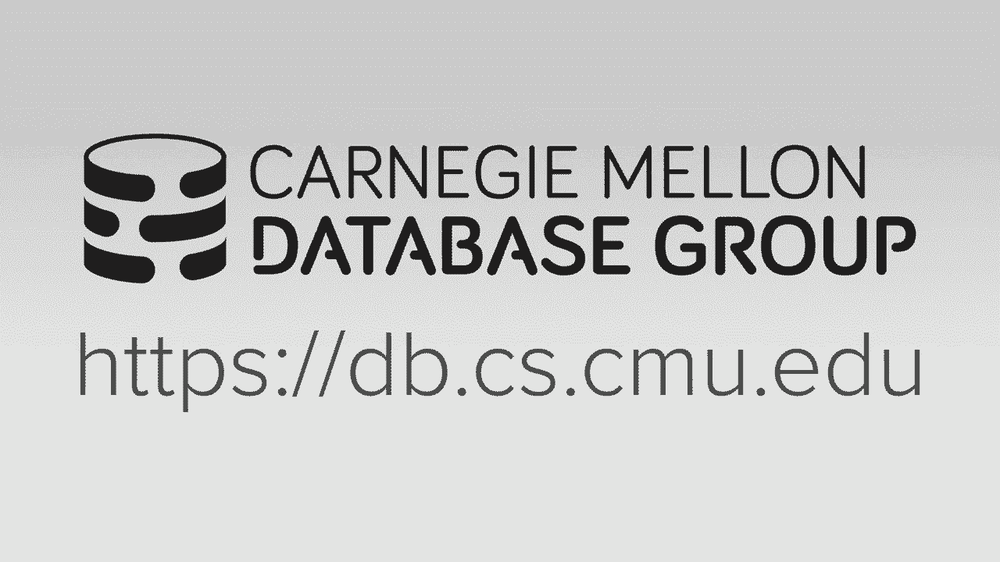
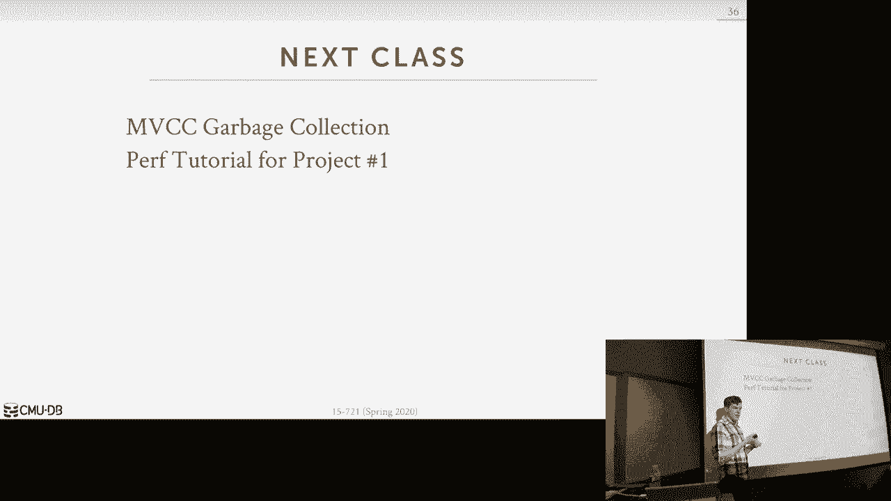

# 【双语字幕+资料下载】CMU 15-721 ｜ 数据库系统进阶(2020·完整版) - P4：L4- 多版本并发控制 2 [协议] - ShowMeAI - BV1wv411w7Ko

[Applause]，[Music]。

[Applause]，[Music]，for today's class we're going to，continue our discussion on multi-version。

cooker treat all and so last class we，spent time talking about the four major。

design decisions when you build an NBC，database system right Kurt's your。

protocol even though control is in the，name over designing again this is how。

we're gonna create transactions the，Virgen storage basically every time we。

update a tuple where do we actually，store that fit new physical version。

garbage collection cleaning up all，versions and then index management。

basically how do we keep track of what，are the secondary indexes point to。

really either point to the actual，physical version the head of the version。

chain or D pointing to some some logic，identifier so for today's class we're。

now going to go into more detail and，look at real world implementations of。

modern nbcc systems and what will happen，is we'll do this in the context of the。

four design decisions that we talked，about last class but we'll spend a。

little more time talking about how，they're actually going to do the first。

one they actually concur to a protocol，itself all right how they're going to。

coordinate transactions but then as we，go along they'll also be other aspects。

of these database systems that we'll，cover that are good ideas potentially。

for having a high performance MVCC，system that doesn't fit exactly into the。

the four design decisions that we talked，about before and so the way we'll go。

through and perceive the discussion will，first talk start with Microsoft。

hackathon because that was sort of the，first implementation of a modern。

in-memory MVCC system in 2011 2012 and，that'll serve as the baseline for us。

understanding how these other systems，implement MVCC all right so if you。

understand this they're gonna say are，how can we tweak tweak it or do。

different things are add add additional，things through that nbcc implementation。

that can improve what hackathon original，opposed okay again so hackathons we。

focused on OLTP these two here hyper and，hana we focus on old TV was OLAP and。

then we'll come back with cicada to，discuss how we do or how to do old to be。

again all right all right so who here，has actually ever heard a heck of tom。

for that hasn't hung around me right，that's nice okay so like it is it。

started off as a research project at，Microsoft and then now action ships in。

sequel server today but like when you，read the documentation they don't call。

it hackathon I think it just called a，memory storage but if you if you look at。

the papers I refer to everything as you，know this project has hackathon so。

hecatomb project started in 2008 at，Microsoft as a way to extend the the。

lifetime of of sequel server so at this，point 2008 sequel server was 20 years。

old and so they started the project to，say well what cleaning what can we do to。

improve the performance and modernize，the system such that Mikus our sequel。

server is still relevant you know 20，years from now my sequel server it makes。

it mix Microsoft bit of money so they，said you know how do we keep that gravy。

train going 20 years in the future so，they decided to work on how do you。

actually build a new OTP engine，specifically for you know for the CI。

server ecosystem so if you don't know，the history of sequel server in 1919 93。

92 they actually bought a license to，Sybase and then they support it to。

Windows NT and then a little bit after，that then they bought the source code。

license from Sybase they end up working，it and at this point they've rewritten。

everything from scratch I'm sure all，over again but there are still remnants。

of sequels or sigh basis influence in，sequel server today like sequel server。

uses T sequel which is a variant of，sequel that's what Sybase used and。

certainly now today sequel server is，still considered a this is considered a。

state of the art system whereas sigh，basis is more or less in in maintenance。

mode ASAP bought Sybase they still make，a shitload of money on it because we had。

the the guy that sort of leads the，Sybase project give a guest lecture in。

this class last year but you know it's，there no star was saying like oh I'm。

gonna build my new system based on，Sybase right nobody does that。

all right so they took to start this，project Microsoft got to very family's。

database people at Microsoft Paul Larsen，was an MSR he's sort of a famous。

database person who's been around for a，while like he invented linear hashing in，the 1980s。

and much indeed much work a deck Mike，Zwilling was actually one of the main。

people they hired at the very beginning，when they started sequence over to help。

them port the Sybase code over to，Windows NT and he worked at unity of his。

content on a very influential，influential system called sure，so they got basically the two best。

people to lead this project so unlike，Hana Hecate on cicada and a bunch of。

other systems we'll talk about this，semester instead of building a brand-new。

databases from scratch for the hackathon，project they had to make sure that it。

could integrate with the existing sequel，server ecosystem this is sort of more of。

a business decision right you have you，know millions millions of people are。

running sequel server today there's all，those tools and all these visualization。

frameworks and things built on top of，Siebel server that you want to keep。

around because that sort of helped you，know help sell the product so if you。

threw it all the way from scratch and，build hackathons as a new standalone。

system you basically have to re-implant，all that ecosystem so for this reason。

they had to make it run aside as an，engine in in in single server the way it。

works today is like when you call create，table you can pass a flag at the end。

that says in memory and that then ends，up using the the hackathon engine。

another interesting thing about their，design decisions they're going to make。

is that part of the reason they chose，MVCC and the approach that they're going。

to they're pursuing is that they want to，be able to support all all to be all。

possible o2b workloads with the same，predictable performance so we didn't。

talk about I don't think we talked about，each door of volte be in the intro class。

but this is a system that I helped build，when I was in grad school and the way。

this works is that you have a single，threaded execution engine that can。

actually one transaction at a time of，course you paralyze this across multiple。

cores but now that one transaction is，super fast because there's no contention。

you don't require locks or latches，because nobody else is running at the。

same time I can run almost at bare metal，speed but the problem as soon as I touch。

multiple cores our data across multiple，cores then at the hold locks and then。

things slow down so some of your，transactions will be insanely fast other。

transactions will be super slow and in，the Microsoft world that's a hard。

product to sell because basically you're，saying hey go buy our new product give。

us a lot of money for some of your，transactions it'll go really great。

90% your transactions one run really，fast Kember sending your transactions。

will run really slow like you can't sell，that but no one would buy that。

hey example I like users like you try to，sell a car say hey this is the fastest。

car it's gonna have great fuel economy，it's gonna be it's me you know you。

should buy this but oh by the way 10%，are you over to get cancer when you。

drive it no one would buy that car right，so for this reasons they they're not。

gonna get the sort of moves optimal，performance relative to something like a。

shoe or volte be but it'll least be，predictable and this is over at what。

mvcc's can provide us so at its core，again it's gonna be doing its can use。

time stamps to determine the ordering of，transactions and what virgins are。

visible to it but unlike in last class，when we talked about times kept ordering。

and and so base MVCC transactions are，now going to have to time stamps so when。

we talk about time same ordering again，the transaction gets assigned a。

timestamp when it shows up and OCC you，get a timestamp when you validate and。

and so in this world you're gonna have，both you're gonna get assigned a。

timestamp when you start and then you'll，get another commit timestamp when you。

have to pass validation and then we have，to use that again you're using the。

information to figure out what is actual，what is actually visible to us all the。

two posts are also going to contain two，timestamps we have to begin in the end。

and so the begin timestamp is just like，as it was before where it's gonna。

represent the begin timestamp of the，actor transaction that created it or the。

commit times commit time stamp of the，transaction that committed that。

committed that created it and then，what's gonna happen as well see in the。

next slide this thing will have to go，back and change because we'll start with。

this we create a new version we can，populate it with our begin timestamp for。

our transaction but then when we commit，now we have the commit timestamp and now。

we gotta go back and update all our，versions and replace the timestamp and。

I'll show you how the everything still，works out and we you know there's no。

phantoms and there's no issues even，though we're changing timestamps。

the end timestamp for a tuple is little，tricky so this is going to be begin。

timestamp of the after transaction that，create it created the next version in。

the Virgin chain affinity meaning that，it's the latest version and that you。

know there's nothing else comes after it，or the commit time Stan，of the committed transaction that。

created the next version right then that，invalidated the current one and then it。

points to the next one so big and this，one's a bit more confusing but I make。

more sense when we when we show an，example okay all right so say we have a。

simple table again so Hecate on is doing，a pen only storage oldest to newest and。

the Virgin chain and say for this one we，have we have just you know single with。

logical tuple for two virgins a1 and a2，so our transaction comes along all right。

and at at very beginning we have to give，it a timestamp so it's begin timestamp。

in this example here is 25 so now we're，going to do a read on a so we'll land。

somehow at this at the head of the，Virgin chain at a1 here how we got there。

it doesn't matter whether it's an index，or a sequential scan for our purposes。

here we don't care so now we're going to，see whether this version is visible to。

us so again we have to go look at the，begin and the end timestamp that tells。

us the visibility of our tuple in this，case here 25 is greater than 20 so we。

know that this this thing was comes，before us or comes before our our。

snapshot for our transaction so then now，we followed the version change pointer。

and now we land here in this case here，20 25 is in between 20 and affinity so。

we know that this is the version that's，visible to us and this is what we'll。

read so that's the same as before as，last class okay all right let's see now。

we won't do a write or name so same，thing somehow we land at the head of the。

virgin chain we know that this is the，this is the logical we want to update so。

we want to find where should we install，our version so in this case here again。

25 is greater than 20 so we know we，don't want it this is not the head of。

the bird this is not the version we want，to pen afterwards come down here 20 to。

infinity so we know at this point here，that this is this is the most recent。

committed version and then because this，is infinity and our pointer is null we。

know that nobody else is trying to，create a new version after us right now。

all right so now we need to install our，new version so for this one we need。

careful how we're gonna do ordering，because unlike last class where we had。

this sort of take a lock on the whole，tuple and and then do our updates for。

this one we want to do everything as，compare and swap so we want to avoid，having to lock this。

thing what will they make a change so，the first thing we need to do is append。

our new version right it's a pen only，storage we just find a free slot in our。

table space and then we claim it and，then we can now install our new version。

but now you'll see with that for our，begin timestamp we're doing something。

special here so I'm having this little，marker here say transaction at 25 so。

what does that mean so the hackathon is，going instead of having a instead of。

having us sort of special transaction ID，to say this is this represents the。

timestamp of an uncommitted transaction，they're just going to use the begin。

timestamp to record that the that this，is the version that was created by this。

transaction for both committed and，uncommitted and so what they're going to。

do is they're gonna use the most，significant bit and set that to 1 to。

mean that the transaction at this time，stamp is uncommitted so I'm representing。

that by having the prefix transaction in，front of it right this is just for。

illustration purposes but underneath the，cover is what they're really doing it's。

just flipping this one bit let me take I，ah so she's saying because this thinks。

that the one we know that nobody else，can ever have every time to him that。

bigger than us no all right so when we，do the comparison were actually gonna。

ignore that one yes help me avoid a，cascading abort no Pakistan's gonna。

support spectra to read so we still have，cascading boards so he says this you。

could use this to prevent you from，reading something that's not committed。

yet by by checking this and they say I，don't want to read this so again their。

respective the reads so you want to be，able to read things that are uncommitted。

because you're going to assume they，transaction that you read from that。

modified this thing is not gonna abort，so you what you want to go ahead and。

allow us she says you can read your，other things you updated yeah but I。

don't need the bit to figure that out，these are all she good this is actually。

very interesting yes go so you're saying，if you if you read this and you see the。

one then you know that you read，yes，that's very close yes he says they go。

through the constructor and recognize，the other thing this thing is unused and。

go ahead and clean it up but not unused，we put something in there he's not。

yeah but why well what is the one，actually do for us you guys are very。

close he says make a light screen now no，she said recovery now all right so well。

this is Oliver this is good because this，is like I've eaten paper。

oh of course yeah do it this way and，then you guys are coming it from not。

having all this prior knowledge so it's，interesting to see you like what you。

guys think actually matter，so what we're actually gonna do with。

this is that we need at some point we，need to figure out because he was very。

close this somewhat we need to figure，out did we read something that was not。

committed and if yes we need to know，what happened to that transaction so by。

setting this bit 1 Wow while our，transaction another transaction is。

reading this it'll say oh I see this，bits at the 1 that means that this thing。

is potentially uncommitted it actually，may be committed we just don't know it。

yet because they haven't come an updated，this this this this this timestamp to。

you know to remove the 1 so we'll see in，a few more slides but there's actually。

gonna be this global state map that，keeps track of the the current state of。

every single transaction that's running，in the system so if I'm looking out for。

specular reads I need a way to figure，out later on did the thing I read。

actually get committed or not and so by，setting this to 1 I don't have to go。

check to see whether a might actually，allowed to read this I make a make a。

little mark in my local metadata like in，my thread that says by the way I read。

this a 3 figure out what happened to it，later on because it may and may have not。

committed yes so he says what happens if，I go on check when my transaction。

commits that they go ahead and read this，what if it's still uncommitted I have to。

we're not there yet yes he's the，question is to update the original yes。

right so did yes yeah yes so at this，point here no one can see this right。

because all I've done is I just the，first transaction installed this right。

instead of taking a lock on e to I just，said let me go ahead and create this。

then now I'll do the compare and swap，here and if that succeeds then I know。

that I was successfully able to install，this new version but at this point here。

can anybody see this can everybody see，my new version yet why not。

I mean fini right so now I need to go，back here and flip that to be my my。

timestamp and now my version is，installed it's still uncommitted my bit。

is still set to true or so the bits set，the one to denote that this is。

potentially from an uncommitted，transaction but at this point here。

anybody that comes along that wants to，read data after timestamp 25 should be。

able to will be able to see my my new，version yes your question is why keep。

track of the begin timestamp and，timestamp here yes like I can track up。

like the end timestamp and let's say，like a 1 when you begin timestamp in a 2。

right so his question is why do I need，to keep track of this end timestamp here。

couldn't I just follow the Virgin chain，and say oh well I know that the the。

visibility of this tuple is 20 to 25 cuz，I have it here but now when I do garbage。

collection I always got to keep the last，one around Yeah right so if my two boys。

super big like super what has a lot of，misses point is if you know right so。

he's saying if you know this pointer is，null then that should not just be read。

so you're saying so you said that if，there's transaction at time-stamped 24。

they should read this what he's saying，that you could infer I think it you want。

to reduce in my pointer chasing I think，it's compute versus storage costs so if。

I'm scanning along I'm oldest to newest，I see this I don't know the end。

timestamp my pointer is not null，I got again follow the pointer now to go。

figure out well what is there what，should this actually be and anything。

that that's a waste of waste of time，it's not worth it so for safety for bits。

it's you avoid that extra extra，computation so his point is back here。

this thing set at the one so therefore，the number super high when you do the。

comparison you own looking 63 the bits，that it still stays like this is our。

begin timestamp we only flip that one to，a zero when we get a commute time stamp。

which is I'll show next okay okay this，is just mean that'll tell us hey where。

we have something that's not committed，you need to figure out later on whether。

it actually was committed at all，all right so now our guy commits again。

so we're gonna do it's never CC so we're，doing we're doing validation so we need。

to go you know go check see we're，allowed to commit in this case here yes。

we are so we get our commit time stay，about 35 and so，all we need to do now is just go back at。

some later point and flip this to be now，thirty five doesn't need to happen。

immediately because again this is saying，that if anybody reads this go figure out。

let you know later on in my my global，map whether I actually committed or not。

but now if I install thirty five the bit，is set to zero so I know that I'm。

reading something that I definitely，definitely was committed and I don't。

need to check that map yes boom okay so，let's this question is exactly that's。

right so let's rewind now let's go，remove the commit we're back of this D。

here let's now bring another transaction，okay，this one is your question so our。

transaction begins at timestamp 30 and，it was do a read on a so again follow。

the Virgin chain 30 is greater than 20，we don't want this 30 is is greater than。

25 we don't want this so then we land，here and this is the version that we。

actually want to read again we're doing，specular reads in Hecate on instead of。

taking a write latch or right lock on，this tuple I'm allowed to read something。

that's uncommitted oscillate later on，make sure I was you know the transaction。

that created this version that I've read，whether it actually committed or not but。

I'm allowed to do this but now this guy，here，my timestamp is 30 that's after 25 but。

this again first writer wins so this guy，is going to get come down here and。

recognize that the the there's another，transaction that's uncommitted here that。

created a new version that that I cannot，create a new version after this and。

therefore I have to abort my transaction，so again by seeing this thing here I。

know it's uncommitted actual in this，case here you you would want to go check。

but I think yeah if you go check you，could go see oh it is actually committed。

therefore I can't install the version，for this example here 2025 is not。

committed yet so this thing would is a，write write conflict so we go ahead and。

the board is your question okay yes，their threat to is dead at this point。

here when he tries to try to write on a，yes so this okay to commit time stamp。

after ste ste gets 35 again then when，this guy does right just to read this。

guy so this guy commits guess this guy，then reads yes question is in my less at。

the Apple here this guy got a commit，time set by 35 but if now if I come back。

and do this read but I have timestamp 30，what I see no because under snapshot。

that's okay yes questions how do I make，sure if I need to go flip these so what。

happen is if I go to a look up and I see，this things committed right the one says。

I go figure out what what is actually，going on so if it's set them one I go。

look my map and I would say oh it's，committed the real commit timestamp is。

35 so I guess I was tough to do that in，my local view of this and then when you。

do the update you go from all you go，from the newest to oldest because people。

are going in the other direction，so you wouldn't have that that issue，okay。

so let's jump now and talk about how，we're actually gonna the state map here。

again so this is a global hash map，they're going to maintain throughout the。

entire database system that just keeps，track of what's the state of every。

single transaction running so active，transactions are just one transaction。

shows up it's done a bunch of reads and，writes it has begin timestamp you can。

still do more reads and writes we just，don't know the outcome just yet。

validating is when the application says，I want to commit my transaction and now。

we begin the process of figuring out，whether it is actually a lot of commit。

right like we have to go check the，rewrite sets and see whether there's any。

conflicts committed transaction is that，we pass the validating phase we have a。

community who goes reads our data has，well know that it's actually been。

committed but we just haven't gone back，yet and flipped those begin time stamps。

and end time stamps to being our what，our commit time stamp is and then。

terminated is when we updated all the，time stamps for our versions that we。

created and then at some point what，we'll get will get pruned away will get。

thrown away out of the out of the map so，let's go through now the lifetime more。

details so it began transaction gets the，begin timestamp we said it said it in。

the map to be active then we do our，normal processing again under OCC they。

would call this the read phase for doing，reads and writes on on the datum but as。

we run maratha me keep track of the read，set the scan set and the right set of a。

transaction so for the read set in the，right set these are just going to。

physical pointers to the versions that，we read and wrote right but they're。

actually gonna be like in case a read，set it's going to be the version that's。

produced to the access method of the，transaction I'm sorry of the query。

executors I'll explain that in the next，slide and the scan set will be the。

actual where clause that we use to do a，scan on on a table because we need that。

for to do phantom checks for，serializability then we hit pre-commit。

this is when the application tells us we，want to commit we now get our commit。

commit time stamp we do a validation to，figure out whether we're actually there。

any conflicts and then right and then，validation again we just check。

everything to see whether whether we're，not violating serializable order but why。

don't you think is here，this is when they're gonna write now the。

new versions to the redhead log out on，disk so this is different than a。

Discordian system in a Discordian system，remember you're just appending to the。

right head log buffer and some point the，buffer gets full or there's a timeout。

when you do in crew commit and then all，your log records get flushed to disk。

even though that transaction may have，not committed yet in the case of Hecate。

on they're gonna buffer all the log，rights in memory and only flush them out。

when the transaction actually is，committed so that means that there's a。

crash you come back you're not gonna see，any log records from transactions that。

did come and they did not commit you'll，see everything you'll see all the。

overall records also you see all of our，guests were all in only committed。

transactions then we do the commit we，set our transaction state to committed。

we go through now and update our version，time stamps to flip the begin time。

stamps and end time stands to now be the，transactions commit time stamp then at。

point we're done we set us off the，terminated and we'll get cleaned up。

later on all right so let's talk about，this this is metadata for tracking here。

because this is important to understand，how we actually maintain sterilized。

ability so for the read set and the，right set these again these are me the。

physical vert pointed to the physical，virgins in memory that I access or。

created and for the access one it's，going to physical versions that I've。

produced back to the access method that，that that I used to execute the query so。

the thing of this is like say I have a，virgin chain and I have you know three。

versions in it the access method does，the scan once the wants to get back a。

tuple it's only going to get back one，version so my reset doesn't contain the。

first two versions I looked at that，weren't visible to me I don't care about。

those it's the one I then returned back，to the query executors now up in my。

query plan that one version may get，pruned out like if it gets fed into a。

joint operator and the join operator，says I don't need this to bone it throws。

it away I still need to know about it，right I even though it's not produced。

the final result of the tube or the，query because I gave it to my access。

method I have I have to return it and，then the scan set is gonna be the thing。

this is like it's the bare minimum the，information we need in order to re。

execute a scan operation so things like，it's just the where clause of of a query。

and what's going to happen is in our，validation we're going to。

basically just re-execute the scan all，over again and see whether we get back。

the same result because if we don't get，the same result then we know there was a。

phantom somebody inserted or deleted，something since since you know since we。

started and therefore we have the you，know giving back a different result and。

therefore we have the border transaction，because that would violate serializable。

orders now if we're running at a lower，isolation level we don't care about this。

but first utilizability we do yes where，when and doing the validation pays right。

so I'm checking the check my read set to，see whether I've access anything that is。

from uncommitted transaction and you，know whether they commit or not and then。

I run my scans again to figure out if，I'd run this a second time do I get the。

same result if I don't then I know，there's a fan and I abort so you may。

think this is kind of heavy-handed right，like if my scan reads a billion to polls。

when I when I do validation I'm gonna，read a billion tuples again yes so this。

is this is just the metadata this is the，metadata at the track in order to do。

this so board would happen here or，conflict，I gotta bore myself right away if under。

validation like if I scan again I get a，different result then I kill myself well。

you sort of skip down and and well yeah，you just kept down and terminate and say。

I'm not I'm I'm not gonna commit and，then the garbage cracker will come。

through and clean up any versions，shouldn't shouldn't be okay to that yeah。

is the queer call sponsor yeah so the，where clause contains predicates a。

predicate would be like a equals one and，B equals to each of those eight one。

that's I call that a predicate it's just，the set of predicates okay all right and。

then commit to and see what he was，asking here is like this is basically a。

list of all the transactions are waiting，for my transaction to commit because。

they read something that I wrote before，I committed so think of this is like a。

pub/sub system like transaction reads my，uncommitted data they then subscribe to。

my you know commit notification whether，I'm gonna finish or not and then if I。

commit and I and I read something that，you wrote and you have committed yet but。

I need to wait to see whether you commit，for I can commit yes yes the question is。

would I use the commit timestamp to，react so you can yes you have to because。

that's like that's when I'm installing，everything all right can you have a。

circle in dependency in the commit，commit commit timestamps no because。

because when you whenever in the first，time I can read a bunch of stuff。

I mean I'm before you but I haven't，committed yet so you can't see any。

myself yeah if your timestamp is greater，than mine then I won't then and you。

write some table I won't read it yeah so，it's always one direction all right so。

in the heck of time paper，they proposed actually and evaluate both。

the optimistic and pessimistic version，of what I've just described so。

optimistic is what we've already talked，about again the key thing is here in。

order to ensure serialize ability I have，to check for phantoms by rerunning my。

scans on commit and so when you download，sequel server and you run it and you you。

run it in every table this is actually，what you get but they also implemented a。

pessimistic version based on two-phase，locking and the the main thing this to。

understand is that they don't have a，validation phase because they're going。

to do index locks and and you know share，locks an exclusive locks。

to avoid any phantoms and they have a，background thread to do deadlock。

detection all right so this is the only，graph I want to show you from the paper。

again the papers from 2012 so relative，to the other systems we're talking about。

this is pretty old and the horror that，running on is a bit dated the main。

takeaway from here is again as you scale，up the number of threads for this sort。

of high contingent workload with only a，thousand tuples the the pessimistic。

version it's worse than the optimistic，one and there's gap mate may not seem。

like a lot but if you look at the，numbers here it's this the the。

optimistic version is doing at most 1。5，million transactions a second and then。

the pessimistic one is doing 1。2 million，so the difference is 300，000。

transactions per second that's actually，a lot so like running this particular。

workload I don't know the exact details，on the hardware but my sequin po stuff。

can maybe do it most a hundred thousand，transactions a second I don't know what。

you know if you disable logging maybe a，little faster but you know this is。

pretty so this is a law even though，relatively between the two of them it。

doesn't seem like much right no so this，paper basically said like Oh an。

optimistic approach for an in-memory and，multi version system is the way to go。

and not the pessimistic one okay all，right so where does someone takeaways we。

can have from Hecate on so from a design，standpoint they talked about having this。

this global map to keep track of the，state of everything they're gonna laughs。

respective reads and of course，everyone's gonna do first writer wins。

but some of the things that came out of，the paper that they discussed it says。

like your design in memory system that，there were sort of tenants you should。

follow the first is that they said that，you only want to use lock for your lat。

tree data structures so that means no，latch instead of spin locks no critical。

sections everything should always be，written and on a lock free approach and。

this would be free indexes your，transaction map the memory allocator the。

garbage collector so I just I agree with，everything except for this one here for。

indexes so next week you guys will read，about the BW tree which is a lot free。

index that they built and part of the，hackathon project we and them。

implementing the same thing and it gets，it it's not crap like but it new。

two indexes that still use sort of，traditional locking techniques right the。

way Hecate inversion started was they，went all-in with skip list skip list as。

a walk free data structure that sort of，looks at the Kabbalistic B+ stream that。

you can make a lock free so in the，original versions the Hecate on they。

were like skip list of the way to go，this is how they design the system then。

they said actually skip list or crap you，actually want to use a BW tree but even。

then the B Double Tree is gonna lose to，you know regular P plus tree this this。

is what you end up guys building for the，second project so it's also interesting。

about this the one database system，that's out there that is very big on。

skip lists his mem sequel right and the，reason is because the one the。

co-founders and then sequel was at，Microsoft at the time working on sequel。

server when the hecatomb project was，going on and he saw about to these。

internal talks from Paul Larsen and，Mike's willing the two guys leading the。

hackathon project and the very beginning，of the project they were like skip list。

of the way to go this is what you should，be using so the mem Siegel guys saw that。

and then you know to borrow those ideas，when he went off and done em sequel but。

he then he missed the second half of the，talk the basic said skip lists are crap。

and that you want to use a BW but I，think still today like MEMC go still。

very big on skip list but again the，research shows that that is garbage。

so I would say like house is you almost，make with very rare exception you never。

want to use a skip list like there are，some cases weren't like for in memory。

stuff that small skip list might be okay，I just have some nice properties for。

memory fragmentation but in general for，week，skip lists are a bad idea don't go don't。

use that and don't use the P Double Tree，either even though we still use we still，use it all right。

the other interesting thing they talk，about is that and I agree with this is。

that you should only really you know you，want to minimize the number of。

civilization' points or bottleneck，points in the system and the only place。

you need to do that in the case of，hackathon is when you hand out the。

beginning began to commit timestamps，because these always need to be。

monotonically increasing and you can't，you can't give out to placate timestamps。

so the way they do this is through a，compare and swap for atomic addition。

right single instruction to add one to，the counter in the paper you guys let。

read last class we showed that if this，approach can you know really high core，count can get max。

maybe like you know hundred million time，tens for a second so you could try to。

batch these things in our current system，we we we actually don't do this we do。

what heck we hyper does and in that case，there is actually a spin lock around a。

sort of a critical section so in case，the hackathon they don't have that issue。

they just hand out these time stamps，array efficient okay all right so okay。

Hecate on i spent you know the first，forty minutes about talking about it。

because that's what about it's a，baseline to now understand all those。

sort of modern implementations or，variants of a multi version control so。

that we can make some observations and，now about what the Hecate on。

architecture looks like and what are，some challenges are what some。

bottlenecks they're going to face when，we look at other workloads other than。

OTP so the first thing is going to be，what i talked already mentioned is that。

the reset and thus can set validation is，going to be really expensive if our。

transactions to access a lot of data so，typically under oil to be workloads。

transactions you know update maybe a，couple dozen tuples or acts as a couple。

delves into bowls so in that case，they're the scan side or the reset is。

gonna be quite small so we can do that，validation very quickly but now if I'm。

running on analytical query where I scan，the entire table my table has a billion。

tuples now when I do that validation I，all over again，right and that's gonna take a long long。

time the next issue is that the append，only version that they're that they're。

using going oldest and newest is me bad，for OLAP scans because now as I'm。

scanning along the version chain I'm，reading a bunch of stuff that I probably。

don't need just to get to the version，that I actually want you know depending。

on how fast I do garbage collection the，version change can get quite long and。

all this pointer chaining chasing and，branching is going to be bad on a modern。

CPU architecture because they're gonna，have these long instruction pipelines so。

now if I miss predict on a branch，I gotta flush my pipeline and fetch。

everything back in and I'll have long，stalls the last issue is going to be。

with Hecate on that they were doing a，coarse-grained conflict detection and。

determine whether you had a complex，routine to transactions so what I mean。

by that is all they were doing to，determine whether there was a conflict。

is just does the pointer exist you know，another，after the version I'm trying to read so。

let's say now though I have a table that，has a thousand tuples and my transaction。

reads reads one of them I'm sorry my，transaction rights one of them your。

transaction reads the other 999 of em，you don't read the one that I wrote but。

now that's me consider it as a spec of，read because you read a version that I。

created but you didn't actually read the，part that the data that I modified。

so now if I abort you have to work too，because the database sim doesn't know。

anything about what you read it just，knows that you read a version that was。

created by this other transaction that，transaction aborted it so therefore you。

have to work too so right so that's so，again and we're doing this visit we're。

just the mere existence the pointer it's，enough to say that you read something。

that I that I wrote but nothing，internally no nothing more fine-grain so。

the hyper system again this is out of，the EU Munich right this is the Germans。

anytime I refer to oh the Germans are，beating us that we have to work harder。

cuz of the Germans it's these Germans，they're very good so hyper was the first。

data submit they built its an in-memory，columnstore using Delta record。

versioning going from newest to oldest，and what they're gonna do is that。

they're gonna support more fine-grain，conflict detection then what Hecate on。

can do and we'll see how we do that in a，second they're also going to do avoid。

write write complex by saying the first，writer wins and then the others do you。

think thing that we talked about the end，of last classes the way they're gonna。

handle indexes in a multi version system，tuple，if the attributes you're updating are。

our index but you know in some some，index then you have to do a delete in。

the index followed by the insert right，because otherwise you have to maintain。

these different versioning information，inside the in the index to point to both。

of these I and it becomes a big pain so，you treat it as a delete by answer and。

that that solves that problem，so let's look an example here so again。

they're doing deltal storage and it's a，column storm so they're inside of every。

block of tuples they're going to，maintain a special column called the。

Virgen vector and this version vector is，going to point to now a delta store。

that's allocated per thread or per，transaction that we're gonna maintain。

all the updates that we have for you，know for this particular tuple so if the。

pointer is null that we know that this，is the the master version in the latest，version of this tuple。

and there is no you know there is no，other version we need to check if the。

pointer is not null then if we need to，go back and try to find an early version。

we just follow along this pointer and we，look inside of our our transact red。

space so sort of related to what Hector，tom was saying that you don't want any。

global data structures you don't want，any global memory space the this Delta。

storage is gonna be on a per thread，basis so when I allocate a bunch of。

space for my thread and thread local，storage I don't worry about contending。

on into the memory allocator for other，threads because that space is allocated，from me。

although threads can read my memory，that's fine but nobody else can write。

into it but me and that voice haven't，take any latches on any internal data。

structures we have in here so now if I，have another transaction it comes along。

that wants to do an update right so say，it wants to update the Tupac tuple so。

the first thing we're gonna do is copy，out the the attribute that we're gonna。

modify so we're gonna modify attribute，two so he put the old value over here。

and then we update our pointer to now，point to what the the previous version。

was and then we can go ahead and do，compare and swap install our version。

vector and update our value right same，thing for the next guy right we update。

this table there is no older version so，our pointer doesn't point to anything we。

copied the old value here and it's，updated version pointer there so in our。

current system we do it the same way all，right but we actually do this all in a。

latch free manner which gets a little，tricky in order to make sure you get。

things in the right version when you，have two leads we can ignore that for。

now in Hecate on the way they actually，did it was have a latch on the entire。

block of tuples they each block is going，it's like 1024 tuples so in that case。

here I take I take the right latch and，the whole thing and I don't worry about。

someone else coming along and reading，something while I'm an intermediate。

state in our system because deletes are，tricky we do you know we do some extra。

stuff to make this all be less free but，you don't worry about that for now。

all right the thing that is really cool，about hyper is again how they're gonna。

do validation to ensure serialize a，building so again first writer wins。

that's easy right if I if I have two，transactions that try to update the same。

thing whoever got there first succeeds，and the other guy aborts so the paper。

that you guys are trying to read，describes how to handle this in。

actuality which is not discussed in the，paper and it's not really public but。

they don't really have write write，conflicts because they actually only。

have one writer thread so only one，thread can update transaction or update。

the Davis at a time there's much a，reader thread to do analytics but。

there's no write write conflicts because，there's only one guy could be updating。

the data at the time same same time but，the protocol you guys read about would。

actually handle multiple threads so now，the way they're gonna do validation said。

are you react seeding the scan set is，that they're gonna use a technique。

called precision blocking so this is，really cool because this precision。

locking paper came out before I was born，in 1980 and a time before these Germans。

picked up picked it up it had like 40，citations so a 30 40 year old paper with。

40 citations is essentially forgotten，right no-one's citing it no one's。

reading it right and somehow the Germans，dug this thing out and what its gonna do。

it's gonna be like an approximate，predicate locking so I don't remember。

whether we discuss predicate locking in，the intro class but basically predicate。

locking is a way to look at to where，clauses and queries and figure out。

whether they intercept all right and for，simple cases like a egos 1 and B equals。

2 like those don't intersect that's not，a problem but for more complex things it。

becomes very very difficult I think it's，np-complete，so precision locking is like an。

approximation of that where I only need，to look at just what I actually modified。

whether the tuple that I modify it，overlap with what my queries are trying。

to do and so rather than having execute，the scan you just sort of re execute the。

query based on the the Delta records，that are generated by transactions it'll。

make more sense the next slide but，basically when my transaction commits to。

do validation I look at all the，transactions that have committed after I，started me。

I did not see their updates when when I，ran because they not they did not commit。

before I started so I'm going to see，whether they then created new versions。

that I should have ran read when I ran，the first time all right so let's look。

an example here so say this is the，transaction we want to validate it has。

three queries and then there's three，transactions that have already committed。

so they're in the past right they're，gone and we have their their their redo。

records so these are the same video，records we would write out the disk。

anyway so it's not like we're generating，these to do just this validation we have。

to log them out to disk so we keep，around a memory to do our check and so。

that so the idea is that we're gonna，look at the where clause for every。

single query and check to see whether，there is an overlap with what we're。

looking up here with what they actually，modified and if so then we know with it。

we should have read what they wrote but，we didn't so therefore we have to abort。

so the way you take about this easily is，that we look and see what attribute are。

we accessing in our where clause for，each predicate and then we look at see。

whether they modify that attribute in，any log record and then we just。

substitute that value in here alright so，for this first one attribute ask me to。

it's greater than 20 this guy modified，attribute to is 799 so he placed 99 here。

so 99 is not greater than 30 or greater，than 20 and less than 30 so we know that。

this thing would not evaluates it for，our query here we wouldn't have read。

this yes no no they committed it after，we started no not necessarily。

again snapshot isolation says I can only，read things I only see things that are。

visible to me if they were created by a，transaction that committed before I。

started so I've started and there's a，bunch of transactions that have already。

started in there making some stuff and，the current transaction that started。

after I started that wrote some stuff，then committed as well so in this case。

here for both these predicates alright，for this transaction it evaluates to。

false so we know again that this，transaction did not create anything that。

I would have read if I was if it was，installed before you know when I。

actually had to read the first time so I，didn't miss anything so there's no，phantom here I could。

that same thing with an ex guy here，right after two is in ten twenty or。

thirty this guy created ninety nine and，thirty three and so for both these。

predicates evaluates to false three，threes not ten twenty or thirty。

ninety-nine not ten twenty or thirty so，therefore and I didn't read any I didn't。

miss anything so that's false so we we，can skip that in this case here I I'm。

doing a lookup on attribute one this guy，only modified attribute to so there's。

nothing that this guy would have modify，that it read so I'd replaced that with a。

null null like any wild card what would，it actually evaluate to null so long as。

it's not true then we're fine and I，didn't miss anything so I'm gonna do。

this down the line for all these guys，alright one by one but now we get to。

this guy here accurate one like ice wild，card ice wild card and in this case here。

somebody installed the you know the，string Ice Cube so now in this case here。

my predicate would evaluate to true so，therefore again that means that this。

transaction did an update that was，committed after I started but because I。

was looking at a previous snapshot I，missed it，right this is the right skew anomaly。

because I missed it then I have to then，then you know I have to abort because。

it's something that I should have read，but I didn't read and I would've violate。

sterilizable ordering okay yes yes yes，question is this question is what if。

like what if like here this evaluated，true and then say this is this is going。

forward in time so transaction one zero，one is older than ones there's are three。

so this evaluates to true but then this，evaluates to false what should happen in，that case。

let's go question，right there's a brief period where it，was true but the am result would be。

false I think the last writer would win，yeah I think the last writer would win。

so you you could in theory and this guy，would you actually have that information。

though I don't think you would you，wouldn't know that so this is again this。

is an approximation of a phantom，checking so false positives are okay。

because we abort when we didn't have two，false negatives are bad we don't want to。

abort we don't we don't want to not，abort when we showed up so in that case。

here I think the safe thing to do is，like even though there is a window where。

like like we're like or after this guy，then everything will been okay because I。

conflict it at least once，I'll play it save it and a board，immediately again it's not predicate。

locking would be an exact measurement or，determination of whether there was a。

conflict precision locking despite the，name is a little less precise and is。

it's okay to have false negatives or，false positives okay，the other cool thing about hyper that。

they do is these Virgin synopsis so，again the issue is that under Hecate on。

is that we have these long version，chains and then as we're scanning along。

we basically have to traverse them all，the time to figure out to find the right。

version that we actually want so if，you're doing a TV queries where you're。

doing lookups on single attributes，through an index and I land at the head。

of verges a mattress that yeah who cares，because I I just follow a virgin chain I。

find what I want but now if I'm doing，analytical queries when I basically want。

to do entire table scans I don't want to，have to go check that virgin vector and。

go follow some JSON pointer over there，because that's gonna ruin my cache。

locality because I want to be able to，rip through these columns very。

efficiently that's the whole point of，having a column store but having these。

pointers causes them you have，indirection so what they're going to do，maintain。

Virgen synopsis and this is just gonna，keep track of what range of the of the。

tuples here if they might block don't，have a virgin' vector don't have older。

versions that I need to go check so in，this case here it's between two to five。

inclusive exclusive so way think about，this these offsets are number from 0 0。

to 6 so this is gonna say between 0 & 5，so zero inclusive five inclusive that I。

don't need to look at anything else so，in this case here when I do my scan I。

look at my virgin schnapps it would say，oh I'm at offset zero offset 1 that does。

not intersect with my virgin synopsis so，I know I can ignore this thing entirely。

but now for this range here I got to go，check sometimes there'd be no that's。

fine but as I'm doing the scan I don't，have to even look at this for these。

other parts here and now I can rip，through these columns as fast as。

possible you could even do something，like because sequel or relational。

algebra is unordered I could then maybe，do fast scan on these two guys and then。

at the end then go check this one I，don't actually know how that's actually。

implemented you probably don't want to，do that for a really large columns or。

large blocks because this will be you，know within you'll have a stride you。

know in in your cache and jump me to，another part could invalidate your cache。

so it's better off to maybe just rip，through sequentially so this is sort of。

like a zone map but for the physical，versions because zone map is a little。

thing of the header of the block says，you know here's the values that are in。

my block and use that to figure out，whether you actually need to read it。

this is like a way to say like alright，here's the here's the versions that you。

may here's the tuples that you know you，don't the check the versions all right。

the idea is that as data gets cold over，time you can have progressively larger。

and larger ranges when you don't have，older versions and that makes your scans。

go faster right under hackaton it's just，you had no notion of this well it's also。

a penalty but without any notion of this，do you have to scan through everything。

yes Birju schnapps it was in a block so，this block has ten twenty four tuples。

and this just saying like here's a range，where here's I actually don't know where。

you can have more than one I suppose you，could but here's the range where you you。

have to check the versions anything，that's not in this range you。

don't yes question why not use the rain，yeah I mean like yeah especially so。

actually this would be a great project，for project three tribe maybe the bitmap。

and try this one and see what's once is，faster and I imagine the larger the。

blocks are the bitmap the more tuples，you have in a block the bitmap gets。

larger but if doing 1024 that's not a，larger bitmap you know actually probably。

what you do is just take this and，convert it to a bitmap and use that for。

the scan and manage just keep it around，yeah this is something we should explore。

about your you cool project okay all，right so another system we want to talk。

about now that does that sort of NBCC，but with a focus on doing transactions。

and analytics is si P Hannam so Hana was，a it's in every dating system that was。

built by SI p that was meant to be you，know mostly designed to power their。

their big you know enterprise resource，whether a RP application writes the。

things that use to keep track like，payrolls and stuff like that to get off。

Oracle but it is actually a standalone，data system subject you could use for。

other applications so they're gonna be，doing time travel storage with newest to。

oldest and like Hecate on their support，both optimistic and pessimistic i。

actually don't know what you get by，default I don't know I assume Utley this。

is tunable and so they're gonna have a，hybrid storage layout then have rows and。

columns and so some versions are gonna，be in the row store and then some。

versions are gonna be in the column，store and the idea is that you want to。

have the latest version I'm sorry you，won't have the oldest version in the。

column store because most your your，analytical queries can just rip through。

that and then you have the roast or it，was where you append the new the new and。

the track time travel space you can pen，them very quickly because there's。

they're just gonna be sort of you know，deltas you're adding so they。

shuri of hana is actually kind of，interesting it originally started off as。

this Frankenstein Frankenstein system，where they bought a bunch of database。

companies mash this thing together and，called it Hana so this P time was an。

in-memory day system that came out of，out of South Korea the South Korean for。

whatever reason there's a lot of Awesome，enemy databases in South Korea alta base。

is another one so they bought these guys，they had this thing t-rex it was like a。

like a search system and then a maxtv，was an embedded Rho star system they。

mash these things all together they call，it Hana turns out that was a [ __ ]。

and then they've since as of last year，sort of released a new version where。

they've actually rewritten everything to，be a clean code base I don't know how。

much Appy time is still there but like，pretty interesting，the name Hana doesn't they told me。

doesn't mean anything for large，corporations name is a big deal like。

they're paranoid of getting sued right，that's why all the the Intel CPUs the。

Zeon's like KB Lake skylake those are，actually named at for real lakes and。

they do that because no one can sue them，and say they stole their name because。

it's like it's a geographical region，right so I'm making a name like Hana it。

doesn't mean anything that avoids them，getting you know getting sued I've heard。

that this mean has no planners new，architecture has no planner is the one。

of the founders of sa P like he's the P，and s AP but I I don't think that's true。

I think this someone added that，afterwards okay so let's talk White。

House authority virgin stories so this，is kind of interesting。

so the oldest virgin it's always giving，the main data table and that's gonna be。

a column store and then the hub this，little flag this and say hey there's。

actually there might be a newer version，in the time travel space that you need。

to go check and see whether that's，actually the version that you're looking。

for right and so for some queries like，for analytical queries，I don't maybe need to run and have the。

exact latest version of of a tuple like，who cares if I'm trying to compute the。

number of you know open orders that I，need to go check who cares if I'm 10。

milliseconds behind right so I'll just，main Dave，tablespace it may not be the newest。

version but that's good enough for my，query and so now when you land in the。

time travel space they're gonna have a，hash table to like dual lookup。

find the head of the Virgin chain for a，particular tuple yes what did I say it's。

all done ooh yeah sorry yes here okay，all right so every tuple in the main。

data table is gonna have a record ID，right that's a immutable identifier to。

say that this is this represents a，logical tuple and then then there's our。

version flag which could just be a，bitmap that says for each version。

whether there's a newer version that we，need go check in the time travel space。

right so so if I'm doing a lookup on a1，I would say all right well this thing。

set to true so now I use my record ID a，land here and then now I can traverse my。

virgin chain so yeah so it's oldest to，newest globally and then when you land。

in this hash table here this is also，older or this is actually newest to。

oldest that's what I was confused about，so globally its oldest to newest I'm。

look at the oldest version here but then，if I want to find a newest version I。

land here and then the head of the，virtual chain is newest please again if。

I'm doing updates I care about mostly in，validating the latest one this is my。

hash map if I need to go install a new，version I can do that very efficient all。

right and again I think this，architecture bore out from the fact that。

they were trying to match these，different systems together you know this。

could be like the t-rex side and this，could be like the in memory P times side。

all right so now unlike also in，hackathon and hyper where we're going to。

keep track of the of the timestamps in，the in the in the header of every single。

tuple they're actually gonna embed a，pointer for every tuple to some auxilary。

metadata object and that's gonna have，all your timestamp information for every。

single tuple and the idea here is that，we're doing this to reduce storage。

because instead of having this repeated，timestamp over never again for every。

single update I make to every single，version I create for a given transaction。

that they all now have a 64-bit pointer，to some metadata object that has all the。

information they need to know about that，that that tuple I cut down the amount of。

meta head or space I'm storing for every，single tuple and now when I need to。

update timestamps like we did in，hackathon I did go to that one location。

update that one made metadata object and，that updates all my versions immediately。

against sort of this trade-off between，the the the slower bees or as faster。

updates or large you know for big，updates because I can go update a one。

single thing in the updates everything，all at once right so it looks like this。

so down here in I this transaction，metadata space and for every single。

transaction I'm a maintain sir for a，group of tunes actually I'm going to。

keep track of like here's all the things，that they've been modifying so now when。

my transaction comes along once in an，updates guy write to C and D these guys。

as I create these new versions now point，down to this this the single object for。

my from my transaction that says here's，my current status so I don't have that。

global map I don't really maintain all，the version information and every single。

tuple I can go down here and figure out，what you know what am i you know what am。

I actually looking at when I look at a，version and they have another layer of。

indirection that then combines together，a bunch of these transaction con taxes。

when it does group commit and adds them，together into this group of commit。

contacts and then that flushes，everything out so now if the upper parts。

of the system want to say hey did my，transaction at ID 3 did that actually。

commit instead of maintaining that，information for every single transaction。

I could look across all these in this，group contact and know yes everything。

got flushed out to disk I think this is，a bit wonky I think this is a bit over。

engineered but I do see why they do this，if you're doing a large updates which。

I'm sure they're doing in their workload，or infer therefore their target。

application this approach it wouldn't，make sense I think there is somebody say。

about like I do like this sort idea that，you have this global thing to keep track。

of everything so you can do quick，updates this one I think is I don't see。

the real reason to have this ok hi so，let's finish up real quickly you talk。

about circuito so let's not with some，limitations about the approaches we。

talked about so far for the nbcc and，sort of optimistic and hurt retool and。

then we'll see a system that，specifically designed to overcome these。

so one is that we've talked about so far，is that there's this there's this all。

this in direction for because of this，version chain to be they have to go look。

up all the time to figure out what the，right version is for us in the case of，Hana we。

saw right they have this global context，object hyper try to reduce this by。

having the version synopsis to avoid，having check the version change but in。

general we have to you know if we're，updating to post we have to maintain。

these version pointers so we got to now，do garbage collection to go through and。

try to clean things out so if we don't，run out of space and it produces the。

size of the Virgin chain that reduces，the number of things to have to look at。

when we do scans all the other purchase，most approaches we talked about so far。

are also maintaining a bunch of stuff in，global memory right there's the global。

map for hackaton for Hyper there's the，sort of a global space of the blocks of。

tuples and so in this case here because，we're reading writing to enter any。

address space in memory our threads，aren't entirely cognizant about where。

the data they're reading is and what，that where the data is located that。

they're reading writing to and how，that's gonna affect their cache locality。

so we'll discuss Numa stuff in for the，detail in the semester but in modern。

architecture if you have multiple CPU，sockets the the memory access speed for。

you know one memory location mean on one，sock it may not be the same on another。

socket so if I don't know where my，memory is actually located I may end up。

reading on another socket and that could，be really slow and then for all these。

approaches as well we also talked about，how there there's a single counter to。

you time stamp allocation and that could，become a bottleneck and really high core。

counts of thread counts so for OCC some，of the limitations that we talked about。

and these aren't specific to multi，version this is this is certain general。

for OCC protocols but if there's high，contention then we're gonna have a lot。

of aborts and we saw that 1，000 core，paper when we show her everything。

cratered at a thousand cores all the，time we were spending executing。

transactions were basically just，aborting them because there was a。

conflict immediately Brett and it had to，do a metric actually reads and writes if。

we implement the private workspace for，OCC and this is additional copying in。

memory and that that's that's gonna add，it's gonna slow us down because that。

sector work and then now when we do，we'll talk about more this next class。

but in some protocols the way to handle，updates to indexes before I actually。

commit my transaction is I have to，install what are called virtual index，nodes。

basically a placeholder to say like I'm，gonna start this key into this index I。

don't know exactly what my commit，timestamp man is yeah because I haven't。

committed yet but this is just a way to，prevent somebody else when trying to。

start this the same key at the same time，it's another way to do first writer wins。

but for indexes so Sakina was the engine，built here at CMU by healing tech limb。

so he was a peachy student of Dave，Anderson stuck around at a postdoc and。

dabbled in databases end up building，this system so there's a bunch of。

optimizations that were interesting to，us that cicada proposed that I want to。

sort of go through will do best effort，in lining，Lucey synchronized clock which is we're。

not going to cover too much but，contention where validation index notes。

so the first one in the second two are，things that weeks we could consider in。

our own system this one I have not，thought through more carefully to see。

whether this actually makes sense this，is actually borrowing techniques from a。

distributed database world which makes，sense if you're saying if I have a lot。

of cores have a lot of sockets it's，essentially like a distributed database。

which is on a single machine but I want，to focus on the you know these three。

because this make more sense before we，talk about so far so best effort in。

lining the basic idea here is that，instead of having this version chain。

that could just point to anywhere what，if I allocate some fixed amount of space。

along with the version pointer and that，way when I want to do a lookup and say。

what's the latest version well I can，maybe just go find the latest version。

right here right and so the idea here is，that as of now I'm scanning along。

instead of jumping followings pointer to，some other location you know there's a。

small matter space right here that has，the latest data that I need and mirth of。

the time that will be good enough for me，right so this one's okay I mean I think。

the the paper shows that this actually，for sort of old healed workloads this。

makes a big difference but I think this，is tricky to do when you have variable。

length data because if these are strings，are different sizes then this is hard to。

do and for analytical queries，I think the columnstore approach is。

actually is obviously gonna be better，all right but let's talk about how we。

can do fast validation right so again，the scan stat approach is well guarantee。

sterilized ability under Hecate on the，precision locking approach would，guarantee sterilized body。

Piper for this paper here I think he's，mostly retorting the the the scan setup。

wrote that used in in hackathon he，didn't actually evaluate the precision。

locking because I don't think he was，aware of the paper when he wrote it and。

he wasn't sitting he took targeting MVCC，systems but it basically has three，up。

alright to do validation the first is，that instead of treating every。

transaction blindly or do validation，blindly you actually can maintain a。

little information on what happened with，the last transaction you validated and。

so if you can identify if there are，records that are highly contended like。

everybody trying to update this one，tuple instead of having checking that。

maybe at the end or at random I'll check，that at the very beginning of validation。

and that way if I'm going to abort I，abort right away without having to check。

everything else so all you basically do，is keep a counter for like the most。

content of tuples that I keep a boarding，transactions on so now if I go see if。

that when I do my validation if that，tuple ever I've read that tuple and that。

that everyone keeps a boarding on all to，make sure I check that one first and。

that'll boys doing wasted work another，technique we're gonna do is early。

consistency check and this is actually，barred from a paper that we wrote after。

the DB X 1000 approach we had another，protocol code tik-tok and what this one。

is that again just like before if I keep，track of what things I'm contending on。

in my validation phase if I can then，push that information up to now actually。

why I'm running the transaction so now，if I transaction read something that I。

could that I could conflict on instead，of waiting for validation to go do the。

validation I'll check immediately after，I do the read or even before I do the。

read to see whether if I read this now，what I abort and the idea here is。

instead of waiting for the entire，lifetime of the transaction just to see。

I'm gonna abort and not a bitl finish I，can do some early checks and avoid all。

that the last one is through incremental，version search and the idea here is that。

since they're doing newest to oldest if，I know that I keep reading some older。

version then rather than having to，follow that very chain I could maintain。

a little memory address in the，but the master version that says that。

the version you're probably looking for，is here here's how to go jump into it。

and if I land into a version that it's，exactly what I wanted I'm done if it's。

not what I want then I just go repeat，the search as I normally would it's。

taking a little extra memory space and，to avoid having to do the full version。

change search so for these first two you，want to skip these if your transactions。

are mostly committing successfully but，it's only when you have high contention。

what these things actually make sense，and so it's sort of you sort of need to。

be adaptive and have a way to determine，oh well I keep a boarding because I have。

conflicts then you switch these things，on and maybe that can produce reduced。

amount of work good because again OCC we，only do validation if there's a。

transaction committed so if I'm doing a，thousand updates and it's the the first。

one is what I'm gonna conflict on and，that's gonna cause me to abort if I。

don't check to see whether there was an，abort，operation until I do the other 999。

updates then that's all wasted work so a，technic technique like this kind of try。

to avoid all this alright so the other，interesting thing about cicada that I。

find extremely fascinating this is the，third year where I say this is something。

we should we should look into and，hopefully I have a PhD student that's。

gonna start looking to this is instead，of storing the index nodes for the B+。

tree just in the heap they're actually，going to store it as tuples themselves。

as blobs in a table and the idea here is，that instead of having to do the scan。

checks instead of having to do with，precision locking if the if the index。

nodes are just tuples themselves and I，can do validation to see whether I'm。

allowed to read something or not doing，something then I potentially get。

sterilized ability and phantom checks，for free if everything is a table so。

again normally and you'll see this in，the the B+ tree you'll build or the BW。

tree that we already have the nodes are，just sitting out in the heat right but。

instead we're actually stored these now，as blobs inside of a table like this。

we're just serializing the keys and，sterilizing the the pointers to the next。

version so now when I do a scam from you，know to get down to G I'll do my lookup。

an a I basically know how to interpret，these bytes and that's going to tell me。

oh the thing I you know for the Kievan，key I'm looking for，I want to jump into two B or C and then。

I know how to do then do a lookup and，find the the node that represents C of。

course now the issue is that if I do an，update for a single key in my in my node。

that's gonna invalidate the this entire，version because either create a new。

version and that could be a excessive，copying so I think it's just trade-off。

of like how much churn there is an index，to how much benefit you're gonna get to。

this but again I think that the paper is，correct that this will give you。

sterilized body checks for free but I，don't know this and then he claimed that。

Segel light actually does this so as far，as I know no buzzes okay no real system。

actually does this I checked with a，single light guy last night the the。

creator and he told me they don't do，this for B plus trees but they do it for。

like full table indexes like inverted，indexes because there's no notion of。

those things at the first class object，or entity within the database system so。

you store them as blobs and that could，shoot the stored for free right the B+。

treats are stored separately as you know，separate pages in the heat again I think。

this is super interesting and this is，something that if we want to get up we。

want to actually get off the BW tree and，in our system we might want to pursue。

this but we'll see all right so two，quick rafts for cicada so this is the。

first workload we're gonna have low，contention right and they're gonna。

compare against a bunch of different，systems so two-phase locking is sort of。

standard approach silo is it is a system，out of Harvard that will talk a little。

bit about later in the semester they，have a data structure called the mash。

tree which what we'll cover，tick-tock is the the protocol that I，helped work on for OCC and then all。

these other ones are sort of variants of，silos hermia is a better version of silo。

foetus is a better version of silo and，they have cicada so under low contention。

you see that a Hecate on is actually，doing the worst here and these sort of。

variants of silo are all doing all about，the same but when you have high。

contention because cicada has all that，extra stuff that I talked about like the。

early kisses new check the the jumping，to the right version that I needed are。

checking on validation to see whether，you know what's with what what tube or。

my most likely to be oh I have to abort，on so I make sure I check that first。

because of that that's why they're able，to do better than these other ones so。

the overall architecture of cicada is，interesting but it's all those little。

one-off optimizations I think that are，that are super interesting that are。

worth pursuing as well so this might，also might be another project resuit so。

in addition to the to the the cicada，style B+ tree we could also look at。

adding into our own system all these，early validation checks because we're。

doing the same thing okay I thought I've，rushed through that last part very。

quickly but the main idea is that just，showing that like instead of treating。

every transaction you know we're，learning from scratch whether I'm gonna，abort or not。

we could maintain some information for，one transaction the next and make better。

decisions when we do validation all，right so the the other main takeaway。

once you get from this lecture is that，there's a bunch of other design。

decisions we talked about that don't，follow exactly into the forward things。

we talked about last month the last，class that can affect the performance of。

the system depending on whether you're，targeting o2b workloads or OLAP。

workloads so like if you're doing long，scans for OLAP queries then the global。

hash map and the and the virgin chain，for pen only is probably a bad idea，under heck atomic。

right but the hyper way is that might be，better and so there's this classic。

trade-off again between having these，different interaction layers to maybe。

store stuff off separately or have，redundant information stored in one。

location to reduce our storage overhead，but then that could affect performance。

and some systems like Hana they decided，to make that choice okay all right so。

next class will be the last lecture we，do on garbage collection so yenna be。

reading another paper from hyper this，came out in VO to be or just just came。

out less last year on how they do，garbage collection and then we'll spend。

time at the end doing a sort of demo how，to do run perf for project number one。

okay any questions bank it in the side，[ __ ] ain't dead here called the okay。

cuz i mochi ice cube down with the testy，hi you look and it was go grab me a。

forty just to get my buzz song cuz i，needed just a little more kick like a。

fish just once if my lips and just say，nice and my hood won't be to say i've。

