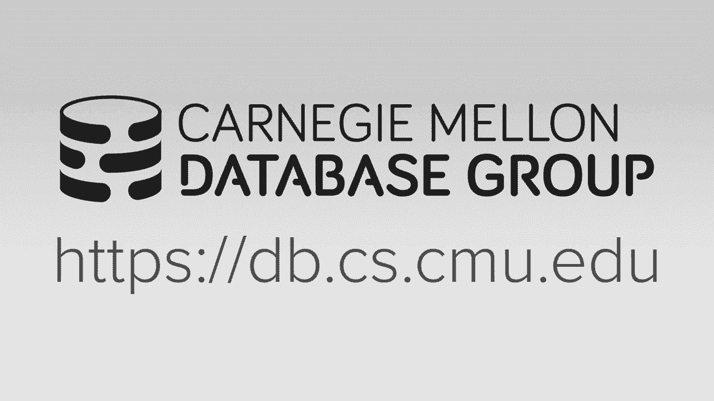
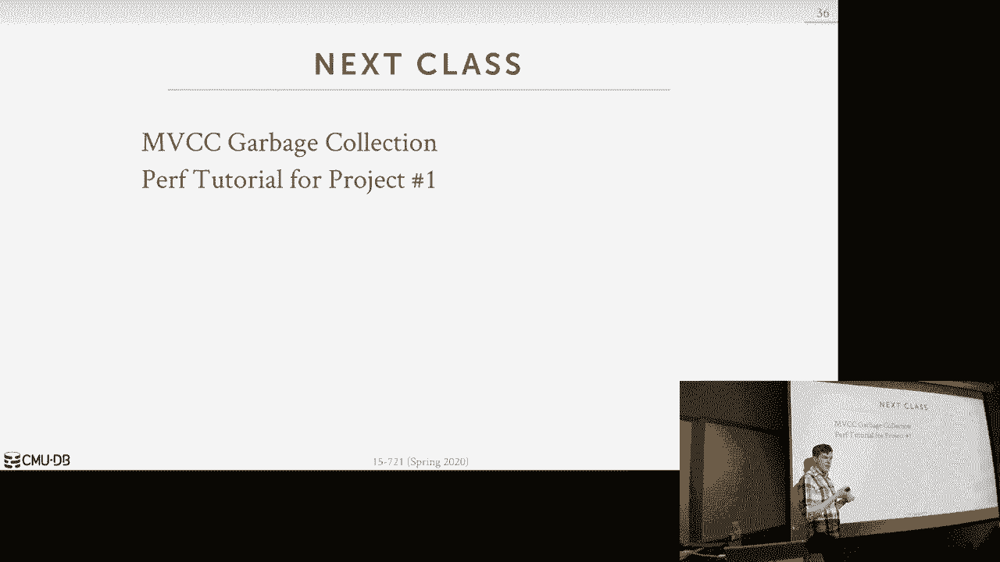

# 数据库系统进阶：P4：多版本并发控制 2 [协议] 🧠

在本节课中，我们将深入学习现代多版本并发控制（MVCC）系统的具体实现。我们将以Microsoft Hekaton系统作为基线，探讨其核心设计，并分析其他系统（如Hyper、SAP HANA和Cicada）如何在其基础上进行优化和改进，以应对不同的工作负载挑战。

## 概述

上一节我们介绍了构建MVCC数据库系统时的四大核心设计决策。本节中，我们将深入探讨这些决策在真实世界系统中的具体实现，特别是并发控制协议本身。我们将首先详细分析Hekaton的设计，然后以此为基础，理解其他系统如何通过不同的优化策略来提升性能。

## Hekaton：现代内存MVCC系统的基线 🏁

Hekaton是微软在2011-2012年推出的首个现代内存MVCC系统，旨在为SQL Server生态系统构建一个新的OLTP引擎。其设计核心是使用时间戳来确定事务顺序和版本可见性。

### 时间戳与版本管理

与上一节讨论的基于时间戳排序的MVCC不同，Hekaton中的事务将拥有两个时间戳：一个开始时间戳和一个提交时间戳。每个数据版本也包含两个时间戳：`begin-ts`（创建该版本的事务的开始时间戳）和 `end-ts`。

*   **`begin-ts`**：代表创建该版本的事务的开始时间戳（或提交时间戳，如果事务已提交）。
*   **`end-ts`**：代表**下一个**版本（使其失效的版本）的 `begin-ts`。如果这是最新版本，则 `end-ts` 为无穷大（`INF`）。

**关键机制**：当一个新版本被创建时，其 `begin-ts` 被设置为创建事务的开始时间戳，并将最高有效位设为1，以标记该版本来自一个**未提交**的事务。当事务提交后，系统会回溯并将该版本的 `begin-ts` 更新为实际的提交时间戳（同时将标记位清零）。

### 事务生命周期与全局状态映射

Hekaton维护一个**全局哈希映射**，用于追踪系统中每个事务的当前状态（活跃、验证中、已提交、已终止）。这对于实现**可重复读**隔离级别至关重要。

事务的生命周期如下：
1.  **开始**：获取开始时间戳，状态设为“活跃”。
2.  **执行**：进行读写操作，并记录读集、扫描集和写集。
3.  **预提交**：应用请求提交，获取提交时间戳，进入验证阶段。
4.  **验证**：检查读写冲突和幻读，确保可序列化。
5.  **日志写入**：将重做日志记录写入内存缓冲区（仅在提交时刷盘）。
6.  **提交**：状态设为“已提交”，并更新所有由本事务创建的版本的 `begin-ts` 和 `end-ts`。
7.  **终止**：状态设为“已终止”，稍后被垃圾回收。

### 可序列化验证

为了实现可序列化隔离级别，Hekaton在验证阶段需要检查**幻读**。这是通过重新执行事务中的扫描操作（使用记录的**扫描集**，即查询的WHERE子句），并检查是否得到与最初相同的结果来实现的。如果结果不同，则存在幻读，事务必须中止。

### 设计要点与瓶颈

Hekaton的设计遵循了几个关键原则，例如尽可能使用无锁数据结构。然而，它也暴露出一些潜在的瓶颈，特别是在处理非OLTP工作负载时：

1.  **验证开销大**：如果事务访问大量数据（如分析查询），重新执行扫描的验证成本会非常高。
2.  **版本链遍历效率低**：采用**仅追加、从旧到新**的版本存储，对于需要扫描整个表的OLAP查询不友好，因为需要遍历可能很长的版本链才能找到可见版本，导致缓存局部性差和分支预测失败。
3.  **冲突检测粒度粗**：仅通过版本指针的存在来判断读写冲突，可能导致不必要的级联中止。

## Hyper：面向混合负载的优化 🚀

Hyper系统由慕尼黑工业大学开发，是一个内存列式存储数据库，采用**从新到旧**的增量记录版本化。它针对Hekaton的瓶颈进行了多项优化。

### 增量存储与版本向量

Hyper在数据块中为每行维护一个**版本向量**，指向一个按线程/事务分配的**增量存储区**。更新时，将旧值复制到增量区，并更新版本向量指针。这种方式减少了全局争用，因为增量区是线程本地的。

### 精确锁（Precision Locking）

为了解决幻读检查的昂贵开销，Hyper采用了“精确锁”技术。这是一种近似的谓词锁。在验证时，它不重新执行整个扫描，而是检查在事务开始后提交的其他事务的**重做日志记录**。通过将这些记录中修改的值代入本事务查询的WHERE子句，判断如果这些修改在事务开始时已提交，是否会影响查询结果。如果会，则存在冲突，需要中止。这种方法避免了重新扫描大量数据。

### 版本概要（Version Synopsis）

为了优化OLAP扫描，Hyper引入了**版本概要**。它是一个数据结构，用于记录数据块中哪些行范围**没有**需要检查的旧版本。扫描时，对于不在版本概要范围内的行，可以直接读取主数据，而无需检查版本向量，从而大大提升了扫描速度。

## SAP HANA：混合存储与时间旅行 🗃️

SAP HANA是一个支持事务和分析的混合系统，采用**从新到旧**的“时间旅行”存储，并融合了行存储和列存储。

### 混合存储布局

HANA将最旧的版本保存在列式主表中（利于分析扫描），而将较新的版本保存在行式的时间旅行存储中。主表中的每一行都有一个标志位，指示是否有更新的版本需要去时间旅行存储中查找。时间旅行存储使用哈希表来快速定位版本链的头部（最新版本）。

### 集中式元数据管理

与Hekaton和Hyper在每个版本中存储时间戳不同，HANA将时间戳信息集中存储在一个**辅助元数据对象**中。每个版本只包含一个指向该元数据对象的指针。这样，当事务提交需要更新多个版本的时间戳时，只需更新这一个元数据对象即可，提高了更新效率，但增加了一层间接访问。

## Cicada：针对高争用的优化 ⚡

Cicada是CMU开发的一个MVCC系统，专注于解决高争用场景下的性能问题，并引入了几项创新优化。

### 尽力内联（Best-Effort Inlining）

为了减少版本链指针追逐带来的缓存不命中，Cicada在版本指针旁预留了一块固定大小的空间，用于**内联**存储最新的版本数据。这样，在许多情况下，读取最新版本无需跳转到其他内存地址。

### 快速验证技术

Cicada提出了三种技术来加速验证阶段，减少无用功：
1.  **内容感知验证**：维护一个热点数据记录，在验证时优先检查最可能引发冲突的数据。
2.  **早期一致性检查**：在事务执行过程中（而非仅在提交时）就提前进行潜在的冲突检查，以便尽早中止注定失败的事务。
3.  **增量版本搜索**：在读取某个旧版本后，在主版本中记录一个“快捷方式”指针，指向该旧版本的位置，后续读取可直接跳转。

### 索引即数据（Indexes as Data）

Cicada一个非常有趣的思路是将B+树索引的节点也作为普通的元组（数据块）存储在表中。这样，对索引的访问和更新也可以通过MVCC机制来管理，理论上可以免费获得对索引操作的可序列化保证，无需额外的幻读检查。这是一个激进但富有潜力的设计。

## 总结

本节课中，我们一起深入探讨了多种现代MVCC系统的实现细节。

*   我们从**Hekaton**开始，学习了其基于时间戳的版本管理、全局状态映射和基于重新执行扫描的可序列化验证机制，同时也认识到它在处理分析查询和粗粒度冲突检测上的局限。
*   接着，我们看到了**Hyper**如何通过增量存储、精确锁和版本概要来优化混合工作负载，特别是大幅降低了OLAP扫描的开销。
*   **SAP HANA**展示了混合存储布局和集中式元数据管理如何服务于同时需要行式点查和列式扫描的复杂企业应用。
*   最后，**Cicada**针对高争用OLTP场景，提出了尽力内联、多种快速验证技术以及“索引即数据”等创新思路，以提升在高竞争环境下的吞吐量。

这些系统的演变表明，MVCC的实现并非一成不变，需要根据目标工作负载（OLTP、OLAP或HTAP）在存储布局、版本管理、冲突检测和验证机制上进行精心设计和权衡。理解这些设计决策及其背后的权衡，是构建高性能数据库系统的关键。