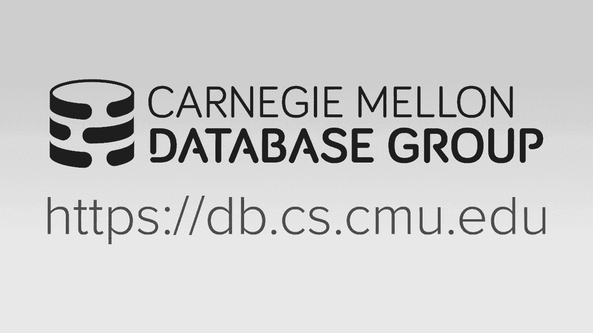
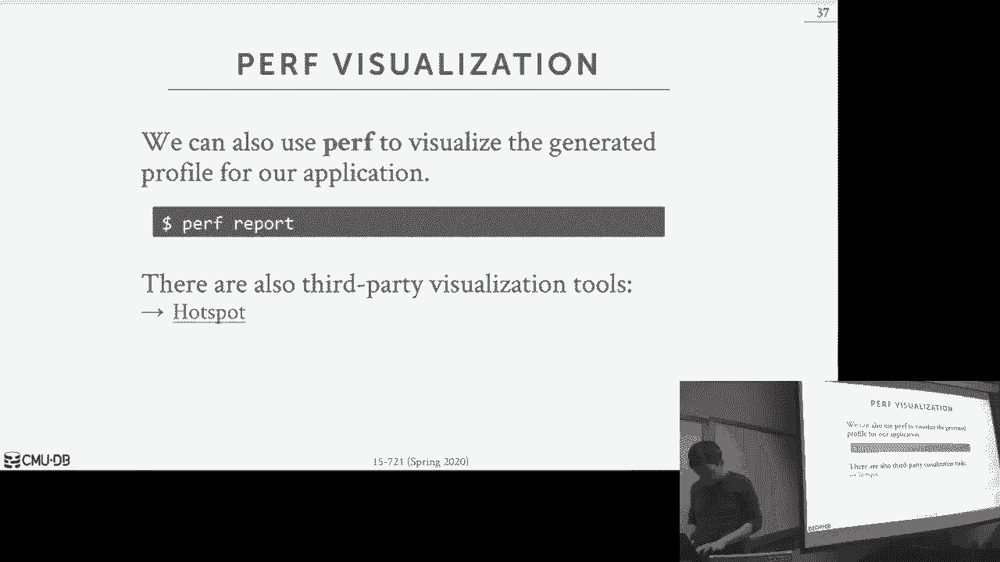
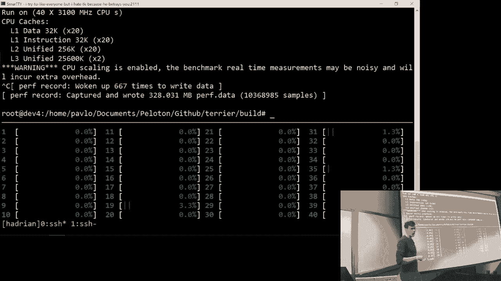
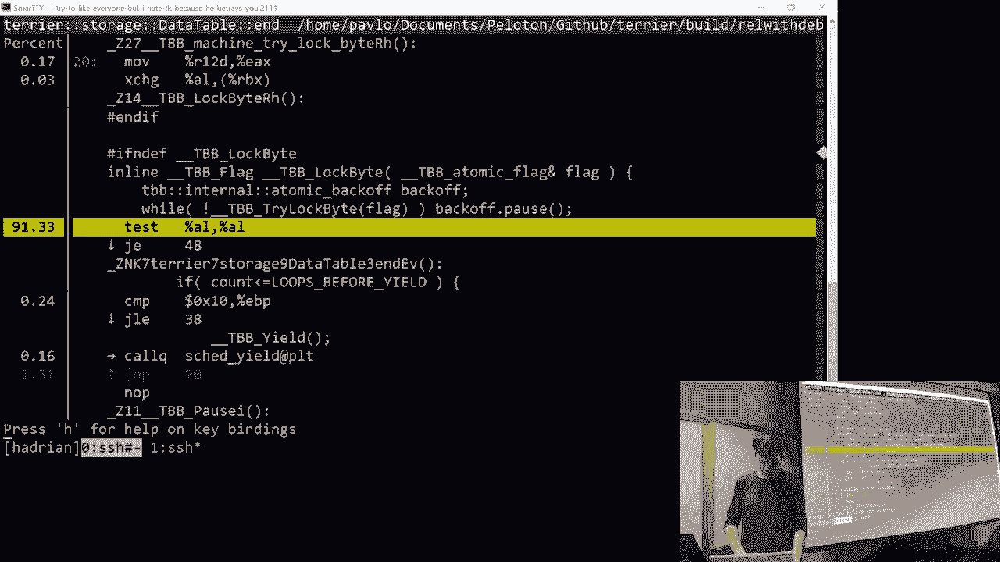
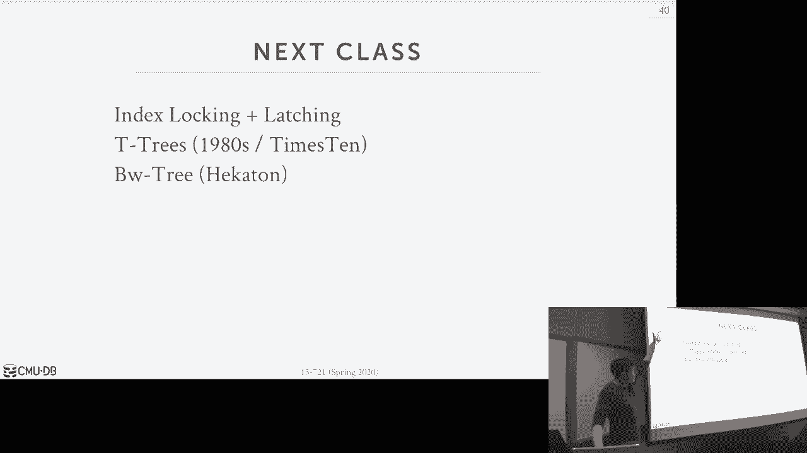

# 【双语字幕+资料下载】CMU 15-721 ｜ 数据库系统进阶(2020·完整版) - P5：L5- 多版本并发控制 3 [垃圾收集] - ShowMeAI - BV1wv411w7Ko

[Applause]，[Music]。

[Applause]，[Music]，this will be the the the last lecture，we're gonna do on on multi version。

control and again today we're gonna，focus on garbage questions because。

that's super important for an NBC，database system so we've sort of out。

recovered this in the last two lectures，but let's go into the Mojo detail what's。

what's actually what's going on so the，reason why obviously we need to do。

garbage collection in an MVC system is，because we have to identify physical。

versions that are reclaim Abul and then，remove them right because otherwise。

we'll just run out of space I think I，said in the beginning that with time。

travel queries Postgres when I first got，my first words created in 1980s they。

didn't do any garbage collection at all，because they said we wanted to support。

time travel queries I mean you can go do，queries on status to the database as。

they were back in time and of course in，the 1990s when people actually really。

started using Postgres also had academia，the first thing they did was add back。

garbage collection because you run out，of space pretty quickly if you have a。

lot of churn in your database so so it's，sort of obvious why we need to do this。

so our definition of a plain Bowl is，going to be a physical version where。

there's no active transaction that's，running in the system that can see that。

particular physical version meaning it's，not visible to that transaction under。

snapshot isolation or obviously if the，version was created by de Borda。

transaction we don't want that sitting，around forever and we want to go ahead。

and clean that up right so the great，thing about multi version control。

because we're recording those timestamps，in order to provide snaps to isolation。

that we can just use all those same，timestamps to determine when when tuples。

are actually visible or not alright and，the idea here is that the the time。

stands for using to assign transactions，to understand they're the global。

ordering is the same timestamp so user，to turn you know in in Martin versions。

or the lifetime of of physical versions，and we just say all right if nobody can。

see this then we go want to go ahead，and remove it right so one thing we need。

to talk about though is and what was in，the paper you guys read from the hyper。

team is this notion that like the，complications that are on arise if you。

now start having transactions or queries，that run for a long time again member I。

said in OLTP environment the，transactions are almost always，short-lived right update and E's account。

on Amazon commit that transaction and，you're done right and so in that world。

updating those versions the transactions，that need to made it read those old。

versions they're they're not you know，they're not sitting around for a long。

time so it's not like there's a，long-running transaction that needs to。

see the version of the database as it，exists at an hour ago in a parallel to。

the environment we don't have that issue，but now it's when we start throwing in。

the analytic workloads and litical，queries then then we have to care about。

this right he's gonna understand an，isolation I need to see only the。

versions of the the tuples that existed，by they were created by transactions。

that committed before I started so if I，microwaves gonna take an hour then I。

need to see the snapshot of the database，as it existed for that entire hour now I。

can run under lower isolation levels，like read uncommitted the entry whatever。

I want who cares but if you want to，provide snåsa isolation then you need to。

do this all right so again the issues，gonna be what we talked about in the。

first lecture about what to call，traditional grabbers question that was。

like all right I look at my timestamp，and of all my active transactions and if。

anybody if any version is less than the，smallest active transaction time stamp。

then I know I know and go ahead and，prune it but now if I had these queries。

that are sitting around for an hour then，that's gonna be you know that's gonna be。

Yeah right covered each tap in the in，the intro class，so the lhp and overlap and in the in the。

2000s people basically figured out oh，you actually want to have specialized。

systems for each of these and then you，can run your OTP queries in this。

database and your OLAP queries in this，database and that way they have。

different design choices as different，goals and you can build a system that's。

optimized for both of them this age tap，stuff is a bit newer concept hybrid。

transactional analytical processing and，the idea here is that I want to be able。

to run analytical queries as soon as，data arrives so instead of waiting for。

me to use some kind of ETL process to，offload it from the the OTP side into。

another database system I'm gonna run it，on as immediately as it shows up so that。

that's a more common thing now right，because the longer it takes for me to go。

figure out like if you're playing a game，and I want to you know trick you to buy。

crap if I have to run it and let it to，my back-end machine and it takes a long。

time for that data gets transferred over，then I may lose out on the sale yeah so。

his he has a perfectly good statement is，like alright well for these analytical。

queries do we really need to run under，snapshot isolation coming just run at a，enough。

in many cases yes and so this is sort of，a this is sort of a have a service um a。

perception in academia that is actually，slightly different all right actually。

it's quite different than what actually，happens in the real world so in the。

academic world will you say oh of course，you want to run a serializable isolation。

or snapshot isolation but then in the，real world most people run it like read。

committed cuz that's the default you get，in Postgres in my sequel alright so yes。

there are there are some cases where yes，you do want synapse isolation you want。

sterilizable queries for this analytical，stuff most the time you don't need this。

but even then like it does occur enough，that we had to solve the problem all。

right yeah we did a survey of DBAs two，three years ago and we basically said。

look like 50 there 60 percent of all the，papers in Sigma novio DB they assume。

transactions run at serializable，isolation but then you ask real DBA is，in like like 10 percent。

transactions run at sterilized isolation，everybody runs re committed cuz that's。

the default you get in in in real，database systems and those who don't。

bother to change it unless you know what，you're doing so I say that sample。

actuation is bearable you would actually，want to have for analytics you probably。

almost never want to have like，sense，exceptions good enough okay actually it。

doesn't make sense if it snaps at，insulation then I see everything as。

committed that's I can't have any，as well，so yes I'm simulation is like the。

highest we'd ever want to go yeah okay，all right so I sort of already covered。

this but what are the problems of having，these old versions again assuming we。

want to achieve samsa isolation for our，analytic queries or obviously we are。

increasing our memory usage because now，we're creating new versions and our。

version chains are getting longer but we，can't reclaim that memory so that。

they're the amount of storage space that，our David says is is consuming or using。

just keeps growing and growing，infinitely right but now that also means。

that if we have to know if we can't，reuse the memory that from older。

versions because we can't recycle the，the space now we're going to go back to。

reallocator and potentially go back to，the operating system through malloc and。

ask for more memory and that call is not，cheap and is not free like going to。

malloc and asking for my memory is，definitely become a bottleneck if you。

have a lot of threads doing this at the，same time our verge of changing to be it。

longer again that means for transactions，that have to traverse the Virgin chain。

to find the right version that they want，that I'm never going to take me longer。

now if you're doing news to oldest and，most your OTP transactions are just。

touching the newest version right this，is not that big of a deal for the。

analytic queries yes they have to，traverse the whole chain but maybe find。

the right version the only system that I，know that does oldest to newest is is。

Hecate on so they would have this，problem but if you if you notice a。

notice then it's a long traversal to put，the new one at the m that's only a。

problem Hecate on but for analytical，queries it takes longer for them to find。

the right versions they want，another big issue which we haven't，really talked about so much is this。

notion of having consistent performance，and stability in in your database system。

in terms of performance if now you have，like these long-running queries for an。

hour and then the hour the queries done，and now I need to go back and clean up。

all the old versions that are finally，finally reclaim Abul we're now gonna。

have this huge spike in the CPU usage，for your garbage collection threads。

because they're gonna say oh look at all，these versions I can go clean up let me。

rip through that and and you know start，throwing them away and now queries that。

are running the same time they might not，have a dip in performance because now。

there's contention on the CPU for，resources because because you're doing。

garbage collection all right so again，like a lot of times in in the real world。

a lot of companies or organizations，they're they're very conservative with。

taking one news new technology for，databases because they want to have。

consistent performance it doesn't help，you to say like alright here's the。

latest greatest version of a new，database system and it's gonna make 95%。

of my queries go go much faster but then，the 5% I'm gonna be like randomly slow。

people aren't going to want that they'll，stick with the old stuff that they。

actually know all right and the last one，is gonna be an issue when we start doing。

we talk more about cache locality and，other things so I'm compression so if I。

now have all these old versions，scattered around in my my tablespace。

then when I start doing if I'm doing，this the garbage section all at once now。

I have a bunch of holes in my in my，table that I can refill with other other。

objects but when I want to do，compression I want to basically get a。

bunch of old data and compress it down，because it's it's read-only if my all。

the virgins are sort of scattered around，because I can't keep reusing the same。

space over and over again then I lose，this locality and I have to do a bunch。

of extra work to combine together，objects that are related to each other。

within time and that way they can be，compressed this won't make sense right。

now I'll cover this event at the end of，election okay all right so for today I。

want to spend a little time at beginning，to talk about we talked about the issue。

about delete so this is something we，didn't cover，in the last few lectures I should have。

but it's it's in here now and then we'll，focus on the different design decisions。

you have for garbage collection which，was in the hyper paper you guys read and。

then what's a rock block compaction，which is the thing I was saying about。

combining together unused space across，the the data tables in order to you know。

compactor will combine them together and，forget memory and then I'm missing the。

the bullet point here but I'll finish，off and doing a tutorial on perf which。

is what you need to do for project one，okay alright so we've talked about it。

doing inserts or talked about doing，updates we didn't really talk about how。

to do deletes so in such your easy right，it's it's the first physical version of。

a tuple I find a free slot in my in my，night data table and I just insert it。

right no big deal and then updates we，already know that a handle right。

depending on what version scheme are，using right whether we do Delta records。

would be pen only whether do you know，what direction the version chain is we。

know how to handle that deletes a little，bit tricky now because you need to。

basically record now that this this fist，of this logical tuple has been deleted。

and that even though someone may come，along and insert that same tuple all。

over again that's technically now in，another snapshot and you don't want to。

reuse the Virgin chain and so basically，you need a way to record to say all。

right well this thing is now deleted no，other version ship should come behind it。

right so again we can't have any right，right complex this is only the first。

writer wins so if my transaction deletes，this tuple before I could before I。

commit you try to update it I'll beat，you so we need to have the same sort of。

correct correctness semantics as before，right so the question is now how are we。

actually going to record that our tuple，was logically deleted at some point in。

time because we can't delete the version，chain because that's you know then the。

existence is gone right so there's two，basic approaches to do this the one is。

you maintain a separate flag somewhere，that says that this logical tuple has。

been deleted and so you can either just，store this now in like the tuple header。

that we talked about before we record，a，per column that's just a bitmap field。

that says the the tuple within our block，at this all set has been deleted so that。

means now when I start scanning or my，transaction starts reading the database。

I always have to check this thing first，to see whether it's actually you know。

whether I'm going down a path that，that's it's not believe it or not。

alright so in our system we store it as，a separate column that's a separate。

bitmap field all right the other，approach is to do a tombstone tuple and。

the idea here is that we store a new，physical version a special physical。

version at the end of the version chain，or at beginning the end depending what。

direction we're doing and then the，somehow to indicate in that in this。

special version that it's representing，that this tuple was deleted and then。

that per to destroy all the time stamps，and everything you would do before and。

that gives you no information about say，when this when this tuple was actually。

deleted so anybody that comes prior to，that and earlier snapshot please still。

see the older versions so one way to，sort of improve this and make make this。

work nicely instead of having sort of，polluting all of the extended wasting。

space in their fixed data pool you could，have a separate data pool to store these。

two Serna to blows because you don't，actually need to restore the whole tuple。

and then the version chain now this，points points to this thing and you。

would look and say oh with this bit set，there's some bit pattern inside it says。

oh this is actually tombstones tuple not，a regular tube wall this is only really。

the issue if you're doing append only，alright so again think about this if I。

am doing a pendulum and I have a，thousand columns if I delete that tuple。

and I want to create a tombstone to pool，well one approach is I now make a。

special tuple in my same table with all，my other tuples for that table that has。

a thousand attributes so that's wasted，space just a record that that thing was。

actually deleted or it can have a marker，that says hey you know or have a special。

tuple space to say this represents a，deleted tuple and that means shared。

across different tables because we're，not storing any attributes in the。

tombstone and tuple we're just it's a，marker to say this thing was deleted。

so in peloton in our I would say not but，loved but whatever the old system we。

killed we did it this way，and we would use this special pool。

because we were doing a pen only licking，Hecate on and therefore if we now create。

a tombstone to pool if we put it in the，same data table would be a big waste of。

space and the newer system we use we use，this question is why doesn't there need。

to be a Oh starting different to sent，ripples for deleted tuples or for。

different tables okay is if I delete，three tuples from the same table why do。

I need a separate room center table for，each of them because in the tombstone to。

boil you're recording the begin and end，time stamp because I need to know when。

was this thing delete it now yeah I，think your other question too was well。

why do I need to have why can I have as，why can I have a same tombstone table。

special table that can be shared across，multiple data tables because we are not。

storing any attributes in the tombstone，the tombstone just says hey you're dead。

at this time so it doesn't matter what，table it corresponds to but you need you。

know the timestamp back on that yeah，I think I think I think part of the。

issue is gonna be that first rider would，win so who cares your market is leading。

there might be some ordering issue of，like can I record that's been deleted。

and then I stop to go yeah if I do that，then if my transaction that deleted that。

tuple aborts then I gotta go make sure I，go back and remove that if I don't。

modify the previous tuple other than，maybe the pointer then when I when I。

when I bought I stopped update the，pointer yeah you might be able get away。

with something like that I have to think，about that oh yeah if it was it was the。

student that built this piece of the，system it's not that he liked to cut。

corners but he basically did everything，in the most efficient way but possible。

which is always not the best engineering，approach so if there's a way to make，you're proposing。

I suspect you would have done it but we，can take it offline maybe do on the。

board and figure out why that would，would not work okay again so again for。

this one I don't think anybody does this，other than us because if you're doing。

Delta store and if it doesn't store，would do the same thing but he was doing。

newest to oldest with a delta store then，this doesn't buy you anything because。

you do store in the in the the header，for that tube other things been deleted。

yes but that was his state question is，like what about his update the end。

timestamp would that be enough to denote，that it was deleted I start to have a。

flag somewhere that said the thing was，deleted right but he it's it you need it。

end timestamp to represent that there，was a special delete like maybe put you。

take the first bit and had that，represent it was deleted you can do that。

the I just put an end timestamp in there，I don't know whether that's a delete or。

not or whether it's actually a new，yeah yeah okay alright so alright let's。

now talk about different design，decisions so I wanted this part wasn't。

in the paper but I want to talk about，how we actually do clean up keys from。

indexes and then the there's only really，two papers on garbage collection for。

MVCC systems I had you read the guy's，the one from hyper which actually just。

came out a few months ago there's，another paper from 2016 that I had the。

students read last year from the SA P，team they're not but they're they're。

both okay papers the what I don't like，is that they sort of define the same。

define the same concepts but using，different terms like I think like the。

hyper guys calls things like precision，and frequency but they you know these。

guys called like identification and，things like that like so the concepts at。

a high level are the same just the the，the nomenclature they're using to。

describe these things will be slightly，different so I'm a mix up as we go along。

some bit some Hana the hotter paper and，the hyper paper but hopefully it should。

all sort of make sense so let's talk，about how we're gonna track versions the。

frequency which we invoke the carbon，Scotch and the granularity we're going。

to look at potential versions we can，remove and had a compare of whether it's。

okay to put in them or not okay all，right so four indexes again what's gonna。

happen is that as my transaction runs，and I'm creating new you know I'm。

creating new tuples and putting new，versions I have to store that in an。

index because now if I try to go back，and read that same thing that I just。

wrote I want to be able to go through，the index and see my own rights if。

you're doing OCC was a private workspace，you don't do this cuz you staged all the。

rights at the end but the what we've，been talking about is doing the。

timestamp ordering approach where you，apply the rights in that in that global。

space because that allows you to do，spected reads for other transactions。

that are ahead of you in in sort of，logical time so now the problems going。

to be is that if i need to abort or if i，need to go clean up versions i need to。

make sure that i remove any keys that，correspond to older versions that that I，need to remove right。

so the way any basically do this is that，wall transactions running and it's。

updating the indexes we just need to，record you know what keys did we insert。

or do we do ease to be invalidate from，our index because we're making changes。

and then when we go to commit or a，border transaction we have to have the。

garbage collector kick in and say，alright well let me go clean up the let。

me go clean up the the the indexes，because these are things that people。

shouldn't see right so the way hyper got，around this was anytime you would you。

modify an attribute that's indexed then，you treat that as a delete followed by。

an insert for that for that transaction，because then you don't have to worry。

about going and finding the key and，updating the pointer right you just say。

this here's the old version from the key，and the index you remove it they let me。

insert a new one so we did not do this，in in peloton we did something really。

really stupid like we're totally stupid，I don't know why this is one of those。

things were like the student did it this，way because it because it looked like it。

made performance go better for our，benchmarks and it wasn't till with like。

later on we're like oh we gotta go，modify this to could fix some things。

like oh my gosh they did something bad，we shouldn't have done this right so。

here's what we did in Palestine so again，we were doing append only oldest to。

newest that true yes and what would，happen is if I have a transaction comes。

along and say they update a right and we，set this key now to 22 well I would do。

an append only a pendant new to point to，my tablespace but then I would add a new。

entry in my index to say for for key 20，- 2 - here's the version of it so even。

though logically they're the same tuple，from the indexes perspective they look，like separate things。

alright so then we got into trouble was，way if you try to update the same key。

again on the same tuple instead of，making a new entry in the index we would。

actually go and overwrite the the，previous version that we created so in。

this case here I would replace 2 - 2，with now 33 our 3 3 3 and then now I。

would also have update my index and，point to it as well and I kept doing。

this every single time I did an update，right so this that's it two four four。

and I have an update entry to point two，here so now the problem is when we go。

ahead and and how to abort this，transaction we had no idea what was the，other you know 2：00 to 2：

30 3：00 that we，inserted and so we could go delete 4 4 4，because we know this is the version we。

need to clean up because that's what，we're seeing in you know you know dirty。

table space or dirty dirty tuple list，for our transaction but we had no idea。

that we've left there's other keys，inside here so we would run this for a。

while run some benchmarks and all sudden，you'd get it was a unique index you。

would get back an error and say that a，key already existed even though the。

digits in the table because we were，leaking these keys from you know from。

aborted transactions so you know this is，embarrassing this is stupid you know。

this is not really anything specific，about you know paper you guys read this。

is just showing that like it's hard to，get these things right even if you have。

the best intentions and just not keeping，track of all the keys that you updated。

as you know or all the case you you，modify in the index as you're going。

along can end up end up losing things so，again we don't do this anymore。

this is good ok so let's talk about now，how we're actually going to keep find a。

keep track of the versions that，transactions are gonna create there's a。

typo here sorry so the the first，approach we sort of talked about we，lecture。

MVCC right this is where we just have，some mechanism where a transaction。

threads or a separate garbage touchin，thread can go through our tables and。

identify versions that we need to prune，up right the background vacuuming was it。

was a separate thread the proper，cleaning technique was where the。

transactions or the queries as they were，running if they noticed they had a。

version that was not visible to any，transaction then they would go ahead and。

clean that so hackathon did this because，they were doing oldest to newest so as。

transactions ran and had to traverse the，virgin chain to get to the newest。

version along the way they would see a，bunch of old versions that they knew。

were reclaim a bowl and they'd go ahead，and remove them，there all right the transaction level。

approach is what we used to do in，peloton and this is where transactions。

would keep track of all the versions，that they created and then when they。

commit they handed off this information，to the garbage collector who then had a。

view on what transactions are running，what are their time stamps okay and。

excuse me and they can identify which，which you know which versions that were。

invalidated by these transactions are，now are now printable the last approach。

is an epoch based approach and this is，basically the same thing as transaction。

level the idea here is you're gonna ask，you a bunch of transactions and and not。

as a batch meeting all exact same time，but you put them under this the same。

epoch and this will make well we'll see，this again on Monday when we talk about。

the beta retreat but basically it's like，this other counter that's always going。

for at a time and we would know that，when we go from one epoch to the next we。

would know whether there's any，transactions that could still be seeing。

something in the previous epoch and then，if not then we know that anything that。

was that was invalidated in that epoch，can be reclaimed well seem again this。

more we'll see more about seed this，approach or technique used in the the。

beat of a tree on Monday when you read，that paper all right so let's had to be。

the verge of tracking at the transaction，level again so my transaction comes。

along it's time Sam 10 I'll do an update，on a I create a new version right and。

then now because I know that I had this，was the the version that the latest。

version that I saw and then I created my，new version so therefore I know for this。

transaction a 2 is now potentially，reclaim below so if my transaction。

commits then I know I can go ahead and，clean up a two sides record that in my。

transaction local space for my old，versions and this is just a pointer to。

this location here and this can work，these pointers can use these pointers。

because we're not gonna end up we're not，moving this thing around right we're not。

doing compaction where we can be moving，it from one block to nuts we just say。

that this thing has to stay there now I，do a an update on B same thing I had the。

old version that I know that I created I，create my new version after the previous。

old version I update that now in my old，version list then when my transaction，goes ahead and commit。

I just pass this information along to，the garbage collector we then look at。

and say well the commit time stamp for，this is 15 so I know for these versions。

here anybody that's less than 15 its，highest time stamp less than 15 should。

be able to see them right so if now，there is no transaction that has a time。

stamp less than 15 but I know that these，versions are removable，I say this is called I think the the。

low-water mark of high-water mark in the，paper basically IDs need to know for for。

these tuples what's the lowest time，stamp I could have where someone could。

actually still see this so if no，transaction has something below that。

this question is if I have another，transaction that's running that has a。

begin time stamp of what you can't cuz，this guy already has ten so nine okay so。

he comes along and he's gonna read a he，would read this one right because nine。

is it isn't in between 1 and 15 right so，yeah he read a - you know so again the。

garbage doctor knows like it knows what，other it has you have to know what。

transactions are running so in the hypo，favorite they talk about how the hell is。

this linked list that's sort of my，transaction ID and you can just look at。

the head or a depend what order is to，find out what the lowest one is that's。

like that's both the low-water mark or，the high more depending what you're。

looking at and the idea is that I know，which ones actually running so if。

there's a transaction that's running，with timestamp 9 then 9 is less than 15。

so therefore it could potentially still，read these things and therefore I can't。

reclaim them it may never read B but I，don't know that because I don't know。

what the transaction is actually going，to do so I have to be conservative and。

correct like and again you could use the，the sorted linked list that the hyper。

does you could just record a single，value there are different ways I did it，okay。

so the next question is how often are we，going to invoke the garbage collector。

and again is this trade-off between if，we're very aggressive in our garbage。

collection then yes we can go free up，space as quickly as possible assuming。

there's not transactions that are you，know sitting around the long time stamps。

but the issue is going to be will，reclaim space more quickly but now we，could be end up slowing down。

transactions because now the garbage，collection threads if it's running in a。

background set up they start using CPU，and that's gonna eat up cycles and make。

your queries and transactions run slower，and obviously if we're - we're less。

aggressive and run this and - and，frequently and now we're gonna have the。

size the database is gonna get larger，because we're not reclaiming versions as。

quickly as we maybe should the Virgin，chains could potentially get longer and。

that means that it takes longer for，queries to go find the exact version。

that they want so if the delicate，balance between the two of these I。

actually think the hyper approach is the，better one then the background garbage。

collection so again so you run it，periodically you run it continuously。

this is what hyper does this is what we，do that's what no systems do so periodic。

eyes means that at some fixed interval，or within when some threshold was met。

like if I have if I know I have 20% of，my memories being used by on ivory。

claimable versions somehow I could，compute this then I kick off the garbage。

clutter and go find things right sort of，the JVM sort of does a similar thing。

look when you get you to your heap size，when it gets by a certain percentage。

then it kicks off so this is just saying，that right again I'd run it in the。

background thread and running it every，so often and for some systems like in。

hackaton they can identify that if my，load or my churn rate for my versions is。

really high then I can make this I can，run this more frequently the the the。

hyper poach is that run is continuously，where the the garbage collection。

procedures are just a part of the normal，transaction processing or query。

execution steps right so in hyper they，did it own commit so any time a。

transaction committed then they would，have that thread go through and see well。

what can i reclaim what can i clean mop，cleanup，the the steam version in the in the。

newer version of hyper this is doing，quick turn pretty oxygen so I call this。

the same thing as cooperative query，execution part of cooperative cleaning。

the wait saying wait hackathon does，where just add I'm running my queries if。

I see things that I need to clean up let，me go ahead and clean them up。

but because hyper is doing news to，oldest they don't have the dusty corner。

problem that hackathon has where you，could have versions that are never。

visited and they never get reclaimed，right if if you read it you'll see it。

and you can reclaim it so I think I，would like to do this although the way。

we're sort of our system is sort of set，up now our garbage collector is。

integrated with this other bits or，background cleanup process that does a。

bunch of other memory management things，so I don't think we can switch over to。

this I think we're stuck with this but，again I like this better because it's。

like alright well if I actually lot of，queries that do a lot of updates well。

it's sort of as they put it，self-regulating because I'm creating a。

lot of versions as I run queries those，queries will clean up the versions that。

that are claimed old and if queries run，slower because I have a lot of versions。

to reclaim well that's actually gonna，then end up slowing down the rate in。

which I create old versions so I like，that model all right so now the question。

is how we're going to organize in，internally the metadata for our garbage。

collector to determine whether we can go，ahead and reclaim things right again and。

now again there's more trade-offs，between whether we're gonna have sort of。

fine grain tracking information to say，here's a single version that can be。

claimed within this time stamp or，whether we can combine them together and。

just to have a time stamp across，multiple tuples and that can amortize。

the storage costs of the tracking，information for this in exchange for。

maybe not reclaiming things as fast as，they possibly could be so this is just。

anything I just said now right so single，version tracking would be for every。

single tuple I know what their version，is and what their timestamps are and。

then when the garbage car kicks off I，can make a decision at that point decide。

whether it's a it's okay - can we claim，stuff so you get this sort of for free。

if you're doing the continuous or，cooperative cleaning because as I scan，along and my。

to try to find the version I want then I，would end up cleaning things up as I。

find them and I'm already storing that，metadata anyway in the headers of the。

tuples or the other records so it's not，like I need to sort the stuff separately。

the group version is what I assured，before in that one example with the。

vacuum thread and the idea is here as I，say here's a bunch of tuples that were。

invalidated by a transaction at some，timestamp and so anything that less than。

that timestamp any transaction has a，timestamp less and this could still。

possibly see them otherwise they don't，alright，so again there's less overhead to track。

things but it may delay the time in，which we can reclaim something and get。

memory back so there's a third approach，that was in the Hana paper that you。

didn't you guys didn't read but I think，the the hyper paper mentioned this where。

you can actually do reclaim all the，versions from an entire table if you。

know that there's no transaction running，right now and that could ever access it。

so how does this work right because，remember I said here's one example like。

there was it could be another，transaction at timestamp nine could it。

read a it may read B but we don't know，because we don't know what queries that。

transaction is going to execute but in，some cases if you execute your。

transactions as prepared statements or，stored procedures then you know。

potentially what all possible queries it，could ever execute like a prepared。

statement is like a predefined function，that you can install in the database。

system say that runs some logic for，transaction like and I'll have。

invocations of queries so you can see，what all the queries are ahead of time。

not always but sometimes you can if，everything is predetermines actions in。

my system and if I know what queries，they could ever possibly execute then I。

know what tables they're tough though，they will touch and I see that they are。

that they're they can never touch a，particular table then I can go ahead and。

reclaim all the versions for that entire，table without doing any you know fine。

grained tracking in case a Hana they're，doing the time-travel storage so for a。

given table all the versions are sitting，around and another you know another。

tablespace so I did blow away that，entire time-travel storage space。

without having to do any you know any，examination of their time stamps it's。

basically doing like a drop table and，and creating it again which is super。

fast again this is this is this is a as，I said a special case or a corner case。

right if your transact if your，application is invoking a bunch of store。

procedures then then you can do this，most systems do not cannot do this。

though right and I don't think if you're，doing the Delta storage or the。

append-only storage where the versions，are mixed together with regular tuples。

or as Delta Records I don't think this，actually would work right this is sort。

of a special case for for Hana assays，heaven alright the last thing we talk。

about is how to determine whether，something is reclaimed right and ideally。

what we want here is that in order for，our system to be scalable then we want。

to be able to examine what are our，active transactions and what are the。

reclaim old versions we can deal with，and we want to do this what I haven't。

acquired any latches so this what I've，seen before in the hyper paper they。

maintain a latch free link list that I，can keep sort of pretty efficiently and。

I can use that to figure out what are my，current transactions so an important。

concept to understand too is that unlike，in when we're actually running the。

queries under snapshot isolation where，we can't have any false positives or。

false negatives right of missing data we，should actually see and somehow we miss。

it and for garbage collection we，actually can be a bit loosey goosey here。

and it's okay if we end up missing，something right so if my garbage specter。

runs and at that exact same moment，another thread commits a transaction。

with a bunch of tuples that are，reclaiming bunch of physical versions。

that are reclaimed well and if you know，if I end up missing at the carpet I。

should ended up missing that during its，path of the you know that current。

current invocation who cares because the，next time I run around then I'll then。

I'll be able to see it so we can use we，don't need to you know we don't need to。

have you know super tight protection，over the critical sections of where and。

we decide how to reclaim things it's，okay for us to maybe know something you。

know at least once and the second time，around we'll see it，so this is now is the important part of。

the the the one of the main，contributions of the hyper paper，although they did not invent this。

interval stuff it actually comes from，the from the Hana paper but it basically。

saying how are you going to determine，whether something is a claimant or not。

so for this one for the time stamp this，is what they call a traditional garbage。

collection in their paper this is just，gonna I know what the minimum time stamp。

is for all my active transactions and，therefore anything less than then that。

time stamp is not visible to any of，those active transactions and therefore。

I can go ahead and we claim that the，interval approach is that is will be a。

bit more bit more crafty and we can then，now look at ranges of time stamps and。

identify if there's vert partisan，version change that are not visible at。

all and instead of actually waiting for，to you know to take the oldest one out。

first and sort of prune it along in time，stamp order we can actually excise out。

that range that's not visible reconnect，the Virgin chain and things are things。

are perfectly fine because everybody can，see whatever you know what they're。

supposed to see so the tricky thing is，going to be is how do we identify these。

ranges and how do we do the solid ation，of our virgin chain to remove those。

invisible ranges so let's say now we，have a simple example like this we have。

transaction one he's gonna read a right，transaction to is going to update a high。

and so now we have an older version or a，one that we eventually think we're gonna。

remove is this guy who goes has and，commits which it does at twenty five so。

now we have another transaction comes，along updates 30 and then commits it 35。

it's not at this point here a two is，reclaim Abul because the only other。

transaction running is is the first guy，here he's at timestamp 10 so he can。

never see 25 or 35 he can't see this a3，either but under snaps isolation he's。

not he's not allowed to so we had this，guy here that we need to go ahead and。

remove so if we're doing the timestamp，comparison then our garbage collector。

can't remove a two because our high，watermark are that the low-water mark。

the lowest timestamp of inaccurate，and is 10 therefore 25 is greater than。

10 so we can't remove this but if we're，doing the interval based approach then。

we can't reclaim this because the，timestamp 10 does not intersect with the。

lifetime range of 25 and 35 for this，version 10 can never see this thing so。

we go ahead and remove this so for this，approach if you're doing the pen only。

storage this is easy to do because all I，have to do now is just update if I'm。

going oldest to newest I can just update，the pointer for a1 and now point it to a。

3 and then a 2 now is essentially，missing and I can go ahead and reclaim。

it and because everything I need to，reconstruct the tuple just say what you。

know what is the version of this tuple，at and Pickler timestamp it's contained。

in the tuple itself because again a pen，only has all the attributes this is now。

harder to do though if you're doing，deltal storage because you may not have。

all the attributes so let's look at，example here so say I have one tuple。

right that's a timestamp 60 and then I，have a long version chain like this so I。

have now my first transaction he's，running at timestamp 15 so again I need。

to see a versions of tuples as existed，from committed transactions at time stam。

time-stamped 15 or less so I can read a，10 down here my other guy here he's he's。

going to read anything above a 55 and，less so that means that this basic chunk。

of tuples here are potentially reclaimed，not 50 but all these other ones are here。

our reclaim a little but but now the，problem is because we're doing Delta。

storage some of these have touching，attribute - some of these are touching。

attribute one so when we do our，consolidation we sort of need to take a。

union and of these different Delta，records and only have the latest version。

or latest modification to a particular，attribute in our final compacted or。

consolidated Delta record right so in，this case here I update attribute to 3。

times 77 88 99 so when I create now my，consolidated version the latest version。

of attribute - is 99 and therefore I can，discard these other Delta。

here but this guy down here modified，attribute one so I need to know that in。

order to understand you know understand，order to recreate the version this tuple。

at timestamp 50 so I had to record that，in my record as well and then the。

timestamp I'm gonna sign for this，consolidated Delta record will be the。

max timestamp of what I consolidate，alright so again now if I could you know。

if I come along this guy wants to read，15 at times to 15 he can still get to a。

10 this guy wants to read a timestamp 55，he can still find this one and it will。

have all the information for all the，Delta Records that occurred after。

timestamp 50 here so now to install it，right well I have the point into that I。

just do a compare and swap on the，version vector to now update it here。

again first writer wins we're treating，this as this you know it's like an。

update but it's like an internal update，so if somebody else comes up this。

version vector why we're doing some，consolidation then we fail and have to。

restart but let's say again it succeeds，so now my my version vector points to。

this consolidated one and then I can，blow away the the rest of the version。

chain yes your question is do I require，that these rep these things are。

committed again under Delta storage，first writer wins the it's either this。

is always going to be the committed，version if the version vector is null or。

the latest committed version is the，first one everything else is already。

committed as well right so it's not like，this is like an in-flight transaction。

because nobody no one can create another，no two transactions can create Delta。

records on the same same logical tuple，because the first guy would be able to。

yeah question is how do I actually do，the union of do the consolidation of。

these Delta records so you would go back，in time he would say I know I have X。

number attributes and so I need to make，sure that when I do my pass as soon as I。

see sooner that I see all all the，attributes then I know that there's。

nothing else that I would care about，that comes after this and therefore that。

I you stop the process it because you，have to be able say these you follow the。

Virgin chain and say this is what I'm，gonna reclaim but you don't need to。

you're not up being the Delta record，with the new Dell record with that。

information so we did this as a class，project last year trying to member why。

it was tricky I think it's something in，the ordering of reclaiming verbal link。

data that makes this challenging because，you would have like this is showing the。

string embedded in the Delta record but，if it's a large string then it's a this。

is actually a pointer to the variable，length pool and I think we got into。

trouble of trying to get the order of，that correct but this would be something。

we could potentially explore again the，semester the it really you know if you。

sort of do this project，it would really force you to think，through like this verging information。

and what are all the corner cases but，this is obviously an over。

oversimplification of the of the problem，your question is for doing garbage。

question on Delta records do we have to，do this consolidation or cap action。

so how would you know action one - if，say I remove thread one right all I care。

about like if I know that nobody else，can read anything that comes after this。

then they're always gonna read the，version up here I'm only doing this。

consolidation because I know that this，guy here could read this I need to know。

what was the version that came after，that right if I don't event if I'm I。

don't need to do this interval，consolidation it's a it's a nice thing。

to have but you don't need it for，correctness right because without it。

although I without it I have to wait for，this guy to commit or B go away before I。

can then prune everything else yes yes，yes so his question is do I really need。

to consolidate this couldn't I just yep，remove these guys keep this one and。

would that be enough yeah that would，actually still work - it would need the。

morning no because I think it would what，are you saying is right so we're back。

here so instead of consolidating into，this new guy I keep this and I can。

remove these guys because those are，overwritten by this and all I do is now。

update this pointer now to this that，would work oh yeah so - yes when I when。

I scan I want to get back to see what，yeah I don't like the paper covers like。

even obviously to devise different，synthetic benchmarks to exercise your。

different update patterns I don't know，what real work was actually do you know。

say went one way is better than another，when we did this last year I think we。

created a new Delta record and then the，tricky thing was you create the new。

Delta record yeah the tricky thing is，yeah no matter this the issue was going。

to be this these things are sitting in，the the each of the tougher records are。

sitting in the in the thread-local，memory for the transactions that ran。

them but then now the problem is gonna，be and it would be normally only the。

thread would reclaim that memory but now，you have this consolidation thread in。

the background wants to be able reclaim，things and you have to like take latches。

on protect the memory space and it，actually made up things go slower I。

don't know the exact details of we have，notes to know for okay alright so the。

the next thing what the sort of finish，up with this discussion is in all these。

examples it's sort of obvious that yes，reclaiming memory is a good idea right。

we want to get you if it's we don't need，the data we should go ahead and free up。

the space but now the question is what，do we actually do with that memory we。

just freed up right because say I have a，I inserted billion tuples and then I。

delete a billion tuples what should，happen I should I give back the OS that。

the the memory for that 1 billion tuples，or should I give back some of it or just。

keep it all myself I think it's actually，want to be in in the middle right I。

think you'd want to keep some of it but，you do want to give some back right。

because I people would end up thinking，their system is broken if I sort of。

billion things and then delete a billion，things and the memory you should doesn't。

go down all right so for the very length，data data pool we can always just reuse。

the the memory spaces right because，we're essentially doing a bin packing。

problem to find you know for every，single move you actually need to store。

in a Berlin data pool we just find a，free slot and put it in there for the。

fixed link data start slots it's a bit，if we start reusing the slots for tuples。

you know as we need them as we claim，versions then that could end up causing。

us the sort of the the temporal aspect，of the temporal dimension all of our。

data is now sort of randomized so what I，mean at that so like say I have a I have。

an application where most of the time，people touch the latest data being like。

reddit or hacker news mostly will only，comment on the latest posts nobody goes。

back five months ago I don't think even，let you and tries to update know write a。

comment on a post when five months ago，so that means that now if if I am if I。

ignore the multi version and stuff if as，I create new tuples for all these。

comments on these articles the they're，approximately going to be located close。

to each other and had the same time，because say I'm inserting a new comment。

sort of going from chronologically，they're all gonna be related together or。

close together in the same amount of，time since when they were created right。

it's not like I'm gonna go try to insert，a comment from an article five months。

ago and now that's interspersed with，with articles from from today and so the。

reason why that matters is because in，ogv workloads the probability that your。

tuple is going to be updated is depends，on the sort of the last time there's。

access or when it was inserted so if my，my first version was inserted today the。

probability I'm gonna update it is，higher today than it will be five months。

from now because most the times you only，only update the the latest things so if。

now within my blocks of data if they're，all roughly around the same you know。

create at the same time write the，versions are created at the same time。

then I know they're gonna have the same，probability that they're going to be。

updated and therefore it potentially，invalidated and so therefore if I have。

data that's from five months ago all in，one block I can now compress it make it。

read only and not worry about having to，go uncompress it to update something and。

then rerun the compression scheme all，over again does that make sense。

like if data is located together they're，all create at the same time therefore。

it's all gonna be updated with the same，probability then I can use compression。

now to come to reduce the size of that，block of data，and not worry about having a rerun。

compression later on so you don't wanna，compress the newer things you want to。

press the older things because the older，things are gonna be read-only so this is。

sort of the two issues if I if I reuse，the slot anyway that I want as I create。

new versions and and we claim old，versions then in my physical layout of。

memory it's going to be randomized like，some stuff will be new some stuff will。

be old and now if I go to compress it if，there's some intermix with old new if I。

compress that block of data then the，there's something in there that could be。

updated and then I have to you know do，compression all over again so we lose。

that temporal locality we could just，leave leave it alone and basically have。

these slots unused these holes in these，that in the slots and this is bad。

because and you know ya know how much of，holes and space that we can't we can't。

use but we're still allocated that，memory so at some later point we have to。

go back and do compaction and and sort，of consolidate multiple blocks with a。

bunch of holes and you know combine them，together so they get we get better we。

get better utilization and less，fragmentation there's a third approach。

that's sort of tied to this like when，you do truncate the command truncate。

truncate basically delete without a，where clause but you can special case。

special case it because instead of，having to scan through and delete tuples。

and basically examine them with without，a where clause and set them to delete。

the easy way to do truncation is just to，drop table and then recreate it blow。

away all the indexes blow away the table，space and is recreated and that way you。

don't worry about any of this locality，information or look look howdy。

attributes it's just stuff from scratch，all over again but truncate truncate is。

a special case so now to do the，compaction that I was talking about yeah。

the question is for the 5-month example，why am i assuming that i would not that。

would compact them all together and not，delete them all together you can protect。

you would do both so like there's some，websites where they only expose like the。

last 90 days of data to you and，essentially they're doing like a TTL or。

deleting data as it gets older in that，case like if all the data is in a block。

as it has was created within the same，timestamp at the same time range when I。

do that pruning the whole block gets，blown away and then I can recycle it it。

was all intermixed then I end up，deleting some tuples that are five。

months old and some other tuples that，are three months old they have to stay。

now but now I have a bunch of holes yeah，again for compression assuming we want。

to keep all their data compression is we，want we want a block of data that is。

never going to be updated again we could，still do it if we need to we have to。

support that but it's unlikely to be，updated so therefore we can use。

heavyweight compression to reduce its，size and then if anybody tries update it。

well we'll take care of it but we want，to avoid that so it's all the same size。

it won't be updated again it's all Craig，round the same time it won't be updated。

again in the future all right so go，patch it again it's basically ideas。

we're finding these empty blocks start，blocks that have holes in them all right。

this one's half-full this one's half，full rather than having to have full。

blocks I can bind them together into one，full full block so ideally again this is。

what I've seen before if the if the，tuples are likely be accessed together。

in the same window time we want to put，them in the same block because when we。

compress them you know the likelihood，that one of them we updated and the。

other ones won't be will be low right，there's another technique we can talk。

about later on the semester is like if，we now also know that this data is very。

unlikely not only is it not likely to be，updated it's also unlikely to be read。

then we can start shoving it out the，disk right and start saving memory space。

we still keep track of some information，in memory so if you try to read it we'll。

go fetch it from disk but you know it's，still but it's the primary location is I。

don't dis and the idea here is that at，the beginning the semester I said like。

we want to be in memory，toom everything's in memory and we can，run fast but this is sort of bringing。

back the disk in an intelligent way and，say well some data can be shoved out。

most of the time we're gonna be in，memory but if we ever spilled a disk we。

can handle that I think we covered that，on the the second or last lecture nettie。

again it's like we're not bringing back，our buffer pool because that's slow it's。

just sort of secondary storage all right，so the three ways we can figure out how。

to do what's compact right we can just，go look at the time stamp since the last。

the two was last updated we already had，that information because we're storing。

the begin timestamp for every single，tuple right and we just look at that and。

say well these things are all roughly，around the same time so we go ahead and。

use that to figure out that we can go，ahead and remove things all right sir。

yeah consolidating up action the other，approach is to look at the last time it。

was accessed right because in if a tuple，was accessed now at some timestamp Mauri。

the more recent it was access that，likelihood to be accessed again in the。

near future is greater than if it was，access a long time ago。

I sort of it has a decay effect for this，one if you're doing timestamp ordering。

the basic time stamp warning protocol，with a retime sample you're recording。

every time the thing was read then you，can use that otherwise you have to。

maintain some additional metadata maybe，a block level because it would be too。

expensive to maintain the access，timestamp on a per pupil basis because。

now everything will read is it gonna，turn into a write because you have to。

update this this timestamp，a third approach which as far as I know。

nobody actually does this but a bunch of，people want to do this is if you can。

infer some information about what the，data actually how data is related to。

each other across tables or within the，same table then you can then maybe。

combine or come back together things，that are going to be access to together。

more frequently in the same block，because then you can apply the same。

compaction or compression scheme you，want on that so foreign key would be an。

obvious example of this if I you know if，I have two tables that have a foreign。

key then the likelihood that I'm going，to access the parent table and then。

follow the foreign key and get good at，the child table it's very high so maybe。

I want to put those guys together close，together in memory so I can do。

compaction compression together or，another another exam I heard once was it。

was an order processing system where，they wanted to keep everything in memory。

but then shoved sub cold orders out to，disk but if the order status of this of。

this of his record this order was was，marked as open which could be open for。

months at some later point they're gonna，come and access it again so if I can。

learn that if the order says equals open，keep it in memory or keep these。

locations anything that order status，close got shoved off to another location。

then I can I can do this kind of，optimizations okay all right in the sake。

of time I think we already talked about，truncate write basically trunk a zit。

delete without aware clause delete，everything run your garbage collection。

once you know everything is is not，visible and then recreate the table so。

we'll talk about this in a week or two，about transaction catalogs so the。

catalog an is storing the metadata about，what tables exist what what attributes。

or columns that they have so if your，catalog is transactional meaning if I。

call drop table then anybody that has a，timestamp before my drop table。

transaction can still see the table and，then once they're all gone I can reclaim。

the space so if this is all，transactional then doing this doing this。

this truncation approach is super easy，same thing actually with compaction。

right compaction is what compaction is，taking two blocks and combining them。

together we're just moving the physical，location of those tuples in those blocks。

into a new location so it's like it's，like a it's like a delete followed by an。

insert so if I can do that，transactionally then I don't worry about。

any false negative false positives from，transactions that are running the same。

time of run and compaction so in our，system our our catalog is entirely。

transactional and it makes all this，stuff easy we just we just haven't done。

all of it yet all right so to finish up，again the this is just more of the。

classic trade-off we see in computer，science and in databases of storage。

versus in compute so you believe more，aggressive in doing garbage collection。

and reclaim more memory space but that's，going to slow down our transactions。

right or we can let our virgins are all，versions accumulate and that could you。

know save our computational cycles but，we're spending more memory or spending。

the more storage space to handle this，right and so in talking with people that。

are running MVC systems especially in，memory systems everybody is willing to。

pay a penalty for performance，in exchange for reducing the memory。

footprint anyone thinking sy what's more，expensive Ram，Rams more expensive not only more has to。

buy also more excited to maintain you，have to pay energy for this so if I can。

run my database a little bit slower but，use a lot less memory then I can you。

know that can be a bit cost savings so，that's why I like the the hyper approach。

in the paper you guys read from steam，because they're running the the garbage。

collection as they're running queries，the queries run slower but they're。

reclaiming things as soon as possible，and reducing the memory footprint okay。

any questions what you see all right，tips are profile okay so I assuming I。

don't know at some point you might have，covered this kind of information I don't。

think 213 covers this but this is there，be a reoccurring theme throughout the。

semester like alright we want to，determine whether our system is running。

slow and then if it's slow if so why so，let's look a really simple example here。

I have two functions foo and bar in my，program alright so I want to I want to。

speed it up I want to figure out how to，get why these guys are running slower。

and what can I do to figure out you know，how to make them faster so a really。

stupid way to do this would be our naive，way to do this would be run our program。

in in a debugger gdb or whatever lld be，for Apple and every so often we just hit。

pause on the program look at the stack，trace figure out what function it's in。

and has record that and he's every so，often to keep hitting pause and。

according to information and then over，time I would have information about what。

what function was being called the most，time it's stupid but it would work right。

so let's say that I did this I got 10，called call stack samples and then 6 out。

of the 10 times I did that pause and，looked they were in the function foo。

right so we would know that basement，based on our measurements that roughly。

60% of our time of our program was spent，in this foo function，now obviously the accuracy of this of。

this calculation would increase the more，time I hit pause like。

if I get like a little motor hit Paul's，over and over again I can automate this。

I could get more samples and they have a，more you know more accurate measurement。

right so now say most the time we're，running foo and so this should be our。

target of what we should optimize first，right we have two functions foo and bar。

we should optimize foo first because，most their time is being spent and math。

so let's say now we're able to make foo，run two times faster what would be the。

expected overall improvement of our，system who here's a scene on dolls law。

before yeah lesson half okay so I'm，those laws a way to calculate what the。

expect improvement will be if we know，what percentage of our program is spent。

in a particular function or different，part of the code so if we make this。

thing go two percent faster or sorry 2x，faster and we know that six percent of。

time is spent foo then we can cut this，time in half，but we're still spending 4 percent of。

our time in this in this function bar so，um does law gives us this nice formula。

that would tell us the overall expected，speed-up based on our distribution of。

the functions that we're invoking and，the speed-up we expect to get right we。

run we plug in child the math and we'd，say that we would get at one point four。

times improvement so even though I made，that function which is called the。

majority of time 2x faster the overall，system speed-up is only one point for X。

so we can use on those law as a way to，figure out when we look at our look at。

our database system what are we spending，our time and how much effort is it going。

to be to make that particular function，go faster and we can then do a。

back-of-the-envelope calculation decide，what should be the improvement we check。

to see I mean sometimes you just want to，do this I when you're doing your as。

you're doing you know performance，profiling and development because if my。

function is not like all that often then，I probably don't want to improve it but。

all right it's not how many times its，call it has how much time I'm spending。

in it so I can use that to figure out，what about sort of high poles in the。

tent what are the what are the parts of，the system that we're spending most of。

our time in and those are the things we，should target to improve it but as we。

assess how to improve it we can use this，form to decide well I think I。

getting to be 2x faster what is the real，benefit I'm gonna get them that answer。

it's an old adage in systems you want to，avoid premature optimizations so yes。

there might be a fancy new lock-free，algorithm we could use for some part of。

the system all right that could be，better than what we have now but at that。

part of the code is not executed that，often then we're just wasting our time。

there's other things we should worry，about all right so now we need to figure。

out how can we actually get this，information so my little example of。

hitting pause over know again on my，keyboard is stupid right but there's。

actually real tools that'll do this for，us so the two main ones that we're going。

to focus on is Val grant and call grind，and perf so Val brine is it is a。

heavyweight instrumentation and，framework that is basically going to。

inject inject things into the binary as，it's running that allows it to collect。

information about what part of the，system that it's in and so this will。

make your program run slower but you，know this will be I mean Andy Childress。

and otherwise you go too slow but like，this will get you show you the yeah this。

will tell you we've seen at the code，level where you're spending your time。

this will sort of say things at like a，Harvard level so perf is a way to get。

out the low-level performance counters，from that enterprise zone x86 and record。

things like how many cycles I'm spending，on like individual lines of assembly。

instruction or code so both of these can，be used for different things this one。

will give you lower level information，like cache misses，cycle counts whereas this one tells you。

like instruction counts for for this，tell you interruptions counts because it。

doesn't know how long it actually spent，in the CPU whereas purple give you give。

you that so you actually wanna use both，but I'll give a demo of perf it's again。

Val grind is actually a toolkit a bunch，of other things we can use mem check is。

a way to check for memory errors this，thing what this is what the original。

version of valgrind was this is check，for things like if you if you have。

memory leaks and things like that it'll，find those things we use address。

sanitizers as part of clang or GCC from，Google and it's a more lightweight of。

identifying these things call grind it，will show you where you're spending your。

time in the source code and then，massif is a way to show you sort of。

within the total heap space of the，address space of your process what parts。

of the the you know of the program is，allocating the most amount of memory and。

obviously for us the database portion，will always be larger the largest but。

within that we can drill down and say，like how much time or you know how much。

space were spending for the data，structures to keep track of things and。

indexes and other stuff right when we，when we first build to be Debbie tree。

it was allocated memory when he turned，the thing on and when he looked at。

massive like even though you put zero，data in to the table the it would show。

this huge block of memory being spent，for the be Debbie tree because it。

allocated a mapping table for no reason，without actually using it yet all right。

so let's see how to use call rent so for，call grind I I think you need to have。

root privileges because your，instrumenting the binary and so you're。

gonna use this on the command line for，this one I'm there's a instructions on。

the wiki how to compile in release mode，without asserts but maintain the debug。

symbols so that when you look at the the，trace in call grind or cake a shrine。

it'll show you like here's the source，code or here you know here's the。

function call here's the line number in，the source code that maintains。

information so this compiling under this，mode will maintain all that simple。

information without all the extra，asserts that'll slow the system down so。

it'll be close as you can get to，actually running the written the real。

system the other thing too is here this，is a I push this to the project one。

branch last night but now you can pass，in through an environment variable how。

many threads you want to run the，benchmark with so by default if you just。

run slot iterator benchmark it'll give，you one thread you can set this to say。

how many how many threads you want to，use remember for identifying what the。

bottleneck is it won't show up if you，have one thread it'll show up when you。

have more threads right it'll be really，obvious if you want to run with a higher。

thread count and so so you run this for，a bit and then it'll spit out this call。

grind file and then there's tools like，cake a shrine that'll give you a nice。

visualization and break down a what，calling one so this is actually from the。

benchmark that we gave students last，year but the the high-level idea is the。

same so in here you can see the，community distribution time where it's。

sort of at the top of the call stack，within，in the system you know what percentage。

of the time you're spending in these，different function calls and then this。

is a nice call graph view that you can，drill down and say well for this。

function it invoked this function you，know a million times but I sent zero。

point three four percent of my total，time in this but I spent nine percent。

here but I go to nine million times so，you can drill down and see like what。

function I'm actually spending the most，time on right but again this is showing。

you this is like invocations and just in，wall clock time it's not gonna show you。

the cycle count which is gonna be useful，as well all right so perfect and that's。

collecting the low level performance，counters that form from Linux that the。

exit eights provides you I think Mac，just to work I think it should I don't。

know max I haven't try it but this just，don't work if it doesn't we'll figure。

something out all right so basically，there's a bunch of different things you。

vent you can collect from the from the，hardware about your process that's。

running and then you can set how how，often you want to sample I say this is。

gonna sample every two thousand，occurrences of the event and then as you。

run it's gonna record this in this，perfect data file that gets generated。

when you when you know after your，program runs so for this one this one。

you definitely have to run under root，permissions because you're asking at low。

level hardware get these Harvard，counters and there's something that the。

OS nomen doesn't provide you because you，can do it for any any process that's。

running right so basically what happens，is like there's the internal counters。

and the hardware and then when they go，to a certain amount right based on the。

the event counter then it records a，sample right and it contains all the。

information about about the individual，lines of code and actually at the。

Assembly level of what called what again，you want to compile this with release。

mode with debug symbols so that when you，look at the per file put it'll show you。

I eat it what will happen is if you run，it a little weak and do a demo if you。

have time on a lower core count what the，bottleneck is may not appear because。

everyone's not hitting it on the higher，core count it definitely shows up and。

it'd be really obvious you can try it on，your laptop first coming up I'll show。

you right now I should what it is it's，not none it's a lash right it's not not。

a mystery right and what Indus INR yes，yes right so anyway so you run this if。

you run perf I think I tried this this，morning if you run with a higher core。

account a higher thread count it takes a，long time and then the benchmark won't。

even finish and the file is like 10 gigs，so you I'll show you you can kill it off。

early and then there's nice third-party，visualization tools I call it hot spot。

it's for the Linux I don't know if it，works on a Mac that I'll give you like。

flame graphs and show you things that，are more that are a bit easier to read。

then like the perf tool but let me give。

you a quick demo right so I say this is，again I compiled this with debug info。

this is just H top at the bottom this is，the machine we have in the lab with 40。

cores so I've already set the，environment variable actually I did not。

so again I'm setting the environment，variable Terrier benchmark threads to 16。

and that'll guarantee that that I'll，make it run with 16 threats so again。

here I'm not gonna run the slop I'm，gonna run perf the salaat iterate。

benchmark I'm gonna record cycle counts，and I don't collect samples every 2，000。

and then just biz just the binary that，I'm gonna run right and then this is。

just showing me at the bottom right that，shot that I'm using I'm using 16 cores。

as expected right so again I'm maxing，out at 100% because there's a bottleneck。

in their system where they're trying to，do something over and over again but。

they're not actually getting making，forward progress they're not actually。

getting worked on so even though it，looks like my utilization is fantastic。

it's actually crap because it's I'm，stuck on this bottleneck so again this。

could run forever run for a long time，and and take a while so you go control-c。

and kill it it'll tell you how many，times that it it got woken up for some。

data and then the perf trace was 32。

Meg's again from only one a few seconds，it got to 32 Meg's so now I can run I。

can run perf report actually here so in，in my directory it'll generate this perf。

data file right so after you run perf，it'll spit that out so if I run perf。

report again you have to be root for，this right it'll process the file and。

then give you a give you a list of where，you're spending all your time for in。

your program and because again I ran，with debug symbols on I can see。

everything so lo and behold I look at，the very top for the slot iterative。

benchmark I'm spending 48 49 percent of，my time in some function here and then。

45 percent of my time they look function，here so the rest is just where it。

actually did work so this is this is，obviously the bottleneck so what you can。

do is you can Joe down purpose a nice，tool you can drill down into this you。

say annotate the slot 8 or a plus plus，operator and then now I see source code。

and then I can drill down see that I'm，spending 94% of my time for this。

function in this test operator and，because what am i doing I'm trying to。

try and acquire a spin latch so I'm，spinning on this latch trying to acquire。

it and that's why I spent 94%，time on that right that's the bottleneck。

and I can go back I think is escape and，see the other one annotate now spending。

91% of my time on the same the same spin，match TVB is thread building blocks this。

is the library we use some Intel to，provide us the spin match it's actually。

a pretty good imitation but again it's，like anything like if you use it。

incorrectly you're gonna have problems，so even though it's a great。

implementation of a spin latch if you，have it a knack attention point it's。

gonna be slow okay so I was sending out，a link there's this great video it's。

like an hour long about how to use perf，bit further again this is the same thing。

showed you there's a nice tools that'll，give you flame graphs like this but for。

this one it's pretty obvious okay and，there's much of other events you can get。

back bunch of links here alright so next，class will pick up on indexes we'll。

spend a little time beginning talk about，tea trees because they're perpetuating。

from a historical perspective well spend，most of our time talking about a lat。

tree indexed ahead and the BW tree from。

Microsoft and then we'll talk about how，to new version latching for B plus trees。

okay any questions thank it in the side，[Music]，here called the whole it cuz I'm og ice。

you down with the test team hi you look，and it was go grab me a forty just to。

get my buzz song cuz I needed just a，little more kick like a fish after just。

one slip put it to my lips and rip the，top off April does a nice hot dog and my。

heart will be to say I've diced you take。