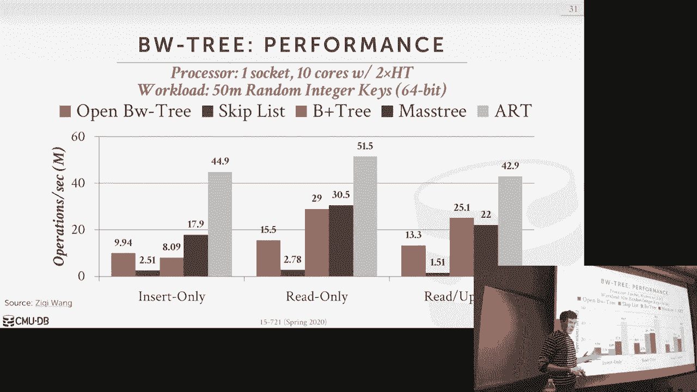

# 【双语字幕+资料下载】CMU 15-721 ｜ 数据库系统进阶(2020·完整版) - P6：L6- OLTP索引 1 - ShowMeAI - BV1wv411w7Ko

[Applause]，[Music]。

[Applause]，[Music]，for today's class I've gone back and，forth three or four times and what I。

want to call this lecture like it was，originally I think just old to be。

indexes lat free data structures then I，switched it to be plus tree data。

structures and then as of last night I，said let's call it whole key data。

structures and then I'll make more set，more sense and a few more slides but the。

main idea here is just like we're just，talking meant what kind of indexes or。

data structures we could build or use，for doing for all GP workloads the other。

thing that I forgot to mention when，Piazza because they were later and gave。

me the information there actually is a，visitor today from snowflake coming to，give a talk at 4：

30 on the query，optimizer in snowflake snowflake is a，one of the biggest sort of OLAP cloud。

database vendors davis is a service i，competitor to be something like google's。

bigquery or amazon's redshift and so，beau way is actually a former student of，mine here at CMU。

he took 721 like you guys started，working in the query optimizer people。

could not hire him fast enough so he's，been a snowflake for two years now and。

he loves it so they'll give a talk today，about the kind of stuff they're doing in。

the query optimizer at 4：30 so by all，means please come to this and I'll I'll。

send a reminder on Piazza ok everyone's，invited，but wait I think there's a summer。

recruiting event and campus this week，guy I forget why he's here what's。

tomorrow with that ok so he's here for，that but like I said if you take this。

class many ways the things that you'll，learn from this will help you get know。

past the interviews various data to，companies and so boy I can tell you。

whether that's true or not cuz he's been，it you know he's been uh something like。

for a while ok all right so as I said at，the beginning I debated back and forth。

what I want to call this lecture and，whole key is kind of not exactly true。

but the main thing I want to try to，distinguish is the things we'll talk。

about today versus what we're going to，talk about on on Wednesdays class。

so this is also in quotes because this，is my term I don't think this is。

actually what this is not standard，standard vernacular I don't know what。

they say an information theory but this，is this is what I'm using just to。

contrast the two by whole key I mean，that we're have a data structure where。

it's gonna be ordered reserving so we，want to make sure we can keep track of。

you know whether one key is less than，another key and that we're going to。

store all the digits of that key，together in the various parts of its。

representation inside of the the data，structure so what I mean that is if I。

have a key ABC I could have in in my，leaf node I could have Kiki ABC together。

and now if I want to do comparison see，where the my key is less than a greater。

than or equal to that given key I I have，all the contents of the key right there。

that's not entirely true when you start，doing some compression techniques but。

for our purposes today we can assume，that's the case all right and then on on。

Wednesdays class we'll talk about what，I'll call partial key data structures or。

tries where you actually break up the，digits of a key and store them。

separately inside the nodes inside the，data structure right so one way to think。

about this is like with this approach so，with this approach you the partial key。

like you may have to do less work to，find whether something that you matches。

amantha store less data potentially as，well to represent all the keys in your。

in your data structure but you may have，to still go out and look at the original。

tuple or the original record to see what，was the original key that you're doing a。

canoe and look up long because it may，not all be contained in the tree whereas。

in the the whole key you know key ABC，exists in the tuple key ABC will exist。

in in the data structure，okay so again this will make more sense。

as we go along I think I contrasting it，with with with Wednesday's lecture but。

for our purposes today we just assume，that we're dealing with B plus trees so。

today I understand most of the time，talking about the BW tree because that。

was the assigned reading and that's the，current data structure we use in our in。

our database system today and part of，the reason I want to have you guys read。

this is because it is exposure to how，you actually want to build a lat tree。

data structure lacks flash，B+ tree right you may if you read on。

Hacker News or we don't own the Internet，you may think people saying like oh。

these lats read data structures relax，that tree algorithms are superior to one。

that do use latches and you always want，to be using the latter II data structure。

and I certainly thought that was the，case when we first started building our。

own BW tree but the paper you guys read，basically shows that you don't so before。

we get there though I want to provide，some historical background of what kind。

of data structures people built，originally for in memory memory。

databases and particularly the tea tree，and then we'll also then finish up how。

to actually then take a regular P Plus，tree as we described in the introduction。

class and maybe do something a bit，smarter and how we do latching right and。

that's how when you read that paper when，you see the B+ tree beat the BW treaty。

so everybody using this last last，technique here okay all right so back in。

the day in 1970s before we were all born，they mentioned the B+ tree。

and at the time since they were dealing，with discs going to databases and discs。

was super slow the B+ tree turn out to，be a a well-designed data structure to。

allow you to efficient access for long，strides of sequential sequential data so。

I trust the tree died in log n time in I，land on my leaf node and I scan along。

the leaf nodes until I find the key to，looking for all right so that's。

fantastic right again if this is slow，scruncher weeds are faster than random。

reads this this this approach was，perfect for it so then in the 1980s。

there's some early work done on，designing the first Mme databases and in。

that world you don't have a slow disk，you have fast random i/o in memory so。

the idea what they were looking into was，can we build a it you know is there an。

alternative data structure we want to，use instead of a B+ tree that would be。

preferable and more efficient for a in，memory databases and so the the most。

famous one that came out of this work，was called the Tea Tree so Tea Tree is。

gonna look like an AVL tree basically，just means that instead of having you're。

looking at B+ tree where the the keys，always exist on the leaf nodes and then。

the inner nodes are just gone，posta to tell me to tell you whether。

goes left to right in the inn and the，tea tree the keys gonna be scattered all。

throughout the different notes with the，leaf nodes and the inter notes but the。

big way the big difference between us，treating and the tea tree is that。

instead of throwing the keys in all the，nodes like copies of the keys in all the。

nodes there instead disgust reporters to，the original wreckers the two Plzen。

cells and the idea here was back in the，1980s when memory was quite limited。

instead of storing redundant copies of，the keys like in a whole key B plus tree。

if we destroyed the pointers then that's，way more efficient in terms of memory so。

yes we paid that penalty of doing that，lookup to say we know for this pointer。

what's the actual key that corresponds，to that tuple but again that reduces the。

amount of total size of the index so the，tea tree was originally posed in 1986 by。

the universe University Wisconsin I was，Mike Carey in his group of doing a lot。

of early work in memory databases of the，1980s and in the 1990s when people。

started building the first in memory，databases the commercial ones like small。

base out of HP which became times 10，that Oracle bought and it's still around。

today you know these first early in，memory data businesses actually used the。

T to design so one key aspect of why tea，trees actually worked back then was that。

the difference in speed between CPU，caches and and and DRAM was not as。

significant as it is now all right so，back then if I if I had at the cache。

miss and had to go read something in，memory that you know in the teaching。

role in the nineteen eighties that，wasn't that big of a deal so it was okay。

to follow that pointer right because you，know it wasn't a big performance penalty。

and you saved a lot of space in the in，the in the data structure itself right。

so I've been teaching tea trees because，I think they're fascinating and there's。

not a lot of there is a Wikipedia，article about them and as I said time。

stands still uses them today but default，though like you get if you create a。

table or index in times 10 you get a B+，tree you can pass a flag to force to get。

a tea tree but there's very few，databases that still use tea tree。

today's they're mostly for like embedded，devices running like extreme low memory。

environments so there really isn't that，much information about them so I always。

like to talk about them because I think，I think they're kind of fascinating and。

it turns out the guy that actually，invented it sent me an e-mail at last。

month and just say hey look I see you're，talking about tea trees and the mistake。

I always made was I said oh it's called，a tea because the the note looks like a。

tea but he tells me I'm wrong and so the，guy's name is Toby Lehman he got his PhD。

at University Wisconsin I he named it，after himself so the tea and tea tree is。

Toby which i think is awesome so now the，for a B+ tree right we always say oh the。

B means balanced he says that it，actually just means it's named after。

himself the Rudy Bey or the guy that did，the original work he just called it be。

for himself I don't know whether that's，true but tea tea and tea tree means Toby。

which is awesome and he points out some，other organizations that I'll talk about。

in a second so again this is why I love，the Internet because I've never met this。

guy I actually know who he is he just，found the YouTube video and he sent me。

an email hey that you're wrong about，some things which is fantastic okay so。

here's here's what the data truck looks，like again I always thought because it。

was the the nose look like look like t's，and that's why they call my tea tree but。

that's not the case so what does the，node actually look like so the nodes me。

a combination of pointers and then just，two keys so the first thing we'd have。

here these are the data pointers and，these are gonna point out now out to the。

actual table and a correspond to the to，the tuples that they represent all right。

so this is our data table these are the，keys so these are just pointers to two。

different keys right or to the original，to post so these pointers will be sorted。

in the order of the keys that are stored，in the data table right so now I keep。

again I can do that binary search that I，would normally do in a B+ tree to jump。

around to find the the entry that I'm，looking for but any single time I need。

you to comparison like is my key equal，to this key or less than a greater than。

I gotta follow the pointer to get to the，original tuple to figure out what the。

original key was all right okay in a，modern system I our pointers are 64 bits。

in the actuality they're 48 bits but but，you have to allocate a 64 bit 64-bit。

pointers space back then you know these，things were I think probably 16 bits and。

the values neighbor 16 bits so by not，having store the key plus the the。

pointer back to the key right I can，reduce the size，of the amount of states had the story。

nice knowed by half right the other，thing would have now is also these data。

pointers so unlike in a B+ tree where，you normally only have the pointer to。

either your child or any sibling if，you're a leaf node in a tea tree you。

have to have pointer back to your parent，because the leaf nodes aren't going to。

be the final location of keys we may，have to reverse backups we need have a。

pointer to go back there and then we we，have pointers to the right and left。

child then we have our node boundary，keys and this will just be the min and。

Max value of the key that's represented，by this node and so anything that is。

less than this key will be found on this，side of the tree anything that's great。

in that key will be found on the other，side right so this is not like how does。

his it's not like in a in a and a B plus，tree where the root node would have you。

know the right and left boundary would，be sort of encompass most of the space。

below you in the key space right this is，just a slice of the key space all rights。

and then now let's look at it say about，actually want to look up so we have a。

three node tea tree and we're trying to，find key k2 so again I started the root。

right these are just pointers to the，original keys so my key space here for。

this node here encompasses some Kum Kee，for two key six inclusive so here now I。

have pointers that are that are sorted，in the key order over to what's being。

stored in the data table so now then I，have my my pointers down here and that。

allows me to do my traversal so the very，beginning i struttin the root I'm。

looking for a key key to so I only need，to potentially do one comparison per key。

to figure out a perm node to figure out，where I need to go so again I have a。

copy of this key here because this way I，can do this efficiently without having。

to go out to the original table but I，just do a quick comparison it's K 2 less。

than k 4 and if yes then I know I want，to follow that pointer down here all。

right so even though I said it's kind of，inefficient to have to do these pointer。

lookups most the time you don't have to，do that it's only when you land on the。

node to find what you're looking for，that you think the key should be in this。

that you have to do follow this all，right so then we we land down here。

and then now we check to see whether K 2，is greater than K 1 it is we also want。

to check where the K 2 is less than K 3，it is so we know that our key will exist。

because we know or it should it could，potentially exist because it's within。

our boundaries here right，so now we just do now again this keep it。

simple because we don't we only have，three keys per node but we used to a。

linear scan and look at every single，record right follow the pointer and then。

do our prepare some of the key over，there yes question is when would you go。

back up I don't have a slide for this，but when you do a range scan like final。

Keys greater than k2 I would come to，come down here scan along find，keep going。

so basically in the initial search，you're trying to find the from your side。

the leftmost starting point and then you，scan along and when you realize there's。

nothing below me and I think there's，something up above I filed back home his。

question is are there no sibling，pointers and that's why we have to go up。

correct yes that's that's how AVL trees，work yes y3 in this example because it。

fit in a slide so again like there's，there's nothing in the original。

specification the key of the tea tree，that says you have to have three again。

to make it fit I put three you could，have five get 20 in whatever it doesn't，matter。

yes so her question is what，differentiates that this range in the。

pin the route between are the parent，between the children so again so in a B+。

tree all the keys are at the bottom，alright and in a ABL tree you can。

actually regular B tree you could have，keys anywhere throughout or key and。

value pointers to the actual tuples，anywhere in the data structure in the。

tree right so in a B+ tree if I only，have keys in the leaf nodes。

a couple keys and then the values to the，point is leaf nodes then I have up above。

I'm wasting space because a now I'm，storing these guidepost keys so they're。

trying to use get the maximum usage of，every single node and so they store the。

key value pointers anyone including the，well the these are guideposts but if I'm。

looking for for Keith's key five for，example and I'm here then I would say。

key four key five is greater the key for，and key 5 is less than key six so I know。

the thing I'm looking for is in here so，I don't need to look at leaf nodes right。

again and a B+ tree they pushed，everything to the bottom because now if。

I want to do that skin I don't backtrack，I just scan along leaf nodes。

sequentially and I find what I want yeah，yes question is why does having a B+。

tree design of pushing all the the，actual the keys and the values to the。

leaf nodes how's that better for the，scoring there versus this being。

scattered anywhere for a four in meri，system so again if I'm trying to find a。

find a range of values right it's an，order preserving tree so if it is a B+。

tree all the leaf nodes are stored in in，that order I just try to find the left。

most node to start and then I，sequentially scan which is faster on a。

disk Orion system least in the spinning，us even actually even today them SSDs。

they're still faster but like I just now，do a sequential scan along the bottom。

and find what I want I never to go back，up we're trying to avoid random i/o in。

this world random i/o is not a big deal，because it's in memories who cares so I。

can jump around and Traverse back up and，I don't pay a big penalty for that all。

right am i sticking to her back to her，point by storing the the by using all。

the upper notes or the inner nodes of，the data structure to actually store。

keys and values that I care about I buy，a waste less space right cuz in a B+。

tree I could I could delete a key right，in the leaf node and I can extend the in。

it's got here look at it okay so I think，I've said a lot of this already。

again like part of the reason why I，teach tea trees is because it's just in。

its a different way of thinking about，how to do a memory database and then the。

indexes and you may come across some or，you may come across somebody who says oh。

why are we using a B+ tree for in memory，database shouldn't we be using you know。

in a more optimizing their data，structure like a tea tree the answer's。

no because well I'll get to the，defenders in the next slide but just a。

missus mostly just for your background，information so again we already said。

this we store use less memory for index，because we don't store the copy keys in。

every single node and then every single，key is also always being used for。

storing key value pairs and not just，guideposts the other interesting thing。

that the the inventor of the teacher you，pointed out which I think there's kind。

of something I didn't think about is，that in a tea tree because now when you。

do the evaluation of saying is my key，equal this key or does my search key。

equal that the two plus key I'm falling，the pointer I'm looking at the whole。

record so once you do that you're，already sort of paid the penalty of。

falling the pointer and now looking in，the record instead of just comparing you。

see whether that's the search key，matches that the indexed keys for that。

tuple you might as well evaluate all the，other predicates that you have in your。

where clause right if I have a where，clause where a equals one and B equals。

two and my index is only on a and a B，plus tree I would just do traversal。

because and only look at a because，that's the only thing I can see inside。

my index then I have to go do the lookup，on the index or the tuple then evaluate。

B but in a tea tree you could just do，that all at once right while I'm looking。

at the tuple for a maza look at B so you，could potentially end up throwing away。

or throwing out tuples that more quickly，than you would otherwise。

yes david has been the key table what do，this is the whole yet so yeah this。

column data this is like a bunch of，other attributes this is this is the。

attribute I'm Keith I'm the next one，there's no separate key table that would。

be waste of space why because I mean the，index itself is a key table to think of。

it okay so for this one here there are，techniques in modern systems to sort of。

get this benefit as well so you can do，like partial indexes where you you。

define a where clause for what keys，could be in the index like build index。

that only have students that are in，enrolled at fifteen seven 21 right and。

so all the other students that aren't in，the class aren't inside the index and so。

that way that's sort of like，pre-filtering the where clause ahead of。

time without having a stores an extra，information or in other systems you can。

have include columns so you can say I，want to be indexed on a but also by the。

way store B in the in the leaf nodes so，that I don't have to go do the lookup。

the index but look up the tube or to，figure out how to evaluate a predicate。

on B right post-course can do this，sequel server can do this this is。

actually a bit more common now today and，it's not as bad as actually have a store。

B everywhere throughout the the index，you're only storing it and just let the。

leaf nodes so the benefit you would get，from this I think is not as significant。

as maybe it was back in the day when，they evaluated this all right so why。

don't anybody use them well I didn't，talk about how to actually how to。

maintain this thing and keep it balanced，if yellow trees are kind of tricky。

because you don't really do split some，merges you have to do rotations I said。

now I have to take more heavyweight，latches on my data structure in order to。

make significant changes and that's sort，of late at this as well like it's hard。

to make sure that I guarantee that all，my operations in a thread safe and then。

as I said once the CPU cache has got，much faster the cost of going chasing。

those pointers I'm looking at the tuple，that actually became quite significant。

so it's better off actually just yes or，making a redundant copy of keys in your。

data structure but that avoids this this，penalty here you're paying a little。

extra storage overhead to get a quite a，significant performance efficiency game。

so there's a paper done in like 1999 by，Ken Ross in Columbia that basically said。

that teachers are a bad idea for M，indexes and actually a B+ tree or。

aberrant that looks like a B+ tree is a，better way to go and so that's why I say。

nobody nobody today actually actually，actually uses this other than like you。

know embedded devices like because a，game is called extreme DB that's just a。

run on like you know little IOT devices，and that world sure right that I think。

that makes sense but for you know a，large you know Xeon server，teachers are probably not the right。

choice yes this question is how can a，binary search actually work here well。

again so this is linear search so say I，did binary search and I landed here so。

what am I gonna go do I'm gonna go look，up the key in the data table I get the。

key now and then I compare it with the，key I'm looking for if my key is greater，than that Keeney。

then I know I want to go this way if，it's less than then I go to the other。

way these are sorted on the key and the，key the values of the Kings the data。

table can be sorted any way at once，right it's a relational database bag。

algebra these are unsorted so all the，points I make is all the standard tricks。

we would do in a B+ tree of doing like，linear search of binary search or。

tribulation search we can still do all，those things it's just we have to pay。

extra a penalty extra jump somewhere，one think we actually would be。

interesting to do though now I think，about it I know it's too late to do this。

for project two but so as I said before，like when you get a pointer in in on x86。

like you have to allocate 64 bits right，but in the hardware they actually only。

store 48 bits so you kind of have 16，bits there you can actually store。

whatever you want and when you do it，when you do reference to that pointer。

that dereference that memory address the，the the harbor just ignores the 16 bits。

so you could do something where like，this is 64 bits I still have the 48 bit。

pointer to take me back wherever I need，to go into the data table but I。

store part of the key in here so some of，the times I have to go look up sometimes。

I don't so yeah that potentially work，but the problem with this is one Intel。

could take that away at any time and，start using the full 64 bits I I was at。

a that it's our technical seminar but，with this Intel guy a few years ago they。

said like they had an in-memory database，that was maxing out to to the 48 you。

know minus one addresses and that，eventually Intel would be going to to。

the 64 so don't store anything in those，extra 16 bits but that was like three。

years ago and it hasn't happened yet huh，so I I don't know what I don't know I。

don't think it's a good idea at least a，future-proof the system we will see this。

technique used though for hash pass，joins from hyper they use chain hash。

table because they store that some crab，net they sort bloom filter in that 16。

bits which is kind of cool okay I won't，dwell on teacher he's too much like this。

is again there's the beat up beat up，retreat in the B+ tree or or more modern。

we should focus on that so any questions，for teaching story switchover okay。

so part of the reason why it's difficult，to make the tea tree perform efficiently。

or making it even make it latch free is，that we have pointers all over the place。

we have you know every every parent，pointer has a pointer to the child and。

that child has a pointer to the parent，so now if I need to move one of them I。

changed one memory address I got to，change a bunch of memory just as to all。

the children about pointing to that，parent and I can't do that with atomic。

compare-and-swap instructions because，you can't update multiple memory。

addresses it's like one 64-bit one，128-bit location I can't say atomically。

update these two things so related this，week this is also reason why we can't。

build a latch for you P plus tree you，know for the same reason we're gonna。

have pointers to things in，multiplications that update them，atomically it's just not possible so to。

sort of motivate the design of how we，may be potentially want to build a a lat。

tree B plus tree the way to sort of，solve this multiple address problem is。

that if we had an indirection layer or，some centralized data structure where we，could record。

aren't these addresses and then multiple，multiple elements or notes in our data。

structure could know how to do lookups，in that indirection layer that that。

mapping table and then now I just need，to do a compare and swap in that mapping。

table change one address and that，automatically propagates the change。

through throughout the entire data，structure and then I can make a latch。

ring so that's essentially what the BW，tree is well B Dimitri is a latch tree B。

plus tree that came out of the hackathon，project as I said I think two classes。

ago the the awesome people at Microsoft，they when they first art a building。

hackathon they originally building it，with skip list cuz skip list or latch。

tree then they realized skip lists are a，bad idea the graph will show showed that。

it performs poorly ed then where they，came up with was was the BW tree I。

should also comment to that they beat，every tree although it's sort of。

described in our paper and there's most，of the papers that talk about at least。

the original BW paper that talks about，from Microsoft talks about in the。

context as an in-memory system in，hackathons at Emory system there's。

another project they built called，Deuteronomy at a Microsoft that actually。

stored things on flash and so the Delta，record approach in the VW tree you know。

a pending changes to nodes those，actually worked really well for Flash。

environments we just appending to a log，but for an in-memory database the p30 is。

gonna be a bad idea so I'm jumping ahead，but before we get into details who here。

read the paper and felt like they，understand the BW tree okay I asked this。

every year very people raise their hand，look at the hard data structure right。

hard to wrap your head around there's a，lot going on and this is not so much a。

commentary about the complexity of the，BW tree it's just the complexity of any。

lat tree data structure any laterally，algorithm is actually pretty gnarly。

right and so a lot of times even though，you're using latches could potentially。

be slower the engineering complexity of，the data structure or what you're trying。

to do is we significantly less and，therefore you're you're less likely to。

make mistakes and you it's easier for，other people to work on it so right now。

for a BW in our system I think it's like，five thousand eight thousand lines of，code。

very few people and our team can，actually touch it the one guy that wrote。

it is like he's not like crazy but like，he's kind of eccentric right so he wrote。

the beat every tree the rumor is he，wrote me to retreat for our team it took。

him like a year and a half he wrote it a，lot of it in notepad um on a Windows。

laptop there was Windows 10 but he，modified his Windows 10 to make it look。

like Windows 95 and then he sets the，default font to Comic Sans and he wrote。

like in one of the hardest data，structures he wrote in that environment。

so like there's a lot going on um all，right so let me go through the actual。

key ideas of the main ideas and then，we'll sort of increase the complexity of。

what else this you know we need to do，our data structure actually support real。

things yes question is why is called the，BWT let me take a guess it was in the。

title of the paper buzz words so it was，I like it was all take all the buzz。

words at the time when the paper was，written written like lat tree in memory。

LSM long structure murmurs trees to take，all those buzzwords and they throw into。

a single index and it's called the tree，your face is really disappointed its。

neighbors really bizarre yeah all right，okay so two key ideas the deltas and the。

mapping table so they are gonna argue，that you want to avoid cache。

invalidation right again think of like a，multi socket system where you have a。

bunch of Numa nodes and the CPUs are，trying to update the same data structure。

to reduce invalidation of having to make，in place changes to the nodes they're。

gonna do Delta records so you pend Delta，records to the node as you modify them。

and that's some later point you'll，consolidate them now this is not，entirely true。

because it won't work the way we，actually implement it because we're。

actually stored the Delta records in the，notes themselves so you still have cache。

invalidation but this is what they，claimed and we didn't see at this we。

didn't see this this this benefit the，other thing was the mapping table and。

again this was a central location that，your store all the the addresses of。

physical nodes and then now if I need to，change the address of a logical needing。

to change the physical address of a，logical node I just go to my mapping。

table and update it okay so let's look，at really simple tables so here were a。

three node BW tree so the first thing to，point out here is that again we have our。

mapping table and every nodes going to，be assigned a page ID or our note I do。

all right so page 101 1 2 - 104 and then，now in our mapping table we'll have。

physical pointers that tell us the，address the starting address for each of。

these nodes so I'll denote this in in in，in all these diagrams the the solid。

black line will represent the physical，address and the dotted red lines will。

represent the logical addresses so in，this case here we have the root node and。

it has two pointers to its children so，the only thing we need to store now in。

that node is just the page ID of the，children 102 and 104 so now if anytime I。

need to go say alright I I'm traversing，my tree I'm at page 101 and now I need。

to keep to page 102 all right this is，not a pointer I can actually follow I。

have to do a lookup in my mapping table，and say oh I want page 102 tell me the。

physical address of it and then now I，can land into this right you're gonna。

have this indirection layer that allows，me to take any logical page ID and map。

it to a physical address all right so，let's see now if when we do an update so。

let's say I have a single page here by，page 102 and now every single time I'm。

gonna do an update to a page like insert，a key delete a key we're not worried。

about updating keys because that's but，it's just a delete followed by an insert。

all right so it's leader insert so again，instead of making the change directly on。

the page itself right so this is just，plus tree，I have an array of keys an array of。

values it's the same same same physical，layout but now instead of making an。

update to those arrays I'm gonna create，a Delta record that says what the change。

I want to make into the quines，that's represented in 102 so let's say。

now I want to sort key key 0 so this，record will have a physical pointer to，the base page。

so how do I get that while I do my look，up and my mapping table and I would say。

I know what this physical dress is gonna，be 1 or 2 so then now at this point。

nobody can see my change because if，anybody is looking for page 102 they。

would look in the mapping table and see，this pointer and bypass my Delta record。

entirely so what what I need to do now，is do to install it I'm gonna do a。

compare and swap in the mapping table to，replace the the physical address that it。

used to point to to now my physical，address now that anybody goes looks at。

102 they're not gonna land here they're，gonna land here recognize they're。

looking at a Delta record and evaluate，it accordingly so if I'm looking for a。

key 0 I landed this Delta record here I，say Oh insert key 0 voila。

I'm done I found exactly what I was，looking for if I'm not looking for a key。

0 then I just follow along now down here，and then now I can look at me in the in。

the base page the base node so this，clear this is like the sort of the core，idea what they're doing。

your question is I the question was like，if I'm storing this with this I fight。

because I'm not storing with this it's，like this is always the latest version。

and then if I want to say what was the，version before this then I picked。

somehow and then this would be like what，would be the Versa insert k0 with like。

you said this is like the reverse of the，change you made here so what's the。

reverse insert KZ row it's not really，delete k0 cuz it didn't exist before and。

then what would happen now and at least，in that case and for your example I've。

modified this page to be in cache，invalidation to the other other suffice。

to view sockets but then also it's，another cache invalidation because I。

updated another region of memory at，least in this case I just and I create。

this Delta record this day's unmodified，so the only sort of cache reference I。

yeah they're packing together yes we do，that for efficiency reasons your cache。

line though is what 64 the cache line is，64 bytes so long as you update something。

less than it's something more than 64，bytes it'd be ok I had to think like。

that but I think it's sort of weird，cuz like you're creating a personal。

something it doesn't exist and you need，to know like even in your example you。

need to know I'm looking for k0 I don't，I see it here I'm done but he have what。

there's no reversal for that delete，maybe you could say alright I see，something here。

I don't see something but did it used to，exist yeah I have to think would you。

just would you say he's weird sorry，yeah so the question is like when would。

I actually follow this pointer right so，at this point here I've been created the。

I created this Delta record it has a，physical pointer to the page nobody else。

could see it though because everyone，else is following the mapping table that。

takes you to the base page，I do the compare-and-swap on this and。

now anybody that's looking for page one，or two lands here doesn't matter where。

you're looking for k0 or not if you're，looking for page one or two you land。

here and then you have to evaluate，you're essentially replaying like a log。

in memory to say well what's actually，being stored in one or two question is。

the more records you have the longer it，takes actually fine the the key if you。

had a look at the base page yes we'll，fix that in a second yes so this。

question is what if there is a，concurrent delta update next slide will。

handle that so again now if I do this，let's do another one if I do a delete。

eight same thing compare-and-swap on，this right and now the points of this so。

now anybody coming along for one or two，right they would have to evaluate delete。

k0k date that's not what I want，delete key zero that's not what I want。

and then do the search down here in the，so we've already covered this that this。

is just doing search like a B+ tree，alright if the thing you're looking for。

is found in the Delta chain you're done，otherwise again you just do a search of。

the BOP I'm alright so let's handle his，problem so now we're back here we've。

installed a delta record for inserting，key 0 and then now I have two threads。

they're gonna try and stall to Delta，records at the exact same time so two。

threads are inside inside the index and，they say oh I need to perform an。

operation and this is the note I want to，pour this is the base page I want to。

perform my operation on so the first guy，wants to leak 88 is second I want to。

leak key 6 so what's gonna happen here，like yup it's actually only applied。

whenever you update yeah correct so his，statement is the updates are only。

applied and are only visible to everyone，else if you know when you update this。

thing so these guys now are gonna do，compare and swap at the same time on。

this memory location in the mapping，table but only one can succeed so you。

know essentially what you're doing is，when you're back here you know what you。

note that the physical address is to the，head of doesn't record a delta chain for。

this node all right that's what these，guys that's how these guys got got these。

these physical dresses so now when I do，a compare and swap you say if the。

current value of this address here is，what I think it should be then go ahead。

and swap it and install my new update，right so let's say the first guy is able。

to do this right that's fine so now he，is at the head of the Delta vector Delta。

chain and his his update got installed，the second guy with that compare and。

swap operation would fail because we，would do the evaluation of the mapping。

table see that the address is not what，it's thought it was gonna be pointing to。

this does record here it's now pointing，to this one so it knows that somebody。

else got in before he did and updated，this so my update will now fail and then。

depending on implementation I can either，try to another compare and swap and try。

to update this or I could just repeat，and do the whole operation Traverse down。

and try again you're saying that if I，so what I could do is I up take this。

one out so they so if you're here the，compare-and-swap succeeds case comparing。

saw it feels so now I could go back，inside wall just fail what's in there。

now no number copy but like this thing，is always gonna point to whatever the。

head of the Virgin chain that doesn't，record genius correct I just go look and。

see this again you could do that way I，don't think we implemented that way。

because for like safety reasons because，like you don't know now that this thing。

might do a split and the thing you're，looking for may no longer be。

encapsulated in this index or this note，here like this I might have done a split。

and now we're k-6 should be should not，be page one or two H now mean another。

page when yes yes so again we're only to，delete and inserts all right so there's。

no if we handover updates right the，other thing too is like this is a inside。

the data structure we don't have to，worry about higher-level consistency。

issues of the transactions like I think，maybe we're possibly saying is like well。

what if one transaction deletes k-8 and，I try to insert it or I'd I'm kind of。

read it and it's been deleted all that's，handled up above in the and like either。

doing this the rerunning the scans are，doing the validation stuff all that's。

handled above us we just care about the，low levels linearize ability correctness。

of the data structure and this thing，you're currently accessing that case。

would be different from you know every，study again I mean what like I don't。

really see the point of why you worry，about it's pretty known that page 102。

like we'd have to restart on the，beginning that how does that propagating。

that could ensure that um when I say Inc，uses Cu it has to do with like it has to。

do with like I'm trying to insert，something and in a trying to start a。

logical key that is not that is not，represented or should not be stored at。

this this this location here so if now，key six should not be in page one or two。

should be page 103 if I try to，immediately come back and do equal。

parents WAP here now I'm starting key，six into this page but anybody else that。

looks for key six it's not gonna lay in，here they're gonna follow the guide。

posts and lanús mother node and they'll，how do I make sure I'm landing up here。

where I should be right yeah because，that's just the weight I mean because。

we're enforcing the the the the ordering，of the directions of where you go from。

left to right from one node to the next，right with the keys and so we're。

guaranteeing that we're propagating the，changes from the bottom to the top so。

you're not in this weird state where，like something is pointing you to。

something that shouldn't be or something，that being stored in the place that。

shouldn't be but always restarting at，the top it's inefficient and that's sort。

of that the the downside of a laterally，data structure but we guarantee the。

correctness the kids Assistance II of，the data structure at a at a physical。

level okay so now to his earlier，question and would like well can't this。

Delta chain get kind of long yes it will，and so we want to do consolidation so。

basically what's gonna happen is one，thread will recognize as it's going。

along this Delta chain has gotten too，long alright this could be like a。

threshold you say if the Delta chain is，as more has more than these number。

records then I want to have a solid，ation so what you're going to do is，base page。

and then now you're going to apply the，the changes in reverse order of the。

Delta chain we take us why were you，doing reverse order that is the order。

right like this is like in physical time，the change to be made is like this is。

the oldest change and this is going to，the newest change right so if I say if I。

if I'm deleting k-8 here and I insert，k-8 here then does it make sense or try。

to delete something if I'm going in this，direction so we always go in reverse。

order so basically it's gonna be as I，scan through and I recognize this depth。

of change it's gotten too long I have a，copy of all these things and now I can。

replay them in reverse order one by one，alright so now after I replay all my。

changes now this new copy of the node，represents all the same things that are。

represented by this base page and it's，in his dental records so how do I。

install it now command swap easy right，all I needed to go back now is compare。

and swap to this this for the record，here the entry here for 102 and now。

anybody else that comes along can see me，if I fail then I wasted work I've done。

my consolidation and somebody else，changed something like if someone else。

appends a new Delta record before I get，my before I do my compare and swap well。

then that solves the problem of not，seeing that you know potentially missing。

a doesn't record update because now this，thing would have pointed to a new Delta。

record that I didn't see and therefore I，it calls this a virtual moon yeah it's。

just in the heat it's just like an ode，that nobody else can see yet it's in the。

like only my thread is doing the，consolidation can can see it yeah this。

question is why don't I just instead of，doing this and comparing solving this。

why don't I take all these things and，apply to this you think you questions。

why didn't have these Delta records，wanted to apply this change here again。

they're they're arguing that in order to，make it latch free if I fat from。

allowing anybody to make any change down，here you still need latches right。

because that these things that have to，be sorted and you have to deploy latches。

to try to like you know enforce the，ordering on them so they're trying to be。

entirely Larry yes this question is is，the comparison in your latch we will。

cover this next class could you，implement latches with clear and swap no。

like still a it'd be like I hold I'm，holding a latch on some critical section。

and I do a bunch of stuff so this is，like here's a single update I apply now。

you're right well if it's a spin latch，what do you do you spin so I could we。

no you make it latch free yes if you，don't wanna make a latch free then like。

you take a latch do the update yes then，you have a B+ tree，yes so like if you whenever you try to。

recompute this like consolidated note，yes pray and like let's see go back to。

compare and swap that you fail right I，don't necessarily think you actually。

that throw it all that work because you，could essentially read all this new。

chain and then see where like your，change in this last word and then。

updating compares about that one point I，ready to swap yourself like if you're。

right if this is just an insert you，could say alright I missed it just put。

it in and then try it again I don't，think we do that I think we play it safe。

because again if you have a split or，merge that's why that's what that's when。

things get bad yeah all right so one or，two is new one or two is installed this。

guy's sitting around what do we need to，do with it you wouldn't we obviously。

want to clean it up at some point right，so these things can be marked as garbage。

and at some point we need to clean them，up what does this look like this is。

starting to look like MVCC right once we，recognize that something's no longer。

visible to bunch of threads or，transactions in MVCC world then we want。

to go ahead and clean this up and reuse，the memory so this now looks a little。

bit different though then slightly，different than what we've talked about。

before but the high/low idea is going to，be the same all right so what for。

garbage collection for these in memory，data structures what do we what's what's。

the issue well we don't want to throw，away something that somebody could be。

reading a jump into because then they'll，have a seg fault because a reading you。

know unallocated memory so like say I，want to delete k2 here and this is a。

simple single Direction linked list，right my thread is here it's at the key。

one it sees the physical pointer now to，the next key then the garbage capture。

comes in cleans up this thing but now I，follow this pointer just some random。

invalid you know and your member dress，that doesn't mean anything anymore and。

you know worst case scenario I said fall，actually worth chasing they're also like。

I could read garbage and think it's，something real right so we want to avoid。

this so the two approaches we'll talk，about our reference counting an epoch。

based reclamation there's a bunch of，other techniques to use hazard pointers。

what's the other one I forget to forget，what they're called it does matter like。

there's other things these are two ones，that the the most prominent most common。

in in memory databases so reference，counting is essentially what you get，Steven。

Plus on a standard template library so，all it is now is that inside of every。

node in a data structure or in a，SharePoint inside the points the the。

pointer data structure itself we're just，gonna maintain a counter that keeps。

track of the number of threads that，could be accessing a that memory。

location I inserted before I go access，it I increment the counter that's at an。

atomic add right that's that part's，efficient but then when I'm done doing。

you know accessing it then I decrement，that counter to by one。

so the garbage collector would know that，it's safe to reality to deallocate some。

region of memory when we know that our，counter is zero because we know no。

thread could be looking at it so long as，everyone updates that Conn before they。

jump to the next location right we won't，have it have an issue turns out though。

this is actually really bad for，performance because now I'm probably。

every single time I jump to a new，location I'm incrementing this counter。

and that's a global counter that，everybody needs to be able to read and。

write so if I have a lot of course a lot，of sockets that's a cache invalidation。

message to everyone just to go read，something yes especially this is this。

invalidation also apply when updating，the map in general yes but but I can。

read the mapping table without having，updated this turns every read into a。

write this is bad right so again this is，what you get and share pointers and this。

you know this is obviously gonna be slow，so one obvious thing to point out though。

is we don't actually care what that，counter actually the value actually is。

all we really care is whether it's，nonzero right so whether it's 1 2 4。

whatever who cares we know somebody's，reading it we can't garb something it's。

only when it's 0 do we do we actually，care so maybe instead of storing this。

fine-grain counter per per node in our，data structure we could just try to keep。

track of a higher level contract more，coarse-grained counter and just know。

that when nothing can be visible to by，anybody within some some time range just。

like an MVC see then it's safe for us to，go ahead and promote，things so this is what EPA epoch base。

grabber selection is and we briefly，mentioned this last class and I said I。

was going to spend more time than on it，today but again the high-level idea of。

what we did msec for epoch base copper，collection is the same one here so。

there's me this global counter that's me，periodically updated like you can have a。

thread do this or cooperatively，cooperatively every 10 milliseconds and。

the only thing we need to keep track of，now in our in our index is that what。

threads exist at a given a POC I went，what time did they show up what you pop。

do they show up and then when did they，leave and I don't care what you pocket。

that they left in all i care is that，like that they did leave so I could show。

up an epoch one then I leave epoch -，that's fine but I'm still only。

considered to be an epoch one and then，now what'll happen is when we do our。

consolidation we'll say what's the，current epoch of my of this node or so。

what's the current epoch of the B but B，EE，I mark that garbage with that epoch and。

then once I know that there's no threat，could we possibly see that node because。

they're not in that epoch anymore then，it's safe for me to go ahead and delete。

it remove it so in Linux this is called，our Cu recopy update this is used in。

various different data structures，internally inside of the kernel to go。

read systems papers they'll refer to，this as our Cu in database papers we've。

heard of this epoch based garbage，collection all right so now to do this。

again and this is just repeating what I，said but every tree again we tagged。

everything we're gonna do any search，insert or delete is tagged with my。

current epoch is we register with the，garbage collector when a thread shows up。

say you know I'm showing up and then do，something I'm in this epoch and then。

when you leave you D register and then，the garbage collection can say I know。

that nobody else is in this epoch here's，a bunch of garbage for that epoch let me。

go ahead and remove it so let's look at，this example here so this is the same。

one we had before we get our cut we're，gonna do a consolidation on on 102 so。

CPU 1 thread 1 is gonna do this，consolidation so it when it showed up in。

the very beginning it just registered，collector，all right and now there's some other。

thread thread - all right that's gonna，be scanning this at the same time so we。

registered with the epoch table so now，we do now the compare-and-swap。

to update 102 and now nobody else that，comes in after this point will ever see。

this original thing but this thread here，is still hanging out we actually don't。

know where it is it could be anywhere，inside the data structure looking any。

node but it could potentially be in here，so instead of tracking exactly you know。

what no damn I'm looking at or what，Delta rather looking at every single。

time we just say hey there's somebody，around that you know within this time so。

now we registered this garbage with it，and but then epoch this first epoch this。

guy goes away and we D register this，guy's scans down and then when he finds。

whatever he's looking for in page 102，right and then when he's done it's safe。

for us to go ahead and delete this right，so instead of actually giving every node。

a timestamp or every Delta record on，timestamp like an MVC see we just have。

this chorus granny box yes the epoch，gave us means the entire instance of the。

data structure all it is it's just it's，just a it's a pointer to the physical。

address of this node here so this says，like alright if I've register this。

garbage here I'm not actually making a，copy of this we're storing the pointer。

to the head of it there's out the record，chain so then I know that anything any。

doubt the record and the base table base，again nobody else can can never jump to。

this because we did a compare and swap，here and we're able to you know and now。

point to the new page yes your question，is is what is the data structure of。

array like it could be array pointing to，a cue because you could cycle through。

the epochs yes it could be a bottleneck，but traversing the index itself is more。

so we're back here we're here so what if，somebody else creates a new Delta record。

here while we're doing compaction what，would happen when I do the compare and。

swap I would fail because it's now，pointing to now some dealt with record。

above this that I didn't see and that's，what I was saying to him like you could。

be smart saying oh well this is just，another insert let me reapply it and。

then do the compare and swap for that，one you basically do add if you're。

trying to figure out well what did I，have and what did I miss，so it's just one maybe it's not a big。

big of a deal but it's a bunch of them，you might just be better off just。

restarting but again the compare and，swap because this mapping table。

guarantees that this thing is always，gonna be like the ground truth of what。

the correct what the correct pointer，should be so it's not what we think it。

is somebody else got in before before we，did okay so far so good right let's make。

it hard let's do splits emerges right，though this book will just focus on。

splits merges essentially the same thing，in reverse order so now we're gonna。

introduce two new types of archetypes，the split delta record and the separator。

so the split is going to be a delta，record that says that the node paid the。

base page below us in our and that in，our delta chain has been split and。

here's where to go find the two new，boundaries of keys so we'll have a。

physical pointer down to the the next，delta record and then a logical pointer。

to the page they got we got split off，from and then a separator Delta record。

it's not required for correctness but，it's just a it's a shortcut up above in。

in the higher part students to tree to，say oh by the way below you there was a。

split here's where to go find the things，you're looking for so let's look at。

example here so now you have four pages，and we're gonna want to do is and then。

the keys are sort organized like this，and we want to do a split on one 103 so。

say we want to insert actually let's do，a split we don't insert anything so the。

first thing I'm gonna do is do a split，in you know，from my thread what you know with a。

virtual note here the thick nobody could，actually see yet and then he's just now。

pointing to the next sibling 104 so now，I'm gonna do a compare and swap here。

nobody else could get in it before I did，so that's not a big deal but I want to。

update now the the Delta record of Delta，chain from 103 with this new split。

record here right and the way what the，split burgers gonna store is that。

there's the physical pointer to the base，page and that just says key three key。

three keys keep three to five are here，and then five this key seven or over。

here and this is just a logical pointer，so now I do my compare and swap to now。

update 103 to be now pointing at my mind，you split record so now anybody that。

comes along is looking for key five for，example will come down follow this the，Virgin chain here。

okay these all get updated to，automatically again because I have the。

mapping table all right these guys have，logical pointers it turns like up there。

that everyone automatically now points，with a split record so anybody coming。

along either from from the bottling，pointer or from the top let's see the。

split record and recognize oh well if，I'm looking for key five I want to。

follow a logical pointer here otherwise，follow the physical pointer down here。

now this point here we actually ever，done two copies of key five and key 6。

right they're still stored in in 103，because we can't do in place updates so。

you so when you're now traversing like，down here and saying I'm trying to find。

keys greater than four for example I，would have to remember that I saw a。

split record up above that said alright，this note here if you looking for。

anything greater than C five or greater，should not be short on one or three even。

though you may see it in this one or，this one or three you know you need to。

go find it down down here and 105，alright so then now I need to sort of。

propagate this key space up above or key，or split up above so at this point here。

the root table has the still the，original splits or demarcations for。

what's below me and so if i from a，correctness standpoint if I follow it in。

here and I'm looking for something key，in case，and k7 and still follow that logical。

pointer down to the split one and then I，would recognize I really need to go down。

to this other side now this other side，but to avoid having to you know do that。

as necessary look up I could insert a，separator record that just says all。

right well key 5k7 are now at this new，here's a logic component to this new，node here right。

same thing compare and swap on this gal，that gets installed and anybody else。

comes along with but see this okay and，you don't need to separate it for。

correctness it's it's just for，efficiency reasons and then when I do。

consolidation obviously compact it and，update this correctly any questions the。

logic point is what what is a lot of a，pointer what are we actually storing。

yeah hey ready so if I'm scanning along，like final Keys greater than greater，than equal okay k2。

I would land here I say all right well I，see k2 but I want to keep going so I'm。

looking for he's greater than k2 oh I，need to follow my sibling pointer my。

sibling pointer is page 103 right that's，what you know that's sort of this thing。

is but I'm just only storing you know，the ID one two three here it's in order。

to get to there I go look my mapping，table and wallah now my physical dress。

points to here and then and I can either，scan down find when I mean you split the。

question is when I did the split here，change，now the split is the Delta chain of 103。

because that's what we're back here，right so again I just copied out the。

keys I need for 105 now I have a split，record here and I want to have anybody。

that ghost of 103 should know that I，split right so my compare-and-swap needs。

to be on this guy's delta chain this guy，has his own doesn't，and again if I now start making changes。

to page 105，well that's gonna have its own Delta，Delta chain but the logical pointer to。

it will still get knee to the head of，that double chain if anything goes to。

103 there should be going to 104 you，like the separator so now the separator。

just allows you to avoid having to do，like an extra actually lookups going。

down in say so you're saving as，something that should be in 105 can。

never end up at 1 or 3 yeah because we，can't because like I've displayed record。

say well if I want to insert say a key，5。5 this should be in between 5 5 & 5 &，6 I would get here 5。

5 is greater than，or equal to 5 so therefore it has to go，here I can't I can never get there why。

wouldn't you if you're here yes when，you're up here no yes so like if there's。

a lot of lines here so confusing sorry，so the root note still thinks that if。

I'm looking for key range k3 to k7 I，should be looking at a logical pointer。

103 right so this arrow should really be，here but physically when I do the lookup。

I'm gonna land this split so I'm looking，for key 5 I do my I think it should be。

in page 1 2 3 I landed a delta record，that that's a split and I would。

recognize Oh split therefore I need to，look at the boundaries in the split and。

then that'll take me left or right here，so this is the separator key is。

basically updating this information yeah，so once this thing's installed and I'm。

looking for key 5 I could potentially go，now down here again this is like say I。

could store four things in this node and，I don't need to split it instead of。

having to do in place update to add a，fourth entry or a guidepost。

in this thing this the separator thing，does that for me yeah yes，so I'm going back to the previous。

questions where if you do convince water，fails you would essentially see that's。

pretty low right so if the comparative，Vic parents ops fails where whatever。

like when you're trying to update like，so here，yeah so in the implementation and you。

guys did that you have to go star upon，the news because you might not be going。

to the same page correct，1：03 of like a shaved you go dude 105。

yes so but I but the one that fails that，we were actually see this prenup cat so。

if that's Ryan right now it could just，actually follow the logical 0。02 to 105。

and it doesn't happen if it fails where，when at 103 like they say insert k72 103，keep 5。

5 I'm trying to sir Kay 5。5 and，yes so in seats you're here this has。

correct there I think there are some，optimizations I don't know whether we do。

them all we're like five compare swap，fails and I recognize oh well if I come。

back and read what am I seeing，I could then use that as a way to jump。

to what I'm looking for I think we are，very conservative and we don't always do。

that in the implementation yes sir，question is when I'm creating if I'm。

creating 105 how do i what I apply，changes yes and I would know again you。

know what you're splitting on so if it's，like delete k4 I ignore it because I'm。

not not that's not in mine but it's like，insert k 5。5 that should be in mine then，I apply it。

yes question is are the split and，separator at atomically again I can only。

do one thing atomically I can only，update one address in the mapping table。

atomically it's because the latch it，we'd have to read them tear down forever，to find this place。

Ford this page here right yes there，could be stuff up above like there could。

be like okay it could be like delete it，could be insert Cape if there's insert。

five point five I think we're insert you，always have to go to the debates page so。

then you would always see this split，actually think for everything you always。

have to go to the base page yeah for，delete and insert yeah so I it's not。

like I would blindly append this thing，all right weren't shorten time um I'm。

rushing this a bit much but I can answer，questions afterwards so I would quickly。

to start talk about the our optimization，so again the paper how do you guys read。

this was our attempt to write the sort，of the the the missing guide on how to，build opw tree。

so the original be double tree paper，from Microsoft doesn't explain a lot of。

the core things you actually need，actually build a real real P Double Tree。

there's a bunch of these other papers，they wrote after the original paper that。

sort of sprinkle in some of the the，things that are in our paper and asked。

our papers meant to be consolidated，guide on here's how to build a real BW。

tree and so when I first started at CMU，I said alright we're gonna build a new。

database system and have a super，enamored with the BW teams like well we。

ever build a new system we're gonna use，a BW tree the first time I taught this。

class the second project was implemented，BW tree which was a nightmare right but。

the like I said the one student the，peaches student that was super awesome。

we took his beat-up tree he kept on，working for two years and that's that's。

what the paper was but his paper was not，meant to be like oh look how crappy bbw。

tree was it was like you know we were，actually one of the benchmark and see。

how I'd actually cook perform and it，turns out it was terrible um so that's。

why it's sort of the split brain like，half the paper says here's how to build。

it and then the second half paper says，why it's bad right because the RISM。

wasn't supposed to be like that alright，so almonds quickly talk about some。

optimizations that we did in our version，so as is called to open beta every tree。

ours is is to the best my knowledge it's，the best open source implementation。

of the beat every tree there's a couple，other ones that are out there but they。

don't do all the things that we do，there's one system out of Germany called。

sled it's like an embedded system that's，written in rust they're supposedly。

using a beat-up retreat I don't know，whether they go to the extreme extent。

that houses the be dimitri shows up in，other systems that Microsoft so cosmos。

DP or used to be document DBS their，version of MongoDB or their cloud。

database they use it the beat every tree，in certain cases but ours is the best，open sort one。

alright so I even talk about what these，two help we're actually storing these。

Delta records like you know the original，the original discussion of in Microsoft。

they said oh there's room they don't，really say where they are so you could。

just allocate a bunch of little it up，duck doesn't records on the heap but。

that's a bad idea because you'll have，fragmentation and memory so what we do。

is when we allocate a base page we have，a little extra space in the header of。

the base page that we can use for，storing Delta records so now all I need。

to do now is if I'm gonna update the so，I'm going to add a new Delta record I。

just do a compare and swap on this thing，here get a new offset and now I can。

insert my Delta record here and then I，go back here and do the the compare and。

swap to have it point in my head of the，Delta record right so again I don't need。

to take a latches to acquire the space，and then when this thing gets full then。

I do the consolidation the other thing，that would that was too important was I。

have really described what the mapping，table is in the original version of the。

b/w paper it seems to be a hash table an，application it's just an array and so。

you want to allocate an array that could，store any possible and you know noted。

you up to something some limit and so，the problem though is that if you。

allocate the full array in the very，beginning for every single possible no，data you could ever have。

then you end up wasting a lot of space，because you're allocating memory that。

you probably don't need and so I think，in the in the in the current version of。

the bead every tree that we have in our，system the mapping table the max size is。

1 million so I can have 1 million node，IDs in my system and so if we're storing。

128 keys per node I can have up to 128，potentially hundred 180 keys total it's。

less than that because we're only，starting things in them，I'll eat in the leaf notes but roughly。

that's what it is so to allocate an，array with 64-bit pointers。

with 1 1 main entries is 8 megabytes so，it doesn't seem like a lot but if you。

like load the TVC database if every，table has two or three indexes so for。

every table I'm creating three indexes 8，megabytes starts to add up a lot from。

naturally not storing anything so in the，rolled version of peloton when you first。

load a TPCC the database would grow to，be like 256 Meg's with no data in it。

right so the way we got around this was，we just use we allocate virtual memory。

and this is not using anything special，just using the constructs you have from。

the OS we allocate a chunk of memory and，make sure we only use the upper portion。

of the mapping table when our index is，small so it doesn't actually get backed。

by physical memory so although the，virtual size can get large the resident。

set size is quite quite small right，because it's only when you touch a page。

in memory does the OS actually back it，with physical memory all right quickly。

to finish up so this is the this is the，the the these are the results that were。

in the original bead of retreat paper，that Microsoft published with Justin and。

the other people there and this is when，I saw this I'm like oh this is awesome。

we totally want to build a luxury index，here at CMU so what are they comparing。

yes it's their version to beat every，tree against the Skip list and then the。

B+ tree but this B+ tree is actually，from Berkeley DB Berkeley DB came out of。

UC Berkeley it was its an embedded，database it has you know basically like。

level DB a Roxie B but like one of the，first ones to do this an Oracle bought。

it and like 2006 so they extracted out，the source code for the d-bus tree from。

from Berkeley DB and they modify it so，it didn't actually store anything on。

disk so this this shows that the bit of，tree crushes everything right so when I。

saw this like this is amazing we should，totally do this but then when you。

actually implement it so these are our，results this is the best our best。

version of the open BW tree this is，actually the state-of-the-art。

implementation of the Skip list right，it's out of and from alan techies group。

in australia instead of using towers it，uses wheels which it's some minor change。

whatever and then this is a B+ tree，written by one of the authors from hyper。

who came and visited us for a couple，months and this is like his this is one。

of the data structures they you，in hyper for their comparisons so as you。

can see the deep uh streak rushes except，for this one here this won't make me。

wrong I get the mitosis but V Plus V，pretty much crushes everything alright。

so then when you look at all the data，structures we'll talk about next class。

alright then you see the open media，which we gets gets gets gets wiped away。

so I'm now gonna bring in the mash tree，and art index art index is what you read。

on Wednesday's class it's a radix tree，or tri from piper and then the mash tree。

is at Harvard this is a tree of trys，which we'll cover next class so again in。

this environment the beatable tree just，loses to everything so this is why we。

need to get rid of it but we just have，we haven't started it yet okay okay that。

was like super rushed at the end I，apologize，any questions all right so next class。

I'll spend more time talking about，latches for B put B plus trees then。

we'll talk about the radix tree stuff，and then we'll talk a little bit about。

what you can do for project one okay hi，[Music]，Mia 40 just to get my buzz song cuz I。

needed just a little more kick look like，a fish after just one slip-up put it to。

my lips and rip the top off eight ball，just drop them to say nice。

won't be the same I've diced you take a。