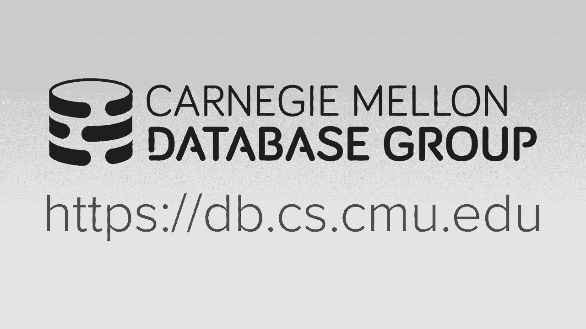

# 【双语字幕+资料下载】CMU 15-721 ｜ 数据库系统进阶(2020·完整版) - P7：L7- OLTP索引 2 - ShowMeAI - BV1wv411w7Ko

[Applause]，[Music]。

[Applause]，[Music]，so today what I want to talk about is，the beginning just pick up on the stuff。

we didn't discuss last time so I think，the I think mistake I did this this。

semester was I trying to cram what was，the three lectures now into two lectures。

so normally we would discuss b-trees B，plus trees and lashes separately but now。

I'm trying to include them in discussion，of the tries here，so first we'll discuss how to actually。

implement latches or what kind of，lectures we could use our data system。

then I was talking about how to do，latching in a B+ tree and of course this。

would be now contrasting with the BW，tree which is meant to be a tree here's。

one you know people ask you you have to，have latches and then we'll focus on the。

what you guys read about and today's，assigned reading on the Judy ray are。

indexed in the mastery or they're all，variants of tries okay all right so。

again recall from the introduction class，when we discussed the different locks。

and latches that locks were this logical，concept in a database system meant to。

protect entities within the database，itself like we take locks on tables take。

lock on tuples take locks on blocks of，tuples we're in the entire database and。

then the latches we're gonna be these，low-level primitives you would use to。

protect the critical sections of any，kind of current data structure and。

anything that needs to have multiple，threads accessing or modifying at the。

same time and so this can get confusing，if you're coming from the OS world where。

there's no notion of a latch there is，now in C++ but it means something，completely different。

in the OS world they referred these，things as locks so for today's lecture。

we're mostly only talking about latches，and it's sort of confusing because the。

way you would implement a latch is a，spin lock so when every time I say lock。

in this lecture I really mean latch but，let me go read out you know read things。

that aren't in the database，literature community they'll refer to。

things as locks but they really mean，latches when you're in two databases。

which is began a confusing sorry，all right so if you want to have a latch。

in our system right again we are the，database system developers we are the。

people actually building the system so，we need to make a decision about what。

kind of latch you want to use I would，say we're not in the business of writing。

latches ourselves and I do not encourage，you to do that although you can build。

them as simple as one will show in a few，more slides but the general conventional。

wisdom is do not write your own latching，library there's a ton of ones already。

out there and just pick one of those so，we want to talk about what we're gonna。

want to have in our latch that we could，apply to our database system to sort of。

get have to be most efficient in terms，of storage capacity of how much space it。

takes to occupy the latch in memory and，also the efficiency of sort of the。

latching mechanism itself so obviously，we want to we want a small memory。

footprint right think about now in your，B+ tree or in your own your radix tree。

that will talk about today like every，node is gonna have a latch so if your。

latch is like you know a couple hundred，kilobytes that's stupid that's wrong but。

even then if it's if it's a couple，couple bytes that can start to add up。

because you don't have one for every，single data structure or every single。

node so like in the pthread mutex they，are gonna be 64 bytes which is actually。

a lot right and the reason why it's so，big is because they have to for。

historical reasons they have backwards，compatibility with some older CPU。

architecture that required the latches，to be 64 bytes but there's other。

implementations that we could use，that'll be much smaller we obviously。

want in the best-case scenario when，there's no contention on whatever it is。

we're trying to access that we can，acquire the latch very efficiently so。

this is right we want a fast execution，path when there's no contention we just。

go ahead and choir the latch and it，doesn't take a lot of work a lot of。

instructions for us to do that and then，when the if we can't acquire the latch。

then we want to be able to be scheduled，our thread with the operating system so。

that we're not just spinning their，burning cycles in a spin latch which。

I'll show in the next slide right，because this is just burning cycles and。

wasting the CPU and the OS is gonna have，trouble scheduling you because they're。

gonna think you're actually doing work，and sheep keep trying to schedule to。

execute you when actually out，you not if now we have to maintain any。

metadata also - about what threads are，waiting for us or what threads are。

waiting to acquire latch we don't want，to have to have each of our latch。

instances allocate and maintain their，own queue data structure to keep track。

of what threads are waiting so if we use，us，but if we're using something in。

userspace right above the kernel then we，don't want have to have every single。

latch you know maintain its own queue，because that's gonna blow up the size of。

the thing so this is question is going，to us and saying I can't run anymore。

don't and I'm here's the here's the oh s，lock that I'm waiting to get notified on。

we'll get there his question is does，that means every single latch。

implication has to wrap it or lock no，but it's actually your question is。

actually very pointy because this is，actually in the been in the news if you。

want to call it that on like hacker news，and a limits mailing list because some。

guy that was working at Google on their，new gaming console vast attea thing it's。

like that it's the streaming gaming，console they had this long blog post。

about how the OS kernel locks are a，mistake and you would be really wouldn't。

be using spin locks so then of course，Linus didn't like that and he had a long。

post where he was saying like about how，this is wrong they were you know why。

user lands spin locks are a bad idea，so I'm like I was gonna read the whole。

thing the only thing I'll point out，though is he has this one comment here。

that I'll highlight where he says do not，use spin box and out world spin latch in。

user space unless you actually know what，you're doing and the likelihood that you。

know what you're doing is very very low，right so prior to this every semester。

when I taught I taught latches I'd，always say oh yeah never used an OS。

latch a few texts for pthread mutex，because the going down into the the。

kernel was always really expensive right，to tell the OS hey I can't run anymore。

that's now going into the，to the OS you have to update the the the。

data structure that the scheduler is，maintaining to keep track of what。

threads are running what they're waiting，for，and I always thought okay yeah there's。

better off to do everything in user，space so he's claiming that you know his。

mind the OS is always can do a better，job than what anything else could。

possibly because it has least a global，view of everything that's going on and。

can make decisions about whether the，scheduler or not right we can't control。

that in our database system entirely if，we do green threads and manage our own。

threading stuff up above we could do，that but that's usually an overkill for。

from those systems all right so again，the point I'm talking about make here is。

that prior to this this blog post I，would always say use a test spin latch。

and I think the current understanding in，the state of the art is that you don't。

want to do this alright so let's talk，about how we connect with the different。

end of latches we can implement so the，test and spin lock or the spin latch。

it's the most basic one and this is one，you can implement yourself without。

necessarily going back and yielding to，the OS then there's a blocking OS mutex。

which is what Linus was referring to and，then I think the right thing to choose。

actually is this one the adaptive spin，lock which is a combination of these。

twos and a little bit smarter than what，the OS blocking one can do and then。

we'll look at more sophisticated，implementations the cubase one and the。

reader/writer locks but you can build，these on top of these these other ones。

here these are like the basic primitives，and then you can do more sophisticated。

things on top of this so the most，simplest way to implement a latch is the。

test and set spin Locker the test set，spin latch all right and all it is is。

that we just have some chunk of memory，look like a single byte or there are 64。

bits that we're just gonna test to see，whether it's set to zero and if it is。

then in a single compare and swap，instruction we'll set it to one meaning。

we've acquired the latch and so you can，get this in C++ they now in the STL。

standard they provide you with this，atomic template type and then you can。

put whatever like you know primitive you，want boolean integers and things of that。

in them so late you basically use it as，like this so I have I define my my latch。

and this is just a syntactic sugar to，declare an atomic boolean and then I。

this while loop where I try to set the，latch if it's if it's zero and my single。

parent swap instruction sets，the one I hold the latch if not then I。

fall down to this wild loop make some，decision about what to do and then come。

back and try it again from spinning and，burning executing burning cycles trying。

to get this thing over and over again so，the tricky part is obviously in the。

middle here and this is what Linus is，standing like that the decision of what。

to do here is non-trivial and you may，end up doing the wrong thing that could。

cause the OS to big bad skeleton，decisions like you could is yield。

immediately but then that's you know and，that's now going down to the West and。

more syscalls and getting slower in a，database system like in the case of the。

like in the the BtoB tree he was asking，like isn't the mapping table caprile。

swap operation isn't that the same thing，as a latch sort of yes right because if。

I tried to update the the location，mapping table don't get it then that's。

all abort the operation and restart over，again or I can retry and go over again。

all right so again this is the most，simplest way to do do this we use a in。

our system now we actually use a spin，latch that does essentially the same，thing。

written by from from Intel called the，thread building blocks so if you ever。

see like there's a spin latch in our，system now it's it's essentially doing。

best but one of the downsides of this is，that it is not very cash friendly so。

what I mean by bad is like say I have，two two threads running on separate。

sockets and there's some latch they both，want to acquire here so what's gonna。

happen is say this thing is held by，another even another thread then these。

guys are just going to spin and keep，trying to call test and set open over，guy。

the memory is local to him we'll talk，about new marva textures let it later on。

but like this thing of this dim is is，it's closer to this socket and it can。

access it more quickly than this other，guy here so he can do this efficiently。

but this guy over here has to now go，over the interconnect and say you know。

over and over again is this thing set is，this thing set and then whenever。

somebody else quire's the latch then we，have to do a cache invalidation message。

because we know this guy is trying to，read it alright so so the most the most。

simplest spin latch is not efficient，from from the cpu standpoint it's not。

scalable and the OS is not gonna be，doesn't not go know anything that we're，to。

about the the OS lock right this is，sometimes called the basic OS mutex and。

the basic idea is here is that I declare，in under ela plus a standard mutex and。

then it's just like the other code I had，before where but instead of having this。

the spin explicit while loop where I'm，spinning trying to choir the lock I just。

say hey try to lock this and then in，this case here my thread will get。

blocked if I can't get it otherwise then，I fall into the critical section do。

whatever I need to do then anybody knows，what what you have to get when you。

declare a standard template mutex what's，that you have a before underneath a few。

texts like before you - yes but like，there's an alias in front of that -。

Peter mutex right and the PAF mutex is，just a few texts there anybody other。

than handled a few Tex stands for fast，fast user space mutex so what it is it's。

basically a spin lock plus an OS lock，combined together so what will happen is。

I have a begin the user space latch the，spin lock and then the OS latch down in。

the kernel so if I have two threads come，along and they both want to access this。

by they people won't acquire this lock，right say this whole thing represents a。

single single lock this first guy gets，it the second guy doesn't so then he。

goes down now and waits on the on the，the kernel lock of the kernel latch and。

now he gets D schedule the schedule，knows that he's waiting for this thing。

to get released and once that happens it，so this right so this part is cheap。

because this is just a test and set and，then and again under a when there's no。

contention this is super fast because，this is just hanging out in userspace。

memory I can test to see whether I，require it without having to get this。

call if I can't get it now I got to go，down and block on this thing that's。

expensive cuz that's a cisco get and in，some measurements we take roughly around。

95 nanoseconds which which is a lot，right think of that like in the test set。

case it's a single instruction which，could be depending whether it's in cash。

or not it could be one cycle tool，to acquire that patch in this case here。

because we're going down the kernel the，kernel has its own protective primitives。

then that gets expensive so what a，better approaches sort of combines the。

two of these and still it looks like a，few texts because there is still that。

fast user user part is called an，adaptive spin lock and the idea here is。

that unlike in a spin lock where we spin，and user space over never again trying。

to acquire and unlike in the fast user，mutex where we we immediate try to get。

the the latch we can't get it then we，fall down to the OS kernel which you can。

actually do is allow a thread to kind of，spin on the user space lock for a little。

bit and then at some point you give up，and then you fall back into the the OS。

kernel alright and try to lock on that，thing and we're going to call this is。

now a user space is this parking lot，where you can have in user space keep。

track of like all the threads that are，waiting for this you're sort of。

replicating what the OS is doing but，because it's up in user space and not。

assist call you can potentially be it's，much more faster in some ways and then。

what will happen is if a new thread，comes along tries to acquire a latch we。

see that the user space latches already，is held and we see people in our parking。

lot getting or that they're that are，blocked then we meet Lee's go park。

ourselves and say we're waiting on this，as well and we don't have to go down and。

block on the OS kernel right well in the，parking lot there is that there is a lot。

that will get us down to do scheduled so，Apple has this thing called the WTF。

parking lot lock or the deputy of lock，it stands for like the WebKit template。

framework or something but this is seems，to be the if you're not gonna use a you。

know a blind spin lock in you're not to，use oh it's blocking mutex this might be。

the better way this supposedly is better，to use although Linus disagrees so this。

exactly what the hyper guys are using，our for Umbra in Germany and somebody。

else is using this but the name excuse，me now there's another data system as。

looked into using this as well and they，claim it it's much better than the OS，blocking mutex yes。

I think I think it's supposed to adapt，actually going back to quickly the other。

thing to point out too is like in the OS，blocking you text when you allocate the。

lock it has like when you allocate the，mutex it allocates the the user space。

one and the LS lock in this case here，you don't actually allocate the OS lock。

until you actually need to block on it，till you get put into the parking lot。

and in Apple's Warford WebKit this they，wanted this because I think they're。

requiring a latch for every single，JavaScript object that gets instantiated。

right in the Java Runtime or start a，JavaScript runtime and so in there well。

they have a lot of latches in a database，system yeah we have a lot of nodes and。

RB plus G potentially but not at the，level of like that maybe they're facing。

alright so now let's talk about some，some better implementations that we can。

build on top of our basic latch，primitives so the exam I show with the。

spin box where there's this cache，coherency issue where if two sockets are。

trying to access the same latch we have，traffic going over to interconnect all。

right where the one guy's trying to，everyone trying to spin on this one，location and we have to send。

invalidation messages to every single，thread you can do a cube a spin lock。

where instead of having every thread，blocking on the same memory location you。

sort of daisy chain them together so，that one thread blocks on one location。

and the next thread blocks on the next，location and then when you start。

releasing them right sort of propagates，through the queue and so when you really。

start at least one of them it's only one，sort of cache invalidation message。

because only one thread is actually，blocked on one location at a time so let。

me show what I mean by this all right so，so this is sometimes called MCS so the。

Linux kernel actually uses this for，other aspects of internally other other。

system Melora crumby and scott's the，name of the guy that meant to this so if。

you google best googoo whom MCS spin，lock you'll find information about it so。

we had his base latch again this could，be a they always blocking mutex the。

parking lot one it doesn't matter and，then we have now our CPU comes along。

alright and then when they want to，acquire this latch assuming this thing。

is already being held by somebody else，we're gonna go ahead now and update our。

pointer to keep track of that this is，the next one we wanted this is the next。

one to release right okay sorry bad，mistake let me sort of this guy wants to。

quiet this latch it's not being held，right so he's gonna stand she ate this。

new latch place holder in this cue goes，ahead now and acquires the lash by。

setting the pointer to now this new，location here right and once that's done。

I'm gonna compare and swap we hold we，hold this latch now when another threat。

comes along they're gonna try to acquire，this latch see this pointer is set and。

realized they can't send they can't，acquire it so instead of spinning on。

this and trying to do test and set to，see whether I can acquire it right they。

are going to then follow the pointer，here see that this thing is now unset。

update its pointer which is prepare and，swaps it now it's it's sort of claiming。

this place position in the queue and，then it spins on this right same thing。

and so forth like that all right so then，now what will happen is if this guy ends。

up releasing the latch right it would，then get notified that this thing got。

released and then this guy could get get，you know take the latch next all right。

so this is nice because again like this，could be in one see me，this could be one region of memory on。

one socket this could be in another，region and they're just potentially。

spinning locally not going over to some，remote memory location yes if I released。

this I and four shows up where do they，follow yes I think the lines are kind of。

bad this thing is actually spinning on，this because it's waiting for this thing。

to get released right there for this，pointer to get set back to zero so this。

is everyone always has to start here in，traversal aw yeah the tricky thing now。

too is also like say in in my example，here everyone just waiting to acquire。

the latched you always want to want to，do it but if I have like I bought my。

operation if I try to spin too many，times and like and like this guy goes。

away now I need to sort of reconnect，them because I have this hole and that。

that starts to get tricky right if you，always know that I'm gonna block forever，will。

block forever - TV makes you do，something then this is fine but if you。

need to pull things out at different，positions then it gets harder。

yes like is it like what is that what am，I actually doing here right and I'm。

waiting what I'm actually doing it could，spin or - could like could be swapped。

out do you do signals for this you could，it depends on position I actually I。

don't know right you could just like，increase the amount of time you're to。

let you're waiting because it takes，longer you could do a signal yeah I。

think it ends on April edition I don't，know what you'll do I don't know what。

the colonel does alright so then the，last one that's off to probably the。

super important for databases as well，reader/writer latches and the basic idea。

here is like just like we want to have，under two phase locking we have multiple。

readers one a tuple and a single writer，we want the the same thing in in our。

slashes right so basically you need to，maintain now two latches and then a cue。

of what threads are waiting for the to，acquire the latch and is then we can。

make decisions now about who should，actually acquire the latch if we have。

cues in both side so say that thread，shows up he wants to read latch the。

number of writer threads is zero the，number of reader frets is zero so this。

means we're able to acquire the latch，and we just do a compare and swap to。

increment this counter by one next guy，shows up same thing wants quite a read。

latch we already have a thread that they，will that holds the read latch so this。

can be shared so we allow him to go，ahead and and and acquired as well he's。

update the counter now our writing，thread shows up tries to acquire the。

right latch can't do that because the，read latch is currently being held by。

two threads so we go ahead and just，queue ourself up as waiting another。

thing that comes along was to do a read，we could just let it acquire the read。

latch right away and let it run but of，course this might starve the writer so，we'll block。

sky update its counter to be to be one，once these guys go away then this guy。

can acquire the law the latch right I，just useful for all different parts of。

the data system yes so today's question，is with the spin latch does it make。

sense to put a sleep in there like a，nano sleep or something that makes it so。

I'm not burning cycles and that could，let potential that they always do other。

things yes but there's this trade-off，right like if I if I put some amount of。

sleep in there is it the fact you get to，the line at this point it's hard to get。

this right if I put a sleep in there，then yes I could I'm releasing the CPU。

to do other things but now that means，that when it's when they latch is。

actually available to me I could，potentially be waiting longer before I。

can go ahead and pick it up and run but，now if I go the other direction I'd make。

my sleep time super small now I'm，burning cycles and the CPU looks busy。

but it's not doing anything useful so I，think again for project one the CPU when。

you run out on a lot for that take a，benchmark we gave you guys the cores are。

spiked at 100% why because they're all，spinning or trying to choir that latch。

because the Intel one Idol thing yields，the Intel latch we're using doesn't。

yield okay alright so now I want to，briefly talk about how to do latch。

traveling and coupling in a B+ tree so，in the intro class we describe what it。

B+ tree is same thing and in memory，database right we have key values arrays。

in our nodes and only the leaf nodes，contain the actual pointers to tuples。

and then everything else above that are，just guide posts right so why do you。

want to use a B+ tree it's the same，reason why we want you to be double tree。

or any other order preserving data，structure because now we do lookups in。

in log n alright so the we discussed，latch crabbing coupling last semester。

but I want to go over in more detail now，that we understand power actually could。

potentially implement latching or our，latches and then we'll talk about a。

variant of latching from the hyper guys，for art that is not necessarily specific。

to a B+ tree they actually do use the，same technique in art but I'm going to。

show it in the context of a，of a the people s tree so the idea here，is that because everyone allow。

concurrent access to our data structure，we have to protect it and there's。

obvious thing to do is protect it with a，single latch for the entire tree of。

course that would be stupid because now，becomes single threaded so we're gonna。

do is an as now as threads start，traversing into the tree we want to。

acquire latches as we go down and we，only want to release them the latches。

that are above us when we know that the，node we're at is safe and we're defining。

safety meaning based on the operation，we're doing we know that won't be any。

split or merge below us or at the node，that we're at that would cause us to。

have to make changes up above us in the，tree so once we know that we're at。

everywhere to say I know that is safe we，release any latches that we've required。

on the way down and then now although，threats can come behind us and start。

doing lookups or modifications as well，because they may be going down a。

different path in the tree right so，first for the most basic protocol for。

search because we're not modifying the，database we just take latches one by one。

going down and then once we reach a node，we can release the latch on our pin on。

our parent node because we don't need to，go back for insert and delete again once。

we know that a latch were add is，considered safe we can release all the。

right latches we've acquired on the way，down so for the search again basic basic。

operation is I want to do look up on key，23 down here so at this first node。

acquire to read latch then I traverse，down to this certain this node here and。

at this point here because I'm doing and，just just look up I'm never gonna go。

back to the root node a so it's safe for，me to go release that latch and this is。

why it's called sort of crabbing because，it's just be helical like a crab walks。

like with one one leg forward then the，next one and back and forth so then we。

get down now to here same thing we can，release the latch on see because we。

don't remember to go back to it and then，we go down here to FM do our read on。

read on 23 now I didn't do a delete，start with start with a we take a write。

latch on a come down here take a write，latch on C and now at this point here。

because we're gonna do a delete we don't，know what's below us in the tree so if。

we do a delete down here that causes us，to have to do a merge we may end up，losing our key here。

and now this note would be empty but，because it's a P plus tree has to be at。

least half full so there may be a change，below us that causes this thing to get。

merged and which means what the update，pointers up here so therefore it's not。

safe for us to release the the latch on，on on a at this point so then we come。

down to W our started to G we're，deleting 44 at this point here we know。

we're not going to have to do a merge，because if we delete 44 then our note is。

still half full so everything above us，is safe and we go ahead and release。

those latches and then now at this point，we can go ahead and delete our key see。

the idea is we will release our lashes，as soon as possible when we know that we。

don't need to go we will never make any，changes up above us right so we want to。

do release the latches before we，actually do our delete all right because。

I'm releasing latches sooner rather，later allows other threads to make。

forward progress all right so insert 40，right take the right latch on a take the。

right flap Chauncey now this case here，we know that if we have to do a split。

below us see has an extra space for，another key so we don't have to we don't。

have to split this guy so it's safe for，us to release the latch or name then we。

come down here to no G in this case here，where we wanted to start a key we don't。

have any more space we're gonna have to，split it so therefore we have to。

maintain the right latch on won't see，above it so that we can then update it。

with our new or their new pointer here，all right and then when one's that。

that's done you then release the latch，on C and then release the latch on G all。

right we always recently release latches，from from the top to the bottom okay all。

right so that's the basic latching，protocol there's obviously it's it's。

inefficient because in all my examples，when I did an insert or delete the very。

first thing I did was take a right latch，on the root and then go to the next。

child so that means that F every every，thread is trying to update the data is。

updated index actually any threat also，trying to read the index will get。

blocked anytime I have a writer because，they're always taking the right latch on。

the root so a better approach is to be，optimistic and assume that when I get to，my leaf node。

it's not gonna through to a split or，merge and therefore I can take real a。

ch's all the way down and then right，before I get to my leaf node or at the。

leaf node I take a right latch check to，see whether I my assumption was。

incorrect if if it was not like if I if，my something that I'm not gonna do a。

splitter merge was correct then I take，the right latch to do my change and I'm。

done if I am incorrect then I can come，back again and now take the more。

heavyweight right latches all the way，down all right so let's look at our two。

examples late 44 and then the insert so，I'm gonna delete 44 again under。

optimistic approach I take take a read，latch take a read latch again at this。

point here I don't go back to the root，so it's okay to release the latch on a。

now I get here and then I can release of，latch on see it's my assumption that I。

was not gonna have to do a merge when I，do my delete was correct so I can go。

ahead now and just do this leap so，instead of hagun right latches all the。

way down I took a read latch right and，then you do the same thing for the for。

the insert so is this clear so there's，even better approach where we can avoid。

having a block the the readers on the，writers or sorry block the writers on。

the readers by doing by not having a，right latch at all，sorry latch at all and the idea here is。

that on allow threads to read anything，they want as they go down but then after。

they after they complete their visit at，a node you check to see whether it's。

modified since when you started reading，it if no then you know no writer came in。

and modified it and you just proceed，down the tree if you do see a。

modification then you realize someone，else got in before you parole you。

finished and then you just restart so，there's no more there's no more read。

latches anymore there's a write latch，present to prevent to write latches from。

modifying the same note at the same time，but anybody that's reading the whole to。

read that that won't block any right any，of those right latches right。

and so the because now we have that we，have the issue of like what we could be。

doing splits and merges and now then，since there's no real，we don't know whether somebody is。

reading something when we start deleting，things we do that scene same epoch。

garbage collection we did last time in，the BW tree so that we know that there。

could be a thread hanging out in our，at，within our epoch so it's not safe to go。

ahead and clean up the nodes just yet，and then once everyone leaves the epoch。

we can go ahead and clean it up so let's，look at an example here so right every。

now nodes gonna have this virgin counter，just 16 bits or 32 bits in the header。

that says this is this is the version of，this node and anytime you modify it will。

just increase that back counter by one，right so say we want to do a search on。

44 right so we start at node a the very，first thing to do we're gonna mean what。

the version number is for this node，right so we can keep track that we read。

node a at version three then we examine，the node do whatever we need to do in。

this case here we're searching over 44，so 44 is greater than 20 so we're gonna。

know we're gonna go down this side of，the tree here so we go ahead and do that。

now we're at node beep and what we need，to do is get read our version here but。

then go back and read the version that，we know of the node we just came from I。

maintain a stack of pointers of the，nodes as we Traverse down so we just go。

back and look where do we come from and，then we check to see whether this。

version has changed since since when we，started initially when we read it if not。

then we know that nobody modified it if，it was changed then we have to border。

operation because somebody did something，here that we missed that we should have。

seen and want to go back and start over，again right because somebody could have。

modified this index of this node here，and the correct pointer to the right。

side of this key is now some other，memory location here and we followed the。

old down the old path and there may be，garbage below us so what does a abort。

question why don't go all the way the，leaf and indeed what sorry his question。

is why don't go all the way the leaf，don't essentially don't do this recheck。

here to go all the way the bottom the，pointers will be ballad I think he is。

that true yes the pointers are valid cuz，there you can't clean anything up before。

you switch the epoch so I get to the，bottom and now I say alright well what。

did I read all all the virgins or any，diversions change if know that I'm fine。

if yes then restart so in that case I，mean it's sort of like an OCC like we。

talked about cicada if you're if there's，gonna be a conflict and your apt about。

bored maybe you want to abort sooner，rather than later so that you're not。

doing much a work that is end up wasted，right but in doing this recheck is cheap。

it's just reading that memory location，to see whether it's change it's not like。

I'm it's in memory not like I'm fetching，someone modifies C or a yes on say so I。

think you're saying if someone notes，let's go get example and we'll come back。

to the right right I think you're I，don't you you don't have to modify if。

you modify this guy you don't the，modified this guy unless you did a split。

merge that caused this thing to get，changed alright so now I do my exam in。

my node find Phi McHugh I'm looking for，say they now I get down here on C read。

benign check v5 still valid if if that's，that if yes then I'm fine then do。

whatever need to do and I'm done so，let's rewind and go have the thread come。

back be we just finish checking our，reading node see we Traverse down sorry。

reversed down to G I bet should be this，should be a at a，at CES gee sorry so say now another。

thread writer that comes along and he，modifies this this note here so he。

choirs the right latch on it which，implicitly acquires the right latch on。

this and then when they complete their，modification right they modified the。

increment the version counter by one so，now when this guy's down here and he，rechecks。

hey is note C still set to v5 if no then，he knows that somebody else had come to。

modified this and therefore he shouldn't，have gone down here and he just。

restarted so in this case here like what，did i do i did a delete I didn't say。

right I did some modification here but，it didn't have to get propagated up into。

the questions say this guy modifies it，but then by here when I'm down here。

I went checked and still b5 and I'm done，and then I'm back here and then like。

like connects complete yes correct yes，yes okay so one thing about this that。

this potential problematic is if you，have really big nodes like if you if you。

have a lot of keys in a single node then，these versions are very coarse-grained。

right they're saying for the entire node，like say I modified something that was。

this side of the tree and and this，pointer is still valid and everything。

over here is still fine then I'm not，gonna be able to catch that I'm saying。

oh the whole node change the meas go，ahead restart all right and then so。

again the sort of this trade-off you，could have more fine-grained versioning。

per per key for element in the node but，the way they did in the hyper that has。

especially restart from C so again it's，like the B to B tree I think you always。

inserting by 40-mile and reading it one，day we won't read like somebody's，inserting like moving 44。

sir someone's inserting what sorry all，right so what what is being torn there。

sorry like like the I insert 40 here，right because like because the reader。

can come down and they don't get blocked，on on this on the right latch could be。

the case like in the memory，representation of the of the node could。

be the case that I you know I update the，the the the key list but not the the。

pointless actually I think the readers，blocked the readers do get blocked on。

the right latch I take that back they，have to be in otherwise have this。

problem yeah but I like the writers，don't block on the readers that's the。

difference yeah the coarse grain issue，yeah like you get a cache invalidation。

your entire note it gets shot out or，brought back in your entire notes，actually。

yes yes the statement is I said if you，make the note too long then you have。

these course rating blocks but if you，make it be a cache line size which is 64。

bytes then you can't atomically update，it but like at least it's being moved in。

and out of memory atomically that，depends on like the memory model it OS。

and also the CPU and what it guarantees，in terms of writes like the organ writes。

that'll make it more efficient but I，still think you need the latches to。

protect things yeah yes well we're 45，minutes let's let's take this offline。

cuz yeah I just realized we're 45，minutes in we haven't got to the tries。

yet you have a quick question order okay，yeah sorry yeah databases okay all right。

so let's get to what would you guys，actually read about so we'll cover bi if。

you want I discussed P plus trees when，I'm a bit more when we just talked about。

project two when we release that all，right so the in the B plus tree and like。

a B every tree I call them whole key，indexes the idea again you have this。

entire key being represented at all the，various nodes in the in the tree you can。

do prefix or suffix compression but we，can ignore that for now but in the case。

that B plus tree because the inner nodes，only contain guideposts if I want to。

know whether a key exists in my in my in，my table I always have to go to the。

bottom the leaf nodes and then see，whether that key exists if I see that。

key in an inner inner node it may，actually not be in the in the table。

because if I delete a key I don't，necessarily remove it from all the。

Internet's as only through the split and，merge process where it could get pruned。

out right so now if now it sort of his，comment if I have if I make my node be。

the size of a single cache line then in，the worst case scenario in order for me。

to figure out does the key exist in my，table I have to pay one cache cache miss。

for every single level of the tree right，just to see whether something exists so。

this is sort of the motivation of the，choice right the idea is that instead of，storing the the whole。

at every single node we could store a，digit of the key at a node and that way。

if we determine we can determine，potentially more quickly whether the。

thing we're looking for is is not there，or not so tries are really old I think。

they're from like the 1950s like some，French dude amend it and then he didn't。

have a name for it and then there's this，other guy Edward Franken who supposedly。

is at CMU he came up the name of of，tribes right shore for retrieval tree。

but again the basic idea is that for all，our keys we're gonna break them up into。

digits and then store them down you know，one digit at a time so in the case of。

this this data set here I have hello hat，and have so at the first level。

I'll have H because that's being shared，by all the keys and then I have I can。

have a path down just for just for hello，and then just like in a B+ tree down。

below at the bottom will be the pointer，to the actual tuple that you know that's。

represented by this key right so，sometimes you'll see these referred to。

as digital search trees or prefix trees，they're also radix trees and Patricia。

trees those are compressed versions of a，try the sort of original try data。

structure has the full P represented，like this，so tries are actually really interesting。

because the unlike a B+ tree words login，for for the the the search time on。

average in a try it's ok where K is the，length of the tree or a lot of sorry。

length length of the key like if I have，a key of ABC then to do if I'm not doing。

any compression to look to see whether，ABC exists and I try assuming I'm。

storing one character at per level then，it's just three right we're in a B+ tree。

I could be mixing with a bunch of other，stuff and it could be it could be longer。

the all that you think about them is，that the data structure is deterministic。

meaning if we have the same set of keys，and we can shuffle them in any order and。

insert them in any order we will always，end up with the same try data structure。

I just could the nature of how we're，doing the the doing the combining。

overlapping digits right in a B+ tree，it's totally not the case，order。

I could end up a completely different，data structure from one time to the next，right。

so the keys will never be actually，stored in their entirety and so we have。

to recreate them by by taking the path，down we get to the bottom and we keep。

track of every digit we see along the，way so then then we can put the key back。

into its original form so the language，we're gonna use to describe the。

properties of a try the key the key，concept is called the span and this is。

just the number of possible paths we can，have coming out of a given node right。

essentially it's the number digits that，could exist and so what will happen is。

if a digit exists in one of the keys，that we're trying to represent at our。

node then we'll have a pointer now to，the next node in our try going down。

otherwise you store null you need a way，to represent that so the spans。

representing the fan-out which also，represents the physical height of the。

tree so anyway try would say we have a，fan-out of n so let's look at actually a。

real example I actually wouldn't how you，actually could represent a real try in。

memory so let's say that we'd have the，most simplest try as a 1-bit try all。

right so that means at every single node，we're going to represent a one bit digit。

it's either 0 or 1 so say we wanted to，store the keys 1025 and 31 so we would。

represent them and binding a binary form，like this so in actuality they'd。

probably be 32-bit Kesey or 64-bit keys，we'll keep it simple and we'll say it's。

16-bit so we have 2 2 bytes representing，each each key so our track it looks like。

this so at the first level here right，it's representing the what the value is。

for the first digit position right so in，this case here there are all 0 right。

so in our node we have for the the digit，0 we have a pointer down to the next。

next level and then for the digit 1 we，have a null pointer all right so now if。

anybody looks up and say well is there a，is there a key where the first digit is。

1 we would look at this first node see，that this thing is null I'd know that，the key could not exist。

now for the next one here I it's the，same one as the one above it zero has a。

pointer one is null and I'm just gonna，repeat its a repeat ten times because。

the next ten digits are all the same，thing otherwise we've run out of space。

now we get to this position here now we，see there is actually a difference。

between the keys right this first one，here the digit is 0 the second to the。

digit is 1 so I have now a pointer over，here for the 0 path and a pointer over。

here for the 1 path and then going down，for this key here right there's nothing。

the Reg actually no I mean there's only，only one key of my corpus has a 0 at。

this position so this one here only has，one pointer down to one one level to the。

next over here for the other two keys，they are the same here but then then。

they split 0 1 like that and then we，traverse down for both of them right so。

what's like what's one easy optimization，we could do to compress the size of a。

node okay let's boil all right yeah，what's one easy cop what's the one easy。

optimization we can do to compress the，don't start every pointer for the ones。

that don't have anything we don't do we，don't do that anyway right that's that's。

null we're not storing any but that's，not gonna compress the size of a node。

that's how decrease the size a single，node exactly yes，yeah so he says take out the zero one so。

I don't need to store 0 and then the，pointer and then one and then the。

pointer I implicitly know that well if I，want to know whether there's a is there。

a pointer for the position zero digits，zero in my array a pointer so to say all。

right here's here's you know here's a，pointer and if it's null then I know。

that the value of the digit 1 doesn't，exist right so this is horizontal。

compression this is compressing the size，of a node what you're referring to is。

vertical compression where if I now have，in this case here and over here once I。

get down to this path there's no there's，no alternatives it's always go。

from one level of the next there's no，branching out so instead of storing。

every every single level and there's you，know these pointers essentially always。

take you to the bottom I can then just，compress it down to only store too short。

nothing right in this case here this，path here has nothing else going down so。

I just replace that now a pointer to the，actual tuple and then for this one here。

the same thing at this level here I just，have the tuple pointers going out to the。

squishes how do you differentiate，between a point or another node and。

pouring two extra tuple sort a bit yeah，yes yes oh yeah that would be yes that。

would be can you do that you would need，need a way to record that this thing was。

yeah yeah yes yes yes right so that，there's another way to do vertical。

pressure yes so the one thing point，thing to point out here though is that。

if I do this kind of compression in a B+，tree again I have the whole key in in。

the leaf node so if I want to see，whether that key exists I'm you know I'm。

guaranteed to get an answer from the，from that the B+ tree because it's。

either there or not there in this case，here I could have a key that had 0 0 0。

and then had a 1 here I'm gonna look up，to see whether I have a key like that。

but I don't know this because I hated it，here so I know I have to follow this。

pointer and go actually look at the，tuple like I did in the tea tree to see。

whether this thing that actually is，matching me or not so although I can。

compress the size like this reduce the，height I may still have to go look in。

the in the look at the tuple a actually，get the original key this also prevents。

you from doing like covering indexes are，covering the queries where you want to。

be able to answer a query entirely based，on the index right and a B+ tree you can。

do that like if you if my index is on a，and I do a lookup it looks you know。

select a from from the table where a，equals，I can just only have to access the index。

to answer that query in this case here I，still have to follow the pointer to get。

to the original tuple okay so this is，sort of crash course or tries because we。

covered this in the intro class but now，I want to talk about more sophisticated。

variants implementations of the tries，that people are actually using。

so Judy arrays were came out first and，they were developed by HP the art index。

was was in the paper and you guys read，right from the hyper guys and the。

mastery is a variant of a try where it's，it's a try of trees and every node will。

be a B+ tree and so by understanding why，what they do here they'll see what why，mastery。

okay so the the Judy array and your，index will be both 62-56 wait rise so。

that means the span or the number of，digits they're storing per node will be。

256 but the goal is now store them in a，compressed way so we don't have to。

allocate all that memory to store the，tour 206-999-9251 ailing let's post。

where the authors of the Judy race，like and 8hp doesn't care about this go。

ahead and use it any way you want right，but as far as you know although like it。

you know it does solve a lot of problems，and can do you know very succinct。

representation of large key sets the，best my knowledge nobody actually uses。

them right because whether or not，because of the patent I don't know okay。

so the important thing that's going to，happen in the Judy right that's can be。

different than the b-plus dream and the，BJP treaty is that they're not gonna。

store any metadata about the node in the，node itself I think again think of like。

MVCC and the header of the tuple we，would store like the time stamps in the。

B+ tree you restore information about，what keys are havelet's what offsets I。

have we're not gonna do any of that，we're only gonna store information about。

a node in the pointer to that node and，so in a red X tree you're not gonna have。

any sibling pointers that you have in a，B+ tree but you can't scan along the。

leaf nodes you always have potentially，backtrack so that means that for any。

given node because we know there's only，one pointer to it so we don't have to。

worry about keeping that synchronized a，bunch of pointer synchronized if we。

modify the layout of that node so the，what's gonna happen is they'll have to。

store a pointer a memory pointer that，there's as we normally would to get to。

the location of of the node but they're，actually stored double the size of a。

pointer to actually pack in all this，additional metadata like the node type。

the number of keys the population at the，at the node what the prefix value could。

be if there's only one child below and，then the secret try pointer so if my I。

have a 64-bit child pointer，I need another 64 bits to store all this。

extra metadata in the original duty，array implementation they're back you。

know on x86 32-bit so they had 32-bit，child pointers and then 32-bit metadata。

but now in in in modern systems it has，to be 64-bit corner so it takes a。

hundred twenty 8-bit pointers so they're，going to call these Judy arrays or。

Judique sorry Judy pointers in the paper，you guys read that evaluated them。

against the radix tree I think they call，them fat pointers it's the same idea。

so the they're gonna have three node，types again so it's a 256 way try。

so that means that you can store up to，260 jets per node the idea is that not。

every node is gonna have exactly two，hundred six digits，so rather than storing you know two。

hundred six pointers they're gonna have，a more compressed form to represent。

these things so we're going to talk，about the the linear node and the bitmap。

node the uncompressed node will be the，same thing that will what they do in。

sorry I take back what's talked about，talk about the Lina node and the the。

bitmap node the uncompressed node will，be similar to what hyper does but hyper。

also have the linear node it's the，bitmap node that they're they're gonna。

be different the idea here is like say，if you have like a you know if you're。

storing like strings and you're storing，URLs a lot of URLs are gonna start with。

dub dub dub dot and then whatever the，domain name is so I could in that upper。

node those digits are always be the same，so I could pack them into like a linear。

node so I can represent a large you know，a large number keys below me in a small。

amount of space at that at that new，level alright again the idea is like。

going from the top to the bottom this is，when you have a small number of digits a。

little bit larger number of digits and，this is when you have at most or more。

than you can sort this but you know out，most 206 because it's a 256 away try。

alright so let's look at the linear，linear nodes again the reason why it's。

called linear node because you're just，going to linear scan to find the key and。

find the digit you're looking for so you，just have two arrays so the first array。

are the sort of digits and then the，second array are the child pointers and。

so whatever offset you are when you scan，along to find the digit you're looking。

for you keep track of how far you went，and then you can jump to an offset in。

the in the child pointers alright so in，the original implementation of the the，judy array。

this thing was sized to be a single，cache line now in in in the 64-bit。

architectures this is going to be to to，cache lines so the total size is Nell's。

to be is that these things are going to，be each one byte right because it's a。

but you store a source six of these and，then so each and then that'll be total。

six bytes and then these are gonna be，128 pointers so 16 bits because again，the Judy pointers are。

the size of regular pointer so I have，six of these so these would be 96 bytes。

so in total a single node would be 102，bytes but now we need to be word aligned。

to our cap cache lines and so we'll Pat，it out and make this 128 bytes so again。

now 2 cache lines is all it takes to，fetch this one thing all right so the。

next node type is the bitmap nodes and，this one's a little bit more tricky so。

the idea here is that we're going to，break up our digits into that we're。

representing in this node into 8-bit，chunks and so think of this is like。

these parts here are all the offsets，within our all the offsets that。

represent the you know the particular，digit value for this node right so going。

down here at offset zero that's when you，have nothing but zeros then an offset。

one is when you have a 1 at this，location 2 is when you have a one at。

listed location and so forth right and I，just do this all the way up to 256 so。

now what will happen is when I want to，do a look up here I have these sub array。

pointers are actually different pointers，down down to an array that tells me that。

that is my child pointers so now when I，want to do a lookup right in this case。

here say I want to look up for look up，for the digit 1 so that seven zeros。

followed by a single one so I know that，would be in the first position here so I。

would see a 1 meaning I know that there，there is a child below me and I need to。

follow the pointer to that so I then，follow this chunks sub you know sub。

array pointer down to here and then now，I count the number of ones that preceded。

me in my position in my chunk map here，and that would tell me at what offset I。

want to be in the surrett so in this，case here for this one the position that。

at one there's there's no other one to，the left of it so I know when I come。

down here I met position 0 and this one，here right he is there to the left of。

him there's one one so when I follow my，pointer down I want to jump over by 1 is。

now so the question is interview 8 to 15，range do I need to come no but come。

before you know because the pointer here，is only for this chunk so if I'm looking。

in here I follow this pointer down which，is now offset it by the the number。

elements yes the question is I can its，insert into in this one here so。

questions it yeah could I inserted here，and not mess with these pointers no。

because there because now I gotta resize，this array contiguous in memory yeah so。

the Chuck like yeah think of this is，like a beat there to B teamers regions。

of memory within the node right so this，is saying you take 8 bits that。

represents the position offset 0 to 7，and then after that you have now a sub。

array pointer in the subarray pointer I，think is like you're just jumping to an。

offset in the same node so it plugins B，16 bits right and then after that now。

you have the next 8 bits for the next，the next offset region and then it has a。

sub array pointer so the tank which you，were getting as by now insert into like。

this position here that screws up the，offset everybody else and I gotta resize。

this so inserting it's expensive in my，example here I use 3 but like I could。

insert all ones and then the the first 8，child pointers would represent the key。

right but the idea is that like it's not，always me all ones right if you have a。

sparse population of the digits on this，node right，the pointers at all if you are going to。

you can just own the ones and I can，watch what yeah a certain question。

question is statement is if I'm just，gonna count the bunch of ones that came。

before me then why even bother with，these right cuz it could night cuz these。

things are always the same size can I，just count the ones come before me and。

jump to where I need to go I we're not，gonna be too much but like because this。

this is like a fixed size I can do like，Cindy instructions on it very。

efficiently and count the number ones to，come before me right don't think of。

living this as a for loop counting along，I can implement like a single seeing the。

instruction alright well where's my ones，how many ones are to the left of me and。

then offset could be that offset very，quickly you could still do that yeah。

yeah yeah yeah I don't know the answer，yeah yeah okay yes if you hash if you。

hash or digit and then you jump like，then you're basically treating this like。

like a like a hash table yeah I think，the hashing would be too expensive like。

this can be all don't like bit flipping，and jump very efficient we've done。

pretty quickly where you need to go I，think a hash table isn't over killer，this yeah。

you can't a cannot Craig yes you can，know you can hat you the hash can be。

some bead but yeah right depends on the，hash you can yes you internachi will be。

an overkill although the B+ tree that，they're using it in the in the radix。

tree are sorry in the mastery sort of is，trying，pack in as much data as you can in a。

single note I think hash it will be an，overkill right the idea here is that。

like when you think about like the in a，in a radix tree like depending on what。

what your keys are based on the upper，level nodes might not change that often。

right it's the ones below me that could，be changing because things are getting a。

certain delete it like again going back，to my you are example if I have a bunch。

of URLs that start with dub dub dub，then the upper nose and the tree could。

be packed in tightly like this I'm，almost never got to modify them at all。

so therefore the the indirection of a，hash table would would be wasteful and。

this could just be some bit manipulation，a bit shifting to jump to where I need。

to go but his question in his point I，don't know the answer to it was why。

bother having this why can't you just，count all the ones below you and jump to。

yes his statement is I think for，efficiency reasons if I know that I'm。

looking for like position 248 I can just，jump here I think that's the answer if I。

know the digit position 248 I just jump，here and I don't have to scan everything。

else came before me to figure out how，many ones there are but there I think。

there I think there are Cindi operations，that can count the number ones very。

efficiently so you could do that the，babies didn't do that way yeah okay so。

yeah so we covered there's three know，types we covered the the linear nodes。

and the bitmap nodes and then the，uncompressed nodes will see the same。

thing in in hyper there's not just just，storing pointers to everything all right。

so hyper now is or sorry art is a，variant of a radix tree that you're。

going to do the same kind of adaptation，that that Judy does but it specifically。

designed for database systems meaning，like it's meant to be an index that。

points to tuples whereas the judy array，is meant to be like a general-purpose。

array that's that's the final resting，space or of like data，so it doesn't have pointers to tuples it。

is after the tuples themselves so again，we're going to do the same thing to Judy。

Ray we're store metadata about every，node and the pointer and then there is。

no way to easily do actually at all to，do a lat tree right X tree or art index。

they're going to do that version，latching that I mentioned earlier in。

that today so the main difference is，that the judy ray is gonna have three。

node types or different organizations，arts can have four node types that are。

mostly gonna vary in the number of，elements you can store a number digit。

you can store per node and then as I，said the the judy array was meant to be。

this general-purpose associate array，whereas the art is a table index so the。

the first node type is gonna be the same，thing as the linear node in Judea ray。

just they have two different size sizes，and all you have is just a list of。

swords digits and then follow followed，by a list of of child pointers and you。

can either have one that's stores for，keys or sixteen keys right same thing so。

then now for the node 48，instead of having the bitmap node that。

we saw in the in Judy ray they're gonna，actually now store just an array of of。

the keys that have pointers but the，pointers are gonna be to all sets to。

another array of the child pointers，right and so in this case it just。

pointers so forth right so in this case，here the size of this will be each of。

these are a one byte pointer to some，offset and then so I have 206 fixes。

though so that's 256 bytes and then，these are gonna be up to 48 pointers and。

those gonna be eight bytes all right，because they're not they're not doing。

the fat pointer thing as you do it and，in duty and then be 384 bytes so put。

this together this node is total is 640，so the no 48 means that at most I can。

have 48 child pointers so a bunch of，these are gonna be null I put all have。

the last one is the uncompressed one and，this again this is the same thing as an。

Judy ray this is just one giant array，where the position in this array for the。

child pointer represents if it's if it's，null then it's not there the digits not。

there if it's a pointer to a child，pointer or if it's a child pointer than。

it is there so the total size of this，would be 206 times 8 so 248 bytes。

the idea is that as you're inserting，things and modifying the index the the。

system keeps track of what the capacity，is or what the number elements you have。

per per node and then if you go above，like the the max size of the node you're。

looking at about and that no 48 and I，insert a 49th digit then I have to take。

a latch on that node and convert it over，to this one here all right all right so。

I'm gonna skip the binary compatible key，stuff again we covered this in the intro。

class basically just saying like if you，store things in little-endian as you do。

it in x86 like going from the from this，side to this side storing the way down。

you'll have false comparisons for your，values so you they convert everything to。

be big-endian and they have a recipe，book for how to do this for any possible。

data type all right the last quickly，thing i want to mention is silo so in。

the case of the art and the judy array，they would have different sized nodes。

based on the population okay and then，the as I said once you go above the。

threshold oh but the node can hold then，you had to go switch into the next node。

type and they're doing this because like，well they don't support dynamic node no。

sizes so to support dynamic sauce no，sizes you could use another data。

structure like a hash table or a B+ tree，so this is what silo does or sorry it。

was what master does so mastery is a，tree of tries now to try of trees sorry。

and instead every single node again，instead of having that bit packed an。

o-type there's gonna have a B+ tree and，in that B+ tree you could either have in。

the leaf nodes pointers to the next，level in the Tri or actually pointer to。

to a tuple so again just like，in a try you don't have to go all the。

way at the bottom to get a pointer to a，tuple if you know that there's you know。

the pet there's no path below that right，but inside that B+ tree at every node。

the the pointers to the tuples are，always at the leaf nodes all right so。

the mastery was built for this silo，project which is a in in the academia is。

sort of a very influential system that a，lot of other systems are based upon it's。

written by the guy that you ever used，hot crap to submit papers and。

conferences it's the guy that wrote that，Eddie Koehler is insane he's awesome so。

this this is a really interesting data，structure I don't know of any other。

system that actually does this but it's，used a lot in academic evaluations all。

right so now I just want to show back，bring this back to the same graph I。

showed at the end of last class that we，sort of rushed it at the end but now you。

have to understand what these art index，the master you're actually doing and。

then just showing you that again that，the art the B double tree that we built。

for our system is going to get blown，away for for you know against the B+。

tree and the and the the art index but，you can see here that the art index。

insertion is very very fast because as，soon as I insert something and I realize。

there's nothing below me in my path I，don't have to keep inserting more digits。

I can just stop but you can see that the，scan is really bad for it though because。

you can't scan along the leaf nodes that，you can and a B+ tree right you have to。

traverse back up and go back down all，so yes I so I fully admit I was wrong。

about the veto tree I was wrong about，lat tree indexes I was wrong about never。

using an OS mutex and always using spin，latches up in userspace so I'm wrong。

right I can get that it's okay and then，the the radix free stuff I think the。

reason why I had you guys focus on this，because that you know the B plus trees。

is still sort of the go-to choice when，people build new systems but tries are。

sort of now becoming more and more in，vogue let me partly due to mash tree and。

the radix tree and I know with several，systems that are very interested in。

incorporating it and in different facets，like the the data stash guys with could。

you know they work on Cassandra，therefore Cassandra they want to replace。

a lot of the internal data structures in，in their their data system with tries or。

radix trees an art index is showing up，in a bunch of other places so I think。

there's going forward I think things，like art will be more common then。

alright so next class we'll talk about，up sort of more potpourri of other。

things so it's all about system catalogs，data layout and then storage models I。

deserve now that we know how to least，index some database index some tables。

and run transactions on them what's out，building up the storage layer of the。

system and actually start storing data，and keep track of what we're actually。

storing okay all right and then I will，update will try to update the project。

web page with more information about how，to complete you know what were the。

different options you can choose for，implementation okay all right guys enjoy。

your weekend see ya Bank it in the side，[Music]，[ __ ] ain't with that gear called the。

Hokey cuz I mochi ice you down with an，STI you look and it was go grab me a 40。

just to get my buzz Oh cuz I need it，just a little more kick trucks a nice。

hot dog and my heart won't be to say，I've nice cute they can say I said a。

