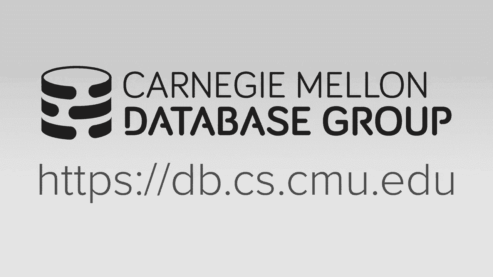

# 【双语字幕+资料下载】CMU 15-721 ｜ 数据库系统进阶(2020·完整版) - P8：L8- 数据库存储模型与布局 - ShowMeAI - BV1wv411w7Ko

[Applause]，[Music]。

[Applause]，[Music]，other devious companies are still coming，so Oracle is giving a tech talk on。

campus this Wednesday I think this guy，is from the in-memory database group。

it's from the same group Shashank，Chopin who came in game he am a guest。

lecturer in the intro class last，semester so he's gonna come and talk。

about I suspect to be very a similar，talk than what we got last semester but，that's at 4：

30 over here in a new，assignment they'll probably be pizza for，this because if it's at 4：30 then。

there's usually pizza right the 12，o'clock ones unless that's on a Thursday。

there's usually not food all right all，right so before we get started。

Matt posted on Piazza last night on the，speech or project one that you need to。

target and then he'll be setting up，great scope today so you can spit that。

so again what will happen is you'll，submit your your project on great scope。

the better just prove that actually，builds and then we'll have to run these。

offline on the same ec2 instance that，that were telling you to we do grading。

sony post on Piazza last night that like，the he used the instance store of the。

instance type we give you then it runs，out of space is because we do static。

linking in our system so when you build，everything every single test case is。

like one gig so you've run that space，there's no way to build the benchmark。

without building the tests but it might，be if you just if you just target the。

like building the slot iterator it may，not actually build all the unit tests。

may just build that one by night so you，should still be ok but there's no way。

like you can do it past the flag say and，see make turn off building benchmarks。

you can also turn off building the test，but you current that's currently broken。

because there's some dependency between，the two of them ok any high-level。

questions that project one okay and well，again we'll try to answer on Piazza as。

as the week progresses ok all right so，we've spent the last couple weeks，talking about。

sort of more OLTP aspects of a database，systems so we talked about how to do，transactions。

well talk to how to do indexes and now，we're gonna go to the bottom layer of。

the database system now talk about，storage and then going forward from that。

to the semester we'll start building up，new layers on top of that so we'll do。

database storage then we'll do execution，in query optimization and so forth and。

so the the reason why I started with，transactions and indexes first because。

in the back of your mind as we go，forward when we discuss other aspects of。

the database system you should be，thinking about this in the context of an。

MVC system and then think about whether，whatever you know whatever technique or。

method we're discussing would this，actually work for if you're doing nbcc。

and some things work great there's，there's a single version some things not。

so great when they're multi version so，that that's sort of why I front-loaded。

the transactional stuff in the beginning，all right so this is the chart I showed。

in the beginning of a semester of what a，high level what in-memory database。

actually looks like so say we have now，our index our bwuh our index doesn't。

matter we do a lookup to find a given，tuple and then this thing is gonna spit。

out a block ID and an offset so the，block ID could it be a pointer to the。

beginning of the block and the offset，could be within that block but that。

would sort of be kind of wasteful the，this thing could just be just a straight。

pointer to the tuple itself but now you，get any issues of you start moving。

things around so in our system what we，actually do and a student came up this。

and was pretty clever we use a trick，from super plus 11 called a line as and。

basically this is telling the compiler，in the system to align the starting。

address of a memory block at a certain，set so we do this where we have all our。

blocks our one megabytes and we use la，line as to enforce this so now the block。

ID offset we get is a 44 bit pointer to，some one megabyte block and then we have。

20 bits now to jump into some region so，instead of having an extra indirection。

layer to say how do I get my block ID to，a block address right we can pack this。

all in a single thing the only reason I，bring this up it says in the OL。

assessment peloton it was a train wreck，this thing would actually be a pointer，to a pointer。

so he had a thing called a tuple point a，pointer and that was it became a。

nightmare we had so many layers of，indirection where now this one just。

tells you exactly how to go to the block，ID and then or the block block location。

and then this is just the offset to it，so again the main thing to point out。

though is that all of our tuples are，going to try to stores these fixed。

length continuous pieces of memory，whether it's a columns to our row store。

doesn't matter these values need to be，fixed length because then we can do this。

arithmetic very very easily to say oh I，want the fifth tuple I know the size。

every tuple my block I know how to jump，to the starting location for that tuple。

anything that could be variable length，will instead instead store it in a。

separate data pool we have variable，length data blocks and this sort of。

looks like what malloc doesn't need the，covers like the bin packing problem。

trying to stick in you know different，regions of memory of different sizes。

right so this is just being now a 64 bit，pointer to that location so this is what。

we're gonna talk about today we're，talking about like how we're actually。

gonna represent stuff in here and then，stuff in here so at a high level what。

you think in memory database just is，it's just this is a large byte array we。

malloc a bunch of chunks of memory and，then we need a way to now interpret。

those chunks or regions of those memory，chunks to infer what the schema actually。

is so because we're relational databases，we're told the schema ahead of time JSON。

stuff is usually just treated as a，variable of every length data but we。

know like I have these in our columns，that can have these types and of these。

sizes so now when we jump to an offset，in that fixed length data pool we know。

that this is the starting location of a，tuple and we know how to interpret the。

flights that we're looking at we know，whether to interpret it as an integer or。

a float or you know a timestamp so again，we already talked us before every two。

books can be prefixed with the header，that concludes the metadata such as the。

visibility will talk about nulls and，sticking that in there but basically。

when I jump to an offset to say this is，the starting location of the tuple I'm。

really jumping into the header and I can，look at that header and try to figure。

out you know what's gonna come after，that we're not going to store any of the。

schema information in the header because，that'd be wasteful to do that for every。

single tuple the JSON databases that our，world，you know every tuple has to have the。

same same same structure the same layout，and so we don't need to repeatedly store。

that in the header so alright today，we're gonna talk about do type，representation how do we actually。

represent individual elements or，attributes and a tuple then we'll build。

off the top of that talk to how we，layout now those attributes for a single。

tuple then we'll talk about different，storage models and then we have time。

we'll finish up and talk about system，catalogs because again like this is sort。

of like an additional stuff that I want，you guys to sort of be aware of and this。

is actually kind of cool things that you，can do because you have a relational。

catalog relational database with the，schema but the those so the bulk of the。

main material want to focus on is，storage models and Panta bhaat。

okay so the this is the same I've shown，this before in the intro class but。

basically we know all the types that our，database system can support the sequel。

standard specifies what the basic types，are and we know then that's what。

actually represent the bits to report，each into a value of an attribute so for。

integers big and small instants we're，just going to use what C or supercells。

provides for us when we say allocate，like an int 32 or 64 or small rent I。

there's nothing special there we'll just，take whatever the bits we are when we。

allocate that you know variable like，that and that's what we're storing in。

our database for floating-point numbers，we'll have this distinction between。

floats and reals floats and reals are，just gonna be using the I Triple E 754。

standard which is telling you at the，hardware how we're gonna represent。

floating-point numbers but this is gonna，have rounding and accuracy issues and。

then there's the fixed point decimals，the numerix and decimal types that are。

specified in the sequel standard every，database systems are free to implement。

this any way they want some are more，efficient than others the Oracle one is。

better than the Postgres one but the，main idea is that this this doesn't have。

the same rounding errors that you have，in the floating-point numbers time。

stamps dates and times types these also，vary per implementation the sequel。

standard doesn't specify how you，actually represent these type of。

attributes but they do specify that you，know what kind of operations you can do。

but can I add two times together or can，I subtract them things like that one，common approach is just。

the the UNIX epoch so it's the number of，seconds or milliseconds since the。

January 1st 1970 and you use that to，calculate waters board its current date。

and time in C++ there's this thing，called time spec which gives you a time。

offset and then nanosecond offset and，that's actually 16 bytes larger than。

this in our current system I think we're，using 64-bit and 64-bit integers which。

is the middle of second since the UNIX，epoch but again from the seat but the。

sequel level you don't know you don't，care you just know you have time stamps。

you can stick things in and you can do，comparisons on them for the VAR charge。

of our binaries text and variable length，fields again in the fixed length portion。

of the tuple would store a pointer to，some block of data in the verbal length。

pool if the value that we're trying to，store it's me less than 64 greater than。

64 bits right if the size of the data，we're storing is smaller than the。

pointer they mindlessness store the data，rather than have a pointer to that data。

anything larger than that then we'll，store it in a very like data pool and。

we'll keep some extra metadata to keep，track of like what are we looking at and。

if it overflows to another data pool we，have pointers of those as well so I'll。

cover that as we go along so this，quickly I'm gonna talk about the。

difference being variable precision and，floating-point precision decimal numbers。

so again if you go for a float a real or，double you're gonna get the hardware。

representation of a decimal or a，floating-point number，right and that's specified by this 72。

our standard that every single PCE every，single CPU has to follow so if you store。

a floating-point number on a power CPU，and we represented the same way in x86。

the and E&S may be switched like the bit，order might be switched but at the sort。

of you know how you keep track of a，decimal point and what's before and。

after it it's all specified by this so，this will be really fast because the。

harbor is actually gonna have you know，low-level instructions support to take。

you know to floating-point numbers and，compare them or atom add them together。

it's not gonna be as fast potentially as，giving addition on integers but it。

certainly be faster than doing anything，that we can manage ourselves in the。

database system but the downside again，is you're going to have rounding errors。

so if you write a really simple C，program like this where you take two。

numbers to 32 bit floating number，zero point one and zero point two if I。

add them together you think the answer，would be zero point three but the。

problem is when you actually start，looking at what what's you know with。

positions in the decimal you see you end，up with all sorts of weird stuff because。

again the harbor can't can't precisely，store zero point three so even just you。

know print out zero point three you get，a bunch of a bunch of stuff so this。

again for some aspects in in，applications this is fine maybe this is。

okay like if I'm storing you know the，the the temperature of this room I don't。

need to have you know a super accurate，measurements right ninety eight point。

six or ninety point zero is like good，enough but if I'm dealing with like。

money or anything that's like scientific，measurements right I don't want these。

flot rounding errors then I want to use，fixed point decimal numbers and the idea。

here is that the database system itself，is gonna keep track of what what is the。

exact value that we're trying to store，and it handles all the rounding errors。

or other issues that can come up when，you start doing multiplication and。

manipulation so the this is actually I'm，saying here isn't accurate so this is。

actually what Postgres does what，Postgres does will store the decimal。

point number essentially as a varchar'，like a string and then they have some。

extra metadata to keep track of like，where is the decimal point is it。

negative or positive what are some，rounding issues so they have these giant。

like switch statements to deal with all，these different variations of the type。

of operations you want to do and it runs，about twice as slow than the。

floating-point numbers the hyper guys，have a low-level sort of bit。

manipulation method to distorting fixed，point death moles that is very very。

efficient and actually some cases can，run faster than the floating-point。

numbers which I don't know how that is，possible but this is what they show us。

so I'm not gonna time to teach that I，don't fully understand what they're。

doing just yet the the German guy，recommended this book called hackers。

delight that shows you how to do all，this little bit manipulation but this is。

something you want to pursue for project，three then we should talk yes。

banks they use like four bits and then，just missing decimal playing so even。

though this go for a stochastic like a，signal decimal position only four bits。

oh yeah so that I don't know think about，I know that like for the bank's they。

never overwrite datum so like if there's，like if a rounding issue could occur。

because the way their application was，written when you computer like interest。

or something like grab you can always go，back and fix it by you know rerunning。

the computation again so it's not like，you would lose that you lose any data--。

by having imprecise precision I don't，know what I don't this is something I'm。

really a lot very interested in but I，don't know enough about it to compile。

whether you know what people actually，doing other than I know that Germans。

have solved it but I don't know exactly，what they're doing yet I don't fully。

understand it okay again this is，something you want to do for project。

three I be happy to try to help out with，this and I'll you know point to the。

chapter in the book that he recommended，okay so the as I said like again the the。

database is essentially just a byte，array just come you know a char array or。

byte array and then now we need to now，put start putting meaning on to what the。

bits were storing in these bytes so say，I have a simple table here has two。

fields ID as a 32-bit integer and that's，primary key and then value is a 64-bit。

integer so the layout of the tuple would，look like this right I have my header of。

some size where I'm storing the you know，the timestamps and everything that we。

talked about before and then when the，header ends now I have the ID field and。

when that ends now I have the value，field right so if I need now am I in my。

database system I want to understand，like I need to read you know this field。

right I know how to find the location of，this tuple right because that the index。

got me there that all the headers will，be of the same size so I know how to。

then jump past that and at this position，here then everything I read afterwards。

up to 32 bits will be the eye，Liefeld so how do we actually access。

this data when it's just you know in our，in our C code or syphilis code would you。

see a bunch of byte array we need a way，to convert this into something that we。

can we can interpret as a 30 bit integer，reinterpret cast right so all that's。

gonna say now in this is a compiler，construct this is gonna say that all。

right when I read this memory address，treat whatever you're reading as not a。

byte array but a 32-bit integer so that，now in the compiler knows that when when。

accesses it's just gonna access just，those 32 bits right so now for the。

variable length data say I have a bar，chart 1024 so again in the fixed length。

data array I'll have my header and then，I have the the 64 bit pointer and this。

is going to now point to now down to，some memory region here in the variant。

like data pool the starting location，that's gonna tell me you know find the。

actual value that I want so in this case，here for each of these entries in the。

very linked data pool it'll have its own，header that keeps track what is the。

length of the data that we're storing，contiguously for this chunk and then if。

it overflows this chunk there'll be a，next pointer that jumps down to some。

other memory location where we read the，rest of the data right so this is not。

unique to American bases that the the，disk based databases do the same thing。

if you're if you're if you're varchar'，or textfield，overflows between different pages and。

you need it you need a way to how to，connect these all together the other。

thing that I did not gonna talk about，too much is that this is gonna be this。

is not gonna be null terminated，typically because otherwise your weight。

you know you're wasting a byte for those，you know for no reason so in our code we。

can't just go to call it like you know，string compare our string length in our。

in added a see library to compare this，thing because it's not gonna have a you。

know null at the end so it's not truly a，C string so we have to write some。

additional we have to write our own，string functions we don't interpret this。

thing and understand it okay the other，optimization we can do here is that say。

you know say I'm time lookup you know，finally all the the string，the value the value is where the。

beginning of the string starts with a，word and II so how would I have to do。

that and with this set up I've got to，scan through my table and then for every。

single tuple follow this pointer to，somewhere some random location and then。

jump you know you know jump it to the，first you know some bytes and see。

whether it starts with an D so that，would be really expensive to do because。

it'd be a lot of indirection a lot of a，lot of branch misprediction because。

there's no conditionals but it basically，I'd be scanning one part of memory then。

jumping over to another part and then，going back ask anymore and back and。

forth as I would have bat cache locality，because it's not like I can keep。

scanning the same you know a bunch of，stuff that I brought into my caches all。

at once I got to keep jumping over and，over again so a really simple。

optimization is actually to pad out the，the pointer portion that you're storing。

in the fixed length data to include a，prefix of the string down below so now。

when I scan across and try to find，things that start with an D I could just。

look at this thing and see whether it，matches or not and I never have team。

touch any of this so we act so this，hyper does this and we actually do this。

in our own system so the the pointer，portion of a varlyn field in the thick。

fixed-length data pool is gonna be 16，bytes or 128 bits so we store。

64 bit pointer to the actual data and，then we use the remaining 64 bits to。

store prefix you could also store hash，of the entire string right there's。

different methods to do you could use，okay alright so now all right so now we。

know how to store basic scalar or scalar，values of fixed length values integers。

floats and timestamps now we know how to，store store very length data now the。

last thing we got to deal with is nulls，so there's three ways to do nulls at。

least as far as I know the first，approach is to just designate a special。

value in the domain of a type in the，database to represent null so one thing。

you can do say the smallest 30 cubed，integer you could ever store which is。

defined in Lib C is in 32 min like this，pound define that will be null so if I。

ever see this value when I'm looking at，a tuple then I'm gonna treat that as a。

null not really in 32 min，so now up above and you in the above the。

storage layer in the database system you，have to account for this like if someone。

tries to insert this value you have to，throw you know throw an exception throw。

an error because they're you know they，try to store this value and then you've。

read it back and says it's you know it's，null then that would sort of be。

confusing you basically have a bunch of，extra boundary code up before to make。

sure that this is considered out of，range so we did this in a store and。

volte B we did this a Mon Ami Mon a DB，does the same thing and then we。

originally were doing this in peloton in，the old unit movie building here at CMU。

but as far as they know other than Moe，need to be and both of either the only。

ones that I know that does this the more，common approach is to use a null column。

bitmap so we're going to now do in store，in our header for our tuple we're having。

this bitmap field that's going to say，for every single attribute that I have。

in my to pool the bit is set the one if，that attribute is known so if I have a。

thousand attributes or per tuple then I，have my bitmap you have a thousand。

entries so now as I'm scanning the two，point and applying predicates I do a。

lookup in this thing to see whether the，accurate I'm looking at is you know is。

that bit set to true and if so then it's，null this one is way more common but for。

a memory databases in dis databases like，my sequel Postgres sequel server oracle。

everybody does it this way this is what，we now do in our own system because now。

we're also a column store this is just，now not Murat storing this bitmap per。

tuple we just have it for you know for a，single column here's the whole bitmap。

for every single tuple it's in a block，alright the last one is all the safe。

right I think this one's stupid only one，database said I know that does this and。

that's mem sequel and this is where，you're going to store for every single。

accurate that's in your tuple you're，gonna have a separate flag to say。

whether it's no l'm not so if i have a，32-bit integer that could be null then i。

needed a little flag in front of it that，says yeah you know is this thing knoll。

or not so why is this stupid yes，says it Bruins drops us no way everyone。

has the same flag then they all sets are，fine okay no it's on the issue right。

instead of like if I have four，attributes and everyone is 32 bits plus。

one bit for the flag then if I want the，third attribute I take 33 times three。

and I jump to where I need to go bingo，that's it she says you don't have a bit。

addressable memory so you can't get my，32 bit integer just can't make it thirty。

three bits because that's gonna make，everything unaligned and you can't。

access memory at a bit offsets you can，do byte offsets so if you go now look at。

the the mem sequel documentation they，say what's the size of all the different。

data types they support so this is from，MC equals six I've recently looked at。

you know this is this this chart from，the documentation is maybe like two。

years old but recently loaded and，they're still doing this so for every。

single int or seven every single data，type the fixed fixed size data type。

they're gonna have two potential sizes，the hot of the size of its if it could。

be null and the size of its not null so，if we just take bullying right boolean，is true or false。

so that's you saw that as one bike，because we can't store single bits so if。

it could be null then I have to store，two bytes right same for the other one。

site and it's like Prytania inch double，in size doubles in size this one they。

get vibed is adding a single byte to，make something actually no take that。

media medium in is sorry medium it is，three bytes so they add a single byte。

for int and big int they have to have，four bytes because that's - you cash。

they do word alignment in x86 so like，again if I store now if you think it was。

like the bitmap case or in the going，back here this is the smallest one to。

store because you don't take any extra，space you have to store that actually。

anyway and just using this actually one，to say oh this this is null this gets a。

little bit larger because now I have to，have a single bit for every single。

a tribute in my my tuple police in that，case it's just a bit and I wanted to pad。

out the bitmap a little but just a，little bit right this one is for every。

single attribute I have to Pat it out，I mean，so in sequel you can have it's a three。

type value system so I can have a value，and I could set it like true false or。

null and null means unknown I don't know，what the value is because they're。

telling you sighs yes yes so his point，okay so his point is correct I we should。

i yes I agreed you know what his，statement is Oh am I just looking at。

this and saying oh whoa you're using，this extra two bytes just to store null。

or are they doing our bar chart trick，and storing some extra crap in there but。

what the hell would you have to store，for a single attribute right like right。

like and for these pickling tight for，any like I can imagine like in a bar。

chart like said like my example where I，Pat it out well like I showed the prefix。

like sure the hash I could store maybe，the size up there so I'm looking for。

things of a certain size yes the things，I get stored that you that you want to。

beat would be potentially to materialise，expensive materialized for a bar char。

any operation i could do on these things，for on a single attribute that needs。

your super fast like you could say，alright well maybe they're also nails。

storing well I mean for out of these you，can't there's none on cents if you if。

you need that bit to store something as，as potentially null like say I'm sort of。

like this be stupid like the the，negation of the absolute value of。

something for so that's cheap to compute，right that's a few instructions but I go。

and be able to store that in this anyway，because I still need to store that in。

all flag so I don't know what they could，be pre computing and everything is is is。

aligned now I've said MEMC go put out a，new version of their column store I。

should double check to see whether that，like early late last year。

they might have fixed this but but I，don't know they're the only ones I know，yes。

oh these questions what's a bit better，type and why is it eight bytes that it's。

a good question I don't know let's go，find out um it's not good use of our。

time but I probably like a bit filled or，maybe it's a bitmap bit sequel type bit。

data type is an integer data type that，can be take a value 0 1 or null see what。

don't know that's good question yes cuz，Siebel servers get distorted as expected。

ok let's look at that up later ok，alright so again this is the most common。

one this is what we do now there's some，other optimizations we can do now on our。

bitmap because everything is contiguous，like if I'm saying trying to find me all。

the the Fahmy all the tuples where this，value is null then I can just take this。

bitmap if it's stored as a column store，so all for a single attribute I've I。

have a single bitmap and all contiguous，and now you do like Simbi operations or。

vectorized operations to do counts and，other things more quickly alright where。

everything these two guys you have to，still to look at look at the attribute，ok。

so let's understand now why the deeper，why they have to do this padding out。

right and he's already sort of set it，right because it because of alignment。

issues because you can't access things，that like you know funky you know 33 bit。

offsets all right so what I'm gonna，describe you now is I do cache line word。

alignment for our tuples in our database，but I'm actually gonna be telling you。

this are using examples with 64 bit，works or 64 bit cache lines and a real。

x86 the cache line is 64 bytes but for，simplicity to make everything fit on a。

slide I'm going to use 64 bits as an，example，just understand the high-level cop is。

the same just the this the the length of，what the cache line is will be different。

let's say now I have a table here right，I have four attributes a timestamp a。

char two and a and a zip code in the，case of a char versus varchar' some。

systems actually will store the varchar'，and some of this will store a chart just。

as a regular bar char but in actuality，if you say well I know can only be ever。

two bytes then you store that exactly in，the fixed length data pool a fixed。

length tuple slot right so again here's，our alignments we're assuming we have 64。

64 bit words so now when I start writing，out this data to our to our tuple write。

the IDS 32 bits the timestamp is 64 bits，then this color is is 2 bytes or 16 bits。

and then I zip code right so now let's，say I do a query I want to look up on。

the the date field again I do my，arithmetic I know what the schema is so。

I know what these the size of these，attributes are I know how to do that。

simple math to jump to my offset and now，read this but what's gonna happen here。

what happens what if my processor reads，something that's not word aligned is it。

well he says he said bring the whole，cache line to cache reads that's 1。

what else could it do so he said yes so，that's also an issue we're not gonna。

about that he says that someone else，could come in and write to the other。

half and I only see the first half let's，assume that we have transaction，be an issue。

there's no no to writers so there's，actually three things could happen。

so they got the first one right and this，is actually what x86 will do and the。

newer versions are armed will do so the，in their world with x86 they're trying。

to make you as the programmers life as，easy as possible so if you try to read。

something that's not where aligned，they'll do it the multiple reads for you。

and then stitch the the value back，together and hand it back to your。

program for us now as we said that's，gonna be slow because what should have。

been just one read into memory is，or you know to our CPU caches is now。

gonna be two reads right so we're gonna，bring a much organic wrap that we。

actually don't need like if we just，needed to get this date field we rent。

we're gonna have to bring in this ID，field and the you know portion of the。

zip code and this the this char array，even though we only just wanted those 32。

bits so we're gonna read 128 bits just，to read 32 bits right and that's bad we。

don't want to do that so for this one，you under perf you can tell it to one of。

the events you can record our unaligned，accesses and actually we run with the。

ACN stuff from Google when can when you，run our test cases so if you do。

unaligned a memory access like it'll，throw an error and say you can't do that。

but you also use perf to take a binary，and run it and count the number of。

online accesses that you have and that，can help explain why your program is。

running slow Cole grinds not gonna give，you that because Paul Ryan only sees。

what what like what instructions you，execute right and what lines of code。

doesn't tell you like what the Harvard，actually did the other approach would be。

to do random beads basically you're，going to get some random combination of。

of data and you up in the program to，figure this out on your own all right。

this is obviously way faster than this，this is also easier to engineer on the。

actual chip because you're not doing，extra stuff to make to reassemble things。

this is what arm used to do in the very，beginning they now do this right of。

course this is problematic is now you do，a read and you think you're getting。

something that you think you're you're，getting that one field you're getting a，bunch of other crap。

the the alternative is to actually do，just reject the the requests like you。

try to read something that's not word，align we actually deny the load。

operation and we throw back an error so，right so again modern modern CPUs or not。

modern it's like the more common CPUs，that you're going to encounter in the。

wild will be doing this I don't know who，actually does this anymore this is。

mostly like an super small embedded，devices like low-power things which。

again like you not be probably building，a full-fledged database doesn't do this。

are you actually sequel lightwood perp，I've run all these guys and。

and of course it's they've already，checked me these things so this is what。

we care about in our world and so we，obviously don't want to do this right。

cuz this is gonna be slow so we need a，way to resolve this so how can we make。

our thing word aligned what's an easy，fix，Patti exactly yes so what we'll do here。

is again we know in our data soon we，know what the word alignment is for the。

harbor that we're running on so as we，start now laying out our data for our。

tuples we will recognize oh well I can，store it 64-bit words this guy is 32。

bits this next one was 64 bits，so rather than spanning the word，boundary I'll just put in a bunch of。

zeroes for these 32 bits to Pat it out，so that the next attribute starts。

exactly at the beginning of the next，word all right and so now in the in the。

upper layers of the system depending on，how you give back data to the execution。

engine you could the Storage Manager，could say all right well you need these。

fields I want to send you a bunch of，garbage so let me go ahead and now。

stitch this back together and a memory，buffer hand it back to you or you have。

to have now in your execution to be，aware of the padding going on and your。

storage manager so that you know when，you need to jump to the customer date。

field that you have to skip over these，these 32 bits that are just padding。

what's another thing we can do perfect，yes reordering that's the other one yes。

so we we could also basically run the，same thing of a cab in packing problem。

where we say I have 32 bits I can store，here to fill out my word instead of。

actually just storing things in the，order that they were defined when I。

created the table could I just find，another 32 bit thing or 32 bit attribute。

and stick it in there and then now I，could pack the rest and only here do I。

have to Pat it out to make sure that the，next people behind me follows that the。

right boundary of the word all right so，again the upper levels of the system。

need to be aware of that this padding is，going on or you need to do some copying。

to hide it hide it from it so we，actually do both in our current system。

today and so just give you an idea what，and prove it you can get so this is a。

micro benchmark that the one of the，students that helped that out。

the new version the system two summers，ago this is the first implication we。

ever did without any alignment and so，this is just doing a doing a micro。

benchmark that tries to insert as fast，as possible and so if you don't do any。

alignment then you can run it maybe like，four hundred megabytes a second you。

insert four hundred megabytes of data or，if I want to make about two data per。

second no sorry not get sorry five，hundred kilobytes yes but then if you do。

padding then this bumps up to eleven，megabytes per second but if you padding。

plus sorting now everything is nicely，cache aligned and you can even insert at。

a very high rate so there is just how，fast we insert in things into memory is。

not ready while any log records out the，disk like this just showing that you。

know the performance Ben advantage do，you get from this I don't think we have。

numbers that show you know well just，which sorting provides you we only have。

padding plus sorting so what happens in，our current system is that when you。

create the table again we've run this，little algorithm that does basically。

tries to figure out the optimal ordering，of columns in the system the execution。

engine is aware of these this ordering，this is what the projected column stuff。

gives to you but then before we hand，back the result to the application we。

make sure that we put it back in the，right order as specified by by this。

great table statement I think the sequel，standard specifies that you have to do。

this I said now if someone calls select，star they will get the tuples the。

attributes for each tuple ordered as，they defined here right because what。

happens a lot of times people write，their application when they you know。

they have these select star players and，then when they access attributes they。

access them based on offsets like give，me the first one the second one the。

third one so if I now start shuffling to，order these things because I ran some。

bin packing algorithm then that's gonna，break programs so we do an extra step to。

make the life easier for the end user so，any questions about this okay so now。

let's talk about storage models so the，storage model specifies how the the。

database minute system is going to，organize the tuples and their attributes。

internally in in storage so there's the，two main approaches are the the。

and an energy storage model and the，decomposition model so this is the row。

store this is the column store and then，there's a hybrid approach that we'll。

talk about a little bit where you sort，of have tried to get the best of both。

worlds right in a single unified system，so the the rows store and a saml。

approach is what you people normally，think about when we talk about databases。

or relational databases right and the，idea here is like I did in all the。

examples I showed so far but all the，attributes for a single tuple will be。

stored contiguously in some region of，memory and then only when we get to the。

last attribute then does then the next，triple begins so now again if I want to。

go access the third attribute for the，fifth tuple I know how to do that。

address arithmetic to jump to the offset，at the beginning point of that tuple and。

then jump to that attribute so this，storage model is ideal for transactional。

workloads they're all XP workloads，because in these in this environment the。

transactions or the queries are only to，touch a small number of tuples and they。

typically also touch all of the，attributes of a tuple there's a lot of。

select star queries where account name，Eagles Andy and I want all the。

attributes and therefore if it's stored，in as a roast or I can just jump to that。

one region or memory scan across and get，all the answers that I need and then。

hand it back to the execution or whoever，else needs it this is also where you're。

typically going to use the tuple at a，time iterator model and we will discuss。

this more in a few more weeks but，basically how we're going to have the。

execution engine access to pools this，approach is ideal because again I'm just。

jumping to the starting location every，single tuple and handing back that chunk。

of memory to whatever operate execute or，neat needs it all right this is also。

could be really good for insert heavy，workloads which is more company which is。

you know what you see a lot in，transactional workloads like every。

single time I log in I insert a new，record to say this is when this person。

logged in every time I place a new order，in Amazon I insert a new order record I。

inserted all the items that I bought so，in in a row store this is this is super。

fast because I can just jump to some，memory location there's some free slot。

in my table and there's right out，so everything I've already said before。

the avenge starts fast for inserts and，updates deletes good for queries they。

need the entire table this one we could，ignore for now but where this is gonna。

be problematic for is when you do，analytical workloads where you want to。

scan large segments of the table and you，only want a subset of the attributes。

like if I want to compute what is the，most what was the average price of an。

item bought from anybody who lives in，the city of Pittsburgh I only need to。

access you know the city field and the，price that they bought the some item for。

I don't need all the other attributes，for for that tuple so therefore if I'm。

doing a roast or then that's me wasteful，because I'm react sesang chunks of。

memory that I don't actually need and I，have to keep jumping over and over again。

to find the right offset of the atrophy，I want for every single tuple so this is。

with a column store the or the DSM，approach solves the idea here is that。

for a single attribute in a tuple and，we're gonna store store all the values。

for every single tuple contiguously in，memory now my just might not be for you。

know entire block of data it might does，not have all that the just that B values。

for that single attribute we could have，all the atras together but internally，store。

this is great for read-only queries，because you can scan over large portions。

of the of the table at a time but only，accessing a subset of the attributes。

alright so this is the stuff we've，already covered so we'll get better。

compression through a column store that，we'll cover on Wednesday and for four。

point queries and updates this becomes，now more expensive potentially because。

now you're have to take the tuple that，you need to insert or update and break。

it apart into its individual attributes，and do multiple memory rights to update。

all done so the history of of column，stores is kind of interesting so column。

stores are super common now any new OLAP，system that's been developed and。

released in the last ten years in the，last decade will be using a column store。

if they're not been in there they don't，know what they're doing and it's not。

worth your time to talk to talk to that，prime but it what knows what seems sort。

of obvious now wasn't always the case，so back in the 1970s the first。

implication the known implication of a，column store system，was this thing called Kanter that came。

out of the Swedish defense division it，wasn't actually a database system as we。

know it today was more like this sort of，bat processing system but would organize。

the data as columns in the 1980s there，was an actual paper paper that。

formalized the idea of what a comstor，database looks like but the first sort。

of known invitation was sybase IQ which，came out it was an in-memory accelerator。

for Sybase the idea was you had your，regular sized ASC database system then，front of it。

so if analytical queries show up they，would run they would run on that copy of。

the data so they were using what is，called a fractured mirror approach which。

I'll cover in a few more slides but，basically you still have the roast or。

and then this thing sat in front of it，made the analytical queries go faster。

I've heard some horror stories about，this in the 1990s that it was hard it。

never worked correctly but this it's，still round today and this is what this。

is what they were using or even connect，to with an S AP Hannam in 2000s this one。

the common story idea really took off，three main ones in the space where。

vertical vector wise and Monet DB vector，wise was an improved a memory version of。

Monet DB this later got renamed or got，bought by Acton and then got renamed to。

vector and it's still around today and，this is actually overly good if you。

benchmark it it does still really well，there's certain aspects of vector wise。

that we'll cover later on in the，semester，Monet DB is still round as well they are。

it came out of CWI the same sort of，school that BB like these guys early in。

this space as well and like I said now，everyone recognizes the advantages of a。

column store and the widespread all，right so the paper had you guys read the。

reason why I chose it because it was，sort of showing you that how to do。

updates and support hybrid workloads on，a column store right so in our system we。

still support transactions we still，support doing updates and as well as。

also doing analyticals analytical，operations but we're designed to be a。

column store and so this particular，paper or an assistant work Casper was。

meant to show you how you could still，have maintained a column store and still。

get good support for otx execution so，the paper discusses，some high-level design decision you need。

to be mindful about when you're building，columns for a system to be。

identification is how to find tuples in，the fixed length date array hi actually。

you're gonna organize the the data that，you're storing in your columns and then。

the update policy and buffer location we，sort of already covered these a little。

bit when we talk about nbcc it's，basically time where do you if you have。

a delta store where do you actually，store these things and then how do you。

how do you apply them later so I want to，focus on the first two and this is also。

and then we'll then talk about how you，the different approaches for building a。

hybrid store where you have a row strut，plus a column store so Casper is a pure。

column store that supports transactions，but then we'll talk about things like。

the factory mirror approach for storing，roasters and column stores together so。

the first issues that we do figure out，how we're actually going to identify our。

tuples or how can we get to the starting，location for an attribute again we。

assume that all the values will be fixed，length the varchar' stuff is shortened。

of every linked data pool but but at，least the pointer itself will be fixed。

length and so if everything's always the，same length then you don't need to。

actually store any additional emission，to identify what tuple you're looking at。

you just use the implicit offset of，where you're looking at in memory to say。

this is the identifier for the tuple so，if I want the the second tuple or the。

tuple number two in my table I know how，to do the arithmetic to say well what is。

the each type of each of these columns，and I want this location so I know how。

to multiply the size of the attribute，personally the starting location I want。

to jump into to get the values for this，tuple and I can do the same thing for。

all the other columns in some systems，however they can't do this so they don't。

want to do this and instead they，actually store implicit or explicitly。

the tuple identifier for every single，attribute that you're storing in a。

column store so for the column a right，for the first people I'll store it's two。

pi D and the second tuple，I stored to PI D and so forth and this。

is her like a bastardized version of a，column store because you're not getting。

all the advantages of doing the fixed，month arithmetic you're just wasting it。

for space to store this yes，this question is are the office still，fixed I think so。

why so I think Oracle used to do this，because they were sort of grafting on a。

poor man's columnstore into the system，right they were trying to keep the。

roasts or execution engine but but，operate on columns so they had to embed。

these extra things in the newer versions，of a comp store they don't do this。

everyone does does this but some systems，actually do do this but it's bad idea。

you don't like if you have everything，this question if you need to sort your。

column you still need these IDs we'll，get to that in two more slides but yeah。

so like if I sort the column sorry um if，I sort the column here I could just sort。

a and not affect BC and D assume you，have a way to like for a given tube。

identifier to jump to that exact offset，for each column I think this is why。

Oracle did it Vertica does sorting where，when you sort one column that then。

cascades to all the other columns so，that going across horizontally lately。

this might my illustration here you're，looking at the exact same tuple most。

systems don't don't do that pre-sorting，though all right actually this is this。

is this is the next next topic right so，next question is how we actually。

organize data when we have to make，changes or add new entries so the most。

common one is to do insertion order so，we just find any slot that's free in our。

in our blocks and we just insert our，tuple in there so there's no locality。

there's no ordering of the attributes，it's just sort of sort of random it。

isn't you don't necessarily always have，to go in like from beginning to end。

in our system we actually we do a，compare and swap on a random location in。

a bitmap and try to find the first free，location which may not be the first free。

slot but at least in that case you know，you're not having threads all try to get。

in inserting into the same location at，the same time the other approach is what。

he was referring to is when you with you，insert the tube，into the the columns based on some。

ordering scheme it's again vertical is，the most famous one that does this but。

this is agree problematic we'll see in，the next slide because if now I have a。

bunch of showing up and I need to，enforce that ordering I don't want to。

pay the penalty of having to reshuffle，things every single time because that。

would be expensive and then the last，approach is from the Kasper paper where。

you're going to break up the blocks into，ranges and according to some。

partitioning scheme and then within each，block it doesn't need to be sorted but。

sort of globally there's this what they，call a shallow index please will jump me。

to the location that will have the data，that you're looking for within a。

particular range so let's look at the，first one so this is just insertion。

order so this is my column store I want，to start this tuple so I just find。

whatever the first free slot is for my，tuple manageable and it's add my entry。

there right DZ and when this thing gets，full width then I create a new block and。

just keep inserting starting into that，so then now if I want to do the sorted a。

table the say I take all these columns，and I sort them according to this scheme。

so I'm going to first sort a sort all，the tuples by a ascending then by be。

descending and then by see a sending so，again we need to have the fixed length。

all set for every single tuple be the，same so if I'm looking at four tuple for。

right I want to be able to jump into B，at this location and I should see the。

attribute for B for the same tuple so，now if I if I sort say I want to sort on。

a I have to then propagate that sort，order over to the other columns right so。

so I start with a I sort these by this，value but now within for B right honest。

to here's all the atras of being sorted，it started all the a shoes with a equals。

one and now I sort them according to my，sold over for B for B and then within。

that I have now the sort ordering within，C so again now this guarantees that。

again if I'm looking at this as tuple，here I'm going across and seeing that。

the all the attrex for my given tuple，let me take a guess why you want to do。

yes she says secondary and indices of，what do you mean so he said if I jump to。

a certain place on column B but but but，here this case here I sort it on a right。

so if I have a predicate that says find，me all the tuples where a equals a。

equals a 1 then I can just jump to this，and scan down and then once I see a - I。

know there's never - give me another a 1，and I'm done but in case of B if I find。

me all the two boys we're beetles B - I，can't just look in this region I got you。

got to scan the whole thing right so，she's saying well once I get here so I'm。

looking for B - once I get here now I，see a B 1 I know there's not gonna be。

another B 1 for this region a and then，now but now I need to know how to jump。

to the next region just like you grab，all the ones from B 1 B 1 then you got。

the first one to be to go to second to，those are all relatively so it's not。

really second the index would make the，scan go faster right but might like。

assuming this is if you're doing，partition right if you know what the。

boundaries are so if I if I this is the，boundary for a for a equals a equals a 1。

so if I scan looking for the b-2s if I，scan the to p2 and then I see the B 1 I。

know there's never going to be another B，2 after this so then if I knew what the。

next partition is I could just jump down，here but that's yeah that'd be the one。

Furby bell for a yes so we'll see this，actually the answer I was looking for。

will see this on Wednesday we're，actually beaver to compress this way。

better if everything's sorted so the，most common one common kind of sorting。

you do is called run length encoding so，say like this only we only have two。

values for B it's b2 or p1 so that I，said of sorting copies of b2 over and。

over again I can say I have b2 twice two，times and I b1 you know one time two。

time three times right this is like，think of like male-female assuming that。

you just have two to two sexes everybody，is either one or the other so if I have。

a million students and if I sort them on，on on their sex then I guess a here's。

here's you know five hundred thousand，males a five hundred of females and I。

just need to store just that that that，small encoding not every single instance。

of the value will see this next class so，Vertica does this Vertigo's the most the。

strongest opponent of doing sorting they，call these projections by the idea is。

that i sort everything on a and then，within the boundary of a value of a then。

i sort for the next column so forth sort，of you're narrowing the window okay yeah。

yeah vertical does not have any people，treat indexes they only have sort of。

projections all right so now if i the，problems gonna be if I keep everything。

globally sorted like this if now I want，to insert this guy here well he wants to。

go this new attribute wants to go in，this position here but there's some。

other attribute it's similar to being，stored there now and in my case here a 2。

is less than a 3 but I'm sorting on a so，I need to move these guys down before I。

can go ahead and insert my people ready，and that would obviously be expensive to。

do on the fly if I have a billion tuples，and my guy lands at the beginning of my。

column if I have to shift everything，over or even within a block this would。

be expensive to do and this is what the，Casper one is trying to solve so the。

idea is that you're gonna have this，index above your your columns and you're。

gonna split things into these partitions，based on ranges and then now what will。

happen is when I do an insert，I just need to make sure that my my -。

boy I'm trying to insert lands into the，right range that doesn't need to be。

sorted within that range as long as I，have space that I can put it right in。

there and then now I can easily find all，the data that I want when I'm doing so。

I'm doing 10 do point queries if I have，to do sequential scans or long scans。

like an OLAP queries then I ignore the，index and I just rip through the columns。

anyway although you can use them to，guide guide the scan search so this is。

an additional component of Casper or，when they have this offline algorithm。

but they're gonna examine the workload，of Sam in the data set and then try to。

come up with an optimal partitioning，scheme such that for for four tuples。

that are accessed through analytical，operations they have larger partitions。

because you're not likely gonna update，them and have to do reshuffle things and。

then for the for the the data that's hot，it can be updated very soon then you。

want smaller partitions so that the you，can find them more quickly using the。

shell index all right so let's go the，annex table here so again we have our。

column store they have these logic these，partition markers they don't have to be。

physically partitioned in their example，they show it sort of just seems that I。

and continue to space and these，don't want it，you're not gonna allocate you know in。

some giant array so this is a still be，organizes blocks but the important thing。

to also point out too is that these are，very length partitions and they can grow。

and shrink based on how the tuples are，accessed so if I wanted to start this。

tuple here it's gonna go into this，partition because we're trying to sort。

in a - and I have space to store a -，right here that's fine，that's really fast and we're done but。

now if I want to start this other tuple，here and when I start another tuple has。

a - well that needs to go into this，position but now within my partition I。

don't have any more space so they use，this technique called ripple insert the。

idea is like you how I understood is，like you drop a pebble into a lake and。

so you see the ripples propagate you're，gonna start moving things around going。

going from one partition to the next so，for this one here we want to insert our。

tuple into this one this partition but，we don't have any space so we need to。

steal some space from the petition below，us so we need to move this guy to the。

end of its partition and then now I just，slide down my demarcation point alright。

and readjust my range partitions in like，that，people now maybe the case that when we。

try to move this tuple to a new position，this partition didn't have more space so。

therefore we had to go to now steal from，the next partition and so for that but。

that's sort of ripple effect but the，idea here is in best-case scenario I can。

assert into my partition and I don't the，move anything around worst case scenario。

I have to reshuffle every single，partition but in practice you don't want。

to say how often should occur but like，in practice like you shouldn't have to。

reorganize the entire database certainly，way less than we had to do it if we were。

doing that global and sorted things I，shouldn't beginning yes this is like。

sorting based on one - we only know you，can still sort on different attributes。

it's just this seems we're not the reefs，or on B and C if I'm sorting a multiple。

address so if the paper does wanna give，explanation to us，this thing could this thing could be。

multi at multiple attributes and all，it's gonna say is this is the range of。

sum this is the range domain that's，being represented by a partition and。

that could be almost sure it could be in，a single attribute within a partition。

though I don't have the resource re I'm，not keeping these things sorted this is。

just telling you hey the data you're，looking for is gonna be in his range but。

when you land here go figure out where，it is and again if it's only TP then I。

don't want this thing to be huge because，then I got a scan about two columns a。

fun exactly what I wanted but if my if，my partition is bounded too much but if。

my partition is smaller then the，it'll be faster because there's less day。

to look at again they had this offline，algorithm to kind of to resize these。

things based on how things are being，accessed okay，so I've already said this but this one。

is sort of reiterate again in for these，H tap workloads for these hybrid。

workloads there's a meanness dikötter，between hot data and cold data the hot。

data are things that just were just，recently inserted just recently updated。

and just recently accessed through an，OTP transaction and then we had the rest，is me all this。

whole data which are things that we need，them there to do scans and analytics on。

but it's very unlikely that we're gonna，have to go ahead and update them so if。

we are aware of this and this is what，the caspere thing is trying to exploit。

then instead of it maybe just resizing，partitions we could also reorganize or。

store the data in different ways，such that the hot data is in a row store。

because that'll be fast forms isn't for，transactions and it over time as it。

cools off we move it to a column store，because that's what we want to store a。

cool data so this is what the hybrid，storage model approach is so I would say。

that also up front about this this is，how we originally did peloton this is。

what I thought used to be the right idea，I actually I actually now think that the。

pure column store where they're doing，the Casper approach or the the hyper。

purge that we do that's actually a，better way to go it's not worth the。

engineering overhead to have this all，this these extra storage managers in。

place to make this work but at least，know how it works because a lot of。

systems actually do this so the idea is，that we're gonna have a single logical。

database instance where underneath the，covers were to store a hot and cold you。

know differently so I'll call create，table and any time I do a lookup I see。

one table but underneath the covers the，database system is managing different is。

managing different tuples differently so，again the hot data will be in row store。

the cold data will be in a column store，so there's two approaches to do this。

from engineering perspective the first，is that you actually maintain two。

completely separate excuse managers in a，storage manager in your system and then。

you have something that stitched，together the answer up above right and。

then the other approach is what we did，in peloton is that you have a single。

execution and a single Storage Manager，that can operate on both row store and。

column store data at the same time right，that you have this sort of indirection。

layer that knows how to read the data，from the two different models and can。

unify them in a single engine so the，separate execution engine is the most。

common one because what mostly happens，here is that people take to existing。

database systems and they slap them，together and they build a little。

middleware thing on top of that to unify，them so there are two ways to do this。

would be fractured mirrors which is the，Oracle，IBM or doing and then the delta store。

approach is what hana used to do where，that sort of looks like the when we talk。

about the time travel table remember，they had like the the main data table。

and the time travel table and the main，data table always had the oldest one and。

the time travel table had the the latest，one that's because the main table was。

the column store and then the the time，travel table was the delta store so I'll。

go through both of these so the，fractured marijuana's Gantt we basically。

have a complete copy of of the database，but now stored is a column store right。

so it's like a mirrored copy but it's，called fractured meaning like I broke。

the mirror because I reorganized the，rows now to be a columns so the row。

store will always be the primary storage，of the database all my reads and writes。

are gonna go here all my transactions，will update this portion and then in the。

background through some process I will，then copy the data out convert it to a。

column store and store it in the mirror，and then now when any analytical query。

shows up if they only need to touch data，that is bounded within the column store。

then that gonna route it over here and I，run more efficiently。

yes this question is there Seema is this，data could be a bit stale depends so。

sometimes you can and sometimes，sometimes you want to and sometimes you。

don't have to you don't you don't want，to do this so if you if it can't be。

stale then when analytic where he shows，up you need to recognize oh you need。

data that I don't have in the comma yet，so I need to also need to execute that。

query on the on the row store and then，put it put it back together so Oracle。

it's more like they figure out what，portion of the query needs to run on the。

the row store and what portion these run，in the column store and they'll run them。

both and then put it all together sybase，IQ didn't as far as I know didn't do。

that it was sort of separate from the，roast or you couldn't didn't know we。

didn't know about the roast or other，than getting updates from it so when an。

annular quote if you ran an ethical，query on sybase IQ it would only touch。

this I wouldn't go back get the rest of，the data from this whereas Orko Orko。

combines everything I so his statement，is stay honest is okay I think he。

brought this up earlier like in what，scenario would you need to have like you。

know serializable execution of an，analytical query with up-to-date。

information people people want that，that's it it's an people don't want。

enough that Oracle decided to do it but，the important thing to point out that in。

case of Oracle's case for there in，memory columnstore which the guy beat up。

on a Wednesday this thing is ephemeral，so like if this thing if you crash a，on。

like it'll BRE propagate the the calm，store by reading from the rows store so。

so again all the updates have to go here，this is the primary storage this thing。

is propagated lazily yes so his question，is mem Siegel doing this know mem sequel。

and so the way this one works is that，again you have this like Delta stores。

row storing things like there was a，pending out like update so log right and。

then over to actually the newer version，of M sequel might do this the over into。

the new version does this the Overtoun，did the old version is that you call。

crate table and you would say I want to，be a row store or a column store but。

then if you say all right I want to make，this table now be a row store or sorry。

if it start off as a roaster ah now I'm，like in a column store I'm gonna dump it。

out and load it back in right so like I，couldn't take the data from a roast or。

table and have it seamlessly converted，to a column store Ida have two separate。

logical tables the newer version，actually does this where you apply the。

updates to this Delta store and，tended to the the columnstore right so。

again this you had the same issue that，we had on refraction mirrors if now I。

have a query that needs touch data on，both sides then I need a way to execute。

on the rostral plus per column store the，now if you're doing a BCC you sort of。

like with the Delta store you kind of，get the same thing for free like you。

already need to be able to traverse back，in the Virgin chain and find the right。

version of it given tuple and that，essentially becomes the same thing as。

the Delta store it's just we're going，from in our system we're doing news to。

order start an awesome new us so when we，go look in our column as always the。

newest version but we still have a way，to go back and reconcile the right or。

version by replaying updates in the，dullest or MMC quarters in general from。

mem sequel statement is in M sequel are，these things ever flushed out the disk。

as far as I know no other than in the，log right but that's that's sever from。

this so the the reason I brought up that，so that MVCC stuff is like in this going。

back to this keys here the fractured，mirrors you basically build two database。

systems you need one that operates on，row stored data and then you need a。

column store one looking execution，engine that knows how to efficiently。

operate on on you know columnar data，that's gonna be different than how you。

do things in a row store data you have，basically maintaining two separate。

engines this one here it's a little less，work because again if you're doing FEC。

you still need to you need to how to，handle this anyway，this is actually I think the better。

approach you know whether or not the the，MVCC approach that we're doing now is is。

the same thing but whether this is，constitutive fool in our system with a。

delta change the virgins constitute a，full ductile store that's debatable I。

think this is just semantics but I think，this is the better approach because now。

you're not having this engineering，monstrosity of trying to maintain two。

super database systems together right so，with peloton what we did was we were。

trying to be clever and we were trying，to have both the row store and a column，store together but。

then we have an execution engine above，that that knew how to operate on both of。

them and we did this by having this，abstraction layer that we call tiles。

that knew how to just operate on these，tiles and didn't know underneath the。

covers whether it was a roast or a，columnstore and then the access methods。

for accessing tiles of a different type，knew how to put things together access。

them efficiently so again the idea was，that we would look at our data see how。

the transactions and little queries were，accessing them recognize which regions。

were hot which regions were cold we take，the hot data store as a row store and。

then take the cold data and store it as，a column store and then now again when I。

ask you two queries I know how to you，know put things together as needed so。

I'm sure one graph of work basically，everything always starts out as a row。

store right so if you're doing a bunch，of doing a work lower your new scans。

insert scans inserts so it's basically a，lot o to Bo that polo to B so forth so。

with the road layout the scans will be，slower the the inserts will be faster if。

you're doing a columnar layout the these，are the the scans are faster but the。

inserts are slower because now I'm，breaking up a tuple from strong into。

multiple locations and the idea what the，hybrid layout was everything starts off。

as a row store but then over time as as，you start doing more scans in the data。

gets colder it gets converted to a，column store and then now that speeds up。

the scan operations so the rows are just，just as fast as a row store because it。

is a row store but then the scans get，faster so we ditched all this because it。

was an engineering nightmare and the one，students couldn't understand what the。

hell we were actually doing but then，like having to write test cases and。

performance regressions for this hybrid，thing was was became a huge became a big。

problem for us so we ditched all this，kept it more simple and just went with a。

clean column store I think that's，actually the better approach and whether。

you have the shallow index that the the，Casper guys are doing above that that's。

debatable I don't like the idea of，having additional background，[Music]。

background mechanisms to go and try to，reorganize data for you by looking at。

the workload I think that should also be，centralized and for this implementation。

we didn't have that yet okay all right，so that was kind of rushed at the end。

but like the main takeaway again is like，you can do a bunch of it ways to do row。

source and column stores together I，argue that at least for the work list。

we're looking at I think a pure column，store is a way to go with MVCC but a lot。

of times you're gonna encounter the，fractured mirror approach that that's。

pretty common for all the big major，vendors okay all right，I want to quickly talk about catalogs so。

we're not got time to do demos but，catalogs are super interesting remember。

we talked about this at the very，beginning like how do we figure out the。

layout of a tuple had renew out of jump，to different offsets well when you call。

create table we store the metadata that，you specify it when you created that。

table and a catalog and then when we go，access the tool will read the catalog。

and figure out all right what is the，layout of of our data so the tricky。

thing about catalogs though is that we，actually want to eat our own dog food。

meaning we don't want to have a separate，database the main to maintain just a。

store a catalog we want to store the，catalog in our own database all right in。

our own tables but now it's like a，chicken for the egg problem like I need。

to store metadata about tables in the，catalog but I need to store my catalog。

in tables right so we have to have this，specialized code in order to bootstrap。

the catalogs the Post best one is，actually kind of interesting they take。

the they basically have this DSL that，then convert into cuc for C code for for。

doing this bootstrapping and basically，inserting all the things you need to。

have in order for the catalogs to turn，on I'm not aware what other systems do。

because I can actually see the source，code in Postgres and the earlier。

versions of my sequels like my sequel，5。7 they just stored that the catalog is。

the flat files on disk which i think is，it's the wrong thing to do you want to。

store everything in as regular tables，because now you get all the acid。

guarantees that you would expect for，regular tuples in data tables so let's。

go through some examples of how to do，schema changes and you'll see now how。

some things are be easier if you're a，row store and some things be harder if。

your column store and vice versa，so if I add a column then I basically。

need to scan through every single tube，from a row store and copy the tuple into。

a new location and with inserted with，the new column in it some database。

systems don't let you insert the column，into any location like you can only sort。

of insert it at the end the Postgres，does this so it's like my Siebel you。

could specify exactly where you want it，where you want to insert it because。

basically what they're doing is they're，copying every single tuple from the old。

schema to the new schema for for a，column store potentially it's super easy。

yes question you did this sorry Oh calm，sort super easy because I just make a。

new column right and I don't need to，modify any it overcomes now it depends，how organized my blocks。

but in general it's you know this is way，easier than a row store because I don't。

have to touch any existing data for drop，columns same thing well if I'm gonna go。

and take the the column out to save，memory then I again go through。

everything to go and copy it over in，some systems you can just mark them as。

deprecated like Postgres I'll do this if，I drop a column it doesn't actually it。

dropped just record them the catalog，that has been dropped you know to ignore。

it any query comes along tries to read，it but physically it's still there and。

then at some point when they won the，garbage collector for MVCC they'll go。

ahead and compact it for column store，again if I'm storing my columns as。

separately in memory then I just go，ahead and to free it up and I'm done and。

I don't doesn't affect anybody else，change column like if you change the。

column type or change constraints in the，column depending on what the change I'm。

doing I may have to scan through and，look at every single tuple before I can。

make that change again and then pending，on whether I'm a roaster our column。

store I could lead the the data as it，exists or I could I had to go change。

things like if I go from a 32-bit，integer to it to a 16-bit integer I have。

to scan through to make sure that I'm，not gonna have out of bound errors if I。

do that change but now maybe I don't，need to actually copy everything and。

make a 16-bit column I can leave it as，32 bits some later point I'll clean it。

up but you know the conversion is just，sort of done at a logical level indexes。

are super tricky this one I don't think，we had time to discuss the semester this。

is I will say this is something that，people have tried for I think for two。

years now in this class we've tried to，always do create indexes we can create。

indexes now again in our system if you，call create index before you load any。

table data in the table that's fine the，one you insert data then will update the。

index it's going through and populating，an index on already created table that's。

when things get tricky because if you，want to do this without blocking answers。

because I I could just lock the whole，table scan that puppet-like my index but。

you know that could take a long time so，I want it there's ways to do populations。

of indexes without having to block，everything while you do this and this is。

something that people have tried two，times in this class with Nick success。

I'd anybody fun to try this this，semester again drop index is super easy。

right you just drop it logically from，the catalog then in the background some。

point you know that nobody else is，looking at it and go ahead and drop this。

and this we have this deferred event，framework in our system now there's。

garbage collection for any kind of，memory app we allocate in the system and。

the last one it will be sequences and so，sequences are auto increment numbers or。

like the serial key and Postgres think，i'm like a column i have an attribute。

where every time I insert a tuple if I，don't specify a value there's some。

counter where they're going to add one，to it and then that way if the next。

tuple gets inserted it'll have you know，the counter plus one and so forth and so。

what's super interesting about them is，that they don't follow the same。

transactional guarantees or an isolation，protections did you get from regular。

transactions all right we're gonna store，them in the catalog this counter but if。

I insert a tuple the counter gets，increased and then I roll back my。

transaction the tuple will get rolled，back but the calendar always still goes。

up and so what needs to happen is you，actually have to log that to disk。

because that way if I crash come back I，need to know where that counter left off。

even though the transaction that，modified it may have not yet gotten。

written a disk so this is actually，something that students did do in the，think this。

this be good to do again in this class，right，there's obviously optimizations we could。

look at from like post grass and other，systems like maybe you only update the。

counter on disk forever you know for a，batch of values like every 10 right that。

to disk then you hand out new values in，memory and then only when you hit you。

hit the upper bound then you increment，the counter in the catalog again okay。

we're out of time so I can't do a demo，but we do it out the closet if you're。

interesting this kind of stuff all right，so just to finish up so as I said we。

abandon the hybrid storage model I think，simplicity for at least for this case is。

this part of the system is a is a big，win and the right way to go the the。

Delta of versioning we would use under，MVCC plus a column store is equivalent。

to sort of the the different approaches，that we saw before catalogs are really。

hard this is actually something we got，right in our system now I'm actually，happy to say this。

we followed the Postgres schema or the，layout of catalogs and put everything。

stored is tables so we get things we get，all the transactional guarantees you。

would normally get for tuples so there's，a lot of cool things we can do now that。

our catalogs are transactional but we，can cover that more when we talk about。

project 3 ok any questions bank it in，[Music]，here called the okay cuz I'm og I stood。

down with the test team hi you look and，it was go grab me a 40 just to get my。

buzz song cuz I needed just a little，more kick like a fish after just one。

slip put it to my lips and rip the top，off they pull the truck the same as。

hotdogs and my heart wants me to say I'm。