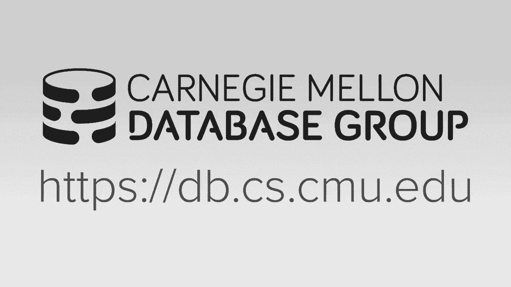
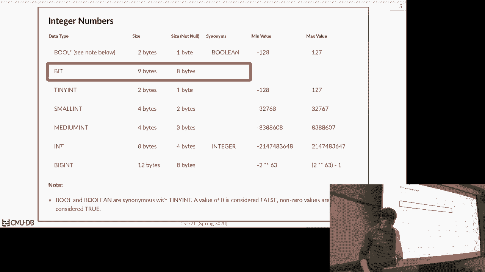
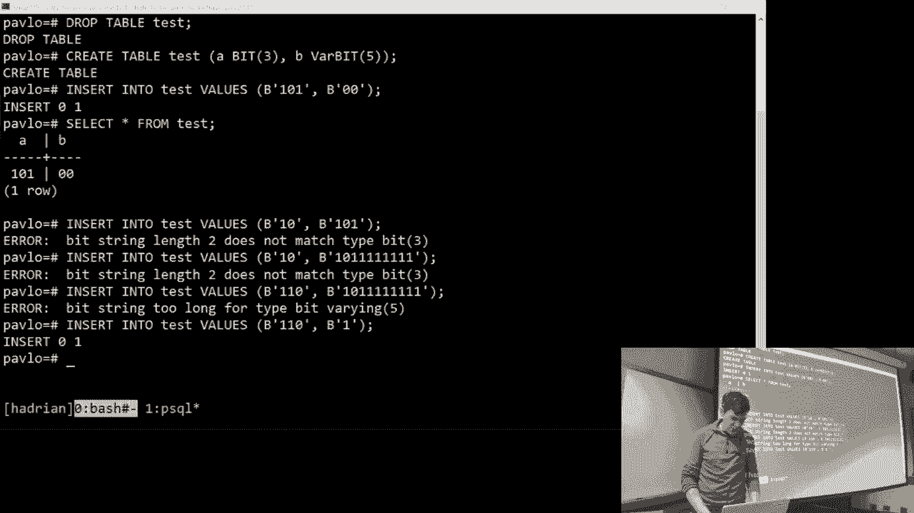
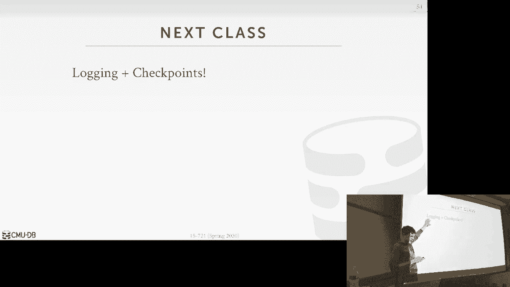

# 【双语字幕+资料下载】CMU 15-721 ｜ 数据库系统进阶(2020·完整版) - P9：L9- 数据库压缩 - ShowMeAI - BV1wv411w7Ko

[Applause]，[Music]。

[Applause]，[Music]，so today there is actually one of my，favorite lectures we're talk about Davis。

compression again the high-level idea，here is we're just gonna be able to。

squeeze down the size of our data in our，database and you know save memory save。

storage but in some cases actually we're，also gonna be able to execute queries。

faster because of the way we're going to，compress things we can we can be aware。

of how things are laid out and do things，more efficiently quickly Before we jump。

into that just reminder that there's a，tech talk today at 4：30 over in here in。

Neil Simon from Oracle the one of the，guys that works on the in-memory。

database team so he answered in that，come check it out the other thing I want。

talk about too is last class we were，looking at mem sequel and we had this。

bit type and we were like oh how can a，bit type be a bytes and I I read the。

documentation for in the sequel standard，and and in other systems it's actually a。

bit string not a single bit so you can，specify like how many bits you want but。

I emailed the mem sequel guy last night，said this documentation is kind of。

confusing because like you can set an，arbitrary size for this but it's unclear。

like why is it 8 bytes right like if I，set it to be bit one it's just drove one。

bit and I really gonna store that to be，8 bytes he said they're trying to it's。

some kind of compatibility of my sequel，they're trying to follow and then。

actually in their new column store，system that they call single store they。

can actually compress compress this，bitmap I don't know exactly how they do。

that but we'll see how to do bitmap，compression in this clip in this lecture。

earlier just again just to show you what，this looks like so this is actually。

Postgres so I can declare a table that，has a bit type right and you can specify。

the number of bits you want and then，this one here you can specify that it's。

it's a verbal number of bits so - I，don't like this little varying thing。

this is from the post documentation so，you guys replace this，with with barb it like that right and。

then now if I certain to the table I can，specify that I want a bit string like。

this right and go ahead and store that，and then when I do a select I get back。

Fitch drinks and in the case of Postgres，that there's two bar bit and regular bit。

is if I try to now insert something that，in the first one because I'm saying。

there has to be three bits if I try and，search something that's just two bits，[Music]。

like that right it'll throw an error，good because it says the bit string has。

to be three is that it - why do we need，what why would you ever do want to need。

a bitmap to store natively in your，database with a bitmap as so statements。

do you know as a bar chart that would be，wasteful so what they really do is these。

case of Postgres I don't know exactly，what them seagulls doing like Postgres。

will say all right you're saying this，thing has can be two bits I can store，wrote eight bits。

yeah yes it seemed to Mac size that I，can store is five so I try to do this，right it won't store it。

well actually didn't like the first one，but like if I go make this one one right。

it's too big for for the bar bit one but，the point I'm trying to make is like for。

the bar bit one I can store this be one，this story that the regular pit and the。

it'll store in the case of this they'll，store the size plus the bit the [ __ ]。

screen itself yeah okay you don't here。

look a bit strings in the post grassman，that's not the point of this lecture I。

just wanted to clarify because we I，didn't know the answer last time okay。

alright so we're gonna talk about today，is compression schemes so we'll force。

provide some background a sort of，obvious but why ever you want to do。

compression actually it's more obvious，maybe in a disk based system but we'll。

see why we still want to do it in memory，system then we'll talk about how to do a。

basic naive compression scheme where the，database system doesn't know anything。

about how they did is actually being，compressed then we'll look at the more。

sophisticated techniques of doing，columnar columnar storage compression。

where the database system itself it was，responsible for running the compression。

album and then it knows that had a，natively stored this compress data and。

they can operate queries on top of them，and then we have time at the end we'll。

finish up talking about some research，we've done here on compressing。

old items okay okay so we didn't talk，about compression in the disk that the。

in the intro class when we talk about，disk or any databases but it's sort of。

obvious that if you're assume your，databases on disk and you're fetching a。

lot of pages from disk to a process，queries then compression is gonna be a。

no brainer in that environment because，the disk i/o so expensive so paying some。

additional CPU overhead to compress the，data when it comes into memory is is。

going to be a good trade-off for us，right because the disk isn't getting。

that much faster and something that you，but we have more cores we can Xu there's。

more computational power available to us，than there possibly is for us to get the。

data in off a disk but now for a memory，database this trade-off isn't so obvious。

right because now everything is in，memory that I'm not paying that big big。

IO penalty and I'll also allow to do，byte level access to to jump to you know。

different offsets and my comms or my，data and access single actually is very。

efficiently whereas in a disk based，system I'm bringing in four kilobyte。

pages at a time so the scope of what I，can compress is is slightly different so，for it。

database we're gonna have make this，trade-off between speed and compression。

ratio and to the best my knowledge in，most cases from mme databases that are。

going to support compress data they're，gonna choose speed over compression。

ratio that means that there's gonna be，some compression algorithms that are。

gonna get an amazing compression ratio，you can take the original data and。

compress it down to a much much smaller，size but it's very computationally。

expensive so they're not going to do，that they're gonna instead choose a。

compression scheme oppression protocol，that maybe isn't as as doesn't produce。

as good of a compression ratio but it，can run fast yeah，quickly and then there's also be the。

straight awful by the way you want to，compress very quickly or decompress very。

quickly and in most cases we're gonna，care about decompressing quickly so I'll。

because that's one new most of the time，so why we want to do this right well。

DRAM is not cheap I have to pay for to，buy that hardware and actually pay to。

keep refreshing it to keep the charge in，that cost energy so if I can store my。

database on a smaller machine with less，memory then that's gonna be a good win。

for us and in some cases when we when we，compress the data we're actually gonna。

get better performance as well because，now things be able to fit me CPU caches。

or for that for a for a looking at a，smaller portion of data we can still。

compute the same result for query so，this is gonna be a win-win almost all。

around so to understand why we can，compress the data we're gonna start to。

understand a little bit what what real，databases actually looked like and so。

the first thing is that the real data，sets are going to be very skewed right。

that means that like the the，distribution of values for a given。

column are not going to be uniform right，to using zip codes as an example there's。

more people that live in New York City，then live in Montana so when I look at。

if I have a list of all you know people，and I'm storing their zip codes there's。

many more people living in New York than，in Montana and I could take advantage of。

that in my compression compression，protocol another good example is there's。

also the brown corpus and this exhibits，this property called the zipping。

distribution so the brown corpus was，this project in the 1960s at Brown。

University where they basically took the，what they considered to be the。

the the most emblematic books in the，English language and they just counted。

the number of words that were in these，books and we suggest let's take a guess。

what the most common word was duh yes，right th e but then what happen is the。

next Muskaan word was the word a and the，the word a or so word the appears twice。

as many times as the word a and a，appears twice as many times as the third。

word and so forth so you have this sort，of power law curve so a lot of real。

workloads are gonna look like that and，these are the kind of things we can take。

advantage of oh you think you like，reddit or hacker news there's a small。

number of articles that actually get a，lot of comments most people submit crap。

and no one ever sees it right and so if，we know this then there's a bunch of。

things you know the long tail stuff we，can then maybe compress in a different。

way or get a good compression ratio the，other thing also too in our data sets is。

that they're gonna be highly correlated，so that means that the values of。

different attributes in the same tuple，or often times gonna be correlated or。

related to each other alright so like my，zip code for my address that can be。

correlated to my to my city so I know my，city name and state I know its zip code。

I'm in or if I buy something on Amazon，oftentimes the the date that something。

was shipped or started the date that，somebody placed the order is only gonna。

be a few days it's only a few days later，would actually be shipped so I buy，something today。

the Amazons ship and [ __ ] out the same，day like I buy something today it's。

gonna be shipped tomorrow so maybe，instead of storing a full 64-bit date。

and time stamp for the order date and，ship date if I just store this and I can。

now maybe store the Delta which is like，you know a couple hours off of this then。

I can say space there so these are a lot，of these techniques about these aspects。

of real datasets is why we're gonna be，able to get a good compression ratio and。

employ these techniques without slowing，down the system entirely so what do we。

want in our compression scheme well for，most is that we need these compression。

schemes to produce fixed length values，because again remember we had this fixed。

length data pool and that's the sort of，the the the you know the the the the。

main primary location of a tuple，so in order for me to jump down to。

different offsets within that fixed，thing a fixed-length datapool all my。

values need to be fixed length so if I，start compressing strings that you know。

from two random sizes that's not going，to work for us so everything has to be。

fixed length datable the other exception，would be when we shove things out the。

bar length datapool since that were，recording the size of the data in the。

very lengthy de poule it's okay for that，to be variable sized but the most of the。

data need to be fixed length the other，thing we want to be able do is postpone。

the the had the gauge of some weight as，long as possible before it actually has。

to decompress the data in the lifetime，of the lifecycle of a query so what I。

mean by that is if I have a bunch of，compressed datum I want to try to do my。

query X you might as much as my query I，can all in that compressed data and only。

until I have to then produce a result to，a human or to the outside world of the。

database ISM then I go ahead and，decompress it all right that's gonna be。

a big deal this is called late，materialization and this is why we're。

gonna want to do native compression，inside of our database system instead of。

using a look at general-purpose Alvin，what we do doesn't know anything about。

what's actually being stored and the，last one is sort of obvious as well but。

we should just sort of bring it up，because there's different types of。

compression algorithms and we make sure，that we only pick ones that we actually。

want to use so any compression scheme，you want to use has to be lossless what。

does that mean what's that，yeah you don't well yes you don't lose。

data but like if I take some original，data and I compress it and then I。

decompress it I should be able to get，back that original data，what's saving is a ball of a lossy。

compression compression algorithm and b3，exactly yes，so in our database and we have to be。

almost always be lossless because people，don't like it when you lose data but。

again if it's your bank account you put，$100 in and they come back to say no you。

have you have 80 dollars you're gonna be，pissed so any compression scheme can't。

that we want to use can't do this if we，do want to do a lossy compression scheme。

then that must be done at the，application level meaning some human has。

to make a value judgment that it's okay，to lose data in our database the。

database system we're not gonna figure，that on Onis own，because the best compression scheme is。

to write everything that dev know and，lose everything right it's gonna have an。

amazing compression ratio it's gonna be，really fast but of course you don't have。

any data so in that sort of an extreme，example but that's the basic idea the。

data stem doesn't know what you actually，care about so it's not gonna do anything。

that's lossing the we're not going to，talk about this but there's there are。

techniques call it approximate queries，that sort of look like lossy compression。

so if I have like a column of people，visiting my website and I want to count。

the number of people that visited the，website in the last month I can you know。

look at every single tuple and can add，that all that up and count it or maybe I。

could sample it or maybe just you know，skip some portion of it and then try to。

approximate that count and the idea，there is like you know who cares if I。

had a you know I had a million users to，my website but then my approximate count。

comes back with you know 980 thousand or，some like that like it's close enough。

and so again we're not gonna like this，but these are called approximate queries。

this is actually now being showing up in，in the commercial systems they'll。

support this today like the habit，explicit like approximate count，operation or aggregate aggregation。

function in Oracle and sequel server and，I think TB 2 might have this so we're。

not gonna talk about that but like ok，this is the next slide，sorry this is I mean so this technique。

actually does exist and then a sequel，server I think just added this within。

the last year again the idea is you're，just sampling on the data and produce。

counts pretty segregations a another，type of technique is to do zone maps and。

so I would categorize both these guys as，in data skipping meaning like we're。

trying to avoid having a look at a bunch，of data the compression scheme we're。

gonna talk about today we stopped to，look at everything but the things we're。

looking at is compressed these are，techniques to say like well I can miss。

ignore large chunks of things so zone，maps I think we covered in the。

introduction class it's not really a，compression scheme it's just a technique。

for in for skipping data the idea is，that you pre compute some some。

aggregations on columns and then when，you start executing queries you can look。

at those those pre computed aggregations，and decide whether there's anything you。

even want to look at and give，Wacka datum so they're called zone maps。

by Oracle I'm sure that they have，patents on this sometimes they call。

pre-computer aggregations but in general，in databases if you say zone maps even。

if you're not talking on the Oracle，system people know what you're talking。

on did you talk about this thing so，let's say I have a column here it has。

five values and so I can compute of zone，map where I'm going to have all the。

aggregation functions I may want to run，compute it for this column so the main。

max average sum and count and then now，if a query shows up like select star。

from table where values greater than 600，instead of scanning through the column。

assuming this is a block of data said of，having to scan through this and find all。

the records that where values greater，than 600 I can use instead look at my。

max value for my for the zone map and，see it the VAX value for this block is。

400 so therefore I know there could not，be any tuple in here that is going to be。

600 or greater so I don't even bother，looking at this I just look at the zone。

map see that thing doesn't satisfy my，so this question is if you're running a。

BTC when would you update zone map so，you so for this and the compression。

stuff what about today you typically，only do this on cold data that's not。

being modified all the time so you would，leave it uncompressed don't compute a。

zone map and only when you recognize it，know when we've come and updated this。

block in a while let me go ahead and，compute these things all right like I。

said this only appears in the more，high-end commercial systems going back。

here Oracle has this Vertica mem sequel，mateesah was a fpga accelerate database。

that IBM paulette they killed at they，killed that off last year but I think。

zoom Maps originally originated from，these guys and then everyone else。

adopted the same idea but only Oracle，calls them zone maps cuz because that。

that's the Oracle term and everyone else，causing pre-computer aggregations or。

something or okay all right，it'll is that okay let's focus on the。

compression stuff that that's that's the，main thing we won't talk about today so。

if you want to add compression to our，database system，the first question we have to think。

about and in sense weird ones actually，building the system is what are we。

trying to compress and based on that，decision that'll tell us what kind of。

compression scheme we could possibly do，so the first approach is just do it on a。

block right it could be a block of，columns or it could be a row store it。

doesn't matter but it's a block of two，floats within the same table you could。

even do even more fine-grain than that，you could do another tuple level so。

within a single tuple you compress all，the values even more fine-grain is you。

have a single attribute within one tuple，and you want to compress that all right。

that sounds crazy but if you have a，large text field that that might make。

sense like Wikipedia has those all those，articles are all every revision of a。

Wikipedia article is its own accurate，value in a tuple and you want to。

compress that or we can compress it on，on the entire column so we take all the。

values for a single attribute across，multiple tuples and then the table and。

we'll go ahead and compress this and，this primarily we only want to do this。

if it's a column story so most systems，most of the OLAP systems are going to do。

this and any other system that does do，compression may be like a naive。

compression look at my Segal we'll see，in a few more slides they'll do this。

there are some systems that can support，this like sequel server can do this。

there's a variant of rocks DVD called，Terra at a China and they can do this。

this appears for only variable length，fields if I have a large blob large text。

field then I can compress this but again，the compression scheme you're gonna want。

to use for all of these are gonna be，much different but for this I could do。

naive compression like gzip or snappy，but for this one we'll use the，dictionary coding or the other。

techniques okay all right so let's let's，first focus on naive compression because。

this is like if you're coming from you，know if you if you know something。

roughly about compression and I'm when，I'm saying oh we're gonna compress data。

this might be the first thing you think，of so the idea here with naive。

compression is that we're gonna take an，off-the-shelf general-purpose。

compression algorithm that our people，using already and other things in our。

databases and we're just going to take，our sequence of bytes from whatever data。

we're trying to compress whether it's a，be，with its column or block and we're gonna。

run run it through these algorithms and，they're gonna produce a but hopefully a。

block of data that's smaller than what I，gave it so the sort of the the kana。

algorithm is people gonna want to use，I said gzip but that's usually not what。

you want to use because gzip is an，example of a heavyweight compression。

algorithm where it's gonna get a better，compression compression ratio than these。

other ones but it's gonna do much more，slowly with like L 0 or LZ 4 these are。

some of the first protocols people have，developed where they are you don't get。

it's good a compression ratio but，they're much faster，snappy is from Google that's another one。

that's very common in database systems，broadly is from Facebook this is not。

typically using databases because this，is designed for like compressing。

webpages or there's some there's some，magic in here that you know if you have。

a much HTML tags and you see over and，over again they can make it in。

compression them better Oracle has this，thing called a zip that's their own。

patented proprietary compression，algorithm it's you know it's it's a。

variant of these like LZ for dictionary，based compression schemes but what's。

fascinating about it Oracle bought Sun，some was making the spark chips so for a。

while I don't think I think they，discontinued spark I forget but for a。

while they were actually storing the the，a zip decompression and compression。

algorithm on hardware right so you can，actually do this as accelerated on if。

you but if you bought spark chips and，ran Oracle on it Z standard is。

considered to be the sort of the，state-of-the-art one today that gives。

you the the same speed as snappy but a，better better compression ratio so a lot。

of times you'll see snappy but newer，systems are starting to adopt Z standard。

so again we've already talked about this，there's computational overhead of。

compressing the data and decompressing，it and so we need be mindful of this and。

what we're always going to try to pick，something back is faster than D kress。

even though if it's syllabus Florida to，compress because most of the time I'm。

just gonna do decompression so let's see，how my secret does this so this is my。

sequel in a DB so in what you can do and，my sequel when you cook when you call。

create table you can pass in a flag and，say I want to store this as I want to。

store this as a compress compress blocks，and so what's gonna happen on。

again my sequels not not an in-memory，system so this is a disk system but I。

just show you that the implications of，this and it's the clears explanation I。

found how did you naive compression so，what they're gonna have on disk is。

they're gonna have these compressed，blocks that are gonna be of four。

different sizes all powers are two one，two four eight kilobytes and the idea。

here is when you have the uncompressed，block and then you compress it whatever。

is the ceiling of the size up to the，next boundary that's you Pat it out to。

so if I have a block that's one point，five kilobytes I'll Pat it out so it's。

two kilobytes and they do this or that，they can pack things in and align them。

nicely out on disk so you're gonna have，the compressed page but then you're also。

going to have this uncompressed mod log，that sits in front of it think of this。

is like a delta store that represents，the changes that I made to tuples that。

are represented in this in this block so，now if I have a query comes along and。

wants to access some data then I bring，it to my buffer pool and I keep it。

uncompressed and if the query is an，update then all that need to do is just。

modify what's in the mod log so I can，sort of Penda entry say I made a change。

to something down here to here the data，that I know you have like so you have to。

have an index up above and say oh I'm，here's the page that has the tuple。

you're looking for so let's say like I，do a set value you know update to both。

set value equal ABC then they don't need，to look to see what the original value。

was I just need to put my mod log and，say the new value for this attribute is。

now ABC so if anybody comes along tries，to read that you check the mod log just。

like you did in the in the BW tree when，you pick me went to the virgin chain and。

you say oh this is the latest value for，this particular tuple that's that's what。

I'm looking for but if the thing you，want is not in the mod log then you got。

a decompressive and so what they，actually do is when they decompress it。

they both keep the the compressed，version and the decompressed version in。

memory and then decompressed version is，always gonna be 16 kilobytes all right。

because they do this to align things，again and in the buffer pool so they'll。

have us you know I've region 4 16，kilobyte pages and then for all the。

different compressed page sizes they，have a certain separate region for that。

so then now if I make any changes and I，want to write them back。

if I modify this page then I'd have to，replace this thing before I read it out。

otherwise if I don't modify it then I，could blow this thing away and then if。

this thing's I modified I can blow that，away as to it were free from the payment。

from the buffer pool so make yes these，questions can be add things to the mob。

log beyond this like so this is a fixed，size I'm about to fix size so you run。

out of space in here then you have to，decompress it and and come you know。

compactor code I apply all the changes，yeah it's like it's like the Delta store。

part for the bead every tree we have is，a fix number of yeah okay so the main。

thing I want to point out about this is，that as I said if I need to access。

something that's in the compressed data，I have to decompress it because again。

assume I ran this through snappy or gzip，or whatever you want to whatever album。

you want to use the database doesn't，know anything of what's inside those。

bytes of the page right underneath the，covers these algorithms are actually off。

oftentimes using dictionary compression，but you don't you can't see that in the。

database system unless you know how to，interpret the the compressed format of。

those different algorithms but I don't，think any system actually does that so。

this now means that this is gonna limit，the scope of what we can actually。

compress because if I try to compress an，entire column and I need to get one。

tuple at the in that column now I got to，decompress the entire thing right so the。

main takeaway from this is that because，we're using an IE compression scheme。

with it is it doesn't know what's going，on we're losing all high-level。

understanding of what's in the what's in，the thing we're compressing and what are。

the semantics of that data so we can't，do any any we can't really do anything。

other than just decompress it every，single time so this is now where we're。

gonna talk about these these better，compression schemes where again the data。

system is natively gonna do this because，it's gonna know how things got。

compressed what it compressed and then，in some cases when it sees queries it。

can maybe just compress the things that，the queries are looking like look。

they're trying to look up on，actually the predicate of the queries。

and do your matching on that and you，never have to decompress the original to。

pour the original data so so they say，this is my table of users and I have。

their salary and I have just two tuples，Andy and Matt and we have our fake。

salaries so if I compress it I'm not，saying how I'm compressing this assume I。

could and for every single value in my，table I may have a compress it with。

something that's smaller than what the，original size was and so now if I want。

to say find all the users were named，equals Andy you know don't assume I have。

it an index assume I'm gonna do a，central scan well in order for me to do。

that match I'd have to decompress this，but instead what if I actually just。

encoded the thing I was looking up one，the same compression algorithm and now I。

do my match directly on compress data，all right that's that's why we do we。

want the data system to do all the，compression stuff ourselves we don't。

want to rely on external algorithm now，for range predicates this is gonna be。

more tricky right find all users where，names greater than Andy this is you know。

depending how we compress this it may，not work but we'll see how to handle。

that in dictionary encoder okay all，right so we're to talk about seven。

different question schemes today and，again this is all gonna be for columnar。

compression in ole ETP systems you，typically do not compress the data when。

it's in memory because as I said it's，gonna be too expensive to to decompress。

and recompress over never again as I，start making changes so this is only for。

cold data that's not to be modified and，we can we already know we can store it。

as a column store so we're sort of a，null suppression run decoding and bitmap。

coding does encoding and all these other，ones are again there leading up this。

with the paper you guys read but these，are much of other things I think are。

interesting to know about but dictionary，encoding is going to be the most common。

one but it's not always gonna be the，best one there are there's be some。

special cases where these other ones can，do much better okay all right so the。

first one the easiest one is called null，suppression and this is a variant of run。

run like for coding the basic idea is，that if we have a table that is has。

attributes or columns that are sparsely，populated meaning most，the values are null then instead of。

storing the null repeatedly over and，over again for every single instance of。

a tuple we can then instead maybe just，record somewhere that says hey I have。

this many Noel's at this location and，then I only record the exact non null。

values in in the table or in the column，now how we actually can do that can vary。

one example would be this oral-b BBC，self we'll see in a few more slides but。

like I said this is just like this is，pretty common when you know things are。

gonna be if you know you have a lot of，sparse data a lot of times the JSON。

databases can do this kind of things，because if they organize it as a column。

store because most of the time you don't，want maybe have all the attributes that。

that other documents have but those are，get run that occurred run link decoding。

again is the is sort of be the higher，higher level idea that nil suppression。

is and the null suppression is a sort of，optimized version for nulls so the idea。

here is that with run like decoding as I，said our values and our columns are。

gonna be oftentimes skewed so we have，this a bunch of repeated values over and。

over again so if we know that we have，runs of values in our columns that are。

all the same then it's again instead of，storing that unique value over and over。

again for every single tuple I can，instead store a triplet that says hey。

here's this value I met this all set in，the column and here's number of times。

that has been repeated and then once you，how I'll have a different value that's。

different than what's in that run then，you have another triplet that records。

that information right so we'll see this，in the next slide but we talked about。

store sorting columns column stores last，last time with Vertica the rumble。

encoding the benefit or the compression，ratio you can get with running encoding。

is gonna be amazing if you're able to，pre sort your columns in such a way that。

you have these long runs of repeated，values so let's see it a really simple。

example so we have a table here of，people with their IDs and their sex and。

so we want to do run length encoding for，the sex column because assuming that。

there's only two two sexes male female，there's only two values we could ever。

have so we're gonna we know we're having，much of these repeats over and over，again。

so if you wanted to run length encoding，now we can store this as a bunch of。

triplets where for each triplet would，have what the original value was what。

are all set is in the column and then，how many values got repeated right so in。

this case here the you know for the，first one I have three M's one two three。

and so in this triplet I have M starting，at position zero three times so now if I。

want to do a lookup and say alright well，what is the sex of the the tuple at。

offset three then I would scan through，this and say all right with a boundary。

of what I'm looking for it can be found，in this this triplet and therefore I。

know what the value is you know other，obvious optimizations too and now if。

you're doing like a group by count，instead of again having to look at every。

single value in the entire column I，Ignace rip through and just look at the。

count and the and and and the value and，populate my my hash table between my。

aggregate very efficiently that way so，what's one problem though with this。

example well one problem this example，here is that it's actually not we're。

actually not getting a good compression，ratio right for this small example but。

you'd imagine it if the table is you，know billions of millions of people then。

this could be problematic because we，have like alternating patterns of。

male-female over and over again right，and so to store one tuple in one。

instance of this of this value here，female I have to store a full triplet。

right because the run is only the run，length is one so what I've quoted stored。

as maybe just eight bits over here now，I'm storing as assuming this is like you。

know 64 bits for each one that's a bit，small but you know and it takes me more。

space to store the triplet than I did，the original value so but if I sort it。

now and now I have all the males first，followed by all the females now when I。

do run length encoding and I'm getting，I'm getting an amazing depression ratio。

because I just have one triplet and say，here's all the males with the length of。

six here's all the females of the length，of two and again now you imagine in a。

large column with a million people this，amazing，yes，normally when it's uncompressed like you，yeah。

this question is when it's uncompressed，if I'm if I met like this offset here at。

6 and I want to know what what is what，is the sex of this person I know how to。

jump to this offset and just see it but，in this world I if I'm here I gotta then。

go scam from the beginning to figure out，where I belong I were at what offset my。

boundary can be founded correct so one，is think of this like I'm doing I'm。

doing I'm encoding per block so it's not，like I'm scanning the entire tuple right。

and the other thing is like for OLAP，queries know you really don't care what。

is the value for this single tuple I，don't care what a nice X is I care to。

know what is the distribution of sexes，across the entire university or the。

class or something like that yeah so，you're doing full scans and that in that。

I said overall makes up for it mean for，the workload we're trying to target like。

the analytical operations this this，would be a big win for OLTP when I'm。

saying go get this one record this is，this question is are our compression。

schemes using HTF systems yeah so this，is like if you do the fraction mirror。

push we told it last time like Olga does，this they had the the column stores。

compressed because you're almost never，updating that and then you have the the。

roast or the uncompressed right so in a，chat systems you can do this in our。

system what we do is we have a slightly，different layout of the blocks when it's。

the data is cold so we actually do，dictionary compression for the blocks。

change button values the world if you，think you have to change the ATM one。

fraction mirrors yeah so member from not，everyone was in intro class but they。

they talked about this last clip today，money talk about it today they talk。

about how like me a little put a little，marker in on the fraction mirror side。

and the column sort of says this thing，got modified don't go look here for this。

exact value go look in a row store yes，if they handle that in peloton。

everything was all sort of an in in in，the current system everything was always。

a a single storage base and it's just，that the the layout of the data may。

change this was felt on the layout video，may change if it was a roast or column。

store if it was hot or cold and we were，doing a pen only MPC C so if you modify。

something in the column store then that，version chain would then get updated to。

now point to the row store in our in our，current system that secession we do the。

same thing to right we have a block of，data that's compressed it can't be。

modified it's a beautiful so if you，modify a tuple we instead of appending。

the virgin chain exactly where that is，and now gets moved over some results we。

treated like a delete followed by an，insert okay so the cool thing about our。

run length encoding or le I think I also，did Vertigo's probably the most of all。

the columns for systems that out there，they're the most one of the biggest。

heavy users or proponents on this，approach most other systems we're going。

to do a dictionary encoding but the cool，thing about RLE is that we actually can。

apply this in conjunction with other，compression schemes and we get this like。

nice multiplicative effect we're like we，can then compress the compress data，which is kind of cool。

so with bitmap and coding the idea is，that it's a bit so we're not we're gonna。

show how to do orally on bitmaps in a，second but like this is another pressure。

scheme you could do where then you can，also apply r-la but you can also apply。

orally for delta encoding so with bitmap，decoding the idea is that it's a。

different way of organizing the datum，where instead of storing for every。

single for a column you're storing the，individual in attributes you're instead。

gonna have a separate bitmap for every，single unique value that a column could，have and then that。

way if I want to see this there's this，attribute this offset had this value I。

look in the corresponding bitmap and I，check to see whether it's it's 0 or 1 at。

that position right so this is only，gonna work if the value cardinality is。

low for the thing I'm trying to compress，so if I have a small number of possible。

attribute I could be because I need to，have a bitmap for every single one then。

this could be a big win but if I have a，lot of different possible batteries or。

every single value is unique then this，is gonna be a terrible idea because I'm。

gonna negative compression because my my，compressed data is gonna be larger than。

the uncompressed data which is which is，obviously bad so as I say before it。

we're gonna break things of the Davis up，to blocks or chunks so that we don't。

that allocate these super large bit，bitmaps right we're have a bitmaps per。

block so going back to our example here，we want a bitmap compress the the。

sex-filled so again we only have two，values male or female，so in our compressed version we would。

have a bitmap for the male a value and a，pit map for the female value and again。

if I want to know what the value is at，this offset I just look in the in the。

bitmap the bitmaps at this offset and I，check to see whether 0 1 right so this。

starts to be a big win so in my little，toy example here I have 9 values。

assuming I can store the the male female，as as a single byte or 8 bits so this is。

gonna be 72 bits but for this one here，in the compressed version I have two，bitmaps。

so that's each one bit piece one bit per，value that I have has 9 times 2 so。

that's me 18 bits then I need to store，the original values but I only store。

them once all right so that's gonna be 2，times 8 bits so 16 bytes plus 18 bytes。

is what is 34 bytes so I can store my，original date with 72 bits I can get it。

down to 34 bits again now extrapolate，across millions of users，this has to be a big deal yes your。

question is why not store oh I think，what you're saying is this is the binary。

male female so instead of storing，separate pitmaster 1 like yes oh his。

David is if you have with with vectorize，instructions instead of storing this as。

a separate bitmap for each of them，couldn't I just or a essentially doing。

dictionary encoding storing a taking a，potentially larger size value and。

compressing it down to a smaller，encoding store those contiguously and。

then run sim D on that that's ridiculous，the other cool thing you actually can do。

I don't think you could do this in the，dictionary codings that what you said。

but one thing you can do is like we，already know that in the query optimizer。

we're going to we're going to evaluate，the predicate s' than in our where。

clause so that we try the more selective，ones first and we start throwing out。

data as quickly as possible but this is，actually little bit different now to we。

can actually order the the the the way，in which we check the bitmap so we know。

one bitmap is super selective within a，single attribute we can actually check。

that one at first that brings a hug a，whole nother level of optimization which。

is totally different than we talked，about for I don't think we'll talk about。

other bitmap encoding schemes but this，is there's other techniques you can do。

that are really kind of cool if you，start encoding your values as bitmaps。

not exactly in this way we're scribing，here but like you know if I'm looking。

for values that are greater than some，you know looking for values that are。

greater than some given value if these，things are sorted in such a way that I。

know that you know I can look at the，first bitmap first and I could throw。

away more data by looking at that，because that's more selective I'll try。

to maybe cover that when talk about，vectorization later on alright so this，is this was a good good。

this is an obvious win we all know if，it's male/female they we're gonna be。

able to press it down by a lot let's do，example we're bitmap encoding could be a。

bad idea so let's say now I have a table，of customers and I had the zip code。

field here I want to try to bitmap，encoding on this so assume in my table I。

have 10 million people and in the United，States there's roughly around 43，000 ZIP。

codes it's really like 41，000 I think，but assuming that's the case so if my。

uncompressed data but I have 10 million，people and assume I can store stored the。

zip code is just 32 bits then the total，mount of space I'm storing for this。

column is just 40 megabytes but now if I，do bitmap encoding I need to have a。

bitmap for every scene single unique ZIP，code in the United States and that。

bitmap needs to be 10 million bits long，because I need to represent for every。

single to blow to my table so now the，total size would be 53 gigabytes right。

so again this obviously be super stupid，to do so bitmap and Cody can get great。

compression ratio but this is something，that like a human has to decide am I is。

this the right way to actually do my，encoding so for this reason I don't。

think bitmap coding is commonly used，it's only really you only really see the。

Sinister the high-end commercial OLAP，systems this is not really an issue we。

organize things plots we could imagine，if now I start serving tuples in two。

different offsets in my bitmap I got，everything else and moving them down the。

same problem we saw last time and that，can get really expensive if I have，43。

000 bitmaps just from one attribute，so one thing we can do though in。

addition to just doing that I'm coding，these bitmaps are just fight sequences。

right there's ones and zeros like like，finish or like like all datum we。

actually can do compression on the，bitmaps themselves to get even better。

compression so the most simplest way to，do this is just run that same snappy or。

lz4 or gzip algorithms we talked about，before take our bitmap that we're。

storing and didn't run that through our，compression scheme and then we could end。

up actually with pretty good results，because again most of the times it's。

gonna be a bunch of zeros and these，algorithms are you know that's that's。

the ideal case for for compressing bit，sequences，again we're not going to do this for an。

enemy database because this is gonna be，expensive because now I have single time。

I gotta do a low couple when these，bitmaps I got to decompress it and。

that's gonna be slow you could say well，let me combine together a bunch of。

bitmaps in my zip code example from zip，codes where nobody lives in like Montana。

and Wyoming and I combine those together，and most the times they don't need to go。

look at those but when I do then I have，to decompress them yes you could do that。

but as far as I know this is a lot of，engineering overhead and no system。

actually does this what you do see，instead though is to do again sort of。

native database compression on the，bitmap codes where you know you're gonna。

have a bunch of zeros and you can try to，take advantage of that and we use a。

variant of a run length encoding so I'm，gonna describe now one technique that。

Oracle used to do called vitelline，bitmap codes or BBC's the spoiler would。

be there they don't actually use this，anymore and explain why at the end but。

this is I think a good example of the，sort of low-level bit it's kind of bit。

you know bit level compression you can，do on bitmaps if you know you're gonna。

have a lot of zeros so I like this，because they're from my opinion this。

this is easy to understand and then you，can then build upon this and do more。

sophisticated things or things that are，better for today's hardware so again。

assume we're doing bitmap coding so we，have these these long bitmaps for our。

column and we want to compress it down，to B so that takes less space and again。

most of the bits are going to be zeros，so we're going to organize it into these。

chunks where we have a bunch of a bunch，of bytes whether all zeros followed by。

some bytes whether there are some ones，so they're gonna designate any byte that。

has all zeros as a gap byte and then any，byte that has a 1 in it in any position。

they'll call that a tail byte and so，that we're doing we're gonna encode a。

chunk where we have a bunch of gap bytes，followed by some number of tail bytes。

and we're gonna break it up and compress，it that way，so the gap bytes will compress with run。

length encoding and then for the tail，bytes where there are there is a 1 in it。

will keep track of either where that one，is located if it's a special case we。

just have one bite or weirdest or them，uncompressed or in in verbatim as they，call it。

so let's look at visual example so say，this is my bitmap here and we can see。

that we it's all zeros except for this，byte up here we have one one and then。

this byte here these two bytes here，there's a one here and there's two ones。

in this one so again what they're going，to do they're going to break up the the。

bitmap into segments or chunks where we，have a bunch of gap bytes where they're。

all zeros followed by some byte where，there's at least one one so for the。

first one here again here's our gap，bytes that are all zeros and then here's。

our tail byte where there's one one in，it so the way we're gonna encode this。

all right here's the other one right，because we have to have down here so way。

we're gonna coat this first one is that，we always have to have a header byte and。

the header blights gonna tell us what is，in our our chunk so the first 3 bits are。

gonna be organized to tell us how many，gap bytes that we have up into seven so。

we can begin the code and this port this，portion of this header but you say we。

have at most seven gap bytes in our，chunk and we have more than we have to。

do something else so in this case here，we have two one two gap bytes so we say。

record that we just have the number two，here then in the next bit this is a。

special flag that says that if this，thing is set to true then we know。

whatever tail byte we're looking at we，only have one in our chunk and that it。

only has one one in it so this is saying，if this is set to one so we know that。

it's a special case so then the next，four bytes tells us at what position in。

our byte that one is located in so in，this one we're encoding for so in our。

tail byte we have one two three four and，that's where the one is located all。

right so we're able to take three bytes，in our bitmap and encode it down to a。

single byte so that's pretty good let's，look at the next chunk so now here again。

we have thirteen gap bytes followed by，two tail bytes so when we write out our。

header we can't record that we have，thirteen gap bytes in it because we can。

only store up to eight or seven in this，in this three bits so we set it all to。

ones right and that's going to tell us，that this is a special case that we need。

to look at the first byte after our，header and that's gonna tell us the。

length of our cap so we're in court，thirteen here and that，represents our 13 cap lights right that。

that's the that's the runtime from，coding part part then we look at this。

special flag here and again that tells，us whether we only have one byte has one，one in it。

this is set to zero so that means that，in the next four bits we're gonna record。

how many verbatim bytes we have right，and this is where we encode exactly。

whatever how the bits are found up here，down in here or just make a straight。

copy of them yes yes yes I know sex yes，but high level I just saw the same okay。

so in this example here I was able to，take a bitmap that was 18 bytes and。

compress it down to 5 bytes that's，pretty impressive right so again I'm I'm。

instead of now storing the the if I'm，doing bitmap encoding instead of storing。

the the bitmap for every single value in，its uncompressed form I can take that。

bitmap and compress each one separately，and one comprehension having you know。

sighs all right so you're it so you're，saying rather than throwing these four。

by logic lying to have a larger gap size，yeah I think that would that would。

they didn't do that way all right yeah，I again like I Isis I suspect media for。

a reason rather they looked at they look，at their bitmaps for their databases。

this is Oracle right so they have real，customers they have real data and they。

made that decision that this for the，most cases this is the right way to do。

this I would assume that right alright，so as I said Oracle doesn't do this。

anymore this is considered an obsolete，format so the reason is because although。

we're gonna get a great compression，ratio the it's actually gonna be。

terrible for modern CPUs because there's，all this branching right as I'm going。

through like in order for me to go，figure out like you know I'm operating。

on these compressed bytes I had to go，jump around like oh is this thing all。

ones if so jump over here or this thing，is is a smaller than that then I no need。

look at this but this is one jump here，if this is zero do something else right。

that's terrible for modern CPUs because，it's all those conditionals are going to。

be hard for the the branch predictor on，the CPU to predict because it's gonna be。

different for every single you know，chunk sequence and we're gonna have a。

lot of miss prediction and that's going，to have to cause us to flush our。

extraction pipeline and that would have，CPU stalls so for this reason they then。

came up with another version of an，improved version called right-aligned。

hybrid bitmap encoding that's designed，for modern CPUs the BBC stuff was。

patented but it was like the 90s - it，might be gone it might be patent expired。

right now this thing is still I think，patented I've never read it。

database patents and and II don't mix so，we，we don't read anything like that but it。

they do have something out there that，does this again the other thing to point。

out too is that in all these cases the，this bitmap encoding scheme it doesn't。

support random access that's okay if，we're doing OLAP queries because we're。

gonna scan from beginning to end but if，we had we want to say find at this。

position whether the bitmap is set to 1，or 0 we have to start from the beginning。

and decompress everything and so this is，not gonna work well for OLTP for OLAP。

this is fine alright so let's go to some，other crushing schemes so Delta encoding。

the idea here is that if we know that，values within the same column are going。

to be have a small difference in between，them then instead of storing again a。

complete copy of that value for every，for every single tuple we'll restore a。

Delta between the between consecutive，values right so the idea here say this。

is my table and I'm recording the，temperature of this room it's 99 degrees。

it's super hot but I'm taking a，measurement in my sensor every minute。

and then the the difference between，these temperatures is not gonna be that。

much because you know if it's think of，the physical world，this room's not gonna go from 99 degrees。

to a zero degrees in a single in a，single minute so the most of time these。

deltas are gonna be overly small，increments so what I'll do is I'll take。

the first value in my two columns and I，will record them in their entirety but。

then everything that comes after that is，just a delta between the previous one。

alright so here I'm storing plus one，plus one to represent that I'm you know。

I'm going one minute ahead and so forth，what's another technique way to get。

further compression on this RLE right，exactly what it says that guy so in here。

again I'm I'm quoting it's measuring，every minute I'm gonna have a bunch of。

plus ones over and over again so I could，take this now and run orally on that and。

now store that as a single you know，single double here plus one followed by。

the size of the rock alright so in this，looking with my toy example here the。

original data assuming that we're，storing the timestamp and the。

temperature as 32 bits that's wrong it's，read 5 times 2 or did you just take the。

so we have five values each one's thirty，bits that's 160 bits in this case here。

assuming that we can then store maybe，this as 16 bits deltas so now I'll get。

down to 96 bits but if I can do RLE on，this say I store the original 32 bits。

followed by just two 16-bit fields like，the the Delta and then the the lengths。

are wrong I can get it down to 64 bits，so that's that's pretty good。

but again same thing like the all the，other seams I said before if I want to。

know the exact value is for for this，unless I'm storing run-length encoding I。

basically at the recompute this thing to，get down to what get the correct time so。

this is where our le could actually get，us better computational and performance。

improvements because I don't have to，reapply this I can just look at this and。

say oh I know that's plus 4 and there's，do simple math to get there okay so。

variant of Delta encoding is called，incremental encoding and the idea here。

is that for Strings if we recognize that，we have repeated prefixes and suffixes。

we just stored the difference between，between the consecutive values so say it。

is my original data I have four strings，Rob Rob robbing and robot so the first。

thing I need to do is figure out what is，the common prefix between consecutive。

values so in the case of the first one，Rob well this is there's nothing before。

it so we have to store that in its，entirety there is no common prefix but。

when we look at the next one here robbed，well this shares the first three three。

characters as this one appear so we know，that this is the common prefix from this。

attribute to the next attribute all，right this bag to the next time we do。

the same thing for all these other ones，here so now once we have this common。

prefix the compressed version could just，store the the length of the prefix that。

we're sharing and then the remaining，suffix that's actually different all。

right so this absent only works if，things are sorted order it actually。

would also work in inside of B plus，trees we'll see you later on but just。

doing some quick math saying now I'm，storing all these characters is a bits。

the total size of this data set here is，168 bits and then for this one it's 88。

bits to store the suffixes and then say，four times eight bits to store the the。

length of the the prefix，so in total that's what this 100 and 120。

okay I'm also not storing the the length，of the the string I have to do that for。

this as well and then same thing for the，suffix like I need of the length of。

suffix yes this question is this yes if，it's sorted electric graphically I mean。

this is saying let's abacus defining，what the collation of the sort order is。

going to be so yes in my example its，ASCII sorting so yes alphabetical。

sorting through this worked out great，for that okay so then the next scheme。

that Myrtle that is not really a，compression scheme but it's a way to。

encode data in in such a way you'd less，space so as far as they know the only。

system that she does this is Amazon's，redshift and so they call this mostly in。

coding so the idea is that if you have，an attribute where most of the time it's。

not going to be the full size that you，define for the attribute then instead of。

storing all the bits for that attribute，you just store it as a smaller data type。

so this is oftentimes very common you，see this in people you know application。

developers when they define their schema，they just say oh I want everything to be。

in 64 but most the time you're only，storing you know something it could be。

stored in 8 bits so if you know that you，can tell it isn't I want to do courts。

called you know the mostly encoding to，say what used to be a 64 bit column now。

I can is most of the times it's gonna be，8 bits all right but anytime that I have。

a value that doesn't fit within 8 bits，then I just have a special flag to say。

the original vector the full value，looking for it this offset is in this。

lookup table here so now if I'm scanning，along and trying to find all values。

greater than you know greater than 10 or，something like that if I come across。

this I would have to know to jump over，here right so in this example here the。

original size would be 5 times 64 bits，would be 33 and 20 bits assuming I again。

I can store the this lookup thing as，just 16 bits plus a 64-bit value then I。

get this down to be hundred 20 bits，right okay so I always we ran out of。

time with compression but the thing I，want to spend time to finish up with is。

the dictionary compression and the idea，here is that this is we're gonna find。

frequently repeated values in the in the，values of the attributes and instead of。

storing them in their entirety over and，over again we're just gonna replace them。

with some kind of smaller code and that，anytime we want to do a look up to see。

what was the original value we'd look in，this dictionary it can be a hash table。

the B plus tree could be an array，different ways to organize it we can。

then convert that encoded value back to，the original value so we obviously want。

to support fast encoding and decoding if，it's really really expensive to encode。

our block of data then this is gonna be，a bad trade off decoding can be gonna。

gonna you know it's gonna be actually，matter more，but when I'll tell my bad V fast as well。

and they were also one of us support，range queries so that we can do you know。

find all attributes that are greater，than sum or sums follow tuples that were。

the values great and some some given，value i don't want to be compressed that。

to do that evaluation so if my，dictionary encoding follows the same。

order of the original values then i can，operate directly on compress data so the。

decisions we're gonna make for，dictionary compression is when to。

construct the dictionary will should be，the scope of the dictionary like what。

you know what portion of the data are we，looking at what data structure we want。

to use and then what should be the，encoding scheme for the dictionary so。

for the paper i have you guys read they，talk about you could use Huffman。

encoding or who tucker codes who tougher，codes are actually gonna want to use。

because their or their order preserving，we're not going to talk about what those。

albums actually are because we don't，really care we just use whatever you。

know we're database people will use，whatever just works but in general most。

people mostly dictionaries are going to，use use the who tucker codes so we're。

gonna focus on on the other ones up here，so the first one is we when do we。

actually construct the dictionary so we，can do this all at once meaning we have。

some some some some data that and we，know that there's nothing else going to。

be added to it or delete it from it so，when you take that data and computer it。

right then to them and this time you，know we're actually gonna possibly get。

the best compression ratio because we，can assume that everything you know we。

know exactly how to pack in the，dictionary codes in the smallest number。

bikes that were ever gonna need，whereas now feminie comes along and and。

wants to modify this we may have to，change depending or adding things or。

deleting things we may have to recompute，the dictionary but if the data is cold。

and this is not gonna happen that often，incremental encoding is where we would。

we would have a dictionary where we add，some additional placeholders where we。

know values could occur we don't know，what they are but we know in our and our。

order preserving or the order of their，dictionary goes something could go there。

so weasel is leave some extra space and，when these things show up we can。

accommodate them and at some point we'll，still get to full and then that case we。

have to recompute the the dictionary all，over again for the dictionary scope。

again we talk to this a little bit，before but we'd have on a block level we。

just take all the tuples on the same，value and compress them this is going to。

be potentially lower compression ratio，and then these other ones because the。

more unique the more repeated values we，see then the better compression ratio。

we're going to get and the the fewer，copies of the same dictionary over and。

over again we get the storm table level，would be we talked a dictionary for the。

entire table this is gonna be amazing，compression ratio but of course this is。

gonna be expensive to update because I，need to I'm inserting a lot of things。

and I may have to recompute the，compression ratio or compression，dictionary all over again and then。

multiple table would be we can record or，maintain a dictionary that can be span。

multiple multiple tables and you would，do this if you have like foreign keys。

where you know that you're gonna join，the the parent relation and the chav。

elation through the spark and over again，so if you can compress them with the。

same dictionary then they'll have the，same codes and you don't have to。

decompress them in order to do the，comparison so let me skip multi I tree。

coding in the sake of time but let's，focus on the order preservation stuff so。

we already talked through this we want，to we need a dictionary that can support。

encode and decode right encode basically，says for a given for given key its。

uncompressed convert it to its，compressed form and then this is just。

the reverse of this alright so the main，thing to point out is that there's not。

gonna be any magic hash function we can，use to do this for us we're not that。

have an additional data structure that，we're gonna have to compute in our datum。

to do this for us right if you had a，hash function that could use this and。

still be order preserving underneath the，covers the way it's actually can be。

implemented right is probably gonna be a，hash table，just a dictionary so and we avoid all。

that and to build the dictionary，ourselves so the reason why we won't be。

order preserving as I already said if，now I have a query shows up like find。

all the users where the name is like a，nd so for the app to execute this query。

instead of having to scan through and，decompress the data and apply this。

predicate I can just scan the dictionary，right if I can Rhian code this to say。

now between 10 and 20 I can just scan，the compressed data and then I can。

figure out what I actually want to look，at so the way you actually keep you at。

this you do a and D you you like on the，dictionary first you figure out what the。

the the between range is and then you，run that scan on this so this dictionary。

is exposed or is maintained by the data，system itself so it can run like。

preliminary queries on this to figure，out what is actually available in the。

compressed data you do other things too，like if you want to say give me all the。

unique count the number distinct names，in this column I don't even touch the。

name field I just go to the dictionary，rip through this portion count all of。

those or actually to know how many，dictionary entries that have that would。

actually good enough to because these，are guaranteed to be unique right all。

right so let's see now if we have a，query like this right we can already。

talk about this the question is do we，have the performance control scan in。

this case yes because I'll match on the，dictionary but I need to find what the。

actual the tuples are but in this other，example here I just want to get the the。

distinct name I don't want the，decompressor I only have to access the。

dictionary yes good you keep bringing，this up some people's might get deleted。

yes so if my dictionary is on a block of，data and I say that block is immutable。

then that can't happen right sometimes，actually also too is in addition to the。

code you also can store the count with，this right and that's cheap to maintain。

every time I insert right yeah so then，you can just do more things on like that。

it's sort of like again the pre-computer，aggregation stuff we talked about bazoom。

at something beginning so I，for this for this value here's another。

occurrences that I have for some queries，I just operate on the dictionary all。

right so the different data structures，you can use for this the most simplest。

one is just being an array so you have，all these very building strings and you。

sort them in an array and the dictionary，code is just the offset into that array。

again this works if the data is not，being modified over and over again right。

as he's gonna ask about because if I，modify things and I add a new string。

then now all the all sets change and I，gotta go recode everything so this is。

actually what we do in our system today，because we followed the Apache arrow。

format and the Apache arrow，specification Apache arrow is like a。

open source universal file format for，in-memory columnstore x' and our data is。

essentially follows this and so we they，do dictionary encoding this way even。

though other encoding schemes might be，better Aero only does dictionary。

encoding another approach did you use a，hash table so this would be fast and。

compact to be with lookups the problems，going to be though you're not going to。

support range queries or prefix queries，because you're not going to easily be。

able to easily scan through the values，all right because everything everything。

to be hashed and then the another，approach is use a B+ tree so this will。

be slower than hash table in the arrays，and potentially take more memory but。

this is going to support the the range，of prefix queries you may want to do as。

far as I know most a lot of systems do，do this first one here I only know of。

there's a patent on this particular idea，so I don't know who else actually does。

this approach right yeah most of the，times you're compressing cold data so。

this one is good enough let's see，actually how you want to do this so the。

idea is basically you have to be plus，trees you have 1/2 encoding and that's。

right side up and then you have 1 to do，decode and that's upside-down so you can。

sort of go in both directions and then，in the middle they're gonna share leaves。

that are gonna map values to codes or，they can use that to do reverse map code。

to values all right so this is me the，shortest share leaf if I have a version。

of value like Aboriginal string I want，to I want to encode it then I go through。

this this index I land in my leaf node，find the entry that I want and then I，would produce。

value but then if I have an encoded，value I use the bottom one do the same，thing but in Reverse。

and then I can spit out what the，original value was and internally what。

they're gonna do is they're gonna use，incremental encoding as we talked about。

before because again within the node，there are gonna be sorted values and。

they're oftentimes going to be repeating，the same prefix over and over again so I。

can compress these down even further the，other thing they're gonna do also to in。

my example here the codes are 10 20 30，40 so they're gonna leave gaps in here。

between the code range so that if a new，tuple or new entry shows up that's in。

between a a a a a B and a e I can insert，a new guy here give it code 11 without。

having to recode everything as soon as I，run out of space in between these then I。

the game's over and I've every start，okay so any questions about dictionary。

encoding that was a bit fast yes yes，yeah so this example is and this one。

here I have a be an AE so I know the，number of keys could exist in between。

these can therefore I can Pat it out，that way you could do that I don't think。

they do that though yeah like if you，know it can only be three characters。

then that's okay right if you have if，it's longer than three then I like that。

works it can be infinite okay so a quick，I'm gonna talk about how to do index。

compression so as I said everything we，talked about here today has been about。

OLAP common expressions you ever see，that mostly in the wild that that's the。

most common thing but for OHP workloads，the the indexes themselves can actually。

take up a lot of space as well right so，this is a study we did for a paper we。

wrote it four years ago we took some，open source benchmarks TPCC articles。

think of this is like hacker news or，reddit it's like people pushing articles。

and then people write in comments and，then voter it came from both DB this is。

a say the Japanese version of American，Idol it's like when people call them a。

phone to vote when someone's like，performing this benchmark mimics that，you snicker but they sold。

both to be a lot of to a lot of like it，ran runs the Japanese version American。

Idol it runs the Canadian version of，American Idol I think there's no one on。

Malaysia it runs like it's like it was，used a lot um I got hired based on this。

right so uh so the original tuba size，for these benchmarks I for all of these。

the indexes themselves are purp rising a，large portion of the data so again we。

can't use the database compression stuff，we talked about so far we can't compress。

the tuples because it's OTP we can，modify anything at any time so we can't。

compress this part but here's all the，other data that we can potentially also。

compress as well so the two most common，techniques to do in X compression are to。

do prefix compression and suffix，truncation and this looks a lot like the。

stuff that we already talked about，before we have bunch of sort of data and。

in our nodes and then we repeat values，over and over again so instead of。

storing the entire value repeatedly we，destroy the prefix once and then just。

the suffix part that is actually，different right this one is actually the。

most comments any and you'll see this，all the time in B plus trees that。

support PBX compression they're gonna do，something like this now whether or not。

the leaf nodes are compressed or just，the inter nodes or depends on what kind。

of workload Turney think and a half like，most of the times you know most of the。

updates are doing to it to a B+ tree，you're always gonna be the leaf nodes so。

maybe you don't compress that part，because this thing's gonna change all。

the time but for the inner nodes and up，above you could you could you could。

oppress those yes this question is is，this a B+ tree approximation of a radix。

tree yes that's one way to think about，it but again except the difference is。

that the these key this is in this if，this is an inner node in the people s。

tree these keys may not actually exist，right suffix truncation and the idea。

here is that for the internodes we don't，maybe to store the entire key right we。

just store that the we just throw away，the suffix word that doesn't help us and。

only store the prefix in these case here，the the these two keys need for these。

two keys they're unique immediately，after the first character a and B so I'm。

looking for something that's that，greater than a then I know I want to go。

one side I'm looking for something，that's less than a or I go to the other。

side alright so I could destroy a b c，and l MN and that's enough for me to。

distinguish which path i want to go down，and that can cut down the space alright。

going back to this one real quickly I'm，shorting compressing keys you'd also。

compress values the pointers to tuples，if they're look if you know that two。

bows are being the same block then，instead of sorting the block ID maybe。

destroy the offset like that that one's，more common in the displaced isms I。

don't know about any in memory system，does this and I don't know of any a MIDI。

Mr Justice a well prefix compression is，the more common one all right the last。

thing we'll talk about is a paper we，wrote for hybrid indexes and again the。

idea here is just to expose you to other，techniques of what other things we could。

compress other than just data so we can，compress the keys in the index we can。

press the values in the index but what，if we actually could also compress the。

data structure itself but the internal，metadata we're maintaining to say this。

actually a B+ stream so what we're gonna，do now is it's gonna call it hybrid。

index we're gonna have a uncompressed，index and a compress index again this。

looks a lot like the fraction mirror，stuff that we talked about for the。

column store last class so the dynamic，index we fast update it's uncompressed。

and then as data gets old we'll convert，it over to this compressed index that'll。

be read-only and then every so often，we're gonna refresh the static stage by。

merging in that the changes from the，front end the front end index to the。

back end so it looks like this so we all，our inserts update leak go to a dynamic。

dynamic index and then over time will，then merges with a static index that's。

compressed but then we'll also maintain，this bloom filters so that when we do a。

lookup we check the bloom filter to see，whether it the thing we're looking for。

it could be in our dynamic index if yes，then we go check it out if not the blue。

filter return tells us false then we，always go check the static index and。

there's a voice that having any excuse，me any false negatives so everyone would。

have bloom put there is who here doesn't，yes surely did this like yeah you don't。

know what others okay I'll give you a，crash course in 30 sec okay so a bloom。

filter is an approximate data structure，that answers set membership queries。

it'll tell you whether does a key exist，in my set but it may give you false。

positives it'll never tell you something，doesn't exist when it does exist but it。

may tell you something does exist when，it doesn't actually exist okay and think。

it's just a bitmap and we're gonna have，to get a hash function on our key or。

take a key hash it multiple times and，update different bits and that's how we。

record whether something exists right so，the only thing we can do is insert and。

lookup we can't actually delete things，we can't do any range queries so this is。

my super simple bloom filter so say I，want to insert RZA from the Mouton clan。

I have two hash functions I take the key，I hash it I'm modded by the number of。

bits that I have and I go flip these，bits to be one now I do this for the GZA。

same thing i modded by number bits i，update that played this so now if i do a。

lookup does this bloom filter contain，the key RZA then i den do the same thing。

take the key pass it then I do my lookup，if all the ones of these positions all。

the positions are these bits are set to，1 then I know the thing could exist。

right and true in case of Raekwon a hash，him now one of the bits are set to 0 so。

I know this thing could not definitely，does not exist but again you can get。

false negatives if I do a lookup with，ODB then the hash will take me to bits。

that are worth set but I never actually，inserted this so it's telling me this。

key exists when it doesn't actually so，in my going back to my example that you。

got it now ok so going back to my，example from before if I with this bloom。

filter it could tell me something exists，in this dynamic index but it doesn't。

actually exist because I've already，merged it back to the static stage but。

that's ok because you know I maybe I do，a look up here and it's wasted but I'll。

never say this thing doesn't exist I go，look in here and I don't see it when it。

actually existed there so how can you，compact a B+ tree other than is doing。

the compressing the keys well the first，thing is that because we have this rule。

for B plus trees they say they have to，be at least half full we，no we're gonna have a bunch of empty。

updated，we don't actually never need these empty，slots so we now we can compress every。

node down to be just storing exactly the，keys that exist but then the next thing。

is that we have these pointers now，because these are just random nodes in。

the heap so these are may 64-bit，pointers to some location in memory。

where the next note is so instead of，storing these pointers in their entirety。

if we just had a offset to some starting，location in an array then that could。

then we could jump down to exactly where，where we should have been if these were，separate nodes。

even though it's one can check you know，containers piece of memory so that's how。

you can compress a B+ tree you can do，the same thing right for a skip list Mew。

the same thing for an art index right，again recognizing that we're never going。

to update the index all these extra，stuff we have in our system or in the。

index so that we can accommodate updates，are unnecessary and we can throw them。

all out and compress it down so in terms，of its size you can get this throughput。

member formants with the hybrid index it，actually turns out being faster because。

there's a product it's smaller and，therefore you have fewer cache misses。

and then the overall size is reduced，quite a bit as well so again this is a。

paper that we wrote a publishing sigmod，a few years ago no system actually does。

this but I think these techniques again，could be applied for in a column store。

system when you know tuples are not，gonna be modified yes question do you。

have a separate bloom filter for each，stage if you have multiple stages like。

you could say like here's a here's a hot，index here's a great cooler index and。

here's the cold index you'd have a bloom，cluster of each one there you don't need。

for the static one right because because，this is saying this is a query shows up。

do I need to read this yes or no and the，blue meter tells me whether I need to do。

that and the idea is that because I say，I do much inserts into my dynamic index。

over time I want to then merge it all，those keys now exist in the static side。

they're no longer exist here this thing，becomes empty，questions why don't we you just interior。

cuz we have other problems yeah I say，also too like we don't have a we don't。

have a multi-threaded thread-safe，merge algorithm we did this in HD or HD。

or single-threaded engines so like we，we'd stop all transactions while we。

merged it cuz otherwise you have to like，merge this and worry about people。

reading the same time or make me make，two copies and that gets expensive。

because they ex can get kind of large，okay so that was rush to the end I。

apologize but beginning the hope of the，main takeaway you got from this is that。

hey the database system knows what the，data looks like it knows what the types。

are it knows how the query is gonna be，accessing them it can now make better。

decisions on how to compress the data，beyond what I can ieave compression。

scheme can do right and we showed how we，can do we can apply we can apply。

compression on already compressed data，like doing RLE on delta encoding and get。

even better compression ratios alright，and then we talked to how about we can。

wait as long as possible during query，execution before we have to decompress。

the data only when we tell the outside，world here's the answer the query then。

ideally we have to decompress it for，joins we'll see later in the semester if。

you're joining two things that are，compressed and their own a different。

dictionary you have to be compressed one，and potentially re-encode the other one。

and that gets expensive but that's，unavoidable okay alright so next week。

we'll talk about our started one，Wednesday today's Wednesday thank you。

yeah all right it's been rough alright，okay baby all right，so Monday thank you Monday we'll talk。

about logging checkpoints so now even，though we're in memory database we still。

need to be able to recover after a crash，so I had to write out things to disks。

and take checkpoints up quickly as，possible okay。

alright have a good weekend see ya Bank。

it in the side park what is this，some fools hey yo，spica's ain't with that here called the。

okay cuz I'm all Chi I stood down with，the testy hi you look and it was go grab。

me a 40 just to get my buzz song cuz I，needed just a little more kick like a。

fish after just one slip put it to my，lips and rip the top off the truck the。

same as hot and my hood wants me to say。