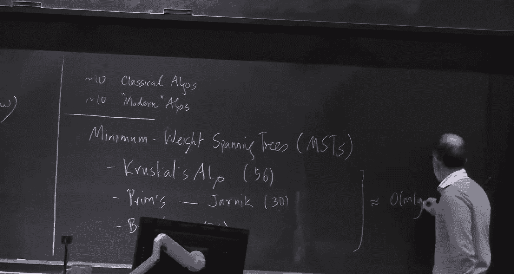
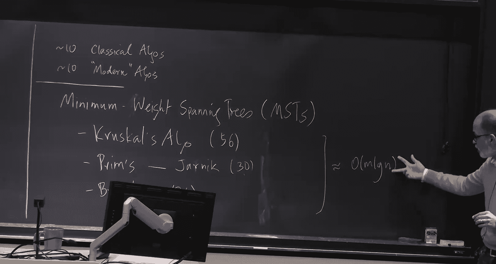

# 高级算法：1：最小生成树入门 🎯

在本节课中，我们将学习最小生成树的基础知识，回顾经典算法，并了解现代算法的发展脉络。最小生成树是图论中的一个核心问题，其算法思想深刻影响了整个算法设计领域。

## 概述

我们将从最小生成树的定义和基本性质开始，回顾三种经典的求解算法：Borůvka算法、Kruskal算法和Prim算法。接着，我们会探讨如何利用更高效的数据结构（如斐波那契堆）和改进的策略（如Fredman和Tarjan的算法）来提升性能。最后，我们会简要介绍随机化算法如何在线性期望时间内解决此问题。

---

## 基本概念与规则

首先，我们定义问题。给定一个无向简单图 **G = (V, E)**，其中 **|V| = n**， **|E| = m**。每条边 **e ∈ E** 都有一个权重 **w(e)**。我们假设所有权重互不相同，这保证了最小生成树的唯一性。最小生成树 **T** 是 **G** 的一个连通、无环且包含所有顶点的子图，其所有边的权重之和最小。

求解最小生成树依赖于两个基本规则：

### 割规则（蓝规则）

对于图的任意一个割（即将顶点集 **V** 划分为两个非空子集 **S** 和 **V\S**），跨越这个割的所有边中，权重最小的边一定包含在任意最小生成树中。

**证明**：假设最小边 **e** 不在最小生成树 **T** 中。将 **e** 加入 **T** 会形成一个环。由于 **e** 跨越了割，该环上必然存在另一条跨越此割的边 **f**。根据定义，**w(f) > w(e)**。此时，用 **e** 替换 **f** 会得到一棵总权重更小的生成树，这与 **T** 是最小生成树矛盾。

### 环规则（红规则）

对于图中的任意一个环，环上权重最大的边一定不在任何最小生成树中。

**证明**：假设最大边 **e** 在最小生成树 **T** 中。从 **T** 中移除 **e** 会将树分成两个部分，形成一个割。由于 **e** 在环上，环上必然存在另一条跨越此割的边 **f**，且 **w(f) < w(e)**。将 **f** 加入断开的两部分可以重新形成一棵生成树，且总权重更小，矛盾。

所有经典的最小生成树算法都基于这两个规则之一或两者结合。

---

## 经典算法回顾

上一节我们介绍了最小生成树的理论基础，本节中我们来看看三种经典的求解算法。它们都基于割规则，并在 **O(m log n)** 时间内运行。

以下是三种经典算法的简要描述：

*   **Borůvka算法 (1926)**：
    1.  初始时，每个顶点自成一个连通分量。
    2.  在每一轮中，对于每个连通分量，选择连接该分量与其他分量的权重最小的边。
    3.  将这些选中的边加入生成树，并合并相应的连通分量。
    4.  重复步骤2-3，直到只剩下一个连通分量。
    *   **分析**：每轮后，连通分量数量至少减半，因此最多有 **O(log n)** 轮。每轮可以在 **O(m)** 时间内完成，总时间为 **O(m log n)**。该算法天然适合并行计算。

*   **Kruskal算法 (1956)**：
    1.  将所有边按权重从小到大排序。
    2.  按顺序检查每条边。如果当前边连接两个不同的连通分量，则将其加入生成树，并合并这两个分量。
    3.  重复步骤2，直到生成树包含 **n-1** 条边。
    *   **分析**：排序需要 **O(m log m)** 时间。使用并查集数据结构来维护连通分量，**m** 次查找和合并操作的总时间可优化至 **O(m α(m))**，其中 **α** 是增长极慢的反阿克曼函数。因此总时间为 **O(m log n)**。

*   **Prim算法 (1930)**：
    1.  从任意一个顶点开始，将其加入生成树集合。
    2.  在每一轮中，选择连接生成树集合与集合外顶点的所有边中权重最小的一条，将其及其连接的顶点加入集合。
    3.  重复步骤2，直到所有顶点都加入集合。
    *   **分析**：朴素实现需要 **O(m log n)** 时间。可以使用优先队列（如二叉堆）来维护从树集到外部顶点的最小边。每次操作（插入、删除最小值、降低关键字）需要 **O(log n)** 时间，总时间仍为 **O(m log n)**。

---

## 迈向线性时间：数据结构的威力

上一节我们看到经典算法达到了 **O(m log n)** 的时间复杂度。本节中我们来看看如何通过改进数据结构和算法策略来逼近线性时间。

一个关键的突破来自**斐波那契堆**。这种优先队列数据结构支持以下操作：
*   **插入(Insert)**：**O(1)** 摊还时间。
*   **删除最小值(Delete-Min)**：**O(log n)** 摊还时间。
*   **降低关键字(Decrease-Key)**：**O(1)** 摊还时间。

将斐波那契堆应用于Prim算法，可以将总运行时间改进为 **O(m + n log n)**。对于稠密图（**m ≈ n²**），这接近线性；但对于稀疏图（**m ≈ n**），它仍然是 **O(n log n)**。

为了进一步优化，Fredman和Tarjan提出了一种巧妙的思想，它本质上是**在Borůvka算法和Prim算法之间进行插值**。其核心步骤如下：

1.  设定一个阈值 **k**。
2.  从某个顶点开始运行Prim算法，但**仅当当前生成树组件的外部邻域顶点数小于 k 时才继续**。
3.  一旦邻域大小达到 **k**，就停止该组件的扩展。
4.  重复此过程，从不同顶点出发构建多个这样的“碎片”。
5.  将每个碎片收缩为一个“超级顶点”，得到一个新图。
6.  在新图上递归地应用此过程。

通过精心设置每轮递归中不断增长的 **k** 值，可以证明该算法的总运行时间为 **O(m log* n)**，其中 **log* n** 是迭代对数，这是一个增长极其缓慢的函数（例如，**log*(2^65536) = 5**）。

---

## 随机化与线性期望时间算法

尽管有了 **O(m log* n)** 的算法，但确定性的线性时间算法仍未找到。然而，利用随机化技术，我们可以在线性期望时间内解决问题。这就是Karger、Klein和Tarjan的算法。

该算法的核心思想是**同时利用蓝规则和红规则**，并通过随机采样来大幅减少需要处理的边数。其框架非常简洁：

1.  **采样**：从原图 **G** 中随机采样大约一半的边，构成子图 **G'**。
2.  **递归**：递归地计算 **G'** 的最小生成树 **T'**。
3.  **验证与过滤**：利用 **T'** 和红规则，识别出原图 **G** 中所有“明显很重”的边（即对于 **T'** 与 **G** 中某条边构成的环，该边是环上最重的边）。根据红规则，这些边不可能在最终的最小生成树中，可以安全删除。
4.  **再次递归**：在删除大量边后得到的、边数大幅减少的图上，再次递归计算最小生成树。

通过精巧的分析可以证明，每一步都能显著减少图的规模，使得算法的总体期望运行时间为 **O(m)**。这至今仍是（期望时间下的）最优结果。

---

## 总结

本节课我们一起学习了最小生成树的基础知识。我们从割规则和环规则出发，回顾了Borůvka、Kruskal和Prim这三种经典的 **O(m log n)** 算法。接着，我们看到了斐波那契堆如何将Prim算法改进到 **O(m + n log n)**，以及Fredman和Tarjan通过插值思想实现的 **O(m log* n)** 算法。最后，我们了解了Karger等人的随机化算法如何在线性期望时间内解决该问题，这展示了随机化在算法设计中的强大力量。寻找确定性的线性时间最小生成树算法，仍然是一个悬而未决的开放性问题。