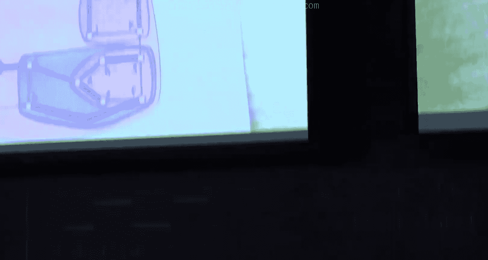
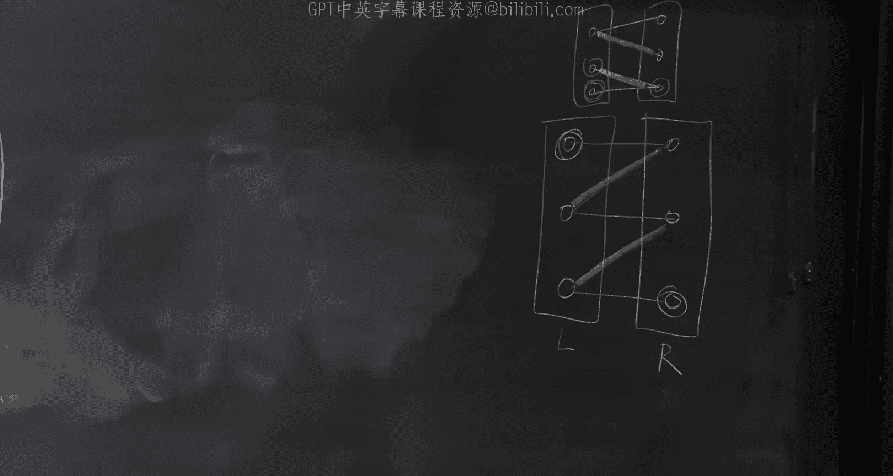

# 高级算法：07：匹配理论

在本节课中，我们将要学习图论中的一个核心概念——匹配。我们将从匹配的基本定义开始，逐步探讨如何寻找最大匹配，并介绍用于证明匹配最大性的关键定理，特别是针对二分图的柯尼希定理。

## 匹配的基本定义

首先，我们定义什么是匹配。给定一个无向无权图，一个匹配是图中边的一个子集，满足其中任意两条边不共享端点。

用公式表示，对于一个匹配 **M**，对于所有属于 **M** 的边 **e** 和 **f**，有：
```
e ∩ f = ∅
```
这意味着边 **e** 和 **f** 不能有公共顶点。

空集也是一个匹配，但我们通常关心的是最大匹配，即包含边数最多的匹配。如果一个匹配覆盖了图中的所有顶点，则称之为完美匹配。



## 最大匹配与增广路径

上一节我们介绍了匹配的定义，本节中我们来看看如何判断一个匹配是否是最大的。这里的关键概念是增广路径。

给定一个匹配 **M**，一条 **M-交错路径** 是指路径上的边在匹配 **M** 内和匹配 **M** 外交替出现。如果一条交错路径的起点和终点都是 **M** 未覆盖的顶点（即自由顶点），那么这条路径被称为 **M-增广路径**。


增广路径有一个重要性质：它的长度是奇数，并且包含的非匹配边比匹配边多一条。

如果我们找到一条 **M-增广路径 P**，我们可以通过取对称差来获得一个更大的匹配 **M‘**：
```
M' = M Δ P
```
其中 **Δ** 表示对称差运算。新匹配 **M‘** 的大小比 **M** 大 1。

因此，一个匹配 **M** 是最大匹配，当且仅当图中不存在 **M-增广路径**。这为我们提供了一个寻找最大匹配的算法思路：从一个匹配（例如空匹配）开始，不断寻找增广路径并扩展匹配，直到找不到增广路径为止。

## 二分图与柯尼希定理

上一节我们介绍了通过增广路径寻找最大匹配的通用思路，本节中我们来看看在二分图这一特殊且重要的图类中，匹配问题有更深刻的理论结果。

在二分图中，顶点集可以划分为两个不相交的子集 **L** 和 **R**，所有边都连接 **L** 和 **R** 中的顶点。

与匹配相关的另一个概念是点覆盖。一个点覆盖是图中顶点的一个子集，使得图中的每一条边都至少有一个端点在这个子集中。

对于任何图，最大匹配的大小不会超过最小点覆盖的大小。因为点覆盖必须“击中”匹配中的所有边，而匹配中的边互不相交。

柯尼希定理指出，在二分图中，最大匹配的大小恰好等于最小点覆盖的大小。这是一个非常优美的最大最小定理。



为了证明这个定理并同时给出寻找最大匹配或证明其最大性的算法，我们考虑以下搜索过程：
1.  从左侧所有自由顶点开始。
2.  进行广度优先搜索，交替经过非匹配边和匹配边。
3.  如果搜索到达一个右侧的自由顶点，我们就找到了一条增广路径。
4.  如果搜索无法继续且未找到增广路径，则搜索过程会定义出一个点覆盖。

具体来说，令 **U** 为搜索过程中访问到的左侧顶点集合，**Z** 为从左侧自由顶点通过交错路径能到达的所有顶点集合。那么，点覆盖 **C** 可以构造为 **C = (L \ Z) ∪ (R ∩ Z)**。可以证明 **C** 是一个点覆盖，且其大小等于当前匹配 **M** 的大小。根据最大匹配不超过最小点覆盖的原理，当前匹配 **M** 就是最大匹配。

这个算法在二分图中可以在 **O(mn)** 时间内找到一个最大匹配，其中 **m** 是边数，**n** 是顶点数。

## 一般图中的匹配

上一节我们看到了二分图中匹配问题的优美解法，本节中我们来看看在一般（非二分）图中，情况会变得更加复杂。

柯尼希定理在一般图中不再成立。一个简单的反例是长度为3的奇环（三角形），其最大匹配大小为1，但最小点覆盖大小为2。

然而，贝尔热定理（关于增广路径的等价性）在一般图中仍然成立。因此，核心挑战仍然是如何寻找增广路径，或者当不存在增广路径时，如何给出一个紧凑的证明。

对于一般图，图特定理给出了最大匹配的另一种刻画。对于图的任意一个顶点子集 **U**，考虑从图中删除 **U** 后得到的图 **G - U**。设该图有 **k** 个奇连通分支（即包含奇数个顶点的连通分支）。那么，任何匹配的大小最多为：
```
|M| ≤ (|V| + |U| - k) / 2
```
图特定理指出，最大匹配的大小恰好等于对所有子集 **U** 取上述表达式的最小值：
```
ν(G) = min_{U ⊆ V} (|V| + |U| - odd(G-U)) / 2
```
其中 **ν(G)** 表示最大匹配的大小，**odd(G-U)** 表示 **G-U** 中奇分支的数量。

## 一般图中寻找增广路径：花收缩算法

上一节我们介绍了证明一般图匹配最大性的图特定理，本节中我们来看看如何在一般图中实际寻找增广路径。这里的关键思想是处理搜索过程中可能遇到的奇环。

在一般图中进行类似二分图的增广路径搜索时，可能会遇到“花”。一个花由一个偶长度的“茎”（一条交错路径）和一个奇长度的“花蕾”（一个奇环，在环的某点与茎相连）组成。

花的核心性质是：如果图中存在一条增广路径，那么在将花收缩为单个顶点（称为“伪顶点”）后的新图中，也存在一条增广路径。反之亦然。

埃德蒙兹的“花收缩”算法正是基于这一观察：
1.  在寻找增广路径的搜索过程中，如果发现一个花（奇环）。
2.  将该花收缩为一个伪顶点。
3.  在收缩后的新图上递归地继续搜索增广路径。
4.  如果在收缩后的图中找到了增广路径，可以将其“展开”回原图，得到原图中的一条增广路径。

通过反复应用花检测和收缩，算法最终要么找到一条增广路径，要么确定不存在增广路径（此时可以结合图特定理构造出证明匹配最大性的证书 **U** 集合）。这个算法证明了在一般图中也可以在多项式时间内找到最大匹配。

本节课中我们一起学习了匹配理论的基础。我们从匹配和增广路径的定义出发，看到了如何利用增广路径来增大匹配。在二分图中，我们学习了柯尼希定理及其证明算法，该算法能同时找到最大匹配或最小点覆盖。对于一般图，我们了解到图特定理给出了最大匹配的极小极大刻画，而埃德蒙兹的花收缩算法则提供了寻找增广路径的有效方法。匹配是一个内容丰富且联系广泛的领域，为许多组合优化问题提供了基础。