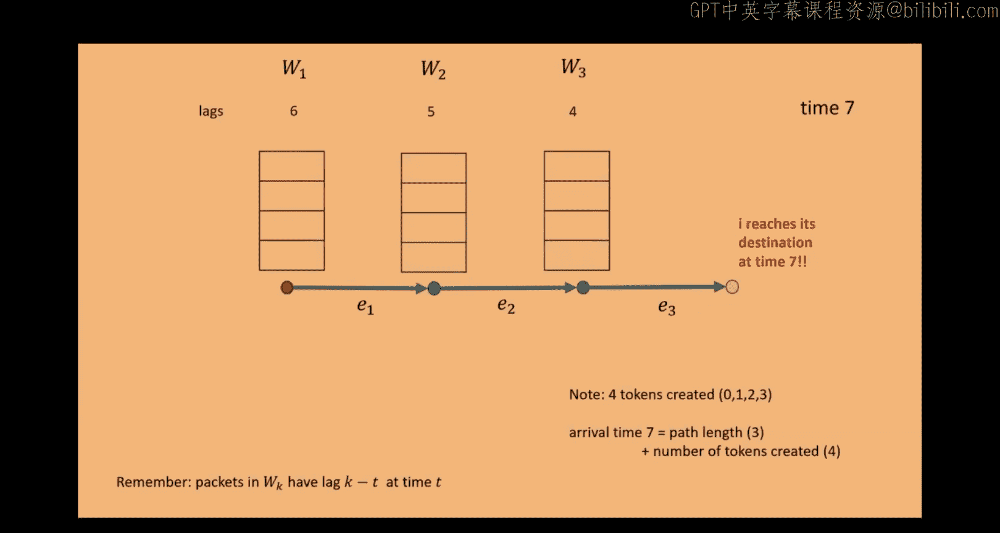

# 高级算法：12：测度集中 II

在本节课中，我们将继续学习测度集中理论。首先，我们将回顾并详细展示Valiant和Brehner的“收费论证”证明。随后，我们将深入探讨切尔诺夫界的证明过程，并了解其扩展形式。最后，我们将介绍维度约简的基本思想，这是切尔诺夫界的一个强大应用。

## Valiant-Brehner 收费论证回顾

上一节我们介绍了在超立方体网络中数据包路由的延迟分析问题。本节中，我们来看看Valiant和Brehner提出的“收费论证”证明细节。

该论证的核心思想是：每个数据包I的延迟不会超过其路径长度加上干扰它的其他数据包数量。形式化地说，设数据包I的路径为P，长度为|P|。设S_I为所有路径与P至少共享一条边的其他数据包的集合。定理表明，数据包I到达目的地的时间最多为 |P| + |S_I|。

以下是论证的关键步骤：

1.  **生成令牌**：每当数据包I被延迟一个时间单位，它就生成一个令牌。
2.  **传递令牌**：这个令牌会被当时导致I延迟的那个数据包携带。
3.  **令牌限制**：每个数据包在任何时刻最多携带一个令牌。
4.  **令牌离场**：当其他数据包离开路径P或到达目的地时，它们会各自携带一个令牌离开。

由于最多有|S_I|个其他数据包，每个最多携带一个令牌离开，因此I最多能被延迟|S_I|次。加上路径本身的长度|P|，就得到了总时间上界。

这个论证通过动画演示可以更清晰地理解：令牌在导致延迟的数据包之间传递，并最终随这些数据包离开系统，从而限制了总延迟次数。

## 切尔诺夫界证明

现在，让我们回到测度集中性的核心工具——切尔诺夫界，并详细看看其证明过程。

设X_1, ..., X_n为独立的随机变量，取值于[0,1]。记μ_i = E[X_i]，S = Σ_{i=1}^n X_i，μ = E[S] = Σ μ_i。切尔诺夫界指出，对于任意λ > 0：
P(S ≥ μ + λ) ≤ exp( -λ²/(2(μ+λ)) )
P(S ≤ μ - λ) ≤ exp( -λ²/(2μ) )

我们将证明上尾不等式。证明的核心是使用矩母函数和马尔可夫不等式。

**证明步骤：**

1.  **引入指数函数**：对于任意t > 0，有：
    P(S ≥ μ + λ) = P( e^{tS} ≥ e^{t(μ+λ)} )

2.  **应用马尔可夫不等式**：
    P( e^{tS} ≥ e^{t(μ+λ)} ) ≤ E[e^{tS}] / e^{t(μ+λ)}

3.  **利用独立性分解矩母函数**：
    E[e^{tS}] = E[ Π_{i=1}^n e^{tX_i} ] = Π_{i=1}^n E[e^{tX_i}]

4.  **计算单个矩母函数**：由于X_i ∈ [0,1]且E[X_i]=μ_i，有：
    E[e^{tX_i}] = (1-μ_i)*e^{t*0} + μ_i*e^{t*1} = 1 - μ_i + μ_i e^t

5.  **组合并应用不等式**：我们需要最小化这个上界。通过一系列代数运算（包括使用不等式1+x ≤ e^x及其反向形式），并对参数t进行优化（求导并令其为零），最终可以得到：
    P(S ≥ μ + λ) ≤ exp( - (μ+λ) log(1 + λ/μ) + λ )
    进一步简化即可得到标准形式 exp( -λ²/(2(μ+λ)) )。

证明的关键技巧在于通过指数变换放大偏差，利用独立性分解期望，然后通过优化自由参数t来得到最紧的界。

## 切尔诺夫界的扩展

切尔诺夫界的基础形式要求随机变量独立。然而，在许多实际场景中，我们可以放宽条件。

以下是几种重要的扩展情况：

*   **负相关**：如果随机变量是负相关的（例如，从n个元素中随机抽取k个，指示变量是否被选中），那么类似切尔诺夫的不等式仍然成立。
*   **鞅差序列**：对于鞅差序列（即E[X_i | X_1,...,X_{i-1}] = 0），即使变量不独立，也有阿祖马不等式等形式给出集中性保证。
*   **对数矩母函数与散度**：切尔诺夫界可以优雅地用对数矩母函数ψ(t) = log E[e^{tX}]及其勒让德变换（或称为速率函数）I(a) = sup_{t>0} {at - ψ(t)} 来表示。对于伯努利变量，I(a)恰好是KL散度D(a||p)。这种表述将概率尾界与信息论中的散度联系起来。

这些扩展使得切尔诺夫界能够应用于更广泛的随机过程和分析中。

## 维度约简简介

最后，我们探讨切尔诺夫界的一个经典应用：约翰逊-林登斯特劳斯引理，它揭示了维度约简的惊人可能性。

问题的核心是：给定高维空间中的n个点，能否将它们映射到低得多的维度的空间中，同时近似保持所有点对之间的距离？

约翰逊-林登斯特劳斯引理指出，对于任意ε∈(0,1)，存在一个映射f: R^D → R^k，其中k = O(ε^{-2} log n)，使得对于原始点集S中任意两点x,y，其像的距离满足：
(1-ε) ||x-y||² ≤ ||f(x)-f(y)||² ≤ (1+ε) ||x-y||²

更令人惊讶的是，这样的映射可以简单地通过一个随机线性变换来实现。

**构造方法：**
令映射f(x) = (1/√k) * M x，其中M是一个k×D的随机矩阵，其每个元素M_{ij}独立地服从标准正态分布N(0,1)。

**证明思路（概要）：**
1.  只需证明对于任意单位向量u（即||u||=1），其像的长度平方||f(u)||²集中在1附近。
2.  注意到f(u)的第j个分量为(1/√k) Σ_{i=1}^D M_{ji} u_i。由于M_{ji}是独立高斯变量，这个和是一个高斯随机变量，其方差为Σ u_i² = 1。
3.  因此，||f(u)||² = (1/k) Σ_{j=1}^k (高斯变量_j)²，即k个独立的标准高斯随机变量的平方和的平均值。
4.  这个表达式是卡方分布除以k。我们可以计算其矩母函数，并应用切尔诺夫界来证明，当k足够大（~ log(1/δ)/ε²）时，有很高的概率使得| ||f(u)||² - 1 | ≤ ε。
5.  最后，对所有的点对差向量（共n(n-1)/2个）应用此结论，并利用联合界，即可证明映射f以高概率保持所有点对距离。

这个结论意味着，即使将数据投影到维度仅为O(log n)的空间中，其几何结构也能得到极大程度的保留，这在机器学习、数据压缩和算法设计中有广泛应用。

## 总结

本节课中我们一起学习了：
1.  Valiant-Brehner收费论证的完整演示，该论证巧妙地使用令牌传递来界限网络路由延迟。
2.  切尔诺夫界的详细证明过程，包括使用矩母函数、马尔可夫不等式和优化技巧。
3.  切尔诺夫界的几种重要扩展，如负相关情形和鞅差序列，以及其与对数矩母函数、速率函数的关系。
4.  约翰逊-林登斯特劳斯引理的基本陈述和随机构造方法，这是切尔诺夫界在维度约简中的一个深刻应用，展示了高维数据可以有效地被压缩到对数维度而几乎保持距离结构。