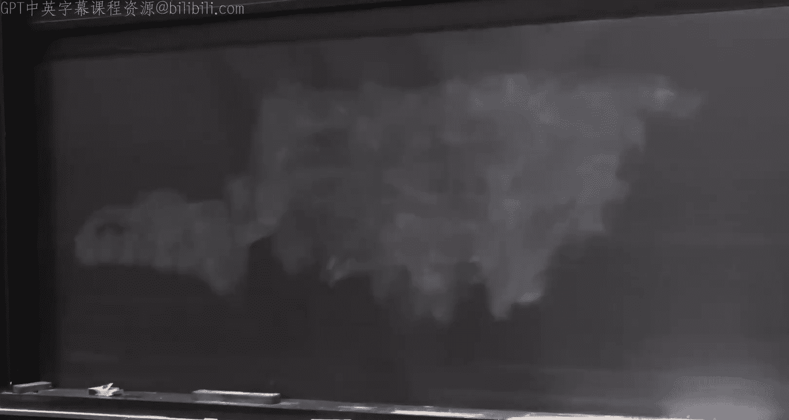

# 高级算法：21：椭球法、质心法及其他 🧮

在本节课中，我们将学习如何高效地求解凸优化问题。我们将介绍两种核心算法：质心法和椭球法。这两种算法都能在多项式时间内找到近似最优解，其运行时间与误差参数的对数相关，这比传统的梯度下降法要快得多。

---

## 概述

我们考虑一个凸优化问题：给定一个凸函数 **f** 和一个凸集 **K**，我们希望找到点 **x***，使得 **f(x*)** 最小。由于精确解可能难以表示，我们允许一个误差 **ε**，目标是找到一个点 **x**，使得 **f(x) ≤ f(x*) + ε**。

为了求解这个问题，我们需要以某种方式“访问”函数 **f** 和集合 **K**。通常，我们假设有以下“神谕”：
*   **梯度神谕**：给定点 **x**，返回梯度 **∇f(x)**。
*   **值神谕**：给定点 **x**，返回函数值 **f(x)**。
*   **投影神谕**：给定点 **x**，返回 **K** 中离 **x** 最近的点。
*   **强分离神谕**：给定点 **x**，若 **x** 不在 **K** 内，则返回一个将 **x** 与 **K** 分离的超平面。

梯度下降法是一种经典方法，但其运行时间与 **1/ε²** 成正比，这在 **ε** 很小时效率不高。本节课介绍的算法，其运行时间将与 **log(1/ε)** 成正比，这是一个巨大的改进。

---

## 质心法

上一节我们介绍了问题的基本设定。本节中，我们来看看第一种高效算法——质心法。其核心思想是进行一种“全局”的二分搜索，每次迭代都根据梯度信息，切掉当前凸体的一部分，从而快速缩小包含最优解的区域。

### 算法描述

算法步骤如下：

1.  初始化：令 **K₀ = K**。
2.  对于 **t = 0, 1, 2, ...**，重复以下步骤，直到满足停止条件：
    *   计算当前凸体 **Kₜ** 的**质心** **cₜ**。
    *   查询函数 **f** 在 **cₜ** 处的梯度 **gₜ = ∇f(cₜ)**。
    *   定义新的凸体 **Kₜ₊₁**，它是 **Kₜ** 与一个半空间的交集。这个半空间由梯度方向决定，我们“切掉”那些沿着梯度方向（函数值可能增加）的部分：
        ```
        Kₜ₊₁ = Kₜ ∩ { x | gₜᵀ (x - cₜ) ≤ 0 }
        ```
3.  在运行了 **T** 步后，我们从所有计算过的质心 **{c₀, c₁, ..., cₜ}** 中，选择函数值最小的那个作为最终输出 **x̂**。

### 为什么有效？关键定理

该算法有效的关键在于一个关于凸体与其质心的几何定理——**格伦定理**。

**定理（格伦定理）**：设 **K** 是一个紧凸集，**c** 是其质心。任何通过质心 **c** 的超平面，都会将 **K** 分成两部分，每一部分的体积至少占总体积的 **1/e**（约 **36.8%**）。

这意味着，每次我们通过质心做一个切割（根据梯度方向），我们都能保证扔掉至少 **1 - 1/e**（约 **63.2%**）的体积。因此，凸体的体积会呈指数级下降。

### 算法分析

为了证明算法能找到近似最优解，我们进行如下构造和分析：



1.  **定义“好”区域**：围绕最优解 **x***，我们构造一个小区域 **K_δ**，其中所有点的函数值都接近 **f(x*)**。具体地，对于任意 **x ∈ K_δ**，有 **f(x) ≤ f(x*) + 2Bδ**，其中 **B** 是函数值的上界。如果我们令 **δ = ε/(2B)**，那么 **K_δ** 中所有点的函数值都不超过 **f(x*) + ε**。
2.  **体积衰减**：根据格伦定理，每次迭代后，剩余凸体的体积至少衰减为原来的 **(1 - 1/e)** 倍。
3.  **必然切到好点**：经过 **T = O(n log(B/ε))** 步后，剩余凸体的体积将小于 **K_δ** 的体积。这意味着在之前的某一步，算法一定已经“切掉”了 **K_δ** 中的至少一个点（记作 **y**）。
4.  **质心也是好点**：假设在第 **t** 步，质心 **cₜ** 的切割导致了 **y** 被切掉。根据凸函数的性质，有：
    ```
    f(y) ≥ f(cₜ) + gₜᵀ (y - cₜ)
    ```
    由于 **y** 被切掉，意味着 **gₜᵀ (y - cₜ) > 0**。因此 **f(cₜ) ≤ f(y)**。而 **y** 在好区域 **K_δ** 内，所以 **f(y) ≤ f(x*) + ε**。由此可得 **f(cₜ) ≤ f(x*) + ε**。
5.  **最终输出**：由于我们最终输出的是所有质心中函数值最小的那个，而其中至少有一个质心（即 **cₜ**）满足上述不等式，因此最终输出的 **x̂** 也满足 **f(x̂) ≤ f(x*) + ε**。

### 算法的挑战

质心法在理论上是优美的，但在实践中面临一个主要挑战：**精确计算凸体的质心通常是困难的**（例如，对于多面体，精确计算质心是 #P-难问题）。不过，研究已经表明，**近似计算质心**是可行的（例如，通过从凸体中随机采样点并求平均），并且只要近似足够好，算法依然有效。这涉及到格伦定理的鲁棒性版本。

---

## 可行性问题与分离神谕

在深入椭球法之前，让我们先看一个相关的、更基础的问题：**凸集可行性问题**。

假设我们知道一个凸集 **K** 包含在一个大球（半径 **R**）内，并且它本身包含一个小球（半径 **r**）。我们的目标是找到 **K** 中的任意一点。


我们通过一个**强分离神谕**来访问 **K**：给定一个点 **x**，神谕要么告诉我们 **x ∈ K**，要么返回一个分离超平面，证明 **x** 不在 **K** 内，并且 **K** 完全位于该超平面的另一侧。

如果我们拥有质心神谕，那么解决这个可行性问题的算法与之前的优化算法几乎相同：
1.  从包含 **K** 的大球开始。
2.  重复：计算当前凸体的质心 **c**，询问分离神谕。
    *   若 **c ∈ K**，问题解决。
    *   否则，神谕返回一个分离超平面。我们保留包含 **K** 的那一半凸体（根据神谕的信息），更新当前凸体。
3.  根据格伦定理，体积指数衰减。因为我们知道 **K** 包含一个半径为 **r** 的小球，其体积与 **rⁿ** 成正比，而初始大球体积与 **Rⁿ** 成正比。因此，最多经过 **O(n log(R/r))** 步，当前凸体的体积将小于 **K** 中小球的体积，这意味着算法必然在此之前的某一步已经找到了 **K** 中的点（或者质心本身就在 **K** 中）。

这个可行性问题是许多优化问题的核心。例如，在凸优化中，所有函数值不超过 **f(x*)+ε** 的点也构成一个凸集（函数的**下水平集**），找到这个凸集中的点就等价于解决了优化问题。

---

## 椭球法

上一节我们看到，质心法的主要瓶颈在于质心的计算。本节中，我们来看看历史上第一个被证明是多项式时间的算法——**椭球法**。它由 Khachiyan 在 1970 年代提出，其核心思想是用一个更容易维护的几何对象——**椭球**，来包裹我们感兴趣的凸区域。

### 算法思路

椭球法解决了与质心法相同的可行性问题，但避免直接计算质心。

1.  **初始化**：从一个包含目标凸集 **K** 的大球（一个特殊的椭球）**E₀** 开始。
2.  **迭代**：在第 **t** 步，我们有一个椭球 **Eₜ**，其中心为 **cₜ**。
    *   检查中心 **cₜ** 是否在 **K** 中（使用分离神谕）。
    *   如果是，算法结束。
    *   如果不是，分离神谕会给出一个通过 **cₜ** 的超平面，并指出 **K** 位于该超平面的某一侧（记为半空间 **H**）。
    *   我们构造一个新的、**体积最小的椭球 Eₜ₊₁**，使得它包含 **Eₜ ∩ H**（即当前椭球与包含 **K** 的那一半的交集）。
3.  **更新椭球**：关键步骤在于如何从 **Eₜ** 和分离超平面计算出 **Eₜ₊₁**。这个更新有封闭形式的公式，涉及对当前椭球矩阵进行一个特定的秩一更新。

### 为什么有效？体积衰减


与质心法类似，椭球法的有效性也依赖于体积的持续减少。可以证明，存在一个常数 **C > 1**，使得：
```
Vol(Eₜ₊₁) ≤ (1 - 1/(C*n)) * Vol(Eₜ)
```
也就是说，每次迭代，椭球的体积至少减少一个 **1 - 1/(Cn)** 的因子。这与质心法的常数因子衰减 **(1 - 1/e)** 不同，椭球法的衰减因子与维度 **n** 有关，衰减速度更慢。

### 复杂度分析

由于每次体积减少因子为 **(1 - 1/(Cn))**，为了将体积从初始的 **Rⁿ** 量级减少到小于目标小球的体积 **rⁿ**，所需的迭代次数 **T** 满足：
```
(1 - 1/(C*n))^T * Rⁿ ≤ rⁿ
```
取对数并近似计算，可得 **T = O(n² log(R/r))**。因此，椭球法的迭代次数是**多项式级别**的，尽管比质心法的 **O(n log(R/r))** 多了一个因子 **n**。

### 实际考虑与比特复杂度

椭球法在理论上是多项式时间算法，但在实际实现中必须考虑**数值精度**问题。更新公式涉及平方根等运算，如果使用无限精度实数运算，则不符合图灵机模型下的“多项式时间”定义。

Khachiyan 的主要贡献之一就是证明了，即使在有限精度（多项式位数）的算术下运行，累积的舍入误差也可以被严格控制，算法仍然有效。这需要将“强分离神谕”弱化为“弱分离神谕”（允许边界附近的误差），并精细地跟踪所有误差的传播。这方面的详细分析通常可以在关于线性规划的经典著作中找到。

---

## 总结

本节课我们一起学习了求解凸优化问题的两种高效算法：

1.  **质心法**：通过迭代计算凸体的质心并沿梯度方向切割，实现体积的指数级衰减（每次至少减少 **~63%**），从而在 **O(n log(1/ε))** 步内找到 **ε-** 近似解。其理论核心是**格伦定理**。主要实践挑战在于质心的计算是困难的，但可通过近似采样克服。
2.  **椭球法**：为了规避质心计算的难题，用一系列逐渐缩小的椭球来包裹目标凸集。每次迭代构造一个包含“未切割”部分的最小体积椭球。其体积衰减较慢（每次减少约 **1/(Cn)** 因子），导致需要 **O(n² log(1/ε))** 步，但仍在多项式时间内。它是历史上第一个被证明可多项式时间求解线性规划的算法，其实现需仔细处理数值精度（比特复杂度）。

这两种算法都展示了如何利用凸集的几何性质（体积减少）和分离神谕，来设计出比局部搜索法（如梯度下降）更高效的全局优化算法。椭球法的一个重要延伸是，它可以用来求解那些约束条件数量**指数级**庞大、但具有高效分离神谕的线性规划问题，这体现了其强大的理论价值。