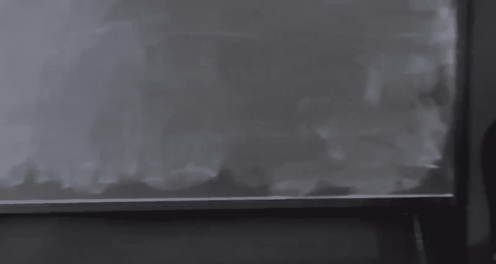
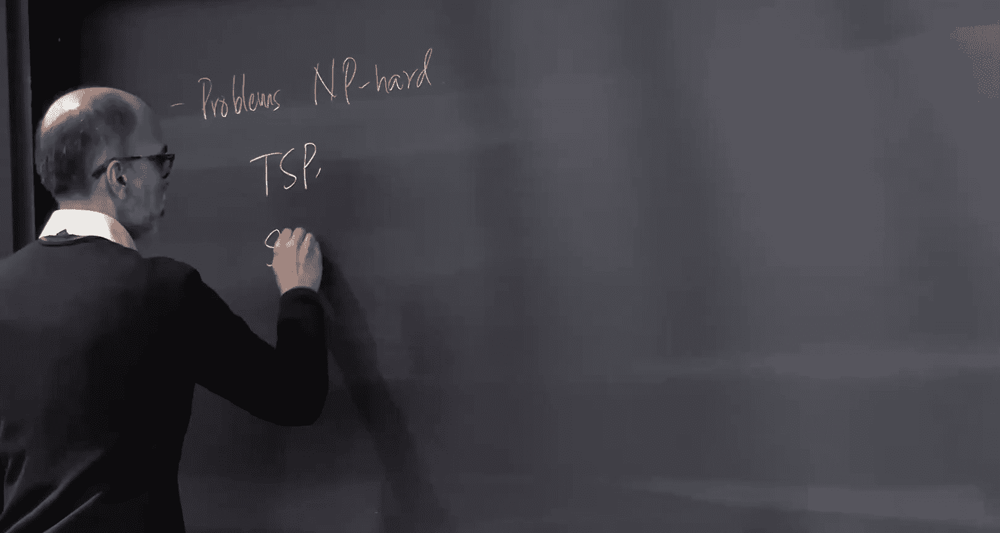
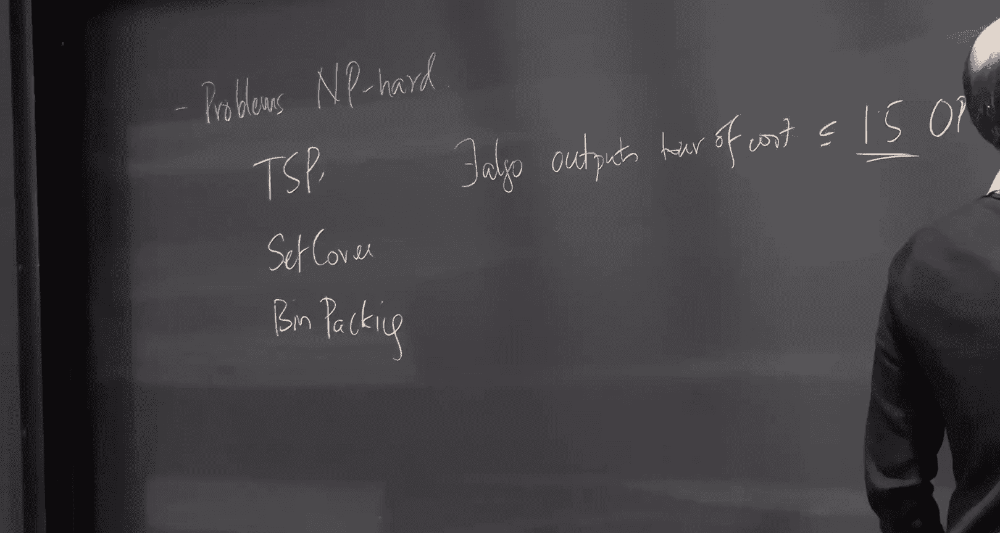
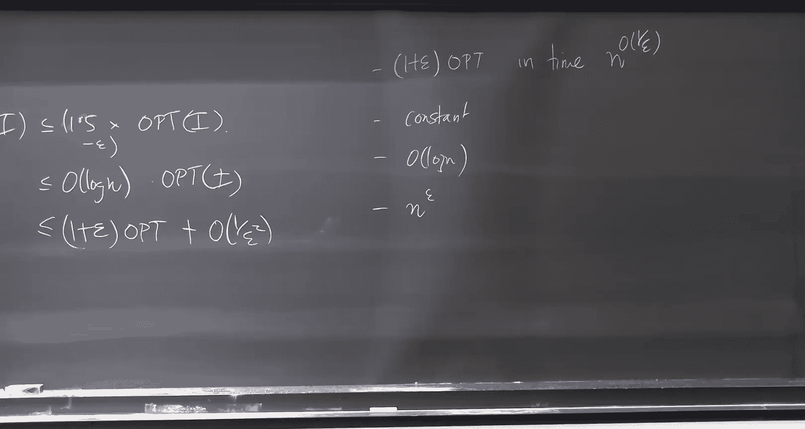
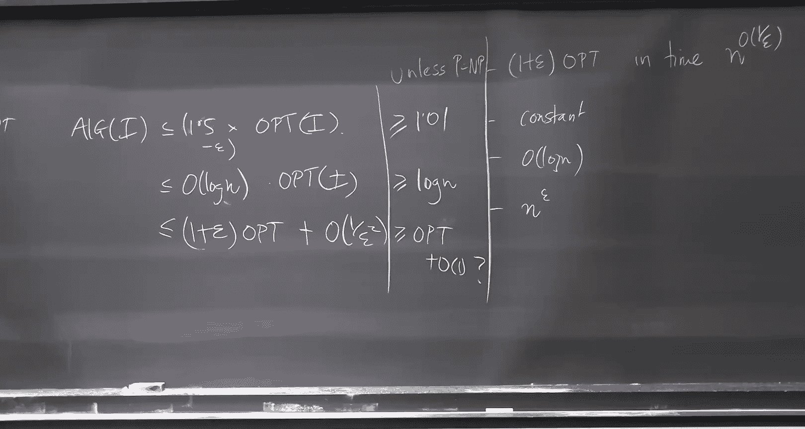
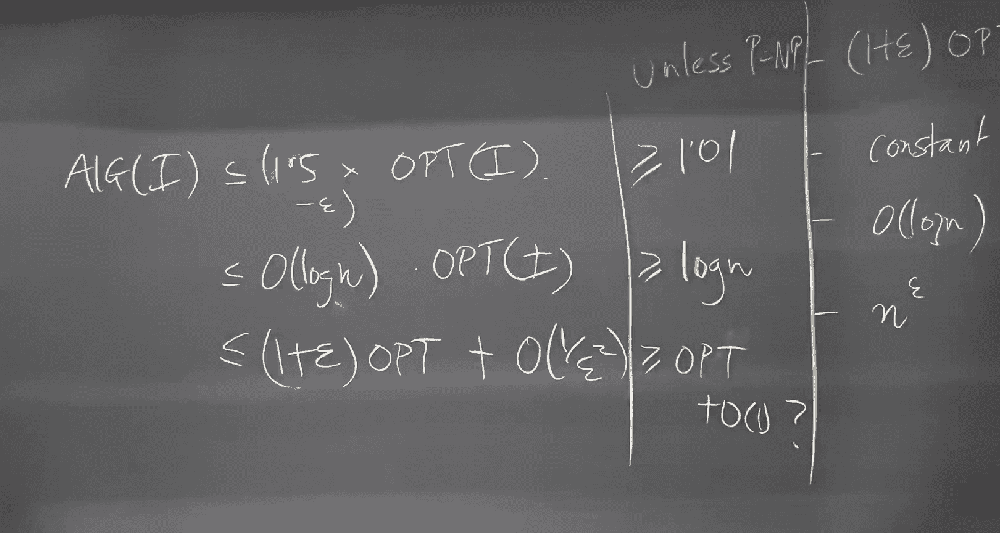

# CMU《高级算法｜CMU Spring 2023 15-850 Advanced Algorithms》中英字幕（claude-3.7-s p24 Lecture_24_Approximation_Algorithms.zh_en -BV1a4cCeMEzb_p24-

Hey guys， welcome back。Couple of announcements。 So we are pretty much getting towards the end of the course。

 And so it's going to be this week。And then there's next week， I'm traveling。

And then we'll have some lectures on the week following that。嗯。

There might be one lecture which gets pushed into the week after that。

 but you know we are pretty much in the home stretch right now we' do a little approximation algorithms。

 we'll do some online algorithms。So all this will be this week。And when we return in a week from。

 from next。These were the true， the， the three。

Topics that Id received requests for。So we'll talk a little bit about sum of squares methods。

 If you haven't seen this before， these are like semi defite programming methods。

 but you know a little further up。 well talk about high dimensional expanders and sampling me bases。

This is stuff that's very recent。I think it one best paper at one of these conferences two years back。

 so it's not exactly hot of the presses， but it's fairly recent and gently understanding what a high dimensionional expander is might be useful for everybody including myself know some of this I have to read myself and then we'll talk about Martinale concentration bonds。

So those are three things and three lectures this this week。

 two one approximations and one on online algorithms。

So that's the general plan for the remaining six lectures， of course。I do realize I'm you know。

 making you guys sit for more than the required 27 lectures。

 all complaints should be sent to my department head， I guess。啊，个。呃。What else。O。So let's get started。

And this is approximation algorithms。 This is what I typically you know。

 this in online algorithms is what I typically do for a living。

 So this is this is my area in some sense， So I can I can give a course on this。

 but I'll stick to three lectures。😊，嗯。And I'll talk today about two problems。

 Se cover and bin packing。😊，And we'll see a bunch of techniques that we use to solve these problems。

And the general picture we keep in mind is life is tough， so you know problems。😊，And be hard。

So NP hard problems。So I want to solve traveling salesperson， I want to solve set cover。

 I want to solve bin packing。

啊。All these problems n p hard so you can't hope to solve them exactly unless p equals n p。

 So what do we do we give results of the following form that here is an algorithm。😊，You know。

 there exists an algorithm that runs in polynomial time and it outputs。耳朵。Of cost。At most 1。

5 times the optimal tour on that particular instance。So， on every graph。

Itll output a tour whose cost is no more than one and a half times the cost of the best solution on that graph。

And this， this factor will be called the approximation factor。And often， you know。

 instead of writing all this， I'll say al on an instance I is that most 1。5 times。

Ot on the same。1。5 is the approximation factor， in fact。This 1。5 was given by Christtoidees。

In a paper at this， I think it might be technically the other side of this building。

 the Graduate School of Industrial Administration， GSIA。Was the old name of the temple school。诶。

Christo Fii was that GSI A when he wrote a technical report。 In fact， he never published the paper。

 He wrote this technical report。 He said， oh， I'm sure I can do better。 Actually。

 I don't know whether he said that， but that's the， that's my understanding。 And so that's。

 that's the 1。5 is the GSI technical report。Only very recently。Somebody improved it to 1。

5 minus epsilon。 very nice paper。Apsilons tiny， but you， it will get improved over time。

 So that's okay。嗯。We cross our fingers。Set cover， there is an algorithm that gives order log n。😊。

Thanks啊。Log n is the approximation factor。 well see this in this lecture。Been packing。

 I will give you an algorithm whose cost is at most one plus epsilon times opt plus。

Order one over epsilon。For any。 So you fix an epsilon。 I can give you this kind of performance。Okay。

 and maybe itll be one over epsilon，1 over epsilon squared。 I forget。 but let's not worry about that。

So I can get arbitrarily closed multiplicatively， but then I start losing at it。😊。

There are other problems。 So， you know， these approximation factors， you can ask。

You know how good can these approximation factors go， And this one is saying， well。

 you can make it as small as you want。😊，With this additive termout here。

There are other problems for which you can get one plus epsilon。Times opt， no additive factors。

But the run time。Goes like into the。诶。One over epsilon one over epsilon。Something like this。嗯。

You can get results where the approximation factor is a constant。Like this。

 you can get results where the approximation factor will like log n。

You can get results with approximation factor like enter the epsilon for some epsilon。

There's a whole spectrum out there。And when I was in grad school， there was this hope。

That these would be the only bucket。But then sadly， it's not the case。 Maybe happily。

 it's not the case。 When people came up with algorithms where。Which are log， log approximately。

Root law。And there are compelling reasons to believe that you can't do any better。So， in fact。

 along with。Upper bounds。 I always think of algorithms as upper bounds。 Theyve also been。

 there's also been work on lower bounds。

And for instance， we know that， you know。Unless。B equals then P。为。

unlessless p equals NP you cant do better than for the traveling salesperson problem。

 you can do better than 1。01。😊，Any polytime algorithm。Solving。

 giving approximations to the traveling sales person problem must have an approximation ratio of worse than 1。

01 on some instance。Okay。Right the other way， if you could give me a 1。001 approximation for TSP。

 I give a I would give you an algorithm that solves sidefiability in polynom。For set cover， actually。

It's at least。log嘅。So this result will be tight。And for this one。Actually， we don't know。

 So it could be。哦，了。그째。So， when packing still。Maybe we can do much better。예。呃。

Is there like a time hierarchy theorem， but for approximations？But larger approximation。啊。

Not as such， though there is some recent work on fine grained approximations。

 and those might be along the lines of what you're looking。

But what I am going to do today is I am going to just you know。

 let me start off with a set cover and I will tell you about some algorithms for this。😊。

And then we'll do bit backing。 We'll see how far we go。到了。Is the sort of general idea here。

Problems are N hard。 We try to do the best we can in polymun。The question is what is， you know。

 and we are looking at these multiplicative guarantees always。At least in this neck of the woods。

Okay。Good， so what is the problem set cover set cover， you are given a universe of evidence。😊。

I always think of it like this and then you have sets so you have this set S1， you have this set S2。

 you have another set S3， you know S4 is sitting in there， S5， whatever。Things like this。

There are M sets。 There are n elements。You are guaranteed that if you take all the sets。

 they cover all the elementss。And you won't。The fewest。Sense。An S such that their union。Itい quality。

So you want the smallest collection of sets。Whose union is equal to the universe。Good。

Or then there is a slight variant of this where the sets have cost。C of S for every set S。

And want not the few assets， but the least cost。Gllection of sense。

So if these sets set costs and you， you said， well。

 I'm going to pick the yellow set and the green set and the white set， you'll sum up their costs。

 and that's your the cost of your solution。 You want to compare to the best solution。系啦。在。Set cover。

 you know， the theorem I' want to show you。Is there exist algos。That achieve。cost。At most。At most。

ordon。Log of n。On any instance， the cost。point。 this algorithm will achieve order login。啊，帮你我。

So I'm going to give you a bunch of algorithms， the first angle the of historically。Thecards paper。

Talking about the hardness of problems of you know， he looked at 29 problems or something like that。

 and he showed all of these were NP hard and that they reduced to each other。

 And this is what really got NP hardness off to a flying start。And one of his problems from number 7。

 I looked it up recently was set covered。And just two years after that。

 David Johnson came up with this paper where he said， oh。

 we can't solve these problems or we don't believe we can solve these problems fast。

 So let's see how well we can approximate it。😊，And he gave this algorithm， which I'll call greedy。😊。

So3D says initially the set of uncovered elements。 Now。

 you I'm just going to say the set of uncovered elements。Is。Yeah。So start with you now while。

U is not equal to the empty set。ISa S from the this collection。Such that maximizing。The number of。

Uncovered elements。Belonging to S。내 말 everybody。I want to pick the set that gives me the best bang for buck。

The number of elements that are uncovered。Times you know。

 the number of elements in S that are still uncovered developed by the cost of the S。

 And then you set Q to be U minus S。저。那就两。really。And the claim is that this algorithm， Well， clearly。

 this is a polytime algorithm at each point in time。 you just look over all the sets。

 You pick the best set you got。The claim is that this is the login approximate。ok。

关性。Now do that make sense， right。That proof。So the first proof I'm going to give you is for the unweighted set。

When we will go to the weighted， then we will you know add belt and whistles。😊，安停题。Okay。So now。

 suppose。Let， let's look at this process。 that's happening。And let's say that U sub T。Is the the set。

哦。Uncovered， so elements that are not yet covered。After。The set的。So once t sets have been picked。

 U T is the number of uncovered elements。So。Observe， use0 equal to n。Initially。

 all these elements are uncovered。Set of uncovered。Okay。So at some point in time。

This was my universe。 I've covered all these。So U T is this。Let。Ot。か転形。Some number。

My claim is that there are UT sets that will cover there are k sets that cover all of the space。😊。

So there are K sets that will cover the remaining uncovered elements。喂。So。Therefore， there exists。

One set。In S， in fact， in the optimal solution that covers。At least。What。The size of U。宝er机。翻各位。

There are ks that cover all the uncovered elements。😊，So there's one set which covers the app。So。

 this is。Plus one。Is at most the size of U。Right。This is。That equal to。You not。1-1 over。

Just unrolling。Re。Yeah。Which is less than。So you not was n。And I'm going to use the E to the minus。

遮啊整 o 。And by the way， I'm using a strict lesson than because the equality holds only when。

This term is zero。ok。Okay。So I'm asking the question， when is it that this set？Has， you know， oh， so。

 so now suppose。Suppose P is equal to k times long n。Right。Then this is n times e to the minus log n。

Which is。Veryina。So the number of uncovered elements is strictly less than1， it must be0。

I Zan waited， said。So， if I have picked。K long N many sets。

 definitely I have reduced the number of uncovered elements to。This thing will be unweighted second。

그 걸。No。没ing say。I might have a tendency to go a little fast。 so do stop me。 do ask questions。

Let's do almost exactly the same。 I'm going to just change it ever so slightly。Let。Gst of歌。Now。

 it's no longer an integer or anything like that。 It's just kid。Something。Oh， by the way。

 the the costs were。No negative。Because if the costs are negative。

 you might as well just take all the negative sets。It's like a dumb problem， right？Okay。Good。

 bless you。So let's start off the same way。U T is the set of uncovered elements after T sets have been。

You not then。Now I'm looking at one point in time， and I'm saying， well。

 these elements are uncovered。So。There exists a set。Yes。Wt。Bank per buck。 let's say， coverage。

To cause ratio。At least。The size of you。你位人哋。All these guys can be covered。Using cost cake。

So there must exist as set， just averaging again。Whose bank per buck is at least duty over。Now。

 suppose。This。呃 set。Coovers。诶三心啊。嗯。X。Suppose okay， suppose so basically there exists a set whose bank per buck is at least k。

 So this means that our set。The set that I picked because I was being greedy。Haands。バンクバケケスですね。

This way I'm using the greedy。There exists a set which is good。 So my set is that key is square。Okay。

So let's say our set。Govers。X B new。So this would mean that our set。Has。Bst。At most， what。Our set。

 I picked this set。It covered X new elements。So I know that X T over the cost of the set I picked。

Must be， at least。売っていいんでなイい。So。This just says that the cost of the site I picked is at most。K times。

有的。Over。Oh， the nextG was just a number。What's that。I paid this much。 I covered。I paid this。And。

 you know， it's， it's at most。So what's our total cost。Our total cost is， let's just run the movie。

The first set I picked。It covered some number of elements， X 1。

How many elements were in U1 or whatever U0？啊。And。So that's the。

Times the number of elements I picked divided by n。先到的。Okay， the next time I am picking x 2。

What's the denominator out here？ま。Then the next time I pick x3， it's n minus x1 minus x。

For the right。T on hang on。Okay。This is x1 divided by。Plus x2 divided by n minus x1。喂。

So let me write it this way。And we call it K times。1 over N plus one over N。Plus one over n。X1 times。

Plus1 over n minus x1 plus1 over n minus x1。X2 time X2 times。Now。

 suppose I were to replace this by N -1。And -2 and minus x1。What have I done。I have。Increased。

1 minus n minus x1 n minus x1 minus1 n minus x1 minus x2 plus1， whatever。

I'm just increasing these things， right？But this is just a harmonic series。So， this is。이 있고 아니도。

Dance。诶，做饭。This at k times 1 plus。Very cute。Mically， this kind of summation。After L Y。

 you just find it familiar with， you're like， oh， of course， harmonics。ok。Questions。Okay。

So the thing with the greedy algorithm was it was easy to use。 it was easy to analyze。

 everything was hunky dori。😊，嗯。We luck out in some sense。

There is one thing with this is giving this as an illustrative example has this problem that you see this and you say。

 oh， man， what was there to the algorithm design，嗯。But， you know。

 there is a little more to the algorithm design because， you know。

 the problem slightly more complicated， Com up with algorithms is always tricky。 And in particular。

 reasoning about the optimal solution is always tricky。😊，So let me give you a different approach。

 which does things more systematically， so to speak。😊，So I'm going to give you a third algorithm。

 which is log approximate。For者。Se cover， it will be more much more systematic。So this is proof three。

And this is， this will follow a。A bad called relax。And round。And the steps are going to be step one。

Right。An inteent linear program。For the problem。Second step。Relax。Do an B。

And because you are relaxing the problem， you know that the linear program is at most the ILP。

On that particular instance。Now， we know， of course。

 that the In Indian program for the problem because it was。It was the Inte linear program。

You typically youll ensure this that the ILP is exactly the optimal solution。

So now you have relaxed to N LP。And the third one is， solve。BLP relaxation。

And we know that we can solve this in poly time。And the fourth thing we'll do is round。The fraction。

Solution。做啲嘢逼。Back doing teachers。And typically what we will make sure is that the algorithm solution。

I at most。Some alpha times。The linear programming value。

We will make sure that the algorithm produces a solution whose cost is at most alpha times the value of the LP。

 but the value of the LP remember is that most the value of the ILP， which is equal to。

And maybe here's the。Here's， here's the sort of high level principle。

This you can do for a lot of problems。Writing the ILP for for an NP had problem typically not that difficult。

 relaxing into an LP is brain dead。 you just remove the in L constraints。Solving the relaxation。

 you don't have to do anything。 You just say eip sorry。Or whatever interior your point。

 whatever you want。This is where。😊，The all the action will be。 How do you， how do you round。嗯。

And good。So so this is， this is what we are going to figure out for。

 We are going to just do the case study for set cover。

 We'll do a little bit of the case study for bin packing as well。😊，Maybe there's one more picture。

 you know， I keep telling you there are pictures in my head。

 I'm going to tell you about the pictures。 Here's the picture in my head。😊，嗯。Here is， here is。

 you know， this is， this is cost， let's say。I want low cost。So here is what what is happening。

 Here is the optimal solution for the instance I， I don't know what it is。

So what I'm doing is I'm writing down。LP on the instant sign。Which is the lower bound on the cost。

And then I'm going to make sure that given any LP solution。😊，I can get a solution。

Whose cost is at most alpha times。As much。And I don't know where optta is Opta is this N hard quantity。

 it is very difficult to reason about it in general。

 but I know that because my my solution you know I took this L solution and I rounded it。😊。

It lies somewhere out there。 up， lies somewhere。And I usually think of this LP as kind of a surrogate。

😊，方式。Like， I don't know how to reason about opt。So I reason about the L pains instead。国にか。

We do needた。I that most stand。Fair enough，Okay， let's do the。 let's do the。Proof for set cover。

And so I'm going to write down the ILP。So the ILP is going to say， I want to minimize。

 so I have variables x sub S for each。S belonging to script S。

 And I want to minimize the summation of C S， the cost of the C S times excess or excess。

In an ideal world， yeah， it's just， okay。 So I'm going to maybe let me just write it。

 access lies than01。Bless you。C S X， such that。The sum。

Over sets S containing E is at least one for all elements in。よし。

Every element is covered by at least one set。 I want to minimize the。This is the ILP。

It's the optimal solution。And what's the LP， the LP just says。I want to cut this out。

 and I'm going to say excess is non negative。I could have said excess life between0 and 1。😊，But。

 it doesn't matter。Because， you know， no self respecting solution would set value of access more than one。

The right hand sides all are one。 Why do we need that。Good。So， weve written the ILP。

 we relaxed to an LP， weve solved the LP solution， and now I need to round。Thero。And in this case。

 the rounding algorithm is going to be almost kind brain dead。 you know， it works in many situations。

 but。We shouldnt get。啊。뽑블 건。So the rounding just says。So round on a solution X。 Remember。

 x is a solution。Non negative values， there are M of these。And says for each。嗯。As。Let's click this。

Yes。Independently。With엑스。Every site is picked independently with the probability given by。

The the solution。ok。So， fact。诶 claim one。The expected cost。

Of the solution is exactly order is just equal to the LP value。Liarity of expectations。

 right is really equal to。Some over S of C S times loop。Proability。That as big。Which is equal sum。

C SX， which is equal to。电度。By the way， is you know。I need to make sure that this is a solution。

 right This is a cover。So I say what's the probability that element E。Covered。By the sets they don't。

This is equal to 1 minus the probability that it is not covered。The probability as。

All the sets containing E。That those sets were not。Fair enough。Which is。At least。1 minus。

E to the1 minus x is less than equal to e to the x， But there's a negative sign sitting out here。诶。

Prorother。S containing E E to the minus。1 plus x is less than equal to the x。But this is equal。

1 minus。一度 the minus。Some over S contain E。Yeah success。Product just goes into the sum index point。

But what do we know about this， this。德毛贴。Yeah， I seem to have。Lost my yellow cha。kept it。

This quantity is at least one。So this is。诶。At least one minus1 over the。So I'm picking。

 I'm covering a single element E O。That year and that year are different。You know that。Yeah。

So any particular relevant effect is covered only with constant probability with is 63% probability。

😊，Let alone all the elements being covered。Pretty bad。 So what do we do。What we say is， well。

 were going to pick S independently with probability。咩哦。1 and X S。Dance。Long end。

Just boost up the probability。So now you can check that the probability of excess being covered is Im going to just do long N out here。

😊，啊。You know， if。If any of the sets containing E。Max out。Then， is is definitely covered。

So I only need to do the calculation when the， when none of these sets max out。

And if none of these sets maxs out， then all their terms are actually equal to。Acccess law。Re good。

And so， this is at least。There is a lawn end sitting there。So this is really do。Or1 minus。关 거。

So maybe let me make it you know， long to and。So this is 1 minus1 over 2 n。So， therefore。

The probability。Theデs。And uncovered。No，Maybe let me do it。そ。Probability that there exists。Uncovered。

Element。Is at most one half。Union bond。喂。So with probably1 half。

 I have some uncovered element remaining。Okay。I just repeat the process。

How many times do I need to do it in expectation twice？My不。道。One考。good。So basically。

 what I'll do is Ill， I'll run my process。You I， I'll， you know， pick。From this distribution。

My expected cost is equal to。Ot you know， optt login。At most。Suppose I fail。I'll repeat this again。

And I'll pick all the sets that I picked in the first round。 It doesn't matter。

I'll just repeat this again。So what I need to do is I need to say， well。

 how much do I pay in each round in expectation， which is offlog n。Times。

 the expected number of rounds。We do。Actually， yeah。Is it is it possible that like all of the costs。

On。Once that。Where。ok。Okay， I mean， I's like， here's two。So， so too with Mark about down。

 I don't think。Okay， so so let me， let me do it slightly。 Maybe it it'll be easier。 Let， let's。

 let's forget about。Let me change the algorithm。咩。ok。You can当。You can't expect to spend these。咁 down。

Let me let me try to do something。 I think it's exactly what you're saying。

So let me do the following for every set I pick pick the set independently with some probability。😊。

Now。I say， for。Each element。いい。Yes。Not。Godlor。那。Cheapest。Sat。covering it。Let's do the following。

I picked all the sets independently。Maybe I didn' get a solution， so now for every element E。

 if it is not covered pig cheap。Good。So。Our claim was what the probability that element E was covered was at least 1 minus1 over2 n。

So now I wanted to say。그걸。So now， the expected cost。This was the expected cost。In step one。哦。Step。1。

Was the LP times。老边。In step 1， I paid log and times the LP。Because I took the healthy solution。

 I raised it by logging。What's the expected cost in？Step 2。The expected cost in step 2 is the sum。

Overall elements。Of the probability that E is uncovered。At the end。Of step 1。Thanks。

 the cost of the cheapest solution。 cheapest said cover。So now Ill have to do kind of。

What I think maybe would is saying。By changing the constants here， I can make this n squared。

So then what I can do is I sum over all elements from U。

Of the this probability that most one over n squared。

Times the cost of the cheapest set that covered it。

The cost of the cheapest set that covers this element。Cheapest set。G best。食。搞过嚟。Is that most。啊。그지。

Need。I don't know why I'm optimizing out here。What can you tell me about the cost of the cheapest set that covers any particular element？

How does it relate to opt。The cheapest say that covers any element one。

Is it lower than higher than equal to opt？At most often。

So the cheapest set that covers it it costs at most。 actually， let me what。

The probability of this element being uncovered is like one over and1 over 2。

And there are end of these。So this is at most n times1 over 2 n I didn't even need the two。

 it didnt matter。Thank you so。So we do that most。啊。So， my total cost is equal to this log。不好 thanks。

With that。Did you guys get lost in the sort of algebra I was doing all there。Let me do it one more。

Very quickly。诶。I can erase it， but that that always seems like a bad move。

Let me just do it very quick。What did I do。I took my solution， I scaled it by log。

 and I did random my wrong。So here are three facts I want you to take away。 the cost is at most。

Looan。Times the LP solution。This is the cost of step 1。I just did independent trying my。

Scaled up the solution by login indeed independent。

Then I say the probability due to this process that an element E， my favorite element is not covered。

I that most one over2。This was just this kind of calculation。 Well I just did。

Oh I must have got tails every single time。The probability that is not third is at most one over2 n。

 And this is true for every elementary。And then I say， I need to fix things。How am I fixing things？

I'm running over all elements。And I say， what's the probability that E is not covered？

If it's not covered， I need to pick the cheapest set that covers it。How much can this cost at most。

So my cost in the second stage is at most。Now， the probability that is not covered is at most one over2。

And there are n such elements。 So this is。么了。And this was lawnne。This is one half times soft。

 so it's long to when if we are being very pedantic。This plus time。By the way。

 this is also a technique called the method of alterations。You do randomized rounding。

You were hoping for the best things kind of screwed up， you fix it。It's not， you know。

 rocket science， but it's common enough that it's got a name。 It's got the method of altereration。对。

Other questions。So by the way， Se cover has so many algorithms。😊。

That right now is is just mentioning the other day。That course that。My colleague， Uas Ven。

 is running at EPF L。Where is using set cover and solving it in about15 different ways。

Like almost every algorithmic technique， you can solve set cover using that。

 This is why it's like the poster child of。Beating approximation。对。

I am not going to give you 15 different ways。 this is pretty much the only way that I'll do greedy and relaxing round。

😊，Maybe I'll mention one more thing before I move on。So。These are algorithms to solve set cover。

 so we saw。How to do， how to achieve this guarantee。 So this was。Pem。This was greedy。

 and let me mention。A铁gram due to five嘅。From 98。As one of so。Great papers and some follow up work by。

Eid Dor and David Steyer。In I think， 2014。Whi says。If they exist and。Algorithm， what day algorithm。

The songs。Ft cover。Better than。诶。Do within。0。999。老妈。If you can solve that cover。You know。

 we know how to solve set cover to within Law n， so you can solve it better than Law n。9，9，9， Laman。

At big。And this。This is， if you're interested in this kind of stuff。

 you should take a course on complexity。 I wish， you know， we had more time。 I'd you know。

 happily tell you about this stuff。😊，嗯。Its it comes out of this sort of beautiful object called the PCP theorem。

And it's this sort deep area。嗯。and produces these， these kind of results。Yes。So we。

 we had no clue how to do any of this prior to 96 and since 96。

 essentially this whole area has burgeoned into a huge。Huge upfield of algorithm。

 of algorithm complexity。But yeah， its， this is useful to know that。

You can often give matching approximation bones。Okay。So。But so with that， let me let me sort change。

Tracks a little bit。 Let's take a two minute break。I don't know why I'm even giving examples。

I probably confuse the issue。But in any case， O。So bin packing。

This problem goes back a long ways I should have looked at the history， but in any case。

 bins are size one。 So you've got an unlimited number of bins， but all of them are of the same size。

😊，You have n items of specified sizes。 you want to pack these items into these bins so that they satisfy the size bound so that the items you put in a bin must be must sum up to at most one so you can't put these two items into the same bin for instance。

But you could put the 0。3 and 0。7 into one bin。And then， maybe0 point。5 and 0。4 into another band。

And then these two guys 0。2 and0。外人头那。3 bins。S I， for this instance。

 you want to minimize the number of pins used。That's。And be hard。Actually，Next。That's actually。

Do the entire case study just for once。We have 20 minutes， we'll see how far we get。

So whenever I see a problem like this， the first question is is it NP hard or not。

 and in this case you can show。😊，呃，来吗？It's a。Been packing。Is。And对。Complete。It's in N。

So what does NP complete means？It means that you can verify a solution。 If I gave you a solution。

 you could verify it。sure enough， you know， I gave you a solution。

 All you have to check is that the bins are not overfall。😊，And that is。There's okay， actually。

 you know， I'll get into sort of situations like oh decision problem versus the search problems。

 Let's not get into that。 there's only empty hard。😊。

So I want to say that if I could solve bin packing， I could solve an MP hard problem。

And here is one way in which I can solve an N hard problem using this。 of course， you know。

 with all these things， you have to start off with some N hard problem。

You can always start off with satisfiability， but that's always the pain。 So in this case。

 I'm going to start off with a problem partition。That says。Given。Numbers， a 1， a 2。Up to A。And find。

A subset of the numbers from one to n。Such that the sun。Of I N S AI。Reequal to the sum of I not in。

The partition， these numbers。In could do。Such that there's some equal。Question。

 if I can solve bin packing， can I solve partition。Yes， how。 actually， Jo No， no answering for you。

 somebody else。啊。I can minimize the number of bins。For any instance。

 I should be able to solve partition。So very quickly， what's the instance？Okay， so， so basically。

 you know， S I is equal to AI divided by some。唔姐。嗯。Two times this。So this is is， you know。

 the sizes sum up to2， and you want to figure out whether you can put them in two bins of size 1 each。

So， figuring out whether the answer is two or three on this instance。

Will tell you whether the partition problem is solvelable or not solved。So， you know。2， you know。

 whether asking whether author is2。我了。Yes。3俪。This problem is MP。对啊。For， you know for bin impacting。

This already says approximating bin packing to better than a factor of 1。5 with NP hard。

Because if you could approximate the correct answer to within 1。5。

 you would know whether the answer is 2 or three。So。If if I could， if there existed an algorithm。

Or been packing。That ensured。Right out。Iect most。I strictly less than 1。5。Dance off。Very thank you。

And whenever I say I'll go， poly time， I'll go。So I can't give you an algorithm which achieves like 1。

49。So this is why。We give。Algos of the form。さし that。H on I。Is that most。1 plus。1 plus， Eilon。

Ot plus some garbage。So this is taking care of this problem。

That we can't give purely multiplicative guarantee。But I'm getting ahead of myself。Let。

 let's just start off。So Ive got NP hardness I cant do exactly lets give an out of。😊。

What's an algorithm for bin packing。I removed my stool。They should be nice do。

Give me an algorithm for bin。Come on， guys。Anything， not doing。Other than the person。

You have all the bins are lined up。Go from left to right。You know， this has 0。6 in it，0。3 in it，0。

5 in it，0。2 in it， you know whatever，0。8 in it， something like this。 and you get an item of size 0。呃。

3。This is your next item， it doesn't fit into the first bin， it fits into the second bin。

You just put it。And then the you scratch it off。 And the next item has size 0。0。15。

 It doesn't fit in the first bend。 The second bend is full。 It fits into the third bend。Any going。

Take the bend greedily put in the first bin， take take an item。

 greedily put in the first bend where it fit。It's called。First。Yeah sort。I don't even do that。

I just take the items as they come。 as soon as an item comes， I look at the first bin where it fits。

 I just put them。If it doesn't fit in any of these three bins， I open a new bin。Gim。first fit。Is。多我多。

Why。So。Sest。😔，去。😔，Why first wait a two approximation。This is my。 Let's。

 I don't know why I'm doing these boxes with the same as。Here is my solution。

Each of them is filled up to some level。Okay。By the way， can you give me。

Lower bound on what optimum should be。The optimum， my claim。Is at least。The sum of the scientists。

Is at least the volume。Okay。Because， you know， every， every bin fits only one unit of size。

 So even if they were like， you know。Fluid， this would be the case。Secondly。

Let's look at this solution。 By the way， can this solution the the stuff is downstairs。 You know。

 I'm imagining that the item settle。Question， can this。Be an opt。

 Can this be a solution produced by my algorithm。NoNo， why not。Is the the last one。

This fits right there。I did next fit。 I would have never achieved this。In fact。

If this bin is filled up to， you know， some， some level I， level I and some level J。

What can you tell me about Eli plus L G。所觉得な。Strictly greater than one， right。

So the first two guys sum up to strictly more than one。

The second two where is sum up to strictly more than one。

And let's say that there were an even number of guys。 just for the moment。

 these two guys sum up to strictly more than one。You used two times。Gla， many bends， two times3。

 many bands。But these two sizes sum up to more than one。 these two sizes sum up to more than one。

 these two sizes sum up to more than one。 that is already showing that opt is at least3。😊。

You are producing six factor of。Good。You'd be worried about what happens if I had five。

 this where the strictly more than comes。So my claim is that opt in this instance， can't be two。

 It must be at least three。Why， because we are strictly more than one， strictly more than one。

 That's already strictly more than two Can't be two。First weight is to a first。Actually， this， yeah。

 this， there are many variants of this， this type of thing。 It shows that， you know。

 you can talk about next fit。😊，You always maintain one bend。 you start putting stuff into it。

When you can't put the next item into this。You just close this bin。 you just tape it up。Put it aside。

 Go on to the next pin。You never come back to a been。That's called next。

Same proof shows it's a two approximation。You can， you know。

 you can do various versions of this thing， you know。I usually call these algorithms x fixed。

You can come up with your favorite rule。经。ゆ割に？By sorting the。就生啊。

So you can gain something by sorting the bins by sorting the items， you mean。And。Okay， so。

 so you can try to say， oh， so so really， the sort of question is when you take an item。😊。

Should you put it into a bin where you leave the least amount of space？Or the most amount of space。

And there is this curious argument。 You can say， oh。

 maybe I want large large amounts of space in every bin so that new items can be fit into there。😊。

Or you can say， oh， I want very little space remaining because then the waytage is small。

So there are all these rules。 you know， people。 Yeah， there are lots of rules which which people do。

 There are things that are gained， especially if you make assumptions about the input size distribution and stuff like that。

But yeah。If we are doing worst case analysis， no。Okay， so first weight is to approximate。嗯。

So then comes questions of what to do next。And what I was hoping to do， you know。

 I seem to be running out of time pretty fast is to give you an algorithm which had this kind of behavior。

So let me at least tell you the main idea and then we'll do it next time。So this， this。Algothm。

It actually goes back。So here's what Ill do。 Let me make two assumptions。我笑。The number of， okay。

 number assumption number one is the number of distinct sizes。A like most。I say S1 through S N。

 but you know， most items are like multiples of one1 or something like that So whatever。

 I don't need any structure on the sizes， just that the number of distinct sizes。

And let me assume that the men。Item size。Is take me steps。Do assumptions。Using these assumptions。

 I'm going to give you an algorithm that's that's going to be pretty good。

I'm going to write an LP and then I'm going to relax it and I'm going to round it。

The LT we're going to write is going to be somewhat nonstand。And。So here's what I'm going。

I want to write an LP。So， let me define。What's that configuration。It's a collection。Of items。

That fit。印度。啊病。Say say item sizes are 0。 you know， 03。4。7。Point1， these are my four itemss。

So configurations you know， Ill call this A， B， C and D。 So what is the configuration。

 One configuration is A and C。😊，One configuration is a times 3。3 copies of a。One。

 one configuration is， you know，9 copies of B。One configuration is 10 copies of B。

 one configuration is VM set。All these are configurations。哎。How many cons are there？

How many items can fit into one configuration。1 over Epsilon。So I can ask you。

 what's the first item size， What's the second item size， Each one of them is B。

 So the number of configurations n is the number of configs。Sa that most one over epsilon。Do the。嗯。

B to the one over that。At most。First item size， second item size， one over Epsilon item size。

 You can try to be smarter about this thing。민구나。Epsilon is a constant B， the constant。

 this is a constant。You might complain。These are large numbers， but we。You look at your homework。

Proably number forward or something。So here's what I'm going to do。 I'm going to write an L。

I'm want to say。X sub C。Is the number of。诶。Configurations。哦。Dep。是。How many。Confirations of this type。

 How many configurations of this type should I pick。Each configuration corresponds to one bin。So。

 I want to minimize。The some overall possible configurations。

Of the number of configurations of that type that are picked。Pina。Such that。Let's sum over。

Item sizes。Yes。And then I'm summing over the configurations。And I say， well。How many。

Copies of this configuration。 did I pick， Let's x sub C。And then I'll say number of cop， number of。

Itunes。f size。Yes。嗯。I picked a configuration。Of this kind。It covers nine items of D。So。

 the total number of。Items of size S that Ive picked。Times， Xc must be the number of。

Total number of items。Of size。S in the input。Every item of size S must belong to one of the configurations。

 It doesn't matter which configuration。Suppose there are 32 copies of this item in the input。

They must be all covered by some configuration。Does this make sense。Inteent linear program。

How many copies of this configuration am I picking。1，2，3，0。

The number of copies I picked times the number of items of size S that these guys can cover some overall configurations。

Must be， at least。All my items。Every item must be。Minimize the number of these。Templates。O。

Seems like， you know， it's at least a valid LP。So， what is这 question？Well， it Lp， right。

How do I run this。哦。So I I've done the two things。 This is valid ILP。Valid LP。

 I'm just going to say Xc。그 골드요。Step 1， step 2。Step 3 is solvinglving。Step 4。

I get back a solution to this。How do I round。So here is my round in this case。

I'm going to say my rounded algorithm。For the configuration C。이 거 안 돼。The fractional solution。然で。

Maybe I'll say， you know， find。Basic feasible solution to the cell。That's your x。哎。Solve this LP。

 find a basic feasible solution， not just any fractional solution， find a basic solution。

 We know how to solve this。😊，And now， just round up。Why is this good？So my claim。

 my final claim is going to be。But the alg。Is that most the LP。Plus， a little bit。How much。So。

 let me ask the following。Actually， I'm out of time。

 So let me leave you with the following cliff hang。I want to say this is a basic feasible solution。😊。

So it must have very few。So basic feasible solution means a bunch of tight constraints， right。Tight。

 linearly independent constraints。 But let's just stick with tight。What are the constraints。

 Theres a constraint for every size。How many sizes are there。Only be。

So there only be such constraints。All other constraints are non negativity constraints。

So if you want tight constraints。Only B of them can be from here。And most others are from here。喂。

If there are n dimensions。B of them can belong to this。 and minus B must belong to this。

What does n minus B belonging to this mean？Those guys are all zero。

So there are B non zeros in this basic physical solution。All of them can be fractional。

Maybe I'll round them up。バイまスピ。I can be off where it must be。

Were using a lot of the tricks we have learned。Or how do you solve these LP。 Sure。

 we know how to solve them。Basic feasible solutions means all these constraints must be tight。

The constraint must be tight。 Most of the constraints are saying the variable is 0。

They can only be many non zero。Vable。Round each of them only lose a peak。好。So， let me stop here。

 there were two assumptions I made。😊，Number of distinct sizes is small， minimum item size at large。

 We can handle these later on。 maybe talk about。