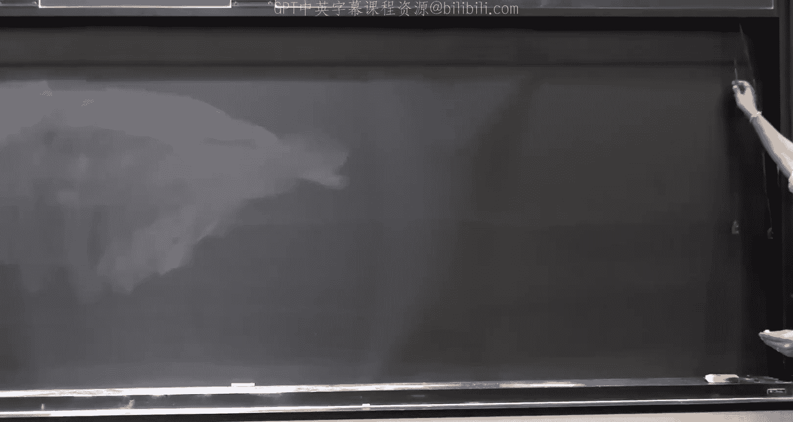
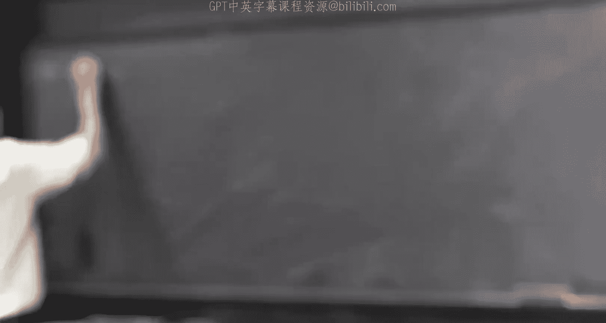
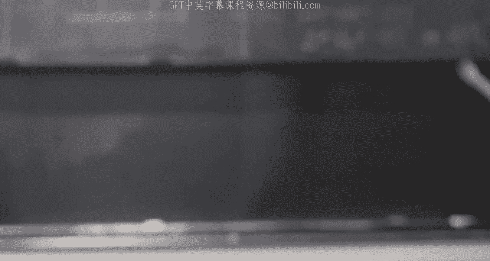
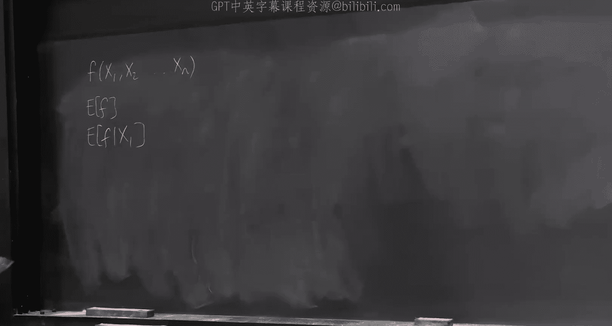
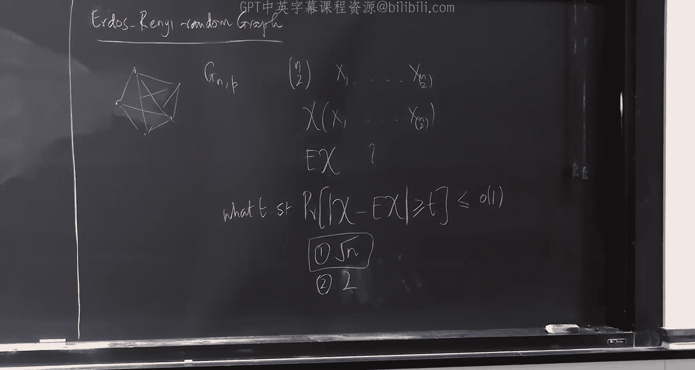

# CMU《高级算法｜CMU Spring 2023 15-850 Advanced Algorithms》中英字幕（claude-3.7-s p28 Lecture_28_Martingales_&_Concentrations.zh_en -BV1a4cCeMEzb_p28-

Okay， so。Welcome back， everybody。嗯。So today we will talk about Martiningales and concentration in some algorithms。

 some algorithmic applications of Martiningales。😊，Well I'll face up right at the beginning。

 I had I had plan that try to make some connections to online learning and stuff like that。

 But that didn't quite work out。 Hopefully， it'll work out in the fullness of time。But not today。

 So today is going to be somewhat more basic stuff。 We are going to be just， you know。

 it'll be revision for some of you willll define what marales are。

 Well look at some basic definitions。 We'll give some basic concentration bounds。

 and then we'll do two applications of these one fairly simple application。

 almost directly comes from the concentration bounds。

 We'll look at the chromatic number of random graphs。😊，And we'll show a result on that。

 And then we'll look at a problem on discrepancy minimization。That。But。

 this has been fairly popular and a powerful technique in the past 10 years。 So initially。

 I had thought I'd do two lectures， one on Martiningales and one on discrepancy。

 But now they're combining into each other。 it's one lecture。 You get the combo deal。Good， okay。

 so what's a Martiningale And the Martiningale is sort of fairly simple idea。

 but it somehow is always once you start writing it down formally， it's。

 it's just a little bit of a mess， right。😊，But its， it's a very simple idea。

So it's the following idea。That。Okay， should I define it this way。

 So let me let me start off in another way。That。We， we've considered the following objects， you know。

 x 1 plus x 2 plus。X N， which are IID random variables。 And let's say these are IID plus -1 valued。嗯。

Rhyum variables with probability half each。 So these are just unbiased coins。

And S N is the sum of n of these things。 So this is J。 you know。

 we've looked at the concentration of these objects。

 We've already seen that these guys are concentrated around their mean。

 their mean is 0 because each of these has 0 mean。 And so the mean of this is0。

 And we note things like the probability that S N。😊，Is bigger than， let's say。

Square root C times maybe I won't call it C。 Maybe I'll call it T times square root n behaves like something like x of minus T squared。

 Theres some constant sitting out there。A T squared maybe I'll say over two or something like this。

This is， this comes from your standard turn of pointss。 You've already done this thing。

 And one way of visualizing this， this。Process is that you start at the origin。

 And this is a step you either take right or youd go left with probability half each。

 So you're doing an unbiased random walk。 So this is called the unbiased。Random。Walk。On the integers。

And you are asking well， if I take n steps where am I going to be and what this is saying is that you are likely to be in some region of width the board square root n which is the variance of this object out here。

Because the variance of each of these guys is one in their II。So the variances will sum。

 So the variance of this guy is going to be N。 This is the standard deviation。

The standard deviation is square root  n and so what this says is after n steps you expect to be in approximately a square root n sized window。

And if you make a t square root， the probability of being in the tails。😊。

Falls exponentially like this。So this is done by a random walk。

But we can talk about more interesting objects like this。 We can talk about questions like， well。

 I actually have。😊，Zero， and I have a walk。But once this walk hits。Negative A or B。

These are barriers。The walk stops。The walk doesn't go any further。 once these are absorbing barriers。

In particular。 so once you reach negative a， your walk， you know。

 if your walk goes something like this and。It hits positive B。

 then it's going to stay at positive B from then。But if it hits negative way。

 it's gonna stay negative way from then on。And the question is， how do I reason about these objects？

Now， the thing is that each of these random variables are no longer independent。

 they are dependent because now the N random variable。

If this if the previous sum is already either equal to class a or negative whatever negative A or positive B。

Then the rest of the as。Are going to depend on what happened in the past。 So these are no longer。

 So in this case， you can say S n is equal to x1 plus x2。

 which is itself a function of the outcome of x1 plus x3。

 which is a function of the outcome of x1 x 2。Plus x n。

 which depends on x n -1 all the way down to x 1 and so on so forth。Each of these random variables。😊。

Is now dependent on the past， however， you still have the property。

You still have the property in this case， particular。That x N condition on x1， x2 up to x n -1。

Is equal。Each of these conditional condition condition in the past is the zero main random variable。

😊，The increments are either 50， 50。😊，All there are0， I'm just going。Now this property out here。

So if you have a set of random variables， x1， x 2。Up to XN。Which satisfied this property。

And this is a Martinale。谁。It has this like mark of like properties like conditional X n， -1 X， N。

Its the same as X。嗯。And usually you know， really this is just trying to capture the same kind of thing saying that look。

😊，X N， So so this is the same as saying， the expectation of X n minus。嗯。有异。I'm an idiot。

 This is there。I should have said S N condition x1 to x and -1。就是一块都X。S N-1。 sorry， I'm。

 I'm confusing you guys。Let， let restart。S， N is the sum of n of these guys。

So I'm saying the expectation of S， N。What is。S N， so this is equivalent to saying the condition of the expectation of x and given x1 up to x and -1。

His there。Each step， conditionally， has 0 mean。Did I confuse you guys already have I lost the lecture right off the bat。

A you guys okay。This is what I really want to say。The expectation of the sum。

Condition on the past is actually equal to the sum at the previous time。I'm adding0 in expectation。

Everybody okay with this， please just nod if you。Who's not okay？So what am I doing。

 I'm taking some of a bunch of objects。Each of these condition on the past is0ome。

And I want to understand the behavior of S M。This was a very simple。

situationituation where you could say， oh。If I hit negative A or positive B， I。I I stop。

Here the different thing you could do if I hit positive B， I start to take you know， steps of size 2。

Plus 2 or -2。And indeed， this this kind of process and this kind of reasoning or whatever is all coming from gambling。

 know probability was really developed to understand gambling right。You guys know the story's。

theres some dude who is who was trying to he， he used to socially gamble。

 gambling was was social activity。 you did this with your buddies。😊。

And so this is I've forgotten your name Chevalier du Mire。 He， he used to play with these。

 and he used to have bets like， oh， what if I throw if I roll a die four times。

 And if I get a one at least once， I win。😊，Should you bet with me or not？And you know。

 things like this， he would play around with this and he couldnt understand why this simple reasoning was incorrect。

 So he asked。😊，He asked。 He asked Bla Pascal。And Blalaise Pascal was buddies with Fma。

 So they were writing letters to each other。 Dear Monsieur， you know。

 it is really a pleasure to know you something something。

 And then they they're trying to figure out these problems。 Its the email of the day。

 And is really fun。 And it's all to understand gambling。 right， This is really what's happening。

 I'm starting off with， you know， let's change the base。😊。

I'm starting off with C dollars and this is zero， and this is my you know D。And I say。

 look I am starting off with C dollars when do I stop either when I have D amounts of money。

 that's my happiness， thats my goal， that's what I need to you know buy the probabilistic book probabilistic method book out there or I get down to zero。

😊，In which case， I'm bus， I can't do anything more。 I go home。And each time I make an unbiased。

 I make an even be。This is a fool scam because there are no even bes in the casino， but that's okay。

And yeah， that's what's happening。 That's my my money really depends on。Things like like this。

 But each time I could have a much more complicated gambling strategy。I could say， well。

 if I've done this thing in the past， then this time I'm going to do， I'm going to bet $3。

On every third try where I have seen two heads in the previous one， I'm going to be $3。

Something like this， that's Martin。So that's what's happening。

 And now you want to understand how S N behaves， how these partial sums behave。嗯，可。Yeah。

 the name Martining， there's some history of the name Martiningale。 I can show it to you guys。

 It's something to do with anyways。Okay。Now， Martiningale arise for us。

 not just in the terms of random walks。😊，嗯。But in other applications as well， and I I'll mention。

 I'll go back to that picture and I'll try to specify what's happening。

 But right now I just want you to understand this thing。😊，And I want to ask questions， like question。

What's the。嗯。Probability。That， I stop。A B。And I can ask the question， what's the expected time？

Do a stop。Both of these are classic questions。😊，And you'll see you know。

 you'll be reminded of if you've already seen it before and very simple theorem。

In about Martiningales， thatll allow us to answer both of these questions just like that。

Do the questions make sense， Does the setup make sense。对。So。

It's。Let's analyze this， so let's say a little more about this thing。What else do I want to say。

I at some point I'll say something about filtrations， but Ill I don't want to do it right now。嗯。

So here' is what I have。 I have x n and typically Ill just assume x n is0 for simplicity x1。

 x2 and so on so forth。😊，And now I realize that I I've set up myself for of some some danger out here because in my notes。

 X is refer to Martiningale's here I started referring x's to Martiningale differences。S 0， S 1， S 2。

感日わそ。This is a maring here。妈定要。What the Martiningale says expectation of Sn given Sn minus1 is equal to Sn minus1。

O。嗯。And now。Here is， here is a simple fact。By induction。Expectation of SN。

Is equal to expectation of S 0 or is equal to0。本人呢。对。Now， let me define。A stopping time。第。Okay。

 what's the stopping time this is a of technical definition and if you pick up your probability books。

 by the way， you know Im I'm not teaching you sort of giving you a solid foundation for Martins out here you you should look at your books you know I can refer plenty of good books to you for probability if you're interested if you' are interested in applications of this stuff。

 this this book for all random all randomized all randomization。😊。

The probabilistic method is the Bible， is a beautiful book。知。呃，对。But so what's a stopping time。

 so stopping time。It。This time。You know， it's exactly， as it says。

 it tells you when to stop and it should。If I have seen so， so it basically say it looks at。

S1 up to S， and it， you know， tells you。Weather。To stop。At time tea or not。

So if I just look at S1 through SD， I should be able to figure out from it whether I am going to stop at this time or not。

Whatever stopping means。对。So basically， the， the value in particular。The the event。

 so T takes on value little t this event。Event。Depends。Only利。On S1 twist。对。For instance。

Here is the stopping time。Is S T equal to。Plus a or minus B。I a shopping摊。嗯。Is S。Equal to so。

 so stopping time T could be the indicator of S is either in the set negative a positiveivity。

It just depends on ST， in this case。よし。Here's something which is not necessarily a stopping time。

 I'm looking at a sequence S1 through。 And let's for concreteness。

 let's just make this equal to some S N or something。Suppose I tell you， look at the time。

Which is the last。Heads， suppose these are just coin flips for the moment。I say， look at the time。

 which is the last heads in this sequence。That is not a stopping time。

Because in order to figure out whether this is the last heads in the sequence。

 I would not need to know the future。 But I'm seeing the things from left。喂。我说先。

The first heads would be a stopping time。 The last heads is not。Okay， so this is a stopping time。

 but in particular， this one is a stopping time for us。 So in a running example out there。

 we are doing a random walk on the line negative A positive B0。😊，对。And so here's the theorem。六度。Loom。

嗯。It says， black。嗯More。SN。The Martiningale。There will be some conditions， such and。

And T stopping time。30 night。1， the expectation of。第一。Is finite。And secondly。你。嗯。

The increments are bounded。 So basically， I'm saying Sn。Minus。Okay do I need an expectation out here？

Let me just check。😔，No， so let's just say。That S N minus Sn -1 is bounded by some constant。

Some some constant lets say。四。不了。So Im doing bounded differences， bounded changes。

My expectation is finite。Then the theorem says then。

Expectation of the sum or or of the maringale at the stopping time。

Is equal to the expectation of S0 is equal to0 in this case。Actually。

 I won't write this thing because this is。O。😊，Notice that Im looking at a random stopping time。

So I'm， I'm saying what's the expectation of。This sequence， the this， this random variable。

At the stopping time。And I'm saying it's expectation as。So people very with do。

That is going to come a little later hold your hold your question iss the same do。

 slightly different object we will come to it in 15 minutes。😊，只是一。嗯，哈。😊，也是。

Because the expectation of any。 So you wrote that。It's always the same。 Yes。

 condition on any possible value Okay， okay， should so so let me。

 let me change the problem so slightly。So here is here is a here is a different shopping time。

 I will call this T prime。P prime is the first time。We reach。The location 1。

Let's say starting at0 the first time we reached the location one。

Tell me what expectation of S T prime is。It's one。Because T prime is the time when we reach the location1。

But the expectation of S 0。Is equal to 0。So if I say， look， Im going to stop when I reach 52。😊。

This quantity is going to be 52。 This is the starting location in the in our case itself。

So what's happening？The stopping time has unbounded expectation。Okay so here。

Expectation of deep brand。第三保。We could do the calculation， but maybe。In fact。

 I would I would take this as a proof that the expectation of T prime is unbounded because I know that。

😊，Do is correct。This is the most circuitous proof。 We should actually prove this directly。

But in this case。😊，So if you should convince yourself that if you start off a random walk out here。

You will hit either this or this two barriers。 you will hit them in expected finite time。し。

This is interesting for。我二强。嗯。Now in some sense， you could say， oh。

 I'm going to run this only for 200 time steps。 and I'm going to stop。

I think this would be interesting even for， you know， I run for 200 200 steps and I stop。

 and in fact， I can define an infinite maringale for you by saying x S 2 and1 is equal to S 200。

Expectations is the same。And from then on。So， I always think of。

Martingales is kind of infinite objects。So for the theorem on the board for two， you。Oh， two。

 I do mean an absolute difference。这几。So if you are allowed to make arbitrarily large steps。

I think you can run into trouble over here。Well， I'm not sure like what stop。没有。

It's a stopping time here， also referring to hitting boundary or。

So a stopping time is an object which looks like this。Right。

 so it's not necessarily hitting the boundary。 No， the hitting the boundary was one example out here。

So this is， this is one example。 Maybe I should clarify that this is not。 this is。Any stopping time。

 And technically， I should always say stopping time with respect to S M， the sequence。In this case。

 you about these are one。嗯，哼。😊，64。等没事。So you're guaranteed that you don't ever change。喂你就搞真嚟啊。

Every step and whatever that is tied for the total number of steps， it' about the。

But if you could things like there's some chance you go arbitrarily。 Sure， so。

 but condition one is just a thing about the expected time and not the expected stopping implies。

ItIts contact。Because you can guarantee I just。Cha per step。So if it's a finite thing。

 then then this is this should be， you know either。Yeah， so so one would have to say either it's。

Yeah， I think so。Maybe。There's a definite maybe out there。都是。The Internet is constant to all energy。

C安。So let's just stick with C for for you know， everywhere。 this is not the most general。

 probably you can generalize this， but this is the one that I know for sure。😊，You write this。Yeah。

 you don't need this I could。Let me just。Leave it this way。It gives me solace to see it on the board。

And when it does not depend on any other parameters of the， lets just write it that way。嗯。

So far so good。OK。So， in this example， find， right。John you about。好的。道。This是。Right， so。

 so depending on so， so look at the following sequence， this， you know。

 S N is a random a sequence of random variables， right， So suppose this takes on value 1，1，1，1，1。

 And then after B times。Let's say B was 6， then the stopping time will be right here。

On the other hand， if it took on 1，1，1，1， negative 1，1。1。Okay， these two have1。 Okay， one more。

Then the stopping time would be， right？On the other hand， could be negative1， negative 1， negative 1。

 a was negative 3 is the stopping time would be right。

So the stopping time is basically you just reading from left to right。

 So you are seeing the sequence of random variables。😊，You should think of this。

 like an online algorithm。stoppingping time is an online algorithm。

Youve seen some prefix of the random variables it will tell you， okay， is this a time to stop or not？

😊，第一个。P1。基本呢是基本是登记使。sequence that doesn't do anything I。Yeah， sure。 but you know。

 don't worry about that。 just it's an infinite sequence of random variables。

 And this is just telling you when to stop。😊，This is just giving you an index。

Its of cool get you different than。对有的接子。Because you eithert have one of that。 this is saying。

 This then telling you what the probability that you can Good。 So。

 so let's just do that thing and see if this helps you， John。So this is just saying。Look。

T the stopping time and the stopping time is when I either hit this boundary or this boundary。

I know that the expectation of S T。A equal to 0。From there。

But this is equal to the probability that I stop at。B。Ds。What's the value if I stopped here。

 What's my value of my sum。B。Glass。1 minus P B， the probability that I stop there。

 my value will be negative。I'm just computing out the probabilities。Now when I stopped。

 I either stopped there or stopped there。 I stopped there with this probability。

 and then I got a value of P。I stopped there with this probability。 I get a value of negative a。

So this is equal to P B。单M。A plus B。Minus okay， so this， this implies that a equal to I just took。

 you， I'm doing algebra here。And so this says the probability of stopping at B is a divided by a plus B。

And the probability of stopping at a whatever negative a。AV equal to B。ラastic。

If A and B were the same magnitude， this is 50，50。But if B is much further。Naturally。

 you will stop it A much more likely。And this is telling you exactly that。嗯。Good。

So in terms of gambling saying。There's no good strategy there's no good in some sense。Actually。

 rather broad definition what could be what a strategy could be。 When should you stop。You know。

 as long as you are stopping。Based on what you've seen so far， if you were clear want。

 you could do much better。 But as as long as you're stopping based on what you've seen so far。

You play an even odds game。You get back zero in expectation。个人。Other questions。 I mean， this is。

 this is all trivial stuff。I shouldn't say that because， you know。

 if you haven't seen it and if youre lost year like dude， I'm calling it trivial， but no no。

 it's not trivial stuff， but its it's very simple once once you have the definitions correct。😊。

The calculations are， theres almost nothing out here。 All the magic is happening in du。😊，telling you。

 look， you stop at this time and this time you're looking at everything you've done so far。

There must be a system， right， I should be able to beat the casino， unfortunately not。

That's exactly it。对。嗯。This was really nice。 Let's do one more thing。😊，This。

 the first example is nice。 The second 1， I think， is。Even more fun。

So this told me what's the probability of winning versus losing。 You know。

 I went into a casino with100 bucks in my pocket。 I wanted to get stop when I got to 1 thousand00。😊。

Well， the probability of that is one in 10， probably。That's what this is saying。

Let's look at another thing。 How long will it take for me to reach one of the two end points。

It's not clear how to use that， okay。But let's use， let's define another marale。So， let's be fine。FO。

嗯。Let's define Q n is equal to Sn squared minus。Weirdder one。Bear with me。Let's check。

What's the expectation of。QN。Given。QN minus-1。This is equal to。As an。Squared minus S and -1 squared。

 Therell be an expectation sitting out here。嗯。Minus。And minus n minus-1。Wan。No。S N。

 what was S N S N was S n minus1 plus a random variable right plus a0 mean random variable。

 So this is equal to half of S n minus-1 plus 1 squared。And with the other half probability。

 it's going to be S M -1-1 squared。This are just computing out the expectation out here。Oh。

 minus S N minus1 squared。呃，1。I'm doing algebra again sorry， Im I always make this mistake。

With probability half Sn is equal to the previous thing plus one。

 the probability half is equal to the previous thing minus-1。😊，5050。

 and this is what I wanted to subtract。 Now， if you open this out S N square S N square thats going that is going to kill this guy。

😊，There' is going to be a cross term， which are going to cancel out。

You'll be left with one squared plus one squared half。 That's 1-1 is there。Do the algebra yourself。

 It will work out。You guys believe me， actually， listen。They live。This one。

So this is just from the definition of Q N。So actually， they should be。

 this should all be conditioned on various things， but。So， basically， I'm saying。

Given the right conditioning， whatever。So basically。

 I'm saying S N minus S n minus1 squared is just this difference between。嗯。那个看这个。Clearly。

 I shouldn't do this stuff。一飞。I think I， it's a masochistic strain in me。

 So this is showing the expectation of Q N - Q N -1 is 0。 So it's a mar。😊，I think it's okay。O。

So then let's apply dope to this guy。What does do say？The expectation of Q T。Is equal to。0。Because。

 you know this is0， this is0 at the beginning。 So this is0。 So let me just write this there。We good。

Okay， what's the expectation of Q T。It's the probability of stopping at A。Negative way， whatever。

Times。Negative a squared。Plus the probability of stopping at B times positive b squared。

This is this part。I'm just taking the expectation。The definition of expectation。

 I know the probability that that will substitute in a moment。Minus。The expectation of T。This town。

Okay， what is this？This is B over a plus B。Times a squared plus a over a plus B。

Times b squared minus expectation of p。And this quantity is just a times b。Bless you。

But this is equal to 0， so the expectation of t is a times p。😊，So the probability， you know。

 if you start， sorry， the expected time， if you start from here and you stop when the boundary are A and B apart from each other A and B to the left and right。

Is  eight times B。If the two values were the same。😊，Let's say both will be。

 then it will be b squared。Which kind of， you know， jives well with our。Sort of feeling that look。

In order to hit things which are about be apart from me， I should need these square steps。

So one of the。没。So for this， I don't have intuition rather than basically I wanted to get the n term out there。

😊，还生出来对对对。Here I sort， you know， well， I got it of textbook。

 but then I tried to reverse the engineer。 and I basically。

 I don't know more intuition than just playing around with it and seeing what expression will give us the answer。

😊，哎。So basically， yeah， it just tells you， well， when， when will this process stop。We good。

Maybetuition could be else， but could be fact that you know， based sort of。Fair enough。Now。

 that is a very reasonable intuition， at least we should be looking in that real。😊，O。Good真的是这。

So far so good， you know， it's。It's this， yeah。

You can do all kinds of cool things with this。Maybe it might be a good time。

To ask you guys with you for more questions， otherwise I can tell you a little bit about。

What this picture what I wanted to say out there。OK。So。Let me for。5 minutes， I'll do this。

 Its this is actually a sort of very useful。Perspective。走。Suppose you have a。Probability space。

You this is I was teaching myself undergrad students in 2，51，25 whatever。 the other day。 And。

 you know， what is probability it it's a difficult thing， right， So what's the probability space。

 It's a bunch of points sitting out here。 Each of them is an outcome。

Let's say this probability space consists of negative 11 to the10 I'm flipping 10 coins。

And Im looking at all possible outcomes there too to the time of them。And then we say， well。

 each of these outcomes has a value， which is called the probability of this outcome。

 Let's call it omega。In this case， it's one over2 to the 10。And then we say， what's an event。

 An event is a subset。 So an event is a subset of omega。

 and the probability of the event is equal to the sum of all omega in the。

The event of the probability， maybe I'll just start saying， maybe I'll say PR of omega each time。

That's what it does。But now we can， we can talk about。We can define， you know。

 we allowed ourselves to take any subset of the sample space and we allowed ourselves to sum over all the elements of that。

But then we can say， well， no， no， no， it's actually that's not a valid thing。We can have。

Valid subsets that we are allowed to ask for the probability of。

And this is often called a filtration。So if you talk about if you go to your probability class you'll see a filtration so the filtration this first。

 let's say the simplest filtration could be your filtration just consists of the empty set and all of formula。

Im just allowed to ask you， what is the probability of the empty set you say 0 probability of forming I you say 1 Oh I I didnt say that that the sum。

Of omega and capital omega of the probability of omega is equal one。This is a normalization。

 It's a probability measure。😊，And now I can say， look。

 I'm only allowing you to make very trivial statements。😊，Probty is 0 or one。

And then I can have a filtration which allows you to say something like， okay。😊。

The sets allowed are M T N this， but you are also allowed to ask for the value of。All strengths。

With starts with zero。And star。Or all strings with one in star。

All strengths that start with a 0 start with a  one。哎。Now， notice that these， you know。

 if you wanted to figure out the probability of these events， you really just need to you know。

 your rhino variables and stuff like that only need to care about the first outcome。😊。

You can have F 2。 You can have F N， and F N is maybe maybe2 to the omega。 All sets are。Yeah。

So in general I can say， look， I will not allow you。😊。

To ask for the probability of arbitrary research， but some collection of sex。

And each of them should be a refinement of the previous one。

So in some sense here I was only allowing you to ask for you knowm allowing you to ask for a richer collection of sets。

 So in general we say well a filtration is f 0 is a subset of F1。

 it need not start at the trivial one in my case it did F2。then。Good。It's called a filtration。Now。

 let's， let's also ask about random variables。 what are random variables。

 random variables to every omega， a random variable for every omega gives me a number。

It's just a mapping from outcomes to numbers。去。And now what I can say is look my my view。

 it's like I'm putting on glasses。My rhino variable。Can only depend on， you know， sort of。

 I I'll only tell you whether the outcome was， you know， of one of these forms。So if I can view。

 if I can't view individual elements inside the sample space。

 I can only view either the whole sample space or none at all。😊，Then my best guess。For this。

 for this random variable is probably its expectation。 So here is what happens。 You can say。

 what's the expectation of a random variable。 So this is a random variable defined on all of the outcomes。

 For each outcome， it gives me a number。This is。Equ to。So this is another random variable。😊。

Which works only at the granularity of。Sets in this， in this collection。哎。

And it tells you it's the expected value。 So maybe I should have。My rhino variable was， you know。

 two coins， right。It's the sum。Of these two guys。And the rhino this is 0，1，1， and 2， right。

And the random variable， the expectation of the random variable。呃。S。Is equal to one。Okay。And now。

 if I told you the outcome of the first coin。Then the expected expectation of the random variable。

 So if my filtration consists of these two sets out here。Then， being。In this thing。

 the expectation of S， given that the first outcome。Was a0。Is one half。And the expectation of S。

 given that the first outcome was one。不错。So。Often， I view the filtration as these kind of sort of better and better glasses that you can put on to look at the random variable。

😊，When I have these super co glasses， I can only see the expectation of the rh aroma。

But then I put on a better glass and I can see the expectation of the rhino variable within each little piece。

😊，And then a better glasses finer and finer。 And finally， here。Where this is really equal to。

 let's say2 to the omega here I can see every single outcome like this。This is just， you know。

 some some of definition of conditional expectations。In this abstraction。

And maybe this is getting too abstract。 And Ill I can sort of stop in a moment。 but let me just。

Say one more thing。Let's look at a very specific case。

 I have a function which depends on n variables， x1， x。啊对。

This is a function which depends on n random variables。 Let's say n independent random variable。对。

I can define the expectation of F。Which is just saying。

Average over all possible outcomes of these random of variables。 Look at the value of F。

 That's your expectation。I can look at the expectation of F as a function of the first triangle there。

It's a slightly more refined view at F。I can look at the expectation of F。

Given x1， x 2。Xピ。Things like this。 And I can look at the expectation of F given x1 up to x n。

 which is just the same as F。😊，Okay。This。Is is is another random variable。 I mean。

 each of these are underlying random variables， but F itself is a random variable。

This random of variableable。From this， I can create。A mar。 Okay， this is a Martin。来祥。

Because what happens？Expectation。Of so I I can call this equal to。呃。系 there哦。

Equal to S1 is equal to Sn。And really， I'm saying the expectation of。S第。Given。S D minus-1。えずいことや好き。

By the tower of expectation， everythings exactly the same。

So I took a random variable and I created a maring scale out of this thing。

By looking at the behavior of this random of variable， when I， when I don't look at anything。

 when I look at the first variable， second variable and so on and so forth。 So each time I'm。

Here's the picture that might help。This is the expectation of F。X1 takes on three values。

So it might be the case that f was like this， then F was like this here and then F was like this here。

😊，Now， each of these portions gets broken into let's say two values each。And now， you can have。

This was the average of。F taking on these two values。

 this is going be an average of these two values here these two values that。

And this is the actual function F。Maybe be still too abstract。Let me give an example。

Consider the following thing。 So， okay， let's， let's take a deep breath and let's try this one。嗯。

I don't know how many of you have seen the Aish Rany。Rangom graphs。嗯。

What's the Iish shiny random graph？You are given n vertices。Every edge。Fires with probability。对。嗯。诶。

So this is the ra Ry random graph GN， where every edge is independently present or absent with probability P。

行。So this is just saying it's a bunch of random variables There are n choose two random variables。

And I'll call these x1 up to x and choose 2。And can ask for questions like， what's the probability。

 you know， what is。Given0，1 values out here。What is the chromatic number of the graph。

 How many colors did they take for this graph to be colored。This is a function of x 1，3 x N n22。

Because these numbers， whether they are 0 or one， define the graph completely。哎。I'm interested in。

Several quantities about these kind of random graphs。More so than me， perhaps， you know。

 Alan Frize is is one of the gods of random graph theory。 He's written the book on， I mean。

 he's written a book on it， but he's written the book on it。You ask the question。

What is the expected value of the chromatic number of a random graph chosen like this？

This is a question people ask very often。Another question people ask is。

 so that's really asking for what's the expectation of Kai。And I'm writing chi just because you know。

 x1 reaction over  two is implicit。😊，Sometimes we ask questions like， what's the probability？

That the random graph that I choose out here。Diffffers from its expectation。Byu more than the。

If I pick a random graph like this， is it very likely to have， you know。

 its chromatic number belong to a small set of values。请。Good for the chromatic number。

 the answer is interesting。 Both these questions are interesting。

It's not clear what the chromatic number of a random graph should be in expectation and how closely it deviates。

Yeah。So both these answers have been sort of obtained， but this one is particularly interesting。😊。

The first results showed that。So， so you， you are interested in showing something like what value of T。

Should it be， you know， for what。T such that this probability is smaller than some little low of one。

This is like， you know， some function， which is going to0 as M is going to infinitefin。

So back in the 80s， I think people showed that if you take a width。Of about square root 10。So。

 the chromatic number is the expectation plus or minus square root n。In fact。

 we can show that in Lake。Yeah， hopefully in this lecture。嗯。Then people define this。 And right now。

The state of the actually， you can show that there exists a set of four numbers。😊。

Around the expectation。Such that the chromatic number is one of those four values you know。

 so its like the。😊，Expectation of guy， minus， you know， whatever， maybe two。 I don't know。

 So so there are four numbers。 I don't quite know maybe I shouldn't waste my time writing this。我在。

Yeah， four contous numbers。The four contiguous numbers is width interval of width4。😊。

But now actually it is known that it is a interval a bit too there are two numbers we can figure out we can say oh。

 either the chromatic number is this or that with hyper probability。😊，And how do you prove these。

 You prove these using sort of。More and more sophisticated concentration bombs。

But let me just tell you how to prove this。 And in fact， you to do this， I'll give you the tool that。

那。The one tool that I tend to use most often about mar is。Yeah， so that 1 I don't have。 I mean， okay。

Yeah。I haven't thought about it enough to have a good intuition for that。I think it's not bad。

 but I don't。 I don't have it。 That's。问了。Say that again。我比如说。都会。I can hear。所于这款。Okay， oh。

 the little of one。 Yeah， so this result youll get like one over poly。😊，我以。For the second one。

 I don't remember often。Yeah。So for that， Im just making you interested。

 go and read it and tell me about it。😊，O。So here is， here is how I'm going to argue about this thing。

Let's let F be the chromatic number。After这个。哎。I can ask for。

 or whatever let F be the chromatic number of the。

And now it's all N。是。My claim is that if I look at this sequence。Of random variables。

 they form a mar here。So what I'm doing is I'm starting off with。

The expectation of the chromatic number at the top。

Im saying what's the expectation of the chromatic number after I've seen whether the first edge is present or not。

What's the expectation I seeing in the first two edges， first two edges， all the edges。

Once I have seen all the edges， then this is really the chromatic number。😊，Okay。So。

 so this is forming a maringale， and the theorem says。Like S 0， S 1 or whatever。S， and。你啊马丁嘅。

Such that。S， N minus S N -1 is less than S。I S I -1 is less than C I for all I。

 There are values C I such that this is true。Then。The probability。Like S N。Beviiateates a lot。From。

From its expectation。But the expectation S， N is really the same as the expectation as 0。

 We already said this。 This was。Oh， this was the。ThatThat first fact that we are written down。

So this expectation。Is bigger than T。Is less than equal to x of maybe two times x of minus t squared over to sum C squared。

This should look like a turn of point to you。But now I am not doing this for independent random of variables。

 I am doing this for Martiningales。Martingales concentrate around their mean。困な。Good， No。

 So the chromatic number from taking the chromatic number。

 which is a random variable because it's a random graph。 I built a mar here。😊。

Where the first element of the Martiningale is the expectation of the chromatic。

The second thing is the value of the the， the conditional expectation。Depending on the first edge。

First the edges， for all Ns。This is called the edge exposure maring gear。😊。

And in a special case of Kegan's old friend， they do Martin here。😊，Now， given this。

This first term is my first term out here。So if you， if you just look at this。

 this is saying that the probability that the chromatic number differs from the expectation of the chromatic number。

 That's exactly what these things are。By more than t is x。Minus t squared over two times。

So let's look at this thing。If I。Told you the outcome of any one particular edge。

 if I change the outcome of one particular edge， how much can the chromatic number change。one。

Because， you know， if this edge， whatever you do， I can always use a new color to color it。😊。

So this becomes and choose to。你看。😊，I want this。To be less than one over poly。哎。

So really this guy should kill this ands too， and there should be a log sitting there just for good measure。

😊，So how much should tea be。And root log in。So this is saying that the chromatic number differs from its expectation by at most n times root log n。

Which is a completely bogus statement。 I mean， it's a true statement。

 but it's a completely useless statement because the chrommatic number lies between1 and n。

Not interesting。Let's be smart。I want to change my do mark。

My first step in the Martiningale is still the expectation。The second time。I'm going to reveal。OK。

I'm going to reveal。好哋就都说。Yeah， so all edges from vertex 2 to vertex 1， there is only a single edge。

😊，So here's what I'm doing。Vertex 1， you know， whatever。Im going to reveal this edge。😊，First。

So I'm going to reveal the x12。Then vertex 3 comes and I'm going to reveal these two edges。😊，X1。Do。2。

3 x。This is known as the verortex exposure Martining Hill。

And I'm asking you if I give you a new vertex and I change its neighborhood。😊。

How much can the chromatic number change， Well， most one， right。

 all I can color this guy using a new color。So there are only n steps in which I reveal this。

 And each time the thing is changing by only n。 So this is two times n -1， really。

Because there are only n -1 steps。 I mean maybe N， let's not worry about that。

I don't know why I started optimizing。嗯。就是这部分。op if you have。It that satisfy。Good。You're only off by。

Hows the factor yes。Yes，You saying that。Going from ID。It only cost you。Very small。Most of the time。

 going from I D to Martinale costs you almost nothing。That's。

 there is a rule of thumb you got to keep。 It's not， you， this is just a rule of thumb。

So you'll need to， because out here， we are using a certain form of the sort churn of hing bound。

 There are other forms of churn of offting， Bernstein's bound， this bound， that bound。

Those youd have to reprove or use new bounds or come and ask me and Ill tell you which ones I know。

Actually， you know， don't even come and ask me。 ask the master。

So Arri the Rams in the stats department。Is the is the master on concentration bounds for Martinales。

 Go and ask him。天脑。But you're right。 This Oh， by the way， I didn't give it a name。

 This is often called a Za's Mar a Zumomer's inequality， or often a Za's huff thing。

Azma halfing inequ quality。嗯。What Yeah， Hfting might actually have proved this as well。

 It's not just because it looks like his other one。 but it does look like hofting for sure， right。😊。

And that's why I try to choose SN And instead of， you know。

 it's the they are the same type as the sums。O。So this gives you a quick and dirty proof。 I mean。

 actually， this， this was amongst other things。 this was a paper of Shair and Spencer。😊，嗯。

And they basically brought the idea of using Martiningale inequalities。Into rh graph theory。

 I think this was the paper that started that。So very often， if you have a Martinale。

 youll okay youll you will probably use a theorem like this。And I'll just mention one name。

 if you So if you were interested in using the other forms of turn off that we were using。

 instead use。Freed mints。Inequality。This is the variant of。Freedman。Freatmentments inequality。

H any you。Marting Hill give you some advantage。So for instance。

 let me write down one slight change to this theorem that is also true。

 and it follows almost the same proof。But。男。那。Probability。没有。So instead of saying this。I'll say。

 probability。Max overall， T prime。As T prime less than equal to T S T prime my O。

 buts a terrible choice。Give me a letter， guys。M less than equal to n S M minus S not。So Im。

 I'm making a claim now about not just how how far S M deviates。From its origin。

But every Martiningale， you know， what's the maximum deviation。Normally。

 you would have to do a union bound over M different things。

A Zoom happening will give it to you for free。You don't lose a union bound。

 and this is a recurring theme。How can we give algorithms which don't lose union How can we give analyses which don't lose the union bond。

O。呃。到是。这个。number one it。新白。嗯。嗯。also the only word player。He is like constant over。Yeah。我点贪。I see。

 so this is only for special cases is here。😊，呃听都。Where p is equal to some d over n。

And these is becoming the average degree。 you're absolutely correct。 And if you're interested。

 by the way， you can look it up， know， Google is your friend， right。

 But the one that I know is actually optus。😊，And hour。This was a big result at some point。OK。So。

 you know， as usual， Im going slower， but it doesn't matter。

So what Ill do is Ill give you the I'll tell you a problem。😊。

And Ill tell you the algorithm for the problem。Whether how you analyze it is a two page analysis that you can read for yourself。

 you already know Martiningale's， it is a simple use of azuma you will be able to do it。😊。

So let me just tell you the problem。啊。we didn't just prove this very。这是。

So we proved worse square root end。Lo again。Because I'm saying。

This guy is the expectation of the chromatic number。This is the chromatic number itself。

And if I set T and the and the C is。Each time because I am doing the verortex exposure。

There are only any such。Expo exposures that I'm doing。First of all what you were saying it。No， no。

 no。 I haven't told you what the expected chromatic number is。 In fact， off the top of my head。

 I don't even remember。 Maybe Toulsson can tell us what the expected chromatic number is。

But sometimes给 comes here。The nu， yeah， because the concentration just came from this。

 this sort of black box thing。 I just。We pulled it out jacket in the box and you know its the answer。

 I don't know where it is。对。This one。Even better。没有。Yeah，Some of these results are just amazing。O。

So let me tell you one final。行。It's this problem called discrepancy minimization。And。Yes。

Okay I don't know why I'm even telling you there's only five minutes。

 I think we should for a change to make up for all the classes that have gone five minutes over。

 How about we stop the class five minutes right。😊，Because it will take me 10 minutes to define the problem。

 and then， you know， you'll be left unsatisfied。 You don't know why the lower bound is this or the upper bound at that。

Another day。What that。哦，给完了。😊，But I don't want， yeah。We' will do it another time。 Don't worry about。

 Yeah， so as I said， this is the Bible。 This is this is a beautiful book。😊。

And if you guys are interested， I can also refer other books。

 Joy hang on a minute I can't hear myself speak。啊。Two little announcements to make Friday I'm away。

 so no class。But on Monday I have been working hard， I've been trying to read a bunch of stuff。

 so Ill tell you guys about high dimensional expanders。

Is this sort of cool area that's become very big。And at least you should know the basics。

 So you if you go to a talk， at least when somebody says something as an H D X。

 you don't have to ask what is an H D X， you know， as' a high dimensional expander。And using that。

 they solved a whole bunch of problems in。whole bunch of longstanding open problems。

So maybe instead of now that you have the thing， I'll tell you the problem。

So here' is the problem that people wanted to solve。You guys know matteoids， right。

 so I don't have to explain mattes to you。So the question is， I want to sample。A basis of you know。

 from all， the set of all base of a me。 I want to sample a random one。对。That's the problem。

I want a randomized algorithm that spits out basis of a matteroid and the probability of that that basis appearing is one over the number of bases uniform sampling from this thing。

这。Longstand open problem， you can ask the question， well， how do you sample it from simple mattes。

 So if you were doing it from K uniform mats， that's very easy。

You know how to sample a K element set from an element set。If you sit down and do it， you will。

 there's no way you cant do it。But then you can ask the question， well。

 how about sampling a random spanning tree？I give you a graph。

 sample a random spanning tree from this。And the answer is you can do it。And。Yes。

 so spanning trees were known。 in fact， sort of。A class of results were known。 and the。

 the spanning trees were known。 actually， they've been known for 100 years now。

 even though people didn't realize that they were known because you can count the number of spanning trees。

5。So， here is what you could do。 you could say hey， let me pick the let me look at the first edge。

 let me count how many spanning trees contain this edge。😊。

Let me remove this and see how many span trees are there。 which don't contain this edge。So。

 this edge should be there with the appropriate probability you branch on that and again。

 you just follow your nose from there。So you for every matteroid where you can count the number of number of bases。

You can do this。These are， you know， some class， I think determinantal me。

 yeah you can write things that determinants and everything works out。

 And how do you count the number of spanning trees。 This was Kerchv's matrix tree theorem。

 which we briefly， you know， at least put down on the board， but we didn't say anything about。

So then the question is， how do you do more。So here' is one other thing you can do。

And this is the idea know， this is a very simple idea。 M this Markov chain Monte Carlo。

Here is what you do。 You start off with a basis， any basis。You take a random element， any element。

 which is not in the basis。 you throw it in。 In fact， do the following， even simpler。

 you take a random element from the universe。 You throw it in。😊。

Either it belongs in this basis in which case nothing happened or it didnt belong in this basis in which case you created a cycle。

😊，Drop a random element from that cycle。You know， this will give you another basis。

This is known as the up down walk。 You know， in some sense。

 you went up to a larger set and then you came down to another basic。Markov1 Monte Carlo。If you。No。

 it doesn't matter。 So you might come back to the same place， but， you know。

 the probability of that is low。 It's O。 We'll deal with。

Question so this in the limit you can prove that this Markov chain converges to the uniform distribution and so you ask the question how long does it take for the distribution to become very close to uniform？

😊，How do we define very close for those of you who know total variation distance。

 those of you don't know will talk about it。And so the question is。

 if you want the distribution of this chain to be。Within epsilon total variation distance of the uniform distribution on spanning trees bases。

How long does it take。So for trees， even this approach was known。 And you know。

 you can argue trees are very nice， right。 You can do almost anything。So。

 it was known for a long time， but for instance you can say oh I am going to look at spanning forests。

 what do I mean I am going to say I am going to look at independent sets of cardinality at mostsque。

那在。So Im I'm kind of truncating the me。 We didn' we didn't get to this in a homework problem。But。

 if you truncate a matrix， you say， I'm going to look at all。

Independent sets of carinality at most scale。 This gives you another me。 It's called the truncation。

So now the question is， can you count you we don't know how to count the number of In fact。

 I think it's sharply hard to count the number of spanning forests of。란게。

This is a chain how quickly does it mix？So in the 90s， I think Mihail and wasi said， oh。

 maybe this chain mixes fast。 They proved it for certain class of meteroids known as balance meteorroids。

 I don't remember the definition right now。 It doesn't matter。嗯。

But using this high dimensional expander theory， people proved。

That these chains mix and they mix fast。 They mix in nearly linear a time。I won't show you in time。

 I I don't know how much I'll get to， but in any case。 So we'll talk about this next time。

Next Monday， this coming Monday。And that will be the last lecture。

 So Ill if I yeah so if your friends have been skipping lecture。

 ask them to come for at least the last lecture， the last cho， and then we can。😊。

