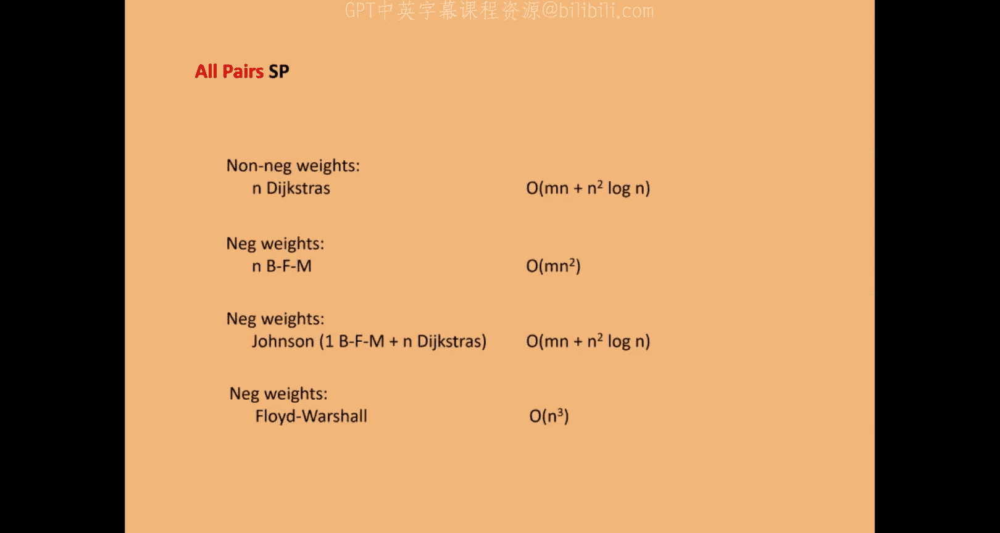

# 03：线性规划与最小树形图

在本节课中，我们将要学习如何运用线性规划理论来分析和证明最小树形图算法的正确性。我们将从回顾线性规划及其对偶理论开始，然后为最小树形图问题构建一个线性规划模型，并利用对偶理论来证明之前所学算法的正确性。最后，我们将简要回顾最短路径问题及其经典算法。

## 线性规划与对偶理论回顾

上一节我们介绍了最小树形图的 Edmonds 算法。本节中，我们来看看如何用线性规划理论来证明该算法的正确性。首先，我们需要回顾线性规划及其对偶的基本概念。

一个线性规划问题通常包含一个线性目标函数和一组线性约束。对于一个最小化问题，我们可以将其写成如下形式：

**最小化** `c^T x`
**满足** `A x ≥ b`
**且** `x ≥ 0`

其中，`c` 是目标函数系数向量，`x` 是决策变量向量，`A` 是约束矩阵，`b` 是约束右侧向量。

对于任何一个线性规划（称为原问题），都存在一个对应的对偶问题。从原问题到对偶问题的转换是机械的：
*   原问题是最小化，对偶问题则是最大化。
*   原问题的每个约束在对偶问题中对应一个变量。
*   原问题的每个变量在对偶问题中对应一个约束。
*   原问题的约束右侧 `b` 成为对偶问题的目标函数系数。
*   原问题的目标函数系数 `c` 成为对偶问题的约束右侧。

具体地，上述原问题的对偶问题为：

**最大化** `b^T y`
**满足** `A^T y ≤ c`
**且** `y ≥ 0`

关于对偶理论，有两个核心定理：
1.  **弱对偶定理**：如果 `x` 是原问题的可行解，`y` 是对偶问题的可行解，那么 `c^T x ≥ b^T y`。这意味着原问题最优值是所有对偶可行解值的上界。
2.  **强对偶定理**：如果原问题和对偶问题都有最优解，那么它们的最优值相等，即 `c^T x* = b^T y*`。

## 最小树形图的线性规划模型

现在，我们为最小树形图问题构建一个整数线性规划模型，然后将其松弛为线性规划。

给定一个有向图 `G=(V, E)`，每条弧 `a ∈ E` 有一个权重 `c_a`，以及一个根节点 `r`。我们希望选择一个弧的集合，构成一棵以 `r` 为根的最小权重树形图。

我们为每条弧 `a` 引入一个决策变量 `x_a`，表示该弧是否被选中（1 表示选中，0 表示不选）。整数规划模型如下：

**最小化** `∑_{a ∈ E} c_a * x_a`
**满足**：
1.  **出度约束**：对于除根 `r` 外的每个顶点 `v`，恰好有一条出弧被选中。
    `∑_{a ∈ δ^+(v)} x_a = 1`， 对于所有 `v ∈ V \ {r}`
2.  **连通性约束**：对于任何不包含根 `r` 的非空顶点子集 `S`，至少有一条从 `S` 外部指向 `S` 内部的弧被选中。
    `∑_{a ∈ δ^+(S)} x_a ≥ 1`， 对于所有 `S ⊆ V \ {r}, S ≠ ∅`
3.  **整数约束**：`x_a ∈ {0, 1}`， 对于所有 `a ∈ E`

为了得到一个线性规划，我们将整数约束松弛为 `x_a ≥ 0`。我们称这个线性规划的最优值为 `LP*`。显然，`LP*` 是原整数规划最优值的一个下界，因为线性规划的解空间更宽松。

接下来，我们写出这个线性规划的对偶问题。原问题有指数级数量的连通性约束，因此对偶问题将有指数级数量的变量 `y_S`，每个变量对应一个不包含根 `r` 的非空集合 `S`。

对偶问题如下：

**最大化** `∑_{S ⊆ V \ {r}, S ≠ ∅} y_S`
**满足**：
对于每条弧 `a = (u, v) ∈ E`，所有被该弧“跨越”的集合 `S`（即 `u ∉ S` 且 `v ∈ S`）对应的 `y_S` 之和不超过该弧的权重。
`∑_{S: u ∉ S, v ∈ S} y_S ≤ c_a`， 对于所有 `a ∈ E`
**且** `y_S ≥ 0`， 对于所有 `S`

## 利用对偶证明算法正确性

我们将通过以下两步来证明 Edmonds 算法的最优性：
1.  算法产生一个原整数规划的可行解（即一个树形图），其权重为 `ALG`。因此，整数规划的最优值 `OPT_IP ≤ ALG`。
2.  我们将根据算法的执行过程，构造一个对偶问题的可行解 `y`，并证明其目标函数值 `∑ y_S` 恰好等于 `ALG`。

根据弱对偶定理，任何对偶可行解的值都是原问题最优值的下界，即 `∑ y_S ≤ LP* ≤ OPT_IP`。结合第一步，我们得到 `ALG = ∑ y_S ≤ LP* ≤ OPT_IP ≤ ALG`。这意味着所有不等式都取等号，因此 `ALG = OPT_IP`，且线性规划与整数规划之间没有间隙（`LP* = OPT_IP`），从而证明了算法的最优性。

现在，我们来看如何构造对偶解 `y`。回顾 Edmonds 算法的过程：
*   算法不断减少从各个顶点出发的弧的权重，直到每个顶点（除根外）都至少有一条权重为 0 的出弧。
*   每次为一个顶点 `v` 减少其所有出弧的权重时，减少的量 `Δ_v` 等于其最小出弧权重。
*   如果这些 0 权重的弧构成了一个环 `C`，算法会将这个环收缩成一个超级顶点，并递归求解。

我们可以将对偶变量 `y_S` 解释为集合 `S` 愿意支付的“价格”或“税款”，以获取连接到根的机会。算法的执行过程自然地定义了对偶解：
*   初始时，所有 `y_S = 0`。
*   当算法为单个顶点 `v` 减少其出弧权重 `Δ_v` 时，我们令 `y_{ {v} } += Δ_v`。这可以理解为顶点 `v` 为了“逃离”自身，愿意支付 `Δ_v`。
*   当算法收缩一个环 `C` 时，我们令 `y_C += Δ_C`，其中 `Δ_C` 是收缩后超级顶点需要减少的出弧权重。这可以理解为环 `C` 中的所有顶点联合起来，共同支付 `Δ_C` 以“逃离”这个环（即连通分量）。

可以证明，这样构造的 `y_S` 满足对偶问题的所有约束。关键观察是：算法始终保证每条弧的“缩减成本”（即原始成本 `c_a` 减去所有包含其终点但不包含其起点的集合 `S` 的 `y_S` 之和）保持非负。这正是对偶约束 `∑_{S: u ∉ S, v ∈ S} y_S ≤ c_a` 所要求的。

因此，我们构造的对偶解是可行的，并且其目标值 `∑ y_S` 等于算法在每一步中减少的权重总和，也就是最终树形图的总权重 `ALG`。这就完成了证明。

## 最短路径问题概述

在证明了最小树形图算法的正确性后，我们转向另一个经典问题：最短路径。最短路径问题有多种变体，我们将主要关注单源最短路径和全源最短路径。

**单源最短路径**：给定一个图（边权可为负，但无负权环）和一个源点 `s`，计算从 `s` 到图中所有其他顶点的最短路径距离。
*   **非负权边**：经典的 Dijkstra 算法可以在 `O(m + n log n)` 时间内解决，其中 `m` 是边数，`n` 是顶点数。
*   **允许负权边**：Bellman-Ford (Shimbel) 算法可以在 `O(mn)` 时间内解决。近年来有突破性进展，出现了 `O(m log^8(n) log W)` 的算法（`W` 为最大边权绝对值）。

**全源最短路径**：计算图中所有顶点对之间的最短路径距离。
*   对于非负权边，可以运行 `n` 次 Dijkstra 算法，总时间为 `O(nm + n^2 log n)`。
*   对于允许负权边的情况，一个巧妙的方法是 **Johnson 算法**。其核心思想是使用 **可行势能**。

## 可行势能与 Johnson 算法

可行势能（或可行价格）是给每个顶点 `v` 分配一个值 `φ(v)`，使得对于每条边 `(u, v)`，其 **缩减权重** `ĉ_{uv} = c_{uv} + φ(u) - φ(v)` 为非负。

关键性质是：在原始权重 `c` 下的最短路径，与在缩减权重 `ĉ` 下的最短路径是相同的（路径序列相同，仅路径长度相差一个只与起点和终点有关的常数）。由于 `ĉ` 非负，我们可以在新图上运行高效的 Dijkstra 算法。

Johnson 算法的步骤如下：
1.  **寻找可行势能**：通过向图中添加一个连接所有顶点的新源点，并运行一次 Bellman-Ford 算法，得到从该源点到各点的最短距离，这些距离即可作为可行势能 `φ(v)`。
2.  **计算缩减权重**：根据 `φ` 计算所有边的 `ĉ_{uv}`。
3.  **运行 n 次 Dijkstra**：对于每个顶点作为源点，在具有非负权重 `ĉ` 的图上运行 Dijkstra 算法，得到缩减权重下的最短路径距离 `d̂(u, v)`。
4.  **还原原始距离**：原始权重下的最短路径距离为 `d(u, v) = d̂(u, v) - φ(u) + φ(v)`。

Johnson 算法的总时间复杂度为 `O(nm + n^2 log n)`，这比在允许负权的图上直接运行 `n` 次 Bellman-Ford 的 `O(n^2 m)` 要高效得多。

## 总结

本节课中我们一起学习了如何运用线性规划和对偶理论来证明组合优化算法（如最小树形图的 Edmonds 算法）的正确性。我们看到了通过构造一个与算法过程紧密相关的对偶可行解，可以优雅地证明算法的最优性，并同时表明该问题的线性规划松弛是紧的（无间隙）。此外，我们还回顾了最短路径问题的基本算法，并介绍了用于全源最短路径的 Johnson 算法及其核心——可行势能的概念。这些工具和思想在高级算法设计中至关重要。