# 06：单源最短路径（续）🚀

在本节课中，我们将学习一篇2022年的前沿论文，它提出了一种针对带负权边（但无负权环）图的单源最短路径（SSSP）新算法。该算法显著优于经典的贝尔曼-福特算法，其运行时间与图中负权边的最小值 `C` 相关。

## 概述

我们处理的是带权有向图 `G = (V, E)`，边权 `w(e)` 可以是负整数，但图中不存在负权环。目标是计算从单一源点 `s` 到所有其他顶点的最短路径距离。

经典的贝尔曼-福特算法运行时间为 `O(mn)`。我们将要学习的算法，其运行时间约为 `m * polylog(m) * C`，其中 `C` 是边权负值部分的一个上界（例如，所有边权 `w(e) >= -C`）。核心思想是通过一系列“归约”步骤，逐步将图的边权调整至非负，从而能够使用更高效的迪杰斯特拉算法。

上一节我们回顾了基础概念，本节中我们来看看这个新算法的核心框架和关键思想。

## 核心概念与预备知识

在深入算法之前，我们需要理解几个核心概念。

### 势能函数（价格函数）

一个势能函数 `φ: V -> R` 为每个顶点分配一个实数值。给定边权 `w`，我们可以定义**归约边权** `w_φ(u->v)`：
```
w_φ(u->v) = w(u->v) + φ(u) - φ(v)
```
我们称势能函数 `φ` 是**可行的**，如果对于所有边 `e`，其归约边权都是非负的，即 `w_φ(e) >= 0`。

**为什么可行势能函数如此重要？**
如果找到了一个可行势能函数 `φ`，那么在新边权 `w_φ` 下，所有边权非负。此时，原图 `G` 中的最短路径结构与新图 `G_φ` 中的完全一致（尽管路径长度可能改变）。因此，我们可以在 `G_φ` 上运行迪杰斯特拉算法来快速求解原问题。

然而，找到一个可行势能函数本身通常就需要计算最短路径，这似乎成了一个“先有鸡还是先有蛋”的循环问题。新算法的巧妙之处就在于**逐步逼近**一个可行势能函数。

### 算法总体框架

算法的总体思路是一个缩放过程：
1.  从原始边权 `w` 开始（满足 `w(e) >= -C`）。
2.  通过某种方法，找到一个势能函数 `φ1`，使得归约后的边权 `w_φ1` 满足 `w_φ1(e) >= -C/2`。这样，边权的“负性”减半了。
3.  将 `w_φ1` 作为新的边权，重复上述过程。经过大约 `log C` 轮后，归约边权的负值将变得非常小（例如 `>= -1/n^2`）。
4.  最后，利用边权为整数的特性，通过一个简单的舍入操作，彻底消除剩余的微小负权，从而得到一个完全非负的图，进而用迪杰斯特拉算法求解。

整个算法的效率取决于**步骤2**：如何将边权的负值上界从 `-C` 降低到 `-C/2`。接下来，我们将聚焦于这一核心步骤，并假设我们要处理的是从 `-2` 到 `-1` 的情况（通过缩放，通用情况可化为此情形）。

## 核心步骤：从 `-2` 到 `-1`

我们的子目标是：给定边权 `w`，满足 `w(e) >= -2`，找到一个势能函数 `φ`，使得归约边权 `w_φ(e) >= -1`。

我们将使用三个关键的算法工具：
1.  **K轮贝尔曼-福特**：用于在最短路径跳数较少的图上快速计算近似距离。
2.  **K轮迪杰斯特拉**：用于处理边权接近非负的图。
3.  **有向图的低直径分解**：这是算法中最关键的一步。

### 第一步：低直径分解

我们首先将每条边的权值加上2，得到新边权 `w+2`。此时，`(w+2)(e) >= 0`，即图 `G` 在 `w+2` 权值下是一个**非负权图**。

我们在非负权图 `G(w+2)` 上运行**有向图低直径分解（LDD）** 算法。该算法随机地删除一部分边，使得剩下的图分裂成若干个强连通分量（SCC），并且每个强连通分量在 `w+2` 权值下的直径（最长最短路径长度）至多为某个参数 `D`。同时，它保证每条边 `e` 被删除的概率至多为 `w+2(e) / D * polylog(n)`。

这个过程的结果是，我们得到了一组强连通分量“团块”，以及三类边：
*   **团块内边（白色边）**：位于各个强连通分量内部。
*   **DAG边（红色边）**：连接不同强连通分量的边。由于强连通分量之间不存在环，这些边自然地形成了一个有向无环图（DAG）结构。
*   **被删除边（黄色边）**：被LDD过程删除的边。

### 第二步：分阶段修复边权

现在，我们回到目标权值 `w+1`（注意，我们的目标是修复 `w`，但等价地可以修复 `w+1` 使其非负）。我们将分三个阶段，为三类边分别找到合适的势能函数。

以下是修复过程的步骤：

**阶段一：修复团块内边（白色边）**
对于每个强连通分量 `C`，我们考虑其对应的子图 `C(w+1)`（权值为 `w+1`）并添加一个超级源点 `s_hat`，`s_hat` 到 `C` 中所有顶点有长度为0的边。我们需要在这个图上计算从 `s_hat` 出发的最短路径，以此作为该分量内顶点的势能值。关键观察是：由于该分量在 `w+2` 权值下直径至多为 `D`，可以证明在 `w+1` 权值下，从 `s_hat` 到分量内任何顶点的最短路径所包含的边数（跳数）也至多为 `O(D)`。因此，我们可以仅运行 `O(D)` 轮贝尔曼-福特算法来高效计算这些距离（势能）。对所有分量并行处理，总时间复杂度约为 `O(mD)`。

**阶段二：修复DAG边（红色边）**
在阶段一之后，白色边的归约权值已经非负。现在我们需要修复连接不同分量的红色边，同时保持白色边的非负性不变。由于红色边构成了一个DAG，我们可以采用一个简单的拓扑排序方法：按照DAG的拓扑顺序处理强连通分量，依次为每个分量设定一个合适的偏移量。具体来说，可以令每个分量的势能值比其前驱分量的势能值高出某个固定值（例如1）。因为红色边在 `w+1` 下的权值至少为 -1，这个简单的偏移量足以保证所有红色边在归约后也变为非负。这一步可以在 `O(m)` 时间内完成。

**阶段三：修复被删除边（黄色边）**
最后，我们需要处理被LDD删除的黄色边。这些边的数量是受控的。回忆LDD的性质：一条边 `e` 被删除的概率约为 `(w+2(e))/D`。对于在 `w+1` 下权值为负的边（即需要修复的边），其 `w+2(e)` 的值很小（在0到1之间）。因此，这类边被删除的期望数量至多为 `O(m/D)`。

由于需要修复的负权边（黄色边）数量很少，我们可以直接在这些边上运行多轮迪杰斯特拉算法来调整势能。假设有 `K` 条这样的边，大约需要 `O(K)` 轮迪杰斯特拉，总成本约为 `O(mK)`。结合期望数量 `O(m/D)`，此阶段期望时间复杂度为 `O(m^2 / D)`。

### 平衡与递归

现在，我们有两个主要的时间开销：
1.  阶段一的贝尔曼-福特：`O(mD)`
2.  阶段三的迪杰斯特拉：`O(m^2 / D)`

通过设置 `D = sqrt(m)`，可以使总时间达到 `O(m^{3/2})`。但这还不够好。

关键的优化在于**递归**！在阶段一，我们不是在每个强连通分量上运行贝尔曼-福特，而是**递归地调用整个算法本身**。也就是说，我们将“修复团块内边”这个子问题，看作是一个新的、规模更小的SSSP问题（并且这些子图的直径上界 `D` 更小）。通过递归，我们可以避免直接使用代价高的贝尔曼-福特。

最终，通过精心设置递归参数和低直径分解的直径阈值，整个算法可以达到近乎线性的运行时间 `m * polylog(n) * polylog(C)`。

## 最终步骤：处理微小负权与总结

经过 `log C` 轮缩放后，我们得到的归约边权满足 `w_φ(e) >= -1/n^2`。此时，图中可能还存在极少数权值非常接近零的负权边。

我们利用边权为整数的初始条件。由于每轮缩放中的运算保持有理数的精确性，最终得到的势能函数 `φ` 和归约边权 `w_φ` 也是有理数。我们可以将所有负权边（其权值在 `(-1/n^2, 0)` 区间）直接置为0。

**为什么这个操作是安全的？**
考虑任意一条路径，修改其上的边权（从微小负值改为0）对路径总长度的改变最多为 `1/n`。由于原始图中所有边权都是整数，任意两条不同路径的长度差至少为1。因此，这个微小的改变不足以让一条非最短路径“超越”原本的最短路径，从而保证了最短路径结构的稳定性。

至此，我们得到了一个所有边权非负的图，只需运行一次迪杰斯特拉算法即可得到最终的最短路径结果。

## 总结

本节课我们一起学习了一个突破性的单源最短路径算法，它巧妙地结合了多种思想：

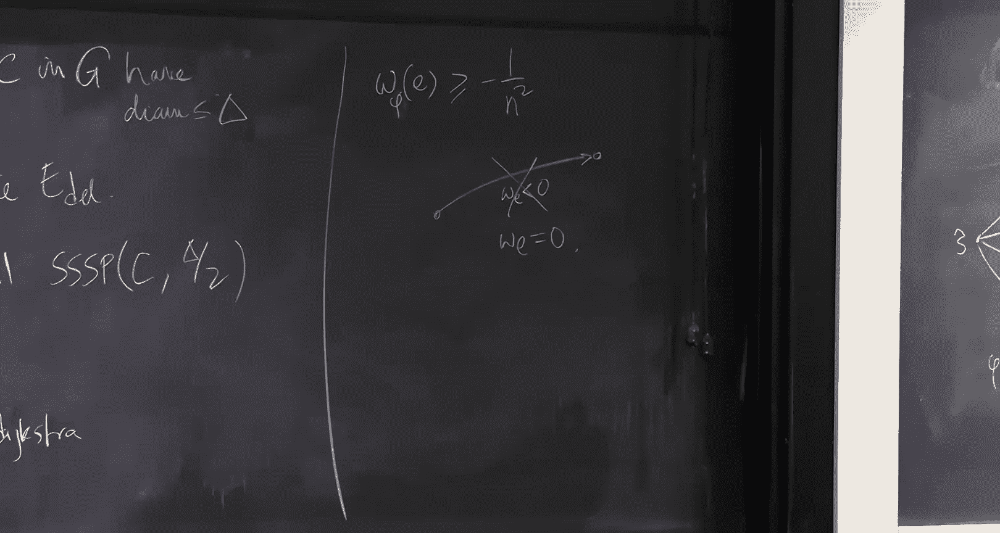

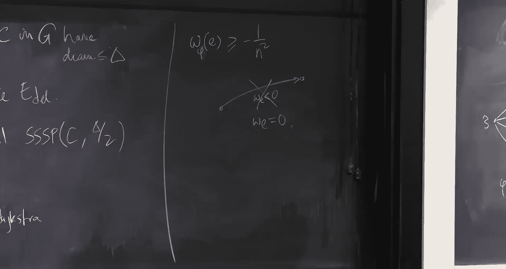

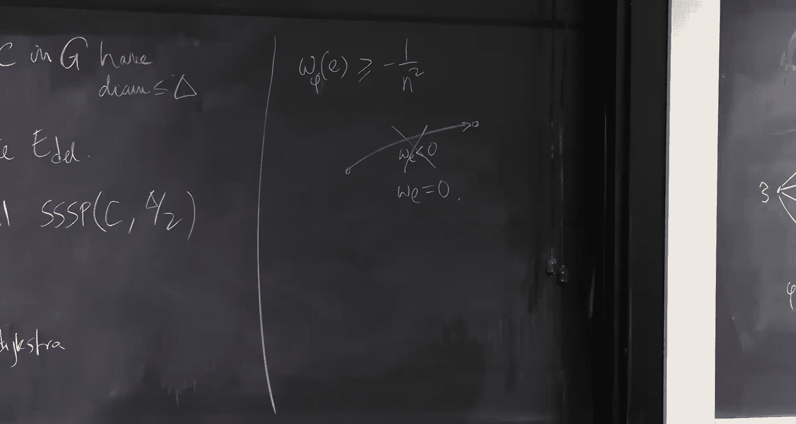


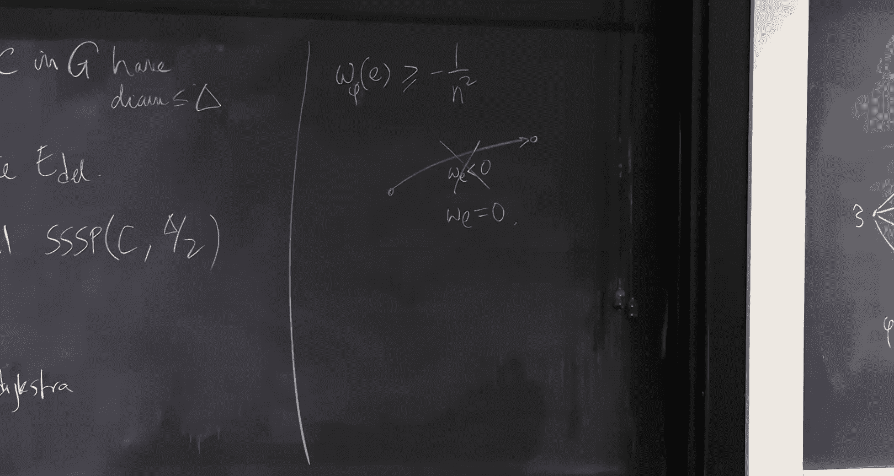

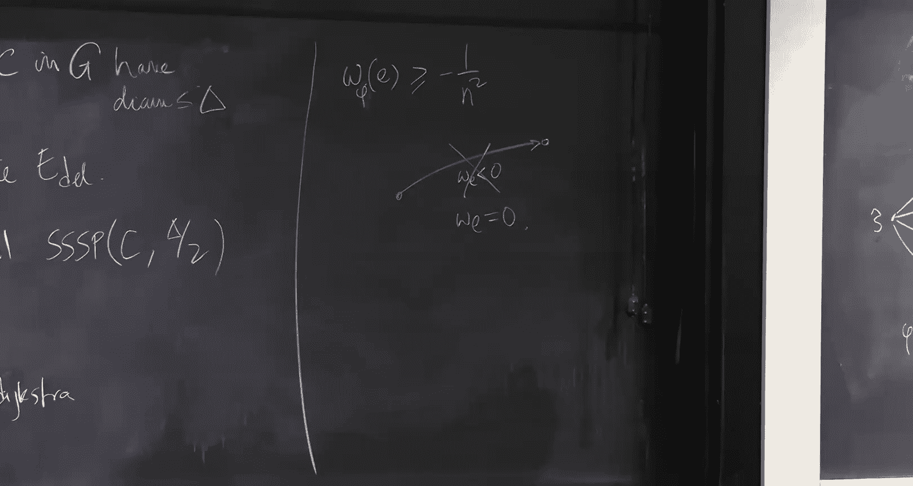

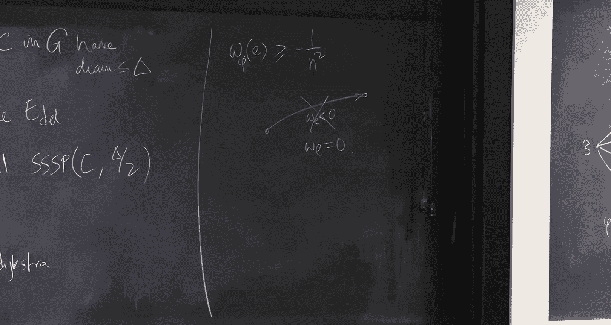


*   **势能函数与缩放**：通过逐步调整势能，将负权图转化为非负权图。
*   **低直径分解**：利用非负权图的性质进行图分解，控制负权边的分布。
*   **分治与递归**：将问题分解到直径更小的子图中递归求解，避免高成本操作。
*   **舍入技巧**：利用整数权值的特性，最终消除微小负权。

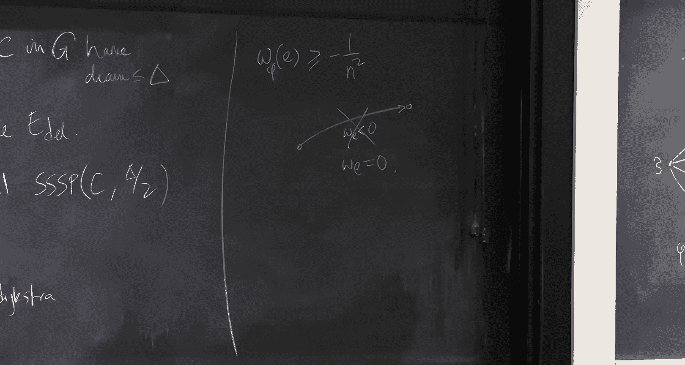


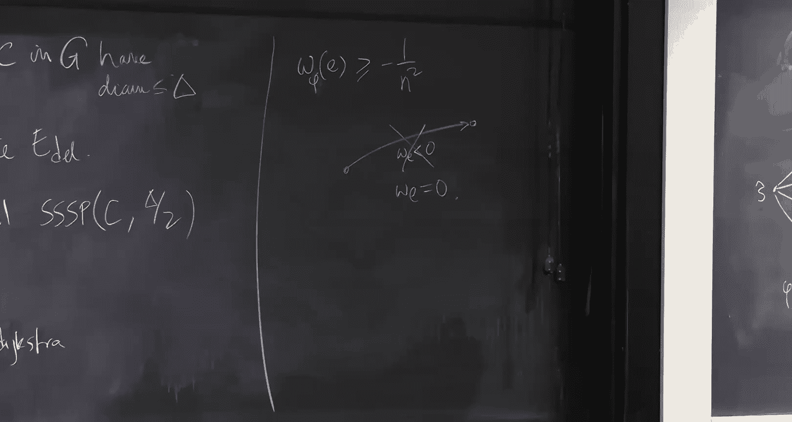

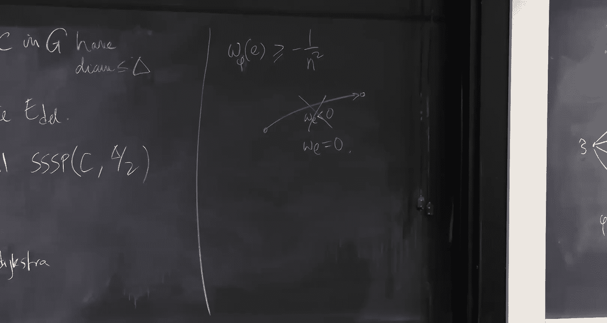


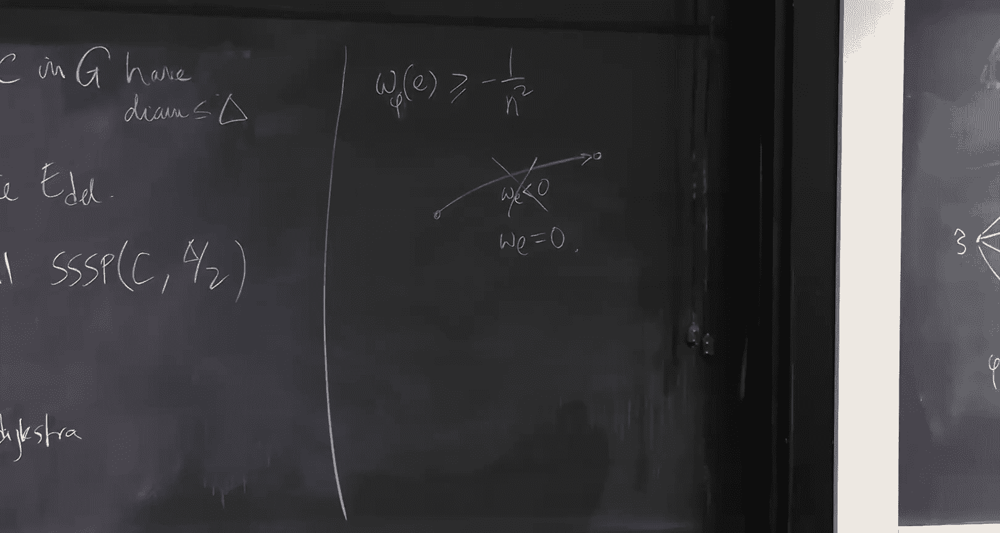

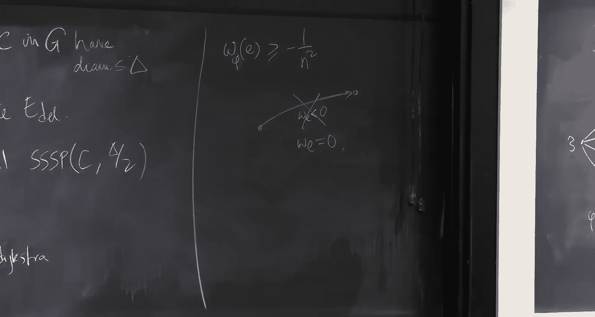

该算法将SSSP在带负权无负环图上的时间复杂度提升到了近乎线性，是算法设计中的一个杰出范例。